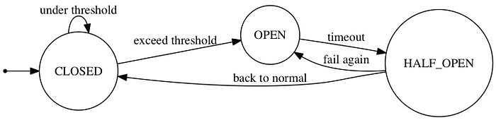
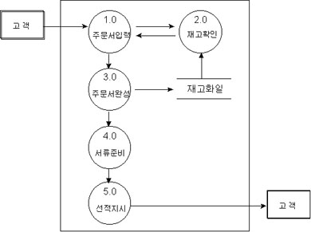

# API Throttling

> https://learn.microsoft.com/en-us/azure/architecture/patterns/throttling

- Throttling
  - Hardware에서 사용될 경우 hardware가 과열되어 손상되는 것을 방지하기 위해 클럭과 전압을 낮추거나 전원을 종료하여 발열을 줄이는 기능을 의미한다.
  - API throttling은 application에 가해지는 traffic의 양을 조절하여 application에 과도한 부하가 가해지는 것을 막는 기법을 의미한다.
    - 이 경우 rate limiting이라고도 불린다.


- 문제
  - Application에 가해지는 부하는 활성 유저수 혹은 수행되는 활동의 유형에 따라 달라진다.
    - 예를 들어 일과 시간이 새벽 시간 보다 활성 유저수가 많을 것이므로 일과 시간에 부하가 더 클 것이다.
    - 또한 매달 말에 비용이 많이 드는 분석을 수행해야 하는 service라면 매달 말에 부하가 커질 것이다.
  - 위 처럼 어느 정도 예측할 수 있는 부하의 변화도 있지만, 때로는 예측할 수 없는 부하의 변화도 있다.
  - 만약 예상치 못한 부하의 증가가 발생할 경우 application은 허용치 보다 많은 부하량을 감당하지 못 해 종료될 수도 있다.


- API Throttling 방식
  - Application이 가용한 자원에 한계를 설정하고, 한계에 도달할 경우 조절하는 방식을 사용한다.
    - 임계치는 시스템의 최대 수용량보다 낮게 설정되어야한다.
    - Application이 얼마만큼의 resource를 사용하는지 monitoring하다가 임계점을 넘어갈 경우 들어오는 request를 조절한다.
    - Request를 조절하는 방법으로는 아래와 같은 것들이 있다.
  - 특정 기간 동안에 n번 이상 API에 접근한 user들이 보내는 request를 거절하는 방법.
    - 사용자별 resource 사용량을 측정해야 가능한 방법이다.
  - 중요하지 않은 service들을 비활성화 하거나 속도를 늦춤으로써 필수적인 service들이 지속적으로 수행될 수 있도록 하는 방법


- Token Bucket Algorithm
  - Throttling에 가장 많이 사용되는 algorithm이다.
    - Token이 들어 있는 bucket에서 token을 하나씩 빼서 사용하는 것이 client가 request를 보낼 때 마다 server에서 token을 하나씩 빼가는 것과 비슷하여 이런 이름이 붙었다.
    - 만약 bucket에 더 이상 token이 남아있지 않으면 token이 다시 채워지기 전까지 throttling을 수행한다.
    - Burst와 refill이라는 개념을 사용한다.
  - Burst
    - Client가 사용할 수 있는 token 수에 해당한다.
    - 매 request마다 token이 소비된다.
  - Refill(Sustain)
    - Bucket에 token을 다시 채우는 것을 의미한다.
    - Refill이 빠르게 이루어질 수록 token이 바닥날 확률도 내려가게 된다.


- Token Bucket Algorithm외에도 아래와 같은 algorithm들이 있다.
  - Leaky Bucket
  - Fixed Window
  - Sliding Window


- Throttling 도입시 고려할 사항
  - Throttling은 신속하게 수행되어야한다.
    - 임계치에 도달하는 즉시 실행되어 시스템의 부하를 조절해야한다.
  - Client에게 요청을 거절할 수 밖에 없는 이유를 잘 설명해야한다.
    - 주로 429, 503 response code를 반환하는 방식으로 이루어진다.
    - 429는 특정 client가 특정 시간 동안 너무 많은 요청을 보낼 경우에 반환한다.
    - 503은 server에서 요청을 처리할 준비가 되지 않았을 때 반환한다.


# Circuit Breaker

> https://martinfowler.com/bliki/CircuitBreaker.html

- Circuit Breaker

  - 원격 접속의  성공/실패를 카운트하여 에러율(failure rate)이 임계치를 넘었을 때 자동적으로 접속을 차단하는 시스템이다.
    - 서비스가 여러 개의 component들고 구성되어 있을 때, 한 component에서 문제가 생길 경우 해당 component에 의존하는 다른 component들에서도 연속적으로 문제가 발생할 수 있다.
    - 이 경우 시스템 전체가 마비될 수 있으며, 어떤 컴포넌트가 에러의 원인인지를 파악하는 것도 쉽지 않다.
    - 따라서 이러한 연쇄적인 에러를 막을 수 있도록 의존하는 컴포넌트에서 에러가 일정 비율 이상으로 발생할 경우 더 이상 해당 컴포넌트에 접속하지 않도록 해야한다.

  - State Machine으로 나타낼 수 있다.

    - 접속 성공과 실패 이벤트가 발생할 때 마다 내부 상태를 업데이트하여 자동적으로 장애를 검출하고 복구 여부를 판단한다.

    - CLOSED: 초기 상태로 모든 접속은 평소와 같이 실행 된다.
    - OPEN: 에러율이 임계치를 넘은 상태로 보든 접속은 차단(fail fast)된다.
    - HALF_OPEN: OPEN 후 일정 시간이 지난 상태로 접속을 시도하여 성공하면 CLOSED, 실패하면 OPEN으로 되돌아간다.

  


- 함수로 구현할 수도 있고, 하나의 component가 될 수 도 있다.
  - 함수로 구현할 경우 주로 decorator를 사용한다.
  - [Python으로 circuit breaker를 구현한 package](https://github.com/fabfuel/circuitbreaker/tree/develop)가 있다.


# Data Flow Diagram(DFD)

> https://cjmyun.tripod.com/Knowledgebase/DFD.htm
>
> https://www.lucidchart.com/pages/data-flow-diagram

- Data Flow Diagram(DFD)
  - DFD는 데이터가 소프트웨어 내의 각 프로세스를 따라 흐르면서 변환되는 모습을 타나내는 그림이다.
    - 데이터 흐름도 혹은 자료 흐름도라고 부르기도 한다.
  - 구조적 방법론과 DFD
    - DFD는 구조적 방법론을 대표하는 diagram이다.
    - 다익스트라가 GOTO 문의 해로움을 들어 구조적 프로그래밍의 개념을 소개하면서 시작된 구조적 방법에서 데이터는 프로세스 사이에 주고 받는 형태로 나타난다.
    - 다만 OOP의 등장으로 프로세스에 따른 데이터의 흐름 보다는 데이터의 분석이 더 중요해지게 되었고, DFD보다는 ERD가 더 널리 사용되게 되었다.


- DFD의 구성 요소

  - 표기법
    - Yourdon and Coad, Gane and Sarson 등의 창작자의 이름을 붙인 다양한 표기법이 있다.
    - 아래는 Yourdon and Coad를 기준으로 설명한다.
    - 이 방식들은 표기법만 다를 뿐 모두 같은 구성 요소(process, data flow, data store, external entity)를 공유한다.
  - Process
    - 입력되는 데이터를 원하는 데이터로 변환하여 출력시키기 위한 과정으로 원과 원 내부의 이름으로 표현한다.
    - 원 안에는 프로세스가 수행하는 일 또는 프로세스를 수행하는 행위자를 기록한다.
    - 프로세스는 항상 새로운 가치를 부가해야한다.
  - Data Flow
    - DFD의 구성 요소들 간의 인터페이스를 나타낸다.
    - 대부분의 경우 process들 사이를 연결하지만 data store로부터의 흐름을 나타내기도 한다.
    - 명칭이 부여되거나 부여되지 않은 화살표로 표시한다.
    - 서로 다른 데이터 흐름에는 동일한 이름을 부여하지 않는다.
  - Data Store
    - 데이터의 저장이나 조회에 반응하는 수동적 객체를 의미한다.
    - 오른쪽에 선이 없는 직사각형으로 표기하며, 직사각형 내부에 저장소의 이름을 기록한다.
  - External Entity
    - 데이터를 생성, 소비함으로써 데이터 흐름도를 주도하는 활성 객체이다.
    - 보통 데이터 흐름도의 경계에 놓이게 되며 DFD 범위 밖에 사각형의 형태로 표시한다.

  


- 작성 규칙
  - 데이터 보존의 원칙
    - 어떤  process의 출력은 반드시 입력 data flow를 사용하여 생성된 것이어야 한다.
    - 즉 입력으로 사과를 받았는데 오렌지 쥬스를 출력해선 안 된다.
  - 최소 데이터 입력의 원칙
    - 어떤 프로세스가 출력 데이터 흐름을 산출하는데 반드시 필요한 최소한의 데이터 흐름만 입력해야 한다.
  - 지속성의 원칙
    - 프로세스는 데이터 흐름이 들어오면 항상 수행이 가능해야한다.
  - 순차처리의 원칙
    - 데이터 흐름을 통해 입력되는 데이터는 반드시 도착하는 순서대로 처리해야 한다.
    - 그러나 데이터 저장소에서 입력되는 데이터는 어떤 순서에 의해 접근해도 무방하다.
  - 영구성의 원칙
    - 데이터 흐름의 처리는 처리된 후 없어지지만 데이터 저장소의 데이터는 아무리 읽어도 없어지지 않는다.
  - 데이터 변환의 원칙
    - 어떤 종류의 프로세스가 DFD 상에 나타나야 하는지를 규정하는 원칙으로, 아래와 같은 경우 DFD에 프로세스를 나타내야한다.
    - 데이터 본질의 변환: 입력 받은 데이터를 다른 데이터로 변환하여 출력하는 경우.
    - 데이터 합성의 변환: 둘 이상의 데이터를 입력받아 이들을 합성하여 하나의 출력으로 변환하는 경우.
    - 데이터 관점의 변환: 입력 데이터가 프로세스의 처리에 따라 각기 다른 data flow를 형성할 경우.
    - 데이터 구성의 변환: 데이터 자체는 동일하지만 데이터의 구성이 변경될 경우.


# MSA와 Event Driven

> https://techblog.woowahan.com/7835/

- MSA에서 Event Driven이 자주 함께 언급되는 이유는 무엇인가?

  - MSA의 핵심 키워드 중 하나인 "느슨한 결합"과 관련이 있다.
    - MSA는 서로 간 느슨한 결합을 가져감으로써 다른 시스템에 대한 의존과 영향도를 줄이고, 각 시스템의 목적에 집중함으로써 강한 응집을 갖는 시스템을 만들 수 있다.
    - 그리고 event driven은 이를 돕는다.
  - 예를 들어 monolithic architecture로 직원들의 출퇴근을 기록하는 서비스가 있다고 가정해보자.
    - 직원이 퇴근하면 근무 기록에 퇴근으로 기록하고, 사내 메신저를 off 상태로 전환한다.

  ```python
  def clock_out(self, employee):
      self.record_clock_out(employee)
      self.messenger.log_off(employee)
  ```

  - 위 서비스를 MSA로 전환하면서 출퇴근 관리와 메신저 관리가 별도의 서비스로 분리하려한다.
    - 문제는 사내 메신저를 off 상태로 전환하는 로직은 직원의 퇴근 로직에 깊게 관여되어 강한 결합을 가지고 있다는 점이다.
  - 해결 방법1. 메신저로 HTTP 통신을 통해 요청을 보낸다.
    - 그러나 여전히 메신저를 호출해야 한다는 의도가 남아있기 때문에 결합이 느슨해졌다고 보기는 어렵다.

  ```python
  def clock_out(self, employee):
      self.record_clock_out(employee)
      self.messenger_client.log_off(employee)
  ```

  - 해결 방법2. 메시징 시스템을 이용하여 메시지를 전송한다.
    - 느슨한 결합을 위해 메시징 시스템을 사용하지만, 메시징 시스템을 사용한다고 항상 느슨한 결합이 형성되는 것은 아니다.
    - 아래 코드는 메신저가 log off라는 행동을 수행할 것으로 기대하고 메시지를 발행한다.
    - 이 경우 메신저에 변경 사항이 생길 경우 아래 코드에서 메신저로 보내는 메시지도 함께 변경될 가능성이 있다.
    - 아래와 같이 메시지를 발행하는 쪽에서 수신자가 구체적으로 수행해야 할 일을 알려주는 경우, 해야 할 일이 변경될 때 메시지 발생자와 수신자 양쪽의 코드가 모두 변경되어야 하기에 높은 결합도가 존재하게 된다.
    - 또한 아래 함수는 여전히 메신저의 비지니스를 알고 있는 논리적 의존관계도 남아있다.
    - 물리적으로는 결합도가 높지 않지만, 개념적으로는 결합도가 높은 상태이다.

  ```python
  def clock_out(self, employee):
      self.clock_out(employee)
      self.event_publisher.log_off_messenger(employee)
  ```

  - 결국 문제는 대상 도메인에게 기대하는 목적을 담은 메시지를 발행하기 때문에 발생한다.
    - 위 코드는 메신저가 log off라는 행동을 수행할 것으로 기대하고 메시지를 발행한다.
    - **메시징 시스템으로 보낸 메시지가 대상 도메인에게 기대하는 목적을 담았다면 이는 이벤트가 아닌 메시징 시스템을 이용한 비동기 요청일 뿐이다.**
  - 따라서 코드를 아래와 같이 변경한다.
    - 출퇴근 관리 서비스는 더 이상 메신저 시스템을 알지 못한다.
    - 메신저 시스템은 퇴근 이벤트를 구독하여 메신저를 off 상태로 전환하는 비지니스 로직을 구현한다.
    - 출퇴근 관리 시스템은 더 이상 메신저 시스템의 변경에 영향을 받지 않는다.

  ```python
  # 출퇴근 관리 시스템
  def clock_out(self, employee):
      self.clock_out(employee)
      self.event_publisher.clock_out(employee)
      
  
  # 메신저 시스템
  def consume_clock_out_event(employee):
      self.log_off(employee)
  ```

  - 메시징 시스템을 이용해 물리적 의존을 제거할 수 있지만, 메시지의 의도에 따라 전혀 다른 결과가 나온다는 것을 알 수 있다.
    - 도메인 이벤트로 인해 달성하려는 목적이 아닌 도메인 이벤트 그 자체를 발행해야한다.


- Event Driven Architecture(Event Driven System, Event Driven Microservice)
  - 특정 서비스에서 다른 서비스가 관심을 가질 수 있는 작업을 수행할 때 해당 서비스는 이벤트를 생성하고, 해당 이벤트를 구독하고 있는 다른 서비스가 이벤트를 받아와 필요한 작업을 수행하는 방식이다.
  - REST와는 달리 이벤트를 통해 요청을 주고 받으므로 각 서비스들은 서로에 대한 세부 정보를 알 필요가 없어 서비스들 간의 결합도가 약해진다는 장점이 있다.


- Zero Payload
  - 최소한의 정보만 담은 event를 만들어서 publish한 후 consume하는 쪽에서 추가적으로 필요한 정보를 API 요청을 통해 받아오는 방식이다.
    - 요구사항이 변경되더라도 event를 재설계할 필요가 없다.
    - Event의 크기가 작아져 데이터 전송량이 줄어든다.
  - 꼭 EDA에서만 사용하는 방식은 아니다.


# 암호화

## AES

- 탄생 배경
  - NIST(National, Institute of Standards and Technology)에서 DES를 대체할 목적으로 더 나은 보안성을 가진 암호 기법을 공모.
    - 기존에 사용하던 DES는  56bit key를 사용했는데, 기술의 발전으로 컴퓨터의 연산 처리 속도가 증가함에 따라 더 이상 안전한 방식이 아니게 되었다.
    - 따라서 NIST는 DES를 대체할 암호화 기법을 공모하게 되었고 해당 기법의 이름을 AES(Advanced Encryption Standard, 고급 암호화 표준)라 이름 붙였다.
  - 벨기에의 암호학자인 존 대먼과 빈센트 라이먼에 의해 개발 된 Rijndael 알고리즘이 선정되었다.


- 특징
  - 암호화 키로 128, 192, 256 비트를 가질 수 있다.
    - 어떤 비트의 키를 사용하느냐에 따라 AES-128, AES-192, AES-256으로 불린다.
  - 암호화 키의 길이에 따라 실행하는 라운드의 수가 다르다.
    - 128bit는 10라운드, 192bit는 12라운드, 256bit는 14라운드를 실행한다.
  - 암호화와 복호화에 사용하는 키가 동일한 대칭키 방식이다.


- AES의 암호화와 복호화에 필요한 것들
  - Key
    - 암호화, 복호화에 동일한 키를 사용하는 대칭키 방식이므로 동일한 키를 사용해야 하며, 다른 키를 사용할 경우 다른 결과가 나오게 된다.
  - IV(Initial Vector)
    - CBC 모드의 경우 암호화, 복호화는 블록 단위로 이루어지고 이전 단계의 블록이 다음 단계의 블록을 암호화, 복호화하는데 사용한다.
    - 그런데 맨 첫 블록은 앞 블록이 존재하지 않으므로 앞 블록의 역할을 해주는 값이 필요한데 이를 초기화 벡터라 부른다.
    - 선택적인 값이지만 CBC 모드를 사용할 경우 반드시 써야 한다.
    - 랜덤하게 생성할 수도 있고, 항상 고정된 값을 사용할 수도 있지만, 고정된 값을 사용할 경우, 암호화된 결과가 항상 동일하므로 랜덤하게 생성하는 것을 권장한다.
  - 패딩
    - 데이터를 특정 크기로 맞추기 위해 그 크기보다 부족한 부분을 채워 넣는 것을 의미한다.
    - `PKCS#5`, `PKCS#7`등의 패딩 표준이 존재한다.
  - 모드
    - 블럭 암호화 순서 및 규칙에 대한 표준
    - CBC, ECB등의 모드가 존재하며, ECB는 안정성이 취약하므로 사용해선 안된다.


- 암호화, 복호화 과정
  - 암호화
    - plain text → plain bytes → encryted bytes → encryted base64 text
  - 복호화
    - 암호화의 역순
  - base64 대신 hex 값을 사용하기도 한다.


- 구현

  - Python의 경우 pycryptodome 라이브러리를 사용한다.
  - 설치

  ```bash
  $ pip install pip install pycryptodome
  ```

  - 코드

    > https://okky.kr/article/999099 참고

    - key값과 iv 값은 bytes 타입이어야 한다.
    - 아래 코드는 256bit 키를 사용하는 AES-256 암호화이다.
    - 모드는 CBC 모드를 사용한다.

  ```python
  from hashlib import sha256
  from base64 import b64decode
  from base64 import b64encode
  
  from Crypto.Cipher import AES
  from Crypto.Random import get_random_bytes
  from Crypto.Util.Padding import pad, unpad
  
  # 사용하고자 하는 key 값을 생성한다.
  password = 'Walter@Model'
  key = sha256(password.encode()).digest()
  print(len(key)*8)	# 256
  iv = bytes(16) # 사용하고자 하는 iv를 넣는다.
  
  def aes_cbc_base64_enc(plain):
      # CBC 모드
      cipher = AES.new(key, AES.MODE_CBC, iv)
      return bytes.decode(b64encode(cipher.encrypt(pad(plain.encode(), 
          AES.block_size))))
  
  def aes_cbc_base64_dec(cipher_text):
      # 복호화 시에도 동일한 모드를 설정한다.
      cipher = AES.new(key, AES.MODE_CBC, iv)
      return bytes.decode(unpad(cipher.decrypt(b64decode(cipher_text)), 
          AES.block_size))
  
  encrypted = aes_cbc_base64_enc('암호화 할 내용')
  decrypted = aes_cbc_base64_dec(encrypted)
  
  print(encrypted)	# SacSPzoPrufC1ULU48VAYnfswyja3xanA3XknKeGwUo=
  print(decrypted)	# 암호화 할 내용
  ```


# Cache Replacement Policies

- Cache Replacement Policy(Cache Replacement Algorithm)
  - Cache는 자주 사용되는 data에 더 빠르게 접근할 수 있게 해줌으로써, 성능을 향상시켜주지만, cache에 활용할 수 있는 영역은 한정되어 있다.
  - 따라서 cache에 저장된 data를 무엇을 기준으로 새로운 data로 교체할 것인지를 정해야 하는데, 이 정책을 정한 것이 cache replacement policy이다.
  - 이 때, 어떤 data를 cache에서 추방할건지 결정하는 algorithm을 eviction altorithm이라 한다.


- Cache를 평가하는 지표들
  - 효율성(Efficiency)
    - Cache에 요청이 들어왔을 때 필요한 정보가 얼마나 자주 cache에 남아 있는가를 의미한다.
    - 일반적으로 cache miss rate으로 평가한다.
  - 처리율(Throughput)
    - Cache가 초당 얼마나 많은 요청을 소화할 수 있는지 나타낸다.
    - QPS(Queries Per Seconds)라는 단위로 표현한다.
  - 확장성(Scalaility)
    - Cache에 동시에 접근할 때 Cache의 성능인 QPS가 얼마나 증가하는지를 가지고 상대적인 확장성의 높낮이를 비교할 수 있다.
  - 플래시 친화성(Flash Friendly)
    - Cache가 얼마나 flash에 친화적인지를 나타낸다.
    - Flash의 경우 쓰기 횟수가 제한되어 있고, random access가 쓰기 증폭을 유발하기도하여 자칫하면 flash의 수명을 줄일 수 있다.
  - 단순함(Simplicity)
    - Cache가 얼마나 쉽게 구현되어 있는지를 나타낸다.
    - 구현이 간단할수록 유지보수가 쉬워진다.


- Random Replacement Policy

  - 무선적으로 기존에 cache에 저장된 data를 교체한다.

  - 예시

  | Timer           | 0    | 1    | 2    | 3    | 4                                | 5                                | 6                                  | 7                                  | 8                                |
  | --------------- | ---- | ---- | ---- | ---- | -------------------------------- | -------------------------------- | ---------------------------------- | ---------------------------------- | -------------------------------- |
  | Access Sequence | 2    | 3    | 4    | 7    | 6                                | 3                                | 4                                  | 7                                  | 5                                |
  | Frame1          | 2    | 2    | 2    | 2    | 2                                | <span style="color:red">3</span> | 3                                  | 3                                  | 3                                |
  | Frame2          |      | 3    | 3    | 3    | <span style="color:red">6</span> | 6                                | 6                                  | 6                                  | 6                                |
  | Frame3          |      |      | 4    | 4    | 4                                | 4                                | <span style="color:green">4</span> | 4                                  | 4                                |
  | Frame4          |      |      |      | 7    | 7                                | 7                                | 7                                  | <span style="color:green">7</span> | <span style="color:red">5</span> |


- First in, First out(FIFO)

  - 가장 오래된(가장 먼처 추가된) data부터 순차적으로 교체한다.
    - Queue 기반의 정책이다.
    - 가장 오래 변경되지 않은 frame이 무엇인지에 대한 정보를 추적해야한다.

  - 예시

  | Timer           | 0    | 1    | 2    | 3    | 4                                | 5                                  | 6                                  | 7                                  | 8                                |
  | --------------- | ---- | ---- | ---- | ---- | -------------------------------- | ---------------------------------- | ---------------------------------- | ---------------------------------- | -------------------------------- |
  | Access Sequence | 2    | 3    | 4    | 7    | 6                                | 3                                  | 4                                  | 7                                  | 5                                |
  | Frame1          | 2    | 2    | 2    | 2    | <span style="color:red">6</span> | 6                                  | 6                                  | 6                                  | 6                                |
  | Frame2          |      | 3    | 3    | 3    | 3                                | <span style="color:green">3</span> | 3                                  | 3                                  | <span style="color:red">5</span> |
  | Frame3          |      |      | 4    | 4    | 4                                | 4                                  | <span style="color:green">4</span> | 4                                  | 4                                |
  | Frame4          |      |      |      | 7    | 7                                | 7                                  | 7                                  | <span style="color:green">7</span> | 7                                |


- Beledy's Anomaly

  - FIFIO policy를 사용할 때, cache size를 늘리면 오히려 cache hit가 떨어지는 현상을 의미한다.
  - 예를 들어, 아래와 같은 상황이 있다고 가정해보자.
    - PF(Page Fault)는 cache miss를 의미하고, X는 cache hit를 의미한다.

  | Timer           | 0    | 1    | 2    | 3                                | 4                                | 5                                | 6                                | 7                                  | 8                                  | 9                                | 10                               | 11                                 |
  | --------------- | ---- | ---- | ---- | -------------------------------- | -------------------------------- | -------------------------------- | -------------------------------- | ---------------------------------- | ---------------------------------- | -------------------------------- | -------------------------------- | ---------------------------------- |
  | Access Sequence | 1    | 2    | 3    | 4                                | 1                                | 2                                | 5                                | 1                                  | 2                                  | 3                                | 4                                | 5                                  |
  | Frame1          | 1    | 1    | 1    | <span style="color:red">4</span> | 4                                | 4                                | <span style="color:red">5</span> | 5                                  | 5                                  | 5                                | 5                                | <span style="color:green">5</span> |
  | Frame2          |      | 2    | 2    | 2                                | <span style="color:red">1</span> | 1                                | 1                                | <span style="color:green">1</span> | 1                                  | <span style="color:red">3</span> | 3                                | 3                                  |
  | Frame3          |      |      | 3    | 3                                | 3                                | <span style="color:red">2</span> | 2                                | 2                                  | <span style="color:green">2</span> | 2                                | <span style="color:red">4</span> | 4                                  |
  | Result          | PF   | PF   | PF   | PF                               | PF                               | PF                               | PF                               | X                                  | X                                  | PF                               | PF                               | X                                  |

  - 이 때 cache의 크기를 늘리면, 오히려 cache miss가 증가할 수 있다.
    - 동일한 순서로 입력이 들어왔으나, cache miss는 오히려 증가한 것을 확인할 수 있다.

  | Timer           | 0    | 1    | 2    | 3    | 4                                  | 5                                  | 6                                | 7                                | 8                                | 9                                | 10                               | 11                               |
  | --------------- | ---- | ---- | ---- | ---- | ---------------------------------- | ---------------------------------- | -------------------------------- | -------------------------------- | -------------------------------- | -------------------------------- | -------------------------------- | -------------------------------- |
  | Access Sequence | 1    | 2    | 3    | 4    | 1                                  | 2                                  | 5                                | 1                                | 2                                | 3                                | 4                                | 5                                |
  | Frame1          | 1    | 1    | 1    | 1    | <span style="color:green">1</span> | 1                                  | <span style="color:red">5</span> | 5                                | 5                                | 5                                | <span style="color:red">4</span> | 4                                |
  | Frame2          |      | 2    | 2    | 2    | 2                                  | <span style="color:green">2</span> | 2                                | <span style="color:red">1</span> | 1                                | 1                                | 1                                | <span style="color:red">5</span> |
  | Frame3          |      |      | 3    | 3    | 3                                  | 3                                  | 3                                | 3                                | <span style="color:red">2</span> | 2                                | 2                                | 2                                |
  | Frame4          |      |      |      | 4    | 4                                  | 4                                  | 4                                | 4                                | 4                                | <span style="color:red">3</span> | 3                                | 3                                |
  | Result          | PF   | PF   | PF   | PF   | X                                  | X                                  | PF                               | PF                               | PF                               | PF                               | PF                               | PF                               |

  - 위와 같은 현상이 발생하는 이유
    - Cache에서 교체할 data를 선택할 때 우선순위를 고려하지 않아서 발생한다.
    - 이런 현상은 아래에서 살펴볼 LRU에서는 발생하지 않는다.


- Least Recently Used(LRU)

  - 가장 오랫동안 사용되지 않은 data부터 순차적으로 교체한다.
    - Recency-based policy 중 하나이다.
    - Access 내역을 추적해야한다.

  - 예시

  | Timer           | 0    | 1    | 2    | 3                                  | 4    | 5                                | 6                                | 7                                | 8                                  | 9                                |
  | --------------- | ---- | ---- | ---- | ---------------------------------- | ---- | -------------------------------- | -------------------------------- | -------------------------------- | ---------------------------------- | -------------------------------- |
  | Access Sequence | 2    | 3    | 4    | 2                                  | 7    | 6                                | 3                                | 4                                | 7                                  | 5                                |
  | Frame1          | 2    | 2    | 2    | <span style="color:green">2</span> | 2    | 2                                | 2                                | <span style="color:red">4</span> | 4                                  | 4                                |
  | Frame2          |      | 3    | 3    | 3                                  | 3    | <span style="color:red">6</span> | 6                                | 6                                | 6                                  | <span style="color:red">5</span> |
  | Frame3          |      |      | 4    | 4                                  | 4    | 4                                | <span style="color:red">3</span> | 3                                | 3                                  | 3                                |
  | Frame4          |      |      |      |                                    | 7    | 7                                | 7                                | 7                                | <span style="color:green">7</span> | 7                                |

  - Request workload는 최근 데이터에 더 자주 접근한다는 temporal locality 성징을 가지고 있어 LRU가 많이 사용되고 있다.
  - 일반적으로 doubly linked list를 사용하여 구현된다.


- Least Frequently Used(LFU)

  - 가장 적게 사용된 data부터 순차적으로 교체한다.
    - Frequency-based policy 중 하나이다.
    - Access 빈도를 추적해야한다.

  - 예시

  | Timer           | 0    | 1    | 2    | 3                                  | 4                                | 5                                  | 6                                | 7                                | 8                                | 9                                |
  | --------------- | ---- | ---- | ---- | ---------------------------------- | -------------------------------- | ---------------------------------- | -------------------------------- | -------------------------------- | -------------------------------- | -------------------------------- |
  | Access Sequence | 3    | 5    | 6    | 6                                  | 1                                | 1                                  | 4                                | 2                                | 3                                | 4                                |
  | Frame1          | 3    | 3    | 3    | 3                                  | <span style="color:red">1</span> | <span style="color:green">1</span> | 1                                | 1                                | 1                                | 1                                |
  | Frame2          |      | 5    | 5    | 5                                  | 5                                | 5                                  | <span style="color:red">4</span> | <span style="color:red">2</span> | <span style="color:red">3</span> | <span style="color:red">4</span> |
  | Frame3          |      |      | 6    | <span style="color:green">6</span> | 6                                | 6                                  | 6                                | 6                                | 6                                | 6                                |


- Python으로 LRU cache 구현

  > 아래 코드는 단순화한 예시일뿐, 실제 사용하기에는 제약이 있다.
  >
  > 실사용이 가능하려면, cache hit 발생시 해당 객체에 lock을 거는 과정이 있어야한다.

  - 일반적으로 doubly linked list와 hash map을 사용하여 구현한다.
    - Hash map을 사용하는 이유는 빠른 조회를 위해 사용하며, key를 기반으로 cache에 저장된 data를 O(1)에 찾을 수 있다.
    - Doubly linked list를 사용하는 이유는 맨 앞이나 맨 뒤에 data를 추가할 때 O(1)의 시간복잡도로 처리가 가능하기 때문이다.
    - LRU cache에서 data를 관리하는데 필요한 연산은 양 끝의 data 추가 및 삭제, 위치를 알고 있는 data의 삭제 인데, doubly linked list는 이 모든 연산을 O(1)에 처리가 가능하다.

  ```python
  class Node:
      def __init__(self, key=None, value=None):
          self.key = key
          self.value = value
          self.prev: Node = None
          self.next: Node = None
  
  
  class DoublyLinkedList:
      def __init__(self):
          self.head = Node()
          self.tail = Node()
          self.head.next = self.tail
          self.tail.prev = self.head
  
      def add_to_front(self, node: Node):
          node.next = self.head.next
          node.prev = self.head
          self.head.next.prev = node
          self.head.next = node
  
      def remove(self, node: Node):
          prev = node.prev
          next = node.next
          prev.next = next
          next.prev = prev
  
      def move_to_front(self, node):
          self.remove(node)
          self.add_to_front(node)
  
      def remove_last(self):
          if self.tail.prev == self.head:
              return None
          last_node = self.tail.prev
          self.remove(last_node)
          return last_node
  
  
  class LRUCache:
      def __init__(self, capacity: int):
          self.capacity = capacity
          self._hash_map = {}
          self._doubly_linked_list = DoublyLinkedList()
  
      def get(self, key: int) -> int:
          if key in self._hash_map:
              node = self._hash_map[key]
              self._doubly_linked_list.remove(node)
              self._doubly_linked_list.add_to_front(node)
              return node.value
          return -1
  
      def put(self, key: int, value: int):
          if key in self._hash_map:
              node = self._hash_map[key]
              self._doubly_linked_list.remove(node)
          elif len(self._hash_map) >= self.capacity:
              lru_node = self._doubly_linked_list.remove_last()
              if lru_node:
                  del self._hash_map[lru_node.key]
  
          new_node = Node(key, value)
          self._hash_map[key] = new_node
          self._doubly_linked_list.add_to_front(new_node)
  ```

    - `collections.OrderedDict` class를 사용하여 보다 간단하게 구현이 가능하다.

  ```python
  from collections import OrderedDict
  
  
  class LRUCache:
  
      def __init__(self, capacity: int):
          self._capacity = capacity
          self._cache = OrderedDict()
          
      def get(self, key: int) -> int:
          value = self._cache.get(key)
          if value is None:
              value = -1
          else:
              self._cache.move_to_end(key)
          return value
      
      def put(self, key: int, value: int) -> None:
          self._cache[key] = value
          self._cache.move_to_end(key)
          if len(self._cache) > self._capacity:
              self._cache.popitem(last=False)
  ```

    - Python 3.6부터는 dictionary도 순서가 보장되어, dictionary를 사용해도 구현은 가능하다.

  ```python
  class LRUCache:
  
      def __init__(self, capacity: int):
          self._capacity = capacity
          self._cache = {}
          
      def get(self, key: int) -> int:
          value = self._cache.get(key)
          if value is None:
              value = -1
          else:
              self._cache[key] = self._cache.pop(key)
          return value
      
      def put(self, key: int, value: int) -> None:
          if self._cache.get(key):
              self._cache[key] = self._cache.pop(key)
          self._cache[key] = value
          
          if len(self._cache) > self._capacity:
              self._cache.pop(next(iter(self._cache)))
  ```

    - Python의 `functools` package에는 `lru_cache`라는 decorator가 있다.
      - 특정 함수에 LRU cache를 적용해주는 decorator이다.
      - Python 3.9에서는 `cache` decorator도 추가되었는데, 이 역시 `lru_cache`를 사용한다.
      - 다만 `cache`의 경우 `lru_cache`의 `maxsize` parameter를 None으로 설정하여 제한 없이 사용할 수 있게 해준다.
      - 아래는 `functools.cache`의 전체 코드이다.

  ```python
  def cache(user_function, /):
      'Simple lightweight unbounded cache.  Sometimes called "memoize".'
      return lru_cache(maxsize=None)(user_function)
  ```


- `functools`의 cache

  - `cache`
    - Python 3.9에 추가된 cache이다.
    - Python 3.9 이전에도 `functools.lru_cache`를 사용할 수 있었다.
    - 다만 `cache`의 경우 `lru_cache`의 `maxsize` parameter를 None으로 설정하여 제한 없이 사용할 수 있게 해준다.
    - 아래는 `functools.cache`의 전체 코드이다.

  ```python
  def cache(user_function, /):
      'Simple lightweight unbounded cache.  Sometimes called "memoize".'
      return lru_cache(maxsize=None)(user_function)
  ```

  - `@cache` decorator를 사용하면 함수에 전달된 인자를 key로, 그 반환 값을 value로 caching한다.
    - 아래 코드를 실행하면, 이전에 처리한 적 있는 `num` 인자가 들어올 경우 함수를 실행하지 않고 바로 값을 반환하는 것을 확인할 수 있다.

  ```python
  from functools import cache
  
  @cache
  def double(num: int):
      print("running, num:", num)
      return num * 2
  
  double(1)
  double(2)
  double(3)
  double(1)
  double(1)
  ```

  - `@cache` decorator가 달린 함수의 `cache_info()` method를 통해 cache를 모니터링할 수 있다.
    - `@lru_cache`도 마찬가지다.

  ```python
  from functools import cache
  
  @cache
  def fibo(n):
      if n < 2:
          return n
      return fibo(n-1) + fibo(n-2)
  
  fibo(10)
  print(fibo.cache_info())	# CacheInfo(hits=8, misses=11, maxsize=None, currsize=11)
  ```

  - `cache_clear()` method를 통해 caching된 data를 삭제하는 것도 가능하다.

  ```python
  from functools import cache
  
  @cache
  def fibo(n):
      if n < 2:
          return n
      return fibo(n-1) + fibo(n-2)
  
  fibo(10)
  print(fibo.cache_info())	# CacheInfo(hits=8, misses=11, maxsize=None, currsize=11)
  fibo.cache_clear()
  print(fibo.cache_info())	# CacheInfo(hits=0, misses=0, maxsize=None, currsize=0)
  ```

  - `@cache` 사용시 주의 사항
    - 앞에서 말했듯 `cache`는 `maxsize`에 제한을 두지 않은 `lru_cache`와 동일하다.
    - 따라서 caching할 수 있는 data의 양에 제한이 없고, caching된 data들은 application이 종료되기 전까지는 사라지지 않는다.
    - 만약 매우 많은 양의 data가 caching될 것으로 예상되는 상황이라면, `cache` 대신 `lru_cache`를 사용해야 한다.

  - `cached_property`
    - `@property` decorator는 조회가 발생할 때마다 매 번 method를 실행하여 그 결과를 반환한다면, `cached_property`는 최초 실행시에만 method를 실행하고, 이후에는 저장된 결과를 반환한다.
    - Python 3.8에 추가된 기능이다.
    - 아래 코드를 실행해보면 `name`은 호출시마다 실행되는데 반해, `cached_name`은 최초 호출시에만 실행되고, 이후부터는 실행되지 않는 것을 확인할 수 있다.
    - 또한 쓰기 연산이 불가능한 `property`와 달리, `cached_property`로 선언한 property는 쓰기 연산이 가능하다.

  ```python
  from functools import cached_property
  
  
  class Person:
      def __init__(self, name):
          self._name = name
  
      @property
      def name(self):
          print("running")
          return self._name
      
      @cached_property
      def cached_name(self):
          print("running?")
          return self._name
  
  
  person = Person("John")
  person.name
  person.name
  person.cached_name
  person.cached_name
  # 쓰기 연산이 가능하다.
  person.cached_name = "Tom"
  ```


- S3-FIFO(Simple and Scalable caching with three Static FIFO queue)

  > [어떤 캐시가 일을 더 잘합니까? — FIFO가 LRU보다 낫습니다요](https://medium.com/rate-labs/%EC%96%B4%EB%96%A4-%EC%86%8C%EA%B0%80-%EC%9D%BC%EC%9D%84-%EB%8D%94-%EC%9E%98%ED%95%A9%EB%8B%88%EA%B9%8C-fifo%EA%B0%80-lru%EB%B3%B4%EB%8B%A4-%EB%82%AB%EC%8A%B5%EB%8B%88%EB%8B%A4%EC%9A%94-1a49b9060ce4)
  >
  > https://blog.jasony.me/system/cache/2023/08/01/s3fifo
  >
  > https://s3fifo.com/

  - Juncheng Yang이 자신의 논문에서 제안한 새로운 cache replacement policy이다.
  - Juncheng Yang은 LRU 방식에 아래와 같은 세 가지 문제가 있다고 주장한다.
    - 일반적으로 LRU 구현에 doubly linked list를 사용하는데, 이는 cache 객체당 2개의 pointer(이전 node와 다음 node를 가리키는 pointer)를 요구한다. 이로 인해 cache 객체의 개수가 많을수록 overhead가 유발된다.
    - LRU는 cache hit가 발생하면 object에 lock을 걸고 해당 객체를 list의 head로 promoting해야 한다(즉, list의 맨 앞으로 옮겨야 한다). 이 과정에서 최소 6번의 random access가 발생한다.
    - LRU는 object 축출(eviction) 순서가 정렬되어 있지 않기 때문에 random access를 유발한다.
  - One-hit-wonder
    - 요청 sequence에 한 번만 등장하는 object의 비율을 의미한다.
    - 일반적으로 sequence의 길이가 짧아질수록 one-hit-wonder의 비율이 증가한다.
    - 예를 들어 아래 예시에서 sequence를 1~17로 잡으면 one-hit-wonder는 5개의 전체 request(A, B, C, D, E)중 E뿐으로 one-hit-wonder의 비율이 20%이다.
    - 그러나 1~4로 잡으면 one-hit-wonder는 3개의 전체 request(A, B, C) 중 B, C의 2개로 one-hit-wonder의 비율이 67%가 된다.

  | time    | 1    | 2    | 3    | 4    | 5    | 6    | 7    | 8    | 9    | 10   | 11   | 12   | 13   | 14   | 15   | 16   | 17   |
  | ------- | ---- | ---- | ---- | ---- | ---- | ---- | ---- | ---- | ---- | ---- | ---- | ---- | ---- | ---- | ---- | ---- | ---- |
  | request | A    | B    | A    | C    | B    | A    | D    | A    | B    | C    | B    | A    | E    | C    | A    | B    | D    |

    - S3-FIFO의 주 목적은 one-hit-wonder의 비율을 낮추는 것이다.

      - One-hit-wonder들을 제거할 수 있다면, cache에 불필요하게 저장되는 object들의 개수를 줄일 수 있다.
      - 빠른 강등(quick demotion): 자리만 차지하고 쓸모 없는 객체들을 빠르게 cache에서 밀어내는 것을 의미한다.

        - S3-FIFO는 세 개의 queue를 사용한다.
          - Small queue: 전체 cache 크기의 10%를 차지하는 queue
          - Main queue: 전체 cache의 90%를 차지하는 queue
          - Ghost queue: main queue와 동일한 수의 data가 없는 항목들(ghost 항목)을 저장하며, ghost queue에서 요청이 발견된다 하더라도, ghost queue에는 data가 저장되지 않으므로 cache hit로 간주되지 않는다.

    - 읽기 연산
      - 각 object마다 2bits를 사용하여 빈도수 정보를 기록한다.
        - Cache hit가 발생할 때마다 빈도수가 1씩 증가하며, 빈도수의 최대 값은 3이다.
        - 아래는 읽기 연산의 pseudo code이다.

  ```pseudocode
  function READ(x)
  	if x in S or x in M then // Cache Hit
          x.freq = min(x.freq + 1, 3)
      else // Cache Miss
      	INSERT(x)
          x.freq=0
      end if
  end function
  ```

    - 쓰기 연산
      - 새로운 object는 먼저 G에 해당 object가 있는지 확인한 후 있으면 M에 삽입되고, 없으면 S에 삽입된다.

  ```pseudocode
  function INSERT(x)
  	while cache is full do
      	EVICT()
      end while
      if x in G then
      	insert x to head of M
      else
      	insert x to head of S
      end if
  end function
  ```

    - 축출 연산
      - 만약 S가 가득 찬 경우 S가 가장 먼저 들어온 객체부터 아래 조건에 따라 M또는 G로 이동시킨다.
      - 만약 객체가 두 번 이상 접근 됐을 경우 M으로 이동시키고, 그렇지 않을 경우 G로 이동시킨다. 어느 곳으로 이동하던지, 이 때 객체의 빈도수는 초기화된다.
      - G가 가득 찬 경우, FIFO 순서에 따라 객체를 제거한다.
      - M이 가득 찬 경우 freq 변수가 0인 object만 제거하며, 만약 0이 아닐 경우 빈도수 값을 1 감소시킨 후 M의 맨 앞에 다시 삽입한다.

  ```pseudocode
  function EVICT()
  	if S.size >= 0.1 * cache size then
      	EVICTS()
      else
      	EVICTM()
      end if
  end function
  
  function EVICTS()
  	evicted ← False
      while not evicted and S.size > 0 do
      	t ← tail of S
          if t.freq > 1 then
          	insert t to M
              if M is full then
              	EVICTM()
              end if
          else
          	insert t to G
              evicted ← true
          end if
          remove t from S
      end while
  end function
  
  function EVICTM()
  	evicted ← false
  	while not evicted and M.size > 0 do
  		t ← tail of M
  		if t.freq > 0 then
  			insert t to head of M
  			t.freq ← t.freq-1
  		else
  			remove t from M
  			evicted ← true
  		end if
  	end while
  end function
  ```

    - 연산 비용

      - Cache miss가 발생할 경우 S 또는 M에서 cache 축출이 발생한다.
      - 만약 S에서 축출이 발생할 경우 queue의 tail object를 M 또는 G로 이동시키는 연산이 실행된다.
      - 또한 M에서 축출이 발생할 경우 tail object의 freq 변수를 확인하여, 축출 또는 head로 promoting하는 연산이 실행된다.
      - Head로 promoting하는 과정은 while문에 포함되어 있는데, 논문 저자들은 이게 실제로 발생하는 경우가 cache hit 보다 현저히 적어 이 정도 overhead는 무시해도 된다고 주장한다.

      - G는 객체의 고유 ID만을 저장하기에 전체 cache 크기 중 극히 일부만을 차지하며, 꼭 queue일 필요는 없고, bucket hash table 같은 자료 구조를 사용해도 된다.
      - 모든 연산이 lock-free 자료구조를 이용하면 lock을 설정하지 않아도 thread-safe하게 구현이 가능하며, 따라서 LRU보다 성능이 좋아질 수 있다.

        - 성능

          - 논문의 저자가 직접 테스트한 결과에 따르면 다른 cache algorithm보다 cache miss의 비율이 낮아 효율성이 뛰어나다.
          - 또한 S3-FIFO의 경우 small queue와 ghost queue를 memory에 배치하고, main queue를 SSD에 배치하면, 플래시 친화성을 높을 수 있다.
          - 또한 LRU의 경우 lock을 설정해야하기에 thread 개수를 증가로 인한 성능 향상을 기대하기 어려운데 반해, S3-FIFO의 경우 lock-free queue를 사용하기에 thread 개수 증가로 인한 성능 향상을 기대할 수 있다(즉, 확장성이 높다).

    - Python 구현

      > https://github.com/cacheMon/py-cachemonCache에 논문 저자인 Juncheng Yang이 S3-FIFO를 Python으로 구현한 코드가 있다.

      - 기본적으로 Python은 GIL로 인해 global lock이 걸리므로, lock-free한 자료구조가 없다.
      - 따라서 저자가 이야기한 것과는 달리 thread의 개수를 증가시키더라도 성능 향상을 기대할 수 없다.
      - 따라서 위 코드는 S3-FIFO를 완벽히 구현한 것은 아니라는 것에 주의해야한다.


# Shorts

- Type system

  - 모든 프로그래밍 언어는 어떤 category에 속한 object가 어떤 작업을 할 수 있고, 어떤 category가 어떻게 처리될지를 형식화하는 type system을 가지고 있다.
  - Dynamic Typing
    - Type checking을 run time에 수행하고, 변수의 type이 변경되는 것을 허용하는 방식을 말한다.
    - 대표적으로 Python이 있는데, 아래 코드는 절대 error가 발생하지 않는다.

  ```python
  # 1과 "foo"를 더하는 것은 불가능하지만, 해당 코드는 실행되지 않으므로 에러가 발생하지 않는다.
  if False:
      1 + "foo"
  ```

  - Static Typing
    - Type checking을 compile time에 수행하고, 일반적으로 변수의 type 변경이 불가능하다.
    - 대표적으로는 Java가 있는데, 아래 코드는 compile time에 error가 발생한다.

  ```java
  String foo;
  foo = 1;
  ```


- duck typing

  > if it walks like a duck and it quacks like a duck, then it must be a duck
  >
  > 만일 어떤 것이 오리 처럼 걷고 오리처럼 꽥꽥거린다면, 그것은 오리일 것이다.

  - Duck test에서 개념을 따 왔다.
  - 동적 타이핑 언어 및 다형성과 관련된 개념이다.
  - 객체의 type보다 해당 객체에 정의되어 있는 method 혹은 attribute가 더 중요하다는 개념이다.
    - 객체에 이미 존재하는 메서드를 호출하기 위해, 객체가 해당 메서드를 갖는 타입인지 확인하지 말고, 해당 메서드를 가지고 있다면 해당 타입으로 간주하라는 것이다.

  - 예시

  ```python
  class Duck:
      def fly(self):
          print("fly with wings")
  
          
  class Plane:
      def fly(self):
          print("fly with fuel")
          
          
  class Ostrich:
      def walk(self):
          print("walking")
  
          
  def fly_duck(duck):
      duck.fly()
  
  # Ostrich는 fly라는 메서드를 가지고 있지 않기에 error가 발생한다.
  for obj in [Duck(), Plane(), Ostrich()]:
      obj.fly()
  ```

  - 코드가 특정 type에 강하게 결합되지 않게 해준다는 장점이 있지만, 문제가 생길 경우 디버깅이 어려워진다는 단점이 있다.
  - Duck typing 덕분에 Python에서는 interface를 구현해야 하는 번거로움이 많이 줄어들었다.
    - Interface가 하는 역할을 duck typing이 해주고 있는 것이다.
    - 물론 그렇다고 Python에서 interface 자체가 쓸모 없다는 것은 아니다.


- Call by value, Call by reference, Call by sharing

  > https://en.wikipedia.org/wiki/Evaluation_strategy

  - 평가 전략(Evaluation Strategy)

    - 프로그래밍 언어에서 평가 전략이란 표현식을 평가하는 규칙들의 집합이다.
    - 그러나 주로 parameter 전달 전략(Parameter-passing strategy)의 개념을 가리킨다.
    - Parameter-passing strategy란 function에 전달되는 각 parameter의 값의 종류를 정의하고, 함수 호출시의 parameter를 평가할지 여부를 결정하고, 만약 평가한다면, 평가 순서를 결정하는 전략을 의미한다.

  - Parameter와 argument

    - Parameter(매개변수, 형식 매개변수(formal parameter))란 함수에 정의된 매개변수를 의미한다.
    - Argument(인자, 실인자(actual parameter))란 함수에 전달하는 값을 의미한다.
    - Parameter는 함수 선언부에 정의되고, argument는 함수 호출부에서 사용된다.

  ```python
  def f(a):	# 함수에 정의된 매개변수 a는 parameter
      return a
  
  f(1)		# 함수에 실제로 넘어가는 값인 1은 argument
  ```

  - Call by value
    - Argument 표현식의 평가된 값이 함수 내에서 일치하는 변수에 binding된다.
    - 주로 새로운 메모리에 값을 복사하는 방식으로 이루어진다.
    - 즉, 먼저 argument 표현식을 평가한다.
    - `f(1)`에서 argument 표현식에 해당하는 `1`이라는 표현식을 평가하면 `1`이라는 값을 얻게 된다.
    - 이 평가된 값을 함수 내에서 일치하는 변수인 `a`에 binding한다.
    - 이 때, 주로 1이라는 값을 복사하여 새로운 메모리 영역에 생성하는 방식을 사용한다.
    - 따라서 함수 내에서 값이 변경되어도 원본 값은 변경되지 않는다.
  - Call by reference
    - Parameter가 argument의 reference에 bound된다.
    - 이는 function이 argument로 사용된 변수를 변경할 수 있다는 것을 의미한다.
    - 이 방식은 프로그래머가 함수 호출의 영향을 추적하기 힘들게 만들고, 사소한 버그를 유발할 수도 있다.
  - Call by sharing(call by object, call by object-sharing)
    - Caller와 callee가 object를 공유하는 것이다.
    - 값이 원시 타입이 아니라 객체에 기반하고 있음을 표현하기 위해 주로 사용한다.
    - Callee에게 전달 된 값이 변경된다는 점에서 call by value와 다르고, 주소가 아닌 object를 공유한다는 점에서 call by reference와는 다르다.
    - Immutable object의 경우 call by value와 실질적인 차이가 존재하지 않는다.

  - Python과 Java, Javascript등의 언어는 Call by sharing 방식을 사용한다.

    - 그러나 일반적으로 call by sharing이라는 용어를 사용하지는 않는다.
    - Python community에서는 이를 call by assignment라 부른다.


- 도메인 로직(domain logic, 비즈니스 로직(Business logic))

  > https://velog.io/@eddy_song/domain-logic
  >
  > https://enterprisecraftsmanship.com/posts/what-is-domain-logic/

  - Problem space와 solution space
    - 하나의 프로젝트는 크게 problem space와 solution space라는 두 개의 영역으로 나눠진다.
    - Problem space는 일반적으로 domain 혹은 problem domain, core domain이라 부르며, software를 통해 해결하고자 하는 현실의 문제들을 의미한다.
    - Solution space는 business logic, business rules, domain logic, domain knowledge라 부르며, problem domain을 해결하기 위한 방안들을 의미한다.

  - 비즈니스 혹은 도메인
    - 소프트웨어 공학에서 비즈니스 혹은 도메인이라는 말은 소프트웨어가 해결하고자 하는 현실의 문제를 가리킨다.
    - 즉 소프트웨어의 존재 이유이다.
  - 도메인 로직
    - 소프트웨어가 해결하고자 하는 현실 문제를 해결하는 데 직접적으로 관련된 로직을 의미한다.
    - Software는 도메인 로직으로만 구성되지 않는다.
    - 개발을 하다 보면 다양한 코드를 작성하게 되며, 이들이 모두 domain model을 작성하는 것과 관련되지는 않는다.
    - 대부분의 경우 domain model을 DB 등의 data store, 외부 서비스, 사용자와 연결하기위해 많은 코드를 작성하게 된다.
    - 따라서 domain model과 직접적으로 관련된 코드와 그렇지 않은 코드를 구분하는 것은 쉽지 않다.
  - 애플리케이션 서비스 로직
    - 비즈니스 로직과 구분되는 현실 문제 해결에 직접적으로 관여하지 않는 로직을 의미한다.
    - 애플리케이션 서비스 로직은 애플리케이션 서비스 계층에서 결정들을 조율하고 의사결정 결과를 반영하는 등의 역할을 한다.
  - 도메인 로직과 애플리케이션 서비스 로직의 구분
    - 어떤 코드가 비즈니스에 대한 의사결정을 하고 있는가로 구분한다.

  - 왜 구분해야 하는가
    - 관심사의 분리를 가능하게 해준다.
    - 이를 통해 도메인과 관련된 로직에 보다 집중할 수 있게 된다.

  - 예시
    - 아래 코드는 application service layer를 보여준다.
    - 실제 비즈니스 로직은 atm 객체에서 처리하고 application service는 비즈니스에 관한 의사 결정 결과를 조율하고 반영하는 역할을 한다.
    - 비즈니스와 직접적으로 관련된 코드만 보고 싶다면 atm만 확인하면 된다.
    - 즉 아래와 같이 계층을 구분함으로써 코드를 보다 쉽게 읽을 수 있게 되고, 도메인 로직에 집중할 수 있게 된다.

  ```python
  class Bank:
      def __init__(self):
          self.atm = ATM()
          self.payment_gateway = None
          self.repository = None
  	
      # take_money 메서드 자체는 아무런 의사 결정을 하지 않는다.
      def take_money(amount):
          # 돈을 출금할 수 있는지에 대한 의사 결정은 atm 객체의 can_take_money 메서드를 통해 이루어진다.
          if self.atm.can_take_money(amount):
              # 수수료를 포함한 금액이 얼마인지에 대한 의사 결정 역시 atm 객체에서 이루어진다.
              amount_with_commision = self.amount.calculate_amount_with_commision(amount)
              
              self.payment_gateway.charge_payment(amount_with_commision)
              self.repository.save(self.atm)
          else:
              return "Not enough meney to withdraw"
  ```


- TTY
  - TTY의 기원
    - 1830년대에 와이어를 통해 message를 주고 받을 수 있는 teleprinter(전신인자기)가 개발되었다.
    - 기존에는 전송자가 모스 부호 입력하고, 수신자가 모스 부호를 받는 형식이었지만, teleprinter는 전송자가 문자를 입력하면 이를 모스 부호로 변환하여 전달하고, 수신자 측에 모스 부호로 도착하면 이를 다시 문자로 변환하여 수신자에게 출력해주었다.
    - 이후 개량을 거쳐 1908년 Teletypewriter가 발명되었다.
    - 컴퓨터가 개량되면서, 컴퓨터에도 입출력 장치가 필요하게 되었고, 컴퓨터에도 teletypewriter가 입출력장치로 사용되기 시작했다.
    - Teletypewriter은 시간이 흐르면서 teletype으로 줄여서 불리기 시작했고, 결국 현재는 TTY로 줄여서 부른다.
  - PTY(Pseudo-TeletYpes)
    - TTY는 Unix 계열 운영체제에서 software화 되었는데, 이를 물리적인 TTY와 구분하기 위해서 PTY라고 부른다.
    - Software로서의 TTY 역시 그냥 TTY라고 부르기도 한다.
    - Terminal과 동의어로 쓰인다.
  - PTS(Pseudo Terminal Slave)
    - `ssh` 등으로 서버에서 원격으로 접속했을 때 열리는 TTY이다.


- Loopback, localhost, 0.0.0.0

  > https://velog.io/@lky9303/127.0.0.1-%EA%B3%BC-localhost%EC%9D%98-%EC%B0%A8%EC%9D%B4

  - 네트워크 통신이란 인터넷 상에 존재하는 호스트와 서로 패킷을 주고 받는 것이다.
  - Loopback
    - 자신의 local PC을 서버로 만들고, local PC 내에서 요청을 보내고 응답을 받을 수 있는 것이다.
    - 127.0.0.1로 표현하며, 만약 목적지 IP 주소를 127.0.0.1로 설정하면 이는 패킷을 외부로 전송하지 않고 자신에게 전송한다.
    - 즉 자신이 송신한 패킷을 자신이 수신하게 된다.
    - 자기 자신을 가리키는 주소라고 보면 된다.
  - localhost
    - 127.0.0.1이 ip주소라면 localhost는 domain name이라고 보면 된다.
    - www.naver.com이라는 domain name이 DNS를 통해서 IP 주소로 변환되듯이, localhost가 127.0.0.1이라는 ip주소로 변환되는 것이다.
    - 그러나 localhost가 항상 127.0.0.1을 가리키는 것은 아닐 수 있다.
    - 정확히는 localhost는 OS hosts 파일의 redirect rule에 정의된 ip로 변환된다.
    - 따라서 OS host file의 redirect rule에서 localhost의 redirecting IP 값을 다르게 입력했다면, 127.0.0.1이 아닌 설정된 IP로 변환된다.
    - Ubuntu의 경우 `/etc/hosts`에서 확인할 수 있다.
  - 0.0.0.0
    - 지정한 IP 주소가 없다는 것이며, 내 컴퓨터에 연결된 모든 IPv4 address를 의미한다.


- NAS(Network-Attached Storage)
  - 컴퓨터 네트워크에 연결된 file-level의 컴퓨터 기억 장치
    - File-level이란 file storage를 의미한다.
    - 네트워크로 연결된 기기들 사이에 data를 공유할 수 있게 해주는 기술이다.
  - NAS와 클라우드는 다르다.
    - 클라우드는 네트워크 전체에서 확장 가능한 resource들을 추상화하고 공유하는 것이다.


- 방어적 프로그래밍(Defensive programming)
  - 예상치 못한 입력에도 소프트웨어가 계속적 기능 수행을 보장할 수 있도록 고안된 방어적 설계의 한 형태.


- DT(Digital Transformation, DX)
  - DT와 DX 모두 디지털 전환을 의미한다.
    - DT는 digital transformation의 약어이며, DX는 Digital의 D와 Transformation의 의미를 갖고 있는 X로 만들어진 합성어이다.
    - 둘 다 의미는 같다.
  - 디지털 전환
    - 기업 및 조직이 디지털 기술과 도구를 활용하여 비즈니스 모델과 프로세스를 혁신하는 과정이다.
    - 요즘에는 SI라는 말 보다는 DT, DX라는 용어를 더 선호한다.


- Sticky session
  - 특정 session의 요청을 처음 처리한 server로만 전송하는 것을 의미한다.
  - Load balancer 등으로 인해 client의 request가 어떤 server로 갈지 알 수 없는 상황에서 연속된 request를 한 server에서 처리해야 할 경우 사용한다.


- Preventive Maintenance(PM)
  - 정기적인 점검을 통해 문제가 발생하기 이전에 사전에 대비하는 작업.
  - 일반적으로 시스템을 일시 중단하고 운영중에 시도해 볼 수 없었던 작업을 진행한다.


- RFP, RFI, RFQ
  - RFP(Request For Proposal, 제안 요청서)
    - 발주자가 특정 과제의 수행에 필요한 요구사항을 체계적으로 정리하여 제시함으로써 제안자가 제안서를 작성하는데 도움을 주기 위한 문서.
    - RFP에 명시된 이상 관련 내용을 제안서에 명시해야 한다.
    - 제안서에 반영하지 않으면 묵시적으로 RFP가 과업 기준이 된다.
  - RFI(Request for Information, 사전 정보 요청)
    - RFP를 작성하기 위해 발주자가 사업 계획 및 사업 수행에 필요한 정보를 수집하기 위해 복수의 공급 업체에 요청하는 정보 요청서이다.
    - 요청을 받은 공급 업체는 공식적인 방법으로 기업 정보, 제품/서비스 정보, 시장 동향, 주요 경쟁사 등의 정보를 제공한다.
  - RFQ(Request for Quotation, 견적 요청서)
    - 제안사가 발주처에 공급 가능한 물품 및 내용을 알려주기 위해 견적을 작성하는 것으로 발주처는 전반적인 제발 비용을 확인할 수 있다.
    - 발주처는 여러 업체의 견적을 수령하여 사업을 기획할 때 적절한 예산을 산정한다.


- Hot spot
  - Computer science에서의 hot spot이란 일반적으로 실행된 명령의 비율이 높거나 프로그램 실행 시간의 대부분을 차지하는 부분을 의미한다.
  - 부하가 가장 많이 가해지는 부분이기 때문에 주의를 기울여야한다.


- SSE(Server-Sent Event)
  - 서버에서 클라이언트에게 실시간으로 데이터를 전송하는 기술이다.
    - HTTP connection을 통해서 server가 client로 변경사항을 지속적으로 push하는 기술이다.
    - Client의 반복적인 요청 없이도 server가 client로 새로운 데이터를 보내는 것이 가능하다.
    - Server에서 client로 주기적으로 데이터를 전송해야 하는 경우 유용하게 사용이 가능하다.
  - 웹소켓과의 차이점
    - 웹소켓은 양방향으로 데이터를 주고 받을 수 있지만, SSE는 클라이언트는 데이터를 받을 수만 있다.
    - 또한 SSE는 웹소켓과 달리 HTTP 프로토콜을 사용하여 간단하게 구현이 가능하다.
    - 양방향 통신이 아닌 server로부터 client로 데이터를 전송하는 단방향 통신만 필요한 경우라면 웹소켓 대신 SSE를 사용하는 것이 권장된다.
  - SSE는 GET method만을 허용한다.


- UUID(Universally Unique Identifier)

  - 128-bit(16 byte)의 고유 식별자.
    - [RFC 4122](https://www.rfc-editor.org/rfc/rfc4122)에 스펙이 정의되어 있다.
    - 다른 고유 ID 생성 방법과 다르게, UUID는 중앙 시스템에 등록하고 발급하는 과정이 없어 상대적으로 더 빠르고 간단하게 만들 수 있다.
    - 다른 고유 식별자에 비해 정렬, 차수, 해싱 등 다양한 알고리즘에 사용하기 쉽다.
  - GUID(Globally Unique IDentifier)와의 차이
    - 기본적으로 UUID와 GUID는 같다고 보면 된다.
    - 일반적으로 Microsoft에서는 GUID라는 용어를 주로 사용한다.
    - 그러나 상황에 따라 다른 용어가 되기도 하는데, 그 이유는 UUID를 생성하는 방식이 여러 가지가 있기 때문이다.
    - UUID를 생성하는 방식에 따라 UUID와 GUID가 다를 수도 있다.
  - UUID의 구조
    - 하이픈으로 구분된 5개의 16진수 형식의 36(8-4-4-4-12)자 문자열로 표시되는 128비트값이다.
    - 하이픈 사이에 있는 16진수 숫자들은 하나의 필드로, 각 필드는 정수로 취급되며 가장 중요한 숫자가 앞에 나온다.
    - `time_low` - `time_mid` - `time_high_and_version` - `clock_seq_hi_and_reserved` - `clock_seq_low` - `node` 순이다.
    - Timestamp, clock sequence 등으로 각 부분을 구분하긴 하지만, 이는 구조를 만들 때는 UUID1을 기반으로 했기 때문으로 다른 버전에서는 각 부분에 다른 값을 사용하기도 한다.

  | Field                     | Size            | Description                         |
  | ------------------------- | --------------- | ----------------------------------- |
  | time low                  | 4hexOctet/32bit | 타임스탬프의 low field              |
  | time mid                  | 2hexOctet/16bit | 타임스탬프의 mid field              |
  | time high and version     | 2hexOctet/16bit | 타임스탬프의 high field & UUID 버전 |
  | clock seq hi and reserved | hexOctet/8bit   | 클락 시퀀스의 high field & variant  |
  | clock seq low             | hexOctet/8bit   | 클락 시퀀스의 low field             |
  | node                      | 6hexOctet/48bit | node 식별자                         |

  - Timestamp
    - UUID1에서는 UTC 기준(UTC를 사용할 수 없는 경우 system의 local time을 사용하지만, 권장되지는 않는다)으로 그레고리력이 제정된 1582년 10월 15일 00:00:00.00로부터 지난 시간을 기준으로 결정된다.
    - UUID3, UUID5에서는 시간이 아니라 name(URL, DNS, programming language의 예약어 등)을 기반으로 만들어진다.
    - UUID4 역시 시간이 아니라 무선적으로 생성된 값을 사용한다.
  - Clock Sequence
    - UUID1에서는 (시스템이 초기화 되는 등의 이유로) 시스템 시간이 되돌아가거나 노드 ID가 변경될 때 중복된 UUID 값이 생성되는 것을 방지하기 위한 무선적인 값을 의미한다.
    - UUID3, UUID5에서는 timestamp와 마찬가지로 name을 기반으로 생성된다.
    - UUID4 역시 무선적으로 생성된 값을 사용한다.
  - Node
    - UUID1에서는 IEEE 802 MAC address를 사용하며, IEEE address가 없는 system에서는 무선적으로 생성된 값을 사용한다.
    - UUID3, UUID5에서는 timestamp와 마찬가지로 name을 기반으로 생성된다.
    - UUID4는 무선적으로 생성된 값을 사용한다.


- UUID 버전

  > 버전이 높다고 좋은 것은 아니다.

  - UUID1
    - Timestamp와 Node ID(MAC address)를 기반으로 생성된다.
    - 생성 시 시간이 반영되므로 순서가 보장되고, 중복 가능성이 매우 낮다는 장점이 있다.
    - 그러나 MAC address를 기반으로 한다는 특성 때문에 보안상의 이유로 잘 사용되지 않는다.
  - UUID2
    - UUID1에서 clock sequence를 사용자 ID (UID 또는 GID)로 대체하여 생성한다.
    - 특정 보안 환경에서 사용되는 DCE (Distributed Computing Environment)에서 사용된다.
    - 보안 관련 시스템이 아니면 거의 사용하지 않는다.
  - UUID3
    - Namespace별 특정 name을 MD5 hash를 사용하여 생성한다.
    - 예를 들어 namespace가 DNS면 `www.example.com`을 name으로 생성하는 방식이다.
    - 동일한 namespace와 이름에 대해 항상 같은 UUID가 생성된다는 장점이 있다.
    - MD5 hash algorithm이 보안상 취약하다는 문제가 있어, 보안이 중요할 경우 사용해선 안 된다.
  - UUID4
    - 임의의 난수 값으로 생성한다.
    - 완전히 무선적으로 생성하므로 충돌 확률이 매우 낮으며 보안성이 높다.
    - Timestamp를 사용하지 않기 때문에 순서가 보장되지 않으며, 생성 시점을 알 수 없다는 단점이 있다.
    - 가장 많이 사용되는 방식이다.
  - UUID5
    - UUID3와 유사하지만 MD5가 아닌 SHA-1 hash algorithm을 사용한다.
    - UUID3보다 보안성이 더 높다는 장점이 있으나, SHA-1도 현재는 안전하지 않다고 평가된다.


- Trailing Slash
  - URI에서 맨 마지막에 붙은 slash(`/`)를 trailing slash라고 부른다.
    - e.g. https://www.example.com/
    - RI의 spec에 대해 서술한 [RFC-3986](https://www.google.com/)에 trailing slash에 대한 명세가 있지는 않으므로 꼭 붙여야 하는 것은 아니다.
  - 용도
    - 일반적으로, trailing slash가 없을 경우 해당 URL이 file임을 나타내고, 있을 경우 directory임을 나타낸다.
    - 예를 들어 `https://example.com/folder/`는 directory를 나타내고, `https://example.com/file`은 file을 나타낸다.
    - 그러나 이는 일반적으로 그렇다는 것으로, 요즘에는 trailing slash를 붙이지 않는 경우가 많다.
    - FastAPI의 경우 trailing slash를 붙이는 경우 trailing slash가 붙지 않은 endpoint로 redirect한다.
  - 도메인 URL에서의 trailing slash
    - Google이나 Naver에 접속하고, URL을 확인하면, 항상 trailing slash가 붙어있는 것을 확인할 수 있다.
    - 이는 HTTP spec상 request에 resource 경로를 생략할 수 없기 때문이다.
    - 예를 들어 `www.naver.com`은 domain일뿐 아무런 resource 경로도 포함되어 있지 않다.
    - 따라서 `www.naver.com`으로는 request를 보낼 수 없다.
    - 따라서 root resource 경로인 `/`를 뒤에 붙여 `www.naver.com/`로 request를 보내는 것이다.
  - RESTful API에서의 trailing slash
    - 이 역시 마찬가지로 붙이는 것과 붙이지 않는 것 중 어느 쪽이 옳은지에 대한 명세가 있지는 않다.
    - 개발자의 선호에 따라 달라지는 것으로 보이지만, 대부분의 경우 붙이지 않는 것을 권한다.


- Production 환경에서의 `.env` file
  - 개발 환경에서는 편의를 위해 환경 변수를 저장하는 file(`.env` file)을 생성하고, 해당 file을 읽어서 환경 변수를 설정한다.
  - 그러나, 운영 환경에 환경 변수를 file에 저장하고 이를 읽어 사용하는 방식은 지양해야한다.
    - 이는 누구나 접근하여 쉽게 읽을 수 있는 파일에 민감한 정보를 저장하는 방식이 위험하기 때문이다.
    - 환경 변수를 파일에 저장하는 대신, 실제 환경 변수로 저장하고 사용해야한다.


- Lexer
  - Lexer란 tokenizing을 통해 생성된 토큰들의 의미를 분석하는 역할을 한다.
    - 일반적으로 compiler에서 사용되는 개념이다.
    - 예를 들어 "while"이라는 단어는 단순히 "w", "h", "i", "l", "e"라는 character들의 나열일 뿐이다.
    - 이를 "while"이라는 하나의 token으로 묶어주는 것이 tokenizer의 역할이다.
    - Tokenizer가 묶은 "while"에 반복이라는 의미를 부여하는 것이 lexer의 역할이다.
  - Tokenizer와 lexer를 합쳐 Lexical Analzer라고도 부른다.


- FST(Finite State Transducer)

  - FSM의 확장된 개념으로 입력-출력 관계를 처리할 수 있는 모델이다.
    - 입력에 따라 상태만 전이되는 FSM과 달리, 입력에 따라 전이가 발생하고 ,전이에 따라 출력이 생성된다.
    - 입력에 따라 상태를 변경하면서 동시에 출력을 생성한다.
  - Arc
    - 두 상태를 연결하는 전이를 나타낸다.
    - Graph 이론에서 node 간 연결을 arc(호)로 표현한 데서 유래하여 상태 간의 연결을 나타내는 용어로 사용된다.
    - 상태 간 연결을 정의하며, 입력과 출력의 관계를 설명한다.
    - Transition과의 차이는 transition이 상태 전이 그 자체를 의미한다면, arc는 이를 구체적으로 표현한 구조라는 것이다.
  - Arc의 구성 요소
    - 시작 상태(Source State): 전이가 시작되는 상태
    - 종료 상태(Destination State): 전이가 끝나는 상태
    - 입력 심볼(Input Symbol): arc를 따라가기 위해 제공되어야 하는 입력값
    - 출력 심볼(Output Symbol): 전이를 통해 생성되는 출력값
    - 가중치(Weight): 이 전이에 할당된 비용 또는 확률 값으로, 최단 경로 탐색이나 확률적 FST에서 사용된다.

  - Python으로 구현하기
    - `weight`를 받기 하지만, 사용하진 않는다.

  ```python
  class Arc:
      def __init__(self, input_symbol: str, output_symbol: str = None, weight: float = 0):
          self.input_symbol = input_symbol
          self.output_symbol = output_symbol
          self.weight = weight
          self.next_state = None  # 연결된 다음 상태
  
  
  class FSTNode:
      def __init__(self):
          self.arcs: list[Arc] = []  # Arc 리스트로 상태 간 전이를 표현
      
      def add(self, arc: Arc):
          self.arcs.append(arc)
  
  class FST:
      def __init__(self):
          self.start_node = FSTNode()
  
      def insert(self, word: str, output: str, weight: float = 0) -> None:
          current_node = self.start_node
  
          for char in word:
              # Arc가 존재하는지 확인
              arc = next((a for a in current_node.arcs if a.input_symbol == char), None)
              if not arc:
                  next_node: FSTNode = FSTNode()
                  arc = Arc(input_symbol=char, weight=weight)
                  arc.next_state = next_node
                  current_node.add(arc)
              current_node = arc.next_state
  
          # 마지막 Arc의 출력값 설정
          current_node.add(Arc(input_symbol=None, output_symbol=output, weight=weight))
  
      def search(self, word: str) -> tuple[str, float]:
          current_node = self.start_node
          total_weight = 0
  
          for char in word:
              arc = next((a for a in current_node.arcs if a.input_symbol == char), None)
              if not arc:
                  return None  # 단어가 존재하지 않음
              total_weight += arc.weight
              current_node = arc.next_state
  
          # Arc의 출력 심볼 반환
          final_arc: Arc = next((a for a in current_node.arcs if a.output_symbol), None)
          if final_arc:
              total_weight += final_arc.weight
              return final_arc.output_symbol, total_weight
          return None
  
  
  # FST 사용 예제
  fst = FST()
  
  # 단어 삽입 (단어, 출력값, 가중치)
  fst.insert("cat", "고양이", weight=0.5)
  fst.insert("car", "자동차", weight=0.2)
  fst.insert("cart", "수레", weight=0.8)
  
  # 단어 검색
  print(fst.search("cat"))
  print(fst.search("car"))
  print(fst.search("cart"))
  print(fst.search("cow"))
  ```


- Bastion Host
  - 침입 차단 소프트웨어가 설치되어 내부와 외부 네트워크 사이에서 게이트 역할을 수행하는 호스트이다.
    - 외부에서 내부로 접근할 수 있는 유일한 접근점으로, 인프라와 외부 인터넷을 연결하는 외부 인터넷을 연결하는 중계 서버로 작동한다.
    - 모든 inbound traffic은 bastion host를 통과해야 내부 네트워크로 들어갈 수 있다.
  - 아래와 같은 기능을 수행한다.
    - 인터넷과 내부 네트워크 사이의 보안 경계
    - Inbound traffic의 제어와 모니터링
    - SSH 또는 RDP 같은 안전한 원격 접속 제공


- DNS lookup
  - Domain name과 IP 주소 사이의 mapping 정보를 확인하는 과정이다.
    - Domain name을 IP 주소로 변환하거나, IP 주소에서 domain name을 확인하는 작업을 말한다.
    - Forward DNS Lookup과 Revers DNS Lookup이 있다.
  - Forward DNS Lookup
    - Domain name을 기반으로 해당하는 IP 주소를 찾는 과정이다.
    - e.g. `example.com` → `93.184.216.34`
  - Reverse DNS Lookup
    - IP 주소를 기반으로 해당 IP가 연결된 domain name을 찾는 과정이다.
    - e.g. `93.184.216.34` → `example.com`
  - Linux의 dnsutils 패키지에 포함된 `nslookup` 명령어를 통해 수행할 수도 있다.


- SRV Record(Service Record)

  - DNS에서 특정 서비스를 제공하는 서버의 위치를 나타내는 resource record 유형이다.
    - 주로 서비스를 제공하는 hostname, port, 우선 순위, 가중치를 지정하는 데 사용된다.
  - 구조
    - `<_service._protocol.domain>`에서 `_service`는 서비스 이름, `_protocol`는 protocol을, `domain`은 서비스가 소속된 domain을 나타낸다.
    - `TTL`(Time To Live) 초 단위 캐싱 시간을 나타낸다.
    - `Class`에는 보통 internet을 의미하는 `IN`이 온다.
    - `SRV`는 record 유형을 나타낸다.

  ```bash
  <_service._protocol.domain> <TTL> <Class> <SRV> <Priority> <Weight> <Port> <Target>
  
  # e.g.
  _sip._tcp.example.com. 3600 IN SRV 10 5 5060 sipserver.example.com.
  ```


- A Record와 AAAA Record

  - 둘 다 DNS에서 사용되는 resource record 유형으로, domain name을 IP 주소로 mapping하는 데 사용된다.
    - 두 record는 internet protocol에 따라 다르다.
  - A Record(Address Record)
    - Domain name을 IPv4(32bit) 주소로 mapping한다.
    - 아래가 A Record의 형태이며 중간에 `A`는 SRV Record의 `SRV`와 같이 record 유형을 나타낸다.

  ```bash
  <domain_name> <TTL> <Class> A <IPv4_address>
  
  # e.g.
  example.com.  3600  IN  A  93.184.216.34
  ```

  - AAAA Record(Quad-A Record)
    - Domain name을 IPv4(128bit) 주소로 mapping한다.

  ```bash
  <domain_name> <TTL> <Class> AAAA <IPv6_address>
  
  # e.g.
  example.com.  3600  IN  AAAA  2606:2800:220:1:248:1893:25c8:1946
  ```


- CNAME(Canonical Name)

  - DNS에서 사용되는 resource record로 domain name에 alias를 지정하는 데 사용된다.
    - 이를 통해 여러 domain name이 동일한 resource를 가리키도록 할 수 있다.
  - 예시
    - 아래 예시는 `www.example.com`를 `example.com`로 mapping한 것이다.

  ```bash
  www.example.com  IN  CNAME  example.com
  ```

  - 원리
    - DNS query가 CNAME record를 만다면 실제 주소를 제공하는 A record나 AAAA recrod로 query를 재실행한다.
    - 예를 들어 위 예시에서 `www.example.com `으로 접속하면 `example.com`의 IP 주소를 반환한다.
    - CNAME record는 query를 재귀적으로 처리하기에 조회 시간이 늘어날 수 있다.

