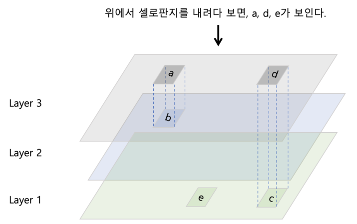

# 프로세스와 스레드

## 프로세스

### 프로세스 개요

- 개념
  - 운영체제에서 프로세스는 하나의 작업 단위이다.
    - Task라고도 부른다.
  - 프로그램과의 차이
    - 프로그램은 저장장치 저장되어 있는 정적인 상태이다.
    - 프로세스는 실행을 위해 메모리에 올라가 있는 동적인 상태이다.
  - CPU는 시분할 방식을 사용하여 여러 개의 프로세스를 빠른 속도로 전환하며 실행한다.
    - CPU core는 한 순간에 하나의 프로세스만 실행이 가능하다.
    - 그러나 CPU core는 매우 빠른 속도로 여러 개의 프로세스를 번갈아가며 실행한다.
    - 이를 통해 CPU 혹은 CPU core가 하나라도 여러 개의 프로그램을 동시에 실행시킬 수 있는 것이다.


- 프로그램에서 프로세스로의 전환

  - 운영체제는 프로그램을 메모리의 적당한 위치로 가져온다.
  - 이와 동시에 프로세스 제어 블록(Process Control Block, PCB)이 생성된다.
  - PCB에는 프로세스를 처리하는 데 필요한 다양한 정보가 저장되어 있는데, 대표적으로 아래와 같은 것들이다.
    - 프로세스 구분자: 메모리에 존재하는 여러 개의 프로세스를 구분하기 위한 구분자.
    - 메모리 관련 정보: 실행하려는 프로세스가 메모리의 어느 위치에 저장되었는지 알아야 하므로, 프로세스의 메모리 위치 정보가 담겨 있으며, 메모리 보호를 위해 경계 레지스터와 한계 레지스터에 대한 정보도 포함되어있다.
    - 각종 중간값: CPU는 시분할 방식으로 여러 프로세스를 번갈아가며 수행하기에 각 프로세스를 어디까지 실행했는지를 저장해둘 필요가 있는데, 이와 관련된 값이 저장되어 있다.

  - 프로세스 제어 블록은 운영체제 영역에 생성되며, 프로세스가 종료되고 메모리에서 삭제되면, 프로세스 제어 블록도 폐기된다.
  - 결국 프로그램이 프로세스가 된다는 것은 운영체제로부터 프로세스 제어 블록을 얻는다는 뜻이고, 프로세스가 종료된다는 것은 해당 프로세스 제어 블록이 폐기된다는 뜻이다.


- 프로세스의 상태
  - 시분할 시스템에서 프로세스의 상태는 CPU를 얻어 실행 중인 프로세스가 중간에 다른 프로세스에 CPU를 넘겨주는 일이 빈번하기에 상당히 복잡하다.
  - 생성 상태(create status)
    - 프로세스가 메모리에 올라와 실행 준비를 완료한 상태
    - PCB가 할당된다.
  - 준비 상태(ready status)
    - 생성된 프로세스가 CPU를 얻을 때 까지 대기하는 상태.
    - PCB는 준비 큐(ready queue)에서 기다리며, CPU Scheduler에 의해 괸리된다.
    - 프로세스는 작업이 완료될 때 까지 준비 상태와 실행 상태를 오간다.
  - 실행 상태(running status, execute status)
    - 준비 상태에 있는 프로세스 중 하나가 CPU를 할당 받아 실제 작업을 수행하는 상태.
    - 실행 상태인 프로세스는 일정 기간 동안 CPU를 사용할 권리를 갖는다.
    - 만일 주어진 시간을 다 사용하고도 작업이 끝나지 않았다면 프로세스는 준비 상태로 돌아와 다음 차례를 기다린다.
  - 대기 상태(wait status)
    - 실행 상태에 있는 프로세스가 입출력을 요청하면 입출력이 완료될 때 까지 기다리는 상태.
    - 이전에 살펴봤듯이 인터럽트 시스템에서 프로세스가 입출력을 요구하면 CPU가 직접 데이터를 가져오지 않고 입출력 관리자에게 명령을 내리는데, 프로세스는 요청한 입출력이 끝날 때 까지 다음 작업을 할 수 없다.
    - 따라서 CPU도 아무 작업도 하지 않고 기다리게 되어 효율성이 떨어지는데, 이를 해결하기 위해 입출력을 요청한 프로세스를 대기 상태에 두어, CPU는 준비 상태의 다른 프로세스를 실행하고, 대기 상태에 있는 프로세스는 입출력이 완료되면 다시 준비 상태로 돌아가도록 했다.
    - 대기 상태의 프로세스는 입출력장치별로 마련된 큐에서 대기하며, 입출력이 완료되면 인터럽트가 발생하고, 대기 상태에 있는 프로세스 중 해당 입출력을 요청한 프로세스의 제어 블록이 준비 상태로 이동하게 된다.
  - 완료상태(terminate status)
    - 프로세스가 작업을 완료하여 종료된 상태.
    - 코드와 사용했던 데이터를 메모리에서 삭제하고 PCB를 폐기한다.
    - 오류나 다른 프로세스에 의해 비정상적으로 종료되는 강제 종료(abort)를 만나면 디버깅을 위해 강제 종료 직전의 메모리 상태를 저장장치로 옮기는데, 이를 코어 덤프(core dump)라 부른다.


- 휴식 상태와 보류 상태
  - 위의 5가지 상태를 활성 상태(active status)라 부르는데, 이 외에 다른 상태가 더 있다.
  - 휴식 상태(pause status)
    - 프로세스가 작업을 일시적으로 쉬고 있는 상태를 의미한다.
    - 사용하던 데이터가 메모리에 그대로 있고, PCB도 유지되므로, 프로세스는 멈춘 지점에서부터 재시작할 수 있다.
    - Unix 계열 OS에서 `ctrl` + `z`를 누르면 휴식 상태로 전환된다.
  - 보류 상태(suspend status)
    - 프로세스가 메모리에서 잠시 쫓겨난 상태이다.
    - 보류 상태에 들어간 프로세스는 메모리 밖으로 쫓겨나 스왑 영역에 보관된다.
    - 스왑 영역은 메모리가 다 찰 경우 데이터가 임시로 보관되는 곳이다.
    - 보류 상태는 대기 상태에서 옮겨진 보류 대기 상태(block suspend status)와 준비 상태에서 옮겨진 보류 준비 상태(ready suspend status)로 구분되며, 각 상태에서 재실행하면 원래의 활성 상태로 들어간다.
    - 또한 보류 대기 상태에서 입출력이 완료되면 활성 상태가 아닌 보류 준비 상태로 옮겨간다.
  - 보류 상태가 되는 경우
    - 메모리가 꽉 차서 일부 프로세스를 메모리 밖으로 내보내야 하는 경우.
    - 프로그램에 오류가 있어서 실행을 미루어야 할 경우.
    - 바이러스와 같이 악의적인 공격을 하는 프로세스라고 판단할 경우.
    - 매우 긴 주기로 반복되는 프로세스라 메모리 밖에다 저장해도 큰 문제가 없을 경우.
    - 입출력을 기다리는 프로세스의 입출력이 계속 지연될 경우.


- 상태의 전환
  - CPU scheduler
    - 준비 상태에 있는 프로세스들 중 다음에 실행할 프로세스를 선정하는 일을 비롯하여 프로세스의 생성, 준비, 실행, 완료에 관여하여 프로세스가 원만하게 작업을 수행할 수 있도록 돕는 역할을 한다.
  - 디스패치(dispatch)
    - 준비 상태의 프로세스 중 하나를 골라 실행 상태로 바꾸는 CPU scheduler의 작업을 디스패치라고 부른다.
    - 새로운 프로세스가 실행 상태로 전환되면, 타임 슬라이스 만큼 시간이 흐른 뒤 클록은 인터럽트를 사용하여 일정 시간이 흘렀다고 CPU에게 알려준다.
  - 타임아웃(time out)
    - 프로세스에 배당된 작업 시간을 타임 슬라이스(타임 퀀텀)라고 부른다.
    - 프로세스는 자신에게 주어진 타임 슬라이스 동안 작업을 끝내지 못하면 다시 준비 상태로 돌아가는데, 이를 타임이웃이라 부른다.
  - wake up
    - 대기 상태의 process에게 입출력의 완료를 알려 준비 상태로 돌아가도록 하는 작업을 wakeup이라 부른다.
  - exit
    - 프로세스가 정상적으로 종료되어 종료 상태로 전환시키는 작업을 exit이라 부른다.
    - 비정상적인 종료는 abort라 부른다.


### PCB와 문맥 교환

- PCB(Process Control Block, 프로세스 제어 블록)
  - 프로세스 제어 블록은 프로세스를 실행하는 데 필요한 정보를 보관하는 자료구조이다.
    - 모든 프로세스는 고유의 PCB를 가진다.
    - PCB는 프로세스 생성 시 만들어져 프로세스의 실행이 완료되면 폐기된다.
  - TCB(Task Control Block)라고도 부른다.


- PCB의 구성

  - 포인터
    - 프로세스 제어 블록의 첫 번째 블록에는 포인터가 저장된다.
    - 준비 상태나 대기 상태는 큐로 운영되는데, 프로세스 제어 블록을 연결하여 준비 상태나 대기 상태의 큐를 구현할 때 포인터를 사용한다.

  - 프로세스 상태
    - 프로세스 제어 블록의 두 번째 블록에는 프로세스 상태가 저장된다.
    - 프로세스가 현재 생성, 준비, 실행, 대기, 등의 상태 중 어떤 상태에 있는지를 나타낸다.
  - 프로세스 구분자
    - PID
    - 운영체제 내에 있는 여러 프로세스를 구별하기 위한 구분자를 저장한다.
  - 프로그램 카운터
    - 다음에 실행될 명령어의 위치를 가리키는 프로그램 카운터의 값을 저장한다.
  - 프로세스 우선 순위
    - 프로세스별로 우선 순위가 다르다.
    - 다양한 우선순위의 프로세스가 대기 상태로 들어오기 때문에 대기 상태의 큐도 우선순위별로 따로 운영된다.
    - 또한 CPU scheduler가 준비 상태에 있는 프로세스 중 실행 상태로 옮겨야 할 프로세스를 선택할 때에도 프로세스 우선 순위를 기준으로 삼는다.
    - 즉, 우선 순위가 높은 프로세스가 더 먼저, 더 자주 실행된다.
  - 각종 레지스터 정보
    - 프로세스가 실행되는 중에 사용하던 레지스터의 값이 저장된다.
    - 이전에 실행할 때 사용한 레지스터의 값을 보관해야 다음에 시행할 수 있기에 자신이 사용하던 레지스터의 중간값을 보관한다.
  - 메모리 관리 정보
    - 프로세스가 메모리의 어디에 있는지를 나타내는 메모리 위치 정보, 메모리 보호를 위해 사용하는 경계 레지스터 값과 한계 레지스터 값 등이 저장된다.
    - 그 외에 세그먼테이션 테이블, 페이지 테이블 등의 정보도 보관한다.
  - 할당된 자원 정보
    - 프로세스를 실행하기 위해 사용하는 입출력 자원이나 오픈 파일 등에 대한 정보가 저장되어 있다.
    - 즉 하드디스크에 저장된 파일을 열어서 작업한다면 파일에 대한 정보가, 음악을 출력하기 위해 사운드카드에 대한 정보가 필요한데, 이러한 정보들이 저장되어있다.
  - 계정 정보
    - 계정 번호, CPU 할당 시간, CPU 사용 시간 등의 정보가 저장된다.
  - 부모 프로세스 구분자와 자식 프로세스 구분자
    - 프로세스 제어 블록에는 부모 프로세스를 가리키는 PPID(Parent PID)와 자식 프로세스를 가리키는 CPID(Child PID)정보가 저장된다.


- 포인터의 역할
  - 대기 상태에는 같은 입출력을 요구한 프로세스끼리 모아둔다.
    - 입출력이 완료되기를 기다리는 프로세스는 대기 상태로 모인다.
    - 시스템 내에는 다양한 종류의 입출력장치가 있기에 대기 상태로 모이는 프로세스도 다양하다.
    - 따라서 이들을 하나로 모아두면 관리가 불편할 것이다.
    - 이러한 불편함이 없도록 대기 상태에는 같은 입출력을 요구한 프로세스끼리 모아둔다.
  - 대기 큐
    - 대기 상태에서 같은 입출력을 기다리는 프로세스의 PCB는 동일한 입출력 큐에 모여 있는데, 이를 대기 큐라한다.
    - 예를 들어 하드디스크의 입출력을 기다리는 PCB는 하드디스크 큐에 삽입된다.
    - 이후 하드디스크로부터 완료 인터럽트가 도착하면 하드디스크 큐에 있는 프로세스 제어 블록을 찾아 해당 프로세스 제어 블록의 상태를 준비 상태로 변경하고 하드디스크 큐에서 제거한 후 준비 큐로 이동한다.
  - 이 대기큐를 구현할 때 포인터를 사용한다.


- 문맥교환(Context switch)
  - CPU를 차지하던 프로세스가 나가고 새로운 프로세스를 받아들이는 작업을 말한다.
    - 이 때 두 프로세스 제어 블록의 내용이 변경된다.
    - 샐행 상태에서 나가는 PCB에는 지금까지의 작업 내용을 저장하고, 실행 상태로 들어오는 PCB의 내용으로 CPU가 다시 세팅된다.
    - 이와 같이 두 프로세스의 PCB를 교환하는 작업이 문맥 교환이다.
  - 문맥 교환의 절차
    - 실행 상태에 있는 P1이 자신에게 주어진 시간을 다 사용하여 타임아웃이 되면 P1의 PCB에 현재까지의 작업 결과가 저장되고, P1은 준비 상태로 이동한다.
    - 준비 상태에 있던 프로세스 P2가 실행 상태로 전환되면 CPU 레지스터가 P2의 PCB 값으로 채워져 다음 작업을 실행한다.
  - 문맥 교환이 일어나는 경우
    - 한 프로세스가 타임 슬라이스를 다 사용할 경우.
    - 인터럽트가 걸릴 경우.
  - Context switching이 실행되는 동안 오버헤드가 발생한다.
    - 따라서 자주 발생할 경우 성능이 저하될 수 있다.
  - 일반적으로 CPU-bound 작업을 진행하는 프로세스의 문맥 교환 보다, I/O-bound 작업을 진행하는 프로세스의 문맥 교환이 더 적은 비용이 든다.
    - CPU-bound 작업은 현재 연산 중인 모든 정보를 저장해야 하기 때문에 PCB에 보다 복잡한 정보를 저장해야한다.
    - 반면에 I/O-bound 작업의 경우 대부분의 시간을 대기하면서 보내기 때문에 PCB에 저장할 내용이 많지 않다.
    - 비유하자면 CPU-bound 작업의 context-switching은 현재 다양한 도구로 도면을 그리는 사람이 사용중인 책상을 다른 사람이 쓸 수 있게 내어줘야 하는 상황이라고 할 수 있다. 현재 작업 중이던 내용을 정리하고 비켜준 뒤, 다른 사람이 책상을 쓰고 난 후에는 다시 자신이 사용하던 도구들을 다시 배치해야 하므로 보다 부하가 크다.
    - 반면에 I/O-bound 작업은 전화가 오기를 기다리는 사람이 사용중인 책상을 다른 사람에게 내어줘야 하는 상황이라고 할 수 있다. 전화를 기다리고 있었으므로 딱히 정리할 게 없어 금방 비켜주는 것이 가능하다.
  
  - 위와 같은 이유로 프로세스 간의 문맥 교환 비용 보다, 스레드 간의 문맥 교환 비용이 더 적은 비용이 든다.
    - 스레드는 데이터를 공유하기에 맥락 교환 시에 저장하고 복원해야 하는 데이터의 양이 더 적다.
  


### 프로세스의 연산

- 프로세스의 구조
  - 코드 영역, 데이터 영역, 스택 영역으로 구성된다.
    - 예를 들어 워드프로세서를 실행하면, 프로그램은 코드 영역에 탑재되고, 워드프로세서로 편집 중인 문서는 데이터 영역에 탑재된다.
    - 운영체제가 워드프로세서를 작동하기 위해 사용하는 각종 부가 데이터는 스택 영역에서 관리한다.
    - 스택 영역과 데이터 영역에 속하는 힙 영역은 프로세스가 실행되는 동안 크기가 변경되기도 한다.
  - 코드 영역
    - 프로그램의 본문이 기술된 곳으로 텍스트 영역이라고도 한다.
    - 프로그래머가 작성한 프로그램은 코드 영역에 탑재되며 탑재된 코드는 읽기 전용으로 처리된다.
  - 데이터 영역
    - 코드가 실행되면서 사용하는 변수나 파일 등의 각종 데이터를 모아놓은 곳이다.
    - 데이터는 변하는 값이기에 이곳의 내용은 읽기와 쓰기가 가능하다.
    - 일반 데이터 영역과 힙 영역으로 나뉜다.
  - 스택 영역
    - 운영체제가 프로세스를 실행하기 위해 부수적으로 필요한 데이터를 모아놓은 곳이다.
    - 프로세스 내에서 함수를 호출하면 함수를 수행하고 원래 프로그램으로 되돌아올 위치를 이 영역에 저장한다.
    - 스택 영역은 운영체제 사용자의 프로세스를 작동하기 위해 유지하는 영역이므로 사용자에게는 보이지 않는다.


- 프로세스의 생성과 복사

  - 프로세스의 생성
    - 프로세스는 프로그램을 실행할 때 새로 생성된다.
    - 사용자가 프로그램을 실행하면 운영체제는 프로그램을 메모리로 가져와 코드 영역에 넣고 프로세스 제어 블록을 생성한다.
    - 그리고 메모리에 데이터 영역과 스택 영역을 확보한 후 프로세스를 실행한다.
  - 프로세스의 복사
    - 실행 중인 프로세스로부터 새로운 프로세스를 복사하는 것도 가능하다.

  - `fork()` system call
    - 실행 중인 프로세스로부터 새로운 프로세스를 복사하는 함수이다.
    - 커널에서 제공하는 이 함수는 프로세스를 복사하는 일종의 system call이다.
    - 기존에 실행 중인 프로세스와 복사된 프로세스 사이에는 부모-자식 관계가 형성된다.
    
    - PCB를 포함한 부모 프로세스 영역의 대부분이 자식 프로세스에 복사되어 똑같은 프로세스가 만들어진다.
    - 단, PCB의 내용 중 프로세스 구분자, 메모리 관련 정보, 부모 프로세스 구분자와 자식 프로세스 구분자 등의 변경된다.
    
  - `fork()` system call의 장점
    - 하드디스크에서 프로그램을 새로 가져오지 않고, 메모리에서 복사하기에 프로세스의 생성 속도가 빠르다.
    - 부모 프로세스가 사용하던 모든 자원을 추가 작업 없이 자식 프로세스에 상속할 수 있어 추가 작업 없이 자원을 상속할 수 있다.
    - 복제된 프로세스와 기존 프로세스가 부모-자식 관계로 연결되어 있어 자식 프로세스가 종료될 경우 자식이 사용하던 자원을 부모 프로세스가 정리할 수 있어 시스템을 효율적으로 관리할 수 있다.


- 프로세스의 전환
  - `exec()` system call
    - 기존의 프로세스를 새로운 프로세스로 전환한다.
    - `fork()` system call이 기존 프로세스를 그대로 복제한다면, `exec()` system call은 기존 프로세스의 내용을 바꾸는 것이다.
    - `exec()`이 호출될 경우 코드 영역에 있는 기존의 내용을 지우고 새로운 코드로 변경한다.
    - 또한 데이터 영역이 새로운 변수로 채워지고 스택 영역이 리셋된다.
    - PCB의 내용 중 구분자, 부모 프로세스 구분자, 자식 프로세스 구분자, 메모리 관련 사항 등은 변하지 않지만, 각종 레지스터와 사용한 파일 정보가 모두 리셋된다.
  - 사용 목적
    - 프로세스의 구조체를 재활용하기 위함이다.
    - 새로운 프로세스를 만들려면 PCB를 만들고 memory에 자리를 확보하는 과정이 필요하며, 프로세스를 종료한 이후 garbage collection을 위해 상위 프로세스와 부모-자식 관계를 만들어야한다.
    - 이 때, `exec()` system call을 사용하면 이미 만들어진 PCB, memory 영역, 부모-자식 관계를 그대로 사용할 수 있어 편리하다.


### 프로세스의 계층 구조

- 프로세스의 계층 구조
  - Unix에서 커널이 처음 메모리에 올라와 부팅이 되면 커널 관련 프로세스를 여러 개 만드는데, 그 중 init 프로세스는 전체 프로세스의 출발점이 된다.
  - 운영체제는 프로세스를 효율적으로 관리하기 위해 init 프로세스를 만든 다음 나머지 프로세스를 init 프로세스의 자식으로 만든다.
  - 즉, 운영체제에 있는 모든 프로세스는 init 프로세스의 자식이 되어 트리 구조를 이룬다.


- 프로세스 계층 구조의 장점
  - 여러 작업 동시 처리
    - 예를 들어 login process는 한 번에 한 명의 사용자만 처리할 수 있다.
    - 이를 동시에 처리하기 위해 `fork()`를 사용하여 login process를 여러 개 만들어 사용자에게 분배한다.
    - 새로운 사용자가 들어올 때 마다 이러한 작업을 반복하여 여러 사용자를 동시에 처리할 수 있다.
  - 자원 회수 용이
    - 프로세스 간 책임 관계가 분명해져 시스템을 관리하기가 수월하다.
    - 프로세스가 작업을 마쳐서 그 프로세스가 사용하던 자원을 garbage collection을 통해 회수할 때 특히 편리하다.
    - 만약 모든 프로세스가 독립적으로 만들어지면 프로세스가 종료될 때 마다 운영체제가 직접 자원을 회수해야 하기 때문에 작업이 복잡해질 것이다.
    - 그러나 모든 프로세스를 부모-자식 관계로 만들면 자식 프로세스가 작업을 마쳤을 때 사용하던 자원을 부모 프로세스가 회수하면 된다.


- 고아 프로세스(좀비 프로세스)
  - 프로세스가 종료된 후에도 비정상적으로 남아있는 프로세스를 고아 프로세스 또는 좀피 프로세스라고 한다.
    - 부모 프로세스는 자원을 회수하기 위해 자식 프로세스가 끝날 때까지 기다려야한다.
    - 그런데 부모 프로세스가 먼저 종료되거나 자식 프로세스가 비정상적으로 종료되어 부모 프로세스에 연락이 안 되는 경우도 있다.
    - 이런 문제가 발생하면 자식 프로세스가 종료되지 않거나 종료되더라도 사용하던 자원이 그대로 남게 된다.
  - 컴퓨터에 좀비 프로세스가 많아지만 자원이 낭비됨으로써 효율적인 운영에 방해가 되므로, 운영체제는 반환되지 못한 자원을 회수하는 작업을 주기적으로 해야한다.


## 동적 할당 영역과 시스템 호출

- 프로세스의 동적 할당 영역

  - 프로세스는 코드 영역, 데이터 영역, 스택 영역으로 나뉘는데, 이 중 데이터 영역은 다시 일반 데이터 영역과 힙 영역으로 나뉜다.

  - 이 중 코드 영역과 일반 데이터 영역은 프로세스가 실행되기 직전에 위치와 크기가 결정되고 실행 중에 변하지 않는 정적할당 영역이다.
  - 스택 영역과 힙 영역은 실행 동안 만들어지는 영역으로 실행 중에 크기가 변경되는 동적 할당 영역이다.


- 스택 영역
  - 스택은 함수 호출 시 두 가지 작업을 구현하기 위해 사용한다.
  - 함수 호출과 복귀
    - 호출한 함수가 종료되면 함수를 호출하기 전 코드로 돌아가야 한다.
    - 돌아갈 메모리의 주소를 스택에 저장한다.
  - 지역 변수의 저장
    - 함수에서 사용하는 지역변수는 함수가 호출될 때만 사용되다가 함수가 종료되면 사용한 공간을 반환해야한다.
    - 이 지역변수를 저장하는 곳이 스택이다.
  - 스택은 프로세스를 작동하기 위해 커널이 유지하는 자료구조이다.
    - 더 정확히는 스레드가 작동하는 동안 추가되거나 삭제되는 동적 할당 영역이다.
    - 일반적으로 프로세스가 사용하는 함수는 컴파일시 결정된다.
    - 그러나 어떤 함수가 몇 번 호출 되는지는 스레드가 작업을 진행하면서 결정된다.
    - 어떤 함수는 한 번만 호출되기도 하고, 어떤 함수는 몇 번씩 호출되기도 한다.
    - 이처럼 스택은 스레드가 함수를 실행시킴에 따라 커지기도 하고 작아지기도 한다.


- 힙 영역
  - 대부분의 데이터는 일반 데이터 영역에 저장되고 그 크기가 정해진다.
  - 그러나 일부 데이터는 프로그램이 실행되는 동안 할당된다.
  - 이렇게 프로세스가 실행되는 동안 동적으로 변경되는 데이터는 힙 영역에 저장된다.


## 스레드

### 스레드의 개념

- 스레드의 정의

  - 프로세스의 작업 과정

    - 운영체제는 코드와 데이터를 메모리에 가져온다.
    - PCB를 생성한다.
    - 작업에 필요한 메모리 영역을 확보한다.
    - 준비된 프로세스를 준비 큐에 삽입한다.
    - 프로세스가 생성되면 CPU scheduler는 프로세스가 해야 할 일을 CPU에 전달하고 실제 작업은 CPU가 수행한다.
    - 이때 CPU scheduler가 CPU에 전달하는 일 중 하나가 스레드이다.
    - 그러므로 CPU가 처리하는 작업의 단위는 프로세스로부터 전달받은 스레드이다.

  - 스레드

    - 프로세서의 코드에 정의된 절차에 따라 CPU에 작업을 요청하는 실행 단위이다.
    - 운영체제 입장에서의 작업 단위는 프로세스이고 CPU 입장에서의 작업 단위는 스레드이다.

  - 프로세스와 스레드의 차이

    - 프로세스끼리는 약하게 연결되어 있는 반면, 스레드끼리는 강하게 연결되어 있다.
    - 그럴 수 밖에 없는 것이 각각의 프로세스는 독립적으로 실행되는 반면에, 스레드들은 하나의 프로세스에 속해있기 때문이다.

    - 여러 개의 스레드가 모여 하나의 프로세스를 이룬다.
    - 프로세스는 task를 처리하는 것이고, 스레드는 operation을 처리하는 것이다.


- 스레드의 자원 공유
  - 같은 프로세스에 속한 스레드들 사이에서는 자원을 공유한다.
    - 다만 모든 자원을 공유하는 것은 아니고 코드 영역, 데이터 영역만을 공유하며, 스택 영역은 공유하지 않는다.
  - 스레드 사이의 자원이 공유되도록 한 이유는 자원의 생성과 관리의 중복성을 최소화하여 수행 능력을 올리기 위함이다.


## 멀티 프로세스와 멀티 스레드

- 용어 정리
  - 멀티스레드
    - 프로세스 내 작업을 여러 개의 스레드로 분할함으로써 작업의 부담을 줄이는 프로세스 운영 기법.
  - 멀티태스킹
    - 운영체제가 CPU에 작업을 줄 때 시간을 잘게 나누어 배분하는 기법이다.
    - 이렇게 여러 스레드에 시간을 잘게 나누어주는 시스템을 시분할 시스템이라 한다.
    - 시분할 시스템에서 운영체제가 CPU에 전달하는 작업은 프로세스가 아니라 스레드이다.
  - 멀티프로세싱
    - CPU를 여러 개 사용하여 여러 개의 스레드를 동시에 처리하는 작업 환경이다.
    - 하나의 컴퓨터에 여러 개의 CPU 혹은 하나의 CPU 내의 여러 개의 코어에 스레드를 배정하여 동시에 처리한다.
  - CPU 멀티스레드
    - 멀티스레드가 소프트웨어적으로 프로세스를 작은 단위의 스레드로 분할하여 운영하는 기법이라면, CPU 멀티스레드는 하드웨어적인 방법으로 하나의 CPU에서 여러 스레드를 동시에 처리하는 병렬 처리 기법이다.


- 멀티 프로세스의 장점
  - 프로그램의 안정성이 높아진다.
    - 멀티 프로세스에서 각 프로세스는 독립적인 메모리 공간을 가지므로, 한 프로세스에 문제가 생겨도 다른 프로세스에 영향을 주지 않는다.
  - 프로그램 병렬성
    - 여러 개의 CPU 코어를 활용하여 각 프로세스를 병렬적으로 실행하여 성능을 향상시킬 수 있다.
    - 다만 멀티 스레드도 같은 장점을 공유한다.
  - 높은 확장성
    - 각 프로세스가 독립적이므로, 새로운 기능이나 모듈을 추가, 수정 할 때 다른 프로세스에 영향을 주지 않는다.


- 멀티 프로세스의 단점
  - Context switching 과정에서 부하가 발생할 수 있다.
    - 프로세스의 빈번한 context switching은 오버헤드를 발생시킬 수 있다.
    - 반면에 스레드의 context switching은 보다 가볍다.
  - 각 프로세스가 독립적인 메모리 공간을 가지므로 메모리 사용량이 증가한다.


- 멀티스레드의 장점
  - 자원 사용의 효율성 증가
    - 여러 개의 작업을 동시에 처리하기 위해 `fork()` system call을 호출하여 프로세스를 복제할 경우 코드 영역과 데이터 영역의 일부가 메모리에 중복되어 존재하여 메모리를 낭비하게 된다.
    - 또한 프로세스는 프로세스가 실행되는 동안 변경되지 않는 정적인 영역과 스레드가 작업을 하면서 변경되는 동적인 영역이 있는데, `fork()`의 경우 중복된 정적인 영역이 여러 개 생기게 된다.
    - 반면에 멀티스레드의 경우 하나의 프로세스 내에서 코드, 파일 등의 자원을 공유하므로 자원의 낭비를 막으면서도 여러 작업을 처리할 수 있다.
  - 응답성 향상
    - 한 스레드가 입출력으로 인해 작업이 진행되지 않더라도 다른 스레드가 작업을 계속하여 사용자의 작업 요구에 빨리 응답할 수 있다.
  - Context switching 비용이 적다.
    - 프로세스의 context switching보다 오버헤드가 낮다.


- 멀티 스레드의 단점
  - 안정성 문제
    - 멀티 프로세싱은 각 프로세스가 독립적으로 동작하기 때문이 한 프로세스의 문제가 다른 프로세스에 영향을 주지 않는다.
    - 반면에 멀티스레드의 경우 모든 스레드가 동일한 자원을 공유하기 때문에 한 스레드에 문제가 생기면 모든 스레드에 영향을 준다.

  - 자원 동기화로 인한 성능 저하
    - 여러 개의 스레드가 공유 자원에 동시에 접근할 수 있기 때문에 동기화 문제가 발생할 수 있다.
    - 여러 스레드가 동시에 한 자원에 접근하여 변경하지 않도록 하기 위해 동기화 작업을 해야 하는데, 이 때 병목현상이 발생하여 성능이 저하될 수 있다.

  - 디버깅이 어렵다.
    - 여러 개의 스레드가 실행되므로 디버깅이 어려울 수 있다.


# 유니온 마운트

> https://blog.naver.com/alice_k106/221530340759
>
> https://access.redhat.com/documentation/ko-kr/red_hat_enterprise_linux/7/html/7.2_release_notes/technology-preview-file_systems

- 유니온 마운트 파일 시스템

  - 유니온 마운트
    - 하나의 디렉터리 지점에 여러 개의 디렉터리를 마운트함으로써 마치 하나의 통합된 디렉터리처럼 보이게 하는 것을 의미한다.
  - 셀로판지 여러 개를 겹쳐놓는 것을 생각하면 된다.
    - 아래 그림에서와 같이 여러 개의 셀로판지를 겹쳐 놓으면 가장 위쪽에 있는 셀로판지의 그림만 보일 것이다.

  


- OverlayFS(Overlay File System)

  - 유니온 마운트의 구현체.
    - 기본적으로 유닉스 계열 OS의 커널에 모듈로 내장되어 있어 별도의 설치 없이 사용이 가능하다.

  - 크게 4가지 계층으로 나뉜다.
    - Lower dir: 아래쪽에 있는 1개 이상의 디렉터리(위 그림에서 layer1, layer2가 lower dir에 속한다).
    - Upper dir: 가장 위쪽에 있는 디렉터리(위 그림에서 layer3에 해당한다).
    - Merge dir: 위 그림에서 모든 계층을 겹쳐서 보는 통합 뷰에 해당하는 디렉터리
    - Work dir: 통합 뷰의 원자성을 보장하기 위해 존재하는 중간 계층


- OverlayFS 사용해보기

  - 우선 각 계층별로 directory를 만든다.

  ```bash
  $ mkdir lower1 upper merge work
  ```

  - 그 후 `lower1` directory에 file을 하나 생성한다.

  ```bash
  $ echo 'Hello World' > lower1/test.txt
  ```

  - Overlayfs로 각 디렉터리를 마운트한다.

  ```bash
  $ mount -t overlay overlay -o lowerdir=lower1/,upperdir=upper/,workdir=work/ merge/
  ```

  - 이후 merge directory를 확인해보면 lower1애서 생성한 test.txt file이 있는 것을 볼 수 있다.

  ```bash
  $ ls merge
  test.txt
  ```

  - merge directory에 file을 추가할 경우 upper에 같은 파일이 추가된다.

  ```bash
  $ echo 'Hello World!' > merge/test2.txt
  $ ls upper
  test2.txt
  ```

  - lower directory에 있는 파일을 수정할 경우 lower directory에 있는 파일은 수정되지 않고, upper directory에 수정 된 내용의 파일이 생성된다.
    - lower 디렉터리는 항상 읽기전용으로 실행되어 변경할 수 없다.
    - 만약 lower 디렉터리 파일에 변경 사항이 발생할 경우, 가장 윗쪽의 계층인 upper에 그 변경 사항을 기록한다.

  ```bash
  $ echo 'Bye!' >> lower/test.txt
  
  $ cat lower/test.txt
  # Hello World
  
  $ ls upper
  # test.txt test2.txt
  $ cat test.txt
  # Hello World
  # Bye!
  ```

  - merge directory에서 lower directory에서 생성한 파일을 삭제할 경우.
    - lower 계층에 있는 파일들은 읽기 전용이므로 삭제도 되어선 안된다.
    - 그런데 아래 와 같이 실행하면 삭제가 되는 것을 볼 수 있는데, 이는 실제로 삭제가 된 것은 아니다.
    - OverlayFS에서는 whiteout이라 불리는 별도의 파일을 upper 디렉터리에 자동으로 생성한다(아래에서 test.txt가 whiteout file로 크기를 확인해보면 0이다).
    - 즉 삭제되었다는 표시를 하기 위해 이 같이 빈 파일을 만들어두는 것이다. 

  ```bash
  $ rm merge/test.txt
  $ ls merge
  # test2.txt
  
  $ ls upper
  # test.txt test2.txt
  ```


# CPU 스케줄링

## 스케줄링

- CPU 스케줄러
  - 프로세스가 생성된 후 종료될 때 까지 모든 상태 변화를 조정하는 일을 한다.
    - 여러 프로세스의 상황을 고려하여 CPU와 시스템 자원을 어떻게 배정할지 결정하는 일을 한다.
  - 프로세스 스케줄러라고도 부른다.


- 스케줄링의 단계
  - 고수준 스케줄링(high level scheduling, long-term scheduling, job scheduling, admission scheduling)
    - 시스템 내의 전체 작업 수를 조절하는 일을 한다.
    - 작업이란 운영체제에서 다루는 일의 가장 큰 단위로, 1개 또는 여러 개의 프로세스로 이루어진다.
    - 따라서 고수준 스케줄링은 전체 프로세스의 수를 조절한다고도 할 수 있다.
    - 고수준 스케줄링 단계에서는 시스템이 어떤 작업을 받아들일지를 결정한다(이 때문에 승인 스케줄링이라고도 불린다).
    - 어떤 작업을 받아들일지 말지는 전체 시스템의 부하를 고려하여 결정한다.
  - 저수준 스케줄링(low level scheduling, short-term scheduling)
    - 어떤 프로세스에 CPU를 할당할지, 어떤 프로세스를 대기 상태로 보낼지 등을 결정하는 일을 한다.
    - 준비 상태에 있는 프로세스 중 하나를 골라 실행 상태로 보내고, 실행 상태에 있는 프로세스를 대기 상태로 보내며, 대기 상태에 있는 프로세스를 준비 상태로 보내는 등의 역할을 한다.
    - 일반적으로 CPU 스케줄러라 하면 저수준 스케줄러를 의미한다.
  - 중간 수준 스캐줄링(middle level scheduling)
    - 고수준 스케줄링과 저수준 스케줄링 사이에 일어나느 스케줄링이다.
    - 고수준 스케줄링을 통해 전체 프로세스를 조절하긴 하지만, 여러 이유로 인해 시스템에 과부하가 걸릴 수 있다.
    - 중지(suspend)와 활성화(active)로 전체 시스템의 활성화된 프로세스 수를 조절하여 과부하를 막는다.
    - 시스템에 과부하가 걸려서 전체 프로세스 수를 조절해야 한다면, 활성화 상태인 프로세스 일부를 보류 상태로 전환한다.
    - 보류된 프로세스는 처리 능력에 여유가 생기면 다시 활성화시킨다.


- 스케줄링의 목적
  - 공평성
    - 모든 프로세스가 자원을 공평하게 배정받아야한다(동등하게 배정 받는 것이 아니다).
    - 자원 배정 과정에서 특정 프로세스가 배제되어서는 안 된다.
  - 효율성
    - 시스템 자원이 유휴 시간 없이 사용되도록 스케줄링한다.
    - 유휴 자원을 사용하려는 프로세스에는 우선권을 주어야한다.
  - 안정성
    - 우선순위를 사용하여 중요 프로세스가 먼저 작동하도록 배정하여, 시스템 자원을 점유하거나 파괴하려는 프로세스로부터 자원을 보호해야한다.
  - 확장성
    - 프로세스가 증가해도 시스템이 안정적으로 작동하도록 조치해야 한다.
    - 시스템 자원이 늘어나는 경우 이 혜택이 시스템에 반영되게 해야 한다.
  - 반응 시간 보장
    - 응답이 없는 경우 사용자는 시스템이 멈춘 것으로 가정하기 때문에 시스템은 적절한 시간 안에 프로세스의 요구에 반응해야 한다.
  - 무한 연기 방지
    - 특정 프로세스의 작업이 무한히 연기되어서는 안 된다.


## 스케줄링 시 고려 사항

- 선점형 스케줄링과 비선점형 스케줄링
  - 선점형 스케줄링
    - 어떤 프로세스가 CPU를 할당 받아 실행 중이더라도 운영체제가 CPU를 강제로 빼앗을 수 있는 스케줄링 방식
    - 프로세스가 CPU를 독점할 수 없어 대화형이나 시분할 시스템에 적합하다.
    - 문맥 교환으로 인한 오버헤드가 많다.
  - 비선점형 스케줄링
    - 어떤 프로세스가 CPU를 점유하면 다른 프로세스가 이를 빼앗을 수 없는 스케줄링 방식.
    - CPU 스케줄러의 작업량이 적고, 문맥 교환의 오버헤드가 적다는 장점이 있다.
    - 기다리는 프로세스가 많아 처리율이 떨어진다는 단점이 있다.


- 프로세스 우선순위

  - 프로세스의 우선순위는 프로세스의 중요도를 의미한다.
    - 중요도가 높은 프로세스가 더 높은 우선순위를 갖는다.
    - 우선순위가 높다는 것은 더 빨리 자주 실행된다는 의미이다.
  - 대부분의 CPU 스케줄러는 우선순위를 사용한다.

  - 시스템에 따라 높은 숫자가 높은 우선순위를 나타내기도 하고, 낮은 숫자가 높은 우선순위를 나타내기도 한다.


- CPU 집중 프로세스와 입출력 집중 프로세스

  - 프로세스의 상태 중에는 CPU를 사용하여 작업을 하는 실행 상태와 입출력을 요청하여 완료되기까지 기다리는 대기 상태가 있다.

    - 이 때 CPU를 할당받아 실행하는 작업을 CPU 버스트(CPU burst), 입출력 작업을 입출력 버스트(I/O burst)라고 부른다.
    - 이 작업 형태에 따라 CPU 집중 프로세스(CPU bound process)와 입출력 집중 프로세스(I/O bound process)로 나눌 수 있다.

  - CPU 집중 프로세스

    - 수학 연산과 같이 CPU를 많이 사용하는 프로세스를 의미한다.
    - 즉, CPU 버스트가 많은 프로세스이다.

  - 입출력 집중 프로세스

    - 저장장치에서 데이터를 복사하는 일과 같이 입출력을 많이 사용하는 프로세스를 의미한다.
    - 즉 입출력 버스트가 많은 프로세스이다.

  - 사이클 훔치기(cycle stealing)

    - CPU 집중 프로세스와 입출력 집중 프로세스가 동시에 존재할 때는 입출력 집중 프로세스를 먼저 실행 상태로 옮기는 것이 효율적이다.
    - 입출력 집중 프로세스가 실행 상태로 가면 입출력 요구에 의해 대기 상태로 옮겨지기 때문에 다른 프로세스가 CPU를 사용할 수 있다.

    - 만약 CPU 집중 프로세스가 먼저 실행 상태가 되면, 자신의 타임 슬라이스를 다 쓸 때까지 다른 프로세스가 실행되지 못할 것이다.
    - 입출력 집중 프로세스가 CPU 집중 프로세스보다 실행 상테에 먼저 들어가는 경우를 사이클 훔치기라 한다.


- 전면 프로세스와 후면 프로세스
  - 전면 프로세스
    - GUI를 사용하는 OS에서 화면의 맨 앞에 놓인 프로세스를 말한다.
    - 현재 입출력을 사용하는 프로세스이며, 사용자와 상호작용이 가능하여 상호작용 프로세스라고도 한다.
  - 후면 프로세스
    - 사용자와 상호작용이 없는 프로세스이다.
    - 압축 프로그램처럼 사용자의 입력 없이 작동하기 때문에 일괄 작업 프로세스라고도 한다.
  - 전면 프로세스가 CPU를 할당 받을 확률이 높다.
    - 전면 프로세스는 사용자의 요구에 즉각 반응해야 하지만, 후면 프로세스는 상호작용이 없다.
    - 따라서 전면 프로세스의 우선순위가 후면 프로세스보다 높다.


- 다중 큐

  - 준비 상태의 다중 큐

    - CPU 스케줄러는 모든 프로세스 제어 블록을 뒤져 가장 높은 우선순위의 프로세스에 CPU를 할당한다.
    - 프로세스는 저마다 중요도가 다르며 프로세스의 중요도는 프로세스 제어 블록에 표시된다.
    - 그러나 매번 모든 프로세스 제어 블록을 검색하는 것은 번거로운 일이다.
    - 프로세스의 우선 순위별로 큐를 생성하면 보다 간편하게 우선순위 별로 CPU를 할당할 수 있다.

  - 대기 상태의 다중 큐

    - 시스템 내에는 다양한 종류의 입출력장치가 있기 때문에 대기 상태의 프로세스를 한곳에 모아놓으면 관리하기 불편하다.
    - 따라서 시스템의 효율을 높이기 위해 대기 상태에서는 같은 입출력을 요구한 프로세스끼리 모아놓는다.
    - 같은 장치의 입출력을 기다리는 프로세스의 프로세스 제어 블록은 동일한 입출력 큐에 모여 있다.

    - 준비 큐는 한 번에 하나의 프로세스를 꺼내어 CPU에 할당하지만, 대기 큐는 여러 개의 프로세스 제어 블록을 동시에 꺼내 준비 상태로 옮긴다.
    - 기본적으로 큐에 삽입된 순서대로 처리되지만, 일부는 나중에 들어온 프로세스 제어 블록이 먼저 준비 상태로 옮겨 가기도 한다.
    - 이는 입출력 장치가 CPU나 메모리 보다 느리기 때문으로, 작업 속도를 높이기 위해 작업 순서를 변경하는 경우가 있기 때문이다.


## 스케줄링 알고리즘

- 스케줄링 알고리즘 평가 지표
  - CPU 사용률
    - 전체 시스템의 동작 시간 중 CPU가 사용된 시간을 측정하는 방법.
    - 가장 이상적인 수치는 100%지만, 실제로는 90%에도 못 미친다.
  - 처리량
    - 단위 시간당 작업을 마친 프로세스의 수
  - 대기 시간
    - 작업을 요청하더라도 실제 작업이 이루어지기 전까지는 대기 시간이 필요하다.
    - 대기 시간은 작업을 요청한 프로세스가 작업을 시작하기 전까지 대기하는 시간으로, 이 시간이 짧을수록 좋다.
    - 스케줄링 알고리즘의 성능을 비교할 때는 주로 평균 대기 시간을 보는데, 평균 대기 시간은 모든 프로세스의 대기 시간을 합한 뒤 프로세스의 수로 나눈 값이다.
  - 응답 시간
    - 프로세스 시작 후 첫 번째 출력 또는 반응이 나올 때까지 걸리는 시간.
  - 반환 시간
    - 프로세스가 생성된 후 종료되어 사용하던 자원을 모두 반환하는 데까지 걸리는 시간.
    - 대기 시간과 실행시간을 더한 값이다.


- FCFS(Fisrt Come First Served)

  - 준비 큐에 도착한 순서대로 CPU를 할당하는 비선점형 방식.

    - 선입선출 스케줄링이라고도한다.

    - 비선점형 방식이기 때문에 한 번 실행되면 그 프로세스가 끝나야만 다음 프로세스를 실행할 수 있다.

    - 큐가 하나라 모든 프로세스의 우선순위는 동일하다.

  - 평가
    - 단순하고 공평하다. 
    - 그러나 처리 시간이 긴 프로세스가 CPU를 차지하면 다른 프로세스들은 계속 기다려야 해서 시스템의 효율성이 떨어지는 콘보이 효과(convoy effect, 호위 효과)가 발생한다.
    - 현재 작업 중인 프로세스가 입출력을 요청하는 경우 CPU가 작업하지 않고 쉬는 시간이 생겨 작업 효율이 떨어지게 된다.


- SJF(Shortest Job First, SPF(Shortest Process First))
  - 준비 큐에 있는 프로세스 중에서 실행 시간이 가장 짧은 작업부터 CPU를 할당하는 비선점형 방식.
    - FCFS 스케줄링의 콘보이 효과를 완화하여 시스템의 효율성을 높이는 방식이다.
  - 평가
    - FCFS보다는 효율성이 높다는 장점이 있다.
    - 과거에는 사용자와 상호작용하는 프로세스가 많지 않아 프로그램의 전체 연산 수만 계산하면 종료 시간을 계산할 수 있었다.
    - 그러나 현대에 사용되는 많은 프로세스는 사용자와의 상호작용에 따라 실행 시간이 정해지므로 프로세스의 실행 시간을 측정하는 것이 어렵다.
    - 따라서 현대에는 운영체제가 프로세스의 종료 시간을 정확히 예측하기 힘들어, SJF 방식을 사용하기 어렵다.
    - 실행 시간이 긴 작업의 경우, 실행 시간이 짧은 시간이 계속 들어오게 되면 실행이 계속 연기되는 아사(starvation) 혹은 무한 봉쇄(infinite blocking) 현상이 발생할 수 있다.


- HRN(Highest Response Ratio Next)
  - 서비스를 받기 위해 기다린 시간과 CPU 사용 시간을 고려하여 스케줄링을 하는 방식이다.
    - SJF 방식에서 발생할 수 있는 아사 현상을 해결하기 위해 만들어졌다.
    - 우선 순위는 `(대기시간 + CPU 사용시간)/CPU 사용시간`으로 계산된다.
  - 평가
    - 실행 시간이 짧은 프로세스의 우선순위를 높게 설정하면서도 대기 시간을 고려하여 우선 순위를 부여함으로써 아사 현상을 완화한다.
    - 그러나 SJF와 마찬가지로 먼저 큐에 들어갔다고 먼저 실행되는 것은 아니므로 공평성이 위배된다.


- Round Robin(RR)
  - 한 프로세스의 타임 슬라이스(한 프로세스가 할당 받은 시간) 동안 작업을 하다가 작업을 완료하지 못하면 준비 큐의 맨 뒤로 가서 자기 차례를 기다리는 방식이다.
    - FCFS에 타임 슬라이스가 추가된 것이라고 생각하면 된다.
    - 우선순위가 적용되지 않은 가장 단순한 선점형 스케줄링 방식이다.
  - 타임 슬라이스의 크기와 문맥교환
    - 타임 슬라이스가 무한히 클 경우 FCFS와 별로 다를 것이 없어진다.
    - 타임 슬라이스가 작은 경우 문맥 교환이 자주 발생하게 되고, 문맥 교환에 걸리는 전체 시간이 길어져 효율이 떨어지게 된다.
    - 따라서 타임 슬라이스는 문맥 교환을 고려하여 적당한 크기로 설정해야한다.


- SRT(Shortest Remmaining Time) 우선 스케줄링
  - 기본적으로 RR 방식을 사용하지만, CPU를 할당받을 프로세스를 선택할 때 남아 있는 작업 시간이 가장 적은 프로세스를 선택한다.
    - SJF의 선점형 버전이라고도 볼 수 있다.
  - 평가
    - 현재 실행 중인 프로세스와 큐에 있는 프로세스의 남은 시간을 주기적으로 계산하고, 남은 시간이 더 적은 프로세스와 문맥 교환을 해야 하므로 추가 작업이 필요하다.
    - 또한 SJF와 마찬가지로, 프로세스의 종료시간을 예측하는 것이 쉬운 일이 아니며, 아사 현상이 일어날 수 있다.


- 우선순위 스케줄링
  - 우선순위를 고려하여 프로세스를 선택하는 방식이다.
    - 선점형 방식과 비선점형 방식에 모두 적용할 수 있다.
  - 고정 우선순위 방식
    - 운영체제가 프로세스에 우선순위를 부여하면 프로세스가 끝날 때까지 바뀌지 않는 방식이다.
    - 단순하게 구현할 수 있지만, 계속 변화하는 시스템의 상황을 반영하지 못해 효율성이 떨어진다.
  - 변동 우선순위 방식
    - 프로세스 생성 시 부여 받은 우선순위가 프로세스 작업 중간에 변하는 방식이다.
    - 일정 시간마다 우선순위를 새로 계산하고 이를 반영하기 때문에 시스템이 복잡하지만 시스템의 상황을 반영하여 효율적인 운영이 가능하다.
  - 평가
    - 준비 큐에 삽입된 순서를 무시하므로 공평성을 위배한다.
    - 우선 순위가 낮은 프로세스에 아사 현상이 발생할 수 있다.
    - 준비 큐에 있는 프로세스의 우선순위를 매번 변경해야 하므로 오버헤드가 발생하여 시스템의 효율성이 떨어진다.


- 다단계 큐(Multilevel queue) 스케줄링

  - 우선순위에 따라 준비 큐를 여러 개 사용하는 방식.
    - 운영체제로부터 부여받은 우선순위에 따라 해당 우선순위의 큐에 삽입된다.
    - 라운드 로빈 방식으로 운영되는 큐는 우선순위에 따라 다단계로 나뉘어 있어 프로세스가 큐에 삽입되는 것만으로 우선순위가 결정된다.
    - 우선순위는 고정형 우선순위를 사용하며, 상위 단계의 큐(우선 순위가 높은 프로세스들이 저장된 큐)에 있는 모든 프로세스들의 작업이 끝나야 다음 우선순위 큐의 작업이 시작된다.

  - 우선순위가 높은 상위 큐 프로세스의 작업이 끝나기 전에는 하위 큐 프로세스의 작업을 할 수 없다.
    - 우선순위가 1번인 큐에 CPU 할당을 기다리는 프로세스가 있다면 우선순위가 2번인 큐의 프로세스는 1번 큐에 있는 프로세스의 작업이 끝날 때까지 기다려야한다.
    - 즉 우선순위가 높은 프로세스 때문에 우선순위가 낮은 프로세스의 작업이 연기된다.
  - 위 문제를 해결하기 위해 제안된 것이 다단계 피드백 큐 스케줄링이다.


- 다단계 피드백 큐(Multilevel feedback queue) 스케줄링
  - CPU를 사용한 프로세스의 우선순위를 낮아지게하는 방식으로 다단계 큐 스케줄링의 문제를 해결한 스케줄링 방식이다.
    - 프로세스가 CPU를 할당받아 실행될 때 마다 프로세스의 우선순위를 낮춰 다단계 큐에서 우선순위가 낮은 프로세스의 실행이 연기되는 문제를 완화한다.
  - 우선순위에 따라 타임 슬라이스의 크기를 다르게 설정한다.
    - 우선순위가 낮아질수록 해당 큐의 타임 슬라이스가 커진다.
    - 이를 통해 우선 순위가 낮은 프로세스가 비록 할당 받을 기회는 적더라도 할당 받으면 오랜 시간 사용할 수 있도록 해준다.
  - 현대의 운영체제가 일반적으로 사용하는 방식이다.
    - 유닉스의 경우 타임 슬라이스를 10~200밀리초 사이에서 유동적으로 결정하도록 되어 있다.


