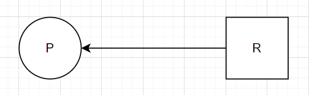
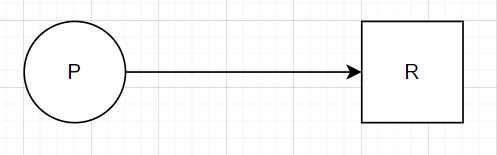
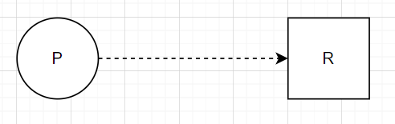
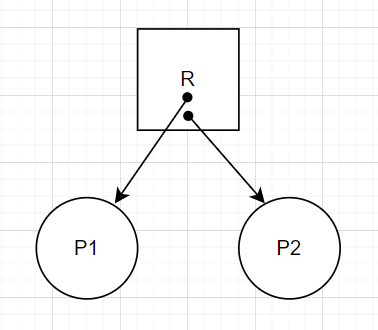
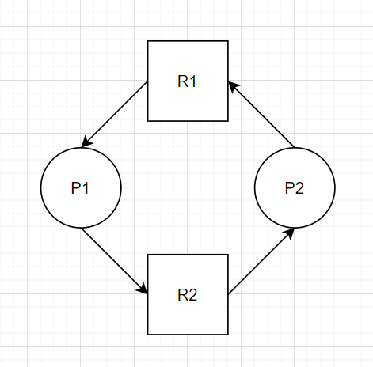
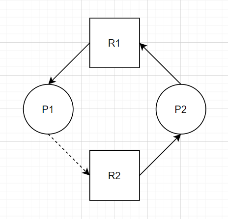

# 프로세스 동기화

## 프로세스 간 통신(IPC, Inter Process Communication)

- 프로세스 간 통신
  - 프로세스는 시스템 내에서 독립적으로 실행되기도 하고, 서로 데이터를 주고받으며 협업하기도 한다.
  - IPC란 프로세스가 다른 프로세스와 데이터를 주고받는 것을 의미한다.
    - 같은 컴퓨터 내에 있는 프로세스뿐만 아니라 네트워크로 연결된 다른 컴퓨터에 있는 프로세스와의 통신도 포함된다.
  - IPC는 겉으로 보기에는 데이터를 주고(send) 받는(receive) 매우 간단한 작업이지만, 내부적으로는 복잡한 과정을 거쳐 이루어진다.


### IPC의 분류

- 통신 방향에 따른 분류
  - 양방향 통신
    - 데이터를 동시에 양쪽 방향으로 전송할 수 있는 구조.
    - 일반적인 통신은 모두 양방향 통신이다.
    - 소켓 통신이 이에 해당한다.
  - 반양방향 통신
    - 데이터를 양쪽 방향으로 전송할 수 있지만 동시 전송은 불가능하고 특정 시점에 한쪽 방향으로만 전송할 수 있는 구조.
    - 무전기를 생각하면 된다.
  - 단방향 통신
    - 한쪽 방향으로만 데이터를 전송할 수 있는 구조.
    - 전역 변수나 파일, 파이프를 통핸 통신이 이에 해당한다.
  - 대부분의 통신은 양방향 통신이지만 전역 변수는 단방향 통신이다.
    - 만일 전역 변수를 사용하여 양방향 통신을 구현하려면 전역 변수를 2개 사용해야한다.


- 통신 구현 방식에 따른 분류
  - 바쁜 대기
    - 전역 변수를 사용하는 통신 방식의 가장 큰 문제는 언제 데이터를 보낼지 데이터를 받는 쪽에서는 모른다는 것이다.
    - 따라서 데이터를 받는 쪽에서는 반복적으로 전역 변수의 값을 점검해야한다.
    - 이처럼 상태 변화를 살펴보기위해 반복문을 무한 실행하며 기다리는 것을 바쁜 대기(busy wating)라 하며, 이는 나쁜 프로그램의 전형적인 예이다.
  - 바쁜 대기 문제를 해결하기 위해서는 데이터가 도착했음을 알려주는 동기화를 사용한다.
    - IPC는 동기화 기능 유무에 따라 대기가 있는 통신과 대기가 없는 통신으로 구분된다.
    - 대기가 있는 통신은 동기화 통신(synchronous communication), 대기가 없는 통신은 asyncronous communication이라고도 한다.
  - 대기가 있는 통신
    - 동기화를 지원하는 통신 방식.
    - 데이터를 받는 쪽은 데이터가 도착할 때까지 자동으로 대기 상태에 머물러 있다.
    - 파이프나 소켓이 이에 속한다.
  - 대기가 없는 통신
    - 동기화를 지원하지 않는 통신 방식.
    - 데이터를 받는 쪽은 바쁜 대기를 사용하여 데이터가 도착했는지 여부를 직접 확인한다.
    - 전역 변수와 파일을 이용한 통신은 대기가 없는 통신의 대표적인 예이다.
    - 대기가 없는 통신은 통신 오버헤드는 적지만 바쁜 대기처럼 사용자가 직접 처리해야 하는 작업이 많다.


### IPC 종류

- 프로세스 내부 데이터 통신
  - 하나의 프로세스 내에 2개 이상의 스레드가 존재하는 경우의 통신.
  - 프로세스 내부의 스레드는 전역 변수나 파일을 이용하여 데이터를 주고 받으며, 이는 운영체제의 도움 없이 진행된다.
  - 전역 변수를 이용한 통신
    - 공동으로 관리하는 메모리를 사용하여 데이터를 주고 받는 방식이다.
    - 데이터를 보내는 쪽에서 전역 변수나 파일에 값을 쓰고, 데이터를 받는 쪽에서 전역 변수의 값을 읽는다.
    - 전역 변수를 사용한 통신은 주로 부모 프로세스와 자식 프로세스 같이 직접적으로 관련이 있는 프로세스 간에 사용한다.
    - 전역 변수의 값이 변경되었는지 알 수 있는 방법이 없으므로, 전역 변수의 값이 변경되었는지를 계속 확인해야 한다(즉, 동기화에 문제가 있다).
  - 파일을 이용한 통신
    - 저장장치에 파일을 저장하고, 이 파일을 통해 다른 프로세스와 통신을 하는 방식이다.
    - 한 프로세스가 파일에 데이터를 쓰면, 다른 프로세스가 해당 파일에 쓰인 내용을 읽는 방식으로 통신이 이루어진다.
    - 전역 변수를 이용한 통신과 마찬가지로, 데이터를 받아오는 쪽에서는 파일의 내용이 변경되었는지 계속 확인해야하므로 동기화가 문제가 된다.


- 프로세스 간 데이터 통신
  - 같은 컴퓨터에 있는 여러 프로세스끼리의 통신.
  - 공용 파일 또는 운영체제가 제공하는 파이프를 통해 통신한다.
  - 소켓을 이용하면 같은 컴퓨터에 있는 서로 다른 프로세스 끼리도 통신이 가능하지만, 속도가 느리기에 굳이 할 경우는 없다.
  - 파이프를 이용한 통신
    - 파이프는 운영체제가 제공하는 동기화 통신 방식이다.
    - 기본적으로 단방향 통신이며, 양방향 통신을 위해서는 파이프 2개를 사용해야한다.
    - 파이프에 쓰기 연산을 하면 데이터가 전송되고, 읽기 연산을 하면 데이터를 받아온다.
    - 만약 한 프로세스가 파이프에 대해 읽기 연산을 수행했는데 다른 프로세스가 파이프에 쓰기 연산을 아직 하지 않았다면 읽기 연산을 수행한 프로세스는 대기 상태가 된다.
    - 다른 프로세스가 파이프에 대이터를 쓰는 순간 자동으로 대기 상태가 풀리는 방식으로 동기화가 이루어지므로, 바쁜 대기를 하지 않아도 된다.
    - 이름 없는 파이프(anonymous pipe)와 이름 있는 파이프(named pipe)로 나뉘며, 이름 없는 파이프는 주로 부모와 자식 혹은 같은 부모를 가진 자식 프로세스들 사이의 통신에 사용되고, 이름 있는 파이프는 FIFO라 불리는 특수 파일을 사용하여 서로 관련 없는 프로세스 간 통신에 사용된다.


- 네트워크를 통한 통신
  - 여러 컴퓨터가 네트워크로 연결되어 있을 때 서로 다른 컴퓨터의 프로세스 사이의 통신으로, 네트워킹이라고도 한다.
  - 소켓을 사용하여 네트워킹이 이루어진다.
    - 다른 컴퓨터에 있는 함수를 호출하여 통신하는 방식을 원격 프로시저 호출(RPC, Remote Procedure Call)이라 한다.
    - 원격 프로시저 호출은 소켓을 사용하여 구현한다.
    - 프로세스 동기화를 지원하므로 데이터를 받는 쪽의 프로세스가 바쁜 대기를 하지 않아도 된다.
    - 양방향 통신을 위해 파이프 방식은 2개의 파이프를 필요로했지만, 소켓 방식은 하나의 소켓으로도 양방향 통신이 가능하다.


- 모든 통신에 관련된 연산은 아래와 같은 구조이다.

  > 파일뿐 아니라 소켓 등의 모든 통신 방식에 적용되며, 아래 순서에 따라 실행된다.

  - open()
    - 통신할 데이터를 작성하기 위해 데이터가 작성될 대상을 연다.
  - read()/write()
    - 데이터가 작성될/작성된 대상을 읽는/쓴다.
  - close()
    - 데이터가 작성된 대상을 닫는다.


## 공유 자원과 임계구역

- 공유 자원의 접근
  - 공유 자원(Shared resource)
    - 여러 프로세스가 공동으로 이용하는 변수, 메모리, 파일 등을 말한다.
  - 공유 자원은 공동으로 이용되기 때문에 누가 언제 데이터를 읽거나 쓰냐에 따라 그 결과가 달라질 수 있다.
    - 따라서 프로세스들의 공유 자원 접근 순서를 정하여 예상치 못한 문제가 발생하지 않도록 해야한다.
  - 경쟁 조건(race condition)
    - 두 개 이상의 프로세스가 공유 자원을 병행적으로 읽거나 쓰는 상황을 의미한다.
    - 경쟁 조건이 발생하면 공유 자원 접근 순서에 따라 실행 결과가 달라질 수 있다.


- 임계구역(Critical section)

  - 공유 자원 순서에 따라 실행 결과가 달라지는 프로그램의 영역을 임계 구역이라한다.
    - 따라서 임계 구역으로 지정된 영역에서는 여러 프로세스들이 동시에 작업을 해선 안 된다.
    - 어떤 프로세스가 임계 구역에 들어가면 다른 프로세스는 임계구역 밖에서 기다려야 하며 임계구역의 프로세스가 나와야 임계구역에 들어갈 수 있다.

  - 생산자 소비자 문제(Producer-Consumer Problem)
    - 임계구역과 관련된 전통적인 문제이다. 
    - 생산자는 계속 버퍼에 데이터를 넣고, 소비자는 계속 버퍼에서 데이터를 가져오는데, 이를 위해 버퍼는 원형 버퍼를 사용한다.
    - 또한 버퍼가 비었는지 혹은 가득 찼는지를 확인하기 위해 저장된 데이터의 양을 저장하는 sum이라는 전역 변수를 사용한다.
    - 문제는 생산자 코드와 소비자 코드가 동시에 실행되어 생산자와 소비자가 동시에 전역 변수 sum에 접근할 경우  발생한다.
    - 생산자는 원형 버퍼에 데이터를 추가한 후 sum을 증가시키고, 소비자는 데이터를 가져온 후 sum을 감소시키는데, 이 작업이 동시에 실행될 경우 sum의 값이 부정확해질 수 있다.
  - 임계 구역의 해결 조건
    - 상호 배제(mutual exclusion): 한 프로세스가 임계구역에 들어가면, 다른 프로세스는 임계구역에 들어갈 수 없게 막는다.
    - 한정 대기(bounded wating): 어떤 프로세스도 임계구역에 들어가지 못한 채 계속 대기해선 안된다.
    - 진행의 융통성(progress flexibility): 한 프로세스가 다른 프로세스의 진행을 방해해선 안 된다.


### 임계구역 해결 방법

- 잠금을 사용한 간단한 해결 방법

  - Boolean 값을 사용해 임계구역이 잠금 상태인지 아닌지를 확인한 후 코드를 실행한다.
    - 아래 예시는 잔금을 10 증가시키는 코드로, 잔금을 변경하는 부분은 여러 프로세스가 동시에 수행해선 안 되는 임계구역이다.
    - 따라서 임계구역 진입 전에 lock을 true로 전환하여 다른 프로세스가 임계구역에 진입할 수 없도록 막고, 잔금 변경을 완료하고 임계구역을 빠져나오면서 lock을 false로 전환하여 다른 프로세스가 임계구역에 진입할 수 있도록 한다.

  ```c
  #include <stdio.h>
  
  // c에는 boolean type이 없으므로 boolean type을 정의해준다.
  typedef enum {false, true} boolean;
  // 임계구역 잠금 여부를 표현하기 위한 변수인 lock을 선언한다.
  extern boolean lock=false;
  extern int balance;
  
  main(){
      // lock이 true면 다른 프로세스들은 while문에서 loop를 돌게되고, 임계구역으로 진입하지 못 한다.
      while(lock==true);
      lock=true;
      balance=balance+10
      lock=false;
  }
  ```

  - 위 코드의 문제
    - 프로세스 P1이 while문의 실행을 마치고 lock을 true로 변경하는 코드를 실행하려는 순간 타임아웃이 발생하여 문맥 교환이 발생한다.
    - 문백 교환으로 실행권을 얻은 다른 프로세스 P2가  while문을 실행하는데, lock은 아직 false인 상태이므로, 바로 while문을 빠져나와 lock을 true로 변경하고 임계구역에 진입하는데, 또 다시 문맥교환이 발생한다.
    - 문맥 교환으로 다시 실행권을 얻은 P1역시 lock을 true로 변경하고 임계구역에 진입한다. 
    - 위처럼 둘 이상의 프로세스가 동시에 임계구역에 진입할 수 있다는 문제가 있다.
    - 즉 상호 배제 조건을 위반한다.
    - 또한 한 프로세스가 임계구역에 있는 동안 다른 프로세스들은 whild문에서 lock이 false로 변경되었는지를 지속적으로 확인하므로 바쁜 대기를 하게된다.

  - 위 문제를 해결하기 위한 코드
    - lock 변수 2개를 생성하여 하나는 P1이, 다른 하나는 P2가 사용하고, 둘 중 하나라도 true라면 한 process가 임계구역에 진입했다는 뜻이므로 while문에서 대기한다.

  ```c
  #include <stdio.h>
  
  typedef enum {false, true} boolean;
  extern boolean lock1=false;
  extern boolean lock2=false;
  extern int balance;
  
  // 프로세스 P1
  main(){
      lock1=true;
      while(lock2==true);
      balance=balance+10
      lock1=false;
  }
  
  // 프로세스 P2
  main(){
      lock2=true;
      while(lock1==true);
      balance=balance+10
      lock2=false;
  }
  ```

  - 위 코드의 문제
    - 여전히 바쁜 대기를 해야 하고, 프로세스의 개수만큼 공유 변수를 생성해야한다는 것 외에도 아래와 같은 문제가 있다.
    - P1이 lock1을 true로 변경하고 문맥 교환이 발생하여 P2가 실행 상태로 변경된다.
    - P2도 lock2를 true로 변경하고 문맥 교환이 발생하여 P1이 실행 상태로 변경된다.
    - 둘 다 while문에 막혀 무한 루프에 빠진다.
    - 따라서 한정 대기 조건을 위배한다.
  - 위 문제를 해결하기 위한 코드
    - lock 변수를 boolean type이 아닌 int type으로 선언하고 몇 번 프로세스가 임계구역을 점유중인지를 저장한다.
    - 아래 방식을 통헤 상호 배제와 한정 대기를 보장할 수 있다.

  ```c
  #include <stdio.h>
  
  extern int lock;
  extern int balance;
  
  // 프로세스 P1
  main(){
      while(lock==2);
      balance=balance+10
      lock=2;
  }
  
  // 프로세스 P2
  main(){
      while(lock==1);
      balance=balance+10
      lock=1;
  }
  ```

  - 위 코드의 문제
    - 바쁜 대기가 아직도 남아있다는 문제 외에도 아래와 같은 문제가 있다.
    - 무조건 둘이 번갈아가며 실행되어야 한다는 문제가 있다.
    - 한 프로세스가 연속하여 임계 구역에 진입할 수 없다.
    - 즉, 위 코드는 진행의 융통성 조건을 위배한다.
    - 이처럼 프로세스의 진행이 다른 프로세스로 인해 방해받는 현상을 경직된 동기화(lockstep synchronization)라 한다.


- 피터슨 알고리즘(Peterson's Solution)

  - 임계구역 문제를 해결하기 위해 Gary Peterson이 제안한 알고리즘이다.
  - turn이라는 공유 변수를 사용한다.
    - P1은 임계구역에 진입하기 전에 먼저 잠금을 한 후 turn을 2로 설정한다.
    - 변수 turn은 두 프로세스가 동시에 lock을 설정하여 임계구역에 못 들어가는 상황, 즉 무한 대기 상황에 대비하기 위한 장치이다.
    - 즉 두 프로세스가 동시에 lock을 설정했더라도 turn을 사용하여 다른 프로세스에게 양보한다.
    - 예를 들어 P1이 lock1을 true로 변경하고 P2로 제어권이 넘어갔다.
    - 이 상태에서 P2는 turn=1까지 실행하고 P1으로 제어권이 넘어갔다.
    - P1은 turn=2를 이어서 실행하고, lock1=true, lock2=true, turn=2인 상태이므로 while문에서 대기한다.
    - 그러다 문맥 교환으로 P2로 제어권이 넘어가고, turn=2이므로 P2는 while문을 빠져나와 임계구역에 진입한다.

  ```c
  #include <stdio.h>
  
  typedef enum {false, true} boolean;
  extern boolean lock1=false;
  extern boolean lock2=false;
  extern int tern=1;
  extern int balance;
  
  // 프로세스 P1
  main(){
      lock1=true;
      turn=2;
      while(lock2==true && turn==2);
      balance=balance+10
      lock1=false;
  }
  
  // 프로세스 P2
  main(){
      lock2=true;
      turn=1;
      while(lock1==true && turn==1);
      balance=balance+10
      lock2=false;
  }
  ```

  - 한계
    - 임계구역 해결의 세 가지 조건을 모두 만족하지만, 프로세스가 증가할수록 공유 변수를 추가하고 코드를 변경해야한다는 한계가 있다.
    - 또한 현대적인 컴퓨터의 경우 성능 향상을 위해 프로세스 또는 컴파일러가 종속성이 없는 읽기 또는 쓰기 작업의 순서를 바꿀 수 있으므로 임계구역 해결의 조건을 만족하지 못 할 수 있다.
    - 또한 이 방식 역시 바쁜 대기를 사용한다.


- 데커 알고리즘(Dekker's Algorithm)

  - 임계구역 문제를 해결하기 위해 Theodorus Dekker가 제안한 알고리즘이다.
  - 마찬가지로 turn을 사용한다.
    - P1은 우선 잠금을 건다.
    - P2의 잠금이 걸렸는지 확인하고, 걸리지 않았다면 임계구역에 진입한다.
    - P2의 잠금이 걸렸다면 누가 먼저인지 turn을 통해 확인한다(`if(turn==2)`).
    - 만약 P1의 차례라면(즉, turn==1이라면), 임계구역으로 진입한다.
    - 만약 P2가 먼저라면 P1은 잠금을 풀고 while문에 진입하여 P2가 임계구역을 벗어날때까지 대기하고, P2가 임계구역을 벗어나면 lock을 걸고(`lock1=true`) 임계구역으로 진입한다.

  ```c 
  #include <stdio.h>
  
  typedef enum {false, true} boolean;
  extern boolean lock1=false;
  extern boolean lock2=false;
  extern int tern=1;
  extern int balance;
  
  // 프로세스 P1
  main(){
      lock1=true;
      while(lock2==true){
          if(turn==2) {
              lock1=false;
              while(turn==2);
              lock1=true;
          }
      }
      balance=balance+10
      turn=2;
      lock1=false;
  }
  
  // 프로세스 P2
  main(){
      lock2=true;
      while(lock1==true){
          if(turn==1) {
              lock2=false;
              while(turn==1);
              lock2=true;
          }
      }
      balance=balance+10
      turn=1;
      lock2=false;
  }
  ```

  - 한계
    - 임계구역 해결의 세 가지 조건을 모두 만족하지만 매우 복잡하다는 문제가 있다.
    - 프로세스가 증가함에 따라 공유 변수도 늘어나고 전체적인 코드도 복잡해진다.
    - 또한 이 역시 바쁜 대기를 사용한다는 문제가 있다.


- 세마포어(Semaphore)

  - 이전 알고리즘들의 문제점
    - 앞의 알고리즘들은 모두 바쁜 대기를 사용하여 자원을 낭비한다.
    - 프로세스가 증가할수록 코드의 복잡도가 올라간다.
  - 세마포어
    - 이전 알고리즘들의 문제점을 해결하기위해 Edsger Dijkstra가 제안한 알고리즘이다.
    - 임계구역에 진입하기 전에 flag를 사용중으로 변경한 후 임계구역으로 들어간다.
    - 이후 도착하는 프로세스는 앞의 프로세스가 작업을 마칠 때까지 대기한다.
    - 프로세스가 작업을 마치면 세마포어는 다음 프로세스에 임계구역을 사용하라는 동기화 신호를 보낸다.
    - 세마포어는 다른 알고리즘과 달리 임계구역이 잠겼는지 직접 점검하지 않아도 되므로, 바쁜 대기를 할 필요가 없다.
  - Pseudo code
    - 세마포어는 사용 전에 초기 설정을 하는데, 이 때 공유 가능한 자원의 수를 받는다(`Semaphore(n)`).
    - 임계구역에 진입하기 전에 임계구역을 사용중이라는 표시를 하고(`P()`), 임계구역을 나올 때 임계구역이 비었다는 표시를 한다(`V()`).

  ```python
  Semaphore(n)
  P()
  # 임계구역
  V()
  ```

  - 작동 과정
    - `Semaphore(n)`를 통해 현재 사용 가능한 자원의 개수를 저장하는 전역 변수 RS를 n으로 초기화한다.
    - `P()`를 실행하여, RS가 0보다 크면(가용한 자원이 있으면) 1만큼 감소시키고 임계구역에 진입하고, 0이면 0보다 커질 때 까지 기다린다.
    - `V()`를 통해 RS값을 1 증가시키고 세마포어에서 기다리는 프로세스에게 임계구역에 진입하라는 wake_up 신호를 보낸다.
    - 세마포어에서 잠금이 해제되기를 기다리는 프로세스는 중단된 상태로 세마포어 큐에 저장되어 있다가 wake_up 신호를 받으면 큐에서 나와 다시 실행되며 임계구역에 진입한다.
    - 세마포어 큐에 저장될 때 프로세스는 중단된 상태가 되므로 바쁜 대기가 발생하지 않는다.
  - 문제점
    - 세마포어의 문제는 세마포어 자체의 문제라기 보다는 구현상의 실수가 발생했을 때  임계구역 해결의 조건을 위배하게 된다는 것이다.


- 모니터

  - 공유 자원을 내부적으로 숨기고 공유 자원에 접근하기 위한 인터페이스만 제공함으로써 자원을 보호하고 프로세스들을 동기화시킨다.
    - 임계구역에 접근하고자 하는 프로세스는 `P()`나 `V()`를 직접 사용하지 않고, 인터페이스를 통해 모니터에 작업 요청을 한다.
    - 모니터는 요청받은 작업을 모니터 큐에 저장한 후 순서대로 처리하고 그 결과만 해당 프로세스에 알려준다.

  - 구현상의 실수가 발생하면 임계구역 해결의 조건을 위배하게 되는 세마포어의 문제점을 극복하기 위해 사용한다.
    - 즉, 정확히 구현된 세마포어를 모니터에 구현해두고, 세마포어를 사용하기 위한 인터페이스를 프로세스들에게 제공하여 프로세스들이 각기 세마포어를 구현함으로써 발생할 수 있는 문제를 방지하기 위해 사용한다.


# 교착 상태

- 교착 상태(dead lock)
  - 2개 이상의 프로세스가 다른 프로세스의 작업이 끝나기만 기다리며 작업을 더 이상 진행하지 못하는 상태.
  - 아사 현상과의 차이
    - 아사 현상은 운영체제게 잘못된 정책을 사용하여 특정 프로세스의 작업이 지연되는 문제이다.
    - 교착 상태는 여러 프로세스가 작업을 진행하기 때문에 발생하는 문제이다.
    - 즉 교착상태는 정책상 잘못이나 오류가 없어도 자연적으로 발생한다.
    - 아사 현상은 몇 번 이상 양보했다면 더 이상 양보하지 않도록 조정하는 에이징으로 해결할 수 있다.


- 교착 상태가 발생하는 경우
  - 시스템 자원에서의 교착상태
    - 여러 프로세스가 동시에 사용할 수 없는 시스템 자원을 할당받은 후 양보하지 않는 경우 교착 상태가 발생할 수 있다.
    - 예를 들어 프린터, 스캐너가 임계구역으로 보호된다고 할 때, 한 프로세스는 프린터를 할당받은 후 스캐너를 기다리고, 다른 프로세스는 스캐너를 할당받은 후 프린터를 기다린다면, 교착상태가 발생하게 된다.
  - 공유 변수
    - 한 프로세스는 A라는 공유변수를 할당 받고 B라는 공유 변수를 기다리고, 다른 프로세스는 공유변수 B를 할당받고 공유변수 A를 기다릴 경우 교착상태가 발생할 수 있다.
  - 응용 프로그램
    - 두 개의 프로세스가 동일한 응용 프로그램을 사용하면서도 교착 상태가 발생할 수 있다.


- 자원 할당 그래프(Resource Allocation Graph)

  - 프로세스가 어떤 자원을 사용 중이고 어떤 자원을 기다리고 있는지를 유향 그래프(directional graph)로 표현한 것이다.

  - 아래와 같은 정보를 확인할 수 있다.

    - 떤 프로세스에 자원이 할당되어 있는지.
    - 어떤 프로세스가 자원을 기다리고 있는지.

  - 프로세스는 원으로, 자원은 사각형으로 표현한다.

    - 자원을 사용하고 있는 경우(프로세스에 자원이 할당된 경우)는 자원으로부터 프로세스로 향하는 화살표로 표시한다.

    

    - 프로세스가 자원을 기다리는 경우는 프로세스로부터 자원으로 향하는 화살표로 표시한다.

    

    - 만약 프로세스가 자원을 요청할 수도 있으면 점선으로, 프로세스가 자원을 요청했으면 실선으로 표시한다.

    

    - 여러 프로세스가 하나의 자원을 동시에 사용하는 것을 다중 자원(multiple resource)라 부르며, 다중 자원은 수용할 수 있는 프로세스 수를 사각형 안에 작은 동기라미로 표현한다.

    

    - 교착 상태는 아래와 같이 표현할 수 있다.

    

    - 아래의 경우 교착 상태가 발생할 수도 있는 상황이지 교착 상태는 아니다.

    


- 교착 상태 필요 조건

  > 아래 4가지 조건을 모두 충족해야 교착 상태가 발생하기에 필요 조건이라 부른다.

  - 상호 배제(mutual exclusion)
    - 한 프로세스가 사용하는 자원은 다른 프로세스와 공유할 수 없는 배타적인 자원이어야한다.
    - 배타적인 자원은 임계구역으로 보호되기 때문에 다른 프로세스가 동시에 사용할 수 없다.
    
  - 비선점(non-preemption)
    - 한 프로세스가 사용 중인 자원은 중간에 다른 프로세스가 빼앗을 수 없는 비선점 자원이어야 한다.
    
  - 점유와 대기(hold and wait)
    - 프로세스가 어떤 자원을 할당받은 상태에서 다른 자원을 기다리는 상태여야 한다.
    
  - 원형 대기(circular wait)
    - 점유와 대기를 하는 프로세스 간의 관계가 원형을 이루어야한다.
    - 프로세스가 특정 자원에 대해 점유와 대기를 한다고 해서 모두 교착 상태에 빠지는 것은 아니다.
    - 점유와 대기를 하는 프로세스들이 서로 원형을 이루면 프로세스들이 서로 양보하지 않기 때문에 교착 상태에 빠진다.
    
    - 다중 자원의 경우 사이클이 있다고 해서 모두 교착 상태가 되는 것은 아니다.


- 임계구역과 교착 상태
  - 상호 배제와 비선점은 임계구역과 관련이 있다.
  - 임계구역을 보호하기 위해 잠금 장치를 사용하면 상호 배제와 비선점 조건이 보장되기 때문에 교착 상태가 발생할 수 있다.
  - 그러나 임계구역으로 보호되는 모든 자원이 교착 상태를 유발하는 것은 아니다.
  - 임계구역의 자원을 사용하는 프로세스들이 점유와 대기, 원형 대기 상황에 처하면 교착 상태가 발생한다.


- 식사하는 철학자 문제
  - 교착 상태를 설명하기 위해 자주 사용되는 예시이다.
  - 상황
    - 다섯 명의 철학자가 원탁에 앉아 있고 각자의 앞에는 스파게티가 놓여있으며 양 옆에는 포크가 놓여있다.
    - 철학자가 스파게티를 먹기 위해서는 양 옆의 포크를 동시에 들어야한다.
  - 조건
    - 각각의 철학자는 다른 철학자에게 말을 할 수 없다. 
    - 포크를 공유할 수 없다. 
    - 다른 철학자의 포크를 뺏을 수 없다.
  - 문제
    - 각각의 철학자가 왼쪽의 포크를 들고 그 다음 오른쪽의 포크를 들어 스파게티를 먹는 알고리즘을 가지고 있다고 가정해보자. 
    - 다섯 철학자는 동시에 왼쪽의 포크를 들 수 있으나 오른쪽의 포크는 자신들의 오른쪽의 철학자가 가져간 상태이기 때문에 다섯명 모두가 서로를 무한정 기다리는 교착 상태에 빠질 수 있다.
  - 식사하는 철학자 문제와 교착 상태 필요 조건
    - 상호 배제: 포크는 한 철학자가 사용하면 다른 철학자가 사용할 수 업는 배타적 자원이다.
    - 비선점: 철학자는 다른 철학자가 사용중인 포크를 뺏을 수 없다.
    - 점유와 대기: 철학자가 한 포크를 점유하고 다른쪽 포크를 기다려야 한다.
    - 원형 대기: 철학자들은 원탁에서 식사를 한다. 원형이라는 것은 선후 관계를 결정할 수 없다는 의미로, 만일 사각형 식탁이라면 맨 왼쪽에 앉은 철학자부터 식사를 하고 마치면 다음 철학자로 넘어가는 식으로 해결이 가능하다.


## 교착 상태 해결 방법

- 교착 상태 예방(prevention)

  - 교착 상태를 유발하는 필요 조건이 발생하지 않도록 무력화하는 방식.
    - 실효성이 적어 잘 사용되지는 않는다.
  - 상호 배제 예방
    - 상호 배타적인 자원을 없애버리는 방법.
    - 시스템 내에 공유할 수 있는 자원만 남김으로서 교착 상태를 예방하는 방법이다.
    - 현실적으로 적용하기는 어렵다.
  - 비선점 예방
    - 모든 자원을 뺏을 수 있도록 만드는 방식이다.
    - 임계구역을 보호하기 위해 잠금을 사용하면 자원을 빼앗을 수 없을 뿐만 아니라 상호 배제도 보장할 수 없으므로 사실상 이 방식은 사용할 수 없다.
    - 또한 이 방식은 아사 현상을 발생시킬 위험이 높은데, 높은 우선순위를 가진 프로세스가 낮은 우선순위를 가진 프로세스의 자원을 무조건 뺏을 수 있다면 낮은 우선순위를 가진 프로세스는 아사 현상에 빠지게 된다.
    - 에이징을 적용한다면, 낮은 우선순위가 몇 번 양보한 후 자원을 점유했을 때 다른 프로세스가 이를 뺏지 못하게 막아야 하는데 이는 비선점 예방 방식에 어긋나므로 막을 수 없다. 
    - 따라서 에이징을 통해 자원을 점유하더라도 우선 순위가 높은 프로세스에 바로 점유를 뺏기게 되므로 에이징을 적용하더라도 아사 현상을 막을 수 없다.
  - 점유와 대기 예방
    - 프로세스가 자원을 점유한 상태에서 다른 자원을 기다리지 못하게 하는 방식이다.
    - 전부 할당하거나 아예 할당하지 않는 방식을 적용하는 것이다.
    - 이를 위해 프로세스는 시작시에 자신이 사용하려는 자원을 한꺼번에 점유해야한다.
    - 그러나 프로세스가 자신이 사용하는 모든 자원을 자세이 알기 어렵고, 자원을 비효율적으로 사용하게 되며, 결국 일괄 작업 방식으로 동작하게 되는 등의 단점이 있따.

  - 원형 대기 예방
    - 점유와 대기를 하는 프로세스들이 원형을 이루지 못하게 하는 방법이다.
    - 자원을 한 방향으로만 사용하다록 설정함으로써 원형 대기를 예방할 수 있다.
    - 모든 자원에 숫자를 부여하고 숫자가 큰 방향으로만 자원을 할당하는 것이다. 즉 숫자가 작은 자원을 점유한 상태에서 숫자가 큰 자원을 대기하는 것은 허용하지만 그 반대는 허용하지 않는다.
    - 이는 프로세스 작업 진행의 유연성이 떨어지고, 자원에 번호를 어떻게 매길 것인지가 문제가 된다.


- 교착 상태 회피(avoidance)

  - 프로세스에 자원을 할당할 때 어느 수준 이상의 자원을 나누어주면 교착 상태가 발생하는지 파악 후 그 수준 이하로 자원을 나눠주는 방식이다.

    - 교착 상태가 발생하지 않는 범위 내에서만 자원을 할당하고, 교착 상태가 발생하는 범위에 있으면 프로세스를 대기시킨다.
    - 자원을 많이 할당할수록 교착 상태가 발생할 확률이 커지는데, 회피 기법은 할당되는 자원의 수를 조절하여 교착 상태를 회피한다.

  - 자원의 총수와 현재 할당된 자원의 수를 기준으로 시스템을 안정 상태(safe state)와 불안정 상태(unsafe state)로 나누고 시스템이 안정 상태를 유지하도록 자원을 할당한다.

    - 할당된 자원이 적으면 안정 상태가 크고, 할당된 자원이 늘어날수록 불안정 상태가 커진다.
    - 불안정 상태에서 항상 교착 상태가 발생하는 것은 아니지만, 교착 상태가 발생할 가능성이 높아지게 된다.
    - 회피 기법은 안정 상태를 유지할 수 있는 범위 내에서 자원을 할당함으로써 교착 상태를 회피한다.

  - 은행원 알고리즘(Banker's algorithm)

    - 다익스트라가 제안한 알고리즘이다.
    - 대출 금액이 대출 가능한 범위 내면 대출을 해주고, 그렇지 않으면 대출을 해주지 않는 것과 같이 안정 상태일 때만 자원을 할당해주는 방식이다.
    - 전체 자원: 시스템 내 전체 자원의 수
    - 최대 자원: 각 프로세스가 선언한 최대 자원의 수
    - 할당 자원: 각 프로세스에 현재 할당된 자원의 수
    - 가용 자원: 시스템 내 현재 사용할 수 있는 자원의 수(전체 자원 - 모든 프로세스의 할당 자원)
    - 기대 자원: 각 프로세스가 앞으로 사용할 자원의 수(최대 자원 - 할당 자원)
    - 각 프로세스의 기대 자원과 비교하여 가용 자원이 크거나 같으면 자원을 할당한다.
    - 가용 자원이 기대 자원보다 크다는 것은 그 자원을 사용하여 작업을 끝낼 수 있는 프로세스가 있다는 의미이므로 안정 상태이다.
    - 가용 자원이 기대 자원보다 작을 경우에는 가용 자원을 사용하여 작업을 마칠 수 있는 프로세스가 없다는 의미이므로 불안정 상태이다.

    - 전체 자원이 12이고, 각 프로세스가 아래와 같을 때 가용 자원은 3(=12-3-5-1)이다.

    | process | Max  | Allocation | Expect |
    | ------- | ---- | ---------- | ------ |
    | P1      | 7    | 3          | 4      |
    | P2      | 8    | 5          | 3      |
    | P3      | 5    | 1          | 4      |

    - 위 표의 상황은 안정 상태인데, 그 이유는 현재 가용한 자원이 3인데 P2의 기대 자원이 3개이기 때문이다.
    - 따라서 P2에 가용 자원을 모두 할당하고, P2가 작업을 마친 뒤에 8개의 자원을 P1과 P3에 분배하면 다른 두 프로세스도 작업을 마칠 수 있기 때문이다.
    - 반면에 P2가 아닌 P1이나 P3에 가용 자원을 분배할 경우 가용 자원이 기대 자원에 미치지 못하기 때문에 불안정 상태가 된다.
    - 따라서 은행원 알고리즘에서는 현재 실행중인 프로세스 가운데 하나라도 끝낼 수 있을 때 가용 자원을 할당해야한다.

  - 교착 상태 회피의 문제점

    - 프로세스가 자신이 사용할 자원을 미리 선언해야한다.
    - 자원이 낭비된다(충분한 자원이 있더라도 회피 기법에서는 최대한 보수적으로 자원을 할당한다).
    - 시스템 전체의 자원 수가 변하는 경우 사용할 수 없다(시스템 전체의 자원 수가 변경될 경우 안정 상태, 불안정 상태 파악을 다시 해야한다).


- 교착 상태 검출(detection)

  - 운영체제가 프로세스의 작업을 관찰하면서 교착 상태 발생 여부를 계속 주시하는 방식

    - 실제로 구현하기 어려운 예방 기법이나, 구현은 가능하지만 자원을 낭비하는 문제가 있는 회피 방법에 비해 현실적인 방법으로, 실제로 많이 쓰인다.
    - 교착 상태가 발견될 경우 교착 상태 회복 단계를 실행한다.

  - 타임아웃을 이용한 교착 상태 검출(가벼운 교착 상태 검출)

    - 일정 시간 동안 작업이 진행되지 않은 프로세스를 교착 상태가 발생한 것으로 간주하여 처리하는 방식.
    - 교착 상태가 자주 발생하지 않을 것이라는 가정하에 사용하는 방식이다.
    - 교착 상태가 아닌 프로세스를 종료시킬 위험이 있고, 여러 기기에 분산되어 실행되는 프로세스의 경우 적용이 어렵다.
    - 예를 들어 각기 다른 서버에 설치된 분산 시스템에서 다른 서버에 설치된 프로세스가 교착상태인지 확인하고자 요청을 보냈는데 응답이 없다면, 이것이 네트워크 문제인지, 교착 상태 문제인지 알기가 어렵다.

    - 위와 같은 단점에도 불구하고, 구현의 단순성으로 인해 많은 운영체제가 채택하는 방식이다.

  - 자원 할당 그래프를 이용한 교착 상태 검출(무거운 교착 상태 검출)

    - 운영체제는 프로세스로부터 자원을 요청 받거나, 프로세스에 자원을 할당할 때 자원 할당 그래프를 갱신한다.
    - 갱신된 그래프를 확인하여 사이클이 있으면 교착 상태가 검출된 것으로 판단한다.


- 교착 상태 회복(recovery)

  - 교착 상태가 검출되면 교착 상태를 해결하는 후속 작업이다.
    - 교착 상태를 유발한 프로세스를 강제로 종료한다.

  - 프로세스를 종료 시키는 방식
    - 교착 상태를 일으킨 모든 프로세스를 동시에 종료
    - 교착 상태를 일으킨 프로세스 중 하나를 골라 순서대로 종료


# 물리 메모리 관리

- 메모리 관리의 복잡성
  - 메모리의 구조는 1B 크기로 나뉜다.
    - 1B로 나뉜 각 영역은 메모리 주소로 구분하는데 보통 0번지부터 시작한다.
    - CPU는 메모리에 있는 내용을 가져오거나 작업 결과를 메모리에 저장하기 위해 메모리 주소 레지스터(MAR, Memory Address Register)를 사용한다.
    - 메모리 주소 레지스터에 필요한 메모리 주소를 넣으면 데이터를 메모리에서 가져오거나 메모리에 데이터를 옮길 수 있다.
  - 폰노이만 구조의 컴퓨터에서 메모리는 유일한 작업 공간이며 모든 프로그램은 메모리에 올라와야 실행이 가능하다.
    - 과거의 일괄 처리 시스템에서는 한 번에 한 가지 작업만 처리했기 때문에 메모리 관리가 어렵지 않았다.
    - 오늘날의 시분할 시스템에서는 운영체제를 포함한 모든 응용 프로그램이 메모리에 올라와 실행되기 때문에 메모리 관리가 복잡하다.
    - 운영체제 역시 프로그램이므로 메모리에 올라와야 실행할 수 있으며, 부팅시에 하드디스크에 저장된 운영체제가 메모리에 올라간다.


- 메모리 관리의 이중성
  - 프로세스 입장에서는 메모리를 독차지하려 하고, 메모리 관리자 입장에서는 메모리를 되도록 효율적으로 관리하고 싶어하는 것을 말한다.
  - 현대의 메모리 관리 시스템(MMS, Memory Management System)은 프로세스와 메모리 관리자의 상충되는 요구사항을 완벽하게 처리한다.


- 소스 코드의 번역과 실행

  - 컴파일러와 인터프리터의 동작
    - 컴퓨터에서 작동하는 응용 프로그램은 프로그래밍 언어로 만들며, 보통은 컴파일러를 사용하여 작성한 프로그램을 실행 가능한 코드로 변경한다.
    - 기계어와 어셈블리어는 컴퓨터의 동작을 가장 직접적으로 표현한 low level language이다.
    - 컴파일러와 인터프리터는 high level language로 작성된 프로그램을 low level language로 번역하는 역할을 한다.
  - 컴파일러의 동작 방식 예시
    - 컴파일러는 아래 조리법을 한 번에 읽어서 오류를 발견하고 최적화한다.
    - 예를 들어 아래를 한 줄씩 읽는다고 하면 양파와 감자 그리고 당근 2개를 준비할 것이지만, 사실 감자는 쓰이지 않는데, 아래에 어떤 내용이 나올지 모르므로 이를 알 수 없어 불필요한 감자를 준비하게 된다.
    - 그러나 모두 읽고 실행한다면 감자가 필요없다는 사실을 미리 알고 이를 뺄 수 있다.
    - 또한 재료 손질 단계와 요리 단계에서 2개의 당근을 각자 하나씩 자르는데, 모든 과정을 알고 있다면 당근 2개를 한 번에 자를 수 있게 된다.
    - 또한 한 줄씩 읽을 경우 간장은 재료에 들어있지 않은데 요리 단계에 있으므로 마지막에 이르러서야 간장이 필요하다는 것을 알게 되지만, 전체를 한 번에 읽으면 재료에 간장이 빠져 있다는 것을 미리 알 수 있다.

  ```
  재료 준비
  - 양파 1개
  - 당근 2개
  - 감자 1개
  
  재료 손질
  - 당근 1개를 자른다.
  - 양파 1개를 자른다.
  
  요리
  - 남은 당근 1개를 자른다.
  - 자른 당근 2개와 양파 1개를 볶는다.
  - 간장을 넣는다.
  ```

  - 컴파일러의 목적
    - 오류 발견: 위 예시에서 간장이 재료에 포함되어 있지 않다는 것을 미리 알 수 있다.
    - 코드 최적화: 위 예시에서 2개의 당근을 한 번에 썰고, 불필요한 재료인 감자를 빼는 식으로 코드 최적화가 가능하다.
  - 컴파일러와 인터프리터의 차이
    - 컴파일러는 실행 전에 소스코드를 점검하여 오류를 수정하고 필요 없는 부분을 정리하여 최적화된 실행 파일을 만든다.
    - 그러나 인터프리터는 한 줄씩 위에서 아래로 실행되기 때문에 같은 일을 반복하는지 등을 체크할 수 없다.


- 메모리 관리자의 역할
  - 메모리 관리 유닛(MMU, Memory Manage Unit)
    - 메모리 관리는 MMU라는 하드웨어가 담당한다.
    - MMU는 메모리 관리자라고도 부른다.
  - 가져오기 작업(fetch)
    - 프로세스와 데이터를 메모리로 가져오는 작업.
    - 사용자가 요청하면 프로세스와 데이터를 메모리로 가져온다.
    - 사용자의 요청이 없어도 필요할 것이라고 예상 되면 미리 가져오기도 한다.
  - 배치 작업(placement)
    - 가져온 프로세스와 데이터를 메모리에 어떤 부분에 올릴지 결정하는 작업이다.
    - 메모리를 어떤 크기로 자를지 결정하는 것이 매우 중요하다.
  - 재배치 작업(replacement)
    - 새로운 프로세스를 가져왔을 때 메모리가 꽉 찾다면 메모리에 있는 프로세스를 하드 디스크에 옮기는 작업이다.


## 메모리 주소

- 32bit와 64bit CPU의 차이
  - CPU의 비트는 한 번에 다룰 수 있는 데이터의 최대 크기를 의미한다.
    - 32bit CPU는 한 번에 다룰 수 있는 데이터의 최대 크기가 32bit이고, 64bit CPU는 64bit이다.
    - CPU 내부 부품은 모두 이 비트를 기준으로 제작된다.
    - 예를 들어 32bit CPU 내의 레지스터 크기는 전부 32bit이고, 산술 논리 연산장치도 32bit를 처리할 수 있도록 설계되며, 데이터를 전송하는 각종 버스의 크기(대역폭)도 32bit이다.
  - 32bit CPU의 경우 메모리 주소를 저장하는 레지스터인 MAR의 크기가 32bit이므로 표현할 수 있는 메모리 주소의 범위가 0~2<sup>32</sup>-1로 총 2<sup>32</sup>개이다.
    - 이를 16진수로 나타내면 00000000~FFFFFFFF이며 총 크기는 2<sup>32</sup>Byte(약 4GB)이다.
    - 따라서 32bit CPU 컴퓨터는 메모리를 최대 4GB까지 사용할 수 있다.
  - 64bit CPU는 레지스터의 크기, 버스의 대역폭, 한 번에 처리되는 데이터의 최대 크기 등이 32bit CPU의 2배이다.
    - 64bit CPU는 0~2<sup>65</sup>-1번지의 주소 공간을 제공한다.
    - 또한 32bit CPU의 메모리는 4GB로 제한되지만, 64bit CPU의 메모리는 약 16,777,216TB이기 때문에 거의 무한대에 가까운 메모리를 사용할 수 있다.


- 경계 레지스터
  - 메모리 영역의 구분
    - 메모리의 영역은 구분되어 관리된다.
    - 예를 들어 0~99번지까지의 메모리 주소가 있다면 운영체제를 위해 0~35까지의 주소를 운영체제를 위해 할당하고, 나머지 36~99까지를 사용자 영영으로 구분하여 관리한다.
    - 따라서 사용자 프로세스는 운영체제 영역을 침범하지 않고 사용자 영역에 적재되기 위해서 36번부터 적재된다.
    - 그런데, 이는 운영체제가 점유하는 범위에 따라 달라지게 된다는 문제가 있다.
    - 예를 들어 운영체제가 0~41의 범위를 점유한다면 사용자 프로세스는 42번부터 적재되어야 하고, 운영체제가 0~11 범위를 점유한다면 사용자 프로세스는 12번부터 적재되어야한다.
    - 이러한 번거로움을 피하기 위해 99번부터 적재하는 방법이 고안되었다.
    - 그러나 이러한 방식은 메모리를 뒤에서부터 사용하기 위해 주소를 변경하는 과정을 거쳐야 하므로 잘 사용되지 않는다.
  - 경계 레지스터
    - 다른 방법으로는 사용자 영역의 메모리가 운영체제 영역의 메모리를 침범하는지를 검사하기 위해 경계 레지스터라는 하드웨어를 두는 방법이 있다.
    - 경계 레지스터는 운영체제 영역과 사용자 영역의 경계 지점의 주소를 가진 레지스터이다.
    - 메모리 관리자는 사용자가 작업을 요청할 때마다 경계 레지스터의 값을 벗어나는지를 검사한다.
    - 만약 경계 레지스터를 벗어나는 작업을 요청하는 사용자 프로세스가 있으면 해당 프로세스를 종료한다.


- 절대 주소(absolute address)와 상대 주소(relative address)

  - 절대 주소
    - 컴파일 방식을 사용하는 프로그램의 경우 컴파일 시 변수의 주소를 0번지부터 배정한다.
    - 이는 컴파일 할 때에는 변수가 메모리의 어느 위치에 올라가는지 알 수 없기 때문으로, 일단 0번지부터 배정하고 실제로 실행할 때 주소를 조정한다.
    - 만약 사용자 프로세스가 메모리의 사용자 영역 40번지에 올라왔다고 가정하면 프로세스 내 변수의 각 주소에 40을 더하는데, 이 때 40번지는 절대 주소이다.
    - 실제 물리 주소를 가리키는 절대 주소는 메모리 관리자 입장에서 바라본 주소이다.
    - 즉 MAR가 사용하는 주소로 하드웨어 RAM memory의 실제 주소를 말한다.
  - 상대 주소
    - 메모리 관리자는 절대 주소를 사용하지만 사용자 입장에서 절대 주소는 불편하고 위험하다.
    - 절대 주소를 사용하면 매번 운영체제 영역을 확인해야한다.
    - 운영체제가 업그레이드 되면 운영체제 영역이 점유하는 범위가 달라질 수 있고, 또한 운영체제 영역의 주소가 사용자에게 노출되면 고의적인 조작으로 운영체제 영역을 침범할 수도 있기 때문이다.
    - 상대 주소는 사용자 입장에서 사용하지도 않고, 굳이 알 필요도 없는 운영체제 영역을 무시하고  사용자 영역이 시작되는 번지를 0번지로 변경하여 사용하는 주소 지정 방식이다.
    - 절대 주소가 메모리 관리자 입장에서 바라본 주소라면 상대 주소는 사용자 입장에서 바라본 주소이다.

  - 물리 주소 공간과 논리 주소 공간.
    - 절대 주소를 사용하는 주소 공간을 physical address space라 하며, 하드웨어 입장에서 바라본 주소 공간으로 컴퓨터마다 크기가 다르다.
    - 상대 주소를 사용하는 주소 공간을 logical address space라 한다.


- 상대 주소를 절대 주소로 변환
  - 메모리 접근시 상대 주소를 사용하면 상대 주소를 절대 주소로 변환하는 과정이 필요하다.
    - 변환 작업은 프로세스가 실행되는 동안 메모리 관리자가 매우 빠르게 처리한다.
  - 변환 과정
    - 사용자 프로세스가 상대 주소 4번지에 있는 데이터를 요청한다.
    - CPU는 메모리 관리자에게 4번지에 있는 내용을 가져오라고 명령한다.
    - 메모리 관리자는 재배치 레지스터를 사용해 상대 주소 4번지를 절대 주소 34번지로 변환하고 34번지에 저장된 데이터를 가져온다.
  - 재배치 레지스터
    - 재배치 레지스터는 주소 변환의 기본이 되는 주소값을 가진 레지스터이다.
    - 메모리에서 사용자 영역의 시작 주소값이 저장된다.
    - 메모리 관리자는 사용자 프로세스가 상대 주소를 사용하여 메모리에 접근할 때마다 상대 주소값에 재배치 레지스터 값을 더하여 절대 주소를 구한다.
    - 예를 들어 위 예시에서는 30번지가 재배치 레지스터에 저장된 것이다.
    - 만약 운영체제 영역이 변경되어 사용자 영역이 40번지부터 시작한다면 재배치 레지스터에 40을 넣으면 된다.


## 단일 프로그래밍 환경에서의 메모리 할당

- 메모리 오버레이

  - 프로그램의 크기가 물리 메모리보다 클 때 전체 프로그램을 메모리에 가져오는 대신 적당한 크기로 잘라서 가져오는 기법이다.
    - 예를 들어 1MB 메모리를 가진 컴퓨터에서 10MB 크기의 프로그램을 실행하기 위해 10MB 크기의 프로그램을 적당한 크기로 잘라서 메모리에 올리는 방식이다.

  - 프로그램을 몇 개의 모듈로 나누고 필요할 때마다 모듈을 메모리에 가져와 사용한다.
    - 예를 들어 그림판 프로그램에서 선 그리기, 도형 만들기, 색 칠하기 등을 별도의 모듈로 나누고, 각 기능이 필요할 때만 메모리에 올려서 실행하는 방식이다.
    - 메모리 오버레이에서 어떤 모듈을 가져오거나 내보낼지는 CPU 레지스터 중 하나인 프로그램 카운터가 결정한다.
    - 프로그램 카운터는 앞으로 실행할 명령어의 위치를 가리키는 레지스터로, 실행할 모듈이 메모리에 없으면 메모리 관리자에게 요청하여 메모리로 가져오게 한다.
  - 메모리 오버레이가 가능하다는 것은 아래의 것들이 가능하다는 것을 의미한다.
    - 물리 메모리 보다 큰 프로그램을 실행시키는 것이 가능하다.
    - 프로그램의 일부만 메모리에 올려 프로그램을 실행하는 것이 가능하다.


- 스왑(Swap)
  - 메모리 오버레이의 문제
    - 메모리에 올라가지 않은 나머지 모듈들을 어떻게 저장할지가 문제가 된다.
    - 나머지 모듈들은 추후에 사용할 확률이 높기에 하드 디스크의 별도의 공간에 저장해야한다.
  - 스왑 영역(Swap area)
    - 메모리가 부족하여 메모리에서 내리긴 해야 하지만 추후에 다시 사용할 가능성이 높은 프로세스들을 저장하는 공간이다.
    - 스왑 영역에서 메모리로 데이터를 가져오는 작업을 swap in, 메모리에서 스왑 영역으로 데이터를 내보내는 작업을 swap out이라 한다.
  - 스왑 영역은 메모리 관리자가 관리한다.
    - 하드 디스크 같은 저장장치는 저장장치 관리자가 관리한다.
    - 그러나 스왑 영역은 저장장치는 장소만 빌려주고 메모리 관리자가 관리한다.
  - 메모리 오버레이와 스왑
    - 메모리 오버레이에 스왑을 사용하면 스왑 영역의 크기가 메모리의 크기로 인식된다.
    - 즉 사용자는 실제 메모리의 크기와 스왑 영역의 크기를 합쳐서 전체 메모리로 인식하고 사용할 수 있다.
    - 예를 들어 실제 메모리 크기가 1GB, 스왑이 크기가 3GB라면 사용자가 인식하는 메모리는 4GB이다.


## 다중 프로그래밍 환경에서의 메모리 할당

- 메모리 분할 방식

  - 메모리를 어떤 크기로 나눌 것인가는 메모리 배치(placement) 정책에 해당한다.

  - 가변 분할 방식(variable-size partitioning)

    - 프로세스의 크기에 따라 메모리를 나누는 방식이다.
    - 프로세스에 맞는 크기의 메모리를 제공할 수 있다는 장점이 있지만 관리가 까다롭다는 단점이 있다.
    - 또한 충분한 빈 공간이 있다고 하더라도 프로세스가 배치되지 못하는 문제가 생길 수 있다(단편화 혹은 조각화).
    - 한 프로세스가 연속된 공간에 배치되기 때문에 연속 메모리 할당이라 부른다.

  - 고정 분할 방식(fixed-size partitioning)

    - 프로세스의 크기와 상관없이 메모리를 같은 크기로 나누는 것이다.
    - 관리가 간단하다는 장점이 있지만 프로세스가 메모리상에 연속적으로 저장되지 않을 수 있다는 단점이 있다.

    - 또한 프로세스의 크기와 상관 없이 메모리가 고정된 크기로 분할되므로 공간 상의 낭비가 있을 수 있다.
    - 예를 들어 메모리를 20KB씩 분할 했을 때, 한 프로세스가 오직 10KB만 필요하다고 하더라도 20KB 공간에 올라가게 되고 남은 10KB는 낭비된다.

    - 한 프로세스가 분산되어 배치되기 때문에 비연속 메모리 할당이라 부른다.

  - 현대의 메모리 관리 시스템은 메모리 관리가 보다 수월한 고정 분할 방식을 사용한다.


- 외부 단편화(external fragmentation)

  - 메모리 공간에 다음과 같이 프로세스가 할당되어 있다.
    - 3만큼의 공간을 필요로 하는 프로세스 E가 대기하고 있다.

  | 0    | 1    | 2    | 3    | 4    | 5    | 6    | 7    |
  | ---- | ---- | ---- | ---- | ---- | ---- | ---- | ---- |
  | A    | A    | A    | B    | C    | C    | D    | D    |

  - B와 D 프로세스가 종료되어 아래와 같은 상태가 되었다.

  | 0    | 1    | 2    | 3    | 4    | 5    | 6    | 7    |
  | ---- | ---- | ---- | ---- | ---- | ---- | ---- | ---- |
  | A    | A    | A    |      | C    | C    |      |      |

  - 메모리의 빈 공간의 크기 상으로는 3만큼의 공간을 필요로하는 프로세스 E를 배치하기에 충분한 공간이지만 메모리 공간이 서로 분할되어 있지 않기 때문에 E를 배치할 수 없다.
    - 이처럼 가변 분할 방식은 충분한 공간이 있음에도 프로세스를 배치할 수 없는 상황이 생길 수 있다.
  - 위 예시와 같이 충분한 공간이 있음에도 연속된 공간이 없어 생긴 빈 메모리 공간을 외부 단편화라 부른다.
  - 외부 단편화가 발생하지 않도록 메모리 배치 방식을 변경하거나 외부 단편화를  모아 하나의 큰 덩어리로 만드는 조각 모음을 실행한다.


- 메모리 배치 방식

  - 최초 배치(first fit)
    - 단편화를 고려하지 않는 방식이다. 
    - 프로세스를 메모리의 빈 공간에 배치할 때 첫 번째로 발견한 공간에 프로세스를 배치하는 방법이다.
  - 최적 배치(best fit)
    - 메모리의 빈 공간을 모두 확인한 후 적당한 크기 가운데 가장 작은 공간에 프로세스를 배치하는 방식이다.

  - 최악 배치(worst fit)
    - 빈 공간을 모두 확인한 후 가장 큰 공간에 프로세스를 배치하는 방법
    - 최적 배치는 남는 공간을 최소화 하는 식으로 동작하지만 최악 배치는 남는 공간을 최대화 하는 식으로 동작한다.
    - 역설적으로 ,남는 공간을 최대화하기에 남는 공간에 다른 프로세스가 배치될 가능성도 높아진다.
  - 어떤 메모리 배치 방식을 선택해도 단편화 현상은 발생하게 된다.


- 조각 모음(defragmentation)
  - 단편화가 발생했을 때 이미 배치된 프로세스들을 재배치하여 여러 개의 빈 공간을 합치는 작업이다.
  - 아래의 과정을 거친다.
    - 재배치할 프로세스의 동작을 멈춘다.
    - 프로세스를 재배치한다. 이 때 프로세스의 상대 주소값을 바꾼다.
    - 프로세스를 자시 시작한다.


- 내부 단편화(internal fragmentation)
  - 각 메모리 조각에 프로세스를 배치하고 조각 내에 공간이 남는 현상을 내부 단편화라 부른다.
  - 예시
    - 20KB씩 메모리 공간을 분할했다.
    - 프로세스 A는 30KB 만큼의 메모리 공간을 필요로하고 프로세스 B는 5KB 만큼의 메모리 공간을 필요로 한다.
    - 따라서 프로세스 A에는 20KB로 분할된 메모리 partition 2개를 할당하고, B에는 1개를 할당한다.
    - 그런데 A에 할당 된 partition 2개 중 1개의 partition에서는 10KB만큼의 남는 공간이, B에서는 15KB 만큼의 남는 공간이 생길 것이다.
    - 이렇게 남는 공간을 내부 단편화라 부른다.
  - 내부 단편화 최소화 방법
    - 외부 단편화를 해결하기 위해 조각 모음을 하고, 남는 공간에 효율적으로 배치하기 위해 배치 방식을 변경했던 것과 같은 방법을 내부 단편화에는 적용할 수 없다.
    - 조각 내의 남는 공간을 모을 수도, 조각 내의 남는 공간에 다른 프로세스를 할당할 수도 없기 때문이다.
    - 따라서 내부 단편화를 최소화하기 위해서는 분할되는 공간의 크기를 조절해야한다.


- 버디 시스템

  - 버디 시스템의 작동 방식

    - 프로세스의 크기에 맞게 메모리를 1/2로 잘라나가다가 적합한 크기가 되면 프로세스를 메모리에 배치한다.
    - 예를 들어 크기가 16인 메모리에 3만큼의 공간을 필요로하는 프로세스를 배치하려 할 경우 전체 3만큼의 공간을 저장하기에 적당한 크기가 될 때 까지 남은 메모리 공간을 절반으로 나눠 나간다
    - 16-8-4-2와 같은 식으로 절반으로 나누다 2는 3을 저장할 수 없으므로 최종적으로 4가 적합한 메모리 크기가 되어 4만큼의 공간에 프로세스를 배치한다.

    - 나뉜 메모리의 각 구역에는 프로세스가 1개만 배치된다.
    - 따라서 4 크기의 영역에 3 만큼을 필요로 하는 프로세스가 배치되어 남게 된 1만큼의 공간에 다른 프로세스를 배치하는 것은 불가능하다.
    - 프로세스가 종료되면 주변의 빈 구역과 합쳐져 하나의 큰 덩어리를 만든다.

  - 기본적으로 가변 분할 방식이지만 고정 분할 방식과 유사한 점이 있다.

    - 가변 분할 방식처럼 메모리가 프로세스 크기대로 나뉘지만 고정 분할 방식처럼 하나의 구역에 다른 프로세스가 들어갈 수 없다.
    - 또한 메모리의 한 구역 내부에 조각이 생겨 내부 단편화가 발생한다.

  - 공간 관리의 효율성 면에서 고정 분할 방식과 유사하지만 관리 측면에서 고정 분할 방식이 보다 단순하기에 고정 분할 방식을 주로 사용한다.


