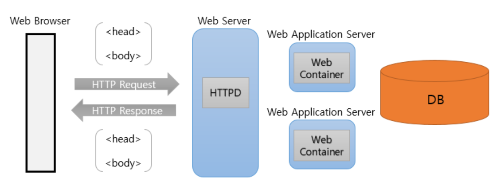
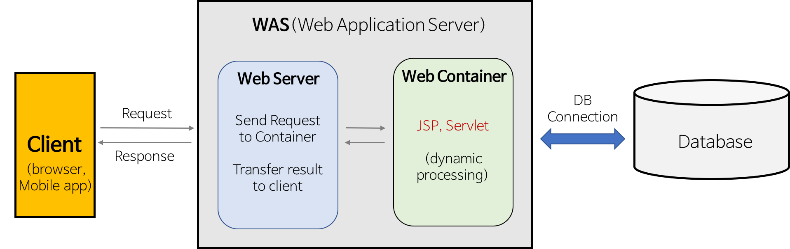
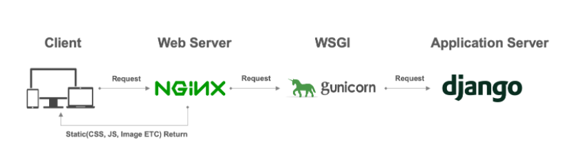

# Web application Architecture

## Web Service의 전체적인 흐름

- 웹 개발은 대체로 아래 그림과 같은 구조로 시스템을 구성하게 된다.

  

  - Web Browser에서 Web Server로 HTTP 요청을 보낸다.
    - 요청 내용이 정적인 경우에는 즉각적으로  Web Server에서 응답을 한다.
    - 요청 내용이 동적인 경우에는 Web Server에서 대응할 수 없으므로 Web Server와 연결된 Web Application Server(WAS) 중 한 곳에 처리를 위임한다.
  - WAS는 Web Server가 처리할 수 없는 요청을 위임 받는다.
    - Web Server에서 요청을 받으면 컨테이너가 응답하여 동적 컨텐츠를 생성하도록 특정 언어로 작성된 스크립트를 실행시킨다.
    - 컨테이너는 스크립트를 통해 생성 된 동적인 컨텐츠를 HTML 문서로 재정의한 후 해당 HTML 문서를 Web Sever로 넘긴다.
    - Web Server는 WAS에서 받아온 HTML 문서를 다시 Web Browser에 넘긴다.


- 정적 웹 페이지와 동적 웹 페이지
  - 정적 웹 페이지
    - 언제 접속해도 항상 같은 내용을 보여주는 페이지를 말한다.
    - 사용자가 요청을 보내면 Web Server는 언제나 미리 저장된 웹 페이지를 보내만 하면 된다.
    - 회사 사이트 등이 정적 웹 페이지의 예이다.
  - 동적 웹 페이지
    - 상황에 따라 다른 다른 내용을 보여주는 페이지를 말한다.
    - HTML로는 동적 웹 페이지의 구현이 불가능하므로 Python, Java와 같은 프로그래밍 언어를 통해 데이터를 동적으로 생성해서 해당 데이터를 정적인 HTML 문서로 만들어 보낸다.
    - Netfix 등의 추천 페이지 등이 동적 웹 페이지의 예이다.


## WAS와 Web Server



- Web Server
  - Web Server의 개념은 하드웨어 측면과 소프트웨어 측면으로 나뉜다.
    - 하드웨어 측면에서 Web Server는 해당 Web Server가 존재하는 컴퓨터를 의미한다.
    - 소프트웨어 측면에서 Web Server는 클라이언트가 서버에 페이지를 요청하면, 요청을 받아 정적 컨텐츠를 제공하는 미들웨어의 일종이라고 본다.
  - 기능
    - 클라이언트에게 요청을 받아 정적인 요청이라면 정적인 컨텐츠를 반환한다.
    - 동적인 요청이라면 WAS에 처리를 위임한 뒤 WAS에서 처리한 결과를 클라이언트에 전달한다.
  - 대표적인 Web Server
    - Apache
    - Nginx


- WAS(Web Application Server)
  - 동적 컨텐츠를 제공하기 위해 만들어진 Application Server HTTP를 통해 컴퓨터나 장치에 애플리케이션을 수행하는 미들웨어
  - 기능
    - 프로그램 실행 환경과 DB 접속 기능을 제공한다.
    - 여러 개의 트랜잭션을 관리한다.
    - 동적 컨텐츠를 생성하는 프로그래밍 언어의 비즈니스 로직을 수행한다.
    - Web Service 플랫폼으로서의 역할을 병행한다.
  - 대표적인 WAS
    - Tomcat
    - Jeus
  - Apache Tomcat
    - Apache는 대표적인 Web Server, Tomcat은 대표적인 WAS인데 보통 따로 부르지 않고 Apache Tomcat이라 묶어서 부른다.
    - 그 이유는 Tomcat 5.5 버전부터 Tomcat에 정적 컨텐츠를 처리하는 기능이 추가되었기 때문이다.
    - 순수 Apache로 정적 요청을 처리하고, 순수 Tomcat으로 동적 요청을 처리하도록 하여 둘을 함께 사용하는 것과 Tomcat5.5+에서 정적, 동적 컨텐츠를 모두에 처리하는 것에 성능적 차이가 전혀 없으며, Tomcat이 Apache를 포함하게 되었기에 Apache Tomcat이라 부른다.
    - 그럼에도 Web Server로 Apache를 따로 두기도 하는데 그 이유는 아래 [Web Server를 WAS보다 앞단에 둠으로써 생기는 이점] 참조


- WAS와 Web Server를 분리해놓은 이유
  - WAS도 정적인 컨텐츠를 처리할 수 있다.
    - 따라서 WAS 하나만 사용하여 웹 서비스를 제공하는 것도 가능하다.
  - 그럼에도 둘을 나눠놓은 이유는 다음과 같다.
    - WAS가 정적, 동적인 요청을 모두 처리한다면 트래픽이 증가할수록 처리가 힘들어진다.
    - 따라서 정적인 요청은  Web Server가, 동적인 요청은 WAS가 처리하도록하여 트래픽을 분산시키기 위해 둘을 분리하여 사용한다.


- Web Server를 WAS보다 앞단에 둠으로써 생기는 이점
  - 맨 위 그림을 보면 Web Server가 WAS보다 앞 단에 있는 것을 확인할 수 있는데, 이는 다음과 같은 이점이 있기 때문이다.
  - 기능을 분리하여 서버 부하를 방지할 수 있다.
    - WAS와 Web Server를 분리하는 이유이자 Web Server를 더 앞 단에 두는 이유이다.
    - 정적인 요청은 Web Server에서 모두 처리 함으로써 WAS는 동적 요청만 처리할 수 있게 된다.
  - 물리적으로 분리하여 보안 강화
    - Web Server와 WAS는 Port 번호가 다르다.
    - 이렇게 물리적으로 두 개의 서버를 완전히 분리하여 보안을 강화시킬 수 있다.
    - 또한 SSL에 대한 암복호화 처리에 Web Server를 사용하여 웹 서비스에 대한 보안을 강화시킬 수 있다.
  - 여러 대의 WAS를 연결 가능하다.
    - Web Server가 여러 개의 WAS에 요청을 분산시켜 보내는 것이 가능하다.
    - 대용량 웹 애플리케이션의 경우 여러 개의 WAS를 사용하는데, 이 때 하나의 WAS에 문제가 생기더라도 Web Server가 해당 WAS에는 요청을 보내지 않도록 하면 사용자는 오류를 느끼지 못하게 된다.


- CGI(Comman Gateway Interface)
  - Web Server와 외부 application 사이의 통신을 위한 규약 혹은 방법
    - 하나의 스펙이므로 다양한 언어로 구현이 가능하다.
    - WAS가 등장하기 전에 동적인 요청을 처리하기 위해 만들어졌다.
  - 등장 배경
    - Web Server 자체로는 동적 요청을 처리하는 것이 불가능하다.
    - 따라서 외부에 동적 요청을 처리할 수 있는, 특정 언어로 개발된 application을 생성하고, Web Server에 동적인 요청이 들어오면 Web Server는 해당 요청에 맞게 동적 페이지를 생성하기 위해서 application을 실행시켰다.
    - Web Server와 다양한 언어로 개발된 application들이 입출력을 주고 받을 수 있도록 해주는 표준이 필요해졌고, 이런 배경에서 CGI가 탄생했다.
  - WAS와의 차이
    - CGI는 Web Server가 외부 application을 직접 실행한다.
    - WAS는 Web Server가 아닌 WAS가 application을 대신 실행한다.
    - WAS는 결국 Web Server + CGI라고도 볼 수 있다.
  - 한계
    - 요청이 들어올 때 마다 프로세스를 생성한다.
    - 즉 동적인 요청이 들어올때마다 프로세스를 생성하므로, 서버에 부하가 생기게 된다.
    - WAS는 CGI와 달리 프로세스가 아닌 스레드를 실행시켜 동적 컨텐츠를 만들어 속도도 빠르고 자원도 덜 소모한다.


- FastCGI
  - CGI의 한계를 극복하기 위해 등장했다.
  - 여러 번의  요청이 들어와도 하나의 프로세스만을 가지고 처리하기에 CGI에 비하여 자원을 훨씬 덜 소모한다.
  - Tomcat 역시 Web Sever + FastCGI가 결합된 WAS다.


# Proxy

- Proxy
  - 프록시 서버는 클라이언트가 자신을 통해서 다른 네트워크 서비스(서버)에 접속할 수 있게 해 주는 컴퓨터 시스템이나 응용프로그램을 가리킨다.
    - 서버와 클라이언트 사이에 중계기로서 대리로 통신을 수행하는 것을 가리켜 프록시라 부른다.
    - 그 중계 기능을 하는 것을 프록시 서버라고 부른다.
  - 프록시 서버 중 일부는 프록시 서버에 요청된 내용들을 캐시를 이용하여 저장해 둔다.
    - 이렇게 캐시를 해 두고 난 후에, 캐시 안에 있는 정보를 요구하는 요청에 대해서는 원격 서버에 접속하여 데이터를 가져올 필요가 없게된다.
    - 이를 통해 전송 시간을 절약하고, 불필요하게 외부와 연결을 하지 않게 됨으로써 외부와의 트레픽을 감소시킨다.


- Forward Porxy
  - 일반적으로 프록시라고 하면 포워드 프록시를 가리킨다.
  - 클라이언트가 서버로 요청을 보낼 때, 직접 보내지 않고 프록시 서버를 통해서 보내는 방식이다.
  - 서버로부터 클라이언트가 누구인지 감추는 역할을 한다.
    - 서버가 요청을 받은 IP는 포워드 프록시의 IP이기 때문에 클라이언트가 누구인지 알 수 없다.


- Reverse Proxy
  - 프록시 서버가 한 대 이상의 서버로부터 자원을 추출하는 프록시 서버이다.
  - 클라이언트가 서버를 호출할 때 리버스 프록시를 호출하고, 프록시 서버가 클라이언트로부터 받은 요청을 서버에 보내 그 응답을 다시 클라이언트에 전달하는 방식이다.
  - 클라이언트로부터 서버가 누구인지 감추는 역할을 한다.
    - 클라이언트가 응답을 받은 IP는 리버스 프록시의 IP이기 때문에 서버가 누구인지 알 수 없다.


# Python으로 웹 개발하기

## WSGI와 ASGI

- WSGI
  - Python에 종속적인 CGI라고 보면 된다.
    - WSGI는 CGI를 기반으로 제작되었다.
    - CGI는 본래 플랫폼과 무관하게 동작하지만 WSGI는 Python에 종속적이다.
  - CGI와의 차이점
    - WSGI는 CGI와 달리 매 요청에 대해 프로세스를 생성(fork)하지 않는다.
    - 웹 애플리케이션을 호출할 때, 요청의 헤더 부분을 환경 정보로 전달하며, 이 때 콜백 함수도 같이 전달한다.
    - 그 후 웹 애플리케이션이 요청을 처리하고 콜백 함수로 응답하는 방식이다.
  - Django에서
    - Django 프로젝트를 생성하면 `wsgi.py`파일도 함께 생성되는 것을 확인 가능한데 이 파일이 바로 WSGI가 장고 애플리케이션을 호출하는 파일이다.
  - 대표적인 WSGI
    - gunicorn


- ASGI
  - WSGI의 한계를 극복하기 위해 등장했다.
    - WSGI는 동기적으로만 동작한다는 한계가 있다.
    - WSGI도 비동기적으로 동작하도록 할 수 있었으나 구현이 지나치게 까다로웠다.
    - ASGI는 요청을 비동기적으로 처리가 가능하다.
  - WSGI의 상위호환이다.
  - 대표적인 ASGI
    - uvicorn


- WSGI 혹은 ASGI도 웹 서버의 역할을 할 수 있다.
  - 즉, WSGI(ASGI)만으로도 요청을 받을 수 있고, Python에 연산을 지시할 수 있다.
  - 동시접속자수가 700명 미만인 경우 nginx 없이 WSGI만으로도 서버 운영이 가능하다고 한다.


- Django는 웹 서버인가?

  - 아래 명령어를 수행하면 django의 자체 웹 서버가 실행된다.

  ```bash
  $ python manage.py runserver
  ```

  - 공식문서에서는 이는 단순히 개발의 편의를 위해 제공 된 것으로 nginx나 apache처럼 웹 서버 용도로 사용해선 안된다고 말한다.
  - 따라서 Django를 사용할 때에도 아래 그림처럼 Web Sever와 WSGI를 따로 두어야 한다.
    - WSGI와 Application Server를 합쳐 WAS라 부른다.

  


# 참고

- [WSGI, CGI, ASGI란?](https://velog.io/@jeong-god/WSGI-CGI-ASGI%EB%9E%80)

- [Djaongo는 웹서버 인가?](https://velog.io/@sj950902/DJANGO%EC%99%80-WSGI%EC%97%90-%EB%8C%80%ED%95%B4-%EC%95%8C%EC%95%84%EB%B3%B4%EC%9E%90)
- [WAS와 웹 서버 차이](https://jeong-pro.tistory.com/84)
- [[Python] REST API 개발로 알아보는 WSGI, ASGI](https://blog.neonkid.xyz/249)

- [[Web] Web Server와 WAS(Web Application Server)에 대하여](https://coding-factory.tistory.com/741)
- [내가 보려고 만든 django 분석-3](https://velog.io/@stay136/%EB%82%B4%EA%B0%80-%EB%B3%B4%EB%A0%A4%EA%B3%A0-%EB%A7%8C%EB%93%A0-django-%EB%B6%84%EC%84%9D-3-asgi-wsgi)

