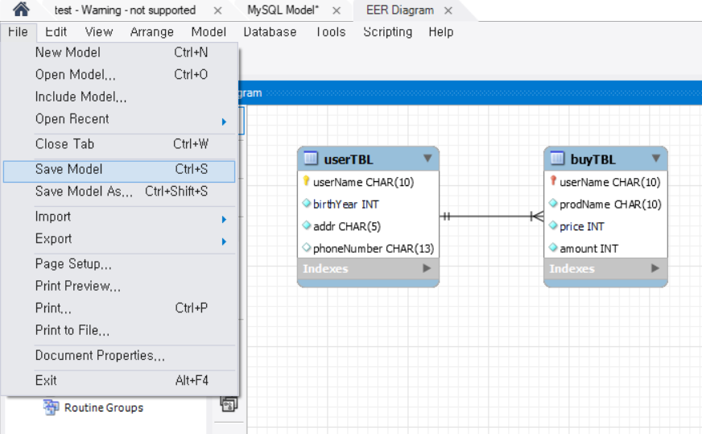

# DBMS 개요

- DBMS(DataBase Management System)

  - Database를 데이터의 집합이라고 정의한다면 DBMS는 database를 관리, 운영하는 역할을 한다.
    - Database는 여러 사용자나 응용 프로그램이 공유하고 동시에 접근이 가능해야한다.
    - Excel과 같은 프로그램은 data의 집합으로 사용할 수 있으나 여러 명의 사용자가 공유하지는 않으므로 DBMS라 부르지 않는다.

  - Database는 data의 저장 공간 자체를 의미하기도 한다.


- Database의 특징
  - 데이터의 무결성(Integrity)
    - DB 안의 data는 어떤 경로를 통해 들어왔던지 data에 오류가 있어서는 안 된다.
    - 무결성을 위해서 DB는 제약 조건(constraint)이라는 특성을 가진다.
  - 데이터의 독립성
    - DB의 크기를 변경하거나 data file의 저장소를 변경하더라도 기존에 작성된 응용 프로그램은 전혀 영향을 받지 않아야한다.
    - 서로 의존적인 관계가 아닌 독립적인 관계여야 한다.
    - 예를 들어 DB가 저장된 disk가 새 것으로 교체되어도 기존에 사용하던 응용 프로그램은 아무 변경 없이 계속 사용되어야한다.
  - 보안
    - DB안의 data에 아무나 접근할 수 있는 것이 아니라 data를 소유한 사람이나 data에 접근이 허가된 사람만 접근할 수 있어야한다.
    - 접근할 때도 사용자의 계정에 따라 다른 권한을 가져야한다.
  - 데이터 중복의 최소화
    - 동일한 data가 여러 개 중복되어 저장되는 것을 방지해야한다.


- DBMS의 분류
  - Hierarchical DBMS
    - 처음으로 나온 DBMS 개념으로 각 계층은 tree 형태를 가지며 1:N 관계를 갖는다.
    - 처음 구축한 이후에는 구조를 변경하는 것이 까다롭다 점과, 주어진 상태에서의 검색은 상당히 빠르지만, 접근의 유연성이 부족해 임의의 검색에는 어려움이 따른다는 단점이 있다.
  - Network DBMS
    - 계층형 DBMS의 문제점을 개선하기 위해 등장했다.
    - 1:1, 1:N, N:M 관계가 지원되어 효과적이고 빠른 data 추출이 가능하다.
    - 하지만 매우 복잡한 내부 포인터를 사용하므로 프로그래머가 이를 이해해야 프로그래밍이 가능하다는 단점이 있다.
  - Relational DBMS
    - Data를 table이라 불리는 최소 단위로 구성하고, 하나의 table을 하나 이상의 column으로 구성한다.
    - 모든 data는 table에 저장되므로, table이라는 구조가 RDBMS의 가장 중요하고 기본적인 구성이 된다.
    - 다른 DBMS에 비해서 업무가 변화될 경우 쉽게 변화에 순응할 수 있는 구조이며, 유지보수 측면에서도 편리하다는 장점이 있다.
    - 또한 대용량의 data 관리와 데이터의 무결성을 잘 보장해준다.
    - 단점은 시스템 자원을 많이 사용해서 시스템이 전반적으로 느려질 수 있다는 점이지만, 하드웨어의 발달로 이러한 단점은 많이 보완되고 있다.


- SQL(Structured Query Language) 개요

  - DB를 조작하기 위한 언어이다.

  - DBMS 제작 회사와 독립적이다.

    - SQL은 모든 DBMS 제작사에서 공통적으로 공개되고, 각 제작회사는 이 표준 sQL에 맞춰서 DBMS를 개발한다.

    - 따라서 표준 SQL은 대부분의 DBMS 제품에서 공통적으로 호환된다.
    - 그렇다고 모든 DBMS의 SQL문이 완벽하게 동일한 것은 아니다.

  - 다른 시스템으로 이식성이 좋다.

    - SQL 표준은 서버용, 개인용, 휴대용 장비에서 운영되는 DBMS마다 상호 호환성이 뛰어나다.

  - 표준이 계속 발전한다.

    - 지속적으로 개선된 표준안이 발표되고 있다.

  - 대화식 언어이다.

    - 컴파일 및 디버깅 없이 질의 후 바로 결과를 얻는 대화식 언어로 구성되어 있다.

  - 분산형 클라이언트-서버 구조이다.

    - 클라이언트-서버 구조를 지원한다.
    - 따라서 클라이언트에서 질의하면 서버에서 그 질의를 받아서 처리한 후 다시 클라이언트에 전달하는 구조를 가진다.


- MySQL
  - 마이클 위데니우스와 데이빗 액스마크가 1994년 개발을 시작하여 1995년 공개한 DBMS이다.
  - 현재는 Oracle이 인수하여 개발하고 있으며, 오픈 소스로 제공된다.
    - 비상업용이나 교육용으로는 제한 없이 사용이 가능하지만, Oracle에서 2010년에 인수하면서 상용으로 사용하기 위해서는 라이선스를 취득해야한다.
    - MariaDB는 초창기 MySQL 개발자들이 독립해서 만든 DBMS로 완전히 무료이다.


- MySQL을 설치하고 sample database를 설치한다.

  - MySQL은 전통적으로 `employees`라는 이름의 sample database를 제공한다.

  ```bash
  $ git clone https://github.com/datacharmer/test_db.git
  ```

  - 아래와 같이 MySQL Docker image를 pull 받는다.

  ```bash
  $ docker pull mysql
  ```

  - 아래 명령어를 통해 mysql을 실행시킨다.

  ```bash
  $ docker run -d --name test-mysql -v <sample database repository를 clone 받은 경로>:/data/test_db -e MYSQL_ROOT_PASSWORD=1234 -p 3306:3306 mysql
  ```

  - Container 내부에서 `/data/test_db`로 이동해 아래 명령어를 실행하고 위에서 설정한 비밀번호를 입력한다.

  ```bash
  $ mysql -u root -p < employees.sql
  ```

  - 완료되면 아래 명령어를 통해 mysql client를 실행한다.

  ```bash
  $ mysql -u root -p
  ```

  - Table들을 확인한다.

  ```sql
  use employees;
  show tables;
  
  # 아래와 같이 출력되면 성공 한 것이다.
  +----------------------+
  | Tables_in_employees  |
  +----------------------+
  | current_dept_emp     |
  | departments          |
  | dept_emp             |
  | dept_emp_latest_date |
  | dept_manager         |
  | employees            |
  | salaries             |
  | titles               |
  +----------------------+
  ```


# 데이터베이스 모델링

- 데이터 베이스 모델링 개념
  - 현 세계에서 사용되는 작업이나 사물들을 DBMS의 데이터베이스 개체로 옮기는 과정이다.
    - 데이터 베이스 모델링에 정답은 없다.
    - 그러나 좋은 모델링은 분명히 존재한다.
  - 데이터 베이스 모델링은 아래와 같은 이유로 상당히 어려운 작업이다.
    - 구현하고자 하는 업무에 대한 폭 넓고 정확한 지식이 필요하다.
    - 데이터 베이스 시스템에 대한 깊은 지식과 경험이 필요하다.


- 데이터 베이스 모델링 실습

  - 쇼핑몰의 고객 명단과 고객들의 구매 내역을 기록하는 데이터 베이스를 모델링한다.
  - 먼저 아래와 같은 raw data가 있다고 가정해보자.
    - 여러 번 방문할 수도 있고, 아무 것도 구매하지 않을 수도 있다.

  | 고객명   | 출생년도 | 주소 | 연락처        | 구매한 물건 | 단가(천 원) | 수량 |
  | -------- | -------- | ---- | ------------- | ----------- | ----------- | ---- |
  | 피카츄   | 1994     | 서울 | 010-1111-1111 |             |             |      |
  | 파이리   | 1978     | 대전 | 010-2222-2222 | 모자        | 20          | 2    |
  | 꼬부기   | 1982     | 대구 | 010-3333-3333 | 양말        | 5           | 5    |
  | 이상해씨 | 1975     | 부산 | 010-4444-4444 | 장갑        | 5           | 1    |
  | 버터플   | 2001     | 인천 | 010-5555-5555 |             |             |      |
  | 야도란   | 1989     | 울산 | 010-6666-6666 | 부채        | 10          | 3    |
  | 꼬부기   | 1982     | 대구 | 010-3333-3333 |             |             |      |
  | 파이리   | 1978     | 대전 | 010-2222-2222 |             |             |      |
  | 피카츄   | 1994     | 서울 |               | 외투        | 80          | 2    |
  | 버터플   | 2001     | 인천 | 010-5555-5555 | 셔츠        | 30          | 1    |
  | 피카츄   | 1994     | 서울 |               |             |             |      |
  | 파이리   | 1978     | 대전 |               |             |             |      |
  | 꼬부기   | 1982     | 대구 | 010-3333-3333 | 바지        | 40          | 1    |

  - 물건을 구매한 적 없는 고객을 위쪽으로 다시 정렬하면 아래와 같다.
    - 표에서 데이터가 있는 영역만 보면 L자가 처럼 보이는 것을 확인할 수 있다.
    - 이러한 것을 L자형 테이블이라 부른다.
    - L자형 테이블은 공간이 낭비된다는 문제가 있다.

  | 고객명   | 출생년도 | 주소 | 연락처        | 구매한 물건 | 단가(천 원) | 수량 |
  | -------- | -------- | ---- | ------------- | ----------- | ----------- | ---- |
  | 피카츄   | 1994     | 서울 | 010-1111-1111 |             |             |      |
  | 버터플   | 2001     | 인천 | 010-5555-5555 |             |             |      |
  | 꼬부기   | 1982     | 대구 | 010-3333-3333 |             |             |      |
  | 파이리   | 1978     | 대전 | 010-2222-2222 |             |             |      |
  | 피카츄   | 1994     | 서울 |               |             |             |      |
  | 파이리   | 1978     | 대전 |               |             |             |      |
  | 파이리   | 1978     | 대전 | 010-2222-2222 | 모자        | 20          | 2    |
  | 꼬부기   | 1982     | 대구 | 010-3333-3333 | 양말        | 5           | 5    |
  | 이상해씨 | 1975     | 부산 | 010-4444-4444 | 장갑        | 5           | 1    |
  | 야도란   | 1989     | 울산 | 010-6666-6666 | 부채        | 10          | 3    |
  | 피카츄   | 1994     | 서울 |               | 외투        | 80          | 2    |
  | 버터플   | 2001     | 인천 | 010-5555-5555 | 셔츠        | 30          | 1    |
  | 꼬부기   | 1982     | 대구 | 010-3333-3333 | 바지        | 40          | 1    |

  - L자형 테이블을 빈 칸이 있는 곳과 없는 곳으로 분리하여 아래와 같은 고객 테이블과

  | 고객명   | 출생년도 | 주소 | 연락처        |
  | -------- | -------- | ---- | ------------- |
  | 피카츄   | 1994     | 서울 | 010-1111-1111 |
  | 버터플   | 2001     | 인천 | 010-5555-5555 |
  | 꼬부기   | 1982     | 대구 | 010-3333-3333 |
  | 파이리   | 1978     | 대전 | 010-2222-2222 |
  | 피카츄   | 1994     | 서울 |               |
  | 파이리   | 1978     | 대전 |               |
  | 파이리   | 1978     | 대전 | 010-2222-2222 |
  | 꼬부기   | 1982     | 대구 | 010-3333-3333 |
  | 이상해씨 | 1975     | 부산 | 010-4444-4444 |
  | 야도란   | 1989     | 울산 | 010-6666-6666 |
  | 피카츄   | 1994     | 서울 |               |
  | 버터플   | 2001     | 인천 | 010-5555-5555 |
  | 꼬부기   | 1982     | 대구 | 010-3333-3333 |

  - 아래와 같은 구매 테이블로 나눈다.

  | 구매한 물건 | 단가(천 원) | 수량 |
  | ----------- | ----------- | ---- |
  | 모자        | 20          | 2    |
  | 양말        | 5           | 5    |
  | 장갑        | 5           | 1    |
  | 부채        | 10          | 3    |
  | 외투        | 80          | 2    |
  | 셔츠        | 30          | 1    |
  | 바지        | 40          | 1    |

  - 이를 통해 빈 부분을 줄여 공간을 절약할 수 있게 됐으나 정보의 중복이 있다는 문제가 남아있다.
    - 따라서 아래와 같이 고객 테이블에서 중복을 제거한다.
    - 고객명에 중복이 없어져 고객 이름으로 고객을 구분할 수 있게 되었으므로 고객 명을 PK로 사용한다.

  | 고객명   | 출생년도 | 주소 | 연락처        |
  | -------- | -------- | ---- | ------------- |
  | 피카츄   | 1994     | 서울 | 010-1111-1111 |
  | 파이리   | 1978     | 대전 | 010-2222-2222 |
  | 꼬부기   | 1982     | 대구 | 010-3333-3333 |
  | 이상해씨 | 1975     | 부산 | 010-4444-4444 |
  | 버터플   | 2001     | 인천 | 010-5555-5555 |
  | 야도란   | 1989     | 울산 | 010-6666-6666 |

  - 구매 테이블에서는 누가 구매한 것인지를 알 수 없다는 문제가 있다.
    - 따라서 고객 테이블의 PK 값을 구매 테이블에 넣어 어떤 고객이 어떤 구매 행위를 했는지를 표시한다.
    - 고객명은 고객 테이블에서는 PK 값이지만 구매 테이블에서는 FK로 사용된다.
    - 고객 테이블과 구매 테이블의 관계를 부모 테이블과 자식 테이블의 관계라고 부른다.

  | 고객명   | 구매한 물건 | 단가(천 원) | 수량 |
  | -------- | ----------- | ----------- | ---- |
  | 파이리   | 모자        | 20          | 2    |
  | 꼬부기   | 양말        | 5           | 5    |
  | 이상해씨 | 장갑        | 5           | 1    |
  | 버터플   | 부채        | 10          | 3    |
  | 피카츄   | 외투        | 80          | 2    |
  | 버터플   | 셔츠        | 30          | 1    |
  | 꼬부기   | 바지        | 40          | 1    |

  - 위에서 정리한 데이터를 기반으로 고객 테이블을 정의하면 아래와 같다.

  | 열 이름  | 데이터 형식       | Null 허용 | 기타 |
  | -------- | ----------------- | --------- | ---- |
  | 고객명   | 문자(최대 10글자) | X         | PK   |
  | 출생년도 | 숫자(정수)        | X         |      |
  | 주소     | 문자(최대 5글자)  | X         |      |
  | 연락처   | 문자(최대 13글자) | O         |      |

  - 구매 테이블은 아래와 같다.

  | 열 이름     | 데이터 형식       | Null 허용 | 기타 |
  | ----------- | ----------------- | --------- | ---- |
  | 고객명      | 문자(최대 10글자) | X         | FK   |
  | 구매한 물건 | 문자(최대 10글자) | X         |      |
  | 단가        | 숫자(정수)        | X         |      |
  | 수량        | 숫자(정수)        | X         |      |


- Workbench를 통해 다이어그램을 작성하고 이를 DB로 변환하기

  - 상단 네비게이션 바에서 `File` - `New Model`을 클릭한다.

  

  - 기본 데이터 베이스 이름이 mydb로 되어 있는데 이를 우클릭하여 `Edit Schema`를 클릭한다.
    - 적절한 이름으로 변경한 후 창을 닫으면 적용된다.

  

  - `Add Diagram`을 클릭하여 `ERR Diagram` 탭을 연다.

   

  - 아래와 같이 작성 후 `File` - `Save Model`을 클릭하여 저장한다.
    -  `.mwb` 형식으로 저장된다.

  

  - 위에서 저장한 `.mwb` file을 실제 DB에 적용하기 위해서 `File` - `Open Model`을 클릭하여 위에서 생성한 `.mwb` file을 클릭한다.

  

  - 상단의 `Database` - `Forward Engineer`를 클릭한다.

  

  - 창이 뜨면 모두 그대로 두고 계속 `Next`를 클릭한 후 `Navigator`에서 `Refresh All`을 누르면 위에서 생성한 DB와 table들이 생성된 것을 볼 수 있다.

  


- Workbench를 통해 DB로 diagram 생성하기

  - 이번에는 위와 반대로 DB를 diagram으로 만들어 볼 것이다.
    - `Database` - `Reverse Engineer`를 클릭한다.

  

  - 설정 변경 없이 `Next`를 누르면서 비밀번호를 입력하면 DB를 선택하는 화면이 나온다.

    - 여기서 diagram으로 만들 DB와 DB의 요소들을 선택할 수 있다.

    - 끝까지 완료하면 diagram이 나오게 된다.

  - 위와 마찬가지로 완성된 diagram을 `File` - `Save Model`을 통해 저장이 가능하다.


# SQL

- SQL의 분류
  - DML(Data Manipulation Language, 데이터 조작어)
    - 데이터를 선택, 삽입, 수정, 삭제 하는 데 사용되는 언어다.
    - 사용 대상은 table의 row이므로, DML을 사용하기 위해서는 꼭 table이 정의되어 있어야한다.
    - `SELECT`, `INSERT`, `UPDATE`, `DELETE`가 이에 해당한다.
    - 그 밖애 transaction이 발생하는 SQL도 DML에 속한다.
  - DDL(Data Definition Language, 데이터 정의어)
    - DB, table, view, index 등의 개체를 생성/삭제/변경하기 위해 사용하는 언어다.
    - `CREATE`, `DROP`, `ALTER`등이 이에 속한다.
    - `DML`과 달리 transcation이 발생하지는 않는다.
  - DCL(Data Control Language, 데이터 제어어)
    - 사용자에게 권한을 부여하거나 회수할 때 사용하는 구문이다.
    - `GRANT`, `REVOKE`, `DENY` 등이 이에 해당한다.


- Database 개체(Indentifier)의 이름 규칙
  - Database 개체란 database, table, index, column, index, view, stored procedure 등
  - 아래는 위와 같은 식별자를 정의할 때 따라야 할 규칙이다.
    - `a~z`, `A~Z`, `$`, `_`를 사용할 수 있다(영문 대문서자 소문자 중 어떤 것으로 해도 소문자로 생성된다).
    - 개체 이름은 최대 64자로 제한된다.
    - 예약어는 사용할 수 없다.
    - 원칙적으로 공백을 사용할 수 없지만, 백틱으로 묶으면 공백을 사용할 수 있다.
    - 이름만으로 어떤 것인지 파악할 수 있는 것이 바람직하다.
    - Linux에서 DB 명과 table 명은 모두 소문자로 사용해야 한다.
  - MySQL은 기본적으로 테이블 이름, 열 이름 등을 모두 소문자로 처리한다.
    - 대문자를 섞어서 만드는 이유는 가독성을 위해서이다.
  - 테이블 이름에 띄어쓰기를 넣는 것이 가능하다.


- 주석
  - 한 줄 주석은 `--`를 사용하며 `--` 뒤에 공백이 한 칸 있어야 주석으로 인식한다.
  - 여러 줄 주석은 `/**/`을 사용한다.


## DDL

> DDL문은 transaction을 발생시키지 않는다,
>
> 따라서 transaction log도 남지 않는다.


- Database와 table 생성하기

  - Schema 생성하기
    - MySQL에서는 DB를 schema라고도 부른다.
    - Schema명은 따옴표(`'`)가 아닌 backtick(\`)을 사용한다.

  ```mysql
  CREATE SCHEMA `new_schema`;
  ```

  - Table 생성하기
    - Table명과 column 명 모두 backtick을 사용한다.

  ```mysql
  CREATE TABLE `shopdb`.`memberTBL` (
    `memberID` CHAR(8) NOT NULL,
    `memberName` CHAR(5) NOT NULL,
    `memberAddress` CHAR(20) NULL,
    PRIMARY KEY (`memberID`));
  ```


- `AUTO_INCREMENT`

  - Table 생성시 특정 column을 선언할 때 `AUTO_INCREMENT` 옵션을 지정하면 data 삽입시에 자동으로 1부터 증가하는 값을 넣어준다.
  - 제약 사항
    - `AUTO_INCREMENT`로 지정하려면 반드시 `PRIMARY KEY` 혹은 `UNIQUE`로 지정해야 한다.
    - 숫자 형식의 data type에만 사용할 수 있다.
  - 아래와 같이 현재 어느 숫자까지 증가되었는지 확인할 수 있다.

  ```sql
  SELECT LAST_INSERT_ID();
  ```

  - `ALTER TABLE`을 사용하여 `AUTO_INCREMENT` 값을 변경할 수 있다.

  ```sql
  ALTER TABLE <table> AUTO_INCREMENT=<num>;
  ```

  - 만일 증가폭을 수정하고자 한다면 서버 변수인 `@@auto_increment_increment`를 수정해야한다.
    - 예를 들어 이 변수의 값을 5로 변경할 경우 5씩 증가하며 값이 들어가게 된다.

  ```sql
  SET @@auto_increment_increment=<num>;
  ```


- `CREATE TABLE ... SELECT`

  - Table을 복사할 때 주로 사용하는 구문이다.
  - Primary key나 foreign key 등의 제약조건은 복사되지 않는다.

  ```sql
  CREATE TABLE <new_table> (SELECT <columns> FROM <orig_table>);
  ```


- `DROP`

  - Table을 삭제할 때 사용한다.

  ```sql
  DROP TABLE <table>;
  ```


- `TRUNCATE`

  - Table의 내용을 삭제할 때 사용한다.

    - Table을 삭제했다 다시 초기 설정으로 생성하는 명령어이다.

    - `DELETE`를 사용하여 모든 data를 지우는 것과의 차이는 `TRUNCATE`는 transaction log를 기록하지 않기에 속도는 빠르지만 복구가 불가능하다.

  ```sql
  TRUNCATE TABLE <table>;
  ```

  


## DML

> DDL문과 달리 transaction log를 작성한다.


### 조회

- `USE`

  - 사용할 DB를 지정하는 SQL 문이다.

  ```sql
  USE <database>;
  ```

  - 한 번 실행되고 나면 다시 다른 DB를 대상으로 `USE`를 사용하거나 다른 DB를 사용하겠다고 명시하지 않는 이상 위에서 설정한 DB에서 실행된다.


- `SHOW`

  - 현재 DB에 있는 모든 table들의 이름을 조회한다.

  ```sql
  SHOW TABLES;
  ```

  - 아래와 같이 입력하면 보다 상세한 정보를 볼 수 있다.

  ```sql
  SHOW TABLE STATUS;
  ```


- `SELECT`와 `FROM`

  - `SELECT`뒤에는 조회할 column들을, FROM 뒤에는 조회할 table을 입력한다.
    - Column에 `*`를 입력하면 모든 column들을 다 조회한다.

  ```sql
  SELECT <columns> FROM <table>;
  ```

  - 만일 `USE`로 선택한 DB가 아닌 다른 DB를 조회하고자 한다면 아래와 같이 DB 명을 명시할 수 있다.

  ```sql
  SELECT <columns> FROM <database>.<table>;
  ```

  - `AS`
    - `AS` keyword를 사용하여 column의 별칭을 설정할 수 있다.
    - 별칭 중간에 공백이 있다면 따옴표로 감싸줘야한다.
    - `AS`는 생략할 수 있다.

  ```sql
  SELECT first_name '이름', last_name AS '성', hire_date '회사 입사일';
  ```


- 조건 설정하기

  - `WHERE`
    - 특정한 조건을 설정하여 조건에 맞는 data만 조회할 때 사용한다.

  ```sql
  SELECT <columns> FROM <table> WHERE <조건식>;
  ```

  - 조건 연산자
    - `=`, `!=`, `<`, `>`, `<=`, `>=`, `<>`
  - 관계 연산자
    - `AND`, `OR`, `NOT`
  - `BETWEEN AND`
    - 조건 연산자 `<=`와 `>=`를 동시에 사용하는 것과 동일하다.
    - 예를 들어 아래 두 query는 같은 data를 조회한다.
    - 숫자와 같이 연속적인(continuous) 값을 가지는 값에만 사용할 수 있다.

  ```sql
  SELECT <columns> FROM <table> WHERE age >= 30 AND age <= 50;
  
  SELECT <columns> FROM <table> WHERE age BETWEEN 30 AND 50; 
  ```

  - `IN`
    - `BETWEEN AND`가 연속적인값이 아닌 이산적인(discrete)값을 조회하기 위해 사용한다.

  ```sql
  SELECT <columns> FROM <table> WHERE address in ('서울', '대전', '대구');
  ```

  - `LIKE`
    - 문자열의 내용을 조건으로 검색하기 위해 사용한다.
    - `%`, `_`를 조회에 사용할 수 있으며 `%`는 글자 수와 상관 없이 아무 문자나 올 수 있음을 뜻하고, `_`는 아무 문자나 딱 한 글자만 올 수 있다는 것을 뜻한다.
    - 단, `%`, `_`를 맨 앞에 사용하는 것은 성능에 악영향을 미칠 수 있으므로 주의해야한다.

  ```sql
  -- 김으로 시작하는 모든 사람을 조회한다.
  SELECT <columns> FROM <table> WHERE name like '김%';
  ```


- 서브 쿼리

  - Query문 안에 또 query문이 있는 것을 말한다.
    - 예를 들어 아래 query는 `id`값이 1인 사람의 `age`보다 큰 `age` 값을 가지는 data들을 조회하는 query이다.
    - 주의할 점은 서브 쿼리를 조건절에 사용하기 위해서는 서브 쿼리의 결과는 반드시 하나의 row만 반환해야한다는 점이다.
    - 둘 이상의 row를 반환할 경우 `Subquery returns more than 1 row`라는 error가 발생한다.

  ```sql
  SELECT <columns> FROM <table> WHERE age > (SELECT age FROM <table> WHERE id='1');
  ```

  - `ANY`(=SOME`)
    - 서브 쿼리의 조건절은 반드시 하나의 row만 반환해야 한다.
    - 그러나 `ANY`를 사용할 경우 둘 이상의 row를 반환해도 되며, 반한된 row중 어느 것에든 일치하면 조회된다.

  ```sql
  SELECT <columns> FROM <table> WHERE age > ANY (SELECT age FROM <table> WHERE address='서울');
  ```

  - `ALL`
    - 서브 쿼리에서 반환된 모든 결과를 만족해야 조회된다.

  ```sql
  SELECT <columns> FROM <table> WHERE age > ALL (SELECT age FROM test WHERE address='서울');
  ```


- 조회 결과 조정

  - `ORDER BY`
    - 조회 결과가 출력되는 순서를 조정한다.
    - `ASC`와 `DESC` 중 하나로 설정할 수 있다(기본값은 `ASC`).
    - 여러 개로 정렬하는 것도 가능하다.
    - `ORDER BY`로 설정한 column이 꼭 조회 결과에 포함될 필요는 없다.
    - `WHERE`, `GROUP BY`, `HAVING`보다 뒤에 와야 한다.

  ```sql
  SELECT <columns> FROM <table> ORDER BY <column> [ASC|DECS] [, <column> [ASC|desc], ...];
  ```

  - `DISTINCT`
    - 중복된 row를 제거하고 조회한다.
    - `DISTINCT` 뒤에 오는 column을 기준으로 중복을 제거하고 조회한다.

  ```sql
  SELECT DISTINCT <columns> FROM <table>;
  ```

  - `LIMIT`
    - 조회할 row의 개수를 설정한다.

  ```sql
  SELECT <columns> FROM <table> LIMIT <number>;
  ```

  - `OFFSET`
    - 조회를 시작할 row를 설정한다.
    - 반드시 `LIMIT` 뒤에 와야 한다.
    - `LIMIT <offset_number>, <limit_number>`와 같이 작성하면 `LIMIT` 만으로 `OFFSET`을 설정할 수 있다.

  ```sql
  SELECT <columns> FROM <table> LIMIT <number> OFFSET <number>;
  
  -- 위 query와 아래 query는 동일하다.
  SELECT <columns> FROM <table> LIMIT <offset_number>, <limit_number>;
  ```


- `GROUP BY`

  - 조회한 row들을 그룹으로 묶어준다.
    - `GROUP BY`의 대상이 되는 column은 반드시 조회 대상이어야 한다.

  ```sql
  SELECT <columns> FROM <table> GROUP BY <columns>
  ```

  - 집계 함수
    - 주로 `GROUP BY`와 함께 쓰여 데이터를 그룹화 해주는 역할을 하지만, 꼭 `GROUP BY`와 함께 사용해야 하는 것은 아니다.
    - `AS`를 사용하면 결과를 더욱 보기 편하게 만들 수 있다.

  | 함수명   | 설명                                           |
  | -------- | ---------------------------------------------- |
  | SUM      | 합계를 구한다.                                 |
  | AVG      | 평균을 구한다.                                 |
  | MIN      | 최소값을 구한다.                               |
  | MAX      | 최대값을 구한다.                               |
  | COUNT    | 행의 개수를 센다(NULL은 제외하고 개수를 센다). |
  | STDEV    | 표준편차를 구한다.                             |
  | VAR_SAMP | 분산을 구한다.                                 |

  ```sql
  -- 예시
  SELECT category, SUM(price) AS '합계' FROM product GROUP BY category;
  
  -- GROUP BY 없이 사용
  SELECT MAX(price) FROM product;
  ```


- HAVING

  - 집계 함수에 대해 조건을 제한한다.
    - 반드시 `GROUP BY`절 다음에 와야 한다.

  ```sql
  -- 예시
  SELECT category, SUM(price*amount) FROM product GROUP BY category HAVING SUM(price*amount) > 2000;
  ```

  - `ORDER BY`와 함께 사용하는 것도 가능하다.

  ```sql
  -- 예시
  SELECT category, SUM(price*amount) FROM product GROUP BY category HAVING SUM(price*amount) > 2000 ORDER BY SUM(price*amount);
  ```


- `ROLL UP`

  - 소계를 구할 때 사용하는 구문이다.
    - `GROUP BY`절과 함께 사용한다.

  ```sql
  -- 예시
  SELECT category, SUM(price*amount) FROM product GROUP BY category WITH ROLLUP;
  ```

  - 출력시 소계에 해당하지 않는 column은 NULL로 출력된다.
    - 위 예시에서 소계에 해당하는 `SUM(price*amount)`를 제외한 `category` column의 data는 NULL로 출력된다.


### 삽입

- `INSERT`

  - Table에 data를 삽입할 때 사용한다.
  - Table명 다음에 오는 열은 생략이 가능하다.
    - 생략할 경우 table에 정의된 열 순서대로 value가 들어가게 된다.
    - 생략하지 않을 경우 입력한 column 순서대로 value가 들어가게 된다.

  ```sql
  INSERT INTO <table>[(column1, column2, ...)] VALUES (value1, value2, ...);
  ```

  - 아래와 같이 여러 data를 한 번에 입력하는 것도 가능하다.

  ```sql
  INSERT INTO <table>[(column1, column2, ...)] VALUES (value1, value2, ...), (value1, value2, ...);
  ```

  - `IGNORE`
    - Data insert시에 문제(e.g. PK값 중복)가 생겨도 error를 발생시키지 않는다.
    - 대량의 data를 insert 할 때 소수의 잘못된 data 때문에 모든 data가 insert 되지 않는 상황을 방지하기 위한 option이다.
    - 아래와 같이 `INSERT`와 `INTO` 사이에 작성한다.

  ```sql
  INSERT IGNORE INTO <table> [(column1, column2, ...)] VALUES (value1, value2, ...);
  ```

  - `ON DUPLICATE KEY UPDATE`
    - Insert시에 PK 값이 중복되면 error를 발생시키지 않고, 기존에 해당 PK를 가지고 있던 data를 수정한다.
    - 아래와 같이 `VALUES` 뒤에 입력하며, PK 값이 중복될 경우 `ON DUPLICATE KEY UPDATE` 뒤에 지정된 내용으로 update가 실행된다.

  ```sql
  INSERT INTO <table> [(column1, column2, ...)] VALUES (value1, value2, ...) ON DUPLICATE KEY UPDATE <col1>=<val1>[, <col2>=<val2>, ...];
  ```


- `INSERT INTO`

  - 다른 table로부터 data를 가져와서 insert할 때 사용한다.
  - 위에서 본 `CREATE TABLE ... SELECT` 구문과 유사하지만, `INSERT INTO`는 이미 생성된 table을 대상으로 하고, `CREATE TABLE ... SELECT`는 table까지 생성한다는 차이가 있다.

  ```sql
  INSERT INTO <dest_table> SELECT <columns> FROM <source_table>;
  ```


### 수정 및 삭제

- `UPDATE`

  - 기존에 삽입된 data를 수정하기 위해 사용한다.
  - `WHERE`을 사용하여 변경 대상 data를 지정할 수 있다.
    - 지정하지 않을 경우 모든 data가 변경된다.

  ```sql
  UPDATE <table> SET <col1>=<val1>, <col2>=<val2>, ... [WHERE <조건>];
  ```


- `DELETE`

  - 삽입된 data를 삭제하기 위해 사용한다.
  - `UPDATE`와 마찬가지로 `WHERE`문을 사용하여 삭제 대상 data를 지정할 수 있다.
    - 지정하지 않을 경우 모든 data가 삭제된다.

  ```sql
  DELETE FROM <table> [WHERE <조건>];


- `DROP`, `TRUNCATE`, `DELETE`의 차이
  - `DROP`의 경우 다른 두 명령어와는 달리 Table을 삭제한다.
  - `DELETE`의 경우 다른 두 명령어와는 달리 transaction log를 기록하며 data를 삭재한다.
  - `TRUNCATE`의 경우 table을 삭제했다 다시 생성한다.
    - `DROP`과의 차이는 table을 삭제했다 다시 생성한다는 것이다.
    - `DELETE`와의 차이는 transaction log를 생성하지 않는다는 점이다.
  - 일반적으로 속도는 `DROP`, `TRUNCATE`, `DELETE` 순이다.
    - `TRUNCATE`는 table을 다시 생성하는 과정이 있으므로 `DROP`보다는 느리다.
    - `DELETE`는 transaction log를 작성하므로 `TRUNCATE`보다 드리다.
    - 특히 `DELETE`는 table에 data가 많을 수록 `DROP`, `TRUNCATE`에 비해서 압도적으로 느리다.


## etc

- `WITH`

  - CTE(Common Table Expression)를 표현하기 위한 구문으로 MySQL 8.0부터 사용하 수 있따.
    - CTE는 기존의 view, 파생 table, 임시 table 등으로 사용하던 것을 대신할 수 있으며, 더 간결하게 표현할 수 있다.
    - 재귀적 CTE와 비재귀적 CTE라는 두 종류가 있다.
  - 비재귀적 CTE
    - 복잡한 query를 단순화 시키기 위해 사용한다.
    - 아래 예시에서와 같은 `SELECT`문 뿐만 아니라 `UPDATE` 등에도 사용할 수 있지만, 주로 `SELECT`문을 사용한다.
    - 아래 예시는 `WITH`문으로 정의한 foo라는 CTE table을 `AS`문을 통해 생성하여, foo table을 대상으로 data를 조회하는 것이다. 

  ```sql
  WITH <CTE_table>(column_name)
  AS
  (
  	<query>
  )
  SELECT <columns> FROM <CTE_table>;
  
  
  -- 예시
  WITH foo(product_nm, total_price)
  AS
  (
  	SELECT product_nm, sum(price*amount) FROM product group by product_nm;
  )
  SELECT product_nm, total_price FROM foo;
  ```


# MySQL의 자료형

- 숫자 자료형

  - 정수, 실수 등의 숫자를 표현한다.
  - `DECIMAL`은 정확한 수치를 저장하고, `FLOAT`, `DOUBLE`은 근사치를 저장한다.

  | type                    | bytes | 표현 가능 범위                         | 설명                                                 |
  | ----------------------- | ----- | -------------------------------------- | ---------------------------------------------------- |
  | BIT(N)                  | N/8   |                                        | 1~64bit를 표현(`b'0000` 형식)                        |
  | TINYINT                 | 1     | -128 ~ 127                             | 정수                                                 |
  | SMALLINT                | 2     | -32,768 ~ 32,767                       | 정수                                                 |
  | MEDINUMINT              | 3     | -8,388,608 ~ 8,388,607                 | 정수                                                 |
  | INT(), INTEGER          | 4     | 약 -21억 ~ 21억                        | 정수                                                 |
  | BIGINT                  | 8     | 약 -900경 ~ 900경                      | 정수                                                 |
  | FLOAT                   | 4     | -3.40E+38 ~ -1.17E-38                  | 소수점 아래 7자리까지                                |
  | DOUBLE, REAL            | 8     | -1.22E-308 ~1.79E+308                  | 소수점 아래 15자리까지                               |
  | DECIMAL(m,[d]), NUMERIC | 5~17  | -10<sup>38</sup>+1 ~ 10<sup>38</sup>-1 | 전체 자릿수(m)와 소수점 이하 자릿수(d)를 가진 숫자형 |


- 문자 자료형

  | type         | bytes        | 설명                             |
  | ------------ | ------------ | -------------------------------- |
  | CHAR(n)      | 1~255        | 고정길이 문자형                  |
  | VARCHAR(n)   | 1~65535      | 가변길이 문자형                  |
  | BINARY(n)    | 1~255        | 고정길이의 이진 데이터           |
  | VARBINARY(n) | 1~255        | 가변길이의 이진 데이터           |
  | TINYTEXT     | 1~255        | 255 크기의 TEXT 데이터           |
  | TEXT         | 1~65535      | N 크기의 TEXT 데이터             |
  | MEDIUMTEXT   | 1~16777215   | 최대 16777215 크기의 TEXT 데이터 |
  | LONGTEXT     | 1~4294967295 | 최대 4GB 크기의 TEXT 데이터      |
  | TINYBLOB     | 1~255        | 255 크기의 BLOB 데이터           |
  | BLOB         | 1~65535      | N 크기의 BLOB 데이터             |
  | MEDIUMBLOB   | 1~16777215   | 최대 16777215 크기의 BLOB 데이터 |
  | LONGBLOB     | 1~4294967295 | 최대 4GB 크기의 BLOB 데이터      |
  | ENUM         | 1 또는 2     | 최대 65535개의 열거형 데이터     |
  | SET          | 1,2,3,4,8    | 최대 64개의 서로 다른 데이터     |

  - CHAR
    - 뒤에 괄호와 숫자를 입력하지 않을 경우 `CHAR(1)` 로 설정된다.
    - 고정 길이를 가지므로 CHAR(100)과 같이 입력하고 몇 글자 저장하지 않는다면 남은 공간은 낭비된다.
  - VARCHAR
    - Variable chracter의 약자이다.
    - 가변 길이를 가지므로 큰 값을 설정하고 실제 데이터를 그보다 적게 입력하더라도 공간을 낭비하지 않을 수 있다.
    - 다만 일반적으로 INSERT/UPDATE시의 성능은 CHAR type이 더 뛰어나다.

  - MySQL에서 CHAR와 VARCHAR 모두 UTF-8로 encoding되므로 입력한 글자가 영문인지 한글인지에 따라 내부적으로 크기가 달라진다.
    - 그러나 사용자 입장에서는 CHAR(100)은 영문 한글 구분 없이 100글자를 입력하는 것으로 알고 있으면 되며, 내부 할당 크기는 신경 쓸 필요가 없다.
  - BLOB
    - Binary Large Object를 뜻한다.
  - LOB(Large Object) 저장
    - MySQL은 LOB을 저장하기 위해서 LONGTEXT와 LONGBLOB 자료형을 지원한다.
    - 약 4GB 크기의 파일까지 저장할 수 있다.
    - Text 파일은 LONGTEXT에 저장하고, binary 파일은 LONGBLOB에 저장하면 된다.


- 날짜와 시간 자료형

  | type      | bytes | format              | 설명                                                    |
  | --------- | ----- | ------------------- | ------------------------------------------------------- |
  | DATE      | 3     | YYYY-MM-DD          | 1001-01-01 ~ 9999-12-31까지 저장된다.                   |
  | TIME      | 3     | HH:MM:SS            | -838:59:59.000000 ~ 838.59:59.000000까지 저장된다.      |
  | DATETIME  | 8     | YYYY-MM-DD HH:MM:SS | 1001-01-01 00:00:00 ~ 9999-12-31 23:59:59까지 저장된다. |
  | TIMESTAMP | 4     | YYYY-MM-DD HH:MM:SS | 1001-01-01 00:00:00 ~ 9999-12-31 23:59:59까지 저장된다. |
  | YEAR      | 1     | YYYY                | 1901 ~ 2155까지 저장                                    |

  - DATETIME과 TIMESTAMP의 차이.
    - 둘 다 범위와 형식은 동일하다.
    - 그러나 TIMESTAMP의 경우 `time_zone` system variable에 설정된 UTC 시간대로 변환하여 저장한다.


- 기타

  | type     | bytes | 설명                                                         |
  | -------- | ----- | ------------------------------------------------------------ |
  | GEOMETRY | N/A   | 공간 데이터 형식으로 점, 선, 다각형 같은 공간 데이터 개체를 저장 |
  | JSON     | 8     | JSON 문서를 저장                                             |


# MySQL 프로그래밍

- 변수 사용

  - 변수의 선언과 값의 대입

  ```sql
  SET @variable_name = value;
  ```

  - 변수 조회

  ```sql
  SELECT @variable_name;
  ```

  - 변수는 connection이 유지되는 동안에만 유지된다.


- Data type 변환

  - `CAST()`, `CONVERT`()를 사용하여 SQL문 내에서 data type을 변환할 수 있다.
    - 당연히 table의 type이 변경되지는 않는다.
    - 둘은 형식만 다르고 거의 유사한 기능을 한다.

  ```sql
  CAST (expression AS data_type [(길이 등)]);
  CONVERT (expression, data_type[(길이 등)])
  ```

  - 암시적 형변환
    - 위와 같이 `CAST()`, `COVERT()` 등을 사용해서 데이터 형식을 변환하는 것을 명시적 형변환이라 한다.
    - 반면에 묵시적 형변환이란 위와 같은 함수를 사용하지 않고 형이 변환되는 것을 말한다.
    - 아래와 같이 문자열 끼리의 더하기 연산에서 문자열인 100이 숫자로 변경되어 계산되는 것이 대표적인 예시이다.

  ```sql
  -- 암시적 형변환 예시
  SELECT '100' + '100'
  ```


## MYSQL 내장 함수

- 제어 흐름 함수

  - 프로그램의 흐름을 제어할 때 사용한다.

  - IF(수식, 참, 거짓)

  ```sql
  SELECT IF (100>200, '참', '거짓')
  ```

  - IFNULL(수식1, 수식2)
    - 수식1이 NULL이 아니면 수식1이 반환되고, 수식1이 NULL이면 수식2가 반환된다.
    - 아래 예시에서, 첫 번째는 "널입니다."가 출력되고, 두 번째는 1이 출력된다.

  ```sql
  SELECT IFNULL(NULL, '널입니다.'), IFNULL(1, '널입니다.')
  ```

  - NULLIF(수식1, 수식2)
    - 수식1과 수식2가 같으면 NULL을 반환하고, 다르면 수식1을 반환한다.
    - 아래 예시에서 첫 번째는 NULL이 반환되고, 두 번째는 200이 반환된다.

  ```sql
  SELECT NULLIF(100, 100), NULLIF(200,100)
  ```

  - CASE ~ WHEN ~ ELSE ~ END
    - CASE는 내장 함수는 아니며, 연산자(operator)로 분류된다.

  ```sql
  SELECT CASE 10
              WHEN 1 THEN '일'
              WHEN 5 THEN '오'
              WHEN 7 THEN '칠'
              ELSE '그 외'
         END AS 'CASE 연습';
  ```


- 문자열 함수

  - ASCII(문자)
    - 문자의 아스키 코드 값을 돌려준다.

  ```sql
  SELECT ASCII('A');	-- 65
  ```

  - CHAR(숫자)
    - 숫자의 아스키 코드값에 해단하는 문자를 반환한다.

  ```sql
  SELECT CHAR(65); -- A
  ```

  - BIT_LENGTH(문자열), CHAR_LENGTH(문자열), LENGTH(문자열)
    - BIT_LENGTH는 할당된 bit 크기를 반환한다.
    - CHAR_LENGTH는 문자열의 문자 개수를 반환한다.
    - LENGTH는 문자열에 할당된 byte 수를 반환한다.

  ```sql
  SELECT CHAR_LENGTH('abc');
  ```

  - CONCAT(문자열1, 문자열2), CONCAT_WS(구분자, 문자열1, 문자열2)
    - 문자열을 이어준다.
    - CONCAT_WS는 구분자를 사이에 넣어 문자열을 이어준다.

  ```sql
  SELECT CONCAT_WS('-', '2024', '01', '01'); -- 2024-01-01
  ```

  - LEFT, RIGHT
    - 왼쪽 또는 오른쪽에서 두 번째 파라미터 만큼 문자열을 반환한다.

  ```sql
  SELECT LEFT ('abcde', 2); -- ab
  SELECT RIGHT ('abcde', 2); -- de
  ```

  - UPPER, LOWER
    - 모두 대문자로 또는 소문자로 변환한다.

  ```sql
  SELECT LOWER('ABC'); -- abc
  ```

  - REVERSE
    - 문자열의 순서를 뒤집는다.

  ```sql
  SELECT REVERSE('123'); -- 321
  ```

  - SUBSTRING(문자열, offset, limit)
    - 문자열의 offset부터 limit만큼 문자를 반환한다.
    - limit이 생략될 경우 끝까지 반환한다.

  ```sql
  SELECT SUBSTRING('ABCDE', 2, 2); -- BC
  ```


- 수학 함수

  - ABS
    - 숫자의 절댓값을 반환한다.

  ```sql
  SELECT ABS(-1); -- 1
  ```

  - CELING, FLOOR, ROUND
    - 각기 올림, 내림, 반올림을 계산한다.

  ```sql
  SELECT FLOOR(1.6) -- 1
  ```


- 날짜 및 시간 함수

  - ADDDATE(날짜, 차이), SUBDATE(날짜, 차이)
    - 날짜를 기준으로 차이를 더하거나 뺀 날짜를 구한다.

  ```sql
  SELECT ADDDATE('2024-01-01', INTERVAL 31 DAY);
  ```

  - CURDATE, CURTIME, NOW, SYSDATE
    - CURDATE는 현재 날짜, CURTIME는 현재 시간, NOW와 SYSDATE는 현재 날짜와 시간을 반환한다.
  - DATE, TIME
    - DATETIME 형식에서 연-월-일 또는 시:분:초만 추출한다.


- 시스템 정보 함수

  - USER
    - 현재 사용자를 반환한다.

  - DATABASE
    - 현재 선택된 DB를 반환한다.
  - VERSION
    - 현재 MySQL 버전을 구한다.
  - SLEEP(초)
    - Query의 실행을 잠시 멈춘다.


# 조인(JOIN) 

- 조인
  - 두 개 이상의 테이블을 서로 묶어서 하나의 결과 집합으로 만들어 내는 것을 말한다.
  - 아래와 같은 종류가 있다.
    - INNER JOIN
    - OUTER JOIN
    - CROSS JOIN
    - SELF JOIN


- INNER JOIN


