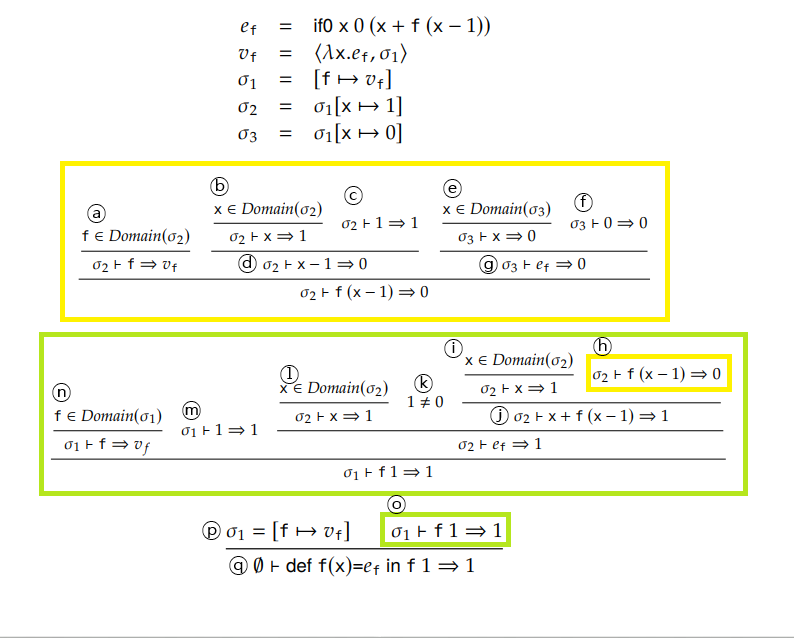

# Functions

- First-class
  - 아래의 조건을 만족하는 개체를 first-class라 부른다.
    - 함수 호출시에 argument로 사용할 수 있다.
    - 함수의 반환값이 될 수 있다.
    - 변수에 할당할 수 있다.
  - First-class function
    - First-class의 조건을 만족하는 함수를 first-class function라 부른다.
  - Higher-order function
    - 함수를 인자로 받거나 다른 함수를 반환하는 함수를 higher-order function이라 부른다.
    - First-class function을 지원하는 프로그래밍 언어는 모두 higher-order function도 지원하며, 그 반대도 마찬가지다.
    - 당연히 그럴 수 밖에 없는 것이, 함수를 argument로 넘기려면 호출하는 함수가 higher-order function이어야 하고, 반대로 higher-order function이 함수를 argument로 받으려면 argument로 받는 함수는 first-class function이어야한다.


- Anonymous function
  - 이름을 붙이지 않은 함수를 의미한다.
  - argument로 넘기거나 함수의 반환값으로 사용되는 함수들은 종종 단 한 번만 사용된다.
    - 이런 함수들에 일일이 이름을 붙이는 것은 비효율적이므로, 이름이 존재하지 않는 anonymous function를 사용한다.


## First-Order Function

- First-order function
  - 함수를 parameter로 받을 수 없거나, 함수를 반환할 수 없는 함수를 의미한다.
  - First class function에 비해 제한적이지만, 많은 programming language에서 사용된다.


- 지금부터 위에서 만든 VAE에 first-order function을 추가한 F1VAE를 만들어 볼 것이다.
  - F1VAE의 모든 함수는 top-level이다.
    - 이는 expression의 일부가 될 수 없다는 의미이다.
    - 즉 다른 함수의 sub 함수로 사용할 수 없다.
    - F1VAE program이 environment와 function definition의 목록 하에서 평가되는 단일 표현식이라 가정한다.
    - 이렇게 가정하면 closure와 같은 개념들을 다룰 수 없게 되지만, function 호출의 semantic에 더욱 집중할 수 있게 해준다.
  - Top-level이 아닌 함수는 추후에 다룰 것이다.


- Syntax 정의하기

  - Function definition은, type annotation을 무시하면, 3 부분으로 구성된다.

    - 함수명, parameter, function body
    - 실제 programming language에서 함수들은 0개 이상의 parameter를 가지고 있지만, 여기서는 편의를 위해 오직 1개의 parameter만을 받는다고 가정한다.

  - Function definition의 syntax를 아래와 같이 정의할 수 있다.

    - *FunDef*이 function definition의 집합을 가리킨다고 해보자.
    - metavariable *d*는 *FunDef*의 원소이다.

    $$
    d ::= def\ \ x(x) = e
    $$

    - *def  x<sub>1</sub>(x<sub>2</sub>) = e*에서 x<sub>1</sub>은 함수의 이름을, x<sub>2</sub>는 parameter를, e는 body를 의미한다.
    - x<sub>1</sub>과 x<sub>2</sub> 모두 binding occurrence이다.
    - x<sub>1</sub>의 scope는 program 전체이며, x<sub>2</sub>의 scope는 e이다.

  - Function을 호출할 때의 syntax는 아래와 같이 정의할 수 있다.

    - 기존 VAE의 expression에 함수 사용을 위한 expression을 추가한다.

    $$
    e ::= \cdots(기존\ 표현식)\ |\ x(e)
    $$

    - *x(e)*는 x라는 이름의 함수를 호출하는 함수 호출 expression이다.
    - e는 함수 호출의 argument의 값을 결정한다.
    - 여기서 x는 bound occurrence이다.


- Semantic 정의하기

  - Function environment

    - 변수에 대해 다룰때 변수와 연결된 값을 저장하기 위해 environment라는 semantic element를 소개했다.
    - Function역시 function을 function name과 연결하기 위한 새로운 semantic element가 필요하다.
    - 이를 function environment라 부른다.
    - Function environment는 유한 부분 함수이다. 즉, Identifier의 유한한 일부만이 output으로 function definition을 산출한다.
    - Metavariable `Λ`는 *FEnv*의 원소이다.

    $$
    FEnv = Id \overset{\text{fin}} \nrightarrow FunDef \\
    Λ ∈ FEnv
    $$

  - 다른 semantic element와 function environment의 관계

    - Expression의 평가는 environment뿐 아니라, 보다 적절한 함수 호출을 위해서 function environment도 필요로한다.
    - 따라서 semantic은 *Env*, *FEnv*, *E*, *ℤ* 사이의 관계이다.

    $$
    ⇒⊆ Env\ ×\ FEnv\ ×\ E\ ×\ ℤ
    $$

    - `(σ, Λ, e, n) ∈⇒`은 오직 e가 σ와 Λ 아래에서 n으로 평가될 때만 참이다.
    - 이를 `σ, Λ ├ e ⇒ n`으로 표현할 수 있다.

  - Semantic 정의하기

    - 만약`x`가 `Λ`의 domain이고, `Λ(x)`가 `def x(x')=e'`이며, `e`가 `σ`와 `Λ` 아래에서 `n'`로 평가되고, `e'`가 `[x'↦n']`과 `Λ` 아래에서 n으로 평가되면 `x(e)`는 σ와 `Λ` 아래에서 `n`으로 평가된다.
    - Semantic의 추론 규칙은 아래와 같다.

    $$
    x∈Domain(Λ)\ \ \ \ \ Λ(x)=def\ x(x')=e'\ \ \ \ \ σ,Λ├e⇒ n'\ \ \ \ \ [x'↦n'],Λ ├ e' ⇒ n\over σ, Λ ├ x(e) ⇒ n
    $$

    - `x(e)`를 평가하기 위해서, argument의 값을 결정해야한다(`σ,Λ ├ e ⇒ n'`).
    - 그 후, function environment에서 주어진 function name `x`로 function을 찾는다.
    - `x`는 반드시 function environment의 domain이어야하며, 만약 아니라면, `x`는 free identifier이므로 run-time error가 발생한다.
    - 만약 `x`가 function environment의 domain에 포함된다면(`x∈Domain(Λ)`), 일치하는 function definition을 가져올 수 있다(`Λ(x)=def x(x')=e'`).
    - Function environment에서 찾은 function definition에는 parameter 정보와 body 정보가 포함되어 있다.
    - 모든 function이 top-level이기에 body는 다른 어떤 local variable의 scope에도 속하지 않는다.
    - 따라서 body는` σ[x'↦n']`가 아닌 `[x'↦n']` 하에서 평가된다.
    - 또한 function call은 function environment에 영향을 주지 않기에, body의 평가에도 같은 function environment(`Λ`)가 사용된다.
    - Body의 결과( `[x'↦n'],Λ ├ e' ⇒ n`)가 function call의 결과이다.


- 기존 semantic 수정하기

  - 기존의 semantic들도 function environment를 고려하여 다시 정의해야한다.
  - `n` 
    - `n`은 `σ`와 `Λ` 아래에서 `n`으로 평가된다.

  $$
  σ,Λ\ ├\ n⇒ n
  $$

  - `e1+e2`
    - `σ`과 `Λ` 아래에서 e1이 n1으로 평가되고, e2가 n2로 평가되면, e1+e2는 `σ`과 `Λ` 아래에서에서 n1+n2로 평가된다.
  
  $$
  σ,Λ\ ├\ e_1⇒ n_1\ \ \ \ \ σ,Λ\ ├\ e_2⇒ n_2\over σ,Λ\ ├\ e_1+e_2⇒ n_1+n_2
  $$
  
  - `e1-e2`

    - `σ`과 `Λ` 아래에서 e1이 n1으로 평가되고, e2가 n2로 평가되면, e1-e2는 `σ`과 `Λ` 아래에서에서 n1-n2로 평가된다.

    $$
    σ,Λ\ ├\ e_1⇒ n_1\ \ \ \ \ σ,Λ\ ├\ e_2⇒ n_2\over σ,Λ\ ├\ e_1-e_2⇒ n_1-n_2
    $$

  - `val x=e1 in e2`(변수 선언)
  
    - `σ`과 `Λ` 아래에서 e1이 n1으로 평가되고,  ` σ[x↦n1]`와 Λ 아래에서 e2가 n2로 평가되면, `val x=e1 in e2`는 `σ`과 `Λ` 아래에서 n2로 평가된다.

    $$
    σ,Λ\ ├\ e_1⇒ n_1\ \ \ \ \  σ[x↦n_1] ├\ e_2⇒ n_2\over σ,Λ\ ├\ val\ x=e_1\ in\ e_2⇒ n_2
    $$

  - `x`(변수 사용)

    - x가 `σ`의 domain이면, x는 `σ`과 `Λ` 아래에서 `σ(x)`로 평가된다.
  
    $$
    x∈Domain(σ)\over σ,Λ\ ├\ x ⇒σ(x)
    $$


- Interpreter

  - VAE의 interpreter에 아래 내용을 추가한다.

  ```scala
  case class FunDef(f: String, x: String, b: Expr)
  sealed trait Expr
  ...
  case class Call(f: String, a: Expr) extends Expr
  ```

  - VAE의 interpreter를 작성할 때의 environment와 같이 function environment도 map으로 표현할 수 있다.
    - `Map[String, FunDef]`의 형태로 저장한다.

  ```scala
  type FEnv = Map[String, FunDef]
  ```

  - `interp` 함수를 아래와 같이 수정한다.
    - Environment와 function environment를 고려하도록 변경한다.

  ```scala
  def interp(e: Expr, env: Env, fEnv: FEnv): Int = e match {
      case Num(n) => n
      case Add(l, r) =>
      	interp(l, env, fEnv) + interp(r, env, fEnv)
      case Sub(l, r) =>
      	interp(l, env, fEnv) - interp(r, env, fEnv)
      case Val(x, i, b) =>
      	interp(b, env + (x -> interp(i, env, fEnv)), fEnv)
      case Id(x) => env(x)
      case Call(f, a) =>
          val FunDef(_, x, e) = fEnv(f)
          interp(e, Map(x -> interp(a, env, fEnv)), fEnv)
  }
  ```


- Scope

  - Static scope
    - Function의 body를 계산할 때, function이 정의될 때의 environment를 사용하는 것이 static scope이다.
    - Static scope는 binding occurrence의 scope가 정적으로 결정되도록 한다.
    - 즉 함수가 정의될 때의 선언된 변수를 사용한다는 의미다.
    - 예를 들어 `def f(x)=x+y`라는 코드가 있을때, F1VAE의 모든 함수가 top-level인 반면, 모든 변수는 local variable이므로, y는 어떤 binding occurrence의 scope에도 속하지 않는다.
    - 그러므로, y는 free variable이고, 함수 `f`의 호출은 run-time error를 발생시킬 것이다.
  - 위에서 정의한 semantic 상에서 scope는 static scope다.
    - 위에서 정의한 함수를 호출하는 semantic은 parameter 값만 존재하는 environment하에서 function body를 평가한다.
    - 함수 호출 측의 environment는 function body를 평가하기 위해 사용하는 environment에 절대 영향을 주지 않는다.
    - 즉, 아래 예시에서 `val y=1`을 통해 environment에 `y`가 1을 가리킨다는 사실을 추가했지만, 이 environment는 `x+y`라는 function body를 평가할 때 사용하는 environment에는 아무런 영향을 주지 않는다.
    - function body를 평가할 때 사용하는 environment에는 `y`라는 변수가 1을 가리킨다는 사실이 존재하지 않으므로, 해당 environment 하에서 y는 free variable이고, run-time error가 발생한다.

  ```scala
  // 함수 호출측의 environment에 y가 1이라는 정보가 담기게 된다.
  val y=1
  
  // 그러나 x+y를 평가하는 environment에는 함수 호출측의 environment가 아무런 영향을 미치지 못한다.
  def f(x)=x+y
  
  // 함수 호출측에서 함수를 호출한다.
  f(3)
  ```

  - Dynamic scope

    - Static scope의 반대되는 scope이다.
    - 함수 호출 측의 environment 상의 모든 정보를 function body에 사용할 수 있다.
    - 함수의 동작은 함수의 prameter뿐 아니라 함수 호출 측에도 영향을 받게 된다.
    - Function body의 indentifier는 각 함수 호출시마다 다른 entity와 연결된다.
    - 이는 binding된 identifier의 scope가 정적으로 결정되지 않는다는 것을 의미한다.
    - 이 때의 scope는 run time에 동적으로 결정된다.

  - 예시 

    - `(val y=1 in f(0)+1) + (val y=2 in f(0)+1)`와 같은 expression은 5로 평가된다.
    - 처음 함수가 호출될 때, `f`내의 y는 첫 번째 `y`에 바인딩되고, 1을 가리키게 된다.
    - 그러나 두 번째로 함수가 호출될 때, 두 번째 `y`에 바인딩되고, 2를 가리키게 된다.
    - 첫 번째 y의 scope는 `f(0)+1`이라는 표현식뿐 아니라 `f`의 body도 포함한다(두 번째 y도 마찬가지).

  - F1VAE에 dynamic scope를 적용하기 위해 semantic 수정하기

    - 기존 semantic에서 `[x'↦n'],Λ ├ e' ⇒ n`만 `σ[x'↦n'],Λ ├ e' ⇒ n`로 변경하면 된다.
    - 즉, 함수 호출측의 environment도 고려하는 것으로 변경하면 된다.

    $$
    x∈Domain(Λ)\ \ \ \ \ Λ(x)=def\ x(x')=e'\ \ \ \ \ σ,Λ├e⇒ n'\ \ \ \ \ σ[x'↦n'],Λ ├ e' ⇒ n\over σ, Λ ├ x(e) ⇒ n
    $$

  - F1VAE에 dynamic scope를 적용하기 위해 interpreter 수정하기

    - 기존 env에 function parameter를 추가한다.

  ```scala
  def interp(e: Expr, env: Env, fEnv: FEnv): Int = e match {
      // ...
      case Call(f, a) =>
          val FunDef(_, x, e) = fEnv(f)
          interp(e, env + (x -> interp(a, env, fEnv)), fEnv)
  }
  ```

  - Dynamic scope는 program이 error에 취약해지게 한다.
    - Dynamic scope는 program이 모듈이 되는 것을 방해한다.
    - 이는 각 함수 호출측의 환경이 함수의 동작에 영향을 주기 때문이다(위 예시에서도 `val y=1 in f(0)+1`라는 함수 호출측에서 호출 될 때와 `val y=2 in f(0)+1`라는 함수 호출측에서 `f(0)`이라는 동일한 함수를 호출했음에도 값이 달라졌다).
    - 또한 모든 가능한 호출측을 고려해야하기 때문에 programmer가 function의 정의에 기반해서 semantic을 추론하는 것을 어렵게 만든다.
    - 이는 program의 각 부분이 예상치 못하게 서로에게 간섭을 일으킬 수 있다는 것을 암시한다.
    - 이러한 해로움 때문에 대부분의 현대 programming language는 static scope를 채택한다.


## First-Class Function

- First-class function
  - 값으로 사용할 수 있는 함수를 의미한다.
    - 함수 호출의 인자로 사용될 수 있다.
    - 함수의 반환값으로 사용될 수 있다.
    - 대입 연산을 통해 변수가 가리키는 대상으로 지정될 수 있다.
  - Closure와 밀접하게 관련되어 있는 함수이다.


- 지금부터 위에서 만든 VAE에 first-class function을 추가한 FAVE를 만들것이다.
  - FVAE에서 함수를 만드는 유일한 방법은 이름이 없는 anonymous funcion을 만드는 것이다.
    - Anonymous function에서는 함수를 호출할 때 함수의 이름을 사용하지 않는다(사실 이름이 없으므로 사용할 수 없다).
    - F1VAE에서 함수를 호출하는 syntax는 `x(e)`였다(아래 예시의 `twice(1)`).
    - `twice(1)`는 함수의 호출이며, 호출 할 함수를 함수의 이름으로 지정했다.
    - 반면에 아래 code에서 `makeAdder`은 함수를 반환하는 함수이다. 
    - `makeAdder(3)`는 함수를 반환하는 함수 호출이다.
    - 그러므로, 우리는 반환된 함수를 다시 호출할 수 있다.
    - `makeAdder(3)(5)`은 `makeAdder(3)`를 호출하는 표현식이다.
    - `makeAdder(3)(5)`는 호출할 함수(`(y: Int) => x + y`)를 함수 이름이 아닌 표현식으로 호출한다.
  - 그러나 anonymous function에 syntactic sugar를 적용하여 이름을 추가할 수 있다.
    - 뿐만 아니라 변수의 선언도 syntactic sugar를 적용할 수 있다.
  - 또한 closure가 정확히 무엇인지, 왜 필요한지도 살펴볼 것이다.


- Function application
  - 지금까지는 함수 호출(function call)이라는 용어를 사용했지만 사실 functional programming에서는 function application이 흔히 사용된다.
    - 예를 들어 `f(1)`은 "f가 1과함께 호출됐다."고 표현하는 대신 "f가 1에 적용(apply)됐다."고 표현한다.
  - 특히 first class function에 대해 다룰 때는 application이 call보다 자연스럽다.
    - 예를 들어 위 예시에서 `makeAdder(3)`가 5에 적용되었다고 표현하는 것이 `makeAdder(3)`가 5와 함께 호출되었다는 것 보다 자연스럽다.


- Syntax 정의하기

  - Anonymous function은, type annotation을 무시하면, 2 부분으로 구성된다.

    - parameter와 function body

  - FVAE에서 함수의 호출은 두 표현식으로 구성된다.

    - 하나는 호출 될 함수를 결정하는 표현식.

    - 다른 하나는 argument의 값을 결정하는 표현식.

  - Syntax는 아래와 같이 정의할 수 있다.

    - 기존 expression에 함수 사용을 위한 expression을 추가한다.

    $$
    e ::= \cdots(기존\ expression) |λx.e | e\ e
    $$

  - `λx.e`

    - Anonymous function 혹은 lambda abstraction라 부른다.
    - parameter x와 body e를 가진 function을 가리킨다.
    - x는 binding occurrence이며, x의 scope는 e이다.
    - 오직 하나의 parameter만을 받는다.
    - `λx.e`에서 `.`의 오른쪽이 확장된다.
    - 예를 들어, `λx.x + x`는 `λx.(x + x)`이지 `(λx.x)+x`가 아니다. 

  - `e1 e2`

    - Function application(function call의 대체어), 혹은 줄여서 application이다.
    - e1은 function을 가리키며. e2는 argument를 가리킨다.
    - Function application은 left-associative하다.
    - 예를 들어 `f 1 2`는 `f(1) 2`지 `f(1 2)`가 아니다.


- Closure
  - 함수(lambda abstraction)와 함수가 생성될 때 함수를 둘러싼 환경의 쌍이다`<λx.e, σ>`.
  - Function value로 closure를 사용하지 않을 경우, 즉 `σ`를 빼고, `λx.e`만 사용할 경우.
    - `(λx.λy.x + y) 1 2`와 같은 expression이 있다고 가정해보자.
    - 만약 우리가 value로서의 function(function value)을 closure가 아닌 environment가 없는 단순 lambda abstraction으로 정의한다면, 위의 표현식은 문제의 소지가 있다.
    - 위 표현식이 평가될 때, `λx.λy.x + y`는 먼저 1에 apply되고, 그 결과값은 lambda abstraction인 ` λy.x + y`이다.
    - 다음으로 `λy.x+y`는 2에 apply되고,  y가 2를 가리킨다는 environment 하에서 `x+y`로 계산된다.
    - 그러나, x의 경우, x가 free identifier가 됐기 때문에, x의 값을 찾을 방법이 없다.
    - Closure로 이 문제를 해결할 수 있다.
  - Function value로 closure를 사용할 경우, 즉 environment가 포함된 `<λx.e, σ>`를 사용할 경우
    - `(λx.λy.x + y) 1 2`는 Scala code로 `((x:Int) => (y: Int) => x + y)(1)(2)`와 동일하다.
    - `(λx.λy.x + y)`는 아무런 free identifier도 가지고 있지 않다.
    - x의 scope는 `λy.x + y`이며, y의 scope는 `x+y`이다.
    - 그러므로, `x+y`에서 x와 y 모두 bound occurrence이다.
  - 원리
    - Lambda expression이 closure인 function value로 평가될 때, environment를 캡쳐한다.
    - Closure의 캡쳐된 environment는 x가 free identifier가 아닌 1을 가리킨다는 사실을 기록한다.
    - `λy.x + y`는 x가 1을 가리킨다는 environment하에서 평가되기 때문에, 그 결과 값은 `<λy.x + y, [x↦1]>`이다.
    - closure(`λy.x + y`)가 2에 apply될 때, body인 `x+y`는 `[x↦1, y↦2]`하에서 평가된다.
  - First-class 함수에서의 필요성
    - Environment는 function이 정의될 때, static하게 정의된다.
    - 바꿔말하면, function body 내에서 indentifier들이 가리키는 것은 function이 사용될 때가 아니라, 정의될 때 함께 결정된다.
    - 그러나, First-class 함수는 값으로 넘겨질수 있고, 따라서 자신이 생성된 곳이 아닌 다른 곳에서 apply될 수 있다.
    - 즉, first-class 함수는 자신이 정의된 곳이 아닌 곳에서도 사용되므로, 자신이 생성될 때 자신의 body 내부에 있는 identifier들의 정보를 저장해두어야한다.
    - 그러므로, 각 closure는 자신이 생성될 때의 environment를 캡쳐하여 사용한다.


- Semantic 정의하기

  - Value정의하기

    - FVAE의 값은 interger와 function이다.
    - VAE의 값은 오직 interger 뿐이었다.
    - 그러므로, value라는 새로운 종류의 semantic element를 정의해야한다.
    - *V*는 모든 value의 집합을 나타내며, metavariable *v*는 value에 포함된다.

    $$
    v ::= n\ | <λx.e, σ>
    $$

  - Closure

    - 위에서 정의한 value는 integer거나 closure다.
    - Closure란 value로서의 function(function value)을 의미하며 `<λx.e, σ>`와 같이 표기한다.
    - Function value를 단순 lambda abstraction이 아닌 closure로 정의하는 이유는 위의 closure부분 참고.
    - lambda abstraction과 environment의 쌍이다.
    - Closure 내의 lambda abstraction은 free identifier를 가질 수 있지만, closure의 environment가 free identifier가 가리키는 값을 저장할 수 있다.

  - FAVE 정의하기

    - Environment는 유한 부분 함수이다. 즉, Identifier의 유한한 일부만이 output으로 Value를 산출한다.

    $$
    Env = Id \overset{\text{fin}} \nrightarrow V
    $$

    - FVAE의 semantic은 Env, E, V의 삼항 관계이다.

    $$
    ⇒⊆ Env\ ×\ E\ ×\ V
    $$

    - `σ ├ e ⇒ v`는 오직 e가 σ하에서 v로 평가될 때만 참이다.
    - Lambda abstraction은 현재 environment를 저장하고 있는 closure를 생성한다.

  - `λx.e` 정의하기

    - `λx.e`는 `σ`하에서 `<λx.e, σ>`로 평가된다.

    $$
    σ ├ λx.e ⇒ <λx.e, σ>
    $$

  - `e1 e2` 정의하기

    - `e1`(function)과 `e2`(argument)를 먼저 평가한 후, closure의  environment에 argument를 추가함으로써 얻어진 environment(`σ'[x ↦v']`)하에서 closure의 body인 `e`를   평가한다.
    - `e1`이 `σ`하에서 `<λx.e, σ'>`로 평가되고, `e2`가 `σ`하에서 `v'`로 평가되며, `e`가 `σ'[x ↦v']` 하에서 `v`로 평가되면, `e1 e2`는 `σ`하에서 `v`로 평가된다.

    $$
    σ ├ e_1 ⇒ <λx.e, σ'>\ \ \ \ \ \ \ σ ├ e_2 ⇒v'\ \ \ \ \ \ \ σ'[x ↦v']├e⇒v\over σ ├\ e_1\ e_2 ⇒ v
    $$


- 기존 semantic 재정의하기

  - 기존의 semantic들은 VAE의 semantic을 재사용하면 되지만, FVAE는 평가가 실패할 수 있는 보다 많은 경우가 있다는 것을 명심해야한다.
  - 예시: `e1+e2`
    - 만약 `e1`이 `σ`하에서 `n1`으로 평가되고, `e2`가 `σ`하에서 `n2`로 평가되면, `e1+e2`는 `σ`하에서 `n1+n2`로 평가된다.
    - `e1`과 `e2`의 값이 integer일 것이라고 가정하지만, 만일 그러한 가정이 어긋난다면 run-time error가 발생하게 된다.
    - 예를 들어 `(λx.x) + 1`는 좌측의 피연산자 `(λx.x)`가 interger가 아닌 closure이기 때문에, run-time error를 발생시킨다.
  - 따라서 기존 변수 선언 semantic을 변경해야한다.
    - `e1`이 `σ` 하에서 `v1`으로 평가되고, `e2`가 `σ[x↦v1]`하에서 `v2`로 평가되면, `val x=e1 in e2`는 `σ` 하에서 `v2`로 평가된다.

  $$
  기존\ semantic\\
  σ \vdash e_1 ⇒ n_1\ \ \ \ \ \ σ[x ↦ n_1] \vdash e_2 ⇒ n_2 \over σ \vdash val\ x=e_1\  in\  e_2 ⇒ n_2
  \\
  \\
  변경한\ semantic\\
  σ \vdash e_1 ⇒ v_1\ \ \ \ \ \ σ[x ↦ v_1] \vdash e_2 ⇒ v_2 \over σ \vdash val\ x=e_1\  in\  e_2 ⇒ v_2
  $$


- 아래의 proof tree는 empty environment 하에서 `(λx.λy.x+y) 1 2`가 3으로 평가된다는 것을 증명한다.

  - 가독성을 위해 세 부분으로 분할하면 다음과 같다.
    - `σ1 = [x↦1]`, `σ2 = [x↦1, y↦2]`라고 가정한다.
    - ` (λx.λy.x+y) 1 2`의 증명은 결국 `e1 e2` 형태의 증명이다.
    - `∅├(λx.λy.x+y) 1`는 반환값으로 함수를 반환하므로 function을 나타내는 `e1`이 되고, `2`는 `e1`의 argument 이므로 `e2`가 된다.
    - `e1`인 `∅├(λx.λy.x+y) 1`는 다시 `e1 e2` 형태의 증명이다.`(λx.λy.x+y)`가 `e1`이 되고, `1`이 `e1`의 arugment인 `e2`가 된다.

  $$
  ∅├λx.λy.x+y⇒<λx.λy.x+y,∅>\ \ \ \ \ ∅├1⇒1\ \ \ \ \ σ_1├λy.x+y⇒<λy.x+y,σ_1>\over ∅├(λx.λy.x+y)\ 1⇒<λy.x+y,σ_1>
  \\
  \\
  {x∈Domain(σ_2)\over σ_2├x⇒1}\ \ \ \ \ \ \ \ {y∈Domain(σ_2)\over σ_2├y⇒2}\over σ_2├x+y⇒3
  \\
  \\
  ∅├(λx.λy.x+y)\ 1⇒<λy.x+y,σ_1>\ \ \ \ \ ∅├2⇒2\ \ \ \ \ σ_2├x+y⇒3\over ∅├(λx.λy.x+y)\ 1\ 2⇒3
  $$

  - `∅├(λx.λy.x+y) 1⇒<λy.x+y,σ_1>`의 증명(`σ ├ e_1 ⇒ <λx.e, σ'>`)
    - `λx.λy.x+y`는 `∅`하에서 `λx.e`의 semantic에 따라 `<λx.λy.x+y,∅>`로 평가된다(`σ ├ e_1 ⇒ <λx.e, σ'>`).
    - `1`은 `∅`하에서 `1`로 평가된다(`σ ├ e_2 ⇒v'`).
    - `λy.x+y`는 `σ_1`하에서 `<λy.x+y,σ_1>`로 평가된다(`σ'[x ↦v']├e⇒v`).
    - 따라서 `∅├(λx.λy.x+y)\ 1⇒<λy.x+y,σ_1>`는 참이다.
  - `2`는 `∅`하에서 2로 평가된다(`σ ├ e_2 ⇒v'`).
  - `σ_2├x+y⇒3`의 증명(`σ'[x ↦v']├e⇒v`)
    - x가 σ2의 domain이면 1을 가리키고, y가 σ2의 domain이면 2를 가리킨다. 
    - 따라서 σ2하에서 x+y는 3이다.
  - 따라서 `(λx.λy.x+y) 1 2`는 3이다.


- Interpreter 정의하기

  - VAE의 interpreter를 아래와 같이 수정한다.
    - `Fun(x, e)`가 `λx.e`를 표현한 것이며, `App(e1, e2)`가 `e1 e2`를 표현한 것이다.

  ```scala
  sealed trait Expr
  // ...
  case class Fun(x: String, b: Expr) extends Expr
  case class App(f: Expr, a: Expr) extends Expr
  ```

  - FVAE의 값은 integer이거나 closure이므로, value는 ADT로 표현한다.
    - `NumV(n)`이 `n`을 표현한 것이고 `CloV(x, e, σ)`가 `<λx.e, σ>`를 표현한 것이다.

  ```scala
  sealed trait Value
  case class NumV(n: Int) extends Value
  case class CloV(p: String, b: Expr, e: Env) extends Value
  ```

  - Environment는 유한 부분 함수이므로, environment는 `Map[String, Value]` 형태로 표현한다.

  ```scala
  type Env = Map[String, Value]
  ```

  - `interp` 함수를 수정한다.
    - `Num`의 경우, return 값이 `n`이 아닌 `NumV(n)`인데, function은 반드시 `Value` type을 반환해야하기 때문이다.

  ```scala
  def interp(e: Expr, env: Env): Value = e match {
      case Num(n) => NumV(n)
      case Add(l, r) =>
          val NumV(n) = interp(l, env)
          val NumV(m) = interp(r, env)
          NumV(n + m)
      case Sub(l, r) =>
          val NumV(n) = interp(l, env)
          val NumV(m) = interp(r, env)
          NumV(n - m)
      case Id(x) => env(x)
      case Fun(x, b) => CloV(x, b, env)
      case App(f, a) =>
          val CloV(x, b, fEnv) = interp(f, env)
          interp(b, fEnv + (x -> interp(a, env)))
  }
  ```

  - 위의 `Add`부분의 code는 아래 code와 같다.
    - `Add`와 `Sub`의 경우, 더 이상 피연산자가 interger라고 가정할 수 없으므로, closure와 integer를 구별하기위해 pattern matching을 사용한다.
    - 만일 두 피연산자가 모두 integer면 덧셈 또는 뺄셈은 성공하겠지만, 두 피연산자 중 하나라도 closure라면, pattern matching이 실패하여 interpreter가 충돌을 일으킬 것이다.
    - `App`의 경우도 마찬가지로 integer와 closure를 구별하기위해 pattern matching을 사용한다.

  ```scala
  case Add(l, r) =>
      interp(l, env) match {
          case NumV(n) => interp(r, env) match {
              case NumV(m) => NumV(n + m)
              case _ => error("not an integer")
          }
          case _ => error("not an integer")
  }
  ```


## Recursion

- FAE를 확장한 RFAE를 다룰 것이다.

  - 이전 chapter에서 syntactic sugar로 변수 선언이 가능함을 확인하여, FVAE를 FAE로 부르기로 했다.
  - 여기에 recursion fucntion을 추가한 RFAE를 만들어 볼 것이다.
  - 또한 recursion function도 마찬가지로 syntactic sugar로 선언이 가능함을 확인할 것이다.
  - 아래와 같은 Scala code가 있다고 가정해보자.
    - `sum`은 n을 arugment로 받고, 0에서 n사이(n을 포함하여)의 integer를 반환한다.
    - `sum(10)`은 55를 반환한다.

  ```scala
  def sum(x: Int): Int =
      if (x == 0)
      	0
      else
      	x + sum(x - 1)
  println(sum(10))
  ```

  - 위 code를 FAE로 표현하기
    - `val sum λ.xif0 x 0 (x+sum(x-1)) in sum 10`와 같이 표현할 수도 있다.
    - 그러나, `sum`의 scope가 `sum 10`은 포함하지만, `λ.xif0 x 0 (x+sum(x-1))`는 포함하지 않기에 틀렸다.
    - 즉, function body 내의 `sum`은 free identifier다.


- Syntax 정의하기

  - 기존 FAE의 syntax에 recursion function을 위한 syntax를 추가한다.

  $$
  e ::= \cdots\ |\ if0\ e\ e\ e\ |\ def\ x(x)=e\ in\ e
  $$

  - `if0 e1 e2 e3`
    - 조건 expression이다.
    - `e1`은 조건을 나타내고, `e2`는 조건이 true일 경우 실행할 expression, `e3`는 false일 경우 실행할 expression이다.
    - 위 syntax 상으로 0만이 true가 되고, 0이 아닌 integer나 closure는 false가 된다.
  - `def x1(x2)=e1 in e2`
    - 이름이 `x1`, parameter가 `x2`m body가 `e1`인 recursive function을 정의한다.
    - `x1`과 `x2`는 binding occurrence이다.
    - `x1`의 scope는 `e1`과 `e2`이며, `x2`의 scope는 `e1`이다.
    - 만약 `x1`이 `e1`에 등장한다면, 이는 bound occurrence이며, function이 recursive 할 수 있다는 것을 암시한다.
  - 따라서 RFAE에서는 연속된 숫자들의 합을 계산하는 함수를 아래와 같이 정의할 수 있다.
    - `def sum(x)=if0 x 0 (x+sum(x-1)) in sum 10`


- Semantic 정의하기

  - `if0 e1 e2 e3`의 semantic은 상당히 간단하다.

    - Semantic은 두 가지 규칙으로 구성된다.
    - 하나는 condition이 true일 경우, 다른 하나는 condition이 false일 경우.

  - Condition이 true일 경우

    - `e1`이 `σ`하에서 0으로 평가되고, `e2`가 `σ`하에서 v로 평가되면, `if0 e1 e2 e3`는 `σ`하에서 `v`로 평가된다.
    - `e1`이 0으로 평가되면, 조건은 참이되고, `e2`가 평가되며, `e2`의 결과가 전체 표현식의 결과가 된다.

    $$
    σ├e_1⇒0\ \ \ \ \ σ├e_2⇒v\over σ├if0\ e_1\ e_2\ e_3⇒v
    $$

  - Condition이 false일 경우

    - `e1`이 `σ`하에서 `v'`으로 평가되고, `v'`가 0이 아니면서, `e3`가 `σ`하에서 v로 평가되면, `if0 e1 e2 e3`는 `σ`하에서 `v`로 평가된다.
    - `e1`이 0이 아닌 값으로 평가되면, 조건은 false가 되며, `e3`가 평가되며, `e3`의 결과가 전체 표현식의 결과가 된다.

    $$
    σ├e_1⇒v'\ \ \ \ \ v'\neq0\ \ \ \ \  σ├e_3⇒v\over σ├if0\ e_1\ e_2\ e_3⇒v
    $$

  - `def x1(x2)=e1 in e2`의 semantic 정의하기 위한 접근법

    - `e2`가 `x1`의 scope 안에 있고, `x1`은 function을 가리킨다.
    - 그러므로 `σ'=[x1↦<λx2.e1, σ>]`와 같이 정의하고, `e2`를 `σ'`하에서 평가할 수도 있을 것이다.
    - 그러나 이런 접근은 잘못됐다.
    - Closure의 body인 `e1`이 평가될 때의 environment는 어떤 v에 대해 `σ=[x2↦v]`이다.
    - Environment는 `x1`을 포함하고있지 않으며, 따라서 `x1`을 `e1`에서 사용하는 것은 free identifier error를 발생시킬 수 있다.
    - Closure의 환경은 반드시  `x1`과 `x1`의 값(즉, closure 자신)을 포함해야한다.
    - 이러한 관찰을 기반으로 아래와 같은 규칙을 정의할 수 있다.

  - `def x1(x2)=e1 in e2`의 semantic 정의하기

    - Closure의 environment는 `σ'`이며 meta-level에서 재귀적으로 정의된다.
    - Closure의 body인 `e1`이 평가될 때의 환경은 어떤 v에 대해 `σ'[x2↦v]`이며, x1를 포함하고 있다.
    - `x1`은 자신의 body에서 사용될 수 있으므로, recursive하다.

    $$
    σ'=σ[x_1↦<λx_2.e_1, σ'>]\ \ \ \ \ σ'├e_2⇒v\over σ├\ def\ x_1(x_2)=e_1\ in\ e_2⇒v
    $$

    - Closure에 현재 환경(`σ`)을 저장하는 것이 아니라(즉, `<λx2.e1, σ>`가 아니라), 현재 환경에 `x1`이 closure를 가리킨다는 정보를 추가한 환경(`σ[x1↦<λx2.e1, σ'>]`, `σ'`)을 저장한다(`<λx2.e1, σ'>`).
    - 이 때, `x1`이 closure를 가리킨다는 정보를 추가한 환경은 재귀적으로 정의된다.

  - 다른 expression들의 semantic은 재사용하면 된다.


- Interpreter 수정하기

  - RFAE의 syntax를 정의한다.
    - FAE와 공통된 부분은 제외한다.
    - `If0(c: Expr, t: Expr, f: Expr)`가 `if0 e1 e2 e3`를 표현한 것이다.
    - `Rec(f: String, x: String, b: Expr, e: Expr)`가 `def x1(x2)=e1 in e2`를 표현한 것이다.
    - `value`는 FAE와 유사하게 정의되었지만, 캡쳐된 envorionment를 가리키는 `CloV`의 `e` field가 mutable하게 바뀌었다는 점이 다르다.

  ```scala
  sealed trait Expr
  ...
  case class If0(c: Expr, t: Expr, f: Expr) extends Expr
  case class Rec(f: String, x: String, b: Expr, e: Expr) extends Expr
  
  sealed trait Value
  case class NumV(n: Int) extends Value
  case class CloV(p: String, b: Expr, var e: Env) extends Value
  ```

  - `interp` 함수를 수정한다.
    - `Rec` case의 경우 closure를 먼저 생성하고, 그 후에 environment에 closure를 더한 new environment를 생성한다.
    - closure는 반드시 new environment를 캡쳐해야하는데, 이를 위해서 closure의 environment를 new environment로 변경한다.

  ```scala
  def interp(e: Expr, env: Env): Value = e match {
  	...
      case If0(c, t, f) =>
          interp(if (interp(c, env) == NumV(0)) t else f, env)
      case Rec(f, x, b, e) =>
      	// closure를 먼저 생성
          val cloV = CloV(x, b, env)
      	// new environment 생성
          val nenv = env + (f -> cloV)
      	// closure의 environment를 new environment로 변경
          cloV.e = nenv
          interp(e, nenv)
  }
  ```


- Syntactic sugar

  - Syntax를 아래와 같이 수정하여 FVAE에 이름이 있는 local function을 추가할 수 있다.
    - `def x1(x2)=e1 in e2`는 `x1`을 이름으로 가지고, `e2`를 parameter로 가지며, `e1`이 body인 function을 정의한다.
    - `x1`의 scope는 e2이므로, 재귀를 사용할 수는 없다.

  $$
  e ::= \cdots\ |\ def\ \ x(x)=e\ in\ e
  $$

  - Semantic을 수정하는 대신 syntactic sugar로 추가하기 위해서는 parser를 수정해야한다.
    - `s`가 FVAE의 parser에 의해 `def x1(x2)=e1 in e2` 형태로 변환된 string이라고 해보자. 
    - 이름이 있는 local function을 syntactic sugar로 처리하기 위해서 parser는  `s`를 다시  `val x1=λx2.e1 in e2` 형태로 변경해야한다.
    - 그 후  `val x1=λx2.e1 in e2` 에 semantic을 적용한다.
  - 변수 선언의 경우도 마찬가지 방법을 적용할 수 있다.
    - `s`가 `val x=e1 in e2`의 형태로 parsing된 string이라고 해보자.
    - parser는 `s1`을  `(λx.e2)e1` 형태로 다시 변환시킨다.
    - `(λx.e2)e1`의 평가는 `e1`이 먼저 평가되고, `e2`는 `x`가 `e1`의 결과를 가리킨다는 환경 하에서 평가된다.
    - 이 semantic은 `val x=e1 in e2`의 semantic과 정확히 동일하므로, 변수 선언은 FVAE에서 syntactic sugar로만 사용이 가능하다.
  - 따라서 아래에서부터는 FVAE가 아닌 FAE로 부를 것이다.


- Syntactic sugar로서의 recursion

  - 만일 language에서 recursive function을 지원하지 않더라도, first-class function으로 recursive function을 구현할 수 있다.

  - Recursive funnction을 desugaring하는 key는 아래 함수이다.
    - Z는 fixed point combinator(고정점 조합자)이다.
    - 수학에서 어떤 함수의 fixed point라 함은 해당 함수에 인자로 들어왔을 때 인자와 같은 값이 함수의 결과값이 되는 값이다(`f(x)=x`에서 `f`의 fixed point는 `x`이다).
    - Fixed point combinator는 주어진 함수의 fixed point를 계산하는 함수이다.
    - Recursive function역시 특정 함수의 fixed point라고 볼 수 있다.

  $$
  Z = λf.(λx.f\ (λv.x\ x\ v))(λx.f\ (λv.x\ x\ v))
  $$

  - 아래 함수를 `a`라고 해보자.
    $$
    λf.λv.if0\ v\ 0(v+f(v-1))
    $$

    - `a`에서 parameter인 `f`가 `sum`이라는 함수로 주어진다고 가정해보자. 
    - `sum`은 자연수 `n`을 인자로 받아 n에서 0까지의 모든 자연수의 합을 반환하는 함수이다.
    - 그럼 위 함수는 아래와 같이 작성된다.

    $$
    λv.if0\ v\ 0(v+sum(v-1))
    $$

    - 만일 0이 parameter로 주어지면, 결과는 0이 된다.
    - 만일 양의 정수인 `n`이 주어지면, 결과는 `n+sum(n-1)`이 되고, 이는 `sum n`과 같다.
    - 그러므로, `a sum`은 `sum`과 같다.
    - 따라서 우리는 `sum`이 `a`의 fixed point라고 할 수 있다.

  - Fixed point combinator인 Z는 argument로 function을 받고, 해당 function의 fixed point를 반환한다.

    - 그러므로, `Z a`는 `sum`을 반환해야한다.
    - `e_f`가 `if0 v 0(v+f(v-1))`의 약어라고 하면, `a`는 `λf.λv.e_f`이고,  `Z a`는 `Z(λf.λv.e_f)`이다.
    - 이는 `λx.(λf.λv.e_f)(λv.x x v) λx.(λf.λv.e_f)(λv.x x v)`로 평가되는 데, 이때 `λx.(λf.λv.e_f)(λv.x x v)`를 `F`라하면 결국 `F F`(즉, `F`를 인자로 받는 `F`)가 된다.
    - `F F`에서 첫 번째 F만 확장하면 `(λx.(λf.λv.e_f)(λv.x x v)) F`가 된다.
    - 이는 `(λf.λv.e_f)(λv.F F v)`로 평가된다.
    - 이 때 `e_f`를 다시 확장하면 아래와 같은 식을 얻을 수 있는데, 이를 `g`라 부른다.

    $$
    (λf.λv.if0\ v\ 0\ (v+f(v-1)))(λv.F\ F\ v)
    \\
    \\
    λf.λv.if0\ v\ 0\ (v+f(v-1))의\ 인자로\ (λv.F\ F\ v)를\ 넘기면\ 아래와 같다.
    \\
    \\
    λv.if0\ v\ 0\ (v+λv.F\ F\ v(v-1)))
    $$

    - 결국 `F F`는 `g`로 평가되며, 만약 `g`에 0을 넘기면 0이 결과로 나오고, 자연수 `n`을 인자로 넘기면 아래와 같은 결과가 나온다.

    $$
    n+(λv.F\ F\ v)\ (n-1)
    \\ 이는\ 아래와\ 같이\ 평가된다.
    \\
    n+F\ F\ (n-1)
    \\
    \\결국\ F\ F는\ g로\ 평가되므로,
    \\
    n+g(n-1)이\ 된다.
    $$

    - 따라서 `g`의 semantic은 아래와 같다.

    $$
    g\ n=\begin{cases}
    0\ \ \ \ \ \ \ \ \ \ \ \ \ \ \ \ \ \ \ \ \ \ \ if\;n=0\\
    n + g(n-1)\ \ \ \ otherwise\end{cases}
    $$

    - 이는 `g`가 `sum`과 같음을 나타낸다.
    - 그리고 `g`는 `Z a`와 같으므로, 결국 `Z a`와 `sum`은 같다.

  - 결국 syntactic sugar를 사용하여 `def x_1(x_2)=e_1 in e_2`를 정의하는 방법은 다음과 같다.
    - `val x_1 = Z(λx_1.λx_2.e1) in e2`
    - 만약 `x_1`이 function `h`를 가리킨다면, `h`는 `λx_1.λx_2.e1`의 fixed point이다.
    - 그러므로, `Z(λx_1.λx_2.e1)`는 `h`와 같다.
    - `def x_1(x_2)=e_1 in e_2`와 `val x_1 = Z(λx_1.λx_2.e1) in e2` 모두 `e_2`를 `x_1`이 `h`를 가리킨다는 environment 하에서 평가한다.
    - 그러므로, 둘은 같은 semantic을 가지고 있다고 할 수 있으며, desugaring이 끝난다.


### 예시

- 아래 proof tree는empty environment 하에서 `def f(x)=if0 x 0 (x+f(x-1)) in f 1`이 1로 평가된다는 것을 증명한다.

  - 가독성을 위해 세 부분으로 나눴다.
    - `if0 x 0 (x+f(x-1))`에서 `x`가 0이 아닐 때의 expression은 `(x+f(x-1))`이고, `x`가 0일 때의 expression은 `0`이다.


  


- ⓗ 증명
  - ⓗ를 증명하는 것은 condition이 false일 경우의 expression인 `(x+f(x-1))` 중 `f(x-1)`을 증명하는 것이다.
  - `f(x-1)`의 증명은 세 부분으로 나뉜다.
    - `f`가 무엇을 의미하는지(ⓐ).
    - `f`의 인자인 `(x-1)`이 어떤 값으로 평가되는지(ⓓ).
    - `f`가 `(x-1)`의 평가 결과에 따라 어떤 값을 반환하는지(ⓖ).
  - ⓐ 증명
    - 만약 `f`가 `σ_2`의 domain이면, `σ_2`하에서 `f`는 `v_f`로 평가된다.
    - `σ_2`는 `σ_1`에 x가 1을 가리킨다는 사실이 포함된 environment이다.
    - `σ_1`에서 `f`는 `v_f`를 가리킨다.
    - 따라서 `σ_2`하에서 `f`는 `vf`를 가리킨다.
  - ⓓ 증명
    - ⓑ 증명: 만약 x가 `σ_2`의 domain이면, `σ_2`하에서 `x`는 `1`로 평가된다.

    - ⓒ 증명: `σ_2`하에서 1은 1로 평가된다.

    - 전제가 모두 참이므로, ⓓ도 참이다.
    - 즉, `σ_2`하에서 x는 1로 평가되고, 1은 1로 평가되므로 `σ_2` 하에서 `x-1`은 0으로 평가된다.
  - ⓖ 증명

    - ⓖ를 증명하는 것은  condition이 true일 경우의 `if0 e_1 e_2 e_3⇒v`를 증명하는 것이다.
    - ⓔ 증명: 만약 x가 `σ_3`의 domain이면, `σ_3`하에서 `x`는 `0`으로 평가된다.

    - ⓕ 증명: `σ_3`하에서 0은 0으로 평가된다.

    - 전제가 모두 참이므로, 결론도 참이다.
    - 즉, `σ_3`(==`σ_1[x↦0]`)하에서 x는 0으로 평가되고, 0은 0으로 평가되므로 `σ_3`하에서 `e_f`(==`if0 x 0 (x+f(x-1))`)는 0으로 평가된다.
  - ⓗ 증명
    - 전제가 모두 참이므로 결론도 참이다.
    - 따라서 `σ_2`하에서 `f(x-1)`은 0으로 평가된다.


- `σ_2 ├ e_f ⇒ 1` 증명
  - Condition이 false일 경우의 `if0 e_1 e_2 e_3⇒v`를 증명하는 것이다.
  - ⓛ 증명
    - ⓑ와 동일하다.
    - `x`가 `σ_2`의 domain이면 `x`는 1을 가리킨다.
  - ⓚ 증명
    - 1은 0과 같지 않다.
  - ⓙ 증명
    - ⓘ 증명: ⓛ, ⓑ와 동일하다. `x`가 `σ_2`의 domain이면 `x`는 1을 가리킨다.
    - `σ_2`하에서 `f(x-1)`은 0을 가리킨다.
    - 따라서 `σ_2` 하에서 `x+f(x-1)`은 `1+0`이므로 1을 가리킨다.
  - `σ_2 ├ e_f ⇒ 1` 증명
    - 전제가 모두 참이므로 결론도 참이다.
    - 따라서 `σ_2`하에서 `e_f`는 1을 가리킨다.


- ⓞ 증명
  - ⓝ 증명
    - 만약 `f`가 `σ_1`의 domain이면 `f`는 `σ_1`하에서 `v_f`다.
  - ⓜ 증명
    - `σ_1`하에서 1은 1이다.
  - ⓞ 증명
    - ⓝ, ⓜ, 전제인 `σ_2 ├ e_f ⇒ 1`이 모두 참이므로 결론도 참이다.


- ⓠ 증명
  - ⓟ 증명
    - `σ_1`은 `f`가 `v_f`를 가리킨다는 environment이다.
  - ⓠ 증명
    - 전제가 모두 참이므로 결론도 참이다.


# 출처

- https://hjaem.info/pdfs/itpl-2022-09-16.pdf