# Garbage Collection

- 모든 컴퓨터의 memory에는 물리적 한계가 존재한다.

  - 아래 BFAE expression을 보자
    - 함수 `f`에 0부터 999까지의 숫자를 넣어 순차적으로 실행하는 expression이다.
    - 매 번 실행될 때 마다 store에 새로운 box를 생성하므로, 결과적으로 1000개의 box가 생성된다.
    - 우리가 지금까지 정의한 operational semantic에선 store의 size가 무한하기 때문에  아래와 같은 program은 문제가 되지 않는다.
    - 그러나 operational semantic은 실제 컴퓨터에서의 프로그램의 실행을 완전히 반영하지는 못한다.
    - 실제 컴퓨터에서는 물리적 한계로 인해 store에 무한히 box를 생성할 수 없으며, 한계에 도달하면, 더 이상 box를 생성할 수 없게된다.

  ```scala
  val f = λx.(
  	box x;
      x
  ) in
  f0
  f1
  ...
  f 999
  ```

  - Memory management
    - 위와 같은 문제를 어떻게 해결할 것인가?
    - 가장 합리적인 해결책은 더 이상 사용하지 않는 box들을 이동시켜 memory를 재사용하는 것이다.
    - 예를 들어 위 예시에서 생성된 1000개의 box 중 사용되는 것은 하나도 없다.
    - 따라서 program의 행동을 변경하는 것이 아니라, 사용되지 않는 box들의 memory address를 다른 box를 위해 사용하도록 할 수 있다.
    - 이러한 재사용 방법을 memory management라 부른다.
  - Garbage Collection(GC)
    - 가장 유명한 memory management 방법이다.


## Stack과 Heap

- Memory의 구조

  - Memory management에 대해 이해하려면, memory가 어떻게 조직화 되는지를 알아야한다.

  - Program은 실행 중에 data를 memory에 저장한다.

  - Memory는 stack과 heap이라는 두 부분으로 나뉘게 된다.
    - stack은 environment와 유사하며, heap은 store와 유사하다.


- Stack

  - Function의 local variable을 저장하기 위한 공간이다.

    - Local variable에는 parameter도 포함된다.

  - Data structure 중 하나인 stack과 마찬가지로 Stack은 LIFO(last in, first out)을 따른다.

  - Function call이 발생하면, stack frame이 생성되고, stack에 들어가게 되고, stack이 커진다

    - 단, tail call optimization과 같이 stack의 크기가 커지는 것을 막는 경우도 있지만 여기서는 무시하기로 한다.
    - Function은 자신의 local variable의 값들을 자신의 stack frame에 저장한다.

  - 만약 함수가 종료되면, 더이상 종료된 function 내부의 local variable의 값을 저장할 필요가 없으므로, 해당 function의 stack frame이 pop 되고, stack이 작아진다.

  - 예시

    - 아래와 같은 Scala code가 있다고 가정해보자.

    ```scala
    def f() = {
        val x = 1
        val y = 2
        val z = g(x)
        val w = y + z
    }
    
    def g(a: Int): Int = {
        val b = a + 3
        return b
    }
    ```

    - `f`가 호출되면 `f`의 stack frame이 생성되는데, `f`의 stack frame은 `f`의 local variable을 담기 위한 4개의 슬롯을 가지고 있다.

    | x    |      |
    | ---- | ---- |
    | y    |      |
    | z    |      |
    | w    |      |

    - `val x = 1`이 실행되면, `x`의 값은 1이 된다.

    | x    | 1    |
    | ---- | ---- |
    | y    |      |
    | z    |      |
    | w    |      |

    - `val y = 2`가 실행되면, `y`의 값은 2가 된다.

    | x    | 1    |
    | ---- | ---- |
    | y    | 2    |

    - `f`가 `g`를 호출하면, `g`의 stack frame도 생성되며, `f`에서 넘어간 argument가 1이기에 , parameter `a`는 1이 된다.

    | x    | 1    |
    | ---- | ---- |
    | y    | 2    |
    | z    |      |
    | w    |      |

    | a    | 1    |
    | ---- | ---- |
    | b    |      |

    - `val b = a + 3`이 실행되면, `b`의 값은 4가 된다.

    | x    | 1    |
    | ---- | ---- |
    | y    | 2    |
    | z    |      |
    | w    |      |

    | a    | 1    |
    | ---- | ---- |
    | b    | 4    |

    - `g`가 종료되면,  `z` slot에 `b`의 값을 복제하고 `g`의 stack frame은 제거된다.

    | x    | 1    |
    | ---- | ---- |
    | y    | 2    |
    | z    | 4    |
    | w    |      |

    - `w = y + z`가 실행되면 stack frame은 아래와 같은 모습이 된다.

    | x    | 1    |
    | ---- | ---- |
    | y    | 2    |
    | z    | 4    |
    | w    | 6    |


- Heap

  - 때때로 stack에 data를 넣는 것이 적절하지 않을 수 있다.

    - Object의 크기가 클 경우가 한 가지 예이다.
    - 아래 예시에서 C의 instance는 4개의 integer로 구성된다.

    ```scala
    case class C(x: Int, y: Int, z: Int, w: Int)
    
    def f() = {
    	val x = g()
    }
    
    def g(): C = {
        val a = C(1, 2, 3, 4)
    	return a
    }
    ```

    - `val a = C(1, 2, 3, 4)`가 실행되면 stack은 다음과 같은 상태가 된다.

    | x    |      |
    | ---- | ---- |

    | a    | C(1, 2, 3, 4) |
    | ---- | ------------- |

    - 그리고 `g`가 종료되면 `x` slot에 `a`의 값을 복사하여, 아래와 같은 상태가 된다.

    | x    | C(1, 2, 3, 4) |
    | ---- | ------------- |

    - 위에서 stack에 관해 살펴볼 때의 반환값은 4bytes짜리 integer였던 반면에, 위 예시에서 반환값은 16bytes짜리 object이다.
    - 따라서 하나의 stack frame에서 다른 stack frame으로 값을 복제할 때 시간이 더 걸리게 된다.
    - object의 크기가 커질수록, 복제하는 시간은 더 길어질 것이다.

    - 문제는 stack frame은 `g`가 종료된 후 파괴되는데, object는 `g`가 종료된 이후에도 살아있어야 한다는 점이다.
    - 이러한 문제를 해결하기 위해서, function의 call-return과 무관한 생애를 가진 저장소가 필요하다.

  - Heap은 function의 call-return과 무관한 생애를 가진 저장소이다.

    - Heap은 stack과 독립적인 memory의 큰 덩어리이다.
    - Heap에 value가 저장되면, heap에 value를 저장한 function이 종료된 이후에도, 영구적으로 heap에 머무른다.

  - Memory manager

    - Heap을 관리하는 run-time system을 memory manager라 부른다.
    - Program이 memory manager에게 새로운 value를 heap에 저장해달라고 요청하면, memory manager는 가용한 공간을 찾아 그곳에 해당 value를 넣는다.
    - 이와 같이 heap에 value를 넣는 행동을 allocation이라 부른다.

  - 예시

    - Program이 heap에 object를 저장한다고 가정해보자.
    - 최초에 heap은 비어있을 것이다.

    | stack |      | heap   |      |
    | ----- | ---- | ------ | ---- |
    | x     |      | 0x1000 |      |
    |       |      | 0x1010 |      |

    - `val a = C(1, 2, 3, 4)`가 실행된 후 object는 heap에 할당되고, `a`의 값은 object가 heap의 어디에 저장되어 있는지를 나타내는 address가 된다.

    | stack |        | heap   |               |
    | ----- | ------ | ------ | ------------- |
    | x     |        | 0x1000 | C(1, 2, 3, 4) |
    | a     | 0x1000 | 0x1010 |               |

    - `g`가 종료되면 `a`에 저장되어 있던 object의 주소가 `x`에 복제되는데, 각 address의 size는 64bit 컴퓨터 기준으로 8bytes로 object의 size와 무관하게 매우 작기 때문에, 복제가 보다 효율적으로 실행된다.

    | stack |        | heap   |               |
    | ----- | ------ | ------ | ------------- |
    | x     | 0x1000 | 0x1000 | C(1, 2, 3, 4) |
    |       |        | 0x1010 |               |

  - 각 language에는 stack과 heap 중에 어느 곳에 value를 저장할지를 결정하는 mechanism이 있다.

    - C나 C++, Rust 같은 low-level language들의 경우 programmer가 선택할 수 있게 해준다.
    - 반면에, Java나 Scala 같은 high-level language들은 미리 정의해둔 규칙에 따라 value를 저장하며, programmer에게 선택권을 주지 않는다.
    - 모든 원시 자료형을 stack에 넣고, 모든 object를 heap에 넣는다.
    - 여기서는 high-level language들을 따라 heap에 저장되는 value는 모두 object로 간주한다.


## Memory Management

- Memory management

  - 불행하게도, heap의 사용은 또 다른 문제를 야기한다.
    - 아래 code에서 `f`는 `g`를 반복적으로 호출한다.
    - 그리고 `g`는 호출 될 때마다 heap에 새로운 object를 할당한다.
    - heap이 0x1000부터 0x1fff까지의 address를 사용한다고 가정해보자.
    - 이는 heap이 4KiB라는 것을 의미한다. 각 object가 16B이기 때문에, heap은 256번째 반복 후에 꽉 차게되고, 새로운 object를 생성할 수 없게 된다.

  ```scala
  def f() = {
      for (i <- 1 to 300) {
          g(i)
          //...
      }
  }
  
  def g(a: Int) = {
      val b = C(1, 2, 3, a)
      // b를 사용하는 code
  }
  ```

  - 각 language는 heap space가 부족하다는 신호를 보내는 자신들 만의 방법이 있다.
    - C, C++ 등의 low-level language의 경우 새롭게 할당된 data에 유효한 address를 반환하는 대신 null pointer를 반환한다.
    - Java, Scala 등의 high-level language의 경우 exception을 던진다(`OutOfMemoryError`).

  - Deallocation
    - 그러나 실제로 heap에 여유 공간이 부족해지는 일은 잘 발생하지 않는다.
    - 대부분의 object는 할당 이후 일정 기간이 지나면 더 이상 사용되지 않는다.
    - 이렇게 사용되지 않는 object를 garbage라 한다.
    - 만약 memory manager가 garbage를 할당 해제한다면, heap은 다시 여유 공간을 확보할 수 있고 새로운 object를 할당할 수 있다.
  - Memory management
    - Memory management는 각 object를 언제 할당 해제할지 결정한다.
    - Memory management에는 manual memory management와 automatic memory management가 존재한다.


- Manual Memory Management

  - Programmer에 의해 수행되는 memory management를 의미한다.

  - Programmer는 자신이 만든 program이 memory manager에게 할당해제 요청을 보내도록 할 수 있다.

    - C,  C++의 경우 `free`, Rust의 경우 `drop` keyword를 사용한다.

    - Scala는 실제로는 manual memory management를 지원하지 않지만,  `free` keyword로 할당 해제를 할 수 있다고 가정해보자.
    - 위에서 살펴본 예시에 `free`를 추가한 것이다.

  ```scala
  def f() = {
      for (i <- 1 to 300) {
          g(i)
          // ...
  	}
  }
  def g(a: Int): Int = {
      val b = C(1, 2, 3, a)
      // b를 사용하는 code
      free(b)
  }
  ```

  - 예시

    - `g`를 처음 호출할 때의 memory 상태는 아래와 같다.

    | stack(f) |      | stack(g) |      | heap   |      |
    | -------- | ---- | -------- | ---- | ------ | ---- |
    | i        | 1    | a        | 1    | 0x1000 |      |
    |          |      | b        |      | 0x1010 |      |

    - `val b = C(1, 2, 3, a)`가 실행된 후의 memory는 다음과 같다.

    | stack(f) |      | stack(g) |        | heap   |               |
    | -------- | ---- | -------- | ------ | ------ | ------------- |
    | i        | 1    | a        | 1      | 0x1000 | C(1, 2, 3, 1) |
    |          |      | b        | 0x1000 | 0x1010 |               |

    - `free(b)`를 수행한 후 memory는 다음과 같다.

    | stack(f) |      | stack(g) |        | heap   |      |
    | -------- | ---- | -------- | ------ | ------ | ---- |
    | i        | 1    | a        | 1      | 0x1000 |      |
    |          |      | b        | 0x1000 | 0x1010 |      |

    - 다음 순회에서 heap address를 재사용한다.

    | stack(f) |      | stack(g) |        | heap   |               |
    | -------- | ---- | -------- | ------ | ------ | ------------- |
    |          | 2    | a        | 2      | 0x1000 | C(1, 2, 3, 4) |
    |          |      | b        | 0x1000 | 0x1010 |               |

    - 이 과정이 아무리 반복되어도, heap은 절대 여유 공간이 부족해지지 않는다.


- Manual memory management의 문제점

  - 수동으로 할당해제를 해주면 heap space는 효율적이고, 최적화된 상태가 된다.
    - 그러나 이는 할당 해제가 정확히 동작할 때의 이야기이다.
    - 실제 program을 구현하는 것은 복잡하며, programmer는 종종 실수를 하기 마련이다.
    - 만약 할당 해제를 너무 일찍 하거나 너무 늦게 한다면, program에 bug가 생길 수 있다.
  - 할당 해제를 너무 일찍 할 경우
    - 유효한 object를 참조하지 않는 heap의 address 값인 dangling pointer가 생성된다.
    - Dangling pointer는 그 자체로는 해롭지 않지만 dangling pointer를 사용하는 것은 bug를 발생시킬 수 있다.
  - Call-after-free(UAF)
    - 할당 해제를 너무 일찍해서 발생하는 위와 같은 문제를 call-after-free라 부른다.
    - UAF는 대부분의 언어에서 undefined behavior로 정의된다.
    - 즉, UAF가 있는 program은 어떤 행동이든 보일 수 있다.
    - 예를 들어, heap에 있는 data를 새로운 data로 덮어씌워서 오염시킬 수 있다.
  - UAF 예시
    - 예를 들어 아래 code에서 `a`는 `b`의 생성 이후에 사용되지만, `b`의 생성 이전에 할당이 해제된다.
    - `val a = C(1, 2, 3, 4)`가  실행되면 `C(1, 2, 3, 4)`가  heap에 할당되고, `a`에는 해당 object가 할당된 heap address(e.g. 0x1000)가 담기게된다.
    - `a`를 할당 해제하면, `a`는 여전히 `0x1000`라는 주소를 가지고 있지만, `0x1000`에 저장되어 있는 object는 할당이 해제되었으므로, 해당 주소가 가리키는 공간 빈 상태이며 새로운 object의 할당이 가능해진다.
    - 이 때, a가 가리키는 pointer를 dangling이라 한다.
    - 다음으로, `val b = C(5, 6, 7, 8)`가 실행되면, program은 `C(5, 6, 7, 8)`를 `0x1000`가 가리키는 공간에 할당할 것이다(overwite).
    - 따라서 a와 b는 결국 같은 object를 저장하고 있는 상태가 된다.
    - 따라서 `a.x = 0`이 실행되면 `C(5,6,7,8)`은 `C(0,6,7,8)`이 되고 `assert(b.x == 5)`는 fail이 된다.

  ```scala
  val a = C(1, 2, 3, 4)
  free(a)
  val b = C(5, 6, 7, 8)
  a.x = 0
  assert(b.x == 5)
  ```

  - 할당 해제를 너무 늦게 하는 경우
    - 할당 해제를 너무 늦게 하거나 아예 하지 않으면, memory 누수(leak)가 발생한다.
    - Memory 누수란 garbage를 할당해제하지 않음으로서 발생하는 heap space의 낭비를 말한다.
    - Memory 누수는 대부분의 경우에 UAF보다 덜 심각하다.
    - Heap이 다 차지만 않는다면, memory 누수는 관찰할수 있는 문제를 발생시키지 않는다.
    - 그러나 memory 누수는, memory 누수가 없었다면 발생하지 않았을 heap의 여유 공간이 고갈되는 상황을 발생시킬 수 있다.


- Automatic Memory Management

  - Automatic memory management는 programmer가 개입하지 않는 memory management 방식이다.

    - memory manager가 garbage를 자동으로 찾고, 할당 해제한다.

  - GC는 가장 유명한 automatic memory management 방식 중 하나이다.

    - GC는 reachability라는 개념을 사용하여 특정 object가 garbage인지 아닌지를 판단한다.
    - 만약 program이 pointer들을 연쇄적으로 따라감으로써 object에 닿을 수 있으면, 해당 object는 reachable한 것이다.
    - GC는 reachable하지 않은 object를 garbage로 판단한다.

  - Reachability 예시

    - 아래와 같은 code가 있다고 해보자.

    ```scala
    case class C(x: Int)
    var a = C(0)
    a = C(1)
    ```

    - `a=c(0)`가 실행된 후의 memory는 아래와 같다.

    | stack |        | heap   |      |
    | ----- | ------ | ------ | ---- |
    | a     | 0x1000 | 0x1000 | C(0) |
    |       |        | 0x1004 |      |

    - 이 시점에서 0x1000에 있는 `C(0)`은 stack이 0x1000이라는 address를 가지고 있기에 reachable하다.
    - `a = C(1)`이 실행되면 memory는 아래와 같다.

    | stack |        | heap   |      |
    | ----- | ------ | ------ | ---- |
    | a     | 0x1004 | 0x1000 | C(0) |
    |       |        | 0x1004 | C(1) |

    - 이때, `C(1)`은 reachable하지만, `C(0)`는 더 이상 reachable하지 않다.

  - Stack은 local variable들을 저장한다.

    - 그러므로, program들은 local variable을 읽음으로서 stack의 어떤 값에든 접근이 가능하다.
    - 그러나 heap에 저장된 object들은 특정 program structure에 직접적으로 부합하지는 않는다.
    - object에 접근하기 위해서, program은 어딘가에서 그들의 address를 읽어와야한다.
    - 결국 program은 stack에서 pointer들을 연쇄적으로 따라감으로써 object에 reachable할 때만 object에 접근이 가능하다고 할 수 있다.

  - Register

    - 위에서 stack에서 pointer들을 연쇄적으로 따라감으로써 object에 reachable할 때만 object에 접근이 가능하다고 했지만, 더 정확히는 stack과 register에서 reachable한 object에 접근 가능하다.
    - Register란 CPU 내에 있는 작은 memory 저장소이며, stack과 마찬가지로 local variable들의 value를 저장하기위해 사용된다.
    - 때때로 stack과 register는 공동으로 GC context의 root를 호출한다.
    - 단순화를 위해, 여기서 register는 무시한다.

  - GC와 UAF

    - GC는 unreachable한 object를 찾고, program의 실행 중에 그들을 할당 해제한다.
    - 이러한 방식으로 인해, GC는 절대 dangling pointer를 생성하지 않는다.
    - GC는 할당 해제된 모든 object가 garbage라는 것을 보장한다.
    - 다시 말해서, GC는 UAF를 완전히 방지한다.

  - GC와 memory leak

    - GC는 memory 누수를 완전히 막지는 못한다.
    - 이는 모든 garbage가 unreachable한 것은 아니기 때문이다.

    ```scala
    val a = C(0)
    // a를 사용하지 않는 code
    ```

    - 예를 들어 위 code에서 `C(0)`를 생성하지만, 이를 사용하지는 않는다.
    - 따라서 `C(0)`은 garbage이지만 reachable하므로, GC에 의해 할당해제되지 않는다.
    - 다행히도 이런 경우는 실제 program에서 흔하지는 않고, GC에 의해 유발되는 일반적으로 무시해도 될 정도의 수준이다.

  - 모든 automatic memory management가 GC를 사용하는 것은 아니다.

    - 예를 들어 Rust의 경우 compiler가 program을 분석하고 compile time에 자동으로 `drop` keyword를 추가한다.


### GC의 기법

#### Reference Counting

- Reference counting의 원리
  - Reference counting하에서 각 object는 reference count를 동반한다.
  - Object의 reference count란 object를 참조하는 pointer들의 개수를 나타내는 interger이다.
    - Object가 생성되면, 해당 object의 reference count는 0가 된다.
    - 매 번 object를 가리키는 pointer가 추가될 때마다, object의 reference count는 1씩 증가하고, object를 가리키는 pointer가 하나씩 제거될 때 마다 1씩 감소한다.
    - Reference count가 감소 이후에 0이 되면, object는 unreachable한 것으로 간주되어 즉시 할당 해제된다.


- 예시

  - 아래와 같은 code가 있다고 가정해보자.

  ```scala
  case class C(var x: Any)
  
  var a = C(0)
  var b = C(a)
  a = C(1)
  b.x = a
  ```

  - `var a = C(0)`가 실행되면 memory는 아래와 같은 상태가 된다.
    - `a`가 `C(0)`를 가리키는 pointer이므로, reference count가 1 증가한다.

  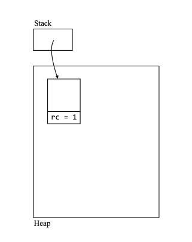

  - `val v = C(a)`가 실행되고 난 후, memory는 아래와 같은 상태가 된다.
    - `C(0)`의 reference count는 1에서 2로 증가하게 된다.

  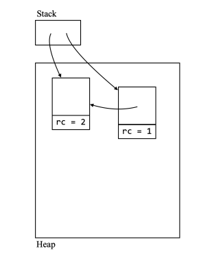

  - `a = C(1)`이 실행되고 난 후, memory는 다음과 같은 상태가 된다.
    - `C(0)`을 가리키는 pointer `a`가 더 이상 `C(0)`를 가리키지 않으므로, `C(0)`의 reference count는 2에서1로 감소하고, `a`는 `C(1)`을 가리키게 되어 `C(1)`의 reference count는 1 증가하게 된다.

  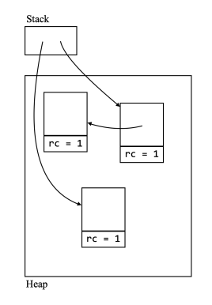

  - `b.x = a`가 실행되고 난 후 memory 상태는 아래와 같다.
    - `C(0)`를 가리키는 pointer `C(a)`가 더 이상 `C(0)`를 가리키지 않으므로, `C(0)` reference count는 1에서 0으로 감소한다.

  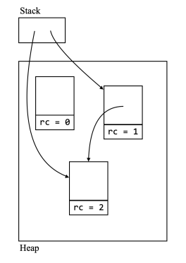

  - `C(0)`의 reference count가 감소한 후에 0이 되었으므로, unreachable한 것으로 간주되어 할당 해제된다.

  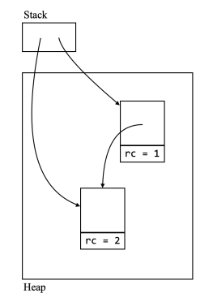


- 장점
  - 구현이 쉽다.
    - Reference counting은 오직 object에 reference count만 추가하고, object의 pointer가 생성되고 삭제될 때마다 reference count를 변경만 해주면 된다.
  - Memory의 재사용이 즉각적으로, 짧은 시간안에 이루어진다.
    - Reference count가 0으로 감소하는 즉시 할당 해제가 일어난다.
    - Reference count가 감소된 뒤 0인지 아닌지를 판별하는 것은 굉장히 빠른 시간에 가능하다.


- 단점

  - Cyclic structure를 다룰 수 없다.

    ```scala
    def f() = {
        val a = C(null)
        val b = C(a)
        a.x = b
    }
    ```

    - `val a = C(null)`이 실행되면 heap memory에 `C(null)`이 저장되고, referecne count가 1이 된다.
    - `val b = C(a)`가 실행되면 `C(null)`의 reference count가 2가 된다.
    - `a.x=b`가 실행되면 `C(a)`도 `C(null)`을 가리키고, `C(null)`도 `C(a)`를 가리키는 순환적인 구조가 된다.
    - `f`함수가 종료되어도 둘은 서로를 가리키고 있으므로 reference count가 1인 상태로 유지된다.
    - 함수의 종료와 함께 stack에 있던 local variable인 `a`, `b`는 stack에서 제거되어 `C(null)`과 `C(a)`에 접근할 방법이 없지만(unreachable), 여전히 reference count는 1이므로 할당해제가 영원히 일어나지 않게되고, memory leak이 발생한다. 
    - Reference counting의 다른 약점들은 성능 저하만 일으킬 뿐인데 반해, 순환적 구조를 다룰 수 없음으로 인해서 발생하는 memory 누수는 reference counting의 치명적인 단점이다.
    - 그럼에도 Python이나 Swift등의 일부 language들은 reference counting을 채택한다.
    - 이들은 reference counting의 이러한 제한을 극복하기 위한 나름의 해결책을 가지고 있다.
    - 예를 들어 Python의 경우 순환적 구조를 다룰 수 있는 secondary GC algorithm을 제공한다.

  - Reference count를 유지하는 비용이 발생한다.

    - Reference count는 heap에서 일정 영역을 차지하므로, heap의 가용한 공간을 감소시킨다.
    - 또한 pointer의 생성과 삭제가 항상 reference count의 수정을 유발하므로, 아무리 시간이 적게 걸린다고는 해도 일정 시간이 필요하긴 하다.
    - 또한 object의 할당과 할당 해제는 오직 한 번씩만 발생하지만, 각 object에 대한 pointer는 여러번 생성과 제거가 반복될 수도 있다.
    - 이는 pointer가 아닌 object의 할당과 할당해에시에만 heap을 수정하면 되는 다른 GC 기법과 비교했을 때 성능상의 단점이 된다.

  - Free list가 있어야한다.

    - Heap의 가용 영역은 초기에는 연속적인 단일 memory block이다.
    - 예를 들어 `[0,0,0,0,0,0,0,0,0,0]`와 같이 memory 공간이 있다고 가정해보자.
    - 0은 index가 할당되지 않은 상태, 1은 할당된 상태를 나타낸다.
    - 여기에 object가 하나 할당되어 memory가 `[1,1,0,0,0,0,0,0,0,0]`와 같이 변경되었다.
    - 만일 이 상태에서 새로운 object를 할당하려면 새로운 object를 저장할 공간의 시작 주소만 알면 된다.
    - 위 memory에서 2번 index부터 할당이 가능하므로 시작 주소를 2라 하고, 여기부터 새로운 object를 할당하여 `[1,1,1,1,1,0,0,0,0,0]`과 같이 되었다고 생각해보자.
    - 이 때 GC가 발생하여 처음 할당한 object가 할당 해제되고, `[0,0,1,1,1,0,0,0,0,0]`형태가 되었다.
    - 이제 사용 가능한 공간은 더 이상 연속적이 지 않고 두 부분으로 나뉘게 되었다.
    - 그러므로 새로운 object를 할당해야 할 때, 두 부분 중 어느곳에 할당할 수 있을지를 알기 위해서는 각 free space의 시작 address뿐 아니라 size까지도 알아야 한다.
    - Memory manager는 이러한 목적을 달성하기 위해서 free list라 불리는 data structure를 가지고 있다.
    - Free space는 일반적으로 linked list로 구현되며, 모든 free block에 대한 정보를 담고 있다.
    - 이렇게 free list를 저장하는 것 역시 어느 정도의 시간과 memory 영역이 요구된다.
    - 또한 매 번 새로운 할당이 발생할 때마다, memory manager는 적절한 크기의 free block을 찾기 위해 free list를 순회해야한다.

  - External fragmentation(외부 단편화)의 영향을 받는다.

    - 위에서 살펴본대로 free space는 여러 개의 block으로 쪼개질 수 있다.
    - 이를 external fragmentation이라 부른다.
    - External fragmentation으로 인해 heap에 충분한 공간이 있음에도 object가 할당되지 못할 수도 있다.
    - 예를 들어 `[0,0,0,0]`과 같은 heap memory가 있다고 가정해보자.
    - 하나의 `0`이 1KiB를 나타낸다고 할때, 1KiB짜리 object 4개가 할당되면 `[1,1,1,1]`과 같이 될 것이다.
    - 이 때, 첫 번째와 마지막 object가 할당 해제되어 `[0,1,1,0]`과 같은 모양이 되었다.
    - 그 후, 2KiB짜리 object가 할당해야한다면, memory에는 2KiB의 여유 공간이 존재하지만, 연속적으로 존재하지는 않으므로 할당이 불가능해진다.
    - 뿐만 아니라 external fragmentation은 cache 사용에도 악영향을 미친다.
    - 만일 함께 사용되는 여러 object들을 할당할 때에는 memory 상에서 가깝게 할당하는 것이 바람직하다(이렇게 배치된 것을 지역성(locality)이 좋다고 표현한다).
    - 좋은 지역성은 object들을 단일 cache block에 넣어 cache miss를 감소시켜준다.
    - 그러나 external fragmentation은 locality를 망친다.
    - 예를 들어 [0,0,0,1,1,1,1,0,0,0]과 같은 상태의 memory가 있다고 가정해보자.
    - 이 때 서로 연관이 있는 두 개의 2KiB짜리 object를 할당해야 한다면, locality를 위해 둘을 붙여서 저장하는 것이 좋지만, 둘을 붙여서 저장할 만한 공간이 없기에 따로 떨어뜨려 `[1,1,0,1,1,1,1,1,1,0]`과 같이 저장할 수 밖에 없다.


#### Mark-and-Sweep GC

- Mark-and-Sweep GC의 원리
  - Pointer가 제거될 때마다 unreachable한 object를 찾아서 할당을 해제하는 reference counting과 달리 mark-and-sweep GC는 GC가 trigger되면 모든 unreachable한 object를 한 번에 찾아서 할당 해제한다.
  - Mark-and-sweep GC는 두 단계로 구성된다.
    - Marking 단계에서 memory manager는 모든 reachable object에 mark한다.
    - Sweeping 단계에서 memory manager는 marking되지 않은 모든 object를 sweep(deallocate)한다.
  - Marking 단계에서 각 object는 아래 중 하나의 상태에 놓여있다.
    - Unreached: 아직 탐색되지 않았으며, unreachable할 수도 있는 할당 해제 후보이다.
    - Unscanned: Reachable하므로 할당 해제되지는 않을 것이지만, Unreached 상태인 object에 대한 pointer를 가지고 있어, 이후에 scan이 필요하다.
    - Scanned: Reachable하므로 할당 해제되지도 않을 것이고, Unreached 상태인 object에 대한 pointer를 가지고 있지도 않다.


- 예시

  - Marking 단계가 시작되면, 모든 object는 Unreached 상태(그림의 흰색 box)에 놓이게 된다.

  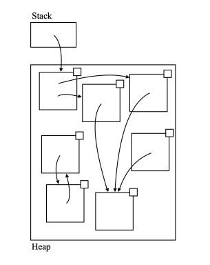

  - 첫 단계로, stack에 있는 pointer가 가리키는 object가 Unreached 상태에서 Unscanned 상태(아래 그림에서 회색)로 변경된다.

  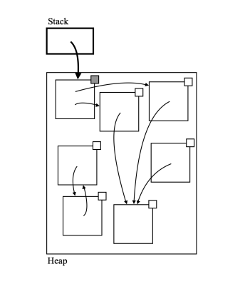

  - Memory manager는 Unscanned 상태인 object를 선택하여 해당 object와 해당 object가 가지고 있는 pointer를 따라가며 scan해 나간다.
  - Pointer가 가리키고 있는 모든 Unreached 상태인 object는 Unscanned 상태로 변경된다.
  - Scan 이후에 선택된 object는 Scanned(아래 그림의 검은 box) 상태가 된다.

  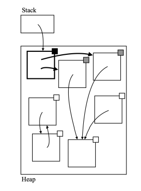

  - 위 Unscanned 상태인 object가 없을 때 까지 위 과정을 반복한다.

  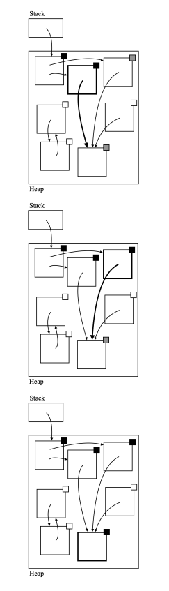

  - 만약 더 이상 Unscanned 상태인 object가 없다면, marking phase는 종료된다.
  - Sweeping phase에서는 각 object는 Scanned나 Unreached 중 하나의 상태에 놓이게된다.
    - Scanned 상태인 object는 marking이 된 것으로 간주하고, Unreached 상태인 object는 marking이 안된 것으로 간주한다.
    - Marking이 되지 않은 object는 unreachable한 것이므로 모두 할당 해제한다.


- 장점
  - Reference counting과 달리 cyclic structure를 다룰 수 있다.


- 단점
  - Free list를 필요로한다.
  - External fragmentation의 영향을 받는다.
  - GC 수행 중에 program의 실행이 정지된다.
    - GC가 trigger되면, memory manager는 heap 전체를 scan해야한다.
    - 이는 어느정도 시간이 걸리는데, 특히 heap이 크고 많은 object를 저장하고 있으면 더 그렇다.
    - 각 object의 reachability를 정확히 판단하기 위해서, program은 GC가 실행될 동안 잠시 멈춰야한다.
    - Programmer는 GC의 정확한 타이밍을 통제할 수 없기에, GC에 의해 일어나는 program의 정지는 대부분 예측 불가능하다.
    - 이러한 문제를 완화시키기 위해서 현대의 GC는 parallel GC나 incremental GC, concurrent GC 같은 다양한 기법을 적용했다.


#### Copying GC

- Copying GC의 원리
  - Copying GC는 mark-and-sweep GC와 유사하다.
    - GC가 trigger되면 모든 unreachable한 object를 찾아서 할당해제한다.
  - 그러나, copying GC의 경우 모든 reachable한 object를 복제한 후 압축된 layout에 재조직한다.
    - 이를 위해 heap을 from-space와 to-space라는 두 부분으로 나눈다.


- 예시

  - 모든 할당은 from-case에서 발생한다.
    - 그러므로 GC가 trigger될 때,  모든 object들은 from-space에 있고, to-space는 빈 상태이다.

  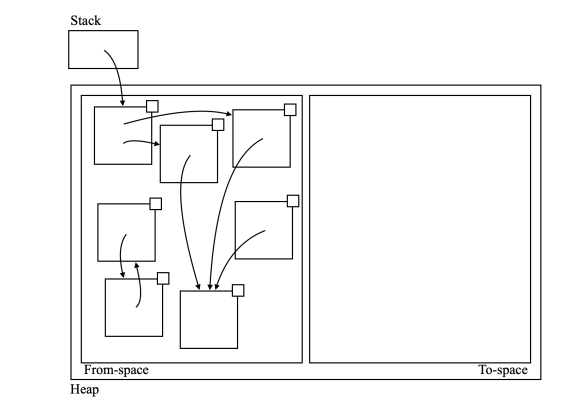

  - Copying GC의 연산은 mark-and-sweep GC의 marking 단계와 상당히 유사하다.
    - Stack에서 시작하여 pointer가 가리키는 object를 marking한다.
    - 차이가 있다면 object가 Unreached 상태에서 Unscanned 상태가 될때, from-space에서 to-space로 복제된다는 것이다.
  - 먼저 stack에서 한 번의 (pointer가 가리키는 쪽으로)이동으로 reachable한 모든 object를 to-space로 복제한다.
    - 복제한 뒤, to-space에 있는 object를 가리키도록 pointer들도 갱신한다.
    - 또한 from-space에 있는 object에는 to-space에 있는 자신의 복제 object를 가리키는 forwarding pointer(아래 그림에서 점선으로 표시된 화살표)가 저장된다.
    - Forwarding pointer는 추후에 memory manager가 추후에 발견될 pointer들을 정확히 갱신하도록 정보를 제공하는 역할을 한다.

  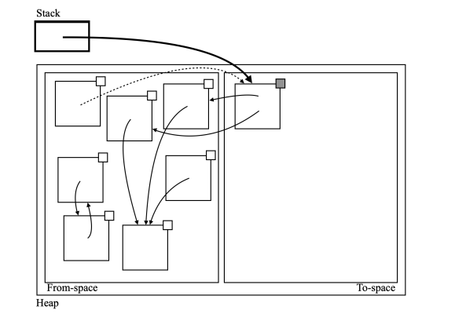

  - Memory manager는 to-space에서 Unscanned object 하나를 선택하고, 가리키는 pointer가 있는 Unreached object들을 to-space로 복제한 후 Unscanned 상태로 만든다.
    - 선택된 object는 Scanned 상태가 된다.

  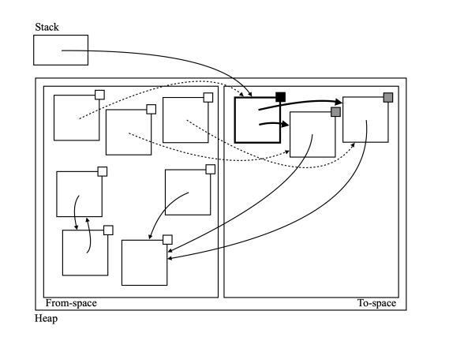

  - 이 과정을 Unscanned 상태인 object가 없을 때 까지 반복한다.

  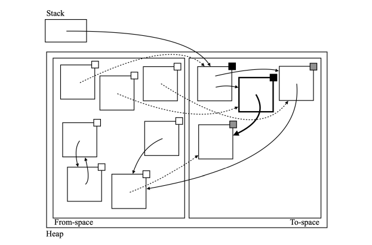

  - 만약 pointer가 가리키는 object가 이미 to-space에 복제가 되었다면, memory manager는 다시 copy하지 않고, forwarding pointer를 체크하여 pointer를 update한다.

  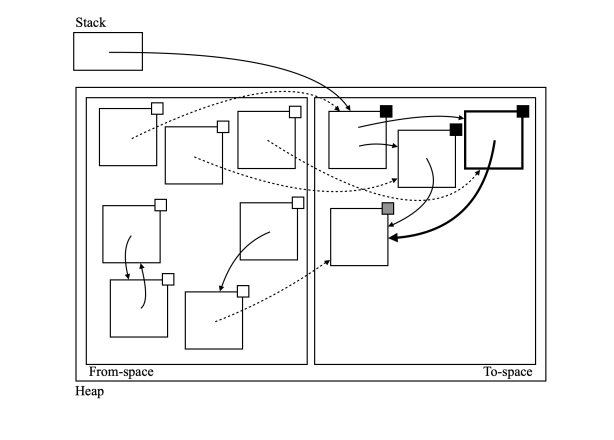

  - 만일 더 이상 Unscanned 상태인 object가 없다면, GC는 종료된다.
    - From-space와 to-space가 교환된다.
    - From-space에 할당이 발생하고, to-space는 빈 것으로 간주된다.

  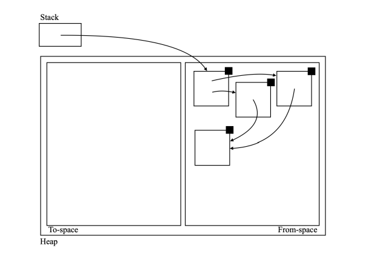


- Cheney's Algorithm

  - Cheney's algorithm은 copying GC의 효율적인 구현 방식이다.
  - GC가 발생하는 동안 to-space에 대한 두 개의 pointer를 유지한다.
    - free: to-space 내의 free space의 시작을 가리키는 pointer.
    - scan: to-space 내에 있는 Unscanned 상태인 첫 번째 object를 가리키는 pointer.
  - code
    - `AnyRef`는 어떤 object의 type이다.

  ```scala
  case class C(x: AnyRef, y: AnyRef)
  case class D(x: AnyRef)
  case class E(x: Int)
  ```

  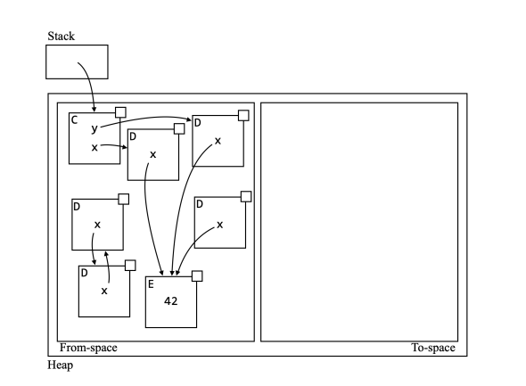

  - Memory 상의 모든 object들이 type tag를 가지고 있다고 가정해보자.

    - Type tag는 object가 속해있는 class의 이름이다.
    - Type tag는 field의 type을 검사함으로서 memory manager가 pointer가 integer와 구분될 수 있게 해준다.

    - 예를 들어 `E(42)`가 있을 때 여기서의 `42`는 field `x`의 type이 integer이므로  interger지 pointer가 아니다.

  - Heap이 32B이고, type tag, interger, address 각각이 1 byte만 차지한다고 가정했을 대, GC 이전의 memory는 다음과 같다.

    - 각 영역의 첫 번째 행은 각 slot의 address를 보여준다.
    - 각 영역의 두 번째 행은 각 space가 담고 있는 content를 보여준다.
    - 마지막 행은 scan과 free의 위치를 보여준다.
    - 시작시에 free와 scan 모두 to-space의 시작 부분을 가리키고 있다. 

  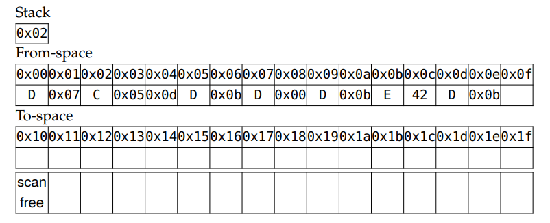

  - 첫 단계로, stakc에 유일하게 연결되어 있는 object가 to-space로 복제된다. 
    - `F`는 이미 복제된 object의 type tag를 의미한다.
    - Type tag `F`를 가지고 있는 object는 forwarding pointer를 가지고 있다.
    - To-space에 object가 생겼으므로, free pointer는 해당 object의 size에 맞춰 이동한다.
    - 반면에, to-space에 있는 object가 아직 scan은 되지 않았으므로, scan pointer는 이동하지 않는다.

  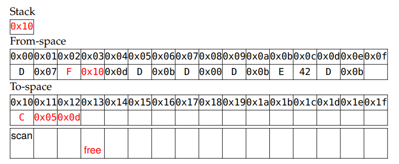

  - 다음 단계로, scan이 가리키고 있는 object가 scan된다.
    - Scan된 object가 가리키고 있던 모든 object들은 to-space로 복제된다.
    - free pointer는 복제된 모든 object의 size에 맞춰 이동한다.
    - 또한 scan pointer도 아직 scan되지 않은 object까지 이동한다.
    - scan pointer가 이동할 때, 기존의 address인 0x05와 0x0d가 각각 0x13, 0x15로 갱신된다.

  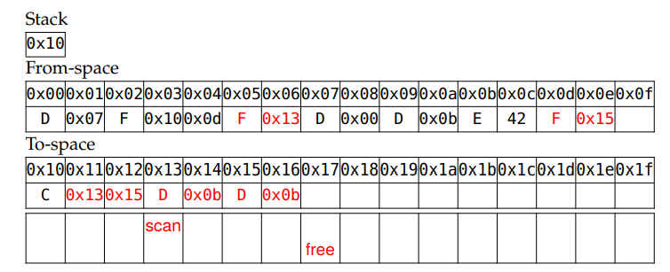

  - 이 과정을 scan이 free를 따라잡을 때 까지(즉, 더 이상 Unscanned 상태인 object가 없을 때 까지) 반복한다.

  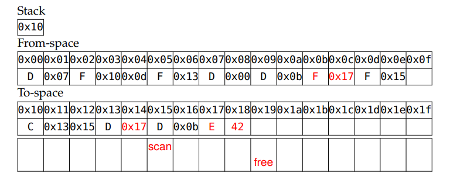

  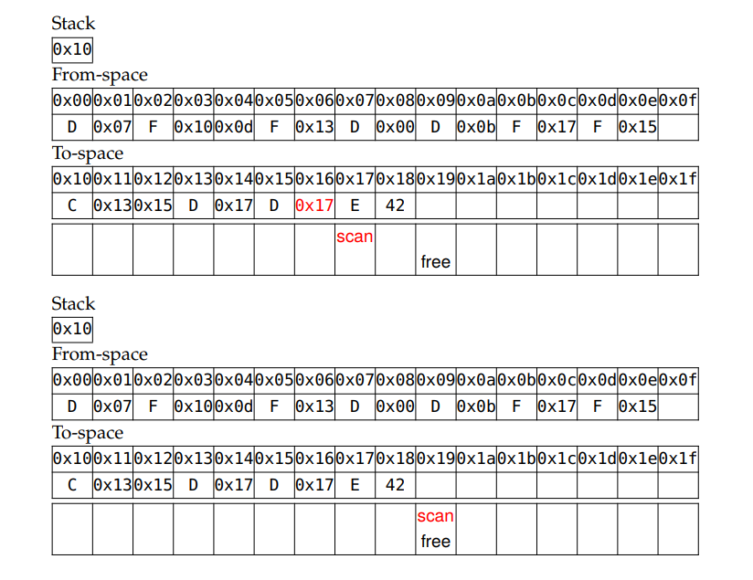


- 장점
  - Cyclic structure를 다룰 수 있다.
  - 할당이 매우 빠르게 이루어진진다.
    - Cheney's algorithm에서 사용되는 free pointer가 있기에, free list를 필요로하지 않기는다.
    - Unreachable object를 개별적으로 할당 해제하는 대신 객체들이 서로 인접하여 from-space의 시작부터 할당되고, GC가 to-space의 시작부터 복제하는데, 이로 인해 heap의 여유 공간이 항상 연속된 단일 block 상태가 되고, 모든 새로운 객체는 free pointer가 가리키고 있는 address부터 이루어지면 되어 빠른 속도로 할당이 가능하다.
    - Free list를 순회해야 하는 reference counting이나 mark-and-sweep 보다 훨씬 빠른게, 상수 시간으로 할당이 가능하다.
  - External fragmentation의 영향을 받지 않는다.
    - 상기했듯, 여유 공간이 항상 연속된 단일 block이기에, external fragmentation의 영향을 받지 않는다.
    - 이는 heap의 효율적인 사용을 가능하게 한다.
    - 만약 heap에 충분한 공간만 있다면, object는 항상 할당이 가능하다.
    - 또한, good locality도 보장한다.


- 단점
  - GC가 실행되는 동안 program의 실행이 멈추게된다.
  - 오직 heap의 절반만이 object를 저장하는데 사용된다.
    - Heap을 두 부분으로 나누기에 절반만 object 할당에 사용할 수 있다.
    - 이로 인해 heap 크기가 줄어들면, GC가 더욱 빈번하게 발생하게 되고, program도 더 자주 정지하게 된다.
  - 복제하는 데 비용이 많이 들어간다.
    - 다른 GC 방식과는 달리 GC가 trigger될 때마다 reachable object들을 복제해야한다.
    - 만약 heap에 대량의 reachable object가 존재한다면, 복제에 시간이 오래 걸릴 것이고, program이 정지하는 시간도 길어질 것이다.


# Lazy Evaluation

- Lazy evaluation

  - Lazy evaluation이란 expression의 평가를 해당 expression의 결과가 필요해질 때까지 미루는 것이다.
  - Eager evaluation
    - Lazy evaluation과 반대되는 개념이다.
    - Expression의 결과가 향후의 계산에 필요한지도 모르는채로 expression을 평가하는 것이다.
  - Lazy evaluation에는 programming language에 적용될 수 있는 몇 가지 특징이 있다.
    - 예를 들어 function application을 위한 argument들은 lazy하게 평가될 수 있다.
    - Function application시의 각 argument들은 function body가 시작되기 전이 아니라, function body에서 사용될 때 평가된다.
    - 또 다른 예는 변수 선언이다.
    - Variable의 초기화는 variable이 정의될 때가 아닌, variable이 처음 쓰일 때 발생할 수 있다.

  - 여기서는 function application의 argument의 lazy evaluation만을 고려할 것이다.
    - 사실, 이전 장에서 local variable이 function parameter의 syntactic sugar로 간주될 수 있다고 했으므로, function application의 argument의 lazy evaluation을 살펴보면 variable definition에서의 lazy evaluation도 설명될 것이다.


- CBV, CBN, CBR과 eager, lazy language

  - 이전장까지 정의했던 언어는 eager language였다.
    - 또한 function application의 semantic을 정의할 때 CBV를 사용했다.
    - CBV는 eager evaluation과 같은 것으로 간주될 수 있다.
    - CBV는 모든 argument가 value로 넘겨진다는 것을 의미한다.
    - 따라서 argument의 value는 오직 argument expression을 평가함으로써만 얻어질 수 있다.
    - 이는 모든 argument가, 그것이 function body의 평가에 사용되는지와 무관하게, function body의 평가 이전에 평가된다는 것을 암시한다.
    - 그러므로, CBV semantic은 eager evaluation semantic과 같다고 할 수 있다.
  - Call-by-name(CBN) semantic은 lazy evaluation의 한 형태이다.
    - CBN semantic에서 각 argument들은 그것들의 name으로 넘겨진다.
    - 즉 expression이 가리키는 값이 아니라 expression 그 자체로 넘겨진다.
    - Expression으로 넘겨지기 때문에, argument의 value를 얻기위해 expression을 평가하지 않아도 된다.
    - Expression은 function body에서 value가 필요한 경우에 평가된다.
    - CBN은 argument를 expression으로 넘김으로서 그것의 계산을  늦춘다.
    - 따라서 CBN은 lazy evaluation으로 간주될 수 있다.

  ```python
  def foo():
      print("foo")
      return "foo"
  
  def call_by_value(condition, value):
      if condition:
          return value
  
  # function이라는 parameter는 해당 값이 필요하지 않으면 평가되지 않는다.
  def call_by_name(condition, function):
      if condition:
          return function()
  
  call_by_value(False, foo())	# argument로 function의 실행 결과 값을 넘긴다.
  call_by_name(False, foo)	# argument로 function을 넘긴다.
  ```

  - Call-by-reference(CBR)의 경우
    - CBR의 경우에는 earger language인지 lazy language인지 구분하는 것과 무관하다.
    - CBR은 argument가 address가 알려진 variable인 것을 의미하는데, 이 경우, 평가할 것 자체가 없다.
    - CBR과 CBV는 address를 넘기느냐, address가 가리키는 값을 넘기느냐의 문제인데 반해, eagerness와 laziness는 argument를 언제 평가할지에 관한 문제이다.
    - CBR은 argument를 평가 하든 하지 않든 사용될 수 있다.


- 이번 장에서 FAE의 lazy version인 LFAE를 정의해 볼 것이다.
  - LFAE는 CBN semantic을 채택한다.
  - 또한 lazy evaluation의 또 다른 형태이자 CBN의 최적화 version인 call-by-need에 대해서도 알아볼 것이다.
    - 어떤 사람들은 lazy evaluation을 call-by-need를 가리키기 위해 사용한다.
    - 그러한 관점에서 보면, CBN은 lazy evaluation이 아니다.
    - 그러나, 여기서는 CBN과 call-by-name 모두 lazy evalutaion에 속한다고 간주할 것이다.


- 본격적으로 CBN semantic과 LFAE를 다루기 전에, lazy evaluation이 실제로 어떤 유용함이 있는지 살펴볼 것이다.

  - 우리는 lazy-evaluation을 소수의 실제 language들에서 찾아볼 수 있다.
    - Haskell의 경우 모든 계산을 기본적으로 lazy하게 처리하는 것으로 유명하다.
    - 만면에 Scala는 eager language지만 programmer가 선택적으로 lazy evaluation을 적용할 수 있도록 허용한다.
  - Eager evaluation을 사용할 경우의 문제점
    - `square` function은 integer를 argument로 받고, 그것의 제곱을 반환하는데, `Thread.sleep(5000)`으로 인해 항상 최소 5초 이상이 걸리게 된다.
    - `foo`의 경우 `b`가 false면 `square(10)`는 필요 없어지게 된다.
    - 그러나 Scala는 기본적으로 eager evaluation을 사용하기에, `b`와 무관하게 항상 `square(10)`가 실행되고 5초를 소비하게 된다.
    - 만일 우리가 `b`가 true일 경우에만 `square(10)`를 실행하도록 변경한다면, 많은 경우에 program의 실행 시간을 줄일 수 있다.

  ```scala
  def square(x: Int): Int = {
  	Thread.sleep(5000) // 시간이 오래 걸리는 연산을 대체
      x * x
  }
  
  def foo(x: Int, b: Boolean): Int =
  	if (b) x else 0
  
  // file에는 a.txt라는 file이 있으면 true, 없으면 false가 담기게 된다.
  val file = new java.io.File("a.txt")
  foo(square(10), file.exists)
  ```

  - Lazy evaluation 적용하기
    - Scala에서는 argument에 `=>`를 추가하여 해당 argument에 lazy evaluation을 적용할 수 있다.
    - 더 정확히는 CBN semantic을 사용하게 할 수 있다.

  ```scala
  def foo(x: => Int, b: Boolean): Int =
  	if (b) x else 0
  ```


- Semantic 정의하기

  >  LFAE의 syntax는 FAE와 동일하므로 따로 정의하지 않는다.

  - 변경이 필요하지 않은 것들

    - Environment의 정의는 FAE와 동일하다(또한 `σ ├ e ⇒ v`는 오직 `e`가 `σ`하에서 `v`로 평가될 때만 참이다).
    - Rule Num, Rule Fun, Rule ID 등도 lazy evaluation의 영향을 받지 않으므로, 수정할 필요가 없다.

  - 확실히 수정이 필요한 것은 function application의 semantic이다.

    - Function application이 lazy language와 eager language를 비교했을 때 가장 두드러진 차이를 보이기 때문이다.

  - Value의 semantic 수정하기

    - CBV semantic에서 argument의 value를 environment에 저장하고, function body를 평가하는데 environment를 사용했었다.
    - CBN에서도 마찬가지로 environment에 argument를 저장할 것이지만, argument가 expression으로 전달되고, argument는 value가 아니다.
    - 따라서 environment에 expression을 넣을 수 있는 방법이 필요하다.
    - 가장 간단한 방법은 Value의 semantic을 아래와 같이 수정하는 것이다(기존 Value의 semantic은 생략한다).

    $$
    v:= \cdots\ |\ (e, σ)
    $$

    - `(e, σ)`는 value로서의 expression을 나타내며, 이를 expression-value라 부를 것이다.
    - 이는 `σ`하에서 `e`의 계산이 지연됐다는 것을 의미한다.
    - Environment(`σ`)를 expression과 함께 묶은 이유는 expression에 environment에 값이 저장된 free identifier가 포함됐을 수 있기 때문이다.
    - 이는 closure의 개념과 비슷하다.
    - Expression-value의 형태(`(e, σ)`)와 closure의 형태(`<λx.e, σ>`)는 parameter의 이름이 없다는 것만 빼면 유사한데, 이는 우연이 아니다.
    - Expression-value와 closure 모두 지연된 계산을 가리킨다.
    - `(e, σ)`에서 `e`의 평가는 argument의 값이 필요해질 때까지 연기된다.
    - 또한 `<λx.e, σ>`에서 `e`의 평가 또한 closure가 value에 적용될 때 까지 연기된다.

  - Expression-value의 추가로, evaluation의 또 다른 형식을 정의해야한다.

    - 이를 strict evaluation이라 부를 것이다.
    - Strict evaluation의 목적은 expression-value를 integer나 closure 같은 normal value가 되도록 강제하는 것이다.
    - Strict evaluation은 expression-value의 능력이 제한되어야하기에 필요하다.
    - Expression-value는 argument가 될 수도 있고, normal value처럼 environment에 저장될 수도 있지만, 수학적 expression의 피연산자가 되거나 function이 되어 호출 될 수는 없다.
    - 따라서 strict evaluation을 통해 expression-value를 value로 변경하는 작업이 필요하다.

  - Strict evaluation은 V와 V 사이의 이항관계로 정의된다.

    -  Strict evaluation을 표현하기 위해 `⇓`를 사용할 것이다.

    $$
    ⇓\subseteq V×V
    $$

    - `v_1 ⇓ v_2`는 오직 `v_1`이 strict하게 `v_2`로 평가될 경우에만 참이다.
    - 여기서 `v_1`은 어떤 값이든 될 수 있지만, `v_2`는 expression-value는 될 수 없고 반드시 normal value여야한다.
    - 그 이유는 분명한데, strict evaluation의 목적이 expression-value를 normal value로 변경하는 것이기 때문이다.

  - Normal value는 이미 normal value이기에 strict하게 평가해도 그 자체로 평가된다.

    - Rule Strict-Num: n은 strict하게 n으로 평가된다.

    $$
    n⇓n
    $$

    - Rule Strict-Clo: `<λx.e, σ>`은 strict하게`<λx.e, σ>`로 평가된다.

    $$
    \left\langle λx.e, σ \right\rangle⇓\left\langle λx.e, σ \right\rangle
    $$

  - Rule Strict-Expr

    - `e`가 `σ`하에서 `v_1`으로 평가되고, `v_1`이 `σ`하에서 `v_2`로 strict하게 평가되면, `(e,σ)`는 `v_2`로 strict하게 평가된다.

    $$
    σ├e⇒v_1\ \ \ \ \ v_1⇓v_2\over (e, σ)⇓v_2
    $$

    - `e`의 결과는 또 다시 expression-value가 될 수 있다.
    - 그러므로, normal value를 얻를 때 까지 strict하게 평가를 반복해야한다.

  - Rule App

    - 만약 `e_1`이 `σ`하에서 `v_1`으로 평가되고, `v_1`이 `<λx.e, σ'>`로 strictly evaluate되며, e가 `σ'[x↦(e_2,σ)]`하에서 `v`로 평가되면, `e_1 e_2`는 `σ`하에서 `v`로 평가된다.

    $$
    σ├e_1⇒v_1\ \ \ \ \ v_1⇓\left\langle λx.e, σ' \right\rangle\ \ \ \ \ σ'[x↦(e_2,σ)]├e⇒v\over σ├e_1\ e_2⇒v
    $$

    - 먼저 `e_1`이 `v_1`으로 평가된다.
    - ` v_1`은 아마 expression-value일 것이며, 우리는 expression-value가 아닌 closure가 필요하다.
    - 그러므로, closure를 얻기 위해 `v_1`을 strictly evaluate한다.
    - 반면에, CBN semantic에서 argument는 function body가 평가되기 전까지는 평가되면 안되므로`e_2`를 평가하는 대신 `e_2`와 `σ`로 expression-value를 만들고, 이를 environment에 넣는다.

  - Rule Add

    - `e_1`이 `σ`하에서 `v_1`으로 평가되고, `v_1`이 `n1_1`으로 strictly evaluate되며, `e_2`가 `σ`하에서 `v_2`로 평가되고, `v_2`가 `n_2`로 strictly evaluate 되면, `e_1+e_2`는 `σ`하에서 `n_1+n_2`로 평가된다.

    $$
    σ├e_1⇒v_1\ \ \ \ \ v_1⇓n_1\ \ \ \ \ \ σ├e_2⇒v_2\ \ \ \ v_2⇓n_2\over σ├e_1+e_2⇒n_1+n_2
    $$

  - Rule Sub

    - `e_1`이 `σ`하에서 `v_1`으로 평가되고, `v_1`이 `n1_1`으로 strictly evaluate되며, `e_2`가 `σ`하에서 `v_2`로 평가되고, `v_2`가 `n_2`로 strictly evaluate 되면, `e_1-e_2`는 `σ`하에서 `n_1-n_2`로 평가된다.

    $$
    σ├e_1⇒v_1\ \ \ \ \ v_1⇓n_1\ \ \ \ \ \ σ├e_2⇒v_2\ \ \ \ v_2⇓n_2\over σ├e_1-e_2⇒n_1-n_2
    $$

  - 문제점

    - 지금까지 정의한 semantic들은 CBN을 적용하긴 했으나 실제사용하는 관점에서는 한 가지 흠이 있다.
    - `<λx.x>(1+1)`의 결과는 `(1+1, ∅)`이지 2가 아니다.
    - 대부분의 programmer는 2가 결과로 나오기를 바랄 것이다.
    - 따라서 마지막으로 전체 evaluation이 끝날 때, strict evaluation을 한 번 더 적용해야한다.
    - 즉, program `e`의 결과는 `∅├e⇒v'`이고, `v'⇓v''`일 때 `v`이다.
    - 주의할 점은 이는 program의 모든 expression에 strict evaluation을 적용하는 것과는 다르다는 점이다.
    - Strict evaluation은 오직 전체 exrpression(즉, program)의 결과에만 적용된다.

  - CBV semantic으로 expression을 평가한 결과로 value가 나왔다면, CBN semanic도 같은 value를 산출할 것이다.

    - 이는 lambda calculus(람다 대수)의 standardization theorem(표준 정리)의 따름 정리(corollary)이다.
    - 표준화 정리는 람다 대수의 식이 어떤 순서로 계산하여 값이 나온다면, 정규 순서(normal order)로 계산하였을 때 반드시 그 값이 나옴을 의미한다.
    - 단, 이는 오직 side effect가 없는 language들에서만 참이다.
    - Side effect가 있는 경우, expression의 결과는 evaluation 순서에 따라 달라진다.
    - 예를 들어 argument가 box의 값을 변경시키는 expression이고, function body에서 argument를 사용하지 않고 box의 값을 읽는다면, 이 program은 CBV와 CBN에서 다르게 동작할 것이다.
    - CBV의 경우, argument가 사용되지 않아도 일단 평가하므로, box의 값이 변경되고, 변경된 box의 값이 읽히게 된다.
    - 반면 CBN의 경우, argument가 사용되지 않으면 평가되지 않으므로, box의 값이 변경되지 않고, 변경되지 않은 box의 값이 읽히게 된다.

  - CBV semnatic의 결과는 CBN semantic의 결과와 같지만, CBVNsemantic의 결과가 CBV semantic의 결과와 항상 같은 것은 아니다.

    - 즉 오직 CBN에서만 결과를 산출하는 expression이 있다.
    - 예를 들어, argument로 종료되지 않는 expression을 받는 function application이 일어났다고 가정해보자.
    - 만약 해당 argument를 사용하지 않으면 0을 반환한다고 했을 때, CBN에서는 해당 argument가 사용되지 않으면 0을 반환하겠지만, CBV는 argument를 바로 평가하므로 실제 사용 여부와 관계 없이 종료되지 않는 expression이 계속 실행되게 된다.


- Interpreter 수정하기

  - Expression-value를 표현하기 위한 `Value`의 또 다른 변형을 추가해야한다.

  ```scala
  sealed trait Value
  ...
  case class ExprV(e: Expr, env: Env) extends Value
  ```

  - Strict evaluation을 위한 function을 추가한다.

  ```scala
  def strict(v: Value): Value = v match {
      case ExprV(e, env) => strict(interp(e, env))
      case _ => v
  }
  ```

  - `interp` function을 아래와 같이 수정한다.

  ```scala
  def interp(e: Expr, env: Env): Value = e match {
      ...
      case Add(l, r) =>
          val NumV(n) = strict(interp(l, env))
          val NumV(m) = strict(interp(r, env))
          NumV(n + m)
      case Sub(l, r) =>
          val NumV(n) = strict(interp(l, env))
          val NumV(m) = strict(interp(r, env))
          NumV(n - m)
      case App(f, a) =>
          val CloV(x, b, fEnv) = strict(interp(f, env))
          interp(b, fEnv + (x -> ExprV(a, env)))
  }
  ```


- Call-by-Need

  - 위에서 구현한 방식은 parameter가 function body에서 한 번 이하로 나타날 때만 효율적이다.
    - 그러나, parameter를 두 번 이상 사용해야할 경우 불필요한 계산이 발생한다.
    - 아래 예시에서 `x`는 function `bar`의 body에 두 번 나타나므로, 만약 `a.txt`가 있으면, `square(10)`은 두 번 계산된다.
    - 따라서 function call의 횟수를 줄이는 것이 바람직하다.
    - 만약 우리가 CBV를 사용한다면, `square(10)`을 한 번만 평가하는 것이 가능하다. 그러나 file이 있는지 여부와 무관하게 무조건 `square(10)`을 계산하므로, CBV로 돌아가는 것은 좋은 선택이 아니다.

  ```scala
  def square(x: Int): Int = {
      Thread.sleep(5000) // models some expensive computation
      x * x
  }
  def bar(x: => Int, b: Boolean): Int =
  	if (b) x + x else 0
  
  val file = new java.io.File("a.txt")
  bar(square(10), file.exists)
  ```

  - 위와 같은 문제를 해결하는 방법은 argument의 value를 저장해두고, 재사용하는 것이다.

    - 그러나 programmer 입장에서 이러한 최적화 logic을 구현하는 것은 지루한 일일 수 있따.
    - 대신, programming language가 이러한 최적화를 제공할 수도 있다.
    - 각 argument가 그 값이 필요할 때 평가되는 최적화를 call-by-name이라 부른다.

    - 만약 값이 필요하면 한 번 평가되고, 필요하지 않다면 평가되지 않는다.

  - Call-by-name과 CBN

    - 순수 functional language에서 Call-by-name의 semantic은 CBN의 semantic과 다르지 않다.
    - 둘 모두 program의 동작이 완전히 동일하다.
    - Call-by-name은 interpreter 혹은 compiler의 최적화 전략일 뿐이다.
    - 반면에 side effect가 있는 language에서 둘은 semnatic에서 차이를 보인다.
    - 특정 expression의 연산 횟수는 결과에 영향을 줄 수 있다.
    - 예를 들어 box의 value를 1 증가시키는 argument가 있다고 가정해보자.
    - 해당 argument는 function body에서 두 번 사용된다.
    - 그럼, CBN에서는 box의 값이 2 증가되겠지만, call-by-need에서는 1 증가될 것이다.

  - Lazy evaluation을 사용하는 순수 functional language는 일반적으로 call-by-need를 채택한다.

    - 순수 functional language에서는 semnatic의 변경 없이 최적화가 가능하기 때문이다.
    - 그러나 순수 functional language가 아닌 language들은 call-by-need를 최적화로 간주할 수  없으며, 종종 programmer에게 선택하게 해준다.
    - 예를 들어 Scala는 CBN을 parameter에 사용하고, call-by-name을 lazy evaluation을 위해 사용한다.


- LFAE에 call-by-need 적용하기

  - LFAE에는 side effcect가 없기 때문에, call-by-need를 적용하는 것이 가능하다.
    - Interpreter를 최적화하는 방식으로 적용할 것이다.
    - 따라서, semantic은 수정할 필요가 없다.
  - Expression-value의 strict value를 저장하기위한 class를 정의한다.
    - Field는 mutable하게 선언한다.
    - 초기에 expression의 value는 unknown이고, `v`는 None이다.
    - Value가 처음 계산될 때, value는 `v`에 저장된다.
    - 어떤 `a`에 대해서 `v`가 `Some(a)`와 같다는 사실은 expression의 value가 `a`라는 것을 의미한다.
    - 다음에 value가 다시 필요해졌을때, `Some()`의 argument가 `a`라면 `Some(a)`를 다시 계산할 필요 없이 `v`의 값을 사용하면 된다.

  ```scala
  case class ExprV(
  	e: Expr, env: Env, var v: Option[Value]
  ) extends Value
  ```

  - `strict` function은 아래와 같이 변경되어야 한다.
    - 먼저 cache된 value가 있는지 체크한 후, cache된 value가 있으면 cache 된 value를 반환한다.
    - 아니면 `e`는 이전처럼 `env`하에서 평가된다.
    - 추가적으로, v에 value를 저장한다.

  ```scala
  def strict(v: Value): Value = v match {
      // cache된 값(ExprV 의 instance)이 있으면 cache된 값을 반환.
      case ExprV(_, _, Some(cache)) => cache
      // cache된 값이 없으면, 
      case ev @ ExprV(e, env, None) =>
      	// env하에서 e를 평가하고
          val cache = strict(interp(e, env))
      	// v에 value를 저장한다.
          ev.v = Some(cache)
          cache
      case _ => v
  }
  ```

  - `interp` function도 수정이 필요하다.
    - `App` case만 변경하면 된다.
    - `App` case에서 새로운 `ExprV`의 instance가 생성될 때, `v` field를 초기화하기위한 추가적인 argument를 넘겨야 한다.
    - 우리는 `a`의 value를 모르기 때문에, `v`의 초기값은 None이된다.

  ```scala
  case App(f, a) =>
      val CloV(x, b, fEnv) = strict(interp(f, env))
      interp(b, fEnv + (x -> ExprV(a, env, None)))
  ```

