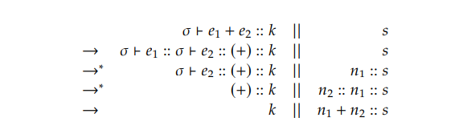
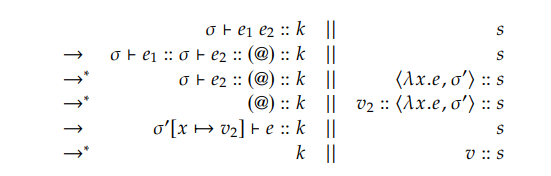
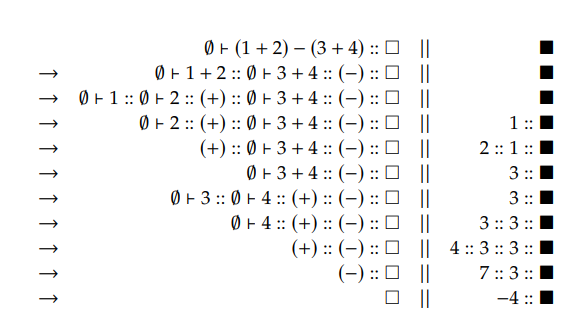
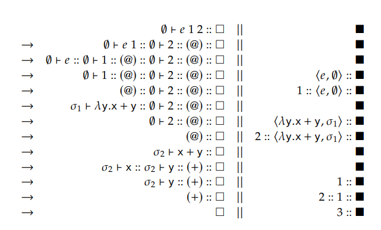

# Continuations

- 많은 실제 lnaguage들은 제어 흐름(control flows)을 수정하는 control diverters를 지원한다.

  - Control diverter는 복잡한 제어 흐름을 가진 program을 작성할 때 유용하다.
  - 예시
    - 예를들어 scala에서 return keyword를 사용 가능하다.
    - `return x`가 평가되면, x가 가리키는 value가 즉각적으로 반환되기에, 아래 code의 결과는 6이 아닌 3이다.
    - 아래 예시는 `return`이 다른 expression들과 어떻게 다른지 보여준다.
    - 대부분의 expression들은 결과로 값을 생성한다.
    - 그러나, `return`은 함수가 즉각적으로 결과를 반환하도록 함으로써, 제어 흐름을 변경시킨다.

  ```scala
  def foo(x: Int): Int = {
      val y = return x
      x + x
  }
  
  foo(3)
  ```

  - 실제 언어에서 `return`뿐 아니라 다양한 control diverter들을 찾을 수 있다.

    - `break`, `continue`, `goto`, `throw`(또는 `raise`)등이 있다.

  - 다만, mutation과 마찬가지로 control diverter또한 language를 impure하게 만든다.

    - Pure language에서 평가의 순서는 중요하지 않다. 각 expression은 오직 결과만 생산할 뿐이고, 다른 side effect는 없다.
    - 반면에 impure language들에서 평가 순서는 중요하다. Expression은 값의 변경(mutation)이나 제어 흐름을 변경시키는 것 같은 side effect들을 수행할 수 있다.

    - 특정 expression을 평가함으로써 다른 expression의 결과가 변경되거나, 다른 expression이 평가되지 않을 수도 있다.
    - 그러므로, impure language로 작성된 program은 전역적인 추론(global reasoning)이 필요하다.
    - 반면에, pure language로 작성된 program은 지역적이고 modular한 추론(local and modular reasoning)이 필요하다.
    - Mutation과 control diverter는 그 유용성에도 불구하고 program을 추론하기 어렵게 만든다.
    - 따라서 controld diverter를 사용할 때 programmer는 각별한 주의를 기울여야한다.


- Redexes와 Continuations

  > Continuation은 남은 것을 계속 처리하는 것을 의미하므로, "계속"이라고 번역하는 것이 적절할 수 있다.

  - expression을 평가하는 것은 여러 단계의 연산을 필요로한다.
    - `(1+2)+(3+4)`라는 expression의 평가는 아래 아래 7단계의 과정을 거친다.
    - interger 값 1을 얻기 위해 `1`을 평가한다.
    - interger 값 2을 얻기 위해 `2`을 평가한다.
    - integer 값 3을 얻기 위해 integer 값 1을 integer 값 2에 더한다.
    - interger 값 3을 얻기 위해 `3`을 평가한다.
    - interger 값 4을 얻기 위해 `4`을 평가한다.
    - interger 값 7을 얻기 위해 integer 값 3을 integer 값 4에 더한다.
    - interger 값 10을 얻기 위해 integer 값 3을 integer 값 7에 더한다.
  - 우리는 N개의 단계를 앞의 n개의 단계와 나머지 N-n개의 단계로, 두 분으로 나눌 수 있다.
    - 우리는 앞의 n개의 단계로 평가되는 expression을 redex라 부르고, 나머지 N-n개의 단계로 표현되는 나머지 연산을 continuation이라 부른다.
    - Redex는 reducible expression의 약어이다(reduction 혹은 reducible에 대한 개념 없이도 redex에 대해 이해할 수 있으므로 reduction 혹은 reducible이 무엇인지는 다루지 않는다).
    - redex는 먼저 평가될 수 있는 expression이다.
    - 예를 들어 위 과정은 1단계와 2~7단계로 나눌 수 있다.
    - 이 경우 첫 단계가 redex, 2~7단계가 continuation이 된다.
    - 중요한 점은 continuation의 평가를 완성하기 위해서는 redex의 결과가 필요하다는 점이다.
    - 1단계의 결과인 1 없이는 continuation은 3단계부터는 진행할 수 없다.
  - Continuation은 redex의 결과로 빈 곳을 채워야하는 구멍난 expression이라고 볼 수 있다.
    - 직관적으로 위 식에서 1의 continuation은, □가 redex의 결과가 사용되어야 하는 공간이라고 했을 때, `(□ + 2) + (3 + 4)`라고 볼 수 있다.
    - Continuation은 redex의 결과를 input으로 받아 남은 연산을 완성하기에, continuation은 function으로 해석될 수도 있다.
    - 이러한 해석에 따르면, 1의 continuation은 `λ.x(x+2)+(3+4)`로 표현될 수 있다.
  - 단계를 나누는 다양한 방식이 있다.
    - 아래 표는 `(1+2)+(3+4)`의 평가 단계를 나누는 모든 방식을 보여준다(왼쪽에서 오른쪽으로 계산이 이루어져야한다고 가정한다).
    - redex는 먼저 평가될 수 있는 exrpession이므로 2, 3, 4, 3+4 등은 redex가 될 수 없다.
    - 예를 들어 2의 경우 1보다 먼저 평가될 수 없으므로 redux가 될 수 없으며, 3, 4, 3+4는 1+2가 평가되기 전에 평가될 수는 없으므로 redex가 될 수 없다.
    - 반면에 1+2는 가장 먼저 평가될 수 있으므로 redex이다.

  | redex |             | continuation |             |                       |
  | ----- | ----------- | ------------ | ----------- | --------------------- |
  | steps | expression  | steps        | hole        | function              |
  | 1     | 1           | 2-7          | (□+2)+(3+4) | λ.x.(x + 2) + (3 + 4) |
  | 1-3   | 1+2         | 4-7          | □+(3+4)     | λ.x.x + (3 + 4)       |
  | 1-7   | (1+2)+(3+4) | .            | □           | λ.x.x                 |

  - Continuation은 다시 redex와 continuation으로 분리될 수 있다.
    - 예를 들어 1의 continuation은 2-7 단계로 구성된다.
    - 이를 2 단계와 3-7단계로 분리하면 redex는 expression 2가 되며 continuation은 `(1 + □) + (3 + 4)`가 된다(여기서의 1은 expression이 아니라 integer 값 1을 의미하므로, 2는 redex가 될 수 있다).
    - 따라서 expression의 평가는 redex의 평가와 continuation의 호출(application)의 반복이다.
    - Expression이 redex와 continuation으로 분리됐을 때, redex는 값으로 평가되고, continuation은 redex가 평가된 값에 apply된다.
    - 그 후 continuation이 다시 redex와 continuation으로 분리되고, redex가 평가된다.
    - 더 이상 남은 continuation이 없을 때 까지 이 과정이 반복된다.
    - 즉 continuation은 항등 함수(identity function)가 된다.


- Store-passing style

  - Box에 대해서 다룰 때, mutation 없이 mutation을 어떻게 구현할 수 있는지 확인하기 위하여 store를 전달받는 것(store passing)을 선택했었다.
    - 아래 code는 BFAE의 interpreter에서 구현한 code의 일부이다.
    - Store-passing interpreter인 아래 function은 현재의 store를 각 function call마다 넘기고, 각 function call은 처리된 store를 반환했다.
    - 만약 mutable map을 사용했다면, BFAE와 MFAE의 interpreter를 store-passing style 없이 구현할 수 있었을 것이다.

  ```scala
  def interp(e: Expr, env: Env, sto: Sto): (Value, Sto) =
      e match {
          ...
          case Add(l, r) =>
              val (NumV(n), ls) = interp(l, env, sto)
              val (NumV(m), rs) = interp(r, env, ls)
              (NumV(n + m), rs)
          case NewBox(e) =>
              val (v, s) = interp(e, env, sto)
              val a = s.keys.maxOption.getOrElse(0) + 1
              (BoxV(a), s + (a -> v))
  }
  ```

  - Mutable map을 사용한 BFAE interpreter
    - `sto` variable은 mutable map을 나타내며, `interp` function은 store를 argument와 return value로 전달하는 대신, sto에 의존한다.
    - `Add` case는 더 이상 store를 `l`의 평가에서 r의 평가로 넘기지 않는다.
    - `NewBox` case는 새로운 box를 생성하기 위해 단순히 `sto`를 수정하기만 하면 된다.
    - Global하고 수정 가능하며, 모든 수정 사항을 기록하는 map이 있다면 store passing은 불필요하다.

  ```scala
  def interp(e: Expr, env: Env): Value =
  e match {
      ...
      case Add(l, r) =>
          val NumV(n) = interp(l, env)
          val NumV(m) = interp(r, env)
          NumV(n + m)
      case NewBox(e) =>
          val v = interp(e, env)
          val a = sto.keys.maxOption.getOrElse(0) + 1
          sto += (a -> v)
          BoxV(a)
  }
  ```

  - 두 코드는 store passing을 사용하는 interpreter와 사용하지 않는 interpreter의 차이를 분명하게 보여준다.
    - Store passing을 사용하는 경우, 각 실행 시점마다 현재 store가 명시된다.
    - `Add` case의 경우 더욱 분명해지는데, `sto`는 store르 변경시킬 가능성이 있는 `l`의 평가에 사용되고, `l`의 결과로 나온 store는 다시 `r`의 평가에 사용된다.
    - 반면에, store passing을 사용하지 않는 경우, 각 실행 시점의 현재 store는 명시되지 않고 암시된다.
    - `interp(l, env)`가 store의 상태를 변경시킬 수 있다는 것을 드러내지 않은채로 `interp(r, env)`의 결과에 영향을 미친다.
    - Store-passing style을 사용한 구현은 store를 function에서 function으로 전달함으로써 store의 흐름을 명시적으로 보여준다.
    - 반면에, store-passing style을 사용하지 않은 구현은 store의 사용과 흐름을 숨기고, code를 더 짧게 만든다.


- Continuation-Passing Style(CPS)
  - CPS는 할 수 있는 계산이 모두 끝났으면 결과를 계속에 인자로 넘기고, 아직 할 계산이 남았으면 적절한 계속을 만들어 함수 호출시에 넘기는 programming style이다.
    - CPS에서 program은 절대 반환된 값을 사용하지 않는다.
    - 대신, argument로 continuation을 넘긴다.
    - CPS로 program을 작성함으로써, continuation은 program의 source code에서 더 명확해진다.
  - CPS는 store-passing style과 유사하다.
    - 차이점은 CPS는 continiuation을 넘기고, store-passing style은 store를 넘긴다는 것이다.
    - Store-passing style이 각 function application마다 store를 노출하는 것 처럼, CPS 역시 각 function application마다 continiation을 노출한다.


- CPS를 어떻게 구현할 수 있는지 factorial을 계산하는 program을 통해 살펴보자

  - 아래 code는 CPS를 사용하지 않은 code이다.
    - CPS를 사용하지 않기에, CPS는 암시적이다.
    - 예를 들어 `factorial(5)+1`에서 `factorial(5)`의 continuation은 결과에 1을 더하는 것(`factorial(5)+1`에서 `+1` 부분)이다(즉, `x => x+1`).
    - 비록 `factorial(5)`의 continiation이 존재하고, `factorial(5)+1`의 평가 중에 작용한다 할지라도, 코드만으로는 `x => x+1`를 찾을 수 없다.
    - `factorial`은 continuation을 사용하고 있지 않기 때문이다.

  ```scala
  def factorial(n: Int): Int = 
  	if (n<=1)
  		1
  	else
  		n*factorial(n-1)
  ```

  - CPS를 사용하는 code로 변경하기 위해 필요한 것
    - CPS의 각 function은 argument로 continuation을 받는다.
    - 첫 번째로 할 일은 function에 parameter를 추가하는 것이다.
    - Function application의 continuation은 특정 계산의 반환값을 사용한다.
    - 그러므로, continuation은 반환 값을 input으로 받는 함수로 해석할 수 있다.
    - `factorial`의 경우 continuation은 interger를 input으로 받는다.
    - 반면에, continuation이 무엇을 계산하는지에는 제약이 없으므로, 원하는 무엇이든 할 수 있다.
    - `factorial(5)+1`에서 `factorial(5)`의 continuation의 결과는 integer type이며, 전체 expression인 `factorial(5)+1`의 결과 역시 interge type이다.
    - `120==factorial(5)`에서 `factorial(5)`의 continuation인  `x => 120 == x`의 결과는 boolean 값이며, 전체 expression인 `120==factorial(5)`의 결과도 boolean 값이다.
    - 위에서 redex는 먼저 계산될 수 있어야 한다고 했는데, `factorial(5)`가 redex가 될 수 있는 이유는, `120`이라는 expression을 계산하여 `120`의 값은 이미 얻었다고 가정한 것이다. 따라서 이 시점에서 `factorial(5)`는 redex가 되는 것이 가능하다.
    - 그러므로, continuation의 결과값은 어떤 type이든 될 수 있다(단, 전체 expression의 type과 같아야한다).


- CPS를 사용하는 code로 변경하기

  - 위의 관찰에 기초해서 `factorial`의 type을, parameter로 int type을 받으며, 어떤 type이든 반환값이 될 수 있는 function type으로 정의할 수 있다.
    - 그러나 간략화하기해서, 반환값의 type은 int로 고정할 것이다.

  ```scala
  type Cont = Int => Int
  ```

  - Continuation을 가리키는 parameter를 `factorial`에 추가한다.
    - `k`는 function의 continuation을 의미한다.
    - 그러므로 `factorailCps(n, k)`는 continuation이 k인 `factorial(n)`을 평가하는 것이다.
    - Continuation의 정의에 따라, `k(factorial(n))`은 `factorialCps(n, k)`와 같아야한다.
    - `factorialCps`의 반환 type과 `k`의 반환 type은 반드시 같아야하는데, 여기서는 `k`의 type이 int로 고정했으므로,  `factorialCps`의 반환 type도 int여야한다.

  ```scala
  def factorialCps(n:Int, k:Cont): Int = ...
  ```

  - 가장 단순한 `factorialCps`의 구현은 아래와 같다.
    - 이는 여전히 `factorial`에 의존하기에 `factorialCps`의 정확한 구현은 아니다.
    - 이는 구현이라기 보다 명세라고 볼 수 있다.

  ```scala
  def factorialCps(n: Int, k: Cont): Int =
  	k(factorial(n))
  ```

  - 이제 `factorial`을 풀어서 쓰면 아래와 같다.

  ```scala
  def factorialCps(n: Int, k: Cont): Int =
  k(
      if (n <= 1)
      	1
      else
      	n * factorial(n - 1)
  )
  ```

  - 이 때, `f(if (e1) e2 else e3)`는 `if (e1) f(e2) else f(e3)`와 같다.
    - 그러므로, 위 코드는 아래 코드와 같다.
    - `k(n * factorial(n - 1))`는 `factorial(n - 1)`를 `n`에 곱하고 그 결과를 k에 인자로 넘기는 것이다.
    - 즉, 할 수 있는 계산을 모두 끝내고 그 결과를 continuation에 결과로 넘기는 것이다.
    - 이전보다 나아졌지만, 여전히 `factorial`에 의존하고 있다.

  ```scala
  def factorialCps(n: Int, k: Cont): Int =
      if (n <= 1)
      	k(1)
      else
      	k(n * factorial(n - 1))
  ```

  - `factorial`을 사용하지 않기 위해서는 `k(factorial(n))`이 `factorialCps(n, k)`와 같다는 사실을 이용해야한다.
    - `k(n*factorial(n-1))` = `(x=> k(n*x))(factorial(n-1))` = `factorialCps(n-1, x=>k(n*x))`
    - `k(n*factorial(n-1))`는 `n*factorial(n-1)`을 인자로 받는 continuation `k`를 표현한 것이다.
    - 이를 익명 함수로 표현하면 `(x=> k(n*x))(factorial(n-1))`가 되고, 여기에  `k(factorial(n))`이 `factorialCps(n, k)`와 같다는 사실을 이용하면 `factorialCps(n-1, x=>k(n*x))`가 된다.
    - 이를 code에 적용하면 아래와 같다.

  ```scala
  def factorialCps(n: Int, k: Cont): Int =
      if (n <= 1)
      	k(1)
      else
      	factorialCps(n - 1, x => k(n * x))
  ```

  - Python version

  ```python
  def factoria_cps(n, k):
      if n<=1:
          return k(1)
      else:
          return factoria_cps(n-1, lambda x:k(n*x))
  
  
  print(factoria_cps(5, lambda x:x))
  
  # 사용 예시1
  def factoria_cps(n, k):
      if n<=1:
          return k(1)
      else:
          return factoria_cps(n-1, lambda x:k(n*x))
  
  
  print(factoria_cps(5, lambda x:x+1))
  
  # 사용 예시2
  def factoria_cps(n, k):
      if n<=1:
          return k(1)
      else:
          return factoria_cps(n-1, lambda x:k(n*x))
  
  
  factoria_cps(5, print)
  ```

  - `factorialCps`의 동작 과정
    - `n`이 1보다 클 경우 `factorialCps(n, k)`는 `(n-1)!`를 계산한다.
    - `(n-1)!`을 계산하는 첫 단계는 `factorialCps` 스스로를 호출함으로써 수행된다.
    - 이어지는 두 개의 단계는 재귀 호출의 연속이다.
    - 위 code에서 continuation은 `x=>k(n*x)`인데, 이는 앞에서 언급한 단계(result에 n을 곱하고, 이 값을 인자로하여 k를 호출한다)와 정확히 동시에 일어난다.
  - 예시
    - `factorialCps`로 5!를 계산한다고 할때 `factorialCps(5, x=>x)`라고 쓰면 된다.
    - 5! 이외에 더 계산할 것이 없기에 continuation은 `x=>x`가 된다.
    - 만약 `5!+1`을 계산하려고 한다면, continuation은 `x=>x+1`이 될 것이다.


- CPS로 작성된 code의 특징
  -  아래와 같은 특징을 지닌다.
     - 각 function은 arugment로 continuation을 받며, 각 function application은 argument로 continuation을 넘긴다.
     - 호출되거나 다른 function에 넘겨진 continuation은 function body에서 단 한 번만 사용된다.
     - 모든 function application의 반환 값은 절대 사용되지 않는다.
     - 모든 function call은 tail call이다.
     - 모든 function은 항상 마지막에 function call이 발생한다.
  -  위 특징들은 모두 "함수에서 함수로 계속이 전달된다"는 동일한 idea를 표현한다.
     - Continuation은 남은 계산 전부를 의미한다.
     - Continuation이 argument로 주어지기에, 연산을 완료하기 위한 유일한 방법은 continuation(남은 계산 전부)을 호출하는 것이다.
     - 그러므로, continuation은 function body에서 단 한번만 사용되게 된다(남은 계산을 여러 번 계산하면 결과가 이상해진다).
     - 또한, 반환 값으로 추가적인 연산을 수행하지 않는데, 반환 값으로 추가적인 연산을 해야 한다면 그 추가적인 연산을 continuation으로 전달할 뿐이다.
     - 또한, 반환 값을 사용하지 않기에, 모든 function call은 tail call이다.
     - Function이 다른 function을 호출하면, 호출된 function의 반환 값은 호출 한 function의 반환값이 된다.
     - 만약 function이 computation의 마지막 단계라면, 반드시 자신의 continuation을 호출해야한며, 그렇지 않다면, 연산을 계속 진행하기 위해 다른 function을 호출해야한다.
     - 그러므로, 모든 function은 function call과 함께 끝난다.


- CPS가 불필요하게 복잡해보일지라도, 여러 경우에 유용하게 사용된다.
  - CPS를 사용하여 정확하게 program을 구현하는 것은 어려운 일이다.
    -  `factorial`과 `factorialCps`를 비교해보면, `factorial`이 보다 간결해보인다.
  - CPS의 장점 중 하나는 모든 function call이 tail call이 되게 한다는 점이다.
    - 만약 language가 tail-call optimization을 지원한다면 CPS는 stack overflow가 발생하는 것을 피하는데 사용될 수 있다.


- Interpreter에 CPS 추가하기

  - FAE의 `interp` function에 CPS를 추가할 것이다.
    - FAE의 interpreter에 굳이 CPS를 구현할 필요는 없다.
    - 그러나, CPS는 다음 장의 interpreter에 대한 적절한 구현 전략이므로, 다음 장을 위한 준비로 생각하면 된다.

  - CPS 추가를 위한 type 추가하기
    - Continuation은 `Value`의 값을 input으로 받는데, 이는 `interp`의 반환 값이 `Value` type이기 때문이다.
    - Continuation의 반환 type은 무엇이든 될 수 있지만, 여기서는 편의를 위해 `Value` type으로 정의한다.

  ```scala
  type Cont = Value => Value
  ```

  - CPS를 추가하기 전의 `interp` function은 다음과 같다.

  ```scala
  def interp(e: Expr, env: Env): Value = e match {
      case Num(n) => NumV(n)
      case Add(l, r) =>
          val v1 = interp(l, env)
          val v2 = interp(r, env)
          val NumV(n) = v1
          val NumV(m) = v2
          NumV(n + m)
      case Sub(l, r) =>
          val v1 = interp(l, env)
          val v2 = interp(r, env)
          val NumV(n) = v1
          val NumV(m) = v2
          NumV(n - m)
      case Id(x) => env(x)
      case Fun(x, b) => CloV(x, b, env)
      case App(f, a) =>
          val fv = interp(f, env)
          val av = interp(a, env)
          val CloV(x, b, fEnv) = fv
          interp(b, fEnv + (x -> av))
  }
  ```

  - `interCps`는 `interp` function의 CPS version이다.
    - 어떤 `e`, `env`, `k`에 대하여 `interpCps(e, env, k)`는 `k(interp(e,env))`와 같아야한다.

  ```scala
  def interpCps(e: Expr, env: Env, k: Cont): Value = e match {
  	...
  }
  ```

  - `Num` case 구현하기
    - `interp(Num(n), env)`는 `NumV(n)`과 같다.
    - 따라서, `k(interp(Num(n), env))`는 `k(NumV(n))`과 같다.
    - 이는 `factorialCps`의 `k(1)`과 유사하다.
    - 재귀 호출이 필요하지는 않기에, 단순히 `NumV(n)`을 continuation에 넘기면 된다.

  ```scala
  case Num(n) => k(NumV(n))
  ```

  - `Id`, `Fun` case 구현하기
    - `Num` case와 유사하다.

  ```scala
  case Id(x) => k(env(x))
  case Fun(x, b) => k(Clov(x, b, env))
  ```

  - 이제 남은 case는 `Add`, `Sub`, `App`이다.
    - 세 case는 모두 두 개의 subexpression으로 구성된 expression이라는 점에서 유사하다.
    - 따라서 셋 중 하나만 이해한다면, 나머지는 자연스럽게 이해될 것이다.


- `Add` case 구현하기(내용이 길어져 따로 분리)

  - 기존 구현은 아래와 같다.
    - `add(v1, v2)`는 `val NumV(n) = v1; val NumV(m) = v2; NumV(n+m)`를 가리킨다.

  ```scala
  val v1 = interp(l, env)
  val v2 = interp(r, env)
  add(v1, v2)
  ```

  - `interpCps(e, env, k)`는 `k(interp(e, env))`와 같아야하므로, `add`는 아래와 같이 작성할 수 있다.

  ```scala
  val v1 = interp(l, env)
  val v2 = interp(r, env)
  k(add(v1, v2))
  ```

  - 변수 선언을 anonymous function과 function application으로 desugaring함으로써, `interp(l, env)`의 continuation을 찾을 수 있다.
    - `val x = e1; e2`는 `(x => e2)(e1)`과 같다는 것을 떠올려보라(First-Class Function 부분).
    - Desugaring하면 아래와 같은 code가 된다.
    - `interp(l, env)`에 apply되는 function(`(v1 => {val v2 = interp(r, env) k(add(v1, v2))})`)은 `interp(l, env)`의 continuation이다.
    - `k(interp(e,env))`는 `interpCPS(e, env, k)`와 같기에, `interp`는 `interpCps`로 대체될 수 있다.

  ```scala
  (v1 => {
      val v2 = interp(r, env) 
      k(add(v1, v2))
  })(interp(l, env))
  
  
  // interp를 interCps로 대체
  interpCps(l, env, v1 => {
      val v2 = interp(r, env)
      k(add(v1, v2))
  })
  ```

  - 위에서 continuation은 `{val v2 = interp(r, env)k(add(v1, v2))}`이다.
    - Continuation의 body를 위와 유사한 방법으로 desugaring하면 `interp(r, env)`의 continuation을 찾을 수 있다.
    - 또한 위와 마찬가지로, `interp`를 `interpCps`로 대체 할 수 있다.

  ```scala
  // 아래와 같은 continuation의 body를 desugaring하면
  val v2 = interp(r, env)
  k(add(v1, v2))
  
  // 아래와 같이 된다.
  (v2 =>
  	k(add(v1, v2))
  )(interp(r, env))
  
  // interp를 interCps로 대체
  interCps(r, env, v2 =>
       k(add(v1, v2))
  )
  ```

  - 마지막으로 `add`를 위에서 정의한 `add`로 변경하면, `Add` Case의 구현이 끝나게 된다.

  ```scala
  case Add(l, r) =>
      interpCps(l, env, v1 =>
          interpCps(r, env, v2 => {
              val NumV(n) = v1
              val NumV(m) = v2
              k(NumV(n + m))
      })
  )
  ```

  - 설명
    - 위 code는 각 function application의 continuation을 명확하게 보여준다.
    - 첫 function application(`interpCps(l,env,v1=>...)`)은 `l`을 `env`하에서 평가한다. 
    - 첫 function application의 continuation은 `v1=>interpCps(r,env,v2 => k(add(v1, v2)))`이다.
    - 그러므로, 우리는 `r`은 `l`의 평가 후에 평가된다고 말 할 수 있다.
    - 두 번째 function application(`interpCps(r, env, v2 =>...)`)은 `r`을 `env`하에서 평가한다.
    - 두 번째 function application의 continuation은 `v2=>k(add(v1, v2))`이며, `k(add(v1, v2))`에서 `v2`는 `r`의 결과를 가리킨다.
    - `k(add(v1,v2))`는 v1과 v2로부터 `NumV(n+m)`를 만들고, `NumV(n+m)`을 `Add(l,r)`을 평가하는 continuation인 k에게 넘긴다. 


- 다른 case들

  - Sub case도 Add case와 유사하다.

  ```scala
  case Sub(l, r) =>
      interpCps(l, env, v1 =>
          interpCps(r, env, v2 => {
              val NumV(n) = v1
              val NumV(m) = v2
              k(NumV(n - m))
      })
  )
  ```

  - App case도 유사하지만 차이가 존재하는데, 기존의 code는 아래와 같았다.

  ```scala
  val fv = interp(f, env)
  val av = interp(a, env)
  val CloV(x, b, fEnv) = fv
  k(interp(b, fEnv + (x -> av)))
  ```

  - 위 코드에 Add에 적용한 것과 같은 전략을 적용하면 아래와 같은 code가 된다.
    - Add case와 달리 `interp` 함수가 여전히 존재한다.
    - `interp`의 function call의 결과가 `k`의 argument로 넘겨져서 사용되므로, CPS가 아니다.

  ```scala
  interpCps(f, env, fv =>
      interpCps(a, env, av => {
          val CloV(x, b, fEnv) = fv
          k(interp(b, fEnv + (x -> av)))
      })
  )
  ```

  - `interp`를 `interpCps`로 대체해야한다.
    - 아래 code는 `k`를 직접적으로 호출하지 않고, `k`를 argument로 넘긴다.

  ```scala
  case App(f, a) =>
      interpCps(f, env, fv =>
          interpCps(a, env, av => {
              val CloV(x, b, fEnv) = fv
              interpCps(b, fEnv + (x -> av), k)
      })
  )
  ```


## Small-Step Operational Semantics

- Big-step style

  - 이전까지는 big-step style로 semantic을 정의했다.

    - Big-step semantic은 직관적이며, big-step semantic의 inference rule은 interpreter를 구현하는데 훌륭한 실마리를 제공한다.
    - 하나의 semantic rule은 일반적으로 interpreter에서 pattern matching의 하나의 case에 부합하므로, big-step semantic을 기반으로 interpreter를 구현하는 것은 간단하며, 역으로 interpreter의 구현을 기반으로 semantic rule을 작성하는 것도 간단하다.

  - 그러나 big-step semantic으로 continuation을 정의하는 것은 까다롭다.

    - Big-step semantic의 inference rule은 computation의 한 단계를 설명하는 대신 expression의 결과를 설명하기 때문이다.
    - 예를들어, 아래와 같은 rule이 있다고 가정해보자.

    $$
    σ├e_1⇒n_1\ \ \ \ \ \ σ├e_2⇒n_2\over σ├e_1+e_2⇒n_1+n_2
    $$

    - 위 rule은 `e_1+e_2`가 `n_1+n_2`라는 것을 의미한다.
    - 이는 어떻게 `e_1`이 `n_1`으로 평가되고, `e_2`가 `n_2`로 평가되는지 설명하지 않는다.
    - 즉 `e_1`이 `n_1`으로 평가되고, `e_2`가 `n_2`로 평가되는 단계들을 설명하지 않는다.
    - 위 rule이 설명하는 유일한 단계는 마지막 단계인 `n_1+n_2`이다.
    - 또 다른 문제는 computation의 순서를 특정하지 않는다는 것이다.
    - 예를 들어 위 rule에서 `e_1`과 `e_2`의 평가 순서를 결정하지 않는다.
    - Rule이 필요로하는 유이한 것은 `e_1`이 `n_1`으로 평가되고, `e_2`가 `n_2`로 평가된다는 것 뿐이며, `e_1`, `e_2` 중 무엇이 먼저 평가되어야 하는지에 대한 순서는 존재하지 않는다.

  - Continuation은 고정된 순서를 가진 compuation들의 정확한 단계에 깊게 의존한다.

    - 그러나, 위에서 살펴본대로, big-step semantic은 고정된 순서를 가지고 있지도 않고, 모든 단계를 보여주지도 않는다.
    - 따라서, continuation을 설명할 때, big-step semantic은 적절치 않다.


- Small-step operational semantic은 language의 semantic을 정의하는 또 다른 방식이다.
  - Big-step semantic이 expression들과 value들 사이의 관계를 정의한다면, small-step semantic은 state들 사이의 관계를 정의한다.
    - 만약 computation의 한 단계가 program의 state를 A에서 B로 변경시킨다면, A와 B는 관계가 있는 것이다.
    - 이러한 computation의 한 단계를 reduction(환원)이라 부른다.
    - 만약 A에서 B로의 reduction이 가능하다면, A는 reducible하고, B로 환원된다고 말할 수 있다.
    - 반면에, state가 다른 어떤 state로도 환원될 수 없다면, 해당 state는 irreducible하다고 할 수 있다.
  - Small-step semantic에서 state의 정의는 다양하다.
    - State의 가능한 정의 중 하나는 expression이다.
    - 예를 들어 `1+2`, `3` 등은 state이며, `1+2`는 computation의 한 단계를 거쳐 `3`으로 환원된다.
    - 그러나, 이 장에서 small-step semantic은 state로써 expression을 사용하지는 않을 것이다.
  - Program의 실행은 반복적인 환원으로 정의된다.
    - 실행은 초기 state에서 시작해서 환원 가능한 다른 state로 환원된다.
    - 더 이상 환원이 불가능해지면, 실행은 멈추게되고, 최종 state가 결과가 된다.
  - Small-step semantic은 continuation을 정의하는 데 적절하다.
    - 실행은 일련의 환원 단계들로 이루어지며, compuation의 모든 단계는 규정될 수 있다.
    - 또한 단계들 사이의 순서도 자연스럽게 형성된다.
    - 단계들을 두 부분으로 분리함으로서, redex와 continuation을 보다 잘 설명할 수 있다.


- FAE의 state를 정의하기

  - FAE의 state는 computation stack과 value stack의 쌍이다.

    - 아래는 computation stack과 value stack을 정의한 것이다.
    - Computation stack은 computation의 남은 단계들을 포함하고 있는 stack이다.
    - Value stack은 value들을 포함하고 있는 stack이다.
    - Metabarivable `k`는 computation stack을 의미하며, metavariable `s`는 value stack을 의미한다.
    - 즉, `k`는 computation의 남은 단계들을 포함하고, `s`는 남은 단계들에서 사용될 value들을 포함한다.
    - `(@)`는 function application을 의미한다.

    $$
    k ::= □\ |\ σ├e::k\ |\ (+)\ ::k\ |\ (-)::k\ |\ (@)::k \\
    s ::= ■\ |\ v::s
    $$

    - S<sub>Comp</sub>가 모든 computation stack이라고 하고, S<sub>Val</sub>가 모든 value stack이라고 해보자.
    - `k||s`는 computation stack `k`와 value stack `s`로 구성된 state를 가리킨다.

  - 하얀 사각형(`□`)은 빈 computation stack을 나타낸다. 즉, 더 이상 할 것이 없는 상태를 나타낸다.

    - 주의할 점은 우리가 이전에 사용했던 `□`와는 다른 의미로 사용된다는 점이다.
    - 이전에 사용했던 `□`는 redex의 결과로 채워져야 할 구멍을 의미했지만, 여기서는 아니다.
    - 만약 state의 computation stack이 `□`라면, 더 이상의 환원은 불가능하며, 평가는 종료된다.

  -  하얀 사각형 이외에 네 종류의 computation(`σ├e`, `(+)`, `(-)`, `(@)`이 있다.

    - Stack의 top에 있는 computation이 가장 첫 단계이며, 한 단계가 종료되면, 종료 된 단계는 stack에서 pop 된다.
    - 예를 들어 `∅├1::□`는 `∅├1`라는 한 단계의 computation으로 이루어지며, 이 단계가 종료된 후에는 stack이 `□`가 되고, 평가가 종료된다.

  - 검은 사각형(`■`)은 빈 value stack을 의미한다.

    - 예를 들어 `1 :: 2 :: ■`은 `1`과 `2`를 포함하고 있는 stack이다.
    - Stack이기 때문에, 가능으한 유이한 연산은 push와 pop뿐이다.
    - `1 :: 2 :: ■`에 0을 push하면 `0 :: 1 :: 2 :: ■`이 되고, `1 :: 2 :: ■`에서 pop하면 `2 :: ■`이 된다.


- Reduction의 high-level idea
  - 환원의 각 단계는 computation stack의 top을 pop하고, pop된 computation과, 그와 관련된 value stack을 조작한다.
  - `σ├e`는 value stack에 value를 push하는 유일한 computation이다.
    - `σ├e`는 `σ` 하에서 `e`를 평가하며, 그 결과를 value stack에 push한다.
    - 그러므로, 만약 현재 상태가 `σ├e :: k || s`라면, redex는 `e`이고, continuation은 `k || s`이다.
    - Continuation을 value에 apply하는 것은 value stack에 value를 push함으로써 이루어진다.
    - 그러므로, `e`가 `v`로 평가되면, continuation은 continuation은 v에 apply된다.
    - 따라서, state는 `k || v :: s`가 된다.
    - 예를 들어 `∅├1 :: k || s`는 `k || 1 :: s`로 환원된다.
  - 반면에, 다른 종류의 computation들은 value stack에 있는 value들을 소비한다.
    - `(+)`는 value stack에서 두 개의 value를 pop한 후, 두 value의 합을 value stack에 push한다.
    - 예를 들어 `(+) :: k || 2 :: 1 :: s`는 `k || 3 :: s`로 환원된다.
    - `(-)`와 `(@)`역시 `(+)`와 유사하게 동작한다.
  - 아래 예시를 통해 computation의 각 단계가 computation에 대한 우리의 직관적인 개념과 일치한다는 것을 보다 분명하게 확인할 수 있다.
    - 빈 environment하에서 `1+2`를 평가할 때 아래 세 단계를 거친다.
    - Interger value 1을 얻기 위해서 표현식 `1`을 평가한다.
    - Interger value 2를 얻기 위해서 표현식 `2`를 평가한다.
    - Interger value 3을 얻기 위해서 interger value 1을 interger value 2에 더한다.
    - 첫 번째 단계와 두 번 째 단계는 각기 `∅├1`과 `∅├2`로 표현되며, `∅├1`은 1로 평가되고, 1을 continuation의 stack value에 push하고, `∅├2`도 같은 과정을 거친다.
    - 마지막으로, 세 번째 단계는 `(+)`로 표현되며, stack value에서 두 개의 value를 pop한 후, 그 합인 3을 stack value에 push한하며, 이 값이 전체 실행의 결과값이 된다.
    - 그러므로 `1+2`의 평가는 computation stack으로 `∅├1 :: ∅├2 :: (+) :: □`와 같이 표현할 수 있다.


- Reflexive, transitive closure
  - 이미 언급한대로, program의 실행은 더 이상 가능한 환원이 없을 때 까지 환원을 반복하는 것이다.
    - 만약 state가 더 이상 환원이 불가능하다면, 실행은 종료되며, state가 result가 된다.
    - 실행의 개념을 형식화하여 표현하기 위해서 반복적인 환원을 reduction relation의 reflexive, transivive closure로 정의할 것이다.
  - Reflexive relations(반사 관계)
    - `A`가 하나의 집합이고, `R`이 `A`와 `A` 사이의 이항 관계일 때, 모든 `a`에 대해 `(a, a) ∈ R`이면, R은 reflexive하다고 할 수 있다.
  - Transitive relations(추이적 관계)
    - `A`가 하나의 집합이고, R이 `A`와 `A` 사이의 이항 관계일 때, 모든 `a, b, c ∈ A`에 대해 `(a, b), (b,c) ∈ R`이 `(a,c) ∈ R`을 의미하면, R은 transitive하다고 할 수 있다.
  - Reflexive, transitive closure
    - `A`가 하나의 집합이고, R이 `A`와 `A` 사이의 이항 관계일 때, `R`의 reflexive, transitive closure는 `R ⊆ S ⊆ A × A `이고, reflexive하고 transitive한 S의 가장 작은 집합이다. 


- Reduction 정의하기

  - Reduction은 S<sub>Comp</sub>, S<sub>Val</sub>, S<sub>Comp</sub>, S<sub>Val</sub>의 관계로 정의할 수 있다.

  $$
  →\subseteq S_{Comp} × S_{Val} × S_{Comp} × S_{Val}
  $$

  - `→`는 환원을 의미한다.

    - `k_1 || s_1 → k_2 || s_2`는 `k_1 || s_1`이 `k_2 || s_2`로 환원된다는 의미이다.
    - 예를 들어 `∅├1 :: □ || ■ → □ || 1 :: ■`와 같이 쓸 수 있다.

  - →<sup>∗</sup>는 반복적인 환원을 의미한다.

    - `k_1 || s_1 →^* k_n || s_n`은 `k_1 || s_1 → k_2 || s_2`, `k_2 || s_2 → k_3 || s_3`, ... , `k_{n-1} || s_{n-1} → k_n || s_n`을 의미한다.
    - 아래 수식은 위와 같은 관계를 표현한다.

    $$
    k\ ||\ s\ →^*\ k\ ||\ s
    \\
    \\
    k_1\ ||\ s_1→^*k_2\ ||\ s_2\ \ \ \ \ \ k_2\ ||\ s_2→^*k_3\ ||\ s_3\over k_1\ ||\ s_1 →^*k_3\ ||\ s_3
    $$

    - →<sup>∗</sup>는 →의 reflexive, transitive closure를 가리킨다.
    - 직관적으로, `k_1 || s_1 →* k_2 || s_2`는  `k_1 || s_1`가 0개 이상의 단계의 환원을 거쳐 `k_2 || s_2`에 도달할 수 있다는 것을 의미한다.
  
  - →<sup>∗</sup>는 결과 state가 환원 불가능한 state일 필요는 없다.
  
    - 이는 단순히 0개 이상의 환원 단계를 가리킬뿐이다.
    - `k_1 || s_1 → k_2 || s_2`와 `k_2 || s_2 → k_3 || s_3`이 있을 때, `k_1 || s_1 →* k_1 || s_1`, `k_1 || s_1 →* k_2 || s_2`와 `k_1 || s_1 →* k_3 || s_3`는 참이다.
    - 그러므로, 우리는 `k_1 || s_1 →* k_2 || s_2`가 `k_1 || s_1`로 시작하여 `k_2||s_2`로 끝나는  program이라고 말할 수 없다.
    - `k_2||s_2`가 최종 상태가 아닐 수 있기 때문이다.
    - 위 program이 `k_2||s_2`로 종료된다고 말하기 위해서는 `k_2||s_2`가 환원불가능하다는 추가적인 조건이 필요하다.


- Small-step semantic에는 두 종료의 종료가 존재한다.
  - 한 종류는 결과로 값을 생산하는 정상적인 종료이다.
    - Computation stack이 비게 되면 실행이 정상적으로 종료된다.
    - 각 환원 단계가 computation 단계를 pop하기 때문에, stack이 빌 경우 환원은 불가능해진다.
    - 빈 stack은 더 이상 남은 computation이 없다는 것을 의미하며, 따라서 이로인한 종료는 의도된 것이다.
  - 다른 종료의 종료는 run-time error로 인한 비정상적인 종료이다.
    - 이는 value stack에 현재 computation step에서 사용될 수 없는 value가 포함되어 있을 때 발생한다.
    - 예를 들어 pop된 value가 integer가 아니라면, 덧셈과 뺄셈은 불가능하고, 따라서 pop된 computation이 `(+)`나 `(-)`일 경우 환원이 발생할 수 없다.
    - 이는 남아 있는 computation이 있는 경우에도 더 이상의 환원을 불가능하게 만든다.
    - 따라서 이러한 종료는 해로운 것이다.


- Reduction의 rule 정의하기

  - Small-step semantic을 따르는 평가가 성공적으로 값을 생성하면, big-step semantic을 통해서도 같은 결론에 도달할 수 있다.
    - `σ├e⇒v`가 `e`가 `σ`하에서 `v`로 평가된다는 것을 의미한다는 것을 떠올려보라.
    - Small-step semantic에서, `σ`의 하에서 `e`의 평가는 `σ├e::□||■`로 시작한다.
    - State의 redex는 e이고, continuation은 identity function이다.
    - 따라서 state는 e를 평가한다.
    - 만약 평가 결과 v가 나왔다면, 최종 상태는 `□||v::■`가 된다.
    - Computation stack이 비어 있고, value stack이 오직 v만 담고 있다면, v가 result가 된다.
    - 그러므로 아래의 명제는 참이다.
    - $∀σ.∀e.∀v(σ├e⇒v)↔(σ├e::□||■→^*□||v::■)$
    - 보다 일반적으로, 아래의 문장은 참이다.
    - $∀σ.∀e.∀v.∀k.∀s(σ├e⇒v)↔(σ├e::k||s→^*k||v::s)$
  
  - Num case의 interpreter 살펴보기
    - `n`이 redex이고, k가 continuation 이라면, evaluation은 n에 k를 apply함으로써 진행된다.
    - 이러한 상태는 `σ├n::k||s`로 표현되며, 여기서 continuation k는 `k||s`이다.
    - `k||s`를 n에 apply하는 것은 `k||n::s`를 평가하기 위함이다.
  
  
  ```scala
  case Num(n) => k(NumV(n))
  ```
  
  - Num case의 rule 정의하기
  
    - 위에서 살표본바에 따라 아래와 같은 환원 rule을 정의할 수 있다.
  
    $$
    σ├n::k||s → k||n::s
    $$
  
    - 이 rule은 환원에 관한 high-level idea와 부합한다.
    - `σ├n`은 n을 평가하여 n을 얻는다.
    - 환원 이후에, computation 단계는 computation stack에서 삭제되고, 결과 값은 value stack에 push 된다.
  
  - Id, Fun case의 intepreter 살펴보기
    - Num case와 유사하다.
  
  ```scala
  case Id(x) => k(env(x))
  case Fun(x, b) => k(CloV(x, b, env))
  ```
  
  - Id, Fun case의 rule 정의하기
  
    - Num case와 유사한 방식으로 정의할 수 있다.
  
    $$
    Id\ case\\
    σ├x::k||s → k||σ(x)::s
    \\
    \\
    Fun\ case
    σ├λx.e::k\ ||\ s → k\ ||<λx.e, σ>::s
    $$
  
  - Add case의 interpreter 살펴보기
    - `e_1+e_2`가 redex일 때, 평가는 세 부분으로 나뉜다.
    - `e_1`을 평가하여 `v_1`을 얻는다(`interpCps(l, env, v1) =>`).
    - `e_2`를 평가하여 `v_2`를 얻는다(`interpCps(r, env, v2) =>`).
    - `v_1`, `v_2` 모두 interger라면, `v_1+v_2`를 얻기 위해 `v_1`과 `v_2`를 더한 후, continuation을 `v_1+v_2`에 apply한다(`k(add(v1, v2))`).
  
  ```scala
  case Add(l, r) =>
      interpCps(l, env, v1 =>
          interpCps(r, env, v2 =>
          	k(add(v1, v2))
      )
  )
  ```
  
  - Add case의 rule 정의하기
  
    - 위에서 첫 번째 단계와 두 번째 단계는 `σ├e_1`과 `σ├e_2`로 각각 표현된다.
    - 먼저, `σ├e_1`는 `e_1`의 결과를 value stack에 push하고, `σ├e_2`는 `e_2`의 결과를 value stack에 push한다.
    - 세 번째 단계는 `(+)`로 표현될 수 있으며, 이는 value stack에서 두 개의 값을 pop 한 후 그 둘을 더한다.
    - 위와 같은 관찰에 따라 아래와 rule을 아래와 같이 정의할 수 있다.
  
    $$
    Add1\\
    σ├e_1+e_2::k\ ||\ s → σ├e_1::σ├e_2::(+)::k\ ||\ s
    \\
    \\
    Add2\\
    (+)::k\ ||\ n_2::n_1::s → k\ ||\ n_1+n_2::s
    $$
  
    - Add1은 `e_1+e_2`의 평가를 앞에서 언급한 세 부분으로 나눈다.
    - 그 후, 이어지는 환원 단계들은 `e_1`과 `e_2`를 평가하고, 평가 결과들을 stack value에 push한다.
    - `e_2`의 평가 이후, `(+)`는 computation stack의 top에 위치하게 된다.
    - Add2에 정의된 환원 단계는 value stack에서 값들을 pop하고, 이들의 합을 value stack에 push한다.
    - 아래 그림은 이러한 과정을 요약한 것이다.
  
    
  
    
  
  - Sub case도 Add와 유사한 방식으로 작성이 가능하다.
    $$
    Sub1\\
    σ├e_1-e_2::k\ ||\ s → σ├e_1::σ├e_2::(-)::k\ ||\ s
    \\
    \\
    Sub2\\
    (-)::k\ ||\ n_2::n_1::s → k\ ||\ n_1-n_2::s
    $$
  
  - App case의 interpreter 살펴보기
    - `e1 e2`가 redex일 때, 평가는 세 부분으로 나뉜다.
    - `v_1`을 얻기 위해 `e_1`을 평가한다(`interpCps(f, env, fv =>)`).
    - `v_2`를 얻기 위해 `e_2`를 평가한다(`interpCps(a, env, av =>)`).
    - `v_1`이 `<λx.e, σ'>`라면, `σ'[x↦v_2]`하에서 주어진 continuation과 함께 `e`를 평가한다(`interpCps(b, fEnv + (x -> av), k))`).
  
  ```scala
  case App(f, a) =>
      interpCps(f, env, fv =>
          interpCps(a, env, av => {
              val CloV(x, b, fEnv) = fv
              interpCps(b, fEnv + (x -> av), k)
      })
  )
  ```
  
  - App case의 rule 정의하기
  
    - 앞의 두 단계는 Add, Sub와 같으므로, 아래와 같은 rule을 정의할 수 있다.
  
    $$
    App1\\
    σ├e_1\ e_2::k\ ||\ s→σ├e_1::σ├e_2::(@)::k\ ||\ s
    $$
  
    - 그러나 마지막 단계는 약간 다르다.
    - Add, Sub의 경우, 마지막 단계는 continuation을 덧셈 혹은 뺄셈을 통해 얻은 특정 value에 apply 했지만, App의 경우 function의 body가 반드시 평가되어야한다.
    - 그러므로, 특정 value에 continuation을 직접 정용하는 대신, 같은 continuation으로 body를 평가하기 위한 rule을 정의해야한다.
  
    $$
    App2\\
    (@)::k\ ||\ v::<λx.e, σ>::s→σ[x↦v]├e::k\ ||\ s
    $$
  
    - 아래 그림은 App의 평가 과정을 요약한 것이다.
  
    
  
    - 아래 그림은 (1+2)-(3+4)를 계산할 때의 환원 과정을 보여준다.
  
    
  
    - 아래 그림은 `e=λx.λy.x+y`, `σ_1=[x↦1]`, ``σ_2=[x↦1, y↦2]`일 때의 `(λx.λy.x+y) 1 2`의 환원 과정을 보여준다.
  
    
  


# First-Class Continuation

- First-class continuation
  - 이전 장에서는 FAE의 small-step semantic을 정의하고 CPS로 FAE의 interpreter를 구현했다.
    - 개념적으로, continuation은 FAE program이 평가되는 중에 존재한다.
    - 그러나, programmer에게 노출되지는 않으므로, programmer는 FAE로 program을 작성할 때 continuation을 직접 활용할 수는 없다.
  - First-class entity
    - First-class entitiy는 value로 취급된다.
    - Value로 취급되기에, 변수가 가리키는 value가 될 수 있고, 함수 호출시에 인수가 될 수 있으며, 함수의 반환 값이 될 수 있다.
  - First-class continuation
    - First-class continuation은 value로 사용되는 continuation이다.
    - 만약 어떤 언어가 first-class continuation을 지원한다면, continuation은 변수의 값이 될 수 있고, 함수 호출시에 인수가 될 수 있으며, 함수의 반환값이 될 수 있다.
  - 함수와 continuation의 차이
    - Continuation은 value를 받고 연산을 수행하기에, 함수라고 생각할 수 있다.
    - Programmer는 함수를 호출하는 것과 같이 continuation을 호출할 수 있다.
    - 그러나 continuation은 함수와는 다르다.
    - 함수 호출은 value를 반환하고, 반환과 동시에 함수를 호출한 곳으로 돌아가 실행이 계속된다.
    - 반면에, continuation 호출은 호출한 곳으로 돌아가지 않는다.
    - Continuation이 호출되고, 평가되면, 실행은 종료된다(continuation은 남은 계산 전부를 의미하므로 continuation을 호출하여 모두 계산하고 나면 당연하게도 프로그램이 종료된다).
    - Continuation을 호출하는 것은 현재의 continuation을 호출된 continuation으로 변경시키는 것이다.
    - 이는 실행의 제어 흐름을 변경시킨다.
    - First-class continuation은 programmer가 복잡한 제어 흐름을 가진 연산을 간결하게 표현할 수 있게 해준다.
  - 이번 장에서 할 것
    - FAE에 first-class continuation을 추가한 KFAE를 정의한다.
    - KFAE의 small-step semantic을 정의하고, CPS로 KFAE의 인터프리터를 구현한다.


- Syntax

  - KFAE의 syntax는 아래와 같다.
    - $\cdots$는 FAE의 기존 syntax를 의미한다.

  $$
  e::=\cdots|\ vcc\ \ x\ in\ e
  $$

  - $vcc\ x\ in\ e$라는 표현식은 현재 continuation을 x의 값으로 하고, e를 계산하는 식이다.
    - vcc의 cc는 current continuation을 뜻한다.
    - cc는 $vcc\ x\ in\ e$ 전체가 환원 가능식일 때의 계속이다.
    - 즉, $vcc\ x\ in\ e$를 계산할 때의 계쏙이다.
    - x의 scope는 e전체이다.
    - Continuation이 호출되면, 현재 continuation이 호출 시점의 continuation을 대체한다.


