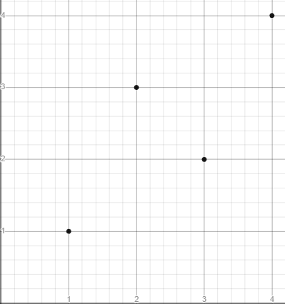
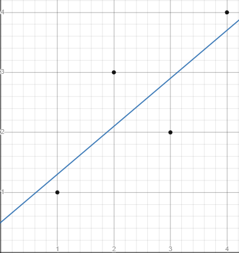
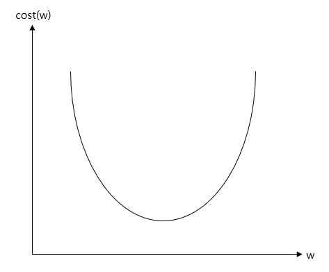
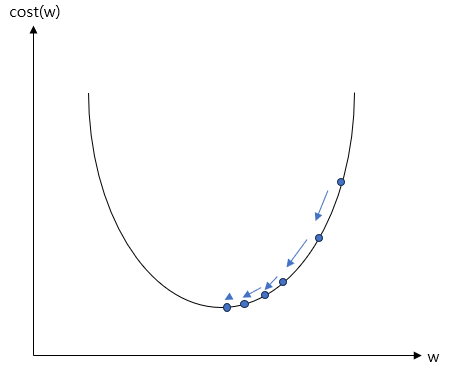
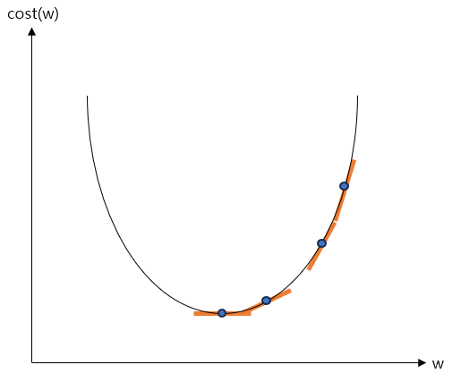
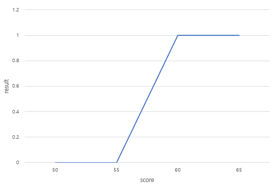
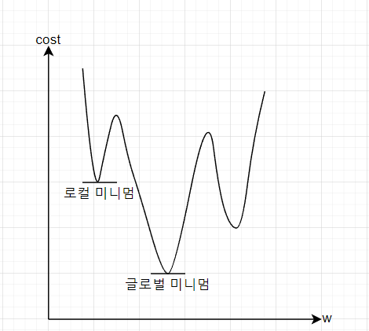
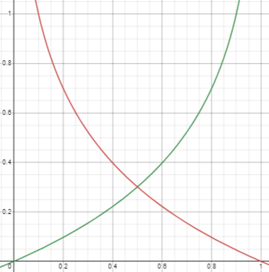
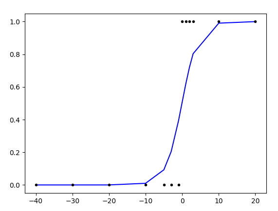

## Vector의 유사도

- Vector의 유사도

  - 두 문서 사이의 유사도를 판단하기 위해 각 문서를 vector로 변환한 후 vector 값 들의 유사도를 사용하는 방법이다.
  - 사람들은 서로 다른 두 문서의 유사도를 주로 문서들 간에 동일한 단어 또는 비슷한 단어가 얼마나 공통적으로 많이 사용되었는지에 의존한다.
    - 기계도 크게 다르지 않다.

  - 기계의 유사도 계산 성능은 아래와 같은 요인들에 달렸다.
    - 각 문서의 단어들을 어떤 방법으로 수치화했는지(DTM. Word2Vec 등).
    - 문서 간의 단어들의 유사성을 어떤 방법으로 계산했는지(cosine similarity, Euclidean distance 등).


- Cosine Similarity

  - 두 vector들 사이의 cosine 각도를 이용하여 구할 수 있는 두 vector의 유사도를 의미한다.
    - 두 vector의 방향이 완전히 동일하면 1, 90도의 각을 이루면 0, 180도로 반대 방향이면 -1의 값을 갖는다.
    - 즉 -1 이상 1 이하의 값을 가지며 1에 가까울수록 유사도가 높다고 볼 수 있다.
    - 두 벡터 A, B에 대해 cosine similarity는 아래와 같이 구한다.
    - DTM이나 TF-IDF 행렬을 통해 문서의 유사도를 구하는 경우에는 DTM이나 TF-IDF 행렬이 각각의 특징 vector A, B가 된다.

  $$
  similarity=cos(\Theta) = {A \cdot B\over||A||\ ||B||} = {\sum_{i=1}^nA_i \times B_i \over \sqrt{\sum_{i=1}^n(A_i)^2} \times \sqrt{\sum_{i=1}^n(B_i)^2}}
  $$

  - 아래 세 개의 문서를 가지고 cosine similarity를 구해볼 것이다.
    - 토마토 맛 토
    - 토 맛 토마토 토마토 맛 토
    - 토마토 맛 토마토 사탕

  - 위 세 개의 문서를 띄어쓰기를 기준으로 tokenizing하고 세 문서에 대해서 DTM을 만든다.

  ```python
  import pandas as pd
  
  def tf(t, d):
    	return d.count(t)
  
  def build_dtm(vocabulary):
      result = []
      for i in range(N):
          result.append([])
          d = docs[i]
          for j in range(len(vocabulary)):
              t = vocabulary[j]
              # tf 함수를 사용하여 DTM에 값을 채워 넣는다.
              result[-1].append(tf(t, d))
      return pd.DataFrame(result, columns = vocabulary)
  
  
  docs = [
      "토마토 맛 토",
      "토 맛 토마토 토마토 맛 토",
      "토마토 맛 토마토 사탕"
  ]
  N = len(docs)
  # 공백을 기준으로 tokenizing
  vocabulary = list(set(word for doc in docs for word in doc.split()))
  
  # DTM을 구한다.
  dtm = build_dtm(vocabulary)
  print(dtm)
  """
     사탕  맛  토마토  토
  0   0  1    1  1
  1   0  2    2  2
  2   1  1    2  0
  """
  ```

  - Numpy를 사용하여 cosine similarity를 구할 수 있다.
    - 문서1과 문서3의 cosine similarity와 문서2와 문서3의 cosine similarity가 같으며, 문서1과 문서2의 cosine similarity가 1이 나왔다.
    - 문서 2는 문서1에서 모든 단어의 빈도수가 1 증가한 문서이다.
    - 즉 한 문서 내의 모든 단어의 빈도수가 동일하게 증가하는 경우에는 기존의 문서와 코사인 유사도의 값이 1이다.
    - 이를 통해 알 수 있는 것은 cosine similarity는 vector의 방향(패턴)에 초점을 두기에 문서의 길이가 다른 상황에서도 비교적 문서 길이의 영향을 덜 받는다는 점이다.
  
  ```python
  from numpy import dot
  from numpy.linalg import norm
  
  
  def cos_sim(A, B):
    return dot(A, B)/(norm(A)*norm(B))
  
  print('문서 1과 문서2의 유사도 :',cos_sim(dtm.iloc[0].to_list(), dtm.iloc[1].to_list()))		# 1.0000000000000002
  print('문서 1과 문서3의 유사도 :',cos_sim(dtm.iloc[0].to_list(), dtm.iloc[2].to_list()))		# 0.7071067811865476
  print('문서 2와 문서3의 유사도 :',cos_sim(dtm.iloc[1].to_list(), dtm.iloc[2].to_list()))		# 0.7071067811865476
  ```


- Euclidean distance

  - 다차원 공간에서 두 개의 점 사이의 거리를 통해 유사도를 판단하는 방법이다.
    - 거리가 가까울 수록 유사도가 높다고 본다.
  - 다차원 공간에서 두 개의 점 p와 q가 각각 $p=(p_1,...,p_n)$과 $q=(q_1,...,q_n)$의 좌표를 가질 때 두 점 사이의 거리를 계산하는 Euclidean distance를 구하는 공식은 아래와 같다.

  $$
  \sqrt{(q_1-p_1)^2 + (q_2-p_2)^2 + \dots + (q_n - p_n)^2} = \sqrt{\sum_{i=1}^n(q_i-p_i)^2}
  $$

  - Numpy를 사용하여 간단하게 구할 수 있다.
    - 위에서 cosine similarity를 구할 때 사용한 것과 동일한 문서로 동일한 DTM을 생성했다고 가정한다.
    - 문서1과 문서2가 문서1과 문서3보다 가까우므로 문서1은 문서3보다 문서2와 더 유사하다고 할 수 있다.

  ```python
  def dist(x,y):
      x = np.array(x) 
      y = np.array(y) 
      return np.sqrt(np.sum((x-y)**2))
  
  
  print('문서1과 문서2의 거리 :',dist(dtm.iloc[0].to_list(), dtm.iloc[1].to_list()))		# 1.7320508075688772
  print('문서1과 문서3의 거리 :',dist(dtm.iloc[0].to_list(), dtm.iloc[2].to_list()))		# 1.7320508075688772
  print('문서2와 문서3의 거리 :',dist(dtm.iloc[1].to_list(), dtm.iloc[2].to_list()))		# 2.449489742783178
  ```


- Jaccard similarity

  - 두 집합의 합집합에서 교집합의 비율을 구하여 두 집합의 유사도를 구하는 방식이다.
    - 0에서 1사이의 값을 가지며, 두 집합이 유사할 수록 1에 가까와진다.
    - 자카드 유사도를 구하는 함수를 $J$라 할 때, $J$는 아래와 같다.

  $$
  J(A,B) = {|A \cap B|\over |A \cup B|} = {|A \cap B|\over |A|+|B|-|A \cap B|}
  $$

  - Python의 `set`을 사용하여 구현이 가능하다.

  ```python
  docs = [
      "토마토 맛 토",
      "토 맛 토마토 토마토 맛 토",
      "토마토 맛 토마토 사탕"
  ]
  
  tokenized_docs = list(map(set, [doc.split() for doc in docs]))
  union = tokenized_docs[0].union(tokenized_docs[1])
  intersection = tokenized_docs[0].intersection(tokenized_docs[1])
  
  for i in range(len(docs)):
      for j in range(i, len(docs)):
          if i == j:
              continue
          union = tokenized_docs[i].union(tokenized_docs[j])
          intersection = tokenized_docs[i].intersection(tokenized_docs[j])
          print("문서{} & 문서{}의 유사도:".format(i+1, j+1), len(intersection)/len(union))
          
  """
  문서1 & 문서2의 유사도: 1.0
  문서1 & 문서3의 유사도: 0.5
  문서2 & 문서3의 유사도: 0.5
  """
  ```


## Machine Learning

- Machine Learning과 기존 프로그래밍 방식의 차이
  - 기존의 프로그래밍 방식은 입력값으로 데이터를 넣으면 그에 대한 해답을 도출하는 방식이었다.
  - 그러나 machine learning은 입력값으로 데이터와 해답을 함께 넣어 그 출력으로 규칙성을 찾는 방식이다.
    - 이처럼 주어진 데이터로부터 규칙성을 찾는 과정을 훈련(training) 또는 학습(learning)이라고 부른다.
    - 일단 규칙성을 발견하고 나면 그 후에 들어오는 새로운 데이터에 대해서 발견한 규칙성을 기준으로 정답을 찾아내는데 이는 기존의 프로그래밍 방식으로 접근하기 어려웠던 문제의 해결책이 되기도 한다.


- Machine learning model의 평가

  - 일반적으로 data를 훈련용(machine learning model을 학습), 검증용, 테스트용으로 나눈다.
- 학습용 데이터
  
  - Model을 학습시키기 위해 사용하는 데이터이다.
  - 검증용 데이터

    - 모델의 성능을 평가하기 위한 용도가 아니라 모델이 훈련 데이터에 과적합(overfitting) 되고 있는지 판단하거나 하이퍼파라미터의 조정을 위해 사용한다.
  - 하이퍼 파라미터(초 매개 변수)는 모델의 성능에 영향을 주는 사람이 값을 지정하는 변수를 의미하며, 학습을 하는 동안 모델이 학습하는 과정에서 얻어지는 가중치나 편향과 같은 매개 변수와는 다르다.
  
    - 훈련용 데이터로 훈련을 모두 시킨 모델은 검증용 데이터를 사용하여 검증용 데이터에 대해서 높은 정확도를 얻도록 하이퍼 파라미터의 값을 변경해보는데, 이를 tuning이라 한다.
- 테스트용 데이터
  
  - Tuning과정까지 끝내고 model의 최종 평가에는 테스트 데이터를 사용한다.
    - 최종 평가에 검증용 데이터를 사용하지 않는 이유는, tuning과정에서 model이 검증용 데이터의 정확도를 높이는 방향으로 수정되기 때문이다.
  - 따라서 한 번도 보지 못 한 테스트 데이터로 평가를 해야 한다.


- 분류(Classification)와 회귀(Regression)

  - Machine learning의 많은 문제들은 분류 또는 회귀 문제에 속한다.
  - 이진 분류(Binary Classification)
    - 주어진 입력에 대해서 두 개의 선택지 중 하나의 답을 택해야 하는 경우를 말한다.
    - 예를 들어 사진을 보고 강아지 사진인지 아닌지를 판단하는 문제 등이 이에 해당한다.
  - 다중 클래스 분류(Multi-class Classification)
    - 주어진 입력에 대해서 세 개 이상의 선택지 중에 답을 선택해야 하는 경우를 마한다.
    - 예를 들어 동물의 사진이 입력되었을 때 어떤 동물의 사진인지를 판단하는 문제 등이 이에 해당한다.

  - 회귀 문제(Regression)
    - 몇 개의 정해진 선택지 중에서 정답을 선택하는 문제가 아니라 연속적인 값의 범위 내에서 예측값이 나오는 경우를 말한다.
    - 예를 들어 쌀의 가격을 예측하는 model이 있다고 가정할 때 쌀의 가격은 특정 범위 내의 어떤 숫자도 나올 수 있다.
    - 분류 문제가 분리된(비연속적인) 선택지들 중 답을 선택하는 문제라면, 회귀 문제는 연속된 값을 결과로 가진다.
    - 시계열 데이터를 사용한 주가 예측 등이 이에 해당한다.


- 지도 학습과 비지도 학습
  - 지도 학습(Supervised Learning)
    - Label이라 불리는 정답과 함께 학습하는 것을 의미한다.
    - Label은 $y$, 실제값 등으로 부르기도 하며, 예측값은 $\hat y$와 같이 표현한다.
    - 예측값과 실제값의 차이인 오차를 줄이는 방식으로 학습을 진행한다.
    - 자연어 처리는 대부분 지도 학습에 속하는데, 자연어 처리의 많은 문제들은 레이블이 존재하는 경우가 많기 때문이다.
  - 비지도 학습(Unsupervised Learning)
    - 별도의 label 없이 학습하는 것을 의미한다.
    - 예를 들어 텍스트 처리 분야의 토픽 모델링 알고리즘인 LSA나 LDA는 비지도 학습에 속한다.
  - 자기 지도 학습(Self-Supervised Learning, SSL)
    - Label 없는 데이터가 주어지면, model이 학습을 위해서 스스로 data로부터 label을 만들어사 학습하는 것을 의미한다.
    - Word2Vec과 같은 word embedding algorithm이나 BERT와 같은 언어 모델의 학습 방식이다.


- 샘플(Sample)과 특성(Feature)

  - 많은 machine learning 문제가 1개 이상의 독립 변수 $x$를 가지고 종속 변수 $y$를 예측하는 문제이다.

    - 특히 인공 신경망은 독립 변수, 종속 변수, 가중치, 편향 등을 행렬 연산을 통해 연산하는 경우가 많다.

    - 독립 변수 $x$의 행렬을 X라고 했을 때, 독립 변수의 개수가 n개이고 데이터의 개수가 m인 행렬 X는 아래와 같다.

  |          | Feature-1 | Feature-2 | ...  | Feature-n |
  | -------- | --------- | --------- | ---- | --------- |
  | Sample-1 | x_1       | x_2       | ...  | x_n       |
  | Sample-2 | x_1       | x_2       | ...  | x_n       |
  | ...      | ...       | ...       | ...  | ...       |
  | Sample-m | x_1       | x_2       | ...  | x_n       |

  - 위와 같은 행렬에서 하나의 행을 sample이라 부르고, 종속 변수 $y$를 예측하기 위한 독립 변수 $x$를 feature라 부른다.


- 혼동 행렬(Confusion Matrix)

  - 정확도(accuracy)는 맞춘 문제수를 전체 문제수로 나눈 값을 의미한다.
    - 정확도는 맞춘 결과와 틀린 결과에 대한 세부적인 내용을 알려주지는 않는다.
  - 혼동 행렬을 사용하면 맞출 결과와 틀린 결과에 대한 세부적인 내용을 알 수 있다.
    - 그리고 이를 통해 정밀도와 재현율을 구할 수 있다.

  |           | 예측 참            | 예측 거짓          |
  | --------- | ------------------ | ------------------ |
  | 실제 참   | TP(True Positivie) | FN(False Negative) |
  | 실제 거짓 | FP(False Positive) | TN(True Negative)  |

  - 정밀도(Precision)

    - Model이 true라고 분류한 것 중에서 실제 true인 것의 비율.
    - $TP/(TP+FP)$

  - 재현율(Recall)

    - 실제 true인 것 중에서 model이 true라고 예측한 것의 비율

    - $TP/(TP+FN)$

  - 정확도(Accuracy)

    - 전체 예측한 데이터 중에서 정답을 맞춘 비율.
    - $(TP+TN)/(TP+FN+FP+TN)$

  - 정확도로 성능을 예측하는 것이 적절하지 않은 경우도 있다.

    - 예를 들어 비가 오는 날을 예측하는 model이 있다고 가정해보자.
    - 이 model은 200일 중 200일이 비가 오지 않을 것이라 예측했고, 실제로는 200일 중 6일 동안 비가 왔다.
    - 이 모델은 총 200번 중 6번만 틀린 것이 되므로 정확도는 97%가 나오지만, 정작 이 model은 비가 온 날은 하나도 맞추지 못 했다.
    - 이와 같이 실질적으로 더 중요한 데이터가 전체 데이터에서 너무 적은 비율을 차지하는 경우 정확도는 좋은 측정 지표가 될 수 없다.


- 과적합과 과소 적합
  - 적합(fitting)
    - Machine learning에서 학습 또는 훈련 과정을 적합이라고 부른다.
    - 학습 또는 훈련은 결국 model이 주어진 data에 적합해져 가는 과정이기 때문에 이렇게 부른다.
  - 과적합(Overfitting)
    - 훈련 데이터를 과하게 학습하면 테스트 데이터나 실제 서비스에서는 정확도가 낮은 현상이 발생할 수 있다.
    - 이와 같이 훈련 데이터를 지나치게 많이 학습하여 훈련 데이터에만 적합한 model이 되는 것을 과적합이라 부른다.
  - 과소 적합(Underfitting)
    - 테스트 데이터의 성능이 올라갈 여지가 있음에도 훈련을 덜 한 상태를 의미한다.
    - 과소 적합은 훈련 자체가 부족한 상태이므로 훈련 횟수가 지나치게 적으면 발생할 수 있다.
    - 과적합과 달리 훈련 데이터에 대해서도 정확도가 낮다는 특징이 있다.
  - 과적합 방지를 위한 일반적인 deep learning model의 학습 과정은 아래와 같다.
    - 주어진 데이터를 훈련 데이터, 검증 데이터, 테스트 데이터로 나눈다.
    - 훈련 데이터로 모델을 학습한다.
    - 검증 데이터로 모델을 평가하여 검증 데이터에 대한 정확도와 오차(loss)를 계산한다.
    - 검증 데이터의 오차가 증가하였다면 과적합 징후이므로 학습 종료 후 다음 단계로 이동하고 , 아니라면 두 번째 단계로 재이동한다.
    - 학습이 종료되었으므로 테스트 데이터로 모델을 평가한다.


### 선형 회귀

- 선형 회귀(Linear Regression)

  - 한 개 이상의 독립 변수와 종속 변수의 선형 관계를 modeling하는 것을 의미한다.
    - 독립적으로 변할 수 있는 변수 $x$와 $x$의 값에 의해서 종속적으로 결정되는 $y$가 있을 때, 이 둘의 관계를 modeling하는 것이다.
    - 이 때 독립적으로 변할 수 있는 변수를 독립 변수, 독립 변수에 의해 종속적으로 변하는 변수를 종속 변수라고 부른다.

  - 단순 선형 회귀(Simple Linear Regression Analysis)

    - 선형 회귀는 한 개 이상의 독립 변수와 종속 변수의 선형 관계를 modeling하는데, 이 때 독립 변수가 1개라면 단순 선형 회귀라 부른다.

    - $y=wx+b$
    - 위의 수식은 단순 선형 회귀를 표현한 것으로, 독립 변수 $x$에 곱해지는 값 $w$를 machine learning에서는 가중치(weight), 별도로 더해지는 값 $b$를 편향(bias)라 부른다.

  - 다중 선형 회귀 분석(Multiple Linear Regression Analysis)

    - 독립 변수의 개수가 2개 이상인 선형 회귀를 다중 선형 회귀라 부른다.
    - $y=w_1x_1 + w_2x_2 + ... + w_nx_n + b$

  - 가중치와 편향
    - 가중치와 편향은 직선의 방정식에서는 각각 기울기와 절편을 의미한다.
    - 결국 선형 회귀는 주어진 데이터로 독립 변수와 종속 변수의 관계를 가장 잘 나타내는 직선을 그리는 일이다.
    - 그리고 어떤 직선인지를 결정하는 것은 가중치와 편향이므로 선형 회귀에서 해야할 일은 결국 적절한 가중치와 편향을 찾는 일이다.


- 가설(Hypothesis)
  - 독립 변수와 종속 변수의 관계를 유추하기 위해 수학적으로 식을 세우는데, machine learning에서는 이러한 식을 가설이라 부른다.
  - 단순 선형 회귀에서 가설은 $H(x)=wx+b$와 같이 표현할 수 있으며 $H$는 가설을 의미한다.


- 비용 함수(Cost Function)

  - 문제에 대한 규칙을 가장 잘 표현하는 가중치와 편향을 찾기 위해 가설로 부터 얻은 예측값과 실제값의 오차를 계산하는 식을 세워야 한다.

    - 이 식의 값을 최소화하는 최적의 $w$와 $b$를 찾아야한다.
    - 예측값과 실제값에 대한 오차에 대한 식을 목적 함수(objective function)또는 비용 함수(cost function)또는 손실 함수(loss function)라고 한다.
    - 함수의 값을 최소화하거나 최대화하거나 하는 목적을 가진 함수를 목적 함수라 하고, 값을 최소화하려는 함수를 비용 함수 또는 손실 함수라고 한다.
    - 즉 비용 함수와 손실 함수는 목적 함수에 포함된다.

  - 비용 함수의 역할

    - 비용 함수는 실제값과 예측값에 대한 오차만 표현하면 되는 것이 아니다.
    - 예측값의 오차를 줄일 수 있도록 최적화 된 식이어야한다.
    - Machine learning의 다양한 문제들은 각자 적합한 비용 함수들이 있으며, 회귀 문제의 경우 주로 평균 제곱 오차가 사용된다.

  - 평균 제곱 오차(Mean Squared Error, MSE)

    - 오차를 제곱한 값의 평균을 의미한다.
    - 예를 들어 아래와 같은 data가 있다고 가정해보자.

    | x    | y    |
    | ---- | ---- |
    | 1    | 1    |
    | 2    | 3    |
    | 3    | 2    |
    | 4    | 4    |

    - 위 data를 좌표 평면에 그리면 아래와 같다.

    

    - 독립 변수와 종속 변수의 관계를 가장 잘 나타내는 직선을 그린다는 것은 모든 점들과 위치적으로 가장 가까운 직선을 그린다는 것과 같다(아래 직선은 임의의 직선으로 보든 점들과 가장 가까운 직선을 나타내지는 않는다).

    

    - 오차(error)란 주어진 data에서 각 $x$에서의 실제값 $y$와 예측하고 있는 값 $H(x)$의 차이를 의미하며, 위 그림에서는 직선과 점 사이의 거리를 의미한다.
    - 오차를 줄이면서 가중치와 편향을 구하기 위해서는 전체 오차의 크기를 구해야한다.
    - 위에서 그린 임의의 직선은 $y=0.8x+0.5$로 예측값을 실제값으로부터 오차를 계산하면 아래와 같다.

    | x      | 1    | 2    | 3    | 4    |
    | ------ | ---- | ---- | ---- | ---- |
    | 실제값 | 1    | 3    | 2    | 4    |
    | 예측값 | 1.3  | 2.1  | 2.9  | 3.7  |
    | 오차   | -0.3 | 0.9  | -0.9 | 0.3  |

    - 모든 오차를 단순히 더할 경우 오차 중에는 음수인 값도 있으므로 오차의 절대적인 크기를 구할 수 없으므로 모든 오차를 제곱하여 더하는 방법을 사용하며, 결국 오차의 합을 구하는 식은 아래와 같다.

    $$
    \sum_{i=1}^n[y^{(i)}-H(x^{(i)})]^2
    $$

    - 위 식을 기반으로 오차의 총 합을 구하면 $(-0.3)^2+0.9^2+(-0.9)^2+0.3^2 = 1.8$이 된다.
    - 이를 데이터의 개수인 n으로 나누면 평균 제곱 오차를 구할 수 있다.

    $$
    {1 \over n}\sum_{i=1}^n[y^{(i)}-H(x^{(i)})]^2
    $$

    

    - 결국  $y=0.8x+0.5$의 평균 제곱 오차는 $1.8/4=0.45$가 된다.

  - 평균 제곱 오차의 값을 최소값으로 만드는 $w$와 $b$를 찾아내는 것이 정답인 직선을 찾아내는 일이다.

    - 평균 제곱 오차를 $w$와 $b$에 의한 비용 함수로 재정의하면 아래와 같다.

    $$
    cost(w,b) = {1 \over n}\sum_{i=1}^n[y^{(i)}-H(x^{(i)})]^2
    $$

    - 모든 점들과 오차가 작아질 수록 평균 제곱 오차가 작아지므로 평균 최소 오차 즉 $cost(w,b)$를 최소가 되게 만드는 $w$와 $b$를 구하면 결과적으로 $x$와 $y$의 관계를 가장 잘 나타내는 직선을 그릴 수 있다.

    $$
    w,b→minimize\ cost(w,b)
    $$


- Optimizer

  - 비용 함수를 최소화하는 매개 변수인 $w$와 $b$를 찾기 위한 작업을 수행할 때 사용되는 알고리즘을 optimizer 또는 최적화 알고리즘이라 부른다.

    - Optimizer를 통해 적절한 $w$와 $b$를 찾아내는 과정을 훈련(training) 또는 학습(learning)이라 부른다.

  - 경사 하강법(Gradient Descent)

    - 가장 기본적인 optimizer algorithm이다.
    - 함수의 값이 낮아지는 방향으로 각 독립변수들의 값을 변형시키면서 함수가 최소값을 갖도록 하는 독립변수의 값을 탐색 방법이다.
    - $w$또는 $b$가 지나치게 크거나 지나치게 작으면 오차가 커진다.

  - 경사 하강법 예시

    - 편의상 $b$값은 무시하고 $y=wx$라는 가설 $H(x)$를 가지고 경사 하강법의 방식을 살펴볼 것이다.
    - 여기서는 편의상 $w$값과 cost의 관계만을 살펴보지만, $b$와 cost의 관계도 마찬가지며, 실제로는 $w$, $b$ 모두에 대해 동시에 경사 하강법을 수행해야한다.
    - 가중치 $w$가 지나치게 크거나 지나치게 작을 경우 오차가 증가하므로 $w$와 $cost(w)$의 관계는 아래와 같이 표현할 수 있다.

    

    - $cost(w)$가 최소값을 가지게 하는 $w$를 찾아야 하므로 볼록한 부분의 맨 아래 부분의 $w$의 값을 찾아야하며, 이는 무선적으로 $w$의 값을 정한 뒤에 맨 아래의 볼록한 부분을 향해 점차 $w$의 값을 수정하는 식으로 찾는다,

    

    - 이를 가능하게 하는 것이 경사 하강법으로 미분의 개념인 한 점에서의 순간 변화율 또는 접선에서의 기울기 개념을 사용한다. 아래 그림에서는 맨 아래 볼록한 부분으로 갈 수록 접선의 기울기가 점차 작아지다가 맨 아래에서는 기울기가 0이 되는 것을 볼 수 있다(기울기를 나타낸 주황색 선이 x축과 수평이 된 부분).

    

  - 경사 하강법 원리

    - 위에서 그림을 통해 봤듯이 $cost(w)$가 최소화되는 지점은 접선의 기울기가 0이 되는 지점이다.
    - 이는 결국 미분값이 0이 되는 지점이다. 
    - 경사 하강법은 비용 함수를 미분하여 현재 $w$에서의 접선의 기울기를 구하고, 접선의 기울기가 낮은 방향으로 $w$의 값을 변경한다. 
    - 이 과정을 미분값이 0이 될 때 까지 반복하여 $cost(w)$가 최소값이 되는 $w$를 구한다.

  - $w$ 조정을 위한 식

    - 임의의 $w$에서의 접선의 기울기는 아래와 같이 구할 수 있다.

    $$
    \frac{∂}{∂w}cost(w)
    $$

    

    - 비용을 최소화하기 위해 $w$를 조정하는 식은 아래와 같으며, 이 식에 따라 접선의 기울기가 0이 될 때 까지 반복한다.

    $$
    w := w - α\frac{∂}{∂w}cost(w)
    $$

    - 위 식은 현재 $w$에서 접선의 기울기와 학습률(learning rate) α를 곱한 값을 현재 $w$에서 빼서 새로운 $w$의 값으로 사용한다는 의미이다.
    - 학습률은 0과 1 사이의 값을 가진다.

  - 현재 $w$에서 현재 $w$에서의 접선의 기울기를 빼는 것의 의미

    - 우선은 학습률 α는 고려하지 않고, 현재 $w$에서 현재 $w$에서의 접선의 기울기를 빼는 것이 어떤 의미가 있는지 살펴볼 것이다.
    - 접선의 기울기($\frac{∂}{∂w}cost(w)$)가 음수면 $w-α\frac{∂}{∂w}cost(w)$는 $w$에 음수를 빼는 것이 되어 다음 $w$의 값이 증가하게 된다.
    - 접선의 기울기가 양수면 다음 $w$의 값은 감소하게 된다.
    - 즉 접선의 기울기가 음수던 양수던 모두 접선의 기울기가 0에 가까워지는 방향으로 $w$의 값을 조정하게 된다.

  - 학습률

    - 학습률 α는 $w$의 값을 변경할 때 얼마나 크게 변경할지를 결정하며 0과 1 사이의 값을 가지도록 한다.
    - α의 값을 무작정 크게 한다고 $w$를 빠르게 찾을 수 있는 것이 아니다.
    - 오히려 α의 값이 지나치게 높을 경우 접선의 기울기가 0이 되는 $w$를 찾는 것이 아니라 $cost(w)$의 값이 발산하게 된다.
    - 반대로 α의 값이 지나치게 낮을 경우 학습 속도가 느려지므로 적당한 α 값을 찾는 것이 중요하다.


- 자동 미분(Auto Differentiation)을 이용한 선형 회귀 구현

  - 자동 미분
    - Tensorflow를 통해 아래와 같이 자동 미분을 할 수 있다.
    - 아래는 $3w^2 + 7$이라는 임의의 식을 세우고 $w$에 대해서 미분하는 code이다.

  ```python
  import tensorflow as tf
  
  w = tf.Variable(2.0)
  
  with tf.GradientTape() as tape:
      z = 3*w**2 + 7
  
  gradients = tape.gradient(z, [w])
  print(gradients)	# [<tf.Tensor: shape=(), dtype=float32, numpy=12.0>]
  ```

  - 자동 미분을 이용한 선형 회귀 구현

  ```python
  import tensorflow as tf
  
  
  # 함수로 가설을 정의한다.
  @tf.function
  def hypothesis(x):
      return w*x + b
  
  # 평균 제곱 오차를 손실 함수로 정의한다.
  @tf.function
  def cost_mse(y, y_pred):
      # 오차인 y_pred-y의 값을 제곱해서 평균을 취한다.
      return tf.reduce_mean(tf.square(y_pred-y))
  
  
  # 가중치와 편향을 정의한다.
  w = tf.Variable(0.8)
  b = tf.Variable(0.5)
  
  # 독립 변수 값을 정의한다.
  x_values = [1, 2, 3, 4]
  
  # 독립변수를 통해 예측 값을 구한다
  print(hypothesis(x_values).numpy())
  
  # optimizer로는 경사 하강법을 사용하며, 학습률은 0.01로 설정한다.
  optimizer = tf.optimizers.SGD(0.01)
  
  # 학습에 사용할 data를 정의한다.
  x = [1,2,3,4,5,6,7,8,9]
  y = [2,3,4,5,4,2,5,6,7]
  
  # 1000번에 걸쳐 경사 하강법을 수행한다.
  # 반복적으로 수행될수록 cost의 값이 작아지는 것을 볼 수 있다.
  for i in range(1, 1001):
      with tf.GradientTape() as tape:
  
          # 평균 제곱 오차를 계산
          # hypothesis(x)는 입력 x에 대한 예측값이다.
          cost = cost_mse(y, hypothesis(x))
  
      # 손실 함수에 대한 파라미터의 미분값을 계산한다.
      gradients = tape.gradient(cost, [w, b])
  
      # parameter를 조정한다.
      optimizer.apply_gradients(zip(gradients, [w, b]))
  
      if i % 100 == 0:
          print("epoch : {:3} | w의 값 : {:5.4f} | b의 값 : {:5.4} | cost : {:5.6f}".format(i, w.numpy(), b.numpy(), cost))
  
  # 학습 후에 조정된 w, b 값에 의해서 변경된 예측값을 확인
  print(hypothesis(x_values).numpy())
  ```

  - Keras를 사용하여 선형 회귀 구현
    - `keras`는 `Sequential`을 사용하여 model을 생성하고 `add()` method를 통해 학습에 필요한 정보들을 추가하는 방식으로 동작한다.

  ```python
  import numpy as np
  from tensorflow.keras.models import Sequential
  from tensorflow.keras.layers import Dense
  from tensorflow.keras import optimizers
  
  
  # 학습 data
  x = [1,2,3,4,5,6,7,8,9]
  y = [2,3,4,5,4,2,5,6,7]
  
  # model을 생성한다.
  model = Sequential()
  
  # Dense의 첫 번째 인자로 들어간 1은 출력의 차원을 정의한다.
  # input_dim은 입력의 차원을 정의한다.
  # activation에는 어떤 함수를 사용할 것인지를 정의하며, 선형 회귀를 사용하므로 linear를 입력한다.
  model.add(Dense(1, input_dim=1, activation='linear'))
  
  # optimizer를 정의한다.
  # SGD는 경사 하강법을 의미한다.
  # 학습률(learning rate, lr)은 0.01로 설정한다.
  optimizer = optimizers.SGD(lr=0.01)
  
  # 손실 함수(Loss function)는 평균 제곱 오차를 사용한다.
  model.compile(optimizer=optimizer, loss='mse', metrics=['mse'])
  
  # 주어진 x와 y데이터에 대해서 오차를 최소화하는 작업을 1000번 시도한다.
  model.fit(x, y, epochs=1000)
  ```

  - 만약 최종적으로 선택된 오차를 최소화하는 직선 그래프를 시각화해야한다면 `matplotlib`을 사용하면 된다.

  ```python
  import matplotlib.pyplot as plt
  
  plt.plot(x, model.predict(x), 'b', x, y, 'k.')
  ```

  - 마지막으로 학습된 model로 임의의 x에 대한 $\hat{y}$값은 아래와 같이 구할 수 있다.

  ```python
  print(model.predict([10]))
  ```


### Logistic Regression

- 이진 분류(Binary Classification)

  - Logistic regression은 이진 분류 문제를 풀기 위한 대표적인 algorithm이다.

  - 정의

    - 일상에는 두 개의 선택지 중에서 정답을 고르는 문제가 많다.
    - 예를 들어 어떤 메일이 스팸 메일인지 아닌지를 분류하는 문제 등이 있다.
    - 이렇게 둘 중 하나를 결정하는 문제를 이진 분류라 한다.

  - 이진 분류 문제는 직선으로 표현하는 것이 적절하지 않다.

    - 앞에서 했던 가중치 w와 편향 b를 찾아 데이터를 가장 잘 표현하는 직선을 찾는 방법을 살펴봤다.
    - 그러나 이진 분류는 이와 같이 접근하는 것이 적절치 않다.

    - 예를 들어 점수에 따른 합격 여부를 표현한 그래프는 아래와 같을 것이다(합격은 1, 불합격은 0).
    - 이와 같은 관계를 나타내기 위해서는 직선이 아닌 S자 형태를 표현할 수 있는 함수가 필요하다.
    - 또한 아래와 같은 예제의 경우 y는 1 또는 0이라는 두 가지 값만 가지지만, $y=wx+b$의 직선은 y값이 음의 무한대부터 양의 무한대까지 될 수 있다.

  


- 시그모이드 함수(Sigmoid function)

  - 출력이 0과 1 사이의 값을 가지면서 S자 형태로 그려지는 대표적인 함수이다.
    - 입력값이 커지면 1에 수렴하고, 입력값이 작아지면 0에 수렴한다.
    - 출력값이 0.5 이상이면 1, 0.5이하면 0으로 만들면 이진 분류 문제를 풀기 위해 사용할 수 있다.
    - `σ`로 축약해서 표현하기도 한다.
  - 로지스틱 회귀를 풀기 위한 가설
    - 여기서 e(e=2.718281...)는 자연 상수라 불리는 숫자이다.
    - 아래 식에서 구해야하는 것은 여전히 주어진 데이터에 가장 적합한 가중치(w)와 편향(b)이다.
    - 선형 회귀에서 직선을 표현할 때 가중치 w는 직선의 기울기를 의미했지만 로지스틱 회귀에서는 그래프의 경사도를 결정한다(w가 커지면 경사가 커지고, w가 작아지면 경사가 작아진다).

  $$
  H(x) = {1 \over 1+e^{-wx+b}} = sigmoid(wx+b) = σ(wx+b)
  $$

  - 시그모이드 함수를 그래프로 시각화하기
    - `sigmoid()` 함수는 출력값을 0과 1 사이의 값으로 조정하여 반환한다.

  ```python
  import numpy as np
  import matplotlib.pyplot as plt
  
  def sigmoid(x):
      return 1/(1+np.exp(-x))
  
  x = np.arange(-10.0, 10.0, 0.1)
  y = sigmoid(x)
  
  plt.plot(x, y, 'g')
  plt.plot([0, 0], [1.0, 0.0], ':')
  plt.title('Sigmoid Function')
  plt.show()
  ```

  - 가중치(w)에 따라 그래프가 어떻게 달라지는지 시각화하기
    - `w`(가중치)의 값이 클 수록 경사가 커지는 것을 확인할 수 있다.

  ```python
  import numpy as np
  import matplotlib.pyplot as plt
  
  def sigmoid(x):
      return 1/(1+np.exp(-x))
  
  x = np.arange(-5.0, 5.0, 0.1)
  w = 0.5
  y1 = sigmoid(w*x)
  y2 = sigmoid(x)
  w = 2
  y3 = sigmoid(w*x)
  
   # w의 값이 0.5일때
  plt.plot(x, y1, 'r', linestyle='--')
  # w의 값이 1일때
  plt.plot(x, y2, 'g') 
  # w의 값이 2일때
  plt.plot(x, y3, 'b', linestyle='--') 
  plt.plot([0, 0],[1.0, 0.0], ':')
  plt.title('Sigmoid Function')
  plt.show()
  ```

  - 편향(b)에 따라 그래프가 어떻게 달라지는지 시각화하기

  ```python
  import numpy as np
  import matplotlib.pyplot as plt
  
  def sigmoid(x):
      return 1/(1+np.exp(-x))
  
  x = np.arange(-5.0, 5.0, 0.1)
  b = 0.5
  y1 = sigmoid(x + b)
  y2 = sigmoid(x + 1)
  b = 1.5
  y3 = sigmoid(x+b)
  
  plt.plot(x, y1, 'r', linestyle='--')
  plt.plot(x, y2, 'g')
  plt.plot(x, y3, 'b', linestyle='--')
  plt.plot([0, 0],[1.0, 0.0], ':')
  plt.title('Sigmoid Function')
  plt.show()
  ```


- 비용함수

  - 로지스틱 회귀도 경사 하강법을 사용하여 가중치 w를 찾는다.
    - 그러나 평균 제곱 오차를 비용 함수로 사용하지는 않는다.
    - 평균 제곱 오차를 로지스틱 회귀의 비용 함수로 사용할 경우 좋지 않은 로컬 미니멈에 빠질 가능성이 매우 높아 문제 해결이 어렵기 때문이다.
  - 글로벌 미니멈과 로컬 미니멈
    - 전체 함수에 걸쳐 최소값을 글로벌 미니멈(global minimum), 특정 구역에서의 최소값을 로컬 미니멈(local minimum)이라 한다.
    - 로컬 미니멈에 지나치게 쉽게 빠지는 비용 함수는 cost가 가능한한 최소가 되는 w를 찾는다는 목적에는 좋지 않은 선택이다.
    - 로지스텍 회귀에서 평균 제곱 오차를 비용 함수로 사용하는 것이 바로 이런 좋지 않은 선택에 해당한다.

  

  - 로지스틱 회귀 문제에서 가중치 w를 최소로 만드는 적절한 새로운 비용 함수를 찾아야한다.

    - 가중치를 최소화하는 함수를 목적함수 $J$라 한다.

    - 목적 함수는 아래와 같이 정의한다(아래 식은 아직 완성된 식이 아니다.).

    $$
    J(w) = {1 \over n} \sum_{i=1}^n f(H(x^{(i)}),y^{(i)})
    $$

    - 위의 식에서 샘플 데이터의 개수가 n개이고, 어떤 함수 $f$가 실제값 $y_i$와 예측값 $H(x_i)$의 오차를 나타내는 함수라고 할 때, 새로운 함수 $f$를 어떻게 정의하느냐에 따라 가중치를 최소화하는 적절한 목적 함수가 완성된다.
    - 목적 함수는 전체 데이터에 대해서 어떤 함수 $f$의 평균을 계산한다.
    - 적절한 가중치를 찾기 위해서 결과적으로 실제값과 예측값에 대한 오차를 줄여야 하므로 여기서 $f$는 비용 함수(cost function)이라고 할 수 있다.
    - 따라서 위 식은 다시 쓰면 아래와 같다.

    $$
    J(w) = {1 \over n} \sum_{i=1}^n cost(H(x^{(i)}),y^{(i)})
    $$

  - 시그모이드 함수는 0과 1 사이의 y값을 반환한다.

    - 이는 실제 값이 0일 때 y값이 1에 가까워지면 오차가 커지며, 실제값이 1일 때 y값이 0에 가까워지면 오차가 커짐을 의미한다.
    - 이를 반영할 수 있는 함수는 로그 함수를 통해 표현 가능하다.

    $$
    if\ \ y=1 \rightarrow cost(H(x), y) = -log(H(x)) \\
    if\ \ y=0 \rightarrow cost(H(x),y) = -log(1-H(x))
    $$

    - y의 실제값이 1일 때 $-logH(x)$그래프를 사용하고, y의 실제값이 0일 때 $-log(1-H(x))$그래프를 사용해야 한다.
    - 위 두 식을 그래프로 표현하면 아래와 같다(y의 실제값이 1일 때의 그래프가 빨간선, y의 실제값이 0일 때의 그래프가 초록색이다).
    - y축이 cost, x축이 $H(x)$이다.

    

    - 위 그래프상에서 실제값이 1일 때, 예측 값인 $H(x)$의 값이 1이면 오차가 0이므로 당연히 cost는 0이 된다.
    - 반면, 실제값이 1일 때, 예측값인 $H(x)$의 값이 0으로 수렴하면, cost는 무한대로 수렴한다.
    - 실제값이 0인 경우는 그 반대로 이해하면 된다.
    - 이는 아래와 같은 식으로 표현할 수 있다.

    $$
    cost(H(x),y) = -[ylogH(x) + (1-y)log(1-H(x))]
    $$

    - 위 식을 자세히 보면 y와 (1-y)가 식 중간에 들어갔고, 두 식을 -로 묶은 것 외에는 기존의 두 식이 들어가 있는 것을 볼 수 있다.
    - y가 이면 $ylogH(x)$가 없어지고, y가 1이면 $(1-y)log(1-H(x))$가 없어지는데 이는 각각 y가 1일 때와 y가 0일 때의 앞서 본 식과 동일하다.

  - 결국 로지스틱 회귀의 목적 함수는 아래와 같다.

    - 이 때 로지스틱 회귀에서 찾아낸 비용 함수를 크로스 엔트로피(cross entropy)라 한다.
    - 결론적으로 로지스틱 회귀는 비용 함수로 크리스 엔트로피 함수를 사용하며, 가중치를 찾기 위해 크로스 엔트로피 함수의 평균을 취한 함수를 사용한다.
    - 크로스 엔트로피 함수는 소프트맥스 회귀의 비용 함수이기도 하다.

  $$
  J(w) = -{1 \over n} \sum_{i=1}^n[y^{(i)}logH(x^{(i)})+(1-y^{(i)})log(1-H(x^{(i)}))]
  $$


- Keras로 로지스틱 회귀 구현하기

  - 독립 변수 데이터를 x, 숫자 0 이상인 경우 1, 미만인 경우 0을 부여한 레이블 데이터를 y로 표현한다.

    - 1개의 실수 x로부터 1개의 실수 y를 예측하는 mapping 관계를 가지므로 `Dense`의 `input_dim`, `output_dim` 인자를 모두 1을 넘겨준다.
    - 시그모이드 함수를 사용할 것이므로 `activation` 값은 sigmoid를 넘겨준다.

    - Optimizer로는 가장 기본적인 경사 하강법인 sgd를 사용한다.
    - 이진 분류 문제에 손실 함수로 크로스 엔트로피 함수를 사용할 경우 `binary_crossentropy`를 넣어주면 된다.

  ```python
  import numpy as np
  import matplotlib.pyplot as plt
  from tensorflow.keras.models import Sequential
  from tensorflow.keras.layers import Dense
  from tensorflow.keras import optimizers
  
  
  nums = [-40, -30, -20, -10, -5, -3, -1, 0, 1, 2, 3, 10, 20]
  ans = [1 if num >= 0 else 0 for num in nums]
  
  x = np.array(nums)
  y = np.array(ans)
  
  model = Sequential()
  model.add(Dense(1, input_dim=1, activation='sigmoid'))
  
  sgd = optimizers.SGD(lr=0.01)
  model.compile(optimizer=sgd, loss='binary_crossentropy', metrics=['binary_accuracy'])
  
  model.fit(x, y, epochs=100)
  ```

  - `epochs`를 100으로 줬으므로 총 100회에 걸쳐 전체 데이터에 대한 오차를 최소화하는 w와 b를 찾아내는 작업을 한다.

    - 일정 횟수 이상부터 정확도가 100%가 나오기 시작한다.

    - 실제 값과 오차를 최소화하도록 값이 변경된 w와 b의 값을 가진 모델로 그래프를 그리면 아래와 같다.

  ```python
  plt.plot(x, model.predict(x), 'b', x, y, 'k.')
  plt.show()
  ```

  


### 다중 입력에 대한 실습

- 독립 변수가 2개 이상인 경우에 대한 실습을 할 것이다.
  - 지금까지는 선형 회귀와 로지스틱 회귀에서 독립 변수가 1개인 경우만을 다뤘다.
  - 그러나 대부분의 경우 독립 변수는 2개 이상이다.
    - 즉 입력 벡터의 차원이 2 이상이다.


- 다중 선형 회귀

  - 아래와 같이 중간 고사, 기말 고사, 과제 점수를 가지고 특정 공식을 통해 최종 점수를 계산한 데이터가 있다고 가정해보자.

  | mid_term | final | assignment | score |
  | -------- | ----- | ---------- | ----- |
  | 57       | 66    | 10         | 60    |
  | 91       | 94    | 20         | 93    |
  | 71       | 68    | 15         | 70    |
  | 98       | 100   | 20         | 99    |
  | 47       | 54    | 8          | 49    |
  | 88       | 82    | 12         | 82    |
  | 47       | 56    | 8          | 50    |

  - 가설은 아래와 같다.
    - 중간 고사, 기말 고사, 과제 점수를 각각 $x_1$, $x_2$, $x_3$로 표기하고 이 세 개의 특성을 가진 벡터 [$x_1$, $x_2$, $x_3$]를 X로 표기한다.

  $$
  H(X) = w_1x_1+w_2x_2+w_3x_3+b
  $$

  - 다중 선형 회귀를 사용하여 모델을 학습시킨다.
    - 위 데이터 중 앞의 5개를 훈련에 사용하고, 나머지 2개를 테스트에 사용한다.
    - 결과를 확인해보면 실제값과 거의 유사한 것을 확인할 수 있다.
    - Vector가 3차원이므로 `input_dims`를 3으로 준다.

  ```python
  import numpy as np
  from tensorflow.keras.models import Sequential
  from tensorflow.keras.layers import Dense
  from tensorflow.keras import optimizers
  
  
  x = np.array([[57, 66, 10], [91, 94, 20], [71, 68, 15], [98, 100, 20], [47, 54, 8]])
  # 최종 성적
  y = np.array([60, 93, 70, 99, 49]) 
  
  model = Sequential()
  model.add(Dense(1, input_dim=3, activation='linear'))
  
  sgd = optimizers.SGD(learning_rate=0.00001)
  model.compile(optimizer=sgd, loss='mse', metrics=['mse'])
  model.fit(x, y, epochs=5000)
  
  # 학습 시킨 model에 test data를 넣어 예측값을 출력한다.
  x_test = np.array([[88, 82, 12], [47, 56, 8]])
  print(model.predict(x_test)) # [[84.543106] [49.937683]]
  ```


- 다중 로지스틱 회귀

  - 아래와 같은 물고기의 길이와 무게 데이터를 가지고, 해당 물고기가 A인지 B인지 예측하는 모델을 만들고자 한다.

  | length(cm) | weight(g) | species |
  | ---------- | --------- | ------- |
  | 5.1        | 5.3       | A       |
  | 4.9        | 5.0       | A       |
  | 5.3        | 5.5       | A       |
  | 3.8        | 3.9       | B       |
  | 3.4        | 3.5       | B       |
  | ...        | ...       | ...     |

  - 가설은 아래와 같다.
    - 길이와 무게를 각각 $x_1$, $x_2$ 로 표기하고 이 세 개의 특성을 가진 벡터 [$x_1$, $x_2$]를 X로 표기한다.

  $$
  H(x) = sigmoid(w_1x_1 + w_2x_2 + b)
  $$

  - 다중 로지스틱 회귀를 이용하여 모델을 학습시킨다.
    - Vector가 2차원이므로 `input_dims`를 2로 준다.
    - 1이면 A종, 0이면 B종이다.
    - 학습을 위해 데이터를 더 추가했다.

  ```python
  import numpy as np
  from tensorflow.keras.models import Sequential
  from tensorflow.keras.layers import Dense
  from tensorflow.keras import optimizers
  
  
  x = np.array([[5.8, 5.7], [5.1, 5.3], [4.9, 5.0], [5.3, 5.5], [6.0, 6.2], [2.9, 2.9], [3.5, 3.7], [3.8, 3.9], [3.4, 3.5]])
  y = np.array([1, 1, 1, 1, 1, 0, 0, 0, 0])
  
  model = Sequential()
  model.add(Dense(1, input_dim=2, activation='sigmoid'))
  model.compile(optimizer='sgd', loss='binary_crossentropy', metrics=['binary_accuracy'])
  
  model.fit(x, y, epochs=2000)
  # 길이와 무게 데이터에 대해서 예측값을 확인한다.
  print(model.predict(x))
  
  """
  [[0.7527496 ]
   [0.70963895]
   [0.68242395]
   [0.72846127]
   [0.7880189 ]
   [0.44953454]
   [0.5369429 ]
   [0.56275266]
   [0.5164799 ]]
  """
  ```

  - 결과를 확인해 보면 A종의 경우 대부분 값이 0.6 이상인 것을 확인할 수 있다.


## 벡터와 행렬 연산

- 벡터와 행렬과 텐서
  - 크기와 방향을 가진 양이다.
    - 숫자가 나열된 형상이며, Python에서는 1차원 list로 표현한다.
  - 행렬은 행과 열을 가지는 2차원 형상을 가진 구조다.
    - Python에서는 2차원 배열로 표현한다.
    - 가로줄을 행(row), 세로줄을 column이라 한다.
  - 3차원 부터는 주로 텐서라고 부른다.
    - Python에서는 3차원 이상의 배열로 표현한다.
    - 머신 러닝의 입출력이 복잡해지면 3차원 텐서에 대한 이해가 요구된다.
  - 행렬 연산
    - 인공  신경망은 복잡한 모델 내의 연산을 주로 행렬 연산을 통해 해결한다.
    - 여기서 말하는 행렬 연산이란 단순히 2차원 배열을 통한 행렬 연산만을 의미하는 것은 아니다.


- 텐서

  - Dimension과 Shape
    - Dimension은 축(axis)혹은 텐서의 차원이라고도 부르며 numpy에서 `ndim` attribute를 통해 확인할 수 있다.
    - Shape은 텐서의 크기를 의미하며, 각 axis를 따라서 얼마나 많은 dimension이 있는지를 나타내는 값으로 numpy에서 `shape` attribute를 통해 확인할 수 있다.
  - 0차원 텐서(스칼라)
    - 스칼라는 하나의 실수값으로 이루어진 데이터를 의미한다.
    - 0D(Dimension) 텐서라고도 한다.

  ```python
  import numpy as np
  
  d = np.array(5)
  print(d.ndim)		# 0
  print(d.shape)		# ()
  ```

  - 1차원 텐서(벡터)
    - 숫자를 배열한 것을 벡터라 한다.
    - 벡터는 1차원 텐서이다.
    - 주의할 점은 벡터에서도 차원이라는 용어를 쓰는데 이는 텐서의 차원과 다른 개념이다.
    - 예를 들어 아래 예시의 벡터는 4차원 벡터이지만, 1차원 텐서이다.
    - 벡터의 차원은 하나의 axis에 놓은 원소의 개수를 의마하는 것이고, 텐서의 차원은 axis의 개수를 의미한다.
    - 1D 텐서라고도 한다.

  ```python
  d = np.array([1, 2, 3, 4])
  print(d.ndim)		# 1
  print(d.shape)		# (4, )
  ```

  - 2차원 텐서(행렬)
    - 행과 열이 존재하는 벡터의 배열(행렬, matrix)를 2차원 텐서라 부른다.
    - 2D 텐서라고도 한다.

  ```python
  d = np.array([[1, 2, 3, 4], [5, 6, 7, 8], [9, 10, 11, 12]])
  print(d.ndim)		# 2
  print(d.shape)		# (3, 4)
  ```


- 3차원 이상의 텐서

  - 3차원 텐서
    - 2차원 텐서(행렬)를 단위로 한 번 더 배열하면 3차원 텐서라고 부른다.
    - 3D 텐서라고도 한다.
    - 위에서 살펴본 0~2차원 텐서는 각각 스칼라, 벡터, 행렬이라고 해도 무방하므로 3차원 이상의 텐서부터 본격적으로 텐서라고 부른다.

  ```python
  import numpy as np
  
  d = np.array([
      [
          [1, 2, 3, 4, 5],
          [6, 7, 8, 9, 10],
          [10, 11, 12, 13, 14]
      ],
      [
          [15, 16, 17, 18, 19],
          [19, 20, 21, 22, 23],
          [23, 24, 25, 26, 27]
      ]
  ])
  
  print(d.ndim)		# 3
  print(d.shape)		# (2, 3, 5)
  ```

  - 3D 텐서는 자연어 처리에서 특히 자주 보게 된다.

    - Sequence data를 표현할 때 자주 사용되는데, sequence data는 주로 단어의 sequence를 의미하며, sequence는 주로 문장이나 문서 등의 텍스트가 될 수 있다.
    - 예를 들어 I like dogs, I like cats, Dogs are wonderful. 이라는 세 문장을 One-hot encoding으로 벡터화하면 아래와 같다.

    | 단어      | One-hot vector     |
    | --------- | ------------------ |
    | I         | [1, 0, 0, 0, 0, 0] |
    | like      | [0, 1, 0, 0, 0, 0] |
    | dogs      | [0, 0, 1, 0, 0, 0] |
    | cats      | [0, 0, 0, 1, 0, 0] |
    | are       | [0, 0, 0, 0, 1, 0] |
    | wonderful | [0, 0, 0, 0, 0, 1] |

    - 이를 인공 신경망의 입력으로 한 꺼번에 입력으로 사용하면 아래와 같다.

  ````python
  # (3, 3, 6)의 shape을 가지는 3D 텐서가 된다.
  [
      [
          [1, 0, 0, 0, 0, 0], [0, 1, 0, 0, 0, 0], [0, 0, 1, 0, 0, 0]
      ],  
      [
          [1, 0, 0, 0, 0, 0], [0, 1, 0, 0, 0, 0], [0, 0, 0, 1, 0, 0]
      ],  
      [
          [0, 0, 0, 1, 0, 0], [0, 0, 0, 0, 1, 0], [0, 0, 0, 0, 0, 1]
      ]
  ]  
  ````

  - 그 이상의 텐서
    - 3차원 텐서를 배열로 합치면 4차원 텐서가 되고, 4차원 텐서를 배열로 합치면 5차원 텐서가 되는 식으로 확장된다.
  - Keras에서의 텐서
    - Keras에서는 신경망의 층에 입력의 크기(shape)를 인자로 줄 때 `input_shape`이라는 인자를 사용한다.
    - `input_shape`은 배치 크기를 제외하고 차원을 지정하는데, 배치 크기는 지정해주기 전까지는 알 수 없기때문이다.
    - 즉 `input_shape(3, 4)`와 같이 주면 이 텐서의 크기는 (?, 6, 5)가 된다.
    - 만약 배치 크기까지 지정하고자 하면 `batch_input_shape(4, 3, 4)`와 같이 주면 된다.


- 벡터와 행렬의 덧셈과 뺄셈

  - 백터의 덧셈과 뺄셈

    - 같은 크기의 두 개의 벡터나 행렬은 덧셈과 뺄셈을 할 수 있다.
    - 단순히 같은 위치의 원소끼리 연산하면 되며, 이러한 연산을 요소별(element-wise) 연산이라 한다.

    $$
    A = 
    \begin{bmatrix}
    4\\
    5\\
    6
    \end{bmatrix}
    \ \ B = \begin{bmatrix}
    1\\
    2\\
    3
    \end{bmatrix}
    \\
    A + B = \begin{bmatrix}
    4\\
    5\\
    6
    \end{bmatrix}
    +
    \begin{bmatrix}
    1\\
    2\\
    3
    \end{bmatrix}
    =
    \begin{bmatrix}
    5\\
    7\\
    9
    \end{bmatrix}
    \\
    A-B = \begin{bmatrix}
    4\\
    5\\
    6
    \end{bmatrix}
    -
    \begin{bmatrix}
    1\\
    2\\
    3
    \end{bmatrix}
    =
    \begin{bmatrix}
    3\\
    3\\
    3
    \end{bmatrix}
    $$

  - Numpy를 사용하면 아래와 같이 구현할 수 있다.

  ```python
  import numpy as np
  
  A = np.array([4, 5, 6])
  B = np.array([1, 2, 3])
  print(A+B)	# [5 7 9]
  print(A-B)	# [3 3 3]
  ```

  - 행렬의 덧셈과 뺄셈도 벡터와 마찬기자 방식으로 계산하면 된다.

  $$
  A = 
  \begin{bmatrix}
  4\ \ 7 \\
  5\ \ 8 \\
  6\ \ 9
  \end{bmatrix}
  \ \ B = \begin{bmatrix}
  1\ \ 3\\
  2\ \ 2\\
  3\ \ 1
  \end{bmatrix}
  \\
  A + B = \begin{bmatrix}
  4\ \ 7 \\
  5\ \ 8 \\
  6\ \ 9
  \end{bmatrix}
  +
  \begin{bmatrix}
  1\ \ 3\\
  2\ \ 2\\
  3\ \ 1
  \end{bmatrix}
  =
  \begin{bmatrix}
  5\ \ 10\\
  7\ \ 10\\
  9\ \ 10
  \end{bmatrix}
  \\
  A - B = \begin{bmatrix}
  4\ \ 7 \\
  5\ \ 8 \\
  6\ \ 9
  \end{bmatrix}
  -
  \begin{bmatrix}
  1\ \ 3\\
  2\ \ 2\\
  3\ \ 1
  \end{bmatrix}
  =
  \begin{bmatrix}
  3\ \ 4\\
  3\ \ 6\\
  3\ \ 8
  \end{bmatrix}
  $$

  - 행렬의 덧셈과 뺄셈을 Numpy를 사용하여 나타내면 아래와 같다.

  ```python
  import numpy as np
  
  A = np.array([[4, 7], [5, 8], [6, 9]])
  B = np.array([[1, 3], [2, 2], [3, 1]])
  print(A+B)
  print(A-B)
  
  """
  [[ 5 10]
   [ 7 10]
   [ 9 10]]
  [[3 4]
   [3 6]
   [3 8]]
  """
  ```


- 벡터의 내적과 행렬의 곱셈

  - 벡터의 점곱(dot product) 또는 내적(inner product)
    - 연산을 점으로 표현하여 a · b와 같이 표현하기도 한다.
    - 내적이 성립하기 위해서는 두 벡터의 차원이 같아야하며, 두 벡터 중 앞의 벡터가 행벡터(가로 방향 벡터)이고 뒤의 벡터가 열벡터(세로 방향 벡터)여야 한다.
    - 벡터의 내적의 결과는 스칼라가 된다는 특징있다.

  $$
  A \cdot B = \begin{bmatrix}
  4\\
  5\\
  6
  \end{bmatrix}
  \begin{bmatrix}
  1\ \ 2\ \ 3
  \end{bmatrix}
  = 4\times1\ +\ 5\times2\ +\  6\times3\ = 32
  $$

  - Numpy를 이용하여 벡터의 내적을 구하는 방법은 아래와 같다.
    - `dot()`메서드를 사용한다.

  ```python
  import numpy as np
  
  A = np.array([4, 5, 6])
  B = np.array([1, 2, 3])
  print(np.dot(A, B))		# 32
  ```

  - 행렬의 곱셈
    - 행렬의 곱셈을 이해하기 위해서는 벡터의 내적을 이해해야한다.
    - 행렬의 곱셈은 왼쪽 행렬의 행벡터와 오른쪽 행렬의 열벡터의 내적의 값으로 이루어진다.

  $$
  A =\begin{bmatrix}
  5\ \ 6 \\
  7\ \ 8 \\
  \end{bmatrix}
  \ \ 
  B =\begin{bmatrix}
  1\ \ 2 \\
  3\ \ 4 \\
  \end{bmatrix}
  \\
  AB = \begin{bmatrix}
  5\ \ 6 \\
  7\ \ 8 \\
  \end{bmatrix}
  \begin{bmatrix}
  1\ \ 2 \\
  3\ \ 4 \\
  \end{bmatrix}
  =
  \begin{bmatrix}
  5\times1+\ 6\times3 \ \ \ \ \ \ 5\times2+\ 6\times4
  \\
  7\times1+\ 8\times3 \ \ \ \ \ \ 7\times2+\ 8\times4
  \end{bmatrix}
  =
  \begin{bmatrix}
  23\ \ 34
  \\
  31\ \ 46
  \end{bmatrix}
  $$

  - Numpy를 이용하여 행렬의 곱셈을 하는 방법은 아래와 같다.

  ```python
  import numpy as np
  
  A = np.array([[5, 6],[7, 8]])
  B = np.array([[1, 2],[3, 4]])
  print(np.matmul(A, B))
  
  """
  [[23 34]
   [31 46]]
  """
  ```

  - 행렬의 곱셉을 위해서는 아래와 같은 두 가지 조건이 충족되어야한다.
    - 두 행렬의 곱 A×B이 성립되기 위해서는 행렬 A의 열의 개수와 행렬 B의 행의 개수가 같아야한다.
    - 두 행렬의 곱 A×B의 결과로 나온 행렬 AB의 크기는 A의 행의 개수와 B의 열의 개수를 가진다.


- 행렬 연산으로 다중 선형 회귀 살펴보기

  - 독립 변수가 2개 이상일 때, 1개의 종속 변수를 예측하는 문제를 행렬의 연산으로 표현한다면 아래와 같이 표현할 수 있다.
    - 다중 선형 회귀나 다중 로지스틱 회귀가 이러한 연산의 예이다.

  $$
  y = w_1x_1 + w_2x_2 + w_3x_3 + \dots + w_nx_n + b
  $$

  - 또한 이는 입력 vector($[x_1, \dots, x_n]$)와 가중치 vector($[w_1, \dots, w_n]$)의 내적으로 표현할 수 있다.

  $$
  y =
  \begin{bmatrix}
  x_1 x_2 \dots \ x_n
  \end{bmatrix}
  \begin{bmatrix}
  w_1\\
  w_2\\
  \dots\\
  w_n
  \end{bmatrix}
  +b
  =
  w_1x_1 + w_2x_2 + w_3x_3 + \dots + w_nx_n + b
  $$

  - 샘플의 개수가 많을 경우에는 행렬의 곱셈으로 표현이 가능하다.

    - 다중 선형 회귀 예시로 살펴본 중간, 기말, 과제 성적으로 최종 성적을 예측하는 문제를 다시 예시로 보면 

    | mid_term(x1) | final(x2) | assignment(x3) | score |
    | ------------ | --------- | -------------- | ----- |
    | 57           | 66        | 10             | 60    |
    | 91           | 94        | 20             | 93    |
    | 71           | 68        | 15             | 70    |
    | 98           | 100       | 20             | 99    |
    | 47           | 54        | 8              | 49    |

    - 위 데이터를 입력 행렬 X와 가중치 vector W의 곱으로 표현하면 아래와 같다.

    $$
    \begin{bmatrix}
    x_{11}\ \ x_{12} \ \ x_{13}\\
    x_{21}\ \ x_{22} \ \ x_{23}\\
    x_{31}\ \ x_{32} \ \ x_{33}\\
    x_{41}\ \ x_{42} \ \ x_{43}\\
    x_{51}\ \ x_{52} \ \ x_{53}\\
    \end{bmatrix}
    \begin{bmatrix}
    w_1\\
    w_2\\
    w_3
    \end{bmatrix}
    =
    \begin{bmatrix}
    x_{11}w_1+x_{12}w_2+x_{13}w_3\\
    x_{21}w_1+x_{22}w_2+x_{23}w_3\\
    x_{31}w_1+x_{32}w_2+x_{33}w_3\\
    x_{41}w_1+x_{42}w_2+x_{43}w_3\\
    x_{51}w_1+x_{52}w_2+x_{53}w_3\\
    \end{bmatrix}
    $$

    - 여기에 편향 벡터 B를 더해주면 위 데이터에 대한 전체 가설 수식 H(X)를 표현할 수 있다.

    $$
    \begin{bmatrix}
    x_{11}w_1+x_{12}w_2+x_{13}w_3\\
    x_{21}w_1+x_{22}w_2+x_{23}w_3\\
    x_{31}w_1+x_{32}w_2+x_{33}w_3\\
    x_{41}w_1+x_{42}w_2+x_{43}w_3\\
    x_{51}w_1+x_{52}w_2+x_{53}w_3\\
    \end{bmatrix}
    +
    \begin{bmatrix}
    b\\
    b\\
    b\\
    b\\
    b\\
    \end{bmatrix}
    =
    \begin{bmatrix}
    y_1\\
    y_2\\
    y_3\\
    y_4\\
    y_5\\
    \end{bmatrix}
    $$

  - 가설은 아래와 같이 표현할 수 있다.
    $$
    H(X) = XW + B
    $$

    - 위의 수식에서 입력 행렬 X는 5행 3열의 크기를 가진다.
    - 출력 벡터를 Y라고 할 때 Y는 5행 1열의 크기를 가진다.
    - 여기서 곱셈이 성립하기 위해서 가중치 벡터 W의 크기는 3행 1열의 크기를 가져야함을 추론할 수 있다.
    - 만약 가중치 벡터를 앞에 두고 입력 행렬을 뒤에 두고 연산을 한다면 행렬을 뒤바꿔서 아래와 같이 표현할 수 있다.

    $$
    \begin{bmatrix}
    w_1\ \ w_2\ \ w_3
    \end{bmatrix}
    \begin{bmatrix}
    x_{11}\ \ x_{21} \ \ x_{31}\ x_{41}\ x_{51}\\
    x_{12}\ \ x_{22} \ \ x_{32}\ x_{42}\ x_{52}\\
    x_{13}\ \ x_{23} \ \ x_{33}\ x_{43}\ x_{53}\\
    x_{14}\ \ x_{24} \ \ x_{34}\ x_{44}\ x_{54}
    \end{bmatrix}
    +
    \begin{bmatrix}
    b\ \ b\ \ b
    \end{bmatrix}
    =
    \begin{bmatrix}
    y_1\ \ y_2\ \ y_3
    \end{bmatrix}
    $$

    - 수학적 관례로 아래와 같이 수식으로 표현할 때는 주로 가중치 W가 입력 X의 앞에 온다.

  $$
  H(X) = WX+B
  $$


- 샘플(Sample)과 특성(Feature)
  - 훈련 데이터의 입력 행렬을 X라고 했을 때, 샘플과 특성의 정의는 아래와 같다.
    - 데이터를 셀 수 있는 단위로 구분할 때 각각을 샘플이라고 부른다.
    - 종속 변수 y를 예측하기 위한 각각의 독립변수 x를 특성이라 부른다.
  - 데이터를 행렬로 표시할 때 하나의 독립변수에 대한 데이터를 특성(열)이라 하고, 각 독립변수에 대한 데이터를 샘플(행)이라 한다.


- 가중치와 편행 행렬의 크기 결정

  - 앞에서 봤던 행렬 곱셉의 두 가지 주요한 조건은 아래와 같았다.

    - 두 행렬의 곱 J×K가 성립되기 위해서는 행렬 J의 열의 개수와 행렬 K의 행의 개수는 같아야한다.
    - 두 행렬의 곱 J×K의 결과로 나온 행렬 JK의 크기는 J의 행의 개수와 K의 열의 개수를 가진다.

  - 위 조건으로부터 입력과 출력의 행렬의 크기에서 가중치 행렬 W와 편향 행렬 B의 크기를 찾아낼 수 있다.

    - 독립변수 행렬을 X, 종속 변수 행렬을 Y라 했을 때, 행렬 X를 입력 행렬(input matrix), Y를 출력 행렬(output matrix)라고 하면 아래와 같이 표현할 수 있다.

    $$
    X_{m\ \times\ n} \times W_{?\ \times\ ?} + B_{?\ \times\ ?}=Y_{m\ \times\ j}
    $$

    - 출력 행렬의 크기로부터 B행렬의 크기를 추론할 수 있는데, 행렬의 덧셈에 해당하는 B 행렬은 Y의 행렬의 크기에 영향을 주지 않기에 , B행렬의 크기는 Y행렬의 크기와 같아야한다.

    $$
    X_{m\ \times\ n} \times W_{?\ \times\ ?} + B_{m\ \times\ j}=Y_{m\ \times\ j}
    $$

    - 행렬의 곱셈이 성립되려면 앞에 있는 행렬의 열의 크기와 뒤에 있는 행렬의 행의 크기가 같아야하므로 입력 행렬 X로부터 W행렬의 행의 크기가 결정된다.

    $$
    X_{m\ \times\ n} \times W_{n\ \times\ ?} + B_{m \times\ j}=Y_{m\ \times\ j}
    $$

    - 행렬의 곱셈의 결과로 나온 행렬의 열의 크기는 행렬의 곱셈에서 뒤에 있는 행렬의 열의 크기와 동일하므로 출력 행렬 Y로부터 W행렬의 열의 크기가 결정된다.

    $$
    X_{m\ \times\ n} \times W_{n\ \times\ j} + B_{m\ \times\ j}=Y_{m\ \times\ j}
    $$

  - 입력 행렬과 출력 행렬의 크기로부터 가중치 행렬과 편향 행렬의 크기를 추정할 수 있다면, 딥 러닝 모델을 구현하였을 때 해당 모델에 존재하는 총 매개변수의 개수를 계산하기 쉽다.

    - 어떤 딥 러닝 모델의 총 매개 변수의 개수는 해당 모델에 존재하는 가중치 행렬과 편향 행렬의 모든 원소의 수이기 때문이다.


