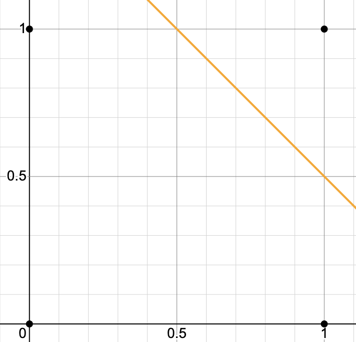

# 소프트맥스 회귀

- 소프트맥스 회귀(Sotfmax Regression)
  - 앞에서 살펴본 로지스틱 회귀는 2개의 선택지 중에서 1개를 고르는 이진 분류를 푸는 방식이었다.
    - 로지스틱 회귀에서 사용한 시그모이드 함수는 입력된 데이터에 대해서 0과 1 사이의 값을 출력하여 해당 값이 둘 중 하나에 속할 확률로 해석할 수 있도록 만들어줬다.
    - 예를 들어 0이 정상 메일, 1이 스팸 메일이라고 정의해놓는다면 시그모이드 함수의 0과 1 사이의 출력값을 스팸 메일일 확률로 해석할 수 있었다.
    - 확률값이 0.5를 넘으면 1에 가까우니 스팸 메일로 판단하면 되고, 그 반대라면 정상 메일로 판단하면 된다.
  - 소프트맥스 회귀는 3개 이상의 선택지 중에서 1개를 고르는 다중 클래스 분류 문제를 푸는 방식이다.
    - 이진 분류가 두 개의 선택지 중 하나를 고르는 문제였다면, 세 개 이상의 선택지 중 하나를 고르는 문제를 다중 클래스 분류라고 한다.
    - 전체 선택지에 걸친 확률의 합계가 1이 되도록 하여 전체 선택지 중 가장 확률이 높은 선택지를 선택하도록 하는 소프트맥스 함수를 사용한다.


- 소프트맥스 함수(Softmax function)

  - 선택해야 하는 선택지의 총 개수를 k라고 할 때, k차원의 벡터를 입력 받아 각 클래스에 대한 확률을 추정한다.
    - k차원의 벡터에서 i번째 원소를 $z_i$, i번째 클래스가 정답일 확률을 $p_i$로 나타낼 때, 소프트맥스 함수는 $p_i$를 아래와 같이 정의한다.

  $$
  p_i={e^{z_i}\over \sum_{j=1}^k}for\ \ i=1,2,...k
  $$

  - 예를 들어 꽃에 대한 데이터가 있을 때 그 꽃이 a, b, c 중 어떤 꽃일지 예측하는 경우를 생각해보자.
    - 이 경우 k는 3이므로 3차원 벡터 $z=[z_1\ z_2\ z_3]$의 입력을 받으면 소프트맥스 함수는 아래와 같은 출력을 반환한다.
    - $p_1,p_2,p_3$ 각각은 1~3번 클래스(setosa, versicolor, virginica)가 정답일 확률을 나타내며, 각각 0과 1사이의 값으로 총합은 1이 된다.

  $$
  softmax(z)=[{e^{z_1} \over \sum_{j=1}^3e^{z_j}}{e^{z_2} \over \sum_{j=1}^3e^{z_j}}{e^{z_3} \over \sum_{j=1}^3e^{z_j}}]=[p_1,p_2,p_3]=\hat y = 예측값
  $$

  - 이 때, 꽃에 대한 데이터는 꽃받침 길이와 넓이, 꽃의 길이, 꽃잎 넓이가 있다고 하자.
    - 이 4가지 요소가 독립변수 $x_1,x_2,x_3,x_4$가 된다.
    - 이는 모델이 4차원 벡터를 입력으로 받음을 의미한다.
    - 그런데 소프트맥스 함수의 입력으로 사용되는 벡터는 차원이 분류하고자 하는 클래스의 개수(k, 예시의 경우 3)가 되어야 하므로 어떤 가중치 연산을 통해 3차원 벡터로 변환되어야한다.
  - 샘플 데이터를 소프트맥스 함수의 입력 벡터로 차원을 축소하는 방법
    - 샘플 데이터(독립 변수 벡터)를 소프트맥스 함수의 입력 벡터로 차원을 축소하는 방법은 간단하다.
    - 소프트맥스 함수의 입력 벡터 $z$의 차원수만큼 결과값이 나오도록 가중치 곱을 진행한다.
    - 경우의 수는 4*3으로 총 12개이며 전부 다른 가중치를 가지고, 학습 과정에서 점차적으로 오차를 최소화하는 가중치로 값이 변경된다.
  - 오차를 계산하는 방법
    - 소프트맥스 함수의 출력은 분류하고자하는 클래스의 개수만큼 차원을 가지는 벡터로 각 원소는 0과 1사이의 값을 가지며, 각각은 특정 클래스가 정답일 확률을 나타낸다.
    - 그렇다면 이 예측값과 비교를 할 수 있는 실제값의 표현 방법이 있어야하는데, 소프트맥스 회귀에서는 실제값을 원-핫 벡터로 표현한다.
    - a,b,c의 원-핫 벡터를 각기 [1,0,0], [0,1,0], [0,0,1]이라고 하자.
    - 이 때, 현재 풀고 있는 샘플 데이터의 실제 값이 b라면 b의 원-핫 벡터는 [0,1,0]이다.
    - 이 경우 예측값과 실제값의 오차가 0이 되는 경우는 소프트맥스 함수의 결과가 [0, 1, 0]이 되는 경우이다.
    - 이 두 벡터의 오차를 계산하기 위해서 소프트맥스 회귀는 비용 함수로 크로스 엔트로피 함수를 사용한다.
  - 선형 회귀나 로지스틱 회귀와 마찬가지로 소프트맥스 회귀 역시 오차로부터 가중치를 업데이트한다.
    - 더 정확히는 선형회귀나 로지스틱 회귀와 마찬가지로 편향 또한 업데이트 대상이 되는 매개 변수이다.


- 원-핫 벡터를 사용하는 이유

  - 꼭 실제값을 원-핫 벡터로 표현해야만 다중 클래스 분류 문제를 풀 수 있는 것은 아니다.

    - 다만 대부분의 다중 클래스 분류 문제가 각 클래스 간의 관계가 균등하다는 점에서 원-핫 벡터는 이러한 점을 표현할 수 있는 적절한 표현 방법이다.

  - 다수의 클래스를 분류하는 문제에서는 이진 분류처럼 2개의 숫자 레이블이 아니라 클래스의 개수만큼 숫자 레이블이 필요하다.

    - 이때 직관적으로 생각해볼 수 있는 레이블링 방법은 분류해야 할 클래스 전체에 정수 인코딩을 하는 것이다.
    - 예를 들어 분류해야 할 레이블이 red, green, blue와 같이 3개라면 각각 0,1,2로 레이블한다.
    - 또한 분류해야 할 클래스가 north, east, west, south 네 개이고, 인덱스를 숫자 1부터 시작하고 싶다면 1,2,3,4로 레이블 해볼 수 있다.

  - 그런데 일반적인 다중 클래스 분류 문제에서 레이블링 방법으로는 위와 같은 정수 인코딩이 아니라 원-핫 인코딩을 사용하는 것이 보다 클래스의 성질을 잘 표현했다고 할 수 있다.

    - 예를 들어 a, b, c라는 3개의 클래스가 있는 문제가 있다고 가정해보자.
    - 레이블은 정수 인코딩을 사용하여 각각 1,2,3을 부여하였다.
    - 손실 함수로 평균 제곱 오차를 사용하면 정수 인코딩이 오해를 불러일으킬 수 있다.
    - 아래는 앞서 살펴본 평균 제곱 오차의 식을 가져온 것이다.

    $$
    {1 \over n}\sum_{i}^n(y_i-\hat y_i)^2
    $$

    - 직관적인 오차 크기 비교를 위해 평균을 구하는 수식은 제외하고 제곱 오차로만 판단하면 실제 값이 b일때 예측값이 a였다면 제곱 오차는 $(2-1)^2=1$이 된다.
    - 실제값이 c일때 예측값이 a였다면 제곱 오차는 $(3-1)^2=4$가 된다.
    - 즉 b와 c 사이의 오차보다 c와 a 사이의 오차가 더 크다.
    - 이는 기계에게 b와 c가 a와 c보다 더 가깝다는 정보를 주는 것과 같다.

  - 원-핫 벡터의 무작위성

    - 일반적인 분류 문제에서 각 클래스는 순서의 의미를 갖고 있지 않으므로 각 클래스간 오차는 균등한 것이 맞다.
    - 정수 인코딩과 달리 원-핫 인코딩은 분류 문제의 모든 클래스 간의 관계를 균등하게 분배한다.
    - 아래는 세 개의 카테고리에 대해서 원-핫 인코딩을 통해서 레이블을 했을 때 각 클래스 간의 제곱 오차가 균등합을 보여준다.
    - $((1,0,0)-(0,1,0))^2=2$, $((1,0,0)-(0,0,1))^2=2$
    - 다르게 표현하면 모든 클래스에 대해서 원-핫 인코딩을 통해 얻은 원-핫 벡터들은 모든 쌍에 대해 유클리드 거리를 구해도 전부 유클리드 거리가 동일하다.
    - 원-핫 벡터는 이처럼 각 클래스의 표현 방법이 무작위성을 가진다는 점을 표현할 수 있다.


- 비용 함수(Cost function)

  - 크로스 엔트로피 함수
    - 소프트맥스 회귀에서는 비용 함수로 크로스 엔트로피 함수를 사용한다.
    - 아래 식에서 $y$는 실제값, $k$는 클래스의 개수, $y_j$는 실제 원-핫 벡터의 $j$번째 인덱스, $p_j$는 샘플 데이터가 $j$번째 클래스일 확률을 나타낸다.
    - $p_j$는 표기에 따라서 $\hat y_j$로 표현하기도 한다.
    - 원-핫 벡터에서 1인 값은 한 개만 존재하므로, 결국 $p_j$는 원-핫 벡터의 j번째 원소가 1일 확률(즉 j번째 클래스일 확률)을 의미한다.
  
  $$
  cost = -\sum_{j=1}^ky_jlog(p_j)
  $$
  
  - 크로스 엔트로피 함수를 비용 함수로 사용하는 이유
    - $c$가 실제값 원-핫 벡터에서 1을 가진 원소의 인덱스라고 한다면, $p_c=1$은 $\hat y$가 $y$를 정확하게 예측한 경우가 된다.
    - 이를 식에 대입해보면 $-1log(1)=0$이 되기 때문에, 결과적으로  $\hat y$가 $y$를 정확하게 예측한 경우의 크로스 엔트로피 함수의 값은 0이 된다.
    - 즉 , 크로스 엔트로피 함수의 출력값을 최소화 하는 방향으로 학습해야한다.
  - 이를 n개의 전체 데이터에 대한 평균을 구한다고하면 최종 비용 함수는 아래와 같다.
  
  $$
  cost = -{1 \over n}\sum_{i=1}^n \sum_{j=1}^k y_j^{(i)}log(p_j^{(i)})
  $$
  
  - 이진 분류에서의 크로스 엔트로피 함수
  
    - 로지스틱 회귀에서 봤던 크로스 엔트로피 함수식과 달라보이지만 본질적으로 동일한 함수식이다.
    - 로지스틱 회귀의 크로스 엔트로피 함수식으로부터 소프트맥스 회귀의 크로스 엔트로피 함수식을 도출하면 아래와 같다.
  
    $$
    cost = -(ylogH(X)+(1-y)log(1-H(X)))
    $$
  
    - 위 식은 앞서 로지스틱 회귀에서 봤던 크로스 엔트로피의 함수식을 보여주는데, 위 식에서 $y$를 $y_1$, $1-y$를 $y_2$로 치환하고 $H(X)$를 $p_1$, $1-H(X)$를 $p_2$로 치환하면 아래의 수식을 얻을 수 있다.
  
    $$
    -(y_1log(p_1)+y_2\ log(p_2))
    $$
  
    - 위 식은 아래와 같이 표현할 수 있다.
  
    $$
    -(\sum_{i=1}^2y_i\ log\ p_i)
    $$
  
    - 소프트맥스 회귀에서는 k의 값이 고정된 값이 아니므로 2를 k로 변경해야한다.
  
    $$
    -(\sum_{i=1}^ky_i\ log\ p_i)
    $$
  
    
  
    - 위 식은 결과적으로 소프트맥스 회귀의 식과 동일하며, 역으로 소프트맥스 회귀에서 로지스틱 회귀의 크로스 엔트로피 함수식을 얻는 것은 k를 2로하고 를 $y_1$, $y_2$를 $y$와 $y-1$로 치환하고, $p_1$, $p_2$를 $H(X)$, $1-H(X)$로 치환하면 된다.
    - 정리하면 소프트맥스 함수의 최종 비용 함수에서 k가 2라고 가정하면 결국 로지스틱 회귀의 비용 함수와 같다.
  
    $$
    cost = -{1 \over n}\sum_{i=1}^n \sum_{j=1}^k y_j^{(i)}log(p_j^{(i)})=-{1 \over n} \sum_{i=1}^n[y^{(i)}log(p^{(i)})+(i-y^{(i)})log(1-p^{(i)})]
    $$


- 소프트맥스 회귀 실습

  > 아이리스 품종 데이터로 실습을 진해한다.
  >
  > https://www.kaggle.com/datasets/saurabh00007/iriscsv에서 데이터를 다운 받아야한다.

  - 필요한 패키지 들을 설치한다.

  ```bash
  $ pip install pandas seaborn scikit-learn tensorflow
  ```

  - 아이리스 품종 데이터에 대한 이해
    - 아래와 같이 다운 받은 데이터 파일에서 5개의 샘플을 확인한다.
    - 데이터는 6개의 열로 구성된 총 150개의 샘플로 구성되어 있다.
    - 특성에 해당하는 `SepalLengthCm`, `SepalWidthCm`, `PetalLengthCm`, `PetalWidthCm` 4개의 열이 있다.
    - 마지막 열  `Species`는 해당 샘플이 어떤 품종인지를 의미하며, Iris‑setosa, Iris‑versicolor, Iris‑virginica 라는 3 개의 품종으로 구성되고, 이 실습에서 예측해야 하는 레이블에 해당한다.
    - 즉 이 실습은 주어진 샘플 데이터의 4개의 특성으로부터 3개의 품종 중 어떤 품종인지를 예측하는 것이다.

  ```python
  import pandas as pd
  import seaborn as sns
  import matplotlib.pyplot as plt
  from sklearn.model_selection import train_test_split
  from tensorflow.keras.utils import to_categorical
  
  
  data = pd.read_csv("Iris.csv", encoding="latin1")
  print(data[:5])
  
  """
     Id  SepalLengthCm  SepalWidthCm  PetalLengthCm  PetalWidthCm      Species
  0   1            5.1           3.5            1.4           0.2  Iris-setosa
  1   2            4.9           3.0            1.4           0.2  Iris-setosa
  2   3            4.7           3.2            1.3           0.2  Iris-setosa
  3   4            4.6           3.1            1.5           0.2  Iris-setosa
  4   5            5.0           3.6            1.4           0.2  Iris-setosa
  """
  ```

  - 3개 품종이 4개의 특성에 대해 어떤 분포를 가지고 있는지 확인하기 위해 아래와 같이 시각화가 가능하다.
    - 4개의 특성 `SepalLengthCm`, `SepalWidthCm`, `PetalLengthCm`, `PetalWidthCm`에 대하 모든 쌍의 조합인 16개의 경우에 대해서 산점도를 그린다.
    - 만약 동일한 특성의 쌍일 경우에는 히스토그램으로 나타낸다. 

  ```python
  sns.set(style="ticks", color_codes=True)
  g = sns.pairplot(data, hue="Species", palette="husl")
  g.savefig("iris.png")
  ```

  - 아래와 같이 종과 `SepalLengthCm` 특성에 대한 연관 관계를 출력할 수 도 있다.
    - 아래 코드 실행시, 위에서 시각한 코드와 별도로 실행해야하며, 그렇지 않을 경우 이전 결과에 덮어씌워진다.

  ```python
  ax = sns.barplot(x='Species', y='SepalWidthCm', data=data)
  ax.figure.savefig("species_sepal_width_cm.png")
  ```

  - 150개의 샘플 데이터에 각 품종이 몇 개씩 있는지 확인한다.
    - 모두 동일하게 50개씩 있는 것을 확인할 수 있다.
    - 즉 각 레이블에 대한 분포가 균일하다. 

  ```python
  print(data['Species'].value_counts())
  
  """
  Species
  Iris-setosa        50
  Iris-versicolor    50
  Iris-virginica     50
  Name: count, dtype: int64
  """
  ```

  - 레이블에 해당하는 `Species` 열에 대해 전부 수치화를 진행한다.
    - 우선 원-핫 인코딩을 수행하기 전 0, 1, 2로 정수 인코딩을 수행한다.
    - 그 후 여전히 동일한 분포를 보이는지 확인한다.

  ```python
  # 정수 인코딩 수행
  data['Species'] = data['Species'].replace(['Iris-virginica','Iris-setosa','Iris-versicolor'],[0,1,2])
  
  # 분포 재확인
  print(data['Species'].value_counts())
  
  """
  Species
  1    50
  2    50
  0    50
  Name: count, dtype: int64
  """
  ```

  - 특성과 품종을 각각 독립 변수와 종속 변수 데이터로 분리하는 작업을 수행한다.
    - 이후 확인을 위해 5개의 데이터를 출력해본다.

  ```python
  data_X = data[['SepalLengthCm', 'SepalWidthCm', 'PetalLengthCm', 'PetalWidthCm']].values
  data_y = data['Species'].values
  print(data_X[:5])
  """
  [[5.1 3.5 1.4 0.2]
   [4.9 3.  1.4 0.2]
   [4.7 3.2 1.3 0.2]
   [4.6 3.1 1.5 0.2]
   [5.  3.6 1.4 0.2]
  """
  print(data_y[:5])	# [1 1 1 1 1]
  ```

  - 훈련 데이터와 테스트 데이터를 분리하고 레이블에 대해 원-핫 인코딩을 수행한다.
    - 훈련 데이터와 테스트 데이터를 8:2로 나눈다.

  ```python
  # 훈련 데이터와 테스트 데이터를 나눈다.
  X_train, X_test, y_train, y_test = train_test_split(data_X, data_y, train_size=0.8, random_state=1)
  
  # 원-핫 인코딩을 수행한다.
  y_train = to_categorical(y_train)
  y_test = to_categorical(y_test)
  ```

  - 소프트맥스 회귀 실행하기
    - 입력의 차원이 4이므로 `input_dims`를 4로 설정하고, 출력의 차원이 3이므로 `output_dims`(가장 앞의 인자)를 3으로 설정한다.
    - 활성화 함수는 소프트맥스 함수를 사용하므로 `activation`의 인자값으로 `softmax`를 설정한다.
    - 오차 함수로는 크로스 엔트로피 함수를 사용하는데, 시그모이드 함수를 사용한 이진 분류에서는 `binary_crossentropy`를 사용했지만, 다중 클래스 분류 문제에서는 `categorical_crossentropy`를 사용한다.
    - 옵티마이저로는 경사 하강법의 일종인 adam을 사용한다(특별한 이유가 있는 것은 아니다).
    - 전체 데이터에 대한 훈련 횟수는 200번이다.
    - `validation_data`에 테스트 데이터를 입력하면 각 훈련 횟수마다 테스트 데잍터에 대한 정확도를 출력해준다.
    - 단, 이는 정확도가 측정되고는 있지만 기계는 해당 데이터를 가지고 가중치를 업데이트하지 않는다.
    - 출력에서 accuracy는 훈련 데이터에 대한 정확도이고,  val_accuracy는 테스트 데이터에 대한 정확도를 의미한다.

  ```python
  model = Sequential()
  model.add(Dense(3, input_dim=4, activation='softmax'))
  model.compile(loss='categorical_crossentropy', optimizer='adam', metrics=['accuracy'])
  history = model.fit(X_train, y_train, epochs=200, batch_size=1, validation_data=(X_test, y_test))
  ```

  - 에포크에 따른 정확도 그래프를 출력하려면 아래와 같이 하면 된다.
    - 그래프를 확인해보면 에포크가 증가함에 따라 오차가 점차적으로 감소하는 것을 볼 수 있다.

  ```python
  epochs = range(1, len(history.history['accuracy']) + 1)
  plt.plot(epochs, history.history['loss'])
  plt.plot(epochs, history.history['val_loss'])
  plt.title('model loss')
  plt.ylabel('loss')
  plt.xlabel('epoch')
  plt.legend(['train', 'val'], loc='upper left')
  plt.show()
  ```

  - 테스트 데이터를 사용하여 정확도를 측정할 수 있다.
    - Keras의 `Sequential.evaluate()` 메서드를 사용하면 된다.

  ```python
  print("\n 테 스 트 정 확 도 : %.4f" % (model.evaluate(X_test, y_test)[1]))
  
  # 테 스 트 정 확 도 : 1.0000
  ```


# 딥 러닝 개요

- 딥 러닝(Deep Learning)
  - 머신 러닝의 특정한 한 분야로서 인공 신경망(aritificial neural network)의 층을 연속적으로 깊게 쌓아올려 데이터를 학습하는 방식이다.
  - 딥 러닝이 화두가 되기 시작한 것은 비교적 최근의 일이지만 딥 러닝의 기본 구조인 인공 신경망의 역사는 생각보다 오래 되었다.


- 퍼셉트론(Perceptron)

  - 프랑크 로젠블라트(Frank Rosenblatt)가 1957년에 제안한 초기 형태의 인공 신경망이다.

    - 다수의 입력으로부터 하나의 결과를 보내는 알고리즘이다.
    - 실제 뇌를 구성하는 신경 세포 뉴런의 동작과 유사한데, 뉴런은 가지 돌기에서 신호를 받아들이고, 이 신호가 일정치 이상의 크기를 가지면 축삭돌기를 통해서 신호를 전달한다.
    - 실제 신경 세포 뉴런에서 신호를 전달하는 축삭돌기의 역할을 퍼셉트론에서는 가중치가 대신한다.
    - 각각의 인공 뉴런에서 보내진 입력값 $x$는 각각의 가중치 $w$와 함께 종착지인 인공 뉴런에 전달된다.
    - 각각의 입력값에는 각각의 가중치기 존재하는데, 가중치의 값이 클수록 해당 입력 값이 중요하다는 것을 의미한다.
    - 각 입력값이 가중치와 곱해져 인공 뉴런에 전달되고, 각 입력값과 그에 해당하는 가중치의 곱의 전체 합이 임계치(threshold)를 넘으면 종착지에 있는 인공 뉴런은 출력 신호로 1을 출력하고, 그렇지 않을 경우 0을 출력한다.
    - 이러한 함수를 계단 함수(step function)라 하며, 계단 함수에 사용된 임계치 값을 수식으로 표현할 때는 보통 세타(Θ)로 표현한다.
    - 이를 식으로 표현하면 아래와 같다.

    $$
    if\sum_i^nw_ix_i \ge Θ \rarr y=1 \\
    if\sum_i^nw_ix_i \lt Θ \rarr y=0
    $$

  - 위 식에서 임계치를 좌변으로 넘기고 편향 $b$(bias)로 표현할 수도 있다.

    - 편향 $b$또한 퍼셉트론의 입력으로 사용되는데, 보통 그림으로 표현할 때는 입력값이 1로 고정되고 편향 $b$가 곱해지는 변수로 표현된다.

    $$
    if\sum_i^nw_ix_i + b \ge 0 \rarr y=1 \\
    if\sum_i^nw_ix_i + b \lt 0 \rarr y=0
    $$

    - 많은 경우에 편의상 편향이 그림이나 수식에서 생략되서 표현되기도 하지만 실제로는 편향 또한 딥 러닝이 최적의 값을 찾아야 할 변수 중 하나이다.

  - 활성화 함수(Activation Function)

    - 뉴런에서 출력값을 변경시키는 함수이다.
    - 즉 뉴런이 입력값과 가중치를 받아 그 값을 어떤 규칙에 따라 변환해 출력하는 함수이다.
    - 초기 인공 신경망 모델인 퍼셉트론은 활성화 함수로 계단 함수를 사용하였지만, 그 뒤에 등장한 여러 발전된 신경망들은 계단 함수 외에도 다양한 활성화 함수를 사용하기 시작했다.
    - 앞에서 살펴본 시그모이드 함수나 소프트맥스 함수 또한 활성화 함수 중 하나이다.

  - 퍼셉트론은 단층 퍼셉트론과 다층 퍼셉트론으로 나뉜다.


- 단층 퍼셉트론(Single-Layer Perceptron)

  - 보내는 단계와 값을 받아서 출력하는 두 단계로만 이루어진 퍼셉트론을 의미한다.
    - 이때 각 단계를 보통 층(layer)라 부르며, 이 두 개의 층을 입력층(input layer)과 출력층(output layer)라고 한다.
  - 컴퓨터는 두 개의 값 0과 1을 입력해 하나의 값을 출력하는 회로가 모여 만들어지는데, 이 회로를 게이트라 부른다.
    - 단층 퍼셉트론을 이용하면 AND, NAND, OR 게이트는 구현가능하다.
    - 게이트 연산에 쓰이는 것은 두 개의 입력값과 하나의 출력값이다.
  - AND 게이트
    - 두 개의 입력값이 각각 0 또는 1의 값을 가질 수 있으면서 모두 1인 경우에만 출력값이 1이 나오는 게이트이다.
    - 단층 퍼셉트론의 식에서 AND 게이트를 만족하는 두 개의 가중치와 편향의 조합은 다양하게 나올 수 있다(아래 예시에서는 임의의 가중치와 편향을 사용했다).
    - 아래 AND 게이트에 가능한 입력값을 모두 넣어보면 오직 두 개의 입력값이 1인 경우에만 1을 출력한다.

  ```python
  def and_gate(x1, x2):
      w1 = 0.5	# x1의 가중치
      w2 = 0.5	# x2의 가중치
      b = -0.7	# 편향
      result = x1*w1 + x2*w2 + b
      if result <= 0:
          return 0
      else:
          return 1
  
  
  print(and_gate(0, 0))	# 0
  print(and_gate(0, 1))	# 0
  print(and_gate(1, 0))	# 0
  print(and_gate(1, 1))	# 1
  ```

  - NAND 게이트
    - 두 개의 입력값이 1인 경우에만 출력값이 0, 나머지 입력값의 쌍에 대해서는 모두 출력값이 1이 나오는 게이트이다.
    - 앞에서 사용한 가중치와 편향값에 -를 붙여서 단층 퍼셉트론의 식에 넣으면 NAND 게이트를 충족한다.

  ```python
  def nand_gate(x1, x2):
      w1 = -0.5	# x1의 가중치
      w2 = -0.5	# x2의 가중치
      b = 0.7	    # 편향
      result = x1*w1 + x2*w2 + b
      if result <= 0:
          return 0
      else:
          return 1
  
  
  print(nand_gate(0, 0))	# 1
  print(nand_gate(0, 1))	# 1
  print(nand_gate(1, 0))	# 1
  print(nand_gate(1, 1))	# 0
  ```

  - OR 게이트
    - 두 개의 입력값이 모두 0인 경우에만 출력값이 0, 나머지 입력값의 쌍에 대해서는 모두 출력값이 1이 나오는 게이트이다.
    - 적절한 가중치와 편향을 찾으면 단층 퍼셉트론의 식으로 구현할 수 있다.

  ```python
  def or_gate(x1, x2):
      w1 = 0.6	    # x1의 가중치
      w2 = 0.6	    # x2의 가중치
      b = -0.5	    # 편향
      result = x1*w1 + x2*w2 + b
      if result <= 0:
          return 0
      else:
          return 1
  
  
  print(or_gate(0, 0))	# 0
  print(or_gate(0, 1))	# 1
  print(or_gate(1, 0))	# 1
  print(or_gate(1, 1))	# 1
  ```

  - 이처럼 가중치와 편향을 변경하는 것 만으로 각기 다른 종류의 게이트를 구현할 수 있다.

    - 위에서 사용한 가중치와 편향 외에도 각 게이트를 충족하게 하는 다양한 가중치와 편향 값들이 있을 것이다.

  - XOR 게이트는 단층 퍼셉트론으로 구현할 수 없다.

    - XOR 게이트는 입력값 두 개가 서로 다른 값을 갖고 있을 때에만 출력값이 1이 되고, 같은 값을 가지면 출력값이 0이 되는 게이트이다.
    - 위의 코드에 아무리 많은 가중치와 편향을 넣어봐도 XOR 게이트를 구현하는 것은 불가능하다.
    - 그 이유는 단층 퍼셉트론은 직선 하나로 두 영역을 나눌 수 있는 문제에 대해서만 구현이 가능하기 때문이다.
    - 예를 들어 AND 게이트에 대한 단층 퍼셉트론을 시각화하면 아래와 같다.
    - 입력값 [0,0], [0,1], [1,0], [1, 1]을 두 부분으로 나누는 직선이 있다.
    - NAND 게이트나 OR 게이트도 마찬가지로 직선으로 나누는 것이 가능하다.

    

    - 그러나 XOR 게이트의 경우 직선 하나로 나누는 것은 불가능하고 적어도 두 개의 선이 필요하므로 단층 퍼셉트론으로는 XOR 게이트를 구현할 수 없다.


- 다층 퍼셉트론(MultiLayer Perceptron, MLP)

  - 다층 퍼셉트론은 단층 퍼셉트론에 층이 더 추가된 퍼셉트론이다.
    - 단층 퍼셉트론은 입력층과 출력층만 존재한다.
    - 다층 퍼셉트론은 입력층과 출력층 사이에 층이 추가되며, 이 층을 은닉층(hidden layer)이라고 한다.

  - 다층 퍼셉트론으로 XOR 게이트를 구현하면 아래와 같다.
    - 은닉층 하나에 뉴런(h1, h2)이 두 개인 형태이다.
    - 각각의 뉴런들이 각자의 가중치와 편향을 가진다.


  ```python
def step(x):
    return 1 if x > 0 else 0

def xor_gate(x1, x2):
    # ----- 은닉층 -----
    # h1 = x1 AND (NOT x2)
    z1 = 1.0 * x1 + (-1.0) * x2 + 0.0
    h1 = step(z1)

    # h2 = (NOT x1) AND x2
    z2 = -1.0 * x1 + 1.0 * x2 + 0.0
    h2 = step(z2)

    # ----- 출력층 -----
    z3 = 0.6 * h1 + 0.6 * h2 - 0.5
    return step(z3)

# 테스트
for x1 in [0, 1]:
    for x2 in [0, 1]:
        print(f"x1={x1}, x2={x2} -> {xor_gate(x1, x2)}")
  ```

  - 심층 신경망(Deep Neural Network, DNN)
    - 은닉층이 2개 이상인 신경망을 심층 신경망이라고 한다.
    - 다층 퍼셉트론뿐 아니라 여러 변형된 다양한 신경망들도 은닉층이 2개 이상이면 심층 신경망이라고 한다.
  - 딥 러닝
    - 위에서는 게이트를 만족시키는 같이 가중치와 편향을 직접 찾아 입력했다.
    - 만약 기계가 가중치를 스스로 찾아내도록 자동화한다면 이것이 머신 러닝에서 말하는 훈련 또는 학습 단계에 해당한다.
    - 앞서 살펴보았듯 이 과정에서 손실 함수와 옵티마이저를 사용한다.
    - 만약 학습을 시키는 인공 신경망이 심층 신경망일 경우에는 이를 심층 신경망을 학습시킨다고 하여 딥 러닝이라고 한다.


- 인공 신경망

  - 피드 포워드 신경망(Feed-Forward Neural Network, FFNN)
    - 오직 입력층에서 출력층 방향으로 연산이 전개되는 신경망을 의미한다.
    - 위에서 구현한 XOR 게이트가 이에 해당한다.
  - 순환 신경망(Recurrent Neural Network, RNN)
    - 은닉층의 출력 값을 출력층으로도 보내지만 동시에 은닉층의 출력값이 다시 은닉층의 입력값으로 사용된다.

  - 전결합층(Fully-connected layer, FC, Dense layer)
    - 다층 퍼셉트론은 은닉층과 출력층에 있는 모든 뉴런이 바로 이전 층의 모든 뉴런과 연결되어 있다.
    - 어떤 층의 모든 뉴런이 이전 층의 모든 뉴런과 연결되어 있는 층을 전결합층 또는 완전 연결층이라고 한다.
    - 동일한 의미로 밀집층이라고 부르기도 한다.
  - 활성화 함수(Activation Function)
    - 앞서 살펴본 퍼셉트론에서는 계단 함수를 통해 출력값이 0이 될지, 1이 될지를 결정했다.
    - 이러한 매커니즘은 실제 뇌를 구성하는 신경 세포 뉴런이 전위가 일정치 이상이 되면 시냅스가 화학적으로 연결되는 모습을 모방한 것이다.
    - 이렇게 은닉층과 출력층의 뉴런에서 출력값을 결정하는 함수를 활성화 함수라고 하는데, 계단 함수는 이 활성화 함수 중 하나이다.
  - 인공 신경망에서 활성화 함수는 비선형 함수여야한다.
    - 인공 신경망에서 사용하는 활성화 함수는 선형 함수가 아니라 비선형 함수(nonlinear function)여야 한다.
    - 선형 함수란 출력이 입력의 상수배만큼 변하는 함수를 말한다.
    - 예를 들어 $f(x)=wx+b$라는 함수가 있을 때 $w, b$는 상수로 이 식을 그래프로 만들면 직선이 된다.
    - 반대로 비선형 함수는 직선 1개로는 그릴 수 없는 함수를 말한다.
    - 앞서 퍼셉트론에서도 계단 함수라는 활성화 함수를 사용했는데, 계단 함수 또한 비선형 함수에 속한다.
  - 인공 신경망에서 활성화 함수가 비선형 함수여야 하는 이유
    - 인공 신경망의 능력을 높이기 위해서는 은닉층을 계속해서 추가해야한다.
    - 그런데 만약 활성화 함수로 선형 함수를 사용하게 되면 은닉층을 쌓을 수가 없다.
    - 예를 들어 활성화 함수로 선형 함수를 선택하고 계속 층을 쌓는다고 가정해보자.
    - 이 때 활성화 함수는 $f(x)=wx$라고 가정했을 때, 여기에 은닉층을 두 개 추가한다고 하면 출력층을 포함해서 $y(x)=f(f(f(x)))$가 되고, 이를 식으로 표현하면 $w\times w\times w\times x$이다.
    - 그런데 이는 잘 생각해보면 $w$의 세제곱을  k라고 정의해버리면  $y(x)=kx$와 같이 다시 표현이 가능하다.
    - 이 경우 선형 함수로 은닉층을 여러번 추가하더라도 1회 추가한 것과 차이가 없음을 알 수 있다.
    - 즉 층을 쌓더라도 표현력이 변하지 않는다.


