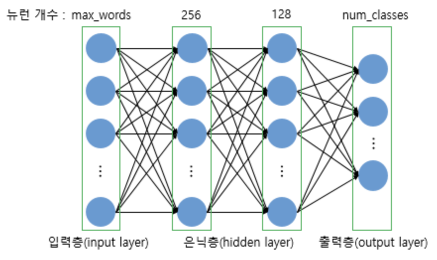

# 다층 퍼셉트론으로 텍스트 분류하기

- 다층 퍼셉트론(Multilayer Perceptron, MLP)
  - 단층 퍼셉트론의 형태에서 은닉층이 1개 이상 추가된 신경망을 다층 퍼셉트론이라고 한다.
  - 피드 포워드 신경망(Feed Forward Neural Network, FFNN)의 대표적인 형태이다.
    - FFNN은 입력층에서 출력층으로 오직 한 방향으로만 연산 방향이 정해져 있는 신경망을 말한다.


- Keras의 `texts_to_matrix()`이해하기

  - 아래와 같이 텍스트 데이터에 대해 정수 인코딩을 진행한다.
    - 각 단어에 1부터 시작하는 정수 인덱스가 부여된다.

  ```python
  import numpy as np
  from tensorflow.keras.preprocessing.text import Tokenizer
  
  
  texts = ['잘 익은 사과', '잘 익은 수박', '크고 동그란 수박', '나는 과일이 좋다']
  tokenizer = Tokenizer()
  tokenizer.fit_on_texts(texts)
  print(tokenizer.word_index)
  # {'수박': 1, '잘': 2, '익은': 3, '사과': 4, '크고': 5, '동그란': 6, '나는': 7, '과일이': 8, '좋다': 9}
  ```

  - 위와 동일한 텍스트 데이터에 `texts_to_matrix()`를 수행한다.
    - 입력된 텍스트로부터 행렬을 만드는 메서드이다.
    - `binary`, `count`, `freq`, `tfidf` mode를 지원한다.
    - `count` 모드로 실행하면 아래와 같이 문서 단어 행렬(DTM)을 생성하며, DTM에서의 인덱스는 앞서 확인한 `word_index`의 결과이다.
    - 다만 주의할 점은 행렬의 인덱스는 0부터 시작한다는 점으로, 실제 단어의 개수는 9개였지만 완성된 행렬에서 열의 개수는 10개인 것과, 첫번째 열은 모든 행에서 값이 0인 것을 볼 수 있다.
    - 인덱스 0에는 아무 단어도 할당되지 않았기 때문이다.
    - 세 번째 행의 두 번째 열의 값이 2인데, 이는 세 번째 문장에 1번 인덱스를 가진 수박이 두 번 등장했기 때문이다.
    - 모드와 무관하게 단어 순서 정보는 보존되지 않는다.

  ```python
  import numpy as np
  from tensorflow.keras.preprocessing.text import Tokenizer
  
  
  texts = ['잘 익은 사과', '잘 익은 수박', '수박, 크고 동그란 수박', '나는 과일이 좋다']
  tokenizer = Tokenizer()
  tokenizer.fit_on_texts(texts)
  print(tokenizer.texts_to_matrix(texts, mode = 'count'))
  
  """
  [[0. 0. 1. 1. 1. 0. 0. 0. 0. 0.]
   [0. 1. 1. 1. 0. 0. 0. 0. 0. 0.]
   [0. 2. 0. 0. 0. 1. 1. 0. 0. 0.]
   [0. 0. 0. 0. 0. 0. 0. 1. 1. 1.]]
  """
  ```

  - `text_to_matrix()`에서 지원하는 모드들
    - `count`: 각 단어가 몇 번 등장했는지를 행렬로 나타낸다.
    - `binary`: 각 단어의 등장 여부를 0과 1을 사용하여 행렬로 나타낸다.
    - `freq`: 각 문서에서 각 단어의 등장 횟수를 분자로, 각 문서에서 등장한 모든 단어의 개수의 총 합을 분모로 하는 표현 방법이다.
    - `tfidf`: TF-IDF 행렬을 만든다.


- Twenty Newsgroups 데이터

  - 사이킷런은 20개의 서로 다른 주제를 가진 18,846개의 뉴스 그룹 이메일 데이터를 제공한다.
    - `subset` 파라미터의 값에 따라 데이터의 종류가 달라지는데, "all"은 전체 데이터, "train"은 훈련 데이터, "test"는 테스트 데이터이다.

  ```python
  from sklearn.datasets import fetch_20newsgroups
  
  
  news_data = fetch_20newsgroups(subset = 'train')
  ```

  - 아레와 같이 데이터의 attribute들을 확인할 수 있다.
    - data에는 뉴스 데이터가 들어있다.
    - target_names에는 20개의 주제가 담겨 있다.
    - target에는 각 샘플 데이터가 어떤 주제에 속하는지가 담겨 있다.

  ```python
  print(news_data.keys())
  # dict_keys(['data', 'filenames', 'target_names', 'target', 'DESCR'])
  print(len(news_data.data)) # 11314
  # 첫 번째 샘플
  print(news_data.data[0])
  """
  From: lerxst@wam.umd.edu (where's my thing)
  Subject: WHAT car is this!?
  Nntp-Posting-Host: rac3.wam.umd.edu
  Organization: University of Maryland, College Park
  Lines: 15
  
   I was wondering if anyone out there could enlighten me on this car I saw
  the other day. It was a 2-door sports car, looked to be from the late 60s/
  early 70s. It was called a Bricklin. The doors were really small. In addition,
  the front bumper was separate from the rest of the body. This is 
  all I know. If anyone can tellme a model name, engine specs, years
  of production, where this car is made, history, or whatever info you
  have on this funky looking car, please e-mail.
  
  Thanks,
  - IL
     ---- brought to you by your neighborhood Lerxst ----
  
  """
  print(news_data.target_names)
  """
  ['alt.atheism', 'comp.graphics', 'comp.os.ms-windows.misc', 'comp.sys.ibm.pc.hardware', 'comp.sys.mac.hardware', 'comp.windows.x', 'misc.forsale', 'rec.autos', 'rec.motorcycles', 'rec.sport.baseball', 'rec.sport.hockey', 'sci.crypt', 'sci.electronics', 'sci.med', 'sci.space', 'soc.religion.christian', 'talk.politics.guns', 'talk.politics.mideast', 'talk.politics.misc', 'talk.religion.misc']
  """
  # 첫 번째 샘플의 레이블
  print(news_data.target[0])			# 7
  
  # 7번 레이블이 의미하는 주제
  print(news_data.target_names[7])		# rec.autos
  ```

  - 뉴스 데이터로 데이터 프레임 생성하기

  ```python
  from sklearn.datasets import fetch_20newsgroups
  import pandas as pd
  
  
  news_data = fetch_20newsgroups(subset = "train")
  new_data_frame = pd.DataFrame(news_data.data, columns=["email"])
  new_data_frame["target"] = pd.Series(news_data.target)
  news_data_frame.info()
  """
  <class 'pandas.core.frame.DataFrame'>
  RangeIndex: 11314 entries, 0 to 11313
  Data columns (total 2 columns):
   #   Column  Non-Null Count  Dtype 
  ---  ------  --------------  ----- 
   0   email   11314 non-null  object
   1   target  11314 non-null  int64 
  dtypes: int64(1), object(1)
  memory usage: 176.9+ KB
  """
  print(new_data_frame[:5])
  """
                                                 email  target
  0  From: lerxst@wam.umd.edu (where's my thing)\nS...       7
  1  From: guykuo@carson.u.washington.edu (Guy Kuo)...       4
  2  From: twillis@ec.ecn.purdue.edu (Thomas E Will...       4
  3  From: jgreen@amber (Joe Green)\nSubject: Re: W...       1
  4  From: jcm@head-cfa.harvard.edu (Jonathan McDow...      14
  """
  ```

  - matplotlib을 통해 시각화하기

  ```py
  from sklearn.datasets import fetch_20newsgroups
  import matplotlib.pyplot as plt
  import pandas as pd
  
  
  news_data = fetch_20newsgroups(subset = "train")
  new_data_frame = pd.DataFrame(news_data.data, columns=["email"])
  new_data_frame["target"] = pd.Series(news_data.target)
  new_data_frame['target'].value_counts().plot(kind='bar')
  plt.show()
  ```

  - 각 레이블 별 개수 확인하기

  ```python
  from sklearn.datasets import fetch_20newsgroups
  import pandas as pd
  
  
  news_data = fetch_20newsgroups(subset = "train")
  new_data_frame = pd.DataFrame(news_data.data, columns=["email"])
  new_data_frame["target"] = pd.Series(news_data.target)
  print(new_data_frame.groupby('target').size().reset_index(name='count'))
  """
      target  count
  0        0    480
  1        1    584
  2        2    591
  3        3    590
  4        4    578
  5        5    593
  6        6    585
  7        7    594
  8        8    598
  9        9    597
  10      10    600
  11      11    595
  12      12    591
  13      13    594
  14      14    593
  15      15    599
  16      16    546
  17      17    564
  18      18    465
  19      19    377
  """
  ```

  - 훈련 데이터와 테스트 데이터 준비

  ```python
  from sklearn.datasets import fetch_20newsgroups
  from tensorflow.keras.preprocessing.text import Tokenizer
  from tensorflow.keras.utils import to_categorical
  import pandas as pd
  
  
  news_data_train = fetch_20newsgroups(subset="train")
  news_data_train_frame = pd.DataFrame(news_data_train.data, columns=["email"])
  news_data_train["target"] = pd.Series(news_data_train.target)
  train_email = news_data_train_frame['email']
  train_label = news_data_train_frame['target']
  
  news_data_test = fetch_20newsgroups(subset="test")
  test_email = news_data_test.data
  test_label = news_data_test.target
  ```

  - 케라스를 사용하여 전처리 진행하기
    - 빈도수가 가장 높은 상위 10000개의 단어(num_words)만 사용한다.
    - 다만, 행렬의 인덱스는 1부터 시작하므로 실제로는 상위 9999개의 단어만 사용하게 된다.
    - 훈련 데이터와 테스트 데이터의 레이블은 원-핫 인코딩을 수행한다.

  ```python
  def prepare_data(train_data, test_data, mode, num_words):
      tokenizer = Tokenizer(num_words=num_words)
      tokenizer.fit_on_texts(train_data)
      # 샘플 수 × vocab_size 크기의 행렬 생성
      X_train = tokenizer.texts_to_matrix(train_data, mode=mode)
      # 샘플 수 × vocab_size 크기의 행렬 생성
      X_test = tokenizer.texts_to_matrix(test_data, mode=mode)
      return X_train, X_test, tokenizer.index_word
  
  num_classes = 20
  num_words = 10000
  X_train, X_test, index_to_word = prepare_data(train_email, test_email, 'binary', num_words) # binary 모드로 변환
  y_train = to_categorical(train_label, num_classes)  # 원-핫 인코딩
  y_test = to_categorical(test_label, num_classes)    # 원-핫 인코딩
  
  # 훈련, 테스트 샘플의 본문과 레이블의 크기를 확인한다.
  print(X_train.shape, y_train.shape, X_test.shape, y_test.shape)
  # (11314, 10000) (11314, 20) (7532, 10000) (7532, 20)
  ```


- 다층 퍼셉트론을 사용하여 텍스트 분류하기

  - 모델 설계하기
    - 과적합을 막기 위해 두 번의 드롭아웃을 적용한다.
    - 이 문제는 여러 개의 선택지(뉴스 주제) 중 하나를 고르는 다중 클래스 분류 문제이다. 
    - 다중 클래스 분류 문제이므로 출력층의 활성화 함수로는 소프트맥스 함수를 사용하고, 손실 함수로는 크로스 엔트로피 함수를 사용한다.

  ```python
  from tensorflow.keras.models import Sequential
  from tensorflow.keras.layers import Dense, Dropout
  
  
  def fit_and_evaluate(X_train, y_train, X_test, y_test, num_words):
      model = Sequential()
      model.add(Dense(256, input_shape=(num_words,), activation='relu'))
      model.add(Dropout(0.5))
      model.add(Dense(128, activation='relu'))
      model.add(Dropout(0.5))
      model.add(Dense(num_classes, activation='softmax'))
  
      model.compile(loss='categorical_crossentropy', optimizer='adam', metrics=['accuracy'])
      model.fit(X_train, y_train, batch_size=128, epochs=5, verbose=1, validation_split=0.1)
      score = model.evaluate(X_test, y_test, batch_size=128, verbose=0)
      return score[1]
  ```

  - 위 모델의 구조는 아래와 같다.
    - num_words의 크기를 가진 입력층, 256개의 뉴런을 가진 첫 번째 은닉층, 128개의 뉴런을 가진 두 번째 은닉층, num_classes 크기를 가진 출력층으로 구성된다.
    - 이 다층 퍼셉트론은 은닉층이 2개 이상이므로 깊은 신경망(Deep Neural Network, DNN)이다.

  

  - 모델 훈련시키기
    - `texts_to_matrix()`의 4개 모드에 대해서 모델의 결과를 확인한다.

  ```python
  for mode in ['binary', 'count', 'tfidf', 'freq']:
      X_train, X_test, _ = prepare_data(train_email, test_email, mode, num_words)
      score = fit_and_evaluate(X_train, y_train, X_test, y_test, num_words) 
      print(mode+' 모드의 테스트 정확도:', score)
  
  """
  binary 모드의 테스트 정확도: 0.8281996846199036
  count 모드의 테스트 정확도: 0.8240839242935181
  tfidf 모드의 테스트 정확도: 0.8335103392601013
  freq 모드의 테스트 정확도: 0.7006107568740845
  """
  ```


- 피드 포워드 신경망 언어 모델(Neural Network Language Model, NNLM)

  - 자연어는 많은 예외 사항, 시간에 따른 언어의 변화, 중의성과 모호성 등이 존재한다.

    - 기계가 자연어를 표현하도록 규칙으로 명세하는 것은 매우 어려운 일이다.
    - 따라서 규칙 기반 접근이 아닌 기계가 자연어 데이터를 학습하게 해야 한다.

  - 최근에는 인공 신경망을 사용하여 기계가 자연어를 학습하도록 하는 방법이 좋은 성능을 보인다.

    - 과거에는 통계적인 접근법으로 기계가 자연어를 학습하도록 했다.
    - 자연어 생성의 기반으로 사용되는 언어 모델들도 통계적 언어 모델(Statistical Language Model, SLM)에서 다양한 구조의 인공 신경망을 사용한 언어 모델들로 대체되기 시작했다.

  - 기존 N-gram 언어 모델의 한계

    - 언어 모델은 문장에 확률을 할당하는 모델이며, 주어진 문맥으로부터 아직 모르는 단어를 예측하는 것을 언어 모델링이라고 한다.
    - 예를 들어 `Quick brown fox jumps over the lazy _`와 같은 문장이 있을 때 n-gram 언어 모델이 빈 칸에 들어갈 단어를 예측하는 방법은 아래와 같다.
    - 빈 칸의 바로 앞 n-1개의 단어를 참고하며, 더 앞의 단어들은 무시한다.
    - 4-gram 언어 모델이라면 over, the, lazy를 참고할 것이다.
    - 그 후에는 훈련 코퍼스에서 (n-1)-gram을 카운트한 것을 분모로, n-gram을 카운트한 것을 분자로 하여 다음 단어가 등장할 확률을 예측한다.

    $$
    P(w|\text{over the lazy}) = {count(\text{over the lazy}\ w)\over count(\text{over the lazy)}}
    $$

    - 예를 들어 over the lazy가 10번, over the lazy dog이 7번 over the lazy cat이 1번 등장했다면, 각각의 확률은 아래와 같다.

    $$
    P(\text{dog}\text{over the lazy})=0.700 \\
    P(\text{cat}\text{over the lazy})=0.100
    $$

    - 문제는 n-gram 언어 모델은 충분한 데이터를 관측하지 못하면 언어를 정확히 예측하지 못하는 희소 문제가 있다.
    - 예를 들어 훈련 코퍼스에 over the lazy dog이라는 단어 시퀀스가 존재하지 않으면 n-gram 언어 모델에서 해당 단어 시퀀스의 확률 $P(\text{dog}|\text{over the lazy})$의 확률은 0이 된다.

  - 단어의 의미적 유사성

    - 위에서 살펴본 희소 문제는 기계가 단어의 의미적 유사성을 알 수 있다면 해결할 수 있는 문제이다.
    - 예를 들어 "보고서를 살펴보다"라는 단어 시퀀스는 존재하지만 "보고서를 검토하다"라는 단어 시퀀스는 존재하지 않는 코퍼스를 학습한 언어 모델이 있다고 가정해보자.
    - 언어 모델은 $P(\text{달리다}|보고서를)$와 $P(\text검토하다|보고서를)$중에서 다음 단어를 예측해야한다.
    - 기계가 단어의 의미적 유사성을 알지 못한다면 후자의 확률을 0으로 연산하게 된다.
    - 만약 언어 모델이 단어의 의미적 유사성을 학습하도록 설계한다면 훈련 코퍼스에 없는 단어 시퀀스에 대한 예측이라도 유사한 단어가 사용된 단어 시퀀스를 참고하여 보다 정확한 예측을 할 수 있다.
    - 이러한 아이디어를 반영한 언어 모델이 신경망 언어 모델 NNLM이다.
    - 그리고 이 아이디어는 단어 벡터 간 유사도를 구할 수 있는 벡터를 구하는 워드 임베딩의 아이디어이기도 하다.

  - NNLM이 단어를 예측하는 방식

    - "what will the fat cat sit on"이라는 문장이 있다고 가정해보자.
    - 언어 모델은 주어진 단어 시퀀스로부터 다음 단어를 예측한다.
    - 훈련 과정에서는 "what will the fat cat"이라는 단어 시퀀스가 입력으로 주어지면, 다음 단어 "sit"을 예측하는 방식으로 훈련된다.
    - 훈련 코퍼스가 준비된 상태에서 가장 먼저 해야 할 일은 기계가 단어를 인식할 수 있도록 모든 단어를 수치화하는 것이다.
    - 훈련 코퍼스에 7개의 단어만 존재한다고 가정했을 때 위 단어들은 아래와 같이 원-핫 인코딩 할 수 있다.
    - 모든 단어가 단어 집합(vocabulary)의 크기인 7 차원을 가지는 원-핫 벡터가 된다.
    - 이 원-핫 벡터들이 훈련을 위한 NNLM의 입력이면서 예측을 위한 레이블이 된다.
    - "what will the fat cat"을 입력 받아서 "sit"을 예측하는 것은 기계에게 what, will, the, fat, cat 각각의 원-핫 벡터를 입력 받아 sit의 원-핫 벡터를 예측하는 문제이다.
    - NNLM은 n-gram 언어모델과 같이 다음 단어를 예측할 때 정해진 개수의 단어만을 참고한다.
    - 이 개수를 n이라 하고 n을 4라고 하면, 언어 모델은 "what will the fat cat"이라는 단어 시퀀스가 주어졌을 때, 다음 단어를 예측하기 위해 앞의 4개 단어 "will the fat cat"까지만 참고하고 그 앞 단어인 "what"은 무시한다.
    - 이 범위를 윈도우라고 하기도 하는데, 여기서 윈도우의 크기인 n은 4이다.

  ```
   what -> [1 0 0 0 0 0 0]
   will -> [0 1 0 0 0 0 0]
    the -> [0 0 1 0 0 0 0]
    fat -> [0 0 0 1 0 0 0]
    cat -> [0 0 0 0 1 0 0]
    sit -> [0 0 0 0 0 1 0]
     on -> [0 0 0 0 0 0 1]
  ```

  - NNLM의 구조
    - 아래 그림과 같이 총 4개의 layer로 구성된 인공 신경망이다.
    - 앞에서 윈도우의 크기를 4로 설정했으므로 입력은 4개의 단어 will, the, fat, cat의 원-핫 벡터이다.
    - 출력층을 보면 모델이 예측해야하는 정답에 해당되는 단어 sit의 원-핫 벡터는모델이 예측한 값의 오차를 구하기 위해 레이블로 사용된다.
    - 글고 오차로부터 손실 함수를 사용하여 인공 신경망이 학습을 하게 된다.

  

  - 입력층에서 투사층으로

    - 4개의 원-핫 벡터를 입력 받은 NNLM은 다음 층인 투사층을 지나게 된다.
    - 인공 신경망에서 입력층과 출력층 사이의 층은 보통 은닉층이라고 부르는데, 여기서 투사층은 일반 은닉층과는 다르게 가중치 행렬과의 곱셈은 이루어지지만 활성화 함수가 존재하지 않는다.
    - 투사층의 크기를 M으로 설정하면, 각 입력 단어들은 투사층에서 V * M 크기의 가중치 행렬과 곱해진다.
    - 여기서 V는 단어 집합의 크기를 의미하며, 만약 원-핫 벡터의 차원이 7이고, M이 5라면 가중치 행렬 W는 7 * 5 행렬이 된다.

    - 원-핫 벡터의 특성으로 인해 i번째 인덱스에 1이라는 값을 가지고 그 외에는 모두 0의 값을 가지는 원-핫 벡터와 가중치 W행렬의 곱은 사실 W 행렬의 i번째 행을 그대로 읽어오는 것(lookup)과 동일하다.
    - 따라서 이 작업을 lookup table이라 부른다.
    - 룩업 테이블 후에는 V 차원을 가지는 원-핫 벡터는 이보다 더 차원이 작은 M차원의 벡터로 매핑된다.
    - 이 벡터들은 초기에는 랜덤한 값을 가지지만 학습 과정에서 값이 계속 변경되는데 이 단어 벡터를 임베딩 벡터라고 한다.

    

  - 투사층

    - 각 단어가 테이블 룩업을 통해 임베딩 벡터로 변경되고, 투사층에서 모든 임베딩 벡터들의 값은 연결(concatenate)된다.
    - 벡터의 연결 연산은 벡터들을 이어붙이는 것을 의미하는데, 가령 5차원 벡터 4개를 연결한다는 의미는 20차원 벡터를 얻는다는 의미이다.
    - x를 각 단어의 원-핫 벡터, NNLM이 예측하고자 하는 단어가 문장에서 t번째 단어라고 하고, 윈도우의 크기를 n, 룩업 테이블을 의미하는 함수를 lookup, 세미콜론을 연결 기호로 했을 때, 투사층을 식으로 표현하면 아래와 같다.
    - $P^{layer}=(lookup(x_{t-n});...;lookup(x_{t-2});lookup(x_{t-1}))=(e_{t-n};...;e_{t-2};e_{t-1})$
    - 일반적인 은닉층이 활성화 함수를 사용하는 비선형층(nonlinear layer)인 것과는 달리 투사층은 활성화 함수가 존재하지 않는 선형층(linear layer)라는 점에서는 다르지만, 이다음은 다시 은닉층을 사용하는 일반적인 피드 포워드 신경망과 동일하다.

  - 투사층에서 은닉층으로

    - 투사층의 결과는 h의 크기를 가지는 은닉층을 지난다.
    - 일반적인 피드 포워드 신경망에서 은닉층을 지난다는 것은 은닉층의 입력은 가중치가 곱해진 후 편향이 더해져 활성화 함수의 입력이 된다는 의미이다.
    - 이때의 가중치와 편향을 $W_h, b_h$라 하고, 은닉층의 활성화 함수를 하이퍼 볼릭탄젠트함수라고 했을 대, 은닉층을 식으로 표현하면 아래와 같다.
    - $h^{layer}=tanh(W_hp^{layer}+b_h)$

  

  - 은닉층에서 출력층으로

    - 은닉층의 출력은 V의 크기를 가지는 출력층으로 향한다.
    - 이 과정에서 다시 또 다른 가중치와 곱해지고 편향이 더해지면, 입력이었던 원-핫 벡터들과 동일하게 V 차원의 벡터를 얻는다.
    - 만약 입력 벡터의 차원이 7이었다면 해당 벡터도 동일한 차원 수를 가진다.
    - 출력층에서는 활성화 함수로 소프트맥스 함수를 사용하는데, V 차원의 벡터는 소프트맥스 함수를 지나면서 벡터의 각 원소는 0과 1사이의 실수값을 가지며 총 합은 1이 되는 상태로 바뀐다.
    - 이 벡터를 NNLM의 예측값이라는 의미에서 $\hat{y}$라고 하면 식은 아래와 같다.

    - $\hat{y}=softmax(W_yh^{layer}+b_y)$

    - 벡터 $\hat{y}$의 각 차원 안에서의 값이 의미하는 것은 $\hat{y}$의 i번째 인덱스가 가진 0과 1사이의 값은 j번째 단어가 다음 단어일 확률을 나타낸다.
    - 그리고 $\hat{y}$는 실제값, 즉 실제 정답에 해당하는 단어인 원-핫 벡터의 값에 가까워져야 한다.
    - 실제값에 해다외는 다음 단어를 y라고 했을 때, 이 두 벡터가 가까워지게 하기 위해서 NNLM은 손실 함수로 크로스 엔트로피 함수를 사용한다.
    - 해당 문제는 단어 집합의 모든 단어라는 V개의 선택지 중 정답인 sit를 예측해야하는 다중 클래스 분류 문제이다.
    - 그리고 역전파가 이루어지려면 모든 가중치 행렬들이 학습되는데, 여기에는 투사층에서의 가중치 행렬도 포함되므로 임베딩 벡터값 또한 학습된다.

  - NNLM의 이점과 함계

    - 단어를 표현하기 위해 임베딩 벡터를 사용하여 단어의 유사도를 계산할 수 있으며, 희소 문제를 해결하였다.
    - 다만 n-gram 모델과 마찬가지로 다음 단어를 예측하기 위해 모든 이전 단어를 참고하는 것이 아니라 정해진 n개의 단어만을 참고할 수 있다.
    - 이 한계를 극복할 수 있는 언어 모델이 RNN을 사용한 RNN 언어 모델이다.


