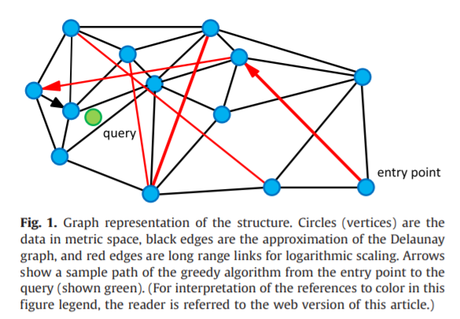
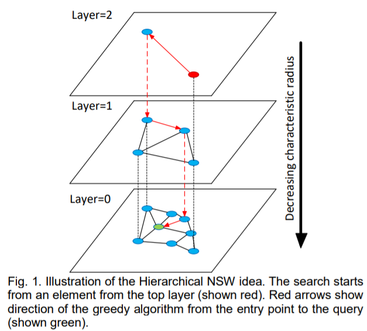

## AkNN(Approximate k-Nearest Neighbor Search)

- 검색 혹은 추천 시스템에서 아이템의 유사도를 측정하는 과정은 다음과 같다.
  - 아이템들을 벡터 공간에 임베딩한다.
    - collaborative filtering(협업 필터링) 등을 사용.
    - 벡터화 시킴으로써 특정 아이템들 사이의 거리를 계산할 수 있게 된다.
  - 아이템의 유사도를 측정할 기준을 정한다.
    - cosine similarity(코사인 유사도) 등을 사용
  - 정한 기준을 바탕으로 유사도를 측정한다.
    - n개의 아이템이 있을 때 한 아이템과 그 아이템을 제외한 n-1개의 아이템들 사이의 유사도를 비교한다.
    - 위와 같은 방식으로 유사도를 전부 계산하기 위해서는 `n*(n-1)/2` 번 계산해야 한다.
    - 계산 결과를 특정 공간에 저장할 때에도 마찬가지로 `n*(n-1)/2` 크기의 공간이 필요하다.

- approximate nearest neighbor search
  - 모든 아이템들의 유사도를 계산하는 것은 데이터의 크기와 비례하여 시간이 증가하게 된다.
  - 따라서 큰 데이터를 가지고 유사도 측정을 할 경우, 모든 아이템들을 전부 비교하는 것은 사실상 불가능하다.
  - 그러므로 정확도는 다소 떨어지더라도 보다 빠른 속도로 계산하는 방식이 필요한데 이를 연구하는 분야가 최근접 이웃 탐색(approximate nearest neighbor search)이다.

## Small World

- 밀그램의 [작은 세계] 실험
  - 실험 내용
    - 미국에서 A 주에 사는 160명을 대상으로 B주에 사는 사람에게 오직 지인만 거쳐서 소포를 전달하는 실험을 실행.
    - 중간 단계에 있는 수 많은 사람을 거쳐야 소포 전달이 완료될 것이라 예상.
    - 실제 실험 결과 평균 6명이 안되는 사람을 거치는 것 만으로 소포 배달이 완료되었다.
  - 시사점
    - 기존에 인간관계는 Regular Graph형태로 형성된다고 믿었으나, 이러한 믿음이 깨지게 되었다.
    - 그래서 사실 인간관계는 Random Graph 형태로 형성된다는 새로운 주장이 대두되었다.
    - 그러나, 실제 인간관계는 군집화(Clustering) 하는 경향이 강한데(같은 동네, 같은 학교, 같은 직장 등의 단위로), Random Graph는 이러한 현상을 설명하지 못한다.
    - 또한 실제 인관관계는 멱 법칙 분포를 따른다. 즉 소수의 사람이 다른 대부분의 사람보다 더 많은 관계를 맺고 살아간다.

- 사전지식
  - Clustering Coefficient(클러스터링 계수, C)
    - 노드들이 군집화한 정도를 나타낸다.
    - C가 0에 가까울수록 군집성이 낮은 것이고, 1에 가까울수록 군집성이 높은 것이다.
  - Diameter
    - Social Network에서 가장 긴 Social Distance의 길이(두 노드 사이의 엣지의 길이가 아닌 한 노드에서 다른 노드로 가기 위해 거쳐야 하는 엣지의 개수)
  - Length of Network(L)
    - 모든 social distance(한 노드에서 다른 노드로 가기 위해 거쳐야 하는 엣지의 개수)의 중간값. 일반적으로 그래프의 크기가 커지면 같이 커진다.
    - L이 크다는 것은 그만큼 느슨하게 연결되어 있다는 것을 뜻한다.
  - High clustering과 Low clustering
    - High clustering: 많은 노드들이 연결되어 있는 상태
    - Low clustering: 노드들 사이의 연결이 적은 상태
  - Regular Graph와 Random Graph
    - Regular Graph: 모든 노드가 동일한 차수를 가지는 그래프이다.
    - Random Graph: 특정한 규칙 없이 무선적으로 생성된 그래프를 말한다.
    - Reqular Graph는 클러스터링 계수가 높고, Diameter도 길다.
    - Random Graph는 클러스터링 계수가 낮고, Diameter도 짧다.

- Small World(좁은 세상, 작은 세상)
  - Network의 크기가 증가하는 속도보다 L이 증가하는 속도가 더 느린 형태의 네트워크를 말한다.
    - 즉 네트워크에 새로운 노드가 계속 추가 되어도 노드들 사이의 거리는 증가하지 않는 형태의 네트워크
    - 보통 증가비율이 Logarithm scale이면 small network라고 한다.
  - Small World는 Regular Graph와 Random Graph를 절충한 모델이다. 
    - 두 모델 모두 양극단에 치우친 모델이기에 현실 세계에 적용하기에는 무리가 있다.
    - 실제 세계는 Random Graph보다 훨씬 군집화 되어 있고(C가 높고), L이 크다(훨씬 ).
    - 실제 세계는 밀그램의 실험에서 알 수 있듯이, Regular Graph보다 Diameter가 작다.
  
  
  
  - C가 높을 때, 약간의 링크만 생겨도 금방 L이 작아지게 된다.
    - 예를 들어 A에서 F마을까지는 바로 가는 길이 없고, A, B, C, D, E를 거쳐야 F로 갈수 있다고 가정한다.
    - 이 때 A에서 E로 바로 가는 길이 생기면 2번 만에 F까지 도달이 가능하다.
    - 또한 기존에 3번에 걸쳐서 가야 했던 D도 두 번만에 갈 수 있게 된다.
  - 아래와 같은 그래프에서는 작은 세상 효과가 존재하지 않는다.
    - 체인
    - 사이클
    - 격자

## NSW

- 그래프 탐색에서의 그리디 알고리즘
  - 그래프 탐색에서 그리디 알고리즘이 항상 정확하게 동작(항상 정확한 결과를 반환)하려면 아래와 같은 조건이 필요하다.
  - 전체 그래프의 서브 그래프에 들로네 그래프를 포함해야 한다.

- 들로네 그래프와 보로노이 다이어그램
  - 들로네 삼각분할로 이루어진 그래프를 의미한다.
    - 들로네 삼각분할은 평면 위의 점들을 삼각형으로 연결하여 공간을 분리할 때, 어떤 삼각형의 외접원(삼각형의 세 점을 모두 지나는 원)이 그 삼각형의 세 꼭지점을 제외한 다른 어떤 점도 포함하지 않게 분할하는 것이다.
    - 들로네 삼각분할은 데이터 클러스터링에 사용한다.
    - 또한 각 노드가 모두 연결되도록 할 때에도 들로네 삼각분할을 사용하면 우회에 따른 이동거리의 증가를 최소화할 수 있다.
  - Voronoi tessellation(==보로노이 다이어그램)
    - 들로네 삼각분할과 보로노이 다이어그램은 서로 듀얼 이미지 관계에 있다.
    - 둘 중 어느 하나를 알면 다른 하나도 곧바로 구할 수 있다.
  - 들로네 -> 보르노이
    - 보로노이 다이어그램의 각 seed 점들을 가지고 들로네 삼각 분할을 구한다.
    - 구해진 삼각형들의 외접원들의 중심을 연결하면 보르노이 다이어그램이 나온다.
  - 보로노이 -> 들로네
    - 서로 인접한 보로노이 영역들간의 seed 점들을 연결하면 이 seed 점들에 대한 들로네 삼각분할을 얻을 수 있다.

- 그리디를 사용하여 그래프를 탐색할 때의 문제점
  - 들로네 그래프와 관련한 문제가 존재한다.
    - 거리 공간의 내부 구조(차원과 데이터의 분산도 등)에 대한 지식이 필요하다.
    - 차원의 저주의 영향을 받는다.
    - 차원의 저주: 데이터의 차원(dimension)이 높아질 수록 알고리즘의 실행이 아주 까다로워지는 일.
  - 무엇보다, 검색에 대한 정확한 결과가 필요하지 않다면, 굳이 사용할 필요가 없다.
    - 따라서 정확한 최근접 이웃을 찾는 문제는, 근사 최근접 이웃을 찾는 문제로 대체가 가능하다.
    - 이 경우 굳이 정확한 들로네 그래프가 필요하지 않다.
  - NSW는 들로네 그래프를 서브그래프로 갖지 않아도 그리디 탐색을 할 수 있게 한 그래프이다.
    - 정확히는 들로이 그래프와 유사한 그래프를 포함시켜 그리디 탐색을 가능하게 한 그래프이다.
    - short-range link(edge)들의 subset을 유사 들로이 그래프로 사용한다.
    - 멱법칙에 따라 무선적으로 생성된 long-range link들의 subset을 greedy search의 logarithmic scaling을 위해 사용하며, long-range link가 진입점에서 쿼리까지 더 빠르게 이동할 수 있도록 해준다.

- NSW(Navigable Small World graph)
  - MSW(Metricized Small World)라고도 부른다.
  - 그리디 검색 알고리즘의 로그 확장성을 지닌 그래프
    - 그래프 탐색에 변형시킨 그리디 알고리즘을 기반으로 한 k-NN 알고리즘을 사용한다.
    - 가장 가까운 노드로 greedy하게 이동했을 때, 노드 간의 거리가 평균적으로 log(N)에 가까운 그래프를 말한다.
    - 이러한 형식으로 그래프를 구성하면 쿼리 q와 거리가 가까운 노드를 빠르게 찾을 수 있게 된다.
  - NSW 생성 과정
    - 모든 엘리먼트를 연속적으로 추가하여 새로운 엘리먼트에 대해 들로네 그래프를 이용해 가까운 이웃을 찾아 해당 엘리먼트와 연결한다.
    - 엘리먼트들이 추가될 수록 short-range link 역할을 하던 엣지들이 long-range link가 되고, NSW를 생성한다.
  - 검색 과정
    - entry point(트리 순회를 시작하는 지점)부터 q(query)와 가장 가까운 미방문 노드로 이동한다.
    - q와 가장 가까운 노드에 도착하여 주변 노드들을 탐색해서 q와 가장 가까운 아이템을 찾는다.
    - Small World graph를 navigable하게(엣지가 없는 두 노드 사이를 이동 가능하게)만들어주는 것이 NSW다.

  

  - 조건
    - 쿼리 q와 가장 가까운 노드로 빠르게 이동해야 한다.
    - 가장 가까운 노드의 이웃들은 그 노드와 가장 가까운 노드들이어야 한다.
  
  - 한계
    - 다항 로그 시간 복잡도(poly(log *n*))를 지닌다.

## HNSW(Hierarchical Navigable Small World graph)

- HNSW

  - HNSW는 NSW를 계층적으로 구현함으로써 쿼리 q와 가장 가까운 노드로 빠르게 이동해야 한다는 문제를 해결했다.

  

  - HNSW는 다음과 같은 특징을 지닌다.
    - 각 노드의 최대 차수가 M보다 작아야 한다(M은 layer 마다 다를 수 있다).
    - 차수를 제한 시킴으로서(엣지의 수를 제한시킴으로서) 로그 스케일 복잡도를 보장한다.
    - 상위 layer에 존재하는 노드는 반드시 아래 layer에도 존재해야 한다.
    - layer 0에는 모든 노드가 존재한다.
    - 상위 layer일수록 노드가 적고 인접한 노드 사이의 거리가 길다(long-range links). 즉, 적은 hop(출발지에서 목적지 사이의 경유지) 수로 많은 거리를 이동할 수 있다.
    - 각 노드의 layer는 index가 생성될 때 랜덤하게 결정된다.
    - 높은 차원에서는 제대로 동작하지 않는다는 의견도 있다.
  - 탐색 과정
    - 최상위 layer에서부터 탐색(graph traverse) 시작
    - 현재 layer에서 query vector와 가장 인접한 노드로 이동
    - 현재 노드 보다 query vector와 더 가까운 노드가 없다면 하위 layer로 이동, 현재 노드가 다음 layer의 시작 노드가 된다.
    - 더 이상 query vector와 가까워 질 수 없을 때 까지 위 과정 반복
  - 예시
    - 42maru 본사에서 제주시청까지 가는  상황을 가정.
    - 인천국제공항에서 비행기를 타고 제주국제공항으로 이동한다(서울에서 인천은 제주도의 반대 방향이지만 결과적으로 비행기를 타면 더 빨리 갈 수 있다).
    - 제주국제공항에서 제주시청까지 가는 비행기는 없으므로 다음 교통 수단(layer)인 버스를 이용하여 제주시청 정류장까지 이동한다.
    - 제주시청 정류장에서 제주시청 내부로 가는 버스는 없으므로 다음 수단인 도보를 이용하여 제주시청 내부까지 이동한다.

## 참고

https://ita9naiwa.github.io/recommender%20systems/2019/10/04/hnsw.html

https://darkpgmr.tistory.com/96

https://brunch.co.kr/@kakao-it/300

https://arxiv.org/pdf/1904.02077.pdf

https://arxiv.org/ftp/arxiv/papers/1603/1603.09320.pdf

https://publications.hse.ru/mirror/pubs/share/folder/x5p6h7thif/direct/128296059

https://velog.io/@hamdoe/hnsw-algorithm

https://medium.com/vespa/approximate-nearest-neighbor-search-in-vespa-part-1-36be5f43b8d1

https://www.nature.com/articles/35022643

http://sanghyukchun.github.io/34/#34-2-smallworld

https://www.kth.se/social/upload/514c7450f276547cb33a1992/2-kleinberg.pdf

https://www.nature.com/articles/35022643