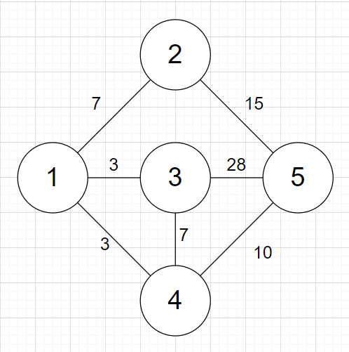
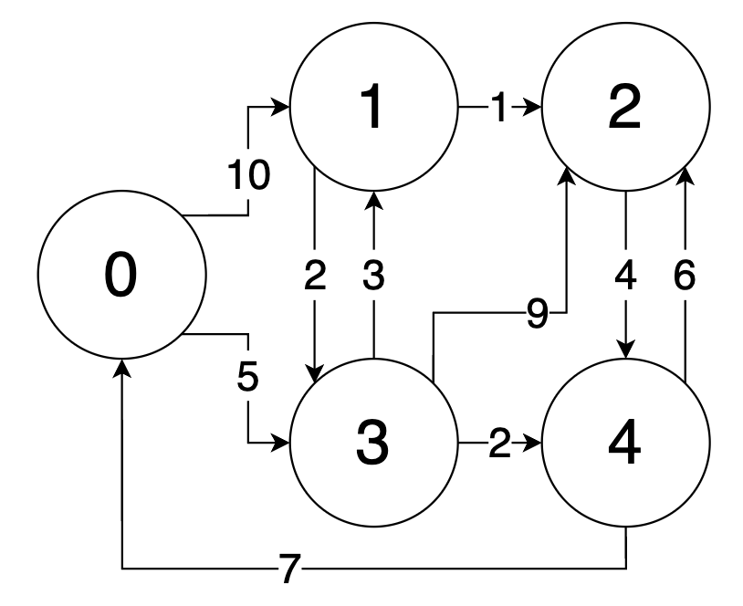

# Two Pointer

- two pointer
  - 배열에서 원래 이중 for문으로 O(N<sup>2</sup>)에 처리되는 작업을 2개 포인터의 움직임으로 O(N)에 해결하는 알고리즘
    - 완전 탐색으로 풀면 시간 초과가 나는 문제에 적용하면 풀리는 경우가 많다.
  - 종류
    - 앞에서 시작하는 포인터와 끝에서 시작하는 포인터가 만나는 형식
    - 동일한 지점에서 시작하여 빠른 포인터가 느린 포인터 보다 앞서가는 방식
  
  - 원리
    - Two pointer를 사용하지 않고, 이중 for문을 실행할 때는 아래와 같은 방식으로 실행된다.
    - i == 0일 때 j는 0~N-1만큼 반복된다.
    - i == 1일 때 j는 0~N-1만큼 반복된다.
    - 이 때, i == 0일 때 계산한 정보가 i == 1일 때 사용되지 않는다.
    - 그러나 two point의 경우 i == 0일 때 계산한 정보를 i == 1일 때 사용한다.
  - 유사한 알고리즘으로 슬라이딩 윈도우가 있다.


- 문제를 통해 확인하기

  - [백준 2230번 수 고르기](https://www.acmicpc.net/problem/2230)룰 통해 two pointer를 활용하는 방식을 살펴볼 것이다.
    - N개의 정수로 이루어진 수열이 있을 때, 이 수열에서 두 수를 골랐을 때(같은 수 일수도 있다), 그 차이가 M 이상이면서 제일 작은 경우를 구해야한다.
    - 예를 들어 수열이 [1, 2, 3, 4, 5]이고 M이 3이라면 1 4, 1 5, 2 5를 골랐을 때 그 차이가 M 이상이 된다. 이 중에서 차이가 가장 작은 경우는 1 4나 2 5를 골랐을 때의 3이 된다.
  - Two pointer를 사용하지 않고 이중 for문으로 풀기
    - 배열은 정렬되어 있다고 가정한다.
    - 아래 코드의 시간복잡도는 O(N<sup>2</sup>)이다.

  ```python
  nums = [1, 2, 3, 4, 5]
  M = 3
  N = len(nums)
  ans = float("inf")
  for i in range(N):
      for j in range(N):
          if nums[j] - nums[i] > M:
              ans = min(ans, nums[j] - nums[i])
  ```

  - Two pointer로 문제를 풀기 위한 전제
    - 배열은 정렬되어 있다.
    - 따라서 i의 값이 증가할 수록 `nums[j] - nums[i]`가 M 이상이 되는 최초의 j또한 증가한다.
    - 또한 문제에서 요구하는 것은 M 이상의 차이 중에서 최소이기 때문에, 최초의 j를 찾으면, 그 이후의 j는 확인하지 않아도 된다.
  - Two pointer를 사용하여 풀기
    - `st`, `ed`라는 two pointer를 사용하여 푼다.
    - `st`가 기존의 `i`와 같은 역할을, `ed`가 기존의 `j`와 같은 역할을 한다.
    - 먼저 각 `st`에 대해 `nums[ed]-nums[st]`가 M 이상이 되는 최초의 `ed`를 찾는다.
    - 최초의 `ed`를 찾았다면, `ed`를 더 증가시켜봤자 `nums[ed]-nums[st]`의 값이 커질뿐이기에 `ed`의 값을 더는 증가시키지 않아도 된다.
    - 이제 `st`를 증가시키면서 `nums[ed]-nums[st]`의 값이 더 작아지는지를 확인한다.
    - `st`를 증가시키면서 `nums[ed]-nums[st]`의 값이 M보다 작다면 다시 `ed`를 증가시킨다.
    - 이처럼 각 `st`에 대해 모든 `en`을 순회하는 것이 아니라, 이전의 `en` 값을 계속 가지고 있다가 사용하는 방법을 통해 O(N)에 해결이 가능하다.

  ```python
  nums = [1, 2, 3, 4, 5]
  M = 3
  N = len(nums)
  ed = 0
  ans = float("inf")
  for st in range(N):
      while ed < N and nums[ed] - nums[st] < M:
          ed += 1
      ans = min(ans, nums[ed] - nums[st])
  ```


- 슬라이딩 윈도우
  - 투 포인터와 유사하지만 고정된 사이즈 윈도우를 사용한다는 차이가 있다.
    - 또한 투 포인터의 경우 주로 정렬된 배열을 대상으로 하지만 슬라이딩 윈도우는 대상이 정렬되어있지 않아도 된다.
  - 본래 2개의 네트워크 호스트 간의 패킷 흐름을 제어하기 위한 방법을 지칭하는 용어이다.
    - 네트워크에서 패킷을 전송할 때 고정 사이즈의 윈도우가 옆으로 이동하면서 그 다음 패킷들을 전송하는 방식을 말한다.


# Deque와 우선순위 큐

- Deque(Double-Ended Queue, 데크, 덱)
  - 양쪽 끝에서 삽입과 삭제가 모두 가능한 자료형.
    - 일반적으로 이중 연결 리스트를 사용하여 구현한다.
  - Python의 경우 `collections` 모듈에서 `deque`로 지원한다.
  - 시간복잡도
    - 양쪽 끝에서의 삽입은 O(1).
    - 양쪽 끝에서의 삭제는 O(1).
    - 양쪽 끝의 원소 확인은 O(1).


- 우선순위 큐
  - 추출시 우선순위가 가장 높은 요소를 추출하는 자료형
    - 스택은 가장 나중에 들어간 요소가 먼저 추출되고, 큐는 가장 처음 들어간 요소가 먼저 추출된다.
    - 그러나 우선순위 큐는 특정 조건에따라 우선순위가 가장 높은 요소가 추출된다.
  - 시간복잡도(당연히 구현에 따라 달라지며, 아래는 힙을 사용했을 경우의 시간복잡도이다).
    - 원소의 추가는 O(lg N).
    - 우선순위가 가장 높은 요소의 확인은 O(1).
    - 우선순위가 가장 높은 요소의 추출은 O(lg N)


# Hash

> https://blog.encrypted.gg/1009

- 해시 함수
  - 임의 크기 데이터를 고정 크기 값으로 매핑하는 데 사용할 수 있는 함수를 말한다.
    - 고정 크기 값이 아닌 가변 크기 값으로 매핑하는 해시 함수도 있기는 하다.
    - 해시 함수를 사용하는 것을 해싱이라 하는데, 해싱은 정보를 가능한 빠르게 저장하고 검색하기 위해 사용하는 기법 중 하나다.
  - 해시
    - 해시 함수가 반환한 값을 hash value, hash code, digest, hash 등으로 부른다.
    - 이 값들은 일반적으로 hash table이라 부르는 고정 크기의 table의 index로 사용된다.
    - hash table을 indexing하기 위해서 hash function을 사용하는 것을 hashing 혹은 scatter storage addressing이라 부른다.
  - 버킷과 슬롯
    - 버킷과 슬롯은 table의 행과 열이라고 보면 된다.
    - 버킷이 해시값으로 이루어진 index이며, 하나의 버킷은 여러 개의 slot을 가질 수 있다.
  - 성능 좋은 해시함수들은 아래와 같은 특징을 가진다.
    - 해시 함수 값 출돌의 최소화
    - 쉽고 빠른 연산
    - 해시 테이블 전체에 해시 값이 균일하게 분포
    - 사용할 키의 모든 정보를 이용하여 해싱
    - 해시 테이블 사용 효율이 높을 것


- 해시 충돌

  - 해시 함수가 서로 다른 두 개의 입력값에 대해 동일한 출력값을 내는 상황을 의미한다.
    - 해시 함수를 이용하는 자료구조나 알고리즘의 효율성을 떨어뜨리므로, 해시 충돌이 자주 발생하지 않도록 구성되어야한다.
  - 예시
    - 인구 1만인 A국은 주민등록 번호와 주민을 mapping 시키려한다.
    - 주민번호는 0000000000부터 시작해서 9999999999까지 있을 수 있으며,  총 10자리라는 것 외에는 특별한 규칙이 없다.
    - 추가, 조회, 수정, 삭제가 가장 빠른 방법은 10의 10제곱 크기의 배열을 만들고 주민번호를 인덱스로 하여 관리하는 것이다.
    - 이 경우 추가, 조회, 삭제, 수정이 모두 index로 접근 가능하므로 O(1)에 해결이 가능하다.
    - 예를 들어 3548126771이라는 주민등록 번호에 김철수를 등록한다고 한다면 배열에서 3548126771번 인덱스에 해당하는 값을 김철수로 입력하기만 하면 된다.
    - 그러나 문제는 1만명의 정보를 저장하기 위해서 10의 10제곱 크기(100억)의 배열을 만드는 것이 너무 비효율적이라는 것이다.
    - 따라서 index기반 접근이라는 장점은 그대로 가져가면서, 메모리도 효율적으로 사용하기 위해 hash값을 사용하여 5자리로 축약한 주민 번호(5자리로 축약할 경우 필요한 배열의 길이는 100000)를 index로 사용하기로 한다.
    - 주민등록 번호를 hash 값으로 변환하는 hash 함수는 주민등록 번호의 앞 5자리만 떼는 방식으로 한다.
    - 이제 또 다른 문제가 발생한다.
    - 우리가 정의한 hash 함수는 앞의 5자리만을 떼므로, 앞의 5자리가 같으면 hash 함수는 모두 같은 값을 반환한다.
    - 예컨데 0000000000 ~ 0000099999는 모두 같은 hash값을 반환한다.
    - 이와 같은 상황을 hash 충돌이라 한다.
  - 해시 충돌의 발생을 막을 수 있는 방법은 없는가
    - 해시 함수의 목적 자체가 함수의 입력으로 주어지는 정의역의 공간이 너무 커서 이걸 바로 배열의 index로 활용할 수 없으니 범위를 줄이고자 하는데 있다.
    - 즉, 정의역의 범위에 비해 치역의 범위가 작으므로, 비둘기집 원리에 의해 해시 충돌이 발생하는 것 자체를 막을 수 있는 방법은 없다.

  - 비둘기집 원리(서랍 원리)
    - n개의 요소를 m개의 컨테이너에 넣을 때, n>m이라면 적어도 하나의 컨테이너에는 반드시 2개 이상의 요소가 들어가게 된다는 원리이다.
    - 1834년 독일의 수학자 페터 디리클레(Peter Dirichlet)가 만들었다.

  - 생일 문제(Birthday Problem)
    - 생일의 수는 윤년이 아니라고 가정하면 365개이다.
    - 비둘기집 원리를 생각해보면 366명 이상이 모여야 해시 충돌이 일어날 것 같지만, 실제로는 그렇지 않다.
    - 비둘기집 원리는 366명 이상이면 **반드시** 해시 충돌이 발생함을 보여줄 뿐이다.
    - 같은 생일이 존재할 확률은 23명만 모여도 50%를 넘고, 57명이 모이면 99%를 넘어선다.
    - 즉, 해시 충돌은 생각보다 쉽게 일어날 수 있다.


- 로드 팩터(Load Factor, 부하계수, 적재율)
  - 로드 팩터는 해시 테이블에 저장된 데이터 개수 n을 해시 테이블 크기 k로 나눈 것(n/k)이다.
    - 로드 팩터가 증가할수록 해시 충돌 확률이 높아지므로, 해시 테이블의 성능은 감소하게 된다.
  - 로드 팩터 비율에 따라 해시 함수를 재작성해야할지, 해시 테이블의 크기를 조정해야 할지를 결정한다.
  - Java 10에서는 해시맵의 디폴트 로드 팩터를 0.75로 설정했다.
    - 시간과 공간 비용의 절충안이었다.


## 해시 충돌 발생시 회피 기법

> https://blog.encrypted.gg/1009

- 해시 충돌 발생시 회피하는 방법
  - 해시 충돌을 회피하는 것을 불가능하다.
  - 따라서 해시 충돌 차제를 회피하는 방법이 아니라 해시 충돌이 발생했을 때 이를 우회하는 방법이 필요하다.


- Chaining

  - 연결 리스트로 한 버킷 내의 데이터들을 연결하는 방식이다.

    - 각 버킷마다 연결 리스트를 하나씩 만든다.
    - 그리고 삽입이 발생하면 해당 인덱스에 해당하는 연결 리스트의 head에 해시 전 값과 함께 mapping할 값을 추가한다.

  - 예시

    - 예를 들어 기존 방식이 아래 표와 같았다면(일반적으로 해시값을 행으로 그리지만 편의를 위해 열로 그린다)

      | 00000  | 00001 | 00002  | ...  | 99999  |
      | ------ | ----- | ------ | ---- | ------ |
      | 김철수 |       | 이영희 |      | 최길동 |

    - 이제는 hash 전 값과 함께 저정한다.

      | 00000              | 00001 | 00002              |      | 99999              |
      | ------------------ | ----- | ------------------ | ---- | ------------------ |
      | head               |       | head               |      | head               |
      | 0000001789, 김철수 |       | 0000206487, 이영희 |      | 9999912173, 최길동 |

    - 그리고 동일한 값이 추가될 경우 연결 리스트의 head에 추가한다.

      | 00000              | 00001 | 00002              | ...  | 99999              |
      | ------------------ | ----- | ------------------ | ---- | ------------------ |
      | head               |       | head               |      | head               |
      | 0000001789, 김철수 |       | 0000298754, 박영구 |      | 9999912173, 최길동 |
      |                    |       | 0000206487, 이영희 |      |                    |

    - 만일 주민번호가 0000206487인 사람을 해시 테이블에서 제거하려 한다면 먼저 00002 버킷으로 이동한 뒤, 연결 리스트의 첫 번째 값부터 탐색을 시작하여, 0000206487를 찾을 때 까지 탐색을 계속한 후 찾으면 삭제한다.

    - 수정, 조회 역시 마찬가지다.

  - 시간복잡도

    - 삽입의 경우 연결 리스트의 head에 추가하므로 O(1)이다.
    - 최악의 경우 모든 데이터가 하나의 버킷에 전부 들어가 있을 수 있으므로 삭제, 탐색의 시간복잡도는 O(n)이다.


- Open Addressing

  - 해시 충돌이 일어나면 다른 버킷에 데이터를 삽입한다.

    - Chaining과 마찬가지로 해시 전 값과 mapping할 data를 함께 저장한다.

  - 삽입 예시

    - 0000100000를 삽입한다.

      | 00000 | 00001              | 00002 | 00003 | 00004 | ...  | 99999 |
      | ----- | ------------------ | ----- | ----- | ----- | ---- | ----- |
      |       | 0000100000, 김철수 |       |       |       |      |       |

    - 0000100001을 삽입하려 하는데 00001은 이미 차있으므로, 한 칸 뒤인 00002에 삽입한다.

      | 00000 | 00001              | 00002              | 00003 | 00004 | ...  | 99999 |
      | ----- | ------------------ | ------------------ | ----- | ----- | ---- | ----- |
      |       | 0000100000, 김철수 | 0000100001, 박철수 |       |       |      |       |

    - 0000200000을 삽입하려는데 00002는 이미 차있으므로, 한 칸 뒤인 00003에 삽입한다.

      | 00000 | 00001              | 00002              | 00003             | 00004 | ...  | 99999 |
      | ----- | ------------------ | ------------------ | ----------------- | ----- | ---- | ----- |
      |       | 0000100000, 김철수 | 0000100001, 박철수 | 000020000, 이철수 |       |      |       |

    - 0000100002를 삽입하려는데, 00001은 이미 차 있으므로, 한 칸 뒤로 간다. 그런데 00002, 00003모두 차 있으므로 00004에 저장한다.

      | 00000 | 00001              | 00002              | 00003             | 00004              | ...  | 99999 |
      | ----- | ------------------ | ------------------ | ----------------- | ------------------ | ---- | ----- |
      |       | 0000100000, 김철수 | 0000100001, 박철수 | 000020000, 이철수 | 0000100002, 최철수 |      |       |

  - 조회 예시

    - 삽입 예시의 최종 hash table에서 0000100002가 누구의 주민등록번호인지를 찾으려 한다.
    - 우선 00001 이 가리키는 값을 확인해보는데, 0000100002와 다르다.
    - 뒤로 밀린 것일 수 있으므로, 00002, 00003을 거치며 다음 칸을 쭉 순회하며 확인하다 00004에 저장된 값을 찾아낸다.
    - 만일 0000100003을 찾으려 한다면 역시 마찬가지로 00001부터 쭉 순회하며 찾다가 00005가 비어있음을 확인함과 동시에 0000100003이 존재하지 않음이 확실시 되고 탐색이 종료된다.

  - 삭제 예시

    - 0000100001을 지우려 한다.

    - 위에서 살펴본 방식으로 조회하여 00002에 저장되었다는 것을 찾을 수 있고, 이 값을 삭제한다.

      | 00000 | 00001              | 00002 | 00003             | 00004              | ...  | 99999 |
      | ----- | ------------------ | ----- | ----------------- | ------------------ | ---- | ----- |
      |       | 0000100000, 김철수 |       | 000020000, 이철수 | 0000100002, 최철수 |      |       |

    - 이 때, 000020000을 찾으려 한다고 가정해보자.

    - 우선 00002를 볼 것인데, 00002가 가리키는 값은 이전에 삭제되었으므로, 빈 칸인 상태이다.

    - 따라서 00003에 0000200000가 존재함에도 불구하고, 없다고 판단하고 탐색이 종료된다.

    - 이와 같은 문제를 해결하기 위해서 삭제한 후 삭제한 칸에 dummy data를 두던가 하는 방식으로 원래 값이 있었지만 지금은 삭제되었다는 표시를 해줘야한다.

    - 탐색시에는 삭제 표시가 있다면 다음 값을 계속 탐색하고, 삽입 시에는 삭제 표시가 있다면 삭제 표시를 지우고 값을 삽입하는 식으로 사용해야한다.

  - Probing

    - 충돌 발생시 충돌한 값을 어디에 넣을 것인지에 대한 정책이다.
    - Linear probing은 충돌 발생시 바로 다음 칸에 넣는 방식으로, 구현이 간단하고, 인접한 공간에 저장하므로 cache hit rate이 높다는 장점이 있지만, clustering 된다는 단점이 있다.
    - Quadratic probing은 충돌이 발생하면 1, 4, 9, ... 칸씩 제곱만큼 이동시켜 저장하는 방식으로 clustering이 linear probing보다 덜 하다는 장점이 있지만, cache hit rate이 낮다는 단점이 있다.
    - Double hashing은 해시 함수를 하나 더 둬서 충돌이 발생했을 때 어디에 저장할지를 추가 해시 함수의 값으로 계산하는 방식으로, clustering이 보다 덜 하지만, cache hit rate이 낮다는 단점이 있다.


- 두 방식의 비교

  > http://egloos.zum.com/sweeper/v/925740

  - Chaining의 장점
    - 상대적으로 간단한 방식으로 구현이 가능하다.
    - Clustering의 영향을 거의 받지 않으므로 해시 함수 구현시 충돌의 최소화만 살펴보면 된다. 반면에 open-addressing은 clustering의 영향을 받으므로 해시 함수를 구현할 때 clustering도 최소화시켜야한다.
    - Hash table이 채워져도(load factor가 증가해도) 성능 저하가 linear하게 발생한다. 반면에 open-addressing 방식은 load factor가 일정 값을 넘어가기 시작하면 성능저하가 급격히 증가하기 시작한다.
  - Open-Addressing의 장점
    - Chaining과 달리 추가적인 작업 공간(연결 리스트)를 필요로 하지 않기에, 추가적인 메모리 할당이 불필요하다.
    - 일반적으로 linear probing의 성능이 chaining에 비해 좋긴 하지만, load factor가 0.8에 근접하면 급격한 성능 저하가 발생한다.
  - 결론
    - Open-Addressing의 경우 data의 크기가 작고 예측 가능할 때 사용하는 것이 좋다.
    - Chaining은 높은 load factor가 예상되거나, data의 크기가 크거나 가변적일 때 사용하는 것이 좋다.


- 언어별 해시 테이블 구현 방식

  > 파이썬 알고리즘 인터뷰, 박상길/정진호, 책만, 2020

  - Python의 dictionary와 set은 hash table로 구현되었다.
  - Python의 dictionary는 open-addressing 방식으로 구현되었다.
    - CPython의 dictionary 소스 코드에는 chaining시 malloc으로 메모리를 할당하는 오버헤드가 높아 open-addressing을 선택했다는 [주석](https://hg.python.org/cpython/file/52f68c95e025/Objects/dictobject.c#l297)이 달려있다.
  - Modern language들의 일반적인 경향은 다음과 같다.
    - Load factor가 작을 경우 chaining보다 좋은 성능을 보이는 open-addressing을 채택하되, load factor를 낮게 설정한다.
    - 만일 load factor가 설정값을 초과할 경우 hash table을 resize한다.
    - 이를 통해 open-addressing의 성능을 취하면서, 안정적으로 활용할 수 있도록 한다.
  - 언어별 해시 테이블 구현
  
  | 언어   | 방식                               |
  | ------ | ---------------------------------- |
  | C++    | Chaining                           |
  | Java   | Chaining                           |
  | Go     | Chaining                           |
  | Ruby   | Open-Addressing(load factor: 0.5)  |
  | Python | Open-Addressing(load factor: 0.66) |
  


# 그래프

- 그래프

  > 파이썬 알고리즘 인터뷰, 박상길, 정진호, 책만

  - 그래프 이론에서 그래프란 객체의 일부 쌍들이 연관되어 있는 객체 집합 구조를 말한다.
  - 그래프 이론의 시작
    - 1700년대 프로이센 공국의 쾨니히스베르크(현재는 러시아의 칼리닌그라드)에는 프레겔 강이 흐르고 있었는데, 이 강에는 2개의 큰 섬이 있었고, 섬과 도시를 연결하는 7개의 다리가 놓여 있었다.
    - 어느날 한 시민이 이 7개의 다리를 한 번씩만 건너서 모두 지나갈 수 있을지에 대한 문제를 냈다.
    - 오일러는 이 문제를 두고 오래 고민했으나, 기존의 기하학으로는 풀 수 없음을 깨달았고, 이것이 그래프 이론의 시작이 됐다.
  - 오일러 경로
    - 오일러는 7개의 다리에 a~g라는 이름을 부여하고, 강으로 서로 구분 된 4개의 영역을 도식화했는데, 이 도식은 현재 그래프 구조의 원형이 되었다.
    - 현대에는 강으로 서로 구분 된 4개의 영역을 정점(Vertex), 구분 된 영역을 잇는 7개의 다리를 간선(Edge)라 부른다.
    - 오일러는 모든 정점이 짝수 개의 차수(Degree)를 갖는다면 모든 다리를 한 번씩만 건너서 도달하는 것이 성립한다고 주장했다.
    - 1873년, 독일의 수학자 칼 히어홀저가 이를 수학적으로 증명해내는데, 이를 오일러의 정리라 부른다.
    - 모든 간선을 한 번씩 방문하는 유한 그래프를 오일러 경로라 부르며, 이를 활용한 놀이로 한붓 그리기가 있다.
    - 사족으로 쾨니히스베르크의 다리는 모든 정점이 짝수 개의 차수를 갖지 않으므로, 오일러 경로가 아니다.
  - 해밀턴 경로
    - 각 정점을 한 번씩 방문하는 무향 또는 유향 그래프를 말한다.
    - 오일러 경로와의 차이점은 오일러 경로는 간선을 기준으로 하는데 반해, 해밀턴 경로는 정점을 기준으로 한다는 것이다.
    - 이러한 단순한 차이에도 불구하고, 해밀턴 경로를 찾는 문제는 최적 알고리즘이 없는 대표적인 NP-완전(complete) 문제다.
    - NP-완전 문제란 NP 문제 중 NP-난해(hard)인 문제를 NP-완전 문제라 부른다.
  - 해밀턴 순환
    - 원래의 출발점으로 돌아오는 경로는 특별히 해밀턴 순환이라 하는데, 이중에서도 최단 거리를 찾는 문제는 알고리즘 분야에서 외판원 문제(Travelling Salesman Problem, TSP)로도 유명하다.
    - 외판원 문제란 각 도시를 방문하고 돌아오는 가장 짧은 경로를 찾는 문제, 최단 거리인 해밀턴 순환 거리를 찾는 문제이며, NP-난해 문제로 이론 컴퓨터과학 분야의 매우 중요한 문제 중 하나이기도 하다.
  - 차수(degree)
    - 무방향 그래프에서 차수란 각 정점에 대해서 간선으로 연결된 이웃한 정점의 개수를 말한다.
    - 방향 그래프에서는 차수가 outdegree와 indegree 두 개로 나뉘는데, outdegree는 정점에서 다른 정점으로 가는 간선의 개수, indegree는 다른 정점에서 정점으로 오는 간선의 개수이다.
  - 루프(loop)
    - 한 정점에서 같은 정점으로 돌아오는 간선을 loop라 부른다.
    - cycle과는 다른데, cycle은 다른 정점을 거쳐 다시 시작 정점으로 돌아올 수 있는지와 관련이 있지만, 루프는 자기 자신에서 출발한 간선이 자기 자신을 가리키는 것이다.


- 그래프의 종류

  - 무방향 그래프(Undirected Graph)와 방향 그래프(Directed Graph)
    - 그래프의 간선에는 방향이 있을 수 있는데, 방향성이 있는 것을 무방향 그래프, 없는 것을 방향 그래프라한다.

  - 순환 그래프(Cyclic Graph)와 비순환 그래프(Acyclic Graph)
    - 임의의 한 점에서 출발해 자기 자신으로 돌아올 수 있는 경로를 cycle이라 한다.
    - 그래프 안에 cycle이 하나라도 있으면 순환 그래프라 하고, 하나도 없으면 비순환 그래프라 한다.

  - 완전 그래프(Complete Graph)와 연결 그래프(Connected Graph)
    - 모든 정점이 서로 다른 정점들과 모두 연결되어 있는 그래프를 완전 그래프라 한다.
    - 임의의 두 정점 사이에 경로가 항상 존재하는 그래프를 연결 그래프라 한다(즉 연결되어 있지 않은 정점이 없는 그래프이다).

  - 단순 그래프(Simple Graph)
    - 두 정점 사이의 간선이 1개 이하이고 루프가 존재하지 않는 그래프를 단순 그래프라 부른다.


- 그래프 구현

  - 그래프 구현 방식에는 인접 행렬 방식(Adjacency Matrix)와 인접 리스트(Adjacency List)라는 두 가지 방식이 있다.
  - 그래프 예시

  

  - 인접 행렬 방식
    - Python의 list로 구현이 가능하다.
    - 중첩 list의 형태로 구현하는데, 외부 list의 index가 정점, 내부 리스트의 index가 또 다른 정점이 된다.
    - 즉 외부 list의 인덱스를 i, 내부 list의 인덱스를 j라 했을 때, `list[i][j]`에 특정 값(아래 예시에서는 `1`)이 있다면, i노드와 j 노드 사이에 간선이 있는 것이다.

  ```python
  v, e = 6, 7
  
  edges = [
      [1, 2], [1, 5], [2, 3], [2, 5],
      [3, 4], [4, 5], [4, 6]
  ]
  
  # 무향 그래프의 구현
  graph = [[0] * (v + 1) for _ in range(v + 1)]
  for i in range(e):
      vertex, another_vertex = edges[i]
      graph[vertex][another_vertex] = 1
      graph[another_vertex][vertex] = 1
  
  for i in range(e):
      print(graph[i])
  
  print("-"*100)
  # 유향 그래프 구현
  graph = [[0] * (v + 1) for _ in range(v + 1)]
  for i in range(e):
      vertex, another_vertex = edges[i]
      graph[vertex][another_vertex] = 1
  
  for i in range(e):
      print(graph[i])
  ```

  - 인접 리스트 방식
    - Python의 dictionary를 사용하여 구현이 가능하다(list를 사용해도 구현이 가능하긴 하다).
    - 출발 노드를 key로, 도착 노드를 value로 표현한다.

  ```python
  v, e = 6, 7
  
  edges = [
      [1, 2], [1, 5], [2, 3], [2, 5],
      [3, 4], [4, 5], [4, 6]
  ]
  
  # 유향 그래프
  graph = {i: [] for i in range(1, v + 1)}
  for edge in edges:
      graph[edge[0]].append(edge[1])
  
  for vertex, adjacent_vertices in graph.items():
      print(vertex, adjacent_vertexes)
  
  print("-"*100)
  # 무향 그래프
  graph = {i: [] for i in range(1, v + 1)}
  for edge in edges:
      graph[edge[0]].append(edge[1])
      graph[edge[1]].append(edge[0])
  
  for vertex, adjacent_vertices in graph.items():
      print(vertex, adjacent_vertexes)
  ```

  - 인접 리스트 방식(list로 구현)

  ```python
  # 유향 그래프
  adjacency_list = [[] for _ in range(v+1)]
  for edge in edges:
      adjacency_list[edge[0]].append(edge[1])
  
  for i in range(1, v+1):
      print(i, adjacency_list[i])
  
  
  # 무향 그래프
  adjacency_list = [[] for _ in range(v+1)]
  for edge in edges:
      adjacency_list[edge[0]].append(edge[1])
      adjacency_list[edge[1]].append(edge[0])
  
  for i in range(1, v+1):
      print(i, adjacency_list[i])
  ```

  - 두 방식의 비교

    > https://blog.encrypted.gg/1016

    - V는 정점의 개수, E는 간선의 개수를 의미한다.
    - deg(x)는 정점 x의 차수를 의미한다.

  |                                | 인접 행렬                                                    | 인접 리스트                                                  |
  | ------------------------------ | ------------------------------------------------------------ | ------------------------------------------------------------ |
  | 공간복잡도                     | O(V<sup>2</sup>)                                             | O(V+E)                                                       |
  | 정점 u, v의 연결 여부 확인     | O(1)                                                         | O(min(deg(u), deg(v)))                                       |
  | 정점 v와 연결된 모든 정점 확인 | O(V)                                                         | O(deg(v))                                                    |
  | 효율적인 상황                  | 두 점의 연결 여부를 자주 확인할 때, E가 V<sup>2</sup>에 가까울 때 | 특정 정점에 연결된 모든 정점을 자주 확인할 때, E가 V<sup>2</sup>보다 훨씬 작을 때 |

  


- 그래프 순회(Graph Traversals)
  - 그래프 탐색(Graph Search)이라고도 불리며, 그래프의 각 정점을 방문하는 과정을 말한다.
  
  - 크게 깊이 우선 탐색(Depth-First Search, DFS)과 너비 우선 탐색(Breadth-Fisrt Search, BFS)이 있다.
    - 일반적으로 DFS가 BFS에 비해 더 널리 쓰인다.
    
    - DFS는 시작 node에서 다음 분기(branch)로 넘어가기 전에 해당 분기를 완전하게 탐색하는 방법이다.
    - 이를 위해서는 가장 최근에 탐색한 node를 먼저 처리해야 하는데, stack의 LIFO 속성과 일치하여 stack을 사용하여 구현한다.
    - BFS는 시작 노드에서 인접한 노드들을 순차적으로 탐색하는 방법이다.
    - 이를 위해서는 현재 node와 가까운 순서대로 처리해야 하는데, queue의 FIFO 속성과 일치하여 queue를 사용하여 구현한다.


- 그래프 순회 구현

  - 우선 그래프를 Python의 dictionary로 표현한다.
    - `1:[2,3,4]`는 1번 정점에서 2,3,4번 정점으로 가는 간선이 있다는 의미이다.

  ```python
  graph = {
      1:[2,3,4],
      2:[5],
      3:[5],
      4:[],
      5:[6,7],
      6:[],
      7:[3]
  }
  ```

  - DFS 구현(재귀)
    - 스택을 활용한 방식보다 간단하게 구현이 가능하다.
    - 재귀 호출이 stack의 역할을 하게 된다.
  
  ```python
  def recursive_dfs(vertex, discovered=[]):
      discovered.append(vertex)
      for adjacent_vertex in graph[vertex]:
          if adjacent_vertex in discovered:
              continue
          else:
              recursive_dfs(adjacent_vertex, discovered)
      return discovered
  
  
  graph = {
      1: [2, 3, 4],
      2: [5],
      3: [5],
      4: [],
      5: [6, 7],
      6: [],
      7: [3]
  }
  
  start_vertex = 1
  print(recursive_dfs(start_vertex))	# [1,2,5,6,7,3,4]
  ```
  
  - DFS 구현(스택)
    - 재귀에 비해 직관적이고 실행 속도더 더 빠르다.
  
  ```python
  graph = {
      1: [2, 3, 4],
      2: [5],
      3: [5],
      4: [],
      5: [6, 7],
      6: [],
      7: [3]
  }
  
  start_vertex = 1
  stack = [start_vertex]
  discovered = []
  while stack:
      vertex = stack.pop()
      if vertex not in discovered:
          discovered.append(vertex)
          for adjacent_vertex in graph[vertex]:
              stack.append(adjacent_vertex)
  
  print(discovered)	# [1,4,3,5,7,6,2]
  ```
  
  - 재귀로 구현한 것과 반복문으로 구현한 것의 순회 순서가 다르다.
    - 반복문으로 구현하는 경우 `#1`, `#2`와 같이 인접한 모든 정점을 일단 stack에 넣고 다음 순회를 시작하기에 이런 차이가 발생한다.
    - 즉, 엄밀히 말하자면 일반적인 DFS와는 차이가 있다.
    - 따라서 DFS의 개념을 보다 명확히 요구하는 경우 반복문으로 DFS를 구현해선 안 된다.
  
  - BFS 구현
    - DFS와는 달리 재귀를 통해 구현할 수는 없다.
  
  ```python
  graph = {
      1: [2, 3, 4],
      2: [5],
      3: [5],
      4: [],
      5: [6, 7],
      6: [],
      7: [3]
  }
  
  start_vertex = 1
  discovered = [start_vertex]
  queue = [start_vertex]
  while queue:
      vertex = queue.pop(0)
      for adjacent_vertex in graph[vertex]:
          if adjacent_vertex not in discovered:
              discovered.append(adjacent_vertex)
              queue.append(adjacent_vertex)
  
  print(discovered)	# [1,2,3,4,5,6,7]
  ```


# 최단 경로 문제

- 최단 경로 문제
  - 각 간선의 가중치 합이 최소가 되는 두 정점 사이의 경로를 찾는 문제.
  - 지도 상의 한 지점에서 다른 지점으로 갈 때 가장 빠른 길을 찾는 것과 비슷한 문제다.
  - 그래프의 종류와 특성에 따라 최적화된 다양한 알고리즘이 존재한다.
    - 대표적으로 아래와 같은 알고리즘이 있다.
    - 플로이드(Floyd) 알고리즘
    - 다익스트라(Dijkstra) 알고리즘


## 플로이드 알고리즘

- 플로이드 알고리즘

  - 그래프에서 모든 정점 쌍 사이의 최단거리를 구하는 알고리즘이다.
    - 방향 그래프, 무방향 그래프에서 모두 잘 동작하며, 가중치(비용, 간선의 값)가 음수라도 잘 동작한다.
    - 다만, 가중치가 음수인데 cycle이 있는 경우 문제가 생길 수 있다.
  - 예시 그래프

  

  - 위와 같은 그래프를 표로 표현하면 다음과 같이 표현할 수 있다.
    - 무방향 그래프이기에 아래와 같이 표현된다.
    - 이 테이블을 중간에 다른 정점을 거치지 않았을 때, 정점 A에서 정점 B로 가는 최단거리 테이블이라고도 볼 수 있다.

  |      | 1    | 2    | 3    | 4    | 5    |
  | ---- | ---- | ---- | ---- | ---- | ---- |
  | 1    | 0    | 7    | 3    | 3    | ∞    |
  | 2    | 7    | 0    | ∞    | ∞    | 15   |
  | 3    | 3    | ∞    | 0    | 7    | 28   |
  | 4    | 3    | ∞    | 7    | 0    | 10   |
  | 5    | ∞    | 15   | 28   | 10   | 0    |

  - 이제 중간에 다른 정점을 거치지 않았거나 1번 정점 단 하나만 거쳤을 때의 최단거리는 아래와 같이 된다.
    - 아래 테이블 D에서 s에서 t로 갈 때 1번 정점을 거쳐가는 최단 거리는 `D[s][1] + D[1][t]`이다.
    - 이는 `s에서 1까지의 최단경로 + 1에서 t까지의 최단 경로`를 의미한다.
    -  따라서 각 s, t에 대해 현재 최단 경로 `D[s][t]`보다 `D[s][1] + D[1][t]`가 작을 경우, 즉 1번 정점을 거쳐가는 것이 빠를 경우에만 `D[s][t]`를 `D[s][1] + D[1][t]`로 교체해준다.
    - 예를 들어 기존에 3에서 4로 가는 최단거리 `D[3][4]`는 7이었다.
    - 그런데 7보다 `D[3][1] + D[1][4]`(3+3)이 더 작으므로 `D[3][4]`를 `D[3][1] + D[1][4]`, 즉 6으로 교체해준다.
    - 붉은 색으로 표시된 것들이 새로 갱신 된 구간들이다.

  |      | 1    | 2                                 | 3                                 | 4                                 | 5    |
  | ---- | ---- | --------------------------------- | --------------------------------- | --------------------------------- | ---- |
  | 1    | 0    | 7                                 | 3                                 | 3                                 | ∞    |
  | 2    | 7    | 0                                 | <span style="color:red">10</span> | <span style="color:red">10</span> | 15   |
  | 3    | 3    | <span style="color:red">10</span> | 0                                 | <span style="color:red">6</span>  | 28   |
  | 4    | 3    | <span style="color:red">10</span> | <span style="color:red">6</span>  | 0                                 | 10   |
  | 5    | ∞    | 15                                | 28                                | 10                                | 0    |

  - 마찬가지로 방식으로 2번 정점에 적용하면 최단거리는 아래와 같이 된다.
    - 이는 중간에 다른 정점을 거치지 않았거나 1, 2번 정점만을 거쳤을 때의 최단거리이다.
    - 예를 들어 5에서 3으로 가는 거리의 경우 5에서 2와 1일을 거쳐 3으로 가는 거리가 최단 거리가 된다. 

  |      | 1                                 | 2    | 3                                 | 4    | 5                                 |
  | ---- | --------------------------------- | ---- | --------------------------------- | ---- | --------------------------------- |
  | 1    | 0                                 | 7    | 3                                 | 3    | <span style="color:red">22</span> |
  | 2    | 7                                 | 0    | 10                                | 10   | 15                                |
  | 3    | 3                                 | 10   | 0                                 | 6    | <span style="color:red">25</span> |
  | 4    | 3                                 | 10   | 6                                 | 0    | 10                                |
  | 5    | <span style="color:red">22</span> | 15   | <span style="color:red">25</span> | 10   | 0                                 |

  - 위와 같은 방식을 통해 5번 정점까지 진행하면 아래와 같이 된다.
    - 결국 아래 표는 모든 정점을 거친 경우를 고려한 최단거리가 된다.

  |      | 1    | 2    | 3    | 4    | 5    |
  | ---- | ---- | ---- | ---- | ---- | ---- |
  | 1    | 0    | 7    | 3    | 3    | 13   |
  | 2    | 7    | 0    | 10   | 10   | 15   |
  | 3    | 3    | 10   | 0    | 6    | 16   |
  | 4    | 3    | 10   | 6    | 0    | 10   |
  | 5    | 13   | 15   | 16   | 10   | 0    |

  - 시간복잡도
    - 정점이 V개라고 할 때, V번의 단계에 걸쳐 갱신이 일어나고, 매 k번째 단계 마다 V<sup>2</sup>개의 `D[s][t]`를 `D[s][k] + D[k][s]`와 비교하므로 시간복잡도는 O(V<sup>3</sup>)이다.
  
  - 구현시 주의사항
    - 최단 거리 테이블을 구현할 때, 두 정점 사이의 직접적인 간선이 없을 경우 해당 간선의 가중치를 조건상 나올 수 있는 가중치의 최대값 보다 크게 초기화하는 방식을 사용한다.
    - 최단 거리 테이블 자체가 `D[s][t]`와 `D[s][k]+D[k][t]` 중 최소값을 구하는 방식으로 갱신 되기 때문에 0으로 둘 수 없기 때문이다.
    - 이 때, 초기화 할 값은 단순히 가중치의 최댓값 보다 커서는 안 되며, 두 간선 사이의 가중치의 총 합의 최대치 보다 커야한다.
    - 예를 들어 가중치의 최대값이 5라고 하더라도 두 간선 사이 가중치의 합은 가중치의 최대값보다 커질 수 있다.
    - 따라서 최대값을 `(정점의 개수 - 1) * 가중치의 최대값`으로 설정하거나 아예 매우 큰 값으로 설정해야한다.
  
  ```python
  """
  간선 사이 가중치의 최대값은 5라고 할 때
  3
  2
  1 2 5
  2 3 1
  """
  N = int(input())
  M = int(input())
  # 간선 사이의 최대값이 5이므로, 최대 가중치를 6으로 하여 테이블을 초기화한다.
  MAX_COST = 6
  graph = [[MAX_COST] * (N + 1) for _ in range(N + 1)]
  
  for _ in range(M):
      st, ed, cost = map(int, input().split())
      graph[st][ed] = min(cost, graph[st][ed])
  
  for i in range(1, N+1):
      for j in range(1, N+1):
          if i == j:
              graph[i][j] = 0
  
  for k in range(1, N + 1):
      for s in range(1, N + 1):
          for t in range(1, N + 1):
              if graph[s][t] > graph[s][k] + graph[k][t]:
                  graph[s][t] = graph[s][k] + graph[k][t]
  
  for i in range(1, N + 1):
      for j in range(1, N + 1):
          # 실제 값은 6인데, 0으로 변경되게 된다.
          if graph[i][j] == MAX_COST:
              graph[i][j] = 0
          print(graph[i][j], end=" ")
      print()
  
  """
  # 위 코드로 출력된 오답
  0 5 0 
  0 0 1 
  0 0 0
  
  # 정답
  0 5 6 
  6 0 1 
  6 6 0 
  """
  ```
  
  - `D[s][t]`와 `D[t][s]` 모두 최대값으로 설정한 값이 아닌 갱신된 값이 있다는 것은 t와 s 사이에 사이클이 있다는 말이다.


- 플로이드 알고리즘의 경로 복원 방법

  - 위에서는 플로이드 알고리즘을 통해 어떻게 각 정점 사이의 최단거리를 구할 수 있는지를 살펴봤다.

    - 그러나 한 정점에서 다른 정점으로 갈 때 어떤 정점들을 거쳐서 가야 최단거리로 갈 수 있는지는 알 수 없다.

  - 경로 복원을 위해서는 최단 경로 테이블 외에 하나의 테이블이 더 필요하다.

    - 최단 거리 테이블 이외에 하나의 테이블(nxt)을 더 만들어 최단 거리 테이블을 갱신할 때 함께 갱신해준다.
    - 아래와 같은 최단 거리 테이블이 있을 때

    |      | 1    | 2    | 3    | 4    | 5    |
    | ---- | ---- | ---- | ---- | ---- | ---- |
    | 1    | 0    | 7    | 3    | 3    | ∞    |
    | 2    | 7    | 0    | ∞    | ∞    | 15   |
    | 3    | 3    | ∞    | 0    | 7    | 28   |
    | 4    | 3    | ∞    | 7    | 0    | 10   |
    | 5    | ∞    | 15   | 28   | 10   | 0    |

    - 최단 경로를 구하기 위한 테이블(nxt)도 아래와 같이 생성한다.

    |      | 1    | 2    | 3    | 4    | 5    |
    | ---- | ---- | ---- | ---- | ---- | ---- |
    | 1    |      | 2    | 3    | 4    |      |
    | 2    | 1    |      |      |      | 5    |
    | 3    | 1    |      |      | 4    | 5    |
    | 4    | 1    |      | 3    |      | 5    |
    | 5    |      | 2    | 3    |      |      |

    - 1에서 2로 가는 간선이 있으므로, `nxt[1][2]`는 2가 되고, 마찬가지로 2에서 1로 가는 간선이 있으므로, `nxt[2][1]`은 1이 된다.
    - 이제 중간에 1을 거칠 경우의 최단 거리 테이블을 아래와 같이 수정하면

    |      | 1    | 2                                 | 3                                 | 4                                 | 5    |
    | ---- | ---- | --------------------------------- | --------------------------------- | --------------------------------- | ---- |
    | 1    | 0    | 7                                 | 3                                 | 3                                 | ∞    |
    | 2    | 7    | 0                                 | <span style="color:red">10</span> | <span style="color:red">10</span> | 15   |
    | 3    | 3    | <span style="color:red">10</span> | 0                                 | <span style="color:red">6</span>  | 28   |
    | 4    | 3    | <span style="color:red">10</span> | <span style="color:red">6</span>  | 0                                 | 10   |
    | 5    | ∞    | 15                                | 28                                | 10                                | 0    |

    - nxt 테이블도 함께 수정해준다(`nxt[s][t]`보다 `nxt[s][1]`이 작을 경우 `nxt[s][t] ` 값을 `nxt[s][1]` 값으로 변경해준다).

    |      | 1    | 2                                | 3                                | 4                                | 5    |
    | ---- | ---- | -------------------------------- | -------------------------------- | -------------------------------- | ---- |
    | 1    |      | 2                                | 3                                | 4                                |      |
    | 2    | 1    |                                  | <span style="color:red">1</span> | <span style="color:red">1</span> | 5    |
    | 3    | 1    | <span style="color:red">1</span> |                                  | <span style="color:red">1</span> | 5    |
    | 4    | 1    | <span style="color:red">1</span> | <span style="color:red">1</span> |                                  | 5    |
    | 5    |      | 2                                | 3                                |                                  |      |

    - 중간에 2번 정점도 거칠 경우를 고려하여 최단거리 테이블을 갱신한다.

    |      | 1                                 | 2    | 3                                 | 4    | 5                                 |
    | ---- | --------------------------------- | ---- | --------------------------------- | ---- | --------------------------------- |
    | 1    | 0                                 | 7    | 3                                 | 3    | <span style="color:red">22</span> |
    | 2    | 7                                 | 0    | 10                                | 10   | 15                                |
    | 3    | 3                                 | 10   | 0                                 | 6    | <span style="color:red">25</span> |
    | 4    | 3                                 | 10   | 6                                 | 0    | 10                                |
    | 5    | <span style="color:red">22</span> | 15   | <span style="color:red">25</span> | 10   | 0                                 |

    - nxt 테이블도 마찬가지 방식으로 갱신한다(`nxt[3][5]`의 경우 2를 거치는 것이 더 효율적이므로 `nxt[3][5]`의 값을 `nxt[3][2]`의 값으로 갱신).

    |      | 1                                | 2    | 3                                | 4    | 5                                |
    | ---- | -------------------------------- | ---- | -------------------------------- | ---- | -------------------------------- |
    | 1    |                                  | 2    | 3                                | 4    | <span style="color:red">2</span> |
    | 2    | 1                                |      | 1                                | 1    | 5                                |
    | 3    | 1                                | 1    |                                  | 1    | <span style="color:red">1</span> |
    | 4    | 1                                | 1    | 1                                |      | 5                                |
    | 5    | <span style="color:red">2</span> | 2    | <span style="color:red">2</span> |      |                                  |

    - 5번 정점을 거치는 경우까지 모두 고려했을 때 최종 nxt 테이블은 아래와 같다.

    |      | 1    | 2    | 3    | 4    | 5    |
    | ---- | ---- | ---- | ---- | ---- | ---- |
    | 1    |      | 2    | 3    | 4    | 4    |
    | 2    | 1    |      | 1    | 1    | 5    |
    | 3    | 1    | 1    |      | 1    | 1    |
    | 4    | 1    | 1    | 1    |      | 5    |
    | 5    | 4    | 2    | 4    | 4    |      |

  - nxt 테이블을 통해 경로를 복원하는 방법

    - 3번 정점에서 5번 정점으로 가는 최단 경로 구하기
    - 우선 `nxt[3][5]`를 확인하여, 해당 값이 가리키는 정점(1번 정점)으로 이동한다.
    - 그 후 이동한 정점에서 목적지(5번 정점)까지 가는 최단 경로를 찾기 위해 `nxt[1][5]`를 확인하여, 해당 값이 가리키는 정점(4번 정점)으로 이동한다.
    - 마찬가지로 `nxt[4][5]`를 확인하고, 이 값이 5이므로 경로 탐색이 종료되고 3,1,4,5라는 경로를 얻을 수 있다.


## 다익스트라 알고리즘

- 다익스트라 알고리즘

  - 하나의 시작점으로부터 다른 모든 정점까지의 최단 거리를 구하는 알고리즘
    - 플로이드는 모든 정점 쌍 사이의 거리 최단 거리를 구하는 알고리즘이다.

  - 가중치가 음수인 간선이 있으면 사용할 수 없다.
    - 플로이드는 가중치가 음수인 간선이 있어도 되지만, 가중치가 음수인 사이클이면 문제가 발생할 수도 있다.
    - 만일 음수인 가중치가 있을 때 하나의 시작점으로부터 다른 모든 정점까지의 최단거리를 구하고 싶다면 벨만 포드 알고리즘을 사용하면 된다.
  - A*(A start) 알고리즘
    - 정확한 최단거리를 내지 않아도 되고, 정점의 개수가 너무 많아 다익스트라 알고리즘을 사용할 수 없을 때 대신 사용하는 근사 알고리즘
    - 알고리즘 문제의 경우 대부분 정확한 답을 요구하므로 다익스트라를 사용해야한다.


- 다음과 같은 그래프가 있을 때, 0번 정점에서 다른 모든 정점까지의 거리를 구하려 한다.

  

  - 0번 정점에서 다른 모든 정점까지의 거리를 최대값으로 초기화한다.
    - 시작 정점의 거리는 0으로 초기화한다.
  
  | 0    | 1    | 2    | 3    | 4    |
  | ---- | ---- | ---- | ---- | ---- |
  | 0    | ∞    | ∞    | ∞    | ∞    |
  
    - 모든 정점을 순회하면서 출발 정점으로부터의 거리를 최솟값으로 갱신해 나간다.
      - $if\ \  dist[u]+w<dist[v]\ \ then\ \ dist[v]=dist[u]+w$
  
  
    - 0번 정점에서 도달할 수 있는 1, 3번 정점의 거리를 최솟값으로 갱신한다.
      - D[0] + 10(0번 정점에서 1번 정점까지의 거리)은 D[1]보다 작으므로 D[1]의 값을 D[0] + 10으로 갱신한다.
      - D[0] + 5(0번 정점에서 3번 정점까지의 거리)는 D[3]보다 작으므로 D[3]의 값을 D[0] + 5로 갱신한다.
  
  | 0    | 1    | 2    | 3    | 4    |
  | ---- | ---- | ---- | ---- | ---- |
  | 0    | 10   | ∞    | 5    | ∞    |
  
  - 1번 정점에서 도달할 수 있는 2, 3번 정점의 거리를 최솟값으로 갱신한다.
    
      - D[1] + 1(1번 정점에서 2번 정점까지의 거리)는 D[2]보다 작으므로 D[2]의 값을 D[1] + 1로 갱신한다.
      - D[1] + 2(1번 정점에서 3번 정점까지의 거리)는 D[3]보다 크므로 D[3]의 값을 갱신하지 않는다.
  
  | 0    | 1    | 2    | 3    | 4    |
  | ---- | ---- | ---- | ---- | ---- |
  | 0    | 10   | 11   | 5    | ∞    |
  
  - 2번 정점에서 도달할 수 있는 4번 정점의 거리를 최솟값으로 갱신한다.
      - D[2] + 4(2번 정점에서 4번 정점까지의 거리)는 D[4]보다 작으므로 D[4]의 값을 D[2] + 4로 갱신한다.
  
  | 0    | 1    | 2    | 3    | 4    |
  | ---- | ---- | ---- | ---- | ---- |
  | 0    | 10   | 11   | 5    | 15   |
  
  - 3번 정점에서 도달할 수 있는 1, 4번 정점의 거리를 최솟값으로 갱신한다.
  
      - D[3] + 3(3번 정점에서 1번 정점까지의 거리)은 D[1]보다 작으므로 D[1]의 값을 D[3] + 3으로 갱신한다.
      - D[3] + 2(3번 정점에서 4번 정점까지의 거리)는 D[4]보다 작으므로  D[4]의 값을 D[3] + 2로 갱신한다.
  
  | 0    | 1    | 2    | 3    | 4    |
  | ---- | ---- | ---- | ---- | ---- |
  | 0    | 8    | 11   | 5    | 7    |
  
  - 4번 정점에서 도달할 수 있는 0, 2번 정점의 거리를 최솟값으로 갱신한다.
  
      - D[4] + 7(4번 정점에서 0번 정점까지의 거리)은 D[0]보다 크므로 D[0]은 갱신하지 않는다.
      - D[4] + 6(4번 정점에서 2번 정점까지의 거리)은 D[2]보다 크므로 D[2]는 갱신하지 않는다.
  

  | 0    | 1    | 2    | 3    | 4    |
  | ---- | ---- | ---- | ---- | ---- |
  | 0    | 8    | 11   | 5    | 7    |

  - 다시 0번 정점부터 순회하면서 최솟값을 갱신한다.
    - D[0] + 10은 D[1]과 같으므로 D[1]의 값을 갱신하지 않는다.
    - D[0] + 5는 D[3]과 같으므로 D[3]의 값을 갱신하지 않는다.

  | 0    | 1    | 2    | 3    | 4    |
  | ---- | ---- | ---- | ---- | ---- |
  | 0    | 8    | 11   | 5    | 7    |

  - 1번 정점에서 도달할 수 있는 2, 3번 정점의 거리를 최솟값으로 갱신한다.
    - D[1] + 1(3번 정점에서 2번 정점까지의 거리)은 D[2]보다 작으므로 D[2]의 값을 D[1] + 1로 갱신한다.
    - D[1] + 2(3번 정점에서 3번 정점까지의 거리)는 D[3]보다 크므로  D[3]의 값을 갱신하지 않는다.

  | 0    | 1    | 2    | 3    | 4    |
  | ---- | ---- | ---- | ---- | ---- |
  | 0    | 8    | 9    | 5    | 7    |

  - 위 과정을 더 이상 갱신할 값이 없거나 V번 순회할 때 까지 반복한다.
    - 이 방식의 시간 복잡도는 O(VE)이다.
    - 각 정점을 순회할 때 마다 각 정점에 연결된 간선 뿐 아니라 전체 간선을 순회해야 한다.

  - 구현
    - O(V<sup>2</sup>VE)로 보이겠지만 그렇지 않다.
    - 표면적으로는 각 정점당 모든 정점을 순회하는 것 처럼 보이지만, 실제로는 각 정점의 간선만을 순회한다.
    - 안쪽의 `for u in range(V)`는 단지 모든 간선을 순회하기 위한 반복일 뿐이다.
    - 즉 각 정점에 대해 전체 간선을 순회하므로 O(VE)이다.

  ```python
  def dijkstra_ve(V, adj, start):
      INF = float('inf')
      dist = [INF] * V
      dist[start] = 0
  	
      # 각 정점에 대해
      for _ in range(V):
          updated = False
          # 전체 간선 E개를 모두 확인
          for u in range(V):
              for v, weight in adj[u]:
                  if dist[u] + weight < dist[v]:
                      dist[v] = dist[u] + weight
                      updated = True
          # 더 이상 갱신할 거리가 없으면 종료
          if not updated:
              break
  
      return dist
  
  V = 5
  adj = [
      [(1, 10), (3, 5)],
      [(2, 1), (3, 2)],
      [(4, 4)],
      [(1, 3), (2, 9), (4, 2)],
      [(0, 7), (2, 6)]
  ]
  
  print(dijkstra_ve(V, adj, 0))
  ```


- O(V<sup>2</sup>+E)로 구현하기

  - 일반적으로 E의 값이 V의 값 보다 크기에 O(VE)보다 O(V<sup>2</sup>+E)가 효율적이다.
  - 아래와 같이 동일하게 시작한다.
    - O(VE) 방식과 동일하게 모든 정점을 순회하면서 최소 거리를 갱신해나간다.
    - O(VE)와의 차이점은 최소 거리를 확정하는 과정이 있다는 것이다.
    - 0번 정점에서 0번 정점까지의 최소 거리를 0으로 확정한다.
  
  
  | 0(fixed) | 1    | 2    | 3    | 4    |
  | -------- | ---- | ---- | ---- | ---- |
  | 0        | ∞    | ∞    | ∞    | ∞    |
  
  - 1번 정점에서 인접한 다른 정점까지의 최소 거리를 갱신한다.
  
  | 0(fixed) | 1    | 2    | 3    | 4    |
  | -------- | ---- | ---- | ---- | ---- |
  | 0        | 10   | ∞    | 5    | ∞    |
  
  - 아직 최소 거리가 확정되지 않은 정점 중 최소 거리가 가장 작은 정점을 선택한다.
    - 1~4번 정점까의 최소 거리가 확정되지 않았는데, 그 중 3번 정점까지의 거리가 가장 가까우므로 3번 정점을 선택한다.
    - 3번 정점의 최소 거리를 확정한다.
    - 1번 정점부터 3번 정점에 인접한 1, 4번 정점까지의 거리를 갱신한다.
    - D[1]이 D[3] + 3(3번 정점에서 1번 정점으로 가는 거리)보다 크므로, D[1]의 값을 D[3]  + 3으로 갱신한다.
    - D[4]가 D[3] + 2(3번 정점에서 4번 정점으로 가는 거리)보다 크므로, D[4]의 값을 D[3] + 2로 갱신한다.
    

  | 0(fixed) | 1    | 2    | 3(fixed) | 4    |
  | -------- | ---- | ---- | -------- | ---- |
  | 0        | 8    | ∞    | 5        | 7    |
  
  - 이제 다시 아직 확정하지 않은 1, 2, 4중 가장 작은 값을 가지는 정점의 값을 확정한다.
    - D[4]가 가장 작으므로 D[4]의 값을 확정한다.
    - 1번 정점에서부터 4번 정점과 인접한 정점까지의 거리를 갱신한다.
    - 0번, 2번 정점으로 가는 것이 가능한데, 0번 정점의 값은 이미 확정 됐으므로 2번 정점으로 가는 거리만 갱신한다.
    - D[2\](∞)보다 4번 정점을 거쳐서 2번 정점으로 가는 D[4] + 6이 더 작으므로 D[2]의 값을 D[4] + 6로 갱신한다.

  | 0(fixed) | 1    | 2    | 3(fixed) | 4(fixed) |
  | -------- | ---- | ---- | -------- | -------- |
  | 0        | 8    | 13   | 5        | 7        |
  
  - 이제 다시 값이 확정되지 않은 1, 2번 정점 중 가장 작은 값을 가지는 정점의 값을 확정한다.
    - D[1]이 가장 작으므로 D[1]의 거리를 확정한다.
    - 1번 정점에서는 2, 3번 정점으로 가는 것이 가능한데, 3번 정점은 이미 값이 확정되었으므로 2번 정점까지의 거리만 갱신한다.
    - D[2]는 D[1] + 1보다 크므로 D[2]의 값을 D[1] + 1로 갱신한다.
  
  | 0(fixed) | 1(fixed) | 2    | 3(fixed) | 4(fixed) |
  | -------- | -------- | ---- | -------- | -------- |
  | 0        | 8        | 9    | 5        | 7        |
  
    - 값이 확정되지 않은 2번 정점의 값 확정한다.
  
  | 0(fixed) | 1(fixed) | 2(fixed) | 3(fixed) | 4(fixed) |
  | -------- | -------- | -------- | -------- | -------- |
  | 0        | 8        | 9        | 5        | 7        |
  
    - 구현은 아래와 같다.
      - O(V<sup>2</sup> + VE)로 보이지만 매 정점마다 전체 간선을 다시 순회하지 않고, 확정된 각 정점의 인접 간선만 순회하므로 O(V<sup>2</sup> + E)이다.
      - 각 정점의 인접 간선을 모두 순회하는 시간 복잡도는 간선의 전체 개수인 E에 해당하는 O(E)이기 때문이다.
  
  ```python
  def dijkstra(V, adj, start):
      INF = float('inf')
      dist = [INF] * V
      fixed = [False] * V
      dist[start] = 0
  
      # 모든 정점을 순회한다.
      for _ in range(V):
          min_dist = INF
          fixed_vertex_idx = -1
          for i in range(V):
              # 현재 정점에서 최단 거리로 갈 수 있는 정점을 구한다.
              if not fixed[i] and dist[i] < min_dist:
                  min_dist = dist[i]
                  fixed_vertex_idx = i
  
          if fixed_vertex_idx == -1:  # 확정되지 않은 정점이 더 이상 없을 경우
              break
  
          fixed[fixed_vertex_idx] = True
  
          # 확정된 정점의 인접 정점 업데이트 → 전체적으로 O(E)
          for v, weight in adj[fixed_vertex_idx]:
              if dist[fixed_vertex_idx] + weight < dist[v]:
                  dist[v] = dist[fixed_vertex_idx] + weight
  
      return dist
  
  
  V = 5
  adj = [
      [(1, 10), (3, 5)],
      [(2, 1), (3, 2)],
      [(4, 4)],
      [(1, 3), (2, 9), (4, 2)],
      [(0, 7), (2, 6)]
  ]
  
  print(dijkstra(V, adj, 0))
  ```


- 원리
  - 대표적인 그리디 알고리즘이다.
    - 매번 아직 거리가 확정되지 않은 정점들 중 가장 가까운 정점을 찾아 값을 확정한다.
    - 예를 들어 위 예시에서 3번 정점까지의 거리를 2로 확정한 상황에서, 2를 거쳐서 3으로 가는 것이 더 빠를 수도 있지 않을까 하는 의구심을 가질 수 있다.
    - 그러나, 만일 그렇다면 애초에 3이 아니라 2가 선택되었을 것이므로, 위 가정 자체가 성립하지 않는다.
  - 임의의 정점의 값을 확정할 때, 그 정점까지의 최단거리는 계산이 끝났다는 확신을 갖고 더한다.
    - 따라서 이후에 더 짧은 경로가 존재한다면 알고리즘의 논리적 기반이 무너진다.
    - 이로 인해 다익스트라 알고리즘에서는 음수 가중치를 허용하지 않는다.
    - 예를 들어 만일 위 예시에서 3번 정점까지의 거리를 2로 확정한 상황에서 2에서 3으로 가는 가중치가 -3이라면, 1에서 3으로 바로 가는 것 보다 1에서 2를 거쳐 3으로 가는 거리가 더 짧아지게 된다.
    - 따라서 다익스트라 알고리즘에서는 음수 가중치를 허용하지 않는다.


- 우선순위 큐 활용

  - 우선순위 큐를 활용하면 O(ElgV)로 구현이 가능하다.
    - O(ElgE) 라고 하기도 하는데 Big-O 관점에서 보면 둘 다 동일한 것이다.
  - 구현 방식
    - 우선순위 큐에 시작점을 추가
    - 우선순위 큐에서 거리가 가장 작은 원소를 선택 후 해당 거리가 최단 거리 테이블에 있는 값과 다를 경우 3번 과정을 건너 뛴다.
    - 원소가 가리키는 정점을 v라 할 때, v와 이웃한 정점들에 대해 최단거리 테이블 값보다 v를 거쳐가는 것이 더 작을 경우 최단 거리 테이블의 값을 갱신하고 우선순위 큐에 거리와 이웃한 정점의 번호를 추가
    - 우선순위 큐가 빌 때 까지 2, 3번 과정을 반복한다.
  - 위와 동일한 그래프를 가지고 구현한다.
    - 우선순위 큐에 [거리, 정점] 순서로 시작점을 넣는다.
    - 우선순위 큐: [[0, 0]]

  | 0    | 1    | 2    | 3    | 4    |
  | ---- | ---- | ---- | ---- | ---- |
  | 0    | ∞    | ∞    | ∞    | ∞    |

  - 우선순위 큐에서 거리가 가장 작은 정점을 선택한다.
    - 현재 우선순위 큐에서 거리가 가장 작은 정점은 거리가 0인 0번 정점이므로 0번 정점을 우선순위 큐에서 뺀다.
    - 최단 거리 테이블 D에서 D[0]의 값이 0이 맞는지 확인한다(`D[0] == 0` 확인).
    - `D[0]==0`이므로 0번 정점에서 갈 수 있는 정점들을 확인한다.
    - 0번에서 갈 수 있는 1, 3번 정점까지의 거리는 각 10, 5로 모두 ∞보다 작으므로 갱신시키고 우선순위 큐에는 갱신된 거리와 정점 쌍을 넣는다.
    - 우선순위 큐: [[10, 1], [5, 3]]

  | 0    | 1    | 2    | 3    | 4    |
  | ---- | ---- | ---- | ---- | ---- |
  | 0    | 10   | ∞    | 5    | ∞    |

  - 우선순위 큐가 비어 있지 않으므로 우선순위 큐에서 거리가 가장 작은 정점을 선택한다.
    - 거리가 가장 작은 정점은 거리가 5인 3번 정점으로 3번 정점을 우선순위 큐에서 뺀다.
    - `D[3] == 5`라는 것을 확인하고 3번 정점에서 갈 수 있는 정점들을 확인한다.
    - 3번 정점에서 갈 수 있는 정점은 1, 2, 4번 정점이다. 
    - D[1]보다 D[3]+3이 작으므로 최단 거리 테이블에서 D[1]의 값을 D[3]+3으로 갱신하고 우선순위 큐에 (8, 1)을 넣는다.
    - D[2]보다 D[3]+9가 작으므로 최단 거리 테이블에서 D[2]의 값을 D[3]+9로 갱신하고 우선순위 큐에 (14, 2)를 넣는다.
    - D[4]보다 D[3]+2가 작으므로 최단 거리 테이블에서 D[4]의 값을 D[3]+2로 갱신하고 우선순위 큐에 (6, 4)를 넣는다.
    - 우선순위 큐:  [[8, 1], [14, 2], [6, 4]]
  
  | 0    | 1    | 2    | 3    | 4    |
  | ---- | ---- | ---- | ---- | ---- |
  | 0    | 8    | 14   | 5    | 7    |
  
  - 우선순위 큐가 비어 있지 않으므로 우선순위 큐에서 거리가 가장 작은 정점을 선택한다.
  
    - 거리가 가장 작은 정점은 거리가 6인 4번 정점으로 4번 정점을 우선순위 큐에서 뺀다.
    - `D[4]==6`라는 것을 확인하고 4번 정점에서 갈 수 있는 정점들을 확인한다.
    - 2번 정점에서 갈 수 있는 정점은 0, 2번 정점이다.
    - D[0]은 D[4] + 7 보다 작으므로 D[0]의 값은 갱신하지 않는다.
    - D[2]는 D[4] + 6 보다 크므로 D[2]의 값을 D[4] + 6로 갱신하고 우선순위 큐에 (12, 2)를 넣는다. 
  - 우선순위 큐: [[8, 1], [14, 2], [12, 2]]
  
  | 0    | 1    | 2    | 3    | 4    |
  | ---- | ---- | ---- | ---- | ---- |
  | 0    | 8    | 12   | 5    | 7    |
  
  - 우선순위 큐가 비어 있지 않으므로 우선순위 큐에서 거리가 가장 작은 정점을 선택한다.
    - 거리가 가장 작은 정점은 거리가 8인 1번 정점으로 이를 우선순위 큐에서 뺀다.
    - `D[1] == 8`이라는 것을 확인하고 1번 정점에서 갈 수 있는 정점들을 확인한다.
    - 1번 정점에서 갈 수 있는 정점은 2, 3번 정점이다.
    - D[2]는 D[1] + 1보다 크므로 D[2]의 값을 D[1] + 1로 갱신하고 우선순위 큐에 (9, 2)를 넣는다.
    - D[3]은 D[1] + 2보다 작으므로 D[3]의 값은 갱신하지 않는다.
    - 우선순위 큐: [[14, 2], [12, 2], [9, 2]]

  | 0    | 1    | 2    | 3    | 4    |
  | ---- | ---- | ---- | ---- | ---- |
  | 0    | 8    | 9    | 5    | 7    |
  
  - 우선순위 큐가 비어 있지 않으므로 우선순위 큐에서 거리가 가장 작은 정점을 선택한다.
    - 거리가 가장 작은 정점은 거리가 9인 2번 정점으로 이를 우선순위 큐에서 뺀다.
    - `D[2] == 9`인 것을 확인하고 2번 정점에서 갈 수 있는 정점들을 확인한다.
    - 2번 정점에서 갈 수 있는 정점은 4번 정점 뿐으로, D[4]는 D[2] + 4보다 작으므로 값을 갱신하지 않는다.
    - 우선순위 큐: [[14, 2], [12, 2]
  - 우선순위 큐가 비어 있지 않으므로 우선순위 큐에서 거리가 가장 작은 정점을 선택한다.
    - 거리가 가장 작은 정점은 거리가 12인 2번 정점으로 이를 우선순위 큐에서 뺀다.
    - `D[2] != 12`이므로 이후 과정을 진행하지 않는다.
    - 우선순위 큐: [[14, 2]]
  
  - 우선순위 큐가 비어 있지 않으므로 우선순위 큐에서 거리가 가장 작은 정점을 선택한다.
    - 거리가 가장 작은 정점은 거리가 14인 2번 정점으로 이를 우선순위 큐에서 뺀다.
    - `D[2] != 14`이므로 이후 과정을 진행하지 않는다.
    - 우선순위 큐: []
  - 우선순위 큐가 비었기에 전 과정이 종료된다.


- 경로 복원

  - 플로이드 알고리즘과 유사한 방식으로 경로 복원이 가능하다.
  - pre 테이블을 만들어, 최단 거리 테이블이 갱신될 때, 어디를 거쳐서 갱신된 것인지를 기록하면 된다.
  - 0번 정점에서 시작하여 1, 3번 정점까지의 거리를 기록하면 최단거리 테이블은 아래와 같이 된다.
    - 우선순위 큐: [[10, 1], [5, 3]]

  | 0    | 1    | 2    | 3    | 4    |
  | ---- | ---- | ---- | ---- | ---- |
  | 0    | 10   | ∞    | 5    | ∞    |

  - 이 때 pre table은 아래와 같다.

  | 0    | 1    | 2    | 3    | 4    |
  | ---- | ---- | ---- | ---- | ---- |
  | -    | 1    | -    | 1    | -    |

  - 그 후 거리가 가장 작은 3번 정점을 거쳤을 때 거리가 더 줄어드는 1, 2, 4번 정점의 pre table의 값을 3으로 갱신한다.

  | 0    | 1    | 2    | 3    | 4    |
  | ---- | ---- | ---- | ---- | ---- |
  | -    | 3    | 3    | 1    | 3    |

  - 이 방식을 반복하면 아래와 같은 pre table이 완성된다.

  | 0    | 1    | 2    | 3    | 4    |
  | ---- | ---- | ---- | ---- | ---- |
  | -    | 3    | 1    | 0    | 3    |

  - 경로 복원 방법은 다음과 같다.
    - 0번 정점에서 4번 정점까지 가는 경로를 구하려 한다.
    - pre[4]은 3이므로 pre[3]의 값을 확인하고, pre[3]의 값은 0이므로 pre[0]의 값을 확인한다.
    - 이런 식으로 출발 정점인 0번 정점이 나올 때 까지 추적하면 경로를 알 수 있다.


- 구현

  - 인접 리스트 방식의 그래프와, 우선순위 큐를 사용하여 구현한다.
    - 인접 행렬 방식으로 구현하면 메모리가 초과되는 경우가 있고, 일반 큐를 사용하여 정렬한 뒤 사용하면 시간 초과가 나는 경우가 있다.

  - Python의 우선 순위 큐
    - Python은 `queue`라는 내장 패키지에서 `PriorityQueue` 클래스를 제공한다.
    - 아래가 PriorityQueue의 소스코드인데 `heapq` 패키지의 `heappush`, `heappop` 메서드를 그대로 가져다 쓰고 있다.
    - `heapq` 역시 Python 내장 패키지로 min-heap(부모 노드의 값이 항상 자식 노드 보다 작은 완전 이진 트리) 자료구조이다.
    - `heapq`와 `PriorityQueue`의 차이는 thread-safe 여부이다.
    - `heapq`는 thread-safe 하지 않은 대신 속도가 빠르고, `PriorityQueue`는 속도가 느린 대신 thread-safe하다.

  ```python
  class PriorityQueue(Queue):
      '''Variant of Queue that retrieves open entries in priority order (lowest first).
  
      Entries are typically tuples of the form:  (priority number, data).
      '''
  
      def _init(self, maxsize):
          self.queue = []
  
      def _qsize(self):
          return len(self.queue)
  
      def _put(self, item):
          heappush(self.queue, item)
  
      def _get(self):
          return heappop(self.queue)
  ```

  - pseudocode

  ```pseudocode
  function Dijkstra(Graph, source):
      dist[source] ← 0                                    // 초기화
      create vertex set Q
      for each vertex v in Graph:
          if v ≠ source
              dist[v] ← INFINITY                          // 소스에서 v까지의 아직 모르는 길이
          	prev[v] ← UNDEFINED                         // v의 이전 노드
          Q.add_with_priority(v, dist[v])
      while Q is not empty:                          		
          u ← Q.extract_min()                         	// 최고의 꼭짓점을 제거하고 반환한다
          for each neighbor v of u:              			// Q에 여전히 남아 있는 v에 대해서만
              alt ← dist[u] + length(u, v)
              if alt < dist[v]
                  dist[v] ← alt
                  prev[v] ← u
                  Q.decrease_priority(v, alt)
      return dist, prev
  ```

  - Python code
    - 그래프를 `defaultdict(list)`가 아니라 `defaultdict(dict)`로 구현할 경우 서로 다른 정점 사이에 복수의 간선이 있으면 덮어씌워져 처리할 수 없게 되므로, 복수의 간선이 있을 경우 `defaultdict(list)`로 구현해야 한다.

  ```python
  import heapq
  
  def dijkstra(V, adj, start):
      MAX_COST = float("inf")
      distances = [MAX_COST] * V
      distances[start] = 0
  
      # 경로 복원용 배열
      pre = [None] * V
  
      queue = [(0, start)]
  
      while queue:
          cur_dist, cur = heapq.heappop(queue)
          if distances[cur] != cur_dist:
              continue
  
          for neighbor, weight in adj[cur]:
              new_dist = cur_dist + weight
              if new_dist < distances[neighbor]:
                  distances[neighbor] = new_dist
                  pre[neighbor] = cur
                  heapq.heappush(queue, (new_dist, neighbor))
  
      return ["INF" if d == MAX_COST else d for d in distances]
  
  
  V = 5
  adj = [
      [(1, 10), (3, 5)],
      [(2, 1), (3, 2)],
      [(4, 4)],
      [(1, 3), (2, 9), (4, 2)],
      [(0, 7), (2, 6)]
  ]
  
  print(dijkstra(V, adj, 0))
  ```
  
  
