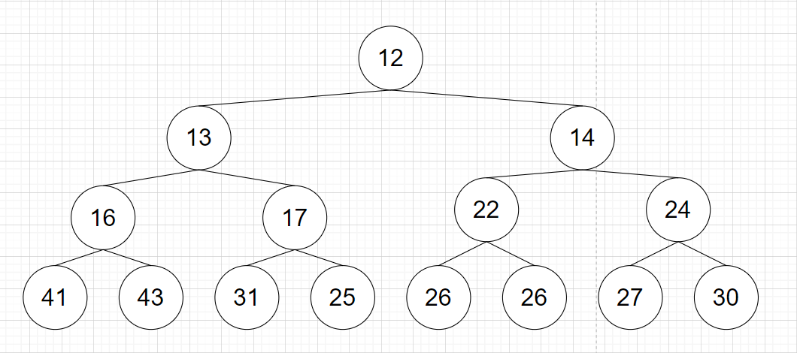
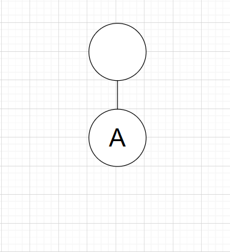

# Tree

- Tree
  - 계층형 트리 구조를 시뮬레이션하는 추상 자료형(ADT)으로, 루트 값과 부모-자식 관계의 서브트리로 구성되며, 서로 연결된 노드의 집합이다.
  - 하나의 뿌리에서 뻗어나가는 형상처럼 생겨 트리라는 명칭이 붙었다.
    - 트리 구조를 표현할 때는 일반적인 나무의 형상과는 반대 방향으로 표현한다.
    - 즉, 최상단에 루트가 있다.
  - 트리의 특징
    - 재귀로 정의된(Recursively Defined) 자기 참조(Self-Referential) 자료구조이다. 즉, 트리는 자식도 트리고 그 자식토 트리이며, 여러 개의 트리가 모여 큰 트리가 된다.
    - 트리는 항상 단방향이기 때문에 간선의 화살표는 생략 가능하다.
    - 일반적으로 방향은 위에서 아래로 향하며 루트를 level 0로 둔다.
    - V개의 정점을 가진 트리는 V-1개의 간선을 가진다.
    - 임의의 두 정점을 연결하는 simple path(정점이 중복해서 나오지 않는 경로)가 유일하다.
  - 명칭
    - Root: 트리의 시작을 의미한다.
    - Leaf: 자식이 없는 정점을 의미한다.
    - Parent: 직접 연결된 두 노드에서 상위에 위치한 노드
    - Child: 직접 연결된 두 노드에서 하위에 위치한 노드
    - Degree: 자식 노드의 개수를 의미한다.
    - Size: 자신을 포함한 모든 자식 노드의 개수를 의미한다.
    - Height: 현재 위치에서부터 Leaf까지의 거리
    - Depth: 루트에서부터 현재 노드까지의 거리
  - 그래프와 트리
    - 트리는 그래프의 일종이다.
    - 트리는 그래프와 달리 순환 구조를 갖지 않는다.
    - 트리는 그래프와 달리 항상 단방향이다.
    - 트리에서 자식 노드는 항상 하나의 부모 노드만을 갖는다.
    - 트리에서 루트는 반드시 하나만 존재한다.


- 트리의 종류
  - m-ary 트리(다항 트리, 다진 트리)
    - 각 노드가 m개 이하의 자식을 갖고 있는 트리
  - 이진 트리
    - m-ary 트리에서 m=2일 경우, 즉 모든 노드의 차수가 2 이하인 트리.
    - 이진 트리는 왼쪽과 오른쪽 최대 2개의 자식을 갖는 매우 단순한 형태이다.
    - 대부분 트리라고 하면 이진 트리를 일컫는다.
  - 이진 트리 유형(Types of Binary Trees)
    - Full Binary Tree(정 이진 트리): 모든 노드가 0개 또는 2개의 자식 노드를 갖는다.
    - Complete Binary Tree(완전 이진 트리): 마지막 레벨을 제외하고 모든 레벨이 완전히 채워져 있으며, 마지막 레벨의 모든 노드는 가장 왼쪽에서부터 채워져 있는 트리
    - Perfect Binary Tree: 모든 노드가 2개의 자식 노드를 갖고 있으며, 모든 리프 노드가 동일한 깊이 또는 레벨을 갖는 트리.


- 트리 순회
  - 트리 순회란 그래프 순회의 한 형태로 트리 자료구조에서 각 노드를 정확히 한 번 방문하는 과정을 말한다.
  - BFS
    - 인접한 정점 중 부모만 제외하고 전부 queue에 넣은 후 방문하는 방식을 사용한다.
    - 부모를 제외하는 이유는 부모는 이미 탐색을 완료 했을 것이기 때문이다.
    - BFS를 사용하여 트리를 순회하면 각 정점을 높이 순으로 방문하게 된다.
  - DFS
    - DFS를 사용하여 트리를 순회하면 각 정점을 leaf에 도달할 때 까지 방문한 뒤 다시 돌아와 다른 노드를 방문한다.
    - 전위 순회, 중위 순회, 후위 순회가 있다.
  


- 이진 트리 순회

  

  - 이진 트리의 표현
    - 이진 트리의 경우 왼쪽 자식과 오른쪽 자식을 구별해야 할 때가 종종 있어 아래와 같은 방식으로 표현하면 편리하다.
    - `lc`이 왼쪽 자식의 번호를 저장할 배열, `rc`는 오른쪽 자식의 번호를 저장할 배열이다.
    - 인덱스가 정점의 번호를 나타내며, 값이 0일 경우 해당하는 자식이 없다는 뜻이다.

  ```python
  lc = [0, 2, 4, 6, 0, 0, 0, 0, 0]
  rc = [0, 3, 5, 7, 0, 8, 0, 0, 0]
  ```

  - 전위 순회(Preorder Traversal, NLR(Node Left Righg))
    - 현재 정점 방문 - 왼쪽 서브 트리 전위 순회, 오른쪽 서브 트리 전위 순회 순서로 탐색한다.
    - DFS와 순회 순서가 동일하여, DFS를 통해 구현할 수 있다.

  ```python
  def preorder_traversal(root):
      if root == 0:
          return
      visited.append(root)
      preorder_traversal(lc[root])
      preorder_traversal(rc[root])
  
  lc = [0, 2, 4, 6, 0, 0, 0, 0, 0]
  rc = [0, 3, 5, 7, 0, 8, 0, 0, 0]
  visited = []
  preorder_traversal(1)
  print(visited)			# [1, 2, 4, 5, 8, 3, 6, 7]
  ```

  - 전위 순회 예시
    - 위 그래프를 예로 들자면, 먼저 1번 정점을 방문한다.
    - 그 후 왼쪽 전위 순회를 해야 하므로 2번 정점을 루트로 하는 서브 트리를 방문한다.
    - 또 다시 왼쪽 전위 순회를 해야 하므로 4번 정점을 방문한다.
    - 다시 왼쪽 전위 순회를 해야 하는데, 4번 정점에는 왼쪽 서브 트리가 없다.
    - 다음 순서인 오른쪽 전위 순회를 해야 하는데, 4번 정점에는 오른쪽 서브 트리도 없다.
    - 2로 돌아가 오른쪽 전위 순회를 진행하여 5번 정점을 방문한다.
    - 5번 정점에는 왼쪽 서브 트리가 없으므로 오른쪽 서브 트리로 진행한다.
    - 8은 왼쪽, 오른쪽 서브트리가 없으므로 이제 1로 돌아간다.
    - 1의 오른쪽 서브 트리의 루트인 3을 방문한다.
    - 3의 왼쪽 서브 트리의 루트인 6을 방문한다.
    - 6은 리프이므로 서브 트리가 없다.
    - 3으로 돌아가고 오른쪽 서브 트리의 루트인 7을 방문한다.
    - 7은 리프이므로 서브 트리가 없다.
    - 모든 정점을 순회했으므로 순회를 종료한다.
    - 방문 순서는 `[1, 2, 4, 5, 8, 3, 6, 7]`이 된다.

  - 중위 순회(Inorder Traversal, LNR)
    - 왼쪽 서브 트리 중위 순회 - 현재 정점 방문 - 오른쪽 서브트리 중위 순회순서로 탐색한다.
    - 중위 순회 역시 재귀를 통해 구현 가능하다.

  ```python
  def inorder_traversal(root):
      if root == 0:
          return
      inorder_traversal(lc[root])
      visited.append(root)
      inorder_traversal(rc[root])
  
  lc = [0, 2, 4, 6, 0, 0, 0, 0, 0]
  rc = [0, 3, 5, 7, 0, 8, 0, 0, 0]
  visited = []
  inorder_traversal(1)
  print(visited)			# [4, 2, 5, 8, 1, 6, 3, 7]
  ```

  - 후위 순회(Postorder Traversal, LRN)
    - 왼쪽 서브 트리 후위 순회 - 오른쪽 서브 트리 후위 순회 - 현재 정점 방문 순서로 탐색한다.
    - 마찬가지로 재귀로 구현이 가능하다.

  ```python
  def postorder_traversal(root):
      if root == 0:
          return
      postorder_traversal(lc[root])
      postorder_traversal(rc[root])
      visited.append(root)
      
  lc = [0, 2, 4, 6, 0, 0, 0, 0, 0]
  rc = [0, 3, 5, 7, 0, 8, 0, 0, 0]
  visited = []
  postorder_traversal(1)
  print(visited)          # [4, 8, 5, 2, 6, 7, 3, 1]
  ```
  
  - 모든 순회에서 오른쪽 서브 트리보다 왼쪽 서브트리를 먼저 방문하는 이유
    - 만약 단순히 노드의 개수를 세기 위함이라면 오른쪽 서브 트리를 먼저 방문해도 상관 없다.
    - 그러나 아래에서 살펴볼 BST는 왼쪽 서브트리의 값이 항상 오른쪽 서브 트리보다 작게 정렬되어 있다.
    - 따라서 오름차순으로 노드들을 방문하기 위해서는 왼쪽 서브 트리 먼저 방문해야 한다.


- Lowest Common Ancestor(LCA)

  - 여러 노드들의 가장 낮은 공통 조상을 의미한다.
    - 노드의 집합 S가 있을 때, 이 노드들의 최소 공통 조상은 집합 S의 모든 노드들을 포함하는 서브 트리의 루트이다.
    - 예를 들어 아래와 같은 트리가 있을 때, 7과 4의 LCA는 2, 6과 4의 LCA는 5, 7과 8의 LCA는 3이다.

  ```
            3
         /     \
       5         1
     /   \     /   \
   6      2   0     8
        /  \
       7    4
  ```

  - 트리와 배열로부터 이진 트리를 생성하는 코드는 아래와 같다.

  ```python
  from collections import deque
  
  class TreeNode:
      def __init__(self, val=0, left=None, right=None):
          self.val = val
          self.left = left
          self.right = right
  
  def build_tree(values):
      if not values or values[0] is None:
          return None
  
      root = TreeNode(values[0])
      queue = deque([root])
      i = 1
  
      while i < len(values):
          node = queue.popleft()
  
          if i < len(values) and values[i] is not None:
              node.left = TreeNode(values[i])
              queue.append(node.left)
          i += 1
  
          if i < len(values) and values[i] is not None:
              node.right = TreeNode(values[i])
              queue.append(node.right)
          i += 1
  
      return root
  ```

  - Tree에서 노드 p, 노드 q의 LCA를 찾는 코드는 아래와 같다.
    - 시간 복잡도는 O(N)이다.

  ```python
  def lowestCommonAncestor(root: TreeNode, p: TreeNode, q: TreeNode) -> TreeNode:
      # 종료 조건: 루트가 없거나, p나 q를 찾으면 루트 반환
      if not root or root == p or root == q:
          return root
  
      # 왼쪽, 오른쪽 탐색
      left = lowestCommonAncestor(root.left, p, q)
      right = lowestCommonAncestor(root.right, p, q)
  
      # 둘 다 찾았다면, 현재 노드가 공통 조상
      if left and right:
          return root
  
      # 한쪽에만 있다면 한쪽을 반환
      return left if left else right
  ```

  - 혹은 아래와 같이 구하는 것도 가능하다.
    - 먼저 각 노드의 부모와 깊이를 기록한다.
    - 그 후 더 깊은 쪽을 위로 끌어올려 높이를 맞춘다.
    - 함께 올라가며 처음으로 같은 노드가 되는 순간이 LCA가 된다.
    - 시간 복잡도는 위 방식과 동일하다.

  ```python
  # 부모와 깊이를 기록하기 위한 DFS
  def dfs(node, parent_node, depth_value, parent, depth):
      if not node:
          return
      parent[node] = parent_node
      depth[node] = depth_value
      dfs(node.left, node, depth_value + 1, parent, depth)
      dfs(node.right, node, depth_value + 1, parent, depth)
  
  # LCA를 찾기 위한 함수
  def find_lca(a, b, parent, depth):
      # 깊이가 다르면 맞춘다.
      while depth[a] > depth[b]:
          a = parent[a]
      while depth[b] > depth[a]:
          b = parent[b]
  
      # 같은 깊이에서 출발하여 같은 노드가 나올때 까지 올라간다.
      while a != b:
          a = parent[a]
          b = parent[b]
  
      return a
  
  parent = {}
  depth = {}
  dfs(root, None, 0, parent, depth)
  
  # 노드 찾기 함수
  def find_node(node, val):
      if not node:
          return None
      if node.val == val:
          return node
      return find_node(node.left, val) or find_node(node.right, val)
  
  # 테스트: LCA(7, 4)
  p = find_node(root, 7)
  q = find_node(root, 4)
  lca = find_lca(p, q, parent, depth)
  
  print(f"LCA of {p.val} and {q.val} is {lca.val}")
  ```

  - DP를 적용하면 보다 빠른 시간에 찾을 수 있다.
    - 트리에서 각 노드의 2^k 번째 부모를 미리 계산해두고 이를 이용해 O(n log n)로 LCA를 구할 수 있다.
    - 이 방식을 binary lifting이라고 부른다.
    - 전처리에 O(n log n)이 걸리고, LCA를 찾는 데는 O(log n)이 걸리므로, 한 번만 수행하는 경우 시간 복잡도는 O(n log n), 전처리를 한 후 두 번째 수행 부터는 O(log n)이 걸린다.

  ```python
  from math import log2, ceil
  import sys
  sys.setrecursionlimit(10**6)
  
  class LCATree:
      def __init__(self, n):
          self.n = n
          self.LOG = ceil(log2(n)) + 1
          self.tree = [[] for _ in range(n + 1)]
          self.depth = [0] * (n + 1)
          self.parent = [[-1] * self.LOG for _ in range(n + 1)]
  
      def add_edge(self, u, v):
          self.tree[u].append(v)
          self.tree[v].append(u)
  
      def dfs(self, node, par):
          for child in self.tree[node]:
              if child != par:
                  self.depth[child] = self.depth[node] + 1
                  self.parent[child][0] = node  # 2^0번째 부모
                  self.dfs(child, node)
  
      def preprocess(self, root=1):
          self.dfs(root, -1)
          for k in range(1, self.LOG):
              for node in range(1, self.n + 1):
                  if self.parent[node][k - 1] != -1:
                      self.parent[node][k] = self.parent[self.parent[node][k - 1]][k - 1]
  
      def lca(self, u, v):
          # 깊이를 맞춘다.
          if self.depth[u] < self.depth[v]:
              u, v = v, u
          for k in reversed(range(self.LOG)):
              if self.depth[u] - (1 << k) >= self.depth[v]:
                  u = self.parent[u][k]
  
          # LCA를 찾으면 반환한다.
          if u == v:
              return u
  
          # 동시에 올라가면서 LCA를 찾는다.
          for k in reversed(range(self.LOG)):
              if self.parent[u][k] != -1 and self.parent[u][k] != self.parent[v][k]:
                  u = self.parent[u][k]
                  v = self.parent[v][k]
  
          return self.parent[u][0]
  ```

  

  


## Binary Search Tree(BST)

- 이진 탐색 트리

  - 왼쪽 서브 트리의 모든 값은 부모의 값 보다 작고, 오른쪽 서브 트리의 모든 값은 부모의 값 보다 큰 이진 트리를 의미한다.
  - 예시
    - 아래 트리는 모든 노드의 차수가 2 이하이므로 이진 트리이다.
    - 아래 트리에서 왼쪽 서브 트리의 모든 값은 부모의 값 보다 작고, 오른쪽 서브 트리의 모든 값은 부모의 값 보다 크다.
    - 따라서 아래 트리는 이진 탐색 트리이다.

  


- 이진 탐색 트리의 시간복잡도

  - 삽입, 조회, 수정, 삭제가 모두 O(lg N)에 가능하다(N은 tree의 높이이다).

    - 배열의 경우 삽입은 맨 마지막에 추가하면 되니 O(1)이지만, 조회, 수정, 삭제는 모두 O(N)이다.
    - 모든 연산이 O(1)에 가능한 hash의 하위호환이라 생각할 수도 있지만 그렇지 않다.
    - 이진 탐색 트리는 hash와 달리 원소가 크기 순으로 정렬된다는 특징을 가지고 있어 N보다 크거나 작인 최초의 원소를 O(lg N)에 찾을 수 있다.
    - 즉, 원소의 조회, 수정, 삭제가 빈번하면서 원소의 대소와 관련된 연산을 해야 할 경우 이진 탐색 트리를 사용하는 것이 좋다.

  - 삽입

    - 이진 탐색 트리에서의 삽입 과정

    - 값이 50인 root node가 있을 때, 15를 삽입한다면, 15는 50보다 작으므로 root node의 왼쪽에 삽입한다.
    - 다음으로 20을 삽입하려 하는데, 20 역시 50보다 작으므로 왼쪽에 삽입하려 한다.
    - 그런데 이미 왼 쪽에는 15가 있으므로 바로 삽입할 수는 없고 20과 15의 대소를 비교한다.
    - 20은 15보다는 크므로 20의 오른쪽에 삽입한다.
    - 이러한 과정을 거쳐 삽입이 이루어진다.

  - 조회

    - 위 예시에서 값이 4인 노드를 찾으려고 한다고 가정해보자.
    - 4는 root node인 5보다 작으므로 왼쪽 서브트리에 있을 것이다.
    - 4는 왼쪽 서브 트리의 root인 3보다는 크므로 오른쪽에 있을 것이다.
    - 찾으려는 노드를 찾았으므로 탐색을 종료한다.

  - 삭제

    - 그냥 삭제할 경우 트리 구조가 깨지므로 주의해야한다.
    - 자식이 없는 정점의 경우 그냥 지워도 문제가 되지 않는다.
    - 자식이 1개인 정점을 지우는 것도 상대적으로 간단한데, 지우려는 정점을 지운 후 자식 정점을 지워진 정점의 위치에 놓으면 끝이다.
    - 반면에 자식이 2개인 정점을 지우기 위해서는 적절한 정점을 선택하여 지워진 정점의 위치에 놓는 것이다.
    - 이 때, 지워진 정점 보다 크면서  가장 작은 값을 가지는 정점을 선택하거나, 지워진 정점 보다 작으면서 가장 큰 값을 가지는 정점을 선택하면 된다.
    - 예를 들어 위 예시에서 3번 정점을 삭제하려 한다면, 3보다 작으면서 가장 큰 2를 3번 정점 위치로 올리거나, 3보자 크면서 가장 작은 4를 3번 정점 위치로 올리면 이진 탐색 트리의 구조가 유지된다.
    - 그런데, 만약 2 또는 4가 2개의 자식을 가지고 있다면 어떻게 되는가?
    - 사실 그런 상황 자체가 만들어질 수 없다.
    - 만약 2에게 1 이외에 오른쪽 자식이 있었다면, 2보다 크면서 3보다는 작은 값일 텐데, 그렇다면 대체 정점으로 2가 선택되지 못한다.
    - 마찬가지로 4에게 자식 둘이 있었다면 왼쪽 자식은 3보다 크고 4보다 작은 값이 들어가게 될 텐데, 이 경우 역시 대체 정점으로 4가 선택되지 못한다.


- 자가 균형 트리(Self-Balancing Tree)

  - 이진 탐색 트리의 시간 복잡도는 각 정점의 자식의 수에 따라 정해진다.
    - 만약 각 정점이 대부분 2개씩 가지고 있다면 높이가 하나 증가할 때 마다 정점의 개수는 2배씩 늘어나기 때문에 시간 복잡도가 O(lg N)에 가까워진다.
    - 반면에 각 정점이 대부분 1개씩 가지고 있다면 시간복잡도는 O(N)에 가까워진다.
    - 즉, 아래와 같이 같은 개수의 정점이라도, 자식을 몇 개씩 가지고 있는가에 따라 높이가 달라지게 된다.
    - 아래 두 이진 탐색 트리는 같은 정점의 개수를 가지고 있지만, 위는 높이가 3, 아래는 높이가 6이다.
    - 따라서 트리가 편향되었다면, 연결 리스트를 사용하는 것과 별반 차이가 없어지게 된다.

  

  

  - 그러므로 이진 검색 트리가 편향 될 경우 이를 해결해줘야하는데, 이를 해결한 트리를 자가 균형 트리라 부른다.
    - AVL Tree, Red Black Tree 등이 자가 균형 트리이다.
    - 구현은 AVL Tree가 약간 더 쉽고, 성능은 Red Black Tree가 더 좋아서 Red Black Tree를 주로 사용한다.


## Union-Find

- Union-Find Datastructure

  - 서로 중복 되지 않는 부분 집합들을 저장하는 자료구조이다.
    - 즉, 공통 원소가 없는 상호 배타적인 부분 집합들을 저장하는 자료구조이다.
    - 각 부분 집합에는 대표 원소가 존재한다.
  - Disjoint Set, Merge-Find Set이라고도 부른다.
  - Union-Find는 아래와 같은 연산을 지원해야한다.
    - MakeSet: 주어진 값만을 원소로 가지는 새로운 집합을 생성하고, 새로 생성된 집합을 disjoint set에 추가한다.
    - Find: 주어진 값이 속한 집합의 대표 값을 반환한다.
    - Union: 두 개의 집합을 병합한다.
  - 위와 같은 연산을 지원하기 위해서 일반적으로 트리를 사용하여 구현한다.
    - 각각의 서로소 집합을 트리로 구현하면 아래와 같은 이점이 있다.
    - 루트 노드를 대표 노드로 설정하면 Find 연산은 루트 노드를 반환하면 된다.
    - Union 연산시에 한 집합을 다른 집합의 루트에 연결하면 되므로 효율적인 병합이 가능하다.
    - 경로 압축을 사용할 경우 트리가 평탄화되어 Find 연산의 시간 복잡도가 거의 O(1)이 된다.
  - 트리로 구현할 경우의 시간 복잡도(경로 압축을 하지 않을 경우)
    - MakeSet: O(1), 단순히 배열을 갱신하는 작업이므로 O(1)이다.
    - Find: O(N), 대표 노드에 해당하는 루트 노드를 찾을 때 까지 올라가야 하므로 트리의 높이에 해당하는 N만큼이 걸린다.
    - Union: O(N), 루트를 찾아야 병합이 가능하므로 루트를 찾는 Find의 시간 복잡도인 O(N)과 동일하다.
    - 위 에서 알 수 있듯이 Union-Find의 성능은 Find 연산의 성능에 따라 결정된다.
  - 구현

  ```python
  class UnionFind:
      # MakeSet 대체
      def __init__(self, size):
          self.parent = [i for i in range(size)]
  
      def find(self, x):
          if self.parent[x] == x:
              return x
          return self.find(self.parent[x])
  
      def union(self, x, y):
          root_x = self.find(x)
          root_y = self.find(y)
  
          if root_x != root_y:
              self.parent[root_y] = root_x
  
  union_find = UnionFind(10)
  union_find.union(1, 2)
  union_find.union(2, 3)
  union_find.union(4, 5)
  
  print(union_find.find(1))  # 1
  print(union_find.find(2))  # 1
  print(union_find.find(3))  # 1
  print(union_find.find(4))  # 4
  print(union_find.find(5))  # 4
  ```


- 경로 압축

  - 최악의 경우 아래와 같이 편향된 트리가 생성될 수 있다.
    - 아래의 경우 0 ← 1 ← 2 ← 3 ← 4 와 같이 편향된 트리가 되며, 연결 리스트와 다를 게 없는 상태가 된다.
    - 이런 경우로 인해 Find 연산의 시간 복잡도가 O(N)인 것이다.

  ```python
  class UnionFind:
      # MakeSet 대체
      def __init__(self, size):
          self.parent = [i for i in range(size)]
  
      def find(self, x):
          if self.parent[x] == x:
              return x
          return self.find(self.parent[x])
  
      def union(self, x, y):
          root_x = self.find(x)
          root_y = self.find(y)
  
          if root_x != root_y:
              self.parent[root_y] = root_x
  
  union_find = UnionFind(5)
  union_find.union(3, 4)
  union_find.union(2, 3)
  union_find.union(1, 2)
  union_find.union(0, 1)
  print(union_find.parent)	# [0, 0, 1, 2, 3]
  ```

  - 경로 압축 적용하기
    - Find 연산을 수행할 때 연산을 수행하면서 탐색한 모든 노드의 부모 노드를 루트 노드로 변경하는 연산을 수행한다.
    - 이를 통해 트리가 평탄화되면서 더 빠른 속도로 루트 노드 탐색이 가능해진다.

  ```python
  class UnionFind:
      # MakeSet 대체
      def __init__(self, size):
          self.parent = [i for i in range(size)]
  
      def find(self, x):
          if self.parent[x] != x:
              self.parent[x] = self.find(self.parent[x])  # 경로 압축
          return self.parent[x]
  
      def union(self, x, y):
          root_x = self.find(x)
          root_y = self.find(y)
  
          if root_x != root_y:
              self.parent[root_y] = root_x
  ```

  - 변경된 후의 Find와 Union의 시간 복잡도는 O(α(n)) ≈ O(1)이 된다.


- Union 최적화

  - Union 연산을 최적화하여 성능을 향상시킬 수 있다.
    - 경로 압축을 통해 Find 연산의 시간 복잡도를 O(α(n)) ≈ O(1)으로 줄이는 것 만으로 Union 연산의 시간 복잡도 역시 O(α(n)) ≈ O(1)이 됐는데, 추가적인 성능 향상이 어떻게 가능한 것인지 의아할 수 있다.
    - 그러나, 위에서 살펴본대로 경로 압축은 루트 노드를 찾는 과정에서 거치게 되는 모든 노드의 부모 노드를 루트 노드로 변경하는 작업으로, 병합이 빈번히 일어날 경우 Find 연산 역시 부모 노드를 루트 노드로 갱신하는 작업을 빈번히 수행하게 된다.
    - 따라서 애초에 트리가 평탄하게 생성되도록 하면 Find연산이 수행될 때 평탄화를 하지 않아도 되므로 성능이 향상된다.
  - Union by Rank
    - 작은 높이의 트리를 큰 높이의 트리에 붙여 트리의 높이 증가를 방지하는 방법이다.

  ```python
  class UnionFindByRank:
      def __init__(self, size):
          self.parent = [i for i in range(size)]
          self.rank = [0] * size  # 초기 랭크(트리 높이)는 0
  
      def find(self, x):
          if self.parent[x] != x:
              self.parent[x] = self.find(self.parent[x])  # 경로 압축
          return self.parent[x]
  
      def union(self, x, y):
          # Union by Rank: 랭크가 낮은 트리를 랭크가 높은 트리에 붙인다
          root_x = self.find(x)
          root_y = self.find(y)
  
          if root_x != root_y:
              if self.rank[root_x] > self.rank[root_y]:
                  self.parent[root_y] = root_x
              elif self.rank[root_x] < self.rank[root_y]:
                  self.parent[root_x] = root_y
              else:
                  self.parent[root_y] = root_x
                  self.rank[root_x] += 1  # 같은 높이라면 하나 증가
  ```

  - Union by Size
    - 노드 개수가 적은 트리를 노드 개수가 많은 트리에 붙여 트리의 균형을 유지하는 방법이다.
    - 병합 된 집합(노드의 개수가 더 작은 집합)의 size를 생신하지 않는 이유는 더 이상 사용되지 않는 정보이기에 굳이 갱신할 필요가 없기 때문이다.
    - Union by rank와 union by size의 성능은 거의 유사하지만, 실제 사용할 때는 union by size의 성능이 평균적으로 우수하며, 더 많이 쓰인다.
  
  ```python
  class UnionFindBySize:
      def __init__(self, size):
          self.parent = [i for i in range(size)]
          self.size = [1] * size  # 각 트리의 노드 개수
  
      def find(self, x):
          if self.parent[x] != x:
              self.parent[x] = self.find(self.parent[x])
          return self.parent[x]
  
      def union(self, x, y):
          # 더 적은 개수의 트리를 더 많은 개수의 트리에 붙인다.
          root_x = self.find(x)
          root_y = self.find(y)
  
          if root_x != root_y:
              if self.size[root_x] > self.size[root_y]:
                  self.parent[root_y] = root_x
                  self.size[root_x] += self.size[root_y]
              else:
                  self.parent[root_x] = root_y
                  self.size[root_y] += self.size[root_x]
  ```
  
  


# Heap

- 힙의 특성을 만족하는 거의 완전한 트리(Almost Complete Tree)인 특수한 트리 기반의 자료 구조

  - J.W.J Wiliams가 힙 정렬 알고리즘을 고안하면서 설계했다.
  - 이진 힙(Binary heap)
    - 본래 완전 이진 트리인 힙을 이진 힙이라고 부르지만 일반적으로 힙이라 하면 이진 힙을 의미한다.
  - 최대 힙
    - 부모 노드의 값이 항상 자식 노드보다 큰 힙을 최대 힙이라 부른다.
    - 최댓값을 찾기 위해 사용한다.
  - 최소 힙
    - 부모 노드의 값이 항상 자식 노드보다 작은 힙을 최소 힙이라 부른다.
    - 최솟값을 찾기 위해 사용한다.

  - 주의할 점은 힙의 특성(부모가 자식보다 크다/작다)에 정렬되어 있어야 한다는 것은 없다는 점이다.
    - 즉 부모가 자식보다 크다/작다는 조건만 만족할 뿐 정렬된 형태로 트리가 구성되지는 않는다.
  - 높이가 낮은 곳 부터 채워 나가며, 높이가 같을 경우 왼쪽부터 채워 나간다.
    - 따라서 이진 탐색 트리와 달리 불균형이 발생하지 않는다.


- 최소 힙의 삽입과 삭제

  - 삽입

    - 먼저 root 값인 42를 삽입한다.
    - 다음으로 50을 삽입하는데, 힙은 무조건 높은 곳에서 낮은 곳으로, 왼쪽에서 오른쪽으로 채워 나가므로 root의 왼쪽에 삽입한다.
    - 다음으로 30을 삽입하는데, 왼쪽에서 오른쪽으로 채워야 하므로 root의 오른쪽에 삽입해야 한다.
    - 그런데, 30은 root인 42보다는 작으므로 30을 42의 오른쪽에 둘 경우 최소힙의 조건에 위배된다.
    - 따라서 42와 30의 자리를 바꿔준다.

    

    - 다음으로는 12를 삽입하려 하는데, 왼쪽에서 오른쪽으로 채워야 하므로 50의 왼쪽 노드로 와야 한다.
    - 그런데 이 역시 최소 힙의 조건을 위배하므로, 50과 자리를 바꿔준다.

    

    - 12는 30보다 작으므로 여전히 최소 힙의 조건을 위배하므로 12와 30도 자리를 바꿔준다.

    

  - 삭제

    - 아래와 같은 heap이 있을 때, 최솟값인 12를 지우려고 한다.

    

    - Heap의 가장 마지막 노드인 30과 12의 자리를 바꾸고 12를 제거한다.

    

    - 자식이 부모보다 커야 한다는 최소 힙의 조건에 위배되므로 자식 노드들 중 가장 작은 것과 다시 변경한다.
    - 13과 14중 13이 더 작으므로 13과 변경한다.
    - 아직도 자식인 16, 17보다 크므로 둘 중 더 작은 자식인 16과 변경한다.

    

    - 이제 두 자식 41, 43보다는 크므로 최소 힙의 조건을 만족하므로 변경을 종료한다.

  - 시간복잡도

    - 삽입의 경우 값을 계속 비교한다고 해도 최대 높이까지만 올라가면서 노드를 변경하면 되므로 O(lg N)이다.
    - 삭제의 경우도 마찬가지 이유로 O(lg N)이다.
    - 최소 힙에서 최솟값을 찾는 연산은 root를 확인하면 되므로 O(1)이다(최대 힙에서 최댓값을 찾는 연산도 마찬가지).


- 표현

  - 힙은 완전 이진 트리이므로 list에 빈틈 없이 배치가 가능하다.
    - 대개의 경우 계산을 편하게 하기 위해 1번 인덱스부터 사용한다.
  - 위에서 삭제 방식을 확인하기 위해 사용했던 heap을 기준으로 아래와 같은 배열로 표현 가능하다.

  ```python
  heap = [None, 13, 16, 14, 30, 17, 22, 24, 41, 43, 31, 25, 26, 26, 27]
  ```

  - 이 경우 i번 인덱스에 해당하는 노드의 부모와 왼쪽 자식, 오른쪽 자식은 아래와 같이 찾을 수 있다.
    - 부모: `i / 2`
    - 왼쪽 자식: `2i`
    - 오른쪽 자식:`2i + 1`


- Python의 heapq

  - Python에는 `heapq`라는 모듈로 최소 힙이 구현되어 있다.
  - Python의 list를 최소 힙 처럼 다룰 수 있게 해준다.

  ```python
  import heapq
  
  heap = []
  heap.heappush(3)
  heap.heapush(1)
  print(heap.heappop())	# 1
  ```


- 이진 탐색 트리와의 차이
  - 이진 힙은 부모 자식 사이의 대소 관계를 보장하지만, 이진 탐색 트리는 좌우 사이의 대소 관계를 보장한다.
  - BST는 탐색과 삽입 모두 O(lg N)에 가능하며, 모든 값이 정렬되어야 할 때 사용한다.
  - 이진 힙은 가장 작은 값/ 가장 큰 값을 빈번히 추출해야 할 때 사용한다.
    - 우선 순위와 연결되어 있으며 우선 순위 큐에 사용된다.


# 에라토스테네스의 체

- 에라토스테네스의 체

  - 소수(prime number)를 판별하는데 사용하는 알고리즘이다.
    - 고대 그리스의 수학자 에라토스테네스가 발견하였다.
    - 체 처럼 소수가 아닌 수 들을 걸러낸다.
  - 알고리즘
    - 2부터 소수를 구하고자 하는 구간의 모든 수를 나열한다.
    - 나열한 수를 앞에서부터 탐색해 나간다.
    - 첫 수인 2는 소수이므로 소수라는 표시를 한다.
    - 나열 된 숫자들에서 2의 배수인 것들은 모두 소수가 아니라는 표시를 한다.
    - 3은 표시가 되어 있지 않고, 소수이므로 소수라는 표시를 한다.
    - 나열 된 숫자들에서 3의 배수인 것들은 모두 소수가 아니라는 표시를 한다.
    - 4는 소수가 아니라는 표시가 되어 있으므로 넘어간다.
    - 5는 표시가 되어 있지 않고, 소수이므로 소수라는 표시를 한다.
    - 나열 된 숫자들에서 5의 배수인 것들은 모두 소수가 아니라는 표시를 한다.
    - 이를 모든 수에 대해 반복한다.
  - 구현
    - n까지의 숫자 중에서 소수인 것들을 반환한다.
    - 배수에 해당하는 값에 소수가 아니라는 표시를 남길 때 `i*i`부터 시작하는 이유는 어떤 소수 `i`의 배수 중에서 `i × k` (단, k < i) 형태의 수는 이미 `k`단계에서 지워졌을 것이기 때문이다.
  
  
  ```python
  def get_prime_list_inclusive(n: int):
      if n < 2:
          return []
      # 처음에는 모두 소수로 간주한다.
      sieve = [True] * (n + 1)
      sieve[0] = sieve[1] = False
      for i in range(2, int(n**0.5) + 1):
          if sieve[i]:
              # 배수에 해당하는 모든 값에 소수가 아니라는 표시를 한다.
              for j in range(i * i, n + 1, i):
                  sieve[j] = False
      return [i for i in range(n + 1) if sieve[i]]
  ```

  - n의 제곱근 까지만 확인하는 이유

    > [참고](https://nahwasa.com/entry/%EC%97%90%EB%9D%BC%ED%86%A0%EC%8A%A4%ED%85%8C%EB%84%A4%EC%8A%A4%EC%9D%98-%EC%B2%B4-%ED%98%B9%EC%9D%80-%EC%86%8C%EC%88%98%ED%8C%90%EC%A0%95-%EC%8B%9C-%EC%A0%9C%EA%B3%B1%EA%B7%BC-%EA%B9%8C%EC%A7%80%EB%A7%8C-%ED%99%95%EC%9D%B8%ED%95%98%EB%A9%B4-%EB%90%98%EB%8A%94-%EC%9D%B4%EC%9C%A0)
  
    - n까지의 소수 판별시에 n의 제곱근까지만 확인하면 된다(위 코드에서도 `n ** 0.5`까지만 확인했다).
    - n은 자연수 a, b에 대해 `n = a * b`라고 표현할 수 있다.
    - 또 n의 제곱근 m에 대해 `n = m * m`라고 표현할 수 있다.
    - 따라서, `a * b = m * m`이라 할 수 있다.
    - 이 때, a, b는 자연수여야하므로, a, b가 자연수임을 만족하는 경우는 아래의 세 가지 경우 뿐이다.
    - `a=m & b=m`, `a<m & b>m`, `a>m & b<m`
    - 즉, `min(a, b)<=m`이라고 할 수 있다.
    - N의 약수에 해당하는 a와 b 중 하나는 무조건 m 이하이므로, 제곱근인 m까지만 조사하면 n이 소수인지 알 수 있게 된다.


# 연결리스트

- Array와 list

  > 자료구조로서의 array, list와 프로그래밍 언어에서의 array, list를 분리해서 생각해야한다.
  >
  > 예를 들어 C의 영향으로 array는 길이를 변경할 수 없다고 생각하지만, 자료구조로서의 array는 단순히 메모리상에 원소를 연속하여 배치한 구조로, 길이를 변경하지 못할 이유가 없다.

  - array
    - 일반적으로 배열이라 번역되는 array는 메모리상에 원소를 연속하게 배치한 자료구조이다.
    - 메모리상에 연속적으로 배치하므로, index를 사용하여 k번째 원소를 상수 시간에 찾는 것이 가능하다.
    - 추가적으로 소모되는 메모리의 양(overhead)가 거의 없다.
    - 메모리상에 연속된 구간에 할당해야하므로 할당에 제약이 존재한다(C는 이러한 제약을 극복하기 위해 array의 길이를 변경하지 못하게 설계됐다).
    - Cache hit rate가 높다.
  - array의 시간복잡도
    - index를 알고 있을 경우 해당 index에 해당하는 값에 접근하는 것과 변경하는 것의 시간복잡도는 O(1)이다.
    - 임의의 위치에 자료를 추가하거나 삭제하는 연산의 시간복잡도는 O(n)이다. 추가, 삭제 이후 element들을 한 칸씩 당기거나 밀어야 하기 때문이다.
    - array의 마지막에 원소를 추가, 삭제하는 경우의 시간복잡도는 O(1)이다.

  - list
    - 메모리상에 원소를 불연속적으로 배치한 자료구조이다.
    - 메모리상에 원소를 불연속적으로 배치하므로 index를 통한 접근이 불가능하다.
    - 배열과 유사한 역할을 하지만 차이가 있다면 빈 element를 허용하지 않는다는 것이다.
    - 빈틈없는 데이터의 적재가 가능해 낭비되는 메모리가 거의 없다.
    - 배열과 마찬가지로 원소들 사이의 순서가 존재하며, 또한 배열과 마찬가지로 중복을 허용한다.
    - 연속되어 배치되지 않으므로 Cache hit rate가 낮다.


- 연결리스트
  - 데이터 요소의 선형 집합으로, 데이터의 순서가 물리적인 순서대로 저장되지 않는다.
    - 컴퓨터과학에서 배열과 함께 가장 기본이 되는 대표적인 선형 자료구조 중 하나로 다양한 추상 자료형(Abstract Data Type, ADT) 구현의 기반이 된다.
    - 동적으로 새로운 노드를 삽입하거나 삭제하기가 간편하며, 연결 구조를 통해 물리 메모리를 연속적으로 사용하지 않아도 되기 때문에 관리도 쉽다.
  - 랜드 연구소에서 근무하던 앨런 뉴얼이 동료들과 함께 만든 언어인 IPL의 기본 자료구조로 처음 사용됐다.
  - 연결 리스트의 성질
    - 배열과는 달리 특정 인덱스에 접근하기 위해서는 전체를 순서대로 읽어야하므로 상수 시간에 접근할 수 없다.
    - 메모리상에 연속되어 배치되지 않으므로 cache hit rate가 낮다.
    - 각 원소가 다음 원소, 혹은 이전과 다음 원소의 주소값을 가지고 있어야하므로, 추가적인 메모리 공간(overhead)이 요구된다. 
    - 예를들어 32비트 컴퓨터면 주소값이 32비트(=4바이트) 단위이니 4N 바이트가 추가로 필요하고, 64비트 컴퓨터라면 주소값이 64비트(=8바이트) 단위이니 8N 바이트가 추가로 필요하게 된다. 즉 N에 비례하는 만큼의 메모리를 추가로 쓰게 된다.'
  - 시간 복잡도
    - 탐색과 변경에는 O(n)이 소요된다.
    - 반면, 시작 또는 끝 지점에 아이템을 추가, 삭제, 추출하는 작업은 상수 시간에 가능하다.
    - 시작 또는 끝 지점이 아닌 임의의 공간에 추가와 삭제를 하는 경우 추가 또는 삭제 할 곳의 주소를 알고 있을 때에만 O(1)이다.
    - 예를 들어 1->34->17->22와 같은 연결 리스트가 있을 때, 세 번째 원소 뒤에 61을 추가하려 한다면 이는 상수 시간 내에는 불가능하다.
    - 세 번째 원소가 어디인지를 찾는데 시간이 소요되기 때문이다.
    - 단, 주소를 알고 있을 경우에는 단순히 추가하려는 원소 앞의 원소가 가리키는 주소를 추가한 원소의 주소로 바꾸고, 추가한 원소가 가리키는 주소를 뒤의 원소로 바꿔주기만 하면 된다.


- 연결 리스트의 종류
  - 단일 연결 리스트(Singly linked list)
    - 각 원소가 다음 원소의 주소를 가지고 있는 연결 리스트
  - 이중 연결 리스트(Doubly linked list)
    - 각 원소가 자신의 다음 원소의 주소와 이전 원소의 주소를 가지고 있는 연결 리스트
    - 이전 원소의 정보를 알 수 있다는 장점이 있지만, 단일 연결 리스트에 비해 추가적인 메모리가 필요하다는 단점이 있다.
  - 원형 연결 리스트(Circular linked list)
    - 처음 원소와 마지막 원소가 연결되어 있는 연결 리스트
    - 단일 연결 리스트이면서 원형 연결 리스트일 수도, 이중 연결 리스트이면서 원형 연결 리스트일 수도 있다.


- Floyd's cycle finding algorithm(Hare-Tortoise algorithm)

  - 단일 연결 리스트에 cycle이 존재하는지를 판별하는 알고리즘이다.

    - 거치는 모든 노드를 저장 할 필요 없이, 포인터 두 개만 있으면 되므로 공간복잡도 O(1)에 해결이 가능하다.
    - 시간 복잡도는 O(n)이다.

  - 방식

    - 한 칸씩 전진하는 포인터(slow pointer, tortoise)와 두 칸씩 전진하는 포인터(fast pointer, hare)를 동일한 시작점에서 출발시킨다.
    - 만일 연결 리스트에 순환이 존재할 경우 두 포인터는 반드시 만나게 된다.
    - 만약 순환이 존재하지 않을 경우 fast pointer가 연결리스트의 끝에 도달하게 된다.

  - 이를 사용하여 cycle의 시작점을 찾을 수도 있다.

    - 한 칸씩 전진하는 포인터(slow pointer, tortoise)와 두 칸씩 전진하는 포인터(fast pointer, hare)를 동일한 시작점에서 출발시킨다.
    - 두 포인터가 만나게 되면 둘 중 한 포인터를 시작점으로 돌려보낸다.
    - 이제 두 포인터 모두 한 칸씩 전진시키면, 두 포인터가 만나는 지점이 순환의 시작점이다.

  - cycle의 시작점을 찾는 원리

    - y는 두 포인터의 시작점부터 순환의 시작점까지의 거리이다.
    - z는 순환의 시작점부터 두 포인터가 만나는 지점까지의 거리이다.
    - l는 순환의 길이이다.
    - f는 fast pointer가 순환을 돈 횟수, s는 slow pointer가 순환을 돈 횟수이다.
    - $x_n$은 연결 리스트의 n번째 노드이다.
    - $x_i$는 두 포인터가 만나는 노드이다.
    - $x_j$는 순환 내부에 있는 노드이며, 순환 내부에 있는 노드 $x_j$에 대해 아래의 공식이 성립한다. 즉, node가 순환 내에 존재한다면 몇 순환을 몇 번 돌아도 같은 지점에 도착하게 된다.

    $$
    x_{j+kl} = x_j\ \ (j \geλ\ and \ k\ge0)
    $$

    

    - 이 때 두 포인터가 만날 때 까지 slow pointer가 이동한 거리 i는 아래와 같다.

    $$
    i = y+(s*l)+z
    $$

    - fast pointer는 slow pointer의 두 배씩 이동하므로, 두 포인터가 만날 때 까지 fast pointer가 이동한 거리 2i는 아래와 같다.

    $$
    2i = y+(f*l)+z
    $$

    - 2i에서 i를 빼면 아래와 같다.

    $$
    i = (f-s)l
    $$

    - 이제 첫 번째 식에서 j에 y를 대입한다.
    - y는 연결 리스트의 시작점부터 순환의 시작점까지의 거리이므로, $x_y$가 가리키는 node는 순환이 시작되는 node이고, 따라서 순환 내부에 있는 node라 할 수 있다.
    - 그 다음 k값에는 fast pointer가 순환을 돈 횟수에서 slow pointer가 순환을 돈 횟수를 뺀 f-s를 대입하면 식은 아래와 같다.

    $$
    x_{y+(f-s)l} = x_y
    $$

    - 여기서 우리는 `(f-s)l`의 값이 i라는 것을 알고 있으므로, 식은 아래와 같이 변경될 수 있다.

    $$
    x_{y+i}=x_y
    $$

    - 즉 두 포인터가 만나는 지점($x_i$)에서 y만큼 이동하면 사이클이 시작되는 지점($x_{y+i}$)로 돌아갈 수 있다.

  - Runner technique

    - 두 개의 pointer를 동일한 시작점에서 서로 다른 속도로 출발시킨다는 아이디어로 다양한 문제 해결이 가능하다.
    - 예를 들어 cycle이 없는 연결 리스트에서 fast pointer가 끝에 도달하면, slow list는 중간 지점에 도달하게 되는데, 이를 사용하여 회문 판별등을 할 수 있다.


# Trie

- Trie

  - 검색 트리의 일종으로 일반적으로 키가 문자열인, 동적 배열 또는 연관 배열을 저장하는 데 사용되는 정렬된 트리 자료구조다.
    - 자연어 처리 분야에서 문자열 탐색을 위한 자료구조로 널리 쓰인다.
    - 검색시에 자동완성 기능을 구현하는 용도로도 많이 쓰인다.
    - 검색을 뜻하는 retrieval의 중간 음절에서 용어를 따 왔다(초기에는 트리로 발음했으나 tree와 구분하기 위해 트라이로 발음한다).
    - 문자열의 길이만큼만 탐색을 하면 찾는 문자열이 트라이 내에 있는지 확인 할 수 있다.
  - 예시

  

  - 단어 S를 삽입, 조회, 삭제하는 시간 복잡도는 O(|S|)이다.
    - `|S|`는 S의 길이를 의미한다.
    - 이론적인 시간복잡도는 O(|S|)이지만, 실질적으로는 해시, 이진 탐색 트리에 비해 훨씬 느리다.
    - 따라서 일반적인 상황에서는 해시, 이진 탐색 트리를 사용하고 트라이가 꼭 필요한 상황에서만 트라이를 사용하는 것이 좋다.
  - 메모리를 많이 차지한다는 단점이 있다.
    - 문자열을 일반 배열에 저장하는 것 보다 `글자의 종류 * 4 `배 만큼을 더 사용한다.
    - 예를 들어 대문자 알파벳으로만 구성된 단어들을 저장할 경우 (26*4=)104배 만큼의 메모리를 더 사용한다.
    - 그렇다고 메모리 사용량을 줄이는 방식을 적용하면 연산 속도가 느려진다.


- 삽입 예시

  - 삽입, 탐색, 삭제 시에 노드를 옮겨 다녀야 하므로 현재 정점이 어디인지가 중요하다.
  - 아래와 같이 root 노드만 있을 때, APPLE을 삽입하려 한다.
    - 현재 정점은 root

  

  - 첫 글자인 A를 먼저 삽입하려 하는데 root는 값이 A인 자식이 없으므로 A를 자식으로 추가한다.
    - 그 후 현재 정점을 A로 옮긴다.

  

  - 다음으로 P를 추가하는데, 마찬가지로 A 정점에는 값이 P인 자식이 없으므로 P를 현재 정점인 A의 자식으로 추가한다.
    - 현재 정점을 P로 옮긴다.

  

  - 위 과정을 반복하여 남은 P, L, E를 아래와 같이 추가해준다.
    - 마지막 문자인 E를 추가한 뒤 E 노드에 단어의 끝이라는 표시를 해야 한다.

  

  - 다음으로는 APPLY를 추가하려 한다.
    - 다시 현재 정점을 root로 옮긴다.
    - 현재 정점인 root에는 첫 글자인 A를 값으로 가지는 자식이 있으므로, 추가는 하지 않고 현재 정점을 A로 옮긴다.
    - 현재 정점인 A에는 그 다음 글자인 P를 값으로 가지는 자식이 있으므로, 추가는 하지 않고 현재 정점을 P로 옮긴다.
    - 같은 과정을 반복한다.
  - 마지막 Y를 추가하려고 하는데 현재 정점 L에는 Y를 값으로 가지는 자식이 없으므로, L의 자식으로 Y를 추가해준다.
    - Y를 추가한 뒤 단어의 끝이라는 표시를 Y 노드에 남겨야 한다.

  

  - 단 주의할 점은 삽입이 끝났다면 마지막 노드(위 예시에서 E, Y)에 단어의 끝이라는 표시를 해줘야한다.
    - 예를 들어 BANANA와 BAN을 삽입하려 한다고 가정해보자.
    - BANANA를 먼저 삽입하면 트라이는 B-A-N-A-N-A와 같인 형태가 될 것이다.
    - 그 이후 BAN도 삽입하는데, B-A-N이 이미 있는 상태이므로 더 추가해 줄 것은 없다.
    - 이 후 트라이에 BAN이 있는지 확인하려 한다.
    - 그런데 별도의 표시를 해주지 않았으므로 B-A-N이 BANANA의 일부로 들어간 것인지 BAN을 삽입한 것인지 알 방법이 없다.
    - 따라서 하나의 단어가 삽입이 완료 됐을 때 특정 표시를 해 줌으로써 단어가 삽입됐다는 것을 기록해둬야 한다.


- 조회 예시
  - 조회도 삽입과 크게 다르지 않다.
  - 찾으려는 값이 있을 경우
    - 위에서 본 예시에서 APPLE을 검색하려 한다고 가정해보자.
    - 먼저 A의 첫 글자인 A가 현재 정점인 root의 자식 중에 있는지 확인한다.
    - root의 자식 중 A가 있으므로 현재 정점을 A로 옮긴다.
    - 다음 글자인 P가 현재 정점인 A의 자식 중에 있는지 확인한다.
    - A의 자식 중 P가 있으므로 현재 정점을 P로 옮긴다.
    - 위 과정을 반복하여 E에 도달하고, E에 단어의 끝이라는 표식이 있으므로 APPLE은 트라이 안에 있다는 것을 확인할 수 있다.
  - 찾으려는 값이 없을 경우
    - API라는 문자열이 트라이 안에 있는지 확인하려 한다.
    - 먼저 A의 첫 글자인 A가 현재 정점인 root의 자식 중에 있는지 확인한다.
    - root의 자식 중 A가 있으므로 현재 정점을 A로 옮긴다.
    - 다음 글자인 P가 현재 정점인 A의 자식 중에 있는지 확인한다.
    - A의 자식 중 P가 있으므로 현재 정점을 P로 옮긴다.
    - 다음 글자인 I가 P의 자식중에 없으므로 API는 트라이에 없다는 것을 확인할 수 있다.
  - 찾으려는 값은 있지만 종료 표시는 없는 경우
    - 위 트리에서 APP을 찾으려 한다고 가정해보자.
    - 먼저 A의 첫 글자인 A가 현재 정점인 root의 자식 중에 있는지 확인한다.
    - root의 자식 중 A가 있으므로 현재 정점을 A로 옮긴다.
    - 다음 글자인 P가 현재 정점인 A의 자식 중에 있는지 확인한다.
    - A의 자식 중 P가 있으므로 현재 정점을 P로 옮긴다.
    - P의 자식 중 P는 있지만 자식인 P 정점에 단어의 끝이라는 표시가 되어 있지 않으므로 APP은 트라이에 없다는 것을 확인할 수 있다.


- 삭제
  - APPLE을 삭제하려 한다고 가정해보자.
    - 조회를 통해 APPLE을 탐색한다.
    - 최종 위치인 E가 현재 정점이 된다.
    - 현재 정점이자 단어의 마지막 문자에 해당하는 E 정점에서 단어의 끝이라는 표시를 지운다.
  - 주의할 점은 정점을 지우지는 않는다는 것이다.
    - 정점을 지울 경우 트라이의 구조 자체가 깨지기 때문에 트라이는 문자열이 삭제된다고 하더라도 해당 정점들을 삭제하지 않는다.
    - 이로 인해 메모리가 낭비된다.
  - 삭제가 빈번하게 발생할 경우 트라이를 사용하는 것은 적절치 않다.


# 정렬

- 버블 정렬(Bubble Sort)

  - 구현 가능한 정렬 알고리즘 중 가장 느린 알고리즘이다.
  - 매번 앞뒤의 원소를 비교해가며 정렬하는 알고리즘이다.
    - 한 번 반복문이 돌 때마다 가장 큰 원소가 배열의 가장 뒤로 가게 된다.
  - 시간복잡도
    - 매 번 모든 원소들을 비교해야 하기 때문에 O(n<sup>2</sup>)이다.

  - 구현

  ```python
  def bubble_sort(arr):
      length = len(arr)
      for i in range(1, length):
          for j in range(length-i):
              if arr[j] > arr[j + 1]:
                  arr[j], arr[j+1] = arr[j+1], arr[j]
  
  lst = [4, 2, 3, 5, 6, 1, 4, 9, 8, 7]
  bubble_sort(lst)
  ```


- 선택 정렬(Selection Sort)

  - 제자리 정렬(In-Place Sort) 알고리즘 중 하나이다.
    - 제자리 정렬 알고리즘이란 정렬할 원소들의 개수에 비해서 충분히 무시할 만한 저장 공간만을 필요로 하는 정렬 알고리즘을 말한다.
  - 정렬 방식
    - 원소들 중 가장 작은 값을 찾는다.
    - 해당 값을 배열의 가장 첫 원소와 바꾼다.
    - 맨 처음 위치를 뺀 배열을 같은 방식으로 교체한다.
  - 시간복잡도
    - 매 번 남은 배열 전체를 순회하면서 가장 작은 값을 찾아야 하기에 O(n<sup>2</sup>)이다.
    - 같은 O(n<sup>2</sup>)인 버블 정렬보다는 항상 우수하다.
  - 구현

  ```py
  def selection_sort(arr):
      length = len(arr)
      for i in range(length - 1):
          index_min = i
          for j in range(i + 1, length):
              if arr[index_min] > arr[j]:
                  index_min = j
          arr[i], arr[index_min] = arr[index_min], arr[i]
  
  
  lst = [4, 2, 3, 5, 6, 1, 4, 9, 8, 7]
  selection_sort(lst)
  ```


- 삽입 정렬(Insertion Sort)

  - 정렬 방식
    - 특정 인덱스의 앞에 있는 값들을 정렬된 값, 뒤에 있는 값들을 정렬되지 않은 값으로 본다.
    - 0번 인덱스는 정렬되었다고 가정하고 1번 인덱스부터 탐색을 시작한다.
    - 특정 인덱스를 이미 정렬된 배열(즉, 특정 인덱스 앞의 값들)의 적절한 위치에 삽입하는 방식으로 정렬한다.
  - 시간복잡도
    - 위의 두 정렬 알고리즘과 마찬가지로 O(n<sup>2</sup>)이다.
    - 선택 정렬에 비해 조금 더 효율적이다.
  - 구현

  ```python
  def insert_sort(arr):
      for i in range(1, len(arr)):
          for j in range(i, 0, -1):
              if arr[j - 1] > arr[j]:
                  arr[j - 1], arr[j] = arr[j], arr[j - 1]
  
  
  lst = [4, 2, 3, 5, 6, 1, 4, 9, 8, 7]
  insert_sort(lst)
  ```


- 병합 정렬(Merge Sort)

  - 분할 정복(Divide and Conquer) 알고리즘을 활용한 정렬 알고리즘이다.
    - 존 폰 노이만이 고안했다.
  - 과정
    - 정렬하고자 하는 배열을 반으로 분할 한다(divide).
    - 나눈 두 개의 배열을 각각 정렬한다(conquer).
    - 정렬 된 두 개의 배열을 합한다.
  - 시간복잡도
    - O(NlgN)이다(N은 배열의 길이).
    - 정렬하고자 하는 배열의 원소가 1개가 될 때까지 분할하는 시간복잡도는 O(N)이다.
    - 예를 들어 [1,2,3,4,5,6,7,8]을 원소가 1개인 배열들로 분할될 때 까지 분할해보면 아래와 같다.
    - `[1,2,3,4], [5,6,7,8]`(1번), `[1,2], [3,4], [5,6], [7,8]`(2번), `[1], [2], [3], [4], [5], [6], [7], [8]`(4번)
    - 즉 한 번 분할될 때 마다 2<sup>k</sup>번 분할 과정이 실행되게 되고, 총 2N-1번 실행되어 시간복잡도는 O(N)이 된다.
    - 분할된 배열들을 정렬하면서 합치는 과정의 시간복잡도는 O(NlgN)이다.
    - 각 단계에서 정렬에 필요한 시간복잡도는 O(N)이고, 이 과정을 lgN번 반복하므로 병합 과정의 시간 복잡도는 O(NlgN)이다.
    - lgN번 반복하는 이유는, 분할이 완료됐을 때 배열의 길이는 항상 1인데, 한 번 병합을 거칠 때 마다 2배씩 커지며, 최종적으로는 N개가 되어야 한다.
    - 즉 2<sup>k</sup> = N를 만족하는 k의 값이 반복 횟수인데, 양변에 log를 취하면 k=lgN이 되므로 lgN번 반복하게 된다.
    - O(N)과 O(NlgN)중 O(NlgN)이 더 크므로 시간복잡도는 O(NlgN)이 된다.
  - 구현

  ```python
  def merge(arr1, arr2):
      i = 0
      j = 0
      n = len(arr1)
      m = len(arr2)
      sorted_arr = []
      while i < n and j < m:
          if arr1[i] < arr2[j]:
              sorted_arr.append(arr1[i])
              i += 1
          else:
              sorted_arr.append(arr2[j])
              j += 1
  
      if i == n:
          sorted_arr += arr2[j:]
  
      if j == m:
          sorted_arr += arr1[i:]
  
      return sorted_arr
  
  
  def merge_sort(arr):
      if (length := len(arr)) < 2:
          return arr
  
      lh = arr[:length // 2]
      rh = arr[length // 2:]
      return merge(merge_sort(lh), merge_sort(rh))
  
  
  arr = [2, 5, 7, 3, 8, 9, 4, 1]
  print(merge_sort(arr))
  
  ```

  - 병합정렬은 대표적인 안정 정렬(Stable Sort)이다.
    - 안정 정렬이란 중복된 값을 입력 순서와 동일하게 정렬하는 정렬을 의미한다.
    - 즉 입력값의 순서가 정렬 후에도 달라지지 않는 정렬 방식을 말한다.

  ```python
  # 예를 들어 아래와 같은 데이터가 있다.
  users = [
      {
          "age":31,
          "name":"John"
      },
      {
          "age":25,
          "name":"Mike"
      },
      {
          "age":25,
          "name":"Paul"
      }
  ]
  
  # 위 데이터를 안정 정렬을 통해 age를 내림차순으로 정렬하면 아래와 같은 결과가 나온다.
  users = [
      {
          "age":31,
          "name":"John"
      },
      {
          "age":25,
          "name":"Mike"
      },
      {
          "age":25,
          "name":"Paul"
      }
  ]
  
  # 그러나 불안정 정렬을 통해 age를 내림차순으로 정렬하면 아래와 같은 결과가 나올 수도 있다.
  # 입력상으로는 Mike가 Paul보다 먼저 왔지만 불완전 정렬을 거치면서 순서가 뒤바뀌었다.
  users = [
      {
          "age":31,
          "name":"John"
      },
      {
          "age":25,
          "name":"Paul"
      },
      {
          "age":25,
          "name":"Mike"
      }
  ]
  ```


- 퀵 정렬(Quick Sort)

  - 거의 모든 정렬 알고리즘보다 빨라서 퀵 정렬이라는 이름이 붙었다.
    - 피벗을 기준으로 좌우를 나누는 특징 때문에 파티션 교환 정렬이라고도 불린다.
    - 병합 정렬과 마찬가지로 분할 정복 알고리즘을 활용한 알고리즘이다.
  - 과정
    - 피봇을 기준으로 배열을 3등분한다(피봇보다 작은 값들, 피봇, 피봇보다 큰 값들).
    - 피벗 값은 분할시에 확정된다(피벗의 왼쪽에는 피벗 보다 작은 값이, 오른쪽에는 피벗 보다 큰 값이 왔으므로 피벗은 더 이상 움직일 필요가 없다).
    - 분할된 배열을 각각 정렬한다.
    - 각각 정렬된 배열을 다시 합친다.
    - 재귀 호출이 한 번 실행될 때 마다 적어도 피벗의 위치는 정해지므로 이 알고리즘이 반드시 끝이 난다는 것이 보장된다.
  - 파티션 방식
    - 파티션 방식(분할 방식)에 따라 호어 방식(Hoare Partition)과 로무토 방식(Lomuto Partition)으로 나뉜다.
    - 호어 방식은 호어가 퀵 정렬을 고안할 때 사용한 방식으로 배열의 중간값을 피봇으로 선택한다.
    - 로무토 방식은 항상 맨 오른쪽의 피벗을 선택하는 방식으로, 호어 파티션보다 구현이 간결하다는 장점이 있다.
    - 두 방식 모두 최악, 최선일 때 시간복잡도는 같지만, 특정 상황에서 호어 방식이 로무토 방식보다 효율적이다.
  - 로무토 방식 구현
    - 배열의 맨 오른쪽 요소를 피벗으로 선택한다.
    - 두 개의 포인터(left, right)를 배열의 시작점에 위치시키고, right 포인터를 먼저 전진시키면서 pivot보다 작은 값이 나오면 left 포인터가 가리키는 값과 스왑한다.
    - 스왑이 일어났을 경우에만 left 포인터를 전진시킨다.
    - right 포인터가 끝(pivot이 가리키는 요소의 바로 앞 요소)에 도달하면 left 포인터와 pivot의 값을 스왑하고 분할을 종료한다.

  ```python
  # 로무토 방식
  def lomuto_partition(arr, low, high):
      # pivot으로 배열의 가장 오른쪽 값을 선택
      pivot = arr[high]
      left = low
      for right in range(low, high):
          if arr[right] < pivot:
              arr[right], arr[left] = arr[left], arr[right]
              left += 1
  
      arr[left], arr[high] = arr[high], arr[left]
  
      # pivot을 반환한다.
      return left
  
  
  def quick_sort(arr, low, high):
      if low < high:
          pivot = lomuto_partition(arr, low, high)
          quick_sort(arr, low, pivot - 1)
          quick_sort(arr, pivot + 1, high)
  
  
  lst = [2, 4, 5, 2, 1, 4, 6, 7, 2, 9]
  quick_sort(lst, 0, len(lst)-1)
  ```

  - 호어 방식 구현
    - 배열의 맨 왼쪽 요소를 피벗으로 선택한다.
    - 먼저 left 포인터를 피벗 다음에서 출발시켜 피벗보다 큰 값을 찾을 때 까지 오른쪽으로 이동시킨다.
    - 다음으로 right 포인터를 배열의 마지막 값에서 출발하여 피벗보다 작은 값을 찾을 때 까지 왼쪽으로 이동시킨다.
    - 두 포인터가 가리키는 값을 서로 바꾼다.
    - 이 과정을 left 포인터가 right 포인터보다 작거나 같을 때 까지, 즉 두 포인터가 교차할 때 까지 반복한다.
    - 두 포인터가 교차하면 pivot과 right 포인터가 가리키는 값을 교체하고 종료한다.

  ```python
  # 호어 방식
  def hoare_partition(arr, left, right):
      i = left
      j = right
      pivot = arr[left]
      while i <= j:
          while i <= j and arr[i] <= pivot:
              i += 1
          while i <= j and arr[j] >= pivot:
              j -= 1
          if i < j:
              arr[i], arr[j] = arr[j], arr[i]
      arr[left], arr[j] = arr[j], arr[left]
      return j
  
  
  def hoare_quick_sort(arr, low, high):
      if low < high:
          pivot = hoare_partition(arr, low, high)
          hoare_quick_sort(arr, low, pivot - 1)
          hoare_quick_sort(arr, pivot + 1, high)
  
  
  lst = [2, 4, 5, 2, 1, 4, 6, 7, 2, 9]
  hoare_quick_sort(lst, 0, len(lst) - 1)
  ```

  - 평균 시간복잡도
    - 평균적으로 O(NlgN)이다.
    - 피벗의 위치를 찾는 데(partition 함수) 매 단계마다 대략 O(N) 만큼의 시간이 필요하다.
    - 예를 들어 길이가 8인 배열 [4,3,2,6,7,5,1,8]이 있을 때, pivot이 들어갈 위치를 찾기 위해 대략 O(N)의 시간이 걸린다.
    - 또한 위 배열에서 pivot을 찾아 [3,2,1], [4], [6,7,5,8]과 같이 분할되었을 경우 pivot보다 작은 값을 담은 배열의 pivot을 찾는데 대략 O(N/2), pivot보다 큰 값을 담은 배열의 pivot을 찾는 데 대략 O(N/2)의 시간이 필요하다.
    - N/2+N/2=N이므로 다음 단계도 O(N)의 시간이 걸리는 셈이다.
    - 결국 각 단계마다 O(N)의 시간이 걸린다.
    - 단계가 증가할 수록 확정되는 pivot의 개수는 1, 2, 4, 8과 같이 지수적으로 증가하므로 이 과정은 lgN번 반복한다.
    - 따라서 전체 시간 복잡도는 N번 수행해야 하는 작업이 lgN번 반복되므로 O(NlgN)이다.
  - 최악의 경우의 시간복잡도
    - 만약 이미 정렬된 배열을 정렬하려 할 때, pivot값은 호어 방식의 경우 맨 왼쪽의 값으로 고정된다(로토무의 경우 맨 오른쪽 값으로 고정).
    - 따라서 파티셔닝이 전혀 이루어지지 않으므로 pivot을 찾는 단계가 lgN번이 아닌 N번 수행된다.
    - 따라서 시간복잡도는 O(N<sup>2</sup>)이 된다.
  - 특징
    - 다른 O(NlgN) 알고리즘들 보다는 빠른 속도를 보여주는데 매 사이클마다 적어도 1개의 원소(pivot)는 정렬되므로 정렬 대상이 줄어들기 때문이다.
    - 또한 다루는 데이터들의 지역성이 높아 cache hit rate이 높다.
    - 제자리 정렬이지만 불안정 정렬이다.


