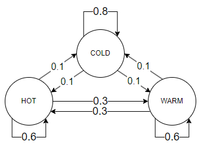
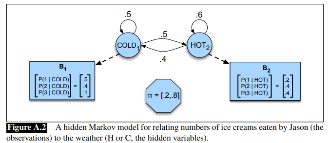
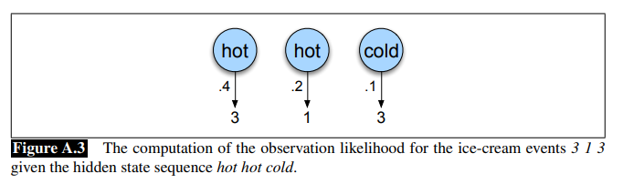
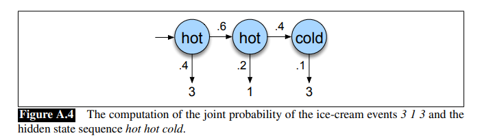
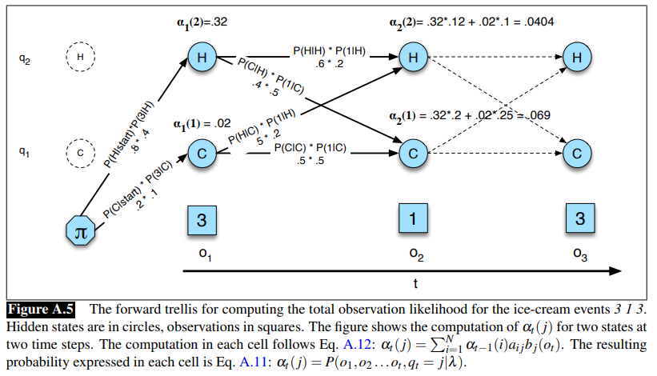
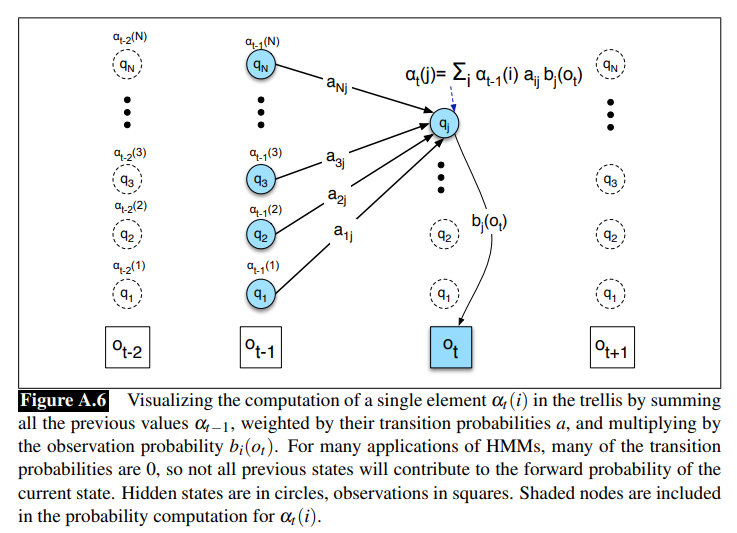
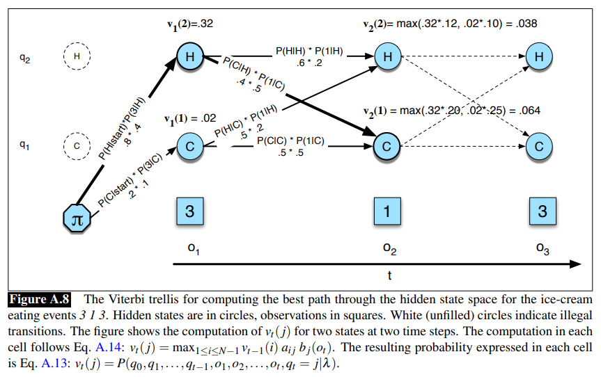
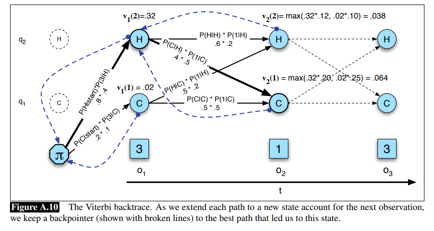

# 그리디 알고리즘

- 그리디 알고리즘(Greedy Algorithm)
  - 글로벌 최적을 찾기 위해 각 단계에서 로컬 최적의 선택을 하는 휴리스틱 문제 해결 알고리즘.
  - 그리디 알고리즘은 최적화 문제를 대상으로 한다.
    - 최적해를 찾을 수 있으면 그것을 목표로 삼는다.
    - 최적해를 찾기 어려운 경우에는 주어신 시간 내에 그런대로 괜찮은 해를 찾는 것을 목표로 삼는다.


- 그리디 알고리즘의 조건
  - 탐욕 선택 속성(Greedy Choice Property)을 갖고 있는 최적 부분 구조(Optimal Substructure)인 문제들이다.
    - 이 조건을 만족해야만 최적해를 찾을 수 있다.
    - 이 조건을 만족하지 않더라도 정답을 근사하게 찾는 용도로 활용할 수 있으며, 대부분의 경우 계산 속도가 빠르므로 매우 실용적이다.
  - 탐욕 선택 속성
    - 앞의 선택이 이후 선택에 영향을 주지 않는 것.
    - 즉 선택을 다시 고려하지 않는다.
  - 최적 부분 구조
    - 문제의 최적 해결 방법이 부분 문제에 대한 최적 해결 방법으로 구성되는 경우.


- 그리디 알고리즘 풀이 전략
  - 풀이 흐름
    - 관찰을 통해 탐색 범위를 줄이는 방법을 고안한다.
    - 탐색 범위를 줄여도 올바른 결과를 얻을 수 있다는 사실을 증명한다.
  - 정말 그리디 알고리즘으로 풀 수 있다는 확신이 없다면 그리디로 풀어선 안 된다.


- 동전 문제 풀기

  - 그리디 알고리즘으로 풀 수 있는 문제 중에서 가장 유명한 문제가 동전문제이다.
    - 여러 종류의 동전이 있을 때 최소한의 동전을 사용해서 값을 지불하는 문제이다.

  - 문제
    - 500, 100, 50, 10 네 종류의 동전이 있을 때, 1780원을 최소한의 동전으로 만들려고 한다.
    - 500원 짜리 3개, 100원 짜리 2개, 50원 짜리 1개, 10원 짜리 3개를 사용하면 최소 개수로 1780원을 만들 수 있다. 
  - 증명
    - 동전을 최소한으로 사용하면서 원하는 가격을 맞추기 위해서는 10원과 100원짜리 동전은 4개 이하, 50원 짜리 동전은 1개 이하로 사용해야한다.
    - 10원 짜리를 5개를 사용할 경우 50원 짜리 하나를 사용하는게 낫고, 100원짜리 5개를 사용할 경우 500원 짜리 하나를 사용하는 것이 나으며, 50원 짜리 2개를 사용할 경우 100원짜리 하나를 사용하는 것이 낫기 때문이다.
    - 동전을 최소한으로 사용하면서 원하는 가격을 맞추기 위해서는 500원 동전을 최대한 많이 사용해야한다. 
    - 10원짜리의 최대 개수인 4, 100원짜리 최대 개수인 4, 50원 짜리 최대 개수인 1을 모두 더해 봐야 490원이 한계이므로, 500원짜리 동전을 사용할 수 있음에도 사용하지 않을 경우 각 동전의 최대 상한보다 더 많은 양을 사용해야만 한다.
    - 500원을 최대한 사용해야하는 이유와 동일한 이유가 100, 50, 10원에도 적용된다.


## 탐욕 알고리즘 분석 기법

> https://gazelle-and-cs.tistory.com/59
>
> https://web.stanford.edu/class/archive/cs/cs161/cs161.1138/handouts/120%20Guide%20to%20Greedy%20Algorithms.pdf
>
> http://www.cs.cornell.edu/courses/cs482/2007su/ahead.pdf


- 탐욕 알고리즘의 분석
  - "현재로써 최선인 선택을 취한다."는 매우 단순한 원리를 가지고 있지만 탐욕 알고리즘으로 최적해를 구할 수 있다는 것을 증명하는 것은 매우 까다롭다.
    - 직관적으로 그럴 것 같은 것과 정말 그렇다는 것을 증명하는 것은 매우 다르다.
  - 분석이 까다로운 탐욕 알고리즘을 분석할 수 있는 기법들이 몇 가지 있는데 대표적으로 아래와 같은 것들이 있다.
    - Greedy stays ahead
    - Certificate argument
    - Exchange argument

  - Greedy 알고리즘을 사용하여 다양한 문제의 최적해를 구할 수 있다는 것을 각 기법으로 확인해 볼 것이다.


- Interval Scheduling 문제
  - 여러 작업들의 시작 시간과 종료 시간이 주어질 때, 기계가 처리할 수 있는 작업의 최대 개수를 구하는 문제이다.

    - 여러 작업을 처리해야하는 상황에서, 작업을 처리할 수 있는 기계는 하나 뿐이다.
    - 기계는 한 번에 하나의 작업만을 처리할 수 있지만, 한 작업이 끝남과 동시에 다른 작업을 시작할 수 있다.

    - 백준의 [회의실 배정](https://www.acmicpc.net/problem/1931) 문제도 이와 동일한 문제이다.

  - Interval scheduling 문제를 풀기 위한 greedy 알고리즘
    - 모든 작업을 종료 시각의 오름차순으로 정렬한 후 각 작업을 순서대로 고려하면서 기계에 할당할 수 있으면 넣고 그렇지 않으면 버린다.
    - 만일 작업의 종료 시각이 같다면 작업의 시작 시간을 기준으로 정렬한다.


### "Greedy stays ahead" arguments

- 방식
  - 최적해를 출력하는 가상의 알고리즘이 있다고 가정한다. 
  - 이 가상의 알고리즘이 알고리즘이 매번 선택을 할 때 탐욕 알고리즘이 어떤 선택을 하는지 살펴본다. 
  - 만약 탐욕 알고리즘의 선택이 최적 알고리즘의 선택보다 항상 (특정 기준에 따라) 뒤쳐지지는 않는다면, 전체적으로 봤을 때도 탐욕 알고리즘의 출력이 최적 알고리즘의 출력만큼은 좋다고 볼 수 있다.
  - 따라서 탐욕 알고리즘이 내놓은 답이 최적해가 된다.


- 과정
  - Solution 정의
    - greedy algorithm을 구현한다.
    - 구현한 greedy algorithm을 통해 얻을 수 있는 해들과 임의의 최적의 알고리즘을 통해 구할 수 있는 해들을 가정한다.
  - 척도(measure)를 정의
    - greedy algoritm을 통해 구할 수 있는 해들과, 임의의 최적 알고리즘을 통해 구할 수 있는 해들을 하나씩 비교할 수 있는 척도를 정의한다
    - 두 알고리즘을 통해 구한 해의 개수는 경우에 따라 같을 수도 있고 다를 수도 있다.
  - Greedy stays ahead를 증명
    - greedy로 구한 해가, 최적 알고리즘을 통해 구한 해 보다 위에서 정의한 척도 보다 모든 경우 뒤쳐지지는 않는 다는 것을 증명한다.
  - 최적성(optimality) 증명
    - 위에서 증명한 greedy stays ahead를 기반으로 greedy 알고리즘이 반드시 최적해를 산출해 낸다는 것을 증명한다. 
    - 이는 주로 greedy가 최적해를 구할 수 없다는 것을 가정했을 때 모순이 발생한 다는 것을 확인함으로써 이루어진다.


- Solution 정의
  - 작업들의 집합 T가 있으며, T의 원소들은 시작 시각과 종료 시각에 대한 정보를 가지고 있다.

  - 그리디 알고리즘은 집합 T를 종료 시각을 기준으로 오름차순으로 정렬하여 각 작업을 처음부터 순회하면서, 기계에 할당할 수 있으면 자신의 집합에 넣고, 그렇지 않으면 버린다.
    - 이를 통해 처리한 작업들의 집합을 S := {p<sub>1</sub>, p<sub>2</sub>, ... , p<sub>k</sub>}라 하며, 이는 기계에서 처리된 순서로 정렬되어 있다.
  - 임의의 최적의 알고리즘 역시 나름의 방식으로 집합 T에서 처리할 수 있다고 판단하는 작업들을 자신의 집합에 넣는다.
    - 이를 통해 처리한 작업들의 집합을 O := {q<sub>1</sub>, q<sub>2</sub>, ... , q<sub>k</sub>}라 하며, 이 역시 기계에서 처리되는 순서로 정렬되어 있다.


- 척도 정의

  - 어떤 작업 p에 대해 이 작업이 시작하는 시각을 s(p), 끝나는 시각을 f(p)라 한다.
    - 탐욕 알고리즘을 통해 얻은 집합 S의 원소들은 s(p<sub>1</sub>) <= f(p<sub>1</sub>) <= s(p<sub>2</sub>) <= f(p<sub>2</sub>) <= ... <= s(p<sub>k</sub>) <= f(p<sub>k</sub>)를 만족한다.
    - 임의의 최적의 알고리즘을 통해 O의 원소들도 s(p<sub>1</sub>) <= f(p<sub>1</sub>) <= s(p<sub>2</sub>) <= f(p<sub>2</sub>) <= ... <= s(p<sub>k</sub>) <= f(p<sub>k</sub>)를 만족한다.
    - 두 집합의 개별 원소들을 작업 시작 시각과 종료 시각으로 비교할 것이다.
  - 증명하고자 하는 명제는 k >= l 이라는 것이다.
    - 만약 탐욕 알고리즘을 통해 처리한 작업들의 개수가, 최적해를 통해 처리한 작업의 개수보다 크거나 같다면, 탐욕 알고리즘을 통해 최적해를 구할 수 있다는 것이다.
    - 즉, S 집합에 속한 작업의 개수 k가, O집합에 속한 작업의 개수 l보다 크다면, 탐욕 알고리즘을 통해 최적해를 구할 수 있음이 증명된다.


- Greedy stays ahead 증명

  - 집합 S와 집합 O 내에 있는 개별 원소들을 하나씩 비교하면서 개별 원소들에서 greedy로 구한 해가 최적 알고리즘으로 구한 해 보다 특정 척도(종료 시각)에서 뒤쳐지지 않는지를 확인할 것이다.
  - 정리: 1<= i <=m을 만족하는 모든 i에 대해 f(p<sub>i</sub>) <= f(q<sub>i</sub>)가 성립한다.
    - 이는 너무 분명한 사실로, 탐욕 알고리즘은 선택 가능한 작업들 중 종료 시간이 가장 빠른 작업을 선택한다.
    - 따라서 같은 순서(i번째)에 있는 S에 속한 작업 p<sub>i</sub>와 q<sub>i</sub>중 p<sub>i</sub>가 더 빠르거나, 최소한 q<sub>i</sub>와 같을 것이다. 
    - 즉, S에 속한 모든 i번째 작업의 종료 시각은 O에 속한 모든 i번째 작업의 종료 시각보다 빠르다.

  - Base case
    - 만약 i=1이라면 탐욕 알고리즘은 주어진 작업들 중 가장 빨리 끝나는 작업을 할당할 것이므로, f(p<sub>1</sub>) <= f(q<sub>1</sub>)을 만족할 것이다.
    - S는 작업을 처리하는 순서대로 정렬되어 있으므로 f(p1)은 모든 작업들 중 종료 시간이 가장 빠른 값일 수 밖에 없다. 
    - 따라서 f(p<sub>1</sub>)은 f(q<sub>1</sub>)보다 작거나 같을 수 밖에 없다.


- 최적성 증명
  - 반박될 가정: S가 최적해의 집합이 아니라면, S에 속한 작업의 개수 k는 O에 속한 작업의 개수 l보다 작을 것이다.
    - 만약 이 가정이 참이라면, S의 마지막 작업이 k번째 작업이기 때문에, O에는 k+1번째 작업이 있다는 말이 된다.
  - O의 k+1번째 작업인 q<sub>k+1</sub>은 q<sub>k</sub> 이후에 실행되어야 한다.
    - 그런데, 우리는 "모든 i = 1, ..., l에 대해 f(p<sub>i</sub>) <= f(q<sub>i</sub>)를 만족한다."는 사실을 알고 있다.
    - 이를 통해 S의 k번째 작업인 p<sub>k</sub>가 O의 k번째 작업인 q<sub>k</sub>보다 종료 시각이 빠르다는 거나 같다는 알 수 있다.
    - 따라서 f(p<sub>k</sub> ) <= f(q<sub>k</sub>) <= s(q<sub>k+1</sub>)와 같은 상황이 된다.
    - 이는 O의 k+1번째 작업이 S에 추가될 수 있음을 의미하는데, 이는 모순이다.
    - 따라서 S는 O 만큼의 작업의 개수를 가진다는 것을 알 수 있다.


### Certificate argument

- 방식
  - 알고리즘이 답과 함께 그것이 최적해라는 증거를 함께 출력하도록 하는 방식이다.


- 문제 및 그리디를 통한 해결
  - Interval schduling 문제의 변형
    - 여러 작업들의 시작 시간과 종료 시간이 주어질 때, 모든 작업을 처리하기 위한 기계의 개수를 구하는 문제.
    - 이전과는 달리 하나 이상의 기계를 사용할 수 있다.
    - 모든 작업을 처리해야하는데, 최소한의 기계만을 사용하여 모든 작업을 처리하고자한다.
    - 마찬가지로 하나의 기계는 하나의 작업만을 처리할 수 있으며, 한 작업이 끝남과 동시에 다른 작업을 처리할 수 있다.
    - 백준의 [강의실 배정](https://www.acmicpc.net/problem/11000)이 이와 유사한 문제이다.
  - 그리디를 활용한 해결 방법
    - 매 시각 t에 시작하는 작업이 있을 때, 지금까지 구매한 기계에 할당할 수 있으면 그것들 중 아무 것에 할당한다.
    - 현재까지 구매한 기계만으로 불가능하다면, 기계를 하나 더 구매하고 거기에 할당한 다음 t* ← t를 기억한다.


- 증명과정
  - 작업의 집합 P가 주어진다.
    - 각 작업 p ∈ P는 s(p)에 시작하고 f(p)에 끝난다.
    - 수행 시간이 겹치는 작업 두 개를 한 기계에 할당할 수 없다.
    - 그러나 한 작업이 끝날 때 바로 다음 작업을 실행할 수는 있다.
    - 모든 작업의 수행 시간을 [s(p), f(p))로 표현하여, 이러한 조건을 나타낼 수 있다.
  - 이 문제의 목적은 서로 겹치는 작업이 없는 P의 부분 집합들 중 원소의 개수가 가장 작은 부분 집합을 찾아내는 것이다.
    - 서로 겹치는 작업이 없는 P의 부분 집합들의 집합을 S라 한다.
    - 즉 임의의 서로 다른 두 작업 p, p' ∈ S에 대해, $$[s(p), f(p))∩[s(p'), f(p')) = \empty$$이다.
    - 따라서 우리의 목표는 S 중 그 크기가 가장 작은 것을 찾는 것이다.
  - 모든 작업을 소화하기 위해서 최소한 몇 대의 기계가 필요한가?
    - 모든 작업을 수행해야 하므로 어떤 시각에 동시에 수행되는 작업의 개수보다 적지 않아야한다.
    - 즉 임의의 시각 t에 수행되는 작업의 집합을 $$P_t := {p \in P : t \in [s(p),f(p))}$$라고 할 때, 반드시 아래의 정리를 만족해야한다.
  - 정리
    - 모든 작업을 할당하기 위해서는 임의의 시각 t에 대해 $$|P_t|$$ 이상의 기계가 필요하다.
    - 즉, S가 올바른 답이라면 반드시 $$|S|\ge max_t |P_t|$$를 만족한다.
    - 위 정리를 통해 아래와 같은 정리를 이끌어낼 수 있다.
    - 만약 알고리즘이 올바른 답 S와 함께 $$|S|=|P_{t*}|$$인 어떤 시각 t*를 찾는다면, S는 최적해이다.
  - 증명
    - 문제의 최적해를 O라 하자, 이 답은 올바른 답이므로 정리에 의해 $$|O| \ge max_t |P_t| \ge |P_{t*}| = |S|$$를 만족한다.
    - O는 최적해인데, S가 그것보다 크기가 더 작거나 같으므로 S도 최적해이다.
    - 즉, 알고리즘이 S와 함께 $$|S|=|P_{t*}|$$를 만족하는 어떤 시각 t*를 증거로 제출하면, 알고리즘이 최적의 답을 반환한다는 것을 보일 수 있다.


- Interval scheduling 문제에 적용

  - 이전에 살펴본 interval scheduling 문제에 적용하면 아래와 같은 과정을 거친다.
  - 작업들의 집합 P가 주어질 때, OPT(P)는 P의 작업들 중 서로 겹치는 작업이 없는 부분 집합의 최대 원소 개수를 나타낸다.
    - 서로 겹치는 작업이 없는 부분 집합을 S라 한다.
  - OPT(P)의 최솟값은 무엇인가?
    - OPT(P)가 적어도 k보다는 크거가 같다는 사실(즉 k가 OPT(P)의 최솟값이라는 사실)은 S 중 크기가 k 이상인 것이 있음을 보이면 된다.
    - 즉 $$OPT(P) \ge k$$임을 보이기 위해서는 원소의 개수가 k인 S가 있음을 보이면 된다.
    - S가 P의 서로 겹치는 작업이 없는 부분집합일 때, $$OPT(P) \ge |S|$$이 성립한다.
    - 즉 원소의 개수가 k인 S가 있다면 OPT(P)의 최솟값이 k라는 것을 certificate한다.
  - OPT(P)의 최댓값은 무엇인가?
    - Partition이란 P의 원소들 중 서로 시간이 겹치는 작업들을 모아놓은 부분집합이다.
    - 따라서 모든 partition을 합하면 전체 집합(P)가 된다.
    - 하나의 parition 내에서는 작업들 간에 서로 시간이 겹치기 때문에 답을 구하기 위해서는 partition마다 작업을 하나씩만 뽑아야한다(한 partition에서 둘 이상의 작업을 뽑을 경우 서로 겹치는 작업이 생기게 된다).
    - 예를 들어 아래 표에서 작업 시간이 겹치는 p1과 p2를 하나의 partition으로, p3를 하나의 파티션으로, p4, p5를 하나의 파티션으로 묶을 수 있다.
    - 혹은 [p1], [p2,p3], [p4,p5]와 같이 묶을 수도 있다.
    - 만약 $$P_1, ..., P_k$$가 P의 partition이고, 모든 $$i=1, ..., k$$에 대하여 $$P_i$$의 모든 작업들의 쌍이 서로 시간이 겹친다면, $$OPT(P) \le k$$이다.
    - 즉 OPT(P)의 최댓값은 P의 partition의 개수이다.

  |      | 0    | 1    | 2    | 3    | 4    | 5    | 6    | 7    |
  | ---- | ---- | ---- | ---- | ---- | ---- | ---- | ---- | ---- |
  | p1   | -    | -    | -    |      |      |      |      |      |
  | p2   |      | -    | -    | -    |      |      |      |      |
  | p3   |      |      |      | -    | -    | -    |      |      |
  | p4   |      |      |      |      |      |      | -    | -    |
  | p5   |      |      |      |      |      |      |      | -    |

  - 증명
    - O를 최적해라고 했을 때, 하나의 partition안에 있는 작업들과 O에 있는 작업들 중 겹치는 작업은 최대 1개이다.
    - 한 partition 안에서는 모든 작업들의 시간이 겹치기 때문에, 최적해만 모여있는 O에서는 최대 1개까지만 겹칠 수 있다.
    - 따라서 k개의 partition들 내부의 작업들과  O 내부의 작업들 중 겹치는 것을 모두 합해봐야 k개가 최대이다.
    - $$OPT(P) = O = \sum^k_{i=1} P_i \cap O \le k$$
    - 이렇게 구해진 OPT(P)의 최솟값과, 최댓값을 함께 제시하여 OPT(P)가 최적해임을 보장(certificate)할 수 있다.


### Exchange Argument

> https://web.stanford.edu/class/archive/cs/cs161/cs161.1138/handouts/120%20Guide%20to%20Greedy%20Algorithms.pdf

- Exchange Argument
  - Greedy algorithm의 최적성을 증명하기 위한 강력하고 다재다능한 기법이다.
  - 어떤 최적해를 반복적으로 greedy algorithm이 반환한 해로 변환해준다.
    - 이를 통해 greedy algorithm이 반환한 해가 최적해임을 증명한다.


- 일반적인 과정

  - Solution을 정의한다.
    - Greedy algorithm과 이것이 반환할 해를 정의한다.
    - Exchange Argument는 greedy algorithm이 반환한 해인 X를 최적해인 X*와 비교하는 방식으로 동작하기에 해를 명확하게 정의하는 것이 중요하다.
  - 해들을 비교한다.
    - 만약 X가 X*와 같지 않다면, 어디가 같지 않은지를 보여야한다.
    - 예를 들어 X의 일부가 X*에는 포함되지 않거나, X에 포함되어 있는 2개의 원소가  X\*에도 포함은 되어 있지만, 포함된 순서가 다를 수 있다.

  - Piece들을 교환(exchange)한다.
    - X*의 일부(piece)가 어떻게 X의 일부로 변환되는지를 보여야한다.
    - 일반적으로, 이전 단계에서 정의한 piece를 사용한다.
    - 이렇게 함으로써, X*의 cost를 증가시키거나 감소시키지 않고 최적해를 구할 수 있다.
  - 반복한다.
    - 최적해의 quaility에 영향을 주지 않으면서 교환을 수행함으로써 X와 X*의 차이를 줄이는 작업을 반복적으로 수행하여 X\*를 X로 변환한다.
    - 이를 통해 X는 최적해가 된다.
    - 즉 아래 과정을 통해서 최적해 O가 greedy를 통한 해 G로 순차적으로 변환된다.
    - O(최적) → O'(최적) → O''(최적) → O'''(최적) → ... → A(최적)


- 주의사항
  - X != X*라도 X가 최적해일 수 있다.
    - 한 문제에 대한 여러 개의 최적해가 있을 수 있기 때문이다.
    - 따라서 X!=X*라도 모순이 발생하지 않을 수 있다.
    - 만약 최적해가 단 1개뿐이라면, 모순이 발생할 것이다.
  - 한 번만 변환한다고 X*가 X가 되는 것은 아니다.
    - 한 번의 변환은 X*를 X가 서로 더 유사해지게는 하지만, X와 X\*가 동일한 상태가 된다는 것을 보장하지는 않는다.
    - 따라서 반복적으로 변환을 수행해야 하며, 모든 반복에는 해당 절차가 반복되어야하는 정당한 이유가 있어야한다.
  - X*를 X로 변환해야하는 이유가 명확해야한다.


- Minimize Lateness 문제
  - 수행해야 할 여러 개의 작업이 주어진다.
    - 각각의 작업에는 수행하는 데 걸리는 시간과 서로 다른 마감 기한이 있다.
  - 작업을 수행할 수 있는 기계는 1개 뿐이고, 기계는 여러 개의 작업을 동시에 진행할 수 없을 때, L의 최솟값을 구하라.
    - lateness는 한 작업이 작업 기한을 넘긴 정도중 최대값을 의미한다.
    - 예를 들어 마감 기한이 3인 A 작업을 4에 마쳤다면 lateness는 1이 된다.
    - L은 여러 작업의 lateness 중 최댓값을 의미한다.
    - 예를 들어 마감 기한이 3인 A 작업을 4에 마치고, 마감 기한이 4인 작업 B를 6에 마쳤다면 L은 작업 B가 기한을 넘긴 정도인 2가된다.
    - L의 값 중 최솟값을 찾아야한다.


- Exchange argument 적용

  - 문제 형식화하기

    - $$t_j$$는 작업 j를 완료하는 데 걸리는 시간이다.
    - $$d_j$$는 작업 j의 마감 기한이다.
    - $$s_j$$는 작업 j의 작업 시작 시각이다(이는 알고리즘에 의해 정해진다).
    - $$f_j=s_j+t_j$$는 작업 j가 끝나는 시각이다.
    - $$l_j$$는 작업 j의 lateness이다.

    $$
    l_j = \begin{cases}
    0 & \mbox{if}\ f_j \le d_j \\
    f_j - d_j, & \mbox{if }\ f_j > d_j
    \end{cases}
    $$

    - $$L=max_jl_j$$은 lateness 중 최댓값이다.

  - 목표는  L이 최솟값이 되는 일정을 찾는 것이다.

    - 이를 위해 여러 가지 정렬 방식이 있을 수 있다.
    - 작업 기간($$t_j$$)을 기준으로 정렬
    - 마감 기한($$d_j$$)을 기준으로 정렬
    - $$d_j-t_j$$ 기준으로 정렬
    - 이들 중 마감 기한을 기준으로 정렬했을 때만 최적해를 얻을 수 있다.

  - 증명 방식

    - 최적해 O와 greedy에 의해(마감 기한을 기준으로 정렬) 얻어진 해 G가 있다.
    - O와 G가 같지 않다고 가정한다. 
    - 새로운 해 O'를 얻기 위해 O를 수정할 수 있다.
    - O'는 O보다 나쁘지 않으며, G와 더 유사하다는 두 가지 조건을 만족해야한다.

  - 유휴시간

    - 이전 문제들과는 달리 시작 시각이 정해진 것이 아니다.

    - 시작 시각이 정해진 것이 아니기에 작업과 작업 사이에 아무 작업도 두지 않는 유휴시간은 두지 않는다.

  - Inversion

    - 이 문제에서 inversion이란 마감 기한이 더 느린 작업이 마감 기한이 더 빠른 작업보다 앞에 배치되는 상황을 의미한다.
    - 어떤 최적해 O에 inversion이 있다고 가정해보자.
    - 예를 들어 마감 기한이 1,2,3,4,5인 작업들이 있을 때 최적해 O에서 [1,2,3,5,4] 순으로 일정이 정렬되어 있다고 가정해보자.
    - 마감 기한이 더 느린 5가 4 앞에 왔으므로 inversion이 있는데, 이 두 작업을 swap하면 [1,2,3,4,5]가 되고, 이를 O'라고 해보자.
    - 우리가 보이고자 하는 것은 O를 O'처럼 변경하면 O보다 나빠지지 않으면서, G와 더 유사해짐을 보여야한다.

  - O를 O'처럼 변경하면 G와 유사해지는가?

    - G는 greedy에 의해 얻어진 해이므로 inversion이 있을 수 없다. 
    - 따라서 최적해 O에서 inversion을 제거하는 것은 G에 가까워지는 과정이라고 볼 수 있다.

  - O를 O'처럼 변경하면 O보다 나빠지지는 않는가?

    - 이 문제에서 O'가 O보다 나쁘지 않다는 것의 의미는 L이 더 커지지 않는다는 것을 의미한다.
    - 유휴시간이 없으므로, O가 O'가 된다고 L이 더 커지지는 않기에 나빠지지 않는다.

  - 따라서 O를 G로 변경하는 것이 가능하므로 G는 최적해라고 볼 수 있다.


- Interval scheduling 문제에 적용
  - 기호 정리
    - G = p<sub>1</sub>, ..., p<sub>k</sub>를 greedy algorithm에 의해 선택된 작업들이라고 가정한다.
    - O = q<sub>1</sub>, ..., q<sub>l</sub>를 최적해를 산출하는 algorithm에 의해 선택된 작업들이라고 가정한다.
    - 두 집합 모두 종료 시각을 기준으로 정렬되어 있다.
  - O를 A로 변환하면서 A가 최소한 O가 가지고 있는 만큼의 작업을 가지고 있다는 것을 보이는 것이 목표이다.
  - p<sub>i</sub>, q<sub>i</sub>가 서로 다른 최초의 element들이라고 가정해보자.
    - 즉, p<sub>i-1</sub>, q<sub>i-1</sub>까지는 서로 같았다.
    - p<sub>i-1</sub>, q<sub>i-1</sub>까지는 서로 같았기 때문에,  p<sub>i</sub>와 q<sub>i</sub>는 q<sub>1</sub>, ..., q<sub>i</sub>까지 중 어떤 것과도 작업 시간이 겹치지 않는다.
    - 또한 G는 가장 빨리 끝나는 작업들을 선택하므로,  p<sub>i</sub>의 종료 시각은 q<sub>i</sub>의 종료 시각보다 빠르거나 같다.
    - 따라서,  p<sub>i</sub>는 q<sub>i+1</sub>과 작업 시간이 겹치지 않는다.
    - 따라서 O에서 q<sub>i</sub>를  p<sub>i</sub>로 바꾼다 하더라도 O 집합 내에서 작업들은 여전히 겹치지 않으므로,  q<sub>i</sub>를  p<sub>i</sub>로 교체가 가능하다.
    - 이를 O가 G가 될 때까지 반복하면 된다.
  - O는 G 보다 많은 원소를 가질 수 없다.
    - 위 방식을 반복하면 O의 모든 원소를 G로 변환할 수 있다.
    - 만약 O가 G에 없는 작업을 가지고 있다면, 이 원소는 O에 있는 어떤 작업과도 겹쳐선 안된다.
    - 그런데 이는 G에 있는 어떤 작업과도 겹칠 수 없으므로 만약 그런 작업이 있었다면 G에도 포함되었을 것이다.
    - 그러므로 O는 G보다 많은 원소를 가질 수 없다.


# Raft Consensus Algorithm

> https://seongjin.me/raft-consensus-algorithm/
>
> [Paxos 보다 쉬운 Raft Consensus](https://medium.com/rate-labs/raft-consensus-%EC%9D%B4%ED%95%B4-%EA%B0%80%EB%8A%A5%ED%95%9C-%ED%95%A9%EC%9D%98-%EC%95%8C%EA%B3%A0%EB%A6%AC%EC%A6%98%EC%9D%84-%EC%9C%84%ED%95%9C-%EC%97%AC%EC%A0%95-f7ecb9f450ab)
>
> [In Search of an Understandable Consensus Algorithm](https://raft.github.io/raft.pdf?ref=seongjin.me)

- 뗏목 합의 알고리즘

  - 다수 노드로 이루어진 분산 시스템에서 전체 노드의 최신화 및 동기화 그리고 내결함성(False Tolerance)을 동시에 구현하기 위해 만들어진 합의 알고리즘이다.
    - 내결함성이란 시스템의 일부 구성 요소가 작동하지 않더라도 전체 시스템은 계속 작동할 수 있는 기능을 의미한다.
  - Diego Ongaro와 John Ousterhout이 [In Search of an Understandable Consensus](https://raft.github.io/raft.pdf?ref=seongjin.me)라는 논문을 통해 처음 소개했다.
    - 같은 목적을 위해 고안된 다른 알고리즘보다 이해와 구현이 쉬운 알고리즘을 만드는 것을 목표로 하여 만들어졌다.
  - Raft라는 이름을 붙인 이유
    - 통나무들(logs)을 모아서 무엇을 할 수 있을지를 생각하다 뗏목이 떠올랐다.
    - 기존에 널리 쓰이던 합의 알고리즘은 Paxos 알고리즘이라는 섬으로부터 탈출할지를 생각했다.
  - 합의(consensus)
    - 내결함성을 가진 분산 시스템의 기본이 되는 개념이다.
    - 분산 시스템 내에서 특정 데이터에 대한 동일한 값을 유지하기 위해 고안된 개념이다.
    - 분산 시스템 내의 노드들이 특정 데이터에 대한 동일한 값을 유지함으로써 일부 노드에 장애가 생기더라도 전체 시스템은 일관된 값을 제공할 수 있다.

  - 많은 분산 시스템이 채택한 알고리즘이다.
    - Kubernetes의 etcd
    - Docker swarm
    - MongoDB의 replica set


- Node의 종류
  - Leader
    - 클러스터를 대표하는 하나의 노드.
    - 클라이언트가 클러스터로 보낸 명령의 수신 및 전파, 그리고 클라이언트로의 응답을 처리한다.
    - 자신의 상태 메시지(heartbeat)를 주기적으로 모든 팔로워에게 전파한다.
  - Follower
    - 클러스터 내에서 리더가 아닌 모든 노드들.
    - 리더로부터 전파된 명령을 처리하는 역할을 수행한다.
  - Candidate
    - 리더가 없는 상황에서 새 리더를 정하기 위해 전환된 follower.
    - 리더로부터 일정 시간 이상 상태 메시지(heatbeat)를 받지 못한 팔로워는 candidate로 전환된다.


- 메시지 전파 방식
  - 리더는 수신된 명령에 대한 log를 생성하여 로컬에 저장한 뒤 모든 팔로워에게 복제하여 전달한다.
    - 각 팔로워는 전달받은 로그에 대한 응답을 다시 리더에게 보낸다.
  - 리더가 수신한 정상 응답 수가 클러스터 전체 노드의 과반수에 이르면, 리더는 로그를 통해 전파된 명령을 클러스터의 모든 노드가 동일하게 수행하도록 한다.
    - 그리고 그 결과를 클라이언트에게 반환한다.
    - 리더는 해당 로그를 클러스터 전체 노드가 똑같이 보유할 때 까지 로그 재전송을 주기적으로 반복한다.
  - 제 때 명령을 처리하지 못 한 팔로워가 있더라도, 그 팔로워는 정상 상태로 복구된 뒤 클러스터와의 연결이 재개되면 리더로부터 그동안의 명령 처리 기록이 포함된 로그들을 다시 전달받아 순차적으로 진행한다.


- 리더 선출
  - 관련 용어
    - Term: 새로운 선거가 시작된 시점주터 그 선거로 선출된 리더가 리더로서 기능하는 동안까지의 시간을 의미한다.
    - Election Timeout: 팔로워 상태의 노드가 후보자로 변환되기까지 대기하는 시간으로, 150~300ms 사이의 각기 다른 임의의 값이 주어진다.
    - Heartbeat: 리더가 다른 모든 팔로워에게 일정 시간 간격으로 반복 전달하는 메시지이다.
  - 리더 선출 과정
    - Term 번호가 부여되고, 클러스터 내의 각 노드들에 임의의 election timeout이 부여된다.
    - 리더가 없는 상태에서 모든 노드가 팔로워 상태를 유지하며, 각자에게 주어진 election timeout이 될 때까지 대기한다.
    - Election timeout에 가장 먼저 도달한 노드가 후보자로 전환되고, 새로운 term이 시작된다.
    - 후보자 노드는 자신에게 투표한 뒤 다른 노드들에게 투표 요청 메시지를 전송한다.
    - 만약 투표 요청 메시지를 수신한 노드가 해당 term 중에 아직 투표한 적이 없다면, 해당 메시지의 발신한 후보자 노드에게 투표 메시지를 보낸 후 자신의 election timeout을 초기화한다(이를 통해 선거 기간 중에 다른 후보자가 나오지 않게 된다).
    - 전체 노드 수의 과반에 해당하는 응답을 얻은 노드는 해당 term에 대한 새로운 리더로 선정된다.
  - 리더 노드가 리더 역할을 유지하는 방식
    - 리더 노드는 모든 팔로워 노드들에게 주기적으로 heartbeat를 전송한다.
    - 팔로워 노드는 리더 노드로부터 heartbeat를 받을 때 마다 자신의 election timeout을 초기화한다.
    - 이를 통해 리더가 정상적으로 동작하는 동안에는 새로운 후보자 노드가 나오지 않게 된다.
  - 리더에 문제가 생길 경우
    - 리더에 문제가 생겨 heartbeat를 전송하지 못할 경우 election timeout에 도달하는 노드가 생기게 된다.
    - Election timeout에 도달한 node는 후보자 노드로 전환되고, term 번호가 1 증가하게 된다.
    - 이후 위에서 살펴본 과정대로 리더 선출을 진행한다.
  - Term 번호의 역할
    - 클러스터의 모든 노드는 현재의 term 번호를 저장해두고, 서로 메시지를 주고 받을 때 이 번호도 함께 전송한다.
    - 문제가 생겼던 이전 리더 노드가 복구되면, 이 노드는 클라스터가 공유하는 term 번호와 자신의 term 번호를 비교한다.
    - 현재 클러스터 내에서 공유중인 term 번호가 자신의 번호가 낮은 것을 확인하면, 이전 리더 노드는 팔로워 노드로 전환된다.
  - 과반을 얻지 못하는 경우
    - 예를 들어 4개의 노드로 구성된 클러스터에서 매우 낮은 확률로 두 개의 노드가 동시에 후보자 노드가 되고, 이들이 각 2표씩을 얻는 경우가 있을 수 있다.
    - 이럴 경우 그대로 해당 term을 종료하고 새로운 term 번호와 함께 재선거를 시작한다.


- 정족수(Quorum)

  - 합의 알고리즘에서 일정 합의에 이르기 위해 필요한 수를 의미한다.
    - 뗏목 알고리즘에서 새로운 리더를 선출하기 위해서는 과반(`(N+1)/2`)이상의 응답을 얻어야 하므로, 이 때의 정족수는 `(N+1)/2`이다.
  - 클러스터의 관리 및 내결함성을 유지하는데 사용된다.
    - 정족수가 충족되지 않을 경우 클러스터가 제대로 기능할 수 없게 된다.
  - 내결함성을 위한 최적의 노드 수
    - 대부분의 합의 알고리즘을 채택한 분산 시스템에서는 전체 노드 수를 3 이상의 홀수로 두는 것을 권장한다.
    - 아래 표에서 확인할 수 있듯, 전체 노드 수가 3개일 때 부터 일부 노드에 장애가 발생해도 내결함성을 유지할 수 있다.
    - 또한 짝수로 구성하는 것도 가능은 하지만, 정족수의 비율이 홀수인 경우에 비해 높다는 단점이 있다.
    - 예를 들어 전체 노드가 3개인 경우나 4개인 경우 모두 허용 가능 장애 노드의 수는 1로 동일하지만, 정족수는 4개인 경우가 더 높다.
    - 그리고 짝수일 경우 후보자들이 동일한 수의 표를 얻어 재선거를 해야 하는 경우가 생길 수 있으므로 홀수로 설정하는 것이 좋다.

  | 전체 노드 수 | 정족수 | 허용 가능 장애 노드 수 |
  | ------------ | ------ | ---------------------- |
  | 1            | 1      | 0                      |
  | 2            | 2      | 0                      |
  | 3            | 2      | 1                      |
  | 4            | 3      | 1                      |
  | 5            | 3      | 2                      |
  | 6            | 4      | 2                      |
  | 7            | 4      | 3                      |
  | 8            | 5      | 3                      |
  | ...          | ...    | ...                    |
  | 2k           | k+1    | k-1                    |
  | 2k+1         | k+1    | k                      |


- Log
  - Log
    - Log는 index, term 번호, 상태 변경 명령으로 구성된 entry의 집합이다.
    - index와 term 번호가 같다면 같은 명령을 저장하고 있어야하는데, 이를 Log Matching이라한다.
  - Commit entry
    - Log는 leader가 생성하고, 과반수 이상의 서버에 복제되면 commit 된 것으로 간주한다.
    - 커밋할 때는 이전에 생성한 모든 로그까지 한꺼번에 commit한다.
    - 한 번 commit된 entry는 다음 term의 leader들에게 반드시 포함되는데, 이를 Leader Completeness라 부른다.
  - Log 복제 과정
    - Client가 leader node에게 data를 전송한다.
    - Leader node는 해당 data를 저장하고 있다가 다음 heartbeat를 다른 노드들에게 전송할 때 이 data를 log로 만들어서 함께 전송한다.
    - Follower 들 중 과반 이상이 해당 요청을 정상적으로 받을 경우 값이 commit 된다.
    - Leader는 client에게 응답을 보낸다.


- 구현
  - [simpleRaft](https://github.com/streed/simpleRaft) github repository에서 Python으로 raft algorithm을 구현한 코드를 볼 수 있다.
  - 다른 언어로 구현한 ratf alogrithm은 [링크](https://raft.github.io/?ref=seongjin.me)에서 볼 수 있다.


# Markov Model

- 마르코프 모형(Markov Model)

  - Markov Property
    - 미래의 상태는 오직 현재의 상태에만 영향을 받는 것을 의미한다.
    - 즉 미래의 상태는 과거의 상태에는 영향을 받지 않으며, 오직 현재의 상태에만 영향을 받는다.
    - 러시아 수학자 Andrey Markov가 러시아어 문헌에 나오는 글자들의 순서에 관한 모델을 구축하기 위해 제안된 개념으로, Markov의 이름을 따서 명명됐다.
    - 아래 수식은 Markov Property를 표현한 것이다.
    - 현재 상태 $q_i$가 일어날 확률을 $P[q_i|q_1,...,q_{i-1}]$와 같이 이전 모든 상태 $q_1,...,q_{i-1}$를 조건으로 계산하나 $P(q_i|q_{i-1})$와 같이 직전의 상태 만을 조건으로 계산하나 결과는 같다는 의미이다.
    - 즉 현재 상태($q_i$)가 나타날 확률은 오직 이전 상태($q_{i-1}$)에만 의존한다.

  $$
  P[q_i|q_1,...,q_{i-1}] = P(q_i|q_{i-1})
  $$

  

  - Markov model이란 여러 개의 상태가 존재할 때 상태간의 전의 확률을 Markov property로 정의한 것을 말한다.
    - 어떤 상태로 들어갈 확률이 들어가기 직전 상태에만 의존하는 확률 과정, 즉 다음에 나올 상태에 대한 확률값이 직전 과거에만 종속된 모델이다.
    - Pseudo-randomly(완전히 무선적이지는 않지만 무선적인 것 처럼) 변화하는 system을 modeling하기 위한 확률적 모델이다.
  - 각기 다른 상황에 쓰이는 4가지 Markov model이 있다.
    - 순차적인 상태가 모두 관측 가능한지 여부와 관찰 결과를 토대로 system을 조정하는지 여부에 따라 구분된다.

  |                                         | 모든 상태가 관측 가능   | 일부 상태만 관측 가능                        |
  | --------------------------------------- | ----------------------- | -------------------------------------------- |
  | 관측 결과를 토대로 system 조정          | Markov chain            | Hidden Markov Model                          |
  | 관측 결과를 토대로 system 조정하지 않음 | Markov decision process | Partially observable Markov decision process |

  - Markov chain(Markov process)
    - 가장 단순한 Markov model이다.
    - 시간에 따라 변화하는 random variable로 system의 state를 modeling한다.
  - Hidden Markov Model(HMM)
    - 상태가 부분적으로만 관측 가능하거나, 노이즈가 있는 상태로 관측 가능한 Markov Chain이다.
    - 관찰 결과가 system의 state와 관련되어 있기는 하지만, state를 정확히 결정하기에는 불충분한 경우이다.
    - Viterbi나 forward 같이 HMM을 위한 잘 알려진 algorithm들이 있다.
    - Viterbi algorithm은 가장 일치할 확률이 높은 state들의 sequence를 계산하는 algorithm이다.
    - Forward algorithm은 관찰 결과들의 sequence의 확률을 계산하는 algorithm이다.
  - Markov decision process
    - 상태의 전이가 현재 상태와 system에 적용되는 action vector에 영향을 받는 Markov chain이다.
  - Partially observable Markov decision process(POMDP)
    - System의 state가 부분적으로만 관찰 가능한 Markov decision process이다.


- 마르코프 연쇄(Markov Chain)

  - State라 불리는 ramdom variable들의 sequence의 확률을 계산하는 model이다.
    - State의 값은 특정 집합으로부터 설정된다.
    - 예를 들어 단어나 tag, 혹은 날씨와 같이 무엇이든 대표할 수 있는 상징이기만 하면 된다.
  - Markov chain은 sequence 내에서 미래를 예측할 때, 오직 현재 상태만을 고려해도 된다고 추정한다.
    - 현재 상태 이전의 상태는 현재 상태를 통하지 않고는 미래에 영향을 주지 않는다.
    - 예를 들어 내일 날씨를 추정할 때 오늘의 날씨만 토대로 하고 어제의 날씨는 고려하지 않는 것과 같다.
  - Markov Assumtion
    - Markov property를 포함하고 있는 model을 표현하기 위해 사용되는 용어이다.

  $$
  P(q_i=a|q_1,...,q{i-1}) = P(q_i=a|q_{qi-1})
  $$

  - 아래 그림은 weather event들의 sequence의 확률을 할당하기 위한 Markov chain을 보여준다.
    - 그래프상에서 state는 node로 표현되고, 전이는 전이의 확률과 함께 간선으로 표시된다.
    - 전이는 확률이기 때문에 하나의 state에서 출발한 arc들의 값의 합은 1이 되어야 한다.
    - 예를 들어 WARM에서 출발한 arc는 COLD로 전이되거나(확률 0.1), HOT으로 전이되거나(확률 0.3), 다시 WARM으로 전이된다(확률 0.6).
    - 이 때 각 확률을 모두 합한 확률은 1일 수 밖에 없다.

  

  - Markov chain은 아래 세 가지 요소로 구성된다.

    - $Q=q_1q_2...q_N$: $N$개의 state 집합
    - $A=a_{11}a_{12}...a_{N1}...a_{NN}$: 전이 확률 행렬 A, 각 원소 $a_{ij}$는 상태 i에서 상태 j로 이동할 확률을 나타낸다.
    - 아래 수식은 모든 $i$에 대하여($\forall i$) $i$에서 모든 가능한 상태 $j$로 전이될 확률의 합은 1이라는 의미이다.

    $$
    \sum_{j=1}^{n}a_{ij} =1\ \ \  \forall i
    $$

    - $\pi=\pi_1,\pi_2,...,\pi_N$: 초기 확률 분포로, 체인이 시작할 때 각 상태에서 시작할 확률을 나타낸다.
    - $\pi_i$는 Markov chain이 상태 $i$에서 시작할 확률을 나타내며, 어떤 state $j$는 $\pi_j=0$일 수 있다(즉, 해당 state에서 시작할 수 없을 수 있다).
    - 아래 수식은 초기 확률의 합은 1이라는 의미로, 체인은 반드시 하나의 상태에서 시작한다.

    $$
    \sum_{j=1}^{N}\pi_{i} = 1
    $$

  - 예시

    - State의 집합은 {HOT, COLD, WARM}이라는 세 개의 state로 구성된다.
    - 위 그림에서 HOT에서 HOT, COLD, WARM으로 전이될 확률은 각각 0.6, 0.1, 0.3이다.
    - HOT에서 시작할 확률은 0.6, COLD에서 시작할 확률은 0.3, WARM에서 시작할 확률은 0.1이라 할 때 $\pi_1$의 값은 0.6이다.

    $$
    Q=\{HOT, COLD, WARM\} \\
    \\
    A=\begin{bmatrix}
    .6 & .1 & .3 \\
    .1 & .8 & .1 \\
    .3 & .1 & .6
    \end{bmatrix} \\
    \\
    \pi_1 = 0.6
    $$

    - 이 때, state sequence [HOT, COLD ,WARM]의 확률은 아래와 같이 계산한다.
    - 초기 상태가 HOT으로 시작할 확률, 상태 HOT에서 COLD로 전이할 확률, 그리고 상태 COLD에서 WARM으로 전이할 확률을 곱하면 된다.

    $$
    P(Q)=P(HOT)⋅P(COLD∣HOT)⋅P(WARM∣COLD)\\
    P(HOT)=π_1=0.6\\
    P(COLD∣HOT)=A_{12}=0.1\\
    P(WARM∣COLD)=A_{23}=0.1 \\
    $$

    - 결국 0.6\*0.6\*0.1이 되어 확률은 0.006(0.6%)이 된다.


- Hidden Markov Model(HMM)

  - 실제 세계에서 우리가 관심있는 event들은 은닉되어(hidden)있다.

    - Markov chain은 관찰 가능한 event들의 sequence의 확률을 계산할 때는 유용하지만, 모든 event가 관찰가능하지 않을 경우에는 사용할 수 없다.
    - 예를 들어 일반적으로 text 그 자체에서 품사를 관찰할 수는 없으며, word sequence를 통해 품사를 추론해야한다.
    - 즉, "먹다"라는 word에는 품사에 대한 정보가 포함되어 있지 않으며(먹다(동사)와 같이 쓰지 않는다), 따라서 "다"로 끝나는 것을 토대로 동사라는 것을 추론해야한다.
    - 품사를 관찰할 수 없으므로 은닉되어(hidden)있다고 표현한다.

  - HMM은 관찰 가능한 event들과 은닉된 event들을 모두 고려한다.

    - 위에서 살펴본 세 개의 요소 외에 몇 가지를 추가적으로 고려한다.
    - $O=o_1o_2...o_T$: T개의 관측치들의 sequence.
    - $B=b_i(o_t)$: 관측치 확률의 sequence를 의미하며 emission probability(발산 확률)라고도 부른다.
    - 상태 $q_i$에서 관측치 $o_t$가 생성될 확률을 나타낸다(은닉된 상태로부터 관측치가 발산될 확률).

  - 1차 HMM은 두 가지 단순화된 가정을 설정한다.

    - Markov Assumtion: Markov chain에서 살펴봤던 것과 동일하다.
    - Output Independence: 출력 관측치 $o_i$의 확률은 오직 관측치를 생성한 상태인 $q_i$에만 의존하며, 다른 상태나 관측치에는 영향을 받지 않는다(그러므로 각 hidden state가 오직 하나의 관측치만을 생성한다).

    $$
    P(o_i|q_1...q_i,...,q_T,o_1,...,o_i,...o_T) = P(o_i|q_i)
    $$

  - 예시

    - 예를 들어 2799년에 이상 기후의 역사에 대해 연구하는 기상학자가 있다고 가정해보자.
    - 2020년에 Baltimore와 MaryLand의 날씨에 대한 기록이 남아있지 않은 상태이다.
    - 그러나 당시에 Jason Eisner라는 사람이 2020년 여름에 자신이 얼마나 많은 ice cream을 먹었는지 매일 기록한 일기는 가지고 있다.
    - 기상학자는 이 일기를 가지고 매일의 기온을 추정하려한다.
    - 단순화하기 위해 오직 cold와 hot이라는 두 가지 종류의 날씨만 있었다고 가정한다.
    - 결국 이 과제는 아래와 같이 요약할 수 있다.
    - Observation의 sequence O(sequence의 각각은 주어진 날짜에 먹은 ice cream의 개수이다)가 주어졌을 때, 이를 토대로 은닉된 기후 상태(hot, cold) sequence Q를 찾아야한다.

  - 아래 그림은 위 예시 task에 대한 HMM 예시를 보여준다.

    > [그림 출처](https://web.stanford.edu/~jurafsky/slp3/A.pdf)

    - 은닉된 상태: COLD, HOT.
    - 관측치: Jason이 주어진 날에 먹은 ice cream의 개수({1, 2, 3}).
    - $B$는 발산 확률을 나타내며, $B_1$은 COLD 상태에서 각 ice cream 개수가 관찰될 확률, $B_2$는 HOT 상태에서 각 ice cream 개수가 관찰될 확률이다.
    - 즉 $P(1|COLD)=0.5$는 숨겨진 상태가 COLD일 때, 관측치인 ice cream의 개수가 1일 확률이 0.5라는 의미이다.

  

  - HMM은 아래와 같은 세 가지가 핵심이다.
    - $A$는 전이 확률, $B$는 발산 확률을 의미한다.
    - Likelihood(우도) 계산: 주어진 $HMM λ=(A,B)$와 관측치 시퀀스 $O$에 대해 관측치 시퀀스 $O$가 HMM λ에 의해 생성될 확률$P(O|\lambda)=P(O|A,B)$을 계산하는 것.
    - Decoding: 주어진 $HMM λ=(A,B)$와 관측치 sequence $O$에 대해 가장 가능성이 높은 hidden state sequence $Q$를 찾는 것.
    - Learning: 주어진 관측치 시퀀스 $O$와 state들의 집합에 대해 HMM parameter인 A(전이 확률)와 B(발산 확률)를 학습하는 것.


- Likieihood(우도) 계산

  - Likelihood(모델 λ가 주어졌을 때 특정 관측치 sequence가 나타날 확률) 계산

    - 모델 λ를 통해 관찰값을 생성했을 때 실제 관측치 sequence와 동일하게 나타날수록, 모델 λ의 정확성이 높은 것으로 볼 수 있다.

  - Markov chain에서는 간단하게 구할 수 있다.

    - Markov chain에서는 관측치가 곧 state이므로, 관측치 sequence가 {3, 1, 3}일 확률을 구하려면 단순히 각 state를 따라 가면서 arc의 확률을 곱하기만 하면 된다.
    - 예를 들어 상태 전이 확률 행렬이 아래와 같을 때, 관측치 sequence가 {3, 1, 3}일 확률은 $P(3,1,3)=P(시작\ 상태가\ 3) \times P(1|3)\times P(3|1)$과 같이 계산하면 바로 구할 수 있다.

    $$
    A=\begin{bmatrix}
    P(3 \to 3) & P(3 \to 1) \\
    P(1 \to 3) & P(1 \to 1) \\
    \end{bmatrix} \\
    $$

  - 그러나 HMM에서는 위와 같이 단순하게 구할 수 없다.

    - Markov chain과 달리 HMM에서는 관측치(ice cream의 개수)와 state(날씨)가 다르기 때문이다.

  - Hidden state sequence를 알고 있다고 가정할 경우의 계산

    - 보다 단순한 상황를 가정해서, 우리가 이미 날씨 정보를 알고 있는 상태에서 Jason이 몇 개의 ice cream을 먹었는지 예측하기를 원한다고 가정해보자.
    - 주어진 hidden state sequence에 대해(e.g. {hot, hot, cold}) 관측치 sequence의 likelihood를 아래와 같이 단순하게 계산할 수 있다.
    - 먼저, HMM에서는 각 hidden state가 오직 하나의 관측치만을 생성한다는 것을 기억해야한다.
    - 그러므로, hidden state의 sequence와 관측치 sequence는 같은 길이를 갖는다.
    - 이 일대일 대응 관계와 Markov assumtion으로부터 아래와 같은 식을 도출할 수 있다.
    - 특정 hidden state의 sequence $Q=\{q_1,q_2,...,q_T\}$와 관측치 sequence $O=\{o_1,o_2,...,o_T\}$가 주어졌을 때, 관측치 sequence의 likelihood는 아래 식과 같다.

    $$
    P(O|Q) = \prod_{i=1}^TP(o_i|q_i)
    $$

    - 예를 들어 hidden state의 sequence {hot, hot, cold}와 ice cream 관측치 {3, 1, 3}가 주어졌을 때, forward probability의 계산은 아래와 같다.

    $$
    P(3\ 1\ 3 | hot\ hot\ cold) = P(3|hot) \times P(1|hot) \times P(3|cold)
    $$

    - 그림으로 나타내면 아래와 같다.

    

  - 그러나, 실제로는 hidden state sequence를 알 수 없다.

    - 따라서 모든 가능한 weather sequence를 고려하여 확률을 합산하여  ice cream event [3, 1, 3]의 확률을 계산해야한다.
    - 먼저, 특정 weather sequence Q와 관측치 sequence O가 동시에 발생할 확률(joint probability)을 계산한다.
    - $P(O,Q)$는 관측치 sequence O와 hidden state sequence Q가 동시에 발생할 확률이다.
    - $P(O|Q)$는 hidden state sequence Q에서 관측치 sequence O가 발생할 확률이며, 각 관측치는 hidden state로부터 발산하기 때문에 각 상태에서의 발산 확률인 $P(o_i|q_i)$의 곱으로 계산한다.
    - $P(Q)$는 특정 hidden state sequence Q 자체가 발생할 확률로, 상태 전이는 Markov property를 따르므로 현재 상태 $q_i$는 이전 상태 $q_{i-1}$에만 의존한다.

    $$
    P(O,Q)=P(O|Q) \times P(Q) = \prod_{i=1}^TP(o_i|q_i) \times \prod_{i=1}^TP(q_i|q_{i-1})
    $$

    - 예를 들어 hidden state sequence가 [hot, hot, cold]이고, ice cream 관측치 sequence가 [3, 1, 3]이면, 아래와 같이 계산한다.

    $$
    P(3\ 1\ 3,hot\ hot\ cold) = P(hot|start) \times P(hot|hot) \times P(cold|hot)\\
    \qquad \qquad \qquad \qquad \times P(3|hot) \times P(1|hot) \times P(3|cold)
    $$

    - 그림으로 나타내면 아래와 같다.

    

    - 특정 hidden state sequence와 관측치 sequence의 joint probability를 계산하는 식이 위와 같으므로, 관측치에 대한 총 확률을 구하는 식은 아래와 같이, 모든 가능한 hidden state sequence에 대한  joint probability를 합하면 된다.

    $$
    P(O)=\sum_QP(O,Q) = \sum_QP(O|Q)P(Q)
    $$

  - N개의 hiddne state와 T개의 관측치가 있을때, 가능한 hidden sequence의 개수는 $N^T$개 이다.

    - 예를 들어 위 예시에서 hidden state는 cold와 hot으로 2개가 있고, 관측치는 [3, 1, 3]으로 3개가 있으므로, 가능한 hidden sequence의 개수는 $2^3=8$개이다.
    - 실제 세계에서는 N과 T 모두 큰 값일 것이므로 $N^T$는 매우 큰 값이 될 것이다.
    - 따라서 각각의 모든 hidden state sequence에 대해서 우도를 계산한뒤 그 결과를 합하는 것은 현실적으로 불가능하다.
    - 그러므로 보다 효율적인 algorithm을 사용해야한다.


- Forward Algorithm

  - Likelihood를 $O(N^2T)$에 계산할 수 있게 해주는 algorithm이다.

    - DP를 사용하여 시간 복잡도를 줄인다.
    - 관찰 시퀀스의 확률을 계산하는 과정에서 중간 값을 저장하기 위해 테이블을 사용한다.
    - 관찰 시퀀스를 생성할 수 있는 모든 가능한 숨겨진 상태 경로의 확률을 합산하여 관찰 시퀀스의 확률을 계산한다. 
    - 이 과정에서 single forward trellis에 각 경로를 명시적으로 나열하는 방식으로 계산을 수행한다.

  - Forward trellis 예시

    - 아래 그림은 관측치 sequence [3, 1, 3]의 우도를 계산하는 forward trellis를 묘사한 것이다.
    - Hidden state는 원으로 표현되어 있고, 관측치는 정사각형으로 표현되어 있다.
    - 점선으로 그려진 원은 불가능한 전이를 나타낸다.

    

  - Forward algorithm의 각 cell에 해당하는 $\alpha_t(j)$는 주어진 automaton $λ$에 대해 시간 $t$에 상태 $j$일 확률을 나타내며, forward 확률이라 부른다.

    - 예를 들어 아이스크림 예시에서 $\alpha_2(1)$은 아이스크램 3개($o_1$)과 1개($o_2$)가 연속으로 관측됐고, 두 번째 시점(t=2)의 날씨가 cold($q_1$)일 확률이다.
    - $\alpha_t(j)$는 아래와 같이 표현할 수 있다.
    - $q_t=j$의 의미는 state sequence의 t번째 state가 $j$라는 의미이다.

  $$
  \alpha_t(j)=P(o_1,o_2...o_t,\ q_t=j|\lambda)\\
  $$

  - $\alpha_t(j)$의 값은 해당 cell에 도달할 수 있는 모든 경로의 확률의 합으로 계산한다.

    - 시간 $t$에 주어진 상태 $q_j$에 대하여 $\alpha_t(j)$는 아래와 같이 계산하며, 크게 세 부분으로 나뉜다.
    - $\alpha_{t-1}(i)$:  이전 시간 단계인 t−1에서 상태 i에 도달할 확률(이전의 Forward 경로 확률).
    - $a_{ij}$: 이전 상태 $q_i$에서 $q_j$로 전이될 확률(전이 확률).
    - $b_j(o_t)$: 상태 $j$에서 관찰값 $o_t$가 발산할 확률(발산 확률).

    $$
    a_t(j)=\sum_{i=1}^N\alpha_{t-1}(i) \times a_{ij} \times b_{j}(o_t)
    $$

  - 그림으로는 아래와 같이 표현할 수 있다.

  

  - $\alpha_2(2)$ 계산 예시
    - $\alpha_2(2)$은 time step 2일 때 state 2($q_2$, hot)일 forward 확률이다.
    - Time step 1에서 time step2의 state 2로 가는 두 개의 경로의 확률을 더하여 구할 수 있다.
    - 첫 번째 경로: $\alpha_1(1)\times P(H|C) \times P(1|H)$
    - 두 번째 경로: $\alpha_1(2) \times P(H|H) \times P(1|H)$
    - 각기 $\alpha_{t-1}(i)a_{ij}b_{j}(o_t)$의 형태로, 첫 번째 경로를 예로 들면 $a_1(1)$이 $\alpha_{t-1}$에 해당하고, $P(H|C)$가 $a_{ij}$에 해당하며, P(1|H)가 $b_j(o_t)$에 해당한다.
    - $\alpha_2(2)=\alpha_1(1)\times P(H|C) \times P(1|H)\ \ +\ \  \alpha_1(2) \times P(H|H) \times P(1|H)$
    - 이 예시에서 알 수 있는 것 처럼, forward algorithm은 특정 단계의 값을 구할 때, 직전 단계의 계산 결과를 활용한다.
    - $\alpha_2(2)$의 계산에 $\alpha_1(1)$, $\alpha_1(2)$의 결과가 활용된다.
  - Python으로 구현
    - `alpha[t-1, i] * trans_prob[states[i]][curr_state] * emission_prob[curr_state][observations[t]]`부분이 $\alpha_{t-1}(i)a_{ij}b_{j}(o_t)$에 해당한다.

  ```python
  import numpy as np
  
  def forward_algorithm(observations, states, start_prob, trans_prob, emission_prob):
      """
      Forward Algorithm 구현
      관찰값 시퀀스의 확률을 계산합니다: P(O | λ)
  
      Parameters:
          observations (list): 관찰값 시퀀스 (ex: [3, 1, 3])
          states (list): 상태 목록 (ex: ["COLD", "HOT"])
          start_prob (dict): 초기 상태 확률 π
          trans_prob (dict): 상태 전이 확률 A
          emission_prob (dict): 발산 확률 B
  
      Returns:
          float: 관찰값 시퀀스 O의 확률 P(O | λ)
      """
      # Step 1: 테이블 초기화
      T = len(observations)  # 관찰값 시퀀스 길이
      N = len(states)        # 상태의 수
      alpha = np.zeros((T, N))  # Forward 확률 테이블 초기화
  
      # Step 2: 초기화 (t = 0)
      for j, state in enumerate(states):
          alpha[0, j] = start_prob[state] * emission_prob[state][observations[0]]
  
      # Step 3: 재귀 단계 (t > 0)
      for t in range(1, T):
          for j, curr_state in enumerate(states):
              # 모든 경로 합산
              sum_ = 0
              for i in range(N):
                  sum_ += alpha[t-1, i] * trans_prob[states[i]][curr_state] * emission_prob[curr_state][observations[t]]
              alpha[t, j] = sum_
  
      # Step 4: 종료 단계 (모든 상태에서 확률 합산)
      total_prob = sum(alpha[T-1, j] for j in range(N))
  
      return total_prob, alpha
  
  # HMM의 파라미터 설정
  states = ["COLD", "HOT"]  # 숨겨진 상태 목록
  observations = [3, 1, 3]  # 관찰값 시퀀스
  start_prob = {"COLD": 0.2, "HOT": 0.8}  # 초기 상태 확률 π
  
  # 상태 전이 확률 A
  trans_prob = {
      "COLD": {"COLD": 0.5, "HOT": 0.5},
      "HOT": {"COLD": 0.4, "HOT": 0.6}
  }
  
  # 발산 확률 B
  emission_prob = {
      "COLD": {3: 0.1, 1: 0.5},  # COLD 상태에서 관찰값 3 또는 1이 나올 확률
      "HOT": {3: 0.4, 1: 0.2}    # HOT 상태에서 관찰값 3 또는 1이 나올 확률
  }
  
  # Forward Algorithm 실행
  total_probability, alpha_table = forward_algorithm(observations, states, start_prob, trans_prob, emission_prob)
  
  
  print("Forward 확률 테이블 (Alpha):\n")
  print(f"{'Time':<8} {' | '.join([f'{state:>}' for state in states])}")
  print("-" * (12 * (len(states) + 1)))
  for t, row in enumerate(alpha_table):
      formatted_row = " | ".join([f"{prob:.5f}" for prob in row])
      print(f"{t:<6} {formatted_row}")
  print("\n관찰값 시퀀스의 총 확률 P(O | λ): {:.6f}".format(total_probability))
  ```


- Decoding
  - Hiddne variable을 가진 HMM 같은 모델에서 어떤 variable들의 sequence가 관측치 sequence를 나오게 하였는지를 결정하는 작업을 decoding이라 부른다.
    - Ice cream 예시에서 [3, 1, 3]이라는 관측치와 HMM이 주어졌을 때, 최적의 hidden weather sequence를 찾는 작업이 decoding이라 할 수 있다.
    - 결국 관측치 집합 $O=o_1,o_2,...,o_t$와 HMM λ = (A, B)가 주어졌을 때, 가장 가능성이 높은 state의 집합 $Q=q_1q_2q_3q...q_T$를 찾아내는 과정이라 할 수 있다.
  - Forward algorithm을 사용하는 방식으로도 구할 수 있다.
    - 가능한 state sequence 각각에 대해서 forward algorithm을 실행하여 주어진 observation sequence에 대한 우도를 계산하는 방법도 있을 수 있다.
    - 그러나 이는 매우 많은 연산 횟수를 필요로 하기에 현실적으로 불가능하다.


- Viterbi algorithm

  - 최소 편집 거리와 DP를 사용하여 효율적으로 decoding을 수행하는 algorithm이다.
    - 아래 그림은 관측치 sequence [3, 1, 3]에 대해 viterbi trellis를 사용하여 가장 가능성이 높은 hidden state sequence를 찾는 방법을 묘사한 것이다.
    - 아래 그림에서 hidden state는 원으로 표현되어 있고, 관측치는 정사각형으로 표현되어 있으며, 불가능한 전이는 점선으로 표현되어 있다.
    - 두 개의 time step($t_1$, $t_2$)에서 두 개의 상태(cold, hot)에 대한 $v_t(j)$를 구하는 식이 나와있다.

  

  - Trellis의 각 cell에 해당하는 $v_t(j)$는 HMM이 주어진 atomaton에서 시간 단계 t까지의 관측치를 본 후 가장 가능성 있는 상태 시퀀스 $q_1,...q_{t-1}$을 거쳐 상태 j에 있을 확률을 나타낸다.
    - 수식으로는 아래와 같이 나타낸다.

  $$
  v_t(j)=\max_{q_1,...,q_{t-1}}P(q_1...q_{t-q},o_1,o_2,...o_t,q_t=j|\lambda)
  $$

  -  $v_t(j)$의 값은  $v_t(j)$에 도달하기 위한 가장 가능성 높은 경로를 재귀적으로 취하는 방식으로 계산된다.
     - 다른 DP algorithm과 마찬가지로, Viterbi 역시 각 cell을 재귀적으로 채워나간다.
     - 이미 계산이 완료된 $t-1$ time step에서 모든 상태의 확률을 계산하고, 해당 상태에서 현재 상태로 도달할 수 있는 경로들 중 가장 가능성이 높은 경로를 계산한다.
     - 시간 $t$에 상태 $q_j$에 있을 확률은 아래와 같이 계산한다.
     - $v_{t-1}(i)$: 이전 Viterbi 경로의 확률이다.
     - $a_{ij}$: 이전 상태 $i$에서 현재 상태 $j$로 전이할 확률(전이 확률)이다.
     - $b_j(o_t)$: 관측치 $o_t$가 현재 상태 $j$에서 나타날 확률(발산 확률)이다.

  $$
  v_t(j)=\max_{i=1}^N v_{t-1}(i) \times a_{ij} \times b_j(o_t)
  $$

  - Viterbi와 forward algorithm
    - 위 계산식을 보면 알 수 있듯이, 두 algorithm은 계산식은 거의 동일하다.
    - 다만 Viterbi algorithm은 이전 경로 확률들에 대해 최댓값을 취하지만, forward algorithm은 합산을 취한다.
    - 또한 Viterbi algorithm에는 forward algorithm에는 없는 backpointer라는 요소가 등장한다.
  - Backpointer가 필요한 이유
    - Forward algorithm은 우도만 계산하면 되는 반면에, Viterbi algorithm은 확률과 가장 확률이 높은 state sequence를 계산해야하기 때문이다.
    - 가장 확률이 높은 state sequence를 계산하기 위해서, 각 state에 이르기 위한 hidden state들의 경로를 추적한다.
    - 마지막에 도달했을 때, 최적 경로의 시작점까지 backtracing한다.
    - 이를 Viterbi backtrace라 부르며, 아래 그림에 묘사되어 있다.

  

  - Python으로 구현

  ```python
  import numpy as np
  
  def viterbi(observations, states, start_prob, trans_prob, emission_prob):
      """
      Parameters:
          observations (list): 관찰 시퀀스 (예: [3, 1, 3])
          states (list): 상태 목록 (예: ["COLD", "HOT"])
          start_prob (dict): 초기 상태 확률 π
          trans_prob (dict): 상태 전이 확률 A
          emission_prob (dict): 발산 확률 B
  
      Returns:
          tuple: (최적의 상태 경로, 그 확률)
      """
      T = len(observations)  # 관찰 시퀀스 길이
      N = len(states)        # 상태의 수
      
      # Viterbi 확률 테이블과 백포인터 초기화
      viterbi_prob = np.zeros((N, T))
      backpointer = np.zeros((N, T), dtype=int)
      
      # 1. 초기화 단계 (t = 0)
      for s, state in enumerate(states):
          viterbi_prob[s, 0] = start_prob[state] * emission_prob[state][observations[0]]
          backpointer[s, 0] = 0  # 시작 상태는 백포인터 없음
      
      # 2. 재귀 단계 (t > 0)
      for t in range(1, T):
          for s, curr_state in enumerate(states):
              max_prob, max_state = max(
                  (viterbi_prob[prev_s, t-1] * trans_prob[states[prev_s]][curr_state] * emission_prob[curr_state][observations[t]], prev_s)
                  for prev_s in range(N)
              )
              viterbi_prob[s, t] = max_prob
              backpointer[s, t] = max_state
      
      # 3. 종료 단계
      best_path_prob = max(viterbi_prob[:, T-1])
      best_path_pointer = np.argmax(viterbi_prob[:, T-1])
      
      # 4. 최적의 경로 추적
      best_path = [best_path_pointer]
      for t in range(T-1, 0, -1):
          best_path_pointer = backpointer[best_path_pointer, t]
          best_path.insert(0, best_path_pointer)
      
      # 상태 인덱스를 상태 이름으로 변환
      best_path_states = [states[i] for i in best_path]
      
      return best_path_states, best_path_prob
  
  # HMM의 파라미터 설정
  states = ["COLD", "HOT"]  # 숨겨진 상태 목록
  observations = [3, 1, 3]  # 관찰값 시퀀스
  start_prob = {"COLD": 0.2, "HOT": 0.8}  # 초기 상태 확률 π
  
  # 상태 전이 확률 A
  trans_prob = {
      "COLD": {"COLD": 0.5, "HOT": 0.5},
      "HOT": {"COLD": 0.4, "HOT": 0.6}
  }
  
  # 발산 확률 B
  emission_prob = {
      "COLD": {3: 0.1, 1: 0.5},  # COLD 상태에서 관찰값 3 또는 1이 나올 확률
      "HOT": {3: 0.4, 1: 0.2}    # HOT 상태에서 관찰값 3 또는 1이 나올 확률
  }
  
  # Viterbi 알고리즘 실행
  best_path, best_path_prob = viterbi(observations, states, start_prob, trans_prob, emission_prob)
  
  # 결과 출력
  print("최적의 상태 경로:", best_path)
  print("최적의 경로 확률:", best_path_prob)
  ```

