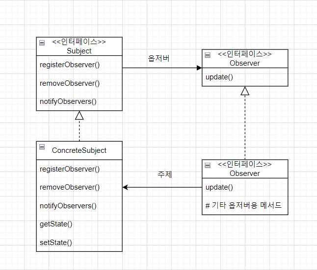
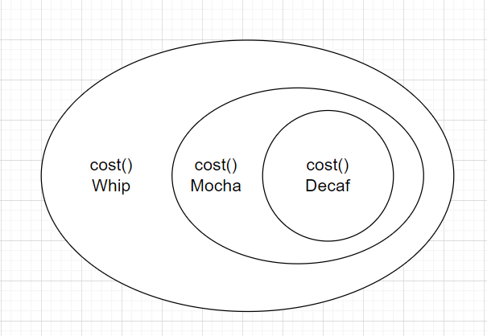
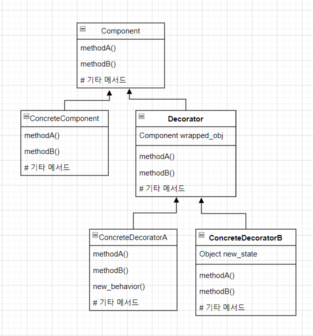
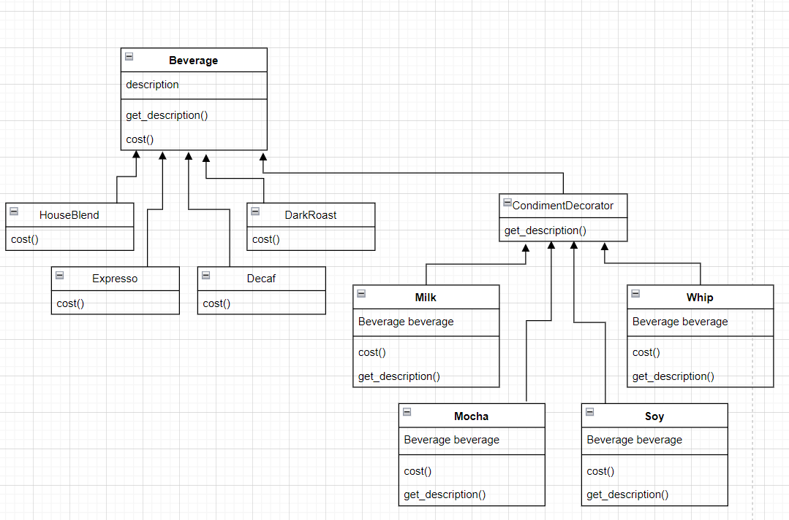

# Strategy Pattern

- 오리 시뮬레이션 게임, SimUduck

  - 오리 시뮬레이션 게임을 만들기 위해 아래와 같은 class들을 생성했다.
    - 모든 오리는 "quack"이라는 소리를 내며, 헤엄을 칠 수 있으므로 super class에 작성한다.
    - 오리의 종류별로 생김새는 다르므로, `display()` 메서드는 추상 메서드로 작성한다.

  ```python
  from abc import abstractmethod
  
  class Duck:
      def quack(self):
          print("quack quack")
      
      def swim(self):
          # 헤엄치는 code
      
      @abstractmethod
      def display(self):
          pass        
  
  
  class MallardDuck(Duck):
      def display(self):
          # MallardDuck의 생김새를 표현하는 code
          
          
  class RedheadDuck(Duck):
      def display(self):
          # RedheadDuck의 생김새를 표현하는 code
  ```

  - 오리에 날 수 있는 기능 추가하기.
    - 모든 오리가 날 수 있을 것이라 생각해 `Duck` class에 `fly()` 메서드를 추가한다.

  ```python
  class Duck:
      def quack(self):
          print("quack quack")
      
      def swim(self):
          # 헤엄치는 code
      
      def fly(self):
          # 나는 code
      
      @abstractmethod
      def display(self):
          pass
  ```

  - 문제 발생
    - `Duck`을 상속 받는 class 중 고무 오리를 표현한 `RubberDuck` class가 있었다.
    - 고무 오리는 날 수 없을 뿐더러 "quack" 소리를 내지도 않는다.
    - 이를 해결하기 위해 `RubberDuck` class의 메서드들을 아래와 같이 overide하여 작성한다.

  ```python
  class RubberDuck(Duck):
      def quack(self):
          print("quack quack")
      
      def swim(self):
          # 헤엄치는 code
      
      # 날 수 없으므로, 아무것도 하지 않는다.
      def fly(self):
          pass
      
      def display(self):
          # RubberDuck의 생김새를 표현하는 code
  ```

  - 새로운 문제 발생

    - 날 수 없고, "quack" 소리를 내지도 않는 나무 오리, 구리 오리, 황금 오리 등이 추가되기 시작한다.
    - 날 수 없고, "quack" 소리를 내지도 않는 무수히 많은 종류의 오리가 추가될 때 마다 메서드를 overide해야한다.

    - 해결 `fly()`와 `quack()` 메서드를 `Duck` super class에서 빼고 이를 interface로 작성한다.
    - 날 수 있고, "quack" 소리를 낼 수 있는 오리에게만 interface를 구현한다.

  ```python
  from abc import ABC, abstractmethod
  
  
  class Duck:
      def swim(self):
          # 수영하는 code
      
      @abstractmethod
      def display(self):
          pass
  
  
  class Quackable(ABC):
      @abstractmethod
      def quack(self):
          pass
  
  
  class Flyable(ABC):
      @abstractmethod
      def fly(self):
          pass
  ```

  - 이어지는 문제
    - Interface는 일반 class의 상속과는 달리, method를 상속받아서 그대로 사용할 수는 없고, 반드시 상속 받은 class에서 메서드를 구현해야 한다.
    - 만일 모든 `fly()`에 공통으로 들어가는 code가 있다면, 중복이 발생하게 된다.
    - 또, 만일 이 공통으로 들어가는 code가 변경된다면, interface를 구현한 모든 class를 찾아 일일이 바꿔줘야 한다.


- 모든 디자인 패턴의 기반이 되는 원리
  - 소프트웨어 개발에서 절대 바뀌지 않는 진리는 모든 소프트웨어는 바뀔 수 있다는 것이다.
  - 기반 원리
    - **상대적으로 변경이 일어날 것 같은 코드를 찾아 나머지 코드에 영향을 주지 않도록 캡슐화하여 바뀌지 않는 부분에 영향을 주지 않도록 따로 분리해야한다.**
    - 즉 바뀌는 부분은 따로 뽑아서 캡슐화하여, 나중에 바뀌지 않는 부분에 영향을 미치지 않고 그 부분만 고치거나 확장할 수 있도록 해야한다.


- Duck class에 적용하기

  - 변화하는 부분과 그대로 있는 부분을 분리하기
    - 변화하는 부분인 나는 행동과 꽥꽥 거리는 행동을 캡슐화하기 위해 모두 class로 만든다.
    - class들을 두 개의 집합(interface)으로 구분한다.
    - 하나는 나는 것과 관련된 부분, 다른 하나는 꽥꽥거리는 것과 관련된 부분이다.
    - 각 class 집합에는 각 행동을 구현한 것을 전부 집어넣는다.
    - 예를 들어 빽빽 거리는 행동을 구현하는 class를 만들고, 삑삑 거리는 행동을 구현하는 class를 만들고, 아무 것도 하지 않는 class를 만들어 꽥꽥거리는 것과 관련된 class 집합에 넣는다.
  - Class 집합을 디자인하기
    - 위에서 모든 문제의 원인이 오리의 행동과 관련된 유연성 때문이었으므로, 최대한 유연하게 만드는 것을 목표로한다.
    - 또한 Duck의 instance에 행동을 할당 할 수 있게 할 것이다.
    - 예를 들어 MallardDuck의 instance를 생성한 뒤에 특정 형식의 나는 행동으로 초기화하는 방식을 사용할 수 있을 것이다.
    - 또한 오리의 행동을 동적으로 바꾸는 것도 가능하도록 하기 위해서 Duck class에 행동과 관련된 setter 메서드를 추가해, 프로그램 실행 중에도 MallardDuck의 행동을 바꿀 수 있도록 한다.
  - **구현보다는 인터페이스에 맞춰서 프로그래밍한다.**
    - 각 행동은 인터페이스로 표현하고 이들 인터페이스를 사용해서 행동을 구현한다.
    - 나는 행동과 꽥꽥거리는 행동은 이제 Duck 클래스에서 구현하지 않는다.
    - 대신 특정 행동(삑삑 소래 내기)만을 목적으로 하는 클래스의 집합을 만든다.
    - 행동 인터페이스는 Duck 클래스가 아니라 행동 클래스에서 구현한다.
    - 예를 들어 `FlyBehavior`라는 interface를 만들고, 해당 interface를 구현하는 `FlyWithWings`, `FlyNoWay`라는 class를 만든 후, 각 class(`FlyWithWings`, `FlyNoWay`)에서 `fly` 메서드를 작성한다.

  - 인터페이스에 맞춰서 프로그래밍한다는 말은 상위 형식에 맞춰서 프로그래밍한다는 말이다.
    - 실제 실행 시에 쓰이는 객체가 코드에 고정되지 않도록 상위 형식(supertype)에 맞춰 프로그래밍해서 다형성을 활용해야한다는 의미이다.
    - 또 "상위 형식에 맞춰서 프로그래밍한다"는 원칙은 객체를 변수에 대입할 때 상위 형식을 구체적으로 구현한 형식이라면 어떤 객체든 넣을 수 있기 때문에, 변수를 선언할 때 보통 추상 클래스나 인터페이스 같은 상위 형식으로 선언해야한다는 의미이다. 이를 통해 변수를 선언하는 class에서 실제 객체의 형식을 몰라도 사용할 수 있게 된다.
  - 오리의 행동을 구현하기
    - `FlyBehavior`와 `QuackBehavior`라는 두 개의 인터페이스를 사용한다.

  ```python
  from abc import ABC, abstractmethod
  
  
  class FlyBehavior(ABC):
      @abstractmethod
      def fly(self):
          pass
  
  
  class FlyWithWings(FlyBehavior):
      def fly(self):
          # 나는 것과 관련된 행동
          
          
  class FlyNoWay(FlyBehavior):
      def fly(self):
          pass
  
      
  class QuackBehavior(ABC):
      @abstractmethod
      def quack(self):
          pass
      
      
  class Quack(QuackBehavior):
      def quack(self):
          # 꽥꽥 소리를 냄
      
      
  class Squeak(QuackBehavior):
      def quack(self):
          # 삑삑 소리를 냄
      
      
  class MuteQuack(QuackBehavior):
      def quack(self):
          # 아무 소리도 내지 않음
  ```


- 오리의 행동 통합하기

  - 가장 중요한 점은 나는 행동과 꽥꽥거리는 행동을 Duck class(혹은 그 sub class)에서 정의한 메서드를 써서 구현하지 않고 다른 클래스에 위임한다는 것이다.
  - 우선 Duck class에서 행동과 관련된 두 인터페이스(`FlyBehavior`, `QuackBehavior`)의 인스턴스 변수를 추가한다.
    - 즉 두 인터페이스의 인스턴스를 할당 받는 변수를 추가한다.
    - 인터페이스의 인스턴스 변수를 설정하는 이유는 동적 타이핑을 지원하지 않는 언어들(대표적으로 Java)의 경우 인터페이스를 구현한 모든 class를 변수에 대입하기 위해서 해당 인터페이스를 type으로 설정해야 하기 때문이다.
    - 각 sub class 객체에서는 실행시에 이 변수에 특정 행동 형식(`FlyWithWings`, `MuteQuack` 등)의 레퍼런스를 다형적으로 설정한다.
    
  - `Duck` class에 `perform_fly()`와 `perform_quack()`이라는 메서드를 추가한다.
    - 나는 행동과 꽥꽥거리는 행동은 `FlyBehavior`와 `QuackBehavior` 인터페이스로 옮겨놨으므로, `Duck` class와 모든 subclass에서 `fly()`와 `quack()` 메서드를 제거한다.
  
  ```python
  class Duck:
      def __init__(self):
          self.fly_behavior = None
          self.quack_behavior = None
          
      def swim(self):
          # 수영하는 code
      
      @abstractmethod
      def display(self):
          pass
  
      def perform_fly(self):
          self.fly_behavior.fly()
      
      def perform_quack(self):
          self.quack_behavior.quack()
  ```
  
  - 실제 Duck 객체를 생성할 때, 행동 객체를 설정해준다.
    - 상속 받은 `perform_quack`, `perform_fly` 메서드를 실행할 때, 각기 실제 행동의 실행은 `Quack`, `FlyWithWings`에 위임된다.
    - 예시로 `MallardDuck`를 살펴보면 아래와 같다.
  
  ```python
  class MallardDuck(Duck):
      def __init__(self):
          self.fly_behavior = FlyWithWings()
          self.quack_behavior = Quack()
      
      def display(self):
          # display code
  ```
  
  - 참고
    - 특정 구현에 맞춰서 프로그래밍해선 안된다고 했지만, `MallardDuck` class를 보면 `self.fly_behavior = FlyWithWings()`과 같이 `FlyWithWings`라는구현되어 있는 구상 class의 인스턴스를 만들었다.
    - 이는 단순함을 위해 이렇게 한 것으로, 추후에 변경할 것이다.
    - 그러나 이 코드 역시 실행 시에 행동 class를 동적으로 변경하는 것이 가능하므로, 유연하기는 하다.


- 동적으로 행동 지정하기

  - Duck class에서 행동을 동적으로 지정하기 위한 method를 추가한다.

  ```python
  class Duck:
      # ...
      def set_fly_behavior(self, fb):
          self.fly_behavior = fb
      
      def set_quack_behavior(self, qb):
          self.quack_behavior = qb
  ```

  - 위에서 추가한 method를 사용해 behavior를 변경한다.

  ```python
  rubber_duck = RubberDuck()
  rubber_duck.set_fly_behavior(MuteQuack())
  ```


- 구성
  - 오리에는 `FlyBehavior`와 `QuackBehavior`가 있으며, 각각 나는 행동과 꽥꽥거리는 행동을 위임 받는다.
  - 이런 식으로 두 클래스를 합치는 것을 구성(composition)을 이용한다고 부른다.
    - 오리 class들은 행동을 상속받는 대신, 올바른 행동 객체로 구성되어 행동을 부여받는다.
    - 상속이 "A는 B다"로 표현된다면, 구성은 "A에는 B가 있다"로 표현된다.
  - **상속보다는 구성을 활용해야한다.**
    - 지금까지 봐 왔던 것 처럼, 구성을 활용해서 시스템을 만들면 유연성을 크게 향상시킬 수 있다.
    - 구성은 여러 디자인 패턴에서 사용된다.


- 지금까지 살펴본 디자인 패턴을 전략 패턴(Strategy pattern)이라 부른다.
  - 알고리즘군을 정의하고 캡슐화해서 각 알고리즘군을 수정해서 쓸 수 있게 해주는 패턴으로, 클라이언트로부터 알고리즘을 분리해서 독립적으로 변경할 수 있다.
  - 위 예시에서는 오리의 각 행동이 알고리즘군이라 할 수 있다.
    - 즉, `FlyBehavior`라는 알고리즘군과, `QuackBehavior`라는 알고리즘군이 있다.
  - 즉, "오리들의 다양한 행동을 전략 패턴으로 구현하고 있다"는 말은 아래와 같은 뜻이다.
    - 오리의 행동을 쉽게 확장하거나 변경할 수 있는 클래스들의 집합으로 캡슐화되어 있다.
    - 또한 필요시 실행중에도 확장과 변경이 가능하다.


# Observer Pattern

- 기상 모니터링 애플리케이션 만들기

  - 기상 모니터링 애플리케이션은 아래 세 부분으로 구성된다.
    - 기상 스테이션: 실제 기상 정보를 수집하는 물리 장비.
    - WeatherData 객체: 기상 스테이션으로부터 오는 정보를 추적하는 객체
    - 디스플레이: 사용자에게 현재 기상 조건을 보여 주는 디스플레이 장비.
  - WeatherData class는 아래와 같이 구성된다.
    - `get_temperature()`: 온도를 반환하는 메서드
    - `get_humidity()`: 습도를 반환하는 메서드
    - `get_pressure()`: 기압을 반환하는 메서드
    - `measurements_changed()`: WeatherData에서 갱신된 정보를 가져올 때 마다 호출되는 메서드.

  - 우리는 이 중에서 WeatherData 객체에서 data를 가져와 디스플레이에 보여주는 기능을 개발해야한다.
    - 기온, 습도, 기압을 보여줘야한다.
    - 새로운 기상 측정 데이터가 들어올 때 마다 `measurements_changed()` 메서드가 호출된다.
    - 기상 데이터를 사용하는 디스플레이 요소 3가지를 구현해야 하는데, 그 3가지는 현재 조건 디스플레이, 기상 통계 디스플레이, 기상 예보 디스플레이이다.
    - 위 세 가지 외에 또 다른 디스플레이가 추가될 가능성도 고려하여 확장성 있는 코드를 작성해야한다.
    - WeatherData에서 새로운 측정값이 들어올 때마다 디스플레이를 갱신해야한다.
  - 일단 작성해보기

  ```python
  class WeatherData:
      def __init__(self):
          # 인스턴스 변수 선언
          
      def measurements_changed(self):
          temp = self.get_temperature()
          humidity = self.get_humidity()
          pressure = self.get_pressure()
          
          # 현재 상태를 보여주는 display
         	self.current_conditions_display.update(temp, humidity, pressure)
          # 기상 통계를 보여주는 display
          self.statistics_display.update(temp, humidity, pressure)
          # 기상 예보를 보여주는 display
          self.forecast_display.update(temp, humidity, pressure)
      
      # get_temerature 등의 다른 methods
  ```

  - 위 코드에서 잘 구현된 점과 잘 못 구현된 점
    - 구체적인 구현에 의존해서 짰으므로 프로그램을 수정하지 않고는 다른 디스플레이를 추가하거나 제가할 수 없다.
    - 실행 중에 디스플레이를 추가하거나 제거 할 수 없다.
    - 바뀔 수 있는 부분(display 부분)을 캡슐화하지 않았다.
    - display를 보여주는 모든 부분은 `update`라는 공통된 메서드를 가지고 있는 것으로 보아 공통된 인터페이스를 사용하고 있는 점은 잘 구현된 것이다.


- 옵저버 패턴

  - 옵저버 패턴은 신문사의 구독 서비스와 유사한데, 신문은 아래와 같은 특징이 있다.

    - 신문사가 사업을 시작하고 신문을 발행하기 시작한다.
    - 독자가 특정 신문사에 구독 신청을 하면, 구독을 해지하기 전까지 매번 새로운 신문이 나올 때마다 배달을 받을 수 있다.
    - 신문을 더 이상 보고 싶지 않으면 구독 해지 신청을 한다.
    - 신문사가 망하지 않는 이상 개인, 호텔, 항공사, 회사 등은 꾸준히 신문을 구독하거나 해지한다.

  - 옵저버 패턴에서 신문사를 주제(subject), 구독자를 옵저버(observer)라 부른다.

    - 주제에서는 중요한 데이터(신문)를 관리한다.
    - 주제가 관리하는 데이터에 변경 사항이 있을 경우 옵저버에게 그 소식이 전해진다.
    - 옵저버 객체들은 주제 객체에 등록되어 있으며(주제를 구독하고 있으며) 주제 데이터가 바뀌면 갱신 내용을 전달받는다.

  - 작동 원리

    - 새로운 객체가 등장해 주제에게 자신도 옵저버가 되고 싶다고 이야기한다.
    - 이제 주제는 이 새로운 객체를 옵저버로 등록하고, 새로 추가된 옵저버는 주제로부터 변경 사항을 받게 된다.
    - 이번에는 현재 옵저버인 객체가 옵저버 목록에서 탈퇴하고 싶다는 요청을 한다.
    - 주제는 옵저버 목록에서 이 객체를 제외시킨다.
    - 이 객체는 이제 주제에서 변경 사항을 받지 않게 된다.

  - 정의

    - 한 객체의 상태가 변경되면 그 객체에 의존하는 다른 객체들에게 연락이 가고 자동으로 내용이 갱신되는 방식으로 일대다 의존성을 정의하는 방식이다.

  - 구현

    - 다양한 구현 방식이 있지만 일반적으로 주제 인터페이스와 옵저버 인터페이스가 들어 있는 클래스 디자인으로 구현한다.

    

    - 옵저버를 등록하거나 옵저버 목록에서 탈퇴하고자 할 때는 `Subject` 인터페이스에 있는 메서드를 사용한다.
    - 각 주제 마다 여러 개의 옵저버가 있을 수 있다.
    - 옵저버가 될 가능성이 있는 객체는 반드시 Observer 인터페이스를 구현해야하며, 이 인터페이스에는 주제의 상태가 바뀌었을 때 호출되는 `update()` 메서드 밖에 없다.
    - 주제 역할을 하는 구상 클래스(`ConcreteSubject`)에는 항상 `Subject` 인터페이스를 구현해야하며, 등록 및 해지용 메서드와 상태가 바뀔 때마다 모든 옵저버에게 연락하는 `notifyObservers()` 메서드도 구현해야한다. 또한 setter, getter도 있을 수 있다.
    - `Observer` 인터페이스를 구현한다면, 무엇이든 옵저버 클래스가 될 수 있다.

  - Pub-Sub 패턴과의 관계

    - Publish-Subscribe 패턴 역시 publisher가 다양한 subscriber에게 메시지를 전달한다는 점에서는 유사하다.
    - 그러나 완전히 동일한 패턴이라고 볼 수는 없다.
    - 옵저버 패턴과는 달리 pub-sub 패턴의 경우 중간에 broker 혹은 event bus라 불리는 중계층이 있다.
    - 따라서 publisher, subscriber는 서로의 존재에 관심이 없으며, 알 필요도 없다.
    - 그러나, 옵저버 패턴의 경우 주제가 옵저버에 대한 정보를 알고 있어야 한다.
    - 따라서 pub-sub 패턴이 결합도가 더 낮으며, 여러 도메인에 걸쳐 사용하기도 훨씬 편리하다.


- 옵저버와 느슨한 결합

  - 느슨한 결합(Loose Coupling)
    - 객체들이 상호작용할 수는 있지만, 서로를 잘 모르는 관계를 의미한다.
    - 유연성이 높은 코드를 작성할 수 있게 해준다.
  - 주제는 옵저버가 특정 인터페이스를 구현한다는 사실만을 안다.
    - 옵저버의 구상 클래스가 무엇인지, 옵저버가 무엇을 하는지는 알 필요가 없다.

  - 옵저버는 언제든 추가와 제거가 가능하다.
    - 주제는 Observer 인터페이스를 구현하는 객체의 목록에만 의존하므로 언제든지 새로운 옵저버를 추가할 수 있다.
    - 마찬가지로 언제든 제거도 가능하다.
  - 새로운 형식의 옵저버를 추가할 때도 주제를 변경할 필요가 없다.
    - 새로운 클래스 형식의 옵저버라고 해도, Observer 인터페이스를 구현하기만 했다면, 주제는 변경사항 없이 새로운 옵저버를 추가할 수 있다.
  - 주제와 옵저버는 서로 독립적으로 재사용할 수 있다.
    - 주제나 옵저버를 다른 용도로 활용해야 한다고 하더라도, 둘이 단단히 결합되어 있지 않기에 손쉽게 재사용 할 수 있다.
  - 주제나 옵저버가 달라져도 서로에게 영향을 미치지 않는다.
    - 서로 느슨하게 결합되어 있으므로, 주제나 옵저버 인터페이스를 구현한다는 조건만 만족하면 어떻게 고쳐도 문제가 생기지 않는다.


- 옵저버 패턴 정의하기

  - 인터페이스 작성하기

  ```python
  from abc import ABC, abstractmethod
  
  
  class Subject(ABC):
      @abstractmethod
      def register_observer(self, observer):
          pass
      
      @abstractmethod
      def remove_observer(self, observer):
          pass
      
      # 주제의 상태가 변경되었을 때 모든 옵저버에게 변경 내용을 알리는 메서드
      @abstractmethod
      def notify_observer(self):
          pass
  
      
  class Observer(ABC):
      @abstractmethod
      def update(self, tmep, humidity, pressure):
          pass
  
  # 모든 display에 공통으로 들어가는 내용을 정의하기위한 인터페이스
  class DisplayElement(ABC):
      @abstractmethod
      def display(self):
          pass
  ```

  - Subject 인터페이스 구현하기

  ```python
  class WeatherData(Subject):
      def __init__(self):
          self.observers = []
          self.temperature = None
          self.humidity = None
          self.pressure = None
      
      def register_observer(self, observer):
          self.observers.append(observer)
      
      def remove_observer(self, observer):
          self.observers.remove(observer)
      
      # 모든 옵저버에게 상태 변화를 알린다.
      def notify_observers(self):
          for observer in self.observers:
              observer.update(self.temperature, self.humidity, self.pressure)
      
      # 기상 스테이션으로부터 갱신된 측정값을 받으면 옵저버들에게 알린다.
      def measurements_changed(self):
          self.notify_observers()
      
      # 기상 스테이션으로부터 갱신된 측정값을 받는다.
      def set_measurements(self, temperature, humidity, pressure):
          self.temperature = temperature
          self.humidity = humidity
          self.pressure = pressure
          self.measurements_changed()
  ```

  - 디스플레이 요소 구현하기
    - 예시를 위해 현재 날씨 정보를 보여주는 클래스만 구현한다.

  ```python
  class CurrentConditionDisplay(Observer):
      def __init__(self, weather_data):
          self.temperature = None
          self.humidity = None
          self.pressure = None
          # 굳이 subject인 weather_data를 인스턴스 변수에 저장하는 이유는 추후 탈퇴시 사용하기 위함이다.
          self.weather_data = weather_data
          self.weather_data.register_observer(self)
          
      def update(temperature, humidity, pressure):
          self.temperature = temperature
          self.humidity = humidity
          self.pressure = pressure
          self.display()
      
      def display(self):
          print("t:{}, h:{}, p:{}".format(self.temperature, self.humidity, self.pressure))
  ```


- Pull 방식
  - Push 방식
    - 지금까지 구현한 방식은 push 방식이다.
    - 주제가 옵저버에게 데이터를 push한다하여 이렇게 부른다.
  - Push 방식의 문제
    - 만일 온도, 습도, 기압 이외에 풍속이라는 새로운 유형의 data가 추가되었다고 가정하자. 
    - 풍속 디스플레이는 온도, 습도, 기압에는 관심이 없고 오직 풍속만을 보여주면 된다.
    - 그러나 push 방식은 비효율적이게도 온도, 습도, 기압, 풍속 중 어느 하나에만 변경사항이 있어도 모든 옵저버들에게 모든 기후 정보를 보낸다.
  - Pull 방식
    - 주제가 옵저버에게 데이터를 push하는 것이 아니라 옵저버가 주제로부터 데이터를 pull하는 방식.
    - Push와 pull 어느 한 쪽이 맞는 방식이라고 할 수는 없으나 대부분의 경우 pull 방식이 더 적절하다.


- Pull 방식으로 코드 변경하기

  - 옵저버의 `update()` 메서드를 인자 없이 호출하도록 `WeatherData` 클래스의 `notifiy_observers()` 메서드를 수정한다.
    - 또한 각 기후 요인 별로 getter 메서드를 구현한다.

  ```python
  class WeatherData(Subject):
      # (...)
      def notify_observers(self):
          for observer in self.observers:
              observer.update()
      
      def get_temperature(self):
          return self.temperature
      
      # 위와 같은 형태로 humidity, pressure 등도 구현한다.
  ```

  - Observer 인터페이스에서 update 메서드의 매개변수를 병경한다.

  ```python
  class Observer(ABC):
      @abstractmethod
      def update(self):
          pass
  ```

  - Observer 인터페이스의 각 구상 클래스의 `update` 메서드도 변경한다.

  ```python
  class CurrentConditionDisplay(Observer):
      # (...)
          
      def update(temperature, humidity, pressure):
          self.temperature = self.weather_data.get_temperature()
          self.humidity = self.weather_data.get_humidity()
          self.pressure = self.weather_data.get_pressure()
          self.display()
  ```


# Decorator Pattern

- 커피 전문점 스타버즈

  - 사업이 확장됨에 따라 다양한 음료를 모두 포괄하는 주문 시스템을 갖추려고 한다.
  - 기존의 주문 시스템은 다음과 같았다.
    - `Beverage`라는 추상 class가 있고, 이 추상클래스를 상속받는 실제 음료 class가 있다.
    - `get_description()`은 메뉴에 대한 설명을, `cost()`는 메뉴의 가격을 반환한다.

  ```python
  from abc import *
  
  class Beverage(metaclass=ABCMeta):
      def __init__(self, description):
          self.description = description
      
      @abstractmethod
      def get_description(self):
          pass
      
      @abstractmethod
      def cost(self):
          pass
  
  class HouseBlend(Beverage):
      pass
  
  class DarkRoast(Beverage):
      pass
  
  class Decaf(Beverage):
      pass
  ```

  - 문제는 토핑의 조합에 따라 하나의 메뉴의 가격이 달라질 수 있다는 점이다.
    - 따라서 이 모든 가격을 반영하기 위해 토핑마다 class를 생성한다.
    - 메뉴, 토핑이 증가할수록 무수히 많은 class를 생성해야한다.

  ```python
  class DecafWithSoy(Beverage):
      pass
  
  class DecafWithSoyandMocha(Beverage):
      pass
  
  class DecafWithSteamedMilkandCaramel(Beverage):
      pass
  
  # ...
  ```

  - 해결 방법
    - `Beverage`를 추상 class가 아닌 일반 class로 선언하고, 인스턴스 변수로 토핑의 종류를 선언한 뒤, `cost`를 직접 구현한다.

  ```python
  class Beverage:
      def __init__(self, description):
          self.description = description
          # 토핑의 여부를 bool 값으로 받고
          self.milk = False
          # 토핑의 가격을 받는다.
          self.milk_cost = 0.4
          self.soy = False
          self.soy_cost = 0.3
          # 그 밖의 토핑들을 선언
          # ...
  
      def get_description(self):
          return self.description
  	
      # 토핑 여부를 bool 값으로 반환
      def has_milk(self):
          return self.milk
  	
      # 토핑 여부를 설정
      def set_milk(self, milk):
          self.milk = milk
  
      def has_soy(self):
          return self.soy
  
      def set_soy(self, soy):
          self.soy = soy
  
      # 각종 토핑 관련 method들
      # ...
  
      def cost(self):
          condiment_cost = 0
          if self.has_milk():
              condiment_cost += self.milk_cost
  
          if self.has_soy():
              condiment_cost += self.soy_cost
  
          # 다른 토핑 관련 분기
          # ...
  
          return condiment_cost
  
      
  # Beverage를 상속 받는다.
  class Decaf(Beverage):
      def cost(self):
          # 메뉴의 가격에 토핑의 가격을 더한다.
          return 1.99 + super().cost()
  ```

  - 이 방식의 문제
    - 토핑 가격이 바뀔 때 마다 코드가 수정되어야 한다.
    - 첨가물의 종류가 추가될 때 마다 새로운 메서드를 만들어야 한다.
    - 첨가물의 종류가 추가될 때 마다 슈퍼 클래스(`Beverage`)의 `cost` 메서드도 수정되어야 한다.
    - 새로 추가된 음료에는 필요 없는 토핑들이 있을 수 있다(예를 들어 아이스 티라는 메뉴가 추가될 때에도 슈퍼 클래스에 있는 `has_whip` 등의 메서드를 그대로 상속 받게 된다).
    - 기존에 정의되지 않은 토핑을 주문하는 경우 대응이 어렵다.


- OCP(Open-Closed Principle)
  - Class는 확장에는 열려 있어야 하지만 변경에는 닫혀 있어야 한다는 원칙이다.
  - 모순처럼 보이지만 이미 이전 장에서 obsever pattern을 공부할 때 경험한 적이 있다
    - Observer를 추가하더라도, subject의 코드는 하나도 변경 할 필요가 없었다.
  - 모든 부분에서 OCP를 준수하는 것은 불가능에 가깝고, 굳이 그렇게 할 필요도 없다.
    - 오히려 코드가 더 지저분해 질 수도 있다.
    - 변경 가능성이 높은 부분에 중점적으로 적용하는 것이 좋다.


- Decorator Pattern

  - 한 음료의 토핑을 상속을 통해 관리하는 것에는 다양한 문제들이 있었다.

    - 따라서 상속이 아닌 다른 방식을 통해 관리해야 할 것 같다.

  - 어떤 음료의 토핑으로 해당 음료를 장식(decorate)하는 방식을 사용한다.

    - 예를 들어 디카페인 음료에 토핑을 추가한다고 가정해보자.
    - `Decaf` 객체를 가져온다
    - `Mocah` 객체로 장식한다.
    - `Whip` 객체로 장식한다.
    - `cost()` 메서드를 호출한다. 이 때 토핑의 가격을 계산하는 일은 더 이상 슈퍼 클래스가 하지 않고, 해당 객체에 위임한다.

  - 정의

    - 객체에 추가 요소를 동적으로 더하는 패턴.
    
    - 서브 클래스를 만들 때 보다 훨씬 유연하게 기능을 확장할 수 있다.
    
  - 데코레이터 객체는 일종의 wrapper 객체라고 생각하면 된다.

    - 데코레이터 객체의 형식은 데코레이터 객체가 장식하는 객체를 반영한다.
    - 반영(mirror)이란 같은 형식을 같는다는 의미이다.
    - 즉, deocator의 슈퍼 클래스는 자신이 장식하고 있는 객체의 슈퍼클래스와 같다.
    - 한 객체를 여러 개의 decorator로 감쌀 수 있다.
    - 따라서 위 예시와 같이 decorator 객체 `Mocha`는 자신이 장식하는 `Decaf` 객체가 상속 받아 가지고 있는 `cost` 메서드를 가지고 있고, `Whip` 객체 역시 마찬가지로 자신이 장식하는 `Decaf`를 장식하는 `Mocah`가 반영한 `cost` 메서드를 가지고 있다.
  
    
  
  - Decorator를 사용했을 때 가격이 계산되는 방식은 다음과 같다.
  
    - 먼저 가장 바깥쪽에 있는 decorator 객체인 `Whip`의 `cost` 메서드가 호출된다.
    - `Whip`의 `cost` 메서드는 자신이 장식하는 `Mocha`의 `cost` 메서드를 호출한다.
    - `Mocha`는 자신이 장식하는 `Decaf`의 `cost` 메서드를 호출한다,
    - `Decaf`의 `cost` 메서드는 디카페인 커피의 가격을 반환한다.
    - `Mocha`의 `cost` 메서드는 `Decaf`의 `cost` 메서드에서 반환된 가격에 모카 토핑의 가격을 추가하여 반환한다.
    - `Whip`의 `cost` 메서드는 `Mocha`의 `cost` 메서드가 반환한 가격에 휘핑 가격을 추가하여 반환한다.
  
  - 정리

    - 데코레이터의 슈퍼 클래스는 자신이 장식하고 있는 객체의 슈퍼 클래스와 같다.
    - 한 객체를 여러 개의 데코레이터로 감쌀 수 있다.
    - 데코레이터는 자신이 감싸고 있는 객체와 같은 슈퍼클래스를 가지고 있기에 원래 객체(싸여 있는 객체)가 들어갈 자리에 데코레이터 객체를 넣을 수 있다(위에서 `Whip`이 `Decaf`를 직접 감싸지 않고 `Decaf`를 감싼 `Mocha`를 감싼 것 처럼).
    - 데코레이터는 자신이 장식하고 있는 객체에 어떤 행동을 위임하는 일 말고도 추가 작업을 수행할 수 있다.
    - 객체는 언제든지 감쌀 수 있으므로 실행 중에 필요한 데코레이터를 동적으로 적용할 수 있다.
  
  - 데코레이터 패턴의 정의
  
    - 객체에 추가 요소를 동적으로 더할 수 있게 해주는 패턴.
    - 서브 클래스를 활용하는 것 보다 훨씬 더 유용하게 기능을 확장할 수 있다.
  
  - 구조
    - 각 구성 요소는 직접 쓰일 수도 있고, 데코레이터에 감싸여 쓰일 수도 있다.
    - 각 `Decorator` 안에는 `Component` 객체가 들어 있다.
    - `Decorator`는 자신이 장식할 구성 요소와 같은 인터페이스 또는 추상클래스를 구현한다.
    - `ConcreteDecorator`에는 데코레이터가 감싸고 있는 `Component` 객체용 인스턴스 변수가 있다.
    - 데코레이터는 `Component`의 상태를 확장할 수 있다(`ConcreteDecoratorB`의 `new_state`와 같이)
    - 데코레이터가 새로운 메서드를 추가할 수도 있다. 그러나 일만적으로 새로운 메서드를 추가하는 대신 `Component`에 원래 있던 메서드를 호출하기 전후에 별도의 작업을 추가하는 방식으로 새로운 기능을 추가한다.

  

  - 스타 버즈에 적용하면 다음과 같다.
  
    
  
  - 상속보다 구성을 사용하라 했는데 왜 상속을 사용하는 것인가?
  
    - 데코레이터의 형식을 데코레이터가 장식하는 객체(감싸줄 객체)의 형식과 같게 하기 위해서 `CondimentDecorator`에서 `Beverage`를 상속하고 있다.
    - 이는 행동을 물려받기 위함이 아니라 형식을 맞춰주기 위함이다.
    - 새로운 행동은 슈퍼클래스로부터 행동을 상속 받아서 얻어지는 것이 아니라, 구성 요소를 가지고 데코레이터를 만들 때 새로운 행동을 추가하는 방식으로 얻어진다.
    - 실제로 Decorator 클래스들은 모두 `Beverage`의 인스턴스를 인스턴스 변수로 가지고 있다.
    - 즉 `Beverage`를 상속 받았음에도 `Beverage`의 행동을 상속 받아 사용하지는 않고, 구성을 통해 사용한다.


- 구현하기

  - Beverage class 구현하기
    - 예시에서는 기존 `Beverage` 클래스가 추상 클래스였어서 추상 클래스로 구현했지만, 인터페이스로 구현해도 된다.

  ```python
  from abc import *
  
  class Beverage(metaclass=ABCMeta):
      def __init__(self):
          self.description = None
  
      def get_description(self):
          return self.description
  
      @abstractmethod
      def cost(self):
          pass
  ```

  - Decorator class 구현하기
    - `Beverage` 객체가 들어갈 자리에 들어갈 수 있도록 `Beverage` class를 상속받는다.
    - 모든 데코레이터 클래스가 `get_description`를 구현하도록, `get_description`를 추상 메서드로 구현한다(이유는 추후 설명).
    - 각 데코레이터가 장식할 음료를 나타내는 `Beverage` 객체를 인스턴스 변수에 저장한다.

  ```python
  class CondimentDecorator(Beverage):
      def __init__(self, beverage):
          self.beverage = beverage
  
      @abstractmethod
      def get_description(self):
          pass
  ```

  - 음료 코드 구현하기
    - 예시로 에스프레소만 구현한다.

  ```python
  class Expresso(Beverage):
      def __init__(self):
          self.description = "expresso"
      
      def cost(self):
          return 1.99
  ```

  - 토핑 코드 구현하기
    - 예시로 모카와 두유만 구현한다.
    - `CondimentDecorator`에서 `get_description`를 추상 메서드로 구현한 이유가 바로 아래와 같이 토핑 정보를 추가하여 반환하기 위함이다.

  ```python
  class Mocha(CondimentDecorator):
      def __init__(self, beverage):
          self.beverage = beverage
      
      def get_description(self):
          return self.beverage.get_description() + ", mocha"
      
      def cost(self):
          return self.beverage.cost() + 0.20
  
  
  class Soy(CondimentDecorator):
      def __init__(self, beverage):
          self.beverage = beverage
      
      def get_description(self):
          return self.beverage.get_description() + ", soy"
      
      def cost(self):
          return self.beverage.cost() + 0.10
  ```

  - 실행해보기

  ```python
  beverage = Expresso()
  print(beverage.cost())					# 1.99
  print(beverage.get_description())		# expresso
  
  beverage2 = Expresso()
  beverage2 = Mocha(beverage2)
  beverage2 = Mocha(beverage2)
  beverage2 = Soy(beverage2)
  print(beverage2.cost())					# 2.49
  print(beverage2.get_description())		# expresso, mocha, mocha, soy
  ```


- 한계
  
  > https://betterprogramming.pub/the-decorator-pattern-why-i-stopped-using-it-and-the-alternative-2ae447f9de08 참고
  
  - 구상 구성 요소로 어떤 작업을 처리하는 코드에 데코레이터 패턴을 적용하면 코드가 제대로 동작하지 않는다.
    - 예를 들어 위 코드는 `Beverage`라는 추상 구성 요소 어떤 작업을 처리하는 코드이지, `Expressso`, `Decaf` 등의 특정한 구상 구성 요소별로 특별한 작업을 처리하는 코드가 아니다.
    - 원래 decorator pattern 자체가  추상 구성 요소에 새로운 행동을 추가하기 위한 pattern이므로, 특정 구상 구성 요소별로 고유한 작업을 decorator를 사용하여 추가하는 것은 적절하지 않다.
    - 예를 들어 에스프레소 할인 행사를 진행해야해서 `Expresso` 에만 특별한 처리가 필요하다.
    - 그러나, 일단 데코레이터로 구상 구성 요소를 감싸고 나면, 해당 메뉴가 `Beverage`의 구상 구성 요소라는 것 만 알 수 있을 뿐, 구체적으로 어떤 구상 구성 요소인지는 알 수 없게 된다.
    - 즉 데코레이터가 장식하는 대상이 `Beverage`의 서브 클래스라는 것만 알고 있을 뿐 구체적으로 어떤 class인지는 모르므로, `Expresso`일 경우에만 할인을 적용할 수는 없다(물론 `Express` class를 변경하면 되지만, 이는 원하는 해결 방식이 아니다).
  - 데코레이터는 같은 객체를 감싸고 있는 다른 데코레이터를 알 수 없다.
    - 그러므로 특정 decorator stack에서 특정 decorator만 제거할 수 없다.
    - 또한 decorator의 순서에 의존적인 구현을 하는 것도 어렵다.
    - 이는 decorator의 한계라기 보다는 설계 의도에 맞지 않는 행동들이라고 할 수 있다.
    - 데코레이터는 감싸고 있는 객체에 행동을 추가하는 용도로 만들어진다.
    - 만약 여러 단계의 데코레이터를 파고들어 어떤 작업을 해야한다면 이는 원래 데코레이터 패턴이 만들어진 의도에 어긋난다.
  - 코드의 복잡성이 증가한다.
    - 잡다한 class가 지나치게 많이 생성될 수 있다.
    - 구성 요소(`Beverage`와 이를 상속 받는 `Decaf` 등)를 초기화하는 데 필요한 코드가 훨씬 복잡해진다.
    - 또한 연관성이 강한 logic들이 서로 다른 class로 흩어져 있게 된다.
    - 이에 따라 전체 구조를 파악하기 힘들어진다.
  - Client는 decorator의 존재를 알 수 없다.
    - 이 문제와 코드의 복잡성이 증가한다는 문제가 결합되어 여러가지 문제를 야기할 수 있다.
    - 예를 들어 decorator가 적용된 기존의 Component A에 새로운 기능을 추가하려 한다고 가정해보자.
    - Component A의 code만 봤을 때는 여기에 decorator가 적용될지 아닐지 알 수 없다.
    - 따라서 Component A에 새로운 기능을 추가 하게된다.
    - 그러나 사실 Component A에는 decorator가 적용되고 있었고, 새로운 기능의 추가로 인해 error가 발생하게 된다.
    - 만일, error가 발생하지 않는다 하더라도, decorator로 인해 결과 값이 예상과 달라지게 될 수도 있다.
    - 그럼 이 새로운 기능을 추가한 개발자는 decorator의 존재를 인식할 때 까지 원인 모를 버그에 시달려야 한다.


# 디자인 원칙 모아보기

- 애플리케이션에서 달라지는 부분을 찾아내고, 달라지지 않는 부분과 분리한다.
- 구현보다는 인터페이스에 맞춰서 프로그래밍한다.
- 상속보다는 구성을 활용한다.
- 상호작용하는 객체 사이에는 가능하면 느슨한 결합을 사용해야한다.
- 클래스는 확장에는 열려있어야 하지만 변경에는 닫혀있어야 한다.
