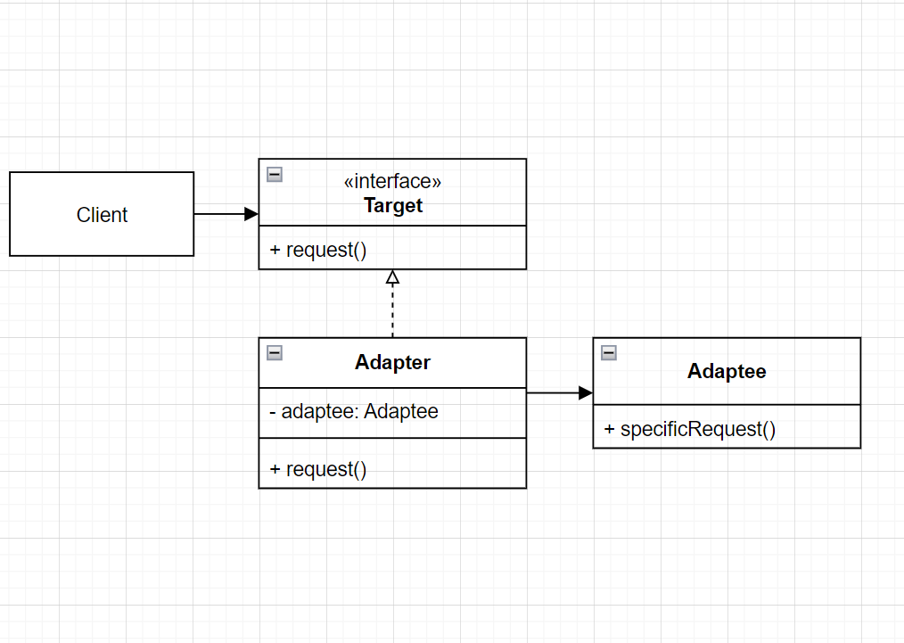
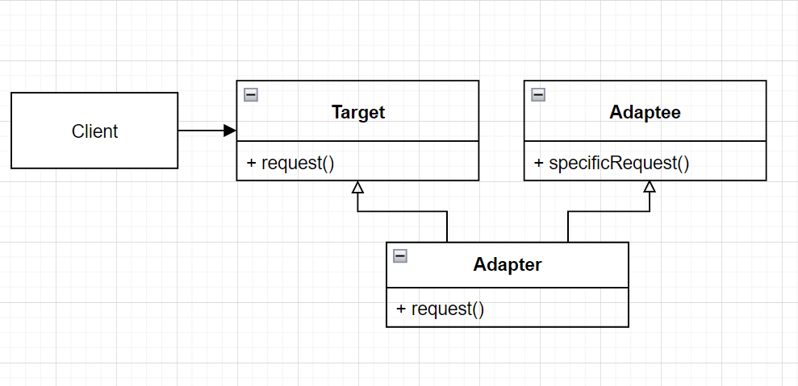
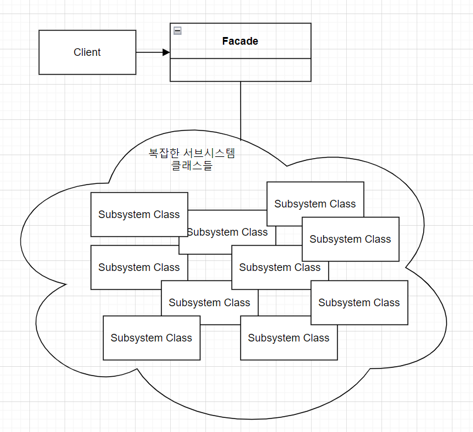
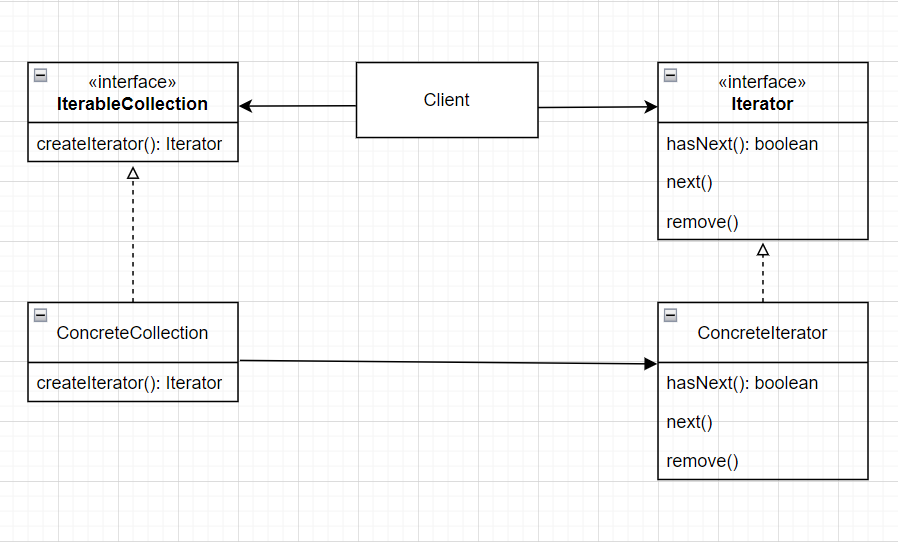
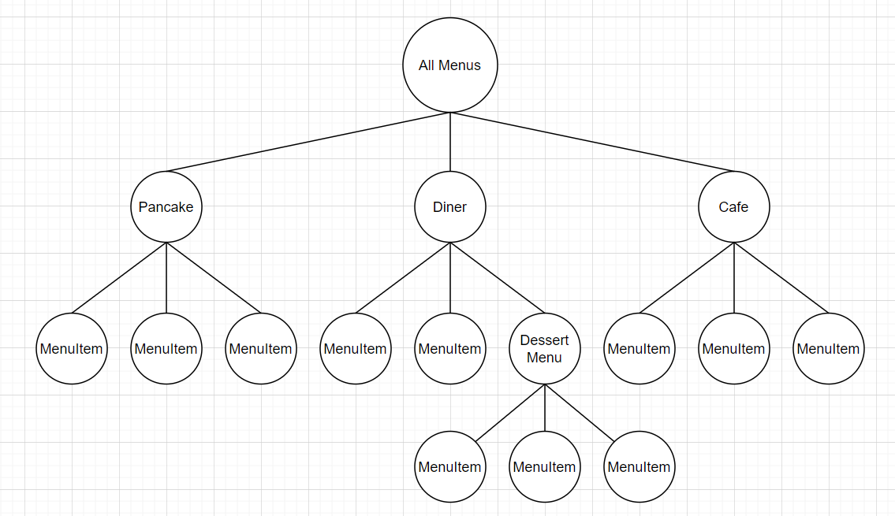
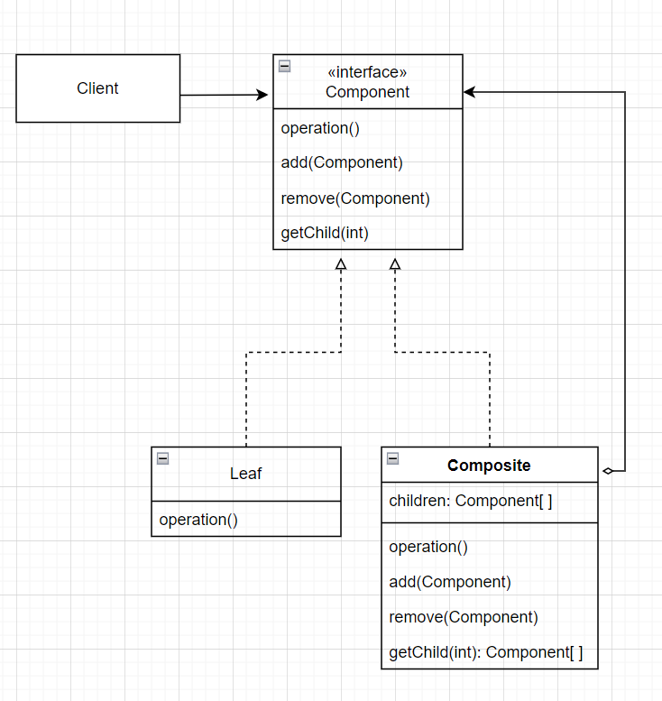

# Adapter Pattern

- 어댑터의 역할
  - 전자제품의 플러그와 소켓이 다를 경우 플러그 모양을 바꿔주는 어댑터를 사용해야한다.
  - 이와 마찬가지로 객체 지향에서의 어댑터도 인터페이스를 다른 인터페이스로 변환해 주는 역할을 한다.
    - 어떤 인터페이스를 클라이언트에서 요구하는 형태로 적응시키는 역할을 한다.
    - 예를 들어 새로운 업체에서 제공한 인터페이스가 기존에 회사에서 사용하던 인터페이스와 다른 경우가 있을 수 있다.
    - 이럴 때는 새로운 업체에서 사용하는 인터페이스를 기존에 회사에서 사용하던 인터페이스에 적응시켜 주는 클래스를 만들면 된다.
  - 클라이언트에서 어댑터를 사용하는 방법
    - 클라이언트에서 타겟 인터페이스로 메서드를 호출해서 어댑터에 요청을 보낸다.
    - 어댑터는 어댑티 인터페이스로 그 요청을 어댑티(adaptee)에 관한 메서드 호출로 변환한다.
    - 클라이언트는 호출 결과를 받긴 하지만 중간에 어댑터가 있다는 사실을 모른다.


- 어댑터의 간단한 예시

  - 아래와 같은 오리 인터페이스가 있다.

  ```python
  from abc import ABCMeta, abstractmethod
  
  
  class Duck(metaclass=ABCMeta):
  
      @abstractmethod
      def quack(self):
          pass
  
      @abstractmethod
      def fly(self):
          pass
  ```

  - 새롭게 칠면조 인터페이스를 만들었다.

  ```python
  class Turkey(metaclass=ABCMeta):
  
      # 칠면조는 quack 소리를 내며 울지 않는다.
      @abstractmethod
      def gobble(self):
          pass
  	
      # 칠면조도 날 수는 있지만 오리만큼 멀리 날지는 못한다.
      @abstractmethod
      def fly(self):
          pass
  ```

  - `Turkey`의 concrete class를 만든다.

  ```python
  class WildTurkey(Turkey):
      def gobble(self):
          print("골골")
  
      def fly(self):
          print("짧은 거리 날기")
  ```

  - `Duck` 객체 대신 `Turkey` 객체를 사용해야하는 상황이라고 가정해보자.
    - 우선 적응시킬 형식의 인터페이스(타겟 인터페이스, 이 경우엔 `Duck` 인터페이스), 즉 클라이언트에서 원하는 인터페이스를 구현해야한다.

  ```python
  class TurkeyAdapter(Duck):
      def __init__(self, turkey):
          self.turkey = turkey
  
      def quack(self):
          self.turkey.gobble()
  
      # 칠면조는 오리만큼 멀리 날지는 못하므로 칠면조의 나는 동작을 5번 수행하여
      # 오리만큼 날 게 구현한다.
      def fly(self):
          for _ in range(5):
              self.turkey.fly()
  ```

  - 테스트
    - 타겟 인터페이스(`Duck`)의 메서드 `quack()`, `fly()`를 호출해서 adapter에 요청을 보낸다.

  ```python
  turkey = WildTurkey()
  turkeyAdapter = TurkeyAdapter(turkey)
  turkeyAdapter.quack()	# 골골
  turkeyAdapter.fly()		# 짧은 거리 날기 5번 출력
  ```

  - Java code는 아래와 같다.
    - `TurkeyAdapter`는 `Duck`을 구현하므로 `Duck` type이다.

  ```java
  Turkey turkey = new WildTurkey();
  // TurkeyAdapter는 Duck 인터페이스를 구현하므로 Duck type이다.
  Duck turkeyAdapter = new TurkeyAdapter(turkey);
  testDuck(turkeyAdapter);
      
  // TurkeyAdapter는 Duck 인터페이스를 구현하므로 Duck type이다.
  static void testDuck(Duck duck) {
      duck.quak();
      duck.fly();
  }
  ```


- 어댑터 패턴

  - 정의
    - 특정 클래스 인터페이스를 클라이언트에서 요구하는 다른 인터페이스로 변환한다.
    - 인터페이스가 호환되지 않아 같이 쓸 수 없었던 클래스를 사용할 수 있게 도와준다.
  - 장점
    - 이 패턴을 사용하면 호환되지 않는 인터페이스를 사용하는 클라이언트를 그대로 활용할 수 있다.
    - 클라이언트와 구현된 인터페이스를 분리할 수 있으며, 변경 내역에서 어댑터에 캡슐화되기에 나중에 인터페이스가 변경되더라도 클라이언트를 바꿀 필요가 없다.
  - 어댑터의 종류
    - 어댑터에는 오브젝트 어댑터와 클래스 어댑터 두 종류가 있다.
    - 클래스 어댑터의 경우 다중 상속이 필요하다.
    - 어댑티를 적응시킬 때 오브젝트 어댑터는 구성을, 클래스 어댑터는 상속을 사용한다.
  - 오브젝트 어댑터의 클래스 다이어그램
    - 클라이언트는 타겟 인터페이스만 볼 수 있다(즉, 클라이언트를 특정 구현이 아닌 인터페이스에 연결한다).
    - 어댑터에서 타깃 인터페이스를 구현한다.
    - 어댑터는 어댑티로 구성(composition)되어 있다(이를 통해 어댑티의 모든 서브클래스에 어댑터를 사용할 수 있다).
    - 모든 요청은 어댑티에 위임된다.

  

  - 클래스 어댑터의 클래스 다이어그램
    - 어댑티를 적응시킬 때 구성을 사용하는 대신 어댑티와 타깃 클래스의 서브 클래스로 만든다.
    - 상속을 사용하므로 어댑티의 모든 서브 클래스에 어댑터를 사용하는 것은 불가능하고, 특정 어댑티 클래스에만 적용할 수 있다는 단점이 있다.
    - 그러나, 어댑티 전체를 다시 구현하지 않아도 되고, 어댑티의 행동을 오버라이드 할 수 있다는 장점이 있다.

  


# Facade Pattern

- 홈시어터 만들기
  - 스트리밍 플레이어, 자동 스크린, 서라운드 음향, 팝콘 기계등을 갖춘 시스템을 구성하려 한다.
    - `Screen`, `PopcornPopper`, `TheaterLights`, `StreamingPlayer`, `Projector`, `Amplifier`, `Tuner` 등의 다양한 클래스를 구현하였다.
  - 영화를 보기 위해 필요한 과정
    - 팝콘 기계를 켠다(`popper.on()`).
    - 팝콘을 튀기기 시작한다(`popper.pop()`).
    - 조명을 어둡게 조절한다(`lights.dim(10)`).
    - 스크린을 내린다(`screen.down()`).
    - 프로젝터를 켠다(`projector.on()`).
    - 프로젝트 입력을 스트리밍 플레이어로 설정한다(`projector.set_input(player)`).
    - 프로젝터를 와이드 스크린 모드로 전환한다(`projector.wide_screen_mode()`).
    - 앰프를 켠다(`amp.on()`).
    - 앰프 입력을 스트리밍 플레이어로 설정한다(`amp.set_dvd(player)`).
    - 앰프를 서라운드 음향 모드로 전환한다(`amp.set_surround_sound()`).
    - 앰프 볼륨을 중간으로 설정한다(`amp.set_volume(5)`).
    - 스트리밍 플레이어를 켠다(`player.on()`).
    - 영화를 재생한다(`player.play(movie)`).
  - 문제점
    - 지나치게 복잡하다. 영화 하나를 보기 위해서 다양한 객체의 다양한 메서드를 실행해야한다.
    - 또한 영화가 끝나면 지금까지 했던 동작을 역순으로 전부 다시 수행해야한다.
    - 시스템을 업그레이드하면 작동 방법을 또 배워야한다.
  - 해결 방법
    - 쓰기 쉬운 인터페이스를 제공하는 퍼사드 클래스를 구현하여 복잡한 시스템을 훨씬 편리하게 사용할 수 있다.


- 홈시어터에 퍼사드 패턴 적용하기

  - `HomeTheaterFacade` 클래스를 만든다.
    - 이 클래스에는 `watch_movie()`와 같은 간단한 몇 가지 메서드만 포함되어 있다.
  - 퍼사드 클래스는 홈시어터의 구성 요소를 하나의 서브 시스템으로 간주하고, `watch_movie()` 메서드는 서브 시스템의 메서드를 호출해서 필요한 작업을 처리한다.
  - 클라이언트 코드는 서브시스템이 아닌 퍼사드에 있는 메서드를 호출한다.
    - `watch_movie()` 메서드만 호출하며너 조명, 스트리밍 플레이어, 프로젝터, 앰프, 스크린, 팝콘 기계등이 알아서 준비된다.
  - 퍼사드를 쓰더라도 서브 시스템에 여전히 직접 접근할 수 있다.
    - 즉, 서브시스템의 상세 기능이 필요하면 언제든 쓸 수 있다.

  - 구현

  ```python
  class HomeTheaterFacade:
      # 서브시스템의 모든 구성 요소가 인스턴스 변수 형태로 저장된다.
      def __init__(self, amp, tuner, player, projector,
                   screen, ligths, popper):
          self.amp = amp
          self.tuner = tuner
          self.player = player
          self.projector = projector
          self.screen = screen
          self.ligths = ligths
          self.popper = popper
  
      def watch_movie(self, movie):
          self.popper.on()
          self.popper.pop()
          self.ligths.dim(10)
          self.screen.down()
          self.projector.on()
          self.projector.wide_screen_mode()
          self.amp.on()
          self.amp.set_streaming_player(self.player)
          self.amp.set_surrond_sound()
          self.amp.set_volume(5)
          self.player.on()
          self.player.play(movie)
  
      def end_movie(self):
          self.popper.off()
          self.ligths.on()
          self.screen.up()
          self.projector.off()
          self.amp.off()
          self.player.stop()
          self.player.off()
  ```

  - 테스트

  ```python
  # 구성 요소들(amp, tuner, 등)을 초기화하는 코드는 이미 짜여져 있다고 가정
  
  home_theater = HomeTheaterFacade(amp, tuner, player, projector, screen, lights, popper)
  home_theater.watch_movie("Love Letter")
  home_theater.end_movie()
  ```


- 퍼사드 패턴

  - 정의
    - 서브시스템에 있는 일련의 인터페이스를 통합 인터페이스로 묶어준다.
    - 또한 고수준 인터페이스도 정의하므로 서브시스템을 더 편리하게 사용할 수 있게 된다.
  - 용도
    - 단순화된 인터페이스로 서브시스템을 더 편리하게 사용하기 위해 사용한다.
    - 또한 클라이언트 구현과 서브시스템을 분리할 수 있다(서브시스템의 변경이 있어도 클라이언트가 아닌 퍼사드만 수정하면 된다).
    - 서브시스템이 복잡하여 하나의 Facade로 해결할 수 없다면 여러 개의 Facade class를 만들 수 있고, 이렇게 만든 Facade class를 client 혹은 다른 facade class에서 사용하는 것도 가능하다.
  - 클래스 다이어그램
  
  


- 데코레이터, 어댑터, 퍼사드의 비교
  - 데코레이터는 인터페이스는 바꾸지 않고 기능만 추가하기 위한 용도로 사용한다.
  - 어댑터는 하나의 인터페이스를 다른 인터페이스로 변환하기 위해 사용한다.
  - 퍼사드는 서브시스템에 대한 간단한 인터페이스를 제공하기 위해 사용한다.


- 최소 지식 원칙(Principle of Least Knowledge)

  - 디미터의 법칙(Law of Demeter)이라고도 불린다.
  
  - 객체 사이의 상호작용은 될 수 있으면 최소화해야한다.
    - 완전히 없애야 한다는 것이 아니라 객체 사이의 결합을 최소화 해야 한다는 것이다.
    - 즉, 시스템을 디자인할 때 어떤 객체든 그 객체와 상호작용을 하는 클래스의 개수와 상호작용 방식에 주의를 기울여야한다.
  
  - 이 원칙을 잘 따르면 클래스가 복잡하게 엃히지 않게 된다.
    - 이를 통해 시스템의 부분을 변경했을 때 다른 부분까지 줄줄이 고쳐야 하는 상황을 미리 방지할 수 있다.
  - 최소 지식 원칙을 지키는 방법.
    - 객체 자체를 사용한다.
    - 메서드에 매개변수로 전달된 객체를 사용한다.
    - 메서드를 생성하거나 인스턴스를 만든 객체를 사용한다.
    - 객체에 속하는 구성 요소(구성 요소는 인스턴스 변수에 의해 참조되는 객체를 의미한다)인 객체를 사용한다.
  - 메서드를 호출한 결과로 반환 된 객체에 들어있는 메서드를 호출하는 것은 바람직하지 않다.
    - 최소 지식 원칙을 따르려면 객체가 대신 요청하도록 만들어야한다.
  
  ```python
  # 원칙을 따르지 않은 코드
  def get_temp(self):
      # get_thermometer() 메서드를 호출한 결과로 반환된 thermometer 객체에서
      thermometer = self.station.get_thermometer()
      # 아래와 같이 메서드를 호출하는 것은 바람직하지 않다.
      return thermometer.get_temperature()
  
  
  # 원칙을 따르는 코드
  def get_temp(self):
      # 최소 지식의 원칙을 적용해서 thermometer에게 요청을 전달하는 메서드를 Station 클래스에 추가한다.
      # 이를 통해 의존하는 클래스의 개수를 줄일 수 있게 된다.
      return self.station.get_temperature()
  ```
  
  - 절친에게만 메서드 호출하기
    - 아래 예시를 통해 최소 지식 원칙을 따르면서 메서드를 호출하는 방법을 어느 정도 파악할 수 있다.
  
  ```python
  class Car:
      def __init__(self):
          # engine은 Car에 속하는 구성 요소이므로 사용해도 된다.
          self.engine = Engine()
          
      def start(self, key):
          # doors라는 새로운 객체를 생성할 것이므로 doors의 메서드는 호출해도 된다.
          doors = Doors()
          # key는 매개변수로 전달된 객체이므로 사용해도 된다.
          authorized = key.turns()
          if authorized:
          	self.engine.start()
              # update_dashboard_display 메서드는 객체 내에 있는 메서드이므로 사용해도 된다.
              self.update_dashboard_display()
              doors.lock()
      
      def update_dashboard_display(self):
          # display 갱신하는 코드
  ```
  
  - 퍼사드 패터과 최소 지식 원칙
    - 퍼사드 패턴을 적용하기 전의 client는 `Screen`, `PopcornPopper`, `TheaterLights`, `StreamingPlayer`, `Projector`, `Amplifier`, `Tuner` 등의 다양한 클래스와 결합되어 있었다.
    - 따라서 이 중 하나만 변경되더라도 클라이언트의 코드를 변경해야 했다.
    - 그러나, 퍼사드 패턴을 적용하면 오직 퍼사드 클래스와만 결합되게 되고, 위의 다양한 서브시스템 클래스들의 변경사항이 있어도 클라이언트에는 영향을 미치지 않게 된다.
    - 즉 내부의 구현은 숨기고 외형(퍼사드)만 보여주는 퍼사드 패턴과 최소 지식 원칙은 서로 관련성이 있다.


# Iterator Pattern

- 조식만 제공하던 식당과 석식만 제공하던 식당이 합치기로 했다.

  - 문제는 조식만 제공하는 식당에서는 메뉴의 목록을 ArrayList로 저정해왔고, 석식만 제공하는 식당에서는 Array에 저장해 왔다는 것이다.
    - 기존에 메뉴 목록이 ArrayList 혹은 Array라는 것을 기반으로 코드를 작성했을 것이다.
    - 따라서 메뉴 목록을 통일하기 위해서는 한 쪽 코드의 대대적인 수정이 필요하다.
  - 메뉴 항목 class
    - 메뉴의 각 항목은 이름, 설명, 채식주의 메뉴 여부, 가격으로 구성되며, 항목을 초기화 할 때 생성자에 이 값들을 모두 매개변수로 전달해야 한다.
    - 각 항목 별 getter method가 있다.

  ```java
  public class MenuItem {
      String name;
      String description;
      boolean vegetarian;
      double price;
  
      public MenuItem(String name, String description, boolean vegetarian, double price) {
          this.name = name;
          this.description = description;
          this.vegetarian = vegetarian;
          this.price = price;
      }
  
      public String getName() {
          return name;
      }
  
      public String getDescription() {
          return description;
      }
  
      public boolean isVegetarian() {
          return vegetarian;
      }
  
      public double getPrice() {
          return price;
      }
  }
  ```

  - ArrayList를 사용한 조식 식당의 메뉴 목록 구현
    - 각 메뉴 항목은 생성자 내에서 ArrayList에 추가된다.
    - 메뉴 항목을 추가하고 싶으면 `MenuItem` 객체를 새로 만들고 그 객체를 ArrayList에 추가한다.
    - ArrayList로 구현한 다른 다양한 메서드들이 있다.

  ```java
  package Iterator;
  
  import java.util.ArrayList;
  import java.util.List;
  
  public class PancakeHouseMenu {
      List<MenuItem> menuItems;
      
      public  PancakeHouseMenu() {
          menuItems = new ArrayList<MenuItem>();
  
          addItem("블루베리 팬케이크",
                  "블루베리 잼을 바른 팬케이크",
                  true,
                  3.49);
  
          addItem("레귤러 팬케이크 세트",
                  "달걀 프라이와 소시지가 곁들여진 팬케이크",
                  false,
                  2.99);
  
          addItem("와플",
                  "취향에 따라 토핑을 올릴 수 있는 와플",
                  true,
                  3.59);
      }
      
      public void addItem(String name, String description, boolean vegetarian, double price) {
          MenuItem menuItem = new MenuItem(name, description, vegetarian, price);
          menuItems.add(menuItem);
      }
      
      public ArrayList<MenuItem> getMenuItems() {
          return (ArrayList<MenuItem>) menuItems;
      }
      
      // ArrayList로 구현한 메뉴 관련 메서드들
  }
  ```

  - Array를 사용한 석식 식당의 메뉴 목록 구현
    - 배열을 사용하고 있기에 크기를 정해두고, 최대 메뉴 항목 개수를 초과하면 더 이상 메뉴를 추가할 수 없게 되어 있다.

  ```java
  package Iterator;
  
  public class DinerMenu {
      static final int MAX_ITEMS = 6;
      int numberOfItems = 0;
      MenuItem[] = menuItems;
      
      public DinerMenu() {
          menuItems = new MenuItem[MAX_ITEMS];
          
          addItem("채식주의자용 BLT",
                  "통밀 위에 콩고기 베이컨, 상추, 토마토를 얹은 메뉴",
                  true,
                  2.99);
          addItem("BLT",
                  "통밀 위에 베이컨, 상추, 토마토를 얹은 메뉴",
                  false,
                  2.99);
          addItem("핫도그",
                  "치즈가 곁들여진 핫도그",
                  false,
                  3.05);
          
      }
      
      public void addItem(String name, String description, boolean vegetarian, double price){
          MenuItem menuItem = new MenuItem(name, description, vegetarian, price);
          if (numberOfItems >= MAX_ITEMS) {
              System.err.println("죄송합니다, 메뉴가 꽉 차서 더 이상 추가할 수 없습니다.");
          } else {
              menuItems[numberOfItems] = menuItem;
              numberOfItems = numberOfItems + 1;
          }
      }
      
      public MenuItem[] getMenuItems() {
          return menuItems;
      }
      
      // 기타 Array를 사용하는 메서드들
  }
  ```


- 위와 같은 상황에서 종업원 클래스를 만드려고 한다.

  - 종업원 클래스는 아래와 같은 기능들을 수행해야 한다.
    - `printMenu()`: 메뉴에 있는 모든 항목 출력.
    - `printBreakfastMenu()`: 아침 식사 메뉴만 출력.
    - `print(DinerMenu)`: 저녁 식사 메뉴만 출력.
    - `printVegetarianMenu()`: 채식주의자용 메뉴만 출력.
    - `isItemVegetarian(name)`: 메뉴가 채식주의자용인지를 boolean 값으로 반환.
  - `printMenu()` 구현하기 전 생각해야 할 사항
    - `printMenu()`를 구현하기 위해서는 두 개의 메뉴 목록 class에 있는 `getMenuItems()` 메서드를 호출해야 한다.
    - 문제는 두 클래스의 `getMenuItems()`의 반환값의 type이 하나는 ArrayList, 하나는 Array로, 서로 다르다는 것이다.
    - 따라서 두 개의 메뉴 항목들을 모두 가져오려면 아래와 같이 반복문을 두 번 실행해야 한다.
    - `printMenu()` 뿐 아니라 메뉴를 출력하는 모든 메서드를 아래와 같이 반복문을 두 번 순회하는 방식으로 구현해야 한다.

  ```java
  public void printMenu(){
      PancakeHouseMenu pancakeHouseMenu = new PancakeHouseMenu();
      ArrayList<MenuItem> breakfastItems = pancakeHouseMenu.getMenuItems();
  
      DinerMenu dinerMenu = new DinerMenu();
      MenuItem[] dinnerItems = dinerMenu.getMenuItems();
  
      for (int i=0; i< breakfastItems.size(); i++) {
          MenuItem menuItem = breakfastItems.get(i);
          System.out.println(menuItem.getName());
          System.out.println(menuItem.getDescription());
          System.out.println(menuItem.getPrice());
      }
  
      for (int i=0; i< dinnerItems.length; i++) {
          MenuItem menuItem = dinnerItems[i];
          System.out.println(menuItem.getName());
          System.out.println(menuItem.getDescription());
          System.out.println(menuItem.getPrice());
      }
  }
  ```


- 반복자 패턴

  - 정의
    - 컬렉션의 구현 방법을 노출시키지 않으면서 집합체 내의 모든 항목에 접근하는 방법을 제공하는 패턴이다.
    - 컬렉션이란 객체를 모아 놓은 것을 말하는데, 리스트, 배열, 해시테이블 등 다양한 자료구조에 컬렉션을 저장할 수 있다.
    - 컬렉션을 집합체(aggregate)라고 부르기도 한다.
  - 효과
    - 집합체 내에서 어떤 식으로 일이 처리되는지 전혀 모르는 상태에서 그 안에 들어있는 모든 항목을 대상으로 반복 작업을 수행할 수 있다.
    - 컬렉션 객체 안에 들어있는 모든 항목에 접근하는 방식이 통일되어 종류에 관계 없이 모든 집합체에서 사용할 수 있는 다형적인 코드를 만들 수 있다.
    - 모든 항목에 일일이 접근하는 작업을 컬렉션 객체가 아닌 반복자 객체가 맡게 되어 집합체의 인터페이스와 구현이 간단해지고, 집합체는 반복 작업에 신경쓰지 않고 원래 자신의 일(객체 컬렉션 관리)에만 집중할 수 있다.

  - 클래스 다이어그램

  

  - 단일 책임 원칙
    - 집합체에서 컬렉션 관련 기능과 반복자용 메서드 관련 기능을 전부 구현해도 될 것 같은데, 왜 굳이 Iterator를 따로 빼서 반복자용 메서드 관련 기능을 따로 관리해야하는가?
    - 단일 책임 원칙에 위배되기 때문이다.
    - 단일 책임 원칙이란 어떤 클래스가 바뀌는 이유는 하나뿐이어야 한다는 원칙이다.
    - 만일 컬렉션 관련 기능과 반복자 관련 기능이 한 클래스에 들어있다면, 컬렉션 관련 기능이 변경돼도 클래스가 변경되어야 하고, 반복자 관련 기능이 변경되어도 클래스가 변경되어야 한다.
    - 즉 응집도(cohension)가 높은 클래스를 만들어야한다는 의미이다.


- 반복자 패턴 적용하기

  - 반복을 캡슐화하기

    - "바뀌는 부분을 캡슐화하라"는 원칙에 따라 바뀌는 부분인 반복 처리 방식을 캡슐화하려고 한다.
    - ArrayList는 반복을 위해 ArrayList의 `size()` 메서드와 `get()` 메서드가 필요하다.
    - Array는 반복을 위해 `length` 필드와 배열첨자(`array[i]`)가 필요하다.

  - `Iterator` 인터페이스 생성하기

    - `Iterator`라는 객체를 만들어 각기 다른 타입을 가지는 메뉴 목록을 통일성 있게 사용할 수 있도록 한다.

    - 반복자 패턴은 `hasNext()`, `next()`라는 메서드를 가지는 `Iterator` 인터페이스에 의존한다.
    - `hasNext()`는 반복 작업을 수행할 항목이 남아 있는지를 bool 값으로 반환하고, `next()`는 다음 항목을 반환한다.
    - 이 인터페이스를 사용하면 모든 종류의 객체 컬렉션에 반복자를 구현할 수 있다.

  ```java
  package Collection;
  
  public interface Iterator {
      boolean hasNext();
      MenuItem next();
  }
  ```

  - `DinerMenuIterator` 생성
    - `Iterator`를 구현하는 클래스를 생성한다.

  ```java
  package Collection;
  
  public class DinerMemuIteraotr implements Iterator {
      MenuItem[] items;
      int position = 0;
  
      public DinerMemuIteraotr(MenuItem[] items) {
          this.items = items;
      }
  
      public MenuItem next() {
          MenuItem menuItem = items[position];
          position = position + 1;
          return menuItem;
      }
  
      public boolean hasNext() {
          if (position >= items.length || items[position] == null) {
              return false;
          } else {
              return true;
          }
      }
  }
  ```

  - `DinerMenu` class 수정하기
    - 기존에 있던 `getMenuItems()` 메서드를 지우고 아래와 같이 반복자를 `Iterator`를 반환하는 메서드를 추가한다.

  ```java
  public Iterator createIterator() {
      return new DinerMenuIterator(menuItems);
  }
  ```

  - 종업원 코드에 iterator 적용하기
    - `PancakeHouseIterator`도 생성했고, `PancakeMenu` class도 수정했다고 가정한다.		
    - 이제 하나의 반복문으로도 모든 메뉴를 출력할 수 있다.

  ```java
  package Collection;
  
  import java.util.ArrayList;
  
  public class Waiter {
      PancakeHouseMenu pancakeHouseMenu;
      DinerMenu dinerMenu;
  
      public Waiter(PancakeHouseMenu pancakeHouseMenu, DinerMenu dinerMenu) {
          this.pancakeHouseMenu = pancakeHouseMenu;
          this.dinerMenu = dinerMenu;
      }
  
      public void printMenu(){
          Iterator pancakeIterator = pancakeHouseMenu.createIterator();
          Iterator dinerIterator = dinerMenu.createIterator();
          printMenu(pancakeIterator);
          printMenu(dinerIterator);
      }
  
      private void printMenu(Iterator iterator) {
          while (iterator.hasNext()) {
              MenuItem menuItem = iterator.next();
              System.out.println(menuItem.getName());
              System.out.println(menuItem.getDescription());
              System.out.println(menuItem.getPrice());
          }
      }
  }
  ```

  - Iterator pattern을 적용한 결과
    - 종업원은 메뉴에서 메뉴 항목이 어떤 방식으로 저장되는지 알 수가 없다.
    - 반복자만 구현한다면 다형성을 활용하여 어떤 컬렉션이든 1개의 순환문으로 처리할 수 있다.
    - 종업원은 인터페이스(Iterator)만 알면 된다.


- PancakeHouse와 DinnerMenu의 인터페이스 통일하기

  - 사실 Java에서 제공하는 Iterator 인터페이스가 있다.
    - `java.util.Iterator`를 제공한다.
    - 우리가 정의한 `Iterator`와는 달리 `remove()`라는 메서드를 추가적으로 가지고 있는데, 이는 `next()` 메서드의 기능에, 반환 후 삭제하는 기능이 추가 된 것이다.

  -  조식 식당에 `java.util.Iterator` 적용하기
    - ArrayList에는 iterator를 반환하는 `iterator()` 메서드가 있다, 따라서 ArrayList를 사용하는 `PancakeHouseIterator`는 삭제해도 된다.
    - `PancakeHouseIterator` 클래스를 삭제하고, `PancakeHouseMenu` 코드를 아래와 같이 수정한다.

  ```java
  package Collection;
  
  // 아래와 같이 Iterator를 import한다.
  import java.util.Iterator;
  
  public class PancakeHouseMenu {
      // createIterator 메서드를 수정한다.
      public Iterator<MenuItem> createIterator() {
          return menuItems.iterator()
      }
  }
  ```

  - 석식 식당에 `java.util.Iterator` 적용하기
    - 반면에 Array를 사용하는 석식 식당에서는 여전히 `DinerMenuIterator`를 사용해야한다.
    - 다른 코드는 기존에 구현한 것을 사용해도 되지만, `remove()` 메서드는 추가해야한다.
    - 그러나, 메뉴 항목을 반환한 뒤 삭제할 일은 없으므로, `remove` 메서드가 호출되면 `UnsupportedOperationException` 예외가 발생하도록 구현한다.

  ```java
  package Collection;
  
  // Iterator를 import한다.
  import java.util.Iterator;
  
  public class DinerMemuIteraotr implements Iterator<MenuItem> {
      // 기존 코드와 동일
  	
      // remove 메서드 추가
      public void remove() {
          throw new UnsupportedOperationException("메뉴는 지울 수 없습니다.");
      }
  }
  ```

  - 메뉴 인터페이스 통일하기
    - `Iterator`를 생성하는 간단한 메서드만 있는 인터페이스를 만든다.

  ```java
  public interface Memu {
      public Iterator<MenuItem> createIterator();
  }
  ```

  - 종업원 클래스를 수정한다.
    - 우리가 정의한 `Iterator` 인터페이스가 아닌 `java.util.Iterator`를 사용하도록 import한다.
    - 기존에 구상 메뉴 class(`PancakeHouseMenu`, `DinerMenu`)를 사용하던 코드를 모두 `Menu` 인터페이스로 교체한다.

  ```java
  import java.util.Iterator
  
  
  public class Waiter {
      Menu pancakeHouseMenu;
      Menu dinerMenu;
  
      public Waiter(Menu pancakeHouseMenu, Menu dinerMenu) {
          this.pancakeHouseMenu = pancakeHouseMenu;
          this.dinerMenu = dinerMenu;
      }
  ```


- Iterator Pattern에서 만들었던 조식, 석식이 결합된 메뉴 시스템에 카페 메뉴를 추가해야한다.

  - 기존 `CafeMenu` 클래스
    - 메뉴들을 map에 저장하며, menu이름을 key, `MenuItem`을 value로 저장한다.

  ```java
  package Collection;
  
  import java.awt.*;
  import java.util.HashMap;
  import java.util.Map;
  
  public class CafeMenu {
      Map<String, MenuItem> menuItems = new HashMap<String, MenuItem>();
      
      public CafeMenu() {
          addItem("버거와 에어프라이",
                  "통밀빵, 상추, 토마토, 감자 튀김이 첨가된 버거",
                  true,
                  3.99);
          addItem("스프",
                  "샐러드가 곁들여진 오늘의 스프",
                  false,
                  3.69);
          addItem("브리토",
                  "통 핀토콩과 살사 구아카몰을 곁들인 브리토",
                  true,
                  4.29);
      }
      
      public void addItem(String name, String description, boolean vegetarian, double price) {
          MenuItem menuItem = new MenuItem(name, description, vegetarian, price);
          menuItems.put(name, menuItem);
      }
      
      public Map<String, MenuItem> getMenuItems() {
          return menuItems;
      }
  }
  ```

  - 객체마을 카페 메뉴를 기존 프레임워크에 추가하는 일은 간단하다.
    - Hashtable도 Iterator를 지원하는 Java 컬렉션이기 때문이다.
    - `addItem()` 메서드는 삭제한다.

  ```java
  package Collection;
  
  import java.util.Iterator;
  
  // Menu 인터페이스를 구현하도록 한다.
  public class CafeMenu implements Menu{
      Map<String, MenuItem> menuItems = new HashMap<String, MenuItem>();
  
      // 기존 코드와 동일
  	
      // HashMap 전체가 아닌 값을 대상으로 반복자를 반환한다.
      public Iterator<MenuItem> createIterator() {
          return menuItems.values().iterator();
      }
  }
  
  ```

  - 종업원 코드에 카페 메뉴 추가하기

  ```java
  package Collection;
  
  import java.util.Iterator
  
  public class Waiter {
      Menu pancakeHouseMenu;
      Menu dinerMenu;
      // cafeMenu를 추가하고
      Menu cafeMenu;
  
      public Waiter(Menu pancakeHouseMenu, Menu dinerMenu, Menu cafeMenu) {
          this.pancakeHouseMenu = pancakeHouseMenu;
          this.dinerMenu = dinerMenu;
          // 인스턴스 변수로도 추가한다.
          this.cafeMenu = cafeMenu;
      }
  
      public void printMenu(){
          Iterator pancakeIterator = pancakeHouseMenu.createIterator();
          Iterator dinerIterator = dinerMenu.createIterator();
          // cafeIterator를 생성한다.
          Iterator cafeIterator = cafeMenu.createIterator();
          printMenu(pancakeIterator);
          printMenu(dinerIterator);
          printMenu(cafeIterator);
      }
  	
      // printMenu 코드는 변경 할 것이 없다.
      private void printMenu(Iterator iterator) {
          while (iterator.hasNext()) {
              MenuItem menuItem = iterator.next();
              System.out.println(menuItem.getName());
              System.out.println(menuItem.getDescription());
              System.out.println(menuItem.getPrice());
          }
      }
  }
  ```


# Composite Pattern

> Iterator Pattern과 이어지는 내용이다.

- 종업원 코드 개선하기

  - Iterator pattern을 알아보면서 구현했던 종업원 코드에는 아직 문제가 남아있다.
    - `printMenu()`를 세 번이나 호출해야한다.
    - 새로운 형식의 메뉴가 추가될 때 마다 종업원에 코드를 추가해야하므로 OCP에 위배된다.
    - 이 문제들은 메뉴를 서로 다른 독립적인 객체도 다루기 때문으로, 여러 메뉴를 한꺼번에 관리할 수 있는 방법이 필요하다.
  - 각 유형의 메뉴를 하나의 List로 관리하기

  ```java
  package Collection;
  
  import java.util.Iterator;
  
  public class Waiter {
      List<Menu> menus;
  
      public Waiter(List<Menu> menus) {
          this.menus = menus;
      }
  
      public void printMenu(){
          Iterator<Menu> menuIterator = menus.iterator();
          while (menuIterator.hasNext()) {
              Menu menu = menuIterator.next();
              printMenu(menu.createIterator());
          }
      }
  
      private void printMenu(Iterator iterator) {
          while (iterator.hasNext()) {
              MenuItem menuItem = iterator.next();
              System.out.println(menuItem.getName());
              System.out.println(menuItem.getDescription());
              System.out.println(menuItem.getPrice());
          }
      }
  }
  ```

  - 위 방식의 한계
    - 만일 한 종류의 메뉴에 서브 메뉴가 들어가야 할 경우 위와 같은 방법은 사용할 수 없다.
    - 예를 들어 `DinnerMenu`의 여러 메뉴들 중에 `DessertMenu`가 추가되고 `DessertMenu`에 여러 메뉴 항목이 들어가야 하는 경우 위 방식으로는 `DessertMenu`의 각 항목을 확인할 수는 없고, 뭉뚱그려서 볼 수 밖에는 없다.

  - 리팩터링 준비하기
    - 결국 서브메뉴를 포함한 모든 메뉴를 대상으로 제대로 동작할 수 있는 코드를 작성해야 한다.
    - 메뉴, 서브메뉴, 메뉴 항목 등을 넣을 수 있는 트리 형태의 구조가 필요하다.
    - 각 메뉴에 있는 모든  항목을 대상으로 특정 작업을 할 수 있는 방법을 제공해야 한다.
    - 더 유연한 방법으로 반복 작업을 수행할 수 있어야 한다.
    - 예를 들어 저녁 메뉴에 포함되어 있는 디저트 메뉴를 대상으로만 반복 작업을 수행할 수 있으면서도, 모든 메뉴를 대상으로도 반복 작업을 수행할 수 있어야한다.
  - 즉, 아래와 같은 형태를 자유롭게 출력할 수 있어야한다.

  


- 컴포지트 패턴

  - 정의
    - 객체를 트리구조로 구성해서 부분-전체 계층구조(part-whole hierarchy)를 구현한다.
    - 컴포지트 패턴을 사용하면 클라이언트에서 개별 객체와 복합 객체를 똑같은 방법으로 다룰 수 있다.
    - 부분-전체 계층구조란 부분들이 계층을 이루고 있지만 모든 부분을 묶어서 전체로 다룰 수 있는 구조를 뜻한다.
    - 위 예를 가지고 설명하자면, 메뉴, 서브메뉴, 서브서브메뉴로 구성된 트리구조에서 각 메뉴 안에 다른 메뉴와 메뉴 항목이 또 들어갈 수 있기에 각각이 모두 복합객체가 될 수 있다는 말이다.
  - 이점
    - 클라이언트는 복합 객체와 개별 객체를 구분할 필요가 거의 없어진다.
    - 따라서 올바른 객체에 관한 올바른 메서드를 호출하고 있는지 확인하려고 if문을 여기 저기에 쓰지 않아도 된다.
    - 또한 한 번의 메서드 호출로 전체 구조를 대상으로 반복 작업을 처리할 수 있게 해준다.
  - 개념
    - 복합 객체(composite)에는 구성 요소(component)가 들어있다.
    - 구성 요소는 두 종류로 나눌 수 있는데, 하나는 복합 객체이고 하나는 잎(leaf)이다.
    - 잎은 다른 구성 요소를 포함하지 않는 구성요소이다.
    - 재귀 구조로 되어 있으며, 복합 객체에는 자식들이 들어있고, 그 자식들은 복합객체일 수도 있고 아닐 수도 있다.
    - 이런 식으로 데이터를 조직화하다 보면 복합 객체를 따라 가지가 연결되다 마지막에는 잎으로 끝나는 트리구조가 만들어진다.
  - 클래스 다이어그램
    - Client는 Component 인터페이스를 사용해서 복합객체 내의 객체들을 조작할 수 있다.
    - Component는 복합 객체 내에 들어있는 모든 객체의 인터페이스를 정의한다.
    - Component에서 `add()`, `remove()`, `getChild()`와 몇 가지 작업의 기본 행동을 정의할 수도 있다.
    - Leaf에서는 `add()`, `remove()`, `getChild()`가 필요 없음에도 그 메서드들을 상속 받아야한다.
    - Composite는 자식이 있는 구성 요소의 행동을 정의하고 자식 구성요소를 저장하는 역할을 맡는다.
    - Composite에서 Leaf와 관련된 메서드들도 구현해야하는데, 이런 기능이 별 쓸모 없다면 해당 method가 호출됐을 때 예외를 던지는 방식으로 처리해도 된다.

  


- Composite 패턴 적용하기

  - Composited 패턴의 요소들과 예시의 요소들은 아래와 같이 대응된다.
    - Client - Watier
    - Component - MenuComponent
    - Leaf - MenuItem
    - Composite - Menu
  - 우선 component 인터페이스를 만든다.
    - 이 인터페이스는 메뉴(composite)와 메뉴 항목(leaf) 모두에 적용되는 공통 인터페이스 역할을 한다.
    - Interface가 아닌 abstract class로 구현하여, 자기 역할에 맞지 않는 상황에 예외를 던지는 코드를 기본 구현으로 제공한다.
    - 예를 들어, 상기했듯 leaf에는 `add`, `remove`, `getChild` 등이 필요 없는데, `MenuComponent`를 interface로 구현하면 일일이 구현해줘야 하고, composite에도 마찬가지로 모든 메서드가 필요하지 않은데도 불구하고 모두 구현해야 한다.
    - 따라서 interface가 아닌 abstract class로 구현하여 불필요한 구현을 줄여준다.

  ```java
  package Collection;
  
  public abstract class MenuComponent {
      public void add(MenuComponent menuComponent) {
          throw new UnsupportedOperationException();
      }
      public void remove(MenuComponent menuComponent) {
          throw new UnsupportedOperationException();
      }
      public MenuComponent getChild(int i) {
          throw new UnsupportedOperationException();
      }
  
      public String getName() {
          throw new UnsupportedOperationException();
      }
      public String getDescription() {
          throw new UnsupportedOperationException();
      }
      public String getPrice() {
          throw new UnsupportedOperationException();
      }
      public String isVegetarian() {
          throw new UnsupportedOperationException();
      }
      public void print() {
          throw new UnsupportedOperationException();
      }
  }
  ```

  - 메뉴 항목 구현하기
    - `MenuItem` class를 아래와 같이 수정한다.
    - `MenuComponent`를 상속받는다.

  ```java
  package Collection;
  
  public class MenuItem extends MenuComponent{
      String name;
      String description;
      boolean vegetarian;
      double price;
  
      public MenuItem(String name, String description, boolean vegetarian, double price) {
          this.name = name;
          this.description = description;
          this.vegetarian = vegetarian;
          this.price = price;
      }
  
      public String getName() {
          return name;
      }
  
      public String getDescription() {
          return description;
      }
  
      public boolean isVegetarian() {
          return vegetarian;
      }
  
      public double getPrice() {
          return price;
      }
  
      public void print() {
          System.out.print(" " + getName());
          if (isVegetarian()) {
              System.out.print("(v)");
          }
          System.out.println(", " + getPrice());
          System.out.println("  -- " + getDescription());
      }
  }
  ```

  - 메뉴 구현하기
    - `Menu` class를 아래와 같이 수정한다.
    - `MenuComponent`를 상속받는다.
    - `print()`는 재귀를 사용하여 구현한다.

  ```java 
  package Collection;
  
  import java.util.ArrayList;
  import java.util.List;
  
  public class Menu extends MenuComponent{
      List<MenuComponent> menuComponents = new ArrayList<MenuComponent>();
      String name;
      String description;
  
      public Menu(String name, String description) {
          this.name = name;
          this.description = description;
      }
  
      public void add(MenuComponent menuComponent) {
          menuComponents.add(menuComponent);
      }
  
      public void remove(MenuComponent menuComponent) {
          menuComponents.remove(menuComponent);
      }
  
      public MenuComponent getChild(int i) {
          return menuComponents.get(i);
      }
  
      public String getName() {
          return name;
      }
  
      public String getDescription() {
          return description;
      }
  
      public void print() {
          System.out.print("\n" + getName());
          System.out.println(", " + getDescription());
          System.out.println("----------------------");
  		
          // 아래와 같이 향상된 for문을 사용한다.
          for (MenuComponent menuComponent : menuComponents) {
              menuComponent.print();
          }
      }
  }
  ```

  - 종업원 코드 수정하기

  ```java
  package Collection;
  
  import java.util.List;
  
  public class Waiter {
      MenuComponent allMenus;
  
      public Waiter(MenuComponent allMenus) {
          this.allMenus = allMenus;
      }
  
      public void printMenu() {
          allMenus.print();
      }
  }
  ```


- 단일 책임 원칙을 위배하고 있는 것 아닌가?
  - 이 패턴에서는 계층구조를 관리하는 일과 메뉴 관련 작업을 한 클래스에서 처리하고 있다.
    - 이로 인해 안정성이 떨어지는 것은 사실이다.
    - 클라이언트가 어떤 객체를 대상으로 무의미하거나 부적절한 작업, 예를 들어 `MenuItem` 객체에서 `add`나 `remove` 등을 수행하려고 할 수도 있다.
    - 그러나 이를 막기 위해 두 역할을 서로 다른 인터페이스로 분리하면 투명성이 떨어지게 된다.
  - 컴포지트 패턴은 단일 책임 원칙을 위배하는 대신 투명성을 확보하는 패턴이다.
    - 예를 들어 안전성을 포기하고 투명성을 확보함으로써 컴포지트 패턴에서는 Component 객체가 Composite인지 Leaf인지 구분하지 않고 동일한 작업을 수행할 수 있다.
    - 만약, 투명성 대신 안전성을 확보한다면, 특정 작업을 수행할 때 마다 해당 객체가 `Composite` 객체인지 `Leaf` 객체인지를 `isinstacneOf` 등을 통해 확인해야 할 것이고, 조건문도 들어가게 된다.
  - 투명성(transparency)
    - Component 인터페이스에서 자식들을 관리하는 기능과 잎으로써의 기능을 전부 넣어서 클라이언트가 복햅 객체와 잎을 똑같은 방식으로 처리할 수 있도록 만들었다.
    - 어떤 원소가 복합 객체인지, 어떤 객체가 잎인지 클아이언트에게는 투명하게 보인다.

 


# 디자인 원칙 모아보기

- 최소 지식 원칙(Principle of Least Knowledge)
  - 객체 사이의 상호작용은 될 수 있으면 최소화해야한다.
  - 완전히 없애야 한다는 것이 아니라 객체 사이의 결합을 최소화 해야 한다는 것이다.


- 단일 책임 원칙
  - 어떤 클래스가 바뀌는 이유는 하나뿐이어야 한다는 원칙이다.
  - 응집도가 높은 클래스를 만들어야 한다는 원칙이다.

