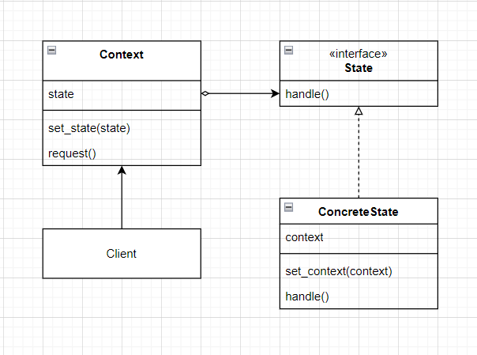
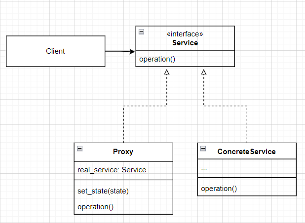
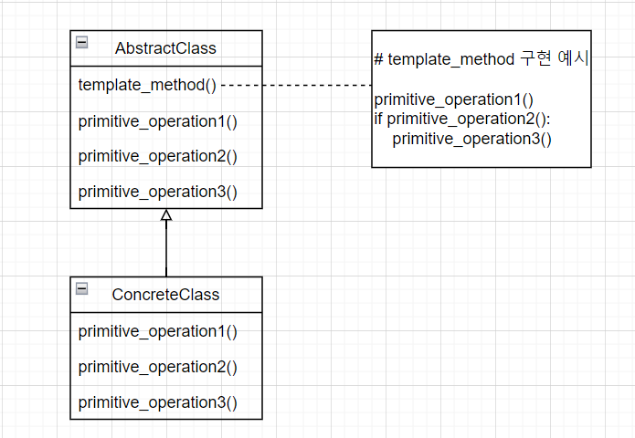

# State Pattern

- 최첨단 뽑기 기계

  - 뽑기 기계에는 아래와 같이 네 종류의 상태가 있다.
    - 동전 없음
    - 동전 있음
    - 알맹이 판매
    - 알맹이 매진

  - 이 시스템에서 일어날 수 있는 행동들은 아래와 같다.
    - 동전 투입
    - 동전 반환
    - 손잡이 돌림
    - 알맹이 내보냄
  - 기계 역할을 하는 클래스를 만든다.

  ```python
  class GumballMachine:
      # 각 상태를 저장할 변수를 선언한다.
      SOLD_OUT = 0
      NO_QUARTER = 1
      HAS_QUARTER = 2
      SOLD = 3
  
      def __init__(self, count):
          self.state = self.SOLD_OUT
          # 캡슐의 개수를 저장하기 위한 변수
          self.count = count
          # 캡슐 개수가 0보다 크면 동전이 들어오길 기다리는 상태가 된다.
          if count > 0:
              self.state = self.NO_QUARTER
  
      def insert_quarter(self):
          if self.state == self.HAS_QUARTER:
              print("이미 동전이 들어가 있습니다.")
          elif self.state == self.NO_QUARTER:
              self.state = self.HAS_QUARTER
              print("동전을 넣으셨습니다.")
          elif self.state == self.SOLD_OUT:
              print("남아 있는 캡슐이 없습니다. 다음에 이용해주세요.")
          elif self.state == self.SOLD:
              print("캡슐을 내보내고 있습니다.")
  
      def eject_quarter(self):
          if self.state == self.HAS_QUARTER:
              self.state = self.NO_QUARTER
              print("동전이 반환됩니다.")
          elif self.state == self.NO_QUARTER:
              print("반환 할 동전이 없습니다.")
          elif self.state == self.SOLD_OUT:
              print("반환할 동전이 없습니다. 동전이 반환되지 않습니다.")
          elif self.state == self.SOLD:
              print("이미 캡슐을 뽑으셨습니다.")
      
      # 손잡이를 돌리는 메서드
      def turn_crank(self):
          if self.state == self.SOLD:
              print("손잡이는 한 번만 돌려주세요")
          elif self.state == self.NO_QUARTER:
              print("먼저 동전을 넣어주세요")
          elif self.state == self.SOLD_OUT:
              print("매진되었습니다.")
          elif self.state == self.HAS_QUARTER:
              print("손잡이를 돌리셨습니다.")
              self.state = self.SOLD
              self.dispense()
  
      # 캡슐을 내보내는 메서드
      def dispense(self):
          if self.state == self.SOLD:
              print("캡슐을 내보내고 있습니다.")
              self.count -= 1
              if self.count == 0:
                  print("이제 남은 알맹이가 없습니다.")
                  self.state = self.SOLD_OUT
              else:
                  self.state = self.NO_QUARTER
          # 아래의 세 경우는 오류가 나는 상황이다.
          elif self.state == self.NO_QUARTER:
              print("먼저 동전을 넣어주세요")
          elif self.state == self.SOLD_OUT:
              print("매진되었습니다.")
          elif self.state == self.HAS_QUARTER:
              print("알맹이를 내보낼 수 없습니다.")
  ```

  - 기능 추가 요청이 들어왔다.
    - 10번에 한 번 꼴로 손잡이를 돌릴 때 알맹이 2개가 나오도록 코드를 고쳐야한다.
    - 이제 기존에 선언했던 상태 변수에 알맹이 2개가 나오는 당첨 상태를 추가해야한다.
    - 그리고 모든 메서드에 조건문 분기를 추가해야한다.
    - 이 방식은 확장성이 매우 떨어지므로 리팩터링을 하기로 한다.


- 새로운 디자인 구상하기

  - 상태 객체들을 별도로 생성해서 어떤 행동이 발생하면 상태 객체에서 필요한 작업을 처리하도록 한다.

    - 우선 뽑기 기계와 관련된 모든 행동에 관한 메서드가 들어있는 State 인터페이스를 정의한다.
    - 그 다음 기계의 모든 상태를 대상으로 상태 클래스를 구현하는데, 기계가 어떤 상태에 있다면, 그 상태에 해당하는 상태 클래스가 모든 작업을 책임진다.

    - 마지막으로 조건문을 모두 없애고 상태 클래스에 모든 작업을 위임한다.
    - 뽑기 기계는 구성을 활용하여 각 상태 객체를 가지고 있는다.

  - State 인터페이스 구현하기

  ```python
  from abc import ABCMeta, abstractmethod
  
  
  class State(metaclass=ABCMeta):
      
      @abstractmethod
      def insert_quarter(self):
          pass
  
      @abstractmethod
      def eject_quarter(self):
          pass
  
      @abstractmethod
      def turn_crank(self):
          pass
  
      @abstractmethod
      def dispense(self):
          pass
  ```

  - `NoQuarterState` 생성하기
    - 다른 상태 클래스들도 마찬가지 방법으로 생성한다.

  ```python
  class NoQuarterState(State):
      
      def __init__(self, gumball_machine):
          self.gumball_machine = gumball_machine
      
      def insert_quarter(self):
          print("동전을 넣으셨습니다.")
          self.gumball_machine.set_state(self.gumball_machine.get_has_quarter_state())
      
      def eject_quarter(self):
          print("반환 할 동전이 없습니다.")
      
      def turn_crank(self):
          print("먼저 동전을 넣어주세요.")
      
      def dispense(self):
          print("먼저 동전을 넣어주세요.")
  ```

  - 뽑기 기계 class 수정하기

  ```python
  from state import State, HasQuarterState, NoQuarterState, SoldState, SoldOutState
  
  
  class GumballMachine:
      def __init__(self, num_gumballs):
          # 구성을 활용하여 각 상태에 대한 정보를 가지고 있는다.
          self.has_quarter_state:State = HasQuarterState()
          self.no_quarter_state:State = NoQuarterState()
          self.sold_state: State = SoldState()
          self.sold_out_state: State = SoldOutState()
  
          self.count = num_gumballs
          if self.count > 0:
              self.state = self.no_quarter_state
          else:
              self.state = self.sold_out_state
      
      def insert_quarter(self):
          self.state.insert_quarter()
      
      def eject_quarter(self):
          self.state.eject_quarter()
      
      def turn_crank(self):
          self.state.turn_crank()
          self.state.dispense()
      
      def set_state(self, state: State):
          self.state = state
      
      def release_ball(self):
          print("캡슐을 내보내고 있습니다.")
          
          if self.count > 0:
              self.count -= 1
      
      # 각 상태 객체를 위한 getter 메서드들(get_quarter_state() 등)
  ```

  - 변경 사항
    - 각 상태의 행동을 별개의 클래스로 분리.
    - if문을 전부 제거
    - 각 상태는 변경에는 닫혀있게 되었고, `GumballMachine` 클래스는 새로운 상태 클래스를 추가하는 확장에는 열려있게 되었다.
    - 훨씬 이해가 쉬운 상태가 되었다.
  - 생각해볼 거리
    - 위 코드상으로 각 State마다 중복되는 코드가 다수 존재하고, 특히 각 상태별 부적절한 행동에 대한 대응은 거의 유사할 것이다.
    - 따라서, `State`를 인터페이스로 정의하는 대신 추상 클래스로 정의하고, 부적절한 행동에 대한 예외처리를 기본 동작으로 추가해도 될 것이다(Composite pattern에서 `MenuComponent`에 이 방식을 적용했었다). 


- 상태 패턴

  - 정의
    - 객체의 내부 상태가 바뀜에 따라 객체의 행동을 바꿀 수 있다.
    - 마치 객체의 클래스가 바뀌는 것과 같은 결과를 얻을 수 있다(클라이언트 입장에선 지금 사용하는 객체의 행동이 완전히 달라지면 마치 그 객체가 다른 클래스로부터 남들어진 객체처럼 느껴진다. 그러나 사실은 다른 클래스로 변한 것이 아니라 구성으로 여러 상태 객체를 바꿔가면서 사용하는 것이다).
  - 클래스 다이어그램
    - Context가 `request()` 메서드를 호출하면 그 작업은 상태 객체에게 맡가젼디(`state.handle()`)
    - 구상 상태 클래스는 원하는 만큼 만들 수 있다.

  

  - 전략 패턴과의 관계
    - 전략 패턴과 거의 유사한 다이어그램을 가지고 있다.
    - 그러나 둘 사이에는 용도의 차이가 존재한다.
    - 상태 패턴을 사용할 때는 상태 객체의 일련의 행동이 캡슐화 되고, 상황에 따라 Context 객체에서 여러 상태 중 한 객체게 모든 행동을 맡기게 된다.
    - 클라이언트는 상태 객체를 몰라도 된다.
    - 반면에 전략 패턴의 경우 일반적으로 클라이언트가 Context 객체에게 어떤 전략을 사용할지를 지정해준다.
    - 전략 패턴은 주로 실행시에 전략 객체를 변경할 수 있는 유연성을 제공하는 용도로 사용한다.
    - 일반적으로 전략패턴은 서브클래스를 만드는 방법을 대신해서 유연성을 극대화하는 용도로 쓰인다.
    - 상속을 사용하여 클래스를 정의하다 보면 행동을 변경해야 할 때 마음대로 변경하기가 힘들다.
    - 하지만 전략 패턴을 사용하면 구성으로 행동을 정의하는 객체를 유연하게 변경할 수 있다.
  - 상태의 변경은 누가 주도해야하는가?
    - 현재 코드상으로는 현재 상태에 의해서 다음 상태가 결정된다.
    - 예를 들어 `NoQuarterState` 상태일 때,`GumballMachine`의 `insert_qurater()`메서드가 호출되면  `NoQuarterState`의 `insert_quarter()` 메서드가 호출되고, 그 안에서 `GumballMachine` 클래스의 `get_has_quarter_state()` 메서드가 호출되어 상태가 `HasQuarterState`로 변경되게 된다.
    - 즉 `insert_quarter()`가 호출 될 때 상태가 `NoQuarterState`였으므로 다음 상태가 `HasQuarterState`로 변경되는 것이다.
    - 그러나 State가 아니라 Context에서 상태 흐름을 결정하도록 해도 된다.
    - 그러나 상태 전환이 동적으로 결정된다면 State 클래스에서 처리하는 것이 좋다.
    - 예를 들어 `NoQurater`로 전환할지, 아니면  `SoldOut`으로 전환할 지는 남아 있는 캡슐의 양에 따라 동적으로 결정된다.
    - 이럴 때는 State class에서 처리하는 것이 좋다.
    - 반면에 상태 전환 코드를 State 클래스에서 관리하면, 상태 클래스 사이에 의존성이 생기는 단점이 있다.
    - 따라서 위 코드에서도 `set_state()` 메서드를 호출할 때, 구상 State 클래스를 쓰는 대신, getter 메서드를 사용하여 의존성을 최소화하려했다.

  - 클라이언트가 State 객체와 직접 연락하는 경우가 있는가?
    - 그럴 일은 없다.
    - 클라이언트는 Context만을 조작하며, 클라이언트는 Context의 상태를 직접 바꿀 수 없다(전략 패턴과의 차이).
    - 상태를 관리하는 일은 전적으로 Context가 책임져야한다.
  - 만약 여러 개의 Context instance를 생성했다면, 각 instance들이 State 객체를 공유할 수 있는가?
    - 가능하며, 실제로 그렇게 해야 하는 경우도 있다.
    - 상태 객체 내에 자체 상태를 보관하지 않아야한다는 조건만 만족하면 상관 없다.
    - 상태 객체 내에 자체 상태를 보관하려면 각 Context마다 유일한 객체가 필요하기 때문이다.
    - 일반적으로 상태를 공유할 때는 각 상태를 정적 인스턴스 변수에 할당하는 방법을 사용한다.
    - 상태 객체에서 Context에 있는 메서드 또는 인스턴스 변수를 사용해야한다면 `handle()` 메서드에 Context의 레퍼런스도 전달해야한다.


- 보너스 캡슐 기능 추가하기

  - `WinnerState` 클래스를 생성한다.

  ```python
  class WinnerState(State):
      def __init__(self, gumball_machine):
          self.gumball_machine = gumball_machine
      
      # 부적절
      def insert_quarter(self):
          print("캡슐을 내보내고 있습니다.")
      
      # 부적절
      def eject_quarter(self):
          print("이미 캡슐을 뽑으셨습니다.")
      
      # 부적절
      def turn_crank(self):
          print("이미 손잡이를 돌리셨습니다.")
      
      def dispense(self):
          self.gumball_machine.release_ball()
          if self.gumball_machine.get_count() == 0:
              self.gumball_machine.set_state(self.gumball_machine.get_sold_out_state())
          else:
              print("축하드립니다. 캡슐을 하나 더 드리겠습니다.")
              self.gumball_machine.release_ball()
              if self.gumball_machine.get_count > 0:
                  self.gumball_machine.set_state(self.gumball_machine.get_no_quarter_state())
              else:
                  print("캡슐이 모두 떨어졌습니다.")
                  self.gumball_machine.set_state(self.gumball_machine.get_sold_out_state())
  ```

  - `HasQuarterState` 클래스의 `turn_crank()` 메서드를 아래와 같이 변경한다.
    - 10%의 확률로 당첨 여부를 결정해서 뽑기 기계의 상태를 `WinnerState`로 전환하는 기능을 추가한다.

  ```python
  import random
  
  class HasQuarterState(State):
      def __init__(self, gumball_machine):
          self.gumball_machine = gumball_machine
      
      def turn_crank(self):
          print("손잡이를 돌리셨습니다.")
          winner = random.choices([True, False], weights=[0.1, 0.9])[0]
  
          if winner and self.gumball_machine.get_count() > 1:
              self.gumball_machine.set_state(self.gumball_machine.get_winner_state())
          else:
              self.gumball_machine.set_state(self.gumball_machine.get_sold_state())
  ```

  - `GumballMachine` class를 아래와 같이 수정한다.

  ```python
  class GumballMachine:
      def __init__(self, num_gumballs):
          # winner_state 추가
          self.winner_state: State = WinnerState()
  ```


# Proxy Pattern

> State Pattern에 이어서 진행하지만, 첫 예시로 나오는 remote proxy를 Python으로 적절히 설명할 수 없어서 Java code로 변경했다.

- 뽑기 기계를 모니터링하는 기능을 만들고자 한다.

  - `GumballMachine` 클래스에 뽑기 기계의 현재 위치를 알려주는 기능을 추가한다.

  ```java
  package Proxy;
  
  public class GumballMachine {
      String location;
  
      public GumballMachine(String location, int count) {
          this.location = location;
      }
  
      public String getLocation() {
          return location;
      }
  
      // 기타 메서드
  }
  
  ```
  
  - `GumballMonitor` class를 생성한다.
  
  ```python
  package Proxy;
  
  public class GumballMonitor {
      GumballMachine machine;
  
      public GumballMonitor(GumballMachine machine) {
          this.machine = machine;
      }
  
      public void report() {
          System.out.println("위치: " + this.machine.getLocation());
          System.out.println("재고: " + this.machine.getCount());
          System.out.println("상태: " + this.machine.getState());
      }
  }
  ```
  
  - 문제
    - 뽑기 기계 코드와 뽑기 기계를 모니터링하는 코드가 같은 기기에서 실행된다.
    - 고객은 뽑기 기계를 다른 기기에서 모니터링하기를 원한다.
  - 해결 방법
    - 원격 프록시를 사용한다.
    - 프록시는 진짜 객체를 대신하는 역할을 맡는다(이 경우에는 `GumballMachine`을 대신하는 역할을 맡는다).
    - 실제로는 네트워크를 통해 다른 기기에 있는 진짜 `GumballMachine`과 데이터를 주고 받는다.
    - 즉 코드는 그대로 두고 `GumballMachine` 클래스의 프록시를 레퍼런스로 건네주고, 이 프록시는 진짜 객체처럼 행동하지만 실제로는 네트워크로 진짜 객체와 데이터를 주고 받는다.


- 원격 프록시의 역할
  - 원격 프록시는 원격 객체의 로컬 대변자 역할을 한다.
    - 원격 객체란 다른 기기에서 실행되고 있는 객체를 뜻한다.
    - 로컬 대변자란 로컬 대변자의 어떤 메서드를 호출하면, 다른 원격 객체에게 그 메서드 호출을 전달해 주는 객체를 의미한다.
  - 클라이언트 객체는 프록시를 활용하는 객체이다.
    - 이 경우에는 `GumballMonitor` class가 클라이언트 객체이다.
    - 클라이언트 객체는 원격 객체의 메서드를 호출하는 것 처럼 행도한다.
    - 그러나 실제로는 로컬에서 실행되고 있는 프록시 객체의 메서드를 호출하는 것이다.
    - 네트워크 통신과 관련된 저수준 작업은 프록시 객체에서 처리한다.


- 원격 메서드의 기초
  - 클라이언트 보조 객체(프록시)와 서비스 보조 객체가 필요하다.
    - 클라리언트는 클라이언트 보조 객체의 메서드를 호출한다.
    - 클라이언트는 클라이언트 보조 객체가 실제 서비스 객체라고 생각하지만 실은 그렇지 않다.
    - 클라이언트 보조 객체는 서버에 연락을 취하고, 메서드 호출에 관한 정보(메서드명, 인자 등)를 전달하고, 서버로부터 반환되는 정보를 기다린다.
    - 서버는 서비스 보조 객체(service helper)가 있어, socket 연결로 클라리언트 보조 객체로부터 요청을 받아오고, 호출 정보를 해석해서 진짜 서비스 객체에 있는 진짜 메서드를 호출한다.
    - 따라서 직접적인 메서드의 호출은 서비스 보조 객체가 실행하므로 서비스 객체는 그 메서드의 호출이 원격 클라이언트가 아닌 로컬 객체로부터 들어온다고 생각한다.
    - 서비스 보조 객체는 서비스로부터 반환값을 받아 Socket의 출력 스트림으로 클라리언트 보조 객체에게 전송한다.
    - 클라이언트 보조 객체는 그 정보를 해석해서 클라이언트 객체에 반환한다.
  - 즉 아래와 같은 과정을 거친다.
    - 클라이언트에 속한 클라이언트 객체는 클라이언트 보조 객체의 메서드를 호출한다.
    - 클라이언트에 속한 클라이언트 보조 객체는 서버에 속한 서비스 보조 객체에게 메서드 호출 정보를 네트워크를 통해 전달한다.
    - 이를 받은 서버 측의 서비스 보조 객체는 서버에 속한 서비스 객체에서 실제 메서드를 호출하고 그 반환 값을 받는다.
    - 서비스 보조 객체는 이를 다시 클라이언트 쪽의 클라이언트 보조 객체에게 전달한다.
    - 클라이언트 보조 객체는 이를 해석하여 클라이언트 객체에게 반환한다.


- Java RMI(Remote Method Invocation)의 기초
  - 클라이언트 보조 객체와 서비스 보조 객체를 생성해준다.
    - 클라이언트 보조 객체에는 원겨 서비스와 똑같은 메소드가 들어있다.
    - RMI를 사용하면 네트워킹 및 입출력 관련 코드를 직접 작성하지 않아도 된다.
    - 클라이언트는 그냥 같은 기기에 있는 메서드를 호출하듯이 원격 메서드(서비스 객체에 있는 진짜 메서드)를 호출할 수 있다.

  - 클라이언트 보조 객체를 Stub, 서비스 보조 객체를 Skeleton이라 부른다.
    - 즉 Stub이 Proxy이다.


- 원격 서비스 만들기

  - 원격 인터페이스 만들기
    - 원격 인터페이스는 클라이언트가 원격으로 호출할 메서드를 정의한다.
    - 클라이언트에서 이 인터페이스를 서비스의 클래스 형식으로 사용한다.
    - 스텁과 실제 서비스에 이 인터페이스를 구현해야한다.

  ```java
  package Proxy;
  
  import java.rmi.*;
  
  // Remote는 marker용 인터페이스인데, 메서드가 없다.
  public interface MyRemote extends Remote {
      // 모든 메서드는 RemoteException을 던지도록 선언해야 한다.
      // 스텁이 각종 입출력 작업을 처리할 때 네트워크에 문제가 생길 수 있으므로 이에 대비하기 위함이다.
      // 원격 메서드의 인자와 반환값은 반드시 원시 타입 혹은 Serializable 타입으로 선언해야한다.
      public String sayHello() throws RemoteException;
  }
  ```

  - 서비스 구현 클래스 만들기
    - 실제 작업을 처리하는 클래스를 만든다.
    - 위에서 만든 원격 인터페이스를 구현하는 클래스를 생성한다.
    - 원격 서비스 객체 역할을 수행하도록 하기 위해, UnicastRemoteObject를 확장해서 원격 객체 기능을 추가한다.

  ```java
  package Proxy;
  
  import java.net.MalformedURLException;
  import java.rmi.*;
  import java.rmi.server.UnicastRemoteObject;
  
  public class MyRemoteImpl extends UnicastRemoteObject implements MyRemote {
      private static final long serialVersionUID = 1L;
      public String sayHello() {
          return "Server says, 'Hey'";
      }
  
      public MyRemoteImpl() throws RemoteException { }
      
      // 서비스를 RMI 레지스트리에 등록한다.
      public static void main(String[] args) {
          try {
              MyRemote service = new MyRemoteImpl();
              Naming.rebind("RemoteHello", service);
          } catch (Exception e) {
              e.printStackTrace();
          }
      }
  }
  ```

  - 클라이언트 코드 구현하기

  ```java
  package Proxy;
  
  import java.rmi.*;
  
  public class MyRemoteClient {
      public static void main (String[] args) {
          new MyRemoteClient().go();
      }
      
      public void go() {
          try {
              // RMI 레지스트리에 등록된 스텁을 받아와서
              MyRemote service = (MyRemote) Naming.lookup("rmi://127.0.0.1/RemoteHello");
              
              // 시용한다.
              String s = service.sayHello();
              System.out.println(s);
          } catch (Exception e) {
              e.printStackTrace();
          }
      }
  }
  ```


- GumballMachine 클래스를 원격 서비스로 변경하기

  - GumballMachine 클래스가 클라이언트로부터 전달 된 원격 요청을 처리할 수 있도록 변경해야한다.
    - 즉, 서비스를 구현한 클래스로 만들어야하는데, 그 과정은 다음과 같다.
    - GumballMachine의 원격 인터페이스를 만든다.
    - 인터페이스의 모든 반환 형식을 직렬화 할 수 있는지 확인한다.
    - 구상 클래스에서 인터페이스를 구현한다.

  ```java
  package Proxy;
  
  import java.rmi.*;
  
  public class GumballMachineRemote extends Remote{
      public int getCount() throws RemoteException;
      public String getLocation() throws RemoteException;
      public State getState() throws RemoteException;
  }
  ```

  - `State`는 직렬화 할 수 없는 타입이므로 직렬화 할 수 있게 변경해준다.
    - `Serializable` 인터페이스를 확장한다.

  ```java
  package Proxy;
  
  import java.io.*;
  
  public interface State extends Serializable{
      public void insertQuarter();
      public void ejectQuarter();
      public void turnCrank();
      public void dispense();
  }
  ```

  - 또한 기존에 `State` 객체는 `GumballMachine`의 레퍼런스가 들어있었는데 `GumballMachine` 객체도 함께 직렬화 되는 것은 바람직하지 않다.
    - 따라서 아래와 같이 `State` 인터페이스를 구현하는 모든 클래스에서 `GumballMachine` 인스턴스 변수를 선언하는 부분에 `transient` 키워드를 추가한다.
    - 이러면 JVM은 해당 필드를 직렬화하지 않는다.

  ```java
  package Proxy;
  
  public class NoQuarterState implements State{
      private static final long serialVersionUID = 2L;
      transient GumballMachine gumballMachine;
  }
  ```

  - `GumballMachine` 클래스를 원격에서 들어온 요청을 처리하는 서비스로 변경한다.

  ```java
  package Proxy;
  
  import java.rmi.*;
  import java.rmi.server.*;
  
  public class GumballMachine extends UnicastRemoteObject implements GumballMachineRemote {
      private static final long serialVersionUID = 2L;
  
      public GumballMachine(String location, int count) throws RemoteException{
          // 생성자 코드
      }
  
      public int getCount() {
          return count;
      }
      
      public State getState() {
          return state;
      }
      public String getLocation() {
          return location;
      }
  
      // 기타 메서드
  }
  ```

  - RMI 레지스트리 등록하기

  ```java
  package Proxy;
  
  import java.rmi.Naming;
  
  public class GumballMachineTestDrive {
  
      public static void main(String[] args) {
          GumballMachineRemote gumballMachine = null;
          int count;
  
          if (args.length < 2) {
              System.out.println("GumballMachine <name> <inventory>");
              System.exit(1);
          }
  
          try {
              count = Integer.parseInt(args[1]);
  
              gumballMachine = new GumballMachine(args[0], count);
              Naming.rebind("//" + args[0] + "/gumballmachine", gumballMachine);
          } catch (Exception e) {
              e.printStackTrace();
          }
      }
  }
  ```

  - `GumballMonitor` 클라이언트 수정하기

  ```java
  package Proxy;
  
  import java.rmi.RemoteException;
  import java.util.*;
  
  public class GumballMonitor {
      GumballMachineRemote machine;
  
      public GumballMonitor(GumballMachineRemote machine) {
          this.machine = machine;
  }
  
      public void report() {
          try {
              System.out.println("위치: " + this.machine.getLocation());
              System.out.println("재고: " + this.machine.getCount());
              System.out.println("상태: " + this.machine.getState());
          } catch (RemoteException e) {
              e.printStackTrace();
          }
          
      }
  }
  ```


- 프록시 패턴

  - 정의
    - 특정 객체로의 접근을 제어하는 대리인(특정 객체를 대변하는 객체)을 제공한다.
  - 종류
    - 원격 프록시(remote proxy, 지금까지 살펴본 프록시가 원격 프록시였다).
    - 가상 프록시(virtual proxy): 생성하기 힘든 자원으로의 접근을 제어한다.
    - 보호 프록세(protection proxy): 접근 권한이 필요한 자원으로의 접근을 제어한다.

  - 클래스 다이어그램
    - ConcreteService가 실제 작업을 처리한다.
    - `Proxy`에는 진짜 작업을 처리하는 객체(ConcreteService)의 레퍼런스가 들어 있다.
    - `Proxy`에서 ConcreteService의 생성 혹은 삭제를 책임지는 경우도 있다.
    - 클라이언트는 항상 Proxy로 ConcreateService와 데이터를 주고 받는다.
    - Proxy와 ConcreteService는 같은 인터페이스를 구현하기에 ConcreteService가 들어갈 자리라면 어디든지 Proxy를 대신 넣을 수 있다.
    - Proxy는 ConcreteService로의 접근을 제어하는 역할도 맡는다.

  


- 원격 프록시와 가상 프록시 비교
  - 원격 프록시
    - 다른 기기에 있는 객체의 대리인에 해당하는 로컬 객체이다.
    - 프록시의 메서드를 호출하면 그 호출이 네트워크로 전달되어 결국 원격 객체의 메서드가 호출된다.
    - 그 결과는 다시 프록시를 거쳐 클라이언트에게 전달된다.
  - 가상 프록시
    - 생성하는 데 많은 비용이 드는 객체를 대신한다.
    - 진짜 객체가 필요한 상황이 오기 전까지 객체의 생성을 미루는 기능을 제공한다.
    - 진짜 객체가 필요한 상황이 되면 프로시에서 해당 객체를 생성한다.
    - 객체 생성 전이나 객체 생성 도중에 객체를 대신하기도 한다.
    - 객체 생성이 끝나면 ConcreteService에 직접 요청을 전달한다.


- 가상 프록시 예시
  - 앨범 커버 뷰어 프로그램
    - 앨범 커버를 온라인에서 가져와 보여주는 프로그램을 제작하려 한다.
    - 네트워크 상태와 인터넷 연결 속도에 따라 앨범 커버 이미지를 가져오는 데 시간이 걸릴 수 있다.
  - 조건
    - 이미지를 불러오는 동안 화면에 뭔가 다른 걸 보여주려고 한다. 
    - 이미지를 기다리는 동안 애플리케이션 전체가 작동을 멈춰서도 안 된다.
  - 가상 프록시를 사용하면 이 2가지 조건을 간단하게 만족할 수 있다.
    - 가상 프록시가 아이콘 대신 백그라운드에서 이미지를 불러오는 작업을 처리하고, 이미지를 완전히 가져오기 전까지는 기다려 달라는 메시지를 보여준다.
    - 이미지 로딩이 끝나면 프록시는 아이콘 객체에게 모든 작업을 넘긴다.


- 보호 프록시
  - 접근 권한을 바탕으로 객체로의 접근을 제어하는 프록시이다.
  - 예를 들어 회사 직원을 나타내는 객체가 있다면 일반 직원 객체에서 호출할 수 있는 메서드가 정해져 있고, 관리자는 더 많은 메서드를 호출할 수 있고, 인사과 직원은 모든 메서드를 호출할 수 있어야 할 것이다.


- 다양한 프록시 패턴들
  - 방화벽 프록시(Firewall Proxy)
    - 네트워크 자원으로의 접근을 제어하여 악의적인 클라이언트로부터 보호한다.
  - 스마트 레퍼런스 프록시(Smart Reference Proxy)
    - Service가 참조될 때 마다 추가 행동을 제공한다.
  - 캐싱 프록시(Caching Proxy)
    - 비용이 많이 드는 작업의 결과를 임시로 저장한다.
    - 여러 클라이언트에 결과를 공유함으로써 계산 시간과 네트워크 지연을 줄여주는 효과가 있다.
  - 동기화 프록시(Synchronization Proxy)
    - 여러 스레드에서 주제에 접근할 때 안전하게 작업을 처리할 수 있게 해준다.
  - 복잡도 숨기 프록시(Complexity Hiding Proxy)
    - 복잡한 클래스의 집합으로의 접근을 제어하고 그 복잡도를 숨겨준다.
    - 퍼사드 프록시라고 부르기도 하는데, 퍼사드 패턴과의 차이는 프록시는 접근을 제어하지만, 퍼사드는 대체 인터페이스만 제공한다는 점이다.
  - 지연 복사 프록시(Copy-On-Wriht Proxy)
    - 클라이언트에서 필요로 할 때까지 객체가 복사되는 것을 지연시킴으로써 객체의 복사를 제어한다.
    - 변형된 가상 프록시이다.


- 프록시 패턴과 데코레이터 패턴
  - 프록시 패턴과 데코레이터 패턴은 얼핏 보기에 비슷해보인다.
    - 그러나 엄연히 다른 패턴이다.
  - 우선 둘의 목적이 다르다.
    - 프록시 패턴은 객체로의 접근을 제어하는 데 목적이 있다.
    - 데코레이터 패턴은 행동을 추가하는 데 목적이 있다.
  - 데코레이터가 객체를 꾸미는 데 반해 프록시는 객체를 대변한다.
    - 가상 프록시의 경우 생성하는 데 비용이 많이 드는 객체를 로딩하는 동안 다른 행동을 추가해 주고 있는 것이 아닌가?
    - 원격 프록시도 마찬가지로 클라이언트가 원격 객체의 메서드를 호출하는 일을 편하게 해 주려고 원격 객체와 통신하는 기능을 추가하는 일을 하는 것 아닌가?
    - 프록시는 단순히 행동을 추가하는 것이 아니라 Service의 대리인 역할을 한다.


# Template Method Pattern

- 커피와 홍차 만들기

  - 커피 클래스 만들기
    - 각 메서드는 커피를 만드는 각 단계를 구현한다.

  ```python
  class Coffee:
      def prepare_recipe(self):
          self.boil_water()
          self.brew_coffe_grinds()
          self.pour_in_cup()
          self.add_sugar_and_milk()
  
      def boil_water(self):
          print("물 끓이기")
  
      def brew_coffe_grinds(self):
          print("커피 우려내기")
      
      def pour_in_cup(self):
          print("컵에 따르기")
      
      def add_sugar_and_milk(self):
          print("설탕과 우유 추가하기")
  
  ```

  - 홍차 클래스 만들기
    - `Coffee` 클래스와 동일한 메서드도 있고 다른 메서드도 있다.

  ```python
  class Tea:
      def prepare_recipe(self):
          self.boil_water()
          self.steep_tea_bag()
          self.pour_in_cup()
          self.add_remon()
  
      def boil_water(self):
          print("물 끓이기")
  
      def steep_tea_bag(self):
          print("찻잎을 우려내는 중")
  
      def pour_in_cup(self):
          print("컵에 따르기")
      
      def add_remon(self):
          print("레몬을 추가하는 중")
  ```

  - 상속을 통해 추상화하기
    - `CaffeineBeverage`라는 abstract class를 만들어 `Coffee`와 `Tea`에 공통으로 들어가는 부분을 정의하고, `Coffee`와 `Tea`가 이를 상속 받는 방식으로 추상화 할 수 있다.
    - Abstract class로 선언하는 이유는, `prepare_recipe()`를 추상 메서드로 선언하기 위함이다.

  ```python
  from abc import ABCMeta, abstractmethod
  
  class CaffeineBeverage(metaclass=ABCMeta):
      @abstractmethod
      def prepare_recipe(self):
          pass
  
      def boil_water(self):
          print("물 끓이기")
  
      def pour_in_cup(self):
          print("컵에에 따르기")
  ```

  - `prepare_recipe` 메서드도 추상화하기
    - 사실은 공통으로 들어가지 않는 부분도 무언가를 우려낸다는 점과 첨가물을 넣는다는 점에서는 동일하므로 이 역시도 추상화 할 수 있다.
    - 따라서 이들 메서드를 각각 `brew()`, `add_condiments()`라는 메서드로 추상화 할 수 있다.

  ```python
  from abc import ABCMeta, abstractmethod
  
  
  class CaffeineBeverage(metaclass=ABCMeta):
      def prepare_recipe(self):
          self.boil_water()
          self.brew()
          self.pour_in_cup()
          self.add_condiments()
  
      @abstractmethod
      def brew(self):
          pass
  
      @abstractmethod
      def add_condiments(self):
          pass
  
      def boil_water(self):
          print("물 끓이기")
  
      def pour_in_cup(self):
          print("컵에에 따르기")
  ```

  - `Coffee`와 `Tea` class 수정하기
    - `CaffeineBeverage`를 확장하여 생성한다.

  ```python
  class Coffee(CaffeineBeverage):
  
      def brew(self):
          print("커피 우려내기")
          
      def add_condiments(self):
          print("설탕과 우유 추가하기")
  
  
  class Tea:
      def brew(self):
          print("홍차 우려내기")
          
      def add_condiments(self):
          print("레몬 추가하기")
  ```


- 템플릿 메서드 패턴

  - 정의
    - 알고리즘의 골격(템플릿, 일련의 단계로 알고리즘을 정의한 메서드)을 정의하며, 알고리즘의 일부 단계를 서브클래스에서 구현할 수 있도록 유도한다.
    - 템플릿 메서드를 사용하면 알고리즘의 일부 단계를 서브클래스에서 정의할 수 있으며, 알고리즘의 구조는 그대로 유지하면서 알고리즘의 특정 단계를 서브클래스에 재정의 할 수 있다.
    - 여러 단계 가운데 하나 이상의 단계가 추상 메서드로 저으이되며, 그 추상 메서드는 서브클래스에서 구현된다.
    - 이를 통해 서브클래스가 알고리즘의 일부를 처리하게 하면서도 알고리즘의 구조는 바꾸지 않아도 된다.
    - 일반적으로 템플릿 메서드는 서브클래스에서 오버라이드하지 못하도록 `final` 키워드를 붙여 선언한다.
  - 지금까지 `Coffee`와 `Tea` 클래스에 템플릿 메서드 패턴을 적용했다고 할 수 있다.
    - `prepare_recipe()` 메서드가 템플릿 메서드이다.
    - 카페인 음료를 만드는 알고리즘의 템플릿 역할을 한다.
    - 템플릿 내에서 알고리즘의 각 단계는 메서드로 표현된다.
  - 템플릿 메서드 패턴의 장점
    - 서브클래스의 코드 중복을 줄일 수 있다.
    - 알고리즘이 바뀔 경우 서브클래스를 일일이 변경하는 대신 한 부분만 변경하면 된다.
    - 다른 서브클래스도 쉽게 추가할 수 있다.
    - 알고리즘에 대한 정보와 구현 방법이 여러 클래스에 분산되어 있는 것이 아니라 한 곳에 집중되어 있다.

  - 클래스 다이어그램

  

  - 주의사항
    - 추상 메서드가 너무 많아질 경우 서브 클래스에서 일일이 추상 메서드를 구현해야하는 번거로움이 있다.
    - 이를 피하기 위해서 알고리즘의 단계를 너무 잘게 쪼개지 않는 것이 한 가지 방법이 될 수 있다.
    - 그러나 그렇다고 너무 큼직하게 나누면 유연성이 떨어지게 되므로 숙고한 후 어느 정도 크기로 자를지 결정해야한다.
    - 또한 템플릿 메서드 패턴은 실전에서 상당히 자주 쓰이지만, 위 예시처럼 정석적으로 쓰이지는 않는 경우가 많아 템플릿 메서드 패턴인지 눈치채지 못 할 수도 있으므로, 주의 깊게 봐야한다.


- 후크(Hook)

  - 템플릿 메서드 패턴에서의 메서드들
    - Template method: 알고리즘의 골격을 제공하는 메서드.
    - Abstract method: 서브 클래스에 구현을 맡기는 메서드.
    - Concrete method: 서브 클래스에 구현을 맡기지 않는, 모든 서브클래스에 공통으로 들어가는 메서드.
    - Hook: 추상 클래스에서 선언되지만 기본적인 내용만 구현되어 있거나 아무 코드도 들어있지 않은 메서드.

  ```python
  from abc import ABCMeta, abstractmethod
  
  
  class CaffeineBeverage(metaclass=ABCMeta):
      # template method
      def prepare_recipe(self):
          self.boil_water()
          self.brew()
          self.pour_in_cup()
          if self.customer_wants_condiments():
              self.add_condiments()
  	
      # abstract method
      @abstractmethod
      def brew(self):
          pass
  
      @abstractmethod
      def add_condiments(self):
          pass
  	
      # concrete method
      def boil_water(self):
          print("물 끓이기")
  
      def pour_in_cup(self):
          print("컵에에 따르기")
  	
      # hook
      def customer_wants_condiments(self):
          return True
  ```

  - 후크의 활용
    - 후크는 서브클래스에서 자유롭게 오버라이드 할 수 있으며, 오버라이드 하지 않을 수 있도 있다.
    - 아래의 경우 hook를 오버라이드 했다.

  ```python
  class CoffeeWithHook(CaffeineBeverage):
      def brew(self):
          print("커피 우려내기")
  
      def add_condiments(self):
          print("우유와 설탕 추가하기")
  
      # hook를 오버라이드하여 원하는 기능을 넣는다.
      def customer_wants_condiments(self):
          answer = self._get_user_input()
          if answer == "YES":
              return True
          else:
              return False
  
      def _get_user_input(self):
          print("커피에 우유와 설탕을 넣을까요?")
          answer = input()
          return answer
  ```

  - 후크를 사용함으로써 템플릿 메서드의 수정 없이 후크를 오버라이드하여 템플릿 메서드의 실행을 변경시킬 수 있다.
    - 예를 들어 `CoffeeWithHook` 클래스의 경우 사용자의 입력에 따라 `add_condiments()` 메서드가 실행되도록 했지만, 다른 클래스에서는 후크를 다르게 오버라이드하여 항상 실행되지 않도록 변경할 수도 있다.
  - 후크와 추상 메서드의 구분
    - 서브클래스가 알고리즘의 특정 단계를 제공해야한다면 추상 메서드를 사용해야한다.
    - 알고리즘의 특정 단계가 선택적으로 적용된다면 후크를 쓰면 된다.


- 할리우드 원칙(Hollywood Principle)
  - 먼저 연락하지 마세요, 저희가 연락드리겠습니다.
    - 저수준 구성 요소가 시스템에 접속할 수는 있지만 언제, 어떻게 그 구성 요소를 사용할지는 고수준 구성 요소가 결정하는 원칙이다.
    - 즉 저수준 구성 요소는 절대 고수준 구성 요소를 직접 호출할 수 없고, 고수준 구성 요소가 저수준 구성 요소를 호출하는 것이다.
    - 믈론 저수준 구성 요소에서도 고수준 구성 요소에 있는 메서드를 호출하면 안된다는 것은 아니다.
    - 실제로고 고수준 구성 요소에서 상속받은 메서드를 저수준 구성 요소에서 사용하는 일은 빈번하게 일어난다.
    - 단지, 고수준 구성 요소와 저수준 구성 요소 사이에 순환 의존성이 생겨선 안된다.
  - 할리우드 원칙을 사용하면 의존성 부패(dependency rot)를 방지할 수 있다.
    - 의존성 부패란 의존성이 복잡하게 꼬여 있는 상황을 말한다.
    - 예를 들어 저수준 구성 요소가 고수준 구성 요소에 의존하고, 고수준 구성 요소가 또 다른 구성 요소에 의존하는 식으로 의존성이 여러 요소에 걸쳐 복잡하게 꼬여 있는 상황을 의존성이 부패했다고 한다.
  - 할리우드 원칙과 템플릿 메서드 패턴
    - 위의 예시에서 `CaffeineBeverage`는 고수준 구성 요소, `Coffee`와 `Tea` 등의 구상 클래스는 저수준 구성 요소이다.
    - `CaffeineBeverage`가 알고리즘을 장악하고 있고, 메서드 구현이 필요한 상황에서만 서브클래스르 호출한다.
    - 클라이언트는 저수준 구성 요소가 아니라 `CaffeineBeverage`의 추상화 되어 있는 부분에 의존함으로써 의존성을 줄일 수 있다.
    - 구상 클래스들은 호출 당하기 전까지는 추상 클래스를 직접 호출하지 않는다.
  - 기타 할리우드 원칙을 활용하는 패턴들
    - 팩토리 메서드
    - 옵저버 패턴
  - 할리우드 원치과 의존성 역전 원칙
    - 의존성 역전 원칙은 가능하면 구상 클래스 사용을 줄이고 추상화된 것을 사용해야 한다는 원칙이다.
    - 할리우드 원칙은 저수준 구성 요소가 전체 컴퓨테이션에는 참여하면서도 저수준 구성 요소와 고수준 계층 간 의존을 없애야한다는 원칙이다.
    - 즉 두 원칙은 객체를 분리한다는 동일한 목표를 가지고 있지만, 의존성을 피하는 방법에 있어서 의존성 역전 원칙이 훨씬 더 강하고 일반적인 내용을 담고 있다.


- 전략 패턴과 템플릿 메서드 패턴의 차이
  - 정의
    - 전략 패턴: 바꿔 쓸 수 있는 행동을 캡슐화하고, 어떤 행동을 사용할지는 서브클래스에 맡긴다.
    - 템플릿 메서드 패턴: 알고리즘의 어떤 단계를 구현하는 방법을 서브클래스에서 결정한다.
  - 차이
    - 템플릿 메서드 패턴은 알고리즘의 개요를 정의하고, 알고리즘의 일부를 서브클래스에서 구현하도록 하는데 목적이 있는 반면에 전략 패턴은 어떤 알고리즘을 사용할지를 서브클래스에서 결정하도록 한다.
    - 템플릿 메서드 패턴은 상속을 사용하는데 반해 전략 패턴은 구성을 사용한다.


- 팩토리 메서드 패턴과 템플릿 메서드 패턴의 차이
  - 팩토리 메서드 패턴은 특화된 템플릿 메서드 패턴이다.
  - 팩토리 메서드 패턴의 목적은 구상 클래스의 인스턴스 생성을 서브클래스에서 결정하도록 하는 것이다.


# 디자인 패턴 모아보기

- 할리우드 원칙
  - 먼저 연락하지 마세요, 저희가 연락드리겠습니다.
  - 할리우드 원칙을 사용하면 의존성 부패를 방지할 수 있다.

 

