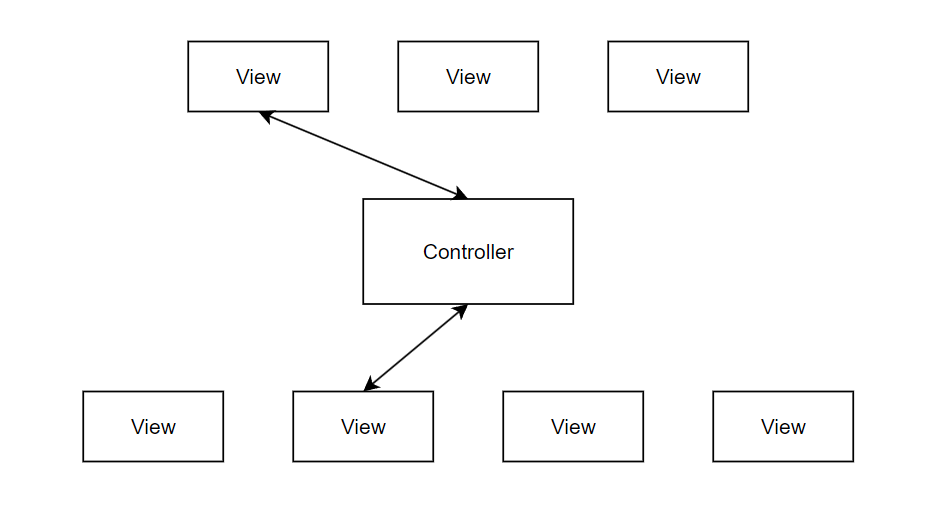
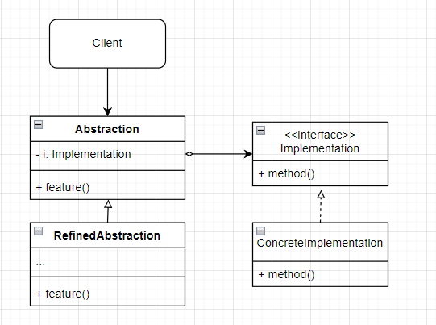
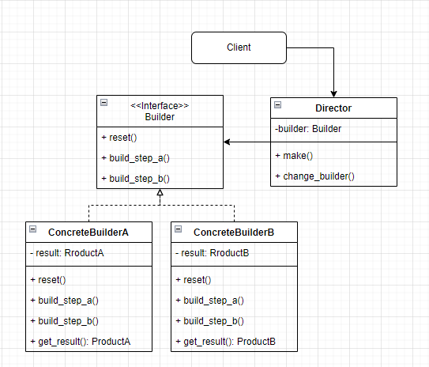
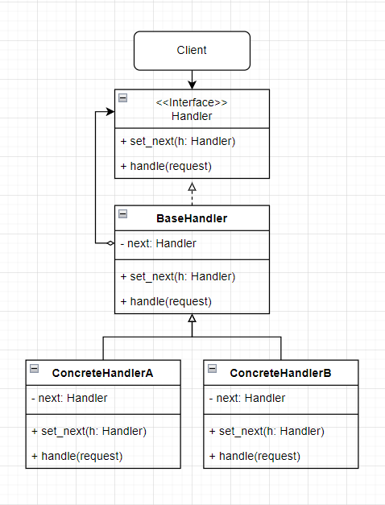
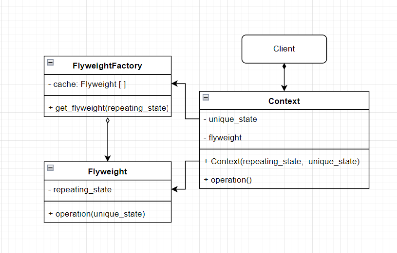
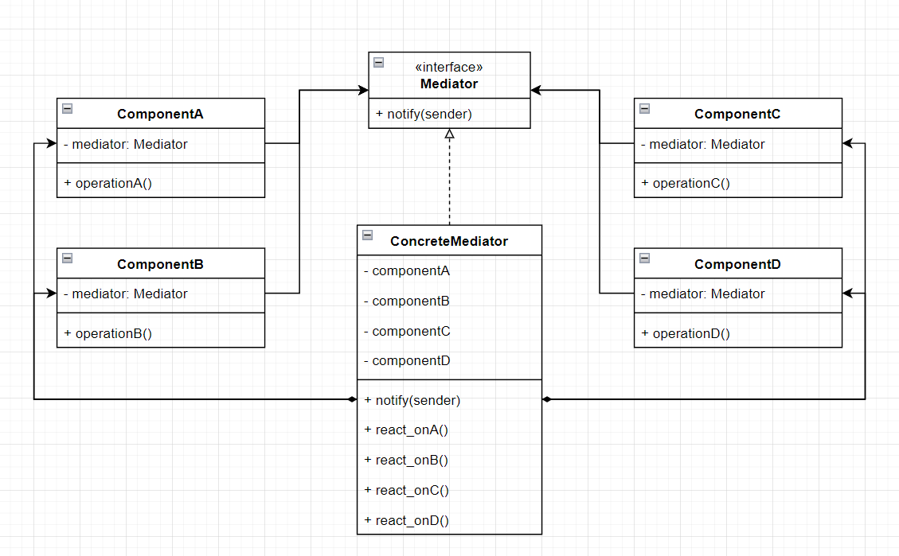
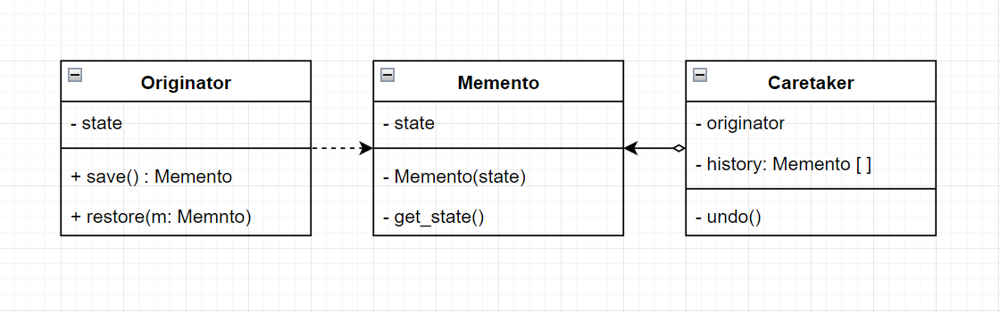
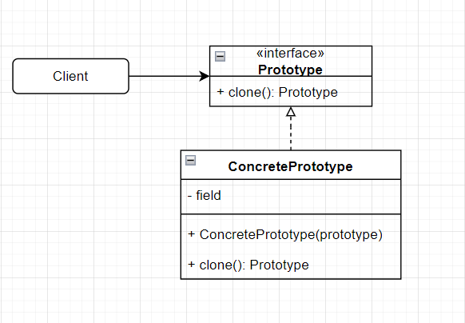
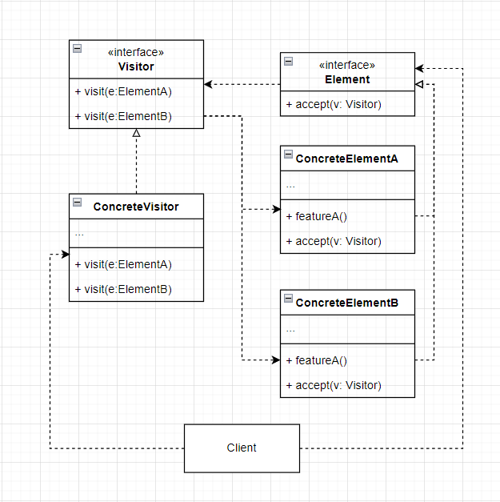

# Compound pattern

- 복합 패턴
  - 여러 패턴을 함께 사용해서 다양한 디자인 문제을 해결하는 방법을 복합 패턴이라 부른다.
  - 패턴 몇 개를 결합한다고 해서 무조건 복합 패턴이 되는 것은 아니다.
    - 복합 패턴이라고 불리려면 여러 가지 문제의 일반적인 해결법을 제시해야 한다.


- 오리 시뮬레이션 게임에 다양한 패턴 적용하기

  - 오리 시뮬레이션 게임을 처음부터 다시 만들면서 몇 가지 기능을 추가 할 것이다.
  - Quackable 인터페이스와 이를 구현하는 구상 클래스를 만든다.

  ```python
  from abc import ABCMeta, abstractmethod
  
  
  class Quackable(metaclass=ABCMeta):
  
      @abstractmethod
      def quack(self):
          pass
  
  
  class MallardDuck(Quackable):
      def quack(self):
          print("Quack")
  
  
  class RedHeadDuck(Quackable):
      def quack(self):
          print("Quack")
  
  # 고무 오리는 일반 오리와 다른 소리를 낸다.
  class RubberDuck(Quackable):
      def quack(self):
          print("Squeak")
  
  # 사냥꾼이 사용하는 오리 호출기도 오리와 다른 소리를 낸다.
  class DuckCall(Quackable):
      def quack(self):
          print("Quck")
  ```

  - 오리 시뮬레이터 생성하기

  ```python
  class Simulator:
      def simulate(self):
          mallard_duck: Quackable = MallardDuck()
          red_head_duck: Quackable = RedHeadDuck()
          rubber_duck: Quackable = RubberDuck()
          duck_call: Quackable = DuckCall()
  
          self._simulate(mallard_duck)
          self._simulate(red_head_duck)
          self._simulate(rubber_duck)
          self._simulate(duck_call)
  
      # 다형성을 활용하여 어떤 Quackable이 전달되든 quack() 메서드를 호출할 수 있게 한다.
      def _simulate(self, duck: Quackable):
          duck.quack()
  
  
  simulator = Simulator()
  simulator.simulate()
  ```


- Adapter Pattern 적용하기

  - 거위 클래스 추가하기

  ```python
  class Goose:
      def honk(self):
          print("honk")
  ```

  - 거위용 adapter 생성하기

  ```python
  from quackable import Quackable
  from goose import Goose
  
  
  class GooseAdapter(Quackable):
      def __init__(self, goose: Goose):
          self.goose = goose
  
      
      def quack(self):
          self.goose.honk()
  ```

  - 시뮬레이터에 거위 추가하기

  ```python
  from goose import Goose
  from goose_adapter import GooseAdapter
  
  
  class Simulator:
      def simulate(self):
          # ... 기존 코드
          goose: Quackable = GooseAdapter(Goose())
  
          # ... 기존 코드
          self._simulate(goose)
  
      # 기존 코드
  ```


- Decorator Pattern 적용하기

  - 오리가 운 횟수를 세기 위해 decorator class를 생성한다.
    - 모든 오리 객체가 운 횟수를 구해야 하므로 `num_of_quack`은 class 변수로 생성한다.
    - `get_quacks()` 메서드는 class method로 선언한다.

  ```python
  from quackable import Quackable
  
  
  class QuackCounter(Quackable):
      num_of_quack = 0
  
      def __init__(self, duck: Quackable):
          self.duck = duck
  
      def quack(self):
          self.duck.quack()
          QuackCounter.num_of_quack += 1
  
      @classmethod
      def get_quacks(cls):
          return cls.num_of_quack
  ```

  - 모든 객체를 decorator로 감싸준다.
    - 오리가 운 횟수만 셀 것이므로 거위는 제외한다.

  ```python
  from quackable import Quackable, MallardDuck, RedHeadDuck, RubberDuck, DuckCall
  from goose import Goose
  from goose_adapter import GooseAdapter
  from quack_counter import QuackCounter
  
  
  class Simulator:
      def simulate(self):
          mallard_duck: Quackable = QuackCounter(MallardDuck())
          red_head_duck: Quackable = QuackCounter(RedHeadDuck())
          rubber_duck: Quackable = QuackCounter(RubberDuck())
          duck_call: Quackable = QuackCounter(DuckCall())
          goose: Quackable = GooseAdapter(Goose())	# 거위는 제외한다.
  
          # ...(기존 코드와 동일)
  
          print("number of quack: ", QuackCounter.get_quacks())
  
      # ...
  ```


- Abstract Factory Pattern 적용하기

  - 지금까지는 simualtor 안에서 각 오리 구상 class를 직접 생성했으나, 이 생성을 하나의 class에서 처리하고자 한다.
  - 이를 위해 추상 팩토리를 생성한다.

  ```python
  from abc import ABCMeta, abstractmethod
  
  from quackable import Quackable
  
  
  class AbstractDuckFactory(metaclass=ABCMeta):
      @abstractmethod
      def create_mallard_duck(self) -> Quackable:
          pass
  
      @abstractmethod
      def create_red_head_duck(self) -> Quackable:
          pass
  
      @abstractmethod
      def create_rubber_duck(self) -> Quackable:
          pass
  
      @abstractmethod
      def create_duck_call(self) -> Quackable:
          pass
  ```

  - 실제 사용할 factory class를 생성한다.
    - `AbstractDuckFactory`를 상속 받는다.

  ```python
  from quackable import Quackable, MallardDuck, RedHeadDuck, RubberDuck, DuckCall
  from quack_counter import QuackCounter
  
  
  class CountingDuckFactory(AbstractDuckFactory):
      def create_mallard_duck(self) -> Quackable:
          return QuackCounter(MallardDuck())
      
      def create_red_head_duck(self) -> Quackable:
          return QuackCounter(RedHeadDuck())
      
      def create_rubber_duck(self) -> Quackable:
          return QuackCounter(RubberDuck())
      
      def create_duck_call(self) -> Quackable:
          return QuackCounter(DuckCall())
  ```

  - 시뮬레이터를 수정한다.
    - `simulate()` 메서드는 이제 factory를 매개 변수로 받는다.

  ```python
  from quackable import Quackable, MallardDuck, RedHeadDuck, RubberDuck, DuckCall
  from goose import Goose
  from goose_adapter import GooseAdapter
  from quack_counter import QuackCounter
  from duck_factory import CountingDuckFactory
  
  
  class Simulator:
      def simulate(self, duck_factory):
          mallard_duck: Quackable = duck_factory.create_mallard_duck()
          red_head_duck: Quackable = duck_factory.create_red_head_duck()
          rubber_duck: Quackable = duck_factory.create_rubber_duck()
          duck_call: Quackable = duck_factory.create_duck_call()
          goose: Quackable = GooseAdapter(Goose())
  
          # ... 기존과 동일
  
      # ... 기존과 동일
  
  
  if __name__ == "__main__":
      simulator = Simulator()
      # factory를 생성하고
      duck_factory = CountingDuckFactory()
      # 인자로 넘긴다.
      simulator.simulate(duck_factory)
  ```


- Composite Pattern 적용하기

  - 지금까지는 오리를 개별적으로 관리했지만, 통합해서 관리하려 한다.
    - 이를 위해 객체들로 구성된 컬렉션을 개별 객체와 같은 방식으로 다룰 수 있게 해 주는 composite pattern을 적용한다.
    - Iterator Pattern도 추가로 적용한다.

  ```python
  from typing import List
  
  from quackable import Quackable
  
  
  class Flock(Quackable):
      # composite 객체와 leaf 원소에서 같은 인터페이스를 구현해야 한다.
      def __init__(self):
          self.quackers: List[Quackable] = []
  
      def add(self, qucker:Quackable):
          self.quackers.append(qucker)
      
      def quack(self):
          for quacker in self.quackers:
              quacker.quack()
  ```

  - 시뮬레이터를 수정한다.

  ```python
  from quackable import Quackable
  from goose import Goose
  from goose_adapter import GooseAdapter
  from quack_counter import QuackCounter
  from duck_factory import CountingDuckFactory
  from flock import Flock
  
  
  class Simulator:
      def simulate(self, duck_factory):
          red_head_duck: Quackable = duck_factory.create_red_head_duck()
          rubber_duck: Quackable = duck_factory.create_rubber_duck()
          duck_call: Quackable = duck_factory.create_duck_call()
          goose: Quackable = GooseAdapter(Goose())
  
          flock_of_ducks = Flock()
  
          flock_of_ducks.add(red_head_duck)        
          flock_of_ducks.add(rubber_duck)        
          flock_of_ducks.add(duck_call)        
          flock_of_ducks.add(goose)        
  
          flock_of_mallards = Flock()
  
          mallard_duck_one: Quackable = duck_factory.create_mallard_duck()
          mallard_duck_two: Quackable = duck_factory.create_mallard_duck()
          mallard_duck_three: Quackable = duck_factory.create_mallard_duck()
          mallard_duck_four: Quackable = duck_factory.create_mallard_duck()
          flock_of_mallards.add(mallard_duck_one)
          flock_of_mallards.add(mallard_duck_two)
          flock_of_mallards.add(mallard_duck_three)
          flock_of_mallards.add(mallard_duck_four)
          
          # flock_of_mallards을 flock_of_ducks에 추가한다.
          flock_of_ducks.add(flock_of_mallards)
  
          print("전체 오리 시뮬레이션")
          self._simulate(flock_of_ducks)
  
          print("물오리 시뮬레이션")
          self._simulate(flock_of_mallards)
  
          print("number of quack: ", QuackCounter.get_quacks())
  
      # 기존과 동일
  
  
  if __name__ == "__main__":
      simulator = Simulator()
      duck_factory = CountingDuckFactory()
      simulator.simulate(duck_factory)
  ```


- Observer Pattern 적용하기

  - 오리가 꽥꽥 소리를 낼 때마다 추적하는 기능을 넣고자 한다.
  - Observer를 위한 인터페이스 생성하기
    - 옵저버를 삭제하는 기능은 편의상 생략한다.
    - `Observer` interface는 추후에 정의한다.

  ```python
  from abc import ABCMeta, abstractmethod
  
  
  class QuackObervable(metaclass=ABCMeta):
      @abstractmethod
      def register_observer(self, observer: Observer):
          pass
  
      @ abstractmethod
      def notify_observer(self):
          pass
  ```

  - Quackable이 Obserer를 구현하도록 수정하기

  ```python
  from abc import abstractmethod
  
  from quack_observer import QuackObervable
  
  class Quackable(QuackObervable):
  
      @abstractmethod
      def quack(self):
          pass
  ```

  - Quackable을 구현하는 모든 구상 클래스에서 QuackObservable에 있는 메서드를 구현하도록 한다.
    - 등록 및 연락용 코드를 Observable 클래스에 캡슐화하고, 구성으로 QuackObservable에 포함시킨다.
    - 이를 통해 실제 코드는 한 군데만 작성하고, QuackObservalbe이 필요한 적업을 Observable 보조 클래스에 전부 위임하게 만들 수 있다.

  ```py
  class Observable(QuackObervable):
      def __init__(self, duck):
          self.observers: List[Observer] = []
          self.duck = duck
      
      def register(self, observer: Observer):
          self.observers.append(observer)
      
      def notify_observer(self):
          for observer in self.observers:
              observer.update(self.duck)
  ```

  - Observer 보조 객체를 모든 Quackable class에 넘겨준다.
    - 예시로 MallardDuck에만 추가하지만 모든 Quackable class(`Goose`, `QuackCOunter` 등)에 추가해야한다.

  ```python
  from quackable import Quackable
  from observer import Observable
  
  
  class MallardDuck(Quackable):
      def __init__(self):
          self.observable = Observable(self)
      
      def quack(self):
          print("Quack")
          # quack이 호출되면 Observer에게 신호를 보낸다.
          self.notify_observer()
  
      def register_observer(self, observer: Observer):
          self.observable.register_observer(observer)
      
      def notify_observer(self):
          self.observable.notify_observer()
  ```

  - `QuackCounter`를 아래와 같이 수정한다.

  ```python
  class QuackCounter(Quackable):
      # .. 기존 코드와 동일
      
      def register_observer(self, observer: Observer):
          self.duck.register_observer(observer)
      
      def notify_observer(self):
          self.duck.notify_observer()
  ```

  - `Flock`은 아래와 같이 변경한다.
    - 옵저버에 등록할 때 오리 무리 안에 있는 모든 Quakable 객체들을 일일이 옵저버에 등록해줘야한다.
    - Quackable 객체에서 알아서 옵저버에게 연락을 돌리므로 Flock은 아무 일도 하지 않아도 된다(Flock에서 개별 Quackable 객체의 `quack()` 메서드를 호출하면 자동으로 처리된다).

  ```python
  from typing import List
  
  from quackable import Quackable
  from observer import Observer
  
  
  class Flock(Quackable):
      def __init__(self):
          self.quackers: List[Quackable] = []
  
      def add(self, qucker:Quackable):
          self.quackers.append(qucker)
      
      def quack(self):
          for quacker in self.quackers:
              quacker.quack()
      
      def register_observer(self, observer: Observer):
          # quackers를 순회하면서 일일이 등록한다.
          # 만일 quacker가 또 다른 Flock 객체라면 재귀적으로 호출이 반복된다.
          for quacker in self.quackers:
              quacker.register_observer(observer)
      
      def notify_observer(self):
          pass
  ```

  - Observer class 만들기

  ```python
  class Observer(metaclass=ABCMeta):
      def update(self, duck: QuackObervable):
          pass
  
  
  class QuackLogist(Observer):
      def update(self, duck: QuackObervable):
          print("{}가 방금 소리 냈다.".format(duck.__class__.__name__))
  ```

  - 시뮬레이터 수정하기

  ```python
  from quackable import Quackable
  from goose import Goose
  from goose_adapter import GooseAdapter
  from quack_counter import QuackCounter
  from duck_factory import CountingDuckFactory
  from flock import Flock
  from observer import QuackLogist
  
  
  class Simulator:
      def simulate(self, duck_factory):
          # 기존 코드와 동일
  
          quack_logist = QuackLogist()
          flock_of_ducks.register_observer(quack_logist)
          self._simulate(flock_of_ducks)
  
          print("number of quack: ", QuackCounter.get_quacks())
  
      # 다형성을 활용하여 어떤 Quackable이 전달되든 quack() 메서드를 호출할 수 있게 한다.
      def _simulate(self, duck: Quackable):
          duck.quack()
  
  
  if __name__ == "__main__":
      simulator = Simulator()
      duck_factory = CountingDuckFactory()
      simulator.simulate(duck_factory)
  ```


## Model-View-Controller Pattern

> 글 마다 설명이 모두 다르다.
>
> 추후에 완벽하게 정리된 글을 발견하면 추가할 것

- MVC Pattern
  - Model
    - 모든 데이터, 상태와 애플리케이션 로직이 들어있다.
    - 뷰와 컨트롤러에서 모델의 상태를 조작하거나 가져올 때 필요한 인터페이스를 제공하고, 모델이 자신의 상태 변화를 옵저버들에게 연락해주지만, 기본적으로 모델은 뷰와 컨트롤러에 별 관심이 없다.
  - View
    - 모델을 표현하는 방법을 제공한다.
    - 일반적으로 화면에 표시할 때 필요한 상태와 데이터는 모델에서 직접 가져온다.
    - 다만, 꼭 모델에게 요청해서 가져올 필요는 없고, 모델이 갱신 될 때, view도 함께 갱신시키는 방식을 사용해도 된다.
  - Controller
    - 사용자로부터 입력을 받는다.
    - 입력받은 내용이 모델에게 어떤 의미가 있는지 파악한다.
    - 컨트롤러에는 비즈니스 로직을 작성하지 않는다.


- 동작 과정

  - 사용자가 뷰에 접촉한다.
    - 사용자는 뷰에만 접촉할 수 있다.
    - 사용자가 뷰에서 뭔가를 하면 뷰는 무슨 일이 일어났는지 컨트롤러에게 알려준다.
    - 컨트롤러가 상황에 맞게 작업을 처리한다.

  - 컨트롤러가 모델에게 상태를 변경하라고 요청한다.
    - 컨트롤러는 사용자의 행동을 받아서 해석한다.
    - 사용자가 버튼을 클릭하면 컨트롤러는 그것이 무엇을 의미하는지 해석하고, 모델을 어떤 식으로 조작해야 하는지 결정한다.
  - 컨트롤러가 뷰를 변경해 달라고 요청할 수도 있다.
    - 컨트롤러는 뷰로부터 어떤 행동을 받았을 때, 그 행동의 결과로 뷰에게 뭔가를 바꿔 달라고 할 수도 있다.
    - 예를 들어 컨트롤러는 화면에 있는 어떤 버튼이나 메뉴를 활성화하거나 비활성화 할 수 있다.
  - 상태가 변경되면 모델이 뷰에게 그 사실을 알린다.
    - 사용자가 한 행동이나 내부적인 변화 등으로 모델에서 변경이 생길경우 모델은 뷰에게 상태가 변경되었다고 알린다.
  - 뷰가 모델에게 상태를 요청한다.
    - 뷰는 화면에 표시할 상태를 모델로부터 직접 가져온다.
    - 컨트롤러가 뷰에게 뭔가를 바꾸라고 요청할 때, 뷰는 모델에게 상태를 알려달라고 요청할 수도 있다.


- MVC에 사용되는 패턴들
  - Observer Pattern
    - 모델은 옵저버 패턴을 사용하여 상태가 바뀔 때 마다 뷰와 컨트롤러에게 연락한다.
    - 옵저버 패턴을 사용함으로써 모델을 뷰와 컨트롤러로부터 완전히 독립시킬 수 있다.
    - 한 모델에서 서로 다른 뷰를 사용할 수도 있고, 여러 개의 뷰를 동시에 사용할 수도 있게 된다.
  - Strategy Pattern
    - 뷰와 컨트롤러는 전략 패턴을 사용하여 부 객체를 여러 전략을 사용하여 설정할 수 있다.
    - 컨트롤러가 전략을 제공하고, 뷰는 애플리케이션의 겉모습에만 신경 쓰고, 인터페이스의 행동을 결정하는 일은 모두 컨트롤러에게 맡긴다.
    - 사용자가 요청한 내역을 처리하려고 모델과 얘기하는 일을 컨트롤러가 맡고 있으므로, 전략 패턴을 사용함으로써 뷰를 모델로부터 분리할 수 있다.
  - Composite Pattern
    - 뷰는 컴포지트 패턴을 사용하여 여러 단계로 겹쳐 있는 화면을 표현한다.
    - 컨트롤러가 뷰에게 화면을 갱신해달라고 요청하면 최상위 뷰 구성 요소에게만 화면을 갱신하라고 얘기하면 된다.
    - 나머지는 컴포지트 패턴이 알아서 처리해준다.


- MVC, MVP, MVVM
  - 세 패턴 모두 비즈니스 로직과 뷰를 분리하기 위해 사용하는 패턴들이다.
    - 시스템이 수행해야 하는 비즈니스 로직과 사용자에게 보여지는 뷰를 분리하는 것은 매우 중요하다.
    - 비즈니스 로직과 뷰가 분리되어야 새로운 기능의 추가나 기존 기능의 변경 같은 요구사항의 변화에 보다 유연하고 대응할 수 있기 때문이다.
  - 비즈니스 로직과 뷰를 분리하는 방식이 패턴마다 약간씩 다르다.


- MVC(Model-View-Controller)

  - View와 model 사이에 controller를 두어 view와 model 사이의 의존성을 제거하는 방식이다.
  - 구성
    - View는 사용자 인터페이스를 나타내며, model의 데이터를 보여주고, 사용자의 입력을 model에 전달하는 역할을한다.
    - Contorller는 model과 view를 연결하는 역할을 하며, view에서 받은 입력을 model에 전달하고, model의 변경 사항을 view에 전달한다.
    - Model은 비즈니스 로직과 데이터를 담당한다. 데이터를 가져오고 변경하는 로직을 가지고 있다.

  

  - 예시 코드
    - Controller는 model과 view에 대한 참조를 가지고 있다.

  ```python
  class ProductModel:
  
      def __init__(self, name, price):
          self._name = name
          self._price = price
  
      @property
      def name(self):
          return self._name
  
      @name.setter
      def name(self, name):
          self._name = name
  
      @property
      def price(self):
          return self._price
  
      @price.setter
      def price(self, price):
          self._price = price
  
  
  class ProductView:
  
      def display_product(self, name, price):
          print(f"Product - name: {name}, price: {price}")
      
  
  class Controller:
  
      def __init__(self, product: ProductModel, view: ProductView):
          self._product = product
          self._view = view
      
      def set_price(self, price):
          self._product.price = price
      
      def display_product(self):
          self._view.display_product(self._product.name, self._product.price)
  
  
  # client
  if __name__ == "__main__":
      product_model = ProductModel("desk", 100_000)
      product_view = ProductView()
      product_controller = Controller(product_model, product_view)
  
      product_controller.set_price(150_000)
      product_controller.display_product()
  ```

  - MVC 패턴의 문제점
    - Controller가 view와 model을 모두 알고 있어야한다.
    - 또한 다수의 view, model이 controller를 통해 연결될 경우 controller가 비대해지는 현상이 발생할 수 있다.
    - 단일 controller가 비대해지는 상황을 피하기 위해 controller를 여러 개 둘 경우 각 controller에서 view와 model에 동시에 접근하게 되므로 모델의 상태를 일관되게 유지하기 어려울 수 있다는 문제가 있다.


# 다양한 디자인 패턴들

- 디자인 패턴의 정의
  - 특정 컨텍스트 내에서 주어진 문제의 해결책을 패턴이라 부른다.
    - 컨텍스트란 패턴이 적용되어야 하는 상황을 의미하며, 반복적으로 일어날 수 있는 상황이어야 한다.
    - 문제란 컨텍스트 내에서 이뤄야하는 목표를 의미한다.
    - 해결책은 제약조건 속에서 누가 적용해도 목표를 이룰 수 있는 일반적인 디자인을 의미한다.
  - 특정 디자인이 컨텍스트 내에서 주어진 문제를 해결하는 해결책이라 하더라도, 해당 컨텍스트가 반복적으로 발생하지 않는다면, 패턴이라 부를 수 없다.


- 디자인 패턴 분류

  > 모든 디자인 패턴들이 각 범주에 딱 떨어지게 분류되는 것은 아니다.
  >
  > 관점에 따라, 상황에 따라 다른 범주에 속할 수도 있다.

  - 생성(Creational) 패턴
    - 객체 인스턴스를 생성하는 패턴이다.
    - 클라이언트와 클라이언트가 생성해야 하는 객체 인스턴스 사이의 연결을 끊어준다.
    - 싱글톤, 팩토리 패턴 등이 이에 속한다.
  - 행동(Behavioral) 패턴
    - 클래스와 객체들이 상호작용하는 방법과 역할을 분담하는 방법을 다루는 패턴이다.
    - 옵저버, 상태, 전략 패턴등이 이에 속한다.
  - 구조(Structural)
    - 클래스와 객체를 더 큰 구조로 만들 수 있게 구상을 사용하는 패턴이다.
    - 어댑터, 데코레이터, 컴포지트 패턴 등이 이에 속한다.
  - 혹은 클래스를 다루는 패턴인지, 객체를 다루는 패턴인지에 따라 구분하기도 한다.
    - 클래스 패턴은 클래스 사이의 관계가 상속으로 어떻게 정의되는지를 다루는 패턴들로, 어댑터, 템플릿 메서드 등이 이에 속한다.
    - 객체 패턴은 객체 사이의 관계를 다루며, 객체 사이의 관계는 일반적으로 구성으로 정의 되는 패턴들로, 대부분의 패턴이 이에 속한다.


## Bridge Pattern

> https://refactoring.guru/design-patterns/bridge

- 문제

  - 상황
    - `Circle`과 `Square` class를 subclass로 가지는 `Shape` class가 있다.
    - `Shape` class에 모양 뿐 아니라 `Blue`, `Red`라는 색도 추가하려고 한다.
    - 이를 위해 `RedCircle`, `RedSquare`, `BlueCircle`, `BlueSqure`라는 4개의 subclass를 생성했다.
    - 그러나 이 방식을 계속 사용한다면, 새로운 모양 혹은 색을 추가할 때 마다 모양과 색의 모든 조합에 해당하는 class를 만들어줘야한다.

  ```python
  class Shape:
      pass
  
  class RedCircle(Shape):
      pass
  
  class BlueCircle(Shape):
      pass
  
  class RedSquare(Shape):
      pass
  
  class BlueSquare(Shape):
      pass
  ```

  - 원인
    - 문제는 `Shape` class를 모양과 색이라는 서로 독립적인 차원으로 확장하려 해서 발생한다.
    - 이는 class 상속에서 매우 빈번하게 발생하는 문제이기도 하다.


- 해결

  - Bridge pattern은 상속 대신 구성을 사용하는 방식으로 이러한 문제를 해결한다.
    - 모양과 색 중 하나를 분리하여 원래 class(이 경우 `Shape` class)와 같은 계층의 class로 생성한다.
    - 원래 class는 분리된 class의 object를 참조하도록한다.
    - 이를 통해 `Shape` class는 분리된 object에 관련 작업을 위임할 수 있게 된다.
  - 예시

  ```python
  # Color관련 로직을 Shape에서 분리하여 Shape와 같은 계층으로 생성한다.
  class Color:
      pass
  
  class Red(Color):
      pass
  
  class Blue(Color)
  
  
  class Shape:
      # 구성을 통해 color를 활용한다.
      def __init__(self, color: Color):
          self.color = color
  
  class Circle(Shape):
      pass
  
  class Square(Shape):
      pass
  
  
  red_circle = Circle(Red())
  ```


- Bridge Pattern

  - 추상과 구현을 분리하여 추상과 구현을 독립적으로 확장시킬 수 있게 해주는 패턴이다.
    - OOP에서 일반적으로 말하는 추상과 구현 개념과는 약간 다르다.
    - 구현을 캡슐화하여 추상에 포함시키는 방식을 사용한다.
    - 구성을 통해 두 클래스가 연결되며, 구성을 통해 참조되는 object(위의 경우 Color의 object)가 두 클래스 사이의 다리 역할을 한다 하여 bridge design pattern이라는 이름이 붙었다.
  - 추상과 구현(abstraction and implementation)
    - 추상(혹은 interface(OOP에서 일반적으로 쓰이는 interface와는 다르다))이란 어떤 entity의 높은 수준의 계층을 말한다.
    - 추상 계층은 애플리케이션에 필요한 business logic의 틀만 잡는다.
    - 실제 business logic은 abstraction과 분리되어 구현 계층에 작성한다.
    - 즉, 추상 계층은 그 자체로는 어떠한 작업도 하지 않으며, 구현 계층에게 모든 일을 위임한다.
    - 구현(혹은 platform)이란 추상 계층에게 실제 작업을 위임 받아 처리하는 계층을 의미한다.
  - 예시
    - 여러 개의 application을 개발하려 하는데, 각 애플리케이션마다 GUI도 제각각이고 API도 제각각이다.
    - 만일 이들을 모두 개별적으로 개발하려 한다면 `GUI 개수 * API 개수 ` 만큼의 class를 생성해야 할 것이다.
    - 따라서 bridge pattern을 적용하기로 한다.
    - GUI는 실제로는 어떠한 작업도 하지 않고 모든 작업을 API에 위임하므로 인터페이스라 볼 수 있다.
    - API 서버는 GUI로부터 작업을 위임 받아 처리하므로 플랫폼이라 볼 수 있다.
    - GUI에 구성을 통해 API 서버에 대한 참조를 설정함으로써 위와 같은 문제를 해결할 수 있다.
    - 서로 다른 플랫폼들은 같은 인터페이스를 공유하기만 한다면  언제든 교체될 수 있다.
  - 클래스 다이어그램
    - Abstraction을 실제 작업의 처리를 Implementation에 위임한다(Abstraction은 추상 클래스나 인터페이스로 선언한다).
    - RefinedAbstraction은 Absraction의 다양한 변형이며, Abstraction과 마찬가지로 구성을 통해 Implementation에 작업의 처리를 위임한다(패턴에서 필수 요소는 아니다).
    - Implementation은 모든 ConcreteImplementation이 공유하는 공통 로직을 정의한다.
    - Abstraction은 오직 Implementation에 호출된 메서드를 통해서만 Implementation object와 소통한다.
    - ConcreteImplementation에는 platform에 특화된 코드들이 들어간다.
    - Client는 일반적으로 Abstraction에게만 관심을 가진다.

  
  
  - 동작 과정
    - Client가 Abstraction object의 `feature()`를 호출한다.
    - Abstraction은 `feature()`가 호출되면 Implementation의 `method()`를 호출하여 실제 작업을 처리하도록 한다.
  


- 예시

  ```python
  from abc import ABCMeta, abstractmethod
  
  
  # implementation
  class MoveLogic(metaclass=ABCMeta):
      @abstractmethod
      def move(self):
          pass
  
  
  class Walk(MoveLogic):
      def move(self):
          print("Walking")
  
  
  class Fly(MoveLogic):
      def move(self):
          print("Flying")
  
  
  class Swim(MoveLogic):
      def move(self):
          print("Swimming")
  
  
  # abstcation
  class Animal(metaclass=ABCMeta):
      def __init__(self, move_logic: MoveLogic):
          self.move_logic = move_logic
      
      @abstractmethod
      def how_do_i_move(self):
          self.move_logic.move()
  
  
  class Person(Animal):
      def how_do_i_move(self):
          self.move_logic.move()
  
  
  class Bird(Animal):
      def how_do_i_move(self):
          self.move_logic.move()
  
  
  class Fish(Animal):
      def how_do_i_move(self):
          self.move_logic.move()
  
  
  if __name__ == "__main__":
      person = Person(Walk())
      person.how_do_i_move()
      bird = Bird(Fly())
      bird.how_do_i_move()
      fish = Fish(Walk())
      fish.how_do_i_move()
  ```


## Builder Pattern

- 문제

  - 상황
    - House 클래스를 통해 인스턴스를 생성해야 한다고 가정해보자.
    - 간단한 객체를 생성하려 한다면 wall, door, window, roof, floor 등의 arguments만 받으면 될 것이다.
    - 그러나, House class를 통해 보다 다양한 유형의 인스턴스를 생성하고자 한다면, has_garden, has_heating_system, has_swimming_pool 등 보다 많은 arguments를 받아야 할 것이다.
  - 이를 House class에서 모두 관리를 하는 것은 비효율 적이다.
    - 예를 들어 굉장히 소수의 인스턴스만 has_swimming_pool의 값이 true로 들어올텐데, 이들을 생성시마다 넘겨주는 것은 비효율 적이다.
    - 또한 만약 요구사항 변경에 의해 새로운 arguments가 추가된다면, 예를 들어 has_garage argument가 추가된다면, 기존 House 인스턴스를 생성하는 모든 코드에 has_garage parameter를 추가해줘야 한다.
    - 또한 객체 생성 부분만 보고, 각 parameter가 무엇을 의미하는지 알기도 쉽지 않다.

  ```python
  class House:
  	def __init__(self, num_window, wall, roof, floor, 
  				has_garden, has_heating_system, has_swimming_pool):
  		pass
  
  simple_house = House(2, "stone", "wood", 1, False, False, False)
  fancy_house = House(8, "brick", "glass", 2, True, True, True)
  
  # 만일 새로운 argument가 추가된다면 simple_house, fancy_house의 생성 부분에 모두 parameter를 추가해야한다.
  # 또한 House(8, "brick", "glass", 2, True, True, True)만 보고는 어떤 집을 만드려는 것인지 파악이 쉽지 않다.
  ```

  - 해결
    - 모든 Builder에 공통으로 들어가는 로직을 선언할 Builder interface를 생성한다.
    - 이 interface를 Builder라 부르고, 이를 구체화 한 class를 Concrete Builder라 부르기도 한다.
    - Builder interface를 구체화 한 Concrete Builder class를 생성한다.
    - Builder interface를 생성하지 않았다면 그냥 Builder class를 생성한다.
    - Director를 생성하고, director에게 객체의 생성을 맡긴다.
    - Director에는 builder 내에 정의되어 있는 객체 생성 메서드들을 어느 순서로 실행할지를 정의한다.
    - Director를 사용할 경우 client는 director를 통해서만 객체를 생성한다.
    - 따라서 객체의 생성을 client code로부터 완전히 감출 수 있다.


- Builder Pattern

  - 복합 객체의 생성과 표현을 분리한다.
    - 이를 통해 동일한 생성 절차로 다른 표현을 생성할 수 있다.
  - 객체의 spec을 실제 표현과 분리해야 할 때 유용하게 사용할 수 있다.
  - 클래스 다이어그램
    - Builder interface는 Product를 생성하는 단계들을 정의한다.
    - ConcreteBuilder는 각 생성 단계에 대한 실제 구현을 정의하는데, ConcreteBuilder마다 실제 구현 방식이 다를 수 있다.
    - Director 클래스는 생성 단계의 순서를 정의한다.
    - Director의 경우 builder를 아래 다이어그램에서와 같이 attribute로 가지고 있으면서 계속 해당 builder만 사용하는 방식이 있고, 실제 객체를 생성할 때 인자로(`make()` 메서드의 인자로) builder 객체를 받아 사용하는 방식이 있다.
    - Client는 Director를 통해 Builder를 조작한다.

  


- 예시

  - 자동차를 생성하는 concrete builder class를 작성한다.
    - 자동차는 다양한 방식으로 생성된다.
    - 자동차를 생성하는 모든 방식을 망라하는 하나의 거대한 class를 만드는 대신 자동차를 조립하는 코드를 개별적인 builder로 분리해서 자동차를 생성한다.
  - 자동차의 메뉴얼을 생성하는 concrete builder class를 생성한다.
    - 자동차의 메뉴얼은 자동차의 종류에 따라 달라지며, 대부분 자동차의 부품에 대한 설명이다.
    - 따라서 자동차와 같은 builder interface를 구현하여 작성이 가능하다.
  - 아래 예시에서 Dicrector는, 위에서 살펴본 다이어그램과는 달리,  builder object를 attribute로 갖는 대신 Car object를 생성할 때 builder를 parameter로 받는 방식을 사용했다.

  ```python
  from abc import abstractmethod
  
  # Product 객체
  class Car:
  	def __init__(self):
  		self.num_seat = 0
  		self.engine = None
  		self.trip_computer = None
  		self.gps = None
  
  # Product 객체
  class Manual:
  	def __init__(self):
  		self.num_seat = ""
  		self.engine_name = ""
  		self.trip_computer_name = ""
  		self.gps_name = ""
  
  # builder (interface) 생성하기
  class Builder:
  
  	@abstractmethod
  	def reset(self):
  		pass
  
  	@abstractmethod
  	def set_seats(self):
  		pass
  
  	@abstractmethod
  	def set_engine(self):
  		pass
  
  	@abstractmethod
  	def set_trip_computer(self):
  		pass
  
  	@abstractmethod
  	def set_gps(self):
  		pass
  
  
  # Car 생성을 위한 (concrete) builder 생성하기
  class CarBuilder(Builder):
  
  	def __init__(self):
  		self.reset()
  	
  	def reset(self):
  		self._car = Car()
  
  	def set_seats(self, num_seat):
  		self._car.num_seat = num_seat
  
  	def set_engine(self, engine):
  		self._car.engine = engine
  
  	def set_trip_computer(self, trip_computer):
  		self._car.trip_computer = trip_computer
  
  	def set_gps(self, gps):
  		self._car.gps = gps
  	
  	@property
  	def car(self):
  		car = self._car
  		self.reset()
  		return car
  
  
  # Car Manual 생성을 위한 (concrete) builder 생성하기
  class ManualBuilder(Builder):
  
  	def __init__(self):
  		self.reset()
  	
  	def reset(self):
  		self._manual = Manual()
  
  	def set_seats(self, num_seat):
  		self._manual.num_seat = "number of seats : {}".format(num_seat)
  
  	def set_engine(self, engine):
  		self._manual.engine_name = "engine : {}".format(engine)
  
  	def set_trip_computer(self, trip_computer):
  		self._manual.trip_computer_name = "trip_computer : {}".format(trip_computer)
  
  	def set_gps(self, gps):
  		self._manual.gps_name = "gps : {}".format(gps)
  
  	@property
  	def manual(self):
  		manual = self._manual
  		self.reset()
  		return manual
  
  
  # Builder를 통한 객체 생성 순서를 정의하기 위한 Director 생성
  class Director:
  
  	def construct_sporst_car(self, builder):
  		builder.reset()
  		builder.set_seats(2)
  		builder.set_engine("sports_car_engine")
  		builder.set_trip_computer("sports_navi")
  		builder.set_gps("sports_gps")
  	
  	def construct_suv(self, builder):
  		builder.reset()
  		builder.set_seats(6)
  		builder.set_engine("suv_engine")
  		builder.set_trip_computer("suv_navi")
  		builder.set_gps("suv_gps")
  
  
  if __name__=="__main__":
  	# client code
  	# director를 사용했으므로, construct_sporst_car 메서드만 호출하면 되며,
  	# 내부적으로 sports car가 어떻게 생성되는지는 감출 수 있다.
  	direcotr = Director()
  	builder = CarBuilder()
  	direcotr.construct_sporst_car(builder)
  	car = builder.car
  
  	builder = ManualBuilder()
  	direcotr.construct_sporst_car(builder)
  	manual = builder.manual
  ```


- 한계
  - 결국 생성하려는 객체에 맞춰 builder를 계속 늘어나게 된다.
  - Python에서도 유용한 패턴인지 의문
    - Python의 경우 parameter에 기본값을 설정 가능하다.
    - Keyword argument를 통해 어떤 값을 넘기는지 명시적으로 표현이 가능하다.


## Chain of Responsibility Pattern

> https://betterprogramming.pub/understanding-the-chain-of-responsibility-design-pattern-2f44cdff61e5
>
> https://refactoring.guru/design-patterns/chain-of-responsibility

- 문제

  - 사용자 인증 시스템을 만드려고 한다.
    - 처음에는 아래와 같이 간단하게 id와 password만 확인하는 방식으로 사용자 인증이 이루어졌다.
    - 또한 관리자에게는 모든 권한을 주기 위해 관리자인지 체크하는 함수도 필요했다.

  ```python
  class AccessControl:
      user_info = {
          "user_id1":"password1", 
          "user_id2":"passowrd2",
          "admin1":"1q2w3e4r"
          "admin2":"r4e3w2q1"
      }
      administrators = ["admin1", "admin2"]
  
      def authenticate(self, id_, password):
          pass
      
      def is_admin(self, id_):
          pass
  
  if __name__ == "__main__":
      request = get_request()
      access_control = AccessControl()
      admin = False
      if verified := access_control.authenticate(request.id, request.password):
          admin = access_control.is_admin(request.id)
  ```

  - 그런데 점점 인증 방식이 복잡해지기 시작한다.
    - Brute force password cracking을 막기 위해 일정 횟수 이상 틀릴 경우 대기 시간을 줘야 한다.
    - ID, password를 요청에 바로 넘기지 않고 암호화된 token을 받아와서 복호화한 후 인증하는 방식을 사용한다.
    - 더 이상 memory에 사용자 정보와 admin 계정들을 관리하지 않고 DB에서 받아온다.

  ```python
  class AccessControl:
      def __init__(self):
          self.db_conn = get_db_connection()
          self.num_try = 0
          
      def set_db_connection(self, db_info):
          pass
      
      def decrypt_token(self, token):
          pass
  
      def authenticate(self, decrypted_token):
          pass
      
      def count_num_try(self):
          pass
      
      def is_administrator(self, decrypted_token):
          pass
  
  
  if __name__ == "__main__":
      MAX_RETRY = 5
      access_control = AccessControl()
      try:
  	    access_control.set_db_connection(db_info)
      except ConnectionError:
          raise
      
      while num_try < MAX_RETRY:
          request = get_request()
          access_control.count_num_try()
          decrypted_token = access_control.decrypt_token(request.token)
          admin = False
          if verified := access_control.authenticate(decrypted_token):
              admin = access_control.is_admin(decrypted_token)
  ```

  - 인증 방식이 추가, 수정 될 때 마다 인증 관련 코드와 client 코드를 계속 변경해줘야 한다.


- Chain of Responsibility Pattern

  - Request을 보내는 쪽과 해당 요청을 받아서 처리하는 쪽이 강하게 결합되는 것을 막는 패턴이다.
    - 하나의 요청을 여러 객체가 연쇄적으로 처리하는 방식을 통해 sender와 receiver를 분리한다.
    - 전체 과정을 세부 과정으로 나누고, 각 과정을 handler라 불리는 객체들에 위임한다.
  - Handler
    - 각 handler들은 서로 연결(link)되어 있으며, 이전 단계의 handler의 결과물을 input으로 받아 처리 후 그 output을 다음 단계의 handler로 보낸다.
    - 각 handler들은 자신에게 들어온 request를 처리할지 말지를 결정할 수 있다. 
    - 또한 다음 handler로 보낼지, 아니면 보내지 않을 지도 결정할 수 있다.
    - 따라서 불필요하게 모든 과정을 거치지 않더라도 처리가 완료될 수 있다.
  - Request는 chain 상의 아무 handler에나 전달될 수 있다.
    - chain을 이루고 있다고 해서 꼭 첫 번째 handler에만 request를 전달할 수 있는 것은 아니다.
  - CoR 패턴을 사용해야 하는 이유
    - 요청을 보내는 쪽과 받는 쪽의 결합도를 줄일 수 있다(요청을 보내는 쪽은 request가  handler에 의해 처리된다는 것만 알면 된다).
    - 전체 처리 과정을 나누고 각 과정을 handler에 위임함으로써, request가 어떤 과정을 거쳐 처리되는지를 보다 명확히 알 수 있게 된다.
    - 런타임에 처리 방식을 동적으로 변경할 수 있다.
    - 새로운 과정의 추가 및 삭제를 보다 간단하게 할 수 있다.
  - 클래스 다이어그램
    - Handler에는 모든 ConcreteHandler에게 공통으로 들어가는 로직을 작성한다.
    - 일반적으로 request 처리를 위한 단 하나의 method만 정의되어 있지만, 경우에 따라서는 실행될 다음 handler를 설정하는 메서드도 정의된다.
    - BaseHandler는 필수적으로 들어가지는 않는 클래스로, 모든 handler class에 공통으로 들어가는 boilerplate code를 작성하기 위해 사용한다.
    - 일반적으로 다음 handler에 대한 참조를 저장하기 위한 field를 선언한다.
    - ConcreteHandler는 request를 처리하기 위한 실제 코드가 들어간다.
    - ConcreteHandler는 request를 받았을 때 해당 request를 처리할지 말지를 결정해야하며, 다음 handler로 넘길지 말지도 결정해야한다.
    - Client는 handler들의 체인을 구성하는 역할을 한다.

  


- 예시

  ```python
  from __future__ import annotations
  from abc import ABC, abstractmethod
  
  
  class Handler(ABC):
      @abstractmethod
      def set_next(self, handler: Handler) -> Handler:
          pass
  
      @abstractmethod
      def handle(self, request):
          pass
  
  
  class AbstractHandler(Handler):
      _next_handler = None
      
      # handler들 사이에 링크를 위해 handler를 반환한다.
      def set_next(self, handler: Handler) -> Handler:
          self._next_handler = handler
          return handler
  
      @abstractmethod
      def handle(self, request: str) -> str:
          if self._next_handler:
              return self._next_handler.handle(request)
  
          return None
  
  
  class MonkeyHandler(AbstractHandler):
      def handle(self, request: str) -> str:
          # 모든 handler는 작업을 처리할지 처리하지 않을지 결정할 수 있다.
          if request == "Banana":
              return f"Monkey: I'll eat the {request}"
          else:
              return super().handle(request)
  
  
  class SquirrelHandler(AbstractHandler):
      def handle(self, request: str) -> str:
          if request == "Nut":
              return f"Squirrel: I'll eat the {request}"
          else:
              return super().handle(request)
  
  
  class DogHandler(AbstractHandler):
      def handle(self, request: str) -> str:
          if request == "MeatBall":
              return f"Dog: I'll eat the {request}"
          else:
              return super().handle(request)
  
  
  def client_code(handler: Handler) -> None:
  
      for food in ["Nut", "Banana", "Cup of coffee"]:
          print(f"\nClient: Who wants a {food}?")
          result = handler.handle(food)
          if result:
              print(f"  {result}", end="")
          else:
              print(f"  {food} was left untouched.", end="")
  
  
  if __name__ == "__main__":
      monkey = MonkeyHandler()
      squirrel = SquirrelHandler()
      dog = DogHandler()
  
      monkey.set_next(squirrel).set_next(dog)
      print("Chain: Monkey > Squirrel > Dog")
      client_code(monkey)
      print("\n")
  
      print("Subchain: Squirrel > Dog")
      client_code(squirrel)
  ```
  


## Flyweight Pattern

- 문제

  - 평면 맵을 돌아다니면서 슬라임을 사냥하는 게임을 만드려고 한다.
    - 아래와 같이 Slime class를 작성했다.

  ```python
  class Slime:
      def __init__(self, size, coords, level, items):
          self.size = size
          self.coords = coords
          self.level = level
          self.items = items
  ```

  - 각 attribute가 차지하는 용량은 다음과 같다.
    - `size`: 28bytes
    - `coords`: 72bytes
    - `level`: 28bytes
    - `items`: 1024bytes
  - 생성된 슬라임의 개수가 많아질수록 메모리는 점점 부족해져간다.
    - `items`에는 슬라임을 잡았을 때 슬라임이 반환하는 item들의 목록이 들어 있어 다른 attribute들 보다 용량이 크다.
    - 모든 슬라임은 동일한 item을 반환한다.
    - 따라서 `Slime` class로 생성된 모든 객체는 동일한 `items`값을 가지고 있다.
    - 만약 1000마리의 슬라임이 생성된다면 이를 표현하기 위해서 1,152,000byte가 필요하다.

  - 해결
    - Attribute를 객체마다 다르게 가지는 부분과 거의 모든 객체가 동일하게 가지는 부분을 분리한다.
    - 예를 들어 size, coords, level등은 슬라임마다 달라질수 있지만, items는 모든 슬라임이 동일하게 가진다.
    - 대부분의 객체가 동일하게 가지는 부분을 매번 생성하지 않고, 미리 생성된 객체가 있다면 해당 객체를 사용한다.


- Flyweight Pattern

  - Flyweight
    - 객체마다 다르게 가지는 부분을 extrinsic state(고유한 상태, unique_state), 거의 모든 객체가 동일하게 가지는 부분을 intrinsic state(공유한 상태, repeating_state)라고 부른다.
    - 오직 intrinsic state만을 attribute로 가지는 객체를 flyweight라 부른다.
  - 정의
    - 동일하거나 유사한 객체들 사이에 가능한 많은 데이터를 서로 공유하여 사용함으로써 메모리 사용량을 최소화하는 패턴.
    - Flyweight 객체를 매 번 생성하지 않고, 변경사항이 있을 경우에만 생성해서 메모리를 절약한다.

  - 클래스 다이어그램
    - Flyweight class는 거의 모든 object들이 공유하는 값을 가지고 있으며, 같은 Flyweight object라 하더라도 여러 다른 COntext에서 사용될 수 있다.
    - Context class는 extrinsic state를 담고 있으며, flyweight object와 결합하여 완전한 생태가 된다.
    - 일반적으로 분리되기 이전의 object에 있던 행동들(method들)은 Flyweight class에 작성하는데, 이럴 경우  Flyweight class에 작성된 method를 호출하는 쪽에서는 반드시 method의 파라미터로 extrinsic state를 넘겨줘야한다.
    - FlyweightFactory는 이미 생성된 Flyweight object들을 관리한다.
    - Client는 오직 Factory를 통해서만 Flyweight 객체를 생성하며, 직접 생성하지는 않는다.
    - FlyweightFactory는 요청이 들어왔을 때, 이미 생성된 Flyweight 객체가 있다면 해당 객체를 반환하고, 없다면 새로운 객체를 생성해서 반환한다.

  

  - 주의 사항
    - 한 번 생성된 flyweight object는 절대 변경되어선 안된다.
    - 여러 객체가 flyweight object를 공유하기에, flyweight 객체에 변경사항이 생길 경우 예상치 못한 결과가 나올 수 있다.
  - 패턴 사용을 고려해볼만한 경우
    - 많은 양의 object를 생성해야 하는 경우.
    - RAM 사용양이 부족할 것으로 예상되는 경우.
    - Object들이 중복된 값을 많이 가질 경우.
  - Singleton pattern과의 차이
    - Singleton은 단 하나의 object만을 생성하지만, flyweight는 소수의 중복 없는 object를 생성한다.
    - Singleton object는 수정이 가능하지만, flyweight object는 수정해선 안된다.


- Slim class에 적용하기

  - 아래와 같이 변경한다.

  ```python
  class FlyweightSlime:
      def __init__(self, items):
          self.items = items
      
      def operation(self, **extrinsic_state):
          for k, v in extrinsic_state.items():
              print("{}: {}".format(k, v))
          print("items: {}".format(self.items))
          print("-"*10)
  
  
  class UniqueSlime:
      def __init__(self, size, coords, level):
          self.size = size
          self.coords = coords
          self.level = level
  
  
  class FlyweightFactory:
      _flyweights = {}
      def __init__(self, intrinsic_states):
          for state in intrinsic_states:
              key = self._make_key(state)
              self._flyweights[key] = FlyweightSlime(state)
      
      def get_flyweight(self, intrinsic_state):
          key = self._make_key(intrinsic_state)
  
          # 만약 이미 생성된 flyweight 객체가 있으면 해당 객체를 반환
          if self._flyweights.get(key):
              print("Already exist")
              return self._flyweights[key]
          # 없을 경우 새로운 flyweight 객체를 생성해서 반환
          else:
              flyweight = FlyweightSlime(intrinsic_state)
              self._flyweights[key] = flyweight
              print("Create new object")
              print("-"*10)
              return flyweight
  
      def _make_key(self, state):
          return "".join(sorted(state))
  
  
  # Context에 해당
  class Slime:
      def __init__(self, size, coords, level, intrinsic_states, factory: FlyweightFactory):
          self.size = size
          self.coords = coords
          self.level = level
          self.intrinsic_states: FlyweightSlime = factory.get_flyweight(intrinsic_states)
  
      def operation(self):
          self.intrinsic_states.operation(**{"size":self.size, "coords":self.coords, "level":self.level})
  
  
  
  
  if __name__ == "__main__":
      factory = FlyweightFactory([
          ["sword", "bow", "part_of_slime"]
      ])
      slime = Slime(5, [42, 24], 1, ["sword", "bow", "part_of_slime"], factory)
      slime.operation()
      strong_slime = Slime(500, [42, 24], 50, ["greate_sword", "greate_bow", "big_part_of_slime"], factory)
      strong_slime.operation()
  ```

  - 만일 같은 flyweight object를 공유하는 1000개의 Slime object가 생성된다면 128,124bytes(`(28+28+72)*1000 + 1024`)의 메모리만 있으면 된다.
    - 기존 코드의 경우 1,152,000bytes(`(28+28+72+1024)*1000`)를 필요로 했다.


## Mediator Pattern

- Mediator pattern

  - 정의
    - 객체들 사이의 의존성을 줄이기 위한 design pattern이다.
    - 객체들 간의 직접적인 연결을 제한하고 mediator 객체를 통해서만 협동하도록 강제한다.
    - 이를 통해 component들은 오직 mediator에만 의존하게 된다.
  - 클래스 다이어그램
    - Components들은 business logic을 담고 있는 다양한 class들이다.
    - Component들은 다른 컴포넌트들의 존재를 몰라야한다.
    - Mediator로 요청을 보낸다 하더라도 요청을 보내는 component는 자신이 보낸 요청을 어떤 component에서 처리하는지 몰라야하며, 요청을 받아서 처리하는 component도 자신이 처리하는 요청이 어디서 온 것인지를 몰라야한다.
    - 각 컴포넌트는 Mediator에 대한 reference를 가지고 있으며, 이 reference의 type은 Mediator interface로 선언되어 ConcreteMediator에 대한 정보는 알지 못한다.
    - 이렇게 구현하는 이유는 Mediator가 바뀌더라도 Component를 변경 없이 사용할 수 있게 하기 위함이다.
    - Mediator에는 component들과 통신을 위한 메서드를 구현한다.
    - Component들은 이 메서드를 호출할 때 객체 자신을 포함한 context 정보를 argument로 넘긴다.
    - 단, 이 메서드를 통해서 다른 객체와 의존성이 생겨선 안된다.
    - ConcreteMediator는 다양한 컴포넌트들의 관계를 캡슐화하며, 모든 컴포넌트들에 대한 reference를 가지고 있다.

  

  - Chain of Responsibility Pattern과의 차이
    - Chain of responsibility는 chain을 구성하는 객체들이 연속적으로 연결되어 있으며 요청을 처리할지 여부를 각 객체들이 판단한다.
    - 반면에 mediator pattern은 mediator가 중앙에서 어떤 component로 요청을 보낼지를 결정한다.


- 예시

  ```python
  from __future__ import annotations
  from abc import ABC
  
  
  class Mediator(ABC):
      
      """
      Component들이 mediator에게 event의 발생을 알리기 위한 method.
      Component에 대한 정보와 event에 대한 정보를 argument로 받는다.
      """
      def notify(self, sender: object, event: str) -> None:
          pass
  
  
  class ConcreteMediator(Mediator):
      def __init__(self, component1: Component1, component2: Component2) -> None:
          self._component1 = component1
          # component는 mediator에 대한 reference를 갖는다.
          self._component1.mediator = self
          self._component2 = component2
          self._component2.mediator = self
  
      def notify(self, sender: object, event: str) -> None:
          if event == "A":
              print("Mediator reacts on A and triggers following operations:")
              self._component2.do_c()
          elif event == "D":
              print("Mediator reacts on D and triggers following operations:")
              self._component1.do_b()
              self._component2.do_c()
  
  
  class BaseComponent:
      """
      모든 component가 공유하는 logic을 작성하기 위한 class
      """
      def __init__(self, mediator: Mediator = None) -> None:
          self._mediator = mediator
  
      @property
      def mediator(self) -> Mediator:
          return self._mediator
  
      @mediator.setter
      def mediator(self, mediator: Mediator) -> None:
          self._mediator = mediator
  
  
  # ConcreteComponent class
  class Component1(BaseComponent):
      def do_a(self) -> None:
          print("Component 1 does A.")
          self.mediator.notify(self, "A")
  
      def do_b(self) -> None:
          print("Component 1 does B.")
          self.mediator.notify(self, "B")
  
  
  class Component2(BaseComponent):
      def do_c(self) -> None:
          print("Component 2 does C.")
          self.mediator.notify(self, "C")
  
      def do_d(self) -> None:
          print("Component 2 does D.")
          self.mediator.notify(self, "D")
  
  
  if __name__ == "__main__":
      c1 = Component1()
      c2 = Component2()
      mediator = ConcreteMediator(c1, c2)
  
      print("Client triggers operation A.")
      c1.do_a()
  
      print("\n", end="")
  
      print("Client triggers operation D.")
      c2.do_d()
  ```

  

## Memento Pattern

- 상황

  - 사각형을 그리는 프로그램을 만들려고 한다.
    - 사각형의 높이와 너비를 설정 할 수 있어야 하며, 이전에 설정한 내용을 취소하는 것도 가능해야한다.
    - 이전에 설정한 내용을 취소하는 기능은 객체에 변경사항이 있을 때 마다 객체의 현재 상태에 대한 snapshot을 생성하고, 이를 어딘가에 저장한 뒤 사용자가 취소를 실행할 때 마다 저장해둔 snapshot으로 객체의 상태를 변경하는 방식으로 구현한다.
    - 높이와 너비는 외부에서 접근할 수 없도록 private attribute로 설정되어 있다.

  ```python
  class Rectangle:
      def __init__(self, height, width):
          self.__height = height
          self.__width = width
      
      def undo(self):
          pass
  ```

  - 문제
    - 이전에 설정한 내용을 취소하는 기능을 넣기 위해서는 객체의 이전 상태를 저장해야한다.
    - 그런데 Rectangle class의 attribute들은 모두 private으로 설정되어 있기에 외부에서 접근이 불가능하다.
    - 따라서 객체의 이전 상태를 저장할 수 없다.
    - 또한 어떻게 저장할 것인지도 문제가 되는데, 여러 개의 snapshot을 생성할 것이므로 결국 이 snapshot들도 객체에 저장해두어야한다.
    - 그런데 snapshot들을 저장할 객체가 snapshot들을 private으로 저장할 경우 외부 객체에서 접근을 못 하므로 snapshot을 저장하고 있는 의미가 없고, private으로 저장할 경우 원본 객체가 굳이 attribute들을 private으로 설정할 이유가 사라진다.
  - 해결
    - Snapshot은 Rectangle 객체가 직접 만들고, 이를 memento라 불리는 snapshot들을 저장하는 class를 하나 생성한다.
    - Memento 객체에 저장된 snapshout들에는 memnto 객체를 생성한 객체를 제외한 그 어떤 객체도 접근할 수 없다.
    - 접근한다 하더라도 snapshot의 생성 시간 등의 meta data에만 접근이 가능하고 snapshot 자체에는 접근할 수 없게 한다.
    - 또한 Memento 객체는 caretaker라 불리는 다른 객체 내부에 저장되는데, caretaker는 meneto와 제한된 interface를 통해서만 소통이 가능하며, memento 내부에 저장된 상태를 수정할 수는 없다.


- Memento pattern

  - 정의
    - 구체적인 구현을 모르더라도, 객체의 이전의 상태를 저장하고 복원할 수 있게 해주는 디자인 패턴.
    - 캡슐화를 깨지 않고도 객체 내부의 private attribute까지 복사하여 저장할 수 있게 해준다.
    - 예시에서 살펴본 undo 기능 외에도 transaction 처리 등에도 유용하게 사용할 수 있다.
  - 클래스 다이어그램
    - Originator는 자신의 상태에 대한 snapshot을 생성하고, 필요할 때 생성한 snapshot을 통해 복원이 가능하다.
    - Memento는 Originator의 상태에 대한 snapshot들을 저장하는 객체로, 일반적으로 immutable하며, state는 생성자를 통해 단 한 번만 받는다.
    - Caretaker는 snapshot이 언제, 그리고 왜 생성되었는지를 알고 있으며, 언제 snapshot을 사용하여 복원이 실행되어야 하는지도 알고 있다.
    - Caretaker는 Memento들을 stack에 저장하여 Originator의 history를 추적할 수 있다.
    - Originator가 복원이 필요할 경우 Caretaker는 history에서 가장 상단에 위치한 Memento를 Originator에게 전달하고, Originator는 이를 통해 복원을 실행한다.

  

  - 굳이 Memento를 사용하지 않고 그냥 Originator에 snapshot을 저장하면 되는 것 아닌가?
    - 이 방식을 사용해도 private한 attribute들을 외부 객체로부터의 접근에서 보호하는 것은 가능하다.
    - 그러나 snapshot을 관리하는 코드까지 Originator에 넣을 경우 Originator가 지나치게 복잡해질 수 있다는 문제가 있다.


- 구현

  - 일반적으로는 Memento를 Originator의 nested class로 구현한다.

  ```python
  from __future__ import annotations
  from abc import ABC, abstractmethod
  from datetime import datetime
  
  
  # Originator class
  class Rectangle():
      """
      Originator는 이후에 변경될 수 있는 state들을 가지고 있다.
      또한 memento에 현재 상태를 저장하고, 이를 추후에 불러와서 복원하는 method를 가지고 있다.
      """
  
      def __init__(self, height: int, width: int) -> None:
          self.__height = height
          self.__width = width
      
      def increse(self):
          """
          Originator의 business logic
          """
          self.__height += 1
          self.__width += 1
  
      def save(self) -> Memento:
          """
          현재 상태를 Memento에 저장한다.
          """
  
          return ConcreteMemento(self.__height, self.__width)
  
      def restore(self, memento: Memento) -> None:
          """
          Memento object를 가져와서 이전 상태로 복원한다.
          """
          self.__height = memento.get_height()
          self.__width = memento.get_width()
  
  
  class Memento(ABC):
      """
      Memento interface는 memento의 생성일이나 이름 같은 meta data에 접근할 수 있는 방법을 제공한다.
      그러나 Originator의 snapshot을 노출하지는 않는다.
      """
  
      @abstractmethod
      def get_created_date(self) -> str:
          pass
  
  
  class ConcreteMemento(Memento):
      def __init__(self, height: int, width: int) -> None:
          self.__width = width
          self.__height = height
          self._created_date = str(datetime.now())[:19]
  
      def get_height(self) -> str:
          """
          Originator가 이전의 상태를 복원하기 위해 snapshot을 가져갈 때 사용하는 method
          """
          return self.__height
  
      def get_width(self) -> str:
          """
          Originator가 이전의 상태를 복원하기 위해 snapshot을 가져갈 때 사용하는 method
          """
          return self.__width
  
      def get_created_date(self) -> str:
          """
          metadata를 제공하기 위한 method
          """
          return self._created_date
  
  
  class Caretaker():
      """
      Caretaker는 ConcreteMemento class에 의존하지 않는다.
      그러므로, originator의 state에 접근할 수 없다.
      """
  
      def __init__(self, originator: Rectangle) -> None:
          self._mementos = []
          self._originator = originator
  
      def backup(self) -> None:
          """
          Originator의 business logic은 state에 영향을 미친다.
          그러므로 client code는 business logic을 실행하기 전에 state를 backup해야한다.
          """
          self._mementos.append(self._originator.save())
  
      def undo(self) -> None:
          if not self._mementos:
              return
  
          memento = self._mementos.pop()
          self._originator.restore(memento)
  
  
      def show_history(self) -> None:
          for memento in self._mementos:
              print(memento)
  
  
  if __name__ == "__main__":
      originator = Rectangle(10, 5)
      caretaker = Caretaker(originator)
  
      caretaker.backup()
      originator.increse()
  
      caretaker.backup()
      originator.increse()
      caretaker.show_history()
      
      caretaker.undo()
  
      caretaker.undo()
  ```


## Prototype Pattern

- 상황

  - 이미 생성된 object를 복제하려고 한다.
    - 이를 위해서 이미 생성된 object에서 attribute들을 가져와서 같은 class로 새로운 object를 만들려고 한다.

  ```python
  class Person:
      def __init__(self, name, email):
          self.name = name
          self.__email = email
          
  person1 = Person()
  person2 = Person(person1.name, person2.email)
  ```

  - 문제
    - Object의 일부 attribute는 private으로 선언되어 있어 값을 가져올 수 없다.
    - 또한 위와 같이 할 경우 복제하려는 객체를 생성한 class에 대해 알아야 하기 때문에(constructor에 무엇을 넘겨야 하는지 등), 해당 class에 의존할 수 밖에 없다.
    - 예를 들어 해당 class가 변경될 경우, 복제하는 code도 변경되어야 한다.
    - 만일 interface에 대한 정보만 알고 있고, concrete class에 대한 정보는 모른다면 복제할 수 없다.
    - 또한 다른 클래스를 상속 받은 클래스의 object를 복제해야하는 경우 상속한 class에 대한 정보도 알아야 할 수 있다.
    - 객체 생성시에 복잡한 logic이 들어가는 경우 매 복제마다 복잡한 logic을 실행해야한다.
  - 해결
    - 복제 대상이 되는 객체에 복제 과정을 위임한다.
    - 즉 자신의 복제 객체를 자신이 생성하도록 한다.


- Prototype pattern

  - 정의
    - 이미 존재하는 object를 해당 object의 class에 의존하지 않고도 복사할 수 있게 해주는 design pattern.
  - 클래스 다이어그램
    - Prototype interface에는 객체를 복제하는 clone 메서드를 선언한다.
    - ConcretePrototype class에는 clone 메서드를 구현한다.
    - Client는 Prototype interface를 따르는 객체를 복제한다. 

  


- 구현

  > [참고](https://github.com/faif/python-patterns/blob/master/patterns/creational/prototype.py)

  - Python의 경우 copy module의 deepcopy 메서드를 사용하면 보다 간단하게 구현이 가능하다.
  - 아래의 경우 위 다이어그램에서는 다루지 않은 `PrototypeDispatcher` class를 구현했는데, 복제한 object들을 보다 쉽게 관리하는 용도로 사용한다.
    - 일반적으로는 Registry라고 부른다.

  ```py
  from __future__ import annotations
  
  from typing import Any
  
  
  class Prototype:
      def __init__(self, value: str = "default", **attrs: Any) -> None:
          self.value = value
          self.__dict__.update(attrs)
  
      def clone(self, **attrs: Any) -> Prototype:
          """Prototype을 복제하고 inner attribute들을 update한다."""
          # Python in Practice, Mark Summerfield
          # 아랫줄의 코드 대신에 copy module의 deepcopy 메서드를 사용해도 된다.
          obj = self.__class__(**self.__dict__)   # obj = copy.deepcopy(self)
          obj.__dict__.update(attrs)
          return obj
  
  
  class PrototypeDispatcher:
      def __init__(self):
          self._objects = {}
  
      def get_objects(self) -> dict[str, Prototype]:
          """Get all objects"""
          return self._objects
  
      def register_object(self, name: str, obj: Prototype) -> None:
          """Register an object"""
          self._objects[name] = obj
  
      def unregister_object(self, name: str) -> None:
          """Unregister an object"""
          del self._objects[name]
  
  
  if __name__ == "__main__":
      dispatcher = PrototypeDispatcher()
      prototype = Prototype()
  
      d = prototype.clone()
      a = prototype.clone(value='a-value', category='a')
      b = a.clone(value='b-value', is_checked=True)
      dispatcher.register_object('objecta', a)
      dispatcher.register_object('objectb', b)
      dispatcher.register_object('default', d)
  
      print([{n: p.value} for n, p in dispatcher.get_objects().items()])  
      # [{'objecta': 'a-value'}, {'objectb': 'b-value'}, {'default': 'default'}]
      
      print(b.category, b.is_checked)     # a True
  ```

  


## Visitor pattern

- 상황

  - 동물원에서는 기존에 아래와 같이 각 동물들의 우리 class를 생성하여 관리하고 있었다.
    - 각 동물 우리 class는 우리 내에 있는 동물들을 관리하기 위해 사용한다.

  ```python
  from abc import ABCMeta
  
  class AnimalCage(metaclass=ABCMeta):
      pass
  
  class LionCage(AnimalCage):
      pass
  
  class TigerCage(AnimalCage):
      pass
  
  class ElephantCage(AnimalCage):
      pass
  ```

  - 각 우리의 관리를 자동화하기 위해서 먹이를 주는 기능을 추가하려고한다.
    - 따라서 아래와 같이 모든 class에 먹이를 주는 기능을 추가했다.

  ```python
  from abc import ABCMeta, abstractmethod
  
  class AnimalCage(metaclass=ABCMeta):
      @abstractmethod
      def feed(self):
          pass
  
  class LionCage(AnimalCage):
      def feed(self):
          pass
  
  class TigerCage(AnimalCage):
      def feed(self):
          pass
  
  class ElephantCage(AnimalCage):
      def feed(self):
          pass
  ```

  - 문제
    - 시스템 관리자가 이미 운영 중인 동물 우리 class에 다른 기능에 영향을 줄 수도 있는 새로운 기능을 추가하는 것이 부담스럽다고 말한다.
    - 동물 우리 class는 원래 우리 있는 동물들의 정보를 저장하기 위해 사용해왔는데, 먹이를 주는 기능을 동물 우리 class에 포함되는 것이 맞는지도 의문스럽다.
    - 또한 `feed` 메서드가 모든 동물 우리 class에 흩어져 있으므로 유지보수하기에도 어려울 것 같다.
  - 해결
    - 새롭게 추가할 행동을 기존 class가 아닌 visitor라 불리는 새로운 class에 넣는다.
    - 기존 class들을 visitor class의 method를 인자로 받아 실행시킨다.

  ```python
  class CageVisitor:
      def feed_lion(self, lion):
          pass
      
      def feed_tiger(self, tiger):
          pass
      
      def feed_elephant(self, elephant):
          pass
  ```

  - 새로운 문제
    - Client에서 visitor를 통해 method를 실행시키려 한다고 가정해보면, 아마 아래와 같은 code가 될 것이다.
    - 모든 object의 type을 check해야한다는 문제가 있다.

  ```python
  visitor = CageVisitor()
  
  animal_cages: List[AnimalCage] = [LionCage(), TigerCage(), ElephantCage()]
  
  for cage in animal_cages:
      if isinstance(cage, LionCage):
          visitor.feed_lion()
      elif isinstance(cage, TigerCage):
          visitor.feed_tiger()
      elif isinstance(cage, ElephantCage):
          visitor.feed_elephant()
  ```

  - Double Dispatch를 사용하면 해결 가능하다.
    - Visitor에서 어떤 method를 실행시킬지를 client가 선택하는 방식이 아니라, visitor class에 기존 class의 object를 넣어서 해당 object가 어떤 method를 실행시킬지 선택하도록한다.
    - Visitor에 인자로 전달 된 기존 class의 object는 자신이 어떤 class의 instance인지를 알고 있으므로 분기를 줄 필요가 없다.
    - 따라서 이 방식을 통해 복잡하게 분기를 주지 않아도 적절한 method를 실행할 수 있게 해준다.

  ```python
  class LionCage(AnimalCage):
      def accept(self, visitor: Visitor):
          # 메서드를 실행시킬 때 객체 자신을 인자로 넘긴다.
          visitor.feed_lion(self)
  
  class TigerCage(AnimalCage):
      def accept(self, visitor: Visitor):
          visitor.feed_tiger(self)
  
  class ElephantCage(AnimalCage):
      def accept(self, visitor: Visitor):
          visitor.feed_elephant(self)
  
  x visitor = CageVisitor()
  animal_cages: List[AnimalCage] = [LionCage(), TigerCage(), ElephantCage()]
  
  for cage in animal_cages:
      cage.accept(visitor)
  ```

  - 결국 기존 class들의 코드를 수정해야 하는 것 아닌가?
    - 기존 class를 수정하는 것은 맞지만, 새로운 행동을 개별 class에 추가하는 것 보다는 훨씬 위험 부담이 적다.
    - 또한 추후에 `feed_<animal>()` 메서드에 변경사항이 생긴다 하더라도, 기존 class는 수정하지 않고 visitor만 수정하면 된다.


- Visitor Pattern

  - 정의
    - 실제 로직을 가지고 있는 객체와 로직을 적용할 객체를 분리하고, 로직을 가지고 있는 객체가 로직을 적용할 객체를 방문하면서 로직을 실행하는 패턴.
    - 로직을 적용할 객체를 수정하지 않고도 로직을 변경할 수 있다.
  - 장점
    - 부가적인 로직은 주요 class에서 분리하여 visitor로 옮김으로써 주요 class들은 자신의 목적에만 집중할 수 있게 된다.
    - Class 계층에서 일부 class들에만 적용되는 유사한 logic을 작성할 때 유용하게 사용할 수 있다.
    - 예를 들어 Foo라는 interface의 concrete class로 Bar, Baz, Qux가 있다고 가정해보자.
    - 이 중 Bar, Baz에는 필요하지만 Qux에서는 사용하지 않는 logic이 있다면, 이를 Foo에다 선언하기도 애매하고, Bar, Baz 두 곳에 각각 선언하는 것도 비효율적인 것 같다.
    - 이럴 때 visitor pattern을 적용하면 코드의 중복 없이도, 일부 class들만 필요로 하는 logic을 작성할 수 있다.
  - 클래스 다이어그램
    - Visitor interface에는 argument로 ConcreteElement를 받는 visit method들을 선언한다(만일 overloading을 지원하는 언어라면 argument type만 다르게 주는 방식으로 구현한다).
    - ConcreteVisitor에는 ConcreteElement의 type에 따라 다르게 동작하는 여러 유사한 행동들을 정의한다.
    - Element interface에는 visitor를 받아오기 위한 method를 선언하는데, argument는 오직 visitor를 받는 하나만 있어야한다.
    - ConcreteElement class들에는 visitor를 받아오기 위한 method를 구현하는데, 받아온 visitor 객체에서 적절한 method를 실행시킨다.

  

