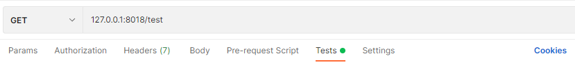
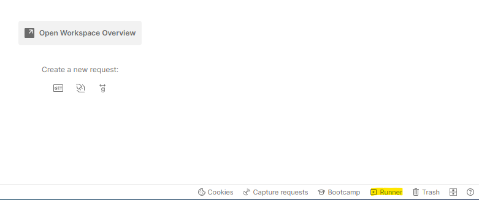
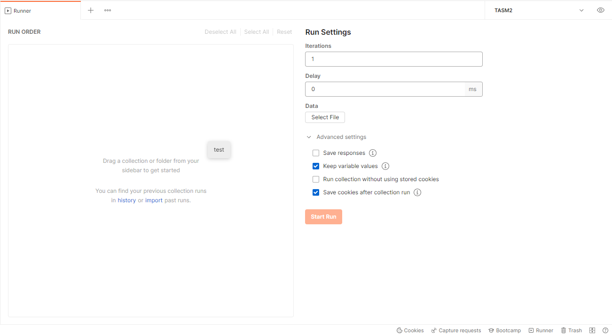

# Postman으로 API 테스트하기

> ctrl + alt + c를 누르면 console 창이 나오며, test script, pre-request script에서 실행한 `console.log` 등이 출력된다.

- Postman

  - Postman에는 아래와 같이 `Pre-request Script`와  `Tests`라는 탭이 존재한다.
    - 위의 두 탭에 javascript 코드를 작성하여 API를 테스트할 수 있다.
    -  `Pre-request Script`에는 server로 reqeust를 보내기 전에 필요한 작업을 정의한다.
    - `Tests`에는 sever에서 response가 온 이후에 해야 하는 작업을 정의한다.

  

  - Script의 실행 순서는 다음과 같다.
    - Pre-request script  →  Reqeust  →  Response  →  Test script
    - 만일 collection과 folder를 사용한 구조라면 아래 순서로 실행된다.
    - Collection(Pre-request script) → Folder(Pre-request script) → Request(Pre-request script) → Reqeust → Response → Collection(Test script) → Folder(Test script) → Request(Test script)
  - Collection 혹은 folder 단위의 script 작성
    - Collection 혹은 folder 우클릭 후 `Edit`을 누른다.
    - `Pre-request Script`와  `Tests` 탭에 script를 작성한다.
  - Test 결과는 response의 `Test Results` 탭에서 볼 수 있다.


- Test script 작성하기

  - `pm.test` 메서드를 통해 테스트를 실행할 수 있다.
    - `pm.test` 메서드는 테스트의 이름과 boolean 값을 반환하는 함수를 인자로 받는다.

  ```javascript
  // test의 이름은 Status test이고, 응답의 Status code가 200인지를 확인한다.
  pm.test("Status test", function () {
      pm.response.to.have.status(200);
  });
  ```

  - `pm.expect` 메서드를 사용하여 보다 다양한 테스트 코드를 작성할 수 있다.

  ```javascript
  pm.test("environment to be production", function () {
      pm.expect(pm.environment.get("env")).to.equal("production");
  });
  ```

  - Status code 테스트하기

  ```javascript
  // 방법1
  pm.test("Status code is 201", () => {
    pm.response.to.have.status(201);
  });
  
  // 방법2
  pm.test("Successful POST request", () => {
    pm.expect(pm.response.code).to.be.oneOf([201,202]);
  });
  
  // 방법3
  pm.test("Status code name has string", () => {
    pm.response.to.have.status("Created");
  });
  ```

  - header 테스트하기

  ```javascript
  // 방법1
  pm.test("Content-Type header is present", () => {
    pm.response.to.have.header("Content-Type");
  });
  
  // 방법2
  pm.test("Content-Type header is application/json", () => {
    pm.expect(pm.response.headers.get('Content-Type')).to.eql('application/json');
  });
  ```

  - Cookie 테스트하기

  ```javascript
  // 방법1
  pm.test("Cookie JSESSIONID is present", () => {
    pm.expect(pm.cookies.has('JSESSIONID')).to.be.true;
  });
  
  // 방법2
  pm.test("Cookie isLoggedIn has value 1", () => {
    pm.expect(pm.cookies.get('isLoggedIn')).to.eql('1');
  });
  ```

  - 응답 시간 테스트하기

  ```javascript
  pm.test("Response time is less than 200ms", () => {
    pm.expect(pm.response.responseTime).to.be.below(200);
  });
  ```

  - response 테스트하기

  ```javascript
  // 예시1
  pm.test("Response property matches environment variable", function () {
    pm.expect(pm.response.json().name).to.eql(pm.environment.get("name"));
  });
  
  // 예시2
  const jsonData = pm.response.json();
  pm.test("Test data type of the response", () => {
    pm.expect(jsonData).to.be.an("object");
    pm.expect(jsonData.name).to.be.a("string");
    pm.expect(jsonData.age).to.be.a("number");
    pm.expect(jsonData.hobbies).to.be.an("array");
    pm.expect(jsonData.website).to.be.undefined;
    pm.expect(jsonData.email).to.be.null;
  });
  ```

  - array 형태의 값 테스트하기

  ```javascript
  /*
  response 예시
  {
    "errors": [],
    "areas": [ "goods", "services" ],
    "settings": [
      {
        "type": "notification",
        "detail": [ "email", "sms" ]
      },
      {
        "type": "visual",
        "detail": [ "light", "large" ]
      }
    ]
  }
  */
  
  const jsonData = pm.response.json();
  pm.test("Test array properties", () => {
      //errors array is empty
    pm.expect(jsonData.errors).to.be.empty;
      //areas includes "goods"
    pm.expect(jsonData.areas).to.include("goods");
      //get the notification settings object
    const notificationSettings = jsonData.settings.find
        (m => m.type === "notification");
    pm.expect(notificationSettings)
      .to.be.an("object", "Could not find the setting");
      //detail array must include "sms"
    pm.expect(notificationSettings.detail).to.include("sms");
      //detail array must include all listed
    pm.expect(notificationSettings.detail)
      .to.have.members(["email", "sms"]);
  });
  ```

  - object 형태 테스트

  ```javascript
  pm.expect({a: 1, b: 2}).to.have.all.keys('a', 'b');
  pm.expect({a: 1, b: 2}).to.have.any.keys('a', 'b');
  pm.expect({a: 1, b: 2}).to.not.have.any.keys('c', 'd');
  pm.expect({a: 1}).to.have.property('a');
  pm.expect({a: 1, b: 2}).to.be.an('object').that.has.all.keys('a', 'b');
  ```

  - 한 object가 다른 object에 포함되는지 테스트

  ```javascript
  /*
  response 예시
  {
    "id": "d8893057-3e91-4cdd-a36f-a0af460b6373",
    "created": true,
    "errors": []
  }
  */
  
  pm.test("Object is contained", () => {
    const expectedObject = {
      "created": true,
      "errors": []
    };
    pm.expect(pm.response.json()).to.deep.include(expectedObject);
  });
  ```

  - set 안에 특정 값이 있는지 테스트

  ```javascript
  pm.test("Value is in valid list", () => {
    pm.expect(pm.response.json().type)
      .to.be.oneOf(["Subscriber", "Customer", "User"]);
  });
  ```


- 변수 사용하기

  - Postman은 다양한 scope의 변수를 지원한다.
    - global(`pm.globals`로 접근)
    - collection(`pm.collectionVariables`로 접근)
    - environment(`pm.environment`로 접근)
    - data(`pm.iterationData`로 접근)
    - local(`pm.variables`로 접근)
  - 특정 변수가 있는지 확인하기
    - 변수 이름을 string type으로 받고 유무를 boolean 값으로 반환한다.

  ```javascript
  pm.variables.has(<변수 이름:String>)
  ```

  - 특정 변수를 가져오기
    - 변수 이름을 string type으로 받고, 해당 변수에 저장된 값을 가져온다.

  ```javascript
  pm.variables.has(<변수 이름:String>)
  ```

  - 변수에 값 할당하기

  ```javascript
  pm.variables.set(<변수 이름:String>, <변수 값:*>)
  ```

  - 현재 scope의 모든 변수 가져오기
    - scope에 따라 하위 scope의 변수도 포함된다.

  ```javascript
  pm.variables.toObject()
  ```

  - 할당된 변수 삭제하기

  ```javascript
  pm.environment.unset(<변수 이름:String>)
  ```

  - 모든 변수 삭제하기

  ```javascript
  pm.environment.clear()
  ```

  - JSON 포맷으로 변경하기

  ```javascript
  pm.iterationData.toJSON()
  ```

  - scope마다 지원하는 메서드의 종류가 다르다.

  | method    | globals | collectionVariables | environment | iterationData | variables |
  | --------- | ------- | ------------------- | ----------- | ------------- | --------- |
  | has       | O       | O                   | O           | O             | O         |
  | get       | O       | O                   | O           | O             | O         |
  | set       | O       | O                   | O           | X             | O         |
  | replaceIn | O       | O                   | O           | X             | O         |
  | toObject  | O       | O                   | O           | O             | O         |
  | unset     | X       | O                   | O           | O             | X         |
  | clear     | X       | O                   | O           | X             | X         |
  | toJson    | X       | X                   | X           | O             | X         |

  - 상위  scope와 하위 scope에 같은 이름의 변수가 설정 되었을 경우 하위 스코프가 하위 스코프를 덮어씌운다.

  ```javascript
  /*
  하위 scope인 enviroment에서 선언한 score가 상위 scope인 collection에서 선언한 score를 덮어씌운다.
  collection var 'score' = 1
  environment var 'score' = 2
  */
  
  console.log(pm.variables.get('score')); // 2
  console.log(pm.collectionVariables.get('score')); // 1
  console.log(pm.environment.get('score')); // 2
  ```

  - Dynamic variables

    - Script에서 faker library를 사용하여 샘플 데이터를 생성할 수 있다.
    - 지원되는 변수명 앞에 `$`를 붙이고, `pm.variables.replaceIn()`안에 넣어서 아래와 같이 사용해야한다.

    - [지원되는 변수 목록](https://learning.postman.com/docs/writing-scripts/script-references/variables-list/)

  ```javascript
  // 예시
  pm.variables.replaceIn('{{$randomFirstName}}')
  ```


- Request data 활용

  - `pm.request` 객체를 통해 request에 접근할 수 있다.
  - properties
    - `pm.request.URL`
    - `pm.request.headers`
    - `pm.request.method`: HTTP method를 반환한다.
    - `pm.request.body`: **script에서 수정할 수 없다.**
  - header에 값 추가하기

  ```javascript
  pm.request.headers.add({
    key: <key>,
    value: <value>
  });
  ```

  - header에서 값 제거하기

  ```javascript
  pm.request.headers.remove(<header 이름>)
  ```

  - header가 존재하지 않으면 header를 추가하고, 이미 존재하면 update하기

  ```javascript
  pm.request.headers.upsert({
      key: <key>, 
      value: <value>
  });
  ```


- Response data 활용

  - `pm.response` 객체를통해 response에 접근할 수 있다.
  - properties
    - `pm.response.code`
    - `pm.response.status`
    - `pm.response.headers`
    - `pm.response.responseTime`
    - `pm.response.responseSize`
  - text로 변환하기

  ```javascript
  pm.response.text()
  ```

  - JSON으로 변환하기

  ```javascript
  pm.response.json()
  ```


- Request와 script의 data 활용
  - `pm.info`를 통해 접근할 수 있다.
  - properties
    - `pm.info.eventName`: `prerequest`와 `test` 중 현재 script가 실행중인 event의 이름
    - `pm.info.iteraion`: 현재 iteration의 횟수
    - `pm.info.iterationCount`: 수행 될 iteration의 총 횟수
    - `pm.info.requestName`: request의 이름
    - `pm.info.requestId`: request의 GUID(unique)


- Cookie 활용

  - `pm.cookies`를 통해 접근할 수 있다.
  - Cookie가 있는지 확인하기

  ```javascript
  pm.cookies.has(<쿠키 이름:String>);
  ```

  - Cookie의 값 가져오기

  ```javascript
  pm.cookies.get(<쿠키 이름:String>);
  ```

  - 모든 cookie 값 가져오기

  ```javascript
  pm.cookies.toObject();
  ```

  - 그 밖의 메서드들
  
  > https://learning.postman.com/docs/writing-scripts/script-references/postman-sandbox-api-reference/#scripting-with-request-cookies


- Script로 test request 보내기

  - `pm.sendRequest` 메서드를 활용하여 비동기적 요청을 보낼 수 있다.
    - 첫 번째 인자로 요청을 보낼 url, 두 번째 인자로 응답을 처리할 callback 함수를 받는다.
  - 예시

  ```javascript
  const postRequest = {
    url: 'https://postman-echo.com/post',
    method: 'POST',
    header: {
      'Content-Type': 'application/json',
      'X-Foo': 'bar'
    },
    body: {
      mode: 'raw',
      raw: JSON.stringify({ key: 'this is json' })
    }
  };
  pm.sendRequest(postRequest, (error, response) => {
    console.log(error ? error : response.json());
  });
  ```


- File import해서 테스트하기

  - 포스트맨 우측 하단의 `runner`를 클릭한다.

  

  - 테스트 하고자하는 collection을 드레그해서 화면에 놓는다.
    - `RUN ORDER`부분에 드레그한다.

  

  - 우측의 `Select File`을 클릭 후 import하려는 파일을 클릭한다.
    - 반복 횟수(`Iterations`)는 자동으로 조정된다.
  - 개별 request의 request body의 값들을 `{{}}`로 묶어 파일에서 읽어 온 값임을 표시한다.

  ```javascript
  /* test.json
  [
      {
          "name":"Theo",
          "age":29
      },
      {
          "name":"Oeht",
          "age":28
      }
  ]
  */
  
  // request body
  {
      "name":"{{name}}",
      "age":{{age}}
  }
  ```

  - `Start run`을 클릭하여 테스트를 시작한다.


- Parse response data

  - JSON 형식으로 parsing하기
    - `json()` 메서드를 사용한다.

  ```javascript
  const responseJson = pm.response.json();
  ```

  - XML 형식으로 parsing하기
    - response에서 text를 추출 한 후 `xml2Json()` 함수를 사용한다.

  ```javascript
  const responseJson = xml2Json(pm.response.text());
  ```

  - CSV 형식으로 parsing하기
    - 당연히 response가 csv로 parsing할 수 있는 data여야한다.

  ```javascript
  // parsing을 위해 import해준다.
  const parse = require('csv-parse/lib/sync');
  const responseJson = parse(pm.response.text());
  ```

  - HTML 형식으로 parsing하기

  ```javascript
  const $ = cheerio.load(pm.response.text());
  //output the html for testing
  console.log($.html());
  ```


- monitor 기능과 연계해서 테스트를 수행하는 것도 가능하다.

  > https://learning.postman.com/docs/writing-scripts/test-with-monitors/


## Newman

- Newman

  - Postman의 기능을 CLI로 사용할 수 있게 해주는 패키지다.
  - 설치

  ```bash
  # npm
  $ npm install -g newman
  
  # homebrew
  $ brew install newman
  ```

  - 실행

  ```bash
  $ newman run <file_path or url>
  ```

  - 실행 결과를 JSON, CLI 등 다양한 방식으로 볼 수 있다.

    > 지원하는 전체 reporter 목록
    >
    > https://www.npmjs.com/package/newman#reporters

    - `-r`(reporter) 옵션을 통해 설정 가능하다.

  ```bash
  $ newman run examples/sample-collection.json -r cli,json
  ```

  - JavaScript에서도 사용할 수 있도록 JavaScript용 모듈도 개발되어 있다.

  ```javascript
  // import해서 사용한다.
  const newman = require('newman');
  
  newman.run({
      collection: require('./sample-collection.json'),
      reporters: 'cli'
  }, function (err) {
  	if (err) { throw err; }
      console.log('collection run complete!');
  };
  ```


- 옵션들

  > 전체 옵션은 아래에서 확인 가능하다.
  >
  > https://learning.postman.com/docs/running-collections/using-newman-cli/newman-options/

  - `-e <path or URL>`(`--environment <path or URL>`)
    - 환경변수 file의 경로나 URL을 인자로 받는다.
    - Postman에서 환경 변수 설정 후 export한 파일을 사용한다.

  - `-g <path or URL>`(`--globals <path or URL>`)
    - global 변수 파일이 경로나 URL을 인자로 받는다.
  - `-d <path or URL>`(`--iteration-data <path or URL>`)
    - data source 파일의 경로나 URL을 인자로 받는다.
    - Postman에서 Runner를 통해 실행할 때 넣어주는 data file을 여기에 입력하면 된다.
  - `-n <number>`(`--iteration-count <number>`)
    - 테스트를 반복할 횟수를 입력한다.
  - `--verbose`
    - 보다 상세한 정보를 출력한다.


- Docker로도 사용이 가능하다.

  > https://learning.postman.com/docs/running-collections/using-newman-cli/newman-with-docker/

