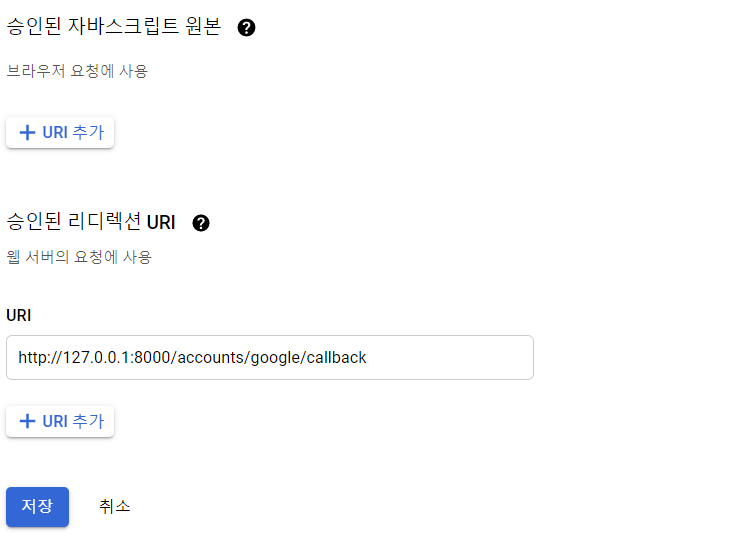
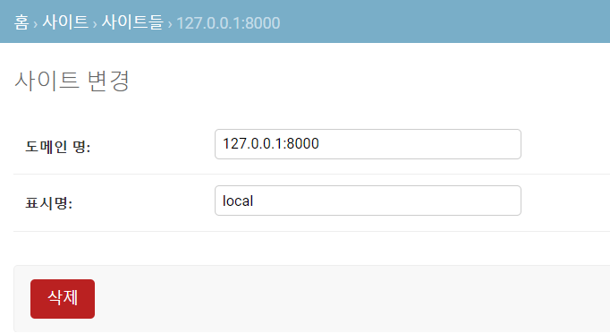
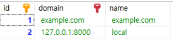
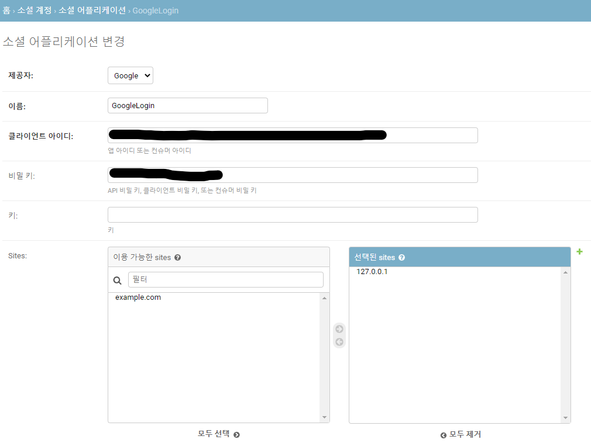
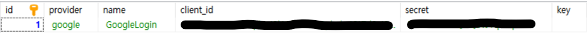

# DB와 Django 연동하기

- Django는 기본적으로 sqlite3를 사용하는데 다른 DB와 연동해서 사용이 가능하다.
  - 아래 예시에서는 MariaDB를 사용할 것이다.


## DB 설치하기

- 사용하고자 하는 DB 설치(예시의 경우 MariaDB)

  > https://downloads.mariadb.org/mariadb/10.3.8/

  - 위 사이트에서 원하는 버전 선택 후 설치
  - 중간계 root 사용자의 비밀번호를 설정하고 기억해 둔다.


- 실행해보기
  - MySQL Client(시작 창에서 검색하면 나온다)를 실행하여 설치시 설정했던 root 비밀번호를 입력하면 MariaDB에 접속된다.


## DB 연동하기

- `mysqlclient` 설치하기

  ```bash
  $pip install mysqlclient
  ```


- settings.py 수정하기

  ```python
  # 기존 DATABASES는 아래와 같이 되어 있는데
  DATABASES = {
      'default': {
          'ENGINE': 'django.db.backends.sqlite3',
          'NAME': os.path.join(BASE_DIR, 'db.sqlite3'),
      }
  }
  
  # 아래와 같이 수정한다.
  DATABASES = {
      'default': {
          'ENGINE':'django.db.backends.mysql',
          'NAME':'react',      # database명 입력
          'USER':'root',       # 사용자명 입력
          'PASSWORD':'1234',
          'HOST':'127.0.0.1',  # 사용하려는 host 입력
          'PORT':3306,         # 사용하려는 port 입력
      }
  }
  ```


- DB 설정은 비공개적이어야 하므로 이를 저장하기 위한 secrets.json 파일을 생성한다.

  - DB 설정 외에도 비공개적으로 관리할 데이터는 이곳에 저장한다.

  ```json
  {
      "DB_SETTINGS":{
          "default": {
              "ENGINE": "django.db.backends.mysql",
              "NAME": "inna",
              "USER": "root",
              "PASSWORD": "qwer",
              "HOST": "127.0.0.1",
              "PORT": 3306
          }
      }
  }
  ```

  - settings.py에 아래 코드를 추가

  ```python
  import os
  import json
  
  
  # Build paths inside the project like this: os.path.join(BASE_DIR, ...)
  BASE_DIR = os.path.dirname(os.path.dirname(os.path.abspath(__file__)))
  
  with open(os.path.join(BASE_DIR, 'secrets.json'), 'rb') as secret_file:
      secrets = json.load(secret_file)
  
  (...)
  
  DATABASES = secrets['DB_SETTINGS']
  ```

  - `.gitignore` 파일에 `/설정폴더/secrets.json` 추가


- migrate하기

  ```bash
  $ python manage.py migrate
  ```


# Django allauth

> https://django-allauth.readthedocs.io/en/latest/index.html

- DRF 환경에서 소셜 로그인 구현하기
  - Django_part3의 social login은 프론트 없이 장고로 모든 것을 구현하는 상황에서 가능한 방법이다.
  - 프론트 엔드를 따로 구현한다면 기존과 다른 방법으로 해야 할 필요가 있다.


## 초기 세팅

- 라이브러리 설치

  - djangorestframework를 설치할 때는 반드시 3.10.3 버전으로 설치해야 한다.
    - django-rest-auth는 djangorestframework 3.10.3 버전까지만 업데이트 되었기에 그 위 버전에서는 동작하지 않을 수 있다.

  ```bash
  $ pip install djangorestframework==3.10.3
  $ pip install django-rest-auth
  $ pip install django-allauth
  $ pip install djangorestframework-jwt
  ```


- settings.py 설정

  - `INSTALLED_APPS`에 추가하기

  ```python
  ALLOWED_HOSTS = ['*']
  
  INSTALLED_APPS = [
      ...
      # 아래 코드를 추가하면 admin 페이지에서 사이트 추가가 가능해진다.
      'django.contrib.sites',
  	
      # django-rest-auth
      'rest_framework',
      'rest_framework.authtoken',
      'rest_auth',
      'rest_auth.registration',
  
      # django-allauth
      'allauth',
      'allauth.account',
      'allauth.socialaccount',
      # 사용하고자 하는 소셜 로그인을 작성한다.
      'allauth.socialaccount.providers.google',
  ]
  ```

  - `REST_FRAMEWORK` 설정하기

  ```python
  REST_FRAMEWORK = {
      # API들에 대한 접근 권한 설정
      'DEFAULT_PERMISSION_CLASSES': (
          'rest_framework.permissions.IsAuthenticated',
      ),
      # 일반적인 토큰 기반이 아닌 JWT로 인증하기 위한 코드
      'DEFAULT_AUTHENTICATION_CLASSES': (
          'rest_framework_jwt.authentication.JSONWebTokenAuthentication',
      ),
  }
  ```


- User 모델 커스텀하기

  - 장고에서 제공하는 기본 User 모델은 `username`이 필수로 들어가는데 이를 필수로 들어가지 않게 바꿀 것이다.
    - username은 필수로 들어갈뿐만 아니라 고유식별자이기도 하다.
  - User를 관리 할 accounts 앱을 생성한다.

  ```bash
  $ python manage.py startapp accounts
  ```

  - accounts 디렉토리에 managers.py 파일을 생성한다.

  ```python
  from django.contrib.auth.base_user import BaseUserManager
  from django.utils.translation import ugettext_lazy as _
  
  
  class CustomUserManager(BaseUserManager):
      
      def create_user(self, email, password, **extra_fields):
  
          # 인자로 받은 email과 password로 User를 생성하고 저장한다.
          if not email:
              raise ValueError(_('The Email must be set'))
          email = self.normalize_email(email)
          user = self.model(email=email, **extra_fields)
          user.set_password(password)
          user.save()
          return user
  
      def create_superuser(self, email, password, **extra_fields):
          """
          Create and save a SuperUser with the given email and password.
          """
          extra_fields.setdefault('is_staff', True)
          extra_fields.setdefault('is_superuser', True)
          extra_fields.setdefault('is_active', True)
  
          if extra_fields.get('is_staff') is not True:
              raise ValueError(_('Superuser must have is_staff=True.'))
          if extra_fields.get('is_superuser') is not True:
              raise ValueError(_('Superuser must have is_superuser=True.'))
          return self.create_user(email, password, **extra_fields)
  ```

  - accounts 디렉토리의 models.py에 아래와 같이 작성한다.
    - AbstractUser를 상속 받는 새로운 User 모델을 정의한다.

  ```python
  from django.db import models
  from django.contrib.auth.models import AbstractUser
  from django.utils.translation import ugettext_lazy as _
  
  from .managers import CustomUserManager
  
  
  class CustomUser(AbstractUser):
      # username 필드 삭제
      username = None
      # email 필드를 고윳값으로 설정
      email = models.EmailField(_('email address'), unique=True)
  
      # email을 username 대신 고유 식별자로 사용
      USERNAME_FIELD = 'email'
      REQUIRED_FIELDS = []
  
      objects = CustomUserManager()
  
      # 추가하고자 하는 필드들 추가
      spouse_name = models.CharField(blank=True, max_length=100)
      date_of_birth = models.DateField(blank=True, null=True)
  
      def __str__(self):
          return self.email
  ```

  - settings.py 수정
    - 만일 아래 코드를 추가해주지 않으면 `django.core.exceptions.FieldDoesNotExist: User has no field named 'username'`에러가 발생한다.

  ```python
  # INSTALLED_APPS에 우리가 만든 accounts 앱 추가
  INSTALLED_APPS = [
      ...
      'accounts',
  ]
  
  # username을 사용하지 않기 위한 코드
  ACCOUNT_USER_MODEL_USERNAME_FIELD = None
  ACCOUNT_EMAIL_REQUIRED = True
  ACCOUNT_USERNAME_REQUIRED = False
  ACCOUNT_AUTHENTICATION_METHOD = 'email'
  
  # 우리가 커스텀한 CustomUser를 AUTH_USER_MODEL로 설정
  AUTH_USER_MODEL = 'accounts.CustomUser'
  ```


- migrate하기

  ```bash
  $ python manage.py makemigrations
  $ python manage.py migrate
  ```


## Secret Key와 Client Id 발급 받기

- Secret Key와 Client Id 발급 받기

  - 각 사이트마다 발급 받는 방법이 다르다.
  - 아래 설명은 Google 기준
    - https://console.developers.google.com/에 접속한다.
    - 새 프로젝트를 생성 후 사용자 인증 정보-동의 화면 구성-내부/외부 선택 후 만들기 클릭-애플리케이션 이름 설정 후 저장
    - 사용자 인증 정보로 다시 가서 `+사용자 인증 정보 만들기` 버튼 클릭-OAuth 클라이언트 ID
    - 승인된 리디렉션 URL에 Callback URI를 지정해 준다.
    - Django에서 redirect API를 만들어서 urls.py에 매핑 시켜줄 것과 같게 입력해야 한다.

  


- Secret Key, Client Id 등록하기

  - admin 페이지에 접속한다.
  - 사이트에 아래와 같이 추가한다.
    - 도메인명은 `localhost:8000`으로 해도 무관하다.
    - 표시명은 아무렇게나 지정해주면 된다.

  

  - 추가를 완료하면 DB의 `django_site` 테이블에 추가가 된 것을 확인 가능하다.

  

  - settings.py에 아래 코드를 추가한다.

  ```python
  # 현재 DB상 우리가 social login에 사용하고자 하는 127.0.0.1:8000 사이트의 id가 2이므로 SITE_ID 값으로 2를 준다.
  SITE_ID = 2
  ```

  - social accounts-social application에 아래와 같이 추가
    - 제공자는 settings.py에  `'allauth.socialaccount.providers.google'`를 추가했기에 Google로 설정이 가능한 것이다.
    - 이름은 원하는 이름을 사용하면 된다.

  

  - 완료하면 DB의 `socialaccount_socialapp` 테이블에 데이터가 추가된 것을 확인 가능하다.

  


## 기능 구현

- urls.py 작성하기

  - 프로젝트 디렉토리

  ```python
  from django.contrib import admin
  from django.urls import path, include
  
  urlpatterns = [
      path('admin/', admin.site.urls),
      path('accounts/', include('rest_auth.urls')),
      path('accounts/', include('allauth.urls')),
      path('accounts/', include('accounts.urls')),
  ]
  ```

  - accounts 디렉토리

  ```python
  from django.urls import path
  from . import views
  
  urlpatterns = [
      path('google/login', views.google_login, name='google_login'),
      path('google/callback/', views.google_callback, name='google_callback'),
      path('google/login/finish/', views.GoogleLogin.as_view(), name='google_login_todjango'),
  ]
  ```


- views.py 작성하기

  - 아래 코드는 secrets.json 파일에 Secret Key, Client Id를 등록했다.
    - 방법은 DB와 Django 연동하기 참조
  - django-rest-auth에서 제공하는 view인 SocialLoginView는 access token과 code를 데이터로 넘기면 user를 생성하고 token을 반환한다.
  - 즉, 결국 `google_callback` 함수는 access token과 code를 추출하기 위한 함수이다.
    - `google_login`는 `google_callback` 를 실행하기 위한 함수이다.
  
  ```python
  import requests
  import os
  import json
  from django.shortcuts import redirect
  from rest_auth.registration.views import SocialLoginView
  from allauth.socialaccount.providers.google import views as google_view
  from allauth.socialaccount.providers.oauth2.client import OAuth2Client
  from django.http import JsonResponse
  
  
  BASE_DIR = os.path.dirname(os.path.dirname(os.path.abspath(__file__)))
  
  with open(os.path.join(BASE_DIR, 'secrets.json'), 'rb') as secret_file:
      secrets = json.load(secret_file)
  
  # Secret Key와 Client Id 발급 받을 때 입력했던 callback uri를 입력한다.
  BASE_URL = 'http://127.0.0.1:8000/'
  GOOGLE_CALLBACK_URI = BASE_URL + 'accounts/google/callback'
  
  
  class GooGleException(Exception):
      pass
  
  
  def google_login(request):
      """
      Code Request
      """
      scope = "https://www.googleapis.com/auth/userinfo.email"
      client_id = secrets["GOOGLE"]["CLIENT_ID"]
      return redirect(f"https://accounts.google.com/o/oauth2/v2/auth?client_id={client_id}&response_type=code&redirect_uri={GOOGLE_CALLBACK_URI}&scope={scope}")
  
  
  def google_callback(request):
      try:
          client_id = secrets["GOOGLE"]["CLIENT_ID"]
          client_secret = secrets["GOOGLE"]["CLIENT_SECRET"]
          code = request.GET.get('code')
          """
          Access Token을 받아오는 요청
          """
          token_request = requests.post(f"https://oauth2.googleapis.com/token?client_id={client_id}&client_secret={client_secret}&code={code}&grant_type=authorization_code&redirect_uri={GOOGLE_CALLBACK_URI}")
          token_request_json = token_request.json()
          error = token_request_json.get("error")
          if error is not None:
              return GooGleException()
          access_token = token_request_json.get('access_token')
          
          """
          Login하는 요청
          """
          data = {'access_token': access_token, 'code': code}
          # GoogleLogin 클래스가 실행.
          accept = requests.post(
              f"{BASE_URL}accounts/google/login/finish/", data=data)
          accept_json = accept.json()
          error = accept_json.get("error")
          if error is not None:
              return GooGleException()
          return JsonResponse(accept_json)
      except GooGleException:
          return redirect('/error')
  
  
  class GoogleLogin(SocialLoginView):
      adapter_class = google_view.GoogleOAuth2Adapter
      callback_url = GOOGLE_CALLBACK_URI
      client_class = OAuth2Client
  ```


- 결과 확인하기
  - `http://127.0.0.1:8000/accounts/google/login` 으로 요청을 보내본다.
  - 아래 테이블들에 데이터가 추가되면 성공한 것이다.
    - `accounts_customuser`
    - `account_emailaddress`
    - `authtoken_token`
    - `socialaccount_socialaccount`
    - `socialaccount_socialtoken`


## 참고

- User model 커스텀
  - https://krakensystems.co/blog/2020/custom-users-using-django-rest-framework

- allauth
  - https://medium.com/chanjongs-programming-diary/django-rest-framework%EB%A1%9C-%EC%86%8C%EC%85%9C-%EB%A1%9C%EA%B7%B8%EC%9D%B8-api-%EA%B5%AC%ED%98%84%ED%95%B4%EB%B3%B4%EA%B8%B0-google-kakao-github-2ccc4d49a781
  - https://code4human.tistory.com/84


