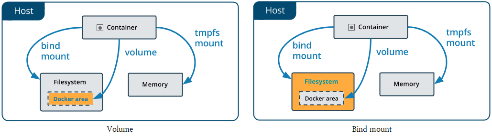
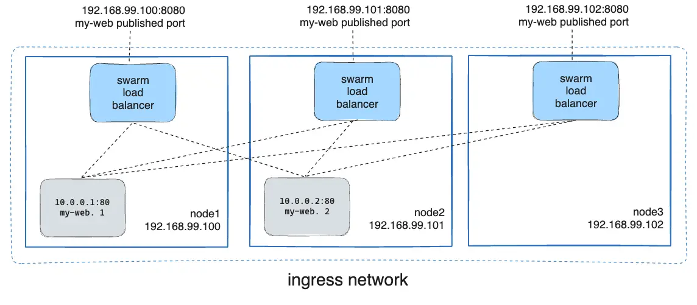

# Dockerfile

- Dockerfile
  - Docker 상에서 작동시킬 컨테이너의 구성 정보를 기술하기 위한 파일.
  - Dockerfile로 Docker 이미지를 생성하면 Dockerfile에 작성된 구성 정보가 담긴 이미지가 생성된다.
  - 다른 Image를 기반으로 작성할 경우, 해당 image에 덮어씌워지는 형식이 아니라 추가되는 형식이다.
    - 단, ENTRYPOINT와 CMD의 경우 마지막으로 작성된 하나만 적용되므로, 이들은 덮어씌워진다.


- Dockerfile의 기본 구문

  - Dockerfile은 텍스트 형식의 파일로, 에디터 등을 사용하여 작성한다.
  - Dockerfile 이외의 파일명으로도 동작하며, 확장자는 필요 없다.
  - 주석은 `#`을 사용하여 작성한다.
  - 주요 명령어
    - 소문자로 작성해도 동작하지만 관례적으로 대문자로 통일하여 사용한다.

  | 명령       | 설명               |      | 명령       | 설명                       |
  | ---------- | ------------------ | ---- | ---------- | -------------------------- |
  | FROM(필수) | 베이스 이미지 지정 |      | VOLUEM     | 볼륨 마운트                |
  | RUN        | 명령 실행          |      | USER       | 사용자 지정                |
  | CMD        | 컨테이너 실행      |      | WORKDIR    | 작업 디렉토리              |
  | LABEL      | 라벨 설정          |      | ARG        | Dockerfile 내의 변수       |
  | EXPOSE     | 포트 익스포트      |      | ONBUILD    | 빌드 완료 후 실행되는 명령 |
  | ENV        | 환경변수           |      | STOPSIGNAL | 시스템 콜 시그널 설정      |
  | ADD        | 파일/디렉토리 추가 |      | HEATHCHECK | 컨테이너의 헬스 체크       |
  | COPY       | 파일 복사          |      | SHELL      | 기본 쉘 설정               |
  | ENTRYPOINT | 컨테이너 실행 명령 |      |            |                            |


- USER 명령어

  - Container를 실행시킬 user를 입력한다.
  - Dockerfile을 사용하여 이미지를 만들다보면 권한 문제가 발생할 때가 있다.
    - 예를 들어 `mkdir` 명령어를 사용하여 디렉터리를 생성해야 하는데 기본 사용자가 root 이외의 사용자로 설정되어 있어 생성이 불가능한 경우가 있다.
    - 이 때 `sudo`를 붙이거나 `su -`을 통해 root 사용자로 변경도 불가능하다.
    - 만일 가능하다고 해도 Docker는 기본적으로 Dockerfile에 작성된 매 명령을 수행할 때마다 이미지를 하나씩 생성하는 방식이다.
    - 따라서 이전 명령에서 `su -`를 통해 root 사용자로 변경 했어도 다음 명령에서는 다시 기본 사용자로 돌아오게 된다.
    - 반면에, USER 명령어를 통해 설정한 사용자는 모든 명령시에 자동으로 적용된다.

  - 예시
    - `elasticsearch:8.1.3` 이미지의 기본 사용자는 `elasticsearch`로 설정되어 있다.
    - `elasticsearch`라는 사용자는 modules 디렉터리에 쓰기 권한이 없어 폴더 생성이 불가능하다.
    - `USER` 명령어를 통해 root로 사용자를 변경한다.

  ```dockerfile
  # 문제
  FROM docker.elastic.co/elasticsearch/elasticsearch:8.1.3
  RUN mkdir -p /usr/share/elasticsearch/modules/test
  RUN mkdir -p /usr/share/elasticsearch/modules/test2
  
  # 예시
  FROM docker.elastic.co/elasticsearch/elasticsearch:8.1.3
  USER root
  RUN mkdir -p /usr/share/elasticsearch/modules/test
  RUN mkdir -p /usr/share/elasticsearch/modules/test2
  # elasticsearch:8.1.3 이미지의 경우 elasticsearch 사용자 이외의 사용자는 컨테이너 실행이 불가능하므로 다시 변경해준다.
  USER elasticsearch	
  ```


- FROM 명령어

  - Docker 컨테이너를 어떤 이미지로부터 생성할지 정의한다.
  - 다이제스트는 Docker Hub에 업로드하면 이미지에 자동으로 부여되는 식별자를 의미한다.
    - `docker image ls --digests ` 명령어를 통해 확인이 가능하다.

  ```dockerfile
  # 기본형
  FROM 이미지명
  # 태그를 생략할 경우 자동으로 latest 버전이 적용된다.
  FROM 이미지명:태그명
  # 다이제스트 사용
  FROM 이미지명@다이제스트
  ```


- ENV 명령어

  - Dockerfile 안에서 환경변수를 설정하고 싶을 때는 ENV 명령을 사용한다.
    - 리눅스 명령어 `export`에 해당한다.
  - `key value`형으로 지정
    - 단일 환경변수에 하나의 값을 지정한다.
    - 첫 번째 공백 앞을 key로 설정하면 그 이후는 모두 문자열로 취급한다.
  - `key=value`로 지정
    - 한 번에 여러 개의 값을 설정할 때 사용한다.
  
  ```dockerfile
  ENV [key] [value]
  ENV [key]=[value]
  ```


- ARG 명령

  - Dockerfile 안에서 사용할 변수를 정의할 때 사용한다.

  - ENV로 생성한 환경변수와 달리  Dockerfile 내에서만 사용이 가능하다.

  ```dockerfile
  ARG <변수명>[=기본값]
  ```


-  ADD 명령

  - 이미지에 호스트 상의 파일 및 디렉터리를 추가할 때 사용한다.
  - 호스트의 파일 및 디렉터리 뿐 아니라 원격 파일도 추가가 가능하다.
  
  ```dockerfile
  ADD <src> <dst(docker image 상의 경로)>
  ```


- COPY 명령

  - 이미지에 호스트상의 파일이나 디렉터리를 복사할 때 사용한다.

  ```dockerfile
  COPY <호스트의 파일 경로> <Docker 이미지의 파일 경로>
  ```
  
  - 소유권과 권한을 아래와 같이 설정할 수 있다.
  
    - 설정하지 않을 경우 기본적으로 소유권은 root,  file의 권한은 334, directory의 권한은 755로 설정된다.\
    - 단 `--chown`와 `--chmod` 옵션은 Linux container에만 적용되며, Windows container에는 적용되지 않는다.
  
  
  ```dockerfile
  COPY [--chown=<user>:<group>] [--chmod=<perms>] <src> <dest>
  COPY [--chown=<user>:<group>] [--chmod=<perms>] ["<src>" "<dest>"]
  ```


- WORKDIR 명령
  -  dockerfile에서 정의한 명령을 실행하기 위한 작업용 디렉토리를 지정할 때 사용한다.
    -  RUN, CMD, ADD, ENTRYPOINT, COPY 등의 명령을 실행하기 위한 적업용 디렉토리를 지정한다.
    - 지정한 디렉토리가 존재하지 않으면 새로 작성한다.


- RUN 명령어

  - FROM 명령에서 지정한 베이스 이미지에 대해 애플리케이션/미들웨어를 설치 및 설정하거나 환경 구축을 위한 명령을 실행할 떄 사용한다.
  - Shell 형식으로 기술
    - 명령의 지정을 쉘에서 실행하는 방식으로 기술하는 방법.
    - /bin/sh을 통해서 실행한다.
  
  ```dockerfile
  # elasticsearch에 노리 형태소 분석기를 설치하는 예시
  RUN bin/elsticsearch-plugin install analysis-nori
  ```
  
  - Exec 형식으로 기술
    - 실행하고 싶은 명령을  JSON  배열로 지정한다(따라서 반드시 쌍따옴표로 묶어야한다).
  
  ```dockerfile
  # elasticsearch에 노리 형태소 분석기를 설치하는 예시
  RUN ["bin/elasitcsearch-plugin", "-c", "install analysis-nori"]
  ```


- Shell 형식과 Exec 형식의 차이

  - 같은 Python script를 아래와 같이 Shell 형식으로 실행시키면

  ```dockerfile
  FROM python:3.8.0
  COPY ./main.py /main.py
  ENTRYPOINT python main.py
  ```

  - 아래와 같이 실행되지만
    - /bin/sh의 subprocess로 `python main.py`이 실행되는 것을 확인할 수 있다.
  
  
  ```bash
  UID          PID    PPID  C STIME TTY          TIME CMD
  root           1       0  0 04:37 ?        00:00:00 /bin/sh -c python main.py
  root           7       1  3 04:37 ?        00:00:00 python main.py
  ```

  - 아래와 같이 Exec 형식으로 실행시키면
  
  ```dockerfile
  FROM python:3.8.0
  COPY ./main.py /main.py
  ENTRYPOINT ["python", "main.py"]
  ```

  - 아래와 같이 실행된다.
  
  ```bash
  UID          PID    PPID  C STIME TTY          TIME CMD
  root           1       0  1 04:33 ?        00:00:00 python main.py
  ```
  
  - Exec 형식이 Docker에서 권장하는 방식이다.
  
  - Shell  형식으로 명령을 기술하면 /bin/sh에서 실행되지만, Exec 형식으로 기술하면 쉘을 경유하지 않고 직접 실행한다.
  
    - 따라서 Exec 형식으로 기술하면 명령 인수에 환경변수를 지정할 수 없다.
  
    - 단 쉘을 지정하면 환경 변수를 사용 가능하다.
  
  ```dockerfile
  ENV foo bar
  
  # 아래와 같이 실행하면 exec 형식이라고 하더라도 환경 변수를 사용할 수 있다.
  ENTRYPOINT ["/bin/bash", "-c", "echo ${foo}"]
  ```


- CMD 명령어
  - RUN 명령은 이미지를 작성하기 위해 실행하는 명령을 기술하는 반면 CMD 명령은 이미지를 바탕으로 생성된 컨테이너 안에서 실행할 명령을 기술한다.
  - 하나의 CMD 명령만을 기술할 수 있으며 복수의 명령을 작성하면 마지막 명령만 적용된다.
  - Exec 형식으로 기술
    - RUN 명령의 구문과 동일하다.
  - Shell 형식으로 기술
    - RUN 명령의 구문과 동일하다.
  - ENTRYPOINT 명령의 파라미터로 기술
    - ENTRYPOINT 명령의 인수로 CMD 명령을 사용할 수 있다.


- ENTRYPOINT 명령어
  - ENTRYPOINT 명령에서 지정한 명령은 `docker run` 명령을 실행했을 때 실행된다.
    - 오직 마지막에 작성된 ENTRYPOINT만 적용된다.
  - Exec 형식으로 기술
    - RUN 명령의 구문과 동일하다.
  - Shell 형식으로 기술
    - RUN 명령의 구문과 동일하다.


- CMD와 ENTRYPOINT 명령의 차이

  - 기본적인 차이
    - 기본적으로 ENTRYPOINT는 컨테이너가 시작할 때 반드시 실행되어야 하는 주 명령을 지정한다.
    - CMD는 기본 인자 또는 기본 명령을 지정하는 것으로, ENTRYPOINT에 인자를 전달하거나, 별도 명령을 지정한다.
  - `docker run` 명령 실행 시의 동작에 차이가 있다.
    - CMD 명령의 경우는 컨테이너 시작 시에 실행하고 싶은 명령을 정의해도 `docker run` 명령 실행 시에 인수로 새로운 명령을 지정한 경우 이것을 우선 실행한다.
    - 반면 ENTRYPOINT 에서 지정한 명령은 반드시 컨테이너에서 실행되는데, 실행 시에 명령 인수를 지정하고 싶을 때는 CMD 명령과 조합하여 사용한다.
    - ENTRYPOINT 명령으로는 실행하고 싶은 명령 자체를 지정하고 CMD 명령으로는 그 명령의 인수를 지정하면, 컨테이너를 실행했을 때의 기본 작동을 결정할 수 있다.

  - 예를 들어 아래와 같이 Dockerfile을 작성하고

  ```dockerfile
  ENTRYPOINT ["echo", "hello"]
  ```

  - 아래와 같이 실행하면
    - `echo hello`가 실행된다.

  ```bash
  $ docker run myimg
  ```

  - 만약 아래와 같이 추가 인자를 줄 경우
    - `echo hello world`가 실행된다.

  ```bash
  $ docker run myimg world
  ```

  - 반면에 아래와 같이 Dockerfile을 작성하고

  ```dockerfile
  CMD ["echo", "hello"]
  ```

  - 아래와 같이 실행하면
    - `echo hello`가 실행된다.

  ```bash
  $ docker run myimg
  ```

  - 그러나 아래와 같이 추가 인자를 줄 경우
    - CMD에 지정한 `echo hello`가 무시되고, `date`명령어가 실행된다.

  ```bash
  $ docker run myimg date
  ```

  - 둘을 같이 사용하여 Dockerfile을 작성하고

  ```dockerfile
  ENTRYPOINT ["echo"]
  CMD ["hello"]
  ```

  - 아래와 같이 실행하면
    - `echo hello`가 실행된다.
    - CMD가 ENTRYPOINT의 인자로 넘어가

  ```bash
  $ docker run myimg
  ```

  - 아래와 같이 추가 인자를 줘서 실행하면
    - CMD가 무시되고 `echo world`가 실행된다.

  ```bash
  $ docker run myimg world
  ```


- VOLUME 명령

  - JSON 배열 형식 또는 단순 문자열 형식으로 볼륨을 설정한다.
    - Host driectory는 host의 환경에 따라 달라지므로 지정할 수 없으며, 컨테이너 실행 시점에 동적으로 결정된다.

  ```dockerfile
  # JSON 배열 형식
  VOLUME ["/var/log/"]
  
  # 단순 문자열 형식
  VOLUME /var/log
  
  # 문자열 형식으로 여러 개 지정
  VOLUME /var/log /var/db
  ```

  - 위와 같이 생성된 image로 container를 생성하면 volume이 함께 생성된다.
    - Volume의 이름을 지정하는 것은 불가능하며, anonymous volume으로 생성된다.
  - 아래와 같이 소유권을 지정해 줄 경우 볼륨이 설정된 후에도 소유권은 변하지 않는다.
    - 아래 이미지로 컨테이너 실행 후 `/data`의 소유권을 확인해보면 appuser의 소유인 것을 확인할 수 있다.

  ```dockerfile
  FROM ubuntu:22.04
  
  RUN useradd -u 1001 appuser
  
  RUN mkdir /data && chown appuser:appuser /data
  
  VOLUME ["/data"]
  ```


- ONBUILD 명령
  - 빌드 완료 후, 다음 빌드에서 실행할 명령을 이미지 안에 설정하기 위한 명령이다.
    - ONBUILD 명령이 포함된 이미지를 빌드한다.
    - 빌드된 이미지를 베이스 이미지로 하여 다른 이미지를 빌드한다.
    - 이 때 ONBUILD에서 지정한 명령을 실행한다.


- Dockerfile의 빌드와 이미지 레이어 구조

  - Docker 이미지 만들기

  ```bash
  $ docker build -t [생성할 이미지명]:[태그명] [Dockerfile의 위치]
  ```

  - 이미지 레이어 구조
    - Dockerfile을 빌드하여 Docker 이미지를 작성하면 Dockerfile의 명령별로 이미지를 작성한다.
    - 작성된 여러 개의 이미지는 레이어 구조로 되어 있다.
    - 즉 이전 명령으로 생성된 이미지 파일 위에 다음 명령으로 생성된 이미지가 덮이는 형식이다.
  - Docker image에 Python 설치하기
  
  ```dockerfile
  RUN yum update -y && \
   yum install -y wget && \
   # Python 설치 파일 다운
   wget https://www.python.org/ftp/python/3.7.3/Python-3.7.3.tgz && \
   # Python 설치(압축 해제)
   tar xzf Python-3.7.3.tgz && \
   # Python configuration 변경
   cd Python-3.7.3 && \
   ./configure --enable-optimizations
  ```


- 멀티스테이지 빌드
  - 제품 환경에 필요한 것들만 빌드하기
    - 애플리케이션 개발 시에 개발 환경에서 사용한 라이브러리나 개발 지원 툴 등이 제품 환경에서 모두 사용되는 것은 아니다.
    - 제품 환경에서는 애플리케이션을 실행하기 위한 최소한의 실행 모듈만 배치하는 것이 리소스 관리나 보안 관점에서 볼 때 바람직하다.
  - Docker 파일 작성하기
    - Dockerfile 을 작성할 때 개발용과 제품용 2가지 이미지를 생성하도록 작성한다.
    - 예시는 p.165 참고


# Docker Compose

- Docker Compose
  - 여러 개의 Docker 컨테이너를 모아서 관리하기 위한 툴
  - docker-compose.yml 파일에 컨테이너의 구성 정보를 정의하여 동일 호스트상의 여러 컨테이너를 일괄적으로 관리한다.
    - 애플리케이션의 의존관계를 모아서 설정하는 것이 가낭흐다.
    - 이 정의를 바탕으로  docker-compose 명령을 실행하면 여러 개의 컨테이너를 모아서 시작하거나 정지할 수 있다.
    - 또한 컨테이너의 구성정보를 YAML 형식의 파일로 관리할 수 있으므로 지속적 배포도 용이하다.
    - YAML은 구조화된 데이터를 표현하기 위한 데이터 포맷이다.


- Compose 파일의 이름
  - 이전 버전에서는 `docker-compose.yaml`, `docker-compose.yml`을 사용했다.
    - 최신 버전에서도 사용은 가능하다.
  - 최신 버전에서는 `compose.yaml`, `compose.yml`을 사용한다.
    - `compose.yaml`이 더 권장되는 파일명이다.


- Docker compose file에서 environment 설정시 interpolation syntax

  - 아래와 같이 두 가지 형태를 모두 사용할 수 있다.

    - `${VAR}`
    - `$VAR`

    - 단, 대괄호로 묶을 경우 보다 다양한 기능을 사용할 수 있다.

  - 기본값 설정하기

    - `${VAR:-<default>}`: `VAR`의 값이 설정되어 있고 `VAR`의 값이 빈 값이 아니라면 `VAR`의 값을, 둘 중 하나라도 아니라면 `<default>`의 값을 사용한다.

    - `${VAR-<default>}`: `VAR`의 값이 설정되어 있다면 `VAR`의 값을, 아니라면 `<default>`의 값을 사용한다.

  - 필수값으로 설정하기

    - `${VAR:?error}`:  `VAR`의 값이 설정되어 있지 않거나 `VAR`의 값이 빈 값이라면 error를 발생시킨다.
    - `${VAR?error}`: `VAR`의 값이 설정되어 있지 않다면 error를 발생시킨다.

  - 다른 값으로 설정하기

    - `${VAR:+replacement}`: `VAR`의 값이 설정되어 있고 `VAR`의 값이 빈 값이 아니라면 `replacement`의 값을, 둘 중 하나라도 아니라면 비워둔다.
    - `${VAR+replacement}`: `VAR`의 값이 설정되어 있다면 `replacement`의 값을, 아니라면 비워둔다.


## Compose 파일의 구성

- `version`
  - 최상단에는 `version`을 기술한다.
    - `version`은 필수 값이 아니다.

  - Docker는 Compose file의 유효성 검사를 위해 `version`을 사용하지는 않지만, 만약 `version`이 명시되어 있다면, 가장 최근 버전을 사용한다.


### services

- image

  - Docker 컨테이너의 바탕이 되는 베이스 이미지를 지정한다.
  - 이미지명 또는 이미지 ID 중 하나를 지정한다.
  - 베이스 이미지가 로컬 환경에 있으면 그것을 사용하고, 없으면 Docker Hub에서 자동으로 다운로드한다.
    - 태그를 지정하지 않을 경우 자동으로 latest태그가 붙은 이미지를 다운로드한다.

  ```yaml
  elasticsearch:
    image: elasticsearch
  ```


- build

  - 이미지의 작성을 Dockerfile에 기술하고 그것을 자동으로 빌드하여 베이스 이미지로 지정할 때는 build를 지정한다.
  - build에는 docker-compose.yml이 있는 디렉토리를 기준으로 Dockerfile의 경로를 지정한다.
    - Dockerfile은 작성하지 않아도 자동으로 해당 경로의  Dockerfile이라는 이름의 파일을 찾아서 빌드한다.

  ```yaml
  elasticsearch:
    # dockerfile이 현재 디렉토리에 있을 경우
    build: .
  ```

  - Dockerfile의 파일명이 Dockerfile이 아닐 경우에는 context에 경로를. dockerfile에 Dockerfile이름을 넣는다.

  ```yaml
  elasticsearch:
    build: 
      # /data 경로에 있는 my-dockerfile이라는 이름의 Dockerfile로 빌드를 하려는 경우
      context: /data
      dockerfile: my-dockerfile
  ```

  - args로 인수를 지정하는 것도 가능하다.
    - bool 타입을 사용할 경우에는 따옴표로 둘러싸야 한다.
    - Docker Compose를 실행하는 머신 위에서만 유효하다.

  ```yaml
  elasticsearch:
    # dockerfile이 현재 디렉토리에 있을 경우
    build:
      args:
        va1:1
        va2:"true"
        va3:foo
  ```


- deploy

  - Service의 배포와 lifecycle을 설정한다.
  - `endpoint_mode`
    - 외부 client가 service에 연결하기 위해 serivce를 탐색하는 방식을 설정한다.
    - 기본값은 platform에 따라 다르지만 Compose Deploy Specification은 표준으로서 `vip`와 `dnsrr`을 정의해 두었다.
    - `vip`로 설정할 경우 service에 network상에서 sesrvice에 도달하기 위해 front end처럼 동작하는 virtual IP(VIP)를 할당하는데, platform은 client와 service 사이의 요청을 route시킨다.
    - `dnsrr`로 설정할 경우 platform은 DNS entry들을 생성하고, client는 이들 중 하나로 요청을 보낸다.

  - `mode`
    - Replication model을 설정한다.
    - `global`로 설정할 경우 service 하나 당 하나의 container 만을 생성한다.
    - `replicated`(기본값)으로 설정할 경우 `replicas`에 설정된 값 만큼의 container를 생성한다.
  - `replicas`
    - Service가 `replicated` mode일 경우, 생성될 container의 개수를 지정한다.

  ```yaml
  services:
    fronted:
      image: awesome/webapp
      deploy:
        mode: replicated
        replicas: 6
  ```

  - `update_config`
    - Service가 어떻게 update될지를 설정한다.
    - `parallelism`: 동시에 update될 container의 개수를 설정한다.
    - `delay`: 한 번의 update 이후에 다음 update까지의 간격을 설정한다.
    - `failure_action`: update가 실패했을 때, `continue`, `rollback`, `pause` 중 어떤 행동을 할지 설정한다(기본값은 `pause`)
    - `monitor`: 한 번의 update 이후에 update가 정상적으로 실행되었는지를 확인하기 위해 얼마간(`ns|us|ms|s|m|h`) 대기할 것인지를 설정한다(기본값은 0s)
    - `max_failure_ratio`: 전체 update 중 어느 정도 비율로 update가 실패했을 때 update를 실패로 볼 것인지를 설정한다.
    - `order`: update의 순서를 설정하며 `stop-first`(새로운 task를 시작하기 전에 기존 task 정지), `start-first`(이전 task가 실행되는 상태에서 새로운 task 시작) 중 하나의 값을 입력한다(기본값은 `stop-first`).
  - `rollback_config`
    - `update_config`와 모든 option을 공유한다.


- command/entrypoint

  - 컨테이너 안에서 작동하는 명령 지정
    - 베이스 이미지에 이미 명령이 지정되어 있을 경우 이미지의 명령을 덮어쓴다.
  - entrypoint는 명령을 나열하는 것도 가능하다.

  ```yaml
  command: 명령어
  
  entrypoint:
    - 명령어1
    - 명령어2
  ```


- links

  - 다른 컨테이너에 대한 링크 기능을 사용하여 연결할 때 사용한다.

  ```yaml
  links:
    - 컨테이너1
    - 컨테이너2
  ```


- restart

  - Container가 종료되었을 때 platform이 적용하는 정책을 설정한다.

    - `no`(default): container를 재실행하지 않는다.
    - `always`: container가 제거되지 않는 한 항상 container를 재실행한다.

    - `on-failure[:max-retries]`: container의 exit code가 error를 가리킬 경우에만 container를 재실행한다(`:`뒤에 restart를 실행할 최대 횟수를 설정할 수 있다).
    - `unless-stopped`: service가 stop되거나 제거되지 않는 한 exit code와 무관하게 container를 재실행한다.

  - 예시

  ```yaml
  restart: "no"
  restart: always
  restart: on-failure
  restart: on-failure:3
  restart: unless-stopped
  ```


- ports/expose

  - 컨테이너 간 통신에 사용한다.
  - 컨테이너가 공개하는 포트는 ports로 지정한다.
    - `호스트 머신의 포트 번호 : 컨테이너의 포트 번호` 형식으로 지정하거나 컨테이너의 포트 번호만 지정한다.
    - 컨테이너의 포트 번호만 지정할 경우 호스트 머신의 포트는 랜덤한 값으로 설정된다.

  ``` yaml
  ports:
    - 호스트 머신의 포트 번호 : 컨테이너의 포트 번호
    - 컨테이너의 포트 번호
  ```

  - expose는 호스트 머신에 대한 포트를 공개하지 않고 링크 기능을 사용하여 연결하는 컨테이너에게만 포트를 공개할 때 사용한다.

  ``` yaml
  expose:
    - 컨테이너의 포트 번호1
    - 컨테이너의 포트 번호2
  ```


- depends_on

  - 여러 서비스의 의존관계를 정의할 때 사용한다.
    - 예를 들어 Kibana를 실행하기전에 ES를 먼저 실행시키고자 한다면 Kibana가 ES를 의존하도록 설정할 수 있다.
    - Container의 이름이 아닌 service의 이름을 적어야한다.
  - 아래와 같이 설정이 가능하다.
    - 예를 들어 아래와 같이 설정할 경우 `db`와 `redis`는 `web` 보다 먼저 생성된다.
    - 또한 `web`은 `db`와 `redis`보다 먼저 제거된다.
    - Compose는 dependency service(`db`, `redis`)가 dependent service(`web`)보다 먼저 시작되는 것을 보장한다.
    - Compose는 dependency service가 ready 상태가 될 때까지 dependent service가 기다리도록 한다.

  ```yaml
  services:
    web:
  	depends_on:
        - db
        - redis
  ```

  - 아래와 같이 구체적으로 설정하는 것도 가능하다.

    - `restart`: `true`로 줄 경우 dependency service가 update되면 dependent service도 재시작된다.

    - `condition`: dependency가 어떤 상태일 때 준비가 완료되었다고 볼지를 설정할 수 있다.

    - `required`: `false`로 줄 경우 dependency service가 실행되지 않거나 가용하지 않을 경우에 경고만 보낸다(기본값은 `true`).

  ```yaml
  services:
    web:
      depends_on:
        db:
          condition: service_healthy
          restart: true
        redis:
          condition: service_started
  ```

  - `condition`에서 사용할 수 있는 option들
    - `service_started`: dependency service가 ready 상태가 되면 준비가 완료된 것으로 본다(기본값).
    - `service_healthy`: dependency가 healthy 상태면 준비가 완료된 것으로 본다.
    - `service_completed_successfully`: dependency가 성공적으로 완료되면 준비가 완료된 것으로 본다.
  - `service_healthy`의 경우에는 dependency service에 healthcheck가 설정되어 있어야 한다.
    - 예를 들어 아래와 같이 `web`이 `db`를 의존하는데, `db`에 healthcheck가 설정되어 있지 않으면 container가 실행되지 않는다.

  ```yaml
  services:
    db:
      image: mariadb:latest
    
    web:
      depends_on:
        db:
          condition: service_healthy
          restart: true
        redis:
          condition: service_started
  ```


- `depends_on.condition.service_completed_successfully`

  - `service_completed_successfully`는 의존 대상 service가 정상종료 되어야 dependent service를 실행한다.
  - 아래와 같은 application이 있다고 가정해보자.
    - 2초에 한 번씩 Elaasticsearch로 요청을 보내 정보를 받아오는 application이다.
    - 만약 Elasticsearch로 요청을 보내는 시점에 Elasticsearch가 실행중이 아니라면 error가 발생하고 application이 종료된다.
    - 따라서 아래 application이 실행되기 전에 Elasticsearch가 요청을 받을 수 있는 상태라는 것이 보장되어야 한다.

  ```python
  import time
  import requests
  
  
  while True:
      time.sleep(2)
      requests.get("http://123.456.7.890:9200")
  ```

  - 위 application을 위해 Elasticsearch의 상태를 check할 application을 생성한다.
    - 일정 간격으로 Elasticsearch에 요청을 보내 Elasticsearch가 정상적으로 요청을 받을 수 있는 상태인지를 확인한다.
    - 만약 최대 횟수만큼 요청을 보냈음에도 Elasticsearch가 요청을 받을 수 있는 상태가 아니라면 비정상 종료된다.
    - Elasticsearch가 응답을 정상적으로 보낸다면 정상 종료된다.

  ```python
  import time
  
  import requests
  from requests.exceptions import ConnectionError
  
  
  MAX_RETRY_COUNT = 10
  INTERVAL = 3
  for i in range(1, MAX_RETRY_COUNT+1):
      try:
          requests.get("http://123.456.7.890:9200")
          break
      except ConnectionError:
          print(f"retry: {i}/{MAX_RETRY_COUNT}")
      time.sleep(INTERVAL)
  else:
      raise Exception
  ```

  - Docker compose file을 작성한다.

  ```yaml
  version: '3.2'
  
  
  services:
    dependency:
      image: docker.elastic.co/elasticsearch/elasticsearch:8.11.0
      container_name: dependency
      environment:
        - node.name=dependency
        - cluster.name=dependency
        - discovery.type=single-node
        - bootstrap.memory_lock=true
        - "ES_JAVA_OPTS=-Xms1g -Xmx1g"
        - xpack.security.enabled=false
        - xpack.security.enrollment.enabled=false
      ulimits:
        memlock:
          soft: -1
          hard: -1
      restart: always
      ports:
        - 9200:9200
    
    checker:
      image: checker:latest
      container_name: checker
    
    dependent:
      image: dependent:latest
      container_name: dependent
      restart: always
      depends_on:
        # dependent service의 dependency로 dependency가 아닌 checker를 설정한다.
        checker:
          condition: service_completed_successfully
  ```

  - 위에서 정의한 service들을 실행하면 아래와 같은 과정을 거치게 된다.
    - `dependency`, `checker`, `dependent` container가 생성된다.
    - `dependency`와 `checker`가 먼저 실행되고, `checker`는 `dependency`(Elasticsearch)에 반복적으로 요청을 보내 상태를 확인한다.
    - `dependent`는 `depends_on`에 설정된 `checker`가 정상 종료될 때 까지 대기한다.
    - 만약 `checker`가 `dependency`로부터 응답을 정상적으로 받으면 `checker`는 정상 종료(exit code 0)되고, `dependent`의 실행이 시작된다.
    - 만약 `checker`가 최종적으로 `dependency`로부터 정상적인 응답을 받는 데 실패하면, `checker`는 비정상 종료(exit code 1)되고, `depenent`의 실행도 발생하지 않는다.

  ```bash
  # checker가 비정상 종료될 경우 출력되는 메시지
  service "checker" didn't completed successfully: exit 1
  ```


- environment/env_file

  - 컨테이너 안의 환경변수를 지정할 때 사용한다.
    - `.env` 파일이라고 생각하면 된다.
  - YAML 배열 형식 또는 해시 형식 중 하나로 변수를 지정한다.
  
  ```yaml
  # 배열 형식
  environmnet:
    - FOO = bar
    - VAL
  
  # 해시 형식
  environmnet:
    FOO: bar
    VAL:
  ```
  
  - 설정하고자 하는 환경변수가 많을 때는 env_file을 지정한다.
  
  ```yaml
  env_file: <env 파일 경로>
  ```


- container_name/label

  - 컨테이너의 이름 또는 라벨을 붙일 때 사용한다.

  ```yaml
  container_name: 컨테이너이름
  ```

  - 컨테이너 라벨은 YAML 배열 형식 또는 해시 형식 중 하나로 지정 가능하다.


- volumes

  - 컨테이너에 볼륨을 마운트할 때 사용한다.

  - Access mode
    - 아래 4개의 access mode를 설정할 수 있다.
    - `rw`: 읽기와 쓰기 모두 가능한 모드(기본값).
    - `ro`: 읽기만 가능한 모드
    - `z`: bind mount된 host의 data를 여러 container들이 공유할 수 있다는 의미이다.
    - `Z`: bind mount된 host의 data를 다른 container들이 공유할 수 없다는 의미이다.

  ```yaml
  volumes:
    - <호스트의 디렉토리 경로>:<컨테이너의 디렉토리 경로>:ro
  ```

  - Short syntax
    - 아래와 같이 `<volume>:<container_path>[:<access_mode>]` 형식으로 간단하게 volume을 지정하 수 있다.
    - Access mode를 따로 지정하지 않을 경우 기본 값인 `rw`로 설정된다.
    - `volume`을 입력하는 곳에 host의 경로를 입력할 경우 volume type은 bind가 되며, volume을 입력할 경우 volume type은 volume이 된다.

  ```yaml
  volumes:
    - <호스트의 디렉토리 경로>:<컨테이너의 디렉토리 경로>:<access_mode>
    - <volume_name>:<컨테이너의 디렉토리 경로>:<access_mode>
  ```


- Volume long syntax
  - `type`: `volume`, `bind`, `tmpfs`, `npipe`, `cluster` 중 하나의 type을 입력한다.
  - `source`: `bind`의 경우 host의 경로, `volume`의 경우 volume의 이름을 입력하며, `tmpfs`의 경우 입력하지 않는다.
  - `target`: container 내부의 경로를 입력한다.
  - `read_only`: volume을 read-only로 설정할지를 입력한다.
  - `volume`
    - `nocopy`: volume이 생성될 때, container의 data를 복사해올지를 설정한다.
  - `bind`
    - `create_host_path`: source path에 설정된 directory가 없다면 directory를 설정할지 여부를 입력한다(short syntax로 생성할 경우 true가 기본값이다).
    - `selinux`: `z`나 `Z` 중 하나를 입력한다.

  ```yaml
  services:
    backend:
      image: awesome/backend
      volumes:
        - type: volume
          source: db-data
          target: /data
          volume:
            nocopy: true
        - type: bind
          source: /var/run/postgres/postgres.sock
          target: /var/run/postgres/postgres.sock
          bind:
            create_host_path: true
  
  volumes:
    db-data:
  ```


- volumes_from

  - 다른 컨테이너로부터 모든 볼륨을 마운트할 때는 volumes_from에 컨테이너명을 지정한다.

  ```yaml
  volumes_from:
    - 컨테이너명
  ```


- profiles

  - 아래와 같이 `profiles`를 설정한다.

  ```yaml
  services:
    client
  
    nginx:
      profiles: ["nginx"]
      ports:
        - 80:80
  
    server:
      profiles: ["server"]
      ports:
        - 80:80
  ```

  - `docker compose` 명령어를 실행할 때 `--profile` 옵션을 통해 특정 profile에 속하는 service들만 명령어가 실행되도록 할 수 있다.
    - 만약 `--profile` 옵션을 주지 않을 경우, 아무 profile도 설정되지 않은 service들에만 명령어가 실행된다.

  ```bash
  $ docker compose --profile nginx
  ```


### network


- network

  - 컨테이너 사이의 통신에 사용할 network를 지정한다.

  - 만일 지정해주지 않을 경우 `<compose 파일의 위치>_default` 라는 이름으로 network이 생성되고 compose 파일에 선언된 모든 컨테이너가 연결된다.

  - default로 생성하기
    - default로 생성하면 각 container별로 network을 지정해주지 않아도 default에 설정된 network에 연결된다.

  ```yaml
  version: "3.9"
  
  services:
    proxy:
      build: ./proxy
    app:
      build: ./app
    db:
      image: postgres
  
  networks:
    default:
      driver: custom-driver
  ```

  - custom network 생성하기
    - 네트워크를 생성하고 각 컨테이너에 네트워크를 지정해준다.

  ```yaml
  version: "3.9"
  
  services:
    proxy:
      build: ./proxy
      networks:
        - frontend
    app:
      build: ./app
      networks:
        - frontend
        - backend
    db:
      image: postgres
      networks:
        - backend
  
  networks:
    frontend:
      driver: custom-driver-1
    backend:
      driver: custom-driver-2
      driver_opts:
        foo: "1"
        bar: "2"
  ```
  
  - 이미 생성된 네트워크 사용하기
    - 아래와 같이 `external: true`를 줘서 이미 생성된 network를 설정해줄 수 있다.
  
  ```yaml
  version: '3.2'
  
  services:
    other_app:
      build: ./other_app
    networks:
      - default
  
  networks:
    default:
      name: backend
      external: true
  
  
  # 기존에는 아래와 같이 설정했으나, 위와 같이 설정하는 것이 권장된다.
  networks:
    default:
        external:
          name: backend
  ```


### volumes

- 여러 service들에서 함께 사용할 수 있는 volume을 정의한다.

  - 예시
    - `db-data`라는 volume을 서로 다른 두 container에 mount하는 예시이다.

  ```yaml
  services:
    backend:
      image: awesome/database
      volumes:
        - db-data:/etc/data
  
    backup:
      image: backup-service
      volumes:
        - db-data:/var/lib/backup/data
  
  volumes:
    db-data:
  ```

  - 위와 같이 `volumes`에 volume 이름 만을 설정할 경우 container engine의 기본 설정대로 volume을 생성한다.


- 관련 설정

  - `name`
    - Volume의 이름을 설정한다.

  ```yaml
  volumes:
    db-data:
      name: "my-app-data"
  ```

  - `driver`
    - 어떤 volume driver를 사용할지를 설정한다.
    - Platform에 따라 어떤 값을 사용할 수 있는지가 달라지며, 만일 platform에서 사용할 수 없는 driver를 입력할 경우 error가 발생한다.
  - `driver_opts`
    - `driver`에 설정된 driver가 사용할 옵션들을 key-value 형태로 된 배열 형태로 설정한다.
    - 당연하게도, `driver`에 따라 설정할 수 있는 option들이 달라진다.
  - `external`
    - true로 설정된 경우 만약 volume이 이미 존재하고, application 밖에서 관리되고 있다는 것을 의미한다.
    - 이 경우 Compose는 새로운 volume을 생성하지 않는다.
    - 만약 true로 설정됐음에도 volume이 존재하지 않는다면 error가 발생한다.
    - 이 경우 `name`을 제외한 다른 모든 설정 값들은 무시된다.

  ```yaml
  services:
    backend:
      image: awesome/database
      volumes:
        - db-data:/etc/data
  
  volumes:
    db-data:
      external: true
  ```

  - `labels`
    - Volume에 metadata를 추가하기 위해 사용한다.
    - 배열 형태나 key:value 형태를 사용 할 수 있다.
    - 다른 software에서 사용하는 label과 충돌되지 않도록 resverse-DNS 표기법을 사용하는 것이 권장된다.

  ```yaml
  # 아래와 같이 사용하거나
  volumes:
    db-data:
      labels:
        com.example.description: "Database volume"
        com.example.department: "IT/Ops"
        com.example.label-with-empty-value: ""
  
  # 아래와 같이 사용할 수 있다.
  volumes:
    db-data:
      labels:
        - "com.example.description=Database volume"
        - "com.example.department=IT/Ops"
        - "com.example.label-with-empty-value"
  ```


### 여러 개의 compose file을 사용하기

> Docker compose 2.20에서 추가된 기능이다.

- `include`

  - 여러 개의 compose file을 합쳐서 사용할 수 있다.
    - 이를 사용하여 복잡한 application을 module화 할 수 있다.
    - `extends`, `merge`와 달리 각 compose file의 경로를 기준으로 compose file 내부의 path를 관리하여 경로 관리도 수월하다.
    - 재귀적으로 적용되어 include한 compose file에 include가 있을 경우 모두 반영된다.

  - 예시

  ```yaml
  include:
    - my-compose-include.yaml  # serviceB가 선언되어 있는 compsoe file
  services:
    serviceA:
      build: .
      depends_on:
        - serviceB # my-compose-include에 정의된 service를 사용할 수 있다.
  ```

  - 만약 포함되는 compose file과 포함하는 compose file에 내용이 겹칠 경우 error를 발생시킨다.
    - 이를 통해 예상치 못한 충돌이 발생하는 것을 방지한다.
    - error를 발생시키지 않고 override하는 방법도 있다.


## 명령어

- `docker-compose` 명령
  - `docker-compose` 명령은  docker-compose.yml을 저장한 디렉토리에서 실행된다.
  - 만일 현재 디렉토리 이외의 장소에 docker-compose.yml을 놓아 둔 경우 `-f` 옵션으로 파일 경로를 지정해야 한다.
    - 그 외에도 Docker Compose 파일을 docker-compose.yml 이외의 이름으로 설정한 경우에도 `-f` 옵션으로 Docker Compose  파일을 지정해 줘야 한다.
  - 서브 명령 다음에 컨테이너명을 지정하면 해당 컨테이너만 조작이 가능하다.


- Docker Compose의 버전 확인

  - Docker for Mac, Docker for Windows에 미리 설치되어 있다.

  ```bash
  $ docker-compose -v(--version)
  ```


- docker-compose에 정의된 컨테이너 생성 후 시작하기

  - `-d`: 백그라운드에서 실행한다.
  - `--no-deps`: 링크 서비스를 시작하지 않는다.
  - `--build`: 도커 컨테이너 시작시에 Dockerfile을 빌드한다.
  - `--no-build`: 이미지를 빌드하지 않는다.
  - `-t(--timeout)`: 컨테이너의 타임아웃을 초로 지정(기본 10초)한다.

  ```bash
  $ docker-compose up [옵션] [서비스명 .] 
  
  # 이름이 docker-compose.yml(yaml)이 아닌 파일로 실행
  $ docker-compose -f <파일명> up
  ```


- 여러 컨테이너 확인

  - 컨테이너 상태 확인
    - `-q`: 컨테이너 ID 확인

  ```bash
  $ docker-compose ps 
  ```

  - 컨테이너 로그 확인

  ```bash
  $ docker-compose logs
  ```


- 특정 컨테이너에서 명령 실행

  - 실행 중인 컨테이너에서 임의의 명령 실행

  ```bash
  $ docker-compose run <컨테이너 명> <명령>
  # docker-compose run es1 /bin/bash
  ```


- 여러 컨테이너 시작/정지/재시작

  - 특정 컨테이너만 조작하고 싶을 경우 뒤에 컨테이너명을 지정하면 된다.

  ```bash
  # 시작
  $ docker-compose start
  # 정지
  $ docker-compose stop
  # 재시작
  $ dockcer-compose restart
  ```


- 여러 컨테이너 일시 정지/재개

  ```bash
  # 일시 정지
  $ docker-compose pause
  # 재개
  $ docker-compose unpause
  ```


- 구성 확인

  - 공개용 포트 확인
    - `--protocol=proto`: 프로토콜, tcp 또는 udp
    - `--index=index`: 컨테이너의 인덱스 수

  ```bash
  $ docker-compose port [옵션] <서비스명> <프라이빗 포트 번호>
  ```

  - compose의 구성 확인

  ```bash
  $ docker-compose config
  ```


- 여러 컨테이너 강제 정지/삭제

  - `kill` 명령을 사용하면 컨테이너에 시그널을 송신할 수 있다.
    - 시그널이란 프로세스 간의 연락을 주고 받기 위한 장치로 리눅스 커널에 내장되어 있다.
    - 실행 중인 프로새스의 처리를 멈추고 다른 프로세스를 처리하고 싶은 경우나 프로세스를 강제 종료시키고자 할 때 사용한다.
  - 시그널 목록
    - `SIGHUP`: 프로그램 재시작
    - `SIGINT`: 키보드로 인터럽트, `ctrl+c`로 송신할 수 있다.
    - `SIGQUIT`: 키보드에 의한 중지, `ctrl+\`로 송신할 수 있다.
    - `SIGTERM`: 프로세스 정상 종료
    - `SIGKILL`: 프로세스 강제 종료
    - `SIGSTOP`: 프로세스 일시 정지
    - 지원하는 시그널의 종류는 `kill -l`명령으로 확인 가능하다.

  ```bash
  # 정지
  $ docker-compose kill
  # 예시, 컨테이너에게 SIGINT를 송신
  $ docker-compose kill -s SIGINT 
  # 삭제
  $ docker-compose rm
  ```


- 여러 리소스의 일괄 삭제

  - docker-compose에 정의된 컨테이너를 일괄 정지 후 삭제시킨다.
  - 옵션
    - `--rmi all`: compose에 정의된 모든 이미지 삭제
    - `--rmi local`: 커스텀 태그가 없는 이미지만 삭제
    - `-v, --volumes`: Compose 정의 파일의 데이터 볼륨을 삭제
  
  
  ```bash
  $ docker-compose down
  ```


# Manage application data

- Docker는 컨테이너 내부에 데이터를 저장한다.
  - 컨테이너가 삭제될 경우 데이터도 함께 삭제된다.
    - 따라서 컨테이너가 삭제되더라도 데이터를 남겨야 하는 경우 컨테이너의 외부에 데이터를 저장할 방법이 필요하다.
  - 또한 다른 프로세스(호스트 혹은 다른 컨테이너)에서 컨테이너 내부의 데이터에 접근하기도 번거롭다.
  - 따라서 컨테이너 이외의 장소에 데이터를 저장할 방법이 필요하다.
  - Docker는 크게 아래 3가지 방식을 제공한다.
    - Volumes
    - Bind mounts
    - tmpfs mounts
  - 위 방식 중 어떤 방식을 사용하더라도 컨테이너 내부에서는 차이가 없다.


- Docker 컨테이너 내부의 데이터를 외부에 저장하는 방법.

  - Bind mount
    - Data를 host의 filesystem 내부의 어느 곳에든 저장하는 방식이다.
    - Container의 데이터를 임의의 host 경로에 저장
  
  - Volume
    - Data를 host의 filesystem중 docker가 관리하고 있는 영역에 저장하는 방식이다.
    - Container의 데이터를 host의 `/var/lib/docker/volume`(기본값)이라는 경로에 저장한다.
    - 해당 경로는 docker를 설치할 때 지정된 Docker의 root 경로(`/var/lib/docker`)로, 볼륨 외에도 이미지, 컨테이너 관련된 정보들이 저장되어 있다.
  
  - tmpfs
    - Host의 메모리에 저장
    - 파일로 저장하는 것이 아니라 메모리에 저장하는 것이므로 영구적인 방법은 아니다.
  - Bind mount와 volume의 차이
    - Volume은 오직 해당 volume을 사용하는 컨테이너에서만 접근이 가능하지만 bind mount 된 데이터는 다른 컨테이너 또는 호스트에서도 접근이 가능하다.
    - 즉 non-docker process는 volume을 수정할 수 없다.
    - 바인드 마운트를 사용하면 호스트 시스템의 파일 또는 디렉터리가 컨테이너에 마운트 된다.
    - 바인드 마운트는 양방향으로 마운트되지만(즉, 호스트의 변경 사항이 컨테이너에도 반영되고 그 반대도 마찬가지), volume의 경우 호스트의 변화가 컨테이너 내부에는 반영되지 않는다.
  
  
  
  - 공식문서에서는 volume을 사용하는 것을 추천한다.
    - 백업이나 이동이 쉽다.
    - Docker CLI 명령어로 볼륨을 관리할 수 있다(`docker volume ~`).
    - 볼륨은 리눅스, 윈도우 컨테이너에서 모두 동작한다.
    - 컨테이너간에 볼륨을 안전하게 공유할 수 있다.
    - 볼륨드라이버를 사용하면 볼륨의 내용을 암호화하거나 다른 기능을 추가할 수 있다.
    - 새로운 볼륨은 컨테이너로 내용을 미리 채울 수 있다.


- 볼륨 내부의 데이터 유무에 따른 차이

  - 빈 볼륨을 컨테이너 내부의 디렉토리에 마운트 할 경우
    - 컨테이너 내부의 디렉토리가 비어 있던 볼륨에 복사된다.

  - 컨테이너 내부의 디렉토리에 바인드 마운트하거나 비어 있지 않은 볼륨을 마운트할 경우
    - 기존에 컨테이너 내부에 존재하던 디렉토리가 가려지게 된다.
    - 그렇다고 삭제되거나 대체되는 것은 아니며, 마운트를 해제할 경우 다시 보이게 된다.


## Volumes

> https://docs.docker.com/storage/volumes/

- Volume을 사용해야 하는 경우
  - 여러 컨테이너들이 데이터를 공유해야 하는 경우
    - 여러 컨테이너는 동시에 같은 volume에 마운트 할 수 있다.
    - 다를 컨테이너에 연결된 하나의 볼륨에서 읽기, 쓰기 모두 동시에 처리 가능하다.
  - 마운트 하려는 디렉토리 혹은 파일이 호스트의 filesystem에 있는지 확신하기 어려울 경우
    - volume은 host의 filesystem 중에서도 Docker가 관리하는 영역에 생성되므로 호스트의 filesystem에 마운트할 파일 혹은 폴더가 실제로 존재한다는 것이 보장된다.
  - Data를 local(host의 filesystem)이 아닌 cloud나 remote 호스트에 저장해야 할 경우
  - Data를 백업하거나 복원하거나 다른 host로 옮겨야 할 경우
  - 높은 수준의 I/O가 발생하는 작업을 해야 할 경우


- 관련 명령어

  - 볼륨 생성하기
    - `--driver`: driver를 설정할 수 있다.
    - `--opts(-o)`: driver의 option을 설정할 수 있다.
  
  
  ```bash
  $ docker volume create [options] <볼륨 이름>
  
  # 예시
  $ docker volume create --driver local \
      --opt type=local \
      --opt device=/path/to/dir \
      foo
  ```
  
  - Volume 목록 보기
    - 아래 명령어로는 volume의 크기까지는 볼 수 없다.
    - Volume의 크기까지 보려면 `docker system df -v` 명령어를 사용해야 한다.
  
  
  ```bash
  $ docker volume ls
  ```
  
  - 특정  volume 상세 정보 보기
  
  ```bash
  $ docker volume inspect <볼륨 이름>
  ```

  - Volume 마운트하기
    - `-v` 옵션 또는 `--mount` 옵션 사용
  
  ```bash
  $ docker run -v <볼륨 이름>:<컨테이너 경로> <이미지 이름>
  
  $ docker run --mount type=<type>,source=<호스트 경로>,target=<도커 경로>
  ```
  
  - Volume 삭제
    - cp를 통해 볼륨을 다른 디렉터리에 복제해도 rm 명령을 사용하면 **복제 된 volume도 삭제된다.**
  
  ``` bash
  $ docker volume rm <볼륨 이름>
  ```
  
  - 사용하지 않는 볼륨 일괄 삭제
  
  ```bash
  $ docker volume prune
  ```


- `-v(--volume)`와 `--mount`
  - 원래 독립형 컨테이너에서는 `-v`가 사용되었고, Docker cluster인 Swarm Mode의 Service에서는 `--mount`가 사용되었다.
    - 그러나 docker 17.06부터 독립형 컨테이너에서도 `--mount`의 사용이 가능해졌다.
    - 반면 Service에서는 오직 `--mount`만 사용이 가능하다.
  - `--mount`
    - key=value 쌍으로 설정한다.
    - source, target(혹은 destination, dst), type, readonly 등의 옵션을 지정 가능하다.
    - type에 `volume`, `bind`, `tmpfs`를 사용 가능하다.
    - readonly 옵션을 줄 경우 readonly 상태로 마운트된다.
  - `-v`로 설정한다고 volume이 되는 것이 아니며, `--mount`로 설정한다고 bind mount가 되는 것이 아니다.
    - 두 설정은 단지 설정 format이 다른 것일 뿐 `-v`로도 bind mount가 가능하고 `--mount`로도 volume을 설정하는 것이 가능하다.
    - 예를 들어 `-v <volume>:<container_path>`와 같이 설정하면 volume이 설정되는 것이고, `-v <host_path>:<container_path>`와 같이 설정하면 bind mount가 되는 것이다.


- Anonymous volume

  - 이름에서 알 수 있듯이 이름이 없는 volume이다.
    - Container를 실행할 때, 아래와 같이 mount point만 지정하고, volume의 이름을 지정하지 않은 경우 생성된다.
    - Anonymous volume의 이름은 Docker host 내에서 unique함이 보장되는 값으로 설정된다.

  ```bash
  $ docker run --name volume-test -v /app/volume volume-test
  ```

  - Named volume과 마찬가지로 anonymous volume을 사용하는 container가 삭제되더라도 anonymous volume은 삭제되지 않는다.
    - 단, container를 생성할 때, `--rm` 옵션을 주었다면, container가 종료될 때, container와 함께 anonymous volume도 삭제된다.
    - `--rm` 옵션을 주더라도, anonymous volume이 아니라면 삭제되지 않는다.


- Docker volume의 경로 변경하기

  - Docker data root directory 자체를 변경하는 방법
    - 아래 [Data Root Directory 변경] 부분 참고
  - 지정한 경로에 volume  생성하기
    - `--driver local`의 의미는 local, 즉 호스트에 저장하겠다는 의미이다.
    - local이 아닌 다른 옵션을 주면 외부 호스트에 저장이 가능하다.
    - 이후 run  명령이나 docker-compose 파일에서 아래에서 생성한 volume 이름을 적어주면 된다.

  ```bash
  $ docker volume create --driver local --opt type=none --opt device=<호스트 경로> --opt o=bind <volume 이름>
  ```

  - `docker run` 명령어와 함께 생성하기

  ```bash
  $ docker run --mount type=volume dst=<컨테이너 내부 경로> \
     volume-driver=local volume-opt=type=none volume-opt=o=bind volume-opt=device=<호스트 경로> \
     <컨테이너 이름>
  ```

  - docker-compose.yml 에서 설정 변경하기
    - 정확한 원인은 알 수 없지만, 이렇게 설정할 경우 voluem의 `Options` 값이 처음에는 `driver_opts`에 설정된 대로 잘 설정 되지만, 이후에 null로 변경되는 경우가 있다.
    - 따라서 아래와 같이 사용하기 보다는 bind mounts를 사용하는 것이 나을 것 같다.
  
  
  ```yaml
  services:
    <컨테이너명>:
      (...)
      volumes:
        - <volume 이름>:<컨테이너 내부 경로>
    (...)
    volumes:
      <volume 이름>:
        driver:local,
        driver_opts:
          type: none
          o: bind
          device: <호스트 경로>
  
  
  # 예시
  version: '2.2'
  
  services:
    es:
      (...)
      volumes:
        - test-volume:/home/foo/data
    (...)
    volumes:
      test-volume:
        driver:local,
        driver_opts:
          type: none
          o: bind
          device: /data
  ```
  
  - 위와 같이 설정할 경우 docker의 root dir(기본값은 `/var/lib/docker`)의 `volumes` directory에 volume이 생성되고, `du` 명령어 등을 통해 크기를 확인해보면 용량을 차지하고 있는 것 처럼 보인다.
    - 그러나 그렇게 보일뿐, 실제로는 용량을 차지하지는 않는다.
    - 또한 bind mounts 방식인 것 같지만, `docker inspect <container_name>`을 통해서 `Mounts.type`을 확인해보면 `volume`으로 생성된 것을 확인할 수 있다.
    - 따라서 `docker volume` 명령어를 통해 조작이 가능하다.
  - 예시
    - 아래와 같이 `test-mysql`라는 이름의 volume을 생성하고, 생성한 `test-mysql` volume을 container에 설정한다.
  
  ```yaml
  services:
    my-mysql:
      image: mysql:8.2.0
      container_name: my-mysql
      ports:
        - 3306:3306
      volumes:
        - test-mysql:/var/lib/mysql
      restart: always
  
  volumes:
    test-mysql:
      driver: local
      driver_opts:
        type: none
        o: bind
        device: /my_data
  ```
  
  - 위에서 생성한 volume은 project name(기본값은 docker-compose.yml 파일이 위치한 directory명)이 prefix로 붙어서 생성된다.
  
  ```bash
  $ docker volume ls | grep mysql
  
  # output
  local     mysql_test-mysql
  ```
  
  - `mysql_test-mysql` 볼륨을 확인하면 아래와 같다.
    - `Mountpoint`를 확인하면, 위에서 설정한 경로가 아닌 일반적인 docker volume 경로로 설정된 것을 확인할 수 있다.
    - 그러나, 이는 Docker의 추상화 때문으로, 보이는 것만 그렇게 보일 뿐 실제 데이터는 `/my_data` 경로에 mount된다.
  
  ```bash
  $ docker volume inspect mysql_test-mysql
  
  # output
  [
      {
          # ...
          "Mountpoint": "/var/lib/docker/volumes/mysql_test-mysql/_data",
          "Name": "mysql_test-mysql",
          "Options": {
              "device": "/my_data",
              "o": "bind",
              "type": "none"
          },
          "Scope": "local"
      }
  ]
  ```
  
  - Container를 봐도 마찬가지다.
    - `Source`는 Docker의 기본 volume 경로로 설정되어 있지만, 이는 추상화로 그렇게 보이는 것일 뿐이다.
  
  ```bash
  $ docker inspect my-mysql | grep Mounts -A 11
  
  # output
  "Mounts": [
      {
          "Type": "volume",
          "Name": "mysql_test-mysql",
          "Source": "/var/lib/docker/volumes/mysql_test-mysql/_data",
          "Destination": "/var/lib/mysql",
          "Driver": "local",
          "Mode": "rw",
          "RW": true,
          "Propagation": ""
      }
  ]
  ```
  
  - 만약 project명이 붙지 않길 원한다면, volume을 미리 생성하고, 아래와 같이 `external` 값을 true로 설정하면 된다.
    - `docker volume create --driver local --opt type=none --opt device=/my_data  --opt o=bind my_vol`로 미리 volume을 생성한다.
    - 그 후 yaml 파일에 volume을 설정할 때 `external` 값을 true로 설정한다.
    - `driver_opts`와 `external` 옵션을 동시에 설정할 수는 없으므로 반드시 volume을 먼저 생성해야한다.
  
  ```yaml
  services:
    my-mysql:
      image: mysql:8.2.0
      container_name: my-mysql
      ports:
        - 3306:3306
      volumes:
        - my_vol:/var/lib/mysql
      restart: always
  
  volumes:
    my_vol:
      external: true
  ```


- Docker volume의 설정이 변경될 경우 주의 사항

  - 예를 들어 아래와 같은 docker-compose.yml 파일이 있다고 가정해보자.

  ```yaml
  services:
    my-mysql:
      image: mysql:8.2.0
      container_name: my-mysql
      ports:
        - 3306:3306
      volumes:
        - test-mysql:/var/lib/mysql
      restart: always
  
  volumes:
    test-mysql: {}
  ```

  - 위 설정 대로 container와 volume을 생성 하여 사용하다 volume은 삭제하지 않은 상태에서 volume의 설정을 변경하고, container만 재생성했다고 가정해보자.
    - `docker compose up` 명령어를 실행하면 기존 `test-mysql` volume이 그대로 남아 있는 상태이므로, 변경된 설정으로 volume을 재생성할지를 묻는다.
    - 만약 여기서 N를 선택하면 기존 volume을 그대로 사용하여 변경된 설정이 적용되지 않는다.

  ```yaml
  services:
    my-mysql:
      image: mysql:8.2.0
      container_name: my-mysql
      ports:
        - 3306:3306
      volumes:
        - test-mysql:/var/lib/mysql
      restart: always
  
  volumes:
    test-mysql:
      driver: local
      driver_opts:
        type: none
        o: bind
        device: /my_data
  ```

  


## Bind mounts

> https://docs.docker.com/storage/bind-mounts/

- Bind mounts를 사용해야 하는 경우
  - 설정 파일을 호스트와 컨테이너가 공유해야 하는 경우
  - 소스코드를 호스트와 컨테이너가 공유해야 하는 경우


- Bind mount

  - volume과 달리 다른 컨테이너나 호스트도 파일의 내용에 접근이 가능하다.
  - 마운트하기
    - `-v` 옵션 또는 `--mount` 옵션 사용

  ```bash
  $ docker run -v <호스트 경로>:<컨테이너 경로> <이미지이름>
  
  $ docker run --mount type=bind,source=<호스트 경로>,target=<컨테이너 내부 경로>
  ```


## tmpfs

> https://docs.docker.com/storage/tmpfs/

- tmpfs를 사용해야 하는 경우
  - 보안상의 이유 등으로 데이터를 호스트나 컨테이너에 일시적으로 저장하고자 할 경우.


## Volume을 Bind mount로 이동하기

- Volume 및 container 생성하기

  - Compose file 작성

  ```yaml
  version: '3.2'
  
  
  services:
    elasticsearch:
      image: docker.elastic.co/elasticsearch/elasticsearch:8.11.0
      container_name: elasticsearch
      environment:
        - node.name=es8
        - cluster.name=es8
        - discovery.type=single-node
        - bootstrap.memory_lock=true
        - "ES_JAVA_OPTS=-Xms256m -Xmx256m"
        - xpack.security.enabled=false
        - xpack.security.enrollment.enabled=false
      ulimits:
        memlock:
          soft: -1
          hard: -1
      restart: always
      ports:
        - 9205:9200
      volumes:
        - test-volume:/usr/share/elasticsearch/data
  
  volumes:
    test-volume:
  ```

  - Volume 확인
    - Volume이 정상적으로 생성 됐는지 확인한다.
    - 위와 같이 생성한 volume은 `<directory_name>_`이 prefix로 붙는다.

  ```bash
  $ docker volume ls | grep test-volume
  ```

  - Data를 삽입한다.

  ```bash
  $ curl -XPUT localhost:9205/test/_doc/1 -H 'Content-Type:application/json' -d '{"name":"foo"}'
  ```


- Volume을 bind-mount로 이동하기

  > 만약을 위해 data를 backup해 두는 것이 좋다.

  - Host에 bind mount할 경로를 생성한다.

  ```bash
  $ mkdir -p /home/user/bind_mount
  ```

  - 데이터 복사를 위한 linux alpine 이미지를 받아온다.

  ```bash
  $ docker pull alpine
  ```

  - Alpine 컨테이너를 사용하여 volume에 저장된 data를 bind mount할 경로로 이동복사한다.
    - Alpine Linux container에 기존 volume과 새로운 bind mount를 모두 설정한다.

  ```bash
  docker run --rm \
    -v <directory_name>_test-volume:/old-data \
    -v /home/user/bind_mount:/new-data \
    alpine sh -c "cp -a /old-data/. /new-data/"
  ```

  - 기존 컨테이너를 삭제한다.

  ```bash
  $ docker compose down
  ```

  - 컨테이너 설정을 업데이트한다.

  ```yaml
  version: '3.2'
  
  
  services:
    elasticsearch:
      image: docker.elastic.co/elasticsearch/elasticsearch:8.11.0
      container_name: elasticsearch
      environment:
        - node.name=es8
        - cluster.name=es8
        - discovery.type=single-node
        - bootstrap.memory_lock=true
        - "ES_JAVA_OPTS=-Xms256m -Xmx256m"
        - xpack.security.enabled=false
        - xpack.security.enrollment.enabled=false
      ulimits:
        memlock:
          soft: -1
          hard: -1
      restart: always
      ports:
        - 9205:9200
      volumes:
        - /home/user/bind_mount:/usr/share/elasticsearch/data
  ```

  - 컨테이너를 다시 실행한다.

  ```bash
  $ docker compose up
  ```

  - 데이터를 확인한다.

  ```bash
  $ curl localhost:9205/_search
  ```

  - 기존 볼륨은 삭제한다.

  ```bash
  $ docker volume rm <directory_name>_test-volume
  ```


# Docker network

- Docker network
  - Docker network는 Docker container 들 사이의 통신이나 Docker container와 Docker 외부 application 사이의 통신에 사용된다.
    - Docker container는 자신이 어떤 종류의 network에 attach되어 있는지 모르며, 자신이 통신하는 대상이 Docker container인지, Docker 외부 application인지도 모른다.
    - Container가 `none` network driver를 사용하지 않는 한 container는 오직 network interface만 볼 수 있다.
  - Container는 자신이 attach한 Docker network로부터 IP address를 받아온다.
  - Container는 둘 이상의 network에 동시에 연결할 수 있다.
  - Docker network 내부에서 container에게 할당되는 IP는 container가 정지되면 할당 해제되고, 다시 실행되면 새로 할당된다.
    - 따라서 정지 후 재실행하면 기존 IP address와 다른 IP를 할당받을 수도 있다.
    - 그러나 컨테이너 내부에서 DNS(docker service name)로 요청을 보내면 Docker가 service name에 해당하는 IP address로 바인딩해주기에 통신에는 영향이 없다.


- Port 공개하기

  - 기본적으로 Docker container는 어떤 port도 container 밖으로 노출시키지 않는다.
  - 그러나 compose file이나 stack file, 혹은 `docker run`, `docker create` 등의 명령어 실행 시에 특정 port를 container외부에서 접근할수 있도록 설정할 수 있다.
  - 아래와 같은 형식을 따른다.
    - `/udp`를 주지 않을 경우 기본적으로 TCP port가 되며, 명시적으로 `/tcp`와 같이 주는 것도 가능하다.

  ```bash
  -p [host:]<port>[/udp]:[host:]<port>[/udp]
  ```

  - 주의사항
    - Container port를 공개하면 host machine뿐 아니라 host machine에 접근할 수 있는 모든 곳에서 공개된 container port를 통해 container에 접근이 가능하다.
    - 만약 오직 host machine에서만 container의 공개된 port에 접근하도록 하고 싶다면 port를 공개할 때, 아래와 같이 container의 localhost IP를 함께 설정해주면 된다.

  ```bash
  -p 127.0.0.1:8080:80
  ```

  - 만약 container 내부와 container 외부의 통신이 목적이 아니라 container 들 사이의 통신이 목적이라면 굳이 port를 공개하지 않아도 된다.
    - 이 경우 두 container를 같은 Docker network로 묶으면 된다.


- Routing mesh

  - Swarm에 속한 각 node들이 publish된 port들로 swarm 내에서 기동중인 service에 연결할 수 있게 해주는 기능이다.
    - 모든 node들은 ingress routing mesh에 참여한다.
    - Node에서 특정 service의 task가 실행중이 아니라고 해도 service에 연결이 가능하다.
    - Routing mesh는 모든 요청을 접근 가능한 node에서 실행 중인 container의 pulish된 port들로 routing한다.
  - Docker service를 생성 할 때나 수정 할 때, `--publish` option을 주고 `mode`를 따로 설정하지 않으면 기본 값인 `ingress`가 설정되어 해당 service는 자동으로 routing mesh를 사용하게 된다.
    - 아래와 같이 `mode`를 직접 지정해도 된다.

  ```bash
  $ docker service create --name my_web --replicas 3 --publish published=8080,target=80,mode=ingress nginx
  ```

  - Swarm에서 ingress network를 사용하기 위해서는 swarm node들 사이에 아래의 port들이 열려 있어야 한다.

    - 7946 TCP/UDP port: Container network discovery에 사용한다.
    - 4789 UDP port: Container ingress network에 사용한다.
    - 물론 각 service들이 publish한 port들도 열려 있어야 한다.

  - Routing mesh는 publish된 port로 요청을 보내기만 하면 node의 IP와 무관하게 모든 요청을 받을 수 있다.

    - 예를 들어 3개의 node가 192.168.99.100, 192.168.99.101, 192.168.99.102라는 IP를  각각 할당 받았다고 가정해보자.
    - 만약 service의 8080 port를 publish 했다면 192.168.99.100:8080, 192.168.99.101:8080, 192.168.99.102:8080 중 아무 곳에나 요청을 보내도 service는 요청을 받을 수 있다.
    - 해당 service의 task가 실행중이 아닌 node라도 이와 같이 요청을 보내는 것이  가능하다.
    - 예를 들어 service가 192.168.99.100, 192.168.99.101 IP를 할당 받은 node들에서만 task를 실행중이라 하더라도, task를 실행중이지 않은 192.168.99.102:8080으로도 요청을 보내는 것이 가능하다.

    

  - Routing mesh를 사용하지 않기

    - 특정 node의 port로 접근하면 해당 node에 실행중인 service의 task에만 연결되도록 할 수 있다.
    - 이를 `host` mode라 부른다.
    - 이 경우 접근한 node에 실행 중인  task가 없으면 연결이 되지 않는다.
    - Routing mesh를 사용하지 않으려면 아래와 같이 `--publish` option에서 `mode`를 `host`로 설정하면 된다.

  ```bash
  $ docker service create --name dns-cache \
    --publish published=53,target=53,protocol=udp,mode=host \
    --mode global \
    dns-cache
  ```


## Network driver

- Network driver 개요

  - `bridge`
    - 기본 network driver로 driver를 설정하지 않을 경우 자동으로 bridge driver로 설정된다.
    - 일반적으로 같은 host에 실행중인 container들 사이의 통신에 사용된다.
  - `host`
    - Docker container가 host machine의 network를 바로 사용하게 하는 driver이다.
    - 즉 Docker container와 host machine 사이의 네트워크 격리를 제거한다.
  - `overlay`
    - 각기 다른 daemon에서 실행중인 container 사이의 통신에 사용된다.
  
  - `none`
    - Container의 network를 host machine과 다른 container부터 완전히 격리시킨다.
    - Swarm service에서는 사용할 수 없다.


- Bridge

  - Bridge network는 network에 속한 이들 사이의 traffic을 전달해주는 Link Layer device이다.
    - Bridge는 hardware device일 수도 있고 host machine의 kernel에서 동작하는 software device일 수도 있다.
    - Docker의 경우 software bridge를 사용하며, 같은 bridge network에 연결된 container들 사이의 통신을 가능하게 하기 위해 사용한다.
    - Docker bridge driver는 host machine에 규칙을 설정하여 다른 bridge network에 속한 container들끼리는 직접적으로 통신을 할 수 없게 막는다.
  - Bridge network는 같은 Docker daemon에서 실행중인 container 사이에만 적용된다.
    - 다른 daemon에서 실행중인 container들 사이에 통신을 하기 위해서는 OS level에서 routing을 관리하던가 overlay driver를 사용해야한다.
  - Docker를 처음으로 실행할 때 자동으로 bridge라는 network가 생성된다.
    - 만약 container를 생성할 때 network를 설정해 주지 않으면 bridge network에 연결된다.
    - 그러나 bridge network를 직접 생성하여 사용하는 것이 자동으로 생성된 bridge network를 사용하는 것 보다 나으므로, 직접 생성하는 것이 권장된다.
  - 같은 network에 속한 container들 사이의 통신에 container의 이름을 사용할 수 있다.
    - 만약 docker compose로 실행했을 경우 container name뿐 아니라 service name으로 통신이 가능하다.


- Overlay

  - 서로 다른 Docker daemon에서 실행중인 container들 사이의 통신에 사용하는 network driver이다.
  - Swarm mode를 initialize하거나 이미 존재하는 Swarm cluster에 합류할 경우 `ingress`와 `docker_gwbridge`라는 2개의 docker network가 새로 생성된다.
    - `ingress`는 swarm service와 관련된 data traffic을 처리하는 overlay network이다.
    - Swarm service를 생성하면서 service를 별도의 overlay network에 연결시키지 않을 경우 `ingress`에 연결된다.
    - `docker_gwbridge`는 Swarm으로 묶인 각기 다른 Docker daemon들을 연결해주는 역할을 하는 bridge network이다.
  - Overlay network를 사용하고자 하는 Docker daemon은 아래의 port가 열려있어야 한다.
    - TCP port 2377: Swarm cluster 관리를 위한 의사소통에 사용.
    - TCP, IDP port 7946: node들 사이의 의사소통에 사용.
    - UDP port 4789: overlay network의 traffic에 사용.

  - Overlay network 생성하기

  ```bash
  $ docker network create -d overlay <network name>
  ```

  - `--attachable`
    - Docker network를 생성할 때  `--attachable` option을 줄 수 있다.
    - Swarm service에서 사용할 overlay network를 생성하거나, standalone container에서 다른 Docker daemon 위에서 실행중인 standalone container에 접근하기 위해서는 `--attachable` flag를 추가해야한다.
    - 수동으로 실행한 container가 Swarm으로 실행된 service의 overlay network에 접근할 수 있게 해준다.
    - 기본적으로 수동으로 실행된 container는 Swarm에서 사용하는 network에 접근할 수 없다.
    - 이는 non-manager node에 접근할 수 있는 사람이 non-manager node에서 수동으로 container를 실행 시켜 Swarm service network에 접근하는 것을 방지하기 위한 제한이다.

  ```bash
  $ docker network create -d overlay --attachable <network name>
  ```


- Host
  - Docker container와 host machine 사이의 네트워크 격리를 제거한다.
    - 따라서 Docker container는 host machine의 network namespace를 공유한다.
    - 또한 이 경우 container는 고유한 IP address를 할당받지 않는다.
    - `-p` 옵션을 줄 경우 이 옵션은 무시된다.
  - 아래와 같은 경우에 유용하게 사용할 수 있다.
    - Docker container는 외부와 통신할 때 network address translation(NAT)과 userland proxy를 사용한다.
    - Host 모드는 이러한 중간 계층 없이 container가 host machine의 network interface를 바로 사용하기 때문에 불필요한 오버헤드가 줄어든다.
    - 따라서 성능을 최적화해야하는 경우 유용하게 사용할 수 있다.
    - 또한 container는 각 포트마다 userland-proxy 프로세스를 생성할 수 있으며, 이로 인해 CPU 자원 낭비와 성능 저하가 발생할 수 있다.
    - 따라서 container가 광범위한 port들을 다뤄야 하는 경우에도 유용하게 사용할 수 있다.
  - 제약 사항
    - Container 내부에서 host machine의 IP address로 bind 할 수 없다.
    - Linux 환경에서만 사용이 가능하다.


## Docker overlay network

- Overlay network도 마찬가지로 network 내에서 container name 혹은 service name으로 통신이 가능하다.


- Standalone container들을 overlay network를 통해 통신시키는 방법

  > 아래 예시는 dind들 간에 dind_network라는 network를 통해 통신해서 port를 따로 열어둘 필요가 없었지만 실제로 사용할 때는 위에서 설명한 port들이 열려있어야한다.

  - 먼저 test를 위해 dind를 사용하여 2개의 Docker daemon을 실행시킨다.

  ```yaml
  version: '3.2'
  
  services:
    dind1:
      image: docker:dind
      container_name: dind1
      privileged: true
      environment:
        - DOCKER_TLS_CERTDIR=/certs
      volumes:
        - ./stack:/home/stack
      networks:
        - dind
    
    dind2:
      image: docker:dind
      container_name: dind2
      privileged: true
      environment:
        - DOCKER_TLS_CERTDIR=/certs
      volumes:
        - ./stack:/home/stack
      networks:
        - dind
  
  networks:
    dind:
      name: dind_network
  ```

  - `dind1` container내부에서 아래 명령어를 실행하여 Swarm을 시작한다.

  ```bash
  $ docker swarm init
  ```

  - `dind2` container 내부에서 아래 명령어를 실행하여 Swarm에 node를 합류시킨다.

  ```bash
  $ docker swarm join --token <token> dind1:2377
  ```

  - 아래와 같이 server 역할을 할 app을 작성한다.

  ```python
  import logging
  
  from fastapi import FastAPI
  import uvicorn
  
  logger = logging.getLogger("simple_example")
  logger.setLevel(logging.DEBUG)
  
  sh = logging.StreamHandler()
  sh.setLevel(logging.DEBUG)
  
  formatter = logging.Formatter("[%(asctime)s] - [%(levelname)s] - %(message)s")
  sh.setFormatter(formatter)
  
  logger.addHandler(sh)
  
  app = FastAPI()
  
  @app.get("/")
  def read_root():
      logger.info("Hello World!")
      return {"message":"Hello World!"}
  
  if __name__=="__main__":
      uvicorn.run(app, host="0.0.0.0", port=8010)
  ```

  - 위 app을 build하기 위한 Dockerfile을 아래와 같이 작성한다.

  ```dockerfile
  FROM python:3.8.0
  
  COPY ./main.py /app/main.py
  WORKDIR /app
  
  RUN pip install requests
  
  ENTRYPOINT ["python", "-u", "main.py"]
  ```

  - `dind1` container내부에서 build한다.

  ```bash
  $ docker build -t server:1.0.0 .
  ```

  - Client 역할을 할 app을 작성한다.
    - `requests`를 사용하여 server container에서 실행 중인 app으로 요청을 보낸다.
    - 요청을 보낼 host는 server 역할을 하는 app을 실행하는 container의 이름(`server`)을 적어준다.

  ```python
  import time
  import logging
  
  import requests
  
  
  logger = logging.getLogger("simple_example")
  logger.setLevel(logging.DEBUG)
  
  sh = logging.StreamHandler()
  sh.setLevel(logging.DEBUG)
  
  formatter = logging.Formatter("[%(asctime)s] - [%(levelname)s] - %(message)s")
  sh.setFormatter(formatter)
  
  logger.addHandler(sh)
  
  
  try:
      while True:
          logger.info(requests.get("http://server:8010").json())
          time.sleep(1)
  except (KeyboardInterrupt, SystemExit):
      logger.info("Bye!")
  ```

  - 마찬가지로 Dockerfile을 작성하고

  ```dockerfile
  FROM python:3.8.0
  
  COPY ./main.py /app/main.py
  WORKDIR /app
  
  RUN pip install requests
  
  ENTRYPOINT ["python", "-u", "main.py"]
  ```

  - Build한다.

  ```bash
  $ docker build -t client:1.0.0 .
  ```

  - `dind1`에서 overlay network를 생성한다.
    - 이 때 `--attachable` option을 줘서 생성한다.
    - 아직까지는 `dind1`에만 생성되고, `dind2`에는 생성되지 않는다.

  ```bash
  $ docker network create --driver=overlay --attachable my-network
  ```

  - `dind1`에서 container를 생성한다.

  ```bash
  $ docker run -d --network my-network --name server server:1.0.0
  ```

  - `dind2`에서 container를 실행한다.

  ```bash
  $ docker run -d --name client --network my-network client:1.0.0
  ```

  - 실행결과를 확인하면 `{'message':'Hello World'}`이 출력되는 것을 확인할 수 있다.

  ```bash
  $ docker logs client
  ```

  - `dind1`과 `dind2`에서 모두 network를 확인하면 `my-network`의 ID가 동일한 것을 확인할 수 있다.

  ```bash
  $ docker network ls
  ```


- Service와 standalone container 사이의 통신

  - 위에서 standalone container로 생성했던 server를 service로 생성하고, client는 그대로 standalone으로 생성하여 둘 사이를 통신시키는 방법을 알아볼 것이다.
  - 아래와 같이 server service를 생성한다.

  ```bash
  $ docker service create --name server --network my-network --replicas 2 server:1.0.0
  ```

  - Client는 기존과 동일하게 실행한다.

  ```bash
  $ docker run -d --name client --network my-network client:1.0.0
  ```

  - Service의 task로 생성된 두 개의 container들의 log를 확인해보면 두 container에 돌아가면서 요청이 들어오는 것을 확인할 수 있다.


# Docker health check

- Health check
  - Docker container를 생성한 후 container가 제대로 실행되었는지 확인할 수 있는 기능이다.
  - Dockerfile, docker-compose file, `create` 명령어, `run` 명령어 등에서 사용 가능하다.


- `create`, `run` 명령어와 함께 사용하기

  - 둘 다 동일한 방식으로 사용한다.

  - 옵션들

    - `--health-cmd`: health check에 사용할 명령어를 설정한다.

    - `--health-interval`: 각 check 사이의 기간을 설정한다.
    - `--health-retries`: 실패했을 경우 재시도할 횟수를 설정한다.
    - `--health-start-period`: 실패 후 다음 시도까지의 시간을 설정한다.
    - `--heath-timeout`: 명령어의 실행이 완료될 기한을 설정한다.

  ```bash
  $ docker <run | create> [options]
  
  # e.g.
  $ docker run --health-cmd curl localhost:9200 --health-retries 3 --health-timeout 10
  ```


- Dockerfile에서 사용하기

  - 옵션들
    - `--interval`
    - `--timeout`
    - `--start-period`
    - `--retries`

  ```dockerfile
  # HEALTHCHECK를 할 경우
  HEALTHCHECK [options] CMD command
  
  # e.g.
  HEALTHCHECK --interval=5m --timeout=3s CMD curl -f http://localhost/ || exit 1
  
  # 하지 않을 경우
  HEALTHCHECK NONE
  ```

  - 기본적으로 `HEALTHCHECK`를 작성하지 않으면 실행되지 않는데 굳이 `HEALTHCHECK NONE`과 같이 명시해주는 이유
    - Base image를 기반으로 새로운 image를 만들었을 때 base image에 health check가 포함되어 있다면 health check가 실행되게 된다.
    - 따라서 만일 health check가 포함된 base image로 새로운 이미지를 만들었을 때, health check를 원치 않는다면 위와 같이 명시적으로 작성해줘야 한다.


- Docker-compose에서 사용하기

  - Dockerfile과 compose file에 모두 지정할 경우 compose file에 설정한 내용이 Dockerfile에 설정한 내용을 덮어쓴다.
  - 옵션은 다른 방식들과 동일하다.
  
  ```yaml
  healthcheck:
    test: ["CMD", "curl", "-f", "http://localhost"]
    interval: 1m30s
    timeout: 10s
    retries: 3
    start_period: 40s
  ```
  
  - `depends_on`과 함께 사용하기
    - `depends_on`에는 `condition`이라는 문법을 사용 가능하다.
    - `condition`을 `service_healthy`로 설정하면 의존하는 container의 health check가 성공하면 생성을 시작한다.
    - 만약 healthcheck에 실패하면 `container for service "<service_name>" is unhealthy`라는 메시지와 함께 service가 실행되지 않는다.
  
  ```yaml
  # web container는 elasticsearch container의 health check가 성공하고, db가 온전히 동작하면, 생성이 시작된다.
  services:
    web:
      depends_on:
        elasticsearch:
          condition: service_healthy
    
    elasticsearch:
      image: elasticsearch
      healthcheck:
        test: ["CMD", "curl", "localhost:9200"]
        interval: 1m30s
        timeout: 10s
        retries: 3
        start_period: 40s
  ```
