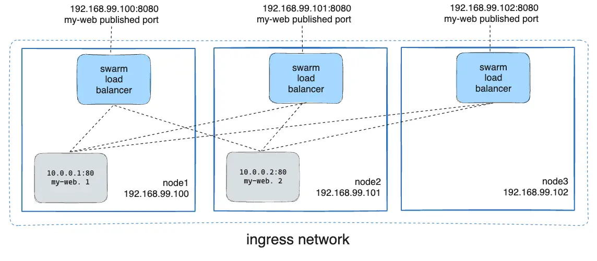

# Docker Stack

- Docker Stack
  - Docker Swarm을 관리하기 위한 툴이다.
  - Docker Compose가 여러 개의 container로 구성된 애플리케이션을 관리하기 위한 도구라면, Docker Stack은 여러 개의 애플리케이션을 관리하기 위한 도구라고 보면 된다.
    - 더 직관적으로는, Docker compose는 container 들을 관리하는 도구이고, Docker Stack은 service들을 관리하는 도구이다.
    - Docker Compose는 개발에는 적합하지만, 운영 환경에서는 적합하지 않을 수 있다.
    - 예를 들어 Docker Compose는 `docker compose` 명령이 실행되는 순간에만 container의 상태가 올바른지 확인한다.
    - 반면에, Docker Stack은 이상적인 서비스 상태가 무엇인지 알고 있으며, 이상적인 상태와 현재 상태가 다를 경우 조치가 가능하다.
    - Docker Compose는 기본 네트워크로 bridge를 사용하지만, Docker Stack은 기본 네트워크로 Overlay를 사용한다.
  - Stack을 배포하면 stack file에 정의된 service들이 배포된다.
    - 해당 service들은 다시 container를 생성한다.
    - 결국 stack이 service를 생성하고 service가 container를 생성하는 구조이다.


- Test 환경 구성

  - Docker network 생성

  ```bash
  $ docker network create dind
  ```

  - DinD container 생성
    - Swarm을 구성하기 위한 dind container 2개와 image를 공유하기 위한 Docker registry 1개를 생성한다.
    - 위에서 생성한 Docker network를 사용한다.

  ```yaml
  version: '3.2'
  
  services:
    dind1:
      image: docker:dind
      container_name: dind1
      privileged: true
      environment:
        - DOCKER_TLS_CERTDIR=/certs
      networks:
        - dind
    
    dind2:
      image: docker:dind
      container_name: dind2
      privileged: true
      environment:
        - DOCKER_TLS_CERTDIR=/certs
      networks:
        - dind
    
    registry:
      image: registry:latest
      container_name: docker-registry
      networks:
        - dind
  
  networks:
    dind:
      name: dind
      external: true
  ```

  - dind1 container에서 swarm mode를 시작한다.

  ```bash
  $ docker swarm init
  ```

  - dind2 container를 swarm node로 합류시킨다.

  ```bash
  $ docker swarm join --token <token> dind1:2377
  ```

  - dind1 container에서 swarm이 잘 구성되었는지 확인한다.

  ```bash
  $ docker node ls
  ```


- Stack 관련 명령어

  > stack 명령어는 manager노드에서만 실행이 가능하다.
  
  - `config`
    - 최종 config file 확인하기 위해 사용한다.
    - `--compose-file` 옵션 뒤에 yaml file을 입력하면 된다.
  
  ```bash
  $ docker stack config --compose-file docker-compose.yml
  ```
  
  - `deploy`
    - 새로운 stack을 배포하거나, 기존 stack을 update하기 위해 사용한다.
  
  ```bash
  $ docker stack deploy --compose-file docker-compose.yml <stack_name>
  ```
  
  - `ls`
    - Stack 들의 목록을 확인하기 위해 사용한다.
  
  ```bash
  $ docker stack ls
  ```
  
  - `ps`
    - Stack 내의 task들의 목록을 확인하기 위해 사용한다.
    - `--filter` 혹은 `-f` 옵션을 사용하여 filtering이 가능하다.
  
  ```bash
  $ docker stack ps <stack_name>
  ```
  
  - `services`
    - Stack에 속한 service들의 목록을 확인하기 위해 사용한다.
    - `--filter` 혹은 `-f` 옵션을 사용하여 filtering이 가능하다.
  
  ```bash
  $ docker stack services <stack_name>
  ```
  
  - `rm`
    - Stack을 삭제하기 위해 사용한다.
    - Stack을 삭제하면 해당 stack은 물론이고 stack이 생성한 service, container가 모두 삭제된다.
  
  ```bash
  $ docker stack rm <stack> [stack2 ...]
  ```
  


# Docker volume과 권한, 소유자, 소유 그룹

- Docker container 내에서의 uid와 gid

  > https://medium.com/@mccode/understanding-how-uid-and-gid-work-in-docker-containers-c37a01d01cf

  - 아무런 option을 주지 않을 경우 container 내의 모든 process는 root로 실행된다.
    - 즉 container를 실행할 때, user를 지정하지 않거나, Dockerfile에 USER를 설정하지 않으면 root로 실행된다.
  - Linux kernel은 모든 process를 실행할 때 프로세스를 실행한 user의 uid와 gid를 검사한다.
    - User name과 group name이 아닌 uid와 gid를 사용한다는 것이 중요하다.
  - Docker container 역시 kernel을 가지고 있으므로 container 내부에서 process 실행시 uid와 gid를 검사한다.


- Container 실행시 user 설정하는 방법

  - Docker run 명령어 실행시 container 내의 default user를 설정할 수 있다.

  ```bash
  $ docker run --user=[ user | user:group | uid | uid:gid | user:gid | uid:group ]
  ```

  - Docker compose file의 service 아래에 아래와 같이 설정할 수 있다.

  ```yaml
  services:
    test:
      user: [ user | user:group | uid | uid:gid | user:gid | uid:group ]
  ```

  - 만약 존재하지 않는 user name을 옵션으로 줘서 container를 실행하려 할 경우 아래와 같은 error가 발생한다.

  ```bash
  $ docker run -it --name my-ubuntu --user foo ubuntu:20.04 /bin/bash
  # docker: Error response from daemon: unable to find user foo: no matching entries in passwd file.
  ```

  - 반면에 존재하지 않는 uid를 줄 경우 error가 발생하지 않는다.
    - 다만 container에 attach할 경우 `I have no name!`이라는 user name이 보이게 된다.

  ```bash
  $ docker run -it --name my-ubuntu --user 1010 ubuntu:20.04 /bin/bash
  ```


- Bind-mount의 소유자

  - Docker compose file

  ```yaml
  version: '3.2'
  
  
  services:
    ubuntu:
      user: 1200:1200
      container_name: my_ubuntu
      image: ubuntu:20.04
      volumes:
        - ./dir:/home/dir
      command: "/bin/bash"
      tty: true
  ```

  - Container 내부의 file 소유자
    - Container 내부에서는 bind mount 대상인 file의 유무와 무관하게 host에 있는 file의 소유자, 그룹이 소유자와 소유 그룹이 된다.
    - 예를 들어 host에서 foo라는 사용자가 dir을 만들었다면 container 내부에 `/home/dir`이 원래 있었는지와 무관하게 container 내부의 `/home/dir`의 소유자, 소유 그룹은 foo와 foo의 그룹이 된다.
  - Host machine의 file 소유자
    - Bind mount를 통해 volume을 설정하더라도 소유자는 변경되지 않는다.
    - 예를 들어 위에서 `dir`을 foo라는 사용자가 만들었다면, bind mount를 하더라도 해당 file의 소유자는 foo이다.
    - Host machine에 없는 file을 대상으로 bind mount할 경우 Docker가 해당 file을 생성하는데, 이 때는 root 권한으로 생성된다.
  - Host machine에 file이 없었을 경우.
    - Host machine에 bind mount한 파일이 없었을 경우 host machine에는 root 소유로 file이 생성된다.
    - Container 내부의 file 권한은 bind mount된 host machine file의 소유권을 따르므로 내부의 file도 root 권한으로 변경된다.
    - 예를 들어 Container 내부에 foo user의 소유인 `/home/foo/test`라는 디렉터리가 있었다고 가정한다.
    - 이 때, host machine에는 `./non_exist_dir`이라는 경로가 존재하지 않는 상황에서 `docker run -v ./non_exist_dir:/home/foo/test alpine`과 같이 컨테이너를 실행한다.
    - Host machine에는 root 소유로 `./non_exist_dir` 디렉터리가 생성되고, container 내부의 `/home/foo/test`의 소유권 역시 host machine의 소유권에 따라 root로 변경된다.
    - 이 경우에도 마찬가지로 container 내부에 bind mount 대상 파일과 무관하게 root 소유권으로 설정된다.


- Volume의 소유자

  - Volume의 경우 bind mount와 다르게 동작한다.
    - Named volume과 anonymous volume 모두 마찬가지다.
  - 아래와 같은 Dockerfile을 작성하고
    - UID 2002로 foo 사용자를 생성한다.
    - foo라는 사용자로 /home/foo/my_dir에 directory를 생성한다.

  ```dockerfile
  FROM alpine:latest
  
  RUN adduser -u 2002 -D foo
  
  USER foo
  
  RUN mkdir /home/foo/my_dir
  ```

  - Image를 build한다.

  ```bash
  $ docker build -t alpine:test .
  ```

  - Container를 생성할 때 아래와 같이 named volume을 설정한다.
  
  ```bash
  $ docker run -v test_vol:/home/foo/my_dir -it alpine:test
  ```
  
  - Host machine에 생성된 `test_vol` 내부의 소유자를 확인하면 아래와 같다.
    - Container 내에서 foo user의 UID인 2002로 소유자가 설정된 것을 확인할 수 있다.

  ```bash
  $ ls -l /var/lib/docker/volumes/test_vol
  
  # drwxr-sr-x 2 2002 2002 4096 Jun 18 16:44 _data
  ```
  
  - 만약 container 내에 없는 directory로 volume을 설정할 경우 host와 container 모두 root가 소유자로 설정된다.
  
  ```bash
  # 아래와 같이 container 내에 없는 경로로 volume을 설정하면 host와 container 양쪽 모두에서 root가 소유자로 설정된다.
  $ docker run -v test_vol:/home/foo/non_exist_dir -it alpine:test
  ```


# Docker network

- Docker network
  - Docker network는 Docker container 들 사이의 통신이나 Docker container와 Docker 외부 application 사이의 통신에 사용된다.
    - Docker container는 자신이 어떤 종류의 network에 attach되어 있는지 모르며, 자신이 통신하는 대상이 Docker container인지, Docker 외부 application인지도 모른다.
    - Container가 `none` network driver를 사용하지 않는 한 container는 오직 network interface만 볼 수 있다.
  - Container는 자신이 attach한 Docker network로부터 IP address를 받아온다.
  - Container는 둘 이상의 network에 동시에 연결할 수 있다.
  - Docker network 내부에서 container에게 할당되는 IP는 container가 정지되면 할당 해제되고, 다시 실행되면 새로 할당된다.
    - 따라서 정지 후 재실행하면 기존 IP address와 다른 IP를 할당받을 수도 있다.
    - 그러나 컨테이너 내부에서 DNS(docker service name)로 요청을 보내면 Docker가 service name에 해당하는 IP address로 바인딩해주기에 통신에는 영향이 없다.


- Port 공개하기

  - 기본적으로 Docker container는 어떤 port도 container 밖으로 노출시키지 않는다.
  - 그러나 compose file이나 stack file, 혹은 `docker run`, `docker create` 등의 명령어 실행 시에 특정 port를 container외부에서 접근할수 있도록 설정할 수 있다.
  - 아래와 같은 형식을 따른다.
    - `/udp`를 주지 않을 경우 기본적으로 TCP port가 되며, 명시적으로 `/tcp`와 같이 주는 것도 가능하다.

  ```bash
  -p [host:]<port>[/udp]:[host:]<port>[/udp]
  ```

  - 주의사항
    - Container port를 공개하면 host machine뿐 아니라 host machine에 접근할 수 있는 모든 곳에서 공개된 container port를 통해 container에 접근이 가능하다.
    - 만약 오직 host machine에서만 container의 공개된 port에 접근하도록 하고 싶다면 port를 공개할 때, 아래와 같이 container의 localhost IP를 함께 설정해주면 된다.

  ```bash
  -p 127.0.0.1:8080:80
  ```

  - 만약 container 내부와 container 외부의 통신이 목적이 아니라 container 들 사이의 통신이 목적이라면 굳이 port를 공개하지 않아도 된다.
    - 이 경우 두 container를 같은 Docker network로 묶으면 된다.


- Routing mesh

  - Swarm에 속한 각 node들이 publish된 port들로 swarm 내에서 기동중인 service에 연결할 수 있게 해주는 기능이다.
    - 모든 node들은 ingress routing mesh에 참여한다.
    - Node에서 특정 service의 task가 실행중이 아니라고 해도 service에 연결이 가능하다.
    - Routing mesh는 모든 요청을 접근 가능한 node에서 실행 중인 container의 pulish된 port들로 routing한다.
  - Docker service를 생성 할 때나 수정 할 때, `--publish` option을 주고 `mode`를 따로 설정하지 않으면 기본 값인 `ingress`가 설정되어 해당 service는 자동으로 routing mesh를 사용하게 된다.
    - 아래와 같이 `mode`를 직접 지정해도 된다.

  ```bash
  $ docker service create --name my_web --replicas 3 --publish published=8080,target=80,mode=ingress nginx
  ```

  - Swarm에서 ingress network를 사용하기 위해서는 swarm node들 사이에 아래의 port들이 열려 있어야 한다.

    - 7946 TCP/UDP port: Container network discovery에 사용한다.
    - 4789 UDP port: Container ingress network에 사용한다.
    - 물론 각 service들이 publish한 port들도 열려 있어야 한다.

  - Routing mesh는 publish된 port로 요청을 보내기만 하면 node의 IP와 무관하게 모든 요청을 받을 수 있다.

    - 예를 들어 3개의 node가 192.168.99.100, 192.168.99.101, 192.168.99.102라는 IP를  각각 할당 받았다고 가정해보자.
    - 만약 service의 8080 port를 publish 했다면 192.168.99.100:8080, 192.168.99.101:8080, 192.168.99.102:8080 중 아무 곳에나 요청을 보내도 service는 요청을 받을 수 있다.
    - 해당 service의 task가 실행중이 아닌 node라도 이와 같이 요청을 보내는 것이  가능하다.
    - 예를 들어 service가 192.168.99.100, 192.168.99.101 IP를 할당 받은 node들에서만 task를 실행중이라 하더라도, task를 실행중이지 않은 192.168.99.102:8080으로도 요청을 보내는 것이 가능하다.

    

  - Routing mesh를 사용하지 않기

    - 특정 node의 port로 접근하면 해당 node에 실행중인 service의 task에만 연결되도록 할 수 있다.
    - 이를 `host` mode라 부른다.
    - 이 경우 접근한 node에 실행 중인  task가 없으면 연결이 되지 않는다.
    - Routing mesh를 사용하지 않으려면 아래와 같이 `--publish` option에서 `mode`를 `host`로 설정하면 된다.

  ```bash
  $ docker service create --name dns-cache \
    --publish published=53,target=53,protocol=udp,mode=host \
    --mode global \
    dns-cache
  ```


## Network driver

- Network driver 개요

  - `bridge`
    - 기본 network driver로 driver를 설정하지 않을 경우 자동으로 bridge driver로 설정된다.
    - 일반적으로 같은 host에 실행중인 container들 사이의 통신에 사용된다.
  - `host`
    - Docker container가 host machine의 network를 바로 사용하게 하는 driver이다.
    - 즉 Docker container와 host machine 사이의 네트워크 격리를 제거한다.
  - `overlay`
    - 각기 다른 daemon에서 실행중인 container 사이의 통신에 사용된다.

  - `none`
    - Container의 network를 host machine과 다른 container부터 완전히 격리시킨다.
    - Swarm service에서는 사용할 수 없다.


- Bridge

  - Bridge network는 network에 속한 이들 사이의 traffic을 전달해주는 Link Layer device이다.
    - Bridge는 hardware device일 수도 있고 host machine의 kernel에서 동작하는 software device일 수도 있다.
    - Docker의 경우 software bridge를 사용하며, 같은 bridge network에 연결된 container들 사이의 통신을 가능하게 하기 위해 사용한다.
    - Docker bridge driver는 host machine에 규칙을 설정하여 다른 bridge network에 속한 container들끼리는 직접적으로 통신을 할 수 없게 막는다.
  - Bridge network는 같은 Docker daemon에서 실행중인 container 사이에만 적용된다.
    - 다른 daemon에서 실행중인 container들 사이에 통신을 하기 위해서는 OS level에서 routing을 관리하던가 overlay driver를 사용해야한다.
  - Docker를 처음으로 실행할 때 자동으로 bridge라는 network가 생성된다.
    - 만약 container를 생성할 때 network를 설정해 주지 않으면 bridge network에 연결된다.
    - 그러나 bridge network를 직접 생성하여 사용하는 것이 자동으로 생성된 bridge network를 사용하는 것 보다 나으므로, 직접 생성하는 것이 권장된다.
  - 같은 network에 속한 container들 사이의 통신에 container의 이름을 사용할 수 있다.
    - 만약 docker compose로 실행했을 경우 container name뿐 아니라 service name으로 통신이 가능하다.


- Overlay

  - 서로 다른 Docker daemon에서 실행중인 container들 사이의 통신에 사용하는 network driver이다.
  - Swarm mode를 initialize하거나 이미 존재하는 Swarm cluster에 합류할 경우 `ingress`와 `docker_gwbridge`라는 2개의 docker network가 새로 생성된다.
    - `ingress`는 swarm service와 관련된 data traffic을 처리하는 overlay network이다.
    - Swarm service를 생성하면서 service를 별도의 overlay network에 연결시키지 않을 경우 `ingress`에 연결된다.
    - `docker_gwbridge`는 Swarm으로 묶인 각기 다른 Docker daemon들을 연결해주는 역할을 하는 bridge network이다.
  - Overlay network를 사용하고자 하는 Docker daemon은 아래의 port가 열려있어야 한다.
    - TCP port 2377: Swarm cluster 관리를 위한 의사소통에 사용.
    - TCP, IDP port 7946: node들 사이의 의사소통에 사용.
    - UDP port 4789: overlay network의 traffic에 사용.

  - Overlay network 생성하기

  ```bash
  $ docker network create -d overlay <network name>
  ```

  - `--attachable`
    - Docker network를 생성할 때  `--attachable` option을 줄 수 있다.
    - Swarm service에서 사용할 overlay network를 생성하거나, standalone container에서 다른 Docker daemon 위에서 실행중인 standalone container에 접근하기 위해서는 `--attachable` flag를 추가해야한다.
    - 수동으로 실행한 container가 Swarm으로 실행된 service의 overlay network에 접근할 수 있게 해준다.
    - 기본적으로 수동으로 실행된 container는 Swarm에서 사용하는 network에 접근할 수 없다.
    - 이는 non-manager node에 접근할 수 있는 사람이 non-manager node에서 수동으로 container를 실행 시켜 Swarm service network에 접근하는 것을 방지하기 위한 제한이다.

  ```bash
  $ docker network create -d overlay --attachable <network name>
  ```


- Host
  - Docker container와 host machine 사이의 네트워크 격리를 제거한다.
    - 따라서 Docker container는 host machine의 network namespace를 공유한다.
    - 또한 이 경우 container는 고유한 IP address를 할당받지 않는다.
    - `-p` 옵션을 줄 경우 이 옵션은 무시된다.
  - 아래와 같은 경우에 유용하게 사용할 수 있다.
    - Docker container는 외부와 통신할 때 network address translation(NAT)과 userland proxy를 사용한다.
    - Host 모드는 이러한 중간 계층 없이 container가 host machine의 network interface를 바로 사용하기 때문에 불필요한 오버헤드가 줄어든다.
    - 따라서 성능을 최적화해야하는 경우 유용하게 사용할 수 있다.
    - 또한 container는 각 포트마다 userland-proxy 프로세스를 생성할 수 있으며, 이로 인해 CPU 자원 낭비와 성능 저하가 발생할 수 있다.
    - 따라서 container가 광범위한 port들을 다뤄야 하는 경우에도 유용하게 사용할 수 있다.
  - 제약 사항
    - Container 내부에서 host machine의 IP address로 bind 할 수 없다.
    - Linux 환경에서만 사용이 가능하다.


## Docker overlay network

- Overlay network도 마찬가지로 network 내에서 container name 혹은 service name으로 통신이 가능하다.


- Standalone container들을 overlay network를 통해 통신시키는 방법

  > 아래 예시는 dind들 간에 dind_network라는 network를 통해 통신해서 port를 따로 열어둘 필요가 없었지만 실제로 사용할 때는 위에서 설명한 port들이 열려있어야한다.

  - 먼저 test를 위해 dind를 사용하여 2개의 Docker daemon을 실행시킨다.

  ```yaml
  version: '3.2'
  
  services:
    dind1:
      image: docker:dind
      container_name: dind1
      privileged: true
      environment:
        - DOCKER_TLS_CERTDIR=/certs
      volumes:
        - ./stack:/home/stack
      networks:
        - dind
    
    dind2:
      image: docker:dind
      container_name: dind2
      privileged: true
      environment:
        - DOCKER_TLS_CERTDIR=/certs
      volumes:
        - ./stack:/home/stack
      networks:
        - dind
  
  networks:
    dind:
      name: dind_network
  ```

  - `dind1` container내부에서 아래 명령어를 실행하여 Swarm을 시작한다.

  ```bash
  $ docker swarm init
  ```

  - `dind2` container 내부에서 아래 명령어를 실행하여 Swarm에 node를 합류시킨다.

  ```bash
  $ docker swarm join --token <token> dind1:2377
  ```

  - 아래와 같이 server 역할을 할 app을 작성한다.

  ```python
  import logging
  
  from fastapi import FastAPI
  import uvicorn
  
  logger = logging.getLogger("simple_example")
  logger.setLevel(logging.DEBUG)
  
  sh = logging.StreamHandler()
  sh.setLevel(logging.DEBUG)
  
  formatter = logging.Formatter("[%(asctime)s] - [%(levelname)s] - %(message)s")
  sh.setFormatter(formatter)
  
  logger.addHandler(sh)
  
  app = FastAPI()
  
  @app.get("/")
  def read_root():
      logger.info("Hello World!")
      return {"message":"Hello World!"}
  
  if __name__=="__main__":
      uvicorn.run(app, host="0.0.0.0", port=8010)
  ```

  - 위 app을 build하기 위한 Dockerfile을 아래와 같이 작성한다.

  ```dockerfile
  FROM python:3.8.0
  
  COPY ./main.py /app/main.py
  WORKDIR /app
  
  RUN pip install requests
  
  ENTRYPOINT ["python", "-u", "main.py"]
  ```

  - `dind1` container내부에서 build한다.

  ```bash
  $ docker build -t server:1.0.0 .
  ```

  - Client 역할을 할 app을 작성한다.
    - `requests`를 사용하여 server container에서 실행 중인 app으로 요청을 보낸다.
    - 요청을 보낼 host는 server 역할을 하는 app을 실행하는 container의 이름(`server`)을 적어준다.

  ```python
  import time
  import logging
  
  import requests
  
  
  logger = logging.getLogger("simple_example")
  logger.setLevel(logging.DEBUG)
  
  sh = logging.StreamHandler()
  sh.setLevel(logging.DEBUG)
  
  formatter = logging.Formatter("[%(asctime)s] - [%(levelname)s] - %(message)s")
  sh.setFormatter(formatter)
  
  logger.addHandler(sh)
  
  
  try:
      while True:
          logger.info(requests.get("http://server:8010").json())
          time.sleep(1)
  except (KeyboardInterrupt, SystemExit):
      logger.info("Bye!")
  ```

  - 마찬가지로 Dockerfile을 작성하고

  ```dockerfile
  FROM python:3.8.0
  
  COPY ./main.py /app/main.py
  WORKDIR /app
  
  RUN pip install requests
  
  ENTRYPOINT ["python", "-u", "main.py"]
  ```

  - Build한다.

  ```bash
  $ docker build -t client:1.0.0 .
  ```

  - `dind1`에서 overlay network를 생성한다.
    - 이 때 `--attachable` option을 줘서 생성한다.
    - 아직까지는 `dind1`에만 생성되고, `dind2`에는 생성되지 않는다.

  ```bash
  $ docker network create --driver=overlay --attachable my-network
  ```

  - `dind1`에서 container를 생성한다.

  ```bash
  $ docker run -d --network my-network --name server server:1.0.0
  ```

  - `dind2`에서 container를 실행한다.

  ```bash
  $ docker run -d --name client --network my-network client:1.0.0
  ```

  - 실행결과를 확인하면 `{'message':'Hello World'}`이 출력되는 것을 확인할 수 있다.

  ```bash
  $ docker logs client
  ```

  - `dind1`과 `dind2`에서 모두 network를 확인하면 `my-network`의 ID가 동일한 것을 확인할 수 있다.

  ```bash
  $ docker network ls
  ```


- Service와 standalone container 사이의 통신

  - 위에서 standalone container로 생성했던 server를 service로 생성하고, client는 그대로 standalone으로 생성하여 둘 사이를 통신시키는 방법을 알아볼 것이다.
  - 아래와 같이 server service를 생성한다.

  ```bash
  $ docker service create --name server --network my-network --replicas 2 server:1.0.0
  ```

  - Client는 기존과 동일하게 실행한다.

  ```bash
  $ docker run -d --name client --network my-network client:1.0.0
  ```

  - Service의 task로 생성된 두 개의 container들의 log를 확인해보면 두 container에 돌아가면서 요청이 들어오는 것을 확인할 수 있다.


# Docker health check

- Health check
  - Docker container를 생성한 후 container가 제대로 실행되었는지 확인할 수 있는 기능이다.
  - Dockerfile, docker-compose file, `create` 명령어, `run` 명령어 등에서 사용 가능하다.


- `create`, `run` 명령어와 함께 사용하기

  - 둘 다 동일한 방식으로 사용한다.

  - 옵션들

    - `--health-cmd`: health check에 사용할 명령어를 설정한다.

    - `--health-interval`: 각 check 사이의 기간을 설정한다.
    - `--health-retries`: 실패했을 경우 재시도할 횟수를 설정한다.
    - `--health-start-period`: 실패 후 다음 시도까지의 시간을 설정한다.
    - `--heath-timeout`: 명령어의 실행이 완료될 기한을 설정한다.

  ```bash
  $ docker <run | create> [options]
  
  # e.g.
  $ docker run --health-cmd curl localhost:9200 --health-retries 3 --health-timeout 10
  ```


- Dockerfile에서 사용하기

  - 옵션들
    - `--interval`
    - `--timeout`
    - `--start-period`
    - `--retries`

  ```dockerfile
  # HEALTHCHECK를 할 경우
  HEALTHCHECK [options] CMD command
  
  # e.g.
  HEALTHCHECK --interval=5m --timeout=3s CMD curl -f http://localhost/ || exit 1
  
  # 하지 않을 경우
  HEALTHCHECK NONE
  ```

  - 기본적으로 `HEALTHCHECK`를 작성하지 않으면 실행되지 않는데 굳이 `HEALTHCHECK NONE`과 같이 명시해주는 이유
    - Base image를 기반으로 새로운 image를 만들었을 때 base image에 health check가 포함되어 있다면 health check가 실행되게 된다.
    - 따라서 만일 health check가 포함된 base image로 새로운 이미지를 만들었을 때, health check를 원치 않는다면 위와 같이 명시적으로 작성해줘야 한다.


- Docker-compose에서 사용하기

  - Dockerfile과 compose file에 모두 지정할 경우 compose file에 설정한 내용이 Dockerfile에 설정한 내용을 덮어쓴다.
  - 옵션은 다른 방식들과 동일하다.

  ```yaml
  healthcheck:
    test: ["CMD", "curl", "-f", "http://localhost"]
    interval: 1m30s
    timeout: 10s
    retries: 3
    start_period: 40s
  ```

  - `depends_on`과 함께 사용하기
    - `depends_on`에는 `condition`이라는 문법을 사용 가능하다.
    - `condition`을 `service_healthy`로 설정하면 의존하는 container의 health check가 성공하면 생성을 시작한다.
    - 만약 healthcheck에 실패하면 `container for service "<service_name>" is unhealthy`라는 메시지와 함께 service가 실행되지 않는다.

  ```yaml
  # web container는 elasticsearch container의 health check가 성공하고, db가 온전히 동작하면, 생성이 시작된다.
  services:
    web:
      depends_on:
        elasticsearch:
          condition: service_healthy
    
    elasticsearch:
      image: elasticsearch
      healthcheck:
        test: ["CMD", "curl", "localhost:9200"]
        interval: 1m30s
        timeout: 10s
        retries: 3
        start_period: 40s
  ```


# etc

- Docker compose options
  - tty:true로 주면 docker run 실행시에 -t option을 준 것과 동일하다.
  - stdin_open:true로 주면 docker run 실행시에 -i option을 준 것과 동일하다.


- Orphan container

  - Docker를 사용하다보면 `Found orphan containers ([<container_name>]) for this project.`과 같은 warning이 발생할 때가 있다.
    - Warning이므로 container를 실행하는 데는 아무런 문제는 없다.
  - Orphan container warning이 발생하는 원인은 아래와 같다.
    - Docker compose는 각 project를 구분하기 위해서 project name을  사용한다.
    - Project name은 project 내의 container와 다른 resource들(e.g. docker network)을 고유하게 식별하기 위한 identifier를 생성하기 위해 사용된다.
    - 예를 들어 project name이 `foo`이고, 두 개의 service `db`와 `app`이 있을 때, docker-compose.yml 파일에서 각 service의 container name을 설정해주지 않았다면  Compose는 `foo-db-1`과 `foo-app-1`이라는 두 개의 container를 생성할 것이다.
    - Orphan container warning은 같은 project name을 가진 container가 docker-compose.yml 파일에는 정의되어 있지 않을 때 발생한다.
    - 대부분의 문제는 project name의 default 값이 docker-compose.yml 파일이 위치한 directory name이라 발생한다.
  - 상황1. 기존 docker-compose.yml을 수정했을 경우
    - 처음 orphan service를 정의하고 container를 실행하면 project name은 default 값인 docker-compose.yml 파일이 위치한 directory name으로 설정된다.
    - 이 때, `orphan` container를 삭제하지 않은 상태에서, docker-compose.yml 파일을 변경한 후 다시 실행하면, 같은 project name을 가진 `orphan`이라는 container는 생성되어 있는데, 해당 container가 docker-compose.yml 파일에는 정의되어 있지 않으므로 orphan container warning이 발생한다.

  ```yaml
  # 기존 docker-compose.yml 파일이 아래와 같을 때, docker compose up으로 container를 생성하고
  services:
    orphan:
      container_name: orphan
      image: hello-world:lates
      
  
  # 이후에 아래와 같이 변경하여 다시 docker compose up으로 container를 생성하면 orphan이라는 orphan container가 있다는 warning이 발생한다.
  services:
    new:
      container_name: new
      image: hello-world:lates
  ```

  - 상황2. 동일한 directory에서 복수의 docker-compose.yml 파일을 사용할 경우
    - 같은 directory에 아래와 같이 두 개의 docker-compose.yml 파일이 있다고 가정해보자.
    - 마찬가지로 project name은 default 값인 두 개의 docker-compose.yml 파일이 위치한 directory name으로 설정된다.
    - 이 때, `docker-compose up`을 실행하여 docker-compose.yml에 정의된 container를 실행하고, `docker-compose -f docker-compose.bar.yml up`을 통해 docker-compose.bar.yml에 정의된 container를 실행하면 같은 project name으로 생성된 `foo` container가 있으나 `docker-compose.bar.yml` 파일에는 정의되어 있지 않으므로 orphan container warning이 발생한다.

  ```yaml
  # docker-compose.yml
  services:
    foo:
      container_name: foo
      image: hello-world:lates
      
  # docker-compose.bar.yml
  services:
    bar:
      container_name: bar
      image: hello-world:lates
  ```

  - Orphan container의 생성을 방지하는 방법
    - 대부분의 문제는 project name의 default 값인 directory name을 사용할 때 발생한다.
    - 따라서 default 값을 사용하지 않도록 project name을 설정하면 된다.
    - `docker compose` 명령어 실행시 아래와 같이 `-p` 옵션을 주어서 project name을 설정할 수 있다.
    - 혹은 `COMPOSE_PROJECT_NAME` 환경 변수를 설정하는 방법도 있다.

  ```bash
  $ docker compose -p foo up
  $ docker compose -f docker-compose.bar.yml -p bar up
  ```

  - 아래와 같이 docker-compose.yml 파일의 top level에 `name`을 설정할 수도 있다.

  ```yaml
  name: foo
  
  services:
    foo:
      container_name: foo
      image: hello-world:latest
  ```


- 기본 umask 설정

  - 예를 들어 아래와 같이 5초 마다 umask 값을 출력하는 python code가 있다고 가정해보자.

  ```python
  # main.py
  
  import os
  import time
  
  try:
      while True:
          os.system("umask")
          time.sleep(5)
  except (KeyboardInterrupt, SystemExit):
      logger.info("Bye!")
  ```

  - Dockerfile을 아래와 같이 설정한다.
    - `.bashrc`은 user의 home directory에 생성되므로, user 추가시 `-m` option을 줘야한다.

  ```dockerfile
  FROM python:3.8.0
  
  RUN useradd -m -u 1005 foo
  
  USER foo
  
  # .bashrc에 umask 0002 명령어를 추가한다.
  RUN echo "umask 0002" >> ~/.bashrc
  
  COPY ./main.py /main.py
  
  ENTRYPOINT ["python", "main.py"]
  ```

    - 위 예시의 경우 0002를 출격할 것 같지만, 0002를 출력한다. 즉, 의도한 대로 동작하지 않는다.
      - 반면에 `docker exec -it <container> /bin/bash`와 같이 입력하여 직접 `python main.py`를 실행시키면 0002가 제대로 출력된다.


    - 아래와 같이 dockefile을 작성한다.
      - `umask 0002`와 python script 실행이 한 세션에서 실행될 수 있도록 한다.

  ```dockerfile
  FROM python:3.8.0
  
  RUN useradd -m -u 1005 foo
  
  USER foo
  
  COPY ./main.py /main.py
  
  ENTRYPOINT ["/bin/bash", "-c", "umask 0002 && python main.py"]
  ```


## sudo 없이 docker 명령어 실행

- docker 명령어는 기본적으로 root 권한으로 실행해야 한다.

  - 따라서 root가 아닌 user로 명령어를 실행하려면 항상 명령어 앞에 sudo를 입력해야한다.

  - 아래 과정을 거치면 sudo를 입력하지 않고도 docker 명령어 실행이 가능하다.


- sudo 없이 docker 명령어 실행

  - docker group이 있는지 확인

  ```bash
  $ cat /etc/group | grep docker
  ```

  - 만일 docker group이 없다면 docker group 생성

  ```bash
  $ sudo groupadd docker
  ```

  - docker group에 사용자 추가
    - `-a`는 그룹에 사용자를 추가하는 옵션이다.
    - `-G`는 그룹을 지정하는 옵션이다.

  ```bash
  $ sudo usermod -aG docker <사용자 id>
  ```

  - 사용자에서 로그아웃 한 후 다시 로그인한다.
    - ubuntu의 경우 `exit`

  ```bash
  $ logout
  ```

  - group에 추가됐는지 확인한다.

  ```bash
  $ groups
  ```

  - 만일 추가되지 않았다면 아래 명령어를 통해 재로그인 한다.

  ```bash
  $ su <사용자 id>
  ```
  
  - 간혹 docker.sock의 권한 문제로 sudo 없이 실행이 되지 않을 수 있다.
    - 이럴 경우 아래와 같이 소켓 파일의 그룹 소유권을 변경하면 된다.
    - 소유자는 그대로 두고, 소유 그룹만 docker로 변경한다.
  
  ```bash
  $ sudo chown root:docker /var/run/docker.sock
  ```


## docker-entrypoint-initdb.d

- `docker-entrypoint-initdb.d`
  - DB 이미지들 중에는 컨테이너를 생성할 때 일련의 작업(DB 생성, table 생성, data 추가 등)이 자동으로 실행되도록 `docker-entrypoint-initdb.d`라는 폴더를 생성해주는 것들이 있다.
  - 컨테이너 내부의 `docker-entrypoint-initdb.d` 폴더에 volume을 설정하면 컨테이너가 최초로 실행될 때 `docker-entrypoint-initdb.d` 폴더 내부의 파일이 실행된다.


- 주의사항
  - 만일 컨테이너에 이미 volume이 존재한다면 `docker-entrypoint-initdb.d`에 실행할 파일을 넣어도 실행이 되지 않는다.
  - 따라서 반드시 volume을 삭제한 후에 실행해야 한다.


## Data Root Directory 변경

- 기존 Docker Data Root 경로의 용량이 부족할 경우, 혹은 기본 경로가 아닌 다른 곳에 저장을 해야 할 경우 아래 두 가지 방식으로 Root Directory를 변경 가능하다.
  - dockerd에 `--data-root` 옵션 추가(이전 버전에서는 `-g`를 사용했다)
  - daemon.json에 "data-root" 추가


- 기존 데이터 복사하기

  - 변경하고자 하는 경로에 디렉토리를 생성한 후 기존 docker 데이터를 생성한 디렉토리에 옮긴다.
    - 주의할 점은 cp 실행시 디렉터리 소유자가 cp를 실행한 사용자로 변경된다는 점이다.
    - 만약 변경 되어선 안 되는 경우라면 소유자도 함께 변경해야한다.
  
  - 복사 전에 구동중인 Docker 데몬을 종료한다.
  
  ```bash
  # 새로운 디렉토리 생성
  $ mkdir data
  # Docker 데몬 종료
  $ systemctl stop docker.service
  # 데이터 복사
  $ cp -R -a /var/lib/docker data
  ```


- `--data-root` 옵션 추가하기

  - docker.service 파일에 아래 내용을 추가한다.
    - CentOS의 경우 `/usr/lib/systemd/system/docker.service` 경로에 있다.

  ```bash
  ExecStart=/usr/bin/dockerd --data-root <복사할 디렉터리> -H fd:// --containerd=/run/containerd/containerd.sock
  ```

  - 혹은 daemon.json에 "data-root" 추가해도 된다.
    - Linux의 경우 `/etc/docker/daemon.json` 경로에 있으며, 없으면 생성하면 된다.
  
  ```json
  {
      "data-root": "<복사할 디렉터리>"
  }
  ```
  
  - docker 데몬 재실행하기
  
  ```bash
  $ systemctl daemon-reload
  $ systemctl start docker.service
  ```


- 변경 되었는지 확인하기

  ```bash
  $ docker info | grep -i "docker root dir"
  ```


### Docker data root 변경 후 Container가 실행되지 않는 문제

- 문제 상황

  - Docker data root를 변경하기 위해 docker daemon을 정지하고, 기존 docker 데이터를 새로운 경로로 복사했다.

  ```bash
  $ systemctl stop docker.service
  $ cp -R -a /var/lib/docker /data/docker
  ```

  - 그 후 `/etc/docker/daemon.json` 파일을 아래와 같이 작성하고

  ```json
  {
      "data-root": "/data/docker"
  }
  ```

  - Docker daemon을 다시 실행했다.

  ```bash
  $ systemctl daemon-reload
  $ systemctl start docker.service
  ```

  - 일부 컨테이너 중 실행되지 않은 컨테이너들이 있었다.
    - 예시의 경우 Kafka container가 실행되지 않았으며, 아래와 같은 에러 메시지가 출력되었다.

  ```
  kafka-1  | Command [/usr/local/bin/dub path /etc/kafka/ writable] FAILED !
  ```


- 원인

  - `cp`를 통해 Docker 디렉터리를 복사하면서 소유자 정보를 보존하지 않아 발생한 문제이다.
  - 소유자 정보를 보존하지 않아 문제가 되는 경우 
    - 기존 container에서 volume을 사용할 경우 문제가 될 수 있다.
    - 사용자가 container를 실행하면서 volume을 설정했을 수도 있고, image 중에는 build할 때 Dockerfile에 `VOLUME` 명령어를 사용하여 anonymous volume을 생성하도록 하는 경우도 있다.
    - Volume뿐 아니라 `<data-root>/vfs/dir` 경로에 있는 모든 파일들의 소유자가 변경되는 것 역시 문제가 된다.
    - 위 경로는 Docker image의 각 레이어에 대한 실제 파일 구조가 저장되는 곳으로, 이 파일들의 소유자가 변경될 경우 문제가 발생할 수 있다.
  - 위에서 문제가 됐던 `confluentinc/cp-kafka` image의 경우 build 과정에서 `VOLUME` 명령어를 사용하여 anonymous volume을 생성한다.

  ```bash
  $ docker history confluentinc/cp-kafka:7.5.3 | grep VOLUME
  
  # <missing>      18 months ago   /bin/sh -c #(nop)  VOLUME [/var/lib/kafka/da…   0B
  ```

  - 문제는 volume을 설정한 container 내부의 directory의 소유자가 root가 아니라는 것이다.
    - `confluentinc/cp-kafka` image는 내부에서 UID가 1000인 `appuser`를 생성하고, Kafka 실행에 필요한 파일들의 소유자로 등록한다.
    - Container가 실행되면서 `appuser`가 소유자로 등록된 파일들이 anonymous volume으로 설정되고, host machine에서 volume 파일의 소유자는 appuser의 UID인 1000으로 설정된다.
    - 그러나 `cp`를 통해 docker 데이터를 복제하면서 소유권을 보존하지 않았기에, 복사본의 소유권은 `cp` 명령어를 실행한 root로 설정된다.

  ```bash
  # 기존 data root 경로의 volume 소유자(ubuntu 계정의 UID는 1000이다)
  $ ls -l /var/lib/docker/volumes/0650916823egrgreec03c704dc25be1rh4718de008dd45883f48243a206
  # drwxrwxr-x 2 ubuntu root 4096 Dec 21  2023 _data
  
  # 변경된 data root 경로의 volume 소유자
  ls -l /mnt/data/docker/volumes/0650916823egrgreec03c704dc25be1rh4718de008dd45883f48243a206
  # drwxr-xr-x 2 root root 4096 Jun 18 17:48 _data
  ```

  - 따라서 volume이 설정된 container 내부의 파일들의 소유자가 모두 root로 변경되었고, 프로세스를 실행하는 appuser는 이 파일을 실행할 권한이 없어 에러가 발생하게 된다.


- 예방 및 해결

  - 예방

    - 소유자 정보 및 권한 정보를 보존하면서 새로운 data root에 기존 data를 이동시켜야한다.

    - `cp`를 사용할 경우 `-a` 옵션을 주어 소유자를 유지하게 해야한다.

  - 해결 방법1. 원본 data root의 백업 파일이 있다면, 해당 파일의 소유자가 유지되도록 다시 복제한다.

    - 가장 확실하고 안전한 해결 방법이다. 

  - 해결 방법2. container를 root user로 실행(비권장)

    - Container를 실행할 때 root user가 container 내부의 프로세스를 실행하도록 변경한다.
    - 문제는 해결되지만 권장하지 않는 방법이다.

  - 해결 방법3. volume의 소유자 변경 및 image 삭제 후 다시 pull

    - 문제가 되는 volume의 소유자를 모두 container 내의 UID와 일치하게 변경한다.
    - Image와 관련된 파일들의 소유자도 변경되었으므로, container에서 사용하는 image도 삭제 후 다시 pull하여 컨테이너를 재생성한다.


- Data root를 외장 디스크로 설정할 경우 문제가 발생할 수 있다.

  - 서버가 재실행 될 때, Docker daemon이 외장 디스크의 마운트보다 먼저 실행되면, Docker daemon은 외장 디스크를 찾을 수 없어 에러가 발생하게 된다.
  - 아래와 같이 외장 디스크가 마운트된 이후에 docker service를 설정하도록 docker service 파일을 작성한다.

  ```conf
  [Unit]
  RequiresMountsFor=/path/to/external_dist
  ```

  - 그 후 변경된 설정을 적용한다.

  ```bash
  $ systemctl daemon-reload
  $ systemctl restart docker
  ```

  - 사실 data root를 외장 디스크로 설정하지 않는 것이 가장 좋다.
    - 연결이 끊기는 등의 문제가 발생할 경우 Docker가 예기치 않게 종료될 수 있기 때문이다.
    - 또한 내장 디스크에 비해 성능이 떨어질 수도 있다.


## Docker Container Timezone 설정

- Docker Container Timezone 설정

  - 기본적으로 UTC로 설정되어 우리나라보다 9시간 느리다.
    - 따라서 시간에 따른 로그를 출력해야 하거나 정확한 시간이 필요한 경우 아래와 같이 timezone을 변경해 줘야 한다.
  - `TZ`라는 환경 변수를 통해 설정이 가능하다.
    - 어떤 방식으로든 환경 변수로 넘겨주기만 하면 된다.
  - `Dockerfile`에서 설정하기

  ```dockerfile
  ENV TZ=Asia/Seoul
  ```

  - 컨테이너를 실행할 때 설정하기

  ```bash
  $ docker run -e TZ=Asia/Seoul
  ```

  - docker-compose에서 설정하기

  ```yaml
  version: '3'
  
  services:
    some-container:
      environment:
        - TZ=Asia/Seoul
  ```


## 컨테이너 생성시 sql문 자동 실행

- 아래와 같이 실행시킬 sql 파일을  `/docker-entrypoint-initdb.d/`에 볼륨을 잡으면 자동으로 실행된다.

  - 꼭 sql 파일이 아니어도 되며, sql문이 작성된 sh 파일도 가능하다.

  ```yaml
  version: '3'
  
  services:
    postgresql:
      container_name: postgressql
      image: postgres:latest
      environment:
        - POSTGRES_PASSWORD=my_password
        - TZ=Asia/Seoul
      volumes:
        - ./create_table.sql:/docker-entrypoint-initdb.d/create_table.sql
  ```

  - 주의
    - 이미 데이터가 존재 할 경우 실행되지 않는다.


## Error

- `network sandbox join failed: ... error creating vxlan interface: file exists`

  - 문제 상황
    - 세 대의 서버를 swarm으로 묶은 후 서비스하던 중, Docker daemon을 재시작할 일이 생겨, 세 서버의 Docker daemon을 재시작했다.
    - 그 직후, Docker stack config file에 변경 사항이 있어, Docker stack deploy를 통해 이미 존재하는 stack을 재배포 하는 중에 일부 service에서 위와 같은 error가 발생하며 실행되지 않았다.
    - 해당 error는 swarm으로 묶인 세 개의 노드 중 한 노드에서만 발생했다.
    - 에러가 발생한 service들은 같은 overlay network를 사용한다는 공통점이 있었으며, 해당 overlay network를 확인한 결과, 어떤 container도 network에 추가되지 않았다.
  - 원인
    - 새로운 docker 컨테이너가 overlay network에 참여하기 위해 필요한 VXLAN interface가 이미 존재함에도, Docker daemon이 이를 생성하려 해서 발생하는 문제다.
  - 상세
    - 새로운 컨테이너가 overlay network에 참여해야 할 경우, Docker daemond은 컨테이너가 overlay network에 참여하기 위한 VXLAN interface를 생성한다.
    - 이 시점 까지는 `ip -d link show` 명령어를 통해 호스트 머신에서 VXLAN interface를 확인이 가능하다.
    - 이후 생성한 VXLAN를 container namespace로 이동시킨다.
    - 이동이 완료된 VXLAN interface는 호스트 머신에서 보이지 않게된다.
    - 만약 컨테이너가 정지될 경우 Docker daemon은 VXLAN을 다시 호스트 머신으로 반환한다.
    - 반환이 완료되면 Docker daemon은 VXLAN을 삭제한다.
    - 문제는 컨테이너가 정지되고 VXLAN을 호스트 머신에 반환까지는 했으나, VXLAN을 삭제하지 못하는 경우가 있을 수 있다.
    - 이 경우 VXLAN은 그대로 호스트 머신에 남아있게 되며, 이후 다시 컨테이너가 실행되어 overlay network에 참여하기 위해 Docker Deamon이 VXLAN interface를 생성하려 할 때, 이미 VXLAN이 존재한다는 error가 발생하게 된다.
  - 해결
    - Docker daemon이 삭제하지 않은 VXLAN interface를 찾아서 삭제한다.

  ```bash
  # Docker daemon이 삭제하지 않은 VXLAN을 찾는다(호스트 머신에 반환은 됐으므로, 아래 명령어로 확인은 가능하다.
  # Docker가 생성한 VXLAN은 vx prefix가 붙는다.
  $ ip -d link show | grep vx
  
  # output
  # 맨 뒤의 다섯 글자(o0la3)는 해당 VXLAN interface를 통해 접근하고자 하는 Docker overlay netowrk ID의 첫 다섯 글자이다.
  5010: vx-00100c-o0la3: <BROADCAST,MULTICAST> mtu 1450 qdisc noop state DOWN mode DEFAULT group default
  
  
  # 맨 뒤의 다섯 글자와 일치하는 Docker overlay netowrk ID가 있는지 확인
  $ docker network ls | grep o0la3
  
  # output
  o0la3crbs51r   banana_default            overlay   swarm
  
  
  
  # 일치하는 Docker overlay netowrk ID가 있을 경우, 아래 명령어를 통해 삭제되지 못 한 VXLAN interface를 삭제한다.
  $ ip link delete vx-00100c-o0la3
  ```

  - 확인

  ```bash
  $ docker service ps <service_name>
  ```

  - 여담
    - 문제가 발생한 서버를 재시작하거나, Docker daemon을 재시작했더니 해결 됐다는 글이 꽤 있었다.
    - 아마 Docker daemon이 종료되면서 VXLAN을 삭제했기 때문으로 보이는데, 이 방법을 시도해보지는 않았다.

  - 참조
    - https://www.n0r1sk.com/post/docker-swarm-network-down-the-rabbit-hole/
    - https://github.com/moby/libnetwork/issues/562#issuecomment-1155015141


# alpine image

- alpine image의 경우 일반 image에 비해 size가 작긴 하지만, 경우에 따라 성능에 상당한 차이가 있을 수 있다.

  > https://superuser.com/questions/1219609/why-is-the-alpine-docker-image-over-50-slower-than-the-ubuntu-image

  - 예를 들어 `python:3.8.0` image와 `python:3.8.0-alpine` image의 경우 size는 `python:3.8.0-alpine`이 훨씬 작지만, 성능은 `python:3.8.0`이 보다 뛰어나다.
  - 이러한 차이가 나는 이유는 두 image가 서로 다른 방식으로 구현되었기 때문이다.
