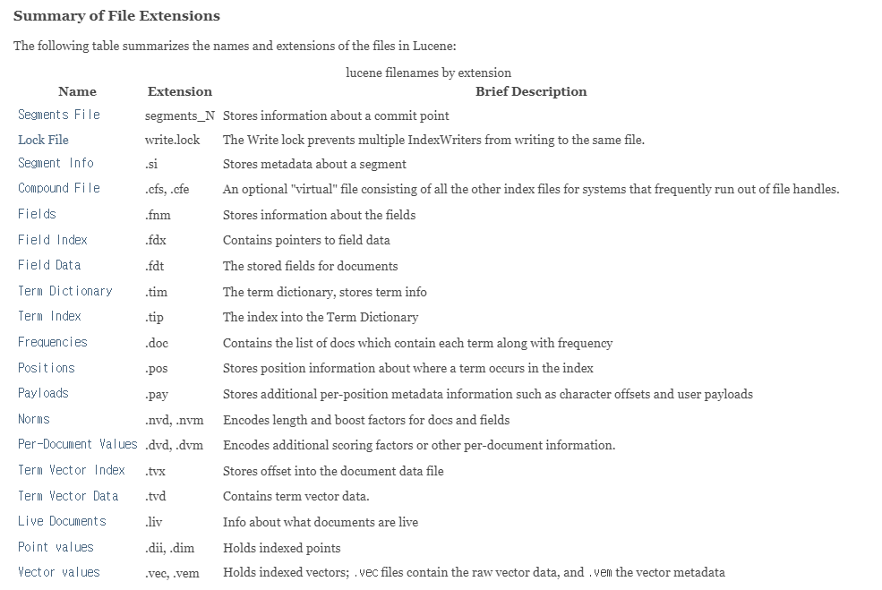

# 검색 엔진 개요

- 검색 엔진(search engine)의 정의
  - 웹에 존재하는 많은 양의 정보 중에서 사용자가 원하는 정보만을 여러 웹 사이트나 웹 페이지 등에서 검색해주는 시스템이나 프로그램을 통틀어 검색 엔진이라 부른다.
  - 검색 엔진은 사용자가 원하는 정보를 웹에서 찾는데 걸리는 시간을 최소화할 수 있게 도와준다.


- 검색 엔진 현황
  - 국내의 검색 엔진
    - 와이즈넛, 코난테크놀로지, 솔트룩스의 3파전 양상
    - 와이즈넛이 가장 유명하지만 그렇다고 기술력이 가장 뛰어난 업체라는 것은 아니다.
  - 오픈소스 검색 엔진
    - 루신, 솔라, 엘라스틱서치 등이 대표적인 오픈소스 검색엔진이다.
    - 솔라와 엘라스틱서치는 모두 루씬을 기반으로 만들어졌다.
  - 검색 엔진은 협업 없이는 만드는 것이 불가능에 가깝다.
    - 검색 엔진은 기본적으로 형태소 분석기, 색인, 검색 기능이 존재해야 한다.
    - 색인, 검색 기능은 혼자 구현할 수 있겠으나 형태소 분석은 혼자 개발하는 것이 불가능하다.
    - 전문적으로 국내의 형태소를 배운 사람과의 협업이 필수적이다.
    - 따라서 개발할 엄두를 내기 힘들며 다른 오픈소스에 비해 검색 엔진 오픈소스는 수가 부족하다.


- 검색 엔진의 구동 원리
  - 형태소 분석기

    > https://aiopen.etri.re.kr/demo_nlu.php
    >
    > https://www.shineware.co.kr/products/komoran/

    - 검색 엔진의 필수적인 3 가지 기능(형태소 분석, 색인, 검색) 중 가장 어려운 것이 형태소 분석기이다.
    - 사전을 기반으로 만든다고 하더라도 사전을 전부 순회하며 찾는다면 시간이 오래 걸릴 것이다.
    - 또한 신조어는 찾을 수 없는 문제가 발생한다.

  - 색인

    - 형태소 분석기를 돌린 결과를 토대로 데이터를 빠르게 찾기 위해서 색인을 활용해야 한다.
    - 색인을 쓰지 않으면, 모든 데이터를 일일히 찾는 엔진이 될 것이다.
    - 일반적으로 색인은 단어와 레코드 주소를 Key, Value로 묶어서 저장하는 구조를 가진다. 이를 역 색인(Inverted Indexing)이라 부른다.

  - 검색

    - 검색은 사용자의 질의(Query)를 분석하여 원하는 결과를 찾아주는 데 여기서 형태소 분석기를 마찬가지로 활용하게 된다.


# 엘라스틱 서치 개요

- 엘라스틱 서치란
  - 오픈 소스 검색 엔진
    - 2021년 AWS와의 분쟁으로 Elasticsearch가 license를 변경하면서 오픈 소스가 아니게 되었다.
    - 그러나 2024년 8월 30일 [다시 오픈 소스](https://www.elastic.co/kr/blog/elasticsearch-is-open-source-again)화 하겠다고 발표했다.
  - 역사
    - 2004년 샤이 배논이 요리 공부를 시작한 아내를 위해 레시피 검색 프로그램을 만드려 함.
    - 아파치 루씬을 적용하려던 중 루씬이 가진 한계를 보완하기 위해 새로운 검색엔진을 만들기 위한 프로젝트를 시작, Compass라는 이름의 오픈소스 검색 엔진을 개발함.
    - 2010년 Compass에서 Elasticsearch라고 이름을 바꾸고 프로젝트를 오픈소스로 공개.
    - 2012년에 창시자 샤이 배논과 함께 스티븐 셔르만, 우리 보네스 그리고 아파치 루씬 커미터인 사이먼 윌너 4인이 네델란드 암스텔담에서 회사를 설립 설립.
    - 현재는 주 본사인 네덜란드 암스테르담과 캘리포니아 마운틴 뷰를 비롯한 전 세계에 직원들이 분포되어 있다.
    - Logstash, Kibana와 함께 사용 되면서 한동안 ELK Stack (Elasticsearch, Logstash, Kibana) 이라고 널리 알려지게 된 Elastic은 2013년에 Logstash, Kibana 프로젝트를 정식으로 흡수.
    - 2015년에는 회사명을 Elasticsearch 에서 Elastic으로 변경 하고, ELK Stack 대신 제품명을 Elastic Stack이라고 정식으로 명명하면서 모니터링, 클라우드 서비스, 머신러닝 등의 기능을 계속해서 개발, 확장 하고 있다.
    - 창시자인 샤이 배논은 트위터와 공식 아이디로 kimchy 를 사용하고 있는데, 2000년대 초반 한국에서 생활한 적이 있어 김치를 좋아한다고도 이야기 하고 있고, 또 Kimchy는 샤이 배논의 어머니 성씨이기도 하다.
    - 샤이 배논은 동양 문화에 관심이 많으며 Elasticsearch 첫 로고는 소나무 분재였고 샤이 배논의 블로그에는 지금도 용(竜) 한자가 메인 로고로 있다.


- Lucene

  - 오픈소스 기반의 검색 라이브러리.
  - 색인, 검색, 형태소 분석 등 검색 엔진이 갖춰야 하는 기본 기능을 제공한다.

  - Lucene 기반의 대표적인 검색 엔진
    - Elasticsearch
    - Solr
  - Index, Document, Field, Term, Inverted Index 등 Lucene의 기본 개념은 elasticsearch에서도 그대로 사용된다.


- Index File Foramts

  > https://lucene.apache.org/core/9_1_0/core/org/apache/lucene/codecs/lucene91/package-summary.html#package.description

  - Segment File이라고도 한다.
  - Segment File은 여러 Index File Formats 중 하나이다.
  - Index File에는 아래와 같은 정보가 저장되어, 색인과 검색 시에 활용된다.
    - Field
    - Field Data
    - Term
    - Frequenciies Position
    - Delete Documents
  - file format의 종류

  


- 색인

  - IndexWriter가 Index File들을 생성하는 과정

    > IndexWriter의 [source code](https://github.com/apache/lucene/blob/d5d6dc079395c47cd6d12dcce3bcfdd2c7d9dc63/lucene/core/src/java/org/apache/lucene/index/IndexWriter.java)

  - 수정이 불가능한 Immutable Type

    - 수정, 삭제가 발생하면 실제로 수정, 삭제는 이루어지지 않고 새로운 Segments file을 생성한다.

  - 여러개로 생성된 Segments file들을 merge라는 작업을 통해 하나의 색인 파일로 만드는 과정이 필요하다.

  - 하나의 Index는 하나의 IndexWriter로 구성된다.

  - 색인 과정

  


- 검색

  - 색인이 IndexWriter를 통해 이루어진다면, 검색은 IndexSearcher를 통해 이루어진다.

    > IndexSearcher의 [source code](https://github.com/apache/lucene/blob/d5d6dc079395c47cd6d12dcce3bcfdd2c7d9dc63/lucene/core/src/java/org/apache/lucene/search/IndexSearcher.java)

  - 하나의 Index에는 Segment별로 N개의 LeafReader가 존재한다.

    - LeafReader가 여러 개로 나뉘어져 있는 각 Segment 정보를 읽어온다.

  - 검색의 흐름

    - IndexSearcher로 query가 들어온다.
    - IndexSearcher는 IndexLeader를 통해서 LeafReader의 list를 받아온다.
    - 각 LeafReader를 순회하면서 입력으로 받은 query를 통해 검색이 실행된다.
    - 각 LeafReader가 검색한 결과를 CollectorManager가 수집한다.
    - 수집된 결과를 정렬, 필요한 개수 만큼만 잘라낸 후 반환한다.


- 형태소 분석

  - 입력 받은 문자열을 검색 가능한 정보 구조로 분석 및 분해하는 과정

  - 아래와 같은 구성 요소로 이루어져 있다.
    - Analyzer
    - Tokenizer
    - CharFilter
    - TokenFilter

  - 형태소 분석 과정
    - Text가 입력된다.
    - CharFilter에서 불필요한 것들을 제거한다.
    - 그 결과물을 가지고 Tokenizer에서 Token들을 생성한다.
    - 생성된 Token들은 TokenFilter를 통해 filtering되고 최종 결과물이 된다.
  - 분석 결과에는 Position 결과와 Offest 정보가 나오게 된다.
    - Position은 0부터 시작해서 1씩 증가하는 구조를 가진다.
    - Offset은 Token의 start와 end에 대한 정보를 가지고 있다.
    - End offset은 실제보다 1 크게 추출되는데, 이는 lucene 내부에서 `substring()`을 사용하기 때문이다.
  - 추출된 Token, Position, Offset 정보를 포함하여 Term이라 하고, 이를 사용하여 highlight와 동의어에 활용한다.


- 엘라스틱 서치를 사용해야하는 이유
  - 엘라스틱 서치가 최고의 솔루션이라는 환상에서 벗어나는 것이 좋다.
    - 물론 상용 검색엔진을 비용, 기술적 문제로 다루기 힘든 사람에게는 최고의 선택이 될 수 있을 것이다.
  - 데이터베이스 대용으로 사용 가능하다.
    - NoSQL처럼 사용 가능하다.
  - 대량의 비정형 데이터 보관 및 검색 가능
    - 기존 데이터베이스로 처리하기 어려운 대량의 비정형 데이터 검색이 가능하며, 전문 검색(Full-Text Search)과 구조 검색 모두를 지원한다.
    - 기본적으로는 검색엔진이지만 MongoDB나 Hbase처럼 대용량 스토리지로 사용도 가능하다.
  - 통계 분석
    - 비정형 로그 데이터를 수집하고 한 곳에 모아서 통계 분석이 가능하다.
    - 키바나(엘라스틱 스택의 하나)를 이용하면 시각화 또한 가능하다.
  - 멀티 테넌시(Multi-tenancy)
    - 엘라스틱서치에서 인덱스는 관계형 DB의 데이터베이스와 같은 개념임에도 불구하고, 서로 다른 인덱스에서도 검색할 필드명만 같으면 여러 개의 인덱스를 한번에 조회할 수 있다.
  - Schemaless
    - 엘라스틱 서치는 JSON 구조를 사용하여 기존의 RDMS와 같은 엄격한 구조를 적용하지 않는다.
    - 비정형 데이터는 비구조적이며, 스키마가 다이나믹하게 변할 수 있다.
    - 전통적인 관계형 구조로 구성할 경우 프로젝트 막바지에 모든 스키마를 변경하고, 데이터를 다시 구성하는 문제에 봉착할 수 있는데 JSON 구조는 이런 문제들을 사전에 막을 수 있다.
  - 문서지향
    - 여러 계층의 데이터를 JSON 형식의 구조화된 문서로 인덱스에 저장 가능하다. 
    - 계층 구조로 문서도 한 번의 쿼리로 쉽게 조회 가능하다.
  - 데이터 공간을 절약할 수 있다.
    - 컬럼을 동적으로 정의하여, 필요한 데이터만 넣게 되어 데이터 공간 및 CPU 사용량, 네트워크 트래픽도 줄일 수 있는 효과를 볼 수 있다.
    - 컬럼이 동적으로 정의되지 않을 경우, 예를 들어 데이터 a, b, c가 있을 때, c만 color라는 컬럼을 가진다면, a, b는 굳이 color에 null이라는 데이터를 추가해줘야 한다. 
  - 검색 능력
    - 기본적인 검색 기능뿐만 아니라 Full-text search(전문 검색 엔진)라는 강력한 기능을 탑재하고 있다.
    - Full-text search: 모든 데이터를 역파일 색인 구조로 저장하여 가공된 텍스트를 검색하는 것.
  - 분석
    - 엘라스틱서치를 탑재한 사이트에 접속하는 사람들의 OS가 무엇인지, 혹은 어느 나라에서 접속했는지 등을 알고 싶을 때 엘라스틱의 분석 기능을 사용하면 편리하게 알 수 있다.
  - 풍부한 API와 REST 지원
    - Python, Java, C#, JS 등 20개의 프로그래밍 언어를 지원한다.
    - 기본적으로 Elasticsearch는 REST API를 제공하여 REST API를 사용하는 모든 언어에서 HTTP 형식으로 사용할 수 있다.
  - 쉬운 작동, 쉬운 확장
    - single node instance로 작동을 하며, 수백개의 스케일 아웃을 쉽게 할 수 있다.
    - Elasticsearch는 대부분의 빅데이터 플랫폼들이 그러하듯 Vertical Scaling보다 Horizontal Scaling을 사용한다.
    - Vertical Scaling(수직 스케일링)은 단순히 말하자면 기존의 하드웨어를 보다 높은 사양으로 업그레이드하는 것을 말한다. 스케일업(Scale-up)이라고도 한다.
    - Horizontal Scaling(수평 스케일링)은 장비를 추가해서 확장하는 방식을 말한다. 스케일아웃(Scale-out)이라고도 한다.
  - Near real-time(근접 실시간)
    - 어떤 문서를 ES에 입력하면 해당 문서는 우선 메모리 공간에 저장된다.
    - 그리고 1초 후에 샤드라는 ES 데이터 저장 공간에 저장되고 이후에는 쿼리를 통해서 해당 문서를 검색할 수 있게 된다.
    - 준 실시간성은 `refresh_interval`이라는 파라미터로 설정할 수 있다.
  - Lightning-fast(빠른 속도)
    - 엘라스틱 서치는 루씬을 기반으로 만들어졌기에 단어 입력 후 문서를 찾는 속도가 다른 NoSQL들에 비해 매우 빠르다.
  - Fault-tolerant(내고장성)
    - 노드 실패시 replicate된 다른 노드에서 데이터를 가져오며, 네트워크 실패 시 다른 마스터 복제본으로 선택한다.


- 일반적인 일래스틱서치 사용 사례

  - 일레스틱서치를 기본 백엔드로 사용
    - 전통적으로 검색엔진은 빠른 연관 검색 기능을 제공하기 위해 안정된 데이터 저장소 위에 배포한다.
    - 과거에는 검색엔진이 내구성 있는 저장소(durable storage)나 통계 같은 필요한 기능들을 제공하지 않았기 때문이다.
    - 일래스틱서치는 내구성 있는 저장소와 통계, 데이터 저장소에서 기대하는 다른 많은 기능을 제공하는 최신 검색엔진 중 하나다.
  - 기존 시스템에 엘라스틱서치 추가하기
    - 엘라스틱서치를 데이터 저장소로서는 사용하지 않고 오직 검색기능만을 위해서 사용
    - 기존의 데이터베이스와 엘라스틱서치를 동기화해서 사용한다.

  - 기존 시스템의 벡엔드로 일레스틱서치 사용하기
    - 일래스틱서치는 오픈소스이고 쉬운 HTTP 인터페이스를 제공하기에 큰 에코시스템을 가지고 있다.
    - 일래스특서치에 읽고 쓸 수 있는 도구들이 이미 이용 가능해서, 원하는 방식으로 동작하도록 도구를 설정하는 것 외에는 별도의 개발이 필요가 없다.


- DB의 SQL과 엘라스틱 서치
  - DB의 SQL로도 데이터 검색이 가능하다.
  - 그럼에도 검색 엔진이 필요한 이유는 다음과 같다.
    - RDBMS는 단순 텍스트 매칭에 대한 검색만을 제공한다(MySQL 최신 버전에서는 n-gram 기반의 Full-text 검색을 지원하지만, 한글 검색은 아직 많이 빈약하다).
    - 텍스트를 여러 단어로 변형하거나 텍스트의 특질을 이용한 동의어나 유의어를 활용한 검색이 가능
    - 엘라스틱 서치 등의 검색엔진에서는 RDBMS에서는 불가능한 비정형 데이터의 색인과 검색이 가능
    - 엘라스틱 서치 등의 검색엔진에서는 형태소 분석을 통한 자연어 처리가 가능
    - 역색인 지원으로 매우 빠른 검색이 가능
  - RDBMS와 엘라스틱서치의 가장 큰 차이 중 하나는 데이터를 CRUD하는 방식이다.
    - RDBMS의 경우 DB를 서버와 연결하여 SQL을 날리는 방식을 사용한다.
    - 엘라스틱서치의 경우 RESTful API라는 방식을 이용한다.
    - 또한 엘라스틱서치의 POST 즉, 데이터 삽입의 경우에는 관계형 데이터베이스와 약간 다른 특성을 갖고 있는데, 스키마가 미리 정의되어 있지 않더라도, **자동으로 필드를 생성하고 저장**한다는 점이다. 이러한 특성은 큰 유연성을 제공하지만 선호되는 방법은 아니다.


- 엘라스틱서치의 약점
  - 실시간(Real Time) 처리는 불가능하다.
    - 엘라스틱서치의 데이터 색인의 특징 때문에 엘라스틱서치의 색인된 데이터는 1초 뒤에나 검색이 가능하다. 
    - 색인된 데이터가 내부적으로 커밋(Commit)과 플러시(Flush)와 같은 과정을 거치기 때문. 
    - 그래서 엘라스틱서치 공식 홈페이지에서도 NRT(Near Real Time)라는 표현을 쓴다.
  - 트랜잭션(Transaction) 롤백(Rollback) 등의 기능을 제공하지 않는다.
    - 분산 시스템 구성의 특징 때문에, 시스템적으로 비용 소모가 큰 롤백, 트랜잭션을 지원하지 않는다. 
    - 그러므로 데이터 관리에 유의해야 한다.
  - 진정한 의미의 업데이트(Update)를 지원하지 않는다.
    - 업데이트 명령이 존재는 한다.
    - 그러나 실제로는 데이터를 삭제했다가 다시 만드는 과정으로 업데이트된다. 
    - 이러한 특성은 나중에 불변성(Immutable)이라는 이점을 제공하기도 한다.


- Elasticsearch가 근실시간(Near Real Time) 검색을 제공하는 이유

  - Lucene의 segment의 기본적인 동작 방식
    - Lucene은 segment들을 관리하기 위해서 Commit Point라는 자료구조를 사용한다.
    - Commit Point는 여러 세그먼트의 목록을 저장하고 있으며, 검색시에 이를 활용하여 가장 오래된 segment부터 모든 segment를 차례로 검색한 후 결과를 합쳐 제공한다.
    - 색인 요청이 들어올 경우 Lucene의 `IndexWrite`에 의해 색인이 실행되는데, 그 결과로 새로운 segment가 생성되고, Commit Point에 기록된다.
    - 색인 횟수가 증가할 수록 segment의 개수도 증가하므로 검색시 읽기 성능이 저하될 수 있다.
    - 따라서 Lucene은 background에서 주기적으로 segment들을 병합하는 작업을 수행한다.
    - 이런 복잡한 과정을 거쳐야 함에도 색인 할 때마다 segment를 추가하는 식으로 구현한 이유는, segment가 수정이 불가능하기 때문이다.
  - Segment 불변성(immutability)
    - Lucene의 segment는 한 번 생성되면 이후에 해당 segment에는 data를 추가, 삭제, 수정이 불가능해진다.
    - Segment가 불변성을 가짐으로써 아래와 같은 이점이 생긴다.
    - 불변성이 보장된다면 동시성 문제를 회피할 수 있다. 다수의 스레드가 동작하는 환경에서도 수정만 불가능 하다면 Lock이 필요 없어진다.
    - 시스템 cache를 활용할 수 있다. OS kernel에서 제공하는 system cache에 data가 한 번 생성되면, data가 변경되지 않을 경우 일정 시간 동안은 그대로 유지된다.
    - 높은 cache 적중률을 유지할 수 있다.
  - Segment 불변성의 단점과 보완 방법
    - 일부 데이터가 변경되더라도 전체 역색인 구조를 다시 만들어야하며, 실시간 반영도 어렵다는 단점이 있다.
    - 이를 보완하기 위해 Lucene은 다수의 segment를 생성해서 제공하는 방식을 택했다.
    - 즉 변경이 일어날 때 마다 세그먼트를 다시 만드는 것이 아니라 기존 세그먼트는 그대로 두고 추가로 세그먼트를 생성하는 방식을 택했다.
  - Segment 불변성과 업데이트
    - 수정 연산이 발생하면 segment의 불변성을 유지하기 위해 해당 data를 삭제한 후 다시 추가하는 방식으로 동작한다.
    - 기존 데이터는 삭제 처리되어 검색 대상에서 제외되고 변경된 데이터는 새로운 세그먼트로 추가되어 검색 대상에 포함된다.
    - 삭제 연산도 마찬가지로 실제 삭제는 하지 않고 문서 내부에 있는 삭제 여부를 표시하는 비트 배열을 수정하여 삭제 표시를 한다.
    - 검색시에는 비트 배열에 삭제 표시가 되어 있는 문서는 검색 대상에서 제외시킨다.
    - 실제 삭제는 merge가 수행될 때 이루어진다.

  


## 주요 기능

- 관련 결과 보장
  - 관련성 점수(relevancy score)
    - 특정 키워드가 포함 된 데이터들 중 정말 해당 키워드와 관련 있는 데이터를 가져오기 위해 관련성 점수를 계산한다.
    - 관련성 점수는 검색 조건과 일치하는 각각의 데이터에 할당된 점수이고 데이터가 얼마나 조건과 관련성이 있는지를 나타낸다.
  - 기본적으로 문서의 관련성을 평가하는 알고리즘은 **tf-idf**이다.
    - tf-idf는 단어 빈도, 역 문서 빈도를 나타내며, 관련성 점수에 영향을 주는 두 요소다.
    - 단어 빈도(term frequency): 데이터에서 찾고자 하는 단어가 많이 나올수록 높은 점수를 준다.
    - 역 문서 빈도(inverse document frequency): 다른 데이터들에서 흔치 않은 단어면 높은 가중치를 준다.
    - 예를 들어 사과 축제를 찾는다면 상대적으로 흔하지 않은 단어인 축제가 사과보다 가중치가 높다.


- 완전 일치를 뛰어넘은 검색

  - 오타 처리
    - 정확히 일치하는 것만 찾는 대신 변형된 것들을 찾게 할 수 있다.
    - 퍼지(fuzzy) 질의를 사용하면 바나나에 대한 데이터를 찾을 때 바나너로도 검색할 수 있다.
  - 파생어 지원
    - 분석(analysis)을 사용하면 일래스틱서치가 사과라는 키워드를 검색할 때 apple, apples를 포함하여 검색하도록 할 수 있다.
  - 통계 사용
    - 사용자가 무엇을 검색할지 모를 때, 몇 가지 방법으로 도울 수 있다. 그 중 하나가 집계(aggregation)이다.
    - 집계는 질의의 결과로 수치들을 얻는 방법이다.
    - 얼마나 많은 주제가 범주별로 나뉘는지 또는 범주별로 좋아요와 공유의 숫자가 얼마인지와 같은 수치들을 얻을 수 있다.

  - 제안 제공
    - 사용자가 키워드를 입력할 때 인기 있는 검색 결과를 찾도록 도울 수 있다.
    - 와일드카드, 정규표현식 같은 특별한 질의 형태를 사용해서 입력했을 때 인기 있는 결과를 보여줄 수도 있다.


## 엘라스틱서치의 데이터 구조

- 엘라스틱서치 기본 개념
  - 클러스터
    - 여러 대의 컴퓨터 혹은 구성 요소들을 논리적으로 결합하여 전체를 하나의 컴퓨터 혹은 구성 요소처럼 사용할 수 있게 해주는 기술.
    - 엘라스틱서치에서 가장 큰 시스템 단위
    - 최소 하나 이상의 노드로 이루어진 노드들의 집합
    - 서로 다른 클러스터는 데이터의 접근, 교환을 할 수 없는 독립적인 시스템으로 유지된다.
    - 여러 대의 서버가 하나의 클러스터를 구성할 수 있고, 한 서버에 여러 개의 클러스터가 존재할 수도 있다.
    - 클러스터로 구성하면 높은 수준의 안정성을 얻을 수 있고 부하를 분산시킬 수 있다.
  - 노드
    - 엘라스틱서치를 구성하는 하나의 단위 프로세스
    - 역할에 따라 Master-eilgible, Data, Ingest, Tribe 노드로 구분할 수 있다.
    - Master-eilgible node: 클러스터를 제어하는 마스터 노드로 선택할 수 있는 노드
    - Master node: 인덱스 생성과 삭제, 클러스터 노드들의 추적과 관리, 데이터 입력 시 어느 샤드에 할당할 것인지를 결정하는 등의 역할을 수행한다.
    - Data node: 데이터와 관련된 CRUD 작업과 관련 있는 노드로, CPU, 메모리 등 자원을 많이 소모하므로 모니터링이 필요하며, master 노드와 분리되는 것이 좋다.
    - Ingest node: 데이터를 변환하는 등 사전 처리 파이프라인을 실행하는 역할을 한다.
    - Coordination only node: Master-eilgible node, Data node의 역할을 대신하는 노드로 대규모 클러스터에서 큰 이점이 있다.
    - 모든 노드는 매시 형태(모든 구성 요소가 논리적으로 연결되어 있어 다른 노드들과 직접적으로 통신할 수 있는 네트워크 형태)로 요청을 주고 받기 때문에 어떤 노드에서든 색인/검색 작업을 처리할 수 있으며 
    - 마스터 역할을 하는 서버만 요청을 처리할 수 있는 RDBMS와 달리 어떤 노드에서도 색인/검색 작업이 가능하기에 노드들 간의 부하 분산을 구현할 수 있다.
  - 인덱스
    - RDBMS의 database에 대응하는 개념.
    - 엘라스틱서치에만 존재하는 개념은 아니며, 분산 데이터베이스 시스템에도 존재하는 개념이다.
  - 샤딩(sharding)
    - 데이터를 분산해서 저장하는 방법
    - 엘라스틱서치에서 스케일 아웃을 위해 index를 여러 shard로 쪼갠 것.
    - 기본적으로 1개가 존재하며, 검색 성능 향상을 위해 클러스터의 샤드 개수를 조정하는 튜닝을 하기도 한다.
  - 복제본(replica)
    - 또 다른 형태의 shard.
    - 노드를 손실했을 경우 데이터의 신뢰성을 위해 샤드들을 복제하는 것.
    - 따라서 shard와 replica는 서로 다른 노드에 저장해야 한다.


- DB와 엘라스틱 서치의 용어 비교

  | DB           | 엘라스틱서치 |
  | ------------ | ------------ |
  | 데이터베이스 | 인덱스       |
  | 파티션       | 샤드         |
  | 테이블       | 타입         |
  | 행           | 문서         |
  | 열           | 필드         |
  | 스키마       | 매핑         |
  | SQL          | Query DSL    |


- 논리 배치와 물리 배치
  - 논리 배치
    - 검색 애플리케이션이 무엇을 알아야 하는가(즉, 검색 요청을 보내는 쪽에서 무엇을 알아야 하는가)
    - 색인과 검색을 위해 사용하는 단위는 문서이고, RDBMS의 행과 유사하다.
    - 타입은 테이블이 행을 포함하는 것과 유사하게 문서를 포함한다.
    - 마지막으로 하나 혹은 그 이상의 타입이 하나의 색인(index)에 존재한다(최신 버전에서는 `doc` 타입만 존재한다).
    - 색인은 가장 큰 컨테이너이며 SQL 세계의 DB와 유사하다.
  - 물리 배치
    - 엘라스틱서치가 뒷단에서 어떻게 데이터를 다루는가(즉, 검색 요청을 받는 쪽은엘 어떻게 데이터를 다루는가)
    - 엘라스틱서치는 각 색인을 샤드로 나눈다.
    - 샤드는 클러스터를 구성하는 서버 간에 이동할 수 있다.
    - 보통 애플리케이션(프론트)은 서버의 개수와 무관하게 엘레스틱서치와 동작하기에 이것에 대해서 상관하지 않는다.
    - 그러나 클러스터를 관리할 때는 물리적으로 배치하는 방식이 성능과 확장성 가용성을 결정하기 때문에 관심을 가진다.


- 색인의 생성과 검색
  - 색인의 생성
    - 문서 ID의 해시값을 기반으로 주 샤드 중 하나를 선택하고, 해당 주 샤드에 문서를 색인한다.
    - 그 후 해당 문서는 주 샤드의 모든 복제(replica)에 색인된다.
  - 색인 검색
    - 색인을 검색할 때 엘라스틱서치는 해당 색인의 전체 샤드를 찾는다.
    - 엘라스틱서치는 검색하려는 색인의 주 샤드와 레플리카 샤드로 검색 경로를 분리한다.


- 분산 색인과 검색
  - 색인
    - 색인 요청을 받은 엘라스틱서치 노드는 우선 문서를 색인할 샤드를 선택한다.
    - 기본적으로 문서는 샤드에 골고루 분산된다.
    - 각 문서가 색인 될 샤드는 문자열로 이루어진 문서의 ID를 해싱해서 결정한다.
    - 각 샤드는 동등하게 새로운 문서를 받을 기회와 함께 동등한 해시 범위를 갖는다.
    - 대상 샤드가 결정되면 현재 노드는 샤드를 소유한 노드로 문서를 전달한다.
    - 해당 샤드의 복제 샤드에 색인 작업을 진행한다.
    - 색인 명령은 모든 가능한 레플리카가 문서를 색인한 후 색인에 성공했다는 결과값을 반환한다.
  - 검색
    - 검색 요청을 받은 노드는 모든 샤드에 요청을 전달한다.
    - 라운드 로빈을 사용해서, 엘라스틱서치는 이용 가능한 주 혹은 레플리카 샤드를 선택하고 검색 요청을 전달한다.
    - 엘라스틱서치는 샤드들로부터 결과를 모아서, 하나의 응답으로 집계 후에 클라이언트 애플리케이션에 응답을 전달한다.


# 엘라스틱서치 기본 개념

- seqeunce number와 primary term
  - primary term에는 primary shard에 대한 정보가 담겨 있다.
  - ES는 비동기적이고 동시적으로 동작한다.
    - 따라서 두 개의 요청이 순서 없이 목적지에 도착하게 된다.
    - 그러므로 이전 버전의 요청이 새 버전의 요청을 덮어쓰지 않도록 하는 방법이 필요하다.
    - 예를 들어 동일한 문서에 거의 동시에 각기 다른 수정 요청을 보낼 경우, 이후에 보낸 요청이 최신 요청일 것이다.
    - 그런데 최신 요청이 먼저 도착하고 그 이후에 이전 요청이 도착한다면 문서는 최신 요청을 반영하지 못하는 상태가 된다.
    - 이럴 때 사용하는 것이 바로 seqeunce number이다.
  - 문서에 수행하는 모든 작업에는 해당 변경 사항을 조정하는 기본 샤드에 의해 seqeunce number가 할당된다.
    - seqeunce number는 각 작업마다 증가하므로, 최신 작업은 이전 작업보다 더 높은 시퀀스 번호를 갖는 것이 보장된다.
    - ES는 이 seqeunce number를 사용하여 처리 순서를 결정한다.
  - search API에서 `seq_no_primary_term`를 true로 설정하면 두 값을 확인 가능하다.


## 클러스터와 노드

- 클러스터

  - 여러 대의 컴퓨터에 구성 요소들을 논리적으로 결합하여 전체를 하나의 컴퓨터 혹은 구성 요소처럼 사용할 수 있게 해주는 기술
    - Elasticsearch 클러스터 역시 여러 개의 Elasticsearch 프로세스들을 논리적으로 결합하여 하나의 Elasticsearch 프로세스처럼 사용할 수 있게 해준다.
    - 이 때 클러스터를 구성하는 각각의 Elasticsearch 프로세스를 노드라 부른다.
  - 즉 여러 개의 Elasticsearch 노드를 마치 하나의 Elasticsearch처럼 동작하게 하는 것이 Elasticsearch 클러스터라고 할 수 있다.
    - 각각의 노드가 마치 하나의 Elasticsearch처럼 동작하기 때문에 클러스터를 구성하고 있는 노드 중 어느 노드에 API를 요청해도 동일한 응답고 동작을 보장받을 수 있다.
    - 또한 ES 클러스터는 노드가 하나 밖에 없어도 단일 노드로 구성된 클러스터로 동작한다.
    - 그러나 일반적으로 둘 이상의 노드를 이용해서 클러스터를 구성하며, 사용자의 요청을 클러스터 단위로 처리한다.
  - 클러스터를 단일 노드로 구성하지 않는 이유
    - 단일 노드로 클러스터를 구성했을 때 해당 노드에 장애가 발생하면 ES 클러스터에 접근할 수 없는 요청 불가 상태가 된다.
    - 반면 다수의 노드로 클러스터를 구성하면 하나의 노드에 장애가 발생해도 다른 노드에 요청할 수 있기 때문에 안정적으로 클러스터를 유지할 수 있고 이를 통해 높은 수준의 안정성을 보장할 수 있다.
  - 다수의 노드로 구성된 ES 클러스터는 고유의 클러스터 이름과 UUID(Universally Unique Identifier)를 가진다.
    - 이 두 가지 고유한 속성을 통해 클러스터 내에 속한 노드들이 서로 동일한 클러스터 내에 있음을 인식하고 클러스터링된다.
    - 새로운 노드를 클러스터에 추가하기 위해서는 같은 이름을 사용해야 한다.
    - 만약 이름이 다른 노드가 클러스터에 합류하려고 하면 에러가 발생한다.
  - curl 명령을 이용해서 각 노드에서 해당 노드가 속한 클러스터의 정보를 확인할 수 있다.

  ```bash
  $ curl 'localhost:9200'
  ```

  - 응답

  ```json
  {
    // 현재 요청에 응답한 노드의 이름
    "name" : "DESKTOP-1QEH5L8",
    // 클러스터의 이름
    "cluster_name" : "elasticsearch",
    // 클러스터의 UUID
    "cluster_uuid" : "l4A2AiJsQsmGL4vDe4X6HA",
    "version" : {
      "number" : "7.11.2",
      "build_flavor" : "default",
      "build_type" : "zip",
      "build_hash" : "3e5a16cfec50876d20ea77b075070932c6464c7d",
      "build_date" : "2021-03-06T05:54:38.141101Z",
      "build_snapshot" : false,
      "lucene_version" : "8.7.0",
      "minimum_wire_compatibility_version" : "6.8.0",
      "minimum_index_compatibility_version" : "6.0.0-beta1"
    },
    "tagline" : "You Know, for Search"
  }
  ```


- 노드

  - 클러스터를 구성하는 논리적인 ES 프로세스 하나를 의미한다.
  
  - 노드도 클러스터와 마찬가지로 각각의 고유한 노드 이름과 UUID가 있다.
  
  - 역할에 따라 여러 노드로 구분할 수 있다.
    
    > 전체 역할은 part10 참고
    
    - 각각 하나의 역할만 하는 것이 아니라 한 번에 여러 개의 역할을 할 수 있다.
  
  | 노드 역할               | 설명                                                         |
  | ----------------------- | ------------------------------------------------------------ |
  | 마스터(Master-eligible) | 클러스터 구성에 중심이 되는 노드. 클러스터의 상태 등 메타데이터를 관리한다. |
  | 데이터(Data)            | 사용자의 문서를 실제로 저장하는 노드                         |
  | 인제스트(Ingest)        | 사용자의 문서가 저장되기 전 문서 내용을 사전에 처리하는 노드 |
  | 코디네이트(Coordinate)  | 사용자의 요청을 데이터 노드로 전달하고, 다시 데이터 노드로부터 결과를 취합하는 노드 |
  
  - 마스터 노드
    - 클러스터의 메타데이터를 관리하는 역할.
    - 반드시 한 대 이상으로 구성되어야 한다.
    - 그러나 실제 마스터 역할을 하는 노드는 하나뿐이다. 나머지는 마스터 노드에 장애가 발생했을 때 새로운 마스터가 될 수 있는 마스터 후보 노드가 된다.
    - 마스터 후보 노드들은 마스터 노드로부터 지속적으로 클러스터 운영에 필요한 데이터를 전달받기 때문에 항상 같은 메타데이터를 유지하고 있기에 새로운 마스터 노드가 선출되어도 중단 없이 서비스를 이어갈 수 있다.
    - 클러스터 내의 모든 노드는 현재 노드의 상태, 성능 정보, 자신이 가지고 있는 샤드의 정보를 마스터 노드에 알린다.
    - 마스터 노드는 이런 정보들을 수집하고 관리하면서 클러스터의 안정성을 확보하기 위해 필요한 작업들을 진행한다.
    - 마스터노드는 클러스터 내의 모든 노드들로부터 받은 정보를 취합하여 각 노드들에 전파한다.
  - 데이터 노드
    - 사용자가 색인한 문서를 저장하고, 검색 요청을 처리해서 결과를 돌려주는 역할을 한다.
    - Index의 shard를 저장하는 역할을 한다.
    - CRUD, search, aggregation 등 data와 관련된 작업들을 처리한다.
    - 자신이 받은 요청 중 자신이 처리할 수 있는 요청은 직접 처리하고, 다른 데이터 노드들이 처리해야 할 요청은 해당 데이터 노드에 전달한다.
    - 어떤 데이터 노드로 요청을 전달할 것인지는 마스터 노드를 통해 받은 클러스터의 전체 상태 정보를 바탕으로 한다.
  - 인제스트 노드
    - 사용자가 색인하길 원하는 문서의 내용 중 변환이 필요한 부분을 사전에 처리한다.
    - 데이터 노드에 저장하기 전에 특정 필드의 값을 가공해야 할 경우 유용하다.
  - 코디네이트 노드
    - 실제 데이터를 저장하고 처리하지는 않지만, 사용자의 색인이나 검색 등 모든 요청을 데이터 노드에 전달하는 역할을 한다.
    - 문서를 저장하지 않는 데이터 노드라고도 생각할 수 있다.
    - 클라이언트 노드라고도 부른다.


## 인덱스와 타입

- 인덱스
  - 사용자의 데이터가 저장되는 논리적인 공간을 의미한다.
  - 인덱스의 이름은 클러스터 내에서 유일해야 한다.
  - 인덱스에 저장된 문서들은 데이터 노드들에 분산 저장된다.


- 타입
  - 인덱스 안의 데이터를 유형별로 논리적으로 나눠 놓은 공간을 의미한다.
  - ES 6.x 이후로는 단일 타입만을 허용하기에 큰 이슈가 없다면 _doc이라는 타입명을 사용한다.
  - 현재 _doc은 권고 사항이며, 추후에 _doc으로 고정될 예정이다.


- 멀티 타입
  - ES 5.x 이전
    - ES 6.x 이후의 버전은 하나의 인덱스에 하나의 타입만을 사용하도록 하고 있지만, 버전 5.x까지는 하나의 인덱스에 여러 개의 타입을 사용할 수 있었기에 인덱스 내에서 타입이 논리적으로 분리될 수 있었다.
  - 멀티 타입을 허용하지 않는 이유
    - 인덱스에 존재하는 서로 다른 타입에서 동일한 이름의 JSON 문서 필드를 만들 수 있어서 의도치 않은 검색 결과가 나타나는 문제가 발생했기 때문이다.
    - 예를들어 test라는 인덱스에 type1, type2라는 타입을 만들고 각 타입에 문서를 각각 하나씩 색인했다고 가정한다.
    - 만일 두 문서에 모두 name이라는 필드가 들어있었다고 하면, 두 문서는 서로 다른 타입이지만 색인된 JSON 문서에는 name이라는 같은 이름의 필드가 존재하게 된다.
    - 하필 두 필드의 이름도 같고 동일한 텀을 포함하고 있을 경우 의도와는 다른 타입의 문서도 검색되는 문제가 발생하게 된다. 


## 샤드와 세그먼트

- 샤드
  - 인덱스에 색인 되는 문서들이 저장되는 논리적인 공간을 의미한다.
    - ES는 인덱스를 샤드로 나누고 데이터 노드에 샤드를 할당한다. 그리고 각각의 샤드에 문서를 저장하는 방식으로 사용자의 데이터를 저장한다.
    - 하나의 인덱스는 1개 이상의 샤드로 구성된다. 
    - 만약 5개의 샤드로 구성된 인덱스라면 실제 문서들은 각각의 샤드에 나뉘어 저장된다.
  - 하나의 샤드는 샤드는 1개 이상의 세그먼트로 구성된다.
    - 샤드마다 세그먼트의 개수는 서로 다를 수 있다.


- 프라이머리 샤드와 레플리카 샤드

  - 프라이머리 샤드는 원본, 레플리카 샤드는 프라이머리 샤드의 복제본이다.
    - 레플리카 샤드는 프라이머리 샤드와 동일한 문서를 가지고 있기 때문에 사용자의 검색 요청에도 응답할 수 있다.
    - 따라서 레플리카 샤드를 늘리면 검색 요청에 대한 응답 속도를 높일 수 있다.
    - 만약 특정 샤드에 장애가 발생하여 해당 샤드에 접근할 수 없게 되거나, 문서가 유실되는 경우, 혹은 샤드에 문서가 정상적으로 저장되지 않는 경우에 발생할 수 있는 문제를 방지하기 위해 데이터를 한 벌 더 복제해서 레플리카 샤드를 만들어 데이터의 안정성을 보장한다.
  - 프라이머리 샤드와 레플리카 샤드는 각기 다른 곳에 저장된다.
    - 이를 통해 한 노드에 이상이 생겨도 다른 노드에 있는 레플리카 샤드를 통해 문서에 접근이 가능해진다.
    - 만일 기존의 프라이머리 샤드에 문제가 생길 경우 기존의 레플리카 샤드가 프라이머리 샤드로 승격되고, 새로운 레플리카 샤드가 다른 노드에 새롭게 생성된다.
    - 레플리카 샤드에 문제가 생깅 경우 다른 노드에 새로 생성되면서 복구가 진행된다.
  - 프라이머리 샤드는 최초 인덱스를 생성할 때 개수를 결정하는데, 이는 이후에 변경이 불가능하다.
    - 별도로 설정하지 않으면 ES 7.0부터는 1개, 이전에는 5개의 프라이머리 샤드가 생성된다.
  - 레플리카 샤드는 따로 설정하지 않으면 각 프라이머리 샤드 당 하나의 레플리카 샤드를 만드는 것이 기본 설정이다.
    - 프라이머리 샤드와 달리 레플리카 샤드는 인덱스를 생성한 이후에도 개수를 조정할 수 있다.
    - 기존 개수보다 줄이면 줄어든 만큼 기존의 레플리카 샤드를 삭제하며, 늘리면 늘어난 만큼 레플리카 샤드를 생성한다.

  ```json
  // PUT <index_name>/_settings
  {
      "index.number_of_shards":2,
      "index.number_of_replicas":5
  }
  ```

  - 문서를 색인할 때 문서를 저장할 프라이머리 샤드는 어떻게 결정되는가?
    - 문서에 할당된 id를 기준으로 ES에서 샤드 할당 해시 함수를 이용해 몇 번째 프라이머리 샤드에 저장할지 결정한다.
    - 이러한 알고리즘을 사용하기 때문에 프라이머리 샤드 번호는 0번부터 사용자가 지정한 샤드 개수-1까지의 번호를 부여받는다.
    - 예를 들어 프라이머리 샤드를 5개로 설정하였다면 샤드의 번호는 0, 1, 2, 3, 4로 5개가 생성된다.
    - 그리고 바로 이런 로직 때문에 인덱스 생성 후에는 프라이머리 샤드의 개수를 변경할 수 없는 것이다.
    - 만약 프라이머리 샤드의 개수를 변경한다면 지금까지 저장된 문서들의 프라이머리 샤드번호가 모두 변경되어야 하기 때문이다.
  - 샤드의 개수는 데이터의 안정성 측면 외에도 색인과 검색 기능의 성능 확보면에서도 중요하다.
    - 하나의 노드로 구성된 클러스터에서는 색인 또는 검색을 모두 한 노드가 수행해야 한다.
    - 반면 복수의 노드로 구성된 클러스터에서는 각각의 노드가 색인 또는 검색 요청을 분배하여 처리한다. 


- 세그먼트

  - 샤드의 데이터들을 가지고 있는 물리적인 파일을 의미한다.
    - 인덱스에 저장되는 문서는 해시 알고리즘에 의해 샤드들에 분산 저장되고 이 문서들은 실제로는 세그먼트라는 물리적 파일에 저장된다.
    - 그러나 문서가 처음부터 세그먼트에 저장되는 것은 아니다.
    - 색인 문서는 먼저 시스템 메모리 버퍼 캐시에 저장되는데 이 단계에서는 해당 문서가 검색되지 않는다.
    - 이후 ES의 refresh라는 과정을 거쳐야 디스크에 세그먼트 단위로 문서가 저장되고 해당 문서의 검색이 가능해진다.
  - 세그먼트는 불변(immutable)의 특성을 갖는다.
    - 기존에 기록한 데이터를 업데이트하지 않는다는 뜻이다.
    - 예를 들어 색인한 문서를 수정하거나 삭제 할 경우, 기존의 문서를 직접 수정하거나 삭제하지 않고 기존 문서는 불용 처리한다. 수정의 경우 그 후에 세그먼트에 업데이트 할 문서의 내용을 새롭게 쓴다.
    - 이 특성으로 인해 데이터의 일관성을 유지할 수 있다.

  - 세그먼트 병합
    - 세그먼트의 불변성으로 인해 시간이 지남에 따라 불용 처리한 데이터들에 의해 세그먼트의 크기가 커지게 되는 단점이 존재한다.
    - 이러한 단점을 보완하기 위해 ES는 백그라운드에서 세그먼트 병합을 진행한다.
    - 예를 들어 ID가 1, 2, 3인 문서가 각각 1, 2, 3번 세그먼트에 저장되었다고 가정했을 때
    - ID가 3인 문서를 삭제하면 3번 세그먼트에 해당 문서가 삭제되었다는 플래그를 기록하고 불용처리한다.
    - ID가 4인 문서가 4번 세그먼트에 저장된다.
    - 백그라운드에서 세그먼트 병합 작업이 발생하고 1~3번 세그먼트가 병합된다.
    - ID가 3인 문서는 삭제 플래그가 켜졌기 때문에, 병합하면서 해당 문서는 빼고 ID 1과 2인 문서만 하나의 세그먼트로 합친다.
    - 병합할 때 불용 처리한 데이터들은 실제로 디스크에서 삭제된다.
  - Segment 병합은 아래와 같이 이루어진다.
    - Lucene의 `IndexWriter`가 병합 대상 segment들의 복제를 생성한다.
    - `IndexWriter`가 복제한 segment들을 하나로 병합한다.
    - 복제한 segment들이 병합되는 동안 Lucene의 `IndexSearcher`는 원본 segment들을 읽어 검색 결과를 제공한다.
    - 병합 작업이 완료되면 원본 segment와 교체하고, 교체된 원본 segment들은 삭제한다.


## settings와 mappings

- settings와 mappings

  - 모든 인덱스는 settings와 mappings라는 두 개의 정보 단위를 가지고 있다.
  - 두 정보는 아래 명령어로 확인이 가능하다.

  ```http
  GET <index_name>?pretty
  ```

  - 응답

  ```json
  {
    "company" : {
      "aliases" : { },
      "mappings" : {
        "properties" : {
          "age" : {
            "type" : "text",
            "fields" : {
              "keyword" : {
                "type" : "keyword",
                "ignore_above" : 256
              }
            }
          },
          "name" : {
            "type" : "text",
            "fields" : {
              "keyword" : {
                "type" : "keyword",
                "ignore_above" : 256
              }
            }
          }
        }
      },
      "settings" : {
        "index" : {
          "routing" : {
            "allocation" : {
              "include" : {
                "_tier_preference" : "data_content"
              }
            }
          },
          "number_of_shards" : "1",
          "provided_name" : "company",
          "creation_date" : "1615954842889",
          "number_of_replicas" : "1",
          "uuid" : "1pzaio30TyWjj73m80dBQA",
          "version" : {
            "created" : "7110299"
          }
        }
      }
    }
  }
  ```

  - settings만 확인

  ```http
  GET <index_name>/_settings?pretty
  ```
  
  - mappings만 확인
  
  ```http
  GET <index_name>/_mappings?pretty
  ```


- settings

  - 아래와 같은 것들을 설정 가능하다.
    - 샤드의 수, 레플리카 샤드의 수
    - `refresh_interval`
    - 애널라이저, 토크나이저, 토큰 필터
  - 샤드의 수는 인덱스를 처음 생성할 때 한 번 지정하면 바꿀 수 없지만 레플리카 샤드의 수는 동적으로 변경이 가능하다.
    - 인덱스명 뒤에 _settings API로 접근해서 변경할 설정을 입력하면 변경이 가능하다.
  
  
  ```json
  // 레플리카 샤드의 수를 2개로 변경하는 명령어 
  // PUT <index_name>/_settings
  {
      "number_of_replicas":2
  }
  ```
  
  - `refresh_interval`: ES에서 세그먼트가 만들어지는 리프레시 타임을 설정하는 값으로 기본 값은 1초(1s)이다. 동적으로 변경이 가능하다.
  
  ```json
  # refresh_interval을 30초로 변경하는 명령어
  // PUT <index_name>/_settings
  {
      "refresh_interval":"30s"
  }
  ```
  
  - analyzer는 동적으로 추가가 불가능하다.


- mappings

  - ES에 저장될 JSON 문서들이 어떤 키와 어떤 형태의 값을 가지고 있는지 정의한 것이다.
    - 사용자가 색인한 문서의 다양한 필드들을 적절한 타입으로 스키마를 정의하는 것이 매핑이다.
    - 필드를 추가하는 것은 가능하지만 이미 만들어진 필드를 삭제하거나 필드의 타입 및 설정 값을 변경하는 것은 불가능하다.
  - 정적 매핑과 동적 매핑
    - 정적 매핑: 매핑 정보를 미리 정의해 놓고 사용.
    - 동적 매핑: 매핑 정보를 정의하지 않고 사용. 색인된 문서를 바탕으로 ES가 자동으로 매핑을 생성해주는 방식.
  
  - 매핑이 생성되면 이후부터 생성되는 문서는 기존 매핑 정보에 따라 색인되어야 한다.
    - 예를 들어 long 타입으로 매핑이 생성된 필드에 문자열 데이터가 들어오면 색인되지 않는다.
    - 그러나 아예 매핑이 생성된 필드를 입력하지 않거나 추가적인 필드를 입력하는 것은 가능하다.


- 정적 매핑

  - 매핑 미리 정의하기

    - 미리 인덱스의 매핑을 정의해 놓으면 정의해 놓은 매핑에 맞추어 데이터가 입력된다.
  
  ```json
  // PUT <index_name>
  {
      "mappings":{
          "properties":{
              "<field_name>":{
                  "type":"필드 타입"
                  // ...필드 설정
              }
          }
      }
  }
  ```
  
  - 미리 정의 된 매핑에 필드 추가하기
    
    - 당연히 기존 필드명과 추가할 필드명이 같으면 오류가 발생한다.
  
  ```json
  // PUT <index_name>/_mapping
  {
  	"properties":{
      	"<field_name>":{
        		"type":"<필드 타입>"
        		// ...필드 설정
      	}
    	}
  }'
  ```
  


- 동적 매핑

  - 인덱스에 기존 매핑에 정의되지 않은 필드를 지닌 도큐먼트가 입력되면 필드가 자동으로 추가 된다.
    - 동적 매핑으로 새로운 필드를 추가할 경우 기존 문서들에는 해당 필드가 추가되지 않는다.
  - 기존에 없던 rating 필드를 추가

  ```json
  // PUT <index_name>/_doc/1
  {
    "rating":4
  }
  ```
  
  - 확인
  
  ```http
  GET <index_name>/_mappings?pretty
  ```
  
  - 응답
      - rating 필드가 새로 추가 된 것을 확인 가능하다.
  
  ```json
  {
    "recipes" : {
      "mappings" : {
        "properties" : {
          "author" : {
            "type" : "text",
            "fields" : {
              "keyword" : {
                "type" : "keyword",
                "ignore_above" : 256
              }
            }
          },
          "created_date" : {
            "type" : "date"
          },
          "name" : {
            "type" : "text",
            "fields" : {
              "keyword" : {
                "type" : "keyword",
                "ignore_above" : 256
              }
            }
          },
          "pages" : {
            "type" : "long"
          },
          "rating" : {
            "type" : "long"
          }
        }
      }
    }
  }
  ```


# Elaistcsearch 설치하고 실행하기

> https://www.elastic.co/kr/downloads/elasticsearch

- tar 파일로 설치하기

  - 위 사이트에서 tar 파일을 다운 받은 후 압축을 푼다.

  - 압축을 풀면 아래와 같은 디렉터리가 생성된다.

    - bin: ES 실행을 위한 바이너리 파일들이 모여 있는 디렉터리.
    - config: 환결 설정을 위한 파일들이 모여 있는 디렉터리.
    - lib: ES 실행을 위한 외부 라이브러리들이 모여 있는 디렉터리, 확장자가 jar 형태인 자바 라이브러리 파일들이 모여 있으며 ES의 기본이 되는 루씬 라이브러리도 여기에 포함되어 있다.

    - logs: 디폴트 로그 저장 디렉터리.
    - modules: ES를 구성하고 있는 모듈들이 모여 있는 디렉터리.
    - plugins: 설치한 플러그인을 구성하고 있는 파일들이 모여 있는 디렉터리.

  - 이 외에도 RPM, DEB로도 설치가 가능하다.


- 실행하기

  - bin/elasticsearch.bat 파일을 실행하여 실행이 가능하다.
  - 아래 명령어를 통해서도 실행이 가능하다.

  ```bash
  # bin 디렉토리에서
  $ ./elasticsearch.bat
  ```

  - `-d` 옵션을 붙여서 데몬 형태로 실행하는 방법
  - 위 명령어는 포어그라운드 형태로 실행시킨 것으로, 터미널에서 다른 입력을 하지 못하는 상태이다.
    
  - `-d` 옵션은 백그라운드에서 동작하게 해준다.
  
  ```bash
  $ ./elasticsearch.bat -d
  ```


# 기본적인 데이터 처리

## 새로운 데이터 색인

- 삽입

  - curl을 활용하여 삽입
    - 파라미터로 들어간 `pretty` 또는 `pretty-true`는 JSON  응답을 더 보기 좋게 해준다.
    - `-H` 옵션은 header를 지정한다.
    - `-d` 옵션은 body를 지정한다.

  ```json
  // PUT <index_name>/_doc/1
  {
      "name":"foo",
      "age":"28"
  }
  ```
  
  - 응답
    - 응답은 색인, 타입, 색인한 문서의 ID를 포함한다.
  
  ```json
  {
    "_index" : "company",
    "_type" : "colleague",
    "_id" : "1",
    "_version" : 1,
    "result" : "created",  // 새로 생성한 것이므로 created로 뜨지만, 수정할 경우 updated라고 뜬다.
    "_shards" : {
      "total" : 2,
      "successful" : 1,
      "failed" : 0
    },
    "_seq_no" : 0,
    "_primary_term" : 1
  }
  ```
  
  - POST 메서드로도 추가가 가능하다.
    - 둘의 차이는 **POST의 경우 document_id를 입력하지 않아도 자동으로 생성**하지만 PUT은 자동으로 생성하지 않는다는 것이다.
  
  - 실수로 기존 도큐먼트가 덮어씌워지는 것을 방지하기 위해 입력 명령어에 `_doc` 대신 `_create`를 사용해서 새로운 도큐먼트의 입력만 허용하는 것이 가능하다.
    - 이 경우 이미 있는 도큐먼트id를 추가하려 할 경우 오류가 발생한다.
    - 이미 위에서 도큐먼트id가 1인 도큐먼트를 추가했으므로 아래 예시는 오류가 발생한다. 
  
  ```json
  PUT company/_create/1
  
  {
      "nickname":"foo",
      "message":"안녕하세요!"
  }
  ```


- 색인 과정

  


- 색인 생성과 매핑 이해하기(ES6부터는 하나의 인덱스에 하나의 타입만 저장할 수 있도록 변경)

  - 색인을 수동으로 생성하기
  
  ```http
  PUT <index_name>
  ```
  
  - 수동 생성의 응답
  
  ```json
  {
    "acknowledged" : true,
    "shards_acknowledged" : true,
    "index" : "test-index"
  }
  ```
  
  - 스키마 확인
    - 스키마를 보기 위해 url에 `_mapping`을 추가한다.
    - ES 6.x 이상의 경우 _doc타입이 아닌 타입을 따로 지정했을 경우 아래와 같이 `include_type_name=true` 또는 `include_type_name`을 파라미터로 넣어야 한다.
  
  ```http
  GET company/_mapping/colleague?include_type_name&pretty
  ```
  
  - 응답
    - 색인 명, 타입, 프로퍼티 목록, 프로퍼티 옵션 등의 데이터가 응답으로 넘어 온다.

  ```json
  {
    "company" : {
      "mappings" : {
        "colleague" : {
          "properties" : {
            "age" : {
              "type" : "text",
              "fields" : {
                "keyword" : {
                  "type" : "keyword",
                  "ignore_above" : 256
                }
              }
            },
            "name" : {
              "type" : "text",
              "fields" : {
                "keyword" : {
                  "type" : "keyword",
                  "ignore_above" : 256
                }
              }
            }
          }
        }
      }
    }
  }
  ```


- `op_type`

  - 색인하려는 문서가 이미 인덱스에 존재할 때의 동작을 정의할 수 있다.
  - `create`
    - 색인하려는 문서가 인덱스에 없을 경우에만 색인을 진행한다.
    - `_id` 필드를 기준으로 판단하며, 이미 존재할 경우 색인이 실패하게 된다.
    - `<인덱스명>/_create/<doc_id>`와 같이 보낼 경우 `op_type`은 `create`로 설정된다.
    
  - `index`
    - 색인하려는 문서가 이미 인덱스에 있으면 해당 문서를 업데이트한다.
    - 주의할 점은 지정한 field뿐 아니라 전체 문서를 변경한다는 점이다.
    - `<인덱스명>/_doc/<doc_id>`와 같이 보낼 경우 `op_type`은 `index`로 설정된다.
  
  
  ```http
  PUT my-index/_create/1
  
  # 위 명령어는 아래와 같다.
  PUT my-index/_doc/1?op_type=create
  ```
  
  - `update`
    - Document의 일부분만 update할 때 사용한다.
    - 반드시 document의 id와 `doc`에 update할 field들과 변경할 값 들을 넣어줘야한다.
  - `delete`
    - Document를 삭제할 때 사용하며, document의 id를 입력해야한다.
  
  - data stream의 경우  `op_type`이 `create`여야만 색인이 가능하다.
    - 따라서 `?op_type=create`와 같이 명시하거나 `_create` API를 사용해야 한다.
    - bulk의 경우에도 create라는 action을 명시해줘야한다.
  
  ```json
  # 단 건 색인
  // PUT my-data-stream/_create/1
  
  // bulk
  // my-data-stream/_bulk?refresh
  {"create":{ }}
  {"message": "Login attempt failed" }
  {"create":{ }}
  {"message": "Login successful" }
  {"create":{ }}
  {"message": "Logout successful" }
  ```


## 데이터 검색

- 검색하기

  - 검색을 위해 데이터를 더 추가

  ```json
  // PUT /company/colleague/2
  {
  	"name":"Kim",
  	"age":"26"
  }
  
  // PUT /colleague/3?pretty
  {
      "name":"Lee",
      "age":"27"
  }
  
  // PUT /colleague/4
  {
      "name":"An",
      "age":"27"
  }
  ```
  
  - 데이터 검색하기
    - `q`파라미터는 검색할 내용이 들어간다.
    - 특정 필드에서만 찾고자 할 때는 `q=name:Kim`과 같이 작성하면 된다.
    - 아래와 같이 필드를 지정해주지 않을 경우 `_all`이라는 모든 필드의 내용을 색인하는 필드가 자동으로 들어가게 된다.
    - `_source` 파라미터는 특정 필드만 반환되도록 한다(유사한 파라미터로 `stored_fileds`가 있다).
    - `size` 파라미터는 일치하는 데이터들 중 반환할 데이터의 수를 지정한다(기본값은 10이다).
  
  ```http
  GET /company/colleague/_search?q=Kim&_source=name&size=1
  ```


- 어디를 검색할지 설정하기

  - 다수의 타입에서 검색하기
    - url에서 타입을 콤마로 구분하여 검색하면 된다.
    - ES 6.X 부터 매핑 타입이 사라짐에 따라 쓸 일이 없는 기능이 되었다.

  ```http
  GET /company/colleague,department/_search?q=Kim&_source=name&size=1
  ```

  - 모든 타입에서 검색하기
    - 타입을 지정하지 않고 검색하면 된다.
    - 역시 ES 6.X 부터 매핑 타입이 사라짐에 따라 쓸 일이 없는 기능이 되었다.

  ```http
  GET /company/_search?q=Kim&_source=name&size=1
  ```

  - 다수의 색인을 검색하기
    - url에서 인덱스를 콤마로 구분하여 검색하면 된다.
    - 만일 검색하려는 색인이 없는 경우 에러가 발생하는데 에러를 무시하려면 `ignore_unavailable` 플래그를 주면 된다.

  ```http
  GET /company,fruits/_search?q=Kim&_source=name&size=1
  ```
  
  - 없는 인덱스도 포함해서 검색하기
  
  ```http
  GET /company,fruits/_search?q=Kim&_source=name&size=1&ignore_unavailable
  ```

  
  
  - 모든 색인을 검색하기
    - url의 색인이 올 자리에 `_all`을 입력하거나 아예 색인을 빼면 모든 색인에서 검색한다.
  
  ```http
  GET /_all/_search?q=Kim&_source=name&size=1
  
  # 위 요청은 아래와 같다.
  GET /_search?q=Kim&_source=name&size=1
  ```


- 응답 내용

  - 요청

  ```http
  HET /company/colleague/_search?q=Kim&_source=name&size=1
  ```

  - 응답

  ```json
  {
    // 요청이 얼마나 걸렸으며, 타임아웃이 발생했는가
    // took의 단위는 밀리초이다.
    "took" : 1,
    "timed_out" : false,
    // 몇 개의 샤드에 질의 했는가
    "_shards" : {
    "total" : 1,
      "successful" : 1,
      "skipped" : 0,
      "failed" : 0
    },
    "hits" : {
      // 일치하는 모든 문서에 대한 통계
      "total" : {
        "value" : 1,
        "relation" : "eq"
      },
      "max_score" : 0.6931471,
      // 결과 배열
      "hits" : [
        {
          "_index" : "company",
          "_type" : "colleague",
          "_id" : "2",
          "_score" : 0.6931471,
          "_source" : {
            "name" : "Kim"
          }
        }
      ]
    }
  }
  ```
  
  - 시간
    - `took` 필드는 ES가 요청을 처리하는 데 얼마나 걸렸는지 말해준다(단위는 밀리 초).
    - `timed_out` 필드는 검색이 타임아웃 되었는지 보여준다.
    - 기본적으로 검색은 절대로 타임아웃이 되지 않지만, 요청을 보낼 때`timeout` 파라미터를 함께 보내면 한계를 명시할 수 있다.
    - `$ curl "localhost:9200/_search?q=Kim&timeout=3s"`와 같이 작성할 경우 3초가 지나면 타임아웃이 발생하고 `timed_out`필드의 값은 true가 된다.
    - 타임아웃이 발생할 경우 타임아웃될 때까지의 결과만 반환된다.
  - 샤드
    - 총 몇 개의 샤드에 질의 했고 성공한 것과 스킵한 것, 실패한 것에 대한 정보를 반환한다.
    - 만일 특정 노드가 이용 불가 상태라 해당 노드의 샤드를 검색하지 못했다면 질의에 실패한 것이 된다.
  - 히트 통계
    - `total`은 전체 문서 중 일치하는 문서 수를 나타낸다.
    - `total`은 `size`를 몇으로 줬는지와 무관하게 일치하는 모든 문서의 수를 표시해주므로 total과 실제 반환 받은 문서의 수가 다를 수 있다.
    - `max_score`는 일치하는 문서들 중 최고 점수를 볼 수 있다.
  - 결과 문서
    - 히트 배열에 담겨 있다.
    - 일치하는 각 문서의 색인, 타입, ID, 점수 등의 정보를 보여준다.


- 쿼리로 검색하기

  - 지금까지는 URI 요청으로 검색했다.
    - 간단한 검색에는 좋지만 복잡한 검색에는 적절치 못한 방법이다.
  - `query_string` 쿼리 타입으로 검색하기
    - 쿼리스트링 타입의 쿼리를 실행하는 명령문이다.
    - `default_field`는 검색을 실행할 필드를 특정하기 위해 사용한다.
    - `default_operator`는 검색할 단어들이 모두 일치하는 문서를 찾을 지, 하나라도 일치하는 문서를 찾을지를 설정한다(기본값은 OR로 하나라도 일치하는 문서는 모두 찾는다).
    - 위 두 옵션(`default_field`, `default_operator`)을 다음과 같이 쿼리 스트링 자체에 설정하는 것도 가능하다.
    - `"query":"name:Kim AND name:Lee"`

  ```json
  // GET /company/colleague/_search
  {
      "query":{
      "query_string":{
            "query":"Kim",
            "default_field":"name",
            "default_operator":"AND"
          }
      }
  }
  ```
  
  - 응답
  
  ```json
  {
    "took" : 1,
    "timed_out" : false,
    "_shards" : {
      "total" : 1,
      "successful" : 1,
      "skipped" : 0,
      "failed" : 0
    },
    "hits" : {
      "total" : {
        "value" : 1,
        "relation" : "eq"
      },
      "max_score" : 0.6931471,
      "hits" : [
        {
          "_index" : "company",
          "_type" : "colleague",
          "_id" : "2",
          "_score" : 0.6931471,
          "_source" : {
            "name" : "Kim",
            "age" : "26"
          }
        }
      ]
    }
  }
  ```


- 필터 사용(ES 6.X 부터 사용 불가)

  - 필터는 결과에 점수를 반환하지 않는다.
    - 쿼리는 결과와 함께 각 결과의 점수를 반환한다.
    - 필터는 오직 키워드가 일치하는지만 판단하여 일치하는 값들을 반환한다.
  - 필터 검색

  ```json
  // /_search?pretty
  {
    "query":{
    	"filtered":{
    	  "filter":{
      	"term" :{
            "name":"Kim"
          }
    	  }
    	}    
    }
  }'
  ```


- ID로 문서 가져오기

  - 검색은 준실시간인데 반해 문서 ID로 문서를 찾는 것은 실시간이다.
  - 특정 문서를 가져오려면 문서가 속한 색인과 타입, 그리고 ID를 알아야 한다.
    - 그러나 타입은 현재 사라졌기 때문에 type 자리에 `_doc`을 입력하여 검색한다.
    - 타입을 입력해도 검색은 되지만 경고문이 뜬다.

  ```http
  GET /company/_doc/1
  
  // 타입 사용
  GET /company/colleague/1
  ```
  
  - 응답
    - 만일 찾는 문서가 존재하지 않으면 아래 `found`는 false가 된다.
  
  ```json
  {
    "_index" : "company",
    "_type" : "_doc",
    "_id" : "1",
    "_version" : 5,
    "_seq_no" : 5,
    "_primary_term" : 1,
    "found" : true,
    "_source" : {
      "name" : "Theo",
      "age" : "28"
    }
  }
  ```


## 데이터 수정, 삭제

- 삭제

  - 도큐먼트 또는 인덱스 단위의 삭제가 가능하다.
    - 도큐먼트를 삭제하면 `"result":"deleted"`가 반환된다.
    - 도큐먼트는 삭제되었지만 인덱스는 남아있는 경우, 삭제된 도큐먼트를 조회하려하면 `"found":false`가 반환된다.
    - 삭제된 인덱스의 도큐먼트를 조회하려고 할 경우(혹은 애초에 생성된 적 없는 도큐먼트를 조회할 경우) 에러가 반환된다.

  - 도큐먼트를 삭제하는 경우

  ```http
  DELETE office/_doc/1
  ```

  - 도큐먼트 삭제의 응답

  ```json
  {
      "_index": "office",
      "_type": "_doc",
      "_id": "1",
      "_version": 2,
      "result": "deleted",
      "_shards": {
          "total": 2,
          "successful": 1,
          "failed": 0
      },
      "_seq_no": 1,
      "_primary_term": 1
  }
  ```

  - 삭제된 도큐먼트를 조회

  ```http
  GET office/_doc/1
  ```

  - 삭제된 도큐먼트를 조회했을 경우의 응답

  ```json
  {
      "_index": "office",
      "_type": "_doc",
      "_id": "1",
      "found": false
  }
  ```

  - 인덱스를 삭제

  ```http
  DELETE office
  ```

  - 인덱스 삭제의 응답

  ```json
  {
      "acknowledged": true
  }
  ```

  - 삭제된 인덱스의 도큐먼트를 조회

  ```json
  GET office/_doc/1
  ```

  - 응답

  ```json
  {
      "error": {
          "root_cause": [
              {
                  "type": "index_not_found_exception",
                  "reason": "no such index [office]",
                  "resource.type": "index_expression",
                  "resource.id": "office",
                  "index_uuid": "_na_",
                  "index": "office"
              }
          ],
          "type": "index_not_found_exception",
          "reason": "no such index [office]",
          "resource.type": "index_expression",
          "resource.id": "office",
          "index_uuid": "_na_",
          "index": "office"
      },
      "status": 404
  }
  ```

  - 전체 도큐먼트 삭제하기
    - `_delete_by_query`를 이용하여 모든 도큐먼트가 매치되도록해서 삭제한다.

  ```json
  // POST <인덱스명>/_delete_by_query
  {
    "query": {
      "match_all": {}
    }
  }
  ```


- 수정

  - PUT method를 사용하여 문서 전체를 교체하는 방식과 `_update` API를 사용하여 일부 필드만 변경하는 방식이 있다.
  - 문서 색인

  ```json
  // PUT test/_doc/1
  {
    "name":"John Doe",
    "company":"Jeil"
  }
  ```

  - PUT method로 문서 전체를 교체

  ```json
  // PUT test/_doc/1
  {
      "foo":"bar",
      "baz":"qux"
  }
  ```

  - 확인
    - 완전히 새로운 문서로 교체된 것을 확인할 수 있다.
    - 이 경우에도 `_version`은 올라가게 된다.

  ```json
  // GET test/_doc/1
  {
      // ...
      "_version": 2,
      // ...
      "_source": {
          "foo": "bar",
          "baz":"qux"
        }
  }
  ```

  - `_update` API를 사용하여 일부 field만 변경
    - `_update` API를 사용할 경우, 이미 있는 필드면 해당 필드의 값을 변경하고, 없는 필드일 경우 필드를 추가한다.

  ```json
  // POST test/_update/1
  {
    "doc": {
      "foo":"barrr",
      "name":"Jim Carrey"
    }
  }
  ```

  - 확인
    - 이 경우에도 마찬가지로 `_version`이 올라간다.

  ```json
  // POST test/_update/1
  {
    "doc": {
      "foo":"barrr",
      "name":"Jim Carrey"
    }
  }
  ```

  - `script`로 update하는 것도 가능하다.

  ```json
  // POST test/_update/1
  {
    "script": {
      "source": "ctx._source.foo = params.new_value",
      "lang": "painless",
      "params": {
        "new_value": "baz"
      }
    }
  }
  ```

  - `upsert` 사용
    - `upsert`의 경우 만일 update하려는 document가 있을 경우 upsert에 script에 정의한 내용이 실행되고, 없을 경우 `upsert`에 정의한대로 새로운 문서가 생성된다.
    - 아래 예시의 경우 2번 문서는 생성한 적이 없으므로 `upsert`에 정의한대로 문서가 생성된다.

  ```json
  // POST test/_update/2
  {
    "script": {
      "source": "ctx._source.foo = params.new_value",
      "lang": "painless",
      "params": {
        "new_value": "baz"
      }
    },
    "upsert": {
      "foo":"bar"
    }
  }
  ```

  - 확인

  ```json
  // GET test/_doc/2
  {
      // ...
      "_source": {
          "foo": "bar"
        }
  }
  ```

  - 반면에 이미 있는 문서일 경우 sciprt의 내용이 실행된다.

  ```json
  // POST test/_update/2
  {
    "script": {
      "source": "ctx._source.foo = params.new_value",
      "lang": "painless",
      "params": {
        "new_value": "baz"
      }
    },
    "upsert": {
      "foo":"bar"
    }
  }
  ```

  - 확인

  ```json
  // GET test/_doc/2
  {
      // ...
      "_source": {
          "foo": "baz"
        }
  }
  ```

  - `scripted_upsert`
    - `scripted_upsert` 값을 true로 줄 경우, document가 없더라도 script를 실행한다.
    - 예를 들어 아래의 경우 3번 문서가 없으므로 일단 `upsert`가 실행되어 `foo:bar`가 색인되고, sciprt가 실행되어 `baz:qux`도 추가된다.

  ```json
  POST test/_update/3
  {
    "script": {
      "source": "ctx._source.baz = params.new_value",
      "lang": "painless",
      "params": {
        "new_value": "qux"
      }
    },
    "upsert": {
      "foo":"bar"
    },
    "scripted_upsert": true
  }
  ```

  - `doc_as_upsert`
    - 이 값을 true로 줄 경우 문서가 없을 경우 `doc`의 내용으로 새로운 문서를 생성한다.

  ```json
  POST test/_update/4
  {
    "doc": {
      "name": "John Doe"
    },
    "doc_as_upsert": true
  }
  ```


- Elasticsearch partial update VS index
  - 문서의 변경 사항을 반영해야 할 때, 전체 문서를 동일 index에 재색인 하는 방식과 변경된 부분만 재색인 하는 방식 중 어떤 방식이 더 효율적인가.
  - Test
    - 건당 2KB 정도의 작은 data 100만 건을 대상으로 테스트 한 결과이다.
    - 100만건의 문서를 부분 update할 경우 506.964초가 걸린다.
    - 100만건의 문서를 전체 재색인 할 경우 341.837초가 걸린다.
  - 대부분의 경우에서 partial update가 index보다 많은 시간이 걸리는 이유.
    - Partial update의 경우 먼저 기존 문서에서 변경된 부분을 적용하여 새로운 문서를 만드는 작업을 memory에 올려두고 진행해야 하므로 overhead가 발생할 수 있다.
    - 또한 field가 많거나 문서가 클 경우 overhead가 더 심해질 수도 있다.
  - [Elasticsearch discuss에 올라온 답변](https://discuss.elastic.co/t/index-vs-update/280637)에 따르면 대부분의 경우 index가 더 효율 적인 것으로 보인다.
    - 다만 위 답변에도 나와 있듯이 매우 큰 문서의 일부를 색인해야 한다면 일부만 수정하는 것이 network나 memory 측면에서 더 나을 수도 있다.
    - 그러나 이는 client 관점에서 그렇다는 것이지 partial update를 수행해야 하는 Elasticsearch에서는 또 다를 수 있다.
    - 위에서 살펴본대로 partial update의 경우 수정된 부분만 적용하여 새로운 문서를 색인해야 하는데, 이는 모두 memory를 사용하므로 Elasticsearch의 memory 사용량은 증가하게 될 수도 있다.


# 참고

https://needjarvis.tistory.com/167?category=704321

https://esbook.kimjmin.net/

https://velog.io/@jakeseo_me/%EC%97%98%EB%9D%BC%EC%8A%A4%ED%8B%B1%EC%84%9C%EC%B9%98-%EC%95%8C%EC%95%84%EB%B3%B4%EA%B8%B0-2-DB%EB%A7%8C-%EC%9E%88%EC%9C%BC%EB%A9%B4-%EB%90%98%EB%8A%94%EB%8D%B0-%EC%99%9C-%EA%B5%B3%EC%9D%B4-%EA%B2%80%EC%83%89%EC%97%94%EC%A7%84