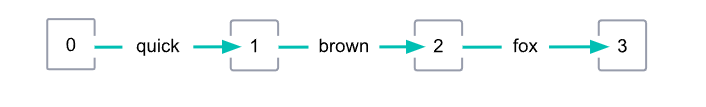
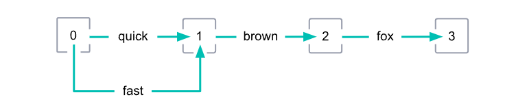
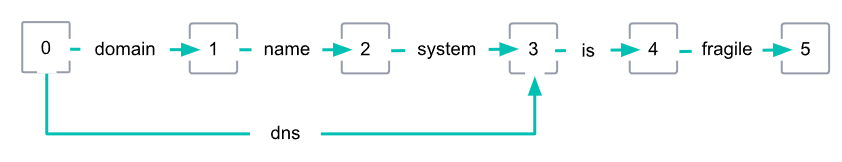
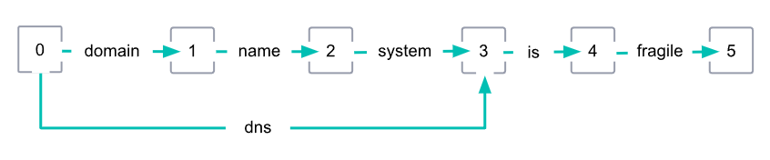
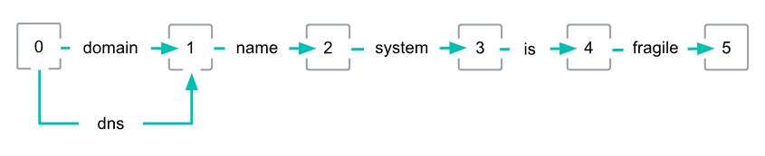

# Analyzer와 inverted index

> 아래의 내용은 모두 text type에 대한 것이다. keyword type은 analyze 과정을 거치지 않는다.

- Inverted index(역색인)

  - "I am a boy", "You are a girl" 이라는 두 문자열이 있다고 가정한다.
    - 위 두 개의 문자열을 공백을 기준으로 나누면 각각의 문자열은 4개의 단어로 나뉜다.
    - I, am, a, boy
    - you, are, a girl
  - 토큰
    - 위와 같이 나뉜 단어들을 **토큰**이라 부른다. 
    - 토큰을 만들어 내는 과정을 **토크나이징**이라고 한다.
  - 특정한 기준에 의해 나뉜 토큰들은 아래와 같은 형태로 저장되는데 이것을 역색인이라 부른다.

  | Tokens | Documents |
  | ------ | --------- |
  | I      | 1         |
  | am     | 1         |
  | a      | 1, 2      |
  | boy    | 1         |
  | girl   | 2         |
  | you    | 2         |
  | are    | 2         |

  - 위와 같은 역색인이 생성된 상태에서 사용자가 "a boy"라는 문자열이 포함된 문서를 찾고 싶다고 가정한다.
    - 검색어로 a boy라는 문자열을 입력하면 이 문자열은 공백을 기준으로 a, boy라는 두 개의 토큰으로 나뉜다.
    - 이렇게 나뉜 토큰을 바탕으로 역색인을 검색한다.
    - 두 단어가 모두 포함되어 있는 문서 1번이 검색 결과로 반환된다.
  - 대소문자 구분
    - 검색 결과를 얻기 위해서는 토큰이 대소문자까지 정확하게 일치해야 한다.
    - 역색인에 대문자 I만 존재할 뿐 소문자 i는 존재하지 않는다.
    - 따라서 소문자 i로 검색하면 아무런 검색 결과를 얻지 못한다.
  - 한 field 내에 중복된 token이 많다고 해서 index의 size가 증가하는 것은 아니다.
    - Elasticsearch의 inverted index에는 unique한 token만이 저장된다.
    - 만약 중복된 token이 있다고 해도 해당 token의 위치에 관한 정보와 등작 빈도 등만 추가적으로 저장될 뿐 token자체를 중복하여 저장하지 않는다.


- 한 field 내에 중복된 token이 많다고 해서 index의 size가 증가하는 것은 아니다.

  - Elasticsearch의 inverted index에는 unique한 token만이 저장된다.
    - 따라서 중복된 token이 있다고 해도 이 token이 inverted index에 추가적으로 저장되지는 않는다.
    - 다만 해당 token의 위치에 관한 정보와 등작 빈도 등만 추가적으로 저장되므로 약간은 크기가 증가하게 된다.
  - 아래와 같이 index를 생성한다.

  ```json
  // PUT same_token
  {
    "settings": {
      "number_of_shards": 1, 
      "number_of_replicas": 0
    }
  }
  ```

  - 문서를 1건만 색인한다.

  ```json
  // PUT same_token/_doc/1
  {
    "text":"foo bar baz qux"
  }
  ```

  - 색인의 크기를 확인한다.
    - 4.6kb인 것을 볼 수 있다.

  ```json
  // GET _cat/indices?h=h,i,p,r,dc,cds,ss&s=cds:desc&v
  green same_token    1 0       1 2023-12-06T04:27:04.297Z  4.6kb
  ```

  - 아래 스크립트로 같은 내용의 문서를 9999건을 더 색인한다.

  ```python
  from elasticsearch import Elasticsearch, helpers
  
  
  es_client = Elasticsearch("http://localhost:9200")
  bulk_data = []
  for _ in range(9999):
      text = "foo bar baz qux"
      bulk_data.append({
          "_index":"same_token",
          "_source":{
              "text":text
          }
      })
  helpers.bulk(es_client, bulk_data)
  ```

  - 다시 index의 크기를 확인해본다.
    - 1건일 때는 4.6kb였다가 10000건일 때는 177.3kb가 된 것을 확인할 수 있다.

  ```json
  // GET _cat/indices?h=h,i,p,r,dc,cds,ss&s=cds:desc&v
  green same_token    1 0       1 2023-12-06T04:27:04.297Z  177.3kb
  ```

  - 이번에는 다른 token을 색인하기 위한 index를 생성한다.

  ```json
  // PUT diff_token
  {
    "settings": {
      "number_of_shards": 1, 
      "number_of_replicas": 0
    }
  }
  ```

  - 문서를 1건만 색인한다.

  ```json
  // PUT diff_token/_doc/1
  {
    "text":"foo bar baz qux"
  }
  ```

  - 색인의 크기를 확인한다.
    - 4.6kb인 것을 볼 수 있다.

  ```json
  // GET _cat/indices?h=h,i,p,r,dc,cds,ss&s=cds:desc&v
  green diff_token    1 0       1 2023-12-06T04:27:04.297Z  4.6kb
  ```

  - 아래 script로 다른 내용의 문서를 9999건을 더 색인한다.

  ```python
  from elasticsearch import Elasticsearch, helpers
  from faker import Faker
  
  
  fake = Faker()
  es_client = Elasticsearch("http://localhost:9200")
  bulk_data = []
  for _ in range(9999):
      text = " ".join(fake.name()[:3] for _ in range(4))
      bulk_data.append({
          "_index":"diff_token",
          "_source":{
              "text":text
          }
      })
  helpers.bulk(es_client, bulk_data)
  ```

  - 다시 index의 크기를 확인해본다.
    - 1건일 때는 4.6kb였다가 10000건일 때는 670.8kb가 된 것을 확인할 수 있다.

  ```json
  // GET _cat/indices?h=h,i,p,r,dc,cds,ss&s=cds:desc&v
  green diff_token   1 0   10000 2023-12-06T04:35:56.575Z 670.8kb
  ```


- ES는 어떻게 tokenizing을 하는가

  - ES는 `_analyze`라는 API를 제공한다.
    - analyzer에는 토크나이징에 사용할 analyzer를 입력한다.
    - text에는 토크나이징 할 문자열을 입력한다.
    - `explain`: option을 true로 주면 보다 상세한 정보를 확인할 수 있으며, nori의 경우 품사 정보도 확인할 수 있다.
  
  ```bash
  GET _analyze
  {
      "analyzer":"standard",
      "text":"I am a boy"
  }
  ```
  
  - 응답
    - 토크나이징의 결과로 토큰의 배열을 반환한다.
    - 아래 토큰을 보면 대문자 I가 아닌 소문자 i로 토크나이징 된 것을 볼 수 있는데, standard analyzer의 동작 중에 모든 문자를 소문자화하는 과정이 포함되어 있기 때문이다.
  
  ```json
  {
    "tokens" : [
      {
        "token" : "i",
        "start_offset" : 0,
        "end_offset" : 1,
        "type" : "<ALPHANUM>",
        "position" : 0
      },
      {
        "token" : "am",
        "start_offset" : 2,
        "end_offset" : 4,
        "type" : "<ALPHANUM>",
        "position" : 1
      },
      {
        "token" : "a",
        "start_offset" : 5,
        "end_offset" : 6,
        "type" : "<ALPHANUM>",
        "position" : 2
      },
      {
        "token" : "boy",
        "start_offset" : 7,
        "end_offset" : 10,
        "type" : "<ALPHANUM>",
        "position" : 3
      }
    ]
  }
  ```


- Normalizer

  - Normalizer는 analyzer와 유사하지만, 오직 하나의 token만을 반환한다는 점에서는 다르다.
  - 따라서 tokenizer는 받지 않으며, 오직 char filter와 token filter만을 받는다.
    - 모든 filter가 가능한 것은 아니며 character 기반으로 동작하는 filter만 설정 가능하다.
    - 예를 들어 lowercase filter는 개별 character들을 소문자로 변경하므로, normalizer에서 사용이 가능하다.
    - 그러나 stemming filter의 경우 전체 keyword를 대상으로 동작하므로, normalizer에서 사용이 불가능하다.
    - 사용 가능한 filter list는 [공식 문서](https://www.elastic.co/guide/en/elasticsearch/reference/current/analysis-normalizers.html#analysis-normalizers) 참고.
  - 예시

  ```json
  // PUT index
  {
    "settings": {
      "analysis": {
        "normalizer": {
          "my_normalizer": {
            "type": "custom",
            "filter": ["lowercase", "asciifolding"]
          }
        }
      }
    },
    "mappings": {
      "properties": {
        "foo": {
          "type": "keyword",
          "normalizer": "my_normalizer"
        }
      }
    }
  }
  ```


- Analyzer 
  - Analyzer는 역색인을 만들어주는 것이다.
    - Analyzer는 운영 중에 동적으로 변경할 수 없다.
    - 따라서 기존 인덱스에 설정한 analyzer를 바꾸고 싶을 때는 인덱스를 새로 만들어서 재색인(reindex)해야 한다.
    - 단, close 상태인 index에 새로운 analyzer를 추가하는 것은 가능하다.
  - ES의 analyzer는 다음과 같이 구성되며, 아래 순서로 실행된다.
    - character filter
    - tokenizer
    - token filter
  - Character filter
    - Analyzer를 통해 들어온 문자열들은 character filter가 1차로 변형한다.
    - Tokeninzing을 위한 간단한 전처리를 위한 단계이다.
    - 예를 들어 <, >, ! 등과 같은 의미 없는 특수 문자들을 제거한다거나 HTML 태그들을 제거하는 등 문자열을 구성하고 있는 문자들을 특정한 기준으로 변경한다.
  - Tokenizer
    - Tokenizer는 일정한 기준(공백이나 쉼표)에 의해 문자열은 n개의 토큰으로 나눈다.
    - Analyzer를 구성할 때는 tokenizer를 필수로 명시해야 하며, 하나의 tokenizer만 설정할 수 있다.
    - 반면 character filter와 token filter는 필요하지 않을 경우 기술하지 않거나, 여러 개의 character filter와 token filter를 기술할 수 있다.
  - Token filter
    - Tokenizer에 의해 분리된 각각의 텀들을 지정한 규칙에 따라 처리해주는 필터들이다.
    - `filter` 항목에 배열로 나열해서 지정하며, 나열된 순서대로 처리되기에 순서를 잘 고려해서 입력해야한다.
    - 토큰을 전부 소문자로 바꾸는 lowercase token filter가 대표적인 token filter이다.


- standard analyzer

  - 아무 설정을 하지 않을 경우 디폴트로 적용되는 애널라이저
  - Filter
    - Character filter가 정의되어 있지 않다.
    - Standard tokenizer가 정의되어 있다.
    - Lowercase token filter가 정의되어 있다.
    - Stopwords로 지정한 단어가 토큰들 중에 존재 한다면 해당 토큰을 없애는 stop token filter가 존재하지만 기본값으로 비활성화 되어 있다.
  - Standard tokenizer 요청
    - `analyzer`가 아닌 `tokenizer`를 입력한다.
    - 아직 token filter를 거치지 않았기에 I가 대문자이다.

  ```json
  $ curl -XPOST "localhost:9200/_analyze?pretty" -H 'Content-type:application/json' -d '{
  "tokenizer":"standard",
  "text":"I am a boy"
  }'
  
  
  {
    "tokens" : [
      {
        "token" : "I",
        "start_offset" : 0,
        "end_offset" : 1,
        "type" : "<ALPHANUM>",
        "position" : 0
      },
      {
        "token" : "am",
        "start_offset" : 2,
        "end_offset" : 4,
        "type" : "<ALPHANUM>",
        "position" : 1
      },
      {
        "token" : "a",
        "start_offset" : 5,
        "end_offset" : 6,
        "type" : "<ALPHANUM>",
        "position" : 2
      },
      {
        "token" : "boy",
        "start_offset" : 7,
        "end_offset" : 10,
        "type" : "<ALPHANUM>",
        "position" : 3
      }
    ]
  }
  ```


- Custom analyzer

  > https://esbook.kimjmin.net/06-text-analysis/6.3-analyzer-1/6.4-custom-analyzer
  >
  > https://www.elastic.co/guide/en/elasticsearch/reference/current/analysis-custom-analyzer.html

  - 내장 analyzer로 충분하지 않을 경우 직접 애널라이저를 만들 수 있다.
  - Analyzer 정의 하기
    - `type`: `custom`을 입력하거나 아예  type 자체를 입력하지 않는다.
    - `tokenizer`: 애널라이저에 사용할 토크나이저를 입력한다(필수).
    - `char_filter`: 사용할 character filter들을 입력한다.
    - `filter`: 사용할 token filter들을 입력한다.

  ```bash
  $ curl -XPUT "localhost:9200/my_index" -H 'Content-type:application/json' -d '{
  "settings": {
    "analysis": {
      "analyzer": {
        "my_custom_analyzer": {	# 커스텀 애널라이저의 이름
          "type": "custom",
          "tokenizer": "standard",
          "char_filter": [
            "html_strip"
          ],
          "filter": [
            "lowercase",
            "asciifolding"
          ]
        }
      }
    }
  }
  }'
  ```

  - 위에서 적용한 tokenizer, char_filter, filter도 custom해서 적용하는 것이 가능하다.

  ```bash
  $ curl -XPUT "localhost:9200/my_index" -H 'Content-type:application/json' -d '
  {
    "settings": {
      "analysis": {
        "analyzer": {
          "my_custom_analyzer": { 
            "char_filter": [
              "emoticons"	# 아래에서 custom한 emoticons라는 char_filter를 적용
            ],
            "tokenizer": "punctuation",	# 아래에서 custom한 punctuation이라는 tokenizer 적용
            "filter": [
              "lowercase",
              "english_stop"	# 아래에서 custom한 english_stop이라는 filter 적용
            ]
          }
        },
        "tokenizer": {
          "punctuation": { 
            "type": "pattern",
            "pattern": "[ .,!?]"
          }
        },
        "char_filter": {
          "emoticons": { 
            "type": "mapping",
            "mappings": [
              ":) => _happy_",
              ":( => _sad_"
            ]
          }
        },
        "filter": {
          "english_stop": { 
            "type": "stop",
            "stopwords": "_english_"
          }
        }
      }
    }
  }
  ```


- Analyzer와 검색의 관계

  - Analyze의 중요성
    - Analyzer를 통해 생성한 토큰들이 역색인에 저장되고, 검색할 때는 이 역색인에 저장된 값을 바탕으로 문서를 찾는다.
    - 따라서 검색 니즈를 잘 파악해서 적합한 analyzer를 설정해야 한다.
  - 테스트 인덱스 생성

  ```bash
  $ curl -XPUT "localhost:9200/books?pretty" -H 'Content-type:application/json' -d '{
  	"mappings":{
  		"properties":{
  			"title":{"type":"text"},
  			"content":{"type":"keyword"}
  		}
  	}
  }'
  ```

  - 테스트 문서 색인

  ```bash
  $ curl -XPUT "localhost:9200/books/_doc/1?pretty" -H 'Content-type:application/json' -d '{
  "title":"Elasticsearch Training Book",
  "content":"Elasticsearch is open source search engine"
  }'
  ```

  - title로 검색하기
    - 정상적으로 검색이 된다.

  ```json
  $ curl "localhost:9200/books/_search?pretty&q=title:Elasticsearch"
  
  {
    "took" : 743,
    "timed_out" : false,
    "_shards" : {
      "total" : 1,
      "successful" : 1,
      "skipped" : 0,
      "failed" : 0
    },
    "hits" : {
      "total" : {
        "value" : 1,
        "relation" : "eq"
      },
      "max_score" : 0.6931471,
      "hits" : [
        {
          "_index" : "books",
          "_type" : "_doc",
          "_id" : "1",
          "_score" : 0.6931471,
          "_source" : {
            "title" : "Elasticsearch Training Book",
            "content" : "Elasticsearch is open source search engine"
          }
        }
      ]
    }
  }
  ```

  - content로 검색하기

  ```bash
  $ curl "localhost:9200/books/_search?pretty&q=content:Elasticsearch"
  
  {
    "took" : 2,
    "timed_out" : false,
    "_shards" : {
      "total" : 1,
      "successful" : 1,
      "skipped" : 0,
      "failed" : 0
    },
    "hits" : {
      "total" : {
        "value" : 0,
        "relation" : "eq"
      },
      "max_score" : null,
      "hits" : [ ]
    }
  }
  ```

  - content 필드는 검색이 정상적으로 이루어지지 않았다.
    - title 필드는 text, content 필드는 keyword 타입으로 정의했다.
    - text 타입의 기본 analyzer는 standard analyzer이고, keyword 타입의 기본 analyzer는 keyword analyzer이다.
    - keyword analyzer는 standard analyzer와는 달리 analyze를 하지 않는다.
    - 즉 역색인에는 "Elasticsearch is open source search engine"라는 토큰만 존재한다.


## _termvectors API

- `_termvectors` API

  - 문서의 term vector들을 반환한다.
    - 만약 index 생성시에 `term_vector`를 `no`(default)로 설정하여 저장된 term vector가 없다면 **현재 analyzer를 기준**으로 term vector를 생성해서 반환한다.
  - Inverted index를 보여주는 것은 아니지만, token이 어떤 형태로 생성됐는지 확인할 수 있다.

  ```http
  GET _termvectors/<doc_id>?fields=<field1[,field2, ...]>
  ```


- `_termvectors` API는 문서의 inverted index 상의 token들을 보여주는 것이 아니다.

  - `_termvectors` API는 현재 index에 설정된 analyzer로 분석한 term vector들을 보여주는 것이다.
  - 예를 들어 아래와 같이 index를 생성했다고 가정해보자.

  ```json
  // PUT test-index
  {
      "settings": {
          "analysis": {
              "tokenizer": {
                  "my_nori_tokenizer":{
                      "type":"nori_tokenizer",
                      "decompound_mode":"none",
                      "user_dictionary_rules":[]
                  }
              },
              "analyzer": {
                  "my_analyzer":{
                      "type":"custom",
                      "tokenizer":"my_nori_tokenizer"
                  }
              }
          }
      },
      "mappings": {
          "properties": {
              "text":{
                  "type":"text",
                  "analyzer": "my_analyzer"
              }
          }
      }
  }
  ```

  - 문서를 색인하고

  ```json
  // PUT test-index/_doc/1
  {
    "text":"하와이안피자"
  }
  ```

  - Term vector를 확인하면 "피자"와 "하와이안"으로 분리되어 생성된 것을 볼 수 있다.

  ```json
  // GET test-index/_termvectors/1?fields=text
  
  // output
  {
      // ...
      "term_vectors" : {
          "text" : {
              // ...
              "terms" : {
                  "피자" : {
                      // ...
                  },
                  "하와이안" : {
                      // ...
                  }
              }
          }
      }
  }
  ```

  - 따라서 "하와이안"으로 검색하면 1번 문서가 검색 된다.

  ```json
  // GET test-index/_search
  {
      "query": {
          "match": {
              "text": "하와이안"
          }
      }
  }
  
  // output
  {
      // ...
      "hits" : {
          // ...
          "hits" : [
              {
                  // ...
                  "_id" : "1",
                  "_score" : 0.18232156,
                  "_source" : {
                      "text" : "하와이안피자"
                  }
              }
          ]
      }
  }
  ```

  - 이제 `my_nori_tokenizer`에 사용자 사전을 추가한다.

  ```json
  // POST test-index/_close
  
  // PUT test-index/_settings
  {
      "analysis": {
          "tokenizer": {
              "my_nori_tokenizer": {
                  "type": "nori_tokenizer",
                  "decompound_mode": "none",
                  "user_dictionary_rules": [
                      "하와이안피자"
                  ]
              }
          }
      }
  }
  
  // POST test-index/_open
  ```

  - Term vector를 확인하면 "하와이안피자"로 하나의 token만 생성된 것을 볼 수 있다.

  ```json
  // GET test-index/_termvectors/1?fields=text
  {
      // ...
      "term_vectors" : {
          "text" : {
              // ...
              "terms" : {
                  "하와이안피자" : {
                      // ...
                  }
              }
          }
      }
  }
  ```

  - 만약 `_termvectors` API가 현재 inverted index상의 token을 보여준다면 "하와이안"으로 검색했을 때 검색이 안 될 것이다.
    - 그러나 아래와 같이 검색이 된다.
    - 이처럼 `_termvectors` API는 현재 index에 설정된 analyzer로 분석한 term vector들을 보여주는 것이지, inveted index 상의 token을 보여주는 것이 아니다.

  ```json
  // GET test-index/_search
  {
      "query": {
          "match": {
              "text": "하와이안"
          }
      }
  }
  
  // output
  {
      // ...
      "hits" : {
          // ...
          "hits" : [
              {
                  // ...
                  "_id" : "1",
                  "_score" : 0.18232156,
                  "_source" : {
                      "text" : "하와이안피자"
                  }
              }
          ]
      }
  }
  ```

  - 다만 이는 field의 `term_vector` 값이 `no`(default)로 설정되었을 때에만 해당한다.
    - 만일 `term_vector`에 `no`이외의 값을 줘서 term vector가 저장되게 했다면, 재색인을 하지 않는 한 이전 analyzer로 분석한 결과를 보여줄 것이다.
    - `_termvectors` API는 저장된 term vector가 있으면 해당 term vector를 반환하고, 없으면 term vector를 생성해서 반환하기 때문이다.


## Analyze

### Nori anlayzer

> https://elsboo.tistory.com/44
>
> https://www.elastic.co/kr/blog/nori-the-official-elasticsearch-plugin-for-korean-language-analysis

- Elasticsearch에서 제공하는 한글 형태소 분석기이다.
  - 프랑스인인 [Jim Ferenczi](https://github.com/jimczi)에 의해 개발되었다.
    - Elasticsearch의 직원이며 Lucene commiter이기도 하다.
    - 일본어 형태소 분석기인 Kuromoji도 처음으로 개발했다.
    - 본래 생각한 이름은 godori였으나, 이름을 변경하여 nori(일본어로 김, 행운)가 되었다.
  - 처음에는 Lucene의 기능으로 개발되었다.
  - 은전한닢
    - Mecab이라는 일본에서 개발한 형태소 분석 엔진을 기반으로 개발되었다.
    - 특정 말뭉치에 의존하지 않도록 설계되어 한글 말뭉치를 널어서 한글용 형태소 분석기를 만들 수 있었다.
    - Mecab에 한글 말뭉치를 넣어서 만든것이 [은전한닢](https://eunjeon.blogspot.com/)(또는 mecab-ko) 형태소 분석기이다.
    - 약 81만개 단어를 학습시켜 만들었으며, mecab-ko-dic이라 불리는 사전의 크기는 약 200MB이다.
  - Nori는 은전한닢에서 사용하는 mecab-ko-dic을 사용한다.
    - 200MB라는 크기는 Elasticsearch에 넣기에는 부담스러운 크기이기에 본래 csv file이었던 mecab-ko-dic을 dat 형태의 바이너리로 변환시켰다.
    - 또한 자주 출현하는 단어를 숫자 형태로 부호화해 중복 출현을 최소화하고, 기존 mecab-ko-dic에서 숫자로 작성된 값들의 type을 int에서 short로 변경했다.
    - 이 결과 사전 크기가 88%정도 감소한 24MB가 됐다.


- 형태소 분석 기준

  - Nori는 형태소를 분석할 때 단어 비용과 연결 비용을 고려하여 최종 비용이 더 적게 드는 쪽을 선택한다.
    - 단어 비용: 어떤 단어가 가지는 비용으로, 단어 비용이 높을수록 우선 순위가 낮아진다.
    - 연접 비용: 단어와 단어를 연결하는 비용으로 한 단어의 끝과 다음 단어의 시작이 연결되는 비용을 의미한다.
  - 말뭉치에서 모든 단어는 좌문맥 id와, 우문맥 id, 그리고 단어 비용을 가진다.
    - 좌문맥 id와 우문맥 id는 matrix.def이라는 별도의 파일에서 연접 비용을 설정하기 위해 사용된다.

  ```txt
  예를 들어 아래와 같은 말뭉치가 있다고 가정해보자(실제로는 훨씬 많은 field들이 있다).
  단어, 좌문맥ID, 우문맥ID, 단어비용
  세종, 1117, 	 2878, 	  -210
  시,	 1172,    2878,    3415
  장,   1172,    2834,    4379
  
  이 때 단어 사이의 연접 비용을 설정하는 matrix.def file은 아래와 같이 작성된다.
  좌문맥ID, 우문맥ID, 연접비용
  1117	 2878	  261	 
  ```


- 형태소 분석 예시

  - 아래와 같은 말뭉치가 있고 가정해보자.

  ```
  단어, 좌문맥ID, 우문맥ID, 단어비용
  세종, 1117, 	 2878, 	  -210
  시,	 1172,    2878,    3415
  장,   1172,    2834,    4379
  ```

  - 해당 단어에 대한 연접 비용은 matrix.def에 아래와 같이 정리되어 있다.
    - 문장의 처음일 경우 좌문맥 ID는 0이다.

  ```
  좌문맥ID, 우문맥ID, 연접비용
  0        1117     -1475
  1117	 2878	  261
  1172     2834     241
  ```

  - "세종시장"이라는 단어의 최종 비용은 아래와 같이 계산된다.
    - 괄호로 묶은 것은 두 단어 사이의 연접 비용을 나타내고, 괄호로 묶이지 않은 것은 단어 비용을 나타낸다.
    - (문장의 처음 + 세종) + 세종 + (세종 + 시) + 시 + (시 + 장) + 장
    - -1475 + (-210) + 261 + 3415 + 241 + 4379 = 6611이 된다.


- `nori_tokenizer`에는 아래와 같은 설정이 가능하다.

  - `discard_punctuation`
    - true일 경우 문장 부호를 token으로 생성하지 않는다.
    - 기본값은 true.
  - `decompound_mode`
    - 합성어를 어떻게 tokenize할지 설정한다.
    - `none`: 합성어의 어근을 분리하지 않고 완성된 합성어만 저장한다.
    - `discard`(default): 합성어를 분리하여 어근만 저장한다.
    - `mixed`: 어근과 합성어를 모두 저장한다.
  - `user_dictionary`
    - Nori tokenizer는 기본적으로 [mecab-ko-dict dictionary](https://bitbucket.org/eunjeon/mecab-ko-dic/src)를 사용하는데, `user_dictionary` 옵션을 줄 경우 여기에 포함된 단어들이 기본 dictionary에 추가된다.
    - Synonym과 마찬가지로 dictionary file을 생성한뒤, `user_dictionary` option에 Elasticsearch 내부의 config directory로 부터 상대 경로를 입력하여 설정할 수 있다.
    - (search analizer로 사용하는 경우)설정을 변경한 뒤에는 close/open해야 적용된다.
    - 파일은 `<token> [<token 1> ... <token n>]` 형식으로 작성하는데, 각 token은 공백으로 구분하여 작성한다.
    - 예를 들어 `세종시 세종 시`와 같이 작성했다면 "세종시"를 "세종"과 "시"로 분리하겠다는 의미이다.
    - 만일 `decompound_mode`가 mixed라면 `세종시, 세종, 시`와 같이 token이 생성된다.

  ```json
  PUT nori_sample
  {
    "settings": {
      "index": {
        "analysis": {
          "tokenizer": {
            "nori_user_dict": {
              "type": "nori_tokenizer",
              "decompound_mode": "mixed",
              "discard_punctuation": "false",
              "user_dictionary": "userdict_ko.txt"
            }
          },
          "analyzer": {
            "my_analyzer": {
              "type": "custom",
              "tokenizer": "nori_user_dict"
            }
          }
        }
      }
    }
  }
  ```

  - `user_dictionary_rules`
    - `user_dictionary`이 file로 사용자 사전을 작성하는 방식이라면, `user_dictionary_rules`는 settings에 사용자 사전을 작성하는 방식이다.

  ```json
  PUT nori_sample
  {
    "settings": {
      "index": {
        "analysis": {
          "tokenizer": {
            "nori_user_dict": {
              "type": "nori_tokenizer",
              "decompound_mode": "mixed",
              "user_dictionary_rules": ["세종", "세종시 세종 시"]
            }
          },
          "analyzer": {
            "my_analyzer": {
              "type": "custom",
              "tokenizer": "nori_user_dict"
            }
          }
        }
      }
    }
  }
  ```


- nori tokenizer에서 `decompound_mode`를 mixed로 줄 경우 아래와 같이 예상과 달리 동작한다.

  - index 생성

  ```json
  PUT mixed_test
  {
    "settings": {
      "analysis": {
        "tokenizer": {
          "mixed_nori_tokenizer": {
            "type": "nori_tokenizer",
            "decompound_mode": "mixed"
          }
        },
        "analyzer": {
          "mixed_nori_analyzer": {
            "type": "custom",
            "tokenizer": "mixed_nori_tokenizer"
          }
        }
      }
    }, 
    "mappings": {
      "properties": {
        "text":{
          "type": "text",
          "analyzer": "mixed_nori_analyzer"
        }
      }
    }
  }
  ```

  - 데이터 색인

  ```json
  PUT mixed_test/_doc/1
  {
    "text":"가곡역"
  }
  ```

  - analyze 결과 확인

  ```json
  GET mixed_test/_termvectors/1?fields=text
  
  // ["가곡", "역", "가곡역"]으로 토큰이 생성된 것을 확인 할 수 있다.
  ```

  - 검색 profile

  ```json
  GET mixed_test/_search
  {
    "profile": true, 
    "query": {
      "match": {
        "text": "가곡역"
      }
    }
  }
  
  // query string이 "text:가곡역 text:\"가곡 역\""와 같이 만들어진다.
  ```

  - 예상하기로는 `text:가곡 text:역 text:가곡역`과 같이 만들어 질 것 같지만 예상과 달리 `text:가곡역 text:\"가곡 역\"`과 같이 query가 생성된다.
    - 더 정확히는 `text:가곡역`은 TermQuery로, `text:\"가곡 역\"`은 PhraseQuery로 생성된다.
  - `elasticsearch.index.search.MatchQueryParser`의 `createFieldQuery()` 메서드에는 아래와 같은 logic이 있다.
    - `posLenAtt`는 token의 positionLength 정보를 담고 있는 object이고, `enableGraphQueries`는 기본값이 true로 설정돼있다(token stream의 생성 결과에 따라 false로 변경되기도 한다).
    - 따라서 아래 조건문은 token의 `positionLength`가 1보다 클 경우(mixed로 분석한 "가곡역" token의 `positionLength`는 2이다), `isGraph` 변수를 true로 변경한다.
    - `isGraph`값이 true이고 `type`이 `Type.PHRASE`이거나 `Type.PHRASE_PREFIX`이면 `analyzeGraphPhrase()` 메서드를 실행시킨다.

  ```java
  while (stream.incrementToken()) {
      // ...
      int positionLength = posLenAtt.getPositionLength();
      if (enableGraphQueries && positionLength > 1) {
          isGraph = true;
      }
  }
  
  if (numTokens == 0) {
      return null;
  // ...
  } else if (isGraph) {
      if (type == Type.PHRASE || type == Type.PHRASE_PREFIX) {
          return analyzeGraphPhrase(stream, field, type, phraseSlop);
      } else {
          return analyzeGraphBoolean(field, stream, operator, type == Type.BOOLEAN_PREFIX);
      }
  }
  ```

  - `elasticsearch.index.query.IntervalBuilder`에도 유사한 코드가 있다.
    - `analyzeText()` 메서드도 유사한 과정을 거친다.


- `nori_part_of_speech` token filter

  - Part-of-speech tag에 매치되는 토큰들을 tokenizing 결과에서 제외한다.

  | Tag  | Description                 | Example                                   |
  | ---- | --------------------------- | ----------------------------------------- |
  | E    | 동사 어미                   | 먹다 → ["먹"]                             |
  | IC   | 감탄사                      | 와 정말? → ["정말"]                       |
  | J    | 조사                        | 밥을 → ["밥"]                             |
  | MAG  | 부사                        | 상당히 많은 → ["많", "은"]                |
  | MAJ  | 문장과 문장을 연결하는 부사 | 하지만 내일은 → ["내일", "은"]            |
  | MM   | 관형사                      | 저 사람 → ["사람"]                        |
  | NNG  | 일반명사                    | 귀여운 강아지 → ["귀엽", "ㄴ"]            |
  | NNP  | 고유명사                    | 한국의 수도는 서울 → ["의", "수도", "는"] |
  | NNB  | 의존명사                    | 얼마 만큼→ ["얼마"]                       |
  | NNBC | 단위명사                    | 사과 두 개 → ["사과", "두"]               |
  | NP   | 대명사                      | 그것 → [ ]                                |
  | NR   | 수사                        | 다섯 명 → ["명"]                          |
  | SF   | 마침표, 물음표, 느낌표      | 와! → ["와"]                              |
  | SH   | 한자                        | 漢字 → [ ]                                |
  | SL   | 영어                        | English → [ ]                             |
  | SN   | 숫자                        | 3개  → ["개"]                             |
  | SP   | 공백                        | 나와 너 → ["나", "와", "너"]              |
  | SSC  | 닫는 괄호                   | 밥) → ["밥"]                              |
  | SSO  | 여는 괄호                   | (밥 → ["밥"]                              |
  | SC   | 가운데점, 콜론, 빗금        | 이름:철수 → ["이름", "철수"]              |
  | SE   | 말줄임표                    | 아... → ["아"]                            |
  | VA   | 형용사                      | 예쁜 꽃 → ["ㄴ", "꽃"]                    |
  | VCN  | 부정지정사                  | 아니다 → ["다"]                           |
  | VCP  | 긍정지정사                  | 사람이다 → ["사람", "다"]                 |
  | VV   | 동사                        | 가다 → ["다"]                             |
  | VX   | 보조용언                    | 가고 싶다 → ["갈", "고", "다"]            |
  | XPN  | 체언접두사                  | 불가능 → ["가능"]                         |
  | XR   | 어근                        | 복잡한 → ["하", "ㄴ"]                     |
  | XSA  | 형용사 파생 접미사          | 새삼스러운 → ["새삼", "ㄴ"]               |
  | XSN  | 명사 파생 접미사            | 사람들 → ["사람"]                         |
  | XSV  | 동사 파생 접미사            | 공부하다 → ["공부", "다"]                 |


## Character filter

- Token filter에 있는 `lowercase`는 존재하지 않는다.

  - Character filter의 목적 자체가 간단한 전처리이기 때문이다.
  - 만약 `lowercase`를 적용해야 한다면 아래와 같이 `mapping` character filter를 사용하면 된다.

  ```json
  {
      "settings":{
          "analysis":{
              "char_filter":{
                  "custom_lowercase" : {
                      "type" : "mapping",
                      "mappings" : [
                          "A => a",
                          "B => b",
                          "C => c",
                          "D => d",
                          "E => e",
                          "F => f",
                          "G => g",
                          "H => h",
                          "I => i",
                          "J => j",
                          "K => k",
                          "L => l",
                          "M => m",
                          "N => n",
                          "O => o",
                          "P => p",
                          "Q => q",
                          "R => r",
                          "S => s",
                          "T => t",
                          "U => u",
                          "V => v",
                          "W => w",
                          "X => x",
                          "Y => y",
                          "Z => z"
                      ]
                  }
              }
          }
      }
  }
  ```


## Token filter

- N-gram

  - tokenizing 결과를 정해진 길이만큼 잘라서 다시 token을 생성한다.

  - 옵션

    - `max_ngram`: 각 토큰의 최대 길이를 지정한다(기본값은 2).
    - `min_ngram`: 각 토큰의 최소 길이를 지정한다(기본값은 1).

    - `preserve_original`: ngram filter가 적용되기 전의 토큰을 보존한다.

  - 예시

  ```json
  // ngram-example
  {
    "settings": {
      "index": {
        "max_ngram_diff": 2
      },
      "analysis": {
        "analyzer": {
          "default": {
            "tokenizer": "whitespace",
            "filter": [ "3_5_grams" ]
          }
        },
        "filter": {
          "3_5_grams": {
            "type": "ngram",
            "min_gram": 3,
            "max_gram": 5
          }
        }
      }
    }
  }
  ```


- Edge n-gram

  - 각 토큰의 시작부분만 정해진 길이만큼 잘라서 토큰을 생성한다.

  - 옵션

    - `max_ngram`: 각 토큰의 최대 길이를 지정한다(기본값은 2).
    - `min_ngram`: 각 토큰의 최소 길이를 지정한다(기본값은 1).

    - `preserve_original`: ngram filter가 적용되기 전의 토큰을 보존한다.

  - 예시

  ```json
  // edge-ngram-example
  {
    "settings": {
      "analysis": {
        "analyzer": {
          "default": {
            "tokenizer": "whitespace",
            "filter": [ "3_5_edgegrams" ]
          }
        },
        "filter": {
          "3_5_edgegrams": {
            "type": "edge_ngram",
            "min_gram": 3,
            "max_gram": 5
          }
        }
      }
    }
  }
  ```


### Synonym

> https://www.elastic.co/blog/boosting-the-power-of-elasticsearch-with-synonyms

- Synonym(유의어)

  - 분석 과정에서 유의어들을 보다 쉽게 처리할 수 있도록 도와주는 token filter이다.
    - 예를 들어 "Elasticsearch"를 누군가는 "ES"라고 쓰고, 누군가는 "엘라스틱서치"라고 쓴다고 하면, Elasticsearch라는 term으로 검색했을 때, ES나 엘라스틱서치라고 작성된 내용은 검색되지 않을 것이다.
    - synonym token filter를 사용하여 Elasticsearch와 ES, 엘라스틱서치를 유의어로 묶으면, Elasticsearch를 검색했을 때 다른 두 개의 용어도 검색되게 할 수 있다.
    
  - 유의어 명시 규칙
    - `A, B`: A와 B 각 term이 서로를 모두 저장하여, A와 B 모두 서로의 term으로 검색이 된다.
    - `A => B`: A 대신 B의 term을 저장하여 A로는 B의 검색이 가능하지만, B로는 A의 검색이 불가능하다.
    
  - 대부분의 경우 index analyzer가 아닌 search analyzer로 활용한다.
  
    - Index analyzer로 적용할 경우 synonym들도 함께 색인해야 하므로 index의 크기가 커지고, 검색 점수 계산시에 synonym들도 계산에 포함시켜야 하므로 계산이 왜곡될 수 있으며, 무엇보다 synonym을 변경할 경우 재색인을 해야한다.
  
    - Index analyzer만 사용할 때의 유일한 장점은 매 query시마다 유의어를 확장하는 과정을 거치지 않아도 되기에 검색 속도가 향상될 수 있다는 것 뿐인데, 이는 이론상으로만 그렇지 살제로 이를 통해 향상되는 속도는 미미하다.
    - 반면에 search analyzer에 적용하는 것은 index의 크기에 영향를 미치지 않고, 점수 계산에도 영향을 미치지 않으며, synonym을 변경해도 재색인을 하지 않아도 된다.
    - 무엇보다 보다 정교한 `synonym_graph` token filter를 사용하게 해준다.
  - Synonym도 tokenizing된다.
    - Token filter가 analyzing 과정의 맨 마지막에 있어 synonym은 tokenizing되지 않는다고 생각할 수 있으나, synonym도 tokenizing된다.
    - 예를 들어 `"노가다, 현장근로자"`라는 synonym이 등록된 synonym filter와 nori_tokenizer를 사용하는 analyzer를 사용하면 아래와 같이 분석된다.
    - `[노가다, 현장, 근로, 자]`
    - 따라서 "자"로 검색해도 노가다가 포함된 문서가 검색된다.


- synonym token filter 설정 방법

  - settings에 직접 설정하는 방법.
    - synonym token filter 생성시에 `synonyms`에 배열 형태로 유의어를 등록한다.

  ```json
  // PUT synonym-test
  PUT synonym-test
  {
      "settings": {
          "index": {
              "analysis": {
                  "filter": {
                      "my_synonym": {
                          "type": "synonym",
                          "synonyms": [ 
                              "foo, bar => baz",
                              "qux, quxx"
                          ]
                      }
                  },
                  "analyzer": {
                      "synonym": {
                          "tokenizer": "whitespace",
                          "filter": [
                              "my_synonym"
                          ]
                      }
                  }
              }
          }
      }
  }
  ```

  - 유의어 사전 파일을 만들어 설정하는 방법.
    - `synonyms_path`에 유의서 사전 파일의 경로를 설정하며, 경로는 `<ES_HOME>/config` 폴더를 기준으로 한다.

  ```json
  // <ES_HOME>/config/dict/my_synonym_dict.txt 유의어 사전 파일을 아래와 같이 작성한다.
  // foo, bar => baz
  // qux, quux
  
  // PUT synonym-test
  {
      "settings": {
          "index": {
              "analysis": {
                  "filter": {
                      "synonym": {
                          "type": "synonym",
                          "synonyms_path": "dict/my_synonym_dict.txt"
                      }
                  },
                  "analyzer": {
                      "synonym": {
                          "tokenizer": "whitespace",
                          "filter": [
                              "synonym"
                          ]
                      }
                  }
              }
          }
      }
  }
  ```
  
  - 아래와 같은 이유로 synonym을 settings에 직접 작성하는 대신 file로 작성하는 것을 권장한다.
    - File로 작성해야 close, open 없이 reload search analyzer API로 변경사항을 적용할 수 있다.
    - File로 작성하는 것이 version 관리가 더 간편한다.
    - Index가 삭제되더라도 synonym file은 남아있으므로 유실될 일이 없다.
    - 다른 여러 filter에서 동일한 synonym file을 공유할 수 있다.
    - Synonym을 settings에 직접 작성할 경우 index의 settings에 대한 meta 정보를 저장하는 cluster state가 더 많은 memory를 사용하게 된다.


- 유의어 사전 파일을 만들어 유의어를 관리하기 위해서는 data node 역할을 하는 모든 node에 유의어 사전 파일이 등록되어 있어야한다.
  - 테스트 결과 data node 역할을 하지 않는 node에는 유의어 사전이 없어도 index가 정상적으로 생성된다.
  - 만일 각 data node에 내용이 다른 유의어 사전이 있을 경우 어떻게 되는지 테스트하기 위해서 아래와 같이 cluster를 구성한다.
    - node1, node2, node3 세 개의 node를 생성한다.
    - node1에는 master 역할만 주어 유의어 사전을 등록하지 않아도 되도록한다.
    - node2, node3에 각기 다른 내용으로 유의어 사전을 작성한다(두 file의 이름은 동일해야한다).
  
  ```yaml
  # node2에 들어갈 사용자사전
  foo, bar => baz
  qux, quux
  
  # node3에 들어갈 사용자사전
  foo, bar => baz
  ```
  
  - Primary shard를 2로 설정하고 synonym token filter를 설정한 뒤 index를 생성한다.
  
  ```json
  PUT test
  {
      "settings": {
          "number_of_shards": 2, 
          "index": {
              "analysis": {
                  "filter": {
                      "synonym": {
                          "type": "synonym",
                          "synonyms_path": "dict/my_synonym_dict.txt"
                      }
                  },
                  "analyzer": {
                      "synonym": {
                          "tokenizer": "whitespace",
                          "filter": [
                              "synonym"
                          ]
                      }
                  }
              }
          }
      },
      "mappings": {
          "properties": {
              "text":{
                  "type": "text",
                  "analyzer": "synonym"
              }
          }
      }
  }
  ```
  
  - node2와 node3에 primary shard가 하나씩 배치되었는지 확인한다. 
  
  ```json
  // GET _cat/shards
  test                                                          0 p STARTED  0   node2
  test                                                          1 p STARTED  0   node3
  ```
  
  - 그 후 유의어 사전에 포함된 term들을 가지고 있는 문서들을 색인한다.
    - 아래와 같이 routing 값을 다르게 줘 각기 다른 shard에 색인되도록한다.
  
  ```json
  PUT test/_doc/1?routing=A
  {
    "text":"foo bar qux"
  }
  
  PUT test/_doc/2?routing=B
  {
    "text":"foo bar qux"
  }
  ```
  
  - 두 문서의 token을 확인해본다.
    - 둘 중 한 문서만 qux와 quux가 유의어로 등록된 것을 확인할 수 있다.
  
  ```json
  // POST test/_termvectors/1?fields=text&routing=A
  "terms": {
      "baz": {
          "term_freq": 2,
          "tokens": [
              {
                  "position": 0,
                  "start_offset": 0,
                  "end_offset": 3
              },
              {
                  "position": 1,
                  "start_offset": 4,
                  "end_offset": 7
              }
          ]
      },
      "qux": {
          "term_freq": 1,
          "tokens": [
              {
                  "position": 2,
                  "start_offset": 8,
                  "end_offset": 11
              }
          ]
      }
  }
  
  // POST test/_termvectors/2?fields=text&routing=B
  "terms": {
      "baz": {
          "term_freq": 2,
          "tokens": [
              {
                  "position": 0,
                  "start_offset": 0,
                  "end_offset": 3
              },
              {
                  "position": 1,
                  "start_offset": 4,
                  "end_offset": 7
              }
          ]
      },
      "quux": {
          "term_freq": 1,
          "tokens": [
              {
                  "position": 2,
                  "start_offset": 8,
                  "end_offset": 11
              }
          ]
      },
      "qux": {
          "term_freq": 1,
          "tokens": [
              {
                  "position": 2,
                  "start_offset": 8,
                  "end_offset": 11
              }
          ]
      }
  }
  ```
  
  - 위에서 확인한 것과 같이 여러 node 사이에 유의어 사전이 불일치할 경우 각 문서들이 같은 내용이라도 다르게 분석되어 검색 결과에 문제가 생길 수 있다.
    - 따라서 유의어 사전이 각 node들 사이에 일치하도록 해야한다.
  
  ```json
  // GET test/_search
  {
      "query": {
          "match": {
              "text": "quux"
          }
      }
  }
  
  // response
  // qux와 quux를 유의어로 등록한 2번 문서만 검색 된다.
  "hits": [
      {
          "_index": "test",
          "_id": "2",
          "_score": 0.42547938,
          "_routing": "B",
          "_source": {
              "text": "foo bar qux"
          }
      }
  ]
  ```


- stopword로 설정된 token이 synonym에 포함될 경우

  - 아래와 같이 stopword에 bar를 넣고, bar를 synonym에도 포함시키면 Index자체가 생성되지 않는다.
    - foo, bar, baz가 유의어로 설정되어 있는데, bar를 stopword 처리할 경우 foo, bar, baz가 모두 stopword로 처리되기 때문이다.

  ```json
  PUT test
  {
      "settings": {
          "index": {
              "analysis": {
                  "filter": {
                      "stop_word":{
                          "type":"stop",
                          "stopwords":[
                              "bar"
                          ]
                      },
                      "synonym": {
                          "type": "synonym",
                          "expand":false,
                          "synonyms": [
                              "foo,bar,baz"
                          ]
                      }
                  },
                  "analyzer": {
                      "synonym": {
                          "tokenizer": "whitespace",
                          "filter": [
                              "stop_word",
                              "synonym"
                          ]
                      }
                  }
              }
          }
      }
  }
  ```

  - 단, 아래의 `lenient` 설정을 true로 주면 생성이 가능하다.


- 설정

  - `expand`(bool, 기본값은 true)
    - 기본적으로 synonym은 아래와 같이 저장된다.
    - `foo, bar`와 같이 설정할 경우 `foo,bar => foo,bar`와 같이 foo로 bar가 검색되고, bar로 foo가 검색된다.
    - 그러나 expand를 false로 주면 `foo, bar`와 같이 설정할 경우 `foo, bar => foo`와 같이 맨 앞에 있는 token하나만 확장한다.
    - 즉 foo와 bar로는 foo가 검색되지만 bar로는 foo가 검색되지 않는다.

  - 예를 들어 아래와 같이 index를 생성하면, `expand`를 false로 줬으므로 `"foo, bar, baz"`는 `foo, bar, baz => foo, bar, baz`로 확장되는 것이 아니라 `foo, bar, baz => foo`와 같이 mapping된다.

  ```json
  // PUT test
  {
      "settings": {
          "index": {
              "analysis": {
                  "filter": {
                      "synonym": {
                          "type": "synonym",
                          "expand":false,
                          "synonyms": [
                              "foo, bar, baz"
                          ]
                      }
                  },
                  "analyzer": {
                      "my_analyzer": {
                          "tokenizer": "standard",
                          "filter": [
                              "synonym"
                          ]
                      }
                  }
              }
          }
      },
      "mappings": {
          "properties": {
              "text":{
                  "type":"text",
                  "analyzer": "my_analyzer"
              }
          }
      }
  }
  ```

  - 따라서 아래와 같은 data를 색인하고

  ```json
  // PUT test/_doc/1
  {
    "text":"foo bar baz"
  }
  ```

  - Token들을 확인해보면 아래와 같다.
    - foo라는 token 하나로만 mapping된 것을 볼 수 있다.

  ```json
  // POST test/_termvectors/1?fields=text
  "terms": {
      "foo": {
          "term_freq": 3,
          "tokens": [
              {
                  "position": 0,
                  "start_offset": 0,
                  "end_offset": 3
              },
              {
                  "position": 1,
                  "start_offset": 4,
                  "end_offset": 7
              },
              {
                  "position": 2,
                  "start_offset": 8,
                  "end_offset": 11
              }
          ]
      }
  }
  ```

  - 그럼에도 검색은 foo, bar, baz라는 keyword로 모두 가능한데, 그 이유는 검색 analyzer를 따로 설정해주지 않을 경우 색인 analyzer와 동일하게 설정되기 때문이다.
    - 즉 foo, bar, baz 중 어떤 것으로 검색을 하더라도, 결국에는 foo라는 검색어로 변환되므로, foo, bar, baz중 어떤 것으로든 검색은 가능하다.
    - 그러나 만일 검색 analyzer를 synonym이 포함되어 있지 않은 다른 analyzer를 쓴다면 검색이 되지 않는다.

  - `lenient`(bool, 기본값은 false)
    - true로 설정할 경우 synonym 설정에 오류가 있어도 오류를 무시하고 실행한다.
  - `updateable`(bool, 기본값은 false)
    - true로 줄 경우 reload search analyzer API를 통해 search analyzer를 reload할 수 있게 해준다.
    - 이를 통해 synonym의 변경사항을 close, open이 아닌 reload API를 호출하여 적용할 수 있게 된다.
    - Search analyzer에만 적용된다.


#### Synonym 추가하기

- Index를 생성한 후에도 synonym을 추가할 수 있다.
  - 일반적으로 synonym token filter는 index analyzer가 아닌 search analyzer로 사용하기에 재색인 없이 적용이 가능하다.
    - 만일 index analyzer로도 사용하고자 한다면, 재색인을 해야한다.
    - 단 search analyzer에 적용하더라도 synonym이 변경된다면, 이를 search analyzer에 적용하기 위해 index를 close 했다 다시 open해야한다.
  - Elasticsearch 7.3 부터는 reload API와 `updateable` 옵션을 제공하여 close, open하지 않아도 적용되도록 변경되었다.


- settings로 index analyzer에 적용된 synonym token filter update하기

  - Index 생성
    - `"foo, bar"`만 synonym으로 등록하고, 이를 `text` field의 analyzer에 적용한다.
  
  ```json
  // PUT test
  {
    "settings": {
      "index": {
        "analysis": {
          "filter": {
            "synonym": {
              "type": "synonym",
              "synonyms": [
                "foo, bar"
              ]
            }
          },
          "analyzer": {
            "my_analyzer": {
              "tokenizer": "standard",
              "filter": [
                "synonym"
              ]
            }
          }
        }
      }
    },
    "mappings": {
      "properties": {
        "text":{
          "type":"text",
          "analyzer": "my_analyzer"
        }
      }
    }
  }
  ```
  
  - 문서 색인하기
  
  ```json
  // PUT test/_doc/1
  {
    "text":"foo quz"
  }
  ```
  
  - Token 확인하기
    - foo와 synonym으로 설정된 bar도 token이 생성된 것을 볼 수 있다.
  
  ```json
  // GET test/_termvectors/1?fields=text
  {
      // ...
      "terms": {
          "bar": {
            // ...
          },
          "foo": {
            // ...
          },
          "quz": {
            // ...
          }
        }
  }
  ```
  
  - Index close하기
    - synonym token filter를 update하기 위해 index를 close한다.
  
  ```http
  POST test/_close
  ```
  
  - Synonym update하기
    - 기존의 foo, bar에 baz까지 추가하고, quz, qux를 새로운 synonym으로 설정한다.
  
  ```json
  // PUT test/_settings
  {
    "analysis": {
      "filter": {
        "synonym": {
          "type": "synonym",
          "synonyms": [
            "foo, bar, baz",
            "quz, qux"
          ]
        }
      }
    }
  }
  ```
  
  - Index open하기
  
  ```http
  POST test/_open
  ```
  
  - Token 확인
    - 얼핏 보면 정상적으로 token이 생성된 것 처럼 보인다.
    - 그러나, `_termvectors` API는 field의 현재 token을 보여주는 것이 아니라 field에 적용된 analyzer를 기준으로 분석한 결과를 보여주는 것이다.

  ```json
  // GET test/_termvectors/1?fields=text
  {
        "terms": {
          "bar": {
              // ...
          },
          "baz": {
            // ...
          },
          "foo": {
            // ...
          },
          "qux": {
            // ...
          },
          "quz": {
            // ...
          }
        }
      }
    }
  }
  ```
  
  - 검색
    - `standard` analyzer로 변경하여 검색해보면 검색 결과가 나오지 않는 것을 확인할 수 있다.
  
  ```json
  // GET test/_search
  {
    "query": {
      "match": {
        "text": {
          "analyzer": "standard",
          "query":"baz"
        }
      }
    }
  }
  ```
  
  - 재색인
    - 처음 생성한 것과 동일한 문서를 재색인한다.
  
  ```json
  // PUT test/_doc/1
  {
    "text":"foo quz"
  }
  ```
  
  - 다시 검색
    - "baz"의 synonym으로 등록 된 "foo"가 포함된 문서가 검색 된다.
  
  ```json
  // GET test/_search
  {
    "query": {
      "match": {
        "text": {
          "analyzer": "standard",
          "query":"baz"
        }
      }
    }
  }
  ```
  
  - 지금까지 살펴본 것 처럼, index analyzer로 등록하는 방식은 재색인이 필수이므로 권장되지 않는다.


- settings로 search analyzer에 적용된 synonym token filter update하기

  - Index 생성
    - 이번에는 search_analyzer에 적용한다.

  ```json
  {
      // settings는 위와 동일
      "mappings": {
          "properties": {
              "text":{
                  "type":"text",
                  "search_analyzer": "my_analyzer"
              }
          }
      }
  }
  ```

  - 문서 색인

  ```json
  // PUT test/_doc/1
  {
    "text":"foo quz"
  }
  ```

  - 검색
    - 아래와 같이 검색하면 synonym으로 등록된 bar로 foo가 포함된 1번 문서가 검색되는 것을 볼 수 있다.

  ```json
  GET test/_search
  {
      "query": {
          "match": {
              "text": "bar"
          }
      }
  }
  ```

  - 그 후, 위에서 했던 것과 같이 close, update, open을 진행한다.

  - 다시 검색하기
    - 기존에 synonym 으로 등록된 bar와 새롭게 추가된 baz와 qux로 1번 문서가 검색 되는 것을 볼 수 있다.

  ```json
  // GET test/_search
  {
      "query": {
          "bool": {
              "filter": [
                  {
                      "match":{
                          "text":"bar"
                      }
                  },
                  {
                      "match":{
                          "text":"baz"
                      }
                  },
                  {
                      "match":{
                          "text":"qux"
                      }
                  }
              ]
          }
      }
  }
  ```


- File로 등록된 synonym token filter update하기

  - Index analyzer에 적용한 경우 위와 마찬가지로 재색인을 하지 않으면 변경 사항이 적용되지 않으므로 따로 test하지 않는다.
  - Synonym 사전 생성하기
    - (Elasticsearch official image로 생성한 Docker container 기준) `/usr/share/elasticsearch/config/dict`에 아래와 같이 `my_synonym_dict.txt` 파일을 작성한다.
    - 모든 node에 작성해야한다.

  ```
  foo, bar
  ```

  - Index를 생성한다.
    - `synonyms_path`에 위에서 synonym 사전을 생성한 경로를 넣는다.

  ```json
  PUT test
  {
      "settings": {
          "index": {
              "analysis": {
                  "filter": {
                      "synonym": {
                          "type": "synonym",
                          "synonyms_path": "dict/my_synonym_dict.txt"
                      }
                  },
                  "analyzer": {
                      "synonym": {
                          "tokenizer": "whitespace",
                          "filter": [
                              "synonym"
                          ]
                      }
                  }
              }
          }
      },
      "mappings": {
          "properties": {
              "text": {
                  "type": "text",
                  "search_analyzer": "synonym"
              }
          }
      }
  }
  ```

  - 문서 색인

  ```json
  PUT test/_doc/1
  {
    "text":"foo quz"
  }
  ```

  - 검색
    - Synonym 사전이 정상적으로 등록 되었다면 아래와 같이 검색했을 때 1번 문서가 검색될 것이다.

  ```json
  GET test/_search
  {
      "query": {
          "match":{
              "text": "bar"
          }
      }
  }
  ```

  - Synonym 사전 수정하기
    - 위에서 작성한 `/usr/share/elasticsearch/config/dict/my_synonym_dict.txt` 파일을 아래와 같이 수정한다.
    - 마찬가지로 모든 node에서 수정해야한다.

  ```
  foo, bar, baz
  quz, qux
  ```

  - 변경된 사전을 적용하기 위해 index를 reopen한다.

  ```http
  POST test/_close
  
  POST test/_open
  ```

  - 다시 검색하기
    - 기존에 synonym 으로 등록된 bar와 새롭게 추가된 baz와 qux로 1번 문서가 검색 되는 것을 볼 수 있다.

  ```json
  // GET test/_search
  {
      "query": {
          "bool": {
              "filter": [
                  {
                      "match":{
                          "text":"bar"
                      }
                  },
                  {
                      "match":{
                          "text":"baz"
                      }
                  },
                  {
                      "match":{
                          "text":"qux"
                      }
                  }
              ]
          }
      }
  }
  ```


- reload search analyzer API 활용하기

  - 위에서 close, open을 했는데, 대신 아래와 같이 reload search analyzer API를 사용해도 된다.
  - Index 생성하기
    - 나머지는 위와 동일하며, `updateable`만 true로 추가해준다.

  ```json
  PUT test
  {
      "settings": {
          "index": {
              "analysis": {
                  "filter": {
                      "synonym": {
                          "type": "synonym",
                          "updateable":true,
                          "synonyms_path": "dict/my_synonym_dict.txt"
                      }
                  },
                  // ...
              }
          }
      },
      // ...
  }
  ```

  - 나머지 과정을 위와 동일하게 거친 후 close, open만 `_reload_search_analyzers` API로 변경한다.
    - Reload한 후에는 request cache를 clear해 이전 버전의 analyzer의 응답이 오지 않도록 해야한다.

  ```http
  POST test/_reload_search_analyzers
  
  POST test/_cache/clear?request=true
  ```


### Stopword

- Stopword(불용어)

  - 검색에 불필요한 조사나 전치사 등을 처리하기 위한 token filter
    - `stopwords` 항목에 적용된 단어들은 tokenizing 된 텀에서 제거된다.
    - 예를 들어 "아버지가 방에" 라는 문장을 `nori_tokenizer`로 token화하면 `아버지 / 가 / 방 / 에`로 분리되는데, 만일 "가"와 "에"를 `stopwords`에 추가했다면 `아버지 / 방`만 추출된다.
    - settings에 추가할 수도 있고, 파일로 관리할 수도 있다.
    - `synonym` token filter와 마찬가지로 주로 search analyzer로 사용한다.
  - settings에 추가하기

  ```json
  {
    "settings": {
      "analysis": {
        "filter": {
          "test_stop_filter": {
            "type": "stop",
            "stopwords": [
              "가",
              "에"
            ]
          }
        }
      }
    }
  }
  ```

  - 일일이 지정하지 않고 언어별로 지정하기

    > https://www.elastic.co/guide/en/elasticsearch/reference/current/analysis-stop-tokenfilter.html

    - 위 페이지에서 지원하는 언어팩을 확인 가능하다(아직까지 한국어는 없다).

  ```json
  {
    "settings": {
      "analysis": {
        "filter": {
          "test_stop_filter": {
            "type": "stop",
            "stopwords": "_french_"
          }
        }
      }
    }
  }
  ```

  - 파일로 관리하기
    - 각각의 stopword는 파일 내에서 줄바꿈으로 구분된다.
    - 사전 파일의 경로는 config 디렉터리를 기준으로 상대 경로를 지정해야 한다.
    - 텍스트 인코딩은 반드시 UTF-8이어야한다.

  ```json
  {
    "settings": {
      "analysis": {
        "filter": {
          "test_stop_filter": {
            "type": "stop",
            "stopwords_path": "user_dict/stopword_dict.txt"
          }
        }
      }
    }
  }
  ```

  - 파일로 관리할 경우 주의사항
    - 파일로 관리할 때, 파일의 내용이 변경되었다면 해당 파일을 사용하는 인덱스를 close/open 해주어야 적용된다.
    - 또한, index analyzer로 사용할 경우, 파일이 변경되면 그 이후로 색인되는 문서들에만 적용되고 이미 색인된 문서들에는 적용되지 않으므로 재색인을 해야 한다.


- settings로 search analyzer에 적용된 stopword filter update하기

  - Index 생성

  ```json
  // PUT test
  {
    "settings": {
      "index": {
        "analysis": {
          "filter": {
            "my_stop_filter": {
              "type": "stop",
              "stopwords": [
                "foo"
              ]
            }
          },
          "analyzer": {
            "my_analyzer": {
              "tokenizer": "standard",
              "filter": [
                "my_stop_filter"
              ]
            }
          }
        }
      }
    },
    "mappings": {
      "properties": {
        "text": {
          "type": "text",
          "analyzer": "my_analyzer"
        }
      }
    }
  }
  ```

  - 문서 색인

  ```json
  // PUT test/_doc/1
  {
    "text":"foo quz"
  }
  ```

  - 검색
    - 아래와 같이 stopword로 등록한 "foo"를 넣어 검색하면, 1번 문서가 검색 되지 않는다.

  ```json
  // GET test/_search
  {
      "query": {
          "match": {
              "text": "foo"
          }
      }
  }
  ```

  - Stopword를 update하기 위해 index를 close한다.

  ```http
  POST test/_close
  ```

  - Stopword를 update한다.

  ```json
  // PUT test/_settings
  {
      "analysis": {
          "filter": {
              "my_stop_filter": {
                  "type": "stop",
                  "stopwords": [
                      "foo",
                      "quz"
                  ]
              }
          }
      }
  }
  ```

  - Index를 open한다.

  ```http
  POST test/_open
  ```

  - 다시 검색하기
    - 새로 등록된 stopword인 "quz"로 검색을 해본다.
    - "qux"가 포함된 1번 문서가 포함되지 않아 색인된 field에서 token이 제거된 것 처럼 보이지만 그렇지 않다.

  ```json
  // GET test/_search
  {
      "query": {
          "match": {
              "text": "quz"
          }
      }
  }
  ```

  - `standard` analyzer로 변경하여 검색하면 "quz"가 포함된 문서가 여전히 검색 된다.

  ```json
  // GET test/_search
  {
      "query": {
          "match": {
              "text": {
                  "analyzer": "standard",
                  "query":"quz"
              }
          }
      }
  }
  ```

  - 변경된 stopword를 적용하기 위해 재색인을 실행한다.

  ```json
  // PUT test/_doc/1
  {
    "text":"foo quz"
  }
  ```

  - 다시 검색하면 아무 결과도 나오지 않는 것을 확인할 수 있다.

  ```json
  // GET test/_search
  {
      "query": {
          "match": {
              "text": {
                  "analyzer": "standard",
                  "query":"quz"
              }
          }
      }
  }
  ```

  - 지금까지 살펴본 것 처럼, index analyzer로 등록하는 방식은 재색인이 필수이므로 권장되지 않는다.


## Token graphs

> 모든 내용 및 그림의 출처는 [Elasticsearch 공식 문서](https://www.elastic.co/guide/en/elasticsearch/reference/current/token-graphs.html)

- Token graph

  - Tokenizer가 text를 token stream으로 변환할 때, 아래의 것들도 token에 함께 기록한다.
    - `position`: stream 내에서 token의 위치
    - `positionLength`: token이 걸쳐 있는 position들의 숫자
  - 이들을 사용하여, 유향 비순환 그래프(directed acyclic graph)를 만들 수 있다.
    - 이 유향 비순환 그래프를 token graph라 부른다.
    - Token graph에서 각 position들이 node가 되고, 각 token은 다음 position을 가리키는 edge가 된다.

  


- `synonym` filter와 token graph

  - 어떤 token filter들은 이미 존재하는 token stream에 새로운 token을 추가할 수 있다(즉, position과 position 사이에 새로운 간선을 추가할 수 있다).
    - `synonym` filter가 대표적인데, 이를 통해 생성된 synonym들은 종종 이미 존재하는 token들과 같은 position에 걸쳐있게 된다.
  - 아래 그림에서와 같이 quick과 그 synonym인 fast는 같은 position에 걸쳐있다.

  


- Multi-position tokens

  - 어떤 token filter들은 여러 position에 걸쳐 있는 token들을 추가하기도 한다.
  - 그러나 graph token filters라고 알려진 일부 token filter들 만이 multi-position token들의 positionLength를 정확히 기록한다.
    - `synonym_graph`
    - `word_delimiter_graph`
  - 또한 `nori_tokenizer`와 같은 일부 tokenizer만이 합성어 token을 multi-position token들로 정확히 분해한다.
  - 아래 그래프에서 domain name system과 그 synonym인 dns는 둘 다 position은 0이지만, dns의 positionLength는 3이다.
    - 그래프 내의 다른 token들의 positionLength는 기본 값인 1이다.

  


- Token graph를 검색에 활용하기

  - 색인시에는 `postionLength`가 무시되고, multi-position token을 포함하는 multi-position tokens를 사용할 수 없다.
    - 그러나 match나 match_phrase 등의 query들은 단일 query string으로부터 여러 개의 sub query들을 만들기위해 token graph를 사용할 수 있다.
    - 예를 들어 "domain name system is fragile"을 검색어로 match_phrase query를 활용하여 검색하려한다고 가정해보자.
  - 검색시에 analyzer는 "domain name system"을 유의어로 등록된 dns로 변경하고, dns를 query string의 token stream에 아래 그림과 같이 추가한다.
    - dns token은 3의 `positionLength`를 가지므로, match_phrase query는 dns is fragile이라는 phrase를 가지는 sub query를 생성한다.

  

  - Invalid token graph

    - `synonym`, `word_delimiter`와 같은 token filter들은 multiple positions에 걸친 token을 추가 할 수는 있지만, `positionLength`는 정확히 기록하지 못하고, 기본 값인 1로만 저장한다.

    - 이는 위 두 개의 filter들은 위 두 filter로 추가된 token을 포함하는 token stream의 경우, 유효하지 않은 token graph를 생성한다는 의미이다.
    - 아래 그래프에서, dns는 multi-postiion synonym이지만, dns는 기본 positionLength인 1을 가지게 되고, 그 결과 유효하지 않은 token graph가 생성된다.

  


## Tokenizer

### N-gram & Edge n-gram tokenizer

#### ngram tokenizer

- `ngram` tokenizer

  - ngram tokeninzer의 동작 방식
    - 우선 text를 `token_chars`에 지정되지 않은 character들을 기준으로 word 단위로 쪼갠다.
    - 그 후 각 word를 정해진 길이 만큼의 token으로 다시 쪼갠다.
  - 예시
    - 아래 예시에서 `token_chars`에는 `letter`만 지정했으므로, `letter`에 속하지 않은 character를 기준으로 text가 word로 쪼개진다.
    - `hello!world`에서 `!`는 `letter`에 속하지 않으므로, `hello!world`는 `["hello", "world"]`로 쪼개지고, 쪼개진 `hello`와 `world`를 각각 ngram으로 쪼개면 아래와 같은 결과가 나오게 된다.

  ```json
  // PUT ngram-test
  {
    "settings": {
      "analysis": {
        "tokenizer": {
          "my_tokenizer": {
            "type": "ngram",
            "min_gram": 3,
            "max_gram": 4,
            "token_chars":[
              "letter"
            ]
          }
        }
      }
    }
  }
  
  // GET ngram-test/_analyze
  {
    "tokenizer": "my_tokenizer",
    "text":"hello!world"
  }
  
  // out
  // 공백을 포함한 모든 문자가 ngram으로 분할된다.
  // ['hel', 'hell', 'ell', 'ello', 'llo', 'wor', 'worl', 'orl', 'orld', 'rld']
  ```

  - 일반적으로 아래와 같은 용도로 사용한다.
    - 검색어에 오타가 포함된 경우에도 결과가 나오도록 하기 위해서.
    - 자동완성 기능을 구현하기 위해서.
    - Prefix, suffix, infix 검색을 구현하기 위해서.


- 옵션들

  - `min_gram`

    - token의 최소 길이를 설정하며, 기본 값은 1이다.

  - `max_gram`

    - token의 최대 길이를 설정하며, 기본 값은 2이다.

  - `token_chars`

    - token에 포함시킬 character class들을 설정한다. 기본값은 빈 array로 모든 character들을 포함시킨다.

    - `letter`: 알파벳, 한글, 한자 등의 문자.
    - `digit`: 숫자
    - `whitespace`: 공백 혹은 개행 문자(`\n`)
    - `punctuation`: `!`, `"` 등의 문장부호
    - `symbol`: `$` 등의 기호
    - `custom`: `custom_token_chars` option을 통해 설정된 character들

  ```json
  // PUT ngram-test
  {
    "settings": {
      "analysis": {
        "tokenizer": {
          "my_tokenizer": {
            "type": "ngram",
            "min_gram": 3,
            "max_gram": 4,
            "token_chars": [
              "letter"
            ]
          }
        }
      }
    }
  }
  
  // 위에서 my_tokenizer 생성시 token_chars를 letter만 줬으므로 아래 text에서 ?, 공백, ! 등은 token에 포함되지 않는다.
  // GET ngram-test/_analyze
  {
    "tokenizer": "my_tokenizer",
    "text":"hello? world!!"
  }
  ```

  - `custom_token_chars`
    - token의 일부로 처리되어야 하는 문자들을 입력한다.

  ```json
  // PUT ngram-test
  {
    "settings": {
      "analysis": {
        "tokenizer": {
          "my_tokenizer": {
            "type": "ngram",
            "min_gram": 1,
            "max_gram": 2,
            "token_chars": [
              "custom"
            ],
            "custom_token_chars":"h"
          }
        }
      }
    }
  }
  
  // GET ngram-test/_analyze
  {
    "tokenizer": "my_tokenizer",
    "text":"hello? world!!"
  }
  
  // output
  // 위에서 설정한 것 처럼 오직 h만 token으로 생성한다.
  {
    "tokens": [
      {
        "token": "h",
        "start_offset": 0,
        "end_offset": 1,
        "type": "word",
        "position": 0
      }
    ]
  }
  ```


- `min_gram`과 `max_gram`
  - 일반적으로 `min_gram`과 `max_gram`을 동일한 값으로 사용한다.
    - 이 두 값의 차이는 기본적으로 1보다 커질 수 없다.
    - `index.max_ngram_diff` setting을 통해 두 값이 차이의 최대치를 설정할 수 있다.
  - 이 값들이 작아질 수록 재현율은 올라가지만 정확률이 떨어지며, 이 값들이 커질수록 재현율은 낮아지지만 정확률이 올라간다.


- `ngram` tokenizer는 가급적 사용을 지양하는 것이 좋다.
  - 매우 많은 token이 생생된다.
    - 이로 인해 검색이나 색인시에 보다 많은 자원을 사용한다.
    - 또한 많은 token을 모두 저장해야 하므로 index의 크기도 커지게 된다.
  - 지나치게 많은 문서가 검색된다.
    - 재현율이 높아지지만 정확률이 매우 떨어지게 된다.
    - 또한 검색시 점수 계산에도 많은 영향을 미쳐 찾고자 하는 문서의 점수가 낮아지는 경우가 있을 수 있다.
  - 아래와 같은 경우에 문제는 특히 심해진다.
    - `min_gram`과 `max_gram`의 차이를 크게 사용할 경우 token의 개수는 폭발적으로 증가하게 된다.
    - 색인시와 검색시에 모두 ngram tokenizer를 사용하는 경우 검색 성능은 물론이고 검색의 정확도도 떨어지게 된다.
    - `token_chars`를 별다른 고민 없이 설정할 경우.


#### edge_ngram tokenizer

- `edge_ngram` tokenizer

  - Term 가장 앞쪽의 ngram만 token으로 생성하는 tokenizer이다.
    - 우선 text를 `token_chars`에 지정되지 않은 character들을 기준으로 word 단위로 쪼갠다.
    - 그 후 각 word의 시작부터 정해진 길이 만큼의 token으로 다시 쪼갠다.
  - 자동 완성 기능을 구현할 때 유용하게 사용할 수 있다.
  - 예시
    - 아래 예시에서 `token_chars`에는 `letter`와 `digit`을 지정했으므로,  이 두 class에 속하지 않은 character를 기준으로 text가 word로 쪼개진다.
    - `3 Quick Foxes`는 `token_chars`에 속하지 않은 공백을 기준으로 `["3", "Quick", "Foxes"]`로 쪼개지고, 각각의 단어들은 시작점부터 ngram으로 분할된다.
    - 그런데 `3`의 경우 `min_gram`인 2에 미치지 못하므로 token이 생성되지 않고, 나머지 두 단어만 token이 생성된다.

  ```json
  // PUT edge_ngram_test
  {
    "settings": {
      "analysis": {
        "tokenizer": {
          "my_tokenizer": {
            "type": "edge_ngram",
            "min_gram": 2,
            "max_gram": 3,
            "token_chars": [
              "letter",
              "digit"
            ]
          }
        }
      }
    }
  }
  
  // POST edge_ngram_test/_analyze
  {
    "tokenizer": "my_tokenizer",
    "text": "3 Quick Foxes."
  }
  
  // output
  // ['Qu', 'Qui', 'Fo', 'Fox']
  ```

  - `edge_ngram` tokenizer를 사용한 field는 index시와 search시에 각기 다른 analyzer를 사용하는 것이 권장된다.
    - 일반적으로 Elasticsearch는 하나의 field에 대하여 동일한 index analyzer와 search analyzer를 사용하는 것을 권장한다.
    - 그러나 이는 `edge_ngram`을 사용할 때는 예외로, `edge_ngram` token은 index 할 때만 사용하는 것을 권장한다.
    - 주로 자동완성을 위해 사용하는 `edge_ngram` tokenizer의 특성상 검색어는 `edge_ngram`으로 tokenizing하지 않는 것이 좋다.


- 옵션들
  - 모든 옵션을 `ngram` tokenizer와 공유한다.
  - 다만, `ngram` tokenizer와는 달리 `min_gram`과 `max_gram`의 차이에 제한이 없다.


- truncate token filter와 결합

  - 상기했듯 `edge_ngram` tokenizer를 사용할 경우 search analyzer는 다른 analyzer를 사용하는 것이 권장된다.
    - 그런데, 이는 검색 term이 `max_gram`보다 클 경우 문제가 될 수 있다.
  - 예를 들어 `max_gram`이 3으로 edge_ngram으로 tokenizing된 field가 있다고 하자.
    - 해당 field에 "hello world"를 색인하면 `["h", "he", "hel"]`과 같이 token이 생성된다.
    - 이제 해당 field에 hello라는 검색어로 standard analyzer를 사용하여 검색하면, hello는 그냥 `hello`라는 token으로 분석된다.
    - 색인시에 생성된 token들 중 hello와 일치하는 것은 하나도 없으므로 hello로 hello world를 검색할 수 없는 상황이 생긴다.

  ```json
  // edge_ngram tokenizer를 사용하는 index를 생성한다.
  // PUT edge_ngram_test
  {
    "settings": {
      "analysis": {
        "tokenizer": {
          "my_tokenizer": {
            "type": "edge_ngram",
            "min_gram": 1,
            "max_gram": 3
          }
        },
        "analyzer": {
          "my_analyzer":{
            "type":"custom",
            "tokenizer":"my_tokenizer"
          }
        }
      }
    },
    "mappings": {
      "properties": {
        "text":{
          "type":"text",
          "analyzer": "my_analyzer"
        }
      }
    }
  }
  
  // data를 색인하고
  // PUT edge_ngram_test/_doc/1
  {
    "text":"hello world"
  }
  
  // 다른 search analyzer를 사용하여 hello로 검색하면, 아무 결과도 나오지 않게 된다.
  // GET edge_ngram_test/_search
  {
    "query": {
      "match": {
        "text": {
          "query": "hello",
          "analyzer": "standard"
        }
      }
    }
  }
  ```

  - `truncate` token filter는 token이 일정 길이 이상을 넘어가면, 넘어가는 부분을 잘라내는 token filter이다.
    - 예를 들어 위 예시에서 검색 analyzer에 `truncate` token filter를 3으로 적용했다면, 최종 token은 hello가 아닌 hel이 되어 hello로 hello world가 검색 가능해진다.

  ```json
  // PUT edge_ngram_test
  {
    "settings": {
      "analysis": {
        "tokenizer": {
          "my_tokenizer": {
            "type": "edge_ngram",
            "min_gram": 1,
            "max_gram": 3
          }
        },
        // 검색 analyzer에 사용할 truncate token filter를 정의한다.
        "filter": {
          "3_char_trunc": {
            "type": "truncate",
            "length": 3
          }
        },
        "analyzer": {
          "my_analyzer":{
            "type":"custom",
            "tokenizer":"my_tokenizer"
          },
          "3_char": {
            "type":"custom",
            "tokenizer":"whitespace",
            "filter": [ "3_char_trunc" ]
          }
        }
      }
    },
    "mappings": {
      "properties": {
        "text":{
          "type":"text",
          "analyzer": "my_analyzer",
          "search_analyzer": "3_char"	// 검색 analyzer로 설정한다.
        }
      }
    }
  }
  
  // data를 색인하고
  // PUT edge_ngram_test/_doc/1
  {
    "text":"hello world"
  }
  
  // 다른 search analyzer를 사용하여 hello로 검색하면, 정상적으로 결과가 나오게 된다.
  // GET edge_ngram_test/_search
  {
    "query": {
      "match": {
        "text": {
          "query": "hello",
          "analyzer": "standard"
        }
      }
    }
  }
  ```

  - 문제점
    - 당연하게도 위 예시를 기준으로 hello, hell, hel이 모두 같은 검색어로 취급되므로 정확률이 떨어지게 된다.
    - 검색 결과가 아예 나오지 않는 것 보다는 일부 일치하는 결과라도 나오는 것이 나을 경우에는 고려해볼만하다.


# Analyzer 수정

- Field에 설정된 analyzer를 다른 analyzer로 변경하는 것은 불가능하다.

  - 그러나 field에 설정된 anaylzer를 수정하는 것은 가능하다.
    - 이 경우 새로 색인되는 문서에만 수정된 analyzer가 적용된다.
  - 예를 들어 아래와 같이 index를 생성한다.
    - 2개의 analyzer를 설정한다.

  ```json
  // PUT test-index
  {
      "settings": {
          "analysis": {
              "char_filter": {
                  "my_mappings_char_filter": {
                      "type": "mapping",
                      "mappings": [
                          "foo => bar"
                      ]
                  }
              },
              "analyzer": {
                  "my_analyzer": {
                      "type": "custom",
                      "tokenizer": "standard",
                      "char_filter": [
                          "my_mappings_char_filter"
                      ]
                  },
                  "another_analyzer":{
                      "type":"custom",
                      "tokenizer":"standard"
                  }
              }
          }
      },
      "mappings": {
          "properties": {
              "text":{
                  "type":"text",
                  "analyzer": "my_analyzer"
              }
          }
      }
  }
  ```

  - 문서를 색인한다.

  ```json
  // PUT test-index/_doc/1
  {
      "text":"foo"
  }
  ```

  - 이후 `text` field의 anaylzer를 `my_analyzer`에서 `another_analyzer`로 변경을 시도한다.
    - 유효하지 않은 요청이므로 error가 발생하게 된다.

  ```json
  // PUT test-index/_mapping
  {
      "properties":{
          "text":{
              "type":"text",
              "analyzer":"another_analyzer"
          }
      }
  }
  ```

  - 이미 설정된 analyzer를 수정
    - `text` field에 설정된 `my_analyzer`를 수정한다.
    - 수정 전에 index를 close하고, 수정이 완료된 후 다시 open해야한다.
    - 기존에 설정되어 있던 `char_fitler`를 없앤다.

  ```json
  // POST test-index/_close
  
  // PUT test-index/_settings
  {
      "analysis": {
          "analyzer": {
              "my_analyzer":{
                  "type": "custom",
                  "char_filter":[]
              }
          }
      }
  }
  
  // POST test-index/_open
  ```

  - 다른 문서를 색인한다.

  ```json
  // PUT test-index/_doc/2
  {
      "text":"foo"
  }
  ```

  - 검색을 실행한다.

  ```json
  // GET test-index/_search
  {
      "query": {
          "match": {
              "text": "bar"
          }
      }
  }
  ```

  - 아래와 같이 `my_mappings_char_filter`를 빼기 전에 색인한 1번 문서만 검색되는 것을 볼 수 있다.

  ```json
  {
      // ...
      "hits": {
          // ...
          "hits": [
              {
                  "_index": "test-index",
                  "_id": "1",
                  "_score": 0.6931471,
                  "_source": {
                      "text": "foo"
                  }
              }
          ]
      }
  }
  ```


- 사용중인 index의 analyzer 변경하기
  - 운영중에 index의 analyzer를 변경하는 것은 많은 위험이 따른다.
    - Index의 analyzer를 변경하려면 close와 open이 필요하다.
    - 만약 이미 색인 된 문서에도 변경사항을 적용해야 한다면 재색인도 필요하다.
    - 따라서 운영중인 index의 analyzer를 바꾸기 위해서는 운영 중인 index에는 영향을 최소화하면서 변경할 방법을 찾아야한다.
  - 일반적으로 변경된 analyzer가 적용된 index를 생성하고, 해당 index에 문서를 재색인 한 후, alias를 활용하여 변경 된 index에 요청하도록 하는 방식을 사용한다.
    - 이 방식을 사용하려면 client들은 처음부터 alias를 사용하여 요청을 보내고 있었어야한다.
    - 또한 이 과정이 실행되고 있는 도중에는 기존 index에 데이터가 색인되는 것을 막아야 data의 유실을 방지할 수 있다.

