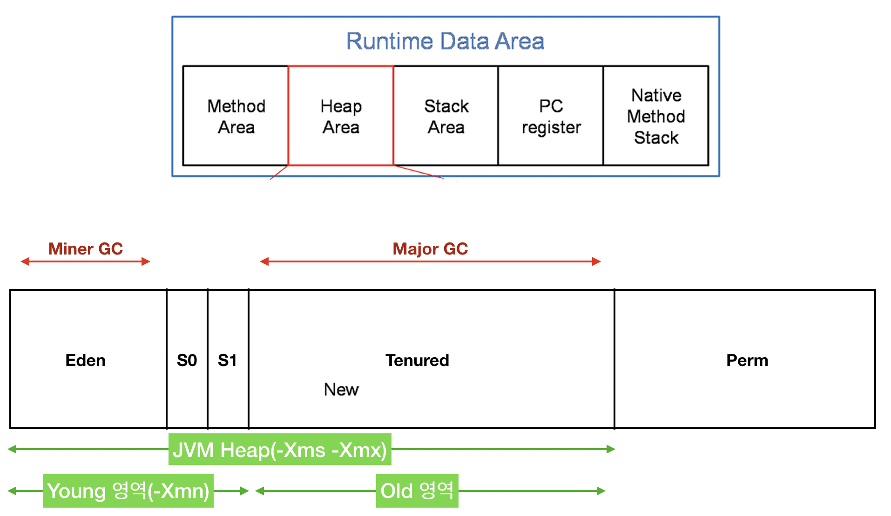
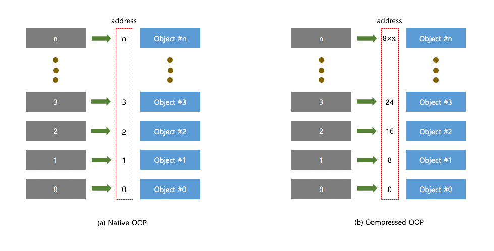
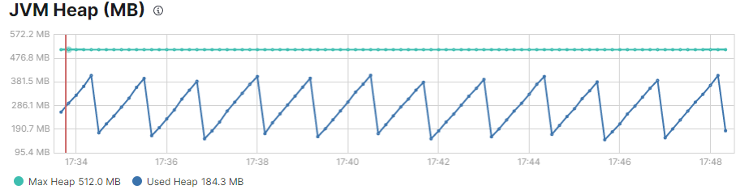
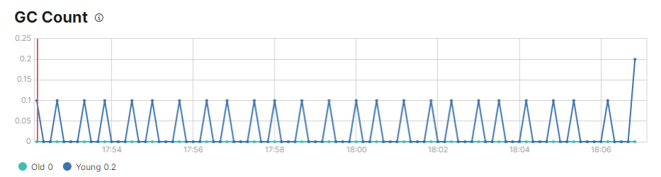
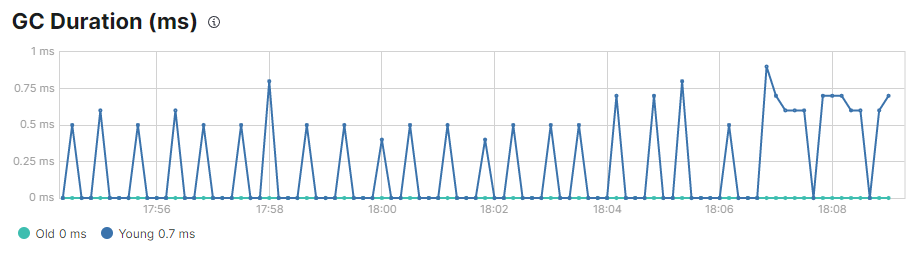

# JVM

- JVM(Java Virtual machine)
  - Java 프로그램의 범주에 들어가는 모든 것을 실행시키는 데몬.
    - Java Byte Code를 실행하는 주체
    - Java Byte Code를 운영체제에 맞게 해석해주는 역할을 한다.
    - 즉,  Java와 OS 사이에서 중개자 역할을 수행하여 OS에 독립적인 플랫폼을 갖게 해준다.
  - 구체적인 구현체를 의미하기도 하지만 스펙에 가까운 개념이다.
    - JVM은 어떠해야 한다는 스펙에 따라 각 vendor(Oracle, IBM)들이 스펙에 맞개 개발한 JVM을 제공한다.
  - 구조
    - Class Loader
    - Runtime Data Areas
    - Execution Engine
    - Garbage Collector


- JAVA 프로그램의 실행 과정
  - 프로그램이 실행되면 JVM은 OS로부터 프로그램이 필요로 하는 메모리를 할당 받는다.
    - JVM은 이 메모리를 용도에 맞게 아래에서 살펴볼 Runtime Data Areas의 여러 영역으로 나누어 관리한다.
  - Java Compiler(javac)가 자바 소스 코드(.java)를 읽어들여 Java Byte Code(.class)로 변환시킨다.
  - JVM의 Class Loader를 통해 class 파일들(java byte code)을 JVM으로 로딩한다.
  - 로딩 된 class 파일들은 JVM의 Execution Engine을 통해 해석된다.
    - Java Byte Code는 기계어가 아니기에 운영체제가 이해할 수 있도록 해석을 해줘야 하는데 이 역할을 JVM이 담당한다.
  - 해석된 바이트코드는 JVM의 Runtime Data Areas에 배치되고 수행이 이루어진다.


- JVM과 가상 메모리

  - 가상 메모리
    - 대부분 현대의 운영체제들은 가상 메모리라는 메모리 관리 기법을 사용한다.
    - 애플리케이션이 실행될 때 물리적인 메모리 번지를 직접 할당해서 메모리 공간을 제공하는 것이 아니라 가상의 메모리 번지를 생성해서 제공하여 애플리케이션 별로 전용 메모리 공간을 사용할 수 있도록 한다.
  
  - Java program 생성
    - 아래와 같은 간단한 java program 을 생성한다.
  
  ```java
  public class HelloWorld {
      public static void main(String[] args) throws Exception {
          while(true) {
              System.out.println("Hello World!");
              Thread.sleep(100);
          }
      }
  }
  ```
  
  - 위 program을 컴파일하고 JVM option을 설정하여 실행한다.
  
  ```bash
  # 컴파일
  $ javac HelloWorld.java
  
  # JVM을 설정하고 실행
  $ java -Xms1024m -Xmx2048m HelloWorld
  ```
  
  - 위 프로그램의 PID를 조회하고, 메모리 사용량을 조회한다.
  
  ```bash
  # PID 확인
  $ jps
  
  # 메모리 사용량 조회
  $ ps -eoeuser,pid,vsz,rss,comm | grep <PID>
  ```
  
  - 결과를 확인하면 위에서 1GB의 가상 메모리를 할당했음에도 4GB의 가상 메모리를 할당 받은 것으로 나오며, 실제 사용 중인 메모리는 21MB뿐이다.
    - 이는 운영체제에 설정된 ulimit 때문이다.
    - 이는 위 테스트 환경에서 virtual memory의 기본 설정값이 unlimited였기 때문이다.
    - 실제 사용 중인 메모리가 적은 이유는 저 정도의 메모리로도 충분히 실행이 가능하기 때문이다.


- `ulimit`

  - `ulimit` 명령어는 애플리케이션이 실행될 때 얼마만큼의 리소스를 할당받을 수 있을지에 대한 전반적인 리소스 관리를 수행한다.
    - 운영체제는 여러 개의 애플리케이션이 동시에 실행될 수 있기에 특정 애플리케이션이 리소스를 독점하지 못하도록 관리하는 것이 중요하다.
    - `ulimit`에는 애플리케이션이 생성될 때 할당 받을 수 있는 리소스의 최댓값이 관리되고 있으며, 이는 모든 애플리케이션에 공통적으로 적용된다.
    - 즉 애플리케이션은 실행될 때 `ulimit`에 설정된 수준까지만 할당받을 수 있다.
    - Elasticsearch도 하나의 프로세스이기 때문에 `ulimit`에서 설정된 값 이상의 리소스는 사용할 수 없다.
  - Elasticsearch는 ulimit을 통해 관리되는 resource 중 open file의 영향을 많이 받는다.
    - Elasticsearch는 여러 개의 segment file을 관리해야 하기 때문에 많은 수의 file descriptor가 필요하다.
    - 그러므로, 아래와 같이 `ulimit -n` 명령어를 통해 file descriptor의 제한을 올려줘야한다.
  
  
  ``` bash
  $ ulimit -n 65535
  ```
  
  - 아래 명령어를 통해한 프로세스가 가질 수 있는 리소스의 정보를 확인할 수 있다.
  
  ```bash
  $ ulimit -a
  ```
  
  - `ulimit` 명령어를 이용한 유저 레벨의 튜닝
    - `ulimit` 값은 신중하게 변경해야한다.
    - 일반적인 경우는 기본 설정값을 사용하는 것만으로도 충분할 때가 많다.
    - `ulimit` 값은 운영체제에서 실행되는 모든 애플리케이션에 적용되기 때문에 각 항목이 의미하는 바가 무엇인지 이해하지 못하고 변경할 경우 전체적인 시스템 밸런스가 무너져 대형 장애가 발생할 수도 있다.
  - 소프트 설정과 하드 설정
    - `ulimit`은 내부적으로 소프트 설정과 하드 설정을 가지고 있다.
    - 소프트 설정은 프로세스가 실행될 때 최초로 할당받는 값이고, 하드 설정은 운영 중에 리소스가 한계에 도달할 경우 추가적으로 할당받을 수 있는 값이라고 이해하면 된다.
    - 이렇게 이중으로 리소스 제한 값을 관리하는 이유는 모든 프로세스가 항상 최댓값으로 설정된 리소스를 할당받을 경우 자칫 리소스 낭비가 심해질 수 있기 때문이다.
    - 대부분의 애플리케이션은 `ulimit`에 설정된 값보다 작은 리소스를 사용하는 것만으로도 충분하기 때문에, 소프트 설정과 하드 설정으로 구분해서 설정하고 소프트 설정보다 큰 리소스가 필요할 경우에만 하드 설정까지 리소스가 늘어나도록 동작한다.
  
  - `ulimit` 영구 설정
    - `ulimit` 명령어를 통해 설정한 내용들은 시스템이 리부팅되면 모두 초기화된다.
    - Linux에서는 `ulimit` 명령어의 설정 내역을 영구적으로 저장하기 위한 용도로 `/etc/security/limits.conf` 파일을 제공한다.
    - 시스템이 리부팅될 때 이 파일의 내용을 참고하기 때문에 `ulimit`과 관련된 설정을 이 파일에 작성하면 영구적으로 설정된다.


- `vm.max_map_count` 설정

  - Elasticsearch는 검색을 위해 내부에 Lucene을 내장하고 있다.
    - Lucene은 색인된 정보들을 다수의 segment file로 관리하고 있으며, 이를 위해 많은 리소스를 사용한다.
    - Java 기반인 Elasticsearch는 태생적으로 가상 머신 위에서 돌아가도록 설계되어 있고 기본적으로는 JVM을 통해 할당 받은 memory만 사용할 수 있다.
    - 하지만 Lucene은 대용량의 segment를 관리하기 위해 많은 resource를 필요로하기에 특별한 방식으로 이러한 제약을 회피한다.
  - Lucene은 내부적으로 Java에서 제공하는 NIO 기술을 활용한다.
    - 이를 통해 OS kernel에서 제공하는 mmap system call을 직접 호출할 수 있으며, 이를 이용하여 VM을 거치지 않고도 직접 kernel mode로 진입할 수 있다.
    - Elasticsearch는 Lucene을 실행하면서 mmap과 niofs 방식의 directory를 적절히 혼용해서 사용한다.
    - 이로 인해 mmap systemcall을 직접 호출할 수 있다.
  - 이로 인해 kernel 수준의 file system cache를 사용할 수 있게 된다.
    - Lucene에서 생성한 segment도 file이기 때문에 file system cache의 이점을 누릴 수 있다.
    - Java heap memory에 의존하지 않으면서도 kernel 수준에서 간접적으로 물리 memory를 사용할 수 있게 돈다.
    - 이 때문에 Elasticsearch에서 heap 설정 시 OS에게 물리 memory의 50%를 양보하는 것이다.
  - Elasticsearch에서 Lucene이 원활하게 동작하기 위해서는 가상 메모리 설정 중 mmap 크기 항목을 변경해야한다.
    - 대부분의 운영체제에서 이 값의 크기가 너무 작기 때문이다.
    - Elasticsearch에서는 bootstrap 과정에서 이 값이 262,244보다 작으면 error message를 출력하고 강제로 종료시킨다.

  - 다음 과정을 통해 변경이 가능하다.

  ```bash
  # 현재 값 확인
  $ cat /proc/sys/vm/max_map_count
  
  # 변경
  $ sudo sysctl -w vm.max_map_count=262144
  ```


- Runtime Data Areas
  - PC Register
    - 스레드가 시작될 때 생성되며, Thread가 어떤 명령어로 실행되어야 할지를 기록하는 영역.
    - 현재 수행중인 JVM 명령의 주소를 갖는다.
  - Stack Area
    - 프로그램 실행 과정에서 임시로 할당되었따가 메소드를 빠져나가면 바로 소멸되는 특성의 데이터를 저장하기 위한 영역.
    - 지역 변수, 매개 변수, 메서드 정보, 연산 중 발생하는 임시 데이터 등이 저장된다.
    - 메서드 호출 시마다 각각의 스택 프레임이 생성되며, 메서드 수행이 끝나면 프레임 별로 삭제한다.
  - Native method stack
    - 자바 프로그램이 컴파일 되어 생성되는 바이트코드가 아닌 실제 실행할 수 있는 기계어로 작성된 프로그램을 실행시키는 영역.
    - Java가 아닌 다른 언어로 작성된 코드를 위한 공간이다.
  - Heap Area
    - 동적으로 할당되는 데이터가 저장되는 영역.
    - 객체(object), array  등이 저장된다.
    - GC를 통해 주기적으로 확보되는 영역이다.
  - Method Area
    - 모든 스레드가 공유하는 영역으로 JVM이 시작될 때 생성된다.
    - JVM이 읽어들인 각 클래스와 인터페이스에 대한 런타임 상수 풀, 필드와 메서드 코드, static 변수, 메서드의 바이트 코드 등을 보관한다.
  - Runtime constant pool
    - Method Area 내부에 존재하는 영역으로 각 클래스와 인터페이스의 상수뿐 아니라 메서드와 필드에 대한 모든 레퍼런스까지 담고 있는 테이블이다.
    - 즉 상수 자료형을 저장하여 참조하고, 중복을 막는 역할을 수행한다.


# heap memory

- heap memory
  - JVM의 Runtime Data Areas 중 Heap Area에 할당된 memory
    - Java로 만든 애플리케이션은 기본적으로 JVM이라는 가상 머신 위에서 동작하는데 OS는 JVM이 사용할 수 있도록 일정 크기의 메모리를 할당해준다.
    - 그 중 객체, Array 등을 저장하기 위한 영역을 Heap Area라 부르는데 이 Heap Area에 할당된 메모리를 Heap memory라 부른다.
  - heap memory는 사용 중인 영역과 사용중이지 않은 영역으로 나뉜다.
    - 사용 중인 영역은 다시 young 영역과 old 영역으로 나뉜다.


- Heap Memory의 구조

  > https://donghyeon.dev/java/2020/03/31/%EC%9E%90%EB%B0%94%EC%9D%98-JVM-%EA%B5%AC%EC%A1%B0%EC%99%80-Garbage-Collection/

  

  - Young Generation
    - 새로운 객체가 생성되었을 때 저장되는 공간이다.
    - 이 영역이 다 차게 되면 **Minor GC**가 실행된다.
    - Eden, survivor0, survivor1의 3가지 영역으로 나뉜다.
    - 새로운 객체가 생성되면 Eden 영역에 저장되고, Eden 영역이 가득 차면 Minor GC가 실행된다.
    - 참조되지 않은 객체들은 Minor GC가 실행되면서 삭제되고, 삭제되지 않은 객체들은 survivor 영역 중 하나로 이동한다.
    - 두 개의 survivor 영역 중 하나가 차게 되면 해당 영역에 Minor GC가 실행되고, 살아남은 object는 다른 GC가 실행되지 않은 survivor 영역으로 이동하게 된다.
  - Old Generation
    - 여러 번의 Minor GC를 거치고도 살아남은 객체들은 Old Generation으로 이동한다.
    - 한 번의 Minor GC에서 살아남을 때 마다 age가 1씩 추가되는 데 age가 몇일 때 부터 Old 영역으로 이동시킬지를 설정 가능하다.
    - Old 영역에서 메모리가 가득 차면 **Major GC**가 발생한다.
  - Perm(Permenet)
    - 이 영역은 Java8부터 삭제되었다.


- Garbage Collection(GC)
  - heap memory를 무한대로 늘릴 수 없으므로 주기적으로 정리해줘야 한다.
    - 시간이 갈수록 사용 중인 heap memory영역이 점점 증가하다가 어느 순간 사용할 수 있는 공간이 부족해지면 사용 중인 영역에서 더 이상 사용하지 않는 데이터들을 지워서 공간을 확보하는데 이런 일련의 과정을 **garbage collection**이라 부른다.
    - 요약하면 GC는 heap memory를 주기적으로 정리해주는 작업이다.
  - GC는 아래의 가정(**weak generational hypothesis**)에 근거한다.
    - 대부분의 객체는 금방 접근 불가 상태(unreachable)가 된다.
    - 오래된 객체에서 젊은 객체로의 참조는 아주 적게 존재한다.
    - 즉 대부분의 객체는 일회성이며, 메모리에 오래 남아있는 경우는 드물다는 것이다.
    - 힙 메모리가 Old/Young 영역으로 나뉜 것 역시 이 가설에 근거한다.


- Elasticsearch의 GC

  - 기본적으로 G1GC 방식을 사용한다.
    - G1GC는 STW를 최소화하기 위해 고안된 알고리즘이다.
    - G1GC는 전체 heap을 region이라는 고정된 크기의 블록으로 나누고(Eden, Survivor, Old) 각각의 영역에 대해 GC를 수행한다.
    - G1GC는 young region을 대상으로 수행되는 Young GC, young 영역과 old 영역을 대상으로 하는 mixed GC, 전체 heap을 대상으로 하는 Full GC 등이 있다.
    - G1GC에서는 minor GC라는 표현 대신 young GC라는 표현을 사용하며, major GC라는 표현 대신 mixed GC라는 표현을 사용한다.
    
  - Mixed GC
    - Old region을 수집하는 전통적인 Major GC를 여러 구역으로 쪼개어 여러 번 실행하는 방식이다.
    - 매 실행마다 Young region 전체 + 쪼개진 Old 영역의 일부 구역을 대상으로 수집을 수행한다.
    - Young GC를 포함하는 상위 개념으로 볼 수 있다.
    - G1GC가 Major GC를 대체하기 위해 도입한 점진적이고 부분적인 Old 영역 수집 방식이다.
  - 모든 종류의 GC는 Stop The World(STW)를 발생시킨다.
    - 그러나 그 범위와 유지 기간은 서로 다르다.
  
  | GC       | 범위              | 기간            |
  | -------- | ----------------- | --------------- |
  | Young GC | Young region      | 1ms ~ 50ms      |
  | Mixed GC | Young, Old region | 200ms <         |
  | Full GC  | Heap 전체         | 수백 ms ~ 수 초 |
  
  - Full GC
    - Young, Old, Metaspace 영역을 포함한 JVM 전체 힙 메모리를 수집하는 작업.
    - 이 과정에서 모든 애플리케이션 스레드가 일시 정지(STW)된다.
    - G1GC의 Mixed GC가 실패할 때 fallback으로 수행되거나, Mixed GC로도 수집이 불충분할 때 발생한다.
    - 발생 자체를 피해야할 GC이며, G1GC는 이를 최대한 방지하기 위해 고안된 방식이다.
    - Full GC가 최대한 발생하지 않도록 관리해야한다.


- Ordinary Object Pointer(OOP)
  - Heap memory에 저장된 data를 object라고 부르며 이 object에 접근하기 위한 메모리상의 주소를 **Ordinary Object Pointer(OOP)**라 부르는 구조체에 저장한다.
  - OOP는 시스템의 아키텍처에 따라 32bit 혹은 64bit 기반의 크기를 가지게 된다.
    - 32bit라면 2의 32제곱(4294967296bit == 4.294967296GB)까지 표현할 수 있기에 최대 4GB까지의 주소 공간을 가리킬 수 있게 된다.
    - 64bit라면 2의 64제곱까지 표현할 수 있기에 이론상 18EB까지의 주소 공간을 가리킬 수 있다.
    - 64bit의 경우 32bit보다 포인터 자체의 크기가 크기 때문에 더 많은 연산을 필요로하고, 더 많은 메모리 공간을 필요로 하기 때문에 성능이 떨어질 수밖에 없다.
    - 따라서 JVM은 64bit 시스템이라도 heap 영역이 4GB보다 작다면 32bit 기반의 OOP를 사용한다.


- Compressed OOP

  - 32bit 기반의 OOP를 사용하는데 heap 영역이 4GB를 넘어갈 경우 문제가 생긴다.
    - 32bit 기반의 OOP로는 4GB를 넘어가는 영역에 있는 object들을 가리킬 수 없기 때문이다.
    - 그렇다고 64bit 기반의 OOP를 사용하자니 성능 저하가 발생할 수 있다.
    - JVM은 이런 상황에서 32bit 기반으로 사용하되, 4GB 이상의 영역을 가리킬 수 있도록 compressed OOP를 사용한다.
  - 기본 OOP와의 차이
    - 아래 그림에서 보이는 것과 같이 OOP는 기본적으로 OOP가 바로 object의 address를 가리킨다.
    - 그러나 Compressed OOP의 경우는 OOP가 주소가 아닌, 8byte 단위로 나눠 놓은 주소의 오프셋을 가리킨다.
    - 그 오프셋은 8의 n배수 값으로 계산되어, 값이 1이면 8번 주소를, 2면 16번 주소를 가리키게 된다.
    - 따라서 표현 할 수 있는 주소의 영역이 기존의 4GB에서 8배 증가한 32GB가 된다.
    - 이를 통해 32bit 기반의 OOP에서도 최대 32GB의 heap 영역을 사용할 수 있게 된다(시스템 마다 다르다).

  

  - 아래와 같은 left shift 연산을 통해 실제 메모리 주소를 참조하게 된다.
    - shift 연산은 연산들 중에서도 상당히 빠른 편에 속하는 연산이므로 크게 성능 저하가 발생하지 않는다.
    - 기존 OOP에 left shift 연산을 3 번 해줌으로써 compressed oop가 가리키는 주소를 얻을 수 있다.

  ```python
  # compressed_oop를 구하는 방법
  native_oop가 가리키는 object = (compressed oop << 3)이 가리키는 object
  
  # 예시
  # Native OOP 2가 object #2를 가리킨다면
  # compressed oop (2 << 3), 즉 16 역시 object #2를 가리킨다.
  ```

  - Compressed OOP를 사용할 수 있는 사용되는 임계치는 시스템 마다 다른데 일반적으로 32GB 정도이다.
    - Compressed OOP를 통해 사용할 수 있는 최대 영역(일반적으로 32GB)을 넘어갈 경우 **64bit 기반의 OOP를 사용**하게 된다.


- Zero Based Heap Memory
  - JVM은 실행될 때 Compressed OOP를 사용해야 하는 상황이 되면 운영체제에게 Heap 영역의 시작 주소를 0에서부터 시작할 수 있도록 요청한다.
    - 주소를 0에서 부터 시작하는 Heap Memory를 **Zero Based Heap Memory**라고 한다.
  - 위에서 native_oop에 left shift 연산을 3 번 해주는 방식으로 compressed_oop를 구할 수 있다고 했는데, 사실 아래와 같은 가정이 존재한다.
    - 주소 공간이 0에서부터 시작해야 한다.
    - 즉 Zero Based Heap Memory여야 한다.
    - 만일 Non-Zero Based Heap Memory라면 (0이 아닌)base 주소를 기반으로 한 덧셈 연산까지 필요하기에 주소 변환에 시간이 걸리게 된다.
  - zero base로 할당 받을 수 있는 임계치 역시 정해져 있으며 이 역시 일반적으로 32GB 정도이다.


- Out Of Memory(OOM)와 Stop-The-World
  - 아래의 두 가지는 애플리케이션의 동작에 영향을 미치는 heap memory 관련 현상들이다.
  - OOM
    - GC를 통해서도 더 이상 heap memory를 확보할 수 없는 상황에서 애플리케이션이 지속적으로 heap memory를 사용하려고 하면 가용할 메모리가 없다는 OOM 에러를 발생시킨다.
    - ES의 경우 OOM이 발생한 노드는 클러스터에서 이탈하게 된다.
  - Stop-The-World
    - GC 작업 중에는 다른 스레드들이 메모리에 데이터를 쓰지 못하도록 막는다.
    - GC가 진행되는 동안에너는 다른 스레드들이 동작하지 못하기 때문에 애플리케이션이 응답 불가 현상을 일으키고 이를 **Stop-The-World** 현상이라 한다.
    - 특히 old GC는 비워야 할 메모리의 양이 매우 많기 때문에 경우에 따라서는 초 단위의 GC 수행 시간이 소요되기도 한다.
    - 이럴 경우 ES 클러스터가 초 단위의 응답 불가 현상을 겪게 된다.


- ES에서의 heap memory

  - Elasticsearch도 Java application이므로 heap memory를 사용한다.
    - index의 data가 disk의 어느 위치에 저장되어 있는지 파악하기 위해 사용한다.
    - 따라서 당연히 색인, 검색 등에도 사용되며, aggs 시에도 사용한다.
  - `jvm.options` 파일에서 설정이 가능하다.
    - ES는 각 노드의 역할과 시스템의 전체 메모리를 고려하여 자동으로 heap size를 설정한다.
    - 가급적이면 이 값을 수정하지 않고 사용하는 것을 권장한다.
    - `Xmx`(최대값)와 `Xms`(최소값)을 설정하여 수동으로 변경할 수 있는데, 이 둘은 반드시 같게 해줘야 한다.
  - heap memory는 일반적으로 아래와 같은 패턴을 보인다.
    - heap memory의 사용률이 서서히 증가하다가 급격히 감소하는 패턴을 보인다.
    - GC를 통해 heap memory 공간이 확보되면서 사용률이 급격히 감소한다.
  
  
  
  - ES에서의 이상적인 GC는 다음과 같다(사진과 무관).
    - Young GC가 50ms내로 종료될만큼 빠르다.
    - Young GC가 빈번하게 발생하지 않는다(약 10초에 한 번).
    - Old GC가 1초 내로 종료될 만큼 빠르다.
    - Old GC가 빈번하게 수행되지 않는다(약 10분 혹은 그 이상에 한 번).
  
  




- Elasticsearch JVM 설정 중 xms(최소 힙 크기)와 xmx(최대 힙 크기)
  - JVM이 처음 실행될 때는 xms에 설정된 크기로 동작하다가 힙이 부족하다고 판단되면 xmx에 설정된 힙 크기까지 자동으로 늘어난다.
  - 이 과정에서 애플리케이션 성능 저하가 있을 수 있다.
  - Elasticsearch는 메모리를 많이 활용하기 때문에 힙 크기가 변경되는 일이 없도록 두 값을 같은 값으로 설정하는 것이 권장된다.


- ES에서 heap memory 사용량을 증가시키는 요소들
  - 많은 bucket들을 aggs 하는 경우
    - 따라서 aggs시에 bucket size를 제한하는 것이 좋다.
  - 한 번의 많은 양의 데이터를 bulk하는 경우
  - aggs등을 실행할 때 `fielddata`를 `true`로 설정하는 경우
    - 즉, 애초에 `fielddata`를 사용하지 않도록 mapping을 잘 설정해야한다.

​	

- Heap memory 크기를 정하는 규칙
  - heap 사이즈를 늘릴수록 cache를 위한 메모리도 증가하지만, 그만큼 garbage collection 시간도 증가(Stop-The-World 증가)하므로 주의해야 한다.
    - 작을수록 색인 및 검색 성능 저하와 함께 OOM이 발생할 수 있다.
    - 클수록 색인 성능 및 검색 성능이 향상될 수 있지만, Stop-The-World가 길게 발생할 수 있다.
  - heap 사이즈가 전체 RAM 용량의 50%를 넘지 않도록 설정하는 것이 좋다. 
    - 그 이상을 heap memory가 차지할 경우 memory를 사용하는 다른 작업의 자원이 부족해질 수 있다.
  - 최대 32GB를 넘기지 않는 것이 권장된다.
    - 32GB를 넘어갈 경우 64bit 기반의 OOP를 사용하게 되기에 성능이 급격히 저하될 수 있다.
    - Compressed OOP,  Zero Based Heap Memory의 임계치가 모두 32GB 정도이기에 32GB를 넘을 경우 성능이 저하될 수 있다.
  - 힙 메모리가 가능한 32GB를 넘지 않도록 권고하는 이유
    - JVM은 연산을 위한 데이터들을 저장하기 위한 공간으로 힙 메모리를 사용한다.
    - 이 때 힙 메모리에 저장되는 데이터들을 오브젝트라 부르고, 이 오브젝트에 접근하기 위한 메모리상의 주소를 OOP(Ordinaty Object Pointer)라는 구조체에 저장한다.
    - 각각의 OOP는 시스템 아키텍처에 따라 32 비트 혹은 64 비트의 주소 공간을 가리킬 수 있는데, 32비트라면 최대 4GB까지의 주소 공간을 가리킬 수 있는 반면 64 비트는 이론상 16EB까지의 주소 공간을 가리킬 수 있다.
    - 하지만 64 비트의 경우 32비트보다 더 넓은 주소 공간을 가리키기 위해 더 많은 연산과 더 많은 메모리 공간을 필요로 하기 때문에 성능 측면에서는 32 비트보다 떨어질 수밖에 없다.
    - 그래서 JVM은 시스템 아키텍처가 64 비트라고 하더라도 확보해야 할 힙 메모리 영역이 4GB보다 작다면 32 비트 기반의 OOP를 사용해서 성능을 확보한다.
    - 문제는 힙 메모리 영역이 4GB보다 클 경우에 발생한다. 32비트의 주소 공간을 사용하는 OOP로는 4GB 이상의 메모리 영역을 가리킬 수 없기 때문이다.
    - 그렇다고 64비트 기반의 OOP를 사용하게 되면 급작스럽게 성능 저하가 발생할 수 있기 때문에 JVM은 Compressed OOP를 통해 32비트 기반의 OOP를 사용하되 4GB 이상의 영역을 가리킬 수 있도록 구현했다.
    - Compressed OOP는 Native OOP에 비해 8배 더 많은 주소 공간을 표시할 수 있게 되고, 이에 따라 기존 4GB에서 32GB까지 힙 메모리 영역이 증가한다.
    - 그렇기에 힙 메모리 할당을 32GB 미만으로 하게 되면 32비트 기반의 OOP를 계속 사용할 수 있게 되고 성능 저하를 피할 수 있게 된다.
  - 전체 메모리의 절반 정로를 힙 메모리로 할당하도록 권고하는 이유
    - ES는 색인된 데이터를 세그먼트라는 물리적인 파일로 저장한다.
    - 파일로 저장하기 때문에 I/O가 발생할 수밖에 없는 구조이다.
    - I/O 작업은 시스템 전체로 봤을 때 가장 느린 작업이기 때문에 빈번한 I/O 작업이 발생한다면 시스템 성능이 떨어진다.
    - OS에서는 이런 성능 저하를 막기 위해 파일의 모든 내용을 메모리에 저장해 놓는 페이지 캐시 기법을 사용한다.
    - 하지만 페이지 캐시는 애플리케이션들이 사용하지 않는 미사용 메모리를 활용해서 동작하기 때문에 페이지 캐시를 최대한 활용하기 위해서는 애플리케이션이 사용하는 메모리를 줄이는 것이 좋다.
    - 특히 ES와 같이 빈번한 I/O 작업이 발생해야 하는 경우 가급적 많은 메모리를 페이지 캐시로 활용해서 I/O 작업이 모두 메모리에서 끝날 수 있도록 하는 것이 성능 확보에 도움이 된다.
    - 이런 이유로 인해 공식 문서에서는 물리 메모리의 절반 정도를 힙 메모리로 할당할 것을 권고한다.
    - 굳이 많은 양의 힙 메모리가 필요하지 않다면 절반 이하로 설정해도 된다.
  
  


- 권장 heap memory
  - 75% 미만: 가장 이상적인 상황이다.
  - 75~85%: 검색 시간이 만족스럽게 나온다면 별 문제가 없지만, bulk, aggs 혹은 대량의 검색을 수행한다면 문제가 될 수 있다는 사실을 인지해야한다.
  - 85%이상: 메모리 사용을 줄이거나 메모리를 늘리는 등의 조치가 필요하다.


- Elasticsearch circuit breaker

  > https://www.elastic.co/guide/en/elasticsearch/reference/current/circuit-breaker.html

  - elasticsearch는 메모리 사용량이 지나치게 높아지는 것(OOM)을 막기 위해 circuit breaker를 사용한다.
  - node에서 memory 문제를 발생시킬만한 요청이 올 경우 ES는 circuit breaker를 통해  `CircuitBreakerException`를 throw하고 해당 요청을 거부한다.


- Elasticsearch를 사용할 때 swapping을 비활성화해야 하는 이유

  - 운영체제 입장에서 봤을 때 swapping은 많은 resource를 사용하는 작업이다.
  - Elasticsearch가 동작하는 데 필요한 memory도 swapping으로 인해 언제든지 disk로 swapping될 수 있다.
    - Swapping이 발생할 경우 node 안정성에 치명적이기 때문에 이를 최대한 피해야한다.
    - Memory를 많이 사용하는 Elasticsearch의 특성상 swapping 작업에 읳 garbage collection이 비정상적으로 수 분 동안 지속되거나 node의 응답이 느려질 수 있다.
    - 또한 cluster의 연결이 불안정해질 수 있다.
  - 운영체제 차원에서 swapping을 막는 방법
    - 일시적으로 비활성화 하거나 파일을 수정하여 영구적으로 비활성화 할 수 있다.

  ```bash
  # 일시적 비활성화
  $ sudo swapoff -a
  
  # 영구적 비활성화
  $ vi /etc/fstab
  ```

  - 운영체제 차원에서 swapping 최소화

    - Swapping을 완전히 비활성화 할 수 없는 상황이라면, swapping 발생 빈도를 조절하는 것도 방법이 될 수 있다.

    - `vm.swappiness` 값을 1로 설정하면 swapping을 최대한 이용하지 않겠다는 의미이다.

  ```bash
  # 확인
  $ cat /proc/sys/vm/swappiness
  
  # 수정
  $ sudo sysctl vm.swappiness=1
  ```

  - Elasticsearch 차원에서 swapping 최소화
    - 위 두 방법은 모두 루트 권한이 필요하기에, 루트 권한이 없다면 사용할 수 없는 방법이다.
    - Elasticsearch는 `bootstrap.memory_lock` 설정이 가능한데, 이를 활성화하면 `mlockall()` 함수와 동일한 방식으로 application 차원에서 swapping을 최대한 방지할 수 있따.
    - `mlockall()`은 호출한 프로세스의 페이징을 금지시키고 모든 memory가 램에 상주하는 것을 보장한다.
    - 다만, memory 사용량이 많아지면 이 설정을 무시하고 swapping이 발생할 수 있다.

  ```bash
  $ vi /<path>/elasticsearch.yml
  
  boostrap.memory_lock: true
  ```

  - `boostrap.memory_lock`이 잘 설정 됐는지 확인
    - 위와 같이 설정해도 실패하는 경우가 있으므로 반드시 확인해야한다.
    - 실패할 경우 WARN level로 로그가 남게 된다.

  ```json
  // GET _nodes?filter_path=**.mlockall
  
  // response
  {
    "nodes" : {
      "PaQsnRrUQZyn4NzfkVFX3A" : {
        "process" : {
          "mlockall" : true
        }
      }
    }
  }
  ```


# 참고

> https://brunch.co.kr/@alden/35
>
> https://hanul-dev.netlify.app/java/%EC%9E%90%EB%B0%94%EA%B0%80%EB%A8%B8%EC%8B%A0(jvm)%EC%9D%B4%EB%9E%80-%EB%AC%B4%EC%97%87%EC%9D%B8%EA%B0%80/