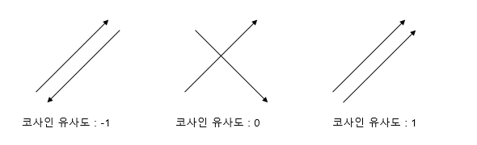

# 사전지식

## 용어

- 단어 집합(vocabulary, 혹은 사전)
  - 서로 다른 단어들의 집합
  - 단어 집합에서는 기본적으로 book과 books와 같이 단어의 변형 형태도 서로 다른 단어로 간주한다.


- 말뭉치(corpus)
  - 자연어 연구를 위해 특정한 목적을 가지고 언어의 표본을 추출한 집합.


- 원-핫 인코딩(One-Hot Encoding)

  - 자연어 처리에서 문자를 숫자로 바꾸는 여러 기법 중 하나
    - 컴퓨터는 문자보다는 숫자를 더 잘 처리하기에 자연어 처리를 할 때에는 문자를 숫자로 변경해준다.
  - 단어 집합(vocabulary, 혹은 사전)
    - 서로 다른 단어들의 집합
    - 단어 집합에서는 기본적으로 book과 books와 같이 단어의 변형 형태도 서로 다른 단어로 간주한다.
    - 텍스트의 모든 단어를 중복을 허용하지 않고 모아놓으면 이를 단어 집합이라 할 수 있다.
  - 단어 집합의 크기를 벡터의 차원으로 표현하고, 표현하고 싶은 단어의 인덱스에 1의 값을 부여하고 다른 인덱스에는 0을 부여하는 단어의 벡터 표현 방식이다.
    - 이렇게 표현된 벡터를 원-핫 벡터라 부른다.
  - 크게 두 단계를 거친다.
    - 각 단어에 고유한 인덱스를 부여한다(정수 인코딩).
    - 표현하고 싶은 단어의 인덱스의 위치에 1을 부여하고, 다른 단어의 인덱스의 위치에는 0을 부여한다.

  - 예시

  ```python
  # 텍스트
  text = '나는 밥을 먹는다.'
  
  # 토큰화
  ['나', '는', '밥', '을', '먹는다']
  
  # 각 단어에 인덱스 부여
  {'나': 0, '는': 1, '밥': 2, '을': 3, '먹는다': 4}
  
  # 원-핫 인코딩을 활용하여 벡터화
  # 각 단어의 인덱스에 해당하는 값만 1이 되고 나머지는 모두 0이 된다.
  [[1,0,0,0,0],	# 나
  [0,1,0,0,0],	# 는
  [0,0,1,0,0],	# 밥
  [0,0,0,1,0],	# 을
  [0,0,0,0,1]]	# 먹는다
  ```

  - 한계
    - 단어의 개수가 늘어날 수록, 벡터를 저장하기 위해 필요한 공간(벡터의 차원)이 계속 늘어난다.
    - 단어 집합의 크기가 곧 벡터의 차원 수가 된다.
    - 만일 단어가 1000개인 코퍼스를 가지고 원 핫 벡터를 만들면, 모든 단어 각각은 모두 1,000 개의 차원을 가진 벡터가 된다.
    - 다시 말해 모든 단어 각각은 하나의 값만 1을 가지고, 999개의 값은 0의 값을 가지는 벡터가 되는데 이는 저장 공간 측면에서 매우 비효율적인 표현 방법이다.
    - 또한 단어의 유사도를 표현하지 못한다는 단점이 존재한다.


- 워드 임베딩
  - 희소 표현(Sparse representation)
    - 원-핫 인코딩을 통해 나온 원-핫 벡터들과 같이 벡터 또는 행렬의 값이 대부분 0으로 표현되는 방법을 희소표현이라 한다.
    - 희소 표현 방식으로 표현한 벡터를 희소 벡터라 한다.
  - 밀집 표현(Dense representation)
    - 희소 표현의 반대 개념으로 벡터의 차원을 단어 집합의 크기로 상정하지 않는다.
    - 사용자가 설정한 값으로 모든 단어의 벡터 표현의 차원을 맞춘다.
    - 이 과정에서 더 이상 0과 1만 가진 값이 아닌 실수값을 가지게 된다.
    - 예를 들어 단어가 1000 개인 코퍼스에서 강아지라는 단어를 희소표현으로는 [1,0,0,0, 996개의 0]과 같이 표현한다면,
    - 밀집 표현에서는 사용자가 차원을 4로 설정했다면 [0.2, 1.8, 1.1, -2.1]과 같이 표현된다.
  - 단어를 밀집 벡터의 형태로 표현하는 방법을 워드 임베딩이라 한다.
    - 밀집 벡터를 워드 임베딩 과정을 통해 나온 결과라고 하여 임베딩 벡터라고도 부른다.


## 벡터 사이의 유사도 측정 방식


- 거리 기반 유사도

  - 두 벡터 사이의 거리를 기준으로 유사도를 측정하는 방식

  - 유클리디안 유사도가 대표적이다.

    - 피타고라스의 정리를 활용하여 직각삼각형의 두 변의 길이가 주어졌을 때 다른 한 변의 길이를 구할 수 있다는 것을 이용한 방법이다.
    - 유클리디안 거리를 계산하는 방법을 L2 Distance라고 한다.
    - 두 좌표 (x1, y1)과 (x2, y2)가 주어졌을 때 두 좌표 사이의 거리를 구하는 공식은 다음과 같다.

    $$
    d = \sqrt{(x_1-x_2)+(y_1-y_2)}
    $$
  
    
  
    - n차원으로 늘어난다면 단순히 값만 추가해주면 된다.
  
    $$
    d = \sqrt{(x_1-x_2)+(y_1-y_2)+...+(x_n-y_n)}
    $$

    

  - 마할라노비스 거리, 맨해튼 거리, 민코스키 거리 등을 활용한 측정 방법도 존재한다.

  - 거리 기반 유사도의 한계
  
    - 위 그림에서 X축이 키, Y축을 몸무게로 하여 포유류의 키와 몸무게를 나타낸 그래프이고, 키와 몸무게를 기준으로 표유류를 구분하려 한다고 가정한다.
    - 일반적으로 키와 몸무게는 정적 상관 관계에 있으므로, 인간은 위의 3 벡터와 아래의 3 벡터 사이를 지나는 형태로 표현이 될 것이다.
    - 그러나, 위 벡터값들 중에서 위 벡터값들 중 키와 몸무게가 가장 작은 벡터값과, 키와 몸무게가 가장 큰 벡터값 사이의 거리가 길어, 거리 기반 유사도로 판단할 경우 두 벡터값 모두 같은 인간임에도, 같은 종이라고 판별하지 못 할 가능성이 있다.


- 각도 기반 유사도

  - 특정 벡터의 각도에 따라 유사도를 측정하는 방식
  - 코사인 유사도가 대표적이다.
    - 두 벡터가 이루는 각도를 통해 유사도를 측정하는 방식.
    - 두 벡터가 이루는 각이 작을수록 유사도가 높은 것이다.
    - 두 벡터의 방향이 완전히 동일한 경우에는 1의 값을 가지며, 두 벡터가 직각을 이루면 0, 180도로 반대의 방향을 가지면 -1의 값을 가지게 된다.
    - 즉 코사인 유사도는 -1 이상 1 이하의 값을 가지게 된다.

  

  - 거리 기반 유사도에 비해 데이터의 크기에 영향을 비교적 덜 받는다.


# faiss Tutorial

- faiss
  - 효율적인 유사도 검색과 밀집 벡터(dense vectors)의 클러스터링(clustering)을 위한 라이브러리
    - 클러스터링: 데이터를 데이터 간의 유사도에 따라 k개의 그룹으로 나누는 것.

  - 유사도 검색
    - d 차원에 x_i라는 벡터들의 집합이 주어지면, faiss는 이들을 가지고 RAM에 index라는 이름의 데이터 구조를 구축한다.
    - 인덱스 구축이 완료된 후 d 차원의 새로운 벡터값 x가 주어지면, 인덱스에서 x와 가장 유사한 벡터값을 찾는다.
    - 가장 유사한 벡터 값의 기준은 Euclidean distance가 가장 짧은 것이다.
    - Euclidean distance외에도 Inner Product를 기준으로 검색하는 것도 가능하며, L1, Linf 등의 기준도 제한적으로 제공한다.
  - C++로 작성되었다.


- faiss는 일반적으로 수십개에서 수백개의 고정된 차원(d)의 벡터 집합을 다룬다.
  - 이 벡터 집합은 메트릭스 형태(행과 열이 있는 형태)로 저장된다.
  - 이 메트릭스에는 오직 32-bit 부동소수점 형태만을 입력이 가능하다.


- faiss 설치하기

  - anaconda를 통해 설치해야 한다.

  ```bash
  # CPU 버전
  $ conda install -c pytorch faiss-cpu
  
  # GPU(+CPU) 버전
  $ conda install -c pytorch faiss-gpu
  
  # 특정 CUDA 버전을 설치
  $ conda install -c pytorch faiss-gpu cudatoolkit=10.2 # for CUDA 10.2
  ```


## 시작하기

- 벡터 샘플 생성해보기

  - numpy의 `random()`  메서드를 이용하여 실제 벡터 값과 유사한 5개의 벡터 샘플을 32차원으로 생성한다.
  - numpy의 `random()` 메서드는 첫 번째 인자로 행의 개수, 두 번째 인자로 열의 개수를 받는다.
  - `seed()` 메서드는 난수를 일정한 규칙에 따라 만들어준다. 인자로 0이상의 정수를 넣은 후 `random()` 메서드를 실행하면 `seed()`에 인자로 넘긴 숫자에 따라 매번 같은 난수를 생성한다.

  ```python
  import numpy as np
  
  d = 32  # dimension
  nv = 5  # 벡터 샘플의 개수
  
  np.random.seed(0)
  # faiss 인덱스에서 허용하는 유일한 타입인 float32 타입을 갖는 5개의 난수를 생성한다.
  vd = np.random.random((nv, d)).astype('float32')
  
  print(vd)
  
  '''
  [[0.4659283  0.42918417 0.01298451 0.9269639  0.05621753 0.7351387
    0.63571554 0.86692244 0.5866233  0.29657757 0.11990956 0.85105425
    0.6538739  0.33062434 0.6977781  0.7647909  0.7351392  0.95469826
    0.05220455 0.8614601  0.3923799  0.17863388 0.22511123 0.70524293
    0.27818888 0.03589209 0.6745775  0.7411113  0.3825581  0.76772106
    0.7750249  0.78105927]
   [0.28354147 0.14845583 0.5041909  0.43917158 0.6028518  0.27814764
    0.93687785 0.925087   0.9161655  0.6958438  0.78605276 0.64411163
    0.8175183  0.9495612  0.3956658  0.2993481  0.8905652  0.52639216
    0.89879274 0.66501343 0.48250428 0.89758825 0.9712463  0.4691813
    0.03092448 0.16588193 0.38339794 0.02846475 0.546486   0.30336487
    0.19934377 0.7564637 ]
   [0.3471091  0.7783196  0.6439691  0.16961639 0.20240185 0.70789915
    0.01438617 0.5426006  0.2617067  0.36044455 0.514728   0.02281249
    0.20670229 0.3750471  0.985061   0.4162246  0.55465186 0.8800842
    0.9513658  0.2916382  0.01115082 0.6450339  0.5791974  0.12054065
    0.48100883 0.8372618  0.6625179  0.30839232 0.671437   0.6918782
    0.63359994 0.02588365]
   [0.16880319 0.14798965 0.78834933 0.6159184  0.27801704 0.854614
    0.32414752 0.03574207 0.43986765 0.95678073 0.14045487 0.09732798
    0.15858607 0.5140166  0.36330354 0.36213607 0.31542563 0.7941953
    0.17334807 0.46838593 0.00850026 0.50660694 0.07101087 0.5871371
    0.70244664 0.99327904 0.6349156  0.35885695 0.13274446 0.37857753
    0.8203621  0.15009409]
   [0.83770096 0.9035732  0.77767766 0.34106514 0.8665412  0.9165315
    0.37519315 0.38307557 0.13840424 0.21772291 0.46787208 0.99518454
    0.53366786 0.5318203  0.2097983  0.52776855 0.9512746  0.06041929
    0.9948824  0.04607703 0.15952021 0.08325534 0.00547846 0.9933608
    0.3836217  0.7754981  0.65809315 0.60108423 0.919548   0.25876355
    0.45998612 0.23619007]]
  '''
  ```


- 예시로 사용할 벡터 샘플 생성하기
  
  - 위에서 생성한 샘플은 5개로 검색 결과를 보기 적절치 않으므로 10000개로 늘려서 다시 생성한다.
  
  ```python
  import numpy as np
  
  d = 32  # dimension
  nv = 10000  # 벡터 샘플의 개수
  
  np.random.seed(0)
  vd = np.random.random((nv, d)).astype('float32')
  ```
  


- 벡터 값들을 넣을 인덱스 생성하기

  - 아래에서 사용한 `IndexFlatL2` 외에도 다양한 인덱스가 존재한다.
  - 대부분의 인덱스는 인덱스에 데이터를 추가하기 전에 훈련(train) 단계가 필요하다.
  - 벡터의 분포를분석하기 위함이다.
  - Flat 인덱스의 경우 별도의 훈련이 필요하지 않다.
  - `index.is_trained`의 값이 False일 경우 훈련이 필요하다는 의미이다.
  - Python의 경우 인덱스에 추가 할 수 있는 자료형은 numpy arrays 뿐이다.
  
  ```python
  import numpy as np
  d = 32  # dimension
  nv = 10000
  
  np.random.seed(0)
  vd = np.random.random((nv, d)).astype('float32')
  
  # 인덱스와 벡터의 차원이 일치해야 한다.
  index = faiss.IndexFlatL2(d)
  
  # train이 필요한지 확인
  print(index.is_trained)	# True
  
  # 인덱스에 벡터값 추가
  index.add(vd)
  
  # 인덱스에 저장된 모든 벡터값들의 개수 확인
  print(index.ntotal)		# 5
  ```


- 검색하기

  ```python
  import numpy as np
  import faiss
  
  d = 32  # dimension
  nv = 10000
  
  np.random.seed(0)
  vector = np.random.random((nv, d)).astype('float32')
  
  index = faiss.IndexFlatL2(d)
  index.add(vector)
  
  # 검색할 벡터 데이터 생성(5개의 검색 샘플 생성)
  query = np.random.random((5,d)).astype('float32')
  
  # 검색
  k = 4  # 4개의 근접한 이웃만 검색
  # 온전성 검사(sanity check)
  D, I = index.search(vector[1:2], k) # 두 번째 인덱스(0부터 시작하므로)에 해당하는 벡터 값으로 검색
  print(I)  # I에는 근접한 벡터값의 인덱스 값이 담기게 된다.
  print(D)  # D에는 근접한 벡터값과의 거리가 담기게 된다.
  
  # 실제 검색
  D,I = index.search(query,k)
  print(I)
  print(D)
  
  '''
  # 온전성 검색 결과
  [[   1 3716 5800  718]] # 두 번째 인덱스에 해당하는 벡터 값으로 검색했으므로 당연히 자기 자신인 두 번째 인덱스에 해당하는 벡터 값이 가장 가깝다.
  [[0.        1.8438569 1.8462296 1.8955519]] # 거리 역시 자기 자신과의 거리는 0이고, 뒤로 갈수록 점점 길이가 길어지게 된다.
  
  # 실제 검색 결과
  [[  48 6093 6629 9866]  # 첫 번째 검색 샘플과 가장 가까운 벡터 값은 48번 인덱스에 해당하는 벡터 값이다.
   [1869 5291 7938 3031]  # 두 번째 검색 샘플과 가장 가까운 벡터 값은 1869번 인덱스에 해당하는 벡터 값이다.
   [5994 2819 2860 6005]
   [7720  685 1802 1294]
   [3569 6522 5737 9841]]
  [[1.9313903 2.2363105 2.28775   2.3178759]  # 첫 번째 검색 샘플과 가장 가까운 벡터 값까지의 거리는 1.9313903
   [1.906551  2.0746326 2.179418  2.2937887]  # 첫 번째 검색 샘플과 가장 가까운 벡터 값까지의 거리는 1.906551
   [1.9943608 2.0128624 2.0983322 2.1263402]
   [2.068733  2.102962  2.2178755 2.2301154]
   [2.1868854 2.3413236 2.3448737 2.3718524]]
  '''
  ```


## 검색 속도 향상

- 보로노이 다이어그램
  - 평면을 특정 점까지의 거리가 가장 가까운 점의 집합으로 분할한 그림.
  - 평면상의 점들 을 가장 가까운 점 2개를 모두 연결한다.
  - 그 후 선들의 수직이등분선을 그어서 분할한다.


- Voronoi cells

  - d 차원 공간을 셀들로 나눈다.
  - 각 벡터 데이터는 나뉜 셀들 중 한 곳에 속하게 된다.

  - Quantization
    - 적은 양의 정보를 가지고 데이터를 표현하는 방법.
    - Vector Quantization: KMeans 클러스터링을 사용하여 벡터 데이터를 압축하여 표현하는 방법


- `IndexIVFFlat` 인덱스를 통해 구현 할 수 있다.
  - `IndexIVFFlat` 인덱스는 학습 단계가 필요하다.
  - 데이터 베이스 벡터와 같은 분포를 가진 모든 벡터 집합이 학습 단계를 거쳐야 한다.
  - `IndexIVFFlat` 는 quantizer, 차원, 셀의 개수를 인자로 받는다.
  - `nprobe`를 통해 총 셀의 개수(nlist) 중에서 방문할 셀의 개수를 지정할 수 있다(기본값은 1).


- 벡터들을 Voronoi cell에 할당하기 위해서 quantizer라 불리는 또 다른 인덱스가 필요하다.
  - 각 셀들은 Voronoi cell의 중심에 의해 나뉘게 되고, 특정 벡터가 속하는 Voronoi cell을 찾으려면 각 셀들의 중심 중 해당 벡터와 가장 가까운 중심이 어디인지를 확인하면 된다.
  - 이 과정을 또 다른 인덱스가 수행하며, 일반적으로 `IndexFlatL2` 인덱스를 사용한다.


- 예시

  ```python
  import numpy as np
  import faiss
  
  d = 32  # dimension
  nv = 10000
  
  np.random.seed(0)
  vector = np.random.random((nv, d)).astype('float32')
  
  index = faiss.IndexFlatL2(d)
  index.add(vector)
  
  query = np.random.random((5,d)).astype('float32')
  
  # cell의 개수
  nlist = 100
  k = 4
  quantizer = faiss.IndexFlatL2(d)  # 벡터들을 Voronoi cell에 할당하기 위한 또 다른 인덱스
  index = faiss.IndexIVFFlat(quantizer, d, nlist)
  # IndexIVFFlat는 학습이 되어야 한다.
  assert not index.is_trained
  index.train(vector)
  assert index.is_trained
  
  index.add(vector)              # add가 약간 느려질 수 있다.
  D, I = index.search(query, k)
  print(I[0])
  index.nprobe = 10              # 10개의 셀을 방문하도록 설정
  D, I = index.search(query, k)
  print(I[0]) 
  
  '''
  # nprobe가 1일 때(한 개의 셀만 방문했을 때)
  [6629 5565 3599  885]
  [2.28775   2.4957926 2.7931914 2.851501 ]
  
  # nprobe가 10일 때(10개의 셀을 방문했을 때)
  [  48 6629 9866 8148]
  [1.9313903 2.28775   2.3178759 2.3552032] # 더 거리가 짧은 벡터를 찾아낸다.
  '''
  ```

  


## 메모리 사용 줄이기

- faiss는 product quantizers를 기반으로 저장된 벡터들을 손실압축 시킬 수 있는 방법을 제공한다.
  - Product Quantizers
    - Vector Quantization의 한 방식.
  - 지금까지 살펴본 `IndexFlatL2`, `IndexIVFFlat` 모두 전체 벡터를 저장한다.
  - 저장된 벡터들의 사이즈를 바이트 수 m으로 줄일 수 있다(m 값은 설정 가능(configurable)).
    - 차원 값(d)는 반드시 m의 배수여야 한다.


- 예시

  ```python
  import numpy as np
  import faiss
  
  d = 32  # dimension
  nv = 10000
  
  np.random.seed(0)
  vector = np.random.random((nv, d)).astype('float32')
  
  index = faiss.IndexFlatL2(d)
  index.add(vector)
  
  query = np.random.random((5,d)).astype('float32')
  
  nlist = 100
  # subquantizers의 수
  m = 8                             
  k = 4
  quantizer = faiss.IndexFlatL2(d)
  index = faiss.IndexIVFPQ(quantizer, d, nlist, m, 8) # 마지막 인자 8은 각 하위 벡터가 8 비트로 인코딩되도록 하겠다는 의미다.
                                      
  index.train(vector)
  index.add(vector)
  D, I = index.search(vector[:1], k)	# sanity check
  print(I)
  print(D)
  index.nprobe = 10
  D, I = index.search(query, k)
  print(I[-5:])
  
  '''
  # sanity check 결과
  [[   0 9095 7042 9822]]
  [[0.1173882 2.05417   2.4009778 2.5053062]]
  
  # 검색 결과
  [6629 7851 4916 1302]
  '''
  ```

  - sanity check 결과를 보면 가장 가까운 이웃은 잘 찾았지만, 추정된 거리를 제대로 계산하지는 못했다.
    - 0번째 인덱스를 검색했으므로 가장 가까운 인덱스로 자기 자신인 0번이 제대로 나왔다.
    - 그러나 자기 자신과의 거리는 0이 아닌 0.1173882가 나온 것을 확인 가능하다.
    - 이는 손실 압축 때문이다.
    - 64차원의 32 비트 부동 소수점을 8 바이트로 압축하였으므로 압축 계수는 32이다.
  - [시작하기]에서 실행했던 검색 결과와 비교하면 큰 차이가 존재하는 것을 확인 가능하다.
    - 시작하기에서 진행했던 query의 첫 번째 벡터 값과 유사한 벡터값들의 인덱스들은 `[ 48 6093 6629 9866 ]`였다.
    - 그러나 위에서 진행한 검색 결과는 `[6629 7851 4916 1302]`로 큰 차이가 존재한다.
    - 그러나 동일한 인덱스 값인 6629가 존재하므로 올바른 구역을 검색했다는 것은 확인 가능하다.
  - 실제 데이터를 가지고 하면 이보다는 나을 것이다.
    - 실제 데이터의 경우, 위의 난수와 같이 아무 관련 없는 데이터들에 비해 훨씬 근접해있다.
    - 또한 균일한 데이터는 클러스터링 또는 손실 압축시에 데이터를 크게 손실시킬만한 규칙성이 존재하지 않기에 손실이 크지 않다.


## GPU에서 실행하기

- Faiss는 nvidia GPU를 거의 완벽하게 사용할 수 있다.
  - `faiss-cpu`가 아닌 `faiss-gpu`가 설치되어 있어야 한다.
  - 작은 데이터에서는 차이가 눈에 띄지 않지만 큰 데이터에서 차이가 드러난다.


- GPU에서 실행하기(faiss-gpu 설치 실패로 실행은 못해봤다)

  - GPU 메모리 덩어리를 캡슐화한 GPU 리소스를 선언한다.

  ```python
  res = faiss.StandardGpuResources()
  ```

  - GPU 리소스를 사용한 GPU 인덱스를 생성한다.
    - 단일 GPU 리소스 객체는 동시 쿼리를 실행하지 않는 한 여러 인덱스에서 사용할 수 있다.
    - GPU 인덱스는 CPU 인덱스와 동일하게 사용하면 된다.

  ```python
  # flat (CPU) index 생성
  index_flat = faiss.IndexFlatL2(d)
  # gpu 인덱스에 넣는다.
  gpu_index_flat = faiss.index_cpu_to_gpu(res, 0, index_flat)
  ```

  - GPU 인덱스에 벡터 데이터를 넣는다.

  ```python
  gpu_index_flat.add(vector)
  print(gpu_index_flat.ntotal)
  ```

  - 검색한다.

  ```python
  # 4개의 가장 가까운 이웃을 탐색한다.
  k = 4                          
  D, I = gpu_index_flat.search(query, k)
  print(I[:5])
  ```


- 다중 GPU 사용하기

  - 다중 GPU를 사용하기 위해서는 복수의 gpu 자원을 선언해야 한다.
  - `index_cpu_to_all_gpus`를 사용하면 복수의 gpu 자원을 선언할 수 있다.

  ```python
  ngpus = faiss.get_num_gpus()
  
  print("number of GPUs:", ngpus)
  
  cpu_index = faiss.IndexFlatL2(d)
  
  # 인덱스를 생헝한다.
  gpu_index = faiss.index_cpu_to_all_gpus(
      cpu_index
  )
  
  gpu_index.add(vector)
  print(gpu_index.ntotal)
  
  k = 4
  D, I = gpu_index.search(query, k)
  print(I[:5])
  print(I[-5:])
  ```


# 기초

## MetricType and distance

- 사전 지식
  - L2
    - 노름(norm): 벡터 공간에서 벡터의 크기 또는 길이를 측정할 때 사용되는 개념.
    - L2는 norm의 한 종류로 유클리디언 디스턴스가 L2 norm이다.
    - 코사인 유사도, 내적 모두 norm의 한 종류이다.
  - inner product(== dot product, scalar product, projection product)
    - "내적"이라 번역하며, 벡터와 관련된 연산 중 하나다.
    - 한 벡터의 norm을 구하거나, 두 벡터 사이의 거리를 측정하는데 이용할 수 있다.
  - 두 아이템의 유사도를 비교하는 다양한 방식이 존재한다.
    - 쿼리 벡터인 q와 답변 후보군 V에 속한 각 답변 벡터들 v_i 사이에 상성이 가장 좋은 것을 찾아야 한다(즉 q와 v_i 사이에 상성이 가장 좋은 것을 찾아야한다).
    - 이 때 어떤 것을 "상성이 가장 좋은 것"으로 볼 것이냐에 따라 아래와 같이 방식이 나뉘게 된다.
    - **Nearest Neighbor Search(NNS)**: q와 v_i의 유클리디안 거리(Euclidean Distance)가 작은 것을 상성이 가장 좋은 것으로 본다.
    - **Maximum Cosine Similarity Search(MCSS)**: q와 v_i의 코사인유사도(Cosine Similarity)가 큰 것을 상성이 가장 좋은 것으로 본다.
    - **Maximum Inner Product Search(MIPS)**: q와 v_i의 내적이 큰 것을 상성이 가장 좋은 것으로 본다.


- Faiss 인덱스는 크게 L2와 inner product(내적)라는 두 개의 메서드를 지원한다.
  - 그 밖의 메서드들은 `IndexFlat`에서 지원한다.


- METRIC_L2
  - Faiss는 제곱근을 피하기 위해서 유클라디안(L2) 거리의 제곱을 알려준다.
  - 따라서 정확한 거리를 알고자 한다면 Faiss가 반환한 결과 값에 루트를 씌워야 한다.


- METRIC_INNER_PRODUCT
  - 일반적으로 MIPS(Maximum Inner Product Search)에 사용된다.
  - 벡터가 정규화되지 않는 한 이 값은 코사인 유사도라고 할 수는 없다.
  - METRIC_L2에서도 MIPS를 수행하는 방법이 있다.


- 코사인 유사도를 계산하기 위해 벡터를 인덱스에 저장하는 방법
  - `METRIC_INNER_PRODUCT`로 인덱스(IndexFaltIP)를 생성한다.
  - 인덱스에 벡터값들을 저장하기 전에 벡터값들을 정규화한다.
    - Python에서는 `faiss.normalize_L2` 메서드를 사용하여 정규화가 가능하다.
  - 검색 전에 벡터값들을 정규화한다.
  - `d_L2^2 = 2 - 2 * d_IP`와 같이 거리 계산 방식이 다르다는 것만 제외하면 `METRIC_L2`를 사용해도 된다.


- Mahalanobis distance를 계산하기 위해 벡터를 인덱스에 저장하는 방법
  - 마할라노비스 거리
    - 평균과의 거리가 표준편차의 몇 배인지를 나타내는 값
    - 변형된 공간에서는 L2 거리와 동일하다.
  - 공간을 변형시키는 방법
    - 데이터의 공분산 메트릭스를 계산한다.
    - 모든 벡터(쿼리와 정답 후보군 벡터 모두)에 공분산 행렬의 숄레스키 분해 역을 곱한다.
    - `METRIC_L2` 인덱스에 색인한다.


## Clustering, PCA, Quantization

- Faiss는 효율적인 몇 개의 알고리즘으로 구현되었다.

  - k-means clustering

    - 클러스터링 알고리즘의 하나
    - 각 클러스터의 중심을 Centroid라 부른다.
    - K-means Clustering은 K개의 Centroid를 기반으로 K개의 클러스터를 만들어주는 것
- 랜덤하게 clustering하여 k개 그룹으로 나눈다.
    - 각 그룹의 평균점(mean)을 계산 한다. 
    - 모든 그룹의 개별 포인터 들이 어떤 그룹의 평균점에 가까운지를 계산한다.
    - 더 평균점이 가까운 그룹으로 재할당한다. 
    - 재할당 후 다시 위의 과정을 반복한다.
    - 재할당될 포인터가 없으면 종료된다.


- PCA(Principal Component Analysis, 주성분분석)
  
  - 차원 축소와 변수 추출(기존 변수를 조합해 새로운 변수를 만드는 기법) 기법의 하나.
  - 데이터의 분산을 최대한 보존하면서 고차원 데이터를 저차원 데이터로 환원시키는 기법.
  - 서로 연관성이 있는 고차원 공간의 표본들을 선형 연관성이 없는 저차원 공간의 표본으로 변환하기 위해 직교 변환을 사용한다.


- PQ(Product Quantizer) encoding/decoding
  - `ProductQuantizer` 객체를 사용하여 벡터를 코드로 인코딩하거나 디코딩할 수 있다.
  - `ScalarQuantizer`도 유사하게 동작한다.


- Clustering

  - faiss는 k-means를 효율적으로 구현할 수 있게 해준다.
  - 2-D 텐서(batch size * dimension) x에 저장된 벡터 세트를 클러스터링 하는 방법

  ```python
  # 클러스터 중심의 개수(1024개의 클러스터가 생성되게 된다.)
  ncentroids = 1024
  # 클러스터링을 반복할 횟수
  niter = 20
  # verbose를 True로 설정하면 initialize 와 iteration 단계가 출력된다.
  verbose = True
  d = x.shape[1]
  kmeans = faiss.Kmeans(d, ncentroids, niter=niter, verbose=verbose)
  kmeans.train(x)
  ```

  - 결과 확인
    - 중심값은 `kmeans.centroids`에 저장된다.
    - 반복에 따른 목적 함수(objective function)값 (k-means의 경우 총 제곱 오차값)은`kmeans.obj`에 저장된다. 
    - 더 구체적인 통계는 `kmeans.iteration_stats`에 저장된다.
  - 추가 옵션
    - `nredo`: 클러스터링을 반복할 횟수를 지정하며, 최적의 중심값은 다음번 반복에도 유지된다.
    - `spherical`: spherical k-means를 수행한다.
    - `int_centroids`: 중심값을 정수형으로 조정한다.
    - `update_index`: 각 반복이 끝날 때 마다 인덱스를 재훈련시킨다.
    - `min_points_per_centroid`/`max_points_per_centroid`: 각 중심값 당(클러스터 당) 최소, 최대 포인트 수를 지정한다. 
    - `seed`: 무작위로 숫자를 생성할 때 seed를 설정한다.
    - `gpu`: boolean 값이나 int 값을 받으며 True로 설정하면 가용한 모든 gpu를 사용하고, 1이상의 정수를 입력하면 해당 정수만큼의 gpu를 사용한다.
  - kmeans가 훈련을 마친 후, 각 벡터 값들과 가장 가까운 중심값을 찾아내기

  ```python
  # I에는 각 벡터와 가장 가까운 중심값이 담기게 되고, D에는 그 L2 거리의 제곱이 담기게 된다.
  D, I = kmeans.index.search(x, 1)
  ```

  - 역으로 중심값으로 벡터 값을 찾아내기
    - 새로운 인덱스를 사용해야 한다.

  ```python
  index = faiss.IndexFlatL2 (d)
  index.add (x)
  D, I = index.search (kmeans.centroids, 15) # 중심값들에서 가장 가까운 15개의 벡터값들을 찾기
  ```


- PCA

  - 40 차원의 벡터를 10 차원으로 줄이기

  ```python
  # 벡터값 생성
  mt = np.random.rand(1000, 40).astype('float32')
  mat = faiss.PCAMatrix (40, 10)
  mat.train(mt)
  assert mat.is_trained
  tr = mat.apply_py(mt)
  # tr의 열의 크기가 감소했는지 확인
  print (tr ** 2).sum(0)
  ```


## 인덱스를 선택할 때 고려할 사항

- 적은 수의 데이터를 검색할 경우
  - 1000~10000 개의 데이터를 검색하려 할 경우 `Flat` 인덱스를 사용하는 것이 좋다.
  - 만일 전체 데이터셋이 RAM과 맞지 않는다면, 작은 인덱스로 분할하여 만들 수 있다.
    - 그리고 검색 결과를 합치면 된다.
    - [참고](https://github.com/facebookresearch/faiss/wiki/Brute-force-search-without-an-index#combining-the-results-from-several-searches)


- 정확한 검색 결과를 원할 경우
  - 정확한 검색 결과를 보장하는 인덱스는 `IndexFlatL2`와 `IndexFlatIP`뿐이다.
    - 두 인덱스는 다른 인덱스의 베이스가 되는 인덱스이다.
    - 이들은 벡터를 압축하지 않는다.
  - 그러나 `add_with_ids`메서드로 id값을 추가할 수 없다.
    - 추가하려면 `IDMap, Flat`을 사용해야 한다.
  - Flat 인덱스는 훈련이 필요하지 않으며, 필수적으로 받아야 하는 파라미터도 존재하지 않는다.
  - GPU 사용이 가능하다.


- 메모리가 걱정될 경우
  - 모든 faiss 인덱스는 RAM에 저장된다.
    - 결과가 매우 정확할 필요가 없고, RAM이 제한된 상황이며, 메모리가 제약된 상황에서 정확도와 속도를 맞 바꿔도 될 경우.
  - 위와 같은 상황에서는 아래에서 소개할 인덱스를 사용하는 것을 고려해볼만 하다.


- 메모리를 고려하지 않아도 될 경우
  - RAM이 넉넉하거나 dataset이 작을 경우 `HNSW `를 사용하는 것이 좋다.
    - 매우 빠르고 정확하다.
    - 속도와 정확성의 교환은 `efSearch` 파라미터를 통해 이루어진다.
    - 메모리 사용은 각 벡터 당 `d*4+M*2*4`이다. 
      - 4 <= M <= 64인 M은 각 벡터의 링크들의 수를 나타낸다. 높을수록 정확도가 높아지지만 RAM을 많이 사용한다.
      - FlatL2, FlatIP의 경우 정확한 검색 결과를 보장하지만 메모리 사용량은 (4*d)로 HNSW보다 적게 사용한다.
    - `add_with_ids`메서드로 id값을 추가할 수 없으나, `IDMap`를 활용하면 가능해진다.
    - 훈련을 필요로하지 않는다.
    - 인덱스에서 벡터값을 삭제할 수없다.
  - `IVF`, `PQ`
    - `HNSW`보다 빠르지만 다시 순위를 매기(re-ranking)는 단계가 있어 추가적인 파라미터가 필요하다.
    - 둘 다 순위를 재 지정하기 위해 `k_factor` 파라미터가 필요하다.
    - `IVF`의 경우 `nprobe` 파라미터가 추가적으로 필요하다.
  - 모두 GPU 사용이 불가능하다.


- 메모리가 신경 쓰일 경우
  - dataset에 대한 클러스터링을 수행한 후 `Flat` 인덱스를 사용한다.
  - `Flat`은 데이터를 압축하지 않기 때문에, 클러스터링 후에도 index에 저장된 벡터값들의 크기와 원본 데이터의 크기가 동일하다.
  - 속도와 정확성 사이의 교환은 `nprobe` 파라미터를 통해 이루어진다.
  - GPU 사용이 가능하다.


- 상당히 중요할 경우
  - 전체 벡터를 저장하는 것이 부담스러울 경우 아래와 같은 방법을 사용할 수 있다.
    - `OPQ`로 차원을 감소시킨다.
    - `PQ`로 벡터의 quantization을 *M* 4-bit codes로 변경한다.
  - 이를 통해 전체 저장 공간은 벡터당 M/2로 줄어들게 된다.
  - GPU 사용이 가능하다.


- 매우 중요할 경우
  - `PQ`는 M-byte 코드를 산출하는 product quantizer를 사용하여 벡터들을 압축한다.
  - M은 일반적으로 64 이하이며, 보다 큰 코드의 경우 일반적으로 SQ가 더 빠르고, 정확하다.
  - OPQ는 벡터들을 보다 쉽게 압축할 수 있게 해주는 선형 변환이다.
  - D는 다음과 같은 차원이다.
    - d는 M의 배수이다.
    - D <= d, d는 입력 벡터의 차원(권장 사항)
    - M = 4*d(권장사항)
  - GPU 사용이 가능하다.


- 데이터 용량에 따른 가이드
  - [참고](https://github.com/facebookresearch/faiss/wiki/Guidelines-to-choose-an-index#how-big-is-the-dataset)


# Faiss indexes

## basic index 목록

> 클래스 생성자를 사용하거나 `.index_fatory()` 메서드를 사용하여 생성할 수 있다.

| Method                                                   | Class name                | `index_factory`          | Main parameters                                              | Bytes/vector                                        | Exhaustive | Comments                                                     |
| -------------------------------------------------------- | ------------------------- | ------------------------ | ------------------------------------------------------------ | --------------------------------------------------- | ---------- | ------------------------------------------------------------ |
| L2를 정확히 검색                                         | `IndexFlatL2`             | `"Flat"`                 | `d`                                                          | `4*d`                                               | yes        | brute-force                                                  |
| Inner Product를 정확히 검색                              | `IndexFlatIP`             | `"Flat"`                 | `d`                                                          | `4*d`                                               | yes        | cosine 유사도 검색도 가능 (사전에 vectros를 정규화 시켜야 한다.) |
| Hierarchical Navigable Small World graph exploration     | `IndexHNSWFlat`           | `HNSWx,Flat`                              | `d`, `M` | `4*d + x * M * 2 * 4` |no||
| Inverted file with exact post-verification               | `IndexIVFFlat`            | `"IVFx,Flat"`            | `quantizer`, `d`, `nlists`, `metric`                         | `4*d + 8`                                           | no         | inverted lists에 벡터를 할당하기 위해 추가적인 인덱스를 사용해야 한다. 8 개의 추가 바이트를 벡터 ID로 저장한다. |
| Locality-Sensitive Hashing (binary flat index)           | `IndexLSH`                | -                        | `d`, `nbits`                                                 | `ceil(nbits/8)`                                     | yes        | 무작위 투영 대신 무작위 로테이션을 사용하여 최적화한다.      |
| Scalar quantizer (SQ) in flat mode                       | `IndexScalarQuantizer`    | `"SQ8"`                  | `d`                                                          | `d`                                                 | yes        | 컴포넌트 당 4 비트 및 6비트도 구현 된다.                     |
| Product quantizer (PQ) in flat mode                      | `IndexPQ`                 | `"PQx"`, `"PQ"x"x"nbits` | `d`, `M`, `nbits`                                            | `ceil(M * nbit / 8)`                                | yes        |                                                              |
| IVF and scalar quantizer                                 | `IndexIVFScalarQuantizer` | "IVFx,SQ4" "IVFx,SQ8"    | `quantizer`, `d`, `nlists`, `qtype`                          | SQfp16: 2 * `d` + 8, SQ8: `d` + 8 or SQ4: `d/2` + 8 | no         | `IndexScalarQuantizer`와 동일하다.                           |
| IVFADC (coarse quantizer+PQ on residuals)                | `IndexIVFPQ`              | `"IVFx,PQ"y"x"nbits`     | `quantizer`, `d`, `nlists`, `M`, `nbits`                     | `ceil(M * nbits/8)+8`                               | no         |                                                              |
| IVFADC+R (same as IVFADC with re-ranking based on codes) | `IndexIVFPQR`             | `"IVFx,PQy+z"`           | `quantizer`, `d`, `nlists`, `M`, `nbits`, `M_refine`, `nbits_refine` | `M+M_refine+8`                                      | no         |                                                              |

## 벡터를 인코딩하는 방식

- 압축하지 않는 방식(`IndexFlat`)
  - 벡터들을 압축 없이 저장한다.


- 16-bit float 인코딩(`QT_fp16`를 사용하는 `IndexScalarQuantizer`)
  - 벡터들이 16-bit floats로 압축된다.
  - 어느 정도 손실이 발생할 수 있다.


- 8/6/4-bit interger 인코딩(`QT_8bit`/`QT_6bit`/`QT_4bit` 를 사용하는 `IndexScalarQuantizer`)
  - 벡터가 256/64/16 levels로 quantize 된다.


- PQ encoding(`IndexPQ`)
  - 벡터들이 각각 일정 비트(일반적으로 8비트)로 quantize된 서브 벡터로 분리된다.


## Flat indexes

- Flat index는 벡터값들을 압축하지 않는 인덱스이다.
  - Flat index는 벡터들을 고정된 크기의 코드로 인코딩하고 이를 `ntotal * code_size` 바이트 배열에 저장한다.
  - 검색은 인덱스의 모든 벡터들이 순차적으로 디코딩되고 query(검색어) 벡터와 비교하는 방식으로 수행된다.
  - `IndexPQ`의 경우 비교 과정이 더 빠른 압축된 domain에서 수행된다.


- 지원하는 기능
  - 순차적으로 넘버링이 되기에 `add_with_id`를 지원하지 않는다.
    - 단 `IndexIDMap`를 사용하면 가능하다.
  - 효율적이고 직접적으로 벡터에 접근할 수 있는 방법이 없다.
  - `remove`를 사용한 삭제가 가능하다.
    - 단, remove를 하면 넘버링이 변경된다.


## Cell-probe methods(`IndexIVF*` indexes)

- Cell-probe methods
  - 검색의 정확성을 희생하여 속도를 올리는 일반적인 방법은 k-means와 같은 분할(partitioning) 기법을 사용하는 것이다. 
    - 이와 같은 방식을 Cell-probe methods라 부른다.
  - faiss는 Multi-probing 기반의 partition-based method를 사용한다.
    - 특징 공간(feature space, 관측하려는 값들이 있는 공간)을 `nlist` 셀로 분할한다.
    - 저장된 벡터값들은 quantization 함수(k-means 등)를 사용하여 이 셀들 중 하나에 할당되고(k-means의 경우 query와 가장 가까운 중심값을 갖는 셀에 할당), `nlist` inverted lists로 구성된 inverted file structure에 저장된다.
    - query가 들어오면, `nprobe` inverted lists의 집합이 선택된다.
    - 그 후 query를 이 lists에 할당된 벡터값들을 비교한다.
    - 이를 통해 전체 벡터값들 중 일부만 쿼리와 비교하게 된다.
    - 근사값은 `nprobe/nlist`이지만, inverted lists의 길이가 동일한 것이 아니기에, 근사값은 일반적으로 이는 실제보다 과소평가된다. 
    - 주어진 쿼리와 가장 가까운 이웃 셀이 선택되지 않으면 실패하게 된다.


- Flat index를 coarse quantizer로 사용하는 Cell probe method
  - 일반적으로 Flat index를 quantizer처럼 사용한다.
    - `IndexIVF `의 훈련메소드는 flat index에 중심값들을 추가한다.
    - `nprobe` 는 query가 들어올 때 정확한 값을 가지게 된다(속도와 정확도 사이의 교환을 측정하는데 유용하다).
  - 인덱싱 할 포인트 수를 n으로 표시하는 일반적인 방법은 inverted lists를 파싱 할 때 수행 되는 거리 계산 횟수로 중심에 대한 할당 비용의 균형을 맞추는 것이다(k-means의 경우 `nlist * d`).
    - `nprobe / nlist * n * C`에서 상수(C)는 list의 고르지 않은 분포를 설명하고, 단일 벡터 비교가 중심값으로 일괄적으로 수행 될 때 보다 더 효율적으로 수행된다는 사실을 설명한다
    - 이로 인해 `nlist = C * sqrt (n)` 형식의 여러 중심값이 생성된다.
  - Flat index가 아닌 다른 타입의 coarse quantizer를 사용할 수 있다.
    - 상황에 따라 GPU based quantizer, `MultiIndexQuantizer`, 또는 HNSW based quantizer를 사용하는 것이 더 나을 수도 있다.


- `IndexIVF`의 벡터 인코딩
  - inverted lists는 인코딩된 벡터값들(과 그에 대응하는 벡터 id들)로 이루어져 있다.
  - 인코딩은 주로 벡터를 더 조밀하게(compact)만든다.
  - inverted lists 내부의 벡터값들은 순차적으로 스캔되며, 검색 함수는 실행 당시까지 본 가장 짧은 거리의 top-k를 반환한다.


- 지원하는 기능은 Flat 인덱스와 동일하다.


## IndexHNSW

- HNSW(Hierarchical Navigable Small World graphs) 인덱싱 메서드는 인덱싱된 벡터값들로 구성된 그래프에 기초한다.
  - 검색이 실행될 때, 가장 가까운 이웃에 가능한 빠르게 이동하는 방식으로 그래프를 탐색한다.
  - Flat 인덱스를 기본 저장소로 사용하여 저장된 벡터에 빠르게 접근하고, 벡터의 압축과 압축 해제를 추출한다.


- HNSW는 아래와 같은 파라미터를 받는다.
  - M: 인덱스가 생성 될 때 그래프상에 새로운 요소가 추가될 때, 해당 요소에 연결할 이웃의 수를 나타낸다.
    - 클 수록 결과는 정확해지지만 많은 메모리를 사용한다.
    - 검색 속도에는 영향을 미치지 않는다.
  -  efConstruction: 추가할 때 탐색의 깊이.
  - efSearch: 검색할 때 탐색의 깊이
    - 클수록  정확도는 높아지지만 시간도 오래 걸린다.


- 인코딩
  - `IndexHNSWFlat`: 인코딩 하지 않는다.
  - `IndexHNSWSQ`: scalar quantizer
  - `IndexHNSWPQ`: product quantizer
  - `IndexHNSW2Level`: two-level encoding


- 지원하는 기능
  - Flat index에서 지원하지 않는 것은 모두 지원하지 않는다.
  - 추가적으로 인덱스에서 벡터를 삭제하는 것도 불가능하다(삭제시 그래프 구조가 파괴된다). 


# 참고

- 내용 출처
  - https://github.com/facebookresearch/faiss/wiki
  - https://medium.com/platfarm/mips-c1db30a3e73e
  - https://nittaku.tistory.com/290
  - https://ita9naiwa.github.io/recommender%20systems/2019/10/04/hnsw.html
  - https://specialscene.tistory.com/48
  - https://needjarvis.tistory.com/516?category=619253
- 이미지 출처
  - http://school.fastcampus.co.kr/blog/data_dss/60/
  - https://wikidocs.net/24603