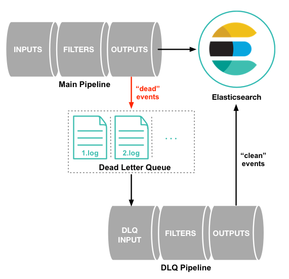

# Logstash

- Elasticsearch에서 개발한 data pipeline이다.

  - Kafka, Database, Elasticsearch, Redis를 비롯한 다양한 input plugin과 마찬가지로 다양한 output plugin이 있어 쉽게 data를 옮길 수 있다.

  - 다양한 설정 관련 file이 있으며, 각 file이 있어야 할 위치가 정해져있다.

    > https://www.elastic.co/guide/en/logstash/current/dir-layout.html#dir-layout
    
  - Elasticsearch에서 제공하는 Centralized Pipeline Management라는 기능이 있으나, 구독형 서비스로 모든 기능을 사용하려면 license가 있어야한다.
  
    - Elasticsearch에 API 요청을 보내 Logstash pipeline을 생성,  수정, 삭제할 수 있게 해준다.


- Memory Queue
  - Logstash는 event들을 memory queue에 저장한다.
    - 따라서 일시적인 장애가 발생할 경우 memory queue에 담겨 있던 data들이 유실될 가능성이 있다.
    - 데이터 유실을 막기 위해서 Kafka 등의 추가적인 외부 queue를 사용하거나 Logstash에서 제공하는 Persistent  Queue를 사용해야한다.
  - Logstash가 disk가 아닌 memory queue에 data를 저장하는 이유는 다음과 같다.
    - 설정이 간편하다.
    - 관리가 간편하다.
    - 처리 속도가 빠르다.
  - Memory queue size
    - Memory queue의 size를 사용자가 직접적으로 설정할 수는 없다.
    - Logstash의 다른 설정들에 따라 자동으로 결정된다.
    - 상한선은 `pipeline.workers`과 `pipeline.batch.size`를 곱한 값으로, 둘 다 기본값으로 설정되었을 경우 125개가 된다.
    - 이를 inflight count라 부르며, 각 memory queue가 보관할 수 있는 event의 최대 개수이다.
    - worker의 개수를 두 배로 늘리면 inflight count가 두 배가 될 것이며, batch size를 두 배로 늘려도 마찬가지로 inflight count가 두 배가 될 것이고, 둘 다 두 배로 늘리면 inflight count는 네 배가 될 것이다.


- Pipeline 생성하기

  - Pipeline configuration file 생성하기
    - input, filter, output으로 구성된다.
    - filter는 필수가 아니지만, input, output은 반드시 있어야한다.

  ```
  input {
    ...
  }
  
  filter {
    ...
  }
  
  output {
    ...
  }
  ```

  - Pipeline 설정 적용하기

    - 위에서 작성한 configuration을 pipeline에 적용하는 방법은 다음과 같다.
    - Logstash는 pipeline configuration file들이 저장된 folder(이하 `conf` folder)의 위치를 설정으로 받는다.
    - 이는 `logstash.yml`에서 `path.config` 설정을 변경하여 기본 directory를 변경할 수 있다.
    - 만일 설정을 변경하지 않았을 경우의 기본값은 운영체제마다, 설치 방식마다 다르다(docker의 경우 `/usr/share/logstash/pipeline`가 기본 경로이다).
    - Logstash는 `conf` folder에 저장된 모든 `*.conf` 형식의 file들을 읽어서 pipeline을 구성한다.
    - Logstash 실행시 `-f` 옵션으로 어떤 config file을 읽을지 선택이 가능하다.

  - `conf` folder에  `.conf` 파일이 여러 개일 경우.

    - `.conf` 파일이 여러 개일 경우 logstash는 `.conf` 파일들을 하나의 `.conf` 파일로 합친 후 이를 기반으로 단일 pipeline을 구성한다.
    - 이 경우 여러 `.conf` file의 모든 input의 값이 여러 `.conf` file의 모든 filter를 거쳐 여러 `.conf` file의 모든 output으로 전송된다.

  - 주의사항

    - Logstash 설치시 기본적으로 아래와 같은 sample `.conf` 파일이 포함되어 있다(설치 방식, 운영체제에 따라 내용, 위치 등은 다르며, 아래는 docker 기준이다).

    ```
    input {
      beats {
        port => 5044
      }
    }
    
    output {
      stdout {
        codec => rubydebug
      }
    }
    ```

    - 상기했듯 logstash는 `.conf` 파일을 지정해주지 않으면 pipeline configuration folder에 있는 모든 file을 읽어서 하나의 `.conf` file을 구성한 후 이를 하나의 pipeline으로 실행시키므로, 예시 file의 내용도 pipeline에서 실행되게 된다.
    - 따라서 반드시 해당 `.conf` file을 삭제한 뒤 실행해야한다.

  - Worker

    - 하나의 pipeline은 여러 개의 worker들에 의해 처리되게 된다.
    - 정확히는 input은 logstash에 의해 처리되고, filter와 output이 여러 개의 worker에 의해 처리된다.
    - Worker의 개수는 `logstash.yml`, `pipeline.yml` 등에서 설정 가능하다.


- `logstash.yml`
  - Logstash와 관련된 설정을 변경할 수 있는 file이다.
    - `pipeline.yml`이 개별 pipeline들에 적용될 설정을 입력하는 file이라면 `logstash.yml`은 모든 pipeline에 기본값으로 적용될 설정을 입력하는 file이다.
  - 성능과 관련된 주요 설정은 다음과 같다.
    - `pipeline.workers`: 각 pipeline별 worker의 개수를 설정한다. 기본값은 host machine의 CPU core 개수이다.
    - `pipeline.batch.size`: 하나의 worker가 input으로 들어온 event를 최대 몇 개까지 모아서 filter와 output을 처리할지를 설정하는 옵션으로, 값이 클 수록 성능이 좋아지지만, OOM이 발생할 위험이 있다.
    - `pipeline.batch.delay`: `pipeline.batch.size`가 차지 않더라도 일정 시간이 지나면 worker는 지금까지 모은 event만으로 처리를 시작하는데, 그 기간을 설정하는 옵션이다.


- 여러 pipeline 생성하기

  - `pipelines.yml` file을 작성하여 여러 개의 pipeline을 하나의 instance에서 실행시키는 것이 가능하다.
    - `logstash.yml`에 있는 모든 설정을 적용할 수 있다.
    - 따로 설정을 주지 않을 경우 `logstash.yml`에 설정한 값이 기본값으로 설정된다.
    - 설정을 해줄 경우 `logstash.yml`에 설정한 값은 무시된다.
    - `pipelines.yml` file은 반드시 `path.settings`(docker 기준 `/usr/share/logstash/config`)에 위치해야한다.
  - 예시
    - `pipelines.yml` file에 실행시키고자하는 pipeline들의 정보를 입력하면 된다.
    - 아래 예시와 같이 `pipeline.id`를 입력하고, 해당 pipeline을 구성할 때 사용할 `.conf` file의 위치를 입력한다.
    - 각 pipeline 마다 worker의 수를 다르게 주는 것도 가능하다.

  ```yaml
  - pipeline.id: my-pipeline_1
    path.config: "/etc/path/to/p1.conf"
    pipeline.workers: 3
  - pipeline.id: my-other-pipeline
    path.config: "/etc/different/path/p2.cfg"
    queue.type: persisted
  ```
  
  - `-f` 옵션을 주지 않고 logstash를 실행하면 `pipelines.yml`에 정의된 대로 pipeline들을 생성한다.
  
  ```bash
  $ bin/logstash
  ```


- Pipeline을 동적으로 추가, 삭제하기

  - 위에서 `pipelines.yml`에 pipeline들을 미리 정의해두고 Logstash 실행시 해당 pipeline들을 동시에 실행시키는 방법을 살펴봤다.
  - `pipelines.yml` 파일을 수정하여 Logstash instance를 정지하지 않고도 pipeline을 동적으로 추가, 삭제하는 것이 가능하다.

  - `-r` 옵션은 Logstash 실행시 설정해준 config file을 주기적으로 reload하여 pipeline에 반영할지 여부를 설정하는 옵션이다.
    - 해당 옵션의 기본값은 false이며, true로 줄 경우 주기적으로 config file을 확인하여 변경 사항을 반영한다.
    - 즉, 이 경우 `pipelines.yml` 파일의 변경 사항을 주기적으로 확인하여 pipeline에 반영한다.
  - 아래와 같이 실행시키고

  ```bash
  $ bin/logstash -r
  ```

  - `pipelines.yml` file을 변경하면 변경 사항이 pipeline에 반영된다.
    - 따라서 이 file을 수정하여 pipeline의 추가, 수정, 삭제가 가능하다.


- `.conf` 파일에서 값에 접근하기

  > https://www.elastic.co/guide/en/logstash/current/field-references-deepdive.html

  - 기본적으로 `[]`를 사용하여 event의 filed의 값에 접근이 가능하다.
    - String 내부에서 사용할 때는 `%[]`형태로 사용한다.

  ```yaml
  filter {
    #  +----literal----+     +----literal----+
    #  |               |     |               |
    if [@metadata][date] and [@metadata][time] {
      mutate {
        add_field {
          "[@metadata][timestamp]" => "%{[@metadata][date]} %{[@metadata][time]}"
        # |                      |    |  |               |    |               | |
        # +----string-argument---+    |  +--field-ref----+    +--field-ref----+ |
        #                             +-------- sprintf format string ----------+
        }
      }
    }
  }
  ```

  - `@metadata`는 pipeline 내에서만 사용하고 output에 설정한 실제 목적지까지는 전달하지 않는 임시 data를 위한 특수 filed이다.
    - 예를 들어, kafka에서 message를 받아서 elasticsearch에 색인을 할 때, message에 어떤 index에 색인할지에 대한 정보도 함께 전달했다고 해보자.
    - 이를 그대로 색인하면 index에 대한 정보도 함께 색인될 것이다.
    - 따라서 `@metadata` field에 임시로 index 정보를 저장하고, index정보는 event에서는 삭제해준다.

  ```yaml
  input {
      kafka {
          bootstrap_servers => "localhost:9092"
          codec => "json"
          topics => "foo"
          group_id => "logstash"
          consumer_threads => 1
          max_poll_records => 1000
          auto_offset_reset => "earliest"
      }
  }
  
  filter {
      # 임시로 index 정보를 metadata에 저장하고
      mutate { add_field => { "[@metadata][index_name]" => "%{[index_name]}" } }
      # 실제 event에서는 삭제한다.
      mutate { remove_field => ["index_name"]}
  }
  
  output {
      elasticsearch {
          hosts => ["localhost:9200"]
          action => "index"
          # 위에서 추가한 metadata field에서 index정보를 가져온다.
          index => "%{[@metadata][index_name]}"
  
      }
  }
  ```
  
  - 만일 접근하려는 값이 없으면 문자열이 그대로 들어가게 된다.
    - 예를 들어 아래에서 event에 `index_name`이라는 field가 없다면 `[@metadata][index_name]`에는 `"%{[index_name]}"`라는 문자열이 그대로 들어가게 된다.
  
  ```yaml
  filter {
      mutate { add_field => { "[@metadata][index_name]" => "%{[index_name]}" } }
  }
  ```
  
  

- 환경변수 설정하기

  - 환경변수를 설정하고, 이를 `.conf` 파일에서 사용할 수 있다.
  - 환경변수에 대한 접근은 `${some_env_val}`과 같이 하면 된다.
    - `:`을 사용하여 기본값을 주는 것도 가능하다.
    - 예를 들어 `${foo:hello}`와 같이 사용할 경우 `foo`라는 환경 변수가 있으면, 해당 변수에 저장된 값을 사용하고, 없으면 hello를 사용하게 된다.
  - 다음과 같이 환경 변수를 export하고

  ```bash
  $ export MY_HOME_PATH="/log"
  ```

  - `.conf` 파일에서 사용할 수 있다.

  ```yaml
  filter {
    mutate {
      add_field => {
        "my_path" => "${MY_HOME_PATH:/home}/file.log"
      }
    }
  }
  ```


- 다음과 같이 input, output을 여러 개 설정하는 것도 가능하다.

  - 이 경우 설정된 모든 input에서 data를 받아와서 설정된 모든 output으로 data를 보내게 된다.

  ```yaml
  input {
      twitter {
          consumer_key => "enter_your_consumer_key_here"
          consumer_secret => "enter_your_secret_here"
          keywords => ["cloud"]
          oauth_token => "enter_your_access_token_here"
          oauth_token_secret => "enter_your_access_token_secret_here"
      }
      beats {
          port => "5044"
      }
  }
  
  output {
      elasticsearch {
          hosts => ["IP Address 1:port1", "IP Address 2:port2", "IP Address 3"]
      }
      file {
          path => "/path/to/target/file"
      }
  }
  ```

  - 만일 filter가 있을 경우 모든 data에 대해 filter가 적용된다.
  - 다음과 같이 분기를 주는 것도 가능하다.

  ```yaml
  output {
    if [type] == 'foo' {
      elasticsearch {
        index => "foo"
      }
    }
    else if [type] == 'bar' {
      elasticsearch {
        index => "bar"
      }
    }
    else {
      elasticsearch {
        index => "baz"
      }
    }
  }
  ```


# Command Line으로 실행하기

- Logstash 설치하기
  - [Elasticsearch 공식 홈페이지](https://www.elastic.co/kr/downloads/logstash)에서 설치 파일을 다운로드 한다.
  - 다운 받은 압축 파일의 압축을 푼다.
  - JDK가 내장되어 있어 JDK를 별도로 설치해줄 필요가 없다.


- Logstash 실행하기

  - 기본적인 형식은 아래와 같다.

  ```bash
  bin/logstash [options]
  ```

  - `--node.name`
    - Logstash instance의 이름을 지정한다.
    - 만약 아무 값도 주지 않을 경우 hostname이 설정된다.

  - `-f, --path.config`
    - Logstash config 파일의 경로를 입력한다.
    - Directory와 file 모두 입력할 수 있으며, directory를 입력할 경우 해당 directory에 있는 모든 file들이 사전순으로 합쳐져 하나의 config file을 구성하게 된다.
  - `modules`
    - Module을 실행한다.
  - `-M, --modules.variable`
    - Module이 사용할 option의 값을 설정한다.
  - `--pipeline.id`
    - Pipeline의 ID를 설정한다.
    - 기본 값은 `main`이다.
  - `-w, --pipeline.workers`
    - Pipeline worker의 개수를 설정한다.
    - 여기에 설정한 개수 만큼의 worker들이 filter와 output stage를 병렬적으로 수행한다.
    - 기본값은 CPU의 코어 수이다.
  - `--pipeline.ordered`
    - Event의 순서를 보존할지를 설정하며, `auto`, `true`, `false` 중 하나의 값을 설정할 수 있다.

  - `-b, --pipeline.batch.size`
    - 각 worker thread가 input stage에서 최대 몇 개 까지 event를 받아올지를 설정한다.
    - 기본값은 125이며, 일반적으로 클 수록 효율적이지만, memory overhead가 증가할 수 있다.
    - 큰 값을 주고자 할 경우 JVM heap size를 변경해야 할 수 있다.
  - `-u, --pipeline.batch.delay`
    - Event를 poll 할때 얼마나 기다릴지를 설정한다.

  - `-r, --config.reload.automatic`
    - Config file의 수정사항을 주기적으로 확인하여 pipeline에 반영할지 여부를 설정한다.
    - 기본 값은 false이며, true로 줄 경우 config file의 수정 사항을 주기적으로 pipeline에 반영한다.
  - `--config.reload.interval`
    - Config file의 수정사항을 얼마의 간격으로 확인할지를 설정한다.
    - 기본값은 `3s`이다.


# Docker로 실행하기

> https://www.elastic.co/guide/en/logstash/current/docker.html 참고

- config 파일 작성하기

  - `test.conf` 파일을 작성한다.

  ```yaml
  input {
      elasticsearch {
          hosts => "${ES_HOST}"
          index => "logstash-test"
          query => '{"query":{"match_all":{}}}'
      }
  }
  
  output {
      stdout {}
  }
  ```


- docker compose file 작성하기

  - 이 파일을 실행하면 logstash는 컨테이너 내부의 `/usr/share/logstash/pipeline` 디렉터리에서 `.conf` 파일들을 찾아 해당 config로 실행된다.
  - 따라서 위에서 생성한 `test.conf`파일을 `/usr/share/logstash/pipeline`에 volume을 잡아줘야한다.

  ```yaml
  version: '3.2'
  
  services:
    logstash:
      image: logstash:7.16.2
      container_name: theo_logstash
      ports:
        - 9600:9600
      volumes:
        - ./config:/usr/share/logstash/pipeline
      environment:
        ES_HOST: "<es_host>:<es_port>"
      restart: always
  ```


# Logstash와 DB 연결하기

- JDBC input plugin 설치하기

  - 7.17.0 버전 기준으로 설치 된 상태로 패키징이 된 것 같지만, 이전 버전에서는 따로 설치를 해줘야 하는 것으로 보인다.
  - `/logstash/vendor/bundle/jruby/{version}/gems`에 `logstash-integration-jdbc-{version}`이 있으면 굳이 하지 않아도 된다.
  - 명령어
    - logstash가 설치된 folder에서 실행한다.

  ```bash
  $ bin/logstash-plugin install logstash-input-jdbc
  ```


- hive의 데이터를 logstash를 통해 elasticsearch에 바로 색인할 수 있다.

  - hive를 예로 들었지만 hive의 jdbc driver가 아닌 다른 DB의 jdbc driver를 쓰면 다른 DB도 연결이 가능하다.
    - ES 공식 홈페이지에는 mysql을 연결하는 예시가 나와 있다.
  - 설정 파일
    - 대략적인 설정은 아래와 같다.
    - schedule을 주지 않을 경우 1번만 실행된다.
  
  ```yml
  input {
     jdbc {
         jdbc_driver_library => "./hive-jdbc-2.3.9.jar,./libthrift-0.9.3.jar,./hive-service-rpc-2.3.9.jar,./hive-service-2.3.9.jar,./hive-common-2.3.9.jar,./commons-lang-2.6.jar,./hive-serde-2.3.9.jar"
         jdbc_driver_class => "org.apache.hive.jdbc.HiveDriver"
         jdbc_connection_string => "jdbc:hive2://<Host>:<Port>/<DB명>"
         jdbc_user => "some_user_name"
         jdbc_password => "my_password"
         statement => "select * from product"
         schedule => "* * * * *"
     }
  }
  output 
     elasticsearch {
         hosts => ["10.12.109.101:8379"]
         index => "logstash_test"
     }
  }
  ```
  
  - input
    - `jdbc_driver_library`: 연결에 필요한 라이브러리들을 입력한다.
    - `jdbc_driver_class`: 드라이버 클래스를 설정한다(DB마다 다르므로 다른 DB를 사용하고자 하면 드라이버 클래스를 찾아봐야 한다).
    - `jdbc_connection_string`: DB와 연결 정보를 입력한다.
    - `jdbc_user`, `jdbc_password`: DB에 등록된 사용자명과 비밀번호를 입력한다.
    - `statement`: DB에서 실행할 쿼리를 입력한다.
    - `schedule`: 데이터 수집을 실행할 주기를 입력한다(crontab과 동일하다).
  - output
    - elasticsearch의 host와 index명을 입력한다.


- jdbc_driver_library

  > https://www.apache.org/dyn/closer.cgi/hive/

  - 다른 설정은 크게 문제될 것이 없으나 주로 jdbc_driver_library에서 문제가 발생한다.
  - DB 연결을 위한 라이브러리들을 설치해줘야 하는데 워낙 많다보니 일일이 찾아서 입력해줘야 하는 번거로움이 있다.
  - 필요한 라이브러리 확인
    - 필요한 라이브러리를 설치하지 않은 상태에서 logstash를 실행하면 아래와 같이 `NoClassDefFoundError`가 발생하면서 어떤 class가 없는지를 알려준다.
    - 추후 필요한 라이브러리를 한 번에 확인하는 방법을 찾으면 추가 예정

  - 라이브러리 설치
    - 위 링크로 가서 필요한 버전의 apach-hive를 다운 받는다.
    - 압축을 풀면 다양한 jar 파일이 있을텐데 원래는 `jdbc/hive-jdbc-2.3.9-standalone.jar`  하나만 있으면 실행이 가능하다.
    - 즉 `hive-jdbc-2.3.9-standalone.jar`파일만 logstash 폴더의 적당한 위치에 놓고 `jdbc_driver_library`에 그 경로를 지정해주면 실행이 된다.
    - 그러나 log4j 문제로 이전 버전인 `hive-jdbc-2.3.9-standalone.jar` 파일이 실행되지 않는 문제가 있어 일일이 필요한 라이브러리를 찾아서 옮겨줘야 한다.
    - 위 예시의 경우 `StringUtil`이라는 클래스가 없다고 하므로 `lib/` 폴더 내부의 `commons-lang-2.6.jar` 파일을 logstash 폴더 내부에 옮긴 후, 아래와 같이 추가해준다.
    - 위 예외가 발생하지 않을 때 까지 이 과정을 반복한다.
  
  ```yaml
  input {
     jdbc {
         jdbc_driver_library => "./commons-lang-2.6.jar"
     }
  }
  ```
  


- 실행하기

  - `/bin/logstash` 파일에 logstash 실행 경로 관련 설정이 있어 반드시 아래와 같이 실행해야 한다.

  ```bash
  $ cd <logstash 설치 폴더>
  $ bin/logstash -f <conf 파일 경로>
  ```


- 로그 파일 전송하기

  - logstash가 지원하는 input plugin 중 `file`을 사용하여, 읽어들일 log 파일을 지정한다.
    - path 외에도 다양한 설정이 있으나, path만이 required 값이다.

  ```json
  input {
     file {
         path => "/home/es/theo/logstash/test.log"
     }
  }
  ```

  - filter를 사용하여 로그를 파싱한다.
    - 주로 `grok` plugin을 사용하지만 명확한 구분자가 있을 경우 `disscet`을 사용하는 것이 훨씬 편하다.
    - 둘 이상의 filter를 적용 가능하기에 grok과 disscet을 둘 다 사용할 수도 있다.

  ```json
  filter {
     dissect {
         mapping => {
             "message" => "[%{date}] [%{level}] [%{path}] [%{status_code}] %{req_body}"
         }
     }
  }
  ```

  - 원하는 output을 지정해준다.

  ```bash
  output {
     stdout {}
  }
  ```

  - 예시

  ```bash
  # 아래와 같은 데이터는
  [2022-02-16 17:11:23] [INFO] [/v1/search] [200] {"name":"theo", "age":78}
  
  # 다음과 같이 파싱된다.
  {
  	"date": 2022-02-16 17:11:23
  	"level": INFO
  	"path": /v1/search
  	"status_code": 200
  	"req_body": {"name":"theo", "age":78}
  }
  ```


# Logstash와 Kafka 연동

- docker-compose.yml 파일에 아래와 같이 작성한다.

  - Kafka와 연동에 필요한 설정들을 환경변수로 등록한다.

  ```yaml
  version: '3.2'
  
  services:
    logstash:
      image: logstash:7.16.2
      container_name: theo_logstash
      ports:
        - 9710:9600
      volumes:
        - ./config:/usr/share/logstash/pipeline
      environment:
        KAFKA_HOST: "<kafka host>:<kafka port>"
        KAFKA_GROUP_ID: tmp
        KAFKA_SEARCH_LOG_TOPIC: foo
      restart: always
  ```


- Logstash Configuration 파일을 작성한다.

  - 위에서 등록한 환경변수를 사용하여 input을 작성한다.

  ```json
  input {
      kafka {
              bootstrap_servers => "${KAFKA_HOST}"
              codec => "${KAFKA_SEARCH_CODEC:json}"
              topics => "${KAFKA_SEARCH_LOG_TOPIC}"
              group_id => "${KAFKA_GROUP_ID}"
              consumer_threads => 1
              auto_offset_reset => "${KAFKA_AUTO_OFFSET_RESET:earliest}"
      }
  }
  
  output {
      stdout {
          codec => rubydebug
      }
  }
  ```


# Output Plugin

- stdout

  - Logstash가 실행중인 shell의 stdout에 output을 출력해주는 plugin이다.
  - 주로 pipeline을 debugging할 때 사용한다.
  - 기본적으로 logstash의 reserved field인 `@metadata` field는 출력하지 않는데, 출력하려면 아래와 같이 설정해줘야한다.
    - codec을 `rubydebug`로 설정하고 `{ metadata => true }`를 추가해준다.

  ```yaml
  output {
      stdout { codec => rubydebug { metadata => true } }
  }
  ```


- elasticsearch output 사용시 template을 미리 정의할 수 있다.

  - 아래와 같이 임의의 템플릿을 생성한다.

  ```json
  // template.json
  {
    "index_patterns": ["test*"],
    "settings": {
      "number_of_shards": 3
    },
    "mappings": {
      "_source": {
        "enabled": false
      },
      "properties": {
        "host_name": {
          "type": "keyword"
        },
        "created_at": {
          "type": "date",
          "format": "EEE MMM dd HH:mm:ss Z yyyy"
        }
      }
    }
  }
  ```

  - output 설정하기

  ```yaml
  input {
      stdin {}
  }
  
  output {
      elasticsearch {
          hosts => "<ES_HOST:PORT>"
          action => "index"
          template => "/usr/share/logstash/template.json"
          template_overwrite => true
          template_name => "bbung"
          index => "test_index"
      }
  }
  ```

  - template 관련 옵션들
    - `manage_template`(default true): 템플릿을 수동으로 관리할지 여부를 설정한다. 이 값이 true여야 나머지 옵션들도 의미가 있다.
    - `template`: template 설정파일의 경로.
    - `template_name`: 생성할 index template의 이름.
    - `template_overwrite`: 동일한 이름의 template이 존재할 때 덮어씌울지 여부를 설정한다. 
  - logstash 7.16 기준으로 legacy template을 생성한다.
    - ES 7.8부터 index template 생성 방식이 변경되었는데, logstash로 생성할 경우 기존의 방식으로 index template을 생성한다.
  - 템플릿은 최초 input이 들어올 때가 아닌, logstash가 실행될 때 생성된다.
    - 만일 logstash가 실행됐음에도 template이 생성되지 않는다면 template 설정을 잘못했을 수 있다.
    - log를 확인 후 `Failed to install template`와 같은 error 메시지가 있다면 template 파일을 확인 후 수정하면 된다.


# Dead letter queues(DLQ)

- DLQ

  - 처리에 실패한 event들(즉 output에 성공적으로 도달하지 못 한 event들)을 pipeline의 blocking이나 event의 유실 없이 처리하기 위한 도구이다.
  - DLQ의 구조
    - DLQ에 작성된 event 들을 처리하기 위해서 추가적인 logstash pipeline이 필요하다.

  > 출처: https://www.elastic.co/guide/en/logstash/7.17/dead-letter-queues.html

  

  - 처리 과정
    - Main pipeline에서 event 처리에 실패한다.
    - 처리에 실패한 각 event는 original event, event가 처리되지 못한 이유를 설명하는 metadata, timestamp 등과 함께 DLQ가 file 형태로 작성된다.
    - DLQ를 처리하기 위한 DLQ pipeline이 처리 후 elasticsearch에 다시 색인한다.
  - DLQ file의 저장 방식
    - 우선 임시 file에 실패한 event들을 작성된다.
    - 마지막 작성으로부터 `flush_interval`에 설정한 시간 만큼이 지나거나 file이 다 찼다고 생각되면 dead letter queue segment file이라 불리는 ingest가 가능해지는 file로 임시 file의 이름을 변경한다.
    - 이름이 변경된 후 새로운 임시 file이 생성된다.
  - 한계
    - DLQ pipeline에서도 실패할 경우, 이를 다시 DLQ pipeline에 넣어 재처리 하는 것은 불가능하다.
    - 현재까지는 elasticsearch output 에서 실패한 event 만을 처리 가능하다.
    - 그 중에서도 response code가 400, 404인 문서들을 대상으로만 사용이 가능한데, 이는 해당 event 자체가 client의 잘못(잘못된 mapping이나 잘못된 양식 등)으로 인해 retry를 하더라도 실패할 것이기 때문이다.
  - 실패 사유별 처리 과정
    - HTTP request 자체가 실패한 경우, 즉 elasticsearch에 문제가 생긴 경우에는 요청에 성공할 때 까지 retry를 무한히 반복하므로 DLQ는 추가적으로 할 일이 없다.
    - HTTP request는 성공했으나, 일부 문서가 색인에 실패한 경우에는, 해당 문서들에 대한 정보만 DLQ에 작성되고 DLQ pipeline에 의해 처리된다.


- 실행해보기

  - 우선 DLQ를 사용하기 위해 `logstash.yml` 설정을 변경한다.
  
  ```yaml
  # DLQ를 활성화하기 위해 true를 준다(기본값은 false).
  dead_letter_queue.enable: true
  
  # DLQ file이 저장될 path를 설정한다.
  path.dead_letter_queue: /usr/share/logstash/data
  
  # 임시 파일이 마지막 작성으로부터 얼마의 시간이 지났을 때 segment file로 이름이 변경될지를 ms 단위로 설정한다.
  # 만일 작성이 빈번히 일어나지 않다면(마지막 작성으로부터의 경과 시간이므로) 이 값이 작을수록 각 segment file의 크기는 더 작아지고, 더 많은 segment file이 생성될 것이다.
  # 1000 미만으로 설정할 수 없다.
  dead_letter_queue.flush_interval: 5000
  
  # DLQ segment 하나의 size를 설정한다.
  # 이 값이 초과되는 event들은 drop된다.
  dead_letter_queue.max_bytes: 1024mb
  
  # max_bytes에 도달했을 때 어떤 data를 drop 시킬지 설정하는 옵션이다.
  # drop_newer는 추가시에 file size가 max_bytes보다 커질 수 있는 새로운 값들을 받지 않는 옵션이다.
  # drop_older는 새로운 data를 위해 기존 data들 중 가장 오래된 것 부터 삭제시키는 옵션이다.
  dead_letter_queue.storage_policy: drop_newer
  ```
  
  


