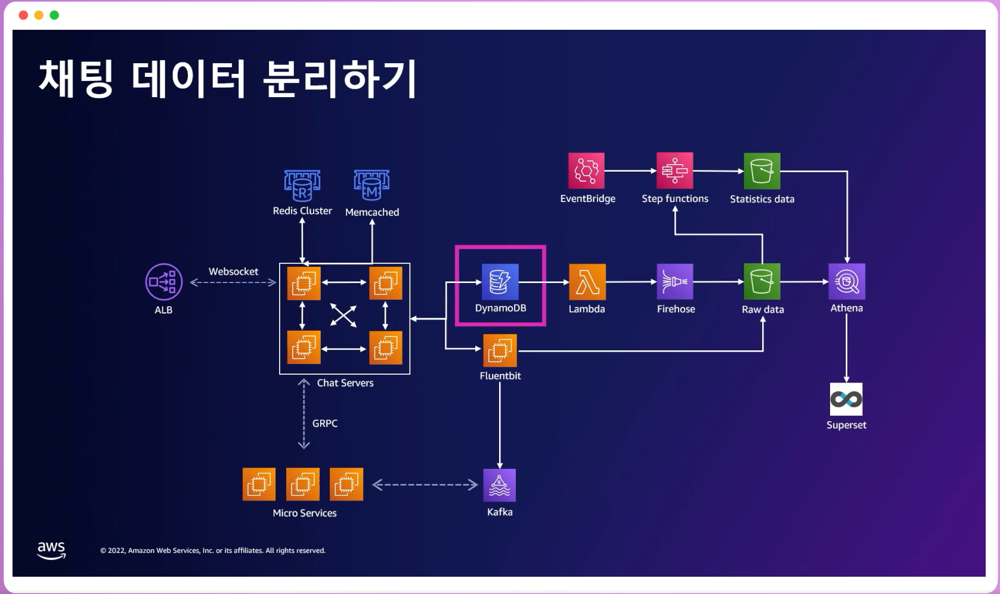
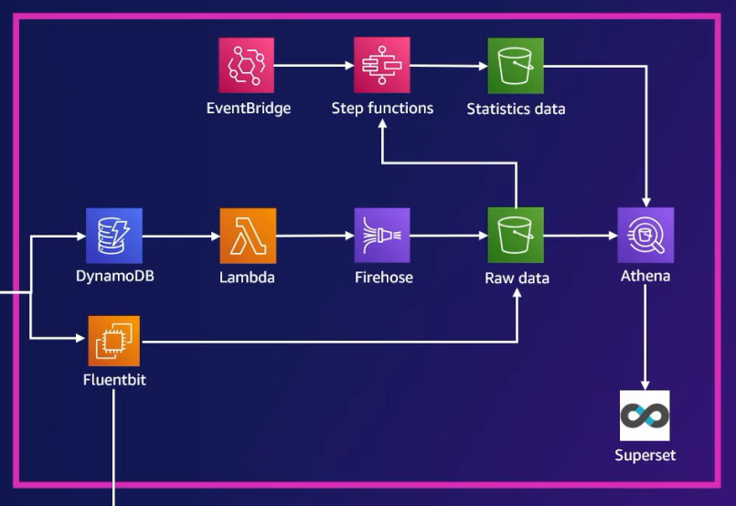
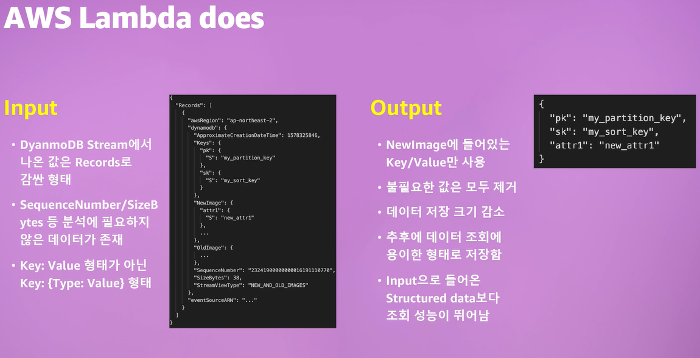

# 아키텍처 현대화

- 현대 애플리케이션의 과제
  - 수백만명의 사용자로 확장
  - 글로벌 가용성의 보장
  - 페타바이트의 데이터 처리
  - 밀리초 단위의 응답 속도

- 아키텍처 현대화의 이점

  - 테스트 및 릴리즈 프로세스의 자동화로 오류 발생률이 줄어 출시 시간이 단축된다.

  - 모듈식 아키텍처를 사용하여 애플리케이션의 구성 요소를 신속하게 변경하고 전체 애플리케이션에 대한 위험이 줄어, 새로운 아이디어를 더 자주 실험하여 혁신을 향상할 수 있다. 

  - 테스트 자동화와 개발 수명 주기의 모든 단계를 모니터링함으로써 배포시 안정성을 유지할 수 있다.

  - 가치에 따른 결제 요금 모델을 활용하여 과도한 프로비저닝 또는 유휴 리소스에 대한 지불과 관련 비용을 줄여준다.

- 현대화된 아키텍처의 특징
  - 느슨하게 결합된 서비스
  - 경량화된 컨테이너 혹은 서버리스 함수로 패키징
  - Stateless 서비스와 Stateful 서비스를 분리하여 설계
  - 탄력적이며 회복력 있는 셀프-서비스 인프라스트럭처에 배포
  - 서버 및 운영체제 종속성에서 격리

- 현대화를 위한 세 가지 경로
  - 관리형 컨테이너 서비스로 플랫폼 변경(AWS 컨테이너 서비스)
  - 서버리스 아키텍처에서 새롭고 안전한 앱 빌드
  - 최신 Devops / 클라우드 네이티브 모델로 전환(AWS Lambda)

# 당근마켓의 사례

> 당근마켓 채팅팀 팀장 변규현

## 모놀리틱 서비스에서 마이크로 서비스로

- 과거의 당근마켓
  - 모놀리틱 서비스
  - 기술 스택
    - Ruby on Rails
    - PostgreSQL
    - AmazonECS
  - 장애가 한 번 발생하면 전체 서비스 장애로 이어지기 쉬웠다.
  - 코드 복잡도 증가
  - 유지보수 시간 증가

- 현재의 당근마켓
  - 마이크로 서비스로 변경
  - 하나의 서비스를 여러 서비스로 분리하여 API를 호출하는 형태로 지원한다.
  - 앱 사용자만을 고려한 것이 아닌 해당 마이크로서비스를 사용하는 다른 개발자를 배려해서 API를 디자인
    - 사내 표준화가 필요하다.
  - 서비스 분리 및 경량화로 유지보수가 훨씬 원활해진다.

## 사례 - 채팅 서비스가 분리된 과정

- 전체 아키텍처

  

- postgreSQL 분리

  - Main DB였던 postgreSQL에 쌓이는 데이터의 60%가 채팅 데이터.
  - Main DB에서 채팅 데이터를 관리하는 것이 부적절하다고 판단하여 채팅 데이터 보관을 위한 DB를 분리하기로 결정.

  - 관리가 편리하고 운영 비용도 절감 가능하며 데이터 용량 확장이 가능한 DynamoDB를 선택.

- DynamoDB 사용시 어려웠던 점
  - 일반적인 SQL 사용이 불가능(현재는 PartiQL을 통해 사용이 가능)
  - 데이터를 가져오기위해 Query와 Scan을 사용해야 한다.
  - Query는 미리 정한 인덱스를 통해 데이터를 가져오고, Scan은 DynamoDB Engine에서 데이터를 로드하고 거기서 filter하는 기능만을 제공한다.
    - 실제로 데이터를 전부 읽으면서 필터링하기 때문에 비용문제가 생길 수 있다.
    - 따라서 실서비스에서는 Query만을 사용해야 한다.

- DB 분리 후 API도 분리
  - ruby로 작성된 기존의 API를 모두 Go로 재구현
  - 기존 서버 로직에 강결합된 API는 Internal API로 재구현
    - 기존 로직과 Internal API로 연동
  - 작은 유틸 함수 하나까지 테스트 케이스 작성
    - 현재 1,250개 이상의 테스트가 Pull Request시에 실행된다. 

- WebSocket을 통통한 실시간 메시징 시스템 도입
  - 기존의 서비스는 FCM에 의존적이었다.
    - REST API를 통해 메시지를 폴링하는 구조
    - push가 밀리면 유저가 이미 접속하고 있더라도 메시지를 받을 수가 없었다.
  - Websocket에 연결 된 유저는 FCM의 상태와 무관하게 이벤트를 받아서 처리할 수 있도록 변경
    - 각기 다른 서버에 접속 중인 사용자들 사이에 메시지를 주고 받아야 한다.
    - GRPC로 서버간 메시지를 전달하도록 한다.
  - RedisCluster(Amazon ElasticCache)
    - WebSocket 유저가 어느 서버에 접속 중인지 관리하기 위해 사용한다.
    - Scale out을 쉽게 하기 위해 Cluster mode로 사용한다.
    - 각 서버는 connection만을 맺고 있고, 유저의 세션은 Redis, 데이터는 DB에서 관리함으로서 서버에 접속중인 유저의 state를 관리할 필요가 없다.

- 데이터 분석을 위한 Pileine 구축

  

  - DynamoDB Stream
    - DynamoDB에 있는 데이터를 실시간으로 처리하는 용도
    - DynamoDB에서 발생한 CUD 이벤트를 Stream으로 밀어 넣어준다. 
    - 이러한 변경 내역을 Change Data Capture라 부르는데, 이 정보를 최대 24시간 동안 저장하고, Stream을 읽어서 별도로 저장, 변경, 분석이 가능하다.
    - 실시간 이벤트 처리가 가능하다.
  - Lambda
    - Stream에 있는 데이터를 원하는 곳에 적재하는 용도.
    - 새로운 DynamoDB stream record가 감지될 때마다 폴링하는 구조로 설계.
    - DynamoItem 형식의 데이터를 key-value 형식으로 변환하여 저장하는 용도로 Lambda 함수를 구현.

  

  - Firehose
    - 이벤트 버퍼를 받아 S3에 업로드하는 용도
    - 서버리스형 스트림 서비스로 kinesis처럼 샤드의 개수를 관리할 필요가 없다.
    - 데이터를 S3에 전송하기 전에 수신되는 데이터를 Apache Parquet 및 Apache ORC와 같은 Columnar 기반 형식으로 변환하도록 전속 스트림 구성이 가능
    - 날짜 및 시간으로 partitioning하여 S3에 저장 가능
  - S3
    - Data warehouse의 storage 역할
  - Athena
    - S3에 저장된 데이터를 검색하고 분석하는 용도.
    - Apache Presto 기반의 서버리스형 데이터 조회 서비스.

