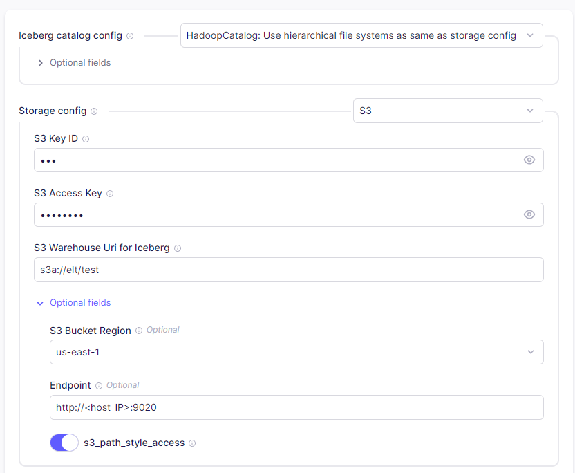

# Airbyte

- ELT 파이프라인을 보다 간편하게 구축할 수 있도록 해주는 플랫폼이다.
  - Source와 destination을 생성하고, connection을 설정하면 source에서 destination으로 data를 전송하는 pipeline이 생성된다.
    - Source와 destination의 경우 Airbyte에서 개발한 것과 community에서 개발한 것을 모두 지원한다.
  - UI를 통해 생성하는 것도 가능하고, Python client를 사용하여 생성하는 것도 가능하다.
  - 변환 기능이 풍부하진 않아서, 데이터 변환을 위해서 일반적으로 dbt(Data Build Tool)라 불리는 데이터 변환 도구를 함께 사용한다.


- CDC
  - 현재까지는 MySQL, MongoDB, PostgreSQL, MSSQL만 지원한다.


# Airbyte 실행하기

- Docker로 Airbyte 실행하기

  - Github preository에서 Airbyte를 clone 받는다.

  ```bash
  $ git clone --depth=1 https://github.com/airbytehq/airbyte.git
  ```

  - `run-ab-platform.sh`를 실행한다.
    - `run-ab-platform.sh`가 실행되면, Docker container를 실행하는 데 필요한 docker-compose.yml 파일들이 다운로드 되고, 해당 파일을 사용하여 container들을 실행한다.

  ```bash
  $ cd airbyte
  $ ./run-ab-platform.sh
  ```

  - Web UI로 접속한다.
    - 기본 계정은 airbyte / password로 설정되어 있다.


# Destination

## Iceberg

- Iceberg 실행하기

  - 아래와 같이 docker-compose.yml 파일을 작성한다.

  ```yaml
  version: "3"
  
  x-minio-common: &minio-common
    image: minio/minio:latest
    command: server --console-address ":9001" http://minio{1...2}/data{1...2}
    environment:
      MINIO_ROOT_USER: "foo"
      MINIO_ROOT_PASSWORD: "foo_auth"
      MINIO_STORAGE_CLASS_STANDARD: "EC:1"
      MINIO_DOMAIN: "minio"
    restart: always
  
  services:
    spark-iceberg:
      image: tabulario/spark-iceberg
      container_name: spark-iceberg
      depends_on:
        - rest
      environment:
        - AWS_ACCESS_KEY_ID=foo
        - AWS_SECRET_ACCESS_KEY=foo_auth
        - AWS_REGION=us-east-1
      ports:
        - 8888:8888
        - 8080:8080
        - 10000:10000
        - 10001:10001
      networks:
        iceberg_net:
    
    rest:
      image: tabulario/iceberg-rest
      container_name: iceberg-rest
      ports:
        - 8181:8181
      environment:
        - AWS_ACCESS_KEY_ID=foo
        - AWS_SECRET_ACCESS_KEY=foo_auth
        - AWS_REGION=us-east-1
        - CATALOG_WAREHOUSE=s3a://elt/test
        - CATALOG_IO__IMPL=org.apache.iceberg.aws.s3.S3FileIO
        # 아직 원인은 모르겠지만 CATALOG_S3_ENDPOINT 값을 container network의 내부 주소로 설정하면 동작하지 않는다.
        # 즉 http://minio1:9000과 같이 설정하면 동작하지 않는다.
        - CATALOG_S3_ENDPOINT=http://<host_ip>:9020
      networks:
        iceberg_net:
  
    minio1:
      <<: *minio-common
      container_name: minio1
      networks:
        iceberg_net:
          aliases:
            - elt.minio
      ports:
        - 9020:9000
        - 9021:9001
  
    minio2:
      <<: *minio-common
      container_name: minio2
      networks:
        iceberg_net:
      ports:
        - 9030:9000
        - 9031:9001
  
  networks:
    iceberg_net:
  ```

  - Docker container를 실행한다.

  ```bash
  $ docker compose up
  ```

  - MinIO가 실행되면 MinIO UI로 접속하여 아래와 같은 작업을 실행해야한다.
    - `Settings`-`Region`에서 `Server Location`을 설정한다.
    - 새로운 bucket을 생성하고, bucket의 `Access Policy`를 `public`으로 변경한다.
    - Bucket 내부에 warehouse로 사용할 path를 생성한다.
    - 위 예시의 경우 bucket 이름은 `elt`, warehouse는 `test`로 설정했다.


- Airbyte에서 `Apache Iceberg` destination을 생성한다.

  - `Iceberg Catalog config`에서는 `HadoopCatalog`를 선택한다.

  - `Storage config`는 `S3`를 선택하고 아래와 같이 설정해준다.
    - `S3 Key ID`에는 MinIO container를 실행할 때 설정했던 `MINIO_ROOT_USER`값을, `S3 Access Key`에는 `MINIO_ROOT_PASSWORD` 값을 넣으면 된다.
    - `S3 Warehouse Uri for Iceberg`에는 `s3a://<bucket>/<warehouse_path>` 형식으로 입력하면 되며, 주의할 점은 `s3`가 아닌 `s3a`를 사용해야 한다는 점과, `<warehouse_path>` 없이 bucket만 입력할 경우 error가 발생한다는 점이다.
    - `S3 Bucket Region`에는 MinIO를 실행한 후 설정했던 `Server Location`과 동일한 값을 넣어야 한다.
    - `Endpoint`를 입력할 때는 반드시 `http`, `https` 등의 프로토콜도 함께 입력해야 한다.

  


