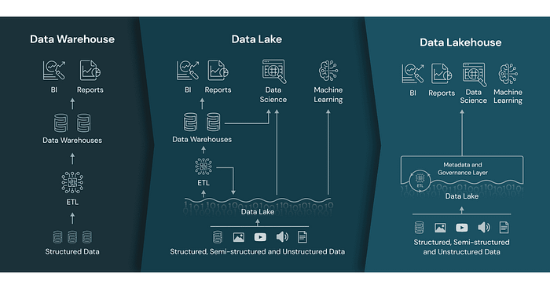

# 사전지식

- Data 저장소의 간략한 역사

  > https://www.dataversity.net/brief-history-data-lakes/

  - Data Mart
    - 1970년대 초 ACNielen이라는 회사는 data를 디지털화 해서 저장할 수 있는 data mart라는 개념을 소개했다.
    - 일반적으로 구조화된 data를 저장했으며, data들은 특정 community나 부서가 관리했다.
    - 일반적으로 후에 소개할 data warehouse보다 작은 규모였다.
    - Data warehouse나 data lake의 시초라고 볼 수 있다.
  - Data Silos
    - Data warehouse의 일부로 data mart와 유사하다.
    - 그러나 data mart보다 더 고립된 저장소로, 다른 system과 공동 작업이 불가능하다.
    - Data silos는 한 부서에서 관리하는 고정된 data를 저장하고 있다.
    - 다른 부서와 data를 공유하지 않는다는 점에서 보안성은 높았지만, 전체 조직의 생산성과 data 무결성을 저해한다는 단점이 있었다.
  - Data Warehouse
    - 1970년대 Bill Inmon이 제안했으나 구체적인 구조는 1980년대까지 고안되지 않았다.
    - 광범위한 source로부터 수집된 data들을 중앙 집중화하여 저장하는 저장소이다.
    - Staging layer, integration layer, access layer로 data를 계층화한다.
    - Staging layer에서는 여러 source로부터 수집된 다양한 raw data를 저장한다.
    - Integration layer에서는 data들을 병합하고 변환한 뒤 data를 사용하고자 하는 곳으로 전달한다(좁은 의미에서는 이 부분만을 data warehouse라고 부르기도 한다).
    - Access layer는 사용자들이 변환된 data에 접근할 수 있도록 한다(access layer를 data mart라고 부르기도 한다).
  - Data Lake
    - 2010년 Pentaho의 공동 창업자이자 CTO인 James Dixon이 제안했다.
    - 모든 규모의 정형 및 비정형 raw data를 원래의 format으로 저장하는 중앙 집중식 단일 저장소이다.
    - 원래의 format으로 저장한다는 특성으로 인해 비정형 data를 필요로하는 machine learning에서 널리 사용된다.
    - 잘 관리하지 못 할 경우 data swamp이 될 수 있다.


- Data lake와 Data warehouse의 차이

  > https://datafortune.com/data-lake-vs-data-warehouse-choosing-the-right-solution/

  - Data type
    - Data lake는 raw data를 원래의 형태로 저장한다.
    - Data warehouse는 raw data를 변환하여 정형화된 data를 저장한다.
  - Data processing
    - Data lake에서는 data를 먼저 저장하고 난 뒤 data가 필요할 때 처리하는 schema-on-read라는 방식을 사용한다.
    - Data lake는 data를 먼저 처리하고 난 뒤에 저장하는 schema-on-read라는 방식을 사용한다.
  - User persona
    - Data lake는data에 대한 심층적인 분석을 하는 data scientists나 analyst들이 사용한다.
    - Data warehouse는 business와 직접적인 관련이 있는 사람들이 사용한다.
  - Data storage
    - Data lake는 상대적으로 적은 비용으로 대량의 data를 저장할 수 있으므로 대량의 data를 수집하거나 문석해야 하는 기업에게 적합하다.
    - Data warehouse의 경우 data 처리를 먼저 해야 하므로 data lake보다는 많은 비용이 들 수 있지만, 정제된 data에 대한 빠른 접근이 중요한 기업에게 적합할 수 있다.
  - Governance
    - Data lake는 다양한 유형의 data를 대량으로 저장하므로 관리가 힘들다.
    - Data warehouse는 구조화된 data들이 저장되므로 상대적으로 쉽게 관리가 가능하다.
  - Dataware house의 staging layer와 data lake는 같은 것 아닌가?
    - 일반적으로 staging layer에는 오직 data warehouse의 integration layer로 data를 옮기는 하나의 consumer만이 존재한다.
    - 그러나 data lake는 여러 consumer가 존재한다.


- Data lakehouse
  - Data warehouse와 data lake의 한계를 극복하고자 data warehouse와 data lake의 장점만을 취해 만들어진 개념이다.
    - Data warehouse는 data lake보다 효율적이지만 data lake보다 많은 비용이 들고 확장도 쉽지 않다는 문제가 있었다.
    - 반면에 data lake는 확장성은 높지만 관리의 효율성이 떨어진다는 문제가 있었다.
    - 이러한 단점을 극복하기 위해 많은 조직에서는 data lake를 구축하고 data lake의 data를 data warehouse로 보내 처리하는 방식을 선택했다.
    - 그러나 이와 같은 방식은 data의 중복 및 여러 시스템을 관리해야 하는 복잡함을 야기했고, 이를 극복하기 위해 data lakehouse가 등장했다.
    - Data lakehouse는 data lake 정도의 유연성과 낮은 관리 비용으로 data warehouse와 유사한 data 구조를 가져와 효율성을 높인다.
  
  
  
  - Data lakehouse는 일반적으로 아래와 같은 5단계로 구성된다.
    - Ingestion
    - Storage
    - Metadata
    - API
    - Data consumption
  - Ingestion layer
    - 다양한 source로부터 data를 수집하여 storage layer로 전달하는 역할을 한다.
    - 수집한 data를 lakehouse에서 저장하고 분석할 수 있는 형태로 변환한다.
  - Storage layer
    - 정형, 비정형, 반정형 data를 Parquet이나 ORC 같은 open-source file format으로 저장한다.
    - 일반적으로 AWS S3 등의 cloud service를 사용하지만, HDFS 등의 on-premise service를 사용해서도 구현이 가능하다.
  - Metadata layer
    - Data lakehouse의 기반이 되는 layer이다.
    - Data lakehouse 내의 모든 data에 대한 메타데이터를 제공하는 통합 카탈로그로, 이를 사용하여 data에 대한 정보를 구성하고, 제공한다.
    - 또한 사용자가 ACID transaction이나 file caching, 더 빠른 query를 위한 indexing 등의 관리 기능을 사용할 수 있게 해준다.
    - Star, Snowflake 등의 data warehouse에서 사용하는 schema architecture를 사용하기도 한다.
  - API layer
    - Data lakehouse는 task와 분석을 보다 효율적으로 처리하기 위해서 API를 사용한다.
    - 이를 통해 다양한 programming language에서 접근이 가능하게 된다.
  - Data consumption layer
    - Data lakehouse에 저장된 모든 data와 metadata에 접근할 수 있는 계층이다.


- Data lake에서 사용하는 storage의 종류
  - Distributed File System/Object Store - Text File
    - 가장 단순한 형태의 storage이다.
    - 일반적으로 fault tolerance를 지원하며, cluster를 구성하는 node들로부터 data를 병렬적으로 읽고 쓰는 기능을 제공한다.
    - Data를 text file로 표 형식이나 JSON과 같이 구조화된 형식으로 저장한다.
    - HDFS/CSV, HDFS/JSON이 이에 속한다.
  - Distributed File System/Object Store - Column-oriented
    - 일반적인 text file은 특정 use case에서는 유용하지만, 그렇지 않을 때도 있다.
    - Column이 있을 경우 data 수집과 집계가 더 용이해진다.
    - HDFS/Parquet, HDFS/ORC가 이에 속한다.
  - Distributed File System/Object Store - Row-oriented
    - 어떤 경우에는 column-oriented store는 효율적이지 않을 수 있다.
    - 예를 들어 streaming application이나 schema가 가변적일 경우 column-oriented store보다는 row-oriented store가 더 효율적이다.
    - HDFS/Avro가 이에 속한다.
  - REBMS - Column-oriented
    - 위에서 본 column-oriented store와 유사하지만, SQL database 가 내장되어 있어 성능이 개선된다.
    - Snowflake, Redshift, Vertica 등이 이에 속한다.
  - RDBMS - Row oriented
    - 일반적인 backend application에서 사용하는 관계형 database이다.
    - 보통 규모의 data 분석에 적합하다.
    - MySQL, Oracle, PostgreSQL 등이 이에 속한다.
  - NoSQL
    - Document라 불리는 data를 key-value 쌍으로 저장하는 data store이다.
    - 일반적으로 대량의 data를 읽고 쓰기 위해 사용한다.
    - MongoDB, Elasticsearch, Cassandra 등이 이에 속한다.
  - In Memory
    - 모든 data를 memory에 저장함으로써 storage I/O를 제거하여 매우 빠른 속도로 조회가 가능하게 하는 저장소이다.
    - 다양한 caching mechanism이 있을 수 있다.
    - MemSQL, MonetDB 등이 이에 속한다.
  - Local File System
    - Server가 사용하는 file system을 data storage로 사용하는 것이다.
    - NAS등을 사용할 수는 있으나 분산 저장소 역할을 하는데는 제한이 있다.
    - ext4, NTFS 등이 이에 속한다.


# CDC

- CDC(Change Data Capture)
  - 변경된 데이터를 판별 하는 데 사용되는 소프트웨어 설계 패턴이다.
    - 대부분의 application에서 data가 추가되고, 삭제되고, 수정되는 일이 빈번하게 발생한다.
    - 따라서 application 내에서 같은 data를 사용하는 component들 끼리 sync를 맞추는 것이 매우 중요하다.
    - 그러나 변경 사항이 있을 때 마다 모든 data를 복제하여 사용하는 것은 비효율적이다.
    - 변경 사항이 있는 데이터만 판별하여 data들 사이에 sync를 맞추기 위해 사용하는 것이 CDC이다.
  - 크게 pull 방식과 push 방식이 있다.
    - Push 방식은 source system이 변경 사항을 기록하고 이를 application 등의 downstream으로 전송하는 방식이다.
    - Source database가 변경 사항이 있을 때 마다 downstream으로 변경 사항을 전파하므로 준 실시간으로 data의 변경 사항을 반영할 수 있다는 장점이 있지만, target system이 이를 받는 데 실패할 경우 sync가 맞지 않게 될 수 있으므로 이에 대한 대비책을 마련해야 한다는 단점이 있다.
    - Pull 방식은 source system은 변경 사항만 기록하고 downstream에서 주기적으로 이 변경 사항을 읽어오는 방식이다.
    - Target system이 변경 사항을 pull 하기 전까지는 변경 사항을 알 수 없다는 단점이 있다.
    - 일반적으로 push 방식과 pull 방식 모두 source database와 target system 사이에 source에서 target으로 보내는 변경 사항을 저장할 수 있는 messaging system을 둔다.


- CDC pattern

  - Timestamp-based

    - DB의 table에 마지막으로 변경된 시점을 기록할 수 있는 column을 추가하여 row가 변경될 때 마다 해당 값도 함께 변경하는 방식으로 변경사항을 추적한다.
    - 이 column은 일반적으로 last_modified, last_updated 등의 이름을 갖는다.
    - Downstream에서는 이 값을 가지고 data들을 조회한다.
    - 사용과 구현이 간편하다는 장점이 있다.
    - 삭제된 row를 찾을 수 없고, target system에서 source system의 모든 last_updated column의 값을 확인해야 하므로 source system에 부하가 가해진다.

  - Trigger-based

    - 대부분의 database는 trigger 기능을 제공한다.
    - Table에 IUD 등이 발생할 경우 자동으로 실행되는 프로시저이다.
    - Data의 변경 사항은 shadow table 혹은 event table이라 불리는 별도의 table에 저장된다.
    - 삭제를 포함한 모든 종류의 변경 사항을 탐지할 수 있으며, 많은 수의 database가 trigger를 지원한다는 장점이 있다.
    - 그러나 변경 사항이 생길 때 마다 source database가 변경 사항을 기록해야 하므로 source database의 성능에 악영향을 미친다는 단점이 있다.

  - Log-based

    - Transaction log라 불리는 file에 변경 사항을 모두 기록하여 이를 활용하는 방식이다.
    - 일반적으로 transaction log는 backup이나 재해 복구를 목적으로 사용하지만, CDC에도 사용될 수 있다.
    - Data의 변경 사항은 실시간으로 탐지되어 file로 작성되고, target system은 이 file을 읽어 변경 사항을 반영한다.

    - Source database에 overhead가 가해지지 않고, 모든 종류의 변경 사항을 탐지할 수 있으며, source database의 schema를 변경하지 않아도 된다는 장점이 있다.
    - Transaction log에 대한 표준화된 format이 없어 표준화가 어려울 수 있다.


- BASE
  - 기존 RDBMS에서 트랜잭션의 성질을 나타내기 위해 ACID(Atomicity, Consistency, Isolation, Durability)라는 약어를 사용했다. 
  - NoSQL 계열에서는 주로 ACID가 아닌 BASE(Basically Available, Soft state, Eventually consistent)라는 용어를 사용한다.
    - ACID는 transaction의 안정성을 강조하는 반면, BASE는 시스템 전체의 고가용성과 성능을 강조한다.
  - Basically Available
    - 읽기와 쓰기 작업이 가능하도록 최대한의 노력을 하지만 일관성이 없을 수 있다는 의미이다.
    - 특정 서버에서 error가 발생하더라도 다른 서버에서 읽기와 쓰기가 가능하도록 한다.
    - 고가용성과 관련이 있는 개념이다.
    - 그러나 쓰기 작업은 충돌이 발생할 경우 영구적으로 반영되지 않을 수도 있으며, 읽기 작업을 통해 읽어 온 data는 최신 데이터가 아닐 수도 있다.
  - Soft state
    - 저장소는 쓰기 일관성이 있을 필요가 없으며, 복제본들이 항상 같은 상태를 유지할 필요가 없다는 의미이다.
    - Data의 변경사항이 모든 복제본에 즉각적으로 반영되지 않을 수 있다.
    - 그러나 eventual consistency에 의해 결과적으로는 복제본들이 같은 data를 가지게 된다.
    - 이는 다르게 말하면 외부의 입력 없이도 data가 변경될 수 있다는 것을 의미한다.
    - 예를 들어 A와 A의 복제본인 A'가 있다고 가정해보자.
    - A에 새로운 입력이 들어왔고 A에는 이 사항이 반영됐다.
    - 그 후 A'에 읽기 요청이 들어오고, A'는 아직 A와 동기화 되지 않은 data를 반환한다.
    - 그 후 A'에 A의 data가 동기화 된다.
    - 이후에 사용자가 다시 A'에 읽기 요청을 하면 변경된 data를 받게 된다.
    - 사용자 입장에서는 아무 입력도 하지 않았는데 A'의 값이 변경된 것과 마찬가지이다.
    - 즉 사용자는 쓰기-읽기-읽기를 실행했고, 읽기와 읽기 사이에는 data를 변경하려는 조작을 하지 않았음에도 A'의 data에는 변경이 발생했다.
  - Eventual consistency(결과적 일관성)
    - 여기서의 consistency가 표현하고자 하는 것은 ACID의 consistency가 표현하고자 하는 것과 다르다.
    - Soft state에서 설명했 듯이 복제본들이 항상 같은 상태를 유지할 필요가 없으므로, 단기적으로는 일관성을 잃을 수 있으나 결국에는 일관성을 유지해야한다는 의미이다.
    - 반대되는 개념으로 strong consistency가 있다.


- CAP theorem(Brewer's theorem)

  > http://eincs.com/2013/07/misleading-and-truth-of-cap-theorem/
  >
  > https://www.julianbrowne.com/article/brewers-cap-theorem/

  - CAP theorem은 Consistency, Availability, Partition tolerance 모두를 만족하는 분산 시스템은 있을 수 없다는 정리이다.
    - 컴퓨터 과학자 Eric Brewer가 주장하여 Brewer's theorem이라고도 불린다.
    - 2000년에 Eric Brewer가 CAP 가설을 발표하고 이에 대한 증명이 2012년에 Gilbert와 Lynch에 의해 이루어졌다.
    - 주의할 점은 CAP theorem은 분산 시스템을 설명하기 위한 정리이므로 분산 시스템이 아닌 시스템을 설명하는 데 사용해선 안 된다는 점이다.
  - Consistency
    - 읽기 작업은 항상 최신 상태의 data를 읽어와야 하며, 그렇지 못 할 경우 읽어와서는 안 된다.
    - Brewer는 consistency라는 단어를 사용했으나 Gilbert와 Lynch가 이를 증명할 때는 atomic이라는 용어를 사용했다.
    - 기술적으로 엄밀히 말해서 atomic이라는 단어가 더 적절하다고도 볼 수 있으며 CAP의 consistency는 ACID의 consistency 보다 atomic에 더 가까운 개념이기도 하다.
    - 항상 최신 상태의 data를 읽어와야 하므로 분산 시스템 내의 모든 node들은 동일한 데이터를 가지고 있어야한다.
  - Availability
    - System은 항상 사용 가능한 상태여야 함을 의미한다.
    - 전체 노드가 중지되지 않는 한 system은 항상 사용 가능한 상태여야한다.
  - Partition Tolerance(분할 허용성)
    - Service를 구성하는 모든 node들은 다른 node들과 독립적으로 동작할 수 있어야 한다.
    - 한 node에서 다른 node로 전송되는 message들은 손실될 수 있음 허용한다는 것을 의미한다.
  - Partition Tolerance는 사실상 필수이다.
    - P를 허용하지 않으려면 절대 장애가 발생하지 않는 network를 구축해야한다.
    - 그러나 이는 실제로 존재할 수 없으므로 사실상 P는 선택의 문제가 아니다.
    - 따라서 CAP은 분산 시스템에서 네트워크 장애 상황일 때 일관성과 가용성 중 하나만 선택할 수 있다는 것을 내포하고 있다.
    - 결국 CAP theorem이 궁극적으로 말하고자 하는 바는 네트워크에 장애가 생겼을 때 일관성과 가용성 중 하나만 선택할 수 있다는 것이다.
  - CAP 가설의 증명
    - CAP를 모두 만족하는 분산 시스템 DS가 있다고 가정해보자.
    - DS는 A, B라는 두 개의 노드로 구성되어 있다.
    - 일관성을 충족하므로 A와 B는 동일한 data를 가지고 있으며, 한 node의 변경 사항은 즉시 다른 node에도 반영된다.
    - 이 때 network에 장애가 생겨 A와 B 사이의 통신이 불가능한 상태가 되어 A에서 B로 가는 모든 message는 유실된다(P).
    - 따라서 A는 이후에 B에 쓰기 요청이 있었는지 없었는지 알 수 있는 방법이 없다.
    - 따라서 A로 읽기 요청이 들어왔을 경우 A는 일관성 없는 응답(B와 다를 수 있는 응답)을 반환할 것인지, 아니면 응답을 보내지 않고 가용성을 포기할 것인지를 선택해야만 한다.
  - C와 A를 이분법 적으로 선택해야하는 것은 아니다.
    - 둘 다 조금씩 충족시키거나 하나를 완전히 충족시키고 다른 하나를 조금만 충족시키는 구현 방식도 있을 수 있다.
    - 즉 둘 다 완전히 충족시키는 것은 불가능하나 이를 보완할 수 있는 방법이 없는 것은 아니다.


- PACELC theorem
  - CAP은 사실상 network 장애 상황일 때 분산 시스템 설계자가 일관성과 가용성 중 하나만 선택해야함을 보이는 정리였다.
    - 따라서 정상 상황일 때의 선택에 대해서 잘 설명하지는 못한다.
  - PACELC(Partition)은 분산 시스템을 정상 상황일 때와 장애 상황일 때를 나누어 설명한다.
    - Partition 장애 상황(P)에서는 A와 C 중 하나를 선택해야 한다.
    - 반면에 정상 상황일 경우 L(Latency)과 C(Consistency)중 하나를 선택해야 한다.
    - 모든 node들에 새로운 data를 반영하여 응답을 보내려면 응답 시간(L)이 길어지기 때문이다.


## Debezium PostgreSQL source connector를 이용한 CDC

- 목표
  - Source connector로 PostgreSQL의 특정 table의 변경 사항을 추적하여 추출한다.
  - Sink connector로 Elasticsearch에 적재한다.


- Connector 준비

  - Source connector 준비

    - Dbezium에서 제공하는 PostgreSQL CDC connector를 다운 받는다.

    > https://www.confluent.io/hub/debezium/debezium-connector-postgresql

    - 위에서 다운 받은 `debezium-debezium-connector-postgresql-<version>.zip` 파일의 압축을 푼 후에 테스트를 진행할 서버에 업로드한다.

  - Sink connector 준비

    - Confluent에서 제공하는 Elasticsearch Sink connector를 다운 받는다.

    > https://www.confluent.io/hub/confluentinc/kafka-connect-elasticsearch

    - 위에서 다운 받은 `confluentinc-kafka-connect-elasticsearch-<version>.zip` 파일의 압축을 푼 후에 테스트를 진행할 서버에 업로드한다.


- Config file 작성하기

  - PostgreSQL에서 사용할 config file 수정하기

    > https://debezium.io/documentation/reference/stable/postgres-plugins.html

    - `postgresql.conf` file에서 아래 property들만 수정해준다(PostgreSQL 공식 이미지 기준 `var/lib/postgresql/data`에 작성하면 된다).

  ```properties
  wal_level = logical
  # ...
  shared_preload_libraries = 'pgoutput'
  ```

  - Kafka connector config file 수정하기
    - `connect.standalone.properties` file에서 아래 property들만 수정해준다.
    - 운영 환경에서는 `connect-distributed.properties` file을 사용하여 분산 실행하는 것이 권장된다.

  ```properties
  bootstrap.servers=localhost:29093
  key.converter=org.apache.kafka.connect.json.JsonConverter
  value.converter=org.apache.kafka.connect.json.JsonConverter
  key.converter.schemas.enable=true
  value.converter.schemas.enable=true
  offset.storage.file.filename=/tmp/connect.offsets
  offset.flush.interval.ms=10000
  plugin.path=/usr/share/java
  ```


- Docker Container로 필요한 component들 실행하기

  - docker-compose.yml
    - Debezium connector를 사용하기 위해서는 PostgreSQL의 wal_level을 `logical`로 설정해야한다.
    - 위에서 압축을 푼 `debezium-debezium-connector-postgresql-<version>`, `confluentinc-kafka-connect-elasticsearch-<version>` 폴더와 위에서 작성한 `postgresql.conf`, `connect.standalone.properties` file을 kafka container 내부에 bind-mount한다.
    - `/usr/share/java` 경로에 넣는 이유는 Kafka Connect 설정 파일인 `connect-standalone.properties`에 `plugin.path`의 기본 값이 `/usr/share/java`이기 때문이다.
    - `KAFKA_ADVERTISED_LISTENERS`의 port는 위의 `connect.standalone.properties`에서 `bootstrap.servers`에 입력한 port와 동일하게 설정한다.

  ```yaml
  version: '3.2'
  
  
  services:
    etl-postgres:
      image: postgres:latest
      container_name: etl-postgres
      environment:
        - TZ=Asia/Seoul
        - POSTGRES_PASSWORD=1234
      volumes:
        - ./db-data:/var/lib/postgresql/data
        - ./postgresql.conf:/var/lib/postgresql/data/postgresql.conf
      ports:
        - 5433:5432
      command:
        - "postgres"
        - "-c"
        - "wal_level=logical"
      networks:
        - etl
    
    etl-node:
      image: docker.elastic.co/elasticsearch/elasticsearch:8.11.0
      container_name: etl-node
      environment:
        - cluster.name=etl
        - node.name=etl-node
        - discovery.type=single-node
        - bootstrap.memory_lock=true
        - "ES_JAVA_OPTS=-Xms1g -Xmx1g"
        - xpack.security.enabled=false
        - xpack.security.enrollment.enabled=false
      ulimits:
        memlock:
          soft: -1
          hard: -1
      ports:
        - 9206:9200
      networks:
        - etl
    
    etl-zookeeper:
      container_name: etl-zookeeper
      image: confluentinc/cp-zookeeper:latest
      environment:
        - ZOOKEEPER_CLIENT_PORT=2181
      networks:
        - etl
  
    etl-kafka:
      image: confluentinc/cp-kafka:latest
      container_name: etl-kafka
      environment:
        - KAFKA_ZOOKEEPER_CONNECT=theo-etl-zookeeper:2181
        - KAFKA_ADVERTISED_LISTENERS=PLAINTEXT://localhost:29093
        - KAFKA_OFFSETS_TOPIC_REPLICATION_FACTOR=1
      volumes:
        - ./debezium-debezium-connector-postgresql-2.2.1:/usr/share/java/debezium-debezium-connector-postgresql-2.2.1
        - ./confluentinc-kafka-connect-elasticsearch-14.0.12:/usr/share/java/confluentinc-kafka-connect-elasticsearch-14.0.12
        - ./connect-standalone.properties:/etc/kafka/connect-standalone.properties
      ports:
        - 9093:9092
      depends_on:
        - etl-zookeeper
      networks:
        - etl
  
  networks:
    etl:
      driver: bridge
  ```

  - 아래 명령어로 container를 실행한다.

  ```bash
  $ docker compose up -d
  ```


- Connector를 실행한다.

  - Kafka container에 attach한다.

  ```bash
  $ docker exec -it etl-kafka /bin/bash
  ```

  - Kafka Connect를 실행한다.

  ```bash
  $ /bin/connect-standalone /etc/kafka/connect-standalone.properties
  ```

  - 정상적으로 실행됐는지 확인한다.

  ```bash
  $ curl localhost:8083/connector-plugins
  ```

  - 결과

  ```json
  [
          {
                  "class": "io.confluent.connect.elasticsearch.ElasticsearchSinkConnector",
                  "type": "sink",
                  "version": "14.0.12"
          },
          {
                  "class": "io.debezium.connector.postgresql.PostgresConnector",
                  "type": "source",
                  "version": "2.2.1.Final"
          },
          // ...
  ]
  ```


- PostgreSQL에 table을 생성하고 data를 삽입한다.

  - Table 생성

  ```sql
  CREATE TABLE product (
    id INT NOT NULL,
    name VARCHAR(30) NOT NULL,
    updated_time TIMESTAMP NOT NULL,
    PRIMARY KEY (id)
  );
  ```

  - Data 삽입

  ```sql
  INSERT INTO product VALUES (0, 'iPad');
  INSERT INTO product VALUES (1, 'iPhone');
  ```


- Source Connector 생성

  - REST API를 통해 source connector를 생성한다.

    - `plugin.name`에는 `postgresql.conf` file의 `shared_preload_libraries` property에 설정해준 값을 넣는다.
    - 전체 설정은 아래 참고

    > https://debezium.io/documentation/reference/stable/connectors/postgresql.html#postgresql-connector-properties

  ```bash
  $ curl -XPOST 'localhost:8083/connectors' \
  --header 'Content-type: application/json' \
  --data-raw '{
    "name": "foo-connector",  
    "config": {
      "connector.class": "io.debezium.connector.postgresql.PostgresConnector",
      "database.hostname": "etl-postgres", 
      "database.port": "5432", 
      "database.user": "postgres", 
      "database.password": "1234", 
      "database.dbname" : "postgres", 
      "topic.prefix": "foo", 
      "table.include.list": "public.product",
      "plugin.name": "pgoutput"
    }
  }'
  ```

  - 정상적으로 생성 되었는지 확인

  ```bash
  $ curl localhost:8083/connectors
  
  # out
  ["foo-connector"]
  ```

  - Kafka topic이 생성 되었는지 확인

  ```bash
  $ /bin/kafka-topics --list --bootstrap-server localhost:29093
  
  # out
  foo.public.product
  ```

  - `foo.public.product` topic에 저장된 data 확인

  ```bash
  $ /bin/kafka-console-consumer --bootstrap-server localhost:29093 --topic foo.public.product --from-beginning
  ```


- Sink connector 생성

  - REST API를 통해 sink connector를 생성한다.

  ```bash
  $ curl -XPOST 'localhost:8083/connectors' \
  --header 'Content-type: application/json' \
  --data-raw '{
    "name": "bar-connector",  
    "config": {
      "connector.class": "io.confluent.connect.elasticsearch.ElasticsearchSinkConnector",
      "connection.url": "http://etl-node:9200",
      "topics":"foo.public.product",
      "key.ignore":"true"
    }
  }'
  ```

  - Index 확인

  ```bash
  $ curl localhost:9206/_cat/indices
  ```

  - Document 확인

  ```bash
  $ curl localhost:9206/foo.public.product/_search
  ```


## Debezium MySQL source connector를 이용한 CDC

- Connector 준비하기

  - [Confluent hub](https://www.confluent.io/hub/debezium/debezium-connector-mysql)에서 debezium source connector mysql을 다운 받는다.
  - 다운 받은 파일의 압축을 풀고, connect 실행시에 `plugin.path`에 설정했던 경로에 압축 푼 파일들을 옮긴다.
  - Kafka connect가 plugin을 인식했는지 확인한다.
    - 만약 인식이 안 된다면 Kafka connect를 재실행한다.

  ```bash
  curl localhost:8083/connector-plugins
  [
      {
        "class": "io.debezium.connector.mysql.MySqlConnector",
        "type": "source",
        "version": "2.4.2.Final"
      }
  ]
  ```


- DB 준비하기

  > PostgreSQL과 달리 별다른 설정이 필요하지 않은 것으로 보인다.

  - Table 생성

  ```sql
  CREATE TABLE product (
    id INT NOT NULL,
    name VARCHAR(30) NOT NULL,
    updated_time TIMESTAMP NOT NULL,
    PRIMARY KEY (id)
  );
  ```

  - Data 삽입

  ```bash
  INSERT INTO product VALUES (0, 'iPad');
  INSERT INTO product VALUES (1, 'iPhone');
  ```


- 만약 설정해야 할 경우 아래와 같이 하면 된다.

  > https://docs.aws.amazon.com/ko_kr/dms/latest/userguide/CHAP_Source.MySQL.html
  
  - CDC와 관련하여 설정해야 하는 binary log 관련 server system variable은 세 가지가 있다.
    - `log_bin`: `ON`이어야 한다.
    - `binlog_format`: `ROW`여야 한다.
    - `binlog_row_image`: `FULL`이어야 한다.
  - `log_bin`
    - Binary logging을 활성화할지를 설정한다.
    - MySQL 실행시에 `--log-bin` 옵션을 주면 `ON` 상태로 실행된다.
  - `binlog_format`
    - Replication을 row 기반으로 할 것인지, statement 기반으로 할 것인지, 둘을 혼용할 것인지를 설정한다.
    - `ROW`, `STATEMENT`, `MIXED` 중 하나의 값을 설정할 수 있다(기본값은 `MIXED`).
    - MySQL 실행시에 `--binlog-format=<format>` 옵션을 주어 설정이 가능하다.
  
  - `binlog_row_image`
    - Row 기반의 replication을 사용할 때(`binlog_format`을 `ROW`로 설정했을 때) logging format을 설정한다.
    - 기본값은 `FULL`이다.

  - 아래와 같이 현재 설정을 확인할 수 있다.
  
  ```sql
  SHOW VARIABLES LIKE 'log_bin';
  SHOW VARIABLES LIKE 'binlog_format';
  SHOW VARIABLES LIKE 'binlog_row_image';
  ```

  - 아래와 같이 설정할 수 있다.
  
  ```sql
  SET GLOBAL <variable>=<value>;
  ```
  
  - Debezium source connector 사용시 server_id도 알아야 한다.
  
  ```sql
  SELECT variable_value FROM information_schema.global_variables WHERE variable_name='server_id';
  ```
  


- Source connector 실행하기

  - 아래와 같이 실행한다.
    - 전체 설정은 [Debezium 문서](https://debezium.io/documentation/reference/stable/connectors/mysql.html#_required_debezium_mysql_connector_configuration_properties) 참조
    - MySQL connector는 항상 단일 task만 사용하므로, `tasks.max`에 1 이외의 어떤 값을 줘도 소용이 없다.
    - 이는 binlog를 순차적으로 읽어야 하기에 있는 제약으로, 여러 task가 동시에 읽을 경우 순차적으로 읽는 것이 보장되지 않을 수 있기 때문이다.

  ```bash
  curl -XPOST 'localhost:8083/connectors' \
  --header 'Content-type: application/json' \
  --data-raw '{
    "name": "mysql-cdc-source-connector",
    "config": {  
      "connector.class": "io.debezium.connector.mysql.MySqlConnector",
      "tasks.max": "1",
      "database.hostname": "mysql-host",
      "database.port": "3306",
      "database.user": "mysql-user",
      "database.password": "mysql-password",
      "database.server.id": "123456",
      "topic.prefix": "post",
      "database.include.list": "test",
      "table.include.list":"test.post",
      "schema.history.internal.kafka.bootstrap.servers": "kafka-host:9092",
      "schema.history.internal.kafka.topic": "schema-changes.post.test"
    }
  }'
  ```

  - 정상적으로 실행 되는지 확인

  ```bash
  $ curl localhost:8083/connectors/mysql-cdc-source-connector/status
  ```
  
  - 만약 timezone을 설정해야하면 `database.connectionTimeZone`으로 설정한다.
  
  ```json
  curl -XPOST 'localhost:8083/connectors' \
  --header 'Content-type: application/json' \
  --data-raw '{
    "name": "mysql-cdc-source-connector",
    "config": {  
      "connector.class": "io.debezium.connector.mysql.MySqlConnector",
      "database.connectionTimeZone": "Asia/Seoul",
      // ...
    }
  }'
  ```


- Timezone Converter

  - Debezium이 event를 전송할 때, timestamp field의 timezone 값은 data source의 type과 설정에 따라 다양할 수 있다.
    - 이를 일관성 있게 관리하기 위해 timezone converter를 사용할 수 있다.
    - Timezone을 geo-graphic timezone(e.g. `Asia/Seoul`) 혹은 UTC offset(e.g. `+02:00`)으로 설정할 수 있다.
  - 아래와 같이 설정하면 된다.

  ```json
  {
      "config":{
          "transforms": "convertTimezone",
          "transforms.convertTimezone.type": "io.debezium.transforms.TimezoneConverter",
          "transforms.convertTimezone.converted.timezone": "Pacific/Easter"
      }
  }
  ```

  - `include.list`와 `exclude.list`를 통해 포함, 제외할 field들을 지정할 수 있다.

  - Debezium MySQL source connector 뿐 아니라 모든 Debezium connector에서 사용할 수 있다.


- MySQL date type

  - MySQL의 timezone을 조회한다.

  ```sql
  SELECT @@GLOBAL.time_zone, @@SESSION.time_zone, @@system_time_zone;
  ```

  - 결과는 아래와 같다.

  | `@@GLOBAL.time_zone` | `@@SESSION.time_zone` | `@@system_time_zone` |
  | -------------------- | --------------------- | -------------------- |
  | SYSTEM               | SYSTEM                | UTC                  |

  - Source table을 생성한다.

  ```sql
  CREATE TABLE `user_source` (
  	`id` INT NOT NULL AUTO_INCREMENT,
  	`join_time` TIME NULL DEFAULT NULL,
  	`join_date` DATE NULL DEFAULT NULL,
  	`join_datetime` DATETIME NULL DEFAULT NULL,
  	`join_timestamp` TIMESTAMP NULL DEFAULT NULL,
  	PRIMARY KEY (`id`) USING BTREE
  );
  ```

  - `user_source` table에 데이터를 삽입한다.

  ```sql
  INSERT INTO user_source VALUES (1, "00:00:00", "2024-11-04", "2024-11-04 00:00:00", "2024-11-04 00:00:00");
  ```

  - `user_source`를 대상으로 Debezium source connector를 생성한다.
    - `time.precision.mode`를 `connect`로 설정하고, 다른 시간 관련 설정은 주지 않는다.

  ```json
  {
    "name": "1",
    "config": {
        "connector.class": "io.debezium.connector.mysql.MySqlConnector",
        "database.include.list": "test",
        "table.include.list": "test.user_source",
        "time.precision.mode": "connect",
        // ...
    }
  }
  ```
  
  - Message의 `payload.after` 값을 확인한다.
    - 1730678400000는 `DATETIME` 형식으로 변환하면 `2024-11-04 00:00:00`이다.
  
  ```json
  {
      "payload": {
  		"after": {
  			"id": 1,
  			"join_time": 0,
  			"join_date": 20031,
  			"join_datetime": 1730678400000,
  			"join_timestamp": "2024-11-04T00:00:00Z"
  		}
  	}
  }
  ```
  
  - 기존 설정에 `database.connectionTimeZone` 값만 추가한다.
  
  ```json
  {
    "name": "2",
    "config": {
        "connector.class": "io.debezium.connector.mysql.MySqlConnector",
        "database.include.list": "test",
        "table.include.list": "test.user_source",
        "time.precision.mode": "connect",
        "database.connectionTimeZone": "Asia/Seoul",	// 추가한다.
        // ...
    }
  }
  ```
  
  - 위 source connector로 생성한 message를 확인한다.
    - 기존과 `join_timestamp` 값만 달라졌다(기존 값에서 9시간 전으로 설정된다).
  
  ```json
  {
      "payload": {
  		"after": {
  			"id": 1,
  			"join_time": 0,
  			"join_date": 20031,
  			"join_datetime": 1730678400000,
  			"join_timestamp": "2024-11-03T15:00:00Z"
  		}
  	}
  }
  ```
  
  - 이번에는 기존 설정에 Debezium timezone converter만 추가한다.
  
  ```json
  {
    "name": "3",
    "config": {
        "connector.class": "io.debezium.connector.mysql.MySqlConnector",
        "database.include.list": "test",
        "table.include.list": "test.user_source",
        "time.precision.mode": "connect",
        // 아래와 같이 timezone converter를 추가한다.
        "transforms": "convertTimezone",
        "transforms.convertTimezone.type": "io.debezium.transforms.TimezoneConverter",
        "transforms.convertTimezone.converted.timezone": "Asia/Seoul",
        // ...
    }
  }'
  ```
  
  - 위 source connector로 생성한 message를 확인한다.
    - 기존과 `join_datetime`, `join_timestamp`의 값이 달라졌다.
    - 1730646000000는 `DATETIME` 형식으로 변환하면 `2024-11-03 15:00:00`으로, source table에 저장된 값보다 9시간 이전 시간이다.
    - `join_timestamp`의 값은 기존 대비 9시간 후로 설정되며 한국 표준시(KST, +09:00)로 설정된다.
  
  ```json
  {
      "payload": {
  		"after": {
  			"id": 1,
  			"join_time": 0,
  			"join_date": 20031,
  			"join_datetime": 1730646000000,
  			"join_timestamp": "2024-11-04T09:00:00+09:00"
  		}
  	}
  }
  ```
  
  - `database.connectionTimeZone`과 Debezium timezone converter를 모두 추가한다.
  
  ```json
  {
    "name": "4",
    "config": {
        "connector.class": "io.debezium.connector.mysql.MySqlConnector",
        "database.include.list": "test",
        "table.include.list": "test.user_source",
        "time.precision.mode": "connect",
        // connectionTimeZone을 추가하고
        "database.connectionTimeZone": "Asia/Seoul",
        // timezone converter를 추가한다.
        "transforms": "convertTimezone",
        "transforms.convertTimezone.type": "io.debezium.transforms.TimezoneConverter",
        "transforms.convertTimezone.converted.timezone": "Asia/Seoul",
        // ...
    }
  }
  ```
  
  - Message를 확인한다.
    - 기존과 `join_datetime`의 값이 달라졌다.
    - 1730646000000는 `DATETIME` 형식으로 변환하면 `2024-11-03 15:00:00`으로, source table에 저장된 값보다 9시간 이전 시간이다.
    - `join_timestamp`의 값은 기존에 `2024-11-04T00:00:00Z`에서 `2024-11-04T00:00:00+09:00`로 변경됐다.
  
  ```json
  {
      "payload": {
  		"after": {
  			"id": 1,
  			"join_time": 0,
  			"join_date": 20031,
  			"join_datetime": 1730646000000,
  			"join_timestamp": "2024-11-04T00:00:00+09:00"
  		}
  }
  ```


## MongoDB source connector를 이용한 CDC

- Connector 준비하기

  - MongoDB에서 직접 개발한 connector가 CDC를 지원한다.

  - MongoDB connector를 다운 받는다.

    - Source connector와 sink connector가 통합되어 있다.

    - 주의할 점은 confluent hub에서 다운 받을 경우 connector를 실행하는 데 필요한 dependency들을 별도로 설치해줘야한다는 점이다.
    - [Maven Central](https://central.sonatype.com/artifact/org.mongodb.kafka/mongo-kafka-connect/versions)에서 `all` suffix가 붙은 jar 파일을 받으면 dependency까지 한 번에 받을 수 있다(`confluent` suffix가 붙은 jar 파일은 confluent hub에서 다운 받는 것과 동일한 파일이다).
    - Connect 실행시에 `plugin.path`에 설정했던 경로로 다운 받은 파일을 옮긴다.

  - Kafka connect가 plugin을 인식했는지 확인한다.

    - 만약 인식이 안 된다면 Kafka connect를 재실행한다.

    ```bash
    curl localhost:8083/connector-plugins
    [
        {
            "class": "com.mongodb.kafka.connect.MongoSinkConnector",
            "type": "sink",
            "version": "1.13.0"
        },
        {
            "class": "com.mongodb.kafka.connect.MongoSourceConnector",
            "type": "source",
            "version": "1.13.0"
        }
    ]
    ```


- DB 준비하기

  - Mongo shell 접속

  ```bash
  $ mongosh
  ```

  - DB, collection 생성

  ```bash
  $ use bookStore
  $ db.books.insert({"title":"foo", "content":"bar"})
  ```


- Source connector 실행하기

  - 아래와 같이 실행한다.

    > 전체 설정은 [문서](https://www.mongodb.com/docs/kafka-connector/current/source-connector/configuration-properties/) 참조

  ```bash
  curl -XPOST 'localhost:8083/connectors' \
  --header 'Content-type: application/json' \
  --data-raw '{
    "name": "mongo-cdc-source",
    "config": {
      "connector.class": "com.mongodb.kafka.connect.MongoSourceConnector",
      "connection.uri": "mongodb://<MongoDB_host>:<port>",
      "database": "bookStore",
      "collection": "books",
      "startup.mode": "copy_existing"
    }
  }'
  ```

  - `startup.mode`
    - Source에 대한 offset 정보가 없을 경우(connector를 최초 실행하면 offset 정보가 없다) source data를 어떻게 처리할지를 설정하는 옵션이다.
    - `latest`(default): source에 이미 존재하는 data들은 무시하고, connector 실행 시점부터 변경 사항을 broker로 전달한다.
    - `copy_existing`: source에 이미 존재하는 모든 data를 broker로 전달한다.
    - `timestamp`: source에 이미 존재하는 data중 `startup.mode.timestamp.start.at.operation.time`에 설정한 시점부터의 변경 사항을 broker로 전달한다.


# Airbyte

- Airflow
  - 일련의 task들을 schedule에 맞춰 실행하도록 하는 tool이다.
    - 어떤 task들이 다른 task들이 완료된 이후에 실행되어야 할 때 특히 유용하게 사용할 수 있다.
  - Airflow가 ETL(혹은 ELT) tool인가?
    - Airflow는 내장 operator과 hook들, 그리고 community에서 관리되는 operator들과 hook들을 제공한다.
    - 이를 이용하여 많은 종류의 task들을 실행하고 trigger할 수 있다.
    - 그러나 Airflow는 ochestration에 목적이 있는 tool이지 ETL이 주요 목적인 tool은 아니다.
    - 물론 Airflow는 여러 task를 scheduling 할 수 있고, Airflow가 scheduling하는 task들이 ETL task일 수는 있다.
    - 그러나 Airflow 자체는 ETL만을 염두에 두고 만들어지지는 않았다.


- Airbyte
  - Airflow 개발자들이 만든 ETL tool이다.
    - Source system에서 destination system으로 data를 옮기기 위해 사용한다.
    - 이를 위해서 주기적으로 source로 부터 data를 읽어서 추출된 data들을 destination으로 옮기는 sync run을 수행한다.
    - Airbyte의 주요 이점중 하나는 수백개의 서로 다른 source들로부터 data를 추출하여 다시 많은 수의 destination으로 load할 수 있다는 점이다.
    - sync run이 실행되는 주기를 직접 지정할 수도 있지만, Airflow, Dagster, Prefect 등의 orchestrator에게 넘길 수도 있다.
    - Orchecstrator에게 sync run을 실행하는 scheduling을 맡길 경우 sync run이 실행되기 전에 수행해야 하는 작업이나, sync run 이후에 수행해야 하는 작업을 더 잘 조정할 수 있게 된다.

  - Airflow와의 차이
    - Airbyte와 Airflow 모두 data integration에 사용되고, 기능사응로도 겹치는 부분이 있는 것은 사실이지만 엄연히 다른 tool이다.
    - Airbyte는 한 system에서 다른 system으로 data를 옮기는 데 사용한다.
    - Airflow는 주기적으로 실행될 일련의 task들을 스케줄링하고 관리하는 tool이다.
