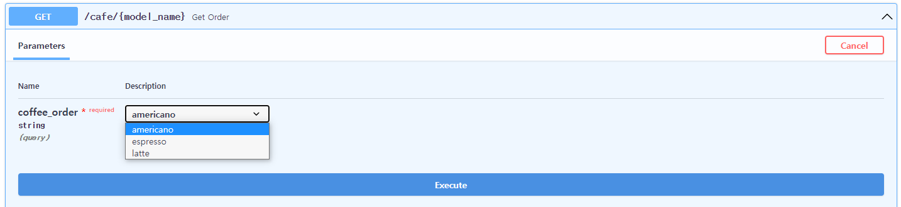

# FastAPI 튜토리얼

- 특징
  - 빠름:  Starlette과 Pydantic 덕분에 NodeJS 및 Go와 대등할 정도로 매우 높은 성능을 지녔다.
  - 빠른 코드 작성: 200~300%까지 개발 속도 증가
  - 적은 버그: 개발자에 의한 에러 40% 감소
  - 직관적: 훌륭한 편집기 지원, 모든 곳에서 자동완성, 적은 디버깅 시간.
  - 쉬움: 쉽게 사용하고 배우도록 설계.
  - 짧음: 코드 중복 최소화, 각 매개변수 선언의 여러 기능.


- 설치하기

  - Python 3.6 이상부터 사용 가능하다.
  - fastapi 설치

  ```bash
  $ pip install fastapi
  ```

  - uvicorn 설치

  ```bash
  $ pip install uvicorn[standard]
  ```


- 만들기

  - main.py 파일 생성
    - required인지 optional인지는 기본값 설정 여부에 달려있다.
  
  ```python
  from typing import Optional
  from fastapi import FastAPI
  
  # application 생성
  app = FastAPI()
  
  @app.get("/")
  def read_root():
      return {"Hello":"World"}
  
  @app.get("/items/{item_id}")
  # int형 이어야 하는 경로 매개변수와 str형 이어야 하는 경로 매개변수 q를 받는다.
  # q의 경우 기본값으로 None을 줬기에 optional이지만, 만일 기본값을 주지 않을 경우 required가 된다.
  def read_item(item_id: int, q: Optional[str]=None):
      return {"item_id": item_id, "q": q}
  ```
  
  - 아래와 같이 lambda 형식으로도 추가할 수 있다.
  
  ```python
  from fastapi import FastAPI
  import uvicorn
  
  
  app = FastAPI()
  
  
  app.get("/")(lambda :"ok")
  
  if __name__ == "__main__":
      uvicorn.run(app)
  ```
  
  - 서버 실행하기
    - 위 코드에서 `app = FastAPI()`로 생성된 app을 명령어로 넣는다.
    - `--reload`는 코드가 변경된 후 서버를 재시작하는 명령어이다.
    - 호스트와 포트를 변경하고자 한다면 `--host`, `--port` 옵션을 준다.
  
  ``` bash
  # uvicorn 파일명:FastAPI()로 생성한 객체 --reload
    
  $ uvicorn main:app --reload
  ```
  
  - 혹은 아래와 같이 script 내에 실행 코드를 넣을 수도 있다.
  
  ```python
  from fastapi import FastAPI
  import uvicorn
  
  app = FastAPI()
  
  
  @app.get("/foo")
  async def async_func():
      print("foo")
      return "foo"
  
  
  if __name__ == "__main__":
      uvicorn.run(app, host=192.160.1.567, port=8080)
  ```
  
  


- 요청 보내기

  ```json
  GET 127.0.0.1:8000/items/5?q=Theo
  
  {
      "item_id": 5,
      "q": "Theo"
  }
  ```


- API 문서
  - 대화형 API 문서
    -  주소 뒤에 `/docs`를 입력하면 대화형 API 문서로 접속이 가능하다.
  - 대안 API 문서
    - 주소 뒤에 `/redoc`을 입력하면 대화형 API 문서로 접속이 가능하다.
  - 코드가 변경되면 문서도 자동으로 업그레이드 된다.


- Request Body를 함께 보내기

  - `pydantic`을 활용한다.

  ```python
  from typing import Optional
  from fastapi import FastAPI
  from pydantic import BaseModel
  
  app = FastAPI()
  
  class Item(BaseModel):
      name: str
      price: float
      # is_offer는 기본값으로 None을 줬기에 optional한 값이 된다.
      is_offer:Optional[bool] = None
  
  # (...중략...)
  
  
  @app.put("/itmes/{item_id}")
  def update_item(item_id: int, item: Item):
      return {"item_name":item.name, "item_id": item_id}
  ```


- FastAPI의  `Query`, `Path`, `File`등은 모두 사실은 class가 아닌 class를 반환하는 function이다.


- 각 API에 해당하는 함수를  path operation function이라 부른다.

  - 즉, 아래에서 `create_item`이 path opetaion function이다.

  ```python
  @app.post("/items")
  def create_item(item: Item):
      return item
  ```


## Python type hints와 FastAPI

- `Annotated`와 FastAPI

  - 본래 Python에서는 `Annotated`는 metadata를 추가하는 것 외에 아무런 기능이 존재하지 않는다.

  ```python
  from typing import Annotated
  
  
  def say_hello(name: Annotated[str, "this is just metadata"]) -> str:
      return f"Hello {name}"
  ```

  - 그러나 FastAPI에서는 객체의 metadata를 가지고 해당 객체가 어떻게 동작해야 하는지를 결정한다.
    - FastAPI에서도 `Annotated`에 첫 번째로 넘긴 type이 실제 type이라는 점은 변함이 없다.


- `Union`과 `Optional`

  - `Optional`은 optional한 값을 설정하기 위해 주로 사용한다.
    - `name: str = None`이라고 쓰는 것과 실제 동작에는 차이가 없지만, 아래와 같이 `Optional`을 붙일 경우 editor가 `name`이라는 값이 항상 str인 것이 아니라 None이라는 것을 알 수 게 해준다.

  ```python
  from typing import Optional
  
  
  def say_hi(name: Optional[str] = None):
      if name is not None:
          print(f"Hey {name}!")
      else:
          print("Hello World")
  ```

  - `Optional[SomeType]`과 `Union[SomeType, None]`은 내부 동작까지 완전히 동일하다.
  - 그러나 `Optional`한 값이 아닌 곳에서는 `Optional` 보다는 `Union`을 사용하는 것이 권장된다.
    - 이는 optinonal이라는 단어의 의미 때문으로, 실제로는 optional한 값이 아님에도 `Optional`이 달려있으면 optional한 값이라는 착각을 일으킬 수 있기 때문이다.
    - 예를 들어 아래 예시에서 `name`은 optional한 값이 아니지만 `Optional`을 사용하여 optional한 값 같은 느낌을 준다.

  ```python
  from typing import Optional
  
  
  def say_hi(name: Optional[str]):
      print(f"Hey {name}!")
  ```

  - 단, 이는 Python 3.10 미만일 때의 이야기로, Python 3.10 이상을 사용한다면 둘 다 사용하지 않고 아래와 같이 하면 된다.
    - `|`를 사용한다.

  ```python
  def say_hi(name: str | None):
      print(f"Hey {name}!")
  ```


# 매개변수

## Path Parameter

- Fastapi에서는 매개변수 또는 변수를 경로에 선언할 수 있다.

  - 경로 매개변수의 값은 함수의 파라미터로 전달된다.
  - 예시
    - 경로 매개변수 `item_id`를 받아 함수의 파라미터로 전달.

  ```python
  from fastapi import FastAPI
  
  
  app = FastAPI()
  
  @app.get("/items/{item_id}")
  async def read_item(item_id):
      return {"item_id": item_id}
  ```


- 타입이 있는 매개변수

  - Python 타입 어노테이션(타입 힌트)을 통해 함수에 있는 경로 매개변수의 타입을 선언할 수 있다.
    - 경로 매개변수는 문자열로 들어오지만 함수가 받은 값은 문자열이 아닌 int이다.
    - 즉, FastAPI는 자동으로 요청을 **파싱**한다.
    - 파싱: 여기서의 파싱은 문자열 표현을 해당하는 형으로 변환하는 것을 의미한다.

  ```python
  from fastapi import FastAPI
  
  app = FastAPI()
  
  
  @app.get("/items/{item_id}")
  # type hint로 item_id를 int type으로 설정
  async def read_item(item_id: int):
      return {"item_id": item_id}
  ```

  - 선언한 타입과 다른 타입이 입력으로 들어올 경우
    - `http://127.0.0.1:8002/items/2`와 같이 int로 변환 가능한 값(파싱 가능한 값)이 들어오면 정상적으로 반환값을 반환한다.
    - 그러나 `http://127.0.0.1:8002/items/hello`와 같이 int로 변환 불가능한 값(파싱 불가능한 값)이 들어오면 아래와 같은 에러를 반환한다.
    - `http://127.0.0.1:8002/items/2.2`와 같이 float을 입력해도 동일한 error가 발생한다.

  ```json
  {
      "detail": [
          {
              "loc": [
                  "path",
                  "item_id"
              ],
              "msg": "value is not a valid integer",
              "type": "type_error.integer"
          }
      ]
  }
  ```


- API의 선언 순서

  - 문제 상황
    - 아래 예시와 같이 API를 작성했을 경우 `read_user_me`와 `read_user`는 경로가 겹치는 부분이 있다.
    - 사용자가 `read_user_me`로 요청을 보내려 `/user/me`로 보내면 먼저 선언된 API인 `read_user`가 `me`를 경로 매개변수로 인식하여  `read_user`로 요청이 가게 된다.

  ```python
  from fastapi import FastAPI
  
  
  app = FastAPI()
  
  
  @app.get("/users/{user_name}")
  async def read_user(user_name: str):
      return {"user_name": user_name}
  
  
  @app.get("/users/me")
  async def read_user_me():
      return {"user_id": "the current user"}
  ```

  - 위와 같은 상황에서는 선언 순서를 변경해줘야 한다.

  ```python
  from fastapi import FastAPI
  
  app = FastAPI()
  
  
  @app.get("/users/me")
  async def read_user_me():
      return {"user_id": "the current user"}
  
  
  @app.get("/users/{user_name}")
  async def read_user(user_name: str):
      return {"user_name": user_name}
  ```


- Enum 활용

  - Enum을 활용하면 경로 매개변수의 값을 미리 지정할 수 있다.
  - Enum 클래스 생성
    - 설정하고자 하는 경로 매개변수의 타입과 Enum을 상속받는 서브 클래스를 생성한다.
    - 아래 예시의 경우 Enum과 문자열을 상속받는데, 상속받은 타입(문자열)이 경로 매개변수의 타입이 된다.

  ```python
  from enum import Enum
  
  from fastapi import FastAPI
  
  
  class ModelName(str, Enum):
      americano = "americano"
      espresso = "espresso"
      latte = "latte"
  ```

  - 경로 매개변수 선언
    - 반환할 때는 Enum type인 coffee_order를 문자열로 변환해서 반환한다.

  ```python
  from enum import Enum
  
  from fastapi import FastAPI
  
  
  class CoffeeOrder(str, Enum):
      americano = "americano"
      espresso = "espresso"
      latte = "latte"
  
  
  app = FastAPI()
  
  
  @app.get("/models/{coffee_name}")
  async def get_order(coffee_order: CoffeeOrder):
      if coffee_order == CoffeeOrder.americano:
          return {"coffee_order": coffee_order, "price": 4500}
  
      if coffee_order.value == "espresso":
          return {"coffee_order": coffee_order, "price": 4000}
  
      return {"coffee_order": coffee_order, "price": 5000}
  ```

  - 매개변수의 값을 미리 지정해줬으므로 아래와 같이 선택이 가능하다.

  

  - fastapi에서 제공하는 문서가 아닌 url로 요청을 보내고자 할 경우 아래와 같이 보내면 된다.
    - `http://127.0.0.1:8002/cafe/{coffee_name}?coffee_order=americano`
    - `{coffee_name}`부분은 비워두거나 다른 경로와 겹치지만 않으면 않으면 어떤 값을 넣어도 무관하다.
    - 위에서 선언해준 값 이외의 값을 보내면 error가 발생한다.


- 경로를 포함하는 경로 매개변수

  - `/files/{file_path}`와 같이 파일 경로를 경로 매개변수로 받아야 하는 경우가 있을 수 있다.
  - Fastapi는 `/home/theo/workspace/test.txt`와 같이 파일 경로를 포함하는 경로 매개변수를 내부에 선언할 수 없게 해놨다.
  - 그러나 다음과 같은 방법을 사용하면 가능하다.
    - 경로를 선언하는 부분에 `:path`를 추가하면 파일 경로도 경로 매개변수로 사용이 가능하다.
    - 주의할 점은 경로 매개변수로 받은 파일 경로가 반드시 `/`로 시작해야 한다는 것이다.
    - 예컨데 `/files//home/theo/workspace/test.txt`와 같은 경로가 된다(이중 슬레시가 생기는 것이 정상이다).

  ```python
  from fastapi import FastAPI
  
  app = FastAPI()
  
  
  @app.get("/files/{file_path:path}")
  async def read_file(file_path: str):
      return {"file_path": file_path}
  ```


- Path

  - `Path`를 사용하면 추가적인 유효성 검증과 메타데이터 입력이 가능하다.
    - 첫 번째 인자로 기본값을 받는데, 경로 매개변수는 경로에 매개변수를 받으므로 반드시 받아야 한다. 
    - 따라서 required로 만들기 위해 첫 번째 인자에 Ellipsis(`...`)를 줘야 한다.
    - None을 포함한 다른 값을 첫 번째 인자로 줘도 실행에 영향을 미치지는 않는다.
  - 아래 옵션들을 사용 가능하다.
    - `alias`: 매개변수의 이름이 Python의 규칙과 맞지 않을 때(e.g. user-name)이를 Python의 규칙에 맞는 이름과 연결하기 위해 사용.
    - `title`: 파라미터에 title을 메타데이터로 주기 위해 사용
    - `description`: 파라미터에 description을 메타데이터로 주기 위해 사용
    - `gt`, `ge`, `lt`, `te`: 숫자의 대소 비교
    - `min_length`, `max_length`: 최소 길이, 최대 길이 비교
    - `regex`: 정규표현식
    - `depreacted`: docs에 더 이상 사용하지 않을 것이라는 표시를 해준다. 이 옵션이 True라 하더라도 정상적으로 동작은 한다.
  - metadata 추가하기

  ```python
  from typing import Optional
  
  from fastapi import FastAPI, Path, Query
  
  app = FastAPI()
  
  
  @app.get("/items/{item_id}")
  async def read_items(
      item_id: int = Path(..., title="The ID of the item to get")
  ):
      results = {"item_id": item_id}
      return results
  ```


- `typing.Annotated` 사용하기

  > FastAPI 0.95.0부터 사용 가능하다.
  >
  > Query parameter 뿐 아니라, dependency 등에서도 `Annotated`를 사용할 것을 권장한다.

  - FastAPI에서는 `Annotated`를 여러 곳에서 여러 이유로 사용하는데, query parameter를 선언할 때는 validation을 위해 사용한다.
    - 아래에서 `foo`의 경우는 query parameter q에 대하여 `Annotated`를 통해 `Query(max_length=3)`라는 metadata를 추가하여 `q`의 validation에 사용한다.
    - 물론 `Annotated`를 사용하지 않은 `bar`도 `foo`와 정확하게 동일하게 동작하긴 한다.

  ```python
  from typing import Annotated
  
  from fastapi import FastAPI, Query
  import uvicorn
  
  app = FastAPI()
  
  
  @app.get("/foo")
  def foo(q: Annotated[str | None, Query(max_length=3)] = None):
      print(q)
  
  @app.get("/bar")
  def bar(q: str | None = Query(default=None, max_length=3)):
      print(q)
  
  if __name__ == "__main__":
      uvicorn.run(app)
  ```

  - FastAPI는 `Annotated`를 사용할 것을 권장하는데, 그 이유는 아래와 같다.
    - Parameter를 `q: Annotated[str | None, Query(max_length=3)] = None`과 같이 작성하는 것이 Python에서 일반적인 default value를 주는 방식이다.
    - `q: str | None = Query(default=None, max_length=3)`와 같이 parameter를 선언하여 기본값을 설정하는 것은 오직 FastAPI라는 맥락 내에서만 유효한 방식이며, 만일 이런 방식으로 parameter를 선언한 함수를 FastAPI가 아닌 다른 곳에서 그대로 쓰려 한다면, 기본값을 추가해줘야할 것이다.
    - 즉 FastAPI라는 맥락 내에서는 두 방식이 정확히 동일하게 동작하지만, 다른 곳에서 사용될 때는 그렇지 않다.
    - 따라서 다른 곳에서 사용하게 될 경우에 대비하여 `Annotated` 방식을 사용하는 것을 권장한다.

  ```python
  # Annotate가 붙은 방식은
  @app.get("/foo")
  def foo(q: Annotated[str | None, Query(max_length=3)] = None):
      print(q)
      
  # FastAPI라는 맥락을 걷어내도 수정 없이 바로 사용이 가능하다.
  def foo(q: Annotated[str | None, Query(max_length=3)] = None):
      print(q)
      
  # 반면에 Annotate를 사용하지 않은 방식은
  @app.get("/bar")
  def bar(q: str | None = Query(default=None, max_length=3)):
      print(q)
  
  # FastAPI라는 맥락을 걷어내고 사용하려면 아래와 같이 수정해줘야한다.
  def bar(q: str | None = Query(max_length=3) = None):
      print(q)
  ```


## Query parameter

- 쿼리 매개변수

  - 쿼리란 URL에서 `?`후에 나오고 `&`로 구분되는 키-값 쌍이다.
  - 경로 매개변수가 아닌 함수의 매개변수를 선언하면, 쿼리 매개변수로 자동으로 해석한다.
    - URL의 일부이므로 기본값은 문자열이지만 경로 매개변수와 마찬가지로 기본 자료형을 선택할 수 있다.
    - 또한 경로에서 고정된 부분이 아니기 때문에 선택적일 수 있고 기본값을 가질 수 있다.
    - 따라서 아래 예시에서 `http://127.0.0.1:8002/sum/`으로 요청을 보내면 0+0을 반환한다.

  ```python
  from fastapi import FastAPI
  
  
  app = FastAPI()
  
  @app.get("/sum/")
  async def read_item(num1: int = 0, num2: int = 0):
      return num1+num2
  ```
  - 선택적 매개변수
    - Optional을 활용하여 nullable하다는 것을 명시해주고, 기본값을 None으로 설정하여 선택적 매개변수를 선언할 수 있다.
    - None을 주는 것과 None이 아닌 기본 값을 주는 것의 차이는 다음과 같다.
    - 둘 다 사용자에게는 아무런 입력을 받지 않는 다는 것은 동일하다.
    - 그러나 None이 아닌 기본 값의 경우 입력을 받지 않아도 매개변수에 None이 아닌 기본값이 들어가게 된다.
    - 즉 만일 로직상 None이 필요하다면 기본값을 None으로 줘야 한다. 

  ```python
  @app.get("/say/{verb}")
  async def say_something(verv, noun: Optional[str]=None):
      if noun:
          return_value = verv + ' ' + noun
      else:
          return_value = verv + ' ' + 'nothing'
      return return_value
  ```

  - 경로 매개변수와 쿼리 매개변수를 함께 사용
    - 경로 매개변수와 쿼리 매개변수를 동시에 사용할 수 있다.
    - fastapi는 매개변수의 이름으로 경로 매개변수와 쿼리 매개변수를 구분한다.

  ```python
  @app.get("/users/{user_id}/")
  async def read_item(user_id: int, user_name: Optional[str] = None):
      if user_name:
          return user_name
      return user_id
  ```

  - 필수 쿼리 매개변수
    - 쿼리 매개변수에 기본값을 추가하면 해당 값은 optional한 값이다.
    - 특정 매개변수를 필수로 받도록 하기 위해서는 기본값을 지정하지 않으면 된다.
    - 아래의 경우 verb를 입력하지 않으면 error가 발생한다.

  ```python
  @app.get("/do/{verb}")
  async def say_something(verv, noun: str):
      return verv + ' ' + noun
  ```


- 쿼리 매개변수 형변환

  - 아래의 경우 is_true에 1, True, true, yes, on 등 일반적으로 True로 인식되는 값을 넣을 경우 True를 반환한다.
    - 즉 아래 예시와 같은 URL은 모두 True를 반환한다.
    - `http://127.0.0.1:8002/is-true/?is_true=1`
    - `http://127.0.0.1:8002/is-true/?is_true=on`
  - 반대로 is_true에 0, False, false, no 등 일반적으로 False로 인식되는 값을 넣거나 아예 넣지 않을 경우 False를 반환한다.
  - 만약 True, False로 형변환이 불가능한 경우 error가 발생한다.

  ```python
  @app.get("/is-true/")
  async def read_item(is_true: bool = False):
      return is_true
  ```


- Query

  - `Query`를 사용하여 쿼리 매개변수에 대한 추가적인 유효성 검사와 메타데이터 추가가 가능하다.
    - 첫 번째 인자로 기본값으로 사용할 값을 주며, 두 번째 인자부터 검증할 내용을 준다.
    - 만일 유효성 검사를 통과하지 못하면 error를 반환한다.

  ```python
  from typing import Optional
  
  # Query를 import한다.
  from fastapi import FastAPI, Query
  
  app = FastAPI()
  
  
  @app.get("/items/")
  # 기본값으로 Query를 주고 첫 번째 인자에 실제로 줄 기본값을, 두 번째 인자로 최대 길이를 준다.
  async def read_items(item: Optional[str] = Query(None, max_length=50)):
      results = 'Nothing'
      if item:
          results = item
      return results
  ```

  - 만일 `Query`를 사용하면서 파라미터를 required로 만들고자 한다면 다음과 같이 첫 번째 인자에 Ellipsis(`...`)를 주면 된다.

  ```python
  from typing import Optional
  
  # Query를 import한다.
  from fastapi import FastAPI, Query
  
  app = FastAPI()
  
  
  @app.get("/items/")
  async def read_items(item: Optional[str] = Query(..., max_length=50)):
      results = 'Nothing'
      if item:
          results = item
      return results
  ```

  - 사용 가능한 옵션은 다음과 같다.
    - alias: 쿼리 매개변수의 이름이 Python의 규칙과 맞지 않을 때(e.g. user-name)이를 Python의 규칙에 맞는 이름과 연결하기 위해 사용.
    - title: 파라미터에 title을 메타데이터로 주기 위해 사용
    - description: 파라미터에 description을 메타데이터로 주기 위해 사용
    - gt, ge, lt, te: 숫자의 대소 비교
    - min_length, max_length: 최소 길이, 최대 길이 비교
    - regex: 정규표현식
    - depreacted: docs에 더 이상 사용하지 않을 것이라는 표시를 해준다. 이 옵션이 True인 파라미터를 줘도 정상적으로 동작한다.

  ```python
  from typing import Optional
  
  from fastapi import FastAPI, Query
  
  app = FastAPI()
  
  
  # http://127.0.0.1:8000/items/?item-query=foo와 같이 쿼리 매개변수를 보내고자 할 때,item-query는 Python의 규칙에 맞지 않는다.
  # 따라서 item_query라는 쿼리 매개변수에 alias를 걸어준다.
  @app.get("/get-item/")
  async def read_items(item_query: Optional[str] = Query(None, alias="item-query")):
      result = "Nothing"
      if item:
          result = item
      return result
  
  @app.get("/foo/")
  async def read_items(bar: Optional[str] = Query(None, deprecated=True)):
      result = "Nothing"
      if item:
          result = item
      return result
  ```


- `Query`를 사용하면 복수의 값을 받아오는 쿼리 파라미터를 선언 가능하다.

  - 아래와 같이 List의 기본값으로 `Query`를 준다.

  ```python
  from typing import List, Optional
  
  from fastapi import FastAPI, Query
  
  app = FastAPI()
  
  
  @app.get("/get-items/")
  async def read_items(items: Optional[List[str]] = Query(None)):
      query_items = {"items": items}
      return query_items
  
  
  # 혹은 아래와 같이 그냥 list를 사용해도 된다.
  @app.get("/get-items/")
  async def read_items(items: list = Query([])):
      query_items = {"items": items}
      return query_items
  ```

  - 아래 URI로 요청을 보내본다.
    - `http://127.0.0.1:8002/get-items/?items=foo&items=bar`

  - 아래와 같이 Query를 사용하지 않으면 error가 발생한다.

  ```python
  from typing import List, Optional
  
  from fastapi import FastAPI, Query
  
  app = FastAPI()
  
  
  @app.get("/get-items/")
  async def read_items(items: List[str]):
      query_items = {"items": items}
      return query_items
  ```

  - None이 아닌 기본값을 줄 수 있다.

  ```python
  from typing import List
  
  from fastapi import FastAPI, Query
  
  app = FastAPI()
  
  
  @app.get("/get-items/")
  async def read_items(items: List[str] = Query(["foo", "bar"])):
      query_items = {"items": items}
      return query_items
  ```


- 매개변수 정렬

  - Python은 기본적으로 함수를 선언할 때 아래와 같이 기본값이 있는 파라미터들은 기본값이 없는 파라미터들 뒤에 선언해야 한다.

  ```python
  from fastapi import FastAPI, Path
  
  app = FastAPI()
  
  
  @app.get("/items/{item_id}")
  async def read_items(
      q: str, item_id: int = Path(..., title="The ID of the item to get")
  ):
      results = {"item_id": item_id}
      if q:
          results.update({"q": q})
      return results
  ```

  - 그러나 FastAPI에서는 기본값이 없는 값을 뒤에 선언할 수 있도록 해준다.
    - 함수의 첫 번째 인자로 `*`를 넣어주면 된다.
    - 이제 뒤에 있는 파라미터들은 keyword arguments(kargs)처럼 동작하게 된다.

  ```python
  from fastapi import FastAPI, Path
  
  app = FastAPI()
  
  
  @app.get("/items/{item_id}")
  async def read_items(
      *, item_id: int = Path(..., title="The ID of the item to get"), q: str
  ):
      results = {"item_id": item_id}
      if q:
          results.update({"q": q})
      return results
  ```


## Request Files

- `File`을 사용하여 client로 부터 file을 받아오는 API를 생성할 수 있다.

  - 아래와 같이 `File`이라는 metadata를 추가하면, form data로 file이 추가된다.

  ```python
  from fastapi import FastAPI, File
  from typing_extensions import Annotated
  
  
  app = FastAPI()
  
  @app.post("/files")
  async def create_file(file: Annotated[bytes, File()]):
      return {"file_size": len(file)}
  ```

  - `File`이라는 metadata를 추가하지 않으면 FastAPI는 해당 parameter를 query parameter 혹은 form data body parameter가 아닌 json body parameter로 인식하게 된다.
    - 예를 들어 아래와 같이 작성할 경우, form data로 추가해도 인식하지 못 한다.

  ```python
  @app.post("/files")
  async def create_file(file: bytes):
      return {"file_size": len(file)}
  ```

  - `UploadFile`

    - 위 예시에서와 같이 parameter의 type을 bytes로 지정할 경우(`file: Annotated[bytes, File()]`), 해당 file을 읽어서 memory에 저장한다.
    - 이는 file의 크기가 작을 경우에는 문제가 없지만, file의 크기가 커질 경우 문제가 생길 수 있다.

    - Type을 `UploadFile`로 설정할 경우 대용량 file도 메모리 걱정 없이 사용할 수 있다.

  ```python
  from fastapi import FastAPI, UploadFile
  
  
  app = FastAPI()
  
  @app.post("/uploadfile")
  async def create_upload_file(file: UploadFile):
      return {"filename": file.filename}
  ```

  - `UploadFile`을 사용할 경우 아래와 같은 이점들이 있다.
    - Spooled file을 사용한다. 즉, 일정 크기까지의 file만 memory에 저장하고, 해당 크기를 초과하는 file은 disk에 저장한다.
    - 받아온 file로부터 file의 metadata를 가져올 수 있다.
    - [file-like](https://docs.python.org/3/glossary.html#term-file-like-object) async interface를 가지고있다.
    - [SpooledTemporaryFile](https://docs.python.org/3/library/tempfile.html#tempfile.SpooledTemporaryFile)의 객체로 file-like object를 사용하는 다른 library들에 바로 사용할 수 있다.
  - `UploadFile`은 아래와 같은 attribute들을 가지고 있다.
    - `filename`, `content-type`, `file`
    - `file`에는 SpooledTemporaryFile 객체가 담겨있다.
  - `UploadFile` 객체는 내부의 SpooledTemporaryFile 객체를 조작하기 위한 여러 method를 지원한다.
    - 모두 async method이므로 `await` keyword를 사용해야한다.

  ```python
  from fastapi import FastAPI, UploadFile
  
  app = FastAPI()
  
  
  @app.post("/uploadfile")
  async def create_upload_file(file: UploadFile):
      # file에 내용을 작성한다.
      await file.write("Hello World!".encode("utf8"))
      # 특정 offset으로 이동한다.
      await file.seek(0)
      # file의 내용을 특정 size만큼 읽는다.
      content = await file.read(5)
      print(content)
      # file을 닫는다.
      await file.close()
      return {"filename": file.filename}
  ```

  - 만일 async가 아닌 function에서 사용하고자 한다면, 아래와 같이 `.file` attribute에 바로 접근해서 사용하면 된다.

  ```python
  contents = myfile.file.read()
  ```

  - `File`과 함께 사용하면 metadata를 추가할 수 있다.

  ```python
  from typing import Annotated
  
  from fastapi import FastAPI, File, UploadFile
  
  app = FastAPI()
  
  @app.post("/uploadfile/")
  async def create_upload_file(file: Annotated[UploadFile, File(description="A file read as UploadFile")]):
      return {"filename": file.filename}
  ```

  - 여러 file upload하기
    - Type을 list로 선언하면 된다.

  ```python
  from typing import Annotated
  
  from fastapi import FastAPI, File, UploadFile
  from fastapi.responses import HTMLResponse
  
  app = FastAPI()
  
  
  @app.post("/files/")
  async def create_files(files: Annotated[list[bytes], File()]):
      return {"file_sizes": [len(file) for file in files]}
  
  
  @app.post("/uploadfiles/")
  async def create_upload_files(files: list[UploadFile]):
      return {"filenames": [file.filename for file in files]}
  ```


# Request

- 요청을 보낸 client의 host 확인하기

  - `Reqeust`에 ip 정보가 담겨 있다. 

  ```python
  from fastapi import FastAPI, Request
  
  
  app = FastAPI()
  
  @app.get("/")
  def read_root(request: Request):
      client_host = request.client.host
      return {"client_host": client_host}
  ```

  


## Request Body

- 개요
  -  만일 client에서 API로 data를 보내려 한다면 request body에 담아서 보내야 한다.
  - request body란 클라이언트가 API에게 보내는 데이터를 말하며, response body란 API가 클라이언트에 보내는 데이터를 말한다.
    - API는 거의 항상 클라이언트에 response body를 보내지만, 클라이언트가 항상 API에 requests body를 보내는 것은 아니다.


- request body

  - fastapi에서 request body는 pydantic의 `BaseModel`을 상속받는 클래스를 통해 선언한다.
  - Request body에 받아 올 값들을 클래스 변수로 선언한다.
    - 기본값을 주면 not required, 기본값을 주지 않으면 required이며, 기본값으로 None을 주면 Optional한 값이 된다. 

  ```python
  from typing import Optional
  
  from fastapi import FastAPI
  # pydantic에서 BaseModel을 import한다.
  from pydantic import BaseModel
  
  # Request body에 받아 올 값들을 정의한다.
  class Item(BaseModel):
      name: str = 'theo'
      description: Optional[str] = None
      price: float
      tax: Optional[float] = None
  
  
  app = FastAPI()
  
  
  @app.post("/items/")
  async def create_item(item: Item):
      return item
  ```

  - 이렇게 선언한 Model은 docs의 Schemas 탭에서 확인 가능하다.

  - Request body에 데이터를 담아 위에서 선언한 URL로 요청을 보내면 FastAPI는 다음의 과정을 거친다.
    - Request Body를 Json 형식으로 읽는다.
    - Json 형식의 데이터를 적절한 Python 형식으로 변환한다.
    - 데이터의 유효성을 검증한다. 만일 데이터가 유효하지 않으면 에러를 반환하는데, 에러에는 유효하지 않은 데이터에 대한 정보가 담겨 있다.
    - 유효성 검증이 끝난 데이터를 ` item` 파라미터에 담는다.
    - `Item`모델의 형식에 맞는 Json Schema를 생성한다.


- Request body, 경로 매개변수, 쿼리 매개변수 함께 사용하기

  - 위의 세 가지를 동시에 받아올 수 있다.

  ```python
  from typing import Optional
  
  from fastapi import FastAPI
  from pydantic import BaseModel
  
  
  class Item(BaseModel):
      name: str
      description: Optional[str] = None
      price: float
      tax: Optional[float] = None
  
  
  app = FastAPI()
  
  
  @app.put("/items/{item_id}")
  async def create_item(item_id: int, item: Item, customer: Optional[str] = None):
      result = {"item_id": item_id, **item.dict()}
      if customer:
          result.update({"customer": customer})
      return result
  ```

  - Fastapi가 이들을 구분하는 방식
    - 함수의 파라미터가 경로에도 있으면 경로 파라미터로 인식한다.
    - 함수의 파라미터가 단일 타입이면 쿼리 파라미터로 인식한다.
    - 함수의 파라미터가 Pydantic model로 선언되었으면 request body로 인식한다.


- Request Body의 다양한 형태

  - 복수의 body 매개변수 받기
    - `BaseModel`을 상속 받는 클래스를 body 매개변수의 수 만큼 생성하면 된다.

  ```python
  from typing import Optional
  
  from fastapi import FastAPI
  from pydantic import BaseModel
  
  app = FastAPI()
  
  
  class Item(BaseModel):
      name: str
      description: Optional[str] = None
      price: float
      tax: Optional[float] = None
  
  
  class User(BaseModel):
      username: str
      full_name: Optional[str] = None
  
  
  @app.put("/items/{item_id}")
  async def update_item(item_id: int, item: Item, user: User):
      results = {"item_id": item_id, "item": item, "user": user}
      return results
  ```

  - 단일 value를 가지는 body 파라미터
    - 기본적으로 fastapi는 경로 매개변수가 아니면서 매개변수가 단일 값이면(Pydantic의 `Basemodel`을 상속받은 클래스가 아니면) 쿼리 매개변수로 인식한다.
    - 만일 body request에 단일한 값을 사용해야 한다면 `Body`를 사용하면 된다.
    - Body역시 Query, Path와 마찬가지로 파라미터 추가와 추가적인 유효성 검사가 가능하다.

  ```python
  from typing import Optional
  
  # Body를 import 한다.
  from fastapi import Body, FastAPI
  from pydantic import BaseModel
  
  app = FastAPI()
  
  
  class Item(BaseModel):
      name: str
      description: Optional[str] = None
      price: float
      tax: Optional[float] = None
  
  
  class User(BaseModel):
      username: str
      full_name: Optional[str] = None
  
  
  @app.put("/items/{item_id}")
  async def update_item(
      # 기본값으로 Body를 준다.
      item_id: int, item: Item, user: User, importance: int = Body(...)
  ):
      results = {"item_id": item_id, "item": item, "user": user, "importance": importance}
      return results
  
  '''
  아래와 같이 body requests를 보내면 제대로 인식하는 것을 확인 가능하다.
  {
      "item": {
          "name": "Foo",
          "description": "The pretender",
          "price": 42.0,
          "tax": 3.2
      },
      "user": {
          "username": "dave",
          "full_name": "Dave Grohl"
      },
      "importance": 5
  }
  '''
  ```

  - 중첩된 Request Body
    - FastAPI는 중첩 없이 Model에 정의된 대로 request body가 들어올 것이라고 예상한다.
    - 예를 들어 `{'user_id':1, 'user_name':'theo'}`와 같이 들어올 것이라 예상한다.
    - 그런데 `{'user':{'user_id':1, 'user_name':'theo'}}`와 같이 중첩된 형태로 들어올 수도 있다.
    - `Body`에는 이와 같은 경우에 사용할 수 있는 `embed`라는 옵션이 있다.
    - 이 때 data를 감싸고 있는 상위 key와 매개변수명이 동일해야 하며, 3중 중첩의 경우 잡아내지 못한다.

  ```python
  from typing import Optional
  
  from fastapi import Body, FastAPI
  from pydantic import BaseModel
  
  app = FastAPI()
  
  
  class User(BaseModel):
      user_id: int
      user_name: str
  
  
  @app.post("/items/")
  # embed 옵션을 True로 준다.
  async def update_item(user: User = Body(..., embed=True)):
      results = {"id": user.user_id, "name": user.user_name}
      return results
  
  '''
  아래와 같이 request body를 보내면 정상적으로 동작하는 것을 확인 가능하다.
  {
      "user": {
          "user_id": 1,
          "user_name": "theo"
      }
  }
  아래와 같이 request body를 보내면 에러가 발생한다.
  {
      "user_info": {
          "user_id": 1,
          "user_name": "theo"
      }
  }
  '''
  ```

  - Request Body가 JSON array(Python의 list) 형태로 올 경우
    - `typing`에서 `List`를 import 한 후 정의한 Model을 요소로 갖는 리스트를 타입으로 설정한다.

  ```python
  # typing에서 List를 import
  from typing import List
  
  from fastapi import FastAPI
  from pydantic import BaseModel
  
  app = FastAPI()
  
  
  class User(BaseModel):
      user_id: int
      user_name: str
  
  
  @app.post("/items/")
  async def update_item(user: List[User]):
      results = {"id": user.user_id, "name": user.user_name}
      return results
  ```


- Model 정의 없이 Request Body를 받기

  - 파라미터의 타입을 `Dict`로 설정하면 모델을 미리 정의하지 않고도 Request Body를 받을 수 있다.
  - Request Body가 어떤 키들을 가지고 있는지 모를 때 유용하다.
    - JSON은 key의 타입으로 오직 str만 지원하지만, Pydantic이 우리가 설정해준 타입으로 형변환을 해준다.

  ```python
  # Dict를 import
  from typing import Dict
  
  from fastapi import FastAPI
  
  app = FastAPI()
  
  
  @app.post("/index-weights/")
  # key가 int, value가 float 타입인 dictionary
  # pydantic이 JSON의 문자열 key를 아래에서 설정해준 int로 변환해준다.
  async def create_index_weights(weights: Dict[int, float]):
      return weights
  ```


- `Field`

  - 경로 매개변수의 `Path`, 쿼리 매개변수의 `Query`와 같이 Request Body에 추가적인 유효성 검사와 메타데이터를 추가할 수 있게 해준다.
    - 사용 가능한 기능은 `Path`, `Query`와 동일하다.
  - 사용법
    - `Field`는 FastAPI가 아닌 **pydantic에서 import**한다.
    - Model을 선언하는 부분에 `Field`를 활용하여 원하는 작업을 추가한다.

  ```python
  from typing import Optional
  
  from fastapi import Body, FastAPI
  # pydantic에서 Field를 import
  from pydantic import BaseModel, Field
  
  app = FastAPI()
  
  
  class Item(BaseModel):
      name: str
      # Model을 선언하는 부분에 추가한다.
      description: Optional[str] = Field(
          None, title="The description of the item", max_length=300
      )
      price: float = Field(..., gt=0, description="The price must be greater than zero")
      tax: Optional[float] = None
  
  
  @app.put("/items/{item_id}")
  async def update_item(item_id: int, item: Item = Body(..., embed=True)):
      results = {"item_id": item_id, "item": item}
      return results
  ```


- Nested Model

  - Model의 attribute type으로 정의가 가능하다.
  - Python의 list로 정의

  ```python
  from fastapi import FastAPI
  from pydantic import BaseModel
  
  app = FastAPI()
  
  
  class Item(BaseModel):
      name: str
      price: float
      tags: list = []
  
  
  @app.put("/items/{item_id}")
  async def update_item(item_id: int, item: Item):
      results = {"item_id": item_id, "item": item}
      return results
  ```

  - 특정 타입을 요소로 가지는 List로 정의
    - `typing`에서 `List`를 import
    - 아래 예시는 문자열을 요소로 지니는 list로 정의한 것이다.

  ```python
  from typing import List
  
  from fastapi import FastAPI
  from pydantic import BaseModel
  
  app = FastAPI()
  
  
  class Item(BaseModel):
      name: str
      price: float
      tags: List[str] = []
  
  # (...)
  ```

  - Python의 set으로 정의
    - set으로 정의했기에 만일 tags에 중복된 데이터가 들어오더라도 중복이 제거된다.

  ```python
  from typing import Set
  
  from fastapi import FastAPI
  from pydantic import BaseModel
  
  app = FastAPI()
  
  
  class Item(BaseModel):
      name: str
      price: float
      tags: Set[str] = set()
  
  # (...)
  ```

  - nested model
    - `BaseModel`을 상속받은 모델을 attribute로 갖는 모델
    - 3중 이상의 중첩도 가능하다.

  ```python
  from typing import Optional
  
  from fastapi import FastAPI
  from pydantic import BaseModel
  
  app = FastAPI()
  
  
  class Image(BaseModel):
      url: str
      name: str
  
  
  class Item(BaseModel):
      name: str
      price: float
      image: Optional[Image] = None
  
  # (...)
  '''
  위 요청의 request body는 아래와 같다.
  {
      "name": "Foo",
      "price": 42.0,
      "image": {
          "url": "http://example.com/baz.jpg",
          "name": "The Foo live"
      }
  }
  '''
  ```

  - submodel 타입을 요소로 갖는 리스트로 정의

  ```python
  # (...)
  class Image(BaseModel):
      url: str
      name: str
  
  class Item(BaseModel):
      name: str
      price: float
      images: Optional[List[Image]] = None
  # (...)
  '''
  위 요청의 request body는 아래와 같다.
  {
      "name": "Foo",
      "price": 42.0
      "images": [
          {
              "url": "http://example.com/baz.jpg",
              "name": "The Foo live"
          },
          {
              "url": "http://example.com/dave.jpg",
              "name": "The Baz"
          }
      ]
  }
  '''
  ```

  - Pydantic이 제공하는 다양한 타입 사용하기
    - 위 예시에서 Image 모델의 attribute 중 url이 있는데, Pydantic이 제공하는 타입 중 `HttpUrl`이 존재한다.
    - 이를 사용하면 url 형식에 맞는지 유효성 검사가 가능하다.
    - 그 밖에 다양한 타입은 `https://pydantic-docs.helpmanual.io/usage/types/` 참조

  ```python
  # (...)
  from pydantic import BaseModel, HttpUrl
  
  # (...)
  
  class Image(BaseModel):
      url: HttpUrl
      name: str
  # (...)
  ```


## Request Header

- Header parameter는 Query, Path 등과 같은 방식으로 정의할 수 있다.

  - `Header` class는 `Path`, `Query`, `Cookie` class와 동일하게 `Param` class 를 상속받는다.
  - 아래와 같이 정의한다.

  ```python
  from typing import Optional
  
  from fastapi import FastAPI, Header
  
  app = FastAPI()
  
  
  @app.get("/items/")
  async def read_items(user_agent: Optional[str] = Header(None)):
      return {"User-Agent": user_agent}
  ```


- 자동 변환

  - Header의 key에는 하이픈이 들어가는 경우가 많다.
    - `x-api-key`, `User-agent`
    - 그러나 위와 같은 값들은 Python에서 유효한 값이 아니기에 변환이 필요하다.
  - `Header` class는 하이픈을 언더스코어로 자동으로 변환한다.
    - 또한 직접 사용할 때도 마찬가지로 Python에서 사용하는 snake_case로 변경해서 사용하면 된다.
    - 예를 들어 `User-agent`는 `user_agent`로 사용한다.

  - 아래와 같이 `convert_underscores=False`를 줘서 비활성화 하는 것도 가능하다.

  ```python
  from typing import Optional
  
  from fastapi import FastAPI, Header
  
  app = FastAPI()
  
  
  @app.get("/items/")
  async def read_items(
  
      strange_header: Optional[str] = Header(None, convert_underscores=False)
  
  ):
      return {"strange_header": strange_header}
  
  ```

  

- 중복되는 header를 받는 것도 가능하다.

  - 아래와 같이 List형으로 선언하면 된다.

  ```python
  from typing import List, Optional
  
  from fastapi import FastAPI, Header
  
  app = FastAPI()
  
  
  @app.get("/items/")
  async def read_items(x_token: Optional[List[str]] = Header(None)):
      return {"X-Token values": x_token}
  ```


- Header의 유효성 검증하기

  - Header에 주로 인증 관련 정보들이 담겨 있으므로 그 정보의 유효성을 검증할 필요가 있다.
  - 아래와 같이 유효성을 검증할 함수를 생성한다.

  ```python
  from fastapi import Header, HTTPException
  
  def verify_token(authorization: str = Header(None)):
      if not authorization:
          raise HTTPException(status_code=401, detail="Token does not exist")
      if authorization != "something":
          raise HTTPException(status_code=403, detail="Token invalid")
  ```

  - api에 `dependencies`에 `Depends`를 활용하여 유효성 검증 함수를 추가한다.

  ```python
  from fastapi import FastAPI, Depends
  
  @app.get("/search", dependencies=[Depends(verify_token)])
  def get_items():
      pass
  ```


# Response

- Response Model

  - 아래와 같이 response model을 선언할 수 있다.

  ```python
  from fastapi import FastAPI
  from pydantic import BaseModel
  
  app = FastAPI()
  
  
  class Item(BaseModel):
      name: str
      price: float
  
  
  @app.post("/items/")
  async def create_item(item: Item) -> Item:
      return item
  
  
  @app.get("/items/")
  async def read_items() -> list[Item]:
      return [
          Item(name="Portal Gun", price=42.0),
          Item(name="Plumbus", price=32.0),
      ]
  ```

  - FastAPI는 response model을 사용하여 아래와 같은 것들을 수행한다.
    - Response를 validate하여 불필요한 정보가 반환되는 것을 막고, 만일 response가 이상하다면 logic 상의 문제가 있는 것이므로 이를 catch할 수 있게 해준다.
    - Respone에 관한 JSON Schema를 추가한다.


- `response_model`

  - 위와 같이 response model을 정의하는 것도 가능하지만, `response_model`을 통해서도 정의할 수 있다.
    - `response_model`은 `@app.get()` 등의 path operation decorator에 정의한다.
  - 굳이 `response_model`을 사용하는 이유는 아래와 같다.
    - 반환 type이 Pydantic으로 정의한 것과 다를 때, 즉 response model은 Pydantic으로 정의했지만, 실제로는 dictionary를 반환하고자 할 때 등에 사용할 수 있다.
    - 예를 들어 아래와 같은 code가 있을 때, `read_items`는 실제로는 dictionary들을 반환하지만, `Item`들을 반환한다고 정의되어 있다.
    - 실행시에 error가 발생하지는 않지만, 사용중인 tool이나 editor에 따라 `read_items`의 반환 type이 잘못되었다는 경고를 보낼 수도 있다.
    - 따라서 return type은 실제 반환하는 type 혹은 `Any`로 선언하고, `response_model`에 Pydantic Model을 정의하여 Pydantic model이 제공하는 documentation, validation 등의 이점을 누리면서도 type이 잘못되었다는 경고를 받지 않기 위해 사용한다.

  ```python
  from fastapi import FastAPI
  from pydantic import BaseModel
  
  app = FastAPI()
  
  
  class Item(BaseModel):
      name: str
      price: float
  
  
  @app.post("/items/")
  async def create_item(item: Item) -> Item:
      return item
  
  
  @app.get("/items/")
  async def read_items() -> list[Item]:
      return [
          Item(name="Portal Gun", price=42.0).dict(),
          Item(name="Plumbus", price=32.0).dict(),
      ]
  ```

  - 예시
    - 아래와 같이 return type과 `response_model`을 모두 선언한 경우 `response_model`이 우선권을 가지며, FastAPI도 이를 사용한다.
    - 따라서 return type은 `Any`로 선언하고, `response_model`에 Pydantic model을 선언하여 `Item` class를 통해 문서화와 validation의 이점도 누리고, return type이 잘못되었다는 경고도 피할수 있게 된다.

  ```python
  from typing import Any
  
  from fastapi import FastAPI
  from pydantic import BaseModel
  
  app = FastAPI()
  
  
  class Item(BaseModel):
      name: str
      price: float
  
  
  @app.post("/items/", response_model=Item)
  async def create_item(item: Item) -> Any:
      return item
  
  
  @app.get("/items/", response_model=list[Item])
  async def read_items() -> Any:
      return [
          {"name": "Portal Gun", "price": 42.0},
          {"name": "Plumbus", "price": 32.0},
      ]
  ```

  

  


