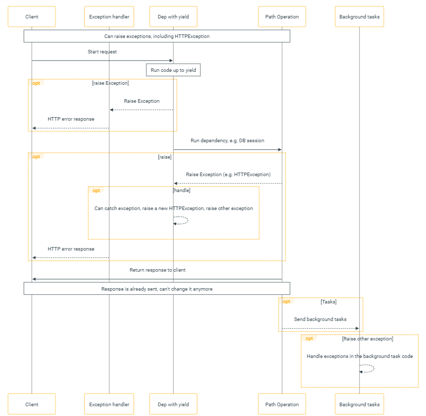

# Response model

- `response_model_exclude_unset`

  - `response_model_exclude_unset`를 True로 설정하면 데이터가 설정되지 않은 필드는 응답에서 제외시킨다.
    - 기본값이 있다고 하더라도, 기본값이 변경되지 않았다면 응답에서 제외된다.

  - 예시
  
  ```python
  from typing import List, Optional
  
  from fastapi import FastAPI
  from pydantic import BaseModel
  
  app = FastAPI()
  
  
  class Item(BaseModel):
      name: str
      description: Optional[str] = None
      price: float
      tax: float = 10.5
      tags: List[str] = []
  
  
  items = {
      "foo": {"name": "Foo", "price": 50.2},
      "bar": {"name": "Bar", "description": "The bartenders", "price": 62, "tax": 20.2},
      "baz": {"name": "Baz", "description": None, "price": 50.2, "tax": 10.5, "tags": []},
  }
  
  
  @app.get("/items/{item_id}", response_model=Item, response_model_exclude_unset=True)
  async def read_item(item_id: str):
      return items[item_id]
  ```


- Redirect response

  - `status_code`를 따로 설정하지 않을 경우 `307 Temporary Redirect`를 반환한 후 바로 redirect url로 연결된다.
    - 따로 설정해주는 것도 가능한데, status_code에 따라서 redirection이 발생하지 않을 수 있다.

  - 방식1.

  ```python
  import uvicorn
  from fastapi import FastAPI
  from fastapi.responses import RedirectResponse
  
  app = FastAPI()
  
  
  @app.get("/hello-world")
  async def hello_world():
      return "Hello!"
  
  
  @app.get("/my-redirect")
  async def redirect_typer():
      return RedirectResponse("http://localhost:8002/hello-world")
  
  
  if __name__ == '__main__':
      uvicorn.run(app, host='0.0.0.0', port=8002)
  ```

  - 방식2.

  ```python
  import uvicorn
  from fastapi import FastAPI
  from fastapi.responses import RedirectResponse
  
  app = FastAPI()
  
  
  @app.get("/hello-world")
  async def hello_world():
      return "Hello!"
  
  
  @app.get("/my-redirect", response_class=RedirectResponse)
  async def redirect_typer():
      return "http://localhost:8002/hello-world"
  
  
  if __name__ == '__main__':
      uvicorn.run(app, host='0.0.0.0', port=8002)
  ```


## StreamingResponse

- FastAPI는 StreamingResponse를 지원한다.

  - 기본적인 `StreamingResponse`의 사용법은 아래와 같다.
    - Generator/iterator를 첫 번째 인자로 받는다.
  
  ```python
  import asyncio
  
  import uvicorn
  from fastapi import FastAPI
  from fastapi.responses import StreamingResponse
  
  app = FastAPI()
  
  
  async def text_stream():
      for i in range(30):
          yield "some text data"
          await asyncio.sleep(5)
  
  
  @app.get("/")
  async def main():
      return StreamingResponse(text_stream())
  
  
  if __name__ == "__main__":
      uvicorn.run(app, host="0.0.0.0", port=8000)
  ```
  
  - 받아오는 쪽에서는 아래와 같이 받아오면 된다.
    - `stream=True`을 설정한다.
  
  ```python
  import requests
  
  url = "http://localhost:8000"
  
  with requests.get(url, stream=True) as r:
      for line in r.iter_content(100):
          print(line)
  ```


- Streamin response를 다시 streaming으로 반환하기

  - 다른 server에서 받아온 streaming response를 다시 streaming response로 반환하는 방법이다.
  - ServerA
    - ServerB에 streaming response를 보낸다.

  ```python
  from fastapi import FastAPI
  from fastapi.responses import StreamingResponse
  import uvicorn
  
  app = FastAPI()
  
  
  @app.get("/stream")
  async def stream():
      def iterfile():
          with open("./test.json", "r") as f:
              for row in f.readlines():
                  yield from row
  
      return StreamingResponse(iterfile(), media_type="application/json")
  
  
  if __name__ == "__main__":
      uvicorn.run(app, port=8000)
  ```

  - ServerB
    - ServerA로부터 streaming response를 받아, 이를 다시 streaming으로 반환한다.

  ```python
  import requests
  
  from fastapi import FastAPI
  from fastapi.responses import StreamingResponse
  import uvicorn
  
  app = FastAPI()
  
  
  @app.get("/stream")
  async def stream():
      def iter_request():
          session = requests.Session()
          with session.get("http://localhost:8000/stream", stream=True) as res:
              for line in res.iter_content(100):
                  yield from line.decode()
  
      return StreamingResponse(iter_request(), media_type="application/json")
  
  
  if __name__ == "__main__":
      uvicorn.run(app, port=8001)
  ```


- 예외처리

  - StreamingResponse는 특성상 일단 응답을 보내기만 하면 error 발생 여부와 관계 없이 status code가 200 OK로 반환된다.
  - 아래 방법을 통해 error 발생시 status code를 변경해서 보낼 수 있다.
    - `middleware`에서 처리한다.

  ```python
  import time
  
  from fastapi import FastAPI
  from fastapi.responses import StreamingResponse, JSONResponse
  
  app = FastAPI()
  
  @app.middleware("http")
  async def test_middleware(request, call_next):
      res = await call_next(request)
      # /stream endpoint에만 적용한다.
      if request.url.path=="/stream":
          has_content = False
          try:
              # response에 enocde가 불가능한 error 객체가 넘어오면 아래 코드가 실행되지 않고 except문으로 넘어간다.
              async for _ in res.body_iterator:
                  has_content = True
                  break
          except:
              pass
          if not has_content:
              return JSONResponse(status_code=418)
      return res
  
  @app.get("/stream")
  async def stream():
      def iterfile():
          try:
              for _ in range(10):
                  raise
                  data = [str(i) for i in range(10)]
                  time.sleep(1)
                  yield from data
          except Exception as e:
              yield e
  
      return StreamingResponse(iterfile(), media_type="text")
  ```
  
  - `res.body_iterator`
    - `res.body_iterator`에 단순히 값이 없는 것(즉, 위 예시에서 `iterfile` 함수가 아무 것도 yield하지 않는 것)과 error가 발생한 것에는 차이가 있다.
    - `res.body_iterator`에 단순히 값이 없을 경우 `b''`라는 빈 bytes문자열이 1번 yield되어 for문이 실행은 된다.
    - 반면에 error가 발생한 경우 `res.body_iterator`은 아예 빈 값이 되어 for문이 아예 실행되지 않는다.
  - 한계
    - 실행 중간에 error가 난 경우에는 처리가 불가능하다.
    - 예를 들어 #1 부분에서 3번째 반복쯤에 raise를 설정했다면, 어쨌든 `res.body_iterator`안에는 1, 2번째 반복때 yield된 값은 들어있으므로 예외 처리가 불가능하다.


- StreamingResponse를 사용하여 SSE를 구현할 수 있다.

  - Server 구현하기
    - `media_type`은 text/event-stream`이어야 한다.
    - 또한 반환 값은 `\n\n`로 끝나야 한다.
    - 둘 다 지키지 않는다고 streaming이 안 되는 것은 아니다.
  
  
  ```python
  import asyncio
  
  from fastapi import FastAPI, Request
  from fastapi.responses import StreamingResponse
  import uvicorn
  
  
  app = FastAPI()
  
  async def streamer(id, req: Request):
      for i in range(5):
          if await req.is_disconnected():
              break
          yield f"id:{id}, message {i}\n\n"
          await asyncio.sleep(1)
  
  
  @app.get("/{id}")
  async def test(id: int, request: Request):
      return StreamingResponse(streamer(id, request), media_type="text/event-stream")
  
  
  if __name__ == "__main__":
      uvicorn.run(app, port=8080)
  ```
  
  - 혹은 `sse.starlette.sse.EventSourceResponse`를 사용하는 방법도 있다.
    - `pip install sse-starlette`으로 설치가 필요하다.
  
  ```python
  import asyncio
  
  from fastapi import FastAPI, Request
  from sse_starlette.sse import EventSourceResponse
  import uvicorn
  
  
  app = FastAPI()
  
  async def streamer(id, req: Request):
      for i in range(5):
          if await req.is_disconnected():
              break
          yield f"id:{id}, message {i}"
          await asyncio.sleep(1)
  
  
  @app.get('/{id}')
  async def stream(id: int, request: Request):    
      return EventSourceResponse(streamer(id, request))
  
  
  if __name__ == "__main__":
      uvicorn.run(app, port=8080)
  ```


# Lifespan Events

- Lifespan
  - Application이 실행되기 직전과 application이 종료된 직후에 단 한 번 실행될 로직을 정의 할 수 있는 기능이다.
  - 일반적으로 application 전체에서 사용할 resource들을 setting하기위해 사용한다.
    - DB connection pool이나 machine learning model등이 이에 해당한다.


- 예시

  - Application에서 machine learning model을 사용해야 한다고 가정해보자.
    - 이 model은 많은 endpoint들이 공유한다.
    - 이 model을 loading하기 위해선 많은 data를 disk에서 읽어와야 해서 loading하는 데 많은 시간이 걸리므로, 매 요청마다 loading하는 것이 불가능한 상황이다.
  - Lifespan 기능을 사용하여 model을 loading한다.
    - Model을 loading하기 위한 lifespan 함수를 `asynccontextmanager` decorator와 함께 비동기 함수로 선언한다.
    - Lifespan 함수에는 `yield`가 포함되어 있어야 하며, application이 실행되기 직전에 `yield`문 전까지 실행되고, application이 종료된 직후에 `yield`문 이후의 로직이 실행된다.
    - `FastAPI` 인스턴스 생성시 `lifespan` parameter에 lifespan 함수를 넘겨준다.

  ```python
  from contextlib import asynccontextmanager
  
  from fastapi import FastAPI
  
  
  def fake_answer_to_everything_ml_model(x: float):
      return x * 42
  
  
  ml_models = {}
  
  
  @asynccontextmanager
  async def lifespan(app: FastAPI):
      # ML model을 loading한다.
      ml_models["answer_to_everything"] = fake_answer_to_everything_ml_model
      yield
      # ML model을 정리한다.
      ml_models.clear()
  
  
  app = FastAPI(lifespan=lifespan)
  
  
  @app.get("/predict")
  async def predict(x: float):
      result = ml_models["answer_to_everything"](x)
      return {"result": result}
  ```


- 더 이상 지원하지 않는 방식

  - 기존에는 아래와 같은 방식을 사용했다.
    - `app.on_event`로 이벤트를 등록하는 방식이었다.

  ```python
  from fastapi import FastAPI
  
  app = FastAPI()
  
  items = {}
  
  @app.on_event("startup")
  async def startup_event():
      items["foo"] = {"name": "Fighters"}
      items["bar"] = {"name": "Tenders"}
  
  @app.on_event("shutdown")
  def shutdown_event():
      with open("log.txt", mode="a") as log:
          log.write("Application shutdown")
  ```

  - 더 이상 지원하지 않는 이유
    - Application의 시작 및 종료시에 로직이나 자원을 공유해야하는 경우가 많다.
    - 위 방식의 경우 startp과 shutdown을 서로 다른 함수에서 관리하므로 두 함수가 공유하는 로직이나 자원을 관리하는 것이 쉽지 않다.
    - 반면에, 위에서 살펴본 async context manager를 사용하는 방식은 하나의 함수를 사용하므로 공유가 훨씬 간편하다.

  ```python
  from contextlib import asynccontextmanager
  
  from fastapi import FastAPI
  
  
  @asynccontextmanager
  async def lifespan(app: FastAPI):
      # 하나의 함수에서 관리하면 start up과 shutdown시에 공유하는 자원을 보다 간편하게 사용할 수 있다.
      conn = SomeDB()
      yield
      conn.close()
  ```


# Testing

- FastAPI는 Starlette의 TestClient를 사용한다.

  - Starlette은 requests를 사용하여 TestClient를 구현했다.
    - 테스트하려는 API에 request를 보내는 방식으로 테스트한다.
  - FastAPI에서 TestClient를 import해도 실제 import 되는 것은 Starlette의 TestClient이다.
    - `starlette.testclient`에서 import한 `TestClient`를 import하는 것이다.
    - 사용자의 편의를 위해서 아래와 같이 구현했다.

  ```python
  # 아래의 두 줄은 완전히 동일한 TestClient를 import한다.
  from fastapi.testclient import TestClient
  from starlette.testclient import TestClient
  
  
  # fastapi.testclient의 코드는 아래와 같다.
  from starlette.testclient import TestClient as TestClient  # noqa
  ```

  - pytest를 설치해야 한다.

  ```bash
  $ pip install pytest
  ```


- Test 코드 작성하기

  - fastapi에서는 일반적으로 아래의 규칙에 따라 테스트 코드를 작성한다.
    - 테스트 함수에 `async`를 붙이지 않으며, TestClient를 통해 테스트 할 때도 `await`을 붙이지 않는다.
    - 이는 pytest를 사용하여 직접 테스트 할 수 있도록 하기 위함이다.
    - 테스트 함수 이름은 `test_`를 prefix로 붙인다(pytest의 컨벤션이다).
  - 테스트 할 코드 작성

  ```python
  from fastapi import FastAPI
  
  app = FastAPI()
  
  
  @app.get("/")
  async def read_main():
      return {"msg": "Hello World"}
  ```

  - 테스트 코드 작성
    - TestClient는 인자로 app을 받는다.
    - Starlette은 내부적으로 requests 라이브러리를 사용하여 테스트한다.
    - 즉 아래 코드에서 `client.get`은 결국 `request.get`을 호출하는 것이다.

  ```python
  from fastapi.testclient import TestClient
  
  from main import app
  
  client = TestClient(app)
  
  
  def test_read_main():
      response = client.get("/")
      assert response.status_code == 200
      assert response.json() == {"msg": "Hello World"}
  ```

  - 테스트 실행
    - 실행하려는 폴더에서 아래 명령어를 입력한다.
    - 테스트 하려는 파일의 이름을 입력하지 않으면, 아래 명령을 실행한 디렉터레이서 `test`라는 이름이 포함 된 `.py` 파일을 모두 테스트 한다.

  ```bash
  $ pytest [파일 이름]
  ```


- 여러 개의 test case 작성하기

  - 테스트 할 코드

  ```python
  from typing import Optional
  
  from fastapi import FastAPI, Header, HTTPException
  from pydantic import BaseModel
  
  fake_secret_token = "coneofsilence"
  
  fake_db = {
      "foo": {"id": "foo", "title": "Foo", "description": "There goes my hero"},
      "bar": {"id": "bar", "title": "Bar", "description": "The bartenders"},
  }
  
  app = FastAPI()
  
  
  class Item(BaseModel):
      id: str
      title: str
      description: Optional[str] = None
  
  
  @app.get("/items/{item_id}", response_model=Item)
  async def read_main(item_id: str, x_token: str = Header(...)):
      if x_token != fake_secret_token:
          raise HTTPException(status_code=400, detail="Invalid X-Token header")
      if item_id not in fake_db:
          raise HTTPException(status_code=404, detail="Item not found")
      return fake_db[item_id]
  
  
  @app.post("/items/", response_model=Item)
  async def create_item(item: Item, x_token: str = Header(...)):
      if x_token != fake_secret_token:
          raise HTTPException(status_code=400, detail="Invalid X-Token header")
      if item.id in fake_db:
          raise HTTPException(status_code=400, detail="Item already exists")
      fake_db[item.id] = item
      return item
  ```

  - 테스트 코드
    - 하나의 API에서 발생할 수 있는 경우의 수들을 고려해서 test case로 만든다.

  ```python
  from fastapi.testclient import TestClient
  
  from .main import app
  
  client = TestClient(app)
  
  
  def test_read_item():
      response = client.get("/items/foo", headers={"X-Token": "coneofsilence"})
      assert response.status_code == 200
      assert response.json() == {
          "id": "foo",
          "title": "Foo",
          "description": "There goes my hero",
      }
  
  
  def test_read_item_bad_token():
      response = client.get("/items/foo", headers={"X-Token": "hailhydra"})
      assert response.status_code == 400
      assert response.json() == {"detail": "Invalid X-Token header"}
  
  
  def test_read_inexistent_item():
      response = client.get("/items/baz", headers={"X-Token": "coneofsilence"})
      assert response.status_code == 404
      assert response.json() == {"detail": "Item not found"}
  
  
  def test_create_item():
      response = client.post(
          "/items/",
          headers={"X-Token": "coneofsilence"},
          json={"id": "foobar", "title": "Foo Bar", "description": "The Foo Barters"},
      )
      assert response.status_code == 200
      assert response.json() == {
          "id": "foobar",
          "title": "Foo Bar",
          "description": "The Foo Barters",
      }
  
  
  def test_create_item_bad_token():
      response = client.post(
          "/items/",
          headers={"X-Token": "hailhydra"},
          json={"id": "bazz", "title": "Bazz", "description": "Drop the bazz"},
      )
      assert response.status_code == 400
      assert response.json() == {"detail": "Invalid X-Token header"}
  
  
  def test_create_existing_item():
      response = client.post(
          "/items/",
          headers={"X-Token": "coneofsilence"},
          json={
              "id": "foo",
              "title": "The Foo ID Stealers",
              "description": "There goes my stealer",
          },
      )
      assert response.status_code == 400
      assert response.json() == {"detail": "Item already exists"}
  ```

  

- 비동기 함수 테스트하기

  - Anyio
    - 테스트 함수 내부에서 비동기 함수를 호출해야 하는 경우, 테스트 함수도 비동기 함수여야 한다.
    - pytest의 Anyio를 통해 테스트 함수가 비동기적으로 호출되도록 할 수 있다.
  - HTTPX
    - 사실 API 함수에서 async를 사용하지 않아도, FastAPI 앱 자체는 비동기적으로 동작한다.
    - `TestClient`는 pytest를 활용하여, `async`를 붙이지 않은 test 함수에서 비동기적인 FastAPI 앱을 호출할 수 있게 한다.
    - 그러나 test 함수에 `async`를 사용하면 이 방식이 불가능해진다.
    - HTTPX는 Python3를 위한 HTTP 클라이언트이다.
    - HTTPX를 `TestClient` 대신 사용함으로써 비동기적인 test 함수를 구현할 수 있다.
  - 테스트 할 코드

  ```python
  from fastapi import FastAPI
  
  app = FastAPI()
  
  
  @app.get("/")
  async def root():
      return {"message": "Tomato"}
  ```

  - 테스트 코드
    - 위에서 말한 anyio와 httpx를 사용하여 구현한다.
    - `@pytest.mark.anyio` annotation은 pytest에게 이 테스트 함수는 비동기적으로 호출되어야 한다는 것을 알려준다.
    - 그 후 httpx의 `AsyncClient`에  app과 요청을 보낼 url을 넣는다.

  ```python
  import pytest
  from httpx import AsyncClient
  
  from main import app
  
  
  @pytest.mark.anyio
  async def test_root():
      async with AsyncClient(app=app, base_url="http://test") as ac:
          response = await ac.get("/")
      assert response.status_code == 200
      assert response.json() == {"message": "Tomato"}
  ```


- 테스트 코드에서 이벤트 발생시키기

  - FastAPI는 애플리케이션의 시작이나 종료 등의 event가 발생할 때 특정 로직을 실행시킬 수 있다.
    - 그러나 테스트는 실제 앱을 실행하는 것은 아니므로 event가 발생하지는 않는데, test 코드에서 event를 발생시키는 방법이 있다.
  - 아래와 같이 `with`를 사용하면 앱이 실행된 것과 같은 효과가 있다.

  ```python
  from fastapi import FastAPI
  from fastapi.testclient import TestClient
  
  app = FastAPI()
  
  items = {}
  
  
  @app.on_event("startup")
  async def startup_event():
      items["foo"] = {"name": "Fighters"}
      items["bar"] = {"name": "Tenders"}
  
  
  @app.get("/items/{item_id}")
  async def read_items(item_id: str):
      return items[item_id]
  
  
  def test_read_items():
      with TestClient(app) as client:
          response = client.get("/items/foo")
          assert response.status_code == 200
          assert response.json() == {"name": "Fighters"}
  ```


- Dependency 테스트하기

  > https://fastapi.tiangolo.com/advanced/testing-dependencies/


# Dependencies

- Dependency injection
  - FastAPI에서의 dependency injection은 프로그래밍에서 일반적으로 사용되는 dependency injection의 의미와 동일하다.
    - FastAPI에서의 dependency란 path operation function이 필요로하는 것들이다.
    - FastAPI라는 system은 path operation function이 필요로 하는 dependency들을 제공한다(의존성을 주입한다).
  - 목표
    - Logic을 공유하는 것.
    - Database connection을 공유하는 것.
    - 보안을 강화하고 인증과 인가 등을 처리하는 것.
    - 요약하자면 코드의 반복을 최소화하는 것이 목표이다.
  - Callable한 값이면 의존성 주입이 가능하다.
    - FastAPI는 먼저 dependency가 callable한 값인지를 확인한다.
    - 그 후에 callable의 parameter들을 분석한다.


- Dependency injection이 동작하는 방식

  - 예시 코드
    - 두 개의 path operation function이 완전히 동일한 parameter를 받을 경우 이를 의존성 주입을 통해 코드 중복을 최소화하는 코드이다.
    - `Depends` method는 parameter로 dependency를 받는데, 반드시 callable한 값을 입력해야한다.
    - Dependency의 type은 dependency의 반환 type(예시의 경우 dict)을 입력하면 된다.

  ```python
  from typing import Annotated
  # Depends를 import한다.
  from fastapi import Depends, FastAPI
  
  app = FastAPI()
  
  
  def common_parameters(
      q: Union[str, None] = None, skip: int = 0, limit: int = 100
  ):
      return {"q": q, "skip": skip, "limit": limit}
  
  # path operation function의 parameter로 Depends를 사용하여 dependency를 선언한다.
  @app.get("/items/")
  def read_items(commons: Annotated[dict, Depends(common_parameters)]):
      return commons
  ```
  
  - `Annotated[dict, Depends(common_parameters)]`에서 `Annotated`
    - 사실 FastAPI에서는 `Annotated[dict, Depends(common_parameters)]`에서 type을 선언하는 부분(예시의 경우 dict)은 아무 의미가 없다.
    - 즉, `Annotated[Any, Depends(common_parameters)]`와 같이 작성해도 실제 기능에는 아무런 차이가 없다.
    - 그러나, 위와 같이 type을 선언해줌으로써 editor가 type을 알 수 있도록 해 자동 완성 등의 기능을 사용할 수 있게 된다.

  - 동작 방식
    - Request가 들어오면 우선 query parameter를 인자로 dependency(`common_parameters`)를 호출한다.
    - Dependency로부터 반환값을 받고 그 값을 path operation function의 parameter로 넘긴다.
  - 예시
  
  ```json
  // GET /items?q=foo&skip=1&limit=2
  {
      "q": "foo",
      "skip": 1,
      "limit": 2
  }
  ```


- Dependency 재사용하여 중복 코드 제거하기

  - 아래 예시에서 두 개의 path operation function은 동일한 dependency를 주입 받는다.
    - 이로 인해 `commons: Annotated[dict, Depends(common_parameters)]` 부분이 중복으로 들어가게 된다.

  ```python
  from typing import Annotated, Union
  
  from fastapi import Depends, FastAPI
  
  app = FastAPI()
  
  
  async def common_parameters(
      q: Union[str, None] = None, skip: int = 0, limit: int = 100
  ):
      return {"q": q, "skip": skip, "limit": limit}
  
  
  @app.get("/items/")
  async def read_items(commons: Annotated[dict, Depends(common_parameters)]):
      return commons
  
  
  @app.get("/users/")
  async def read_users(commons: Annotated[dict, Depends(common_parameters)]):
      return commons
  ```

  - 아래와 같이 dependency를 재사용하여 중복 코드를 제거할 수 있다.

  ```python
  from typing import Annotated, Union
  
  from fastapi import Depends, FastAPI
  
  app = FastAPI()
  
  
  async def common_parameters(
      q: Union[str, None] = None, skip: int = 0, limit: int = 100
  ):
      return {"q": q, "skip": skip, "limit": limit}
  
  # 여러 곳에서 사용되는 dependency를 선언하여 재사용한다.
  CommonsDep = Annotated[dict, Depends(common_parameters)]
  
  
  @app.get("/items/")
  async def read_items(commons: CommonsDep):
      return commons
  
  
  @app.get("/users/")
  async def read_users(commons: CommonsDep):
      return commons
  ```

  - 이는 Python의 type alias를 사용한 방식으로, FastAPI만의 특별한 문법은 아니다.


- Class를 주입하기

  - `Depends` method는 인자로 callable한 값을 받는다.
    - Python에서는 class도 callable한 값이므로 `Depends` method의 parameter가 될 수 있다.
  - 예시

  ```python
  from typing import Annotated
  
  from fastapi import Depends, FastAPI
  from typing_extensions import Annotated
  
  app = FastAPI()
  
  
  fake_items_db = [{"item_name": "Foo"}, {"item_name": "Bar"}, {"item_name": "Baz"}]
  
  # class를 선언하고
  class CommonQueryParams:
      def __init__(self, q: Union[str, None] = None, skip: int = 0, limit: int = 100):
          self.q = q
          self.skip = skip
          self.limit = limit
  
  # 의존성을 주입한다.
  @app.get("/items")
  def read_items(commons: Annotated[CommonQueryParams, Depends(CommonQueryParams)]):
      return {"q": commons.q, "skip": commons.skip, "limit": commons.limit}
  ```
  
  - 동작 방식
    - Request가 들어오면, query parameter를 인자로 dependency class(`CommonQueryParams`)의 `__init__` method가 호출되고, dependency class의 instance를 반환한다.
    - Dependency가 반환한 instance를 path operation function의 parameter로 넘긴다.
    - `__init__` 메서드가 매 번 호출된다는 것에 주의해야 한다.
    
  - 예시
  
  ```json
  // GET /items?q=foo&skip=1&limit=2
  {
      "q": "foo",
      "skip": 1,
      "limit": 2
  }
  ```
  
  - Dependency가 class일 경우의 shortcut
    - FastAPI에서는 dependency가 class일 경우에만 사용할 수 있는 shortcut을 제공한다.
  
  ```python
  # 아래와 같은 의존성을
  commons: Annotated[CommonQueryParams, Depends(CommonQueryParams)]
  
  # 아래와 같이 짧게 작성이 가능하다.
  commons: Annotated[CommonQueryParams, Depends()]
  ```


- Sub dependency

  - Sub dependency를 설정할 수 있다.
    - Sub dependency의 깊이에는 제한이 없다.
  - 예시
    - `query_or_cookie_extractor` dependency는 `query_extractor`라는 또 다른 dependency를 가지고 있다.

  ```python
  from typing import Annotated
  
  from fastapi import Cookie, Depends, FastAPI
  
  app = FastAPI()
  
  
  def query_extractor(q: str | None = None):
      return q
  
  
  def query_or_cookie_extractor(
      q: Annotated[str, Depends(query_extractor)],
      last_query: Annotated[str | None, Cookie()] = None,
  ):
      if not q:
          return last_query
      return q
  
  
  @app.get("/items/")
  async def read_query(
      query_or_default: Annotated[str, Depends(query_or_cookie_extractor)]
  ):
      return {"q_or_cookie": query_or_default}
  ```


- Path operation decorator에 dependency 선언하기

  - Path operation decorator에도 dependency를 선언할 수 있다.
    - 때로는 dependency의 반환값을 사용할 필요는 없지만, dependency가 실행은 되어야 할 때가 있다.
    - 이런 경우에는 path operation function에 dependency를 parameter로 선언하는 것 보다 path operation decorator에 선언하는 것이 더 적절하다.
  - 예시
    - Path operation decorator에 작성된 dependency들의 반환 값은 사용되지 않는다.
    - 아래 예시에서 `verify_key` 함수는 반환값이 있긴 하지만 이 값은 사용되지 않는다.
    - 그럼에도 반환값을 지정한 이유는, 이 함수가 `read_item`의 dependency가 아닌 다른 곳에서 독립적으로 쓰일 때 반환값이 필요할 수 있기 때문이다.

  ```python
  from fastapi import Depends, FastAPI, Header, HTTPException
  from typing_extensions import Annotated
  
  app = FastAPI()
  
  
  async def verify_token(x_token: Annotated[str, Header()]):
      if x_token != "fake-super-secret-token":
          raise HTTPException(status_code=400, detail="X-Token header invalid")
  
  
  async def verify_key(x_key: Annotated[str, Header()]):
      if x_key != "fake-super-secret-key":
          raise HTTPException(status_code=400, detail="X-Key header invalid")
      return x_key
  
  
  @app.get("/items/", dependencies=[Depends(verify_token), Depends(verify_key)])
  async def read_items():
      return [{"item": "Foo"}, {"item": "Bar"}]
  ```


- 전역 의존성 설정하기

  - 애플리케이션 전체에 적용될 의존성을 설정할 수 있다.
  - FastAPI 애플리케이션을 선언할 때 `dependencies` parameter에 추가하면 된다.
    - 여기 추가한 dependency는 모든 path operation function에 적용된다.

  ```python
  async def verify_token(x_token: Annotated[str, Header()]):
      if x_token != "fake-super-secret-token":
          raise HTTPException(status_code=400, detail="X-Token header invalid")
  
  
  async def verify_key(x_key: Annotated[str, Header()]):
      if x_key != "fake-super-secret-key":
          raise HTTPException(status_code=400, detail="X-Key header invalid")
      return x_key
  
  
  # dependencies에 전역 의존성을 추가한다.
  app = FastAPI(dependencies=[Depends(verify_token), Depends(verify_key)])
  ```

  - Router별로 설정하는 것도 가능하다.

  ```python
  router = APIRouter(
      prefix="/items",
      tags=["items"],
      dependencies=[Depends(get_token_header)],
      responses={404: {"description": "Not found"}},
  )
  ```


- `yield`를 사용한 의존성

  - `yield`를 사용하면 의존성 주입이 끝난 후 추가적인 작업을 수행하는 것이 가능하다.
    - Dependency에서 `return`이 아닌 `yield`를 사용하면 된다.
    - Dependency 당 `yield`는 한 번만 사용해야한다.

  - 아래와 같이 `yield`를 사용하여 dependency를 생성할 수 있다.
    - 내부적으로는 context manager를 사용한다.
    - `yield`문 뒤에는 의존성 주입이 종료된 후 실행할 작업을 정의한다.

  ```python
  def get_db():
      db = DBSession()
      yield db
      db.close()
  ```

  - 의존성 주입 방식은 일반적인 의존성과 동일하다.

  ```python
  from typing import Annotated
  
  from fastapi import Depends
  
  @app.get("/items/{item_id}")
  def get_item(item_id: str, db: Annotated[str, Depends(get_db)]):
      ...
  ```

  - 아래와 같이 sub dependency를 설정하는 것도 가능하다.

  ```python
  from typing import Annotated
  
  from fastapi import Depends
  
  
  async def dependency_a():
      dep_a = generate_dep_a()
      try:
          yield dep_a
      finally:
          dep_a.close()
  
  
  async def dependency_b(dep_a: Annotated[DepA, Depends(dependency_a)]):
      dep_b = generate_dep_b()
      try:
          yield dep_b
      finally:
          dep_b.close(dep_a)
  
  
  async def dependency_c(dep_b: Annotated[DepB, Depends(dependency_b)]):
      dep_c = generate_dep_c()
      try:
          yield dep_c
      finally:
          dep_c.close(dep_b)
  ```


- `yield`문을 사용한 의존성에서 예외 처리

  - `yield`문을 사용한 의존성에서 `try`문을 사용할 경우 dependency 사용 중에 발생하는 모든 예외가 throw된다.
  - 예시
    - `get_username`라는 의존성을 주입받는 `get_item` path operation function에서 예외가 발생할 경우, `get_username`에서 이를 catch할 수 있다.

  ```python
  from typing import Annotated
  from fastapi import Depends, FastAPI, HTTPException
  
  app = FastAPI()
  
  def get_username():
      try:
          yield "Rick"
      except Exception:
          raise HTTPException(500, "Catch Exception")
  
  
  @app.get("/items")
  def get_item(username: Annotated[str, Depends(get_username)]):
      raise Exception
  ```

  - `finally`문과 함께 사용하여 예외가 발생 여부와 무관하게 실행해야 하는 코드를 작성할 수 있다.

  ```python
  def get_db():
      db = DBSession()
      try:
          yield db
      finally:
          db.close()
  ```

  - 만약 의존성을 사용하는 곳에서 `HTTPException`을 raise했고, 의존성에 `except` 문으로 발생한 예외를 catch하지 못했다면 error가 발생하지 않는다.
    - 의존성을 사용하는 곳에서는 `HTTPException`를 raise했지만, 의존성에서는 해당 exception을 catch하지는 않는다.
    - 이 경우 error가 발생하지 않는다.
    - 의존성에 `try`, `except`문이 아예 없을 때도 마찬가지이다.
  
  ```python
  class MyException(Exception):
      ...
  
      
  def get_username():
      try:
  	    yield "Rick"
      except MyException:
          ...
          
  @app.get("/items")
  def get_item(username: Annotated[str, Depends(get_username)]):
      raise HTTPException(404)
  ```
  
  - 그러나, 만약 의존성에 의존성을 사용하는 곳에서 발생한 exception을 catch하는 `except` 문이 있고, 이 `except`문에서 `HTTPException`을 다시 raise하지 않으면 error가 발생한다.
    - 아래 코드의 경우 error가 발생한다.
  
  
  ```python
  def get_username():
      try:
          yield "Rick"
      # HTTPException을 catch는 하되,
      except Exception:
          # HTTPException을 다시 raise하지 않는다.
          ...
  
  
  @app.get("/items")
  def get_item(username: Annotated[str, Depends(get_username)]):
      raise HTTPException(404)
  ```
  
  - `HTTPException`이 아닌 예외가 의존성을 사용하는 곳에서 발생했을 경우 의존성에서 `try`, `except` 문의 존재 여부와 무관하게 `HTTPException`을 raise하지 않으면 error가 발생한다.
  
  ```python
  # 아래 경우에도 error가 발생하고
  def get_username():
      yield "Rick"
  
  @app.get("/items")
  def get_item(username: Annotated[str, Depends(get_username)]):
      raise Exception
  
  
  
  # 이 경우에도 error가 발생한다.
  def get_username():
      try:
          yield "Rick"
      except Exception:
          raise
  
  @app.get("/items")
  def get_item(username: Annotated[str, Depends(get_username)]):
      raise Exception
  ```


- `yield`와 `except`를 사용해서 의존성을 관리할 경우 반드시 의존성을 사용하는 곳에서 발생한 exception을 다시 raise해야한다.

  - 예를 들어 아래와 같이 의존성을 사용하는 곳에서 예외가 발생했고, 이를 의존성에서 catch는 하되, 다시 raise하지 않았다고 가정해보자.
    - 아래 예시에서 의존성을 사용하는 곳에서는 `InternalError`를 raise했지만, 의존성에서 이를 catch는 하되 다시 raise하지는 않았다.
    - `fastapi.exceptions.FastAPIError`이 발생하게 되고, client에는 status code 500이 response로 반환된다.
    - 또한 server입장에서도 어디서 error가 발생했는지 알 수가 없는 상태가 된다.

  ```python
  from typing import Annotated
  from fastapi import Depends, FastAPI
  
  
  app = FastAPI()
  
  class InternalError(Exception):
      pass
  
  
  def get_username():
      try:
          yield "foo"
      except InternalError:
          # 다시 raise하지 않는다.
          ...
  
  
  @app.get("/items")
  def get_item(username: Annotated[str, Depends(get_username)]):
      if username == "foo":
          raise InternalError("Internal Error")
      return username
  ```

  - 반면에 아래와 같이 의존성에서 다시 raise를 한다고 가정해보자.
    - 이 경우에도 마찬가지로 client에는 status code 500이 response로 반환된다.
    - 그러나 이번에는 `fastapi.exceptions.FastAPIError`이 발생하는 것이 아니라 `InternalError`가 발생하여, 어떤 이유로 error가 발생한 것인지 보다 명확하게 확인이 가능하다.

  ```python
  from typing import Annotated
  from fastapi import Depends, FastAPI
  
  
  app = FastAPI()
  
  class InternalError(Exception):
      pass
  
  
  def get_username():
      try:
          yield "foo"
      except InternalError:
          # 다시 raise한다.
          raise
  
  
  @app.get("/items")
  def get_item(username: Annotated[str, Depends(get_username)]):
      if username == "foo":
          raise InternalError("Internal Error")
      return username
  ```

  - 아래 코드와 위 코드의 log를 확인해보면 차이가 보다 명확해진다.


- `yield`를 사용한 dependency의 동작 과정

  > [사진 출처](https://fastapi.tiangolo.com/tutorial/dependencies/dependencies-with-yield/#always-raise-in-dependencies-with-yield-and-except)

  - 위에서부터 아래로 흐르면서 실행된다.
    - 아래 다이어그램에서는 `HTTPException`만 보여주지만, `yield`에서 catch할 수 있는 다른 exception들도 raise가 가능하다.


  

  - 오직 하나의 response만이 client로 전송될 수 있다.
    - 이는 error response일 수도 있고, path operation이 반환한 response일 수도 있다.
    - 한 번 response가 반환되고 나면 다른 response는 반환될 수 없다.


- `yield`를 사용한 dependency와 context manager

  - FastAPI에서 `yield`를 사용하여 dependency를 생성할 때, 내부적으로 context manager를 사용한다.
  - Python의 context manager를 `yield`를 사용한 dependency 내부에서 사용이 가능하다.

  ```python
  class MySuperContextManager:
      def __init__(self):
          self.db = DBSession()
  
      def __enter__(self):
          return self.db
  
      def __exit__(self, exc_type, exc_value, traceback):
          self.db.close()
  
  
  def get_db():
      with MySuperContextManager() as db:
          yield db
  ```


- Dependency에 parameter를 전달하는 방법

  - FastAPI의 dependency에 인자를 전달할 때 path parameter, query parameter, request body의 변수 이름을 기반으로 전달한다.

  ```python
  app = FastAPI()
  
  
  class RequestBody(BaseModel):
      offset: int
      limit: int
  
  def complex_dependency(path_param, query_param, my_request: RequestBody):
      print(path_param)
      print(query_param)
      print(my_request)
  
  
  @app.get("/test/{path_param}")
  async def test(my_request: RequestBody, dep: Annotated[RequestBody, Depends(complex_dependency)]):
  ```

  - 예시

  ```json
  // GET /test/1?query_param=2
  {
      "offset": 0,
      "limit": 5
  }
  ```

  - Query parameter의 경우에는 path operation function에 따로 선언하지 않아도 전달이 가능하다.

  ```python
  app = FastAPI()
  
  def complex_dependency(query_param):
      return query_param
  
  
  @app.get("/test")
  async def test(dep: Annotated[str, Depends(complex_dependency)]):
      return {"response": dep}
  ```

  - 예시

  ```js
  // GET /test?query_param=1
  {
      "response": "1"
  }
  ```


- Python class에 `__call__` method를 선언하면 class의 instance를 callable하게 만들 수 있다.

  - Class는 원래 callable하며, `__call__` method를 선언했을 때 callable해지는 것은 class가 아닌 class의 instance이다.
    - Query parameter가 `__call__` method의 parameter로 전달되고, `__call__` method의 반환 값이 path operation function의 parameter로 전달된다.

  ```python
  from typing import Annotated
  from fastapi import Depends, FastAPI
  import uvicorn
  
  
  app = FastAPI()
  
  
  class FixedContentQueryChecker:
      def __init__(self, fixed_content: str):
          self.fixed_content = fixed_content
  
      def __call__(self, q: str = ""):
          return self.fixed_content in q
  
  
  checker = FixedContentQueryChecker("bar")
  
  
  @app.get("/query-checker/")
  async def read_query_check(fixed_content_included: Annotated[bool, Depends(checker)]):
      return {"fixed_content_in_query": fixed_content_included}
  ```

  - 예시

  ```json
  // GET /query-checker?bar
  {
      "fixed_content_in_query": true
  }
  ```


# SQLAlchemy와 함께 사용하기

- 사전 준비

  - Package 구조

  ```
  .
  └── sql_app
      ├── __init__.py
      ├── crud.py
      ├── database.py
      ├── main.py
      ├── models.py
      └── schemas.py
  ```

  - SQLAlchemy 설치

  ```bash
  $ pip install sqlalchemy
  ```


- SQLAlchemy 관련 요소들 생성하기

  > database.py

  - SQLAlchemy engine 생성하기
    - `create_engine` 메서드를 사용한다.
    - `connect_args={"check_same_thread": False}`는 SQLite를 사용할 때만 필요한 옵션이다.
    - SQLite는 기본적으로 한 스레드와만 통신할 수 있는데, FastAPI에서는 하나 이상의 thread가 database와 통신할 수 있으므로 아래와 같이 설정한다.

  ```python
  from sqlalchemy import create_engine
  
  engine = create_engine("sqlite:///./test.db", connect_args={"check_same_thread": False})
  ```

  - `Session` class 생성하기
    - 각각의 `Session` instance는 database session이 된다(instanace가 session이 되는 것이지 class 자체가 session이 되는 것은 아니다).
    - 아래 예시에서는 sqlalchemy의 `Session` class와 구분하기 위해 `SessionLocal`이라는 이름으로 class를 선언했다.

  ```python
  from sqlalchemy import create_engine
  from sqlalchemy.orm import sessionmaker
  
  engine = create_engine("sqlite:///./test.db", connect_args={"check_same_thread": False})
  SessionLocal = sessionmaker(autocommit=False, autoflush=False, bind=engine)
  ```

  - `Base` class 생성하기
    - ORM model들은 `Base` class를 상속 받아 생성된다.

  ```python
  from sqlalchemy import create_engine
  from sqlalchemy.orm import sessionmaker
  from sqlalchemy.ext.declarative import declarative_base
  
  engine = create_engine("sqlite:///./test.db", connect_args={"check_same_thread": False})
  SessionLocal = sessionmaker(autocommit=False, autoflush=False, bind=engine)
  
  Base = declarative_base()
  ```


- Database model 생성하기

  > models.py
  >
  > SQLAlchmey에서는 database와 상호작용하는 class 혹은 instance를 지칭하기 위해 model이라는 용어를 사용한다.

  - 위에서 선언한 `Base` class를 상속 받는 class를 선언한다.
    - `__tablename__` attribute에 database의 실제 table 이름을 지정하면 된다.
    - 각각의 attribute는 table의 column을 나타낸다.
    - `Column`의 인자로 column의 type과 제약조건을 설정할 수 있다.

  ```python
  from sqlalchemy import Column, Integer, String, Boolean
  
  from .database import Base
  
  
  class User(Base):
      __tablename__ = "users"
  
      id = Column(Integer, primary_key=True)
      email = Column(String, unique=True, index=True)
      hashed_password = Column(String)
      is_active = Column(Boolean, default=True)
  ```

  - Relationship 설정하기
    - SQLAlchemy ORM이 제공하는 `relationship`을 사용하면 테이블 사이의 relationship을 정의할 수 있다.

  ```python
  from sqlalchemy import Boolean, Column, ForeignKey, Integer, String
  from sqlalchemy.orm import relationship
  
  from .database import Base
  
  
  class User(Base):
      __tablename__ = "users"
  
      id = Column(Integer, primary_key=True)
      email = Column(String, unique=True, index=True)
      hashed_password = Column(String)
      is_active = Column(Boolean, default=True)
  
      items = relationship("Item", back_populates="owner")
  
  
  class Item(Base):
      __tablename__ = "items"
  
      id = Column(Integer, primary_key=True)
      title = Column(String, index=True)
      description = Column(String, index=True)
      owner_id = Column(Integer, ForeignKey("users.id"))
  
      owner = relationship("User", back_populates="items")
  ```


- Pydantic model 생성하기

  > shemas.py
  >
  > SQLAlchemy model을 정의하는 module의 이름을 models.py로 정의했으므로, 혼란을 피하기 위해 schemas.py라는 모듈 명을 사용한다.
  >
  > schemas로 설정한 이유는 Pydantic model은 결국 shema를 정의하는 것이기 때문이다.

  - 위에서 정의한 SQLAlchemy model에 대응하는 Pydantic model을 생성한다.

  ```python
  from typing import Union
  
  from pydantic import BaseModel
  
  
  class ItemBase(BaseModel):
      title: str
      description: Union[str, None] = None
  
  
  class ItemCreate(ItemBase):
      pass
  
  
  class Item(ItemBase):
      id: int
      owner_id: int
  
      class Config:
          orm_mode = True
  
  
  class UserBase(BaseModel):
      email: str
  
  
  class UserCreate(UserBase):
      password: str
  
  
  class User(UserBase):
      id: int
      is_active: bool
      items: list[Item] = []
  
      class Config:
          orm_mode = True
  ```

  - 생성할 때와 읽을 때 알고 있는 data가 다르므로 각 data를 표현할 수 있는 model을 모두 생성한다.
    - 위 예시에서 `ItemBase`, `ItemCreate`, `Item`으로 세 개의 model을 생성했다.
    - 새로 item을 생성할 때는 자동으로 할당되는 item의 id값은 알 수 없기 때문에 `ItemCreate`에는 title과 description만을 선언한다.
    - 반면에 item을 읽어서 반환할 때는 모든 정보를 알고 있기 때문에 `Item`에는 `id`와 `owner_id`를 추가로 선언한다.
    - `UserBase`, `UserCreate`, `User`도 마찬가지다.
  - Pydantic의 `orm_mode`
    - 위 예시에서 읽기용으로 선언한 model인 `Item`과 `User`에는 `orm_mode=True`라는 설정을 추가했다.
    - Pydantic의 `orm_mode`를 True로 설정하면 data가 dict type이 아니라 ORM model이라도 읽을 수 있도록 해준다.


- CRUD 실행하기

  > crud.py

  - Read

  ```python
  def get_user(db: Session, user_id: int):
      return db.query(models.User).filter(models.User.id == user_id).first()
  
  def get_user_by_email(db: Session, email: str):
      return db.query(models.User).filter(models.User.email == email).first()
  
  def get_users(db: Session, skip: int = 0, limit: int = 100):
      return db.query(models.User).offset(skip).limit(limit).all()
  ```

  - Create
    - SQLAlchemy model의 instance를 생성한다.
    - 그 후 `add`를 통해 생성된 instance를 database session에 추가한다.
    - `commit`을 통해 database에 변경 내용을 commit 한다.
    - `refresh`를 통해 database에서 추가한 data(자동으로 생성된 id 등)가 instance에 반영되도록 한다.

  ```python
  def create_user(db: Session, user: schemas.UserCreate):
      fake_hashed_password = user.password + "notreallyhashed"
      db_user = models.User(email=user.email, hashed_password=fake_hashed_password)
      db.add(db_user)
      db.commit()
      db.refresh(db_user)
      return db_user
  ```


- FastAPI와 통합하기

  > main.py

  - Table 생성
    - `models`에 선언한 `Base` class를 가지고 table들을 생성한다.	

  ```python
  from . models
  from .database import SessionLocal, engine
  
  models.Base.metadata.create_all(bind=engine)
  ```

  - 아래와 같이 의존성(database session)을 주입하기 위한 함수를 작성한다.
    - 각 request마다 별도의 database session/connection을 갖져야 하기 때문에 호출될 때 마다 새로운 session을 생성하도록 작성한다.

  ```python
  from .database import SessionLocal, engine
  
  # 의존성
  def get_db():
      db = SessionLocal()
      try:
          yield db
      finally:
          db.close()
  ```

  - Path operation을 작성한다.
    - 위에서 만든 의존성을 주입한다.

  ```python
  from fastapi import Depends, FastAPI, HTTPException
  from sqlalchemy.orm import Session
  
  from . import crud, models, schemas
  from .database import SessionLocal, engine
  
  models.Base.metadata.create_all(bind=engine)
  
  app = FastAPI()
  
  
  # 의존성
  def get_db():
      db = SessionLocal()
      try:
          yield db
      finally:
          db.close()
  
  
  @app.post("/users/", response_model=schemas.User)
  def create_user(user: schemas.UserCreate, db: Session = Depends(get_db)):
      db_user = crud.get_user_by_email(db, email=user.email)
      if db_user:
          raise HTTPException(status_code=400, detail="Email already registered")
      return crud.create_user(db=db, user=user)
  
  
  @app.get("/users/", response_model=list[schemas.User])
  def read_users(skip: int = 0, limit: int = 100, db: Session = Depends(get_db)):
      users = crud.get_users(db, skip=skip, limit=limit)
      return users
  
  
  @app.get("/users/{user_id}", response_model=schemas.User)
  def read_user(user_id: int, db: Session = Depends(get_db)):
      db_user = crud.get_user(db, user_id=user_id)
      if db_user is None:
          raise HTTPException(status_code=404, detail="User not found")
      return db_user
  ```


- SQLAlchemy model과 Pydantic model을 함께 사용하기 위한 기능을 제공해주는 [SQLModel](https://github.com/tiangolo/sqlmodel)이라는 library가 있다.


# Backround Tasks

- Response를 반환한 뒤 실행할 background task들을 설정하는 것이 가능하다.
  - Request가 들어올 때 실행되어야 하지만, 굳이 그 결과를 client에게 반환할 필요는 없을 때 유용하게 사용할 수 있다.
  - 예를 들어 request가 들어올 때 마다 mail을 전송하여 알림을 보내거나, 시간이 오래 걸리는 작업을 backround에서 처리해야하는 경우에 유용하다.
  - 만일 보다 많은 자원을 필요로 하는 task를 backround에서 실행해야 할 경우 Celery 등의 보다 큰 tool을 사용하는 것이 좋다.


- `BackgroundTasks`

  - `BackgroundTasks` 예시

  ```python
  import time
  # BackroundTasks를 import한다.
  from fastapi import BackgroundTasks, FastAPI
  import uvicorn
  
  
  app = FastAPI()
  
  # backround에서 실행할 function을 정의한다.
  def long_time_task(message: str):
      time.sleep(30)
      print(message)
  
  
  # BackroundTasks를 parameter로 받는다.
  @app.get("/")
  async def send_notification(background_tasks: BackgroundTasks):
      # BackroundTasks instance에 task를 추가한다.
      background_tasks.add_task(long_time_task, "Hello World!")
      return
  
  
  if __name__ == "__main__":
      uvicorn.run(app)
  ```

  - `BackgroundTasks`는 `starlette.background`를 사용하여 구현하였다.
  - 동작 방식
    - `add_task`를 호출하면, 인자로 받은 function(task)를 `BackroundTasks` instance의 `tasks` attribute에 저장한다.
    - 실행시에는 `tasks`를 loop를 돌면서 `tasks`에 저장된 task들을 하나씩 실행한다.

  ```python
  class BackgroundTasks(BackgroundTask):
      def __init__(self, tasks: typing.Optional[typing.Sequence[BackgroundTask]] = None):
          self.tasks = list(tasks) if tasks else []
  
      def add_task(
          self, func: typing.Callable[P, typing.Any], *args: P.args, **kwargs: P.kwargs
      ) -> None:
          # Parameter로 받은 function과 argument들로 task를 생성한 후
          task = BackgroundTask(func, *args, **kwargs)
          # tasks에 넣고
          self.tasks.append(task)
  
      async def __call__(self) -> None:
          # tasks를 순회하면서
          for task in self.tasks:
              # 하나씩 실행시킨다.
              await task()
  ```


- 비동기 함수를 backround에서 실행시키기

  - 동기적으로 동작하는 함수를 실행시키는 것과 동일한 방식으로 `BackroundTasks`를 사용하여 비동기 함수를 backround에서 실행시킬 수 있다.
  - 예시

  ```python
  import asyncio
  
  from fastapi import BackgroundTasks, FastAPI
  import uvicorn
  
  
  app = FastAPI()
  
  
  async def long_time_task(message: str):
      asyncio.sleep(30)
      print(message)
  
  
  @app.get("/")
  async def send_notification(background_tasks: BackgroundTasks):
      background_tasks.add_task(long_time_task, "Hello World!")
      return
  
  
  if __name__ == "__main__":
      uvicorn.run(app)
  ```


# Async

- FastAPI는 async 기능을 제공한다.

  - Path operation function에 `async` keyword만 붙여주면 된다.
    - 10번의 요청을 연속적으로 보내도 비동기로 처리되므로 10초 조금 넘는 시간에 모두 처리된다.

  ```python
  import asyncio
  
  from fastapi import FastAPI
  import uvicorn
  
  app = FastAPI()
  
  
  @app.get("/async")
  async def async_func():
      await asyncio.sleep(10)
      return
  
  if __name__ == "__main__":
      uvicorn.run(app)
  ```

  - async를 붙이지 않았을 경우
    - 놀라운 점은 아래 예시에서 `async` keyword를 붙이지 않은 `/sync`역시 10번의 요청을 보냈을 때 100초 넘는 시간이 걸리는 것이 아니라 10초 좀 넘는 시간 내에 처리가 된다는 것이다.

  ```python
  import asyncio
  import time
  
  from fastapi import FastAPI
  import uvicorn
  
  app = FastAPI()
  
  
  @app.get("/async")
  async def async_func():
      await asyncio.sleep(10)
      return
  
  @app.get("/sync")
  def sync_func():
      time.sleep(10)
      return
  
  
  if __name__ == "__main__":
      uvicorn.run(app)
  ```

  - `async`를 붙이지 않았음에도 `async`처럼 동작하는 이유
    - FastAPI는 `async`가 붙지 않은 일반 path operation의 경우 main thread가 아닌 외부 threadpool에서 실행시킨다.
    - 이는 시간이 오래 걸리는 작업을 main thread에서 실행할 경우 다음 요청을 실행할 수 없기 때문이다.
    - 이러한 이유로 겉으로 보기에는 비동기적으로 보이는 것인데, 실제 내부 동작은 비동기와 전혀 관련이 없다.
  - `async`를 붙인 함수내에서 blocking을 할 경우
    - 이 경우 `async`를 붙이지 않은 일반 함수처럼 외부 threadpool에서 실행되는 것이 아니므로, 10번의 요청을 보냈을 때, 100초가 넘는 시간이 걸리게 된다.

  ```python
  import asyncio
  import time
  
  from fastapi import FastAPI
  import uvicorn
  
  app = FastAPI()
  
  
  @app.get("/async-blocking")
  async def async_blocking():
      time.sleep(10)
      return
  
  
  if __name__ == "__main__":
      uvicorn.run(app)
  ```

  


