# Open API

## 기본 개념

- OpenAPI Specification(OAS)
  - Restful API를 기술하는 표준
    - 서비스에서 제공하는 API 기능과 End Point를 개발자나 시스템이 자동으로 발견하고 처리하는데 필요한 정보를 제공한다.
    - json이나 yml 형식으로 기술하여야 하며 OAS 파일을 읽어서 디플로이 해주는 도구(e.g. swagger-ui)를 사용하면 브라우저에서 편리하게 API를 볼 수 있다.
    - MS, Google, IBM 등이 명세 작성에 참여하였다.
  - 이전에는 Swagger spec으로 불렸다.
    - 3.0부터 OpenAPI 3.0 Specification이라는 이름으로 표준화 되었다.
    - 기존의 Swagger spec이라는 이름은 Swagger라는 툴의  spec인 것 같은 느낌이 강해 Restful API design의 spec이라는 것을 강조하기 위해 이름을 변경했다.


- Swagger
  - OAS를 수행하기위한 도구
  - Swagger는 OAS에 맞게 디자인하고 빌드하기 위한 도구들의 모음으로 아래와 같은 요소로 이루어져 있다.
    - Swagger Editor: 브라우저 기반 편집기로 OAS를 쉽게 작성할 수 있게 해준다.
    - Swagger UI: OAS 문서를 디플로이하고 브라우저에서 예쁘게 표시할 수 있도록 해준다(redoc으로 대체 가능).
    - Swagger Codegen: OAS에 맞게 서버나 클라이언트의 stub code를 생성해 준다.
    - 그 밖에 여러 도구들이 있다.


- Redoc
  - OAS 파일을 읽어서 디플로이 해주는 도구로 Swagger-UI와 비슷한 역할을 수행한다.
  - 설치와 사용이 간편하다는 장점이 있지만, Swagger-UI와 달리 브라우저에서 API TEST 기능을 해볼수는 없다는 단점이 있다.


- 기본 예시

  - 코드 작성하기

  ```python
  from fastapi import FastAPI
  import uvicorn
  
  # fastapi 인스턴스를 생성될 때 openapi_url에 등록된 url(이 경우 /openapi.json)도 함께 등록된다.
  app = FastAPI() 
  
  @app.get("/hello")
  def hello():
      return "Hello!"
  
  @app.get("/world")
  def world():
      return "World!"
  
  if __name__ == '__main__':
      uvicorn.run(app, host='0.0.0.0', port=8000)
  ```

  - `/openapi.json`
    - openapi 스키마 및 각 endpoint에 대한 정보가 반환된다.

  ```json
  // curl "localhost:8000/openapi.json"
  
  {
    "openapi": "3.0.2",
    "info": {
      "title": "FastAPI",
      "version": "0.1.0"
    },
    "paths": {
      "/hello": {
        "get": {
          "summary": "Hello",
          "operationId": "hello_hello_get",
          "responses": {
            "200": {
              "description": "Successful Response",
              "content": {
                "application/json": {
                  "schema": {}
                }
              }
            }
          }
        }
      },
      "/world": {
        "get": {
          "summary": "World",
          "operationId": "world_world_get",
          "responses": {
            "200": {
              "description": "Successful Response",
              "content": {
                "application/json": {
                  "schema": {}
                }
              }
            }
          }
        }
      }
    }
  }
  ```

  - `/docs`

  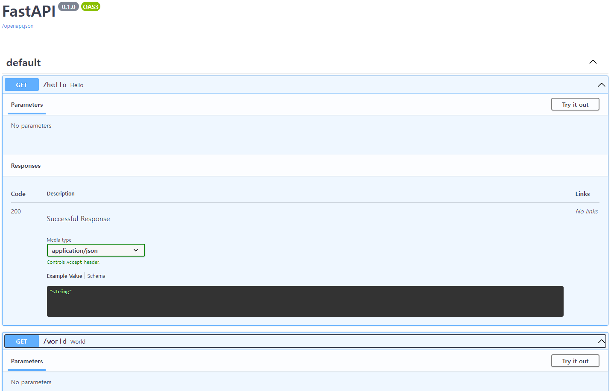

  - `/redoc`

  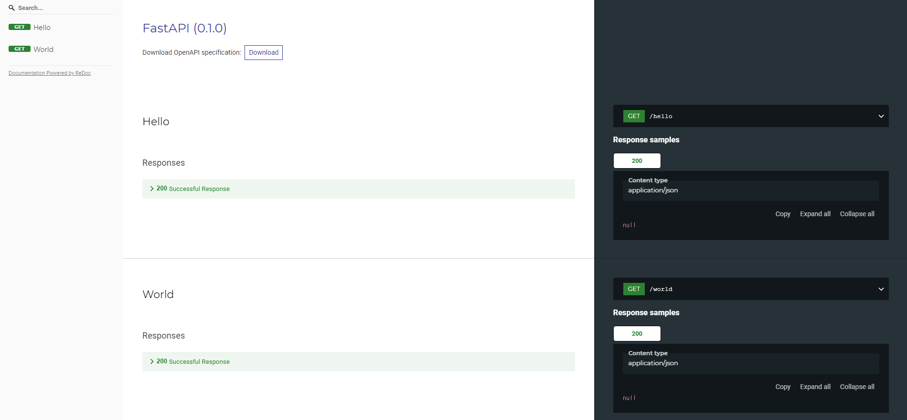


- fastapi에서 문서를 생성하는 과정

  - fastapi가 OAS를 기반으로 json 형식의 스키마를 생성한다.

  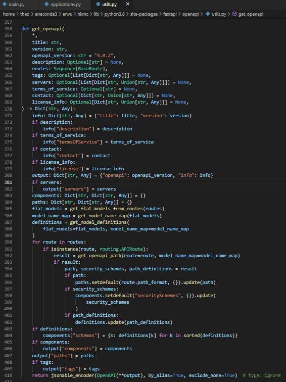

  - `/docs`로 요청이 들어오면 fastapi는 Swagger UI(javascript, css, html의 묶음)를 반환한다.

  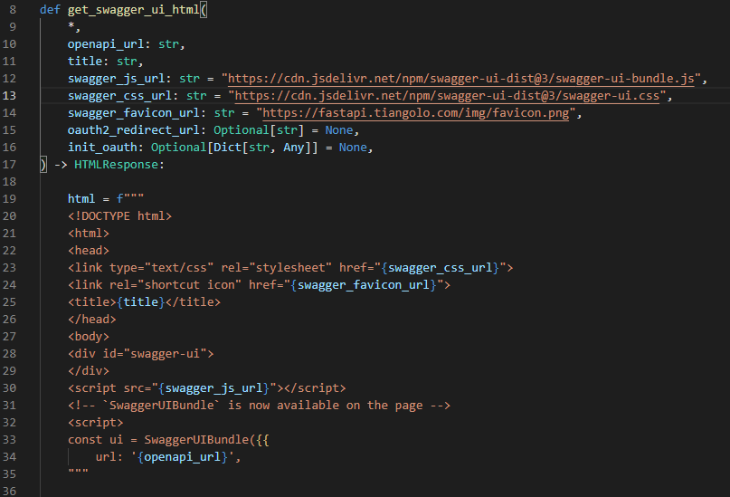

  - Swagger UI가 렌더링을 시작하고 javascript가 실행되면서 fastapi가 작성한 json 파일을 요청한다.
    - 별도로 설정해주지 않을 경우 endpoint는 `/openapi.json`이다.
    - 아래 예시의 경우 설정을 변경해서 `/myopenapi`로 요청을 보낸다.

  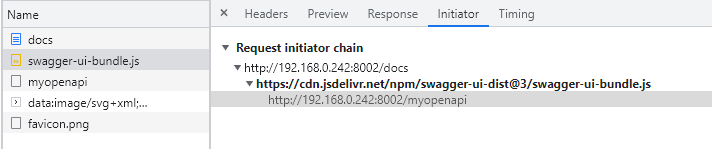

  - 응답으로 받아온 json파일을 파싱하여 화면에 뿌려준다.

  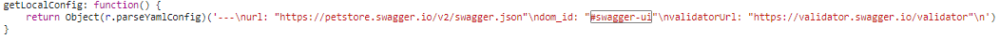


- FastAPI가 어떻게 OpenAPI 문서를 보여줄 수 있는가

  - FastAPI는 Pydantic과 완벽하게 호환된다.
    - FastAPI에서 reqeust나 response model을 선언할 때 pydantic을 활용하여 선언한다.
  - Pydantic에는 JSON Schema를 자동으로 생성하는 기능이 있다.
    - Pydantic을 통해 생성된 model은 자동으로 JSON Schema로도 생성된다.

  ```python
  from pydantic import BaseModel
  
  
  class FooBar(BaseModel):
      count: int
      size: float = None
  
  # Pydantic으로 생성한 FooBar 모델을 JSON Schema로 변환.
  print(FooBar.schema_json(indent=2))
  '''
  JSON Schema
  {
    "title": "FooBar",
    "type": "object",
    "properties": {
      "count": {
        "title": "Count",
        "type": "integer"
      },
      "size": {
        "title": "Size",
        "type": "number"
      }
    },
    "required": [
      "count"
    ]
  }
  '''
  ```

  - JSON Schema

    > http://json-schema.org/

    - JSON data의 유효성 검증을 위해서 JSON data의 형식을 기술한 문서.

  - OpenAPI는 JSON schema를 기반으로 한다.

    > https://swagger.io/docs/specification/data-models/keywords/

    - 단, 완벽하게 일치하는 것은 아니고, 일부를 수정한 OpenAPI만의 JSON schema를 사용한다.
    - 또한 Restful API를 목적으로 만들어진 OAS와 달리 JSON schema는 API만을 위해 만들어진 것이 아니므로, path section(endpoint와 http method  등을 정의한 부분)과 같이 API만을 위한 section이 존재하지 않아 OpenAPI는 이런 section을 직접 정의해서 사용한다.

  - OpenAPI는 크게 세 부분으로 나눌 수 있다.

    - JSON schema와 동일한 부분
    - JSON schema를 수정한 부분
    - JSON schema에 아예 존재하지 않는 부분

  - 결론

    - FastAPI에서 Pydantic을 활용하여 작성한 모델들은 Pydantic에 의해 JSON schema로 변환된다. 
    - OpenAPI는 JSON schema를 기반 만들어졌으므로, 별도의 작업 없이도 Swagger UI를 통해 문서를 볼 수 있다.


## 상세

- FastAPI에서 반환하는 OpenAPI Schema는 크게 네 부분으로 나눌 수 있다.

  - 메타데이터(`openapi`와 `info`  부분)
    - OpenAPI 버전과 문서의 제목, 설명, 버전, 라이센스 정보 등이 들어 있다.
    - FastAPI 인스턴스(App)을 생성할 때 설정한 내용들이 이곳에 들어가게 된다.
  - `path`
    - 각 endpoint에 대한 정보가 들어 있다.
    - FastAPI 인스턴스(App)를 통해 추가한 내용들이 이곳에 들어간다.
  - `components.schemas`
    - Request, Response, Error 등의 model과 관련된 내용들이 들어 있다.
    - Pydantic을 통해 선언한 내용들이 이곳에 들어간다.
  - `tags`
    - FastAPI 인스턴스(App)를 통해 설정이 가능하다.

  ```json
  {
      "openapi": "3.0.2",
      "info": {
          "title": "My OpenAPI Doc",
          "description": "My First OpenAPI Doc",
          "version": "0.0.1"
      },
      "paths": {},
      "components": {
          "schemas": {}
      },
      "tags": []
  }
  ```


### Metadata

- fastapi app 인스턴스를 생성할 때, OpenAPI metadata를 변경할 수 있다.

  - 아래와 같이 인스턴스를 생성할 때 아무 값도 넣지 않으면 전부 기본값으로 설정된다.

  ```python
  from fastapi import FastAPI
  import uvicorn
  
  
  app = FastAPI()
  
  if __name__ == '__main__':
      uvicorn.run(app, host='0.0.0.0', port=8000)
  ```

  - 결과

  ```json
  // /openapi.json
  {"openapi":"3.0.2","info":{"title":"FastAPI","version":"0.1.0"},"paths":{}}
  ```

  - `docs`

  


- metadata 변경하기

  - 아래와 같이 FastAPI 인스턴스 생성시에 변경하고자 하는 metadata들을 설정해준다.
    - 아래에서 설정해준 값 외에도 `license_info`, `contact` 등을 추가 가능하다.
  
  
  ```python
  from fastapi import FastAPI
  import uvicorn
  
  
  app = FastAPI(
      title="My OpenAPI Doc",
      version="0.0.1",
      openapi_url="/myopenapi",
      description="My First OpenAPI Doc")
  
  if __name__ == '__main__':
      uvicorn.run(app, host='0.0.0.0', port=8000)
  ```

  - 결과
  
  ```json
  // /myopenapi
  {"openapi":"3.0.2","info":{"title":"My OpenAPI Doc","description":"My First OpenAPI Doc","version":"0.0.1"},"paths":{}}
  ```

  - `/docs`
  
  


### Tags

- 아무 태그도 주지 않은 경우

  - 코드

  ```python
  from fastapi import FastAPI
  import uvicorn
  
  
  app = FastAPI(
      title="My OpenAPI Doc",
      version="0.0.1",
      openapi_url="/myopenapi",
      description="My First OpenAPI Doc")
  
  @app.get("/user/find-by-id")
  def find_user_by_id():
      return "some_user"
  
  @app.get("/user/find-by-nickname")
  def find_user_by_nickname():
      return "some_user"
  
  @app.get("/pet/find-by-id")
  def find_pet_by_id():
      return "some_pet"
  
  if __name__ == '__main__':
      uvicorn.run(app, host='0.0.0.0', port=8002)
  ```

  - 결과
    - 아무 태그도 존재하지 않는다.
  
  
  ```json
  // /myopenapi
  {
    "openapi": "3.0.2",
    "info": {
      "title": "My OpenAPI Doc",
      "description": "My First OpenAPI Doc",
      "version": "0.0.1"
    },
    "paths": {
      "/user/find-by-id": {
        "get": {
          "summary": "Find User By Id",
          "operationId": "find_user_by_id_user_find_by_id_get",
          "responses": {
            "200": {
              "description": "Successful Response",
              "content": {
                "application/json": {
                  "schema": {}
                }
              }
            }
          }
        }
      },
      "/user/find-by-nickname": {
        "get": {
          "summary": "Find User By Nickname",
          "operationId": "find_user_by_nickname_user_find_by_nickname_get",
          "responses": {
            "200": {
              "description": "Successful Response",
              "content": {
                "application/json": {
                  "schema": {}
                }
              }
            }
          }
        }
      },
      "/pet/find-by-id": {
        "get": {
          "summary": "Find Pet By Id",
          "operationId": "find_pet_by_id_pet_find_by_id_get",
          "responses": {
            "200": {
              "description": "Successful Response",
              "content": {
                "application/json": {
                  "schema": {}
                }
              }
            }
          }
        }
      }
    }
  }
  ```
  
  - `/docs`
    - 태그를 따로 설정해주지 않았으므로 default로 설정된다.
  
  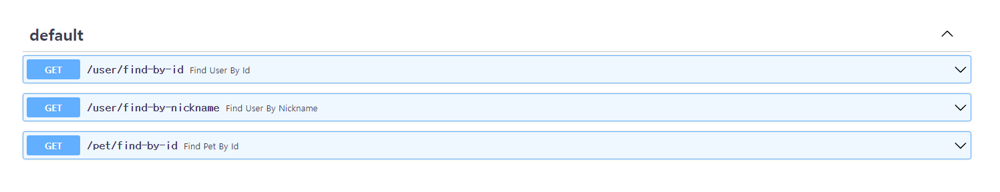


- 태그 추가하기

  - 태그 양식
    - 태그에는 아래와 같은 것들을 추가 가능하다.
    - `title`, `description`, `externalDocs`
  - 태그 추가하기
    - 태그를 선언하고, 선언한 태그를 FastAPI 인스턴스 생성시에 `openapi_tags` 값으로 넣어준다.
    - 이후 각 API마다 tag를 추가해준다.

  ```bash
  from fastapi.openapi.models import ExternalDocumentation
  from fastapi import FastAPI
  import uvicorn
  
  
  # 설정할 tag들을 List[dict] 형태로 선언한다.
  # externalDocs의 경우 ExternalDocumentation의 인스턴스를 입력한다.
  user_tag_external_docs = ExternalDocumentation(
                          description="external documentation", 
                          url="http://localhost:8002/docs#/User")
  tags = [
      {
          "name":"user",
          "description":"Find user by some info",
          "externalDocs":user_tag_external_docs
      },
      {
          "name":"pet",
          "description":"Find pet by some info"
      }
  ]
  
  app = FastAPI(
      title="My OpenAPI Doc",
      version="0.0.1",
      openapi_url="/myopenapi",
      description="My First OpenAPI Doc",
      openapi_tags=tags)
  
  @app.get("/user/find-by-id", tags=["user"])	# 태그 추가
  def find_user_by_id():
      return "some_user"
  
  @app.get("/user/find-by-nickname", tags=["user"])
  def find_user_by_nickname():
      return "some_user"
  
  @app.get("/pet/find-by-id", tags=["pet"])
  def find_pet_by_id():
      return "some_pet"
  
  if __name__ == '__main__':
      uvicorn.run(app, host='0.0.0.0', port=8002)
  ```

  - 결과
    - `tags`가 추가된 것을 확인 가능하다.

  ```json
  // /myopenapi
  {
    "openapi": "3.0.2",
    "info": {
      "title": "My OpenAPI Doc",
      "description": "My First OpenAPI Doc",
      "version": "0.0.1"
    },
    // (...)
    "tags": [
      {
        "name": "user",
        "description": "Find user by some info",
        "externalDocs": {
          "description": "external documentation",
          "url": "http://localhost:8002/docs#/User"
        }
      },
      {
        "name": "pet",
        "description": "Find pet by some info"
      }
    ]
  }
  ```
  
  - `/docs`
  
  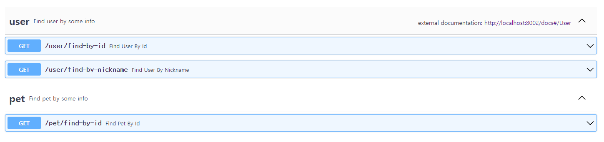


### Request

- pydantic으로 model 작성하기

  - 상기했듯 Pydantic으로 Model을 작성하면 Open API Schema의 `components.schemas.<model명>` section에 model에 관한 정보가 추가된다.


  ```python
  from typing import Optional
  from pydantic import BaseModel
  
  
  class User(BaseModel):
      id: int
      name: str
  ```


  - API에 적용하기
    - Pydantic을 사용하여 선언한 모델을 API에 적용하면 `paths.<endpoint>.<http method>.requestBody.content.<content type>.schema` section에 추가된다.


  ```python
  from fastapi import FastAPI
  from models.request import User
  from models.response import Pet
  import uvicorn
  
  
  tags = [
      {
          "name":"pet",
          "description":"Find pet by some info"
      }
  ]
  
  app = FastAPI(
      title="My OpenAPI Doc",
      version="0.0.1",
      openapi_url="/myopenapi",
      description="My First OpenAPI Doc",
      openapi_tags=tags)
  
  @app.post("/find-pet-by-user", tags=["pet"])
  def find_pet_by_user(request:User):	# request Model을 지정
      response = {
          "id": 1,
          "name": "spring",
          "breed": "bichon",
          "owner": request,
          "age": 2
      }
      return response
  
  if __name__ == '__main__':
      uvicorn.run(app, host='0.0.0.0', port=8002)
  ```


  - 결과
    - `components.schemas.User`가 추가되었다.


  ```json
  {
      // (...)
      "paths": {
          "/find-pet-by-user": {
              "post": {
                  "tags": [
                      "pet"
                  ],
                  "summary": "Find Pet By User",
                  "operationId": "find_pet_by_user_find_pet_by_user_post",
                  "requestBody": {
                      "content": {
                          "application/json": {
                              "schema": {
                                  "$ref": "#/components/schemas/User"	// api에 추가한 대로 request body 추가
                              }
                          }
                      },
                      "required": true
                  },
                  //(...)
              }
          }
      },
      "components": {
          "schemas": {
              // (...)
              // Pydantic을 통해 선언한 User 추가
              "User": {
                  "title": "User",
                  "required": [
                      "id",
                      "name"
                  ],
                  "type": "object",
                  "properties": {
                      "id": {
                          "title": "Id",
                          "type": "integer"
                      },
                      "name": {
                          "title": "Name",
                          "type": "string"
                      }
                  }
              },
              // (...)
  ```


  - `/docs`
    - request body가 추가되었다.

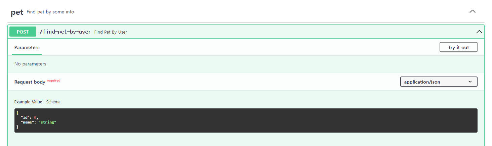

  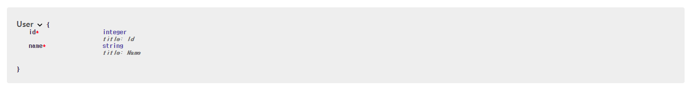


- Body의 각 필드별 descrption 추가

  - Pydantic을 통해 model을 선언하면 기본적으로 각 필드마다 `title`과 `type`이 OpenAPI Schema에 포함되는데, description도 추가 가능하다.
  - 방법1. `Field`를 사용하는 방법

  ```json
  from pydantic import BaseModel, Field
  
  
  class User(BaseModel):
      id: int = Field(..., description="User ID")
      name: str = Field(..., description="User Name")
  ```

  - 방법2. `schema_extra`를 사용하는 방법
    - Reuqest의 inner class로 `Config`를 선언한다.
    - `schema_extra`라는 이름으로 딕셔너리를 선언한다.
    - `schema_extra` attirbute는 JSON 스키마를 확장하거나 변경할 때 사용된다.
    - 아래 코드는 `components.schemas.User.properties`를 수정하는 것이다.

  ```python
  from pydantic import BaseModel
  
  
  class User(BaseModel):
      id: int
      name: str
  
      class Config:
          schema_extra = {
              "properties": {
                  "id": {
                      "title": "Id",
                      "type": "integer",
                      "description": "User ID"
                  },
                  "name": {
                      "title": "Name",
                      "type": "string",
                      "description": "User Name"
                  }
              }
          }
  ```

  - 두 방식의 결과는 동일하다.
    - 두 방식의 차이는 다음과 같다.
    - `Field`를 활용한 방법은 `components.schemas.User.properties.<필드명>`에 직접 접근하여 description을 추가하는 것이고
    - `schema_extra`를 활용한 방법은 `components.schemas.User.properties` 전체를 재정의하는 방식으로 descripntion을 추가하는 것이다.

  ```json
  {
      // (...)
      "components": {
          "schemas": {
              // (...)
              "User": {
                  "title": "User",
                  "required": [
                      "id",
                      "name"
                  ],
                  "type": "object",
                  "properties": {
                      "id": {
                          "title": "Id",
                          "type": "integer",
                          "description": "User ID"	// description 추가
                      },
                      "name": {
                          "title": "Name",
                          "type": "string",
                          "description": "User Name"
                      }
                  }
              }
          }
      }
  }
  ```

  - `docs`

  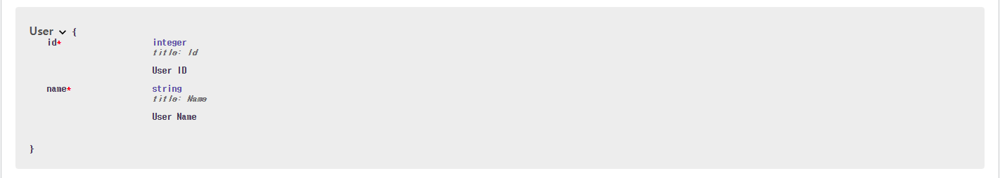


- Request body 예시 추가하기

  - 방법1. `Field`를 사용.
  
  ```python
  from pydantic import BaseModel, Field
  
  
  class User(BaseModel):
      id: int = Field(..., example=11)
      name: str = Field(..., example="John")
  ```
  
  - 방법2-1. `schema_extra`를 사용.
  
  ```python
  from pydantic import BaseModel
  
  
  class User(BaseModel):
      id: int
      name: str
  
      class Config:
          schema_extra = {
              "properties": {
                  "id": {
                      "title": "Id",
                      "type": "integer",
                      "example": 11
                  },
                  "name": {
                      "title": "Name",
                      "type": "string",
                      "example": "John"
                  }
              }
          }
  ```
  
  - 결과
    - 두 방법 모두 결과는 동일하며 추가 방식에 차이가 있을 뿐이다.
    - `components.schema.User.properties.<field명>.example`에 추가된다.
  
  
  ```json
  {
      // (...)
      "components": {
          "schemas": {
              // (...)
              "User": {
                  "title": "User",
                  "required": [
                      "id",
                      "name"
                  ],
                  "type": "object",
                  "properties": {
                      "id": {
                          "title": "Id",
                          "type": "integer",
                          "example": 11
                      },
                      "name": {
                          "title": "Name",
                          "type": "string",
                          "example": "John"
                      }
                  }
              },
  // (...)
  ```
  
  - 방법2-2.`schema_extra`를 활용
    - 방법 2-1과 달리 `components.schema.User.properties.<field명>.example`가 아닌 `components.schema.User.example`에 추가한다.
  
  ```python
  from pydantic import BaseModel
  
  
  class User(BaseModel):
      id: int
      name: str
  
      class Config:
          schema_extra = {
              "example":{
                  "id":11,
                  "name":"John"
              }
          }
  ```
  
  - 결과
  
  ```json
  {
      // (...)
      "components": {
          "schemas": {
              // (...)
              "User": {
                  "title": "User",
                  "required": [
                      "id",
                      "name"
                  ],
                  "type": "object",
                  "properties": {
                      "id": {
                          "title": "Id",
                          "type": "integer"
                      },
                      "name": {
                          "title": "Name",
                          "type": "string"
                      }
                  },
                  // properties와 같은 깊이에 추가된다.
                  "example": {
                      "id": 11,
                      "name": "John"
                  }
              },
  // (...)
  ```
  
  - 방법3. ` fastapi`의 `Body`를 활용
    - Pydantic의 `Field`,  `extra_schema`을 활용한 방법들은 모두 example이 `components` section에 들어갔지만, fastapi의 `Body`를 활용할 경우 `paths` section에 들어가게 된다.
  
  
  ```python
  from fastapi import FastAPI, Body
  from models.request import User
  import uvicorn
  
  
  app = FastAPI(
      title="My OpenAPI Doc",
      version="0.0.1",
      openapi_url="/myopenapi",
      description="My First OpenAPI Doc")
  
  # 예시를 생성
  example = Body(
      ...,
      example={
          "id": 11,
          "name": "John"
      }
  )
  
  @app.post("/find-pet-by-user")
  def find_pet_by_user(request:User = example):	# 예시를 추가
      response = {
          "id": 1,
          "name": "spring",
          "breed": "bichon",
          "owner": request,
          "age": 2
      }
      return response
  
  if __name__ == '__main__':
      uvicorn.run(app, host='0.0.0.0', port=8002)
  ```
  
  - 결과
    - 이 경우 위의 두 방식(`schema_extra`, `Field`를 사용해서 추가)과 example이 들어가는 위치가 완전히 다르다.
    - `components.schema`가 아닌 `paths/<endpoint>/<http method>/requestBody/content/<content type>/example`에 추가된다.
    - 문서에서 보여주는 방식은 다른 방식과 차이가 없다.
  
  ```json
  {
      // (...)
      "paths": {
          "/find-pet-by-user": {
              "post": {
                  "tags": [
                      "pet"
                  ],
                  "summary": "Find Pet By User",
                  "operationId": "find_pet_by_user_find_pet_by_user_post",
                  "requestBody": {
                      "content": {
                          "application/json": {
                              "schema": {
                                  "$ref": "#/components/schemas/User"
                              },
                              "example": {
                                  "id": 11,
                                  "name": "John"
                              }
                          }
                      },
                      "required": true
                  },
                  // (...)
          }
      ]
  }
  ```
  
  - `/docs`
    - 네 가지 방식 모두 문서를 통해 보여지는 방식에는 차이가 없다.
  
  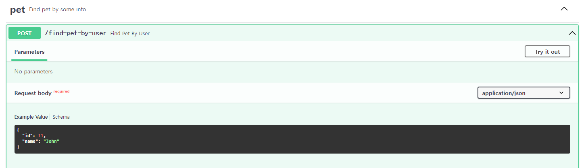


- Request body에 복수의 예시 추가하기

  - 딕셔너리 형태로 복수의 예시를 추가할 수 있다.
    - key에는 각 예시를 구분할 수 있는 값이 들어간다.
    - value에는 `summary`, `description`, `value`, `externalValue`를 key로 가지는 딕셔너리가 들어간다.
    - `description`에는 markdown 형식으로 작성이 가능하다.
    - `externalValue`는 `value`에 담기 힘들 정도로 긴 예시나, 보다 쉬운 설명을 위해 json, 혹은 image등을 가리키는 url을 값으로 받는다.
    - 그러나 `externalValue`의 경우 Swagger UI에서 지원하지 않아 사용이 불가능하다.
  - `Body()`뿐 아니라 아래와 같은 것들에 모두 example을 선언할 수 있다.
    - `Path()`, `Query()`, `Header()`, `Cookie()`, `Form()`, `File()`

  - 예시

  ```python
  from fastapi import FastAPI, Body
  from models.request import User
  import uvicorn
  
  
  app = FastAPI(
      title="My OpenAPI Doc",
      version="0.0.1",
      openapi_url="/myopenapi",
      description="My First OpenAPI Doc")
  
  
  examples = Body(
      ...,
      examples={
          "good":{
              "summary":"A normal example",
              "description": "A **normal** user works correctly",
              "value":{
                  "id":11,
                  "name":"John"
              }
          },
          "bad":{
              "summary":"A abnormal example",
              "description":"""This example will return 422 Unprocessable Entity. 
                              Because the id is not a valid integer""",
              "value":{
                  "id":"wrong_value",
                  "name":"John"
              }
          }
      }
  )
  
  @app.post("/find-pet-by-user")
  def find_pet_by_user(request:User = examples):
      response = {
          "id": 1,
          "name": "spring",
          "breed": "bichon",
          "owner": request,
          "age": 2
      }
      return response
  
  if __name__ == '__main__':
      uvicorn.run(app, host='0.0.0.0', port=8002)
  ```
  
  - 결과
      - `paths/<endpoint>/<http method>/requestBody/content/<content type>/examples`에 추가된다.
  
  
  ```json
  {
      "openapi": "3.0.2",
      "info": {
          "title": "My OpenAPI Doc",
          "description": "My First OpenAPI Doc",
          "version": "0.0.1"
      },
      "paths": {
          "/find-pet-by-user": {
              "post": {
                  "tags": [
                      "pet"
                  ],
                  "summary": "Find Pet By User",
                  "operationId": "find_pet_by_user_find_pet_by_user_post",
                  "requestBody": {
                      "content": {
                          "application/json": {
                              "schema": {
                                  "$ref": "#/components/schemas/User"
                              },
                              "examples": {
                                  "good": {
                                      "summary": "A normal example",
                                      "description": "A **normal** user works correctly",
                                      "value": {
                                          "id": 11,
                                          "name": "John"
                                      }
                                  },
                                  "bad": {
                                      "summary": "A abnormal example",
                                      "description": "This example will return 422 Unprocessable Entity. \n                            											Because the id is not a valid integer",
                                      "value": {
                                          "id": "wrong_value",
                                          "name": "John"
                                      }
                                  }
                              }
                              // (...)
  ```
  
  - `/docs`
  
  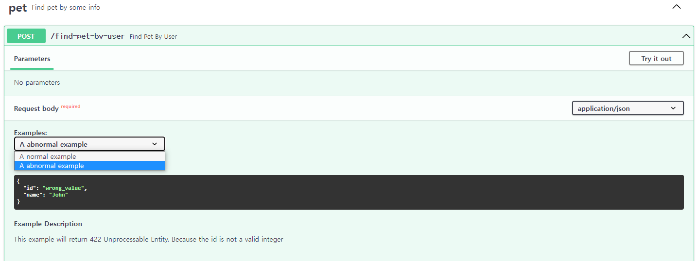


- example이 추가되는 과정
  - `schema_extra`나 `Field`에 예시를 추가하는 경우
    - example을 작성하면 Pydantic이 자동으로 생성하는 JSON Schema에 example이 포함된다.
    - 원래 JSON Schema에는 example이라는 필드가 존재하지 않는다(최신 버전에는 examples라는 필드가 추가되었다).
    - 그러나 OpenAPI는 JSON Schema를 그대로 사용하는 것이 아니라 수정해서 사용하므로 JSON Schema에 없는 필드(이 경우 example)라 하더라도 사용이 가능하다.
    - 즉 example이라는 필드는 JSON Schema의 필드는 아니지만, OpenAPI가 자체적으로 정의한 JSON Schema의 일부이므로 docs에서 보여줄 수 있게 된다.
  - `Body()`(혹은 `Query()`, `Path()`등)를 활용해서 예시를 추가하는 경우
    - 이들은 모두 API를 위해 필요한 것들이므로 JSON Schema에 포함되지 않는다. 
    - OpenAPI의 path section에 직접 추가된다(즉 JSON Schema에 원래 존재하지 않았던 부분에 직접 추가 된다).
    - `Path()`, `Query()`, `Header()`, `Cookie()`의 경우 `example` 혹은 `examples`는 OpenAPI의 [Parameter Object](https://github.com/OAI/OpenAPI-Specification/blob/main/versions/3.0.3.md#parameter-object)에 추가된다.
    - `Body()`, `File()`, `Form()`의 경우 `example` 혹은 `examples`는 OpenAPI의 Request Body 오브젝트의 content 필드 내부의 [Media Type Object](https://github.com/OAI/OpenAPI-Specification/blob/main/versions/3.0.3.md#mediaTypeObject)에 추가된다.
  - OpenAPI:3.1.0부터는 최신 버전의 JSON Schema(examples가 추가된 버전)를 기반으로 하므로 JSON Schema와 OpenAPI가 직접 정의한 JSON Schema 사이의 차이가 거의 사라졌다.
    - 그럼에도 Swagger UI는 아직 OpenAPI:3.1.0을 지원하지 않으므로 위와 같이 사용해야 한다.


### Response

- Response 역시 설정만 해놓으면 자동으로 OpenAPI에 추가된다.

  - pydantic으로 model 작성하기

  ```python
  from typing import Optional
  from pydantic import BaseModel
  
  
  class Pet(BaseModel):
      id: int
      name: str
      breed: str
      age: Optional[int]
  ```

  - API에 적용하기

  ```python
  from fastapi import FastAPI
  from models.response import Pet
  import uvicorn
  
  
  tags = [
      {
          "name":"pet",
          "description":"Find pet by some info"
      }
  ]
  
  app = FastAPI(
      title="My OpenAPI Doc",
      version="0.0.1",
      openapi_url="/myopenapi",
      description="My First OpenAPI Doc",
      openapi_tags=tags)
  
  
  @app.post("/find-pet-by-user", tags=["pet"], response_model=Pet)	# response_model에 적용
  def find_pet_by_user():
      response = {
          "id": 1,
          "name": "spring",
          "breed": "bichon",
          "age": 2
      }
      return response
  
  if __name__ == '__main__':
      uvicorn.run(app, host='0.0.0.0', port=8002)
  ```

  - 결과

  ```json
  {
      "openapi": "3.0.2",
      "info": {
          "title": "My OpenAPI Doc",
          "description": "My First OpenAPI Doc",
          "version": "0.0.1"
      },
      "paths": {
          "/find-pet-by-user": {
              "post": {
                  "tags": [
                      "pet"
                  ],
                  "summary": "Find Pet By User",
                  "operationId": "find_pet_by_user_find_pet_by_user_post",
                  "responses": {
                      "200": {
                          "description": "Successful Response",
                          "content": {
                              "application/json": {
                                  "schema": {
                                      "$ref": "#/components/schemas/Pet"		// response에 추가
                                  }
                              }
                          }
                      }
                  }
              }
          }
      },
      "components": {
          "schemas": {
              // shcemas에 추가
              "Pet": {
                  "title": "Pet",
                  "required": [
                      "id",
                      "name",
                      "breed",
                      "owner"
                  ],
                  "type": "object",
                  "properties": {
                      "id": {
                          "title": "Id",
                          "type": "integer"
                      },
                      "name": {
                          "title": "Name",
                          "type": "string"
                      },
                      "breed": {
                          "title": "Breed",
                          "type": "string"
                      },
                      "age": {
                          "title": "Age",
                          "type": "integer"
                      }
                  }
              }
          }
      },
      // (...)
  }
  ```

  - `/docs`

  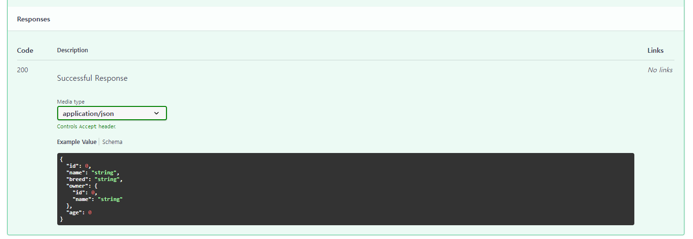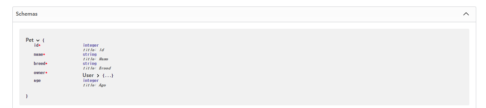


- Response에 추가 정보 설정하기

  - Description과 Links를 추가할 수 있다.
  - Links는 한 요청의 응답이 다른 요청의 파라미터로 들어간다는 것을 표현하기 위해 사용한다.

  > https://swagger.io/docs/specification/links/

  ```python
  from fastapi import FastAPI
  from models.response import Pet
  import uvicorn
  
  # 설정할 response를 선언한다.
  responses = {
      200: {
          "description": "Successfully find user", 
          "links":{
              "UserRepositories":{
                  "operationRef":"getUserInfo",
                  "parameters":{
                      "pet_id": '$response.body#/id'
                  }
              }
          }
      }
  }
  
  app = FastAPI(
      title="My OpenAPI Doc",
      version="0.0.1",
      openapi_url="/myopenapi",
      description="My First OpenAPI Doc")
  
  
  
  @app.post("/find-pet-by-user", tags=["pet"], response_model=Pet, responses=responses)	# responses를 넘긴다.
  def find_pet_by_user():
      response = {
          "id": 1,
          "name": "spring",
          "breed": "bichon",
          "age": 2
      }
      return response
  
  if __name__ == '__main__':
      uvicorn.run(app, host='0.0.0.0', port=8002)
  ```

  - 결과
    - responses에 description과 links가 추가되었다.

  ```json
  {
      // (...)
      "paths": {
          "/find-pet-by-user": {
              "post": {
                  "tags": [
                      "pet"
                  ],
                  "summary": "Find Pet By User",
                  "operationId": "find_pet_by_user_find_pet_by_user_post",
                  "responses": {
                      "200": {
                          "description": "Successfully find user",
                          "content": {
                              "application/json": {
                                  "schema": {
                                      "$ref": "#/components/schemas/Pet"
                                  }
                              }
                          },
                          "links": {
                              "UserRepositories": {
                                  "operationRef": "getUserInfo",
                                  "parameters": {
                                      "pet_id": "$response.body#/id"
                                  }
                              }
                          }
                      }
                  }
              // (...)
  ```

  - `/docs`

  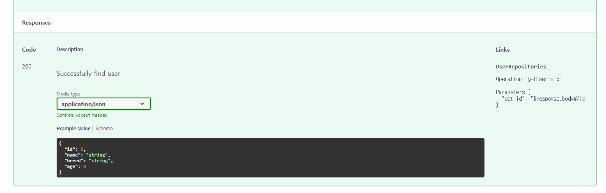


- Response의 각 필드별 설명 추가하기
  - Request에서 추가한 것과 같은 방식으로 추가하면 된다.


### API Description

- API에 docstring을 작성하면 docstring 내부의 내용이 API 설명란에 들어가게 된다.

```python
from fastapi import FastAPI
import uvicorn


app = FastAPI()

@app.post("/foo")
def foo():
    """
    This is foo api, return bar
    """
    return "bar"

if __name__ == '__main__':
    uvicorn.run(app, host='0.0.0.0', port=8002)
```

- `/docs`

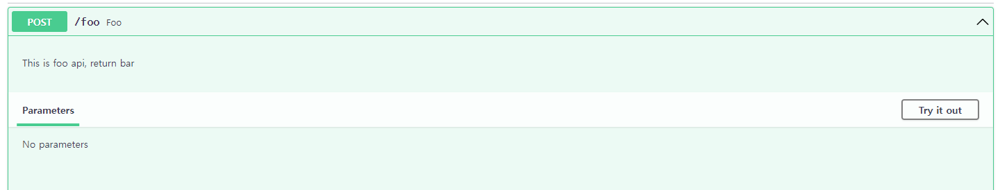


## Extending OpenAPI

> https://fastapi.tiangolo.com/advanced/extending-openapi/ 참고


# 참고

- [pydantic-Model Config](https://pydantic-docs.helpmanual.io/usage/model_config/)
- [Swagger-Grouping Operations With Tags](https://swagger.io/docs/specification/2-0/grouping-operations-with-tags/?sbsearch=tags)
- [fastapi-github](https://github.com/tiangolo/fastapi)
- https://swagger.io/blog/api-strategy/difference-between-swagger-and-openapi/
- https://fastapi.tiangolo.com/tutorial/schema-extra-example/
