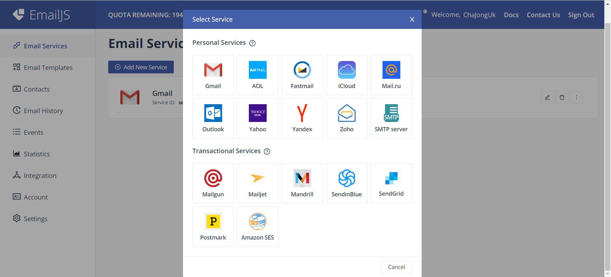
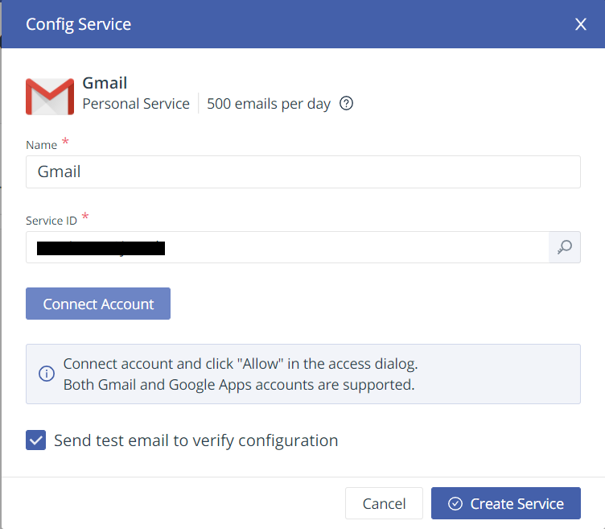
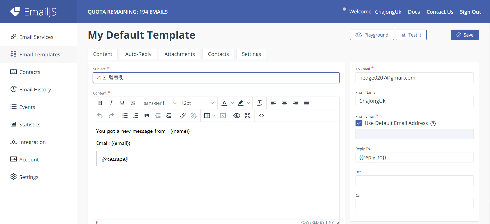

# EmailJs를 활용하여 메일 보내기

## 설정

> https://www.emailjs.com

- 위 사이트 회원 가입 하기


- 가입 완료 하면 아래와 같은 dashboard가 뜨는데  `Email Services`- `Add New Service` 클릭 후 원하는 메일 선택




- 다음과 같은 창이 뜨면 `Connect Service` 버튼 클릭 후 인증 과정을 마무리하고 `Create Service` 버튼을 클릭한다.




- 이후 dashborad에서 `Email Template` 클릭 후 아래와 같이 받을 email과 내용 등을 작성한다.
  - 여기서 변수로 받을 내용 들은 아래와 같이 `{{}}`로 묶어 줘야 한다.
  - `Auto-Reply` 탭에 가보면 자동으로 답장을 전달하는 것도 가능하다.




## 개발

> https://www.emailjs.com/docs/ 참고

- 아래 사이트를 참고해서 다음과 같이 기본적인 양식을 만들어준다.

  > https://www.emailjs.com/docs/tutorial/creating-contact-form/

  - 각 변수에 필요한 정보들은 다음 사이트들에서 가져오면 된다.
    - `YOUR_USER_ID`: https://dashboard.emailjs.com/admin/integration
    - `contact_form`: https://dashboard.emailjs.com/admin/templates
    - `contact_service`: https://dashboard.emailjs.com/admin

```html
<!DOCTYPE html>
<html>
<head>
    <title>Contact Form</title>
    <!--아래와 같이 script를 작성해도 되고 npm으로 설치해도 된다.-->
    <script type="text/javascript" src="https://cdn.jsdelivr.net/npm/emailjs-com@2/dist/email.min.js"></script>
    <script type="text/javascript">
        (function() {
            // https://dashboard.emailjs.com/admin/integration
            emailjs.init('YOUR_USER_ID');  //YOUR_USER_ID에는 위 사이트에 나와 있는 값을 넣으면 된다.
        })();
    </script>
    <script type="text/javascript">
        window.onload = function() {
            document.getElementById('contact-form').addEventListener('submit', function(event) {
                event.preventDefault();
                // generate a five digit number for the contact_number variable
                this.contact_number.value = Math.random() * 100000 | 0;
                // these IDs from the previous steps
                //emailjs는 지정한 양식 대로 email을 보내는 sendForm() 메서드와
                //미리 준비한 텍스트를 보내는 send() 메서드를 지원한다.
                //'contact_service'와 'contact_form'에는 위 사이트에 나와 있는 값을 넣으면 된다.
                emailjs.sendForm('contact_service', 'contact_form', this)  //this에는 보낼 객체가 담겨있다.
                    .then(function() {
                        console.log('SUCCESS!');
                    }, function(error) {
                        console.log('FAILED...', error);
                    });
            });
        }
    </script>
</head>
<body>
    <form id="contact-form">
        <input type="hidden" name="contact_number">
        <label>Name</label>
        <input type="text" name="name">  <!--name="email 템플릿에서 작성한 변수명과 동일하게 맞춰야 한다."-->
        <label>Email</label>
        <input type="email" name="email"> <!--name="email 템플릿에서 작성한 변수명과 동일하게 맞춰야 한다."-->
        <label>Message</label>
        <textarea name="message"></textarea>  <!--name="email 템플릿에서 작성한 변수명과 동일하게 맞춰야 한다."-->
        <input type="submit" value="Send">
    </form>
</body>
</html>
```

