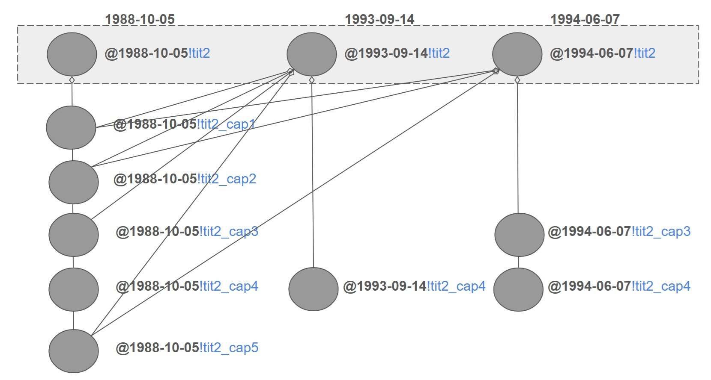
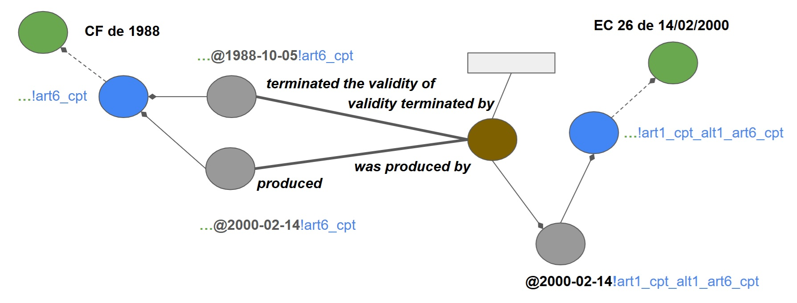
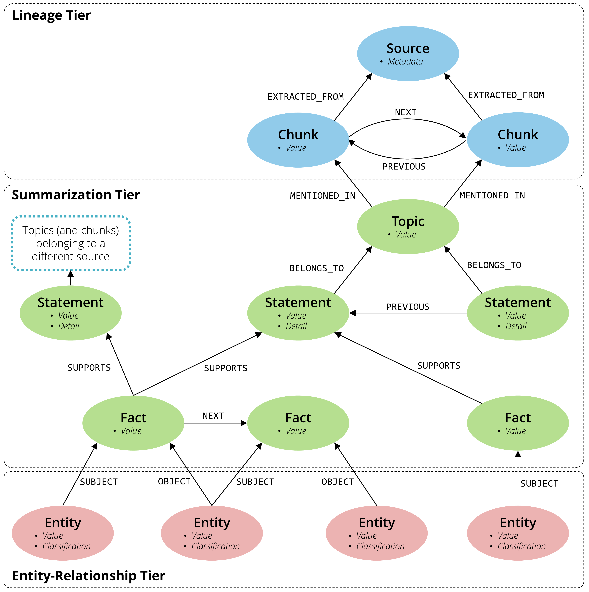

- 비구조화된 데이터로 knowledge graph를 만드는 과정
  
  > 예시 데이터는 Wikipedia의 Neo4j 문서이다.
  
  - 데이터 수집.
    - Knowledge graph에 포함시키고자 하는 데이터를 수집하는 단계이다.
    - 이 단계에서 데이터의 종류에 따라 데이터를 LLM이 처리할 수 있는 형태(일반적으로 text)로 변환하기도 한다.
  
  ```
  Neo4j is a graph database management system (GDBMS) developed by
  Neo4j Inc.
  The data elements Neo4j stores are nodes, edges connecting them
  and attributes of nodes and edges. Described by its developers
  as an ACID-compliant transactional database with native graph
  storage and processing...
  ```
  
  - 데이터 분할(chunking)
    - 데이터를 적절한 크기로 분할하는 단계이다.
    - 분할의 크기는 사용하는 LLM 혹은 데이터의 복잡도 따라 달라지며, 경우에 따라 분할하지 않기도 한다.
  
  ```
  Neo4j is a graph database management system (GDBMS) developed
  by Neo4j Inc.
  
  The data elements Neo4j stores are nodes, edges connecting them
  and attributes of nodes and edges.
  
  Described by its developers as an ACID-compliant transactional
  database with native graph storage and processing...
  ```
  
  - 데이터 임베딩
    - 데이터의 vector embedding을 생성하는 단계이다.
    - 비슷한 내용의 청크들을 모아서 LLM에게 전달해 중복된 노드 생성을 방지하기 위함이다.
    - 이 때 저장한 vector를 후에 vector RAG를 사용할 때 이용할 수도 있다.
    - 데이터의 수가 많지 않거나, vector RAG를 사용하지 않을 경우 건너뛸 수도 있다.
  
  ```
  [0.21972137987, 0.12345678901, 0.98765432109, ...]
  
  [0.34567890123, 0.23456789012, 0.87654321098, ...]
  
  [0.45678901234, 0.34567890123, 0.76543210987, ...]
  ```
  
  - Node와 relationship을 추출하기 위해 데이터를 LLM에 전달.
    - Text 데이터를 LLM에 전달하여 node와 relationship을 추출한다.
    - 이 때, LLM에게 적절한 prompt를 제공하는 것이 중요하다.
  
  ```json
  /* prmpt
  Your task is to identify the entities and relations requested
  with the user prompt from a given text. You must generate the
  output in a JSON format containing a list with JSON objects.
  Text:
  {text} 
  */
  
  // output
  [
      {
          "text": (
              "Neo4j is a graph database management system (GDBMS) developed by Neo4j Inc."
          ),
          "head": "Neo4j",
          "head_type": "GraphDatabase",
          "relation": "DEVELOPED_BY",
          "tail": "Neo4j Inc",
          "tail_type": "Company",
      },
      {
          "text": (
              "Neo4j is implemented in Java"
          ),
          "head": "Neo4j",
          "head_type": "Graph Database",
          "relation": "IMPLEMENTED_IN",
          "tail": "Java",
          "tail_type": "ProgrammingLanguage",
      },
      ...
  ]
  ```
  
  - LLM의 output으로 knowledge graph 생성.
  
  ```cypher
  MERGE (neo4jInc:Company {id: 'Neo4j Inc'})
  MERGE (neo4j:GraphDatabase {id: 'Neo4j'})
  MERGE (java:ProgrammingLanguage {id: 'Java'})
  MERGE (neo4j)-[:DEVELOPED_BY]->(neo4jInc)
  MERGE (neo4j)-[:IMPLEMENTED_IN]->(java)
  ```


## GraphRAG 논문

### An Ontology-Driven Graph RAG for Legal Norms: A Hierarchical, Temporal, and Deterministic Approach

> https://arxiv.org/html/2505.00039v4

- 개요
  - 법률 분야에서의 RAG는 아래와 같은 문제에 직면했다.
    - 일반적인 텍스트 검색으로는 법률의 계층적, 통시적, 인과적 구조를 파악하지 못 한다.
    - 법률은 구조화된 계층(조, 항, 호, 목)을 가지고 있고, 촘촘한 상호 참조 관계를 가지고 있으며, 무엇보다 개정·폐지·통합을 통해 지속적으로 변화하는 통시적 진화를 특징으로 한다.
    - 시간적 맥락을 고려하지 못 하는(temporally-naive) 시스템은 과거 특정 시점에 유효했던 법령의 버전을 검색할 수 없다.
    - 그 결과 신뢰할 수 없는 답변을 생성해낸다.
  - 이 연구에서의 지식 그래프는 아래와 같은 것들을 모델링한다.
    - 추상적인 법적 저작물(Work)과 그에 대응하는 버전닝되고 시간 정보가 부여된 표현물(Expression)을 다층적으로 표현하는 구조(시간적 버전 및 언어 버전).
    - 데이터 중복 없이 변경 사항을 계층적으로 전파하기 위한 효율적인 집계 모델.
    - 입법 사건을 질의 가능한 Action 노드로 재구성(reification)하여, 인과관계를 그래프 내의 1급 요소로 다룬다.
  - 기존 연구 리뷰
    - 지식 그래프(Knowledge Graph, KG) 연구에서는 시간적 차원에 대한 관심이 점점 커지고 있으며, 이에 대한 관심은 시간 지식 그래프(Temporal Knowledge Graph, TKG)로 이어지고 있다. 
    - 최근의 연구와 리뷰들은 KG에서의 시간 모델링과 이를 시간 추론 및 질의응답에 적용하는 방식을 다루며, 효과적인 표현 기법과 더불어 평가 방법 및 데이터셋의 한계에 주목한다.
    - 특히 시간 KG 모델링에 대한 리뷰들은, 효과적인 표현 기법들은 존재하지만 법률 텍스트에 전형적으로 나타나는 계층 구조와 상호 참조 구조를 출처 추적 및 시간적 버전을 위한 확실한 검색 메커니즘과 명시적으로 통합한 연구는 부족하다고 주장한다.
    - 기존의 연구들은 법령 표현이 단순히 텍스트에 국한되지 않음을 보여주는데, 법령은 계층 구조(조, 항, 호, 목), 상호 참조, 개정 이력, 조건부 버전 등을 포함하며, 이를 위해서는 명시적인 시간적·계층적 지원을 갖춘 지식 그래프(KG) 모델이 요구된다.
    - 그러나 법률 도메인에 적용된 대부분의 RAG 시스템은 문서를 평면적인 텍스트 조각으로 취급하며, 규범적 계층 구조를 명시적으로 통합하는 경우가 드물다.
    - 또한 시간적 지식 그래프(TKG)에 관한 기존 연구는 주로 표현 학습과 링크 예측에 초점을 맞추어 왔으며, 규범의 진화(조문/법령 버전)를 RAG 메커니즘과 결합하되, 대규모 처리와 출처 추적(provenance)을 함께 고려한 연구는 거의 없다.
    - 마지막으로 입법 시스템에서 일반적으로 요구되는 시간적·계층적 특성을 법률 검색 과제와 결합한 벤치마크 및 데이터셋이 부족하다.
  - 연구 주제
    - 본 연구는 위와 같은 한계을 해결하기 위해 Graph RAG for Legal Norms를 제안하는데, 이는 다음과 같은 방식으로 문제를 해결하는 아키텍처이다.
    - 법률 텍스트의 계층 구조와 버전 관리를 명시적으로 표현하는, LRMoo에서 영감을 받은 형식적 온톨로지에 그래프를 기반화한다.
    - "2018-05-01 기준으로 적용되던 조문은 무엇이었는가?"와 같은 질의에 대해, 감사 가능한 출처 추적을 제공하는 결정론적이며 시간을 고려한 검색을 가능하게 한다.
    - 구조를 인식한 집계를 통해 조문 수준의 국지적 분석과 말뭉치 수준의 전역적 분석을 모두 지원한다. 
    - 본 제안은 Graph RAG의 원칙과 시간적 KG 모델링, 규범 공학 표준을 결합한 것이다. 이를 통해 앞서 언급한 한계들을 직접적으로 해결하는 동시에, 시간적 검색 성능과 출처 정확도를 평가할 수 있는 평가 과제 세트를 구축하는 것을 목표로 한다.


- Multi-Layerd Model
  - Model의 기반
    - Akoma Ntoso는 법률 문서의 구조를 인코딩하기 위한 강력한 XML 스키마를 제공하지만, FRBR/LRM 모델의 개념적 계층(Work, Expression, Manifestation)은 주로 문서의 `<meta>` 블록 내에 메타데이터 식별자로 표현된다. 
    - 반면, 본 프레임워크는 이러한 개념들을 메타데이터 태그의 수준에 머무르게 하지 않고, 온톨로지 상의 일급(first-class) 엔티티로 격상시킨다. 
    - 이러한 Work/Expression 구분에 대한 직접적이고 구조적인 표현은, 메타데이터 해석에만 의존하는 대신 그래프 내부에 명시적이고 순회 가능한 버전 체인을 구축할 수 있게 하므로, 본 연구의 세밀한 시간적 모델링 접근법에 있어 핵심적인 요소이다.
    - 본 연구에서는 노드로 인스턴스화되는 네 가지 주요 엔티티 유형을 정의한다.
  - Norm(as a Work)
    - 법적 규범을 추상적인 지적 창작물로 표현한다(예: “1988년 브라질 연방헌법”). 
    - 이는 특정 워딩이나 개정 여부와 무관하게 규범의 정체성을 포착한다.
  - Component(as a Component Work)
    - 하나의 법률 내에 포함된 계층적 요소(e.g. 조, 항, 호, 목)를 독립적인 추상 개념으로 표현한다.
    - 각 구성 요소는 상위 Work의 식별 가능한 일부로서, 텍스트가 변화하더라도 개념적 정체성을 유지한다.
  - Temporal Version(TV/CTV)
    - 특정 시점에서의 규범 또는 구성 요소에 대한 언어 비의존적 ""시간적 스냅샷"을 나타낸다. 
    - 이는 의미적 내용과 논리적 구조를 포착하며, LRMoo의 F2 Expression 개념에 대응한다. 
    - Component Temporal Version (CTV)는 특정 Component에 대한 TV를 의미한다.
  - Language Version(LV/CLV)
    - 특정 Temporal Version이 특정 언어로 구현된 구체적인 텍스트 표현을 나타낸다(예: 1988-10-05 시점의 조문에 대한 포르투갈어 텍스트). 
    - Component Language Version (CLV)는 특정 CTV에 대한 LV를 의미하며, 각각은 단일 TV로부터 파생된 F2 Expression에 해당한다.
  - 이와 같은 multi-layer 구조는 아래와 같은 것들을 모델링하게 해준다.
    - 법적 규범을 구성하는 "what"(추상적인 Norm/Component), "when"(Temporal Version), 그리고 "how"(특정 텍스트를 갖는 Language Version)를 정밀하게 모델링할 수 있게 해준다. 
    - 이후에 제시되는 단일 언어(monolingual) 예시의 단순화를 위해, 본 논문에서는 Temporal Version과 이에 대응하는 Language Version를 Version 엔티티로 결합하여 사용할 것이다.


- Model

  - Structure-aware semantic segmentation

    - Text  chunking에서부터 시작하는 전통적인 RAG와 달리,  structure-aware semantic segmentation에서 시작한다.
    - 즉, 텍스트를 단순히 길이 기준이나 문단 기준으로 나누는 것이 아니라, 문서가 원래 가지고 있는 구조와 의미 단위를 인식하면서 분할한다.
    - 법률 텍스트를 규범에 내재된 고유한 계층적 요소(예: 조, 항, 호, 목)에 직접적으로 대응하는 세그먼트로 파싱하는 것이 목적이다.

    - 이 과정은 특화된 parser나 fine-tunining된 LLM을 사용하여 수행된다.

  - 첫 단계는 abstract structural entities 를 식별하고 추출하는 것이다.
    - 각 법률에 대해 단일 Norm 노드와 복수의  Component 노드를 추출하여 graph의 뼈대를 형성한다.
    - 아래 예시에서 대한민국헌법은 Norm이 되고, 나머지 절, 관, 조, 항 등은 Component가 된다.

  ```
  대한민국헌법
  유구한 역사와 전통에 빛나는 우리 대한국민은 3ㆍ1운동으로 건립된 대한민국임시정부의 법통과 불의에 항거한 4ㆍ19민주이념을 계승하고...
  
    제2절 행정부
  	제1관 국무총리와 국무위원
  	  제86조
  	    ①국무총리는 국회의 동의를 얻어 대통령이 임명한다.
  		②국무총리는 대통령을 보좌하며, 행정에 관하여 대통령의 명을 받아 행정각부를 통할한다.
  ```

  - 그 후 각 텍스트를 위에서 생성한 abstract structure와 연결한다.
    - 그러나 텍스트 조각을 시간성을 갖지 않는 Component(Work) 노드에 직접 연결하는 것은 개념적으로 부적절하다. 
    - 이러한 연결 방식은 개정이 이루어질 때마다 구성 요소의 워딩이 변화하고, 여러 언어로 표현될 수 있다는 법의 통시적(diachronic) 성격을 포착하지 못한다. 
    - 추상적인 Component는 영속적이지만, 그 텍스트적 구현은 그렇지 않다.
  - 본 연구에서 사용되는 모델은 이러한 문제를 versioning layer를 사용하여 해결한다.
    - Versioning layer를 사용하여 추상과 구상을 연결한다.
    - 각 Component와 각 텍스트가 제정되고 개정된 시점을 아래와 같이 인스턴스화한다.
    - Temporal Vesion(CTV) node: 특정한 날짜의 의미적 내용을 나타낸다.
    - Language Version(LV) node: 특정 언어로 쓰인 concrete wording을 나타낸다.
  - 이는 명확한 관심사의 분리를 가능하게 한다.
    - CTV는 특정 시점에서 해당 구성 요소가 무엇을 규정하고 있었는지를 나타내는 반면, CLV는 그것이 특정 언어로 어떻게 표현되었는지를 나타낸다. 
    - 따라서 Text Unit이라 부르는 텍스트 조각/세그먼트 자체는 논리적으로 그리고 배타적으로 가장 구체적인 계층인 LV node에 연결된다. 
    - 즉 실제 text는 오직 LV node에만 연결된다.
    - 이러한 설계는 검색 가능한 모든 컨텐츠가 의미적 상태(CTV)와 언어적 표현(CLV)에 각각 명확하게 귀속되도록 보장한다.
    - 이 과정의 결과로 생성되는 지식 그래프는 법령의 특정 시점에 대한 검증 가능한 ground truth를 제공한다.

  - 즉, 아래와 같은 구조가 된다.

  ```
  Norm(헌법)
    ㄴ Component(제2절)				- CTV(1987-10-29!제2절)	   - LV(1987-10-29!textto;ko!제2절) - txt
      ㄴ Component(제1관)			- CTV(1987-10-29!제1관)	   - LV(1987-10-29!textto;ko!제1관) - txt
        ㄴ Component(제86조)			- CTV(1987-10-29!제86조)	   - LV(1987-10-29!textto;ko!제86조) - txt
          ㄴ Component(86조_제1항)	- CTV(1987-10-29!86조_제1항) - LV(1987-10-29!textto;ko!86조_제1항) - txt
          ㄴ Component(86조_제2항)	- CTV(1987-10-29!86조_제2항) - LV(1987-10-29!textto;ko!86조_제2항) - txt
  ```

  - 이러한 구조의 효율성은 다국어를 처리할 때 보다 분명해진다.
    - 위 상태에서 영어로 번역한 내용이 새로 추가됐다고 가정해보자.
    - Norm, Component, CTV에는 어떠한 변화도 없이 LV 노드만 추가하고 기존  CTV 노드에 연결해주기만 하면 된다.

  ```
  Norm(헌법)
    ㄴ Component(제2절)				- CTV(1987-10-29!제2절)		- LV(1987-10-29!textto;ko!제2절) - txt
    															  - LV(1987-10-29!textto;en!제2절) - txt
      ㄴ Component(제1관)			- CTV(1987-10-29!제1관)		- LV(1987-10-29!textto;ko!제1관) - txt
                                                                - LV(1987-10-29!textto;en!제1관) - txt
  ```

  - 이 모델의 혁신적인 점 중 하나는 법률 계층 전반에 걸친 변경 전파(propagation of changes)를 모델링하는 방식에 있다. 
    - 특정 날짜에 하나의 구성 요소가 개정되면, 해당 요소에 대해 새로운 CTV)가 생성된다.
    - 이러한 국지적 변경은 그 상위 구성 요소들에도 상응하는 갱신을 요구하며, 최종적으로는 해당 날짜의 새로운 통합(consolidated) 상태를 반영하기 위해 Norm에 이르기까지 변경이 전파된다.
    - 단순한 접근 방식은 이를 Composition으로 모델링하는 것이다. 
    - 즉, 부모 CTV를 새로 생성할 때, 텍스트가 변경되지 않은 자식 요소들까지 포함하여 모든 자식 구성 요소에 대해 새로운 CTV를 생성하고, 이들로 부모 CTV를 구성하는 방식이다. 
    - 그러나 이 방법은 실제로 변경되지 않은 요소들에 대해서도 불필요한 CTV를 대량으로 생성하게 되어 매우 비효율적이며, 어떤 구성 요소가 실제로 수정되었는지를 오히려 불명확하게 만든다.
    - 이에 비해 본 연구에서는 새로운 부모 CTV를 Aggregation으로 모델링한다. 
    - 날짜 $D_n$에서의 새로운 부모 CTV는 각 자식 구성 요소에 대해 가장 최근에 사용 가능한 CTV들을 집계하여 형성된다. 
    - 이는 부모 CTV가 개정된 자식 구성 요소에 대해서는 새로 생성된 CTV를 참조하고, 변경되지 않은 모든 자식 구성 요소에 대해서는 기존에 존재하던 이전 CTV들을 그대로 재사용함을 의미한다.

  

  - Action node
    - CTV의 생애 주기—즉 생성과 종료—는 입법 사건에 의해 결정된다. 
    - 이러한 인과관계를 명시적으로 모델링하기 위해, 본 연구에서는 사건 중심 법률 온톨로지에 기반하여 각 세분화된 변경마다 Action node를 도입한다.
    - 이렇게 함으로써 입법 사건(제정, 개정 폐지 등)을 나타내는 노드를 통해서도 검색을 할 수 있게 된다.
    - 각 Action 노드에 대해서는 설명용 Text Unit또한 생성하는데, 이 텍스트는 해당 사건을 구조화된 자연어로 요약한 것으로, 예를 들면 다음과 같다.
    - "2000년 2월 14일자 헌법 개정 제26호는 제1조 본문을 통해 1988년 브라질 연방헌법 제6조 본문의 새로운 문언을 규정하였다. 이 개정은 2000-02-14에 기존(1988-10-05) 버전의 효력을 종료시키고, 2000-02-15부터 효력을 갖는 새로운 버전을 확립하였다."
    - 이러한 변경 명령 자체는 개정 규범의 텍스트 안에 포함되어 있지만, 이처럼 요약 수준의 Text Unit을 명시적으로 생성함으로써, 입법 사건 그 자체를 의미적으로 검색 가능한 일급(first-class) 객체로 만들 수 있다.
    - 그 결과 법의 내용뿐 아니라 그 연혁, 진화 과정, 그리고 변경을 초래한 구체적 행위들에 대해서도 질의에 응답할 수 있게 된다.

  

  - Metadata
    - 법률의 정체성은 단순히 텍스트 내용만으로 정의되지 않는다. 
    - 공포일, 대체 명칭, 다른 법률과의 관계와 같은 핵심 정보는 일반적으로 구조화된 메타데이터로 저장되며, 이로 인해 표준적인 텍스트 기반 검색에서는 드러나지 않는다. 
    - 이러한 풍부한 맥락 정보를 RAG 프로세스에서 온전히 활용할 수 있도록, 본 연구에서는 이를 자연어 형태의 Metadata Text Unit으로 변환한다.
    - 그래프 내의 각 핵심 엔티티(Norm, Component, Temporal Version)에 대해, 그 구조화된 속성이나 정보성 관계 각각에 대응하는 별도의 Text Unit을 생성한다. 
    - 여기서 정보성 관계(informative relationship)는 버전 변경을 야기하는 Action과 달리, 기존 텍스트의 새로운 버전을 생성하지 않고 서로 다른 엔티티 간의 연관성을 설명하는 관계를 의미한다. 
    - 예를 들어, 두 Norm(Work) 간의 계승 관계는 다음과 같은 전용 Text Unit으로 실체화될 수 있다.
    - "1967년 브라질 헌법은 1946년 브라질 합중국 헌법을 계승하였다."
    - 이 사건은 기존 Work 전체의 효력을 종료시키는 것이지, 그에 대한 새로운 버전을 생성하는 것은 아니다. 
    - 이와 유사하게, 단순한 메타데이터 속성 역시 텍스트화될 수 있다(e.g. "1988년 브라질 헌법은 1988년 10월 5일에 공포되었다.").
    - 이는 multi-aspect embeddings 개념을 실제로 구현한 것이다.
    - 하나의 법적 엔티티를 단일하고 거대한 벡터로 표현하는 대신, 해당 엔티티에 대해 여러 개의 임베딩 벡터를 생성한다. 
    - 즉, 텍스트 내용에 대한 임베딩 하나, 각 인과적 Action에 대한 임베딩 하나, 그리고 다양한 메타데이터 속성과 정보성 관계에 대한 여러 임베딩을 생성한다. 
    - 이러한 multi-aspect 표현은 검색 시스템이 법률의 정체성을 구성하는 서로 다른 측면들에 대해 질의를 매칭할 수 있도록 한다. 
    - 사용자는 법률의 내용, 속성, 또는 다른 법률과의 관계를 기반으로 법령을 탐색할 수 있으며, 이를 통해 가장 관련성 높은 정보에 도달하는 여러 보완적인 경로가 제공된다.
    - 즉 추상에 해당하는 계층인 Norm, Component, CTV, Action에는 metadata들 text unit으로 설정하여 할당하고, 법률의 실제 text와 관련이 있는 LV에는 실제 (국문 또는 영문 등으로 작성된)text를 할당한다.
    - 이를 통해 실제 법률의 구체적인 text로는 LV node에서 시작하는 검색이 가능하고, 그 metadata로는 Norm, Component, Action등의 node에서 시작하는 검색이 가능해진다.


- Structure-Aware Retrieval via Curated Communities
  - 본 연구에서 제안하는 그래프 기반 모델의 핵심적인 장점 중 하나는 structure-aware retrieval을 가능하게 한다는 점이다. 
    - 기존의 Graph RAG 제안은 알고리즘적으로 커뮤니티를 탐지하는 방식에 의존했다. 
    - 반면에 본 프레임워크는 법률 도메인에 내재된 의미적으로 풍부하고 사전에 정의된 두 가지 유형의 커뮤니티를 활용한다.
  - 내부 계층 구조(구조적 커뮤니티)
    - 법적 규범에 미리 정의된 구조는 자연스럽게 중첩된 계층을 형성한다. 
    - 각 집합 구성 요소(e.g. 조)는 그 하위 구성 요소 전체를 포함하는 하나의 커뮤니티로 기능한다.
  - 외부 주제 분류(주제적 커뮤니티)
    - 법률 정보 시스템은 일반적으로 사람이 구축한 분류 체계나 시소러스(thesaurus)를 활용하여 규범과 조문을 확립된 법적 주제(e.g. 사회보장,  환경) 하에 분류한다. 
    - 본 연구에서는 이러한 외부 분류를 상위 수준의 Theme 노드를 생성함으로써 모델링한다. 
    - 또한 이 주제들 자체가 의미 기반 검색을 통해 발견 가능하도록, 각 Theme 노드에는 해당 주제에 대한 사람이 작성한 설명을 담은 Text Unit을 연결한다(e.g. "오염 규제, 보전, 자연자원과 관련된 규정을 포함하여 환경 보호와 관련된 법률, 조문 및 규정"). 
    - 이후 이러한 Theme 노드들은 그래프 내에서 관련된 Norm 및 Component 엔티티와 연결되며, 이를 통해 문서 간을 아우르는 일관된 주제를 가진 커뮤니티가 형성된다.
  - 이와 같이 정제된 커뮤니티 구조는 검색을 위한 강력한 필터링 메커니즘을 제공한다. 
    - 사용자는 Theme, Norm, Component, 또는 특정 Temporal Version과 같은 그래프 내의 특정 진입 지점을 선택함으로써 질의의 범위를 정의할 수 있다. 
    - 시스템은 먼저 해당 진입 지점에서 그래프를 순회하여, 그 노드 자체와 모든 하위 노드들로부터 연결된 모든 Text Unit을 수집한다. 
    - 이후 의미 기반 벡터 검색은 이렇게 사전 필터링된, 맥락적으로 관련성이 보장된 Text Unit의 부분 집합에 대해서만 수행된다.
    - 이러한 구조 인지형 필터링은 검색을 전체 말뭉치에 대한 평면적 탐색에서, 의미적 탐색(semantic navigation)의 과정으로 전환시킨다. 
    - 이 접근법은 계산적으로 더 효율적일 뿐만 아니라, 법 자체의 논리적·주제적 구조에 의해 정의된 맥락적으로 관련성 높은 부분 그래프에 검색 범위를 사전에 한정함으로써, 훨씬 더 정밀한 검색 결과를 제공한다.
  - 결국 Theme node까지 더해지면 아래와 같은 방식의 검색이 가능해진다.
    - 추상적 node들(Norm, Component, CTV, Action)의 metadata를 통한 검색.
    - LV node의 실제 text를 통한 검색.
    - Theme node에 설정된 주제에 대한 검색.
  - 검색은 아래 과정을 따라 수행된다.
    - 입력 된 query를 분석하여 그래프 순회를 시작할 node를 찾는다.
    - 찾은 노드들에서부터 순회를 시작하여 각 node에 해당하는 text unit들의 vector값을 조회한다.
    - 조회된 vector들을 대상으로 embedding된 query와 유사도 분석을 수행하여 top-k의 text unit을 가려낸다.
    - 이 text unit들을 LLM에 전달하고 답변을 생성한다.


- Case Study - Modeling
  - 브라질 헌법 제6조 본문(caput)의 조항은 여러 차례 개정되어 왔기 때문에 이상적인 사례 연구 대상이다. 
    - 2000년 2월 14일자 헌법 개정 제26호(CA No. 26)가 시행되기 직전과 직후의 상태를 살펴본다. 
    - 해당 개정은 사회권 목록에 "주거(moradia)"에 대한 권리를 추가하였다.
  - 본 프레임워크에 따라, 이 입법 사건은 다음과 같이 모델링된다.
    - 헌법 개정 제26호의 개정 명령을 나타내는 Action 노드가 생성된다. 
    - 이 Action에는 그 효과를 요약하는 설명용 Text Unit이 함께 생성된다.
    - 해당 Action은 1988-10-05로 날짜가 지정된 제6조 본문의 기존 CTV의 효력을 형식적으로 종료시킨다.
    - 동시에 이 Action은 2000-02-14로 날짜가 지정된 제6조 본문의 새로운 CTV를 생성한다.
    - 이 새로운 CTV에 대한 언어적 실현으로서 새로운 LV가 생성되며, 이 LV 노드는 개정된 조문 wording을 담은 최종 Text Unit과 연결된다.
    - 집계(aggregation) 모델에 따라, 변경되지 않은 형제 구성 요소들의 기존 버전을 재사용하면서, 해당 조항이 속한 절, 조 등 상위 계층으로 새로운 Temporal Version들이 전파된다.
  - 그 결과, 그래프에는 이 특정 입법 변경에 대한 결정론적이며 완전히 추적 가능한 기록이 구축된다. 
    - 원인(헌법 개정 제26호의 명령을 나타내는 Action 노드)은 하나의 텍스트 상태의 종료와 다른 텍스트 상태의 생성이라는 정확한 결과와 명시적으로 연결된다. 
    - 이러한 세밀한 사건 중심 표현은, 이후에 제시될 정확한 시간적 질의를 가능하게 하는 핵심 요소이다.
  - 각 node에 해당하는 text unit들(metadata, 실제 text, theme, action 등)은 embedding되어 VectorDB에 저장된다. 


- Case Study - 특정 시점 검색(Point-in-time retrieval), Baseline RAG
  - Baseline RAG(시간을 고려하지 않는 방식)
    - 시간적 인지를 갖추지 못한 표준 RAG 시스템은 질의와 의미적으로 가장 유사한 현행 텍스트를 검색한다. 
    - 벡터 인덱스에 제6조의 변경 내용을 설명하는 개정 법령의 당시 텍스트들이 함께 포함되어 있더라도, 검색 과정은 법적 효력 기간에 의해 제약되지 않으며, 그 결과 LLM은 현대적 설명과 목표로 하는 과거 시점을 혼합하는 경향을 보인다. 
    - 실제로 이러한 시스템은 최신 내용을 표출하며, 이후에 도입된 권리들(e.g. 주거나 식량과 같은 권리)을 포함하는 질의와 시점이 맞지 않는 답변을 생성하게 된다. 
  - 이는 통시적 변화를 명시적이고 버전 관리된 방식으로 표현하지 않는 평면적 검색 시스템이 갖는 한계를 보여준다.


- Case Study - 특정 시점 검색(Point-in-time retrieval), 온톨로지 기반 Graph RAG

  - 질의 계획 및 구조화된 엔티티 추출

    - 스키마를 인지하는 LLM이 질의 계획자(query planner)로 작동하여, 자연어 질의를 구조화된 제약 조건으로 변환한다.
    - 구조적 대상(Structural target): 브라질 헌법 제6조를 관할권과 출처 규범에 의해 식별된 정규화된 ComponentID로 매핑한다.
    - 시간 범위(Temporal scope): "1999년"이라는 표현을 날짜 $t$에 대한 유효성 제약으로 해석한다(e.g.$t ∈ [1999-01-01, 1999-12-31]$).
    - 이 제약은 12월 31일과 같은 임의적 절단점에 의존하지 않도록 구간 조건(interval condition)으로 형식화된다. 
    - 질의에 명시적인 시간 제약이 없는 경우(e.g. "사회권은 무엇인가?"), 계획자는 시간 범위를 현재 시스템 시점(`t = now()`)으로 기본 설정하여 가장 최신 버전을 검색한다.
    - 언어 및 형식(Language and format): 선호 언어 또는 응답의 세분성(e.g. 본문만 vs. 항목 전체)에 대한 선택적 제약을 지정할 수 있다.

  - 그래프 순회를 통한 시간 범위 한정(temporal scoping)

    - ComponentID에서 시작하여, 시스템은 해당 구성 요소의 CTV체인을 순회한다. 

    - 이후 다음 조건을 만족하는 버전을 결정론적으로 선택한다.
      $$
      tv.valid\_start \le t < coalesce(tv.valid\_end, +\infty)
      $$

    - 동일한 연도 내에 여러 CTV가 존재하는 경우 결정론을 보장하기 위해, 시스템은 temporal-resolution policy을 적용한다.

    - 즉, $t^* = \sup\{t ∈ [t_1, t_2]\}$ 를 선택하고, $t^*$ 시점에 유효한 CTV를 반환한다. 

    - 사용된 정책은 응답과 함께 명시적으로 공개된다. 

    - 이 단계는 집계(aggregation) 모델  덕분에 효율적이면서도 모호함이 없는데, 이는 변경되지 않은 하위 구성 요소의 시간 버전을 중복 생성하지 않고 재사용함으로써, 임의의 시점에서 각 구성 요소에 대해 단일하고 정규적인 표현을 보장하기 때문이다.

  - 유효한 Text Unit의 검색

    - 식별된 CTV로부터, 시스템은 요청된 언어에 해당하는 Component Language Version(CLV)을 검색하고, 질의 범위와 관련된 Text Unit들을 선택한다(e.g. "열거된 권리"를 묻는 질의의 경우 본문과 나열 항목).

  - 사실 기반 생성(Fact-grounded generation)

    - 설정된 기간에 속하는 Text Unit들은 이후 생성 모듈로 전달된다. 
    - 열거형 질의의 경우, LLM은 원래의 나열 구조를 보존하는 복사 기반(추출형, extractive) 응답을 생성하도록 지시되며, CTV/CLV에 대한 명시적인 인용이 함께 제공된다. 
    - 선택적으로, 해당 버전을 생성하거나 종료시킨 Action 노드를 함께 노출함으로써 설명 가능성(explainability)을 지원할 수도 있다.


- Case study - 계층적 영향 분석(Hierarchical Impact Analysis), Baseline RAG
  - 질의: "2010년 이후 브라질 헌법 제2장(‘사회권에 관하여’)에 속한 구성 요소들에 대해 이루어진 모든 텍스트 변경 사항을 요약하라."
  - 전통적인 flat RAG 시스템은 이 질의에 신뢰성 있게 응답하는 것이 근본적으로 불가능하다. 
    - 이러한 시스템은 문서의 계층 구조를 명시적으로 표현하지 않기 때문에, 어떤 조항들이 ‘제2장’에 속하는지조차 식별할 수 없다. 
    - 결과적으로, 어떠한 시도도 취약한 휴리스틱 검색과 복잡한 추론에 의존하게 되며, 완전하고 사실적으로 정확한 요약을 생성할 가능성은 매우 낮다.


- Case study - 계층적 영향 분석(Hierarchical Impact Analysis), 온톨로지 기반 Graph RAG(구조 인지적 접근)
  - 본 프레임워크는 법률 계층 구조를 1차적인 질의 가능 구조로 취급함으로써, 이러한 구조적·시간적 질의를 처리한다. 
    - 이 과정은 결정론적이며 다음과 같다.
  - 범위 식별(Scope Identification)
    - 질의 계획자는 먼저 구조적 대상("제2장"에 해당하는 Component 노드)과 시간 범위("2010년 이후")를 식별한다. 
    - 또한 범위 소속을 판단하기 위한 기본 정책을 적용하는데, 일반적으로는 스냅샷 기준(snapshot-anchored) 접근을 사용하여, 시간 범위 시작 시점에 제2장에 속해 있던 모든 구성 요소를 고려한다. 
    - 재편성이나 누적 감사(cumulative audit)가 필요한 경우에는 행위 시점(action-time) 또는 전체 수명(lifetime)과 같은 대안적 정책을 선택할 수 있으며, 선택된 정책은 결과와 함께 명시된다.
  - 하위 구성 요소 검색(Descendant Component Retrieval)
    - 시스템은 "제2장" 노드에서 시작하여 그래프를 하향 순회함으로써, 소속 정책을 충족하는 모든 하위 구성 요소들(e.g. 제6조, 제7조 등)을 수집한다.
  - 인과 사건 집계(Causal Event Aggregation)
    - 수집된 구성 요소 집합에 대해, 지정된 시간 범위 내에서 이들에 영향을 미친 모든 Action 노드를 검색한다.
  - 계층적 요약 생성(Hierarchical Summary Generation)
    - 검색된 Action들의 설명용 Text Unit을 집계한다. 
    - 이후 LLM은 이러한 구조화된 문맥을 입력으로 받아, 영향을 받은 구성 요소별로 변경 사항을 묶고, 모든 영향 발생 시점을 아우르는 상위 수준의 타임라인을 제공하는 계층적 요약을 생성하도록 지시받는다.


- Case study 3- Provenance and Causal-Lineage Reconstruction, Baseline RAG
  - 질의: "브라질 헌법 제6조 본문(caput)에 ‘식량(food)’이라는 용어가 도입되기까지의 전체 입법 계보를 추적하라."
  - 전통적인 평면 RAG 시스템은 이 과제에 적합하지 않다. 
    - 해당 표현을 언급하는 텍스트 조각을 찾을 수는 있으나, 그 변경을 특정 법률 문서에 귀속시키거나 편집의 시간적 순서를 신뢰성 있게 재구성할 수 없다. 
    - 출처 추적은 연속된 버전들에 걸쳐 구체적인 텍스트 구간을 연결하고, 각 편집을 개별적인 Action과 연계하는 것을 요구하는데, 휴리스틱 기반 검색만으로는 이러한 요구를 충족할 수 없다.


- Case study 3- Provenance and Causal-Lineage Reconstruction, 온톨로지 기반 Graph RAG(전략 인지적 접근)
  - 질의 계획자는 질의에 포함된 제약 조건을 바탕으로 가장 효율적인 실행 전략을 선택한다. 
    - 본 질의는 구조적 대상(“제6조”)과 텍스트 대상(“food”)을 모두 제공하므로, 계획자는 검색 공간을 대폭 축소하기 위해 구조 우선(structure-first) 접근을 선택한다.
    - 만약 사용자가 구조적 범위를 지정하지 않은 보다 포괄적인 질의(e.g. "사회권에서 'food'라는 용어의 계보를 추적하라")를 제기했다면, 계획자는 구조적 제약이 없음을 인식하고 자동으로 텍스트 우선(span-first) 전략으로 전환했을 것이다. 
    - 이 경우, 시스템은 전체 말뭉치에서 "food"의 모든 출현을 먼저 탐색한 뒤, 그래프를 활용하여 각 발견 위치에 대한 출처를 재구성했을 것이다.
  - 질의 분석 및 제약 조건 추출
    - 질의 계획자는 실행 순서를 즉시 결정하지 않은 채, 사용자 질의를 구조화된 제약 조건 집합으로 파싱한다. 
    - 여기에는 구조적 대상("제6조 본문"에 대한 정규화된 ComponentID)과 텍스트 대상("food")의 식별 및 정규화가 포함된다.
  - 계층적 범위 해소(Hierarchical Scope Resolution)
    - 시스템은 식별된 구조적 대상("제6조 본문"에 해당하는 ComponentID)을 기준으로 검색 범위를 확정한다. 
    - 이 범위에는 해당 구성 요소 자체뿐 아니라, 법률 계층 구조상 그 하위에 속하는 전체 서브트리(본문, 항, 호 등)가 포함된다. 
    - 이를 통해 사용자가 상위 수준의 구성 요소(e.g. "제6조")를 지정하더라도, 그 하위 요소들이 정확히 검색 범위에 포함되도록 보장한다.
  - 제약된 텍스트 구간 탐색(Constrained Span Location)
    - 이제 시스템은 전체 말뭉치를 대상으로 검색하는 대신, 확정된 계층적 범위에 속한 구성 요소들의 버전 이력 내에서만 텍스트 대상("food")을 탐색한다. 
    - 어휘적 및 의미적 인덱스를 활용하여, 관련된 모든 Text Unit을 식별한다.
  - 인과 Action 식별(Causal Action Identification)
    - 식별된 각 텍스트 구간에 대해, 시스템은 해당 텍스트가 포함된 Temporal Version(CTV)을 생성한 Action 노드를 찾기 위해 그래프를 순회한다.
  - 인과 체인 구성(Causal Chain Assembly)
    - 이후 시스템은 텍스트가 발견된 특정 구성 요소에 대해, Action 노드들의 체인을 시간 역순으로 추적함으로써, 결정론적이고 순서가 보장된 유향 비순환 그래프(DAG)를 구성한다.
  - 출처 보고서 생성(Provenance Report Generation)
    - 정렬된 Action 체인과 각 Action에 대응하는 이전(before) 및 이후(after) 텍스트 조각들은 LLM에 전달되어, 감사 가능한 인용과 기계 판독 가능한 부록을 포함하는 연대기적 서술로 종합된다.


- 위 논문의 방식을 따르면 GraphRAG가 후보군을 탐색하는 과정은 결정론적(deterministic)이다.
  - 여기서 말하는 결정론은 의미적 결정론(semantic determinism)이다.
    - 즉, "어떠한 결과가 나올 수 있는가?"가 아닌 "어떠한 결과만 나올 수 있는가?"에 초점이 맞춰진 것이다.
    - 이는 결과가 항상 같다는 의미가 아니라, 허용 가능한 후보 상태를 정의하는 과정이 규칙 기반으로 단일하게 정해진다는 의미다.
    - Text RAG는 후보군을 확률적으로 선택하지만, GraphRAG는 후보군을 이산적(edge의 여부)으로 선택한다.
    - 가장 단순하게 표현하면 text RAG의 답변은 "이게 가장 유사한 답이다".라면, GraphRAG의 답변은 "이게 답일 수 밖에 없다."이다.
  - 일반적인 RAG가 후보를 탐색하는 과정은 결정론적이지 않다.
    - Text RAG에서 결과는 "vector 공간에서 query vector와 가장 유사한 k개의 텍스트"로 정의된다.
    - 이 때 벡터들은 연속 공간(continuous space) 위에 있으며, 경계가 없다.
    - 따라서 "왜 이 텍스트가 포함되고, 저 텍스트는 제외됐는지"는 단순히 vector 사이의 물리적 유사성으로 밖에 설명할 수 없다.
    - 즉, text RAG를 통해 도출된 결과가 "왜 이것이어야만 하는가"를 설명할 수 없다.
  - 반면에 GraphRAG이 후보군을 탐색하는 과정은 결정론적이다.
    - Graph를 탐색하는 과정에서 어떤 node들은 절대 탐색 과정에 포함될 수 없으며, 반대로 어떤 node들은 탐색 과정에 포함될 수 밖에 없다.
    - 즉 이미 답변을 생성할 후보군이 결정되어 있다.
  - 이 점이 text RAG와 GraphRAG의 핵심적인 차이이다.
    - 결국 text RAG를 통해 multi-hop 검색을 하거나, filter를 추가해 hybrid search를 실행하더라도 그 과정에서 탐색한 후보군들을 결정론적으로 찾았다고 하기는 힘들다.
    - 반면에 GraphRAG에서는 답변 후보를 탐색하는 과정이 결정론적이며, 그 범위 안에서만 유사도 기반 검색과 생성이 수행된다.
    - 또한 탐색 과정이 결정론적이기 때문에, "왜 이런 답이 나왔는가?"에 대한 원인을 추적하는 것도 가능하다.
  - 다만, 이는 모든 노드를 순회할 때만 해당한다.
    - 만약 모든 노드를 순회하지 않고 일정 거리까지의 노드만을 순회한다면 반드시 포함되는 노드라는 개념이 사라진다.
    - 따라서 이 경우에는 결정론적이라 할 수 없다.
    - 그러나, 이 경우에도 절대 탐색되지 않을 문서를 탐색하지 않는다는 것은 보장된다.


# Hierarchical Lexical Graph for Enhanced Multi-Hop Retrieval

> https://arxiv.org/html/2506.08074v1

- 개요
  - RAG는 multi-hop 추론을 처리하는 문제에 직면해있다.
    - 이러한 문제에 대한 답변을 생성하기 위해서는 의미론적으로 분할되어 있는 여러 개의 문서 혹은 세그먼트들을 합해서 생성해야한다.
    - 예를 들어 "FTC 소송이 e-commerce 업체들의 주가에 어떤 영향을 미쳤어?"라는 질문에 대한 답변을 생성하기 위해서는 소송 관련 자료, Amazon의 재무재표, 시장의 반응 등 여러 문서에 관련 없이 흩어져 있는 사실들을 수집해야한다.
  - 이러한 문제의 원인은 RAG가 주로 vector similarity search(VSS)에 의존하기 때문이다.
    - VSS는 query의 표면적 의미와 가까운 문장들을 찾아줄 수는 있다.
    - 그러나 서로 관련은 있으나 맥락적으로 거리가 있는 정보들을 찾아내는 데는 한계가 있다.
  - 검색 단위의 세분성(retrieval-unit granularity)
    - 기존의 RAG는 주로 large text chunk를 사용했다.
    - 여러 문장으로 구성된 text chunk는 질의와 무관한 정보들을 수집하는 부작용이 있다.
    - 이를 해결하기 위해 Chen 등은 정보 검색의 정밀도를 높이기 위해 원자적 명제(atomic propositions)와 같은 더 작은 검색 단위를 사용할 것을 제안한다.
    - 원자적 명제란 더 이상 의미적으로 분해할 수 없는, 하나의 사실이나 주장을 담은 최소 단위의 문장을 의미하는 것으로 "그리고/또는/그러므로" 등을 포함하지 않고, 참/거짓을 독립적으로 판단할 수 있는 문장을 의미한다.
    - 예를 들어 "스티븐 스필버그는 《터미널》을 감독했고, 톰 행크스가 주연을 맡았다."는 명제는 둘 이상의 명제가 혼합되어 있으므로 원자적 명제가 아니다.
    - "스티븐 스필버그는 《터미널》을 감독했다.", "《터미널》은 톰 행크스가 주연으로 출연했다."는 원자적 명제이다.
  - 본 연구에서는 Hierarchical Lexical Graph(HLG) framework을 제한한다.
    - 이는 표면적 유사성과 structured multi-hop evidence 사이의 간극을 해소하기 위한 framework이다.
    - 기존의 연구가 검색 단위를 세분화하는 것의 이점에 대해 강조했다면, HLG는 이를 확장하여 계보(Lineage), 요약(Summarization), 엔터티–관계(Entity-Relationship)라는 세 가지 상호 연결된 계층(tier)을 통합한다. 
  - HLG는 아래와 같은 것들을 가능하게 한다.
    - 각 statement들의 계보를 보존하여 정확한 출처 추적을 가능하게 한다.
    - Statement들을 주제 중심으로 clustering하여 유연한 검색을 지원한다.
    - Entity-Relationship을 연결하여 하향식이 아닌 상향식 탐색을 가능하게 한다.
    - 이러한 다층(multi-tier) 구조는 아주 작은 의미적 중첩 만으로도 다양한 사실들을 보다 정밀하게 검색할 수 있도록 한다.
  - 이 프레임워크를 바탕으로, 서로 다른 검색 요구에 맞춰 설계된 두 가지 상호보완적인 RAG 방법을 제안한다.
    - StatementGraphRAG는 요약 계층(Summarization Tier)에 포함된 개별 명제(statement)에 초점을 맞춘다. 
    - 이 방법은 엔터티–관계 계층(Entity-Relationship Tier)을 통해 문서 간 명제들을 연결하고, 계보 계층(Lineage Tier)을 통해 출처 정보를 보존한다. 
    - 이는 높은 정밀도의 근거가 필요한 세밀한 질의에 적합하다.
    - TopicGraphRAG는 요약 계층에서 명제들의 군집, 즉 주제별 그룹을 검색한다. 
    - 이때 엔터티 관계를 활용해 서로 연관된 주제를 공유하는 군집들을 연결하며, 계보 계층을 통해 출처를 추적한다.
    - 이는 보다 넓은 범위의 개방형 질의나 상위 수준의 질문에 효율적이다.
    - 질의 유형에 따라 어떤  RAG를 선택할지가 달라지며, 구체적이고 단일한 답을 요구하는 질문에는 StatementGraphRAG**, **탐색적이거나 다면적인 질문에는 TopicGraphRAG가 적합하다.


- Hierarchical Lexical Graph

  - 설계

    - 워크로드의 질의응답 요구사항을 출발점으로 하여, 그 요구를 충족하기 위한 최적의 검색 및 생성 전략과 이에 적합한 인덱싱·저장 시스템을 도출하는 체계적인 역방향(working backward) 설계 기법을 사용한다.
    - 이 설계에서는 워크플로우가 지원하려는 최종 사용자 또는 애플리케이션별로 필요한 데이터 유형, 이러한 요구를 충족하기 위해 필요한 데이터, 그리고 효율적인 검색에 가장 적합한 인덱싱 구조를 함께 고려한다.

  - 본 연구에서는 명제(proposition)를 주요 검색 단위로 사용할 것이다.

    - 전체 검색 절차에서 최적 크기의 검색 단위(retrieval unit)를 결정하는 것은 매우 중요하다.
    - 전통적인 RAG에서는 일반적으로 문서보다는 작고 문장보다는 큰 chunk를 단위로 사용했다.
    - 그러나 이 단위는 서로 관련 없는 문장들을 엮어 정확도를 떨어뜨리기도 했다.

    - 작은 검색 단위는 LLM에 보다 정확하고 관련 있는 입력값을 제공할 수 있다.

  - 구조

    - HLG는 대상 도메인에 대한 관련도를 최적화하기 위해 초기 인덱싱 단계에서 데이터셋당 한 번 구축된다. 
    - 다만 HLG는 계층별 모듈식 업데이트를 통해 전체 재색인 없이도 새로운 문서의 점진적 수집과 엔터티 전파를 지원한다.

  

  - Lineage Tier

    - Graph의 기반이 되는 계층이며, 추적성과 맥락성 무결성을 제공한다.
    - Source Nodes: 문서의 출처나 날짜와 같은 기원에 관한 메타데이터를 저장한다.
    - Chunk Nodes: 순차적으로 연결된 text gegments들을 저장하며, 이후의 분석을 위해 맥락을 보존하고 계보를 유지한다.
    - 이 계층은 검색 결과의 해석에 원본의 맥락과 검색된 정보의 출처가 중요한 규범 중심(compliance-driven) 시나리오에 유용하다.

  - Summarization Tier

    - 세분화된 fact와 statement를 더 넓은 topic과 연결하여, 계층적인 의미 단위를 형성한다.
    - Facts: 주어–서술어–객체(subject–predicate–object, S-P-O, e.g. [Company X, acquired, Company Y]) 삼중항으로 구성된 독립적인 의미 단위로, 세부 정보와 전역적 통찰을 연결한다.
    - Statements: 원문 문서에서 추출된 명제들로 원자적 명제(e.g. Company X acquired Company Y)이며, 검색 과정의 핵심이다.
    - Topics: 서로 연관된 statement들을 묶은 주제적 요약으로, 문서 내부의 연결성을 강화한다.
    - Statement를 상위 Topic과 연결함으로써, 이 계층은 국소적 추론과 전역적 추론을 모두 지원하며, multi-hop QA 작업을 위한 효율적인 검색을 가능하게 한다.

  - Entity-Relationship Tier

    - Entity들 사이의 relationship을 묘사하며, 검색의 entrypoint가 되는 계층이다.
    - Entity Nodes: Category로 분류된 key entity들이다.
    - Relationship Edges: Entity들 사이의 관계이며, 검색 작업에 사용된다.

  - Graph의 연결

    - HGL은 semantic similarity와 그래프 탐색을 결합한 hybrid 접근법을 통해 검색을 최적화한다.
    - Local/Global connectivity: Topic은 동일한 소스 문서 내의 statement들을 연결함으로써 문서 내부 연결성을 제공한다. 반면, fact는 문서 간 연결을 가능하게 하여, 복잡한 질의에 대해서도 포괄적인 검색을 보장한다.
    - Vector Based Entry Points: Topic과 statement는 vector 검색을 위해 embedding된다. Topic은 연관된  statement들과 함께 embedding하여 query alignment를 높인다.

    - Keyword Base Entry Points: keyword query는 Entity-Relationship Tier에서 entity와 매치될 수 있으며, 이는 상향식 탐색을 가능하게 한다.


