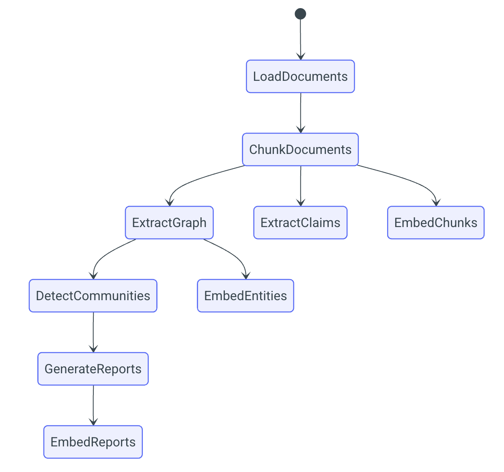
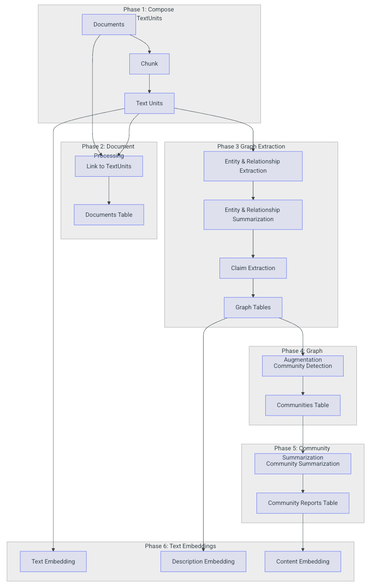

# Microsoft GraphRAG

> https://microsoft.github.io/graphrag/

- Indexing Architecture

  - 색인의 최종 결과물을 knowledge graph라 부른다.

  

  - 색인 과정에서 LLM 결과를 캐싱한다.
    - LLM의 응답을 캐시에 저장해뒀다가 같은 input set(prompt and tuning parameters)으로 요청이 들어올 경우 캐시된 결과를 반환한다.
    - 이는 network 등의 문제로 LLM으로부터 응답을 받지 못 할 경우에 대비하게 해주고, 응답의 멱등성을 보장하게 해준다.
  - 색인 시스템은 내부적으로 factory pattern을 사용한다.
    - Factory pattern을 사용하여 provider의 구현을 등록하고 조회한다.
    - 아래와 같은 subsystem들이 factory pattern을 사용하며, 이는 사용자가 직접 구현한 코드를 쉽게 적용할 수 있게 해준다.
    - language model, input reader, cache, logger, storage, vector store, pipeline + workflows

- Indexing Dataflow

  - Knowledge graph는 아래와 같은 요소들로 구성된다.

    - `Document`: Input으로 입력된 문서를 의미하며, txt 파일의 경우 파일 하나, CSV 파일의 경우 행 하나를 나타낸다.
    - `TextUnit`: Text의 chunk를 의미한다.
    - `Entity`: `TextUnit`으로부터 추출된 entity를 의미한다.
    - `Relationship`: 두 `Entity` 사이의 관계를 의미한다.
    - `Covariate`: `Entity`에 대한 진술을 담고 있으며, 특정 시점이나 기간에 종속될 수 있는 형태로 추출된 주장 정보를 의미한다.

    - `Community`: entity와 relationship으로 구성된 graph가 구성된 후, hierarchical community detection을 수행하여 clustering 구조를 생성한다.
    - `Community Report`: 각 `Community`의 내용들이 요약된 정보를 의미한다.

  - Workflow

    -  Text를 GraphRAG Knowledge Model로 변환하는 과정이다.

  

  - Phase 1. TextUnit 생성
    - 첫 단계는 입력으로 들어온 text를 `TextUnit`으로 변환하는 것이다.
    - `TextUnit`은 text의 덩어리이며, entity 및 relationship 추출에 사용된다.
    - 또한 추출된 지식 항목들이 원본 텍스트로 거슬러 올라갈 수 있도록, 개념 기반의 추적(breadcrumbs)과 출처(provenance)를 지원하기 위한 소스 참조(source-reference)로도 활용된다.
    - Chunk size는 설정이 가능하며 작을수록 정확도가 높아지지만 처리 속도는 감소하게 된다.
  - Phase 2. Document 처리
    - Knowledge graph를 위한 `Document` 테이블을 생성한다.
    - 최종 문서들이 GraphRAG에서 직접적으로 사용되지는 않지만, 각 `Document`에 속한 `TextUnit`들을 `Document`와 연결하여 출처를 알 수 있도록 한다.
  - Phase 3. Graph 추출
    - 각각의 `TextUnit`을 분석하여 graph의 기본 요소인 `Entity`, `Relationship`, claim들을 추출한다.
    - `Entity`와 `Relationship`은 동시에 추출되며, claim은 별도로 추출된다.
    - `Entity`와 `Relationship`은 LLM을 통해 추출되며, 그 결과물은 subgraph이다.
    - Subgraph에는 `Entity`와 `Relationship` 정보가 저장되며, `Entity`는 title, type, description 정보를, `Relationship`은 source, target, description 정보를 가지고 있다.
    - 이렇게 추출된 subgraph들은 병합 과정을 거치는데, 추출된 entity들 중 title과 type이 같은 entity가 있다면, 같은 entity의 description들을 배열형태로 저장하는 방식으로 두 entity를 병합한다.
    - `Relationship`도 마찬가지로 같은 source와 target을 가진 relationship들은 description을 배열 형태로 저장하는 방식으로 병합한다.
    - 병합 이후에는 요약 과정을 거치는데, 병합 되면서 배열 형태가 된 description들을 단일 description으로 요약한다.
    - 이 역시 LLM을 통해 이루어지며 각 description의 고유한 정보들은 유지하면서 중복되는 정보들만 합하는 방식으로 이루어진다.
    - Claim 추출은 선택적으로 실행되는데, `TextUnit`으로부터 평가된 상태(status)와 시간적 범위(time-bounds)를 포함하는 긍정적 사실 진술(statements)를 나타내는 claim을 추출한다.
    - 추출된 claim들은 `Covariates`라고 불리는 주요 산출물(primary artifact)로 내보내진다.
  - Phase 4. Graph 증강
    - Hierarchical Leiden Algorithm을 사용하여 entity community들의 계층를 생성한다.
    - 이 알고리즘은 그래프에 대해 재귀적으로 커뮤니티 클러스터링을 수행하며, 커뮤니티 규모가 사전에 정의된 임계치에 도달할 때까지 반복한다.
    - 이를 통해 그래프의 커뮤니티 구조를 체계적으로 이해할 수 있고, 서로 다른 수준의 세분도(granularity)에서 그래프를 탐색하고 요약할 수 있다.
    - 위 과정이 완료되면 최종 entity, relationship, community table이 생성된다.

  - Phase 5. Community 요약
    - LLM을 사용하여 각 community에 대한 요약을 생성한다.
    - 이를 통해 각 community의 고유한 정보에 대해 알 수 있으며, graph의 각 층의 각 영역에 대한 이해도 얻을 수 있다.
    - 그 후 LLM을 사용하여 위에서 생성한 요약을 다시 한 번 요약한다.
    - 최종적으로 community report table을 생성한다.
  - Phase 6. Text Embedding
    - Vector search가 필요한 모든 요소들(`TextUnit`, Graph Table, Community Report 등)을 embedding한다.
    - 기본적으로 `Entity`의 description, `TextUnit`의  text, community report의 text가 embedding된다.

- Query
  - Query Engien은 아래와 같은 작업들을 수행한다.
    - Local Search
    - Global Search
    - DRIFT Search
    - Basic Search
    - Question Generation
  - Local Search
    - 지식 그래프의 구조화된 데이터와 입력 문서의 비정형 데이터를 결합하여, 질의 시점에 관련 엔티티 정보를 LLM의 컨텍스트에 보강하는 방식이다.
    - 이 방법은 입력 문서에 언급된 특정 엔티티에 대한 이해가 필요한 질문(예: “카모마일의 치유 효능은 무엇인가?”)에 적합하다.
    - User query와 의미적으로 관련이 있는 entity들을 찾아, 이들을 knowledge graph를 탐색하기 위한 access point로 사용한다.
    - Access point를 통해 관련되 entities, relationships, community report등을 추가적으로 탐색한다.
    - 이후 이들 후보 데이터는 우선순위 및 중요도에 따라 정렬 및 선별되어, 미리 정의된 단일 컨텍스트 윈도우 크기에 맞게 구성되며, 이를 바탕으로 최종 응답이 생성된다.
    - 정렬 및 선별은 access point에 속하는 entity들과의 연결 개수, 각 relationship의 weight와 rank, context window의 잔여 크기 등을 기준으로 이루어진다.
  - Global Search
    - Baseline RAG는 데이터셋 전반에 걸친 정보를 집계(aggregation)하여 답변을 구성해야 하는 질의에 취약하다. 
    - 예를 들어, “데이터에서 상위 5개의 주요 주제는 무엇인가?”와 같은 질문은 제대로 처리하지 못한다. 
    - 이는 기본 RAG가 데이터셋 내에서 의미적으로 유사한 텍스트를 벡터 검색하는 방식에 의존하기 때문이다. 
    - 해당 질의에는 올바른 정보를 직접적으로 가리키는 단서가 없기 때문에 적절한 결과를 찾기 어렵다.
    - 반면, GraphRAG를 사용하면 이러한 질문에 답할 수 있다. 
    - LLM이 생성한 지식 그래프의 구조가 데이터셋 전체의 구조(즉, 주제 구조)를 반영하고 있기 때문이다.
    - Global search 방식은 그래프의 커뮤니티 계층 구조 중 특정 수준에서 생성된 LLM 기반 community report 집합을 컨텍스트 데이터로 활용하여, 맵-리듀스(map-reduce) 방식으로 응답을 생성한다.
    - 맵(map) 단계에서는 커뮤니티 보고서를 사전에 정의된 크기의 텍스트 청크로 분할한다. 
    - 각 텍스트 청크는 중간 응답(intermediate response)을 생성하는 데 사용되며, 이 응답에는 여러 개의 핵심 포인트가 포함된다. 각 포인트에는 해당 중요도를 나타내는 수치 평가값이 함께 부여된다.
    - 리듀스(reduce) 단계에서는 이러한 중간 응답들에서 중요도가 높은 포인트들만을 선별하여 집계하고, 이를 컨텍스트로 활용해 최종 응답을 생성한다.
    - 글로벌 검색 응답의 품질은 커뮤니티 보고서를 가져오는 계층 수준(level of the community hierarchy)에 크게 영향을 받을 수 있다. 
    - 더 낮은 계층 수준은 보다 세부적인 보고서를 제공하므로 일반적으로 더 충실한 응답을 생성하는 경향있으나 보고서의 양이 많아지기 때문에 최종 응답을 생성하는 데 필요한 시간과 LLM 자원 소모가 증가할 수 있다.

