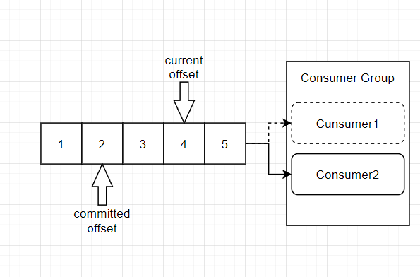
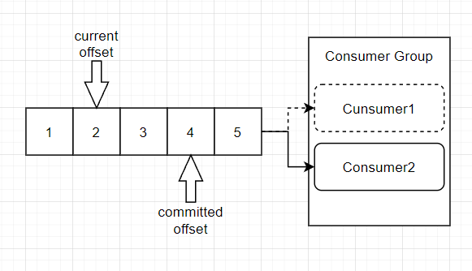
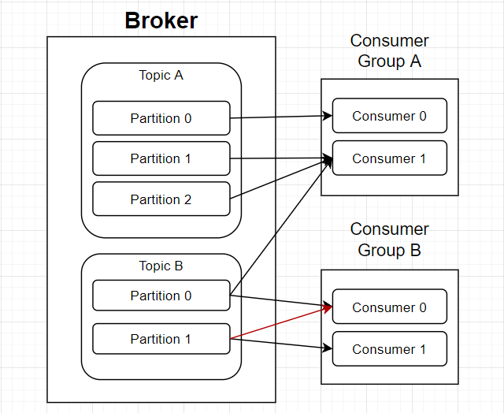

# Kafka란

## Kafka 개요

- Kafka
  - 링크드인에서 스칼라로 개발한 메시지 프로젝트
  - Kafka라는 이름은 소설가 프란츠 카프카에서 따왔다.
  - Pub-Sub 모델의 메시지 큐
  - 분산 환경에 특화되어 있다는 특징을 가지고 있다.
  - Kafka는 Confluent Kafka와 Apache Kafka가 있으며 각기 다른 version으로 관리된다.
  
    - 각 버전 별 호환 정보는 아래에서 확인할 수 있다.
  
    > https://docs.confluent.io/platform/current/installation/versions-interoperability.html#cp-and-apache-ak-compatibility


- Pub/Sub 구조
  - 링크드인에서 기존에 사용하던 Point to Point 구조를 Pub/Sub 구조로 변경하였다.
    - A,B,C,D가 있다고 할 때 A가 누구에게 메시지를 보내야 할지 모르므로 A는 B,C,D와 모두 연결되어 있어야 하며, 이는 B, C, D도 마찬가지다.
    - Pub/Sub 구조는 A,B,C,D가 모두 연결되어 있는 것이 아니라 발신자, 수신자가 지정되어 있고 발신자는 카프카에만 요청을 보내고, 수신자는 카프카에게서만 메시지를 받는 구조이다(단방향 구조).
    - 따라서 발신자와 수신자 모두 Kafka와만 연결되어 있으면 된다.
  - Publish(Producer)
    - 발신자는 카프카에게 전송만 하면 되고, 수신자가 누구인지 알 필요가 없다.
    - 따라서 특별히 수신자를 정해놓지 않고 서버에 전송하게 되는 심플한 구조를 갖게 된다.
    - 카프카는 내부에 발신자의 메시지를 토픽이라는 주소로 저장하게 된다.
  - Subscribe(Consumer)
    - 수신자는 카프카에 원하는 토픽을 구독한다.
    - 즉, 수신자 역시 발신자가 누구인지 관심은 없고 필요한 메시지만 구독을 하게 되는 것이다.


- 구성 요소
  - Event
    - Producer와 Consumer가 데이터를 주고 받는 단위
    - 메시지라고도 부른다.
  - Topic
    - 이벤트가 쓰이는 곳.
    - Producer는 Topic에 이벤트를 게시한다.
    - Consumer는 Topic으로부터 이벤트를 가져와서 처리한다.
    - Topic은 파일 시스템의 디렉터리와 유사하며, 이벤트는 디렉터리 안의 파일과 유사하다.
  - Broker
    - 카프카 서버
    - Producer에게 메시지를 받아서, Consumer에게 전달해주는 역할을 한다.
    - Topic이 저장되어 있는 곳이다.
    - Elasticsearch의 node와 유사하다.
  - Producer
    - Kafka 이벤트를 게시(post)하는 클라이언트 어플리케이션
  - Consumer
    - Topic을 구독하고 이로부터 얻어낸 이벤트를 처리하는 클라이언트 어플리케이션
  - Partition
    - Topic은 여러 Broker에 분산되어 저장되며 이렇게 분산된 Topic을 Partition이라고 한다.
    - 어떤 이벤트가 어떤 Partition에 저장될지는 이벤트의 key에 의해 정해지며, 같은 키를 가지는 이벤트는 항상 같은 Partition에 저장된다.
    - Topic의 Partition에 지정된 Consumer가 항상 정확히 동일한 순서로 Partition의 이벤트를 읽을 것을 보장한다.


- Consumer Group
  - Consumer Group은 하나의 Topic을 구독하는 여러  Consumer들의 모음이다.
    - 컨슈머 그룹은 같은 group.id를 공유한다.
    - Topic을 구독하는 Consumer들을 Group화 하는 이유는, 가용성 때문이다.
    - 하나의 Topic을 처리하는 Consumer가 1개인 것 보다 여러개라면 당연히 가용성은 증가할 것이다.
  - Rebalance
    - 특정 Partition을 처리하던 Consumer가 처리 불가 상태가 될 경우, Partition과 Consumer를 재조정하여, 남은 Consumer Group 내의 Consumer들이 Partition을 적절하게 나누어 처리하게 된다.
    - 또한 Consumer Group 내에서 Consumer들 간에 Offset 정보를 공유하고 있기 때문에, 특정 Consumer가 처리불가 상태가 되었을 때, 해당 Consumer가 처리한 마지막 Offset 이후 부터 이어서 처리 할 수 있다.
    - 이처럼 Partition을 나머지 Consumer들이 다시 나누어 처리하는 것을 Rebalance라고 한다.
  - Consumer Group과 Partition
    - Consumer Group 내의 Consumer들은 반드시 각기 다른 Partition에 연결되어야 한다.
    - 이를 통해 Consumer의 메시지 처리 순서를 보장하게 된다.
  - Consumer 확장
    - Consumer의 성능이 부족해, 이를  확장할 때, Consumer의 수가 Partition보다 많다면 Partition의 개수도 늘려줘야 한다.
    - 각 Consumer는 동일한 Partition을 처리할 수 없기 때문에, Consumer의 수가 Partition보다 많다면 Partition과 연결되지 않은 Consumer가 아무 처리도 하지 않는 상황이 발생할 수 있기 때문이다.


- Zookeeper
  - 분산 코디네이션 시스템
    - 분산 코디네이션 시스템이란 클러스터 설정정보 관리, 동기화, 리더 채택 등 클러스터 내부의 서버들이 공유하는 데이터들을 관리하는 시스템이다.
    - Elasticsearch, MongoDB 등은 고유의 분산 코디네이션 시스템이 존재한다.
  - Kafka에는 자체적인 분산 코디네이션 시스템이 존재하지 않으므로, 클러스터 관리를 위해 zookeeper를 사용한다.
    - Kafka는 Zookeeper 없이는 실행되지 않는다.
    - 브로커를 하나만 띄운다고 해도 zookeerer없이는 실행되지 않는다.
  - zookeeper가 kafka에서 하는 일들
    - leader partition이 내려갔을 때 새로운 leader partition을 선출한다.
    - 클러스터 내의 브로커들의 정보를 관리.
    - Kafka의 topic 정보를 저장한다. 현재 존재하는 토픽과 각 토픽의 파티션 정보, replica들의 수 등을 저장.
    - 각 토픽에 누가 접근하여 message를 읽고 쓸 수 있는지, consumer group의 목록, 각 consumer group에 속한 멤버들이 누구인지와 각 consumer group의 offset등에 대한 정보를 담은 엑세스 제어 목록(Access Control Lists, ACLs)을 관리.
    - Kafka의 데이터에 접근하는 클라이언트에 관한 정보 관리.
  - 하나의 zookeeper에 다수의 kafka 클러스터를 연결하여 사용하는 것도 가능하다.


- Kafka는 clustering이 가능하다.
  - 여러 개의 broker를 묶어서 하나의 cluster를 구성한다.
  - Clustering을 통해 얻을 수 있는 이점들은 아래와 같다.
    - 여러 server에 부하를 분산시킬 수 있다.
    - 확장성 있는 시스템을 구축할 수 있다.
    - 안정적인 시스템을 구축할 수 있다.
  - Broker와 parition
    - 한 Topic의 여러 개의 partition은 cluster 내의 broker들에 분산되어 저장된다.
    - 이를 통해 한 topic에 대한 요청을 여러 broker가 처리할 수 있게 되어 부하가 분산된다.
    - 또한 partition은 replica를 가지며, replica가 아닌 partition을 leader라 부른다.
    - Leader partition과 replica partition은 각기 다른 broker에 저장되어, 한 broker에 문제가 생기더라도, 다른 broker에 저장된 replica set을 이용하여 서비스가 가능하다.


- Producer와 Consumer의 분리
  - Producer와 Consumer는 완전 별개로 동작한다.
    - Producer는 Broker의 Topic에 메시지를 게시하기만 하면 되며, Consumer는 Broker의 특정 Topic에서 메시지를 가져와서 처리만 하면 된다.
  - 이를 통해 Kafka는 높은 확장성을 지니게 된다.
    - 즉, Producer와 Consumer를 필요에 의해 스케일 인 & 아웃하기에 용이한 구조이다.
    - 만약 Producer와 Consumer가 별개로 동작하지 않는다면 확장 또는 축소시 이들을 모두 연결하거나 연결해제 해줘야 했을 것이다.


- Push 모델과  Pull 모델
  - Kafka의 Consumer는 Pull 모델을 기반으로 메시지 처리를 진행한다.
    - 즉, Broker가 Consumer에게 메시지를 전달하는 것이 아닌, Consumer가 필요할 때 Broker로 부터 메시지를 가져와 처리하는 형태이다.
  - 만일 Push 모델이라면(즉, Broker가 Consumer에게 메시지를 전달한다면) Consumer를 관리하기 어렵지만, Pull 모델은 Consumer가 처리 가능한 때에 메시지를 가져와 처리하기 때문에 Consumer를 관리하기 쉽다.
  - 또한 Push 모델일 경우에는, 여러 메시지를 한 번에 처리하도록 하기 위해 전송을 지연시킬 수 있다. 따라서, 메시지를 처리할 수 있는 Consumer가 있어도 메시지를 받을 때 까지 대기해야 한다.
  - 반면에 Pull 모델은 Consumer가 마지막으로 처리된 메시지 이후의 메시지를 처리 가능할 때 모두 가져오기 때문에 불필요한 지연이 발생하지 않는다.


- 소비된 메시지 축적(Commit과 Offset)

  - 메세지는 지정된 Topic에 전달된다.
    - Topic은 다시 여러 Partition으로 나뉠 수 있다.
    - 각 Partition에 저장된 메시지를 log라고 부른다.
    - 메시지는 partition에 순차적으로 추가되며, 이 메시지의 상대적인 위치를 offset이라 한다. 

  - Commit과 Offset

    - Consumer의 `poll()`은 이전에 commit한 offset이 존재하면, 해당 offset 이후의 메시지를 읽어온다.
    - 읽어온 후, 마지막 offset을 commit한다.
    - 이어서 `poll()`이 실행되면 방금전 commit한 offset 이후의 메시지를 읽어와 처리하게 된다.

  - 메시지 소비 중에는 다음과 같은 문제들이 발생할 수도 있다.

    - Broker가 메시지를 Consumer에게 전달할 때 마다 즉시 메시지를 소비 된 메시지로 기록한다면, Consumser가 메세지 처리를 실패할 경우 해당 메시지는 처리되지 못하고 소비 된 상태로 남게 된다.
    - 따라서, Broker는 메시지가 소비되었음을 기록하기 위해서, Consumer의 승인을 기다린다.
    - 그러나 이러한 방식은 다시 아래와 같은 문제를 발생시키게 된다.

    - Consumer가 메시지를 성공적으로 처리한 뒤 Broker에 승인을 보내기 전에 Broker가 실패하였다고 판단하고 다시 메시지를 보낼 경우, Consumer는 동일한 메시지를 두 번 처리하게 된다.
    - 따라서 Consumer는 멱등성을 고려해야 한다.
    - 즉 같은 메시지를 특수한 상황에 의해 여러 번 받아서 여러 번 처리하더라도, 한 번 처리한 것과 같은 결과를 가지도록 설계해야 한다. 

  - 메시지 전달 컨셉

    - At most once(최대 한 번): 메시지가 손실 될 수 있지만, 재전달은 하지 않는다.
    - At least once(최소 한 번): 메시지가 손실 되지 않지만, 재전달이 일어난다.
    - Exactly once(정확히 한 번): 메시지는 단 한 번만 전달 된다.


## 주요 개념

### 브로커

- 브로커란
  - 카프카 브로커는 클라이언와 데이터를 주고받기 위해 사용하는 주체이자, 데이터를 분산 저장하여 장애가 발생하더라도 안전하게 사용할 수 있도록 도와주는 애플리케이션이다.
  - 하나의 서버에는 한 개의 카프카 브로커 프로세스가 실행된다.
  - 카프카 브로커 서버 1대로도 기본 기능이 실행되지만, 데이터를 안전하게 보관하고 처리하기 위해 3대 이상의 브로커 서버를 1개의 클러스터로 묶어서 운영한다.
    - 카프카 클러스터로 묶인 브로커들은 프로듀서가 보낸 데이터를 안전하게 분산 저장하고 복제하는 역할을 수행한다.


- 데이터 저장

  - 브로커는 데이터를 저장하고 전송하는 역할을 한다.
    - 프로듀서로부터 데이터를 전달 받으면 카프카 브로커는 프로듀서가 요청한 토픽의 파티션에 데이터를 저장한다.
    - 이후 컨슈머가 데이터를 요청하면 파티션에 저장된 데이터를 전달한다.
  - 프로듀서로부터 전달된 데이터는 물리적 파일로 저장된다
    - 저장 경로는 `server.properties`파일의 `log.dirs`에 설정해준 경로(아래의 경우 `/tmp/kafka-logs`)이다.
    - 토픽과 파티션의 개수에 따라 폴더가 생성되는데 만일 `hello.kafka`란 이름의 토픽을 3개의 파티션과 함께 생성했다면, 폴더는 아래 예시와 같이 생성된다.
    - 각 폴더 내부에는 몇 가지 파일이 존재하는데, `.log`파일에는 메시지와 메타데이터 정보가,  `.index` 파일은 메시지의 오프셋을 인덱싱한 정보가, `.timeindex` 파일에는 메시지에 포함된 timestamp 값을 기준으로 인덱싱한 정보가 담겨 있다.

  ```bash
  $ cd /tmp/kafka-logs
  $ ls
  hello.kafka-0  		hello.kafka-1  		hello.kafka-2  		hello.kafka-3  		hello.kafka-4
  
  $ cd hello.kafka-0
  $ ls
  00000000000000000000.index      00000000000000000000.log        00000000000000000000.timeindex  leader-epoch-checkpoint
  ```

  - 카프카가 파일 입출력으로 인한 속도 이슈를 해결한 방법
    - 카프카는 메모리나 DB에 저장하지 않으며 따로 캐시메모리를 구현하여 사용하지도 않는다.
    - 파일 시스템에 저장하기에 파일 입출력으로 인한 속도 이슈가 발생할 것 같지만, 카프카는 페이지 캐시를 사용하여 디스크 입출력 속도를 높여 이 문제를 해결했다.
    - 페이지 캐시란 OS 내에서 파일 입출력의 성능 향상을 위해 만들어 놓은 메모리 영역으로, 한 번 읽은 파일의 내용은 메모리 페이지의 캐시 영역에 저장시키고 추후 동일한 파일의 접근이 일어나면 디스크에서 읽지 않고 메모리에서 직접 읽는 방식이다.


- 데이터 복제
  - 팔로워 파티션이 리더 파티션으로부터 데이터를 가져와서 자신에게 저장하는 것.
    - 데이터 복제는 카프카가 장애 허용 시스템으로 동작하도록 하는 원동력이다.
    - 복제되는 데이터 만큼 저장 용량이 증가한다는 문제가 있기는 하지만 데이터를 안전하게 사용할 수 있다는 강력한 장점이 존재한다.
    - 클로스터로 묶인 브로커 중 일부에 장애가 발생하더라도 데이터를 유실하지 않고 안전하게 사용하게 해준다.
  - 카프카의 복제는 파티션 단위로 이루어진다.
    - 토픽을 생성할 때 파티션의 개수도 같이 설정되는데 옵션을 설정하지 않으면 브로커에 설정된 옵션 값에 따라 설정된다.
    - 팔로워 파티션의 개수의 최소값은 0(복제 없음)이고 최대값은 브로커 개수이다.


- 컨트롤러
  - 컨트롤러의 역할
    - 다른 브로커들의 상태를 체크.
    - 브로커가 클러스터에서 빠지는 경우 해당 브로커에 존재하는 리더 파티션을 다른 브로커로 재분배.
  - 클러스터 내의 브로커 중 한 대가 컨트롤러의 역할을 수행한다.
    - 만일 컨트롤러 역할을 하는 브로커에 장애가 생기면 다른 브로커가 컨트롤러 역할을 맡는다.


- 데이터 삭제
  - 오직 브로커만이 데이터를 삭제할 수 있다.
    - 카프카는 컨슈머가 데이터를 가져가더라도 토픽의 데이터는 삭제되지 않는다.
    - 컨슈머나 프로듀서는 데이터 삭제를 요청할 수 없다.
  - 로그 세그먼트
    - 파일 삭제는 파일 단위로 이루어지는데 이 단위를 로그 세그먼트라 부른다.
    - 이 세그먼트에는 다수의 데이터가 들어있기에 일반적인 DB처럼 특정 데이터를 선별해서 삭제할 수 없다.
    - 세그먼트 파일은 데이터가 쌓이는 동안 열려 있으며, 저장 용량이 일정 이상이 되거나 일정 시간이 지나면 닫히게 된다.
    - 데이터를 저장하기 위해 사용중인(열려있는) 세그먼트를 액티브 세그먼트라고한다.
    - 세그먼트에 저장할 용량 혹은 시간을 지나치게 작게 설정할 경우 세그먼트 파일을 자주 여닫음으로써 부하가 발생할 수 있다.
    - 닫힌 세그먼트 파일은 일정 용량, 혹은 일정 시간이 지나면 삭제된다.
  - 관련 옵션
    - `log.segment.bytes`: 하나의 세그먼트에 저장할 용량을 설정(기본값은 1GB)
    - `log.segment.ms`: 하나의 세그먼트에 데이터가 저장 될 시간을 설정(ms 대신 minutes, hours 사용 가능)
    - `log.retention.bytes`: 닫힌 세그먼트의 크기가 이 옵션에 설정해준 값보다 작으면 삭제(기본값은 -1)
    - `log.retention.ms`: 로그 파일을 보관할 시간을 설정(ms 대신 minutes, hours 사용 가능, 기본 값은 168시간)
    - `log.retention.check.interval.ms`: 닫힌 세그먼트 파일의 삭제를 위해 세그먼트 파일을 체크하는 간격
  - 용량 기반 삭제의 조건
    - 용량 기반 삭제를 위해서는 `log.segment.bytes`의 값을 `log.retention.bytes`보다 작게 설정해야 한다.
    - 예를 들어 `log.segment.bytes`의 값이 2mb, `log.retention.bytes`의 값이 1mb이라고 가정해보자.
    - 위 설정에 따르면, 로그 세그먼트는 용량이 2mb 이상일 때 닫히는데, 1mb 이하인 닫힌 세그먼트를 삭제하록 했기에 어떤 세그먼트도 삭제되지 않는다.


- 컨슈머 오프셋 저장
  - 오프셋 커밋
    - 컨슈머 그룹은 토픽이 특정 파티션으로부터 데이터를 가져가서 처리하고 이 파티션의 어느 레코드까지 가져갔는지 확인하기 위해 오프셋을 커밋한다.
  - 커밋한 오프셋은 `__consumer_offsets` 토픽에 저장한다.


- (그룹)코디네이터
  - 클러스터의 내부의 브로커 중 한 대는 코디네이터의 역할을 수행한다.
  - 코디네이터는 컨슈머 그룹의 상태를 체크하고 파티션을 컨슈머와 매칭되도록 분배를 돕는 역할을 한다.
    - 컨슈머 그룹에 최초로 포함된 컨슈머를 리더라 부른다.
    - 리더는 코디네이터로부터 그룹 내의 현재 동작 중인 컨슈머의 목록을 받아온다.
    - 그 후 리더는 `PartitionAssignor`에 설정된 값에 따라 파티션을 각 컨슈머에 분배한다.
    - 분배가 완료되면 리더는 전체 분배 현황을 코디네이터에게 전송하고, 그룹 내의 각 컨슈머에게는 각 컨슈머의 할당 정보만을 보낸다.
    - 즉 각 파티션은 자신의 할당 정보만을 알고 있고 리더만이 그룹 내 모든 파티션의 할당 정보를 알고 있다.
    - 리밸런싱이 발생할 때 마다 위 과정이 반복된다.
  - 리밸런스(rebalance)
    - 컨슈머가 컨슈머 그룹에서 빠지면 매칭되지 않은 파티션을 정상 동작하는 컨슈머로 할당하여 끊임없이 데이터가 처리되도록 도와준다.
    - 이렇게 파티션을 컨슈머에 재할당하는 과정을 리밸런스라고 부른다.


### 토픽과 파티션

- 토픽
  - 카프카에서 데이터를 구분하기 위해 사용하는 단위
  - 1개 이상의 파티션을 소유하고 있다.
    - 파티션의 개수는 토픽을 생성할 때 지정해 줄 수 있다.
    - 한 번 설정한 파티션의 개수는 늘릴 수는 있어도 줄일 수는 없다.
  - 토픽 이름 제약 조건
    - 빈 문자열로 생성할 수 없다.
    - 마침표 하나 또는 둘로 생성할 수 없다.
    - 249자 미만으로 생성해야 한다.
    - 영어 대소문자, 0~9 사이의 숫자, 마침표, 언더바, 하이픈의 조합으로 생성해야 한다.
    - 카프카 내부 로직 관리 목적으로 사용되는 2개 토픽(`__consumer_offsets`, `__transaction_state`)과 동일한 이름으로 생성 불가능하다.
    - 토픽 이름에 마침표와 언더바가 동시에 들어가면 안된다(생성은 가능하지만 경고 메시지가 뜬다).
    - 신규 토픽의 이름이 기존 토픽과 마침표와 언더바만 다르다면 생성 불가능하다(예를 들어 test.topic이라는 토픽이 있으면, test_topic이라는 신규 토픽은 생성이 불가능하고, 반대의 경우도 마찬가지다).
  
  - 토픽을 생성하는 방법
    - 토픽을 생성하는 방법은 크게 2가지가 있다.
    - 카프카 컨슈머 또는 프로듀서가 카프카 브로커에 아직 생성되지 않은 토픽에 대해 데이터를 요청하면 토픽을 동적으로 생성한다.
    - 커맨드 라인 툴로 명시적으로 토픽을 생성할 수 있다.
    - 토픽을 효과적을 유지보수하기 위해서는 커맨드 라인 툴로 명시적으로 생성하는 것이 좋다.


- 파티션
  - 파티션에는 프로듀서가 보낸 데이터들이 들어가 저장되는 공간
    - 파티션에 저장된 데이터를 **레코드(record)**라고 부른다.
  - 파티션은 카프카 병렬 처리의 핵심으로써 레코드를 병렬로 처리할 수 있도록 컨슈머들과 매치된다.
  - 파티션은 리더와 팔로워로 구성된다.
    - 카프카는 브로커 중 하나가 내려가더라도 다른 브로커에서 내려간 브로커의 데이터를 사용할 수 있도록 복제를 지원한다.
    - 복제는 파티션 단위로 진행되며, 사용자가 설정한 개수 만큼 다른 브로커에 파티션이 복제된다.
    - 프로듀서 또는 컨슈머와 직접 통신하는 파티션을 리더, 나머지 복제 데이터를 가지고 있는 파티션을 팔로워라 부른다.
    - 리더 파티션이 속한 브로커에 문제가 생길 경우 팔로워 파티션 중 하나가 리더 파티션이 된다.
    - 팔로워들은 리더의 오프셋을 확인하여 현재 자신이 가지고 있는 오프셋과 차이가 나는 경우 리더 파티션으로부터 데이터를 가져와서 자신의 파티션에 저장(복제)한다.
  - 복제(팔로워) 파티션의 개수
    - kafka에서 복제 파티션의 개수를 1로 설정하면 복제 파티션을 사용하지 않는다는 의미이다.
    - 토픽을 생성할 때 복제 파티션의 개수도 함께 설정이 가능한데, 설정해주지 않을 경우 브로커 설정에 있는 `default.replication.fator` 옵션에 설정된 값으로 설정된다.
  - 큐(Queue)와 비슷한 구조다.
    - FIFO 구조라는 점에서 큐와 유사하다.
    - 그러나 큐와 달리 컨슈머가 데이터를 가져갔다고 해서 해당 데이터가 삭제되지는 않는다.
  - 컨슈머가 데이터를 가져간 후에도 데이터를 삭제하지 않는 이유
    - kafka는 오프셋을 컨슈머 그룹별로 저장한다.
    - 따라서 토픽의 레코드는 다양한 목적을가진 여러 컨슈머 그룹들이 토픽의 데이터를 여러 번 가져갈 수 있게 된다.
    - 만일 한 컨슈머 그룹이 데이터를 가져갔다고 해당 데이터를 파티션에서 삭제한다면, 모든 컨슈머 그룹이 오프셋을 공유해야 한다.
    - 예를 들어 `fruits`라는 토픽의 파티션에 `['apple', 'banana', 'watermelon']`이라는 데이터가 적재되어 있고, 해당 파티션에 A, B라는 컨슈머 그룹이 할당되어 있다고 가정한다.
    - 이 때 A 컨슈머 그룹이 해당 파티션에서 메시지를 하나 가져오면 offset이 하나 증가하여 `banana`를 가리키게 된다.
    - 그런데 오프셋은 각 컨슈머 그룹별로 저장되므로 이후에 B컨슈머가 메시지를 가져올 때에는 `banana`가 아닌 `apple`을 가져오게 된다.


- 레코드
  - 타임스탬프, 메시지 키, 메시지 값, 오프셋으로 구성된다.
    - 프로듀서가 생성한 레코드가 브로커로 전송되면 오프셋과 타임 스탬프가 지정되어 저장된다.
    - 브로커에 한 번 적재된 레코드는 수정할 수 없다.
  - 타임스탬프
    - 타임스탬프에는 브로커 기준 유닉스 시간이 기록된다. 
    - 프로듀서가 레코드를  생성할 때 임의의 타임스탬프 값을 설정할 수 있다.
  - 메시지 키
    - 메시지 키는 메시지 값을 순서대로 처리하거나 메시지 값의 종류를 나타내기 위해 사용한다.
    - 프로듀서가 토픽에 레코드를 전송할 때 메시지 키의 해시값을 토대로 파티션을 지정하게 된다.
    - 따로 지정하지 않으면 null이 된다.
  - 전송될 파티션이 지정되는 방식
    - 프로듀서에서 저장 할 Partition을 지정할 경우 해당 파티션으로 전송된다.
    - 지정하지 않은 경우 DefaultPartitioner는 다음과 같이 동작한다. 
    - 메시지 키가 있으면 메시지 키의 해시 값을 토대로 파티션을 지정한다. 
    - **즉, 메시지 키가 같으면 같은 파티션에 전송된다.** 다만 어느 파티션에 저장될 지는 알 수 없다.
    - 메시지 키가 없으면 Round-Robin 방식으로 Partition이 할당된다.
    - 단, 메시지 키가 있다고 하더라도 파티션의 추가에 따라 메시지 키의 해시값과 파티션의 매칭이 달라질 수 있다.
    - 따라서 파티션이 추가되더라도 메시지키와 파티션의 매칭을 유지하고자 한다면 custom partitioner를 사용해야한다.
  - 메시지 값
    - 실질적으로 처리할 데이터가 들어 있다.
    - 메시지 키와 값은 직렬화되어 브로커로 전송되기 때문에 컨슈머가 이용할 때는 직렬화한 형태와 동일한 형태로 역직렬화를 수행해야 한다.
  - 오프셋
    - 파티션 내에서 데이터의 위치를 표시하는 유니크한 숫자
    - 컨슈머가 데이터를 가져갈 때 사용된다.
    - 0 이상의 숫자로 이루어져 있으며, 레코드의 오프셋은 직접 지정할 수 없고 브로커에 저장될 때 `이전에 전송된 레코드의 오프셋 + 1` 값으로 생성된다.
    - 동일한 토픽이라 하더라도 컨슈머 그룹 별로 오프셋은 개별적으로 관리된다.
    - 오프셋을 통해 컨슈머 그룹 내의 각 컨슈머들이 파티션의 데이터를 어디까지 가져갔는지 명확히 알 수 있다.
  - 레코드의 삭제
    - 특정 파티션에 저장된 특정 레코드를 삭제하는 것은 불가능하다.
    - 다만 가장 오래된 레코드부터 n번째 레코드 까지 통으로 삭제하는 것은 가능하다.


### 프로듀서

- 프로듀서
  - 카프카 브로커에 메시지를 전송하는 역할을 한다.
  - 프로듀서에서 메시지를 전송할 때, 파티셔너를 통해 메시지를 어떤 방식으로 파티션에 할당할지를 정할 수 있다.
    - 특정 키를 가진 메시지는 특정 파티션에 할당되도록 지정하는 것도 가능하다.


- 프로듀서의 주요 옵션
  - bootstrap.server
    - 프로듀서가 데이터를 전송할 브로커의 호스트명과 포트를 입력한다.
    - 둘 이상의 브로커 호스트와 포트를 입력하는 것도 가능하다.
  - key.serializer
    - 레코드의 메시지 키를 직렬화하는 클래스를 지정한다.
  - value.serializer
    - 레코드의 메시지 값을 직렬화하는 클래스를 작성한다.
  - acks(acknowledgments)
    - 프로듀서가 전송한 데이터가 브로커에 정상적으로 저장되었는지 여부를 확인하는 데 사용한다.
  - buffer.memory
    - 브로커로 전송할 데이터를 배치로 모아둘 버퍼 메모리양을 지정한다.
    - `batch.size` 옵션과 혼동하기 쉬운데, `batch.size` 옵션은 broker로 request를 보낼 때의 용량이고, `buffer.memory`는 request와 상관 없이 buffer에 쌓아둘 수 있는 용량이다.
    - Kafka producer는 server로 요청을 보내기 전에 buffer memory에 데이터를 모아둔다.
    - 만일 모종의 이유로  producer가 broker로 요청을 보내는 데 실패한다면, producer는 해당 데이터를 삭제하는 것이 아니라 그대로 buffer 영역에 저장해둔다.
    - 만일 server로의 요청이 지속적으로 실패하여  `buffer.memory`에 설정 한 값보다 저장된 값이 커지게 되면 `max.block.ms`에 설정한 값 만큼 대기하다가, 대기 시간이 `max.block.ms`에 설정한 값을 초과하면 예외를 발생시킨다.
  - max.block.ms
    - `KafkaProducer.send()`, `KafkaProducer.partitionsFor()` 메서드가 block 될 기간을 설정한다.
    - buffer memory가 `buffer.memory`에 설정한 값 만큼 커지거나, metadata 정보가 사용 불가할 때 적용된다.
  - retries
    - 프로듀서가 브로커로부터 에러를 받고 난 뒤 재전송을 시도할 횟수를 지정한다.
  - batch.size
    - 배치로 전송할 레코드의 최대 용량을 지정한다.
    - 너무 작게 설정하면 프로듀서가 브로커로 더 자주 보내기 때문에 네트워크 부담이 있다.
    - 너무 크게 설정하면 메모리를 더 많이 사용하게 되는 문제가 있다.
  - linger.ms
    - sendor가 batch를 가져가기 전까지 추가 레코드를 기다리는 시간이다.
    - 만일 batch.size에 설정해준 만큼 레코드가 쌓였다면 linger.ms과 무관하게 (뒤에서 살펴볼)sendor가 데이터를 가져가게 된다.
    - 0(지연 없음)보다 큰 값을 설정하면 지연은 발생하지만 처리량은 좋아진다.
    - `linger.ms`를 0으로 준다고 batch에 message가 1건씩 담겨서 전송되는 것은 아니다.
    - kafka가 각 요청을 처리하는데 약간의 시간이 소요되고, 이 때 batch가 생성되기 때문이다.
  - partitioner
    - 어떤 파티션에 할당될지 결정하는 파티셔너를 설정한다.


### 컨슈머

- 컨슈머
  - 카프카 브로커에서 메시지를 받아오는 역할을 한다.
  - 컨슈머가 파티션에서 메시지를 받아올 때는 각 파티션에 메시지가 추가된 순서대로 받아오는 것이 보장된다.
    - 단, 이는 프로듀서가 보낸 순서대로 받아오는 것이 보장된다는 의미는 아니다.
    - 예를 들어 P0, P1라는 두 개의 파티션이 있고, 프로듀서가 해당 토픽으로 1,2,3,4,5 라는 데이터를 보냈을 때 P0에 1,3,4, P1에 2,5가 저장될 수 있다.
    - 컨슈머는 각 파티션에 추가된 순서대로 받아오는 것을 보장하므로 P0에서는 1,3,4 순으로, P1에서는 2,5 순으로 데이터를 받아오는 것이 보장되지만, 두 파티션에서 동시에 받아올 때는 1,2,3,4,5 가 될 수도, 1,2,5,3,4 가 될 수도, 1,3,4,2,5 가 될 수도 있다.
    - 즉 위에서 보장되는 것은 P0의 경우 1을 3, 4보다 먼저 받아온다는 것과 3을 4보다 먼저 받아온다는 것이고, P1의 경우 2를 5 보다 먼저 받아온다는 것 뿐이다.
    - 파티션이 하나일 경우에는 프로듀서가 보낸 순서대로 받아오는 것이 보장된다.
  - 컨슈머를 운영하는 방법은 크게 두 가지가 있다.
    - 1개 이상의 컨슈머로 이루어진 컨슈머 그룹을 운영하는 방법.
    - 토픽의 특정 파티션만 구독하는 컨슈머를 운영하는 방법


- 컨슈머 그룹으로 운영하는 방법
  - 컨슈머 그룹 내의 컨슈머들은 1개 이상의 파티션들에 할당되어 데이터를 가져갈 수 있다.
    - 1개의 파티션은 하나의 컨슈머 그룹 내에서는 최대 1개의 컨슈머에만 할당 가능하다.
    - 반면에 1개의 컨슈머는 여러 개의 파티션에 할당될 수 있다.
    - 이러한 특성으로 인해 컨슈머 그룹의 컨슈머 개수는 메시지를 가져오고자 하는 토픽의  파티션 개수보다 작거나 같아야한다.
    - 만일 파티션이 2개 이고, 컨슈머가 3개일 경우 하나의 컨슈머는 파티션을 할당받지 못하고 스레드만 차지하게 되기 때문이다.
  - 컨슈머 그룹은 다른 컨슈머 그룹과 격리되는 특징이 있다.
    - 오프셋도 컨슈머 그룹 별로 관리한다.
    - 이를 통해 프로듀서가 보낸 데이터를 각기 다른 컨슈머 그룹끼리 영향을 받지 않게 처리할 수 있다.


- 리밸런싱(rebalancing)
  - 컨슈머 그룹 내의 컨슈머에 할당된 파티션이 재할당 되는 것.
    - 리밸런싱은 가용성을 높여 안정적인 운영을 도와주는 유용한 기능이지만 자주 일어나서는 안된다.
    - 리밸런싱이 발생할 때 파티션을 재할당 하는 과정에서 해당 컨슈머 그룹 내의 컨슈머들이 토픽의 데이터를 읽을 수 없기 때문이다.
  - 리밸런싱은 크게 두 가지 상황에서 일어난다.
    - 컨슈머가 추가될 경우.
    - 컨슈머 그룹 내의 컨슈머들 중 일부 컨슈머에 장애가 발생하면, 장애가 발생한 컨슈머에 할당된 파티션은 장애가 발생하지 않은 컨슈머에 재할당 된다.


- 커밋과 오프셋
  - 컨슈머는 카프카 브로커에서 데이터를 어디까지 가져갔는지 커밋을 통해 기록한다.
    - 특정 토픽의 파티션을 어떤 컨슈머 그룹이 몇 번째 레코드까지 가져갔는지를 브로커 내부에서 사용되는 내부 토픽(`__consumer_offsets`)에 기록한다.
    - 컨슈머 동작 이슈가 발생하여 `__consumer_offsets`에 어느 레코드까지 읽어갔는지 오프셋 커밋이 기록되지 못했다면 데이터 처리의 중복이 발생할 수 있다.
    - 따라서 데이터 처리의 중복이 발생되지 않게 하기 위해서는 컨슈머 애플리케이션이 오프셋 커밋을 정상적으로 처리 했는지 검증해야 한다.
    
  - 자동 커밋(비명시 오프셋 커밋)
    - 기본 옵션은 `poll()`(파티션에서 메시지를 가져오는 메서드)이 수행될 때 마지막 커밋으로부터 일정 시간(`auto.commit.interval.ms`)이 지났다면 오프셋을 커밋하도록 설정되어 있다.
    - 이렇게 일정 간격마다 자동으로 커밋되는 것을 비명시 오프셋 커밋이라 한다.
    - 비명시 오프셋 커밋은 편리하지만 리밸런싱 또는 컨슈머 강제 종료 발생 시 컨슈머가 처리하는 데이터가 중복 또는 유실될 수 있는 가능성이 있다.
    - 따라서 데이터 중복이나 유실을 허용하지 않는 서비스라면 비명시 오프셋 커밋을 사용해서는 안된다.
    
  - 자동 커밋 사용시 데이터의 중복 또는 유실

    - `auto.commit.interval.ms` 값이 5초라고 가정했을 때, 4번 offset을 `poll()`메서드로 가져오는 시점에 마지막 커밋(2번 오프셋)으로부터 5초가 지나지 않았다면, 커밋은 일어나지 않는다.
    - 그런데 Consumer1에서 4번 offset의 데이터를 처리하다 문제가 생겨 내려간 경우 rebalancing이 발생하여  기존 파티션이 Consumer2로 재할당되고, Consumer2는 broker에서 마지막으로 commit 된 offset 정보를 받아온다.
    - 마지막으로 commit 된 offset이 2이므로 3번 offset의 데이터부터 처리를 시작하게 된다.
    - 3번 offset의 데이터는 이미 처리가 완료되었음에도 다시 처리된다.

    

    - `poll` 메서드를 통해 1~4번 오프셋을 가져오자마자 commit이 발생한 경우 반대로 데이터의 누락이 발생할 수 있다.
    - 만일 2번 offset의 데이터를 처리하는 도중 리밸런싱이 일어났다면, 새로 할당 된 Consumer2는 브로커로부터 마지막으로 commit 된 offset인 4를 받아오게 된다.
    - 이 경우 Consumer2는 5번 offset부터 데이터를 가져올 것이므로 2,3,4번 오프셋의 데이터는 처리되지 못한 채 누락이 발생하게 된다.

    

  - 수동 커밋(명시 오프셋 커밋)
    - 명시적으로 오프셋을 커밋하려면 `poll()` 메서드 호출 이후에 데이터의 처리가 완료 된 후 `commit()`메서드를 호출하면 된다.
    - `commit()` 메서드는 브로커에 커밋 요청을 하고 커밋이 정상적으로 처리 되었는지 응답하기까지 기다리는데, 이는 컨슈머의 처리량에 영향을 미친다.
    - 기존에는 데이터 처리만 했으면 됐는데, 이제는 데이터 처리 + 커밋 요청 및 응답 대기까지 해야 하기 때문이다.
    - 이를 해결하기 위해 비동기적으로 커밋을 할 수도 있지만, 커밋 요청이 실패했을 경우 현재 처리 중인 데이터의 순서를 보장하지 않으며 데이터의 중복 처리가 발생할 수 있다.


- 파티션, 컨슈머, 컨슈머 그룹, 오프셋

  - 오프셋은 각 컨슈머 그룹 별로 관리된다.
    - rebalancing을 통해 파티션이 다른 컨슈머에 할당 돼도 기존 컨슈머의 오프셋을 이어 받아 기존 컨슈머가 처리한 마지막 Offset 이후 부터 처리를 이어서 할 수 있다.
  - 하나의 컨슈머는 복수의 파티션을 할당 받을 수 있다.
  - 하나의 파티션은 하나의 컨슈머 그룹 내에서는 하나의 컨슈머에만 할당이 가능하다.
    - 카프카는 메시지의 순차적인 처리를 보장한다.
    - 만일 하나의 파티션이 컨슈머 그룹 내의 복수에 컨슈머에 할당된다면, 순차적인 메시지의 처리가 불가능해진다.
  - 하나의 파티션은 각기 다른 컨슈머 그룹 내의 컨슈머에는 복수 할당이 가능하다. 
  




- 파티션 할당 방식
  - Kafka는 기본적으로 Range와 RoundRobin이라는 두 개의 방식을 사용한다.
    - 아래의 할당 방식 외에도 직접 커스텀해서 사용이 가능하다.
  - Range
    - 파티션은 숫자 순서대로 정렬하고 컨슈머는 사전 순서대로 정렬한다.
    - 각 토픽의 파티션을 컨슈머 숫자로 나누어 컨슈머에게 할당해야 하는 파티션 수를 결정한다.
    - 고르게 나뉘지 않는다면 앞쪽 컨슈머가 더 많은 파티션을 할당받는다.
  - RoundRobin
    - 모든 파티션을 컨슈머에게 번갈아가면서 할당한다.


- 컨슈머 쥬요 옵션
  - `bootstrap.servers`
    - `브로커의 호스트 이름:포트`를 1개 이상 작성한다.
    - 2개 이상 브로커 정보를 입력하여 일부 브로커에 이슈가 발생하더라도 접속하는 데 이슈가 없도록 설정 가능하다.
  - `key.deserializer`
    - 레코드의 메시지 키를 역직렬화하는 클래스를 지정한다.
  - `key.deserializer`
    - 레코드의 메시지 값을 역직렬화 하는 클래스를 지정한다.
  - `group.id`
    - 컨슈머 그룹 아이디를 지정한다.
    - `subscribe()` 메서드로 토픽을 구독하여 사용할 때는 이 옵션을 필수로 넣어야 한다.
  - `auto.offset.reset`
    - 컨슈머 그룹이 특정 파티션을 읽을 때 저장된 오프셋이 없는 경우 어느 오프셋부터 읽을지 선택한다.
    - 이미 컨슈머 오프셋이 있다면 이 옵션값은 무시된다.
    - `latest`: 가장 최근에 넣은 오프셋부터 읽는다.
    - `earliest`: 가장 오래전에 넣은 오프셋부터 읽는다.
    - `none`: 컨슈머 그룹이 커밋한 기록이 있는지 찾아보고 커밋 기록이 없으면 오류를 반환하고, 있으면 기존 커밋 기록 이후 오프셋부터 읽기 시작한다.
  - `enable.auto.commit`
    - 자동 커밋(비명시적 오프셋 커밋)으로 할 지 수동 커밋(명시적 오프셋 커밋)으로 할지를 설정한다.
  - `auto.commit.interval.ms`
    - 자동 커밋일 경우 오프셋 커밋 간격을 지정한다.
    - `poll()` 메서드가 호출될 때, 마지막 커밋으로부터 여기서 설정해준 값 만큼의 시간이 지났다면 커밋을 진행한다.
  - `max.poll.records`
    - `poll()`메서드를 통해 반환되는 레코드의 개수를 지정한다.
  - `session.timeout.ms`
    - 컨슈머가 브로커와 연결이 끊기는 최대 시간을 설정한다.
    - 이 시간 내에 하트비트를 전송하지 않으면 브로커는 컨슈머에 이슈가 발생했다고 가정하고 리밸런싱을 시작한다.
    - 보통 하트비트 시간 간격의 3배로 설정한다.
  - `heartbeat.interval.ms`
    - 하트비트를 전송하는 시간 간격이다.
  - `max.poll.interval.ms`
    - `poll()` 메서드를 호출하는 간격의 최대 시간을 지정한다.
    - `poll()` 메서드를 호출한 이후에 여기서 설정해준 시간 내에 `poll()` 메서드가 다시 실행되지 않으면, 컨슈머에 이상이 생긴 것으로 판단하고 리밸런싱을 시작한다.
  - `isolation.level`
    - 트랜잭션 프로듀서가 레코드를 트랜잭션 단위로 보낼 경우 사용한다.
    - `read_commited`, `read_uncommited`로 설정할 수 있다.
    - `read_commited`로 설정하면 커밋이 완료된 레코드만 읽는다.
    - `read_uncommited`로 설정하면 커밋 여부와 관계 없이 파티션에 있는 모든 레코드를 읽는다.
  - `partition.assignment.strategy`
    - 파티션 할당 방식을 지정한다.
    - 기본값으로 Range, RoundRobin 두 startegy를 사용한다.


- 컨슈머의 안전한 종료
  - 정상적으로 종료되지 않은 컨슈머는 세션 타임아웃이 발생할때까지 컨슈머 그룹에 남게 된다.
    - 이로 인해 해당 컨슈머에 할당된 파티션의 데이터는 소모되지 못하고 컨슈머 렉이 늘어나게 된다.
    - 컨슈머 렉이 늘어나면 데이터 처리 지연 현상이 발생한다.
  - 따라서 각 카프카 라이브러리들이 지원하는 컨슈머 종료 관련 메서드를 통해 컨슈머를 안전하게 종료해줘야 한다.


# Streams and Tables

> https://www.confluent.io/blog/kafka-streams-tables-part-1-event-streaming/

- Stream과 Table

  - Event
    - Event란 발생한 무언가를 말하며, 발생한 무엇이든 event가 될 수 있다.
    - Event는 기본적으로 key, value, timestamp로 구성된다.
  - Event Stream
    - Event는 event stream platform(Kafka)를 통해서 event stream으로 capture된다.
    - Event stream은 순차적인 event들을 기록하여 event들의 history를 형성한다.
    - 즉 history는 순차적인 event들의 발생 내역이다.
    - 예를 들어 체스 게임을 기록하는 것을 생각해보자.
    - 각 말들이 움직이는 것이 event에 해당하고, 각 말들의 움직임으로 순차적으로 기록하면 순차적인 event들의 발생 내역이 된다.
    - Event stream은 과거와 현재를 모두 표현한다.
  - Table
    - Event stream이 event들의 history를 의미한다면, table은 특정 시점의 상태를 의미한다.
    - 체스를 예로 들면, 체스 판의 현재 상태라고 할 수 있다.
    - Table은 event stream의 view이며, 이 view는 새로운 event가 발생할 때 마다 지속적으로 update된다.
  - Event Stream과 Table의 비교
    - Stream은 변하지 않는 data를 제공하는 반면, Table은 변할 수 있는 data를 제공한다.
    - Stream은 오직 새로운 event의 insert만 가능할뿐, 이미 추가된 event의 변경은 불가능한 반면, Table은 새로운 event(row)의 insert뿐 아니라 이미 삽입된 data(row)의 삭제, 변경도 가능하다.
    - Stream은 같은 event를 식별할 수 있는 고유한 key가 존재하지 않는 반면, table은 같은 event를 식별할 수 있는 고유한 key가 존재한다.
    - 아래 표는 상황별 stream과 table의 행동을 나타낸다.

  |                                                        | Stream | Table  |
  | ------------------------------------------------------ | ------ | ------ |
  | foo라는 key를 가진 새로운 event가 발생한다.            | Insert | Insert |
  | foo라는 key를 가진 다른 event가 발생한다.              | Insert | Update |
  | foo라는 key를 가지고, value는 null인 event가 발생한다. | Insert | Delete |
  | Key가 null인 event가 발생한다.                         | Insert | Ignore |

  - Stream과 Table의 이원성(duality)
    - Stream을 집계함으로써 stream을 table로 변환할 수 있다.
    - 이는 체스의 모든 말이 이동한 경로를 복기하면 현재 체스 판의 상태(table)를 재현할 수 있는 것과 같은 원리이다.
    - Table에 발생한 변경 사항들(insert, update, delete)을 capture하여 table을 stream(change stream)으로 변환할 수 있다.
    - 이 과정은 일반적으로 change data capture(CDC)라 부른다.
    - 체스 게임의 예에서는 마지막으로 이동된 말의 이동을 모두 기록하거나, 말의 마지막 이동 전의 전체 체스판의 상태와 마지막 이동 후의 체스판의 상태를 비교하여 변경 사항을 기록하면 stream이 되는 것과 같은 원리이다.


- Kafka의 storage
  - Kafka는 data를 serialize해서 쓰고, deserialize해서 읽는다.
    - 즉, 사람이 읽을 수 있는 형태에서 binary data로 변환하여 쓰고, 읽어 올 때는 binary data에서 사람일 읽을 수 있는 형태로 읽어 온다.
    - 주의할 점은 serialization과 deserialization 모두 Kafka client의 역할이라는 점이다.
    - 즉 producing과 consuming하는 쪽에서 serialization과 deserialization을 수행해야한다.
    - JSON, Apache Avro, Protobuf 등의 다양한 serialization format을 사용할 수 있다.
    - Kafka broker는 message의 serialization format에 대해서는 모르는 상태로 오직 key와 value로 이루어진 byte값의 쌍으로 취급한다.
    - 이로 인해 serialization format에 얽매이지 않는 확장이 가능하다.
    - Kafka broker에서 serialization과 deserialization을 처리하지 않는 이유는, 본연의 임무에 더 집중하여, CPU 등의 자원을 보다 효율적으로 사용하기 위함이다.
  - 저장소는 여러 개의 partition으로 분할된다.
    - 즉, 하나의 topic은 여러 곳의 broker로 분할된다.
    - 이는 확장성을 위한 것으로, client application이 여러 broker로부터 동시에 data를 읽어올 수 있게 해준다.
    - Topic을 생성할 때 parition의 개수를 정해야 하며, 각 parition은 topic의 전체 데이터 중 일부를 가진다.
    - 또한, 고가용성을 위해서는 각각의 parition이 복제되어 각기 다른 broker에 저장되어야 한다.
    - Partition은 Kafka의 가장 기초가 되는 개념으로 확장성, 유연성, 장애 허용성이 모두 parition을 통해 보장된다. 
