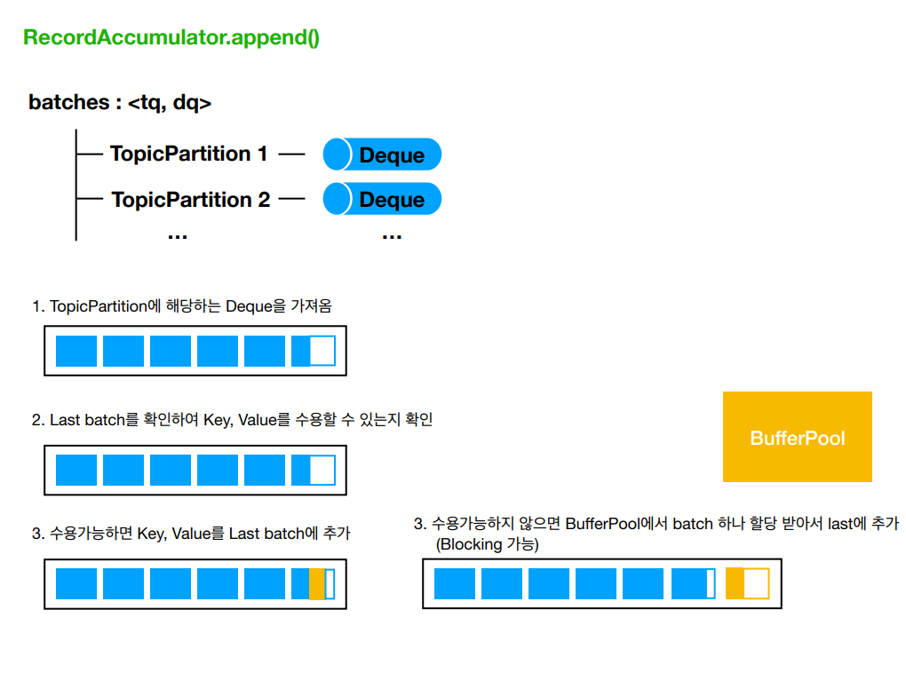
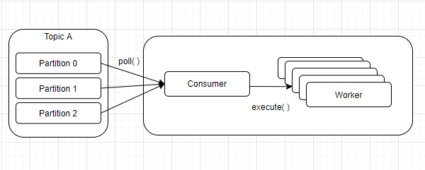
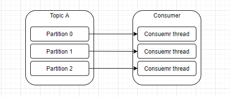
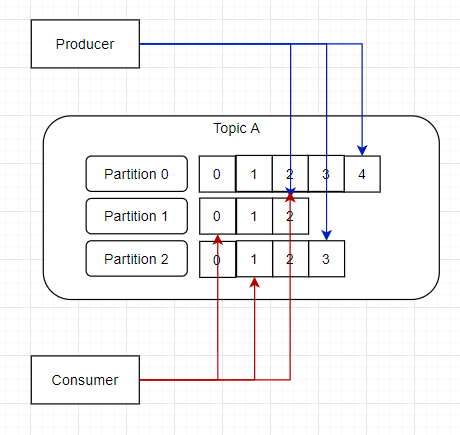
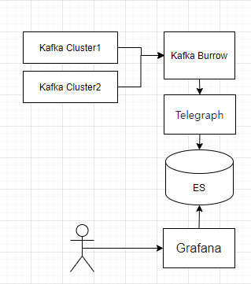
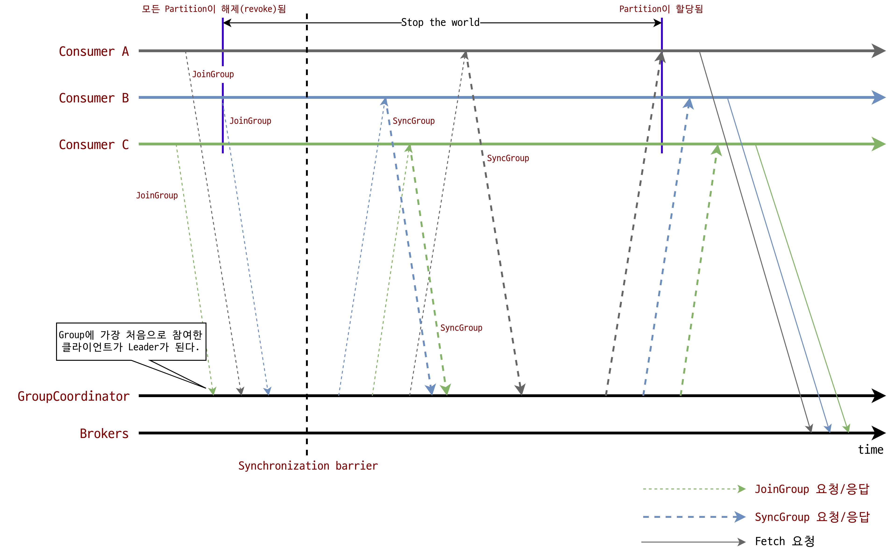
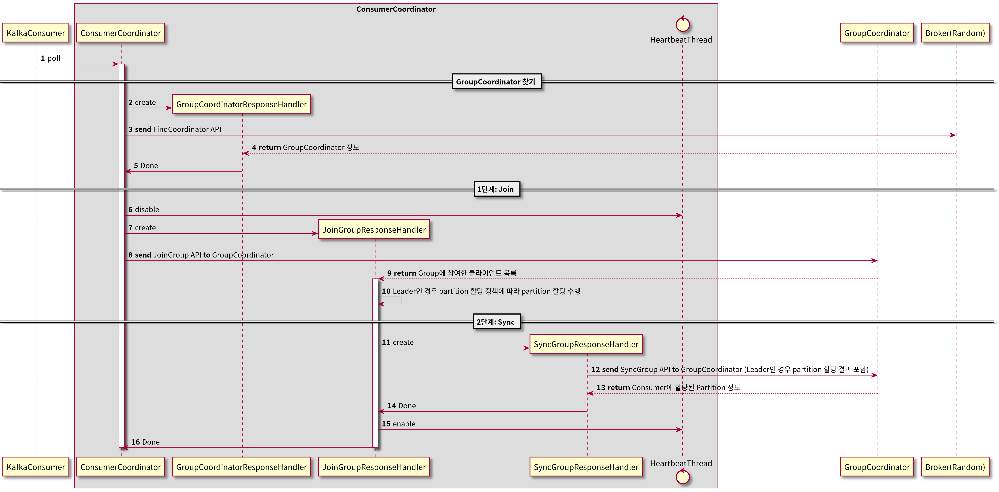

# Kafka 상세 개념

## 토픽과 파티션

- 언제 topic을 분리하고, 언제 topic을 합쳐야 하는가
  - 기본적으로 RDBMS의 entitiy 개념을 kafka에도 적용하여 서로 다른 entity는 서로 다른 topic에 저장한다.
  - 만일 message를 순서대로 처리해야 한다면 다른 entitiy라 하더라도 같은 topic에서 처리한다.
    - kafka는 오직 같은 토픽의 같은 파티션 내에서만 순서를 모장하기 때문이다.
  - 다른 entity라 하더라도 한 entity가 다른 entity에 의존적이라면, 같은 topic에 저장한다.
    - 혹은 의존적이지는 않더라도 둘이 자주 함께 처리 된다면, 같은 topic에 저장한다.
    - 반면에 서로 관련이 없거나, 서로 다른 팀에서 관리한다면 다른 topic에 저장한다.
    - 만일 한 entity가 다른 entity에 비해 message 양이 압도적으로 많다면, topic을 분리하는 것이 좋다.
    - 그러나 적은 message 양을 갖는 여러 entity는 하나의 topic으로 묶는 것이 좋다.
  - 하나의 event가 여러 entity와 관련된 경우 하나의 topic으로 묶는 것이 좋다.
    - 예를 들어 purchase라는 entity는 product, customer라는 entity와 관련이 있을 수 있는데, 이들은 하나의 topic에 묶어서 저장하는 것이 좋다.
    - 추가적으로, 위와 같은 경우 message 자체를 분리하지 말고 한 message에 넣는 것이 좋다.
    - 여러 entity로 조합된 message를 분리하기는 쉬워도 분리된 여러 message를 하나의 message로 합치는 것은 어렵기 때문이다.
  - 여러 개의 consumer들이 특정한 topic 들의 group을 구독하고 있다면, 이는 topic을 합쳐야 한다는 것을 의미한다.
    - 잘개 쪼개진 topic을 합치게 되면 몇몇 consumer들은 원치 않는 message를 받게 될 수도 있다.
    - 그러나 Kafka에서 message를 받아오는 작업은 비용이 매우 적게 들기 때문에, consumer가 받아오는 message의 절반을 사용하지 않는다고 하더라도, 이는 크게 문제가 되지 않는다.
    - 그러나, 상기했듯 한 entity가 다른 entity에 비해 message 양이 압도적으로 많다면(99.9 대 0.01 정도라면) 그 때는 분리하는 것을 추천한다. 


### 적정 파티션 개수

- 파티션 개수는 카프카의 성능과 관련이 있다.
  - 따라서 아래의 것들을 고려하여 적절한 파티션 개수를 설정해야 한다.
  - 컨슈머의 개수 또한 파티션의 개수와 일치시키는 것이 좋다.
    - 컨슈머의 개수가 파티션 보다 많을 경우 아무 파티션도 할당 받지 못한 컨슈머가 생겨 비효율적이다.
    - 컨슈머의 개수가 파티션 보다 적을 경우 하나의 컨슈머에 복수의 파티션이 할당되어 지연이 생길 수 있다.


- 데이터 처리량

  - 파티션 개수를 정할 때는 해당 토픽에 필요한 데이터 처리량을 측정하여 정하는 것이 중요하다.

    - 이 부분은 컨슈머의 개수와도 연관이 있다.

  - 데이터 처리 속도를 올리는 방법

    - 컨슈머가 실행되는 서버의 사양을 올리는 스케일업을 하거나 컨슈머 내부 로직 개선 등을 통해 컨슈머의 처리량을 늘린다.
    - 그러나 컨슈머 특성상 다른 시스템들과 연동되기 때문에 일정 수준 이상 처리량을 올리는 것은 매우 어렵다.
    - 데이터 처리 속도를 올리는 다른 방법은 컨슈머를 추가해서 병렬처리량을 늘리는 것이다.
    - 즉, 파티션 개수를 늘리고 파티션 개수만큼 컨슈머를 추가하는 것이다.

  - 데이터 처리량을 기반으로 파티션 개수 정하기

    - 기본적으로 아래 공식에 따라 개수를 정하면 된다.
    - `프로듀서가 전송하는 데이터량 < 컨슈머 데이터 처리량 * 파티션 개수(==컨슈머 개수)`
    - 예를 들어 프로듀서가 초당 1,000 레코드를 보내고, 컨슈머가 처리할 수 있는 데이터가 초당 100 레코드라면, 컨슈머 개수가 10개 일때, 최소한의 파티션 개수는 10개이다.
    - 파티션 개수만큼 컨슈머를 운영한다면 해당 토픽의 병렬처리를 극대화할 수 있다.
    - 만약 전체 컨슈머 데이터 처리량이 프로듀서가 보내는 데이터보다 적다면 컨슈머 렉이 생기고 데이터 처리 지연이 발생하게 된다.
    - 따라서 컨슈머 전체 데이터 처리량이 프로듀서 데이터 전송량보다 많아야 한다.
    - 단, 지연이 좀 발생해도 된다면 컨슈머 전체 데이터 처리량이 조금 더 적어도 상관 없다.

  - 파티션 개수를 늘리는 것만이 능사는 아니다.

    - 파티션 개수를 늘리게 됨에 따라 컨슈머, 브로커의 부담이 있기 때문이다.
    - 복제 파티션을 여러개로 설정했을 경우 프로듀서에서 데이터를 받아와서 해당 데이터를 파티션에 할당한 후 할당된 데이터를 복제 파티션에 복사하는 과정에서 시간이 오래 걸릴 수 있다.

    - 따라서 데이터를 처리할 때 지연 발생에 따른 서비스 영향도를 같이 고려하여 파티션 개수를 설정하는 것이 중요하다.


- 메시지 키 사용 여부
  - 파티션을 최초 생성할 때 보다는 파티션 개수를 증가시킬 때 고려할만한 사항이다.
  - 메시지 키 사용 여부는 데이터 처리 순서와 밀접한 연관이 있다.
    - 메시지 키는 기본적으로 메시지의 순서를 보장하기 위해 사용한다.
    - 프로듀서가 토픽에 레코드를 전송할 때 메시지 키의 해시값을 기반으로 파티션에 할당한다.
    - 파티션의 개수가 달리지면 이미 매칭된 파티션과 메시지 키의 매칭이 깨지고 전혀 다른 파티션에 데이터가 할당된다.
    - 그러므로 파티션 개수가 달라지는 순간에는 메시지 키를 사용하는 컨슈머는 특정 메시지 키의 순서를 더는 보장받지 못한다.
  - 메시지 키를 사용하고 컨슈머에서 메시지 처리 순서가 보장되어야 한다면 최대한 파티션의 변화가 발생하지 않는 방향으로 운영해야 한다.
    - 만약 위와 같은 상황에서 파티션의 개수를 변경해야 한다면 기존에 사용되던 메시지 키의 매칭을 그대로 가져가기 위해 커스텀 파티셔너를 개발하고 적용해야 한다.
    - 이러한 어려움 때문에 메시지 키별로 처리 순서를 보장하고자 할 때는 파티션 개수를 프로듀서가 전송하는 데이터양보다 더 넉넉하게 잡고 생성하는 것이 좋다.


- 파티션 개수 증가의 악영향

  - 파티션이 많아질 수록 처리해야 하는 파일도 증가한다.
    - 파티션은 각 브로커의 파일 시스템을 사용하기 때문에 파티션이 늘어나는 만큼 브로커에서 접근하는 파일 개수가 많아진다.
    - 그런데 운영체제에서는 프로세스당 열 수 있는 파일 최대 개수를 제한하고 있다.
    - 따라서 카프카 브로커가 접근하는 파일 개수를 안정적으로 유지하기 위해서는 각 브로커당 파티션 개수를 모니터링 해야한다.
    - 만약 브로커가 관리하는 파티션 개수가 너무 많다면 파티션 개수를 분산하기 위해 카프카 브로커 개수를 늘리는 방안도 같이 고려해야 한다.
  - 비가용성을 높일 수 있다.
    - 카프카는 고가용성을 위해 파티션의 복제 기능을 제공하며 원본 파티션과 복제 파티션은 각기 다른 브로커에 저장된다.
    - 프로듀서에서 데이터를 받아오고, 컨슈머에 데이터를 전송하는 등 직접적인 데이터 처리를 맡은 파티션을 리더, 데이터의 저장만 담당하는 파티션을 팔로워라 부른다.
    - 리더 파티션이 속한 브로커가 내려갈 경우 주키퍼가 새로운 리더 파티션을 선출하고, 브로커들 중 컨트롤러 역할을 맡은 브로커가 리더 파티션을 재분배한다.
    - 브로커가 정상적으로 종료될 경우, 컨트롤러는 파티션 리더를 순차적으로 하나씩 새로 선출하게되고 리더를 선출할 동안 해당 파티션은 사용할 수 없는 상태가 된다. 그러나 하나의 리더를 선출하는 데는 수 밀리 초 밖에 걸리지 않는다.
    - 그러나 브로커가 비정상적으로 종료될 경우, 해당 브로커에 있던 모든 리더 파티션이 일시에 사용 불가 상태가 된다.
    - 따라서 새로운 리더 파티션이 선출될 때 까지 기다려야 하는데(프로듀서, 컨슈머와 통신은 리더 파티션만 가능하다), 만일 새로 선출해야 하는 리더 파티션이 1,000개이고, 하나를 선출하는데 5ms가 걸린다고 가정했을 때 5초 동안 서비스가 사용 불가 상태가 되는 것이다.
    - 여기에 주키퍼가 각 파티션의 메타데이터를 읽고 쓰는 시간이 더해지면 더 긴 시간 동안 사용 불가 상태가 된다.
    -  예를 들어  broker_1에 리더 파티션 a,b,c가 있고,  broker_2에 리더 파티션의 복제 파티션 a,b,c가 있다고 가정해보자.
    - broker_1이 정상적으로 종료될 경우 a 파티션 리더 선출(b, c는 사용 가능), b 파티션 리더 선출(a, c는 사용 가능), c 파티션 리더 선출(a, b는 사용 가능)의 순서로 이루어져 리더가 선출 중인 파티션에만 접근이 불가능하다.
    - 그러나 broker_1이 비정상적으로 종료될 경우 리더 파티션 a, b, c가 모두 사용 불가 상태가 되어, a 파티션 리더 선출(b, c 사용 불가능), b 파티션 리더 선출(c 사용 불가능), c 파티션 리더 선출의 과정을 거쳐야만 모든 파티션이 사용 가능 상태가 되게 된다.

  - end-to-end latency를 증가시킬 수 있다.
    - end-to-end latency는 producer에서 broker로 메시지를 보낸 후부터 consumer에서 메시지를 소비할 때 까지의 기간을 말한다.
    - Kafka는 프로듀서에서 받아온 메시지가 모든 복제 파티션에 복제된 이후에 컨슈머에 메시지를 전송한다.
    - 따라서 복제 파티션의 개수가 늘어날수록 end-to-end latency가 증가하게 된다.
  - 파티션 수의 증가는 클라이언트 메모리가 보다 많이 요구된다.
    - 프로듀서는 마지막으로 브로커로 메시지를 보낸지 일정 시간이 지나거나, 메시지 용량이 일정 수준 찰 때 까지 메시지를 메모리에 축적했다가 한 번에 브로커로 메시지를 보낸다.
    - 이렇게 메시지를 축적하는 것을 버퍼링, 쌓인 데이터를 버퍼라 하는데 프로듀서는 각 파티션 당 버퍼를 가진다.
    - 따라서 파티션의 수가 늘어날 수록 버퍼도 증가하게 되고 메모리 사용량도 증가하게 된다.
    - 만일 메모리 사용량이 설정해준 사용량을 초과할 경우 프로듀서는 새로운 메시지를 버퍼에 쌓지 않거나, 기존 버퍼에 쌓인 메시지를 삭제해야 하는데 둘 다 좋은 선택은 아니다.
    - 컨슈머 역시 파티션당 메시지를 일괄적으로 가져오기에 파티션의 수가 많을 수록 더 많은 메모리가 필요해진다.
    - 따라서 클라이언트의 메모리 사용량도 고려하여 파티션의 개수를 정해야 한다.


### 토픽 정리 정책

- 토픽 정리
  - 토픽의 데이터는 일정 시간이 지났을 때, 혹은 일정 용량에 도달했을 때 삭제할 수 있고 아예 삭제를 하지 않을 수도 있다.
  - 토픽의 데이터 정리 정책은 크게 다음과 같다(`cleanup.policy` 옵션의 설정값).
    - delete: 데이터의 완전한 삭제
    - compact: 동일 메시지 키의 가장 오래된 데이터 삭제


- delete
  - 토픽의 데이터를 삭제할 때는 세그먼트 단위로 삭제를 진행한다.
    - 세그먼트는 데이터를 저장하는 명시적인 파일 시스템 단위로, 파티션마다 별개로 생성되며 세그먼트의 파일 이름은 오프셋 중 가장 작은 값이 된다.
    - `segment.bytes` 옵션으로 1개의 세그먼트 크기를 설정할 수 있다.
    - 세그먼트 크기가 `segment.bytes`에서 설정해준 값 보다 커지거나 설정해준 기간이 지난 경우에는 기존에 적재하던 세그먼트 파일을 닫고 새로운 세그먼트를 열어서 데이터를 저장한다.
  - 삭제 정책이 실행되는 시점은 시간 또는 용량이 기준이 된다.
    - `retention.ms`에 설정해 준 기간(밀리초)이 세그먼트 파일의 마지막 수정 시간 부터 현재까지의 시간을 넘어갈 경우 해당 세그먼트를 삭제한다.
    - `retention.bytes`에 설정한 토픽의 최대 크기를 넘어간 세그먼트를 삭제한다.
  - 삭제한 데이터는 복구가 불가능하다.


- compact
  - 일반적으로 생각하는 압축과는 다른 개념이다.
    - 여기서의 압축은 메시지 키별로 해당 메시지 키의 레코드 중 오래된 데이터를 삭제하는 것을 뜻한다.
    - 메시지 키를 기준으로 오래된 데이터를 삭제하기 때문에 삭제 정책과 다르게 1개 파티션에서 오프셋의 증가가 일정하지 않을 수 있다.
    - 예를 들어 1~5까지 오프셋이 있고 2,3,4가 동일한 메시지 키를가질 경우, 오프셋과 관계 없이 중간에 있는 2, 3번 오프셋의 레코드가 삭제될 수 있다.
    - 2,3,4가 동일한 메시지 키를 가지고 있는데 2,3이 4번에 비해 오래된 데이터이기 때문이다.
  - 압축 정책은 액티브 세그먼트(저장을 위해 열려 있는 세그먼트)를 제외한 나머지 세그먼트들에 한해서만 데이터를 처리한다.
    - 테일 영역은 브로커의 압축 정책에 의해 압축이 완료된 레코드들을 뜻한다.
    - 테일 영역의 레코드들은 클린(clean) 로그라고 부르는데, 이는 압축이 완료됐기 때문에 중복된 메시지 키가 없기 때문이다.
    - 헤드 영역의 레코드들은 더티(dirty) 로그라고 부르는데, 압축이 되기 전 레코드들이 있으므로 중복된 메시지 키가 있기 때문이다.
  - 더티 비율(dirty ratio)
    - 더티 영역의 메시지 개수를 데이터의 총 레코드 수(더티 영역 메시지 개수+클린 영역 메시지 개수, 액티브 세그먼트는 제외)로 나눈 비율을 뜻한다.
    - 만약 클린 영역에 3개의 레코드가 있고, 더티 영역에 7개의 레코드가 있다면 더티 비율은 0.3이다.
  - 데이터 압축 시작 시점은 `min.cleanable.dirty.ratio` 옵션을 따른다.
    - 만약 0.5로 설정할 경우 더티 비율이 0.5가 넘어가면 압축이 수행된다.
    - 0.9와 같이 크게 설정하면 한 번 압축을 할 때 많은 데이터가 줄어들어 압축 효과는 좋지만 0.9비율이 될 때까지 용량을 차지하므로 효율은 좋지 않다.
    - 반면 0.1과 같이 작게 설정하면 압축이 더 자주 일어나므로, 메시지 키의 최신 데이터만 유지할 수 있지만, 브로커에 부담을 줄 수 있다.


### ISR

- ISR(In-Sync-Replicas)
  - 리더 파티션과 팔로워 파티션이 모두 싱크가 된 상태를 뜻한다.
    - 즉 리더 파티션과 팔로워 파티션의 오프셋이 동일한 상태를 뜻한다.
  - 복제 개수가 2인 파티션을 생성했다고 가정해보자.
    - 리더 파티션 1개와 팔로워 파티션 1개가 존재한다.
    - 리더 파티션에 0~3의 오프셋이 있을 때, 팔로워 파티션에 동기화가 완료되려면 0~3까지 오프셋이 존재해야 한다.
    - 반면에 팔로워 파티션에 0~2까지 오프셋이 존재한다면 동기화가 완료된 것이 아니다.
  - 굳이 이러한 상태를 정의한 이유는 다음과 같다.
    - 프로듀서가 특정 파티션에 데이터를 저장하는 작업은 리더 파티션을 통해 처리한다.
    - 따라서 리더 파티션에 새로운 레코드가 먼저 추가되고, 오프셋이 증가하면 팔로워 파티션이 위치한 브로커는 리더 파티션의 데이터를 복제한다.
    - 팔로워 파티션이 리더 파티션으로부터 데이터를 복제하는 데 시간이 걸린다.
    - 따라서 리더 파티션에 데이터가 적재된 이후 팔로워 파티션이 복제하는 동안 리더 파티션과 팔로워 파티션간에 오프셋 차이가 존재하게 된다.
  - `replica.lag.time.max.ms`
    - 팔로워 파티션이 데이터를 복제하는지 확인하기 위해 리더 파티션은 `replica.lag.time.max.ms`값 만큼의 주기를 가지고 팔로워 파티션이 데이터를 복제하는지 확인한다.
    - 만약 팔로워 파티션이 `replica.lag.time.max.ms` 값 보다 더 긴 시간 동안 데이터를 가져가지 않는다면 해당 팔로워 파티션에 문제가 생긴 것으로 판단하고 ISR 그룹에서 제외한다.


- ISR과 새로운 리더 선출

  - ISR 그룹으로 묶인 파티션은 파티션에 존재하는 데이터가 모두 동일하다.
    - 따라서 ISR 그룹에 속한 팔로워 파티션은 새로운 리더 파티션으로 선출 될 자격을 가진다.
    - 반면에 ISR  그룹에 속하지 못한 팔로워 파티션은 새로운 리더 파티션으로 선출될 수 없다.
  - ISR인 파티션이 없을 경우
    - 만일 리더가 속한 브로커에 문제가 생겨 내려갈 경우 주키퍼는 ISR인 파티션 중에서 새로운 리더를 선출한다.
    - 그런데 ISR인 파티션이 없을 경우, 리더 파티션에 속한 브로커가 재시작될 때 까지 기다린다.
    - 따라서 해당 토픽을 사용하는 서비스는 브로커가 재시작될 때 까지 중단되게 된다.

  - `unclean.learder.election.enable`
    - 각 토픽별로 ISR이 아닌 팔로워 파티션을 리더 파티션으로 선출 가능한지 여부를 bool 값으로 준다.
    - 일부 데이터 유실이 발생하더라도 서비스를 중단하지 않고 지속적으로 토픽을 사용하기 위해서 ISR이 아닌 파티션을 리더로 선출하기 위해 사용한다.
    - 따라서 서비스의 무중단이 중요할 경우 true로, 데이터가 유실되면 안 되는 경우에는 false로 설정해야 한다.


## 카프카 프로듀서

### Producer architecture

> https://kafka.apache.org/31/javadoc/
>
> https://d2.naver.com/helloworld/6560422
>
> https://developer.ibm.com/articles/benefits-compression-kafka-messaging/

- Producer가 Broker로 메시지를 전송하는 과정.

  > KafkaProducer send()가 호출되면 무슨일이 발생하는가.

  - 직렬화
    - Serializer가 전달을 요청 받은 메시지를 직렬화하여 메시지의 키와 값을 byte array 형태로 변환한다.
    - Kafka에 내장되어 있는 serializer를 사용해도 되고, 직접 작성한 serializer를 사용할 수도 있다.
  - 파티셔닝
    - Partitioner가 topic의 어느 partition에 메시지를 보낼지 지정한다.
    - 전송할 partiton을 지정할 수 있다.
    - 전송할 partition을 지정해주지 않을 경우 DefaultPartitoner는 다음과 같이 동작한다.
    - Key값이 있을 경우 key 값의 hash 값을 이용해서 parittion을 할당한다.
    - Key 값이 없는 경우 sticky partitioner 방식(2.4이전에는 round-robin 방식)으로 parititon을 할당한다.
  - 압축
    - 설정된 포맷에 맞춰 메시지를 압축한다.
    - 압축을 함으로써 메시지를 borker로 보다 빠르게 전달 할 수 있게 되고, 브로커 내부에서 빠른 복제가 가능해지며, 저장 비용도 줄일 수 있다.

  | Type   | Compression ratio | CPU usage | compression speed | Network bandwidth usage |
  | ------ | ----------------- | --------- | ----------------- | ----------------------- |
  | gzip   | highest           | highest   | slowest           | lowest                  |
  | snappy | medium            | moderate  | moderate          | medium                  |
  | lz4    | low               | lowest    | fastest           | highest                 |
  | zstd   | medium            | moderate  | moderate          | medium                  |

  - 메시지 배치
    - Record Accumulator(RA)가 메시지를 buffer memory에 저장하는 역할을 맡는다.
    - `send()` 메서드가 호출된다고 바로 broker로 메시지가 전송되는 것은 아니다.
    - 모든 메시지를 하나씩 broker에 보내는 것은 네트워크 비용 측면에서 비효율적이므로, buffer memory에 메시지를 저장한 후, Sender가 batch로 전송한다.
    - 즉, 정확히는 `send()` 메서드가 호출됐을 때 실행되는 과정은 여기까지다.
  - 전달
    - Producer에서 Broker로 메시지를 전달하는 역할은 Sender가 맡는다.
    - Sender는 TCP 프로토콜을 통해 메시지를 broker의 reader partition으로 전송한다.


- Sticky partitioner
  - Kafka 2.4 버전부터 기본 partitioner로 설정됐다.
    - [KIP-480](https://cwiki.apache.org/confluence/display/KAFKA/KIP-480%3A+Sticky+Partitioner)에서 제안된 방식이다.
    - [Netflix](https://netflixtechblog.com/kafka-inside-keystone-pipeline-dd5aeabaf6bb)에서 custom partitioner로 사용하던 방식이다.
  - 더 적은 수의 요청(더 적은 수의 batch)에 더 많은 message를 담아서 보낼수록 효율적이다.
    - 기존의 default partitioner였던 round-robin 방식의 경우 batch에 메시지가 충분히 차지 않았는데도 요청을 보내 결과적으로 요청의 횟수가 많아지게 된다는 문제가 있었다.
  - Sticky partitioner의 경우, batch가 완료되기 전 까지 topic 내의 하나의 partition에만 할당되도록 한다.
    - 예를 들어 Topic A에 a, b, c 세 개의 partition이 있고, message가 3개라면 round-robin의 경우 a, b, c가 하나씩 메시지를 가져가게 되고, sendor는 3개의 batch(Aa, Ab, Ac)를 가져와 broker에 3번의 요청을 보낸다.
    - 또 3개의 message가 들어오면 다시 a, b, c가 하나씩 메시지를 가져가게 되고, sendor는 3개의 batch(Aa, Ab, Ac)를 가져와 broker에 3번의 요청을 보낸다.
    - 반면에 Sticky partitioner의 경우 세 개의 메시지를 Aa partition에 담는다.
    - Sendor는 해당 Aa batch를 가져와 broker에 한 번의 요청만 보낸다.
    - 또 3개의 message가 들어오면 이제 Ab partition에 담고, Sendor는 해당 Ab batch를 가져와 broker에 한 번의 요청만 보낸다.
    - 동일하게 6개의 message를 보냈지만, sticky는 단 두 번의 요청으로 가능한데 반해 round-robin은 6번의 요청을 보내야 한다.


- Record Accumulator

  - 사용자가 전송하려는 메시지는 먼저 `RecordAccumulator`에 저장된다.
  - `RecordAccumulator`는 `batches`라는 map을 가지고 있다.
    - key는 `TopicPartition`이고, value는 `Deque<RecoredBatch>`이다.
  - `RecordAccumulator`에 저장하기 전에 record의 serialized size를 검사한다.
    - 해당 size가 `max.request.size`의 설정값 또는 `buffer.memory`의 설정값보다 크면 `RecordTooLargeException`이 발생한다.
    - 크기가 문제가 없으면 `RecordAccumulator`의 `append()` 메서드를 통해 저장한다.
  - 성공적으로 `append()`메서드가 호출되면 `TopicPartition`(key)을 통해 deque(value)를 찾는다.
    - Deque의 last에서 RecordBatch 하나를 꺼내서 recored를 저장할 공간이 있는지 확인한다.
    - Queue가 아닌 deque를 사용하는 이유는 `append()`할 때 가장 나중에 들어간 RecordBatch를 꺼내서 봐야 하기 때문이다.
    - 여유 공간이 있으면 해당 RecordBatch에 record를 추가하고, 없으면 새로운 RecordBatch를 생성해서 last쪽으로 저장한다.

  

  - 새로운 RecordBatch를 생성할 때는 BufferPool에서 RecordBatch가 사용할 ByteBuffer를 받아온다.
    - BufferPool의 전체 size는 `buffer.memory` 설정에 의해 정해진다.
    - RecordBatch 생성에 필요한 buffer size 만큼의 여유가 없으면 할당이 blocking되고, Buffer Pool에서 용량에 확보될 때까지 `max.block.ms`에 설정한 시간만큼 기다린다.
    - `max.block.ms`에 설정한 시간이 초과해도 공간이 확보되지 않으면 TimeoutException이 발생한다.
  - RecordBatch 생성시 사용하는 buffer size는 `batch.size` 설정값과 저장할 record size 중 큰 값으로 결정된다.
    - 즉, record가 `batch.size`보다 작으면 하나의 RecordBatch에 여러 개의 record가 저장된다.
    - Record가 `batch.size`보다 크면 하나의 RecordBatch에 하나의 record만 저장된다.
  - `compression.type` 설정값에 압축 코덱이 지정되어 있는 경우 RecordBatch에 저장될 때 압축된다.


- Sendor Thread
  - `RecordAccumulator`에 저장된 record를 꺼내서 broker로 전송하고 broker의 응답을 처리하는 역할을 한다.
  - `RecordAccumulator`의 `drain()`메서드를 통해  각 broker별로 전송할 RecordBatch list를 얻을 수 있다.
    - `drain()`은 먼저 각 borker node에 속하는 TopicPartiton 목록을 받아온다.
    - 그리고 각 node에 속한 TopicPartition을 보면서 deque의 first쪽의 RecordBatch 하나를 꺼내서 RecordBatch list에 추가한다
    - 이렇게 node 단위로 RecordBatch list가 `max.request.size`를 넘지 않을 때까지 모은다.
    - 모든 node에 이 동작을 반복하면 node별로 전송할 RecordBatch list가 모인다.
    - 이렇게 모은 RecordBatch list는 하나의 ProducerRequest로 만들어져 broker node로 전송된다.
  - ProducerRequest는 InFlightRequets에 저장된다.
    - InFlightRequets는 key를 node로 가지고, value를 ProducerRequest의 deque로 가지는 map이다.
    - 그리고 저장된 순서대로 broker node로 전송이 이루어진다.
    - InFlightRequets deque의 size는 `max.in.flight.requests.per.connection` 설정값에 의해 정해진다.
    - 이 값은 KafkaProducer Client가 하나의 Broker로 동시에 전송할 수 있는 요청 수를 의미한다.
    - 요청이 실패할 경우 `retires`의 설정값이 1 이상이라면 재시도하는데, 이 때 `max.in.flight.requests.per.connection` 값이 1보다 크다면 순서가 바뀔 수 있다.
    - 따라서 순서가 중요한 경우에 `retires` 옵션을 1 이상으로 준다면, `max.in.flight.requests.per.connection`의 값은 반드시 1로 설정해야한다.
    - 이 경우 동시에 1개의 요청만 처리가 가능해지므로 어느 정도의 전송 성능 감소는 감수해야한다.
  - Broker는 하나의 connection에 대해서 요청이 들어온 순서대로 처리해서 응답한다.
    - 응답의 순서가 보장되기에 KafkaProducer client는 broker로부터 응답이 오면 항상 InFlightRequets deque의 가장 오래된 요청을 완료 처리한다.
    - ProducerRequest가 완료되면 요청에 포함되었던 모든 RecordBatch의 콜백을 실행하고, broker로부터의 응답을 Future를 통해 사용자에게 전달한다.
    - RecordBatch에서 사용한 ByteBuffer를 BufferPool로 반환하면서 Record의 전송 처리가 모두 마무리된다.


### acks

- acks 옵션
  - 이 옵션을 통해 프로듀서가 전송한 데이터가 카프카 클러스터에 얼마나 신뢰성 높게 저장될지 지정할 수있다.
    - acks 옵션은 0, 1, all(또는 -1)값을 가질 수 있다.
  - acks 옵션에 따라 성능이 달라질 수 있으므로 acks 옵션에 따른 카프카의 동작 방식을 상세히 알고 설정해야 한다.
    - 복제 개수가 1인 경우 acks 옵션에 따른 성능 변화는 크지 않다.
    - 그러나 실제로는 복제 개수가 2 이상으로 설정하는 경우가 대부분이기에 아래 내용들도 복제 개수가 2 이상인 경우를 가정해서 설명한다.


- acks=0
  - 프로듀서가 리더 파티션으로 데이터를 전송했을 때 리더 파티션에 데이터가 저장되었는지 확인하지 않는다.
    - 리더 파티션은 데이터가 저장된 이후에 데이터가 몇 번째 오프셋에 저장되었는지 리턴하는데, acks가 0으로 설정되어 있다면 이 리턴값을 받지 않는다.
    - 따라서 데이터의 전송 속도는 acks를 1이나 all로 했을 경우보다 훨씬 빠르다.
    - 데이터가 일부 유실이 발생하더라도 전송 속도가 중요한 경우에 사용한다.
  - 전송이 실패했을 때 재시도가 불가능하다.
    - 프로듀서에는 데이터의 전송이 실패했을 때 재시도를 할 수 있도록 `retires` 옵션을 설정할 수 있는데, acks가 0일 때 프로듀서는 전송을 하자마자 데이터가 저장되었음을 가정하고 다음 데이터를 전송하기 때문에 데이터 전송이 실패한 경우를 알 수 없다.
    - 따라서 `retries`가 아무리 높게 설정되어 있어도 재시도를 하지 않기 때문에 `retires` 옵션 값 자체가 무의미하다.
  - 데이터의 유실을 알 수 없다.
    - 프로듀서와 브로커 사이의 네트워크 오류나 브로커의 이슈 등으로 데이터가 유실되더라도 프로듀서는 리더 파티션으로부터 응답값을 받지 않기 때문에 지속적으로 다음 데이터를 보낸다.


- acks=1
  - 프로듀서가 보낸 데이터가 리더 파티션에 정상적으로 적재되었는지만 확인한다.
    - 리더 파티션에 데이터가 정상적으로 적재되었는지 여부를 응답으로 받기에 acks를 0으로 설정했을 때 보다는 전송 속도가 느리다.
    - 리더 파티션에 적재를 하지 못할 경우 `retries`에 설정한 횟수만큼 재시도한다.
  - 리더 파티션에 적재되었음을 확인하더라도 데이터 유실이 발생할 수 있다.
    - 복제 개수를 2 이상으로 운영할 경우 리더 파티션에는 적재가 되어도 팔로워 파티션에 동기화되지 않았을 수 있기 때문이다.
    - 만일 팔로워 파티션이 데이터를 복제하기 직전에 리더 파티션이 속한 브로커에 문제가 생길 경우 동기화되지 못한 일부 데이터가 유실된다.


- acks=all(또는 -1)

  - 프로듀서가 보낸 데이터가 리더 파티션과 팔로워 파티션에 정상적으로 적재되었는지 확인한다.

    - 팔로워 파티션까지 확인하므로 전송 속도는 acks가 0, 1일 때 보다는 느리다.

    - 그러나 일부 브로커에 장애가 발생하더라도 데이터 유실이 발생하지는 않는다.

  - `min.insync.replicas` 옵션값에 따라 데이터의 안정성이 달라진다.
    - `min.insync.replicas` 옵션은 프로듀서가 리더 파티션과 팔로워 파티션에 데이터가 적재되었는지 확인하기 위한 최소 ISR 그룹의 파티션 개수이다.
    - 예를 들어 1로 설정되어 있다면, ISR 그룹에 속한 파티션 중 하나를 확인하여 데이터의 적재 여부를 확인한다.
    - 이 경우 acks를 1로 했을 때와 동일한 동작을 하는데, 리더 파티션 역시 ISR 그룹에 속한 파티션이고, 리더 파티션에 가장 처음 적재가 이루어지기 때문이다.
    - 따라서 `min.insync.replicas` 옵션을 2 이상으로 설정해야 acks를 all로 설정하는 의미가 있다.
    
  - `min.insync.replicas` 옵션 설정시 주의 사항
    - 브로커의 개수보다 크거나 같게 주면 안된다.
    - 만일 `min.insync.replicas`이 3이고 리더와 팔로워 파티션의 총 개수가 2라면, 총 3개의 파티션을 확인해야 하는데 2개의 파티션밖에 존재하지 않으므로 Exception이 발생하게 된다.
    - 하나의 브로커가 버전 업그레이드 등 때문에 롤링 다운 타임이 생기면 잠시동안 해당 브로커는 사용할 수 없게된다. 이 때, `min.insync.replicas`이 3이고, 리더와 팔로워 파티션의 총 개수가 3이라면, 잠시 내려간 브로커에 속한 파티션에는 복제가 이루어질 수 없으므로 역시 `min.insync.replicas`를 충족시키지 못해 Exception이 발생한다.
    
  - 브로커가 3대일 경우 상용 환경에서 가장 안전한 세팅은 다음과 같다.

    - 토픽의 복제 개수는 3
    - `min.insync.replicas`를 2
    - `acks`는 all


- `acks`를 all로 줄 경우 원칙적으로는 replica partition에 복제까지 완료 되어야 적재를 성공한 것으로 판단한다.
  - 그러나 여기에는 함정이 있다.
    - 그것은 바로 몇 개의 replica partition에 복제를 완료해야 적재를 성공한 것으로 판단할지를 설정하지 않는다는 것이다.
  - `acks`를 all로 줬을 때의 이상적인 상황은 다음과 같다(broker가 3개이고, 1개의 leader partition과 2개의 follower partition이 있을 때).
    - leader partition에 message가 적재된다.
    - 두 개의 follower partition에 message가 복제된다.
    - 두 개의 follower partition이 적재가 완료되었다는 신호를 leader partition에 보낸다.
    - leader partition은 모든 follower partition으로부터 위 신호를 받으면 producer에 적재에 성공했다는 응답을 보낸다.
  - 그러나 `acks`를 all로 줬을 때 어떤 이유로 follower partition이 있는 broker들이 모두 내려갔다고 가정해보자.
    - leader partition에 메시지가 적재된다.
    - follower partition이 위치한 broker 두 대가 모두 내려갔으므로 leader partition은 복제할 필요가 없다고 보고 producer로 적재가 성공했다는 응답을 보낸다.
    - 결국 `acks`를 all로 설정한 목적인 data의 durability 보장은 달성되지 못한다.
  - `min.insync.replicas`
    - 위와 같은 상황을 방지하려면 `acks`를 all로 줬을 때 몇 개의 follower partition에 적재가 완료 되어야 성공으로 판단할지를 설정해줘야한다.
    - 이 값을 설정해주는 것이 바로 `min.insync.replicas` 옵션이다.
    - 이 옵션은 broker나 topic에서 설정해주는 값으로, producer 쪽 설정은 아니다.
    - 만일 이 옵션에 설정해준 값 만큼 복제를 성공하지 못할 경우 leader partition은 `NotEnoughReplicasException`나 `NotEnoughReplicasAfterAppendException`를 throw한다.
  - 따라서 `acks`를 all로 설정할 경우 반드시 `min.insync.replicas` 옵션도 고려해야한다.


### 멱등성 프로듀서

- 멱등성 프로듀서란
  - 프로듀서의 기본 동작 방식은 적어도 한번 전달(at least once delivery)이다.
    - 프로듀서가 클러스터에 데이터를 전송하여 저장할 때 적어도 한 번 이상 데이터를 적재할 수 있고 데이터가 유실되지 않음을 의미한다.
    - 다만 두 번 이상 적재할 가능성이 있으므로 데이터의 중복이 발생할 수 있다.
    - 예를 들어  acks=1일 경우 프로듀서가 브로커로 메시지를 보내고 리더 파티션에 정상적으로 적재는 되었지만 모종의 이유로 적재 완료되었다는 응답을 반환하지 못한 경우 프로듀서는 실패로 인식하고 다시 브로커로 메시지를 보내면 파티션에 중복 적재되게 된다.
  - 멱등성이란 여러 번 연산을 수행해도 동일한 결과를 나타내는 것을 뜻한다.
    - 멱등성 프로듀서는 동일한 데이터를 여러 번 전송하더라도 카프카 클러스터에 단 한 번만 저장됨을 의미한다.
    - 즉, 정확히 한 번 전달(exactly once delivery) 방식으로 동작하는 프로듀서이다.
  - 멱등성 프로듀서의 동작 과정 
    - 기본 프로듀서와 달리 데이터를 브로커로 전달할 때 PID(Producer unique ID)와 시퀀스 넘버(sequence number)를 함께 전달한다.
    - 시퀀스 넘버는 0부터 시작하여 숫자를 1씩 더한 값이 전달된다.
    - 브로커는 프로듀서의 PID와 시퀀스 넘버를 확인하여 동일한 메시지의 적재 요청이 오더라도 단 한 번만 데이터를 적재함으로써 프로듀서의 데이터는 정확히 한 번 브로커에 적재되도록 한다.
    - 즉 프로듀서가 중복 데이터를 보내지 않는 것이 아니라, 브로커가 중복 데이터를 적재하지 않는 것이다.
  - 멱등성 프로듀서는 동일한 세션에서만 정확히 한 번 전달을 보장한다.
    - 동일한 세션이란 PID의 생명 주기를 뜻한다.
    - 만약 멱등성 프로듀서로 동작하는 프로듀서 애플리케이션에 이슈가 발생하여 종료되고 애플리케이션을 재시작하면 PID가 달라진다.
    - 동일한 데이터를 보내더라도 PID가 달라지면 브로커 입장에서 다른 프로듀서 애플리케이션이 다른 데이터를 보냈다고 판단한다.
    - 즉 멱등성 프로듀서는 장애가 발생하지 않을 경우에만 정확히 한 번 적재하는 것을 보장한다.


- `enable.idempotence`
  - 멱등성 프로듀서를 위한 옵션이다.
    - 즉, 정확히 한 번 절달(exactly once delivery)을 위한 옵션이다.
  - true로 설정할 경우 정확히 한 번 적재하는 로직을 성립시키기 위해 프로듀서의 일부 옵션들이 강제로 설정된다.
    - 프로듀서의 데이터 재전송 횟수를 정하는 `retries` 값이 `Integer.MAX_VALUE`로 설정된다.
    - `acks` 옵션은 all로 설정된다.


- `OutOfOrderSequenceException`
  - 브로커에서 멱등성 프로듀서가 전송한 데이터의 PID와 시퀀스 넘버를 확인하는 과정에서 시퀀스 넘버가 일정하지 않은 경우 `OutOfOrderSequenceException`이 발생할 수 있다.
  - 이 오류는 브로커가 예상한 시퀀스 넘버와 다른 번호의 데이터 적재 요청이 왔을 때 발생한다.
  - `OutOfOrderSequenceException`이 발생했을 경우 시퀀스 넘버의 역전 현상이 발생할 수 있기에 순서가 중요한 데이터를 전송하는 프로듀서는 해당 Exception이 발생했을 경우 대응하는 방안을 고려해야 한다.


### 트랜잭션 프로듀서

- 트랜잭션 프로듀서란

  - 다수의 파티션에 데이터를 저장할 경우 모든 파티션에 저장된 모든 데이터에 대해 동일한 원자성을 만족시키기 위해 사용된다.
    - 원자성을 만족시킨다는 의미는 다수의 데이터를 동일 트랜잭션으로 묶음으로써 전체 데이터를 처리하거나 전체 데이터를 처리하지 않도록 하는 것을 의미한다.
    - 컨슈머는 기본적으로 프로듀서가 보내는 데이터가 파티션에 쌓이는 대로 모두 가져가서 처리한다.
    - 그러나 트랜잭션으로 묶인 데이터를 브로커에서 가져갈 때는 다르게 동작하도록 설정할 수 있다.

  - 트랜잭션 프로듀서를 사용하려면 아래와 같이 설정을 변경해줘야 한다.
    - `enable.idempotence`를 true로 설정.
    - `transactional.id`를 임의의 문자열 값으로 설정한다.
    - 그리고 컨슈머의 `isolation.level`을 `read_committed`로 설정하면 프로듀서와 컨슈머는 트랜잭션으로 처리 완료된 데이터만 쓰고 읽게 된다.


- 트랜잭션 프로듀서의 동작 과정
  - 트랜잭션은 파티션의 트랜잭션 레코드로 구분한다.
    - 트랜잭션 프로듀서는 사용자가 보낸 데이터를 레코드로 파티션에 저장할 뿐만 아니라 트랜잭션의 시작과 끝을 표현하기 위해 트랜잭션 레코드를 한 개 더 보낸다.
    - 트랜잭션 컨슈머는 파티션에 저장된 트랜잭션 레코드를 보고 트랜잭션이 완료(commit)되었음을 확인하고 데이터를 가져간다.
    - 트랜잭션 컨슈머는 커밋이 완료된 데이터가 있을 경우에만 데이터를 가져간다.
    - 만약 데이터만 존재하고 트랜잭션 레코드가 존재하지 않으면 아직 트랜잭션이 완료되지 않았다고 판단하고 데이터를 가져가지 않는다.
  - 트랜잭션 레코드는 실질적인 데이터는 가지고 있지 않으며 트랜잭션이 끝난 상태를 표시하는 정보만 가지고 있다.
    - 그러나 레코드의 특성은 그대로 가지고 있기에 파티션에 저장되어 오프셋을 한 개 차지한다.
  - 예시(A, B라는 두 개의 파티션이 있다고 가정)
    - 프로듀서가 A파티션에 v1이라는 메시지를 보낸다.
    - 컨슈머는 해당 메시지가 트랜잭션 레코드인지 확인한다.
    - 트랜잭션 레코드가 아니므로 메시지를 가져가지 않는다.
    - 프로듀서가 A파티션에 v2라는 메시지를 보낸다.
    - 컨슈머는 해당 메시지가 트랜잭션 레코드인지 확인한다.
    - 트랜잭션 레코드가 아니므로 메시지를 가져가지 않는다.
    - 프로듀서가 B파티션에 v3라는 메시지를 보낸다.
    - 컨슈머는 해당 메시지가 트랜잭션 레코드인지 확인한다.
    - 트랜잭션 레코드가 아니므로 메시지를 가져가지 않는다.
    - 프로듀서가 브로커에 commit이라는 트랜잭션 레코드를 전송한다.
    - 모든 파티션에 commit 레코드가 전송된다.
    - 컨슈머는 해당 메시지가 트랜잭션 레코드인지 확인한다.
    - 트랜잭션 레코드이므로 지금까지 모든 파티션에 쌓인 모든 레코드를 가져간다.


## 카프카 컨슈머

### Kafka Consumer architecture

> https://d2.naver.com/helloworld/0974525

- Kafka Consumer의 구성
  - Kafka Consumer는 아래 component들로 구성되어 있다.
    - ConsumerNetworkClient
    - SubscriptionState
    - ConsumerCoordinator
    - Fetcher
    - HeartBeatThread
  - HeartBeatThread를 제외한 모든 component는 Consumer의 생성과 함께 위 순서로 생성된다.
    - HeartBeatThread는 `poll()`메서드가 최초로 호출 됐을 때 ConsumerCoordinator에 의해 생성된다.
    - HeartBeatThread는 KafkaConsumer와는 별개의 스레드로 동작한다.


- ConsumerNetworkClient

  - Kafka Consumer의 모든 네트워크 통신을 담당한다.
    - 모든 요청은 비동기로 동작한다.
    - 따라서 ConsumerNetworkClient의 응답값은 RequestFuture 클래스로 확인한다.
  - ConsumerNetworkClient로 전달된 요청의 실제 처리는 NetworkClient를 통해 이루어진다.
    - NetworkClient는 비동기 네트워크 I/O를 담당하는 class이다.
    - 즉 ConsumerNetworkClient는 자신에게 전달된 모든 요청을 ClientRequest로 만들어 NetworkClient로 보낸다.
    - NetworkClient는 해당 request를 broker로 보내고 broker에서 받아온 응답을 ConsumerNetworkClient로 다시 보낸다.

  - ConsumerNetworkClient가 broker로 요청을 보내는 과정은 다음과 같다.
    - ConsumerNetworkClient의 `send()`메서드를 호출한다.
    - `send()`메서드는 broker로 보낼 모든 요청을 ClientRequest로 변환한다.
    - ClientRequest에는 요청이 완료되었을 때 호출될 RequestFuture가 포함되어 있다.
    - ConsumerNetworkClient는 ClientRequest를 NetworkClient에게 바로 보내지 않고, 내부 버퍼인 Unsent Map에 먼저 저장한다.
    - Unsent Map의 key는 요청을 보낼 broker이고, value는 ClientRequest의 리스트이다.
    - ConsumerNetworkClient의 `poll()`메서드가 호출되면 Unsent Map에 있는 ClientRequest들을 NetworkClient로 보내고, NetworkClient는 해당 요청을 broker로 전송한다.

  - ConsumerNetworkClient가 broker로부터 온 응답을 처리하는 과정은 다음과 같다.
    - Broker로부터 응답을 받은 NetworkClient는 ConsumerNetworkClient의 내부 queue인 pedingCompletion에  RequestFuture를 추가한다.
    - pedingCompletion에 추가된 RequestFuture는 ConsumerNetworkClient의 `poll()` 메서드가 호출될 때 `complete()` 메서드가 호출되어 완료 처리가 된다.


- SubscriptionState
  - Consumer가 소비하는 topic, partition, offset 정보를 추적 및 관리하는 역할을 한다.
  - 컨슈머의 그룹 관리 기능을 사용하기 위해서는 특정 토픽에 대해 구독 요청을 해야한다.
    - KafkaConsumer의 `subscribe()` 메서드를 통해 구독 요청을 할 수 있다.
    - 구독을 요청한 토픽 정보는 SubscriptionState의 subscription에 저장된다.
    - subscription에 저장된 토픽 정보는 리밸런스 과정에서 사용된다.
  - `assign()` 메서드를 통해 KafkaConsumer에 토픽 및 파티션을 할당할 수 있다.
    - `subscribe()` 메서드와 달리 `assign()` 메서드를 통해 토픽 및 파티션을 할당할 경우 컨슈머의 그룹 관리 기능을 사용하지 않는다.
    - 따라서 `assign()` 메서드를 직접 호출하여 수동으로 토픽, 파티션을 지정할 경우 **리밸런싱이 일어나지 않는다.**
  - `assign()`메서드를 통해 할당된 파티션은 초기 오프셋 값을 설정해줘야한다.
    - `seek()` 메서드를 통해 초기 오프셋값을 설정할 수 있다.
    - 초기 오프셋 값이 없으면 Fetch가 불가능한 파티션으로 분류된다.


- ConsumerCoordinator
  - 리밸런싱, 오프셋 초기화, 오프셋 커밋을 담당한다.
  - 모두 개별 주제로 다룰만한 분량이므로 따로 분리한다.


- Fetcher
  - Broker로부터 데이터를 가져오는 역할을 한다.
  - Consumer의 리밸런싱과 오프셋 초기화 과정이 끝나면 KafkaConsumer의 `poll()` 메서드를 통해 broker로부터 데이터를 가져올 수 있다.
  - Broker로부터 데이터를 가져오는 과정
    - `poll()` 메서드가 호출되면  Fetcher의 `fetchRecords()` 메서드가 호출된다. 
    - `fetchRecords()` 메서드는 내부 캐시인 nextInLineRecords와 completedFetches를 확인하여 브로커로부터 이미 가져온 데이터가 있는지 확인한다.
    - 데이터가 있는 경우에는 `max.poll.records` 값 만큼 레코드를 반환한다.
    - 없는 경우에는 Fetcher의 `sendFetches()` 메서드를 호출하고, Fetch API를 통해 파티션 리더를 가지고 있는 각 브로커에게 데이터를 요청한다.
    - KafkaConsumer는 Fetcher가 broker로부터 응답을 받을 때 까지 대기한다.
    - Fetcher가 브로커로부터 응답을 받으면 KafkaConsumer는 Fetcher의 `fetchRecords()` 메서드를 다시 호출하여 사용자에게 반환할 레코드를 가져온다.
    - KafkaConsumer는 레코드를 사용자에게 반환하기 전에 다음 poll 메서드 호출 시에 브로커로부터 응답을 대기하는 시간을 없애기 위해 Fetcher의 `sendFetches` 메서드를 호출한 후 레코드를 반환한다.
  - 관련 설정
    - `fetch.min.bytes`: Broker가 반환할 데이터의 최소값을 설정한다. 만일 당장 브로커에 이 만큼의 데이터가 없다면, 데이터가 누적되길 기다렸다 데이터를 반환한다.
    - `fetch.max.wait.ms`: `fetch.min.bytes`만큼 데이터가 없을 경우 데이터의 누적을 기다릴 시간이다. 만일 데이터가 `fetch.min.bytes` 만큼 누적되지 않았어도 여기에 설정해 준 값 만큼의 시간이 지나면 데이터를 반환한다.
    - `fetch.max.bytes`: Broker가 반환할 수 있는 데이터의 최대 크기이다. 만일 첫 번째 메시지가 이 값보다 크다면 이 설정은 무시되고 그냥 데이터를 보낸다.
    - `max.partition.fetch.bytes`: 각 partition 당 브로커가 반환할 수 있는 최대 데이터 크기이다. `fetch.max.bytes`와 마찬가지로 첫 번째 메시지가 이 값보다 크다면 이 설정은 무시되고 그냥 데이터를 보낸다.


- HeatBeatThread
  - 사전지식
    - `poll()`메서드는 `max.poll.intervals.ms` 이내에 호출되어야하며, 시간 내에 호출되지 않을 경우 해당 컨슈머는 정상이 아닌 것으로 판단하여 컨슈머 그룹에서 제외시킨다.
    - `session.timeout.ms` 내에 heartbeat이 도착하지 않으면 브로커는 해당 컨슈머를 그룹에서 제거한다.
    - Heatbeat 시간: Consumer의 중단 여부를 GroupCoodinator가 체크하는 시간.
    - Polling 간격: 이전 `poll()` 메서드의 호출로부터 다음 호출까지의 시간.
  - Kafka 0.10.0 이전에는 HeatBeat를 Consumer와 동일한 thread에 실행했다.
    - 이로 인해 아래와 같은 문제가 있었다.
    - [`poll()` + 가져온 message의 처리 시간]이  session timeout을 초과하면 컨슈머가 컨슈머 그룹에서 제외되는 문제
    - session timeout 내에 `poll()`을 호출하고, 이를 통해 받아온 message를 처리하고, heartbeat까지 보내야 하는데, [`poll()` + 가져온 message의 처리 시간]이 session timeout을 초과하면 heartbeat을 보낼 수 없다.
  - 위와 같은 문제를 해결하기 위해 백그라운드에서 동작하는 HeartBeatThread를 추가했다.
    - HearthBeatThread는 `heartbeat.interval.ms`에 설정된 간격으로 heartbeat를 전송한다.
    - `heartbeat.interval.ms`의 값은 항상 `session.timeout.ms`보다 작아야 하며, 일반적으로 1/3 이하로 설정한다.


- 오프셋 초기화

  - SubscriptionState의 `assign()` 메서드를 통해 할당된 파티션은 초기 오프셋 값이 없다.
  - 따라서 KafkaConsumer는 오프셋 초기화 과정(아래 과정)을 통해 초기 오프셋 값을 설정한다.

  - 초기 오프셋 값이 없는 경우 KafkaConsumer는 ConsumerCoordinator를 통해 커밋된 오프셋 값을 확인한다.
  - 커밋된 오프셋의 확인 요청을 받은 ConsumerCoordinator는 OffsetFetchResponseHandler를 생성한다.
  - ConsumerCoordinator는 OffsetFetch API를 통해 GroupCoordinator 역할을 하는 broker에게 커밋된 오프셋 정보를 요청한다.
  - 커밋된 오프셋 정보가 있는 경우
    - GroupCoordinator 역할을 하는 broker는 OffsetFetch API의 응답으로 ConsumerCoordinator의 OffsetFetchResponseHandler에 커밋된 오프셋 정보를 알려준다.
    - OffsetFetchResponseHandler는 해당 정보를 처리하여 ConsumerCoordinator로 넘긴다.
    - ConsumerCoordinator는 해당 정보를 SubscriptionState에 업데이트한다.
    - SubscriptionState에 업데이트된 오프셋 값은 Fetcher에 의해 파티션의 오프셋 초기값으로 설정된다.

  - 커밋된 오프셋 정보가 없는 경우

    - KafkaConsumer는 `auto.offset.reset` 설정에 따라 오프셋을 초기화한다.
    - ` earliest`, `latest`, `none` 중 하나의 값을 설정 가능하며 각기 파티션의 가장 처음 오프셋, 가장 마지막 오프셋, 오프셋 초기화하지 않음을 의미한다.
    - Fetcher는 파티션의 가장 처음 오프셋과 가장 마지막 오프셋을 알아내기 위해 특정 시간(timestamp)에 해당하는 오프셋을 조회하는 ListOffsets API를 활용한다.
    - ListOffsets API 요청에 timestamp를 -2로 설정하면 가장 처음 오프셋을 알 수 있고 timestamp를 -1로 설정하면 가장 마지막 오프셋을 알 수 있다. 
    - 따라서  `auto.offset.reset`가 `earliest`인 경우에는 ListOffsets API 요청에 timestamp를 -2로 설정하고 `latest`인 경우에는 timestamp를 -1로 설정한다.

    - Fetcher는 파티션의 가장 처음/마지막 오프셋을 알아내기 위해 파티션 리더 브로커로 ListOffsets API 요청을 보낸다.
    - 파티션 리더 브로커는 ListOffsets API 응답으로 timestamp에 해당하는 오프셋 정보를 알려준다.
    - 응답으로 받은 오프셋 값은 SubscriptionState의 `seek()` 메서드를 통해 파티션의 초기 오프셋으로 설정된다.


- 오프셋 커밋
  - `enable.auto.commit`이 true인 경우 KafkaConsuemr가 `auto.commit.interval.ms`마다 오프셋을 자동으로 commit한다.
  - 오프셋이 커밋되는 과정
    - KafkaConsumer의 `commitSync()` 메서드가 호출된다.
    - 내부적으로 `commitOffsetsSync(offset)` 메서드가 실행되어 ConsumerCoordinator로 요청을 보낸다.
    - ConsumerCoordinator는 OffsetCommitResponseHandler 를 생성하고, OffsetCommit API를 사용하여 GroupCoordinator에게 offset commit을 요청한다.
    - OffsetCommitResponseHandler는 GroupCoordinator로부터 받은 응답을 ConsumerCoordinator에게 전달한다.
    - ConsumerCoordinator는 KafkaConsumer에게 전달하면 offset commit이 완료된다.


### 멀티 스레드 컨슈머

- 컨슈머 개수
  - 파티션을 여러 개로 운영할 경우 병렬처리를 위해서 파티션 개수와 컨슈머 개수를 동일하게 맞추는 것이 가장 좋은 방법이다.
    - 즉, 파티션의 개수가 n개라면 동일 컨슈머 그룹으로 묶인 컨슈머를 최대 n개 운영하는 것이 가장 좋다.
  - n개의 컨슈머를 운영하는 방법
    - n개의 스레드를 가진 1개의 프로세스를 운영.
    - 1개의 스레드를 가진 n개의 프로세스를 운영.
  - 멀티 스레드로 컨슈머를 안전하게 운영하기 위해서는 고려해야 할 부분이 많다.
    - 멀티 스레드 애플리케이션으로 개발할 경우 하나의 프로세스 내부에 스레드가 여러 개 생성되어 실행되기 때문에 하나의 컨슈머 스레드에서 예외적 상황(e.g. OOM)이 발생할 경우 프로세스 자체가 종료될 수 있다.
    - 각 컨슈머 스레드 간에 영향이 미치지 않도록 스레드 세이프 로직을 적용해야 한다.
  - 멀티 스레드로 운영하는 방식은 크게 두 가지로 나뉜다.
    - 카프카 컨슈머 멀티 워커 스레드 전략: 컨슈머 스레드는 1개만 실행하고 데이터를 처리를 담당하는 워커 스레드를 여러 개 실행하는 방법
    - 컨슈머 멀티 스레드 전략:  `poll()`메서드를 호출하는 컨슈머 스레드를 여러 개 띄워서 사용하는 방법


- 카프카 컨슈머 멀티 워커 스레드 전략

  - `poll()`메서드를 호출하는 컨슈머 스레드는 1개만 생성하고, 컨슈머 스레드가 가져온 데이터를 데이터 처리를 담당하는 복수의 워커 스레드에 분배하는 방식

  

  - 주의사항
    - 스레드를 사용함으로써 데이터 처리가 끝나지 않았음에도 불구하고 커밋을 하기 때문에 리밸런싱, 컨슈머 장애 시에 데이터 유실이 발생할 수 있다.
    - 나중에 생성된 워커 스레드의 처리 시간이 더 짧을 경우 이전 레코드가 다음 레코드보다 나중에 처리될 수 있고, 이로 인해 레코드의 순서가 뒤바뀌는 레코드 처리의 역전 현상이 발생할 수 있다.
  - 아래와 같은 조건을 만족하는 서비스에 적합하다.
    - 중복이 발생하거나 데이터의 역전이 발생해도 되는 경우
    - 매우 빠른 처리 속도가 요구되는 경우


- 카프카 컨슈머 멀티 스레드 전략

  - `poll()`메서드를 호출하는 컨슈머 스레드를 복수로 띄워서 사용하는 방법

  

  - 각 스레드에 각 파티션이 할당되며 파티션의 레코드들을 병렬처리할 수 있다.


### 컨슈머 랙

- 컨슈머 랙(LAG)이란

  - 토픽의 최신 오프셋(LOG-END-OFFSET)과 컨슈머 오프셋(CURRENT-OFFSET)간의 차이.
    - 프로듀서는 계속해서 새로운 데이터를 파티션에 저장하고 컨슈머는 자신이 처리할 수 있는 만큼 데이터를 가져간다.
    - 프로듀서가 저장하는 데이터와 컨슈머가 가져가는 데이터가 불일치할 때 컨슈머 랙이 발생한다.
    - 프로듀서가 보내는 데이터양이 컨슈머의 데이터 처리량보다 크면 컨슈머 랙은 증가하고, 적으면 컨슈머 랙은 줄어든다.
    - 최소값은 0으로 지연이 없음을 뜻한다.
  - 컨슈머 랙은 컨슈머 그룹과 토픽, 파티션 별로 생성된다.
    - 아래 그림에서 partition 0,1,2의 컨슈머 랙은 모두 2로 동일하다.

  


- 컨슈머 랙 모니터링

  - 컨슈머 랙을 통해 컨슈머가 정상 동작하는지 여부를 확인할 수 있기 때문에, 컨슈머 랙은 컨슈머 애플리케이션을 운영한다면 필수적으로 모니터링해야 하는 지표이다.
    - 컨슈머 랙을 모니터링함으로써 컨슈머의 장애를 확인할 수 있다.
    - 파티션 개수를 정하는 데에 참고할 수 있다.
    - 만일 두 개의 파티션으로 구성된 토픽에 2개의 컨슈머가 각각 할당되어 있다고 가정할 때, 프로듀서가 보내는 데이터의 양은 동일한데 한 컨슈머에서 데이터 랙이 증가한다면 다른 컨슈머에 장애가 생겼음을 유추할 수 있다.

  - 컨슈머 랙을 확인하는 방법
    - 카프카 명령을 통해 확인
    - 컨슈머 애플리케이션에서 카프카 라이브러리를 통해 확인하는 방법
    - 외부 모니터링 툴을 사용하는 방법
  - kafka command line tool을 통해 컨슈머 랙 조회

  ```bash
  $ kafka-comsumer.groups.sh --bootstarp-server <호스트:포트> --group <그룹> --describe
  ```

  - 컨슈머 애플리케이션에서 카프카 라이브러리를 통해 확인하는 방법
    - Python의 경우 `metrics()` 메서드 사용(Java도 메서드명은 동일하다.)
    - 이 방법은 컨슈머가 정상적으로 동작할 때만 확인할 수 있다는 문제점이 존재한다.
    - 모든 컨슈머 그룹이 아닌 해당 컨슈머에 대한 정보만을 담고 있다는 문제점도 있다.

  ``` python
  from kafka import KafkaConsumer
  import json
  
  
  def deserializer_value(value):
      try:
          return json.loads(value)
      except Exception as e:
          print(e)
  
  
  consumer = KafkaConsumer('test',
                          bootstrap_servers='localhost:9092',
                          group_id='test-group',
                          value_deserializer=deserializer_value,
                          auto_offset_reset='earliest',
                          max_poll_records=1,
                          max_poll_interval_ms=3600000,
                          enable_auto_commit=True)
  
  for k,v in consumer.metrics().items():
      print(k)
      print(v)
  ```

  - 외부 모니터링 툴 사용
    - 데이터독(DataDog), 컨플루언트 컨트롤 센터(Confluent Control Center)와 같은 카프카 클러스터 종합 모니터링 툴을 사용.
    - 컨슈머 랙만을 모니터링 하기 위한 툴로 버로우(Burrow)가 있다.
    - 외부 모니터링 툴들은 클러스터와 연동되어 컨슈머의 데이터 처리와는 별개로 지표를 수집하기 때문에 데이터를 활용하는 프로듀서나 컨슈머의 동작에 영향을 미치지 않는다는 장점이 있다.


- 카프카 버로우

  - 링크드인에서 공개한 오픈소스 컨슈머 랙 체크 툴

  - REST API를 통해 컨슈머 그룹별 컨슈머 랙을 조회할 수 있다.

  | 메서드 | 호출 경로                                               | 설명                                            |
  | ------ | ------------------------------------------------------- | ----------------------------------------------- |
  | GET    | /burrow/admin                                           | 버로우 헬스 체크                                |
  | GET    | /V3/kafka                                               | 버로우와 연동 중인 카프카 클러스터 리스트       |
  | GET    | /v3/kafka/<클러스터 명>                                 | 클러스터 정보 조회                              |
  | GET    | /v3/kafka/<클러스터 명>/consumer                        | 클러스터에 존재하는 컨슈머 그룹 리스트          |
  | GET    | /v3/kafka/<클러스터 명>/topic                           | 클러스터에 존재하는 토픽 리스트                 |
  | GET    | /v3/kafka/<클러스터 명>/consumer/<컨슈머그룹 명>        | 컨슈머 그룹의 컨슈머 랙, 오프셋 정보 조회       |
  | GET    | /v3/kafka/<클러스터 명>/consumer/<컨슈머그룹 명>/status | 컨슈머 그룹의 파티션 정보, 상태 조회            |
  | GET    | /v3/kafka/<클러스터 명>/consumer/<컨슈머그룹 명>/lag    | 컨슈머 그룹의 파티션 정보, 상태, 컨슈머 랙 조회 |
  | DELETE | /v3/kafka/<클러스터 명>/consumer/<컨슈머그룹 명>        | 버로우에서 모니터링 중인 컨슈머 그룹 삭제       |
  | GET    | /v3/kafka/<클러스터 명>/topic/<토픽 명>                 | 토픽 상세 조회                                  |

  - 버로우의 기능 중 가장 돋보이는 것은 컨슈머와 파티션의 상태를 단순히 컨슈머 랙의 임계치(threshold)로 나타내지 않았다는 점이다.

    - 특정 파티션의 컨슈머 랙이 특정 시점에 100만이 넘었다고 컨슈머 또는 파티션에 이슈가 있다고 단정지을 수는 없다.
    - 프로듀서가 데이터를 많이 보내면 일시적으로 임계치를 넘어가는 현상이 발생할 수 있기 때문이다.

    - 따라서 버로우에서는 임계치가 아닌 슬라이딩 윈도우(sliding window) 계산을 통해 문제가 생긴 파티션과 컨슈머의 상태를 표현한다.

  - 컨슈머 랙 평가

    - 버로우에서 슬라이딩 윈도우 계산을 통해 컨슈머 랙의 상태를 표현하는 것을 컨슈머 랙 평가라고 부른다.
    - 컨슈머 랙과 파티션의 오프셋을 슬라이딩 윈도우로 계산하면 상태가 정해진다.
    - 파티션의 상태를 OK, STALLED, STOPPED로 표현하고, 컨슈머의 상태를 OK, WARNING, ERROR로 표현한다.

  - HTTP, 이메일 알람 모듈을 제공한다.

    - 그러나 데이터 적재 기능이 없기에 알람을 확인하고 상태를 확인한다면, 확인한 이후의 지표만 확인이 가능하다.
    - 따라서 별도의 저장소(ES 등) 혹은 대시보드(그라파나. 키바나 등)를 사용하는 것이 유지보수 시 편리하다.


- 컨슈머 랙 모니터링 아키텍처

  - 버로우, 텔레그래프, ES, 그라파나를 통해 컨슈머 랙 아키텍처를 설계.

  

  - 버로우
    - 실행 파일로 직접 설치하거나 도커를 사용하는 방법이 있다.
    - 설치 완료 후 `burrow.toml`에 버로우와 연동할 클러스터 정보를 입력한다.
  - 텔레그래프
    - 텔리그래프는 다양한 플러그인을 지원하는데 `input.burrow` 플러그인을 사용하면 일정 주기마다 버러우로 컨슈머 랙을 조회하고 컨슈머 랙 정보를 특정 장소에 적재할 수 있다.

  ```yaml
  [[inputs.burrow]]
    servers = ["http://<버로우 호스트>:<포트>"]
    topics_exclude = [ "__consumer_offsets" ]
    groups_exclude = ["console-*"]
  
  [[outputs.elasticsearch]]
    urls = [ "http://<ES 호스트>:<포트>" ]
    timeout = "5s"
    enable_sniffer = false
    health_check_interval = "10s"
    index_name = "burrow-%Y.%m.%d"
    manage_template = false
  ```

  - 키바나 
    - ES에 적재된 컨슈머 랙을 조회할 수 있도록 인덱스 패턴을 등록한다.
    - 추후 추가(p.237에 설명 있음)

  - 그라파나
    - 적재된 데이터를 조회하고 그래프로 그릴 수 있도록 그라파나를 설정한다.
    - 그라파나의 데이터 소스에 ES 정보와 설정한 인덱스 패턴을 넣어서 등록한다.
    - 추후 추가(p.237에 설명 있음)


### 컨슈머 배포 프로세스

- 중단 배포
  - 컨슈머 애플리케이션을 완전히 종료한 이후에 개선된 코드를 가진 애플리케이션을 배포.
    - 한정된 서버 자원을 운영하는 기업에 적합한데, 배포를 위해 유휴 장비를 추가하여 해당 장비에 배포후 기존 장비를 대체하는 것은 비효율적이기 때문이다.
    - 신뢰성 있는 배포 시스템을 가진 기업에서 중단 배포를 사용하는 것을 추천한다.
  - 중요한 점은 컨슈머 애플리케이션이 완전히 종료된 이후에 신규 애플리케이션이 배포된다는 점이다.
    - 기존 컨슈머 애플리케이션이 종료되면 더는 토픽의 데이터를 가져갈 수 없기 때문에 컨슈머 랙이 늘어나게 된다.
    - 따라서 배포에 이슈가 생겨 배포가 늦어질 수록 컨슈머 랙이 점점 증가하게 된다.
  - 재배포 전후의 오프셋이 특정된다는 장점이 있다.
    - 새로운 로직이 적용된 신규 애플리케이션의 실행 전후를 명확하게 특정 오프셋으로 나눌 수 있다.
    - 컨슈머 랙과 파티션별 오프셋을 기록하는 버로우를 사용하거나 배포 시점의 오프셋을 로깅하면 신규 로직 적용 전후의 데이터를 명확하게 구분할 수 있다.
    - 재배포 전후의 오프셋을 알 수 있으므로 신규 배포한 애플리케이션에서 이슈가 발생했을 때 롤백이 용이해진다.
    - 롤백을 통해 기존 애플리케이션으로 원복하고 데이터를 재처리하기 위해 오프셋을 기존 애플리케이션이 처리 완료했던 오프셋으로 재지정하면 되기 때문이다.


- 무중단 배포
  - 컨슈머의 중단이 불가능한 경우 애플리케이션을 중단하지 않고 신규 애플리케이션을 배포.
    - 인스턴스의 발급과 반환이 다소 유연한 가상 서버를 사용하는 경우 유용하다.
  - 블루/그린 배포
    - 이전 버전 애플리케이션과 신규 버전 애플리케이션을 동시에 띄워놓고 트래픽을 전환하는 방법
    - 파티션 개수와 컨슈머 개수를 동일하게 실행하는 애플리케이션을 운영할 때 유용하다.
    - 신규 애플리케이션을 배포하고 동일 컨슈머 그룹으로 파티션을 구돌하도록 실행하면 신규 버전 애플리케이션의 컨슈머들은 파티션을 할당 받지 못하고 유휴 상태로 기다릴 수 있기 때문이다.
    - 파티션 개수와 컨슈머 개수를 동일하게 운영하고 있지 않다면 일부 파티션은 기존 애플리케이션에 할당되고 일부 파티션은 신규 애플리케이션에 할당되어 섞이게 된다.
    - 신규 버전 애플리케이션이 준비되면 기존 애플리케이션을 중단하면 된다.
    - 리밸런싱이 발생하면서 파티션은 모두 신규 컨슈머와 연동된다.
    - 리밸런스가 한 번만 발생하기 때문에 많은 수의 파티션을 운영하는 경우에도 짧은 리밸런스 시간으로 배포를 수행할 수 있다.
  - 롤링 배포
    - 블루/그린 배포의 인스턴스 할당과 반환으로 인한 리소스 낭비를 줄이면서 무중단 배포를 할 수 있다.
    - 롤링 배포의 중요한 점은 파티션 개수가 인스턴스 개수와 같거나, 그 보다 많아야 한다는 점이다.
    - 예를 들어 파티션을 2개로 운영하는 토픽이 있다면 롤링 배포를 위해 최소한 2개의 인스턴스가 필요하다.
    - 2개의 인스턴스 중 1개의 인스턴스를 신규 버전으로 실행하고 모니터링한 이후 나머지 1개의 인스턴스를 신규 버전으로 배포하여 롤링 업그레이드를 진행할 수 있다.
    - 이 경우 리밸런스가 총 2번 발생한다.
    - 파티션 개수가 많을 수록 리밸런스 시간도 길어지므로 파티션 개수가 많지 않을 때 효과적인 방법이다.
  - 카나리 배포
    - 많은 데이터 중 일부분을 신규 버전의 애플리케이션에 먼저 배포함으로써 이슈가 없는지 사전에 탐지하는 방법.
    - 예를 들어 100개 파티션으로 운영하는 토픽이 있을 경우 1개 파티션에 컨슈머를 따로 배정하여 일부 데이터에 대해 신규 버전의 애플리케이션이 우선적으로 처리하는 방식으로 테스트할 수 있다.
    - 카나리 배포로 사전 테스트를 완료한 후 나머지 99개의 파티션에 할당된 컨슈머는 롤링 또는 블루/그린 배포를 수행하여 무중단 배포가 가능하다.


## 리밸런스

### 사전지식

- 컨슈머 제약사항
  - 1개의 파티션은 컨슈머 그룹 내의 1개의 컨슈머에만 접근이 가능하다.
  - 이는 컨슈머 그룹 내의 컨슈머 수는 토픽 내의 파티션 개수보다 많을 수는 없다는 것을 보장한다.
    - 파티션을 할당받지 못 한 컨슈머는 활동을 하지 않으므로, 더 정확히는 active consumer의 수가 파티션의 개수보다 많을 수 없다는 것을 보장한다.


- Group Coordinator
  - 컨슈머 그룹의 상태를 체크하고 파티션을 컨슈머와 매칭되도록 분배를 돕는 역할을 한다.
  - 클러스터 내 브로커 중 한 대가 Group Coordinator의 역할을 수행한다.


- Group Leader
  - 각 컨슈머 그룹 별 리더 Consumer.
  - 가장 먼저 컨슈머 그룹에 합류한 컨슈머가 컨슈머 리더가 된다.


- 리밸런스
  - 컨슈머 그룹 내의 컨슈머들끼리 파티션을 적절히 분배하는 프로세스
    - 파티션들을 컨슈머 그룹 내의 오직 한 컨슈머에만 할당되므로 만약 만약 파티션이나 컨슈머 구성에 변화가 생길 경우 재할당 해줘야 한다.
    - 이 재할당 과정을 리밸런스라 부른다.
  - 리밸런스가 일어나는 경우
    - 컨슈머 그룹이 토픽 구독을 시작할 경우.
    - 컨슈머가 구독 중이던 토픽이 삭제될 경우.
    - 컨슈머에 문제가 생긴 경우, 혹은 문제가 생겼다고 간주되는 경우(컨슈머가 `heartbeat.interval.ms` 내에 heatbeat을 보내지 못하거나 컨슈머가 `max.poll.interval.ms`내에 poll을 하지 못할 경우 등).
    - 새로운 파티션이 추가 될 경우.
    - Scaling Up and Down(새로운 컨슈머가 추가되거나 기존 컨슈머가 제거되는 경우).


### Kafka Rebalance Protocol

- Kafka Rebalance Protocol

  - Kafka 내부에서 rebalance를 실행하는 일련의 과정
  - 전체 과정

  > 사진 출처: https://d2.naver.com/helloworld/0974525

  

  - 상세 과정

  > 사진 출처: https://d2.naver.com/helloworld/0974525

  


- `GroupCoordinator` 찾기
  - 새로운 컨슈머가 생성되고 `poll()` 메서드를 실행하면 Kafka Rebalance Protocol이 시작된다.
    - `poll()` 메서드가 실행되면 컨슈머에 입력된 `group.id`를 바탕으로 자신이 속한 컨슈머 그룹을 찾기 시작한다.
  - `KafkaConsumer` 내부의 `ConsumerCoordinator` 인스턴스가 `GroupCoordinator`로 부터 받은 응답을 처리하기 위한 `GroupCoordinatorResponseHandler`를 생성한다.
  - 그 후 카프카 브로커들에게 `FindCoordinator API`를 활용하여 `GroupCoordinator` 정보를 받아오고 `GroupCoordinatorResponseHandler`가 이를 처리한다.


- `JoinGroup`

  - `GroupCoordinator`를 찾은 그룹 내 모든 컨슈머의 `ConsumerCoordinator`는 `JoinGroup API`를 통해 `GroupCoordinator`로 그룹 참여 요청을 보낸다.
    - `ConsumerCoordinator`는 `JoinGroup API` 요청을 보내기 전에 Heatbeat 스레드가 `JoinGroup`을 방해하지 못하도록 Heartbeat 스레드를 일시 정지시킨다.
    - 이 때, `GroupCoordinator`는 그룹에 합류하는 컨슈머들의 클라이언트 정보와 메터데이터(subscription 정보)를 수집한다.
  - `JoinGroup API`요청 예시
    - `sessionTimeout`: 컨슈머가 sessionTimeout 시간 내에 heartbeat 요청을 GroupCoordinator에 보내지 않으면 GroupCoordinator는 해당 컨슈머가 죽은 것으로 판단한다.
    - `rebalanceTimeout`:  그룹에 속한 컨슈머들은 리밸런스가 발생했을 때 rebalanceTimeout 이내에 JoinGroup 요청을 보내야 한다. rebalanceTimeout 이내에 JoinGroup 요청을 보내지 않은 컨슈머는 컨슈머 그룹에서 제외된다.

  ```json
  {
      type: JoinGroupRequest,
      groupId=testGroup,		// 컨슈머가 속할 그룹
      sessionTimeout=10000,	// session.timeout.ms를 통해 설정
      rebalanceTimeout=300000, // max.poll.interval.ms로 설정
      memberId=,
      protocolType=consumer,
      groupProtocols={	// 컨슈머가 구독하려는 토픽과 컨슈머가 지원하는 파티션 할당 정책이 포함
          name: range,	// partition.assignment.strategy로 설정
          metadata: topic1, topic2
  	}
  }
  ```

  - `JoinGroup API` 응답 예시

  ```json
  {
      error_code=0,
      generation_id=11,
      group_protocol=range,	// 파티션 할당 정책
      leader_id=consumer-1,
      member_id=consumer-1,	// 요청을 보낸 컨슈머의 id
      members=[				// 그룹 멤버 정보 
          {
              member_id=consumer-1,
              member_metadata=Subscription(topics=[topic1, topic2])
          },
          {
              member_id=consumer-2,
              member_metadata=Subscription(topics=[topic2, topic2])
          }
      ]
  }
  ```

  - 가장 먼저 컨슈머 그룹에 합류한 컨슈머가 리더 컨슈머가 된다.
    - 리더 컨슈머는 그룹 파티션 할당 정책에 따라 그룹 내 파티션을 할당한다.
    - 파티션 할당이 `GroupCoordinator`가 아닌 리더 컨슈머에 의해 이루어지는 이유는 `GroupCoordinator`는 결국 브로커이므로,  리밸런싱에서 `GroupCoordinator`의 역할을 축소시킴으로서 브로커의 코드를 단순화시킬 수 있기 때문이다.


- `SyncGroup`

  - 그룹에 참여하는 모든 컨슈머는 `SyncGroup API`요청을  `GroupCoordinator`에 보낸다.
    - 리더 컨슈머는 `SyncGroup API`요청에 파티션 할당 결과를 포함시켜 보낸다.
    - `GroupCoordinator`는 리더가 `SyncGroup API`요청에 담아 보낸 `groupAssignment`값을 토대로, `SyncGroup API`응답을 통해 컨슈머에 할당된 토픽, 파티션 정보를 보낸다.
    - 응답을 받은 컨슈머는 자신에게 할당된 토픽, 파티션 정보를 `SubscriptionState`의 `assign` 메서드를 사용하여 업데이트한다.
  - `SyncGroup API` 요청 예시

  ```json
  {
      type=SyncGroupRequest,
      groupId=testGroup,
      generationId=25,
      memberId=consumer-1,
      groupAssignment=(	// 리더 컨슈머만 이 정보를 가지고 있다.
          (memberId=consumer-1, assignment=Assignment(partitions=[topic1-0, topic1-1, topic2-0, topic2-1]))
          (memberId=consumer-2, assignment=Assignment(partitions=[topic1-2, topic2-2]))
      )
  }
  ```

  - `SyncGroup API` 응답 예시

  ```json
  {
      error_code=0,
      member_assignment=Assignment(partitions=[topic1-0, topic1-1, topic2-0, topic2-1]))
  }
  ```


- Stop The World

  - 그룹 내의 모든 컨슈머가 `JoinGroup` 요청을 보내면 각 컨슈머에 할당되었던 파티션이 헤제된다.
    - 따라서 이때 부터는 데이터의 처리가 불가능해진다.
  - 이는 첫 번째 컨슈머에 파티션이 할당될 때 까지 데이터 처리가 불가능한데, 이 현상을 Stop The World라 부른다.
  - 최신 Kafka 버전에서는 컨슈머 리밸런스 과정에서 KafkaConsumer 처리가 정지되는 Stop the world 현상을 없애기 위해 컨슈머 리밸런스 과정을 증분으로 진행하는 기능이 추가되었다.

  >[Design and Implementation of Incremental Cooperative Rebalancing](https://www.confluent.io/online-talks/design-and-implementation-of-incremental-cooperative-rebalancing-on-demand/)
  >
  >[Incremental Cooperative Rebalancing in Apache Kafka: Why Stop the World When You Can Change It?](https://www.confluent.io/blog/incremental-cooperative-rebalancing-in-kafka/)
  >
  >[KAFKA-8179: Incremental Rebalance Protocol for Kafka Consumer](https://issues.apache.org/jira/browse/KAFKA-8179)


