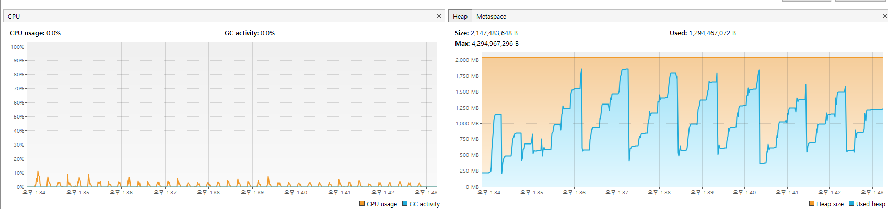
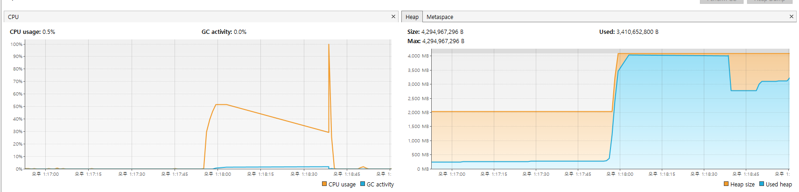
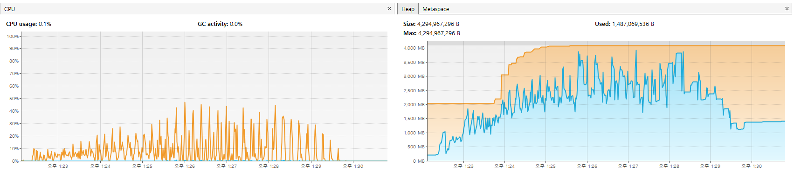

# Kafka Connect

- Kafka Connect
  - 프로듀서, 컨슈머 애플리케이션을 만드는 것은 좋은 방법이지만 반복적인 파이프라인 생성 작업이 있을 때는 매번 프로듀서, 컨슈머 애플리케이션을 개발하고 배포, 운영하는 것이 비효율적일 수 있다.
  - Kafka Connect는 특정 작업 형태를 템플릿으로 만들어 놓은 connector를 실행함으로써 반복 작업을 줄일 수 있다.
  - Connector
    - Pipeline 생성시 자주 반복되는 값들을 파라미터로 받는 connector를 코드로 작성하면 이후에 pipeline을 실행할 때는 코드를 작성할 필요가 없다.
    - Connector에는 프로듀서 역할을 하는 source connector와 컨슈머 역할을 하는 sink connector가 있다.
    - [컨플루언트 허브](https://www.confluent.io/hub)에서 다른 사람이 제작한 connector를 가져와서 사용할 수도 있고, 직접 제작하여 사용할 수도 있다.
  - Kafka Connect의 주요 component들을 아래와 같다.
    - Connector: data를 어떻게 integration할지를 정의한다.
    - Converter: data의 serialization과 deserialization을 담당한다.
    - Transform: message의 변환을 담당한다.


- Docker로 설치하기

  - Python script로 producer를 생성하여 broker로 메시지를 전송하고,  elasticsearch sink plugin를 사용하여 메시지를 elasticsearch에 색인하는 connect를 만들어보기
  - Docker hub에서 image 받기
    - Docker Hub에 kafka connect 이미지가 올라가 있지만 elasticsearch sink plugin을 설치한 custom connect를 사용할 것이므로 아래와 같이 base image를 받는다.

  ```bash
  $ docker pull confluentinc/cp-server-connect-base
  ```

    - Elasticsearch sink connector 받기

      > https://www.confluent.io/hub/confluentinc/kafka-connect-elasticsearch

      - 위 링크에서 zip 파일을 다운 받을 수 있다.
      - 혹은 지금 다운 받지 않고 dockerfile을 build할 때 설치하는 것도 가능하다.
  
  - Docker image 생성하기
    - 아래와 같이 dockerfile을 작성하고 image를 build한다.
  
  ```dockerfile
  # 위에서 zip 파일을 다운 받은 경우
  FROM confluentinc/cp-server-connect-base:latest
  COPY /<zip 파일 경로>/confluentinc-kafka-connect-elasticsearch-14.0.0.zip /tmp/confluentinc-kafka-connect-elasticsearch-14.0.0.zip
  RUN confluent-hub install --no-prompt /tmp/confluentinc-kafka-connect-elasticsearch-14.0.0.zip
  
  
  # 다운 받지 않은 경우
  FROM confluentinc/cp-server-connect-base:latest
  RUN confluent-hub install confluentinc/kafka-connect-elasticsearch:latest
  ```
  
  - docker-compose.yml 파일 작성하기
  
  > 전체 설정은 https://github.com/confluentinc/cp-demo의 docker-compose.yml 파일에서 확인 가능하다. 
  >
  > 설정에 대한 설명은 https://docs.confluent.io/platform/current/installation/docker/config-reference.html?utm_source=chatgpt.com에서 확인 가능하다.
  
  ```yaml
  connect:
      image: <위에서 build한 image명>
      container_name: connect
      restart: always
      ports:
        - 8083:8083
      environment:
        CONNECT_BOOTSTRAP_SERVERS: <kafka broker의 url list>
        CONNECT_GROUP_ID: "connect-cluster"
  
        CONNECT_CONFIG_STORAGE_TOPIC: connect-configs
        CONNECT_OFFSET_STORAGE_TOPIC: connect-offsets
        CONNECT_STATUS_STORAGE_TOPIC: connect-statuses
  
        CONNECT_CONFIG_STORAGE_REPLICATION_FACTOR: 1
        CONNECT_OFFSET_STORAGE_REPLICATION_FACTOR: 1
        CONNECT_STATUS_STORAGE_REPLICATION_FACTOR: 1
  
        CONNECT_KEY_CONVERTER: "org.apache.kafka.connect.json.JsonConverter"
        CONNECT_VALUE_CONVERTER: "org.apache.kafka.connect.json.JsonConverter"
        CONNECT_INTERNAL_KEY_CONVERTER: "org.apache.kafka.connect.json.JsonConverter"
        CONNECT_INTERNAL_VALUE_CONVERTER: "org.apache.kafka.connect.json.JsonConverter"
        CONNECT_REST_ADVERTISED_HOST_NAME: "localhost"
        CONNECT_PLUGIN_PATH: "/usr/share/java,/usr/share/confluent-hub-components"
  ```


- Distributed mode로 실행하기

  - 아래와 같이 Kafka connect 설정 파일을 작성한다.
    - 전체 설정은 [Confluent 문서](https://docs.confluent.io/platform/current/connect/references/allconfigs.html)에서 확인할 수 있다.
    - Connect를 실행할 때 인자로 설정 파일의 이름을 전달하면 된다.

  ```properties
  # connect-distributed.properties
  bootstrap.servers=localhost:9092
  
  group.id=connect-cluster
  
  key.converter=org.apache.kafka.connect.json.JsonConverter
  value.converter=org.apache.kafka.connect.json.JsonConverter
  
  key.converter.schemas.enable=true
  value.converter.schemas.enable=true
  
  offset.storage.topic=connect-offsets
  offset.storage.replication.factor=3
  
  config.storage.topic=connect-configs
  config.storage.replication.factor=3
  
  status.storage.topic=connect-status
  status.storage.replication.factor=3
  
  offset.flush.interval.ms=10000
  
  plugin.path=/usr/share/java
  ```

  - Kafka Connect를 distributed mode로 실행한다.

  ```bash
  $ /bin/connect-distributed connect-distributed.properties
  ```
  
  - Docker compose로 distributed mode로 실행하기
    - Cluster에 속한 worker들은 같은 `CONNECT_GROUP_ID`를 가져야한다.
    - `CONNECT_REST_ADVERTISED_HOST_NAME`는 다른 worker들과 통신할 때 사용하기 때문에 localhost가 아닌 반드시 외부에서 접근 가능한 host나 IP를 입력해야한다.
  
  ```yaml
  version: '3.2'
  
  
  services:
    connect1:
      image: confluentinc/cp-kafka-connect:7.5.3
      container_name: connect1
      restart: always
      ports:
        - 8084:8083
      environment:
        CONNECT_BOOTSTRAP_SERVERS: "kafka1:9092,kafka2:9092,kafka3:9092"
        CONNECT_GROUP_ID: "connect-cluster"
  
        CONNECT_CONFIG_STORAGE_TOPIC: connect-configs
        CONNECT_OFFSET_STORAGE_TOPIC: connect-offsets
        CONNECT_STATUS_STORAGE_TOPIC: connect-statuses
  
        CONNECT_CONFIG_STORAGE_REPLICATION_FACTOR: 1
        CONNECT_OFFSET_STORAGE_REPLICATION_FACTOR: 1
        CONNECT_STATUS_STORAGE_REPLICATION_FACTOR: 1
  
        CONNECT_KEY_CONVERTER: "org.apache.kafka.connect.json.JsonConverter"
        CONNECT_VALUE_CONVERTER: "org.apache.kafka.connect.json.JsonConverter"
        CONNECT_INTERNAL_KEY_CONVERTER: "org.apache.kafka.connect.json.JsonConverter"
        CONNECT_INTERNAL_VALUE_CONVERTER: "org.apache.kafka.connect.json.JsonConverter"
        CONNECT_REST_ADVERTISED_HOST_NAME: "connect1"
        CONNECT_PLUGIN_PATH: "/usr/share/java"
    
    connect2:
      image: confluentinc/cp-kafka-connect:7.5.3
      container_name: connect2
      restart: always
      ports:
        - 8085:8083
      environment:
        CONNECT_BOOTSTRAP_SERVERS: "kafka1:9092,kafka2:9092,kafka3:9092"
        CONNECT_GROUP_ID: "connect-cluster"
  
        CONNECT_CONFIG_STORAGE_TOPIC: connect-configs
        CONNECT_OFFSET_STORAGE_TOPIC: connect-offsets
        CONNECT_STATUS_STORAGE_TOPIC: connect-statuses
  
        CONNECT_CONFIG_STORAGE_REPLICATION_FACTOR: 1
        CONNECT_OFFSET_STORAGE_REPLICATION_FACTOR: 1
        CONNECT_STATUS_STORAGE_REPLICATION_FACTOR: 1
  
        CONNECT_KEY_CONVERTER: "org.apache.kafka.connect.json.JsonConverter"
        CONNECT_VALUE_CONVERTER: "org.apache.kafka.connect.json.JsonConverter"
        CONNECT_INTERNAL_KEY_CONVERTER: "org.apache.kafka.connect.json.JsonConverter"
        CONNECT_INTERNAL_VALUE_CONVERTER: "org.apache.kafka.connect.json.JsonConverter"
        CONNECT_REST_ADVERTISED_HOST_NAME: "connect2"
        CONNECT_PLUGIN_PATH: "/usr/share/java"
    
    connect3:
      image: confluentinc/cp-kafka-connect:7.5.3
      container_name: connect3
      restart: always
      ports:
        - 8086:8083
      environment:
        CONNECT_BOOTSTRAP_SERVERS: "kafka1:9092,kafka2:9092,kafka3:9092"
        CONNECT_GROUP_ID: "connect-cluster"
  
        CONNECT_CONFIG_STORAGE_TOPIC: connect-configs
        CONNECT_OFFSET_STORAGE_TOPIC: connect-offsets
        CONNECT_STATUS_STORAGE_TOPIC: connect-statuses
  
        CONNECT_REPLICATION_FACTOR: 1
        CONNECT_CONFIG_STORAGE_REPLICATION_FACTOR: 1
        CONNECT_OFFSET_STORAGE_REPLICATION_FACTOR: 1
        CONNECT_STATUS_STORAGE_REPLICATION_FACTOR: 1
  
        CONNECT_KEY_CONVERTER: "org.apache.kafka.connect.json.JsonConverter"
        CONNECT_VALUE_CONVERTER: "org.apache.kafka.connect.json.JsonConverter"
        CONNECT_INTERNAL_KEY_CONVERTER: "org.apache.kafka.connect.json.JsonConverter"
        CONNECT_INTERNAL_VALUE_CONVERTER: "org.apache.kafka.connect.json.JsonConverter"
        CONNECT_REST_ADVERTISED_HOST_NAME: "connect3"
        CONNECT_PLUGIN_PATH: "/usr/share/java"
  ```
  


- Distributed mode로 실행하면, connect group에 속한 connect 중 특정 connector에 문제가 생길 경우 task를 rebalancing한다.

  - 예를 들어 3개의 Kafka connect로 connect group을 실행 후, 아래와 같이 connector를 실행한다.

  ```bash
  $ curl -XPOST 'localhost:8083/connectors' \
  --header 'Content-type: application/json' \
  --data-raw '{
    "name": "mysql-cdc-source-connector",
    "config": {  
      "connector.class": "io.debezium.connector.mysql.MySqlConnector",
      "tasks.max": "1",
      "database.hostname": "mysql-host",
      "database.port": "3306",
      "database.user": "mysql-user",
      "database.password": "mysql-password",
      "database.server.id": "123456",
      "topic.prefix": "mysql-post",
      "database.include.list": "test",
      "table.include.list":"test.post",
      "schema.history.internal.kafka.bootstrap.servers": "kafka-host:9092",
      "schema.history.internal.kafka.topic": "schema-changes.post.test"
    }
  }'
  ```

  - Task의 상태를 확인한다.

  ```bash
  $ curl localhost:8083/connectors/mysql-cdc-source-connector/status
  
  # response
  {
    "name":"mysql-cdc-source-connector",
    "connector":{
      "state":"RUNNING",
      "worker_id":"11.22.33.44:8083"
    },
    "tasks":[
      {
        "id":0,
        "state":"RUNNING",
        "worker_id":"11.22.33.44:8083"
      }
    ],
    "type":"source"
  }
  ```
  
  - 해당 task를 실행하는 Kafka connect를 종료하고 다시 확인해보면 아래와 같은 상태가 된다.
    - `connector.status`와 `tasks.0.status`가 모두 `UNASSIGNED` 상태가 된다.
  
  ```bash
  $ curl localhost:8083/connectors/mysql-cdc-source-connector/status
  
  # response
  {
    "name":"mysql-cdc-source-connector",
    "connector":{
      "state":"UNASSIGNED",
      "worker_id":"11.22.33.44:8083"
    },
    "tasks":[
      {
        "id":0,
        "state":"UNASSIGNED",
        "worker_id":"11.22.33.44:8083"
      }
    ],
    "type":"source"
  }
  ```
  
  - `UNASSIGNED` 상태가 되었다고 바로 rebalancing이 발생하지는 않는다.
    - Kafka connect 설정 중 `scheduled.rebalance.max.delay.ms`(기본 값은 5분) 값은 group에서 이탈한 Kafka connect가 있을 경우, 해당 Kafka connect가 다시 복귀할 때 까지 얼마나 기다릴지를 설정한다.
    - 만약 설정한 시간까지 Kafka connect가 group에 다시 합류하지 않을 경우, group 내의 다른 Kafka connect에게 할당된다.


  - Sink connect 생성하기

    - Connect container 실행 후 connect API를 이용하여 elasticsearch sink connector를 생성한다.
      - Connector가 생성되면 `connect-<connector-name>` 형식으로 consumer group이 생성된다.
      - `topic.index.map` 옵션은 11 버전부터 삭제 됐다.

    ```bash
    $ curl -XPOST <kafka connect url>/connectors -H "Content-Type:application/json" -d '{
        "name":"elasticsearch-sink",
        "config":{
            "connector.class":"io.confluent.connect.elasticsearch.ElasticsearchSinkConnector",
            # 실행할 task(consumer)의 개수를 입력한다.
            "tasks.max":"1",
            # message를 받아올 topic을 입력한다.
            "topics":"<topic 명>",
            "connection.url":"<elasticsearch url>",
            "type.name":"log",
            "key.ignore":"true",
            "schema.ignore":"false",
            "value.converter.schemas.enable": "false"
        }
    }'
    ```

    - 잘 생성 되었는지 확인한다.

    ```bash
    $ curl <kafka connect url>/connectors/elasticsearch-sink/status
    ```

    - 요청 format
      - 위에서 `JsonConverter`를 사용한다고 명시했으므로 반드시 아래의 형식으로 보내야한다.
      - 최상단에 `schema`와 `payload` 필드가 위치해야하며, `schema`에는 이름 그대로 schema에 대한 정보가, `payload`에는 색인하고자 하는 문서를 입력하면 된다.

    ```json
    // 예시
    {
        "schema":{
            "type":"struct",
            "fields":[
                {
                    "type":"string",
                    "optional":"false",
                    "field":"name"
                },
                {
                    "type":"int64",
                    "optional":"false",
                    "field":"age"
                }
            ]
        },
        "payload":{"name":"John", "age":22}
    }
    ```

      - Python script 작성하기
        - 아래 script를 실행하면 message가 broker로 전송되고, elasticsearch sink connector가 해당 메시지를 가져가서 es에 적재한다.

    ```python
    from kafka import KafkaProducer
    from json import dumps
    
    TOPIC = "test"
    producer = KafkaProducer(acks=0, compression_type="gzip", bootstrap_servers=["kafka_broker_url"], \
                            value_serializer=lambda x: dumps(x).encode('utf-8'))
    try:
    	msg = {
    		"schema":{
                    "type":"struct",
                    "fields":[
                        {
                            "type":"string",
                            "optional":"false",
                            "field":"name"
                        },
                        {
                            "type":"int64",
                            "optional":"false",
                            "field":"age"
                        }
                    ]
                },
                "payload":{"name":"John", "age":22}
            }
        producer.send(TOPIC, value=msg)
        producer.flush()
    except Exception as e:
        print(e)
    ```


- Kafka Connect API

  | method   | endpoint                                              | description                                     |
  | -------- | ----------------------------------------------------- | ----------------------------------------------- |
  | `GET`    | /                                                     | 실행 중인 connect 정보 확인                     |
  | `GET`    | /connectors                                           | 실행 중인 connector 목록 확인                   |
  | `POST`   | /connectors                                           | 새로운 connector 생성                           |
  | `GET`    | /connectors/<connector 이름>                          | 실행 중인 connector 정보 확인                   |
  | `GET`    | /connectors/<connector 이름>/config                   | 실행 중인 connector 설정값 확인                 |
  | `PUT`    | /connectors/<connector 이름>/config                   | 실행 중인 connector의 설정값 변경               |
  | `GET`    | /connectors/<connector 이름>/status                   | 실행 중인 connector 상태 확인                   |
  | `POST`   | /connectors/<connector 이름>/restart                  | 실행 중인 connector 재시작                      |
  | `PUT`    | /connectors/<connector 이름>/pause                    | 실행 중인 connector 중지                        |
  | `PUT`    | /connectors/<connector 이름>/resume                   | 중지 된 connector 재실행                        |
  | `DELETE` | /connectors/<connector 이름>                          | 실행 중인 connector 종료                        |
  | `GET`    | /connectors/<connector 이름>/tasks                    | 실행 중인 connector의 task 정보 확인            |
  | `GET`    | /connectors/<connector 이름>/tasks/\<task id>/status  | 실행 중인 connector의 task 상태 확인            |
  | `POST`   | /connectors/<connector 이름>/tasks/\<task id>/restart | 실행 중인 connector의 task 재시작               |
  | `GET`    | /connectors/<connector 이름>/topics                   | Connector별 연동된 토픽 정보 확인               |
  | `GET`    | /connector-plugins                                    | Connect에 존재하는 connector 플러그인 목록 확인 |
  | `PUT`    | /connector-plugins/<플러그인 이름>/config/validate    | Connector 생성 시 설정값 유효성 확인            |


## Kafka connect worker configuration

> 모든 worker에 공통적으로 적용되는 설정이다.
>
> 전체 목록은 [링크](https://docs.confluent.io/platform/current/connect/references/allconfigs.html) 참조

- `bootstrap.server`
  - Kafka cluster에 연결하기 위한 `host:port`의 배열을 받는다.
  - 정보
    - Type: list
    - Default: [localhost:9092]


- `key.converter`
  - Connect data의 key에 사용할 converter class를 설정한다.
    - Source connector가 topic으로 key를 보낼 때와, sink connector가 topic에서 읽어올 때 모두 적용된다.
  - 정보
    - Type: class
    - Default: X


- `key.value`
  - Connect data의 value에 사용할 converter class를 설정한다.
    - Source connector가 topic으로 key를 보낼 때와, sink connector가 topic에서 읽어올 때 모두 적용된다.
  - 정보
    - Type: class
    - Default: X


- `offset.storage.file.filename`
  - Kafka connector들 중에는 상태를 저장해야 하는 connector가 있다.
    - 예를 들어 jdbc source connector를 사용할 때 mode를 timestamp 혹은 incrementing으로 설정할 경우 각각 `timestamp.column.name`, `incrementing.column.nam`의 값을 저장하고 있어야한다.
    - 따라서 이 값을 저장해둘 곳이 필요하다.
  - Kafka connect의 설정 파일(`connect-standalone.properties`)의 `offset.storage.file.filename` 설정은 위와 같은 값들을 저장할 파일의 경로를 지정하는 옵션이다.
    - 해당 경로에 파일을 생성하고, 생성한 파일에 상태를 저장한다.
    - 이 옵션은 오직 standalone mode에서만 설정이 가능하며, distributed mode에서는 설정할 수 없다.
  - Connector가 삭제되더라도 파일은 삭제되지 않으며, 파일에 저장된 상태도 삭제되지 않는다.


- `offset.flush.interval.ms`

  - Task에 대한 offset을 commit하는 주기를 ms 단위로 설정한다.
    - 기본 값은 60000이다.
    - 너무 길 경우 offset이 적절하게 이루어지지 않을 위험이 있고, 너무 짧을 경우 성능이 떨어질 수 있다.
  - Docker로 실행할 경우 아래와 같이 설정하면 된다.

  ```yaml
  services:
    kafka-connect:
      image: confluentinc/cp-kafka-connect:7.5.3
      container_name: kafka-connect
      environment:
        # ...
        CONNECT_OFFSET_FLUSH_INTERVAL_MS: 10000   # 10초마다 commit
  ```


## Converter

> https://www.confluent.io/blog/kafka-connect-deep-dive-converters-serialization-explained/#internal-converters

- Converter
  - Converter는 data의 serialization과 deserialization을 담당한다.
  - Converter가 필요한 이유
    - Kafka message는 byte일 뿐이다.
    - 각 message는 key/value 쌍으로 구성되며, key/value는 bytes로 Kafka에 저장된다.
    - Message를 byte로 저장하는 것은 message를 더 많은 곳에서 사용할 수 있게 하기 위함이다.
    - 반면에 이는 serializing해야하는 책임이 개발자에게 있다는 것을 의미하기도 한다.
  - Kafka Connect를 설정할 때 표준화 해야하는 것들 중 하나는 serialization format을 정하는 것이다.
    - Topic에 message를 쓸 때와 읽을 때 같은 serialization format을 사용해야한다.


- Serialization format을 선택할 때 고려할 사항들.
  - Schema
    - 대부분의 data들은 schema를 가지고 있다.
    - 일부 Avro와 Protobuf와 같이 schema 관련 기능들을 많이 지원하는 format이 있는 반면, JSON과 같이 덜 지원하는 format도 있다.
  - Ecosystem compatibility
    - Avro, Protobuf, JSON은 Kafka Connect가 속한 Confluent Platform 내에서 매우 일반적인 format이다.
    - 따라서 Schema Registry, ksqlDB 등 Confluent Platform에 속한 다른 tool들도 함께 사용해야한다면 위 format들을 사용하는 것이 나을 수 있다.
  - Message size
    - JSON은 plain text이면서, Kafka 자체 포함된 압축에 의존하는 반면, Avro와 Protobuf는 binary format이므로 message의 크기가 더 작아질 수 있다.
    - 따라서 message의 크기에 따라서도 적절한 converter가 달라질 수 있다.
  - Language support
    - 조직에서 주로 사용하는 언어가 특정 serialization format을 간편하게 다룰 수 있는지도 중요한 고려 사항 중 하나이다.


- JSON과 Schema

  - JSON 형식으로 message를 serialization하는 converter는 두 종류가 있다.
    - JSON(`org.apache.kafka.connect.json.JsonConverter`)과 JSON Schema(`io.confluent.connect.json.JsonSchemaConverter`)가 있으며, 두 방식은 유사한듯 하지만 큰 차이가 있다.
    - JSON Schema는 JSON과 달리 Schema Registry를 사용하는 방식이다.
  - JSON은 기본적으로 schema를 전달하지 않지만, Kafka는 JSON이 schema도 함께 전달할 수 있도록 아래 두 가지 방법을 지원한다.
    - JSON Schema converter를 사용하는 방식.
    - JSON converter를 사용하여 Kafka Connect가 제공하는 특별한 형식의 JSON을 사용하는 방식.
  - JSON converter
    - JSON converter를 사용할 경우 Kafka Connect는 JSON data를 schema와 payload라는 고정된 형식으로 serialization한다.
    - 모든 message에 schema 정보가 포함되므로 단일 message의 크기가 커질 수 있다는 단점이 있다.
    - 아래 예시는 JSON converter를 사용했을 때 message의 형식을 보여주는데, schema/payload 형식으로 구분되는 것을 확인 할 수 있다.

  ```json
  {
    "schema": {
      "type": "struct",
      "fields": [
        {
          "type": "int64",
          "optional": false,
          "field": "registertime"
        },
        {
          "type": "string",
          "optional": false,
          "field": "userid"
        },
        {
          "type": "string",
          "optional": false,
          "field": "regionid"
        },
        {
          "type": "string",
          "optional": false,
          "field": "gender"
        }
      ],
      "optional": false,
      "name": "ksql.users"
    },
    "payload": {
      "registertime": 1493819497170,
      "userid": "User_1",
      "regionid": "Region_5",
      "gender": "MALE"
    }
  }
  ```

  - JSON converter 사용시 `value.converter.schemas.enable` option
    - 만약 source로부터 받아오는 data가 schema가 있는 data라면 `value.converter.schemas.enable`을 true로 설정하면 message에 schema도 함께 담기게 된다.
    - 반면에 source로부터 받아오는 data가 schema가 있는 data라 할지라도 `value.converter.schemas.enable`가 false라면 message에 schema는 담기지 않는다.
    - 만약 schema가 없는 data를 `value.converter.schemas.enable` option을 true로 설정하여 가져오려 할 경우 error가 발생한다.
    - `key.converter.schemas.enable`도 마찬가지다.
  - 단 connector에 따라 `value.converter.schemas.enable`를 kafka connect container를 실행할 때 전역 설정으로 false로 설정해도 schema가 포함되는 경우가 있는데, JDBC source connector가 대표적이다.
    - 이는 JDBC source connector가 기본적으로 json converter를 사용하고, `value.converter.schemas.enable`를 활성화 한 상태로 실행되기 때문이다.
    - 그러나 이 경우에도, jdbc source connector를 생성할 때 `value.converter`를 `org.apache.kafka.connect.json.JsonConverter`로 설정하고, `value.converter.schemas.enable`를 false로 설정하면 schema가 포함되지 않는다.
    - `value.converter.schemas.enable`만 false로 설정하면 schema가 포함된다는 것에 주의해야 한다.
    
  - 예를 들어 아래와 같이 table 을 생성하고 data를 넣은 후에
  
  ```sql
  CREATE TABLE product (
    id INT NOT NULL,
    name VARCHAR(30) NOT NULL,
    updated_time TIMESTAMP NOT NULL default current_timestamp,
    PRIMARY KEY (id)
  );
  
  INSERT INTO product (id, name) VALUES (0, 'iPad');
  ```
  
  - 아래와 같이 설정하여 Kafka Connect를 실행하고

  ```properties
  value.converter=org.apache.kafka.connect.json.JsonConverter
  value.converter.schemas.enable=true
  ```
  
  - 이를 source connector로 가져오면 message의 value는 아래와 같이 구성된다.
  
  ```json
  {
  	"schema": {
  		"type": "struct",
  		"fields": [
  			{
  				"type": "int32",
  				"optional": false,
  				"field": "id"
  			},
  			{
  				"type": "string",
  				"optional": false,
  				"field": "name"
  			},
  			{
  				"type": "int64",
  				"optional": false,
  				"name": "org.apache.kafka.connect.data.Timestamp",
  				"version": 1,
  				"field": "updated_time"
  			}
  		],
  		"optional": false,
  		"name": "product"
  	},
  	"payload": {
  		"id": 0,
  		"name": "iPad",
  		"updated_time": 1704220634262
  	}
  }
  ```
  
  - 반면에 아래와 같이 설정하여 Kafka Connect를 실행하고

  ```properties
  value.converter=org.apache.kafka.connect.json.JsonConverter
  value.converter.schemas.enable=false
  ```
  
  - 이를 source connector로 가져오면 message의 value는 아래와 같이 구성된다.
    - schema/payload 구조가 아닌 row의 값만 가져오는 것을 확인할 수 있다.
  
  ```json
  {
  	"id": 0,
  	"name": "iPad",
  	"updated_time": 1704220634262
  }
  ```


## JDBC Connector

- JDBC Connector
  - JDBC driver를 사용하는 관계형 DB로부터 data를 가져와서 Kafka에 넣거나, Kafka에서 데이터를 가져와서 JDBC driver를 사용하는 관계형 DB로 넣을 수 있게 해주는 kafka connector이다.
    - 즉 source connector와 sink connector를 모두 지원한다.
  - Confluent에서 관리하고 있다.


- JDBC Connector 설치하기

  - 아래 사이트에서 JDBC connector를 다운 받는다.

  > https://www.confluent.io/hub/confluentinc/kafka-connect-jdbc

  - 아래 사이트에서 MySQL connector를 다운 받는다([참고](https://docs.confluent.io/kafka-connectors/jdbc/current/jdbc-drivers.html#mysql-server)).
    - MySQL connector는 JDBC 혹은 ODBC를 사용하는 application에서 MySQL에 접속할 수 있도록 connector를 제공한다(Kafka connector와는 다르다).
    - JDBC Connector에는 PostgreSQL과 SQLite에 접속하기 위한 driver는 포함되어 있지만, MySQL을 위한 driver는 포함되어 있지 않으므로 다운을 받아야한다.
    - 아래 사이트에서 Platform Independent를 선택하여 다운 받은 후 zip 파일을 풀면 나오는 `.jar` 파일을 위에서 받은 JDBC connector 내부의 `lib` 폴더에 추가한다.

  > https://dev.mysql.com/downloads/connector/j/

  - Kafka connector config file 수정하기
    - `connect.standalone.properties` file에서 아래 property들만 수정해준다.
    - 운영 환경에서는 `connect-distributed.properties` file을 사용하여 분산 실행하는 것이 권장된다.

  ```properties
  bootstrap.servers=localhost:29093
  key.converter=org.apache.kafka.connect.json.JsonConverter
  value.converter=org.apache.kafka.connect.json.JsonConverter
  key.converter.schemas.enable=true
  value.converter.schemas.enable=true
  offset.storage.file.filename=/tmp/connect.offsets
  offset.flush.interval.ms=10000
  plugin.path=/usr/share/java
  ```

  - 아래와 같이 `docker-compose.yml` file을 작성한다.
    - 위에서 받은 connector의 압축을 풀어서 나온 directory와 `connect.standalone.properties` file을 bind-mount한다.
    - MySQL driver는 결국 `/usr/share/java/confluentinc-kafka-connect-jdbc-10.7.4/lib` 경로에 들어가게 된다.

  ```yaml
  version: '3.2'
  
  
  services:
    mysql:
      image: mysql:latest
      container_name: mysql
      environment:
        - TZ=Asia/Seoul
        - POSTGRES_PASSWORD=1234
      ports:
        - 3307:3306
      networks:
        - etl
    
    zookeeper:
      container_name: zookeeper
      image: confluentinc/cp-zookeeper:latest
      environment:
        - ZOOKEEPER_CLIENT_PORT=2181
      networks:
        - etl
  
    kafka:
      image: confluentinc/cp-kafka:latest
      container_name: kafka
      environment:
        - KAFKA_ZOOKEEPER_CONNECT=zookeeper:2181
        - KAFKA_ADVERTISED_LISTENERS=PLAINTEXT://localhost:29093
        - KAFKA_OFFSETS_TOPIC_REPLICATION_FACTOR=1
      volumes:
        - ./confluentinc-kafka-connect-jdbc-10.7.4:/usr/share/java/confluentinc-kafka-connect-jdbc-10.7.4
        - ./connect-standalone.properties:/etc/kafka/connect-standalone.properties
      ports:
        - 9093:9092
      depends_on:
        - zookeeper
      networks:
        - test
  
  networks:
    test:
      driver: bridge
  ```

  - Container들을 실행한다.

  ```bash
  $ docker compose up
  ```


- Test용 data를 생성한다.

  - Database 생성

  ```sql
  CREATE DATABASE etl_test;
  ```

  - Table 생성

  ```sql
  CREATE TABLE product (
    id INT NOT NULL,
    name VARCHAR(30) NOT NULL,
    updated_time TIMESTAMP NOT NULL default current_timestamp,
    PRIMARY KEY (id)
  );
  ```

  - Data 삽입

  ```sql
  INSERT INTO product (id, name) VALUES (0, 'iPad');
  
  INSERT INTO product (id, NAME) VALUES (1, 'iPhone');
  
  INSERT INTO product (id, NAME) Vetl_testproductALUES (2, 'AirPods');
  ```


- Kafka Connect 실행하기

  - Kafka container에 attach한다.

  ```bash
  $ docker exec -it kafka /bin/bash
  ```

  - Kafka Connect를 실행한다.

  ```bash
  $ /bin/connect-standalone /etc/kafka/connect-standalone.properties
  ```

  - 정상적으로 실행됐는지 확인한다.
    - 정상적으로 실행됐다면, 위에서 추가한 JDBC source connector와 sink connector가 응답으로 올 것이다.

  ```bash
  $ curl localhost:8083/connector-plugins
  ```


- Source Connector 실행하기

  - 실행하기

  ```bash
  $ curl -XPOST 'localhost:8083/connectors' \
  --header 'Content-type: application/json' \
  --data-raw '{
    "name": "my-jdbc-source-connector",
    "config": {
      "connector.class": "io.confluent.connect.jdbc.JdbcSourceConnector",
      "connection.url": "jdbc:mysql://mysql:3306/etl_test",
      "connection.user": "root",
      "connection.password": "1234",
      "topic.prefix": "my-mysql-",
      "table.whitelist": "product",
      "mode":"bulk"
    }
  }'
  ```

  - 정상적으로 생성 됐는지 확인

  ```bash
  $ curl localhost:8083/connectors/my-jdbc-source-connector/status
  ```

  - Consumer를 통해 확인
    - Message가 잘 consuming되면 connector가 정상적으로 실행되는 것이다.

  ```sh
  $ /bin/kafka-console-consumer --bootstrap-server 127.0.0.1:29093 --topic my-mysql-product --from-beginning
  ```


- Source Connector의 주요 설정들

  - `mode`
    - `bulk`: table 전체를 bulk한다.
    - `incrementing`: 각 table에서 증가하는 column을 기준으로 새롭게 추가된 row들만 추출하며, 수정되거나 삭제 된 row들은 추출이 불가능하다(`incrementing.column.name`으로 column을 지정할 수 있다).
    - `timestamp`: timestamp-like column을 사용하여 새로 추가되거나 변경된 row들을 추출한다.
    - `timestamp+incrementing`: timestamp-like column을 사용하여 추가 되거나 변경된 row들을 탐지하고, 점차 증가하는 고유한 column을 사용하여 각 row들이 고유한 stream offset을 할당 받을 수 있게 한다.
  
  
    - `connection` 관련 옵션들
      - `url`: JDBC connection URL을 작성하며, RDBMS의 종류에 따라 형식이 다를 수 있다.
      - `user`: JDBC connection user를 설정한다.
      - `password`: JDBC connection password를 설정한다.
  
  
  - `table` 관련 옵션
      - 기본적으로 JDBC source connector는 system table이 아닌 모든 table을 대상으로 data를 가져온다.
      - 그러나, `table.whitelist` 혹은 `table.blacklist`를 통해 data를 가져올 table을 설정할 수 있다.
      - 둘 중 하나의 값만 설정이 가능하다.
      - 두 설정 모두 컴마로 구분 된 table명을 String으로 받는다(e.g. `"Product, User, Email"`)
      - `table.whitelist`: data를 가져올 table들을 나열한다.
      - `table.blacklist`: data를 가져오지 않을 table들을 나열한다.
  - `query`
      - 수집 대상 row들을 조회하는 query를 설정한다.
      - Query에 table도 지정하므로, 이 값을 설정하면 모든 table에서 data를 가져오지는 않는다.
      - 일반적으로 특정 row만 수집하고자 하거나, table들을 join하거나, table 내의 일부 column들만 필요할 경우 사용한다.
      - `mode`가 `bulk`일 경우 `WHERE` 절을 사용할 수 있으며, 다른 `mode`를 사용할 경우 가능할 수도 있고, 불가능 할 수 도 있다.
  - `poll.interval.ms`
      - 각 table에서 새로운 data를 가져올 주기를 ms단위로 설정한다.
      - 마지막 polling이 끝난 시점부터 주기를 계산한다.
      - 기본값은 100ms이다.
  - `dialect.name`
      - Connector에서 사용할 DB dialect을 설정한다.
      - 아무 값도 주지 않을 경우 빈 문자열(`""`)이 설정되며, 이 경우 `connection.url`에 설정된 JDBC URL 값에서 DB를 확인하고 dialect을 결정한다.
  - `batch.max.rows`
      - DB에서 한 번에 읽어올 최대 row의 수를 제한하는 설정이다.
      - 기본값은 100이다.
      - JDBC의 fetch size로 사용된다.
      - 주의할 점은 일부 JDBC driver(MySQL, Oracle)는 기본적으로 `batch.max.rows` 설정을 무시하고 전체 데이터를 한 번메 메모리에 로드한다.
      - 따라서 이 값을 설정해도 전체 데이터를 한 번에 조회하고 메모리에 로드해서 OOM이 발생할 수 있다.
      - 그러므로 이 JDBC driver들에는 별도의 설정을 추가해야 하는데, MySQL의 경우 `useCursorFetch`와 `defaultFetchSize`를 설정해줘야한다.
  
  
  ```json
  {
      "connection.url": "jdbc:mysql://localhost:3306/my_db?useCursorFetch=true&defaultFetchSize=10",
      "mode": "bulk",
      "query": "SELECT * FROM product",
      "batch.max.rows": 10,
      // ...
    }
  }
  ```


- 제약조건
  - incrementing
    - 정수 타입만 설정 가능하다.
    - 엄격히 증가하는 값이어야한다.
    - incrementing_column으로 사용하려는 column의 값은 scale이 0이어야한다.
  - incrementing, timestamp
    - incrementing_column, timestamp_column으로 사용하려는 column의 값 중 null이 있으면 안 된다(`validate.non.null` 설정으로 변경 가능하다).
  - JDBC source connector를 생성할 때, `query`를 설정할 경우  JDBC source connector는 이 SQL을 감싸서 아래와 같이 SQL을 다시 생성한다.
  
  ```sql
  SELECT ... FROM <user_query>;
  ```
  
  - 만약 bulk 이외의 모드를 주면 위 query에 where절을 추가한다.
  
  ```sql
  SELECT ... FROM <user_query> where <columne_name> > ?;
  ```
  
  - 따라서 `incrementing.column.name`, `timestamp.column.name`을 설정할 때는 자신이 입력한 SQL에 포함되어 있는 column name을 그냥 설정하면 안된다.
    - `query`에 SQL문을 설정할 때 `incrementing.column.name`, `timestamp.column.name`으로 사용할 column에는 alias를 걸고, `incrementing.column.name`, `timestamp.column.name`에도 alias로 설정한 column name을 넣어야한다.


- JDBC connector에 JDBC driver 추가하기
  - JDBC connector에는 기본적으로 다양한 DB에 연결하기 위한 JDBC driver가 내장되어 있다.
    - 그러나 JDBC connector에 포함되어 있지 않은 driver를 추가해야 하는 경우가 있을 수 있다.
    - 만약 연결하고자하는 DB에 해당하는 JDBC driver`No suitable driver found for <jdbc_url>`과 같은 error가 발생할 수 있다.
    - 예를 들어 Tibero에 연결해야 하는 경우 Tibero에 연결하기 위한 JDBC driver가 JDBC connector에 포함되어있지 않으므로, 추가를 해줘야한다.
  - `<JDBC_connector_dir>/lib` 내부에 JDBC driver를 추가하면 된다.
    - 추가한 후에는 Kafka Connect를 재실행해야한다.


## Camel Kafka Connector

- Camel Kafka Connector
  - Apache 재단에서 관리하는 Kafka connector들을 개발하는 repository이다.
  - git, jdbc, docke, minio 등을 포함하여 많은 수의 connector를 개발 중이다.


- Camel Kafka Connector 실행하기

  - 대부분의 camel kafka connector는 아래와 같은 과정을 거쳐 실행할 수 있다.
    - Connector의 종류마다 약간씩 다를 수 있다.

  - camel-kafka-connector repoistory를 clone 받는다.

  ```bash
  $ git clone https://github.com/apache/camel-kafka-connector.git
  ```

  - 그 후 사용하려는 connector가 있는 folder로 이동 후 connector를 build한다.
    - `target` directory에 `<connector-version>-package.tar.gz` file이 생성된다.
    - 버전에 따라 이 방식으로 안 되는 경우도 있다.
    - Build하고 압축을 풀어 kafka connect package가 모여 있는 곳에 build한 folder를 넣어도 kafka connect 실행시 plugin을 인식하지 못하는 경우가 있다.
    - 안 될 경우 아래에 나온 것 처럼 site에서 package file을 받는 방식을 사용해야 한다.

  ```bash
  $ mvn clean package
  ```

  - 혹은 위와 같이 직접 build하지 않고 아래 site에서 package file을 받을 수도 있다.

    > https://camel.apache.org/camel-kafka-connector/3.20.x/reference/index.html

  - 준비된 packag file을 Kafka connect package가 모여 있는 곳으로 옮긴 후 압축을 푼다.

    - `connect-distributed.properties` 혹은 `connect-standalone.properties` 중 사용하려는 property file의 `plugin.path`에 설정된 경로에 넣으면 된다.

  ```bash
  $ unzip <package>.tar.gz
  $ tar -xvf <package>.tar.gz
  ```

  - Kafka connect를 실행한다.

  ```bash
  $ /bin/connect-standalone /etc/kafka/connect-standalone.properties
  ```

  - 각 connector에 맞는 양식으로 connector 생성 요청을 보낸다.
    - 예시는 [예시를 작성해둔 repository](https://github.com/apache/camel-kafka-connector-examples/tree/main)나 package의 압축을 풀었을 때 함께 풀린 `docs` directory에서 볼 수 있다.
    - `${각 connector home dir}/src/generated/resources/${connector_name}.json`에서 확인할 수 있다.

  ```properties
  $ curl -XPOST 'localhost:8083/connectors' \
  --header 'Content-type: application/json' \
  --data-raw '{
    "name": "<connector-name>",
    "config": {
      "connector.class": "<connector-class>",
      # 설정들
    }
  }'
  ```


## Custom Connector

- Custom Source Connector 생성하기

  - Custom source connector를 생성하기 위해서는 두 개의 class를 구현해야한다.
    - 추상 클래스인 `SourceConnector`를 상속 받는 source connect class
    - 추상 클래스인 `SourceTask`를 상속 받는 source task class
    - 이 때,  `SourceConnector`는 `Connector`를 상속 받고, `SourceTask`는 `Task`를 상속받는다.
    - 따라서 `Connect`와 `SourceConnector`의 abstract method를 모두 구현해야한다.
  - `SourceConnector`를 상속 받는 connector class를 구현한다(아래 method들은 모두 필수로 구현해야 하는 method들이다).
    - `CONFIG_DEF`에는 connector 생성시 `config`로 받을 인자들을 정의한다.
    - `start()` method에는 connector가 실행될 때 수행할 동작을 정의한다.
    - `taskClass()`는 connector가 수행할 task를 정의한 class를 반환한다.
    - `taskConfigs()`는 task 수행에 필요한 설정 정보를 반환한다.
    - `stop()` method에는 connector가 정지될 때 수행할 동작을 정의한다.
    - `config()`는 설정 정보를 반환한다.
    - `version()`은 connector의 버전 정보를 반환한다.

  ```java
  package org.example;
  
  import org.apache.kafka.common.config.ConfigDef;
  import org.apache.kafka.connect.connector.Task;
  import org.apache.kafka.connect.source.SourceConnector;
  
  import java.util.ArrayList;
  import java.util.HashMap;
  import java.util.List;
  import java.util.Map;
  
  
  public class PingSourceConnector extends SourceConnector {
  
      private String topic;
      public static final String TOPIC_CONFIG = "topic";
  
      static final ConfigDef CONFIG_DEF = new ConfigDef()
              .define(TOPIC_CONFIG, ConfigDef.Type.STRING, ConfigDef.NO_DEFAULT_VALUE, new ConfigDef.NonEmptyString(), ConfigDef.Importance.HIGH, "The topic to publish data to");
  
  
      @Override
      public void start(Map<String, String> props) {
          topic = props.get(TOPIC_CONFIG);
      }
  
      @Override
      public Class<? extends Task> taskClass() {
          return PingSourceTask.class;
      }
  
      @Override
      public List<Map<String, String>> taskConfigs(int maxTasks) {
          ArrayList<Map<String, String>> configs = new ArrayList<>();
          Map<String, String> config = new HashMap<>();
          config.put(TOPIC_CONFIG, topic);
          configs.add(config);
          return configs;
      }
  
      @Override
      public void stop() {
          System.out.println("stop");
      }
  
      @Override
      public ConfigDef config() {
          return CONFIG_DEF;
      }
  
      @Override
      public String version() {
          return "1.0";
      }
  }
  ```

  - `SourceTask`를 상속 받는 source task class를 구현한다.
    - 입력으로 받은 topic에 10초에 한 번씩 "ping"이라는 payload를 가진 message를 보내는 task를 구현한다.
    - `start()`에는 task가 실행될 때 수행할 작업들을 정의한다.
    - `stop()`에는 task가 정지될 때 수행할 작업들을 정의한다.
    - `version()`에는 task의 version의 정의한다.
    - `poll()`에는 topic으로 전송할 message를 구성하는 방식을 정의하면 되며, `poll` method 가 반환한 message들은 topic으로 전송된다.

  ```java
  package org.example;
  
  import org.apache.kafka.connect.data.Schema;
  import org.apache.kafka.connect.source.SourceRecord;
  import org.apache.kafka.connect.source.SourceTask;
  
  import java.util.ArrayList;
  import java.util.Collections;
  import java.util.List;
  import java.util.Map;
  
  public class PingSourceTask extends SourceTask {
  
      private String topic;
      private Long streamOffset;
  
      @Override
      public void start(Map<String, String> props) {
          topic = props.get(PingSourceConnector.TOPIC_CONFIG);
      }
  
      @Override
      public List<SourceRecord> poll() throws InterruptedException {
          ArrayList<SourceRecord> records = new ArrayList<>();
          Map<String, String> sourcePartition = Collections.singletonMap("foo", "bar");
          Map<String, Long> sourceOffset = Collections.singletonMap("position", streamOffset);
          records.add(new SourceRecord(sourcePartition, sourceOffset, topic, Schema.STRING_SCHEMA, "ping"));
          Thread.sleep(10000);
          return records;
      }
  
      @Override
      public void stop() {
          System.out.println("stop");
      }
      
      @Override
      public String version() {
          return "1.0";
      }
  }
  ```

  - Maven 설정 파일 작성하기

  ```xml
  <project xmlns="http://maven.apache.org/POM/4.0.0"
           xmlns:xsi="http://www.w3.org/2001/XMLSchema-instance"
           xsi:schemaLocation="http://maven.apache.org/POM/4.0.0 http://maven.apache.org/xsd/maven-4.0.0.xsd">
      <modelVersion>4.0.0</modelVersion>
  
      <groupId>com.example</groupId>
      <artifactId>my-source-connector</artifactId>
      <version>1.0-SNAPSHOT</version>
  
      <dependencies>
          <dependency>
              <groupId>org.apache.kafka</groupId>
              <artifactId>connect-api</artifactId>
              <version>3.0.0</version>
          </dependency>
          <dependency>
              <groupId>junit</groupId>
              <artifactId>junit</artifactId>
              <version>4.13.2</version>
              <scope>test</scope>
          </dependency>
      </dependencies>
  
      <build>
          <plugins>
              <plugin>
                  <groupId>org.apache.maven.plugins</groupId>
                  <artifactId>maven-compiler-plugin</artifactId>
                  <version>3.8.1</version>
                  <configuration>
                      <source>1.7</source>
                      <target>1.7</target>
                  </configuration>
              </plugin>
              <plugin>
                  <groupId>org.apache.maven.plugins</groupId>
                  <artifactId>maven-shade-plugin</artifactId>
                  <version>3.2.4</version>
                  <executions>
                      <execution>
                          <phase>package</phase>
                          <goals>
                              <goal>shade</goal>
                          </goals>
                          <configuration>
                              <createDependencyReducedPom>false</createDependencyReducedPom>
                              <transformers>
                                  <transformer implementation="org.apache.maven.plugins.shade.resource.ServicesResourceTransformer"/>
                                  <transformer implementation="org.apache.maven.plugins.shade.resource.ManifestResourceTransformer">
                                      <mainClass>com.example.MySourceConnector</mainClass>
                                  </transformer>
                              </transformers>
                          </configuration>
                      </execution>
                  </executions>
              </plugin>
          </plugins>
      </build>
  </project>
  ```
  
  - Build
  
  ```bash
  $ mvn clean package
  ```
  
  - 결과로 생성된 `.jar` 파일을 `plugin.path`에 설정된 경로에 넣으면 된다.


## SMT(Single Message Transformation)

- SMT

  - Kafka Connect에서 message를 변환할 수 있게 해주는 기능이다.
    - Kafka Connect에 내장되어 있는 transformation 기능이 있고, 사용자가 custom하게 개발도 가능하다.
    - Value뿐 아니라 key에도 적용이 가능하다.

  - Kafka Connect API를 통해 connector를 생성할 때 `config`에 `transforms` 설정을 함께 입력하여 적용이 가능하다.

    - `transforms`에 실행할 transformation의 이름을 입력한다.
    - `transforms.<tramsform_name>.type`에 transformation의 type을 입력한다.
    - `transforms.<tramsform_name>.<propertie>`에 transformation type 별 설정 값들을 입력한다.

    - 여러 개의 transformation을 적용하는 것도 가능하다.
    - 이 경우 `transforms`에 정의된 순서대로 transformation이 실행된다.

  ```json
  // 기본 형태
  {
      "name": "name", 
      "config": {
          "transforms": "<tramsform_name>",
          "transforms.<tramsform_name>.type": "<tramsform_type>",
          "transforms.<tramsform_name>.<propertie1>": "<value1>",
          "transforms.<tramsform_name>.<propertie2>": "<value2>",
          // ...
      }
  }
  
  // 예시
  {
    "name": "jdbcSource", 
    "config": {
      "connector.class": "io.confluent.connect.jdbc.JdbcSourceConnector",
      // transforms 관련 설정
      "transforms": "routeRecords",
      "transforms.routeRecords.type": "org.apache.kafka.connect.transforms.RegexRouter",
      "transforms.routeRecords.regex": "(.*)",
      "transforms.routeRecords.replacement": "$1-test"
    }
  }
  ```

  - 동작 과정

    > 아래 예시에서는 source connector를 들었지만, sink connector도 동일한 과정을 거친다(순서는 역순이다).

    - Source Connector가 source로 부터 받아온 data를 `ConnectRecord`의 instance로 변환한다.
    - 그 후, transformation의 `apply()` method를 호출하는데, 이 때 `ConnectorRecord`의 instance를 함께 넘긴다.
    - `apply()` method는 `ConnectorRecord`의 instance를 transform한 후 변환된 `ConnectorRecord`의 instance를 반환한다.

  - 주의사항
    - SMT는 간단하고, 매우 제한적인 transformation만을 수행해야한다.
    - 외부 API를 호출하거나 상태를 저장하거나, 무거운 작업을 수행해선 안 된다.
    - 무거운 transformation 작업을 수행해야 할 경우 SMT가 아닌 Kafka Streams나 KSQL 등을 사용해야한다.
  - Kafka Connect에 내장 되어 있는 transformation 사용시 주의사항
    - Kafka source connector가 발행한 message는 일반적으로 payload와 payload에 대한 schema로 구성되는데, SMT는 payload에만 적용된다.
    - If - else와 같은 분기문을 사용할 방법이 없다.
    - transformation 대상 field가 존재하지 않을 경우 error가 발생한다.


- SMT 개발하기

  > 모든 record에 UUID를 추가하는 간단한 transformation을 개발한다.
  >
  > 전체 코드는 [Github](https://github.com/confluentinc/kafka-connect-insert-uuid/blob/master/src/main/java/com/github/cjmatta/kafka/connect/smt/InsertUuid.java) 참조

  - `Transformation`을 구현하는 class를 생성한다.

  ```java
  public abstract class InsertUuid<R extends ConnectRecord<R>> implements Transformation<R> {}
  ```

  - Transformation이 입력으로 받을 configuration을 설정하는 `configure` method를 구현한다.

  ```java
  public abstract class InsertUuid<R extends ConnectRecord<R>> implements Transformation<R> {
      @Override
      public void configure(Map<String, ?> props) {
          final SimpleConfig config = new SimpleConfig(CONFIG_DEF, props);
          fieldName = config.getString(ConfigName.UUID_FIELD_NAME);
  
          schemaUpdateCache = new SynchronizedCache<>(new LRUCache<Schema, Schema>(16));
      } 
  }
  ```

  - `apply()` method를 구현한다.
    - `apply()` method는 transformation의 핵심이다.
    - Record에 schema가 있을 수도 있고, 없을 수도 있으므로 각각을 처리하기 위한 method도 함께 정의한다.

  ```java
  public abstract class InsertUuid<R extends ConnectRecord<R>> implements Transformation<R> {
      @Override
      public R apply(R record) {
          if (operatingSchema(record) == null) {
            return applySchemaless(record);
          } else {
            return applyWithSchema(record);
          }
      }
      
  	// shema가 없을 경우의 처리
      private R applySchemaless(R record) {
          final Map<String, Object> value = requireMap(operatingValue(record), PURPOSE);
  
          final Map<String, Object> updatedValue = new HashMap<>(value);
  
          updatedValue.put(fieldName, getRandomUuid());
  
          return newRecord(record, null, updatedValue);
      }
  	
      // schema가 있을 경우의 처리
      private R applyWithSchema(R record) {
          final Struct value = requireStruct(operatingValue(record), PURPOSE);
  
          Schema updatedSchema = schemaUpdateCache.get(value.schema());
          if(updatedSchema == null) {
            updatedSchema = makeUpdatedSchema(value.schema());
            schemaUpdateCache.put(value.schema(), updatedSchema);
          }
  
          final Struct updatedValue = new Struct(updatedSchema);
  
          for (Field field : value.schema().fields()) {
            updatedValue.put(field.name(), value.get(field));
          }
  
          updatedValue.put(fieldName, getRandomUuid());
  
          return newRecord(record, updatedSchema, updatedValue);
      } 
  }
  ```

  - Transformation은 key와 value에 모두 적용 가능하므로 각각을 처리하기 위한 subclass를 생성한다.
    - 둘 다 main class인 `InsertUuid`를 상속 받는다.

  ```java
  public abstract class InsertUuid<R extends ConnectRecord<R>> implements Transformation<R> {
      
      public static class Key<R extends ConnectRecord<R>> extends InsertUuid<R> {
          @Override
          protected Schema operatingSchema(R record) {
              return record.keySchema();
          }
  
          @Override
          protected Object operatingValue(R record) {
              return record.key();
          }
  
          @Override
          protected R newRecord(R record, Schema updatedSchema, Object updatedValue) {
              return record.newRecord(record.topic(), record.kafkaPartition(), updatedSchema, updatedValue, record.valueSchema(), record.value(), record.timestamp());
          }
      }
  
      public static class Value<R extends ConnectRecord<R>> extends InsertUuid<R> {
          @Override
          protected Schema operatingSchema(R record) {
              return record.valueSchema();
          }
  
          @Override
          protected Object operatingValue(R record) {
              return record.value();
          }
  
          @Override
          protected R newRecord(R record, Schema updatedSchema, Object updatedValue) {
              return record.newRecord(record.topic(), record.kafkaPartition(), record.keySchema(), record.key(), updatedSchema, updatedValue, record.timestamp());
          }
      }
  }
  ```

  - Custom SMT 적용하기
    - 개발이 완료된 SMT를 적용하려면 JAR 파일로 compile해야 한다.
    - 그 후 JAR 파일을 `plugin.path` 경로에 넣으면 사용이 가능하다.


## Kafka Source Connector 성능 개선하기

> [참조한 블로그](https://www.confluent.io/blog/how-to-increase-throughput-on-kafka-connect-source-connectors/?session_ref=https://www.google.com/)

- 개선이 가능한 것과 불가능한 것
  - 무엇이 개선이 가능하고, 무엇이 개선이 불가능한지 알려면 source connector의 동작 방식에 대해 알아야 한다.
    - Source connect는, JDBC source connector를 예로 들면, 아래와 순서로 동작한다.
    - 먼저 connector가 source로부터 record들을 pull 해온다.
    - 다음으로 converter가 설정된 data type으로 record를 변환한다.
    - 그 후 transformations에서 SMT(simple message transformations)가 적용된다.
    - 그 후 producer가 Kafka topic으로 record들을 전송한다.
    - 최종적으로 Kafka endpoint는 producer가 전송한 record들을 받는다.
  - Source connector의 구성 요소 중에서 개선할 수 없는 것들은 아래와 같다.
    - Converter: record를 정해진 format(Avro, JSON 등)으로 변환하는 것은 항상 일정한 시간이 필요하므로 개선이 불가능하다.
    - Transformations: Transformation은 이미 매우 빠르며, converter와 마찬가지로 변환에 일정한 시간이 필요하므로 개선이 불가능하다.
  - Source connector의 구성 요소 중에서 개선할 수 있는 것들은 아래와 같다.
    - Connector: connector configuration을 통해 개선이 가능하다.
    - Producer: `batch.size`와 같은 configuration을 통해 throughput을 증가시킬 수 있다.


- Connector 개선하기
  - Connector를 개선하는 것은 connector의 configuration에 달렸다.
    - 예를 들어 Confluent JDBC Source connector는 `batch.max.rows`, `poll.interval.ms`와 같은 설정으로 성능 개선이 가능하다.
  - 만약 connector에 설정할 수 있는 설정값들 중 더 많은 데이터를 pulling하기 위한 설정이 없다면, 개선이 불가능하다.


- Producer 개선하기
  - 아래와 같은 설정을 통해 producer의 성능을 개선할 수 있다.
    - `batch.size`: Kafka topic으로 전송하는 최대 batch 크기를 bytes 단위로 설정한다.
    - `linger.ms`: batch 크기가 채워질때 까지 대기하는 기간을 milliseconds 단위로 설정한다.
    - `buffer.memory`: producer가 서버로 전송되기를 기다리는 record들을 buffering하는 데 사용할 수 있는 총 메모리를 bytes 단위로 설정한다.
    - `compression.type`: message가 produce 되기 전에 압축될 타입을 설정한다.
  - `batch.size`는 connector에 의해 반환되는 record의 크기와 일치하는 것이 좋다.
    - 즉 `batch.size = number_of_records * record_size_avg_in_bytes`와 같이 설정하는 것이 좋다.
    - 예를 들어 connector가 DB에서 한 번 pulling할 때 마다 500개의 record를 가져오고, record의 평균 크기가 1KB라면 `batch_size`는 512000(`(500*1) * 1024 = 512000`) byte.로 설정하는 것이 좋다(KiB를 bytes로 변환하기위해 1024를 곱함).
  - `linger.ms`의 값은 connector에서 producer로 record를 반환하는 주기에 따라 설정하는 것이 좋다.
    - `linger.ms`의 값이 너무 작을 경우, batch가 다 채워지기 전에 request를 보내 불필요하게 많은 수의 request를 보내게 된다.
    - 반대로 `linger.ms`의 값이 너무 클 경우, producer가 불필요하게 오랜 시간 동안 대기하게 된다.
    - 일반적으로, connector에서 producer로 반환되는 record의 수가 클 수록 반환 시간도 오래 걸릴 것이므로, `linger.ms`의 값을 크게 설정하는 것이 좋다.
    - 반면에 connector에서 producer로 반환되는 record의 수가 작을 수록 더 자주 반환할 것이므로, `linger.ms`의 값을 작게 설정하는 것이 좋다.
  - `buffer.memory`
    - 이 값은 producer가 사용할 수 있는 전체 memory의 양과 대략적으로 일치시키는 것이 좋지만, producer는 buffering 외에도 memory를 사용해야하므로 완전히 동일하게는 설정하지 않는 것이 좋다.
    - 예를 들어 Kafka broker에 문제가 생겨 producer가 broker에 message를 전송하지 않는다고 가정해보자.
    - 이 때, producer는 buffer memory에 message를 저장하기 시작한다.
    - 시간이 지나면서  buffer가 가득차게 되면  buffer가 비워질 때 까지 `max.block.ms` 만큼 대기하고, `max.block.ms` 안에 buffer가 비워지지 않으면 producer는 exception을 throw한다.
    - `buffer.memory`가 너무 낮게 설정될 경우, 단 시간 내에 가득 차게 되고, `max.blocks.ms` 내에 비워지지 않으면 exception이 throw된다.
    - 반면에 `buffer.memory`가 너무 높게 설정될 경우, OOM이 발생할 수 있다.
  - `compression.type`
    - 각 compression type마다 장단점이 존재한다.
    - Data마다 적절한 compression type이 다르므로, 사용중인 data에 적합한 compression type을 지정해야한다.
    - Message를 더 작게 만들 수는 있지만, 압축하는 시간이 추가되어 전체 처리 시간은 증가할 수 있다.


- 모니터링을 위한 JMX metrics
  - Connector 지표
    - `source-record-poll-rate`: source connector의 worker가 초당 polling한 record의 평균 개수이다.
    - `poll-batch-avg-time-ms`: batch당 record를 polling하는 데 소요되는 평균 시간을 ms로 표시한 것이다.
    - `source-record-write-rate`: 초당 transformations에서 변환되어 kafka로 전송되는 record의 평균 개수이다.
  - Broker 지표
    - `kafka.server:type=BrokerTopicMetrics,name=BytesInPerSec`: client로부터의 byte 수신 속도를 나타내며, throughput을 확인할 수 있다.
  - Producer 지표
    - `record-size-avg`: 평균 record 크기로, `batch.size`를 계산할 때 사용할 수 있다.
    - `batch-size-avg`: request 당 전송되는 bytes의 평균 크기(`batch.size` 설정에 따라 달라질 수 있다).
    - `records-per-request-avg`: request 당 전송되는 record의 평균 개수.
    - `record-send-rate`: 초당 전송되는 record의 평균 개수.


- Kafka source connector 성능 튜닝 과정

  > https://www.confluent.io/blog/how-to-increase-throughput-on-kafka-connect-source-connectors/?session_ref=https://www.google.com/

  - Kafka Connect에 JDBC source connect를 생성하고, source connect에 대한 성능 테스트를 진행한 결과가 아래와 같았다고 가정해보자.

  | Metric                                                     | Value       |
  | ---------------------------------------------------------- | ----------- |
  | kafka_connect_source_task_metrics_source_record_poll_rate  | 53.1K ops/s |
  | kafka_connect_source_task_metrics_poll_batch_avg_time_ms   | 0.981ms     |
  | kafka_connect_source_task_metrics_source_record_write_rate | 53.1K ops/s |
  | kafka_producer_producer_metrics_record_size_avg            | 1.09 KiB    |
  | kafka_producer_producer_metrics_batch_size_avg             | 15.1 KiB    |
  | kafka_producer_producer_metrics_records_per_request_avg    | 14.8        |
  | kafka_producer_producer_metrics_records_send_rate          | 71.6K       |

  - Connector가 bottleneck인지 확인하기
    - Source connector의 구성 요소 중 connector가 bottleneck인지 확인하는 방법은 아래와 같다.
    - Producer의 설정을 변경해도 throughput이 증가하지 않거나, `records_send_rate`이 일정하게 유지되면 producer가 connector로부터 data를 기다리는 시간이 있다는 의미이므로, connector가 bottleneck이라고 볼 수 있다.
  - Producer 관련 metrics 확인하기
    - `batch_size_avg`와 `records_per_request_avg`를 확인해보면 문제가 발생할 위험이 있다는 것을 알 수 있다.
    - `batch_size_avg`의 값인 15.1 KiB가 `batch.size`의 기본 값인 16384에 거의 근접하고 있다.
    - 이 때, `batch_size_avg`의 값이 1.09 KiB이기 때문에, 추가적인 record가 batch에 포함되기 어려울 수 있다.
    - 또한 `records_per_request_avg`를 보면 connector는 `batch.max.rows`의 기본값인 100만큼 producer에게 반환하지만, producer는 request 당 평균적으로 14.8개의 record를 전송하고 있다는 것을 확인할 수 있다.


- Producer 튜닝하기

  - Producer를 튜닝하기 위해서는 `batch.size`를 증가시킬 필요가 있다.
    - 현재 한 번 polling할 때 `batch.max.rows`의 기본값인 100만큼 가져오고, record size의 평균인 `record_size_avg`의 값이 1.09 KiB이므로 `batch_size`는 `100*1.09*1024=111616`(KiB를 bytes로 변환하기위해 1024를 곱함)이 되어야한다.
    - 만약 poll 할 때 더 많은 record를 poll 하고자 한다면 `batch.max.rows`의 값도 함께 수정하면 된다.
    - `batch_max_rows`의 값을 변경할 경우 `batch_size`도 다시 계산해야한다. 
    - 예를 들어 `batch_max_rows`를  500으로 증가시키면, `batch_size`는 `500*1.09*1024=558080`이 된다.
  
  - Kafka source connector 설정에서 아래와 같이 `batch.size`와 `batch_max_rows`의 값을 조정한다.
  
  ```json
  {
      "producer.override.batch.size": 111616,
      "batch.max.rows": 500
  }
  ```
  
  - 튜닝 후 지표 확인하기
    - `records_per_request_avg`의 값이 `batch.max.rows`에 미치지 않는 것을 확인할 수 있다.
    - `records_per_request_avg`의 값이 `batch.max.rows`에 미치지 않는 다는 것은, producer가 batch가 채워질 때 까지 좀 더 기다려야 한다는 것을 나타낸다.
    - 이는 `linger.ms`의 값이 증가해야 한다는 것을 의미한다.
  
  | Metric                                                     | Value       |
  | ---------------------------------------------------------- | ----------- |
  | kafka_connect_source_task_metrics_source_record_poll_rate  | 61.5K ops/s |
  | kafka_connect_source_task_metrics_poll_batch_avg_time_ms   | 4.41 ms     |
  | kafka_connect_source_task_metrics_source_record_write_rate | 61.4K ops/s |
  | kafka_producer_producer_metrics_record_size_avg            | 1.09 KiB    |
  | kafka_producer_producer_metrics_batch_size_avg             | 95.3 KiB    |
  | kafka_producer_producer_metrics_records_per_request_avg    | 95.9        |
  | kafka_producer_producer_metrics_records_send_rate          | 60.8K       |
  
  - `linger.ms` 증가시키기
    - `linger.ms`의 값은 환경에 따라 다르기 때문에 특별히 정하는 규칙이 있지는 않다.
    - 아래와 같이 `linger.ms`의 값을 기본값인 0에서 10으로 증가시킨다.
  
  ```json
  {
      "producer.override.linger.ms": 10
  }
  ```
  
  - 다시 producer 지표 확인하기
    - `records_per_request_avg`의 값이 `batch.max.rows` 이상으로 증가한 것을 확인할 수 있다.
    - 다만 `records_send_rate`의 값은 거의 변화가 없는 것을 확인할 수 있는데, 이는 connector가 producer에게 충분히 빠르게 record들을 전송하지 못하고 있다는 것을 가리킨다.
  
  | Metric                                                  | Value   |
  | ------------------------------------------------------- | ------- |
  | kafka_producer_producer_metrics_batch_size_avg          | 543 KiB |
  | kafka_producer_producer_metrics_records_per_request_avg | 534     |
  | kafka_producer_producer_metrics_records_send_rate       | 58.0K   |


- Connector 튜닝하기

  - 위에서 connector가 bottleneck임을 확인했다.
    - Producer의 설정을 변경했음에도 `records_send_rate`이 상대적으로 일정한 것을 통해 확인할 수 있다.
  - Connector의 throughput과 관련 있는 설정은 아래 두 개가 있다.
    - `batch.max.rows`: 새로운 data를 polling할 때 한 번의 batch에 포함될 row의 최대 개수를 설정한다.
    - `poll.interval.ms`: 각 테이블에서 새로운 data를 polling하는 빈도를 설정한다.
  - `poll.interval.ms` 값을 수정한다.
    - 위에서 `batch.max.rows`의 값을 수정했음에도 throughput이 증가하지 않았으므로, `poll.interval.ms`만 수정한다.
    - `poll.interval.ms`의 값을 기존보다 감소시킨다.

  ```json
  {
      "poll.interval.ms": 1,
  }
  ```

  - 다시 지표를 확인해보면 `records_send_rate`이 증가한 것을 확인할 수 있다.


- Kafka connect 생성시에 producer 관련 설정을 변경하려면 아래와 같이 설정하면 된다.

  - `producer.override`를 prefix로 producer 관련 설정을 할 수 있다.

  ```json
  {
      "name":"name",
      "config":{
          "producer.override.linger.ms":"100",
  				"producer.override.batch.size": "10000000"
      }
  }
  ```


## 성능 테스트

- Kafka Connect의 memory와 CPU 사용

  - Kafka Connect의 동작 방식
    - Kafka Connect를 통해 connector 생성하면, connector가 여러 개의 task를 생성하여 작업을 수행한다.
    - 이 때, 하나의 task 당 하나의 thread가 생성되며 각 thread는 running과 sleeping 상태를 반복하며 작업을 수행한다.
    - 실제 Kafka Connect service는 하나의 process에서만 실행된다.
  - Kafka Connect의 CPU와 memory 사용량은 현재 실행 중인 task의 CPU와 memory 사용량에 달려있다.
    - 따라서 다수의 connector를 생성하더라도, 각 connector의 task가 한 번에 실행되지 않는다면, 혹은 한 번에 실행되더라도 많은 자원을 차지하지 않는다면 문제가 되지 않는다.
    - 그러나 하나의 connector만 생성하더라도 해당 connector가 실행한 task가 많은 자원을 차지한다면, 문제가 될 수 있다.
  - 일반적으로 Kafka Connect의 memory 사용량을 그래프로 그리면 아래와 같다.
    - 점차 메모리 사용량이 증가하다 GC가 발생하면 다시 감소한다.

  


- 테스트

  > 기본 heap size는 2GB로, 최대 heap size는 4GB로 테스트 진행

  - 10초마다 한 번씩 DB에서 data를 가져오는 JDBC source connector 30개를 한 번에 실행시켰을 때의 memory와 CPU 사용률이다.

  

  - 10초마다 한 번씩 DB에서 data를 가져오는 JDBC source connector 30개를 15개씩 겹치지 않게 실행했을 때의 memory와 CPU 사용률이다.

  

  - 결과
    - 30개를 한 번에 실행할 경우 OOM이 발생하면서 Kafka Connect service 자체가 종료된다.
    - 반면에 같은 30개를 15개씩 나눠서 실행할 경우 OOM이 발생하지 않고 상대적으로 안정적으로 실행된다.
