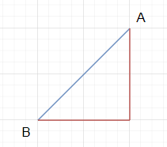

# 인공지능과 머신러닝, 딥러닝

- 인공지능(AI, Artificial Intelligence)
  - 정의: 사람처럼 학습하고 추론할 수 있는 지능을 가진 컴퓨터 시스템을 만드는 기술.
  - 역사
    - 1943: 워런 매컬러와 월터 피츠가 뇌의 뉴런 개념을 발표.
    - 1950: 앨런 튜링이 사람과 같은 지능을 가졌는지 테스트 할 수 있는 튜링 테스트를 발표.
    - 1956: 다트머스 AI 컨퍼런스 개최, 많은 과학자가 참여하였으며, 인공지능에 대한 장밋빛 전망이 최고조에 도달.
    - 1957: 프랑크 로젠블라트가 로지스틱 회귀의 초기 버전으로 볼 수 있는 퍼셉트론을 발표.
    - 1959: 데이비드 허블, 토르스텐 비셀이 고양이를 사용해 시각 피질에 있는 뉴런 기능을 연구.
    - 1974-1980: 컴퓨터 성능의 한계로 인해 간단한 문제를 해결하는 것에 그치자 첫 번째 AI 겨울이 도래, 인공지능에 대한 연구와 투자가 크게 감소.
    - 1980-1987: 전문가 시스템(expert system)의 등장으로 AI 붐이 분다.
    - 1987-1993: 한계에 부딛혀 2차 AI 겨울이 도래, 1993년 이후 다시 인공지능이 각광 받기 시작.
  - 인공지능의 종류
    - 강인공지능(인공일반지능): 사람과 구분하기 어려운 지능을 가진 컴퓨터 시스템
    - 약인공지능: 주어진 조건 하에서만 동작 가능한 인공지능


- 머신러닝

  - 규칙을 일일이 프로그래밍하지 않아도 자동으로 데이터에서 규칙을 학습하는 알고리즘을 연구하는 분야.
    - 인공지능의 하위 분야 중에서 지응을 구현하기 위한 소프트웨어를 담당하는 핵심 분야

  - 통계학과 깊은 관련이 있다.
    - 통계학에서 유래된 머신러닝 알고리즘이 많으며 통계학과 컴퓨터 과학 분야가 상호작용하면서 발전하고 있다.
    - 대표적인 오픈소스 통계 소프트웨어인 R에는 다양한 머신러닝 알고리즘이 구현되어 있다.
  - 하지만 최근 머신러닝의 발전은 통계나 수학 이론보다 경험을 바탕으로 발전하는 경우도 많다.
    - 컴퓨터 과학 분야가 이러한 발전을 주도하고 있다.
    - 컴퓨터 과학 분야의 대표적인 머신러닝 라이브러리로 사이킷런이 있다.
  - Scikit-learn
    - Scikit-learn 라이브러리는 파이썬 API를 사용한다.
    - 당연하게도 사이킷 런에 모든 머신러닝 알고리즘이 포함되어 있지는 않다.
    - 연구자들은 새로운 알고리즘을 끊임없이 개발하여 발표하며, 이를 많은 사람이 검증하고 사용해본다. 
    - 그 후 유익하다고 증명되어 널리사용하게 되면 사이킷런에 추가되게 된다.
    - 바꿔말하면, 머신러닝 라이브러리에 포함된 알고리즘들은 안정적이며 성능이 검증되었다고 볼 수 있다.
  - 사이킷런은 머신러닝의 성장에 기여했다.
    - 사이킷런 이전까지 머신러닝 기술은 대부분 폐쇄적인 코드와 라이브러리로 통용되었다.
    - 그러나 사이킷런과 같은 오픈소스 라이브러리의 발전 덕분에 누구나 머신러닝 알고리즘을 손쉽게 제품에 적용할 수 있게 되었다.
    - 이런 현상으로 인해 새로운 이론과 기술은 직접 코드로 구현되고 통용되어야 그 가치를 입증할 수 있게 되었다.


- 딥러닝

  - 많은 머신러닝 알고리즘 중에 인공 신경망을 기반으로 한 방법들을 통칭하며 딥러닝이라 부른다.
  - 딥 러닝의 발전
    - 1998: 얀 르쿤, LeNet-5라는 최초의 합성곱 신경망을 만들어 손글씨 숫자를 인식하는 데 성공.
    - 2012: 제프리 힌턴의 팀이 이미지 분류 대회인 ImageNet에서 합성곱 신경망 AlexNet을 사용하여 기존의 머신러닝 방법을 누르고 압도적인 성능으로 우승.
    - 2016: 알파고와 이세돌의 대국으로 딥러닝에 대한 관심이 크게 높아짐.
  - 딥 러닝이 놀라운 성능을 달성하게 된 원동력
    - 복잡한 알고리즘을 훈련할 수 있는 풍부한 데이터
    - 컴퓨터 성능의 향상
    - 혁신적인 알고리즘 개발

  - 관련 라이브러리
    - tensorflow: 2015년 구글이 발표한 딥러닝 오픈소스 라이브러리
    - pytorch: 2018년 페이스북이 발표한 딥러닝 오픈소스 라이브러리
    - 두 라이브러리의 공통점은 인공 신경망 알고리즘을 전문으로 다루고 있다는 것과 모두 사용하기 쉬운 파이썬 API를 제공한다는 점이다.


# k-최근접 이웃(k-Nearest Neighbor, kNN)

- class
  - 머신러닝에서 여러 개의 종류(class) 중 하나를 구별해 내는 문제를 분류(classification)라고 한다.
  - 2개의 클래스 중 하나를 고르는 문제를 이진 분류(binary classification)라고 한다.


- 특성(feature)
  - 머신러닝에서 데이터를 표현하는 하난의 성질을 말한다.
  - 예를 들어 국가 데이터의 경우 인구 수, GDP, 면적 등이 있을 수 있다.


- k-최근접 이웃 알고리즘
  - 어떤 데이터에 대한 답을 구할 때 주위의 다른 데이터를 보고 다수를 차지하는 것을 정답으로 사용한다.
    - 즉 주위의 데이터로 현재 데이터를 판단하는 것이다.
    - 새로운 데이터를 예측할 때는 가장 가까운 직선거리에 어떤 데이터가 있는지를 살피기만 하면 된다.
  - 단점은 데이터가 아주 많을 경우 사용하기 어렵다는 것이다.
    - 데이터가 커지면 메모리가 많이 필요하고 직선거리를 계산하는 데도 많은 시간이 필요해진다.
    - 실제로는 무언가를 훈련한다기 보다는 모델에 데이터를 모두 저장하고 있다가 새로운 데이터가 등장하면 가장 가까운 데이터를 참고하여 구분하는 것 뿐이다.


## 생선 분류 문제

> 데이터 출처: https://www.kaggle.com/aungpyaeap/fish-market

- HTIL 마켓에서는 도미, 곤들매기, 농어, 강꼬치고기, 로치, 빙어, 송어를 판매한다.
  - 이  생선들을 분류하는 프로그램을 작성한다.
  - 단순히 조건문으로 생선들의 길이와 무게를 기준으로 분류할 수는 없다.
    - 생선 중에서 특별히 길이가 길거나 짧거나 무게가 많이 나가거나 적게 나가는 생선이 있을 수 있다.
    - 따라서 머신러닝을 활용하여, 스스로 기준을 찾고, 이 기준을 이용해 생선인지 도미인지 판별할 수 있도록 할 것이다.


- 도미와 빙어 분류하기

  - 도미 데이터 준비하기
    - 길이와 무게라는 특성을 리스트로 표현

  ```python
  bream_length = [25.4, 26.3, 26.5, 29.0, 29.0, 29.7, 29.7, 30.0, 30.0, 30.7, 31.0, 31.0, 
                  31.5, 32.0, 32.0, 32.0, 33.0, 33.0, 33.5, 33.5, 34.0, 34.0, 34.5, 35.0, 
                  35.0, 35.0, 35.0, 36.0, 36.0, 37.0, 38.5, 38.5, 39.5, 41.0, 41.0]
  bream_weight = [242.0, 290.0, 340.0, 363.0, 430.0, 450.0, 500.0, 390.0, 450.0, 500.0, 475.0, 500.0, 
                  500.0, 340.0, 600.0, 600.0, 700.0, 700.0, 610.0, 650.0, 575.0, 685.0, 620.0, 680.0, 
                  700.0, 725.0, 720.0, 714.0, 850.0, 1000.0, 920.0, 955.0, 925.0, 975.0, 950.0]
  ```

  - 도미 데이터를 시각화하기
    - 맷플롯립(matplotlib)사용
    - `scatter()` 함수는 산점도를 그려주는 함수이다.

  ```python
  import matplotlib.pyplot as plt
  
  (...)
  
  plt.scatter(bream_length, bream_weight)  # 산점도를 그려주는 함수
  plt.xlabel('length')  # x축을 길이로 설정
  plt.ylabel('weight')  # y축을 무게로 설정
  plt.show()			  # 준비된 그래프를 화면에 출력
  ```

  - 결과
    - 길이가 길수록 무게가 많이 나간다는 것을 확인 가능하다.
    - 이렇게 산점도 그래프가 일직선에 가까운 형태로 나타나는 경우를 선형(linear)적이라 말한다.

  

  - 빙어 데이터 준비하기

  ```python
  smelt_length = [9.8, 10.5, 10.6, 11.0, 11.2, 11.3, 11.8, 11.8, 12.0, 12.2, 12.4, 13.0, 14.3, 15.0]
  smelt_weight = [6.7, 7.5, 7.0, 9.7, 9.8, 8.7, 10.0, 9.9, 9.8, 12.2, 13.4, 12.2, 19.7, 19.9]
  ```

  - 빙어 데이터를 시각화하기
    - matplotlib에서 2개의 산점도를 한 그래프로 그리고자 한다면 다음과 같이 `scatter()`함수를 연달아 사용하면 된다.
    - `sactter()` 함수는 처음 2개의 매개변수로 x축 값과, y축 값을 받는다.
    - `c` 매개변수로 색상을 지정하는데, RGB를 16진수(e.g. #1f77b4)로 지정하거나 색깔 코드 b, g, r, c, m, y, k, w 중 하나를 지정한다.
    - `marker` 매개변수로 마커 스타일을 지정하는데 기본 값은 o이다(https://matplotlib.org/stable/api/markers_api.html에서 마커 종류 확인 가능).

  ```python
  import matplotlib.pyplot as plt
  
  bream_length = [25.4, 26.3, 26.5, 29.0, 29.0, 29.7, 29.7, 30.0, 30.0, 30.7, 31.0, 31.0,
                  31.5, 32.0, 32.0, 32.0, 33.0, 33.0, 33.5, 33.5, 34.0, 34.0, 34.5, 35.0,
                  35.0, 35.0, 35.0, 36.0, 36.0, 37.0, 38.5, 38.5, 39.5, 41.0, 41.0]
  bream_weight = [242.0, 290.0, 340.0, 363.0, 430.0, 450.0, 500.0, 390.0, 450.0, 500.0, 475.0, 500.0,
                  500.0, 340.0, 600.0, 600.0, 700.0, 700.0, 610.0, 650.0, 575.0, 685.0, 620.0, 680.0,
                  700.0, 725.0, 720.0, 714.0, 850.0, 1000.0, 920.0, 955.0, 925.0, 975.0, 950.0]
  
  smelt_length = [9.8, 10.5, 10.6, 11.0, 11.2, 11.3,
                  11.8, 11.8, 12.0, 12.2, 12.4, 13.0, 14.3, 15.0]
  smelt_weight = [6.7, 7.5, 7.0, 9.7, 9.8, 8.7,
                  10.0, 9.9, 9.8, 12.2, 13.4, 12.2, 19.7, 19.9]
  
  plt.scatter(bream_length, bream_weight)
  plt.scatter(smelt_length, smelt_weight)  # 연달아 사용
  plt.xlabel('length')
  plt.ylabel('weight')
  plt.show()
  ```

  - 결과
    - matplotlib이 자동으로 2 개의 산점도를 색깔로 구분해서 나타내준다.
    - 빙어의 산점도 역시 선형적이지만 무게가 길이에 영향을 덜 받는다.

  


- 도미와 빙어를 구분하기

  - 두 데이터를 하나로 합치기

  ```python
  length = bream_length + smelt_length
  weight = bream_weight + smelt_weight
  ```

  - 이제 각 생선별 길이와 무게가 한 리스트에 들어가도록 2차원 리스트를 만들어준다.
    - 사이킷런 패키지를 사용하기 위해서는 아래와 같이 데이터를 처리해줘야 한다.
    - `zip()` 함수와 리스트 내포를 사용.

  ```python
  length = bream_length + smelt_length
  weight = bream_weight + smelt_weight
  fish_data = [[l, w] for l, w in zip(length, weight)]
  print(fish_data)  # [[25.4, 242.0], [26.3, 290.0], [26.5, 340.0], ...
  ```

  - 정답 데이터 만들기
    - 생선의 길이와 무게를 보고 도미와 빙어를 구분하는 규칙을 학습시켜야 한다.
    - 따라서 도미와 빙어가 각각 어떤 무게와 길이를 가지는지 알려줘야 한다.
    - 도미는 1로, 빙어는 0이라 한다.

  ```python
  fish_target = [1]*35+[0]*14
  ```

  - k-최근접 알고리즘을 구현한 클래스인 KNeighbotsClassfier를 사이킷런 패키지에서 import한다.

  ```python
  from sklearn.neighbors import KNeighborsClassifier
  ```

  - 훈련하기
    - `KNeighborsClassifier` 클래스의 객체를 생성한다.
    - 위 객체에 데이터를 전달하여 도미를 찾기 위한 기준을 학습시킨다. 이러한 과정을 **훈련(training)**이라 한다.
    - 사이킷런에서는 `fit()` 메서드가 이런 역할을 한다.
    - 머신러닝 알고리즘을 구현한 프로그램 또는 알고리즘을 구체화 한 것을 **모델(model)**이라 부른다.

  ```python
  # 모델을 생성하고
  kn = KNeighborsClassifier()
  # 훈련시킨다.
  # 첫 번째 인자로 데이터를, 두 번째 인자로 정답을 받는다.
  kn.fit(fish_data,fish_target)
  ```

  - 정확도 평가하기
    - 사이킷런에서 모델을 평가하는 메서드는 `score()`를 사용한다.
    - `score()` 메서드는 0에서 1 사이의 **정확도(accuracy)**를 반환한다.
    - 정확도는 정확한 답을 몇 개 맞혔는지를 백분율로 나타낸 값이다(`정확도 = (정확히 맞힌 개수) / (전체 데이터 계수)`).
    - 1은 모든 데이터를 정확히 맞췄다는 것이고, 0은 하나도 맞추지 못했다는 것이다.

  ```python
  print(kn.score(fish_data,fish_target))  # 1
  ```


- 새로운 데이터를 예측하기

  - k-최근접 이웃 알고리즘은 주위의 다른 데이터를 기준으로 현재 데이터를 판단한다.
    - 아래 그림에서 초록색 점은 주변의 파란색 점을 기준으로 판단할 것이므로 도미로 판단될 것이다.

  

  - 예측하기
    - 사이킷런의 `predict()` 메서드는 새로운 데이터의 정답을 예측한다.
    - `fit()` 메서드와 마찬가지로 리스트의 리스트를 전달해야 한다.
    - 1은 도미, 0은 빙어를 나타내므로 제대로 예측했다면 1을 반환할 것이다.

  ```python
  print(kn.predict([[30,600]]))  # [1]
  ```


- `KNeighborsClassifier`  클래스

  - `KNeighborsClassifier`  클래스는 다음과 같은 속성값을 갖는다.
    - `_fit_X`: 첫 번째 인자로 전달 한 데이터가 저장되어 있다.
    - `_y`: 두 번째 인자로 전달한 정답 데이터가 저장되어 있다.
    - 외에도 다양한 속성을 지닌다.

  ```python
  print(kn._fit_X)
  print(kn._y)
  '''
  [[  25.4  242. ]
   [  26.3  290. ]
   (...)]
  [1 1 1 1 1 1 1 1 1 1 1 1 1 1 1 1 1 1 1 1 1 1 1 1 1 1 1 1 1 1 1 1 1 1 1 0 0 0 0 0 0 0 0 0 0 0 0 0 0]
  '''
  ```

  - 참고할 데이터의 수를 지정해줄 수 있다.
    - k-최근접 이웃 알고리즘은 주위의 다른 데이터를 기준으로 현재 데이터를 판단한다.
    - 기본값은 5개이다.
    - `n_neighbors` 매개변수로 이를 변경할 수 있다.

  ```python
  # 참고 데이터의 수를 10개로 한 kn10 모델
  kn10 = KNeighborsClassifier(n_neighbors=10)
  ```

  - 위 예시에서 우리가 사용한 생선 데이터의 수는 총 49개였다.
    - 따라서 가장 가까운 데이터 49개를 사용하는 k-최근접 이웃 모델을 사용하면, 모든 데이터를 사용하여 예측하게 된다.
    - 49개 중에서 도미가 35개로 다수를 차지하므로 어떤 데이터를 넣어도 무조건 도미로 예측할 것이다.
    - 또한 이 모델은 도미만을 정확히 예측하므로 정확도를 계산한 결과도 다음과 같이 나오게 된다.

  ```python
  kn49 = KNeighborsClassifier(n_neighbors=49)
  kn49.fit(fish_data, fish_target)
  print(kn49.score(fish_data, fish_target))	# 0.7142857142857143
  print(35/49)								# 0.7142857142857143
  ```

  - 참고 데이터가 몇 개일 때 부터 정확도가 1 미만이 되는지 확인하기
    - `KNeighborsClassifier`의 객체를 다시 생성할 필요 없다.
    - `fit()` 메서드로 훈련을 다시 할 필요도 없다.

  ```python
  tkn = KNeighborsClassifier()
  tkn.fit(fish_data, fish_target)
  
  for n in range(5, 50):
      tkn.n_neighbors = n
      score = tkn.score(fish_data, fish_target)
      if score < 1:
          print(n, score)  # 18 0.9795918367346939
          break
  ```

  - `p` 매개변수로 거리를 재는 방법을 지정할 수 있다.
    - 1일 경우 맨해튼 거리를 사용한다.
    - 2일 경우 유클리디안 거리를 사용한다(기본값).
    - 아래 그림에서 파랑색이 유클리디안 거리, 빨강색이 맨해튼 거리이다.

  

  - `n_jobs` 매개변수로 사용할 CPU 코어를 지정할 수 있다.
    - -1로 설정하면 모든 CPU 코어를 사용한다.
    - -1로 설정할 경우 이웃 간의 거리 계산 속도를 높을 수 있지만 `fit()` 메서드에는 영향이 없다.
    - 기본값은 1이다.