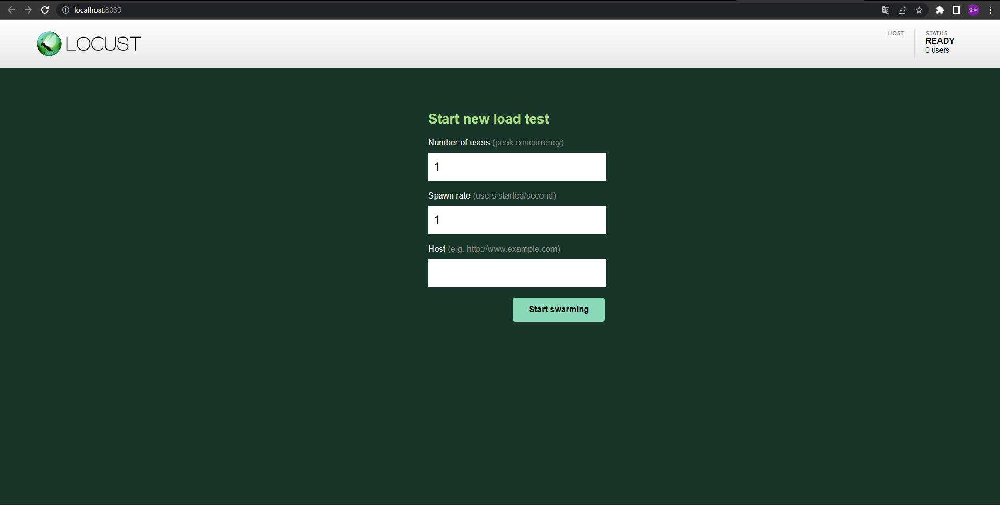

# Locust

- Locust
  - Performance testing tool
  - open source로 개발되었다.
  - 이름이 locust인 이유는 메뚜기 떼가 농장을 습격하듯 사용자들이 웹 사이트를 습격한다고 하여 붙인 이름이다.


- 특징
  
  - 장점
    - Python code로 test scenario 작성이 가능하다.
    - 많은 수의 유저가 동시에 사용하는 상황을 테스트 가능하다.
    - 이벤트 기반(gevnet 사용)으로 수천명의 동시 사용자를 테스트 가능하다.
    - Web 기반의 UI를 제공한다.
    - 어떤 시스템이든 테스트가 가능하다.
    - 가볍고 변경에 유연하다.
  
  
  - 단점
    - 하드웨어 모니터링 기능이 없다.
  


- 설치

  - pip로 설치한다.

  ```bash
  $ pip install locust
  ```

  - 설치 확인

  ```bash
  $ locust -V
  ```


- Locust 실행하기

  - Fastapi로 아래와 같은 간단한 API를 만든다.

  ```python
  import uvicorn
  from fastapi import FastAPI
  
  app = FastAPI()
  
  
  @app.get("/hello")
  async def hello_world():
      return "Hello!"
  
  @app.get("/world")
  async def hello_world():
      return "World!"
  
  if __name__ == '__main__':
      uvicorn.run(app, host='0.0.0.0', port=8000)
  ```

  - Locust로 테스트 시나리오를 작성한다.
    - 테스트 시나리오의 파일 이름은 `locustfile.py`여야한다.
    - 아래 시나리오는 사용자가 `/hello`와 `/world`라는 api에 http requests를 반복적으로 보내는 시나리오이다.

  ```python
  from locust import HttpUser, task
  
  
  class HelloWorldUser(HttpUser):
      @task
      def hello_world(self):
          self.client.get("/hello")
          self.client.get("/world")
  ```

  - 실행하기

  ```bash
  $ locust
  ```

  - `http://localhost:8098`로 접속하면 아래와 같은 화면을 볼 수 있다.
    - Numver of users: 동시에 접속하는 최대 사용자 수를 설정한다.
    - Spwan rate: 시작할 때 몇 명의 사용자로 시작할지, 초당 몇 명씩 사용자를 늘릴지 설정한다.
    - Host: 테스트하려는 API의 주소를 입력한다.

  

  - Command line으로 바로 시작하기
    - Web UI는 부가적인 기능으로 꼭 사용해야하는 것은 아니다.
    - 아래와 같이 command line을 통해서도 실행이 가능하다.

  ```bash
  $ locust --headless --users <최대 사용자 수> --spawn-rate <초당 늘어날 사용자 수> -H <테스트하려는 API 주소>
  ```


- Locust의 기본적인 동작 과정은 다음과 같다.	
  - 설정한 사용자 수 만큼 User class의 instance를 생성한다.
  - user instance는 각자의 green thread 안에서 동작을 시작한다.
  - 각 user instance는 task를 선택하고, task를 실행한다.
  - 그 후 설정된 시간 만큼 대기한다.
  - 대기 시간이 끝나면 다시 다음 task를 선택하고, 실행한다.


## locustfile 작성하기

### User class

- locustfile은 적어도 하나의 사용자 클래스가 있어야 한다.
  - 사용자 클래스인지는 `HttpUser` class를 상속 받은 클래스인가로 판단한다.


- 시뮬레이팅할 사용자 생성하기

  - Class 형식으로 시뮬레이팅할 사용자를 생성한다.

  ```python
  from locust import HttpUser
  
  class QuickstartUser(HttpUser):
      pass
  ```

  - 테스트가 시작되면 locust는 사용자 클래스의 instance를 생성한다.


### HttpUser

- 사용자 클래스는 `HttpUser` class를 상속받는다.
  - 이를 통해 `HttpUser`의 attribute인 `client`에 접근할 수 있게 된다.
  - `client`는 `HttpSession`의 instance로, load test 대상 시스템에 HTTP 요청을 보내는 데 사용된다.
    - `HttpSession`은 `requests` 모듈의 `Session`를 상속받는다.
  
  - 예시
    - `HttpUser` 클래스를 상속 받는 사용자 클래스를 생성한다.
  
  ```python
  # locustfile.py
  from locust import HttpUser, task, between
  
  
  class APITestUser(HttpUser):
      @task
      def test_api(self):
          response = self.client.get("/api/test")
          if response.status_code == 200:
              print("Success:", response.json())
          else:
              print("Failed:", response.status_code)
  ```
  
  - 아래와 같이 실행한다.
  
  ```bash
  $ locust -f locustfile.py --host http://localhost:8000
  ```
  
  - 만약 request body가 포함된 post 요청을 보내야 할 경우, task를 아래와 같이 작성하면 된다.
  
  ```python
  @task
  def test_post_api(self):
      payload = {"key": "value"}
      headers = {"Content-Type": "application/json"}
      response = self.client.post("/api/test", json=payload, headers=headers)
      print(response.status_code)
  ```
  
  


- Validating response

  - 기본적으로 response code가 OK면 request가 성공한 것으로 간주한다.
  - 이를 custom할 수 있다.
    - `catch_response`를 True로 준다.

  ```python
  with self.client.get("/", catch_response=True) as response:
      if response.text != "Success":
          response.failure("Got wrong response")
      elif response.elapsed.total_seconds() > 0.5:
          response.failure("Request took too long")
  ```

  - 아래와 같이 400 이상의 status code가 반환되었을 때에도 성공으로 간주하게 할 수 있다.

  ```python
  with self.client.get("/does_not_exist/", catch_response=True) as response:
      if response.status_code == 404:
          response.success()
  ```


- Grouping requests

  - query parameter를 받는 경우 qeury parameter가 변경될 때마다 각기 다른 endpoint로 요청을 보내는 것으로 간주된다.
    - 즉 아래 예시와 같은 요청은 10개의 endpoint에 대한 요청을 1번씩 보내는 것으로 간주된다.
    - 이럴 경우 나중에 결과를 통계내기 어려워질 수 있으므로 그룹화 해야한다.

  ```python
  for i in range(10):
      self.client.get("/blog?id=%i" % i, name="/blog?id=[id]")
  ```

  - 그룹화하기

  ```python
  # /blog?id=[id] 라는 이름으로 그룹화된다.
  self.client.request_name="/blog?id=[id]"
  for i in range(10):
      self.client.get("/blog?id=%i" % i)
  self.client.request_name=None
  ```

  - boilerplate를 최소화하기 위해 아래와 같이 작성하는 것도 가능하다.

  ```python
  @task
  def multiple_groupings_example(self):
      # Statistics for these requests will be grouped under: /blog/?id=[id]
      with self.client.rename_request("/blog?id=[id]"):
          for i in range(10):
              self.client.get("/blog?id=%i" % i)
  
      # Statistics for these requests will be grouped under: /article/?id=[id]
      with self.client.rename_request("/article?id=[id]"):
          for i in range(10):
              self.client.get("/article?id=%i" % i)
  ```


### 옵션들

- `wait_time`

  - 각 task들의 실행 간격을 설정한다.

    - 주의할 점은 `wait_time`은 하나의 task가 끝나고 난 후부터 시간을 계산한다는 점이다.
    - task안에 몇 개의 request가 있든 하나의 task가 끝아야 시간을 계산하기 시작한다.
    - 따라서 RPS가 1인 상황을 테스트하려고 시간 간격을 1로 줬어도, task 안에 request가 3개라면, RPS는 3이 된다.

  - `constant(wait_time)`

    - 설정한 시간(초) 만큼의 간격을 두고 다음 task를 실행시킨다.

  - `between(min_wait, max_wait)`

    - 최솟값 이상, 최댓값 이하의 값들 중 랜덤한 시간(초)만큼의 간격을 두고 다음 task를 실행시킨다.

  - `constant_throughput(task_runs_per_second)`

    - 시간이 아닌 테스크가 초당 실행될 횟수를 받는다(reqeust per second가 아닌 task per second임에 주의).
    - 테스크가 초당 최대 설정한 값만큼 실행되는 것을 보장한다.

    - 예를 들어 초당 500번의 task를 실행시키고자 하고, 사용자 수가 5000명이라면, 인자로 0.1을 넘기면 된다.
    - 5000명이 초당 0.1번, 즉 10초에 1번씩 task를 실행하므로 초당 500번의 task가 실행된다.
    - 유념해야 할 점은 테스크의 실행 간격을 조정하여 RPS에 맞추는 것이지, 사용자의 수를 조정하는 것은 아니라는 점이다.
    - 따라서 위 예시에서 task의 실행 시간이 10초를 넘어간다면 RPS는 500보다 낮아지게 된다.

  ```python
  # 초당 500번의 task를 실행시키고자 하고 사용자 수가 5000이라고 가정할 때, task는 10초에 한 번씩 수행된다.
  # 그런데 아래 예시와 같이 task가 한 번 수행되는데 소요되는 시간이 10초를 넘어가면 RPS는 500보다 낮아지게 된다.
  class MyUser(User):
      wait_time = constant_throughput(0.1)
      
      @task
      def my_task(self):
          # 11초 동안 실행된다.
          time.sleep(11)
  ```

  - `constant_pacing(wait_time)`
    - 설정한 시간 동안 task가 최대 1번만 실행되는 것을 보장한다.
    - 아래 코드에서 task는 10초에 1번만 실행된다.
    - `constant_throughput`와 수학적으로 반대 개념이다.

  ```python
  class MyUser(User):
      wait_time = constant_pacing(10)
      @task
      def my_task(self):
          pass
  ```

  - custom
    - `wait_time`이라는 메서드를 생성하여 custom이 가능하다.

  ```python
  class MyUser(User):
      last_wait_time = 0
  
      def wait_time(self):
          self.last_wait_time += 1
          return self.last_wait_time
  ```


- 사용자 수 설정하기

  - User class가 둘 이상이라면, locust는 기본적으로 동일한 수의 사용자를 각 user class에서 생성한다.
  - `weight` 
    - 특정 유저가 더 많이 생성되도록 할 수 있다.
    - `WebUser`가 `MobileUser`에 비해 생성될 가능성이 3배 더 높다.

  ```python
  class WebUser(User):
      weight = 3
  
  class MobileUser(User):
      weight = 1
  ```

  - `fixed_count`
    - 각 user class별로 몇 명의 사용자를 생성할지 지정할 수 있다.
    - `weight`를 무시하고 무조건 설정된 수 만큼의 사용자를 먼저 생성한다.
    - 아래 예시에서 `AdminUser`의 instance는 전체 유저수와 무관하게 1명이 생성된다.

  ```python
  class AdminUser(User):
      wait_time = constant(600)
      fixed_count = 1
  
      @task
      def restart_app(self):
          pass
  
  class WebUser(User):
      pass
  ```


- etc

  - Host를 미리 지정할 수 있다.

  ```python
  class QuickstartUser(HttpUser):
      host = "http://localhost:8002"
  ```

  - 사용자가 테스트를 시작할 때와 종료할 때 수행할 메서드를 설정 가능하다.
    - `on_start`, `on_stop` 메서드를 선언한다.
    - `on_start`는 사용자가 TaskSet을 실행하기 시작 했을 때, `on_stop`은  `interrupt()`가 호출되거나 해당 사용자가 kill 됐을 때 실행된다.

  ```python
  class QuickstartUser(HttpUser):
      def on_start(self):
          self.client.post("/login", json={"username":"foo", "password":"bar"})
      
      def on_stop(self):
          print("QuickstartUser stop test")
  ```


## Task

- task 생성하기

  - 사용자가 어떤 동작을 할 것인지를 정의한 시나리오이다.
  - User class의 method로 선언한다.
    - `@task` decorator를 붙여야한다.
    - 테스트가 시작되면 `QuickstartUser`의 instance들이 생성되고 각 instance들은 `foo`를 실행한다.

  ```python
  from locust import HttpUser, task
  
  
  class QuickstartUser(HttpUser):
      @task
      def foo(self):
          self.client.get("/foo")
  ```

  - 복수의 task를 설정하는 것도 가능하며, 각 task별로 가중치를 주는 것이 가능하다.
    - 복수의 task가 선언되었을 경우 task들 중 하나가 무선적으로 선택 되고 실행된다.
    - 가중치는 `@task` decorator 뒤에 `(number)` 형식으로 주면 된다.
    - 아래 예시의 경우 `bar` task가 `foo` task에 비해 선택(되어 실행)될 확률이 3배 높다.

  ```python
  class QuickstartUser(HttpUser):
      @task
      def foo(self):
          self.client.get("/foo")
      
      @task(3)
      def bar(self):
          self.client.get("/bar")
  ```


- Task를 user class의 method가 아닌 일반 함수로 선언하는 것도 가능하다.

  - 일반 함수로 선언 후 user class의 `tasks` attribute에 할당한다.
    - user를 인자로 받는다.
    - `tasks` attribute는 callable이나 TaskSet class를 list 형태, 혹은 dict 형태로 받는다.

  ```python
  from locust import User
  
  def my_task(user):
      pass
  
  class MyUser(User):
      tasks = [my_task]
  ```

  - 가중치 설정하기
    - dict 형태로 선언한다.
    - key에 task를, value에 가중치를 넣는다.

  ```python
  from locust import User
  
  def my_task(user):
      pass
  
  def another_task(user):
      pass
  
  class MyUser(User):
      # another_task에 비해 my_task가 3배 더 실행될 확률이 높다.
      tasks = {my_task:3, another_task:1}
  ```


- Tag 설정하기

  - `@tag` decorator를 통해 tag 설정이 가능하다.
    - 테스트 실행시에 `--tags` 혹은 `--exclude-tags` 옵션으로 어떤 tag가 붙어있는 task를 수행할지, 혹은 수행하지 않을지 지정 가능하다.
    - 예를 들어 `locust --tags tag1`은 task1과 task2만 실행한다.

  ```python
  from locust import User, constant, task, tag
  
  class MyUser(User):
      wait_time = constant(1)
  
      @tag('tag1')
      @task
      def task1(self):
          pass
  
      @tag('tag1', 'tag2')
      @task
      def task2(self):
          pass
  
      @tag('tag3')
      @task
      def task3(self):
          pass
  
      @task
      def task4(self):
          pass
  ```


## Event

- 테스트 시작, 종료시에 실행될 코드 작성하기

  - `@events.test_start.add_listener`, `@events.test_stop.add_listener` decorator를 사용한다.

  ```python
  from locust import events
  
  # test_start라는 event에 대한 listener를 추가한다.
  @events.test_start.add_listener
  def on_test_start(environment, **kwargs):
      print("A new test is starting")
  
  # test_stop이라는 event에 대한 listener를 추가한다. 
  @events.test_stop.add_listener
  def on_test_stop(environment, **kwargs):
      print("A new test is ending")
  ```


- `init` event

  - 각 locust process가 시작될 때 trigger 된다.
  - 분산 모드에서 각 locust process가 initialization이 필요할 때 유용하다.

  ```python
  from locust import events
  from locust.runners import MasterRunner
  
  @events.init.add_listener
  def on_locust_init(environment, **kwargs):
      if isinstance(environment.runner, MasterRunner):
          print("I'm on master node")
      else:
          print("I'm on a worker or standalone node")
  ```


- 더 상세한 event hook은 아래 링크 참고

  - https://docs.locust.io/en/stable/api.html#event-hooks

  - command line의 option을 custom하거나 각 request event마다 특정 동작을 수행하는 것이 가능하다.


## Library로 사용하기

- `locust` command 대신 python script로 test를 실행할 수 있다.

  - 코드
    - tag 등은 Environment를 통해 넣으면 된다.
  
  ```python
  import gevent
  from locust import HttpUser, task, between
  from locust.env import Environment
  from locust.stats import stats_printer, stats_history
  from locust.log import setup_logging
  
  setup_logging("INFO", None)
  
  
  class User(HttpUser):
      wait_time = between(1, 3)
      host = "https://docs.locust.io"
  
      @task
      def my_task(self):
          self.client.get("/")
  
      @task
      def task_404(self):
          self.client.get("/non-existing-path")
  
  
  # Environment의 instance 생성 후 runner 생성
  env = Environment(user_classes=[User])
  env.create_local_runner()
  
  # web ui 호스트와 포트 설정
  env.create_web_ui("127.0.0.1", 8089)
  
  # 테스트 상태가 print되도록 설정
  gevent.spawn(stats_printer(env.stats))
  
  # 과거 테스트 이력을 저장하도록 설정(chart 등에 사용)
  gevent.spawn(stats_history, env.runner)
  
  # 테스트 시작
  env.runner.start(1, spawn_rate=10)
  
  # 테스트 기간 설정
  gevent.spawn_later(60, lambda: env.runner.quit())
  
  # wait for the greenlets
  env.runner.greenlet.join()
  
  # stop the web server for good measures
  env.web_ui.stop()
  
  # aggs 결과 확인
  print(self.env.stats.total)
  
  # 각 task별 결과 확인
  for task, stats in self.env.stats.entries.items():
      print(task)
      print(stats)
  ```


## Locust Test Non Http service

- Locust를 사용하여 대부분의 시스템을 테스트할 수 있다.
  - Locust는 기본적으로 HTTP/HTTPS test만이 내장되어 있다.
  - 그러나 RPC를 사용하면 어떤 시스템이든 테스트가 가능하다.


- gRPC를 활용하여 테스트하기

  - `.proto` 파일 작성하기

  ```protobuf
  syntax = "proto3";
  
  package locust.hello;
  
  service HelloService {
    rpc SayHello (HelloRequest) returns (HelloResponse) {}
  }
  
  message HelloRequest {
    string name = 1;
  }
  
  message HelloResponse {
    string message = 1;
  }
  ```

  - `pb2`파일 생성하기

  ```bash
  $ python -m grpc_tools.protoc -I<proto file이 있는 폴더의 경로> --python_out=<pb2 파일을 생성할 경로> --grpc_python_out=<pb2_grpc 파일을 생성할 경로> <proto file의 경로>
  ```

  - gRPC 서버 작성하기

  ```python
  import hello_pb2_grpc
  import hello_pb2
  import grpc
  from concurrent import futures
  import logging
  import time
  
  logger = logging.getLogger(__name__)
  
  
  class HelloServiceServicer(hello_pb2_grpc.HelloServiceServicer):
      def SayHello(self, request, context):
          name = request.name
          time.sleep(1)
          return hello_pb2.HelloResponse(message=f"Hello from Locust, {name}!")
  
  
  def start_server(start_message):
      server = grpc.server(futures.ThreadPoolExecutor(max_workers=10))
      hello_pb2_grpc.add_HelloServiceServicer_to_server(HelloServiceServicer(), server)
      server.add_insecure_port("localhost:50051")
      server.start()
      logger.info(start_message)
      server.wait_for_termination()
  ```

  - gRPC 클라이언트 겸 사용자를 생성하는 로직 추가.

  ```python
  import grpc
  import hello_pb2_grpc
  import hello_pb2
  from locust import events, User, task
  from locust.exception import LocustError
  from locust.user.task import LOCUST_STATE_STOPPING
  from hello_server import start_server
  import gevent
  import time
  
  # patch grpc so that it uses gevent instead of asyncio
  import grpc.experimental.gevent as grpc_gevent
  
  grpc_gevent.init_gevent()
  
  
  @events.init.add_listener
  def run_grpc_server(environment, **_kwargs):
      # gRPC 서버 시작하기
      # 첫 번째 인자로 spawn할 함수를 받고, 두 번째 인자로 해당 함수의 파라미터를 받는다.
      gevent.spawn(start_server, "gRPC server started")
  
  
  class GrpcClient:
      def __init__(self, environment, stub):
          self.env = environment
          self._stub_class = stub.__class__
          self._stub = stub
  
      def __getattr__(self, name):
          func = self._stub_class.__getattribute__(self._stub, name)
  
          def wrapper(*args, **kwargs):
              request_meta = {
                  "request_type": "grpc",
                  "name": name,
                  "start_time": time.time(),
                  "response_length": 0,
                  "exception": None,
                  "context": None,
                  "response": None,
              }
              start_perf_counter = time.perf_counter()
              try:
                  request_meta["response"] = func(*args, **kwargs)
                  request_meta["response_length"] = len(request_meta["response"].message)
              except grpc.RpcError as e:
                  request_meta["exception"] = e
              request_meta["response_time"] = (time.perf_counter() - start_perf_counter) * 1000
              self.env.events.request.fire(**request_meta)
              return request_meta["response"]
  
          return wrapper
  
  
  class GrpcUser(User):
      abstract = True
  
      stub_class = None
  
      def __init__(self, environment):
          super().__init__(environment)
          for attr_value, attr_name in ((self.host, "host"), (self.stub_class, "stub_class")):
              if attr_value is None:
                  raise LocustError(f"You must specify the {attr_name}.")
          self._channel = grpc.insecure_channel(self.host)
          self._channel_closed = False
          stub = self.stub_class(self._channel)
          self.client = GrpcClient(environment, stub)
  
  
  class HelloGrpcUser(GrpcUser):
      # grpc 서버의 host를 설정한다.
      host = "localhost:50051"
      stub_class = hello_pb2_grpc.HelloServiceStub
  
      @task
      def sayHello(self):
          if not self._channel_closed:
              self.client.SayHello(hello_pb2.HelloRequest(name="Test"))
          time.sleep(1)
  ```


## Worker

- locust는 여러 개의 worker를 생성하여 테스트가 가능하다.

  - 간단한 테스트의 경우에는 하나의 프로세스로도 충분한 throughput을 발생시킬 수 있다. 그러나 복잡한 테스트를 진행하거나, 보다 많은 load를 실행하기 위해서는 여러 프로세스를 생성해야 한다.

  - master는 locust의 web interface를 실행하고, worker들에게 언제 User를 생성하는지나 멈추는 지를 알려주는 역할을 한다.
    - master는 직접 test를 실행하지는 않는다.
  - worker는 User를 생성하고, 테스트를 진행하며, 그 결과를 master에 전송한다.
  - Python은 GIL로 인해 프로세스 당 둘 이상의 코어를 완전히 활용할 수 없다.
    - 따라서 프로세서 코어 하나 당 worker 하나를 실행해야 한다.
    - 또한 하나의 프로세스에 worker와 master를 동시에 실행해선 안 된다.


- 실행하기

  - Master 모드로 실행하기

  ```bash
  $ locust --master
  ```

  - worker 실행하기
    - 만일 master와 다른 machine에서 실행한다면 `--master-host` 옵션을 통해 master machine의 host를 입력해야 한다.

  ```bash
  $ locsut --worker
  ```

  - 옵션
    - `--master-bind-host`: master 노드가 bind할 network interface의 host를 입력한다.
    - `--master-bind-port`: master 노드의 port를 설정한다.
    - `--master-host`: worker를 master와 다른 machine에 생성한 경우에 master의 host를 입력한다.
    - `--master-port`: 만일 master의 port를 설정해준 경우에 woreker를 실행할 때 master의 port를 입력한다.
    - `--expect-workers`: master node를 `--headless` 옵션과 함께 실행할 때, master node는 설정값 만큼의 노드가 실행되기를 기다렸다가 테스트를 시작한다.


- 노드 사이의 통신

  ```python
  from locust import events
  from locust.runners import MasterRunner, WorkerRunner
  
  # Fired when the worker receives a message of type 'test_users'
  def setup_test_users(environment, msg, **kwargs):
      for user in msg.data:
          print(f"User {user['name']} received")
      environment.runner.send_message('acknowledge_users', f"Thanks for the {len(msg.data)} users!")
  
  # Fired when the master receives a message of type 'acknowledge_users'
  def on_acknowledge(msg, **kwargs):
      print(msg.data)
  
  @events.init.add_listener
  def on_locust_init(environment, **_kwargs):
      if not isinstance(environment.runner, MasterRunner):
          environment.runner.register_message('test_users', setup_test_users)
      if not isinstance(environment.runner, WorkerRunner):
          environment.runner.register_message('acknowledge_users', on_acknowledge)
  
  @events.test_start.add_listener
  def on_test_start(environment, **_kwargs):
      if not isinstance(environment.runner, MasterRunner):
          users = [
              {"name": "User1"},
              {"name": "User2"},
              {"name": "User3"},
          ]
          environment.runner.send_message('test_users', users)
  ```


# contextlib

## contextlib

- `contextlib`
  - Python의 context manager를 보다 쉽게 선언할 수 있게 해주는 module이다.
    - 원래 Python에서 context manager를 선언하려면 `__enter__`와 `__exit__` method를 선언한 class가 있어야 한다.
  - `contextlib`을 사용하면 함수 선언만으로 context manager를 사용할 수 있게 해준다.


- `contextmanager`

  - Context manager를 생성하기 위한 factory function을 정의할 때 사용하는 decorator이다.
    - `@contextmanager` decorator가 붙은 함수는 반드시 generator를 반환해야하며, 반드시 하나의 값만을 반환해야한다.
    - Generator가 yield되고 난 후 `with` block 내부의 문들이 실행된다.

  ```python
  from contextlib import contextmanager
  
  @contextmanager
  def managed_resource(*args, **kwds):
      # resource를 aquire하는 code
      resource = acquire_resource(*args, **kwds)
      try:
          yield resource
      finally:
          # resource를 release하는 code
          release_resource(resource)
  ```

  - 만약 `with` block에서 처리되지 않은 exception이 발생하면, `yield`가 발생한 generator 내부에서 다시 raise된다.
    - 따라서 `try`, `except`, `finally` 문을 사용하여 다시 raise된 exception을 처리해야한다.

  ```python
  from contextlib import contextmanager
  
  @contextmanager
  def my_context(name: str):
      try:
          yield "Hello {}".format(name)
      except Exception as e:
          print(e)	# Some exception
  
  
  with my_context("John") as ctx:
      raise Exception("Some exception")
  ```

  - `@contextmanager` decorator로 생성한 context manager는 decorator로 사용이 가능하다.
    - 또한, dectorator로 사용한 context manager는 수식하는 함수가 호출될 때 마다 새로운 generator를 반환한다.

  ```python
  from contextlib import contextmanager
  
  
  @contextmanager
  def my_context():
      print("Before the function call")
      yield
      print("After the function call")
  
  # context manager를 데코레이터로 사용
  @my_context()
  def say_hello():
      print("Hello, World!")
  
  # 실행
  say_hello()
  ```


- `asynccontextmanager`

  - 비동기적인 context manager를 생성하는 factory function을 정의할 때 사용하는 decorator이다.
    - `asynccontextmanager`decorator가 붙은 함수는 `async with`문에서 사용이 가능하다.
  - `@contextmanager` decorator로 생성한 context manager와 마찬가지로 `@asynccontextmanager` decorator로 선언한 context manager 또한 `async with`와 함께 사용할 수도 있지만, decorator로도 사용할 수 있다.

  ```python
  import time
  from contextlib import asynccontextmanager
  
  @asynccontextmanager
  async def timeit():
      now = time.monotonic()
      try:
          yield
      finally:
          print(f'it took {time.monotonic() - now}s to run')
  
  @timeit()
  async def main():
      ...
  ```


- `closing`

  - `with` block이 종료됐을 때 무언가를 닫는 context manager를 반환하는 class이다.
    - 예를 들어 아래 예시에서 `with` block이 종료되면 `page.close()`를 자동으로 호출한다.
    - 즉, 명시적으로 `close()`를 호출하지 않아도 자동으로 호출해주며, 심지어 error가 발생해도 `page.close()`를 호출한다.
    - 일반적으로 `contextlib`을 사용하지 않고 선언한 context manager를 관리하기 위해 사용한다.

  ```python
  from contextlib import closing
  
  # contextlib을 사용하지 않은 context manager
  class MyContext:
      def __enter__(self):
          print("enter")
          return "Hello World"
      
      def __exit__(self, type, value, traceback):
          print("exit")
  
      def close(self):
          print("close")
  
  # closing은 close() 메서드를 자동으로 호출하는 context manager를 반환한다.
  with closing(MyContext()) as my_context:
      with my_context as ctx:
          ...
  ```

  - 간소화하면 아래 코드와 원리가 같다.

  ```python
  from contextlib import contextmanager
  
  @contextmanager
  def closing(thing):
      try:
          yield "Hello World"
      finally:
          thing.close()
  ```


- `suppress`

  - `with` block 내에서 지정한 exception이 발생했을 경우 이를 막고, `with` block 이후의 문들을 실행하는 context manager를 반환하는 class이다.
  - 아래와 같이 suppress 없이 `with` block 내에서 exception이 발생할 경우, 프로그램이 종료된다.

  ```python
  with open("file_does_not_exist.txt", "r") as f:
      f.readlines()
      
  # FileNotFoundError: [Errno 2] No such file or directory: 'no_exist_file.txt'
  ```

  - 반면에 아래와 같이 `suppress`를 사용할 경우 `with` block 내에서 exception이 발생하더라도 `with` block 외부의 문부터 실행이 재개된다.

  ```python
  from contextlib import suppress
  
  
  with suppress(FileNotFoundError):
      with open("file_does_not_exist.txt", "r") as f:
          f.readlines()
      print("inside the block")	# 실행 X
  print("outside block")			# 이 부분만 실행된다.
  ```

  - 간소화하면 아래 코드와 유사하다.

  ```python
  try:
      with open("file_does_not_exist.txt", "r") as f:
          f.readlines()
      print("inside the block")
  except FileNotFoundError:
      print("outside block")
  ```


- `redirect_stdout`, `redirect_stderr`

  - 각기 stdout과 stderr을 `sys.stdout`, `sys.stderr`에서 임시로 다른 file 혹은 file-like 객체로 redirect 시키는 context manager이다.
  - 아래와 같이 실행하면 stdout이 `help.txt` 파일에 작성된다.

  ```python
  with open('help.txt', 'w') as f:
      with redirect_stdout(f):
          help(print)
  ```


# contextvars

- contextvars
  - Context variable을 사용하기 위한 Python package이다.
    - Context variable이란 context에 따라 다른 값을 반환하는 변수이다.
    - Python 3.7에 추가되었다.

  - 용도
    - 주로 비동기 프로그래밍 혹은 멀티스레딩 환경에서 변수의 context를 관리하기 위해 사용한다.
    - contextvars를 사용하면 각 비동기 작업이나 스레드가 다른 작업의 상태나 값을 공유하지 않고 독립적인 컨텍스트를 유지할 수 있다.


- `ContextVar`

  - Context variable을 관리하기 위한 class이다.

    - 첫 번째 인자로 `name`을, 두 번째 인자로 `default`를 받는다.
    - `name`에는 variable의 이름을 설정하며, `default`는 특정 context에 해당하는 value가 없을 때 반환될 기본 값을 설정한다.

    ```python
    var = ContextVar('var', default=42)
    ```

    - `.get([default])`
      - 현재 context에 대한 context variable 값을 반환한다.
      - 만약 context에 해당하는 context variable 값이 없을 경우 아래 순서로 값을 반환한다.
      - `.get()` method 실행시 넘긴 defaul값
      - `ContextVar`의 instance 생성시에 설정한 default 값
      - 둘 다 없을 경우 `LookupError`가 raise된다.

    ```python
    import contextvars 
    
    var = contextvars.ContextVar("var")
    print(var.get("default"))		# default
    try:
        var.get()
    except LookupError as e:
        print("Error")				# Error
    
    var_with_default = contextvars.ContextVar("var", default=42)
    print(var_with_default.get())	# 42
    ```

    - `.set(value)`
      - Context variable에 현재 context에 대한 값을 설정한다.
      - `.reset()` method를 통해서 variable을 이전의 값으로 되돌릴 수 있게 해주는 `Token` instance를 반환한다.

    ```python
    import contextvars 
    
    var = contextvars.ContextVar("var") 
    token = var.set("value")
    print(var.get())		# value
    print(type(token))		# <class 'Token'>
    ```

    - `.reset(token)`
      - Context variable을 `.set()` method를 통해 새로운 값이 설정되기 이전의 상태로 되돌린다.

    ```python
    from contextvars import ContextVar
    
    var = ContextVar("var")
    
    var.set("original value")
    token = var.set("new value")
    print(var.get())		# new value
    var.reset(token)
    print(var.get())		# original value
    ```


- `Token`

  - `ContextVar.set()` method를 통해 반환되는 객체다.
    - `ContextVar.reset()` method에 전달되어 variable의 이전 값으로 되돌릴 수 있게 해준다.
  - `var`
    - `Token` 객체를 생성하도록 한 `ContextVar` 객체를 가리킨다.

  ```python
  from contextvars import ContextVar
  
  var = ContextVar("var")
  
  token = var.set("value")
  print(token.var)		# <ContextVar name='var' at 0x4ah1ccff9f0>
  ```

  - `old_value`
    - `ContextVar.set()`으로 새로운 값이 설정되기 이전의 값을 가리킨다.
    - 만약 `ContextVar.set()` 이전에 값이 없었다면 `Token.MISSING`을 가리킨다.

  ```python
  from contextvars import ContextVar
  
  var = ContextVar("var")
  
  token = var.set("value")
  print(token.old_value)			# <Token.MISSING>
  token = var.set("new value")
  print(token.old_value)			# value
  ```


- `Context`

  - Context를 표현하는 객체이다.
    - `Context()`와 같이 객체를 직접 생성하면 빈 context가 생성된다.
    - 일반적으로 `copy_context()`를 통해 현재 context를 복제하여 사용한다.
    - `copy_context()` method는 현재 context를 담은 `Context` 객체를 반환한다.
  - `run()` 
    - `Context` 객체에 저장된 context에서 callable을 실행한다.
    - 아래 예시를 보면 var에 "changed"라는 새로운 값을 설정했음에도, 새로운 값이 설정되기 전에 복사된 `ctx`가 저장하고 있는 context에서 실행되는 `run_in_context` method는 "original"을 출력한다.

  ```python
  import contextvars
  
  var = contextvars.ContextVar("var")
  var.set("original")
  
  ctx = contextvars.copy_context()
  
  def run_in_context():
      print(var.get())     # original
  
  var.set("changed")
  ctx.run(run_in_context)
  print(var.get())        # changed
  ```

  - `values()`
    - `Context`에 저장된 값들이 담긴 목록을 반환한다.

  ```python
  import contextvars
  
  var = contextvars.ContextVar("var")
  var.set("original")
  
  ctx = contextvars.copy_context()
  
  var.set("changed")
  
  for value in ctx.values():
      print(value)			# original
  ```

  - `items()`
    - `Context`에 저장된 context variable과 그 값을 반환한다.

  ```python
  import contextvars
  
  var = contextvars.ContextVar("var")
  var.set("original")
  
  ctx = contextvars.copy_context()
  
  var.set("changed")
  
  for context_var, value in ctx.items():
      print(context_var, value)			# <ContextVar name='var' at 0x4ah1ccff9f0> original
  ```


- contextvars 패키지의 용도

  - 만약 아래와 같이 여러 비동기 요청에서 사용해야 하는 변수가 있다고 가정해보자.
    - `var` 변수는 모든 비동기 요청이 사용하는 값이다.
    - 아래 코드를 실행하면 2가 두 번 출력된다.

  ```python
  import asyncio
  
  
  var = None
  
  async def process_request(value):
      global var
      var = value
      await asyncio.sleep(1)
      print(var)
  
  async def main():
      await asyncio.gather(process_request(1), process_request(2))
  
  asyncio.run(main())
  ```

  - 이런 상황에서 contextvars 패키지를 사용하면 위와 같은 문제를 해결할 수 있다.
    - 이제 context variable이 된 `var`의 값은 context(어떤 비동기 요청에서 사용되는가)에 따라 달라지게 된다.

  ```python
  import contextvars
  import asyncio
  
  
  var = contextvars.ContextVar('var')
  
  async def process_request(id):
      var.set(id)
      await asyncio.sleep(1)
      print(var.get())
  
  async def main():
      await asyncio.gather(process_request(1), process_request(2))
  
  asyncio.run(main())
  ```


# JSON, UJSON, ORJSON

- Python의 내장  `json` 패키지는 느리다.
  - Python의 내장  `json` 패키지는 Python으로 구현되어 있다.
  - 크기가 작거나 단순한 구조의 JSON 데이터를 다룰 때는 큰 문제가 되지 않을 수 있지만, 크기가 크거나, 깊이가 깊은 JSON 데이터를 다룰 때는 낮은 성능이 발목을 잡을 수 있다.
    - 사실 대부분의 Python 웹, 데이터 애플리케이션은 JSON 직렬화/역직렬화의 성능이 전체 처리량과 지연에 직접적인 영향을 준다.
  - Python 내장  `json` 패키지의 낮은 성능을 보완하기 위해 `ujson`, `orjson` 등의 패키지가 등장했다.


- 세 패키지의 비교

  - ujson의 경우 과거에 널리 사용됐으나, orjson의 등장 이후로 orjson에 밀리는 추세이다.
  - 셋 중 성능상으로 가장 우수한 것은 `orjson`이다.

  | 항목                      | `json`         | `ujson`        | `orjson`                   |
  | ------------------------- | -------------- | -------------- | -------------------------- |
  | 구현                      | Python+C       | C              | Rust                       |
  | 성능(일반적 경향)         | 가장 느림      | 중간           | 가장 빠름                  |
  | `dumps()` 반환            | `str`          | `str`          | `bytes`                    |
  | `loads()` 입력            | `str`          | `str`          | `bytes`/`str`              |
  | `datetime/UUID` 기본 지원 | X(커스텀 필요) | X              | O(기본 지원, 옵션 다양)    |
  | Numpy 직렬화              | X              | X              | O(옵션)                    |
  | 옵션/기능                 | 표준 위주      | 단순           | 풍부(정렬/들여쓰기/UTC 등) |
  | 표준 준수                 | 엄격           | 구현 차이 주의 | 엄격(기본 NaN 비허용 등)   |

  - 직렬화, 역직렬화

  ```python
  import json, ujson, orjson
  
  
  data = {"a": 1, "b": [1, 2, 3]}
  
  # 표준 json
  s1: str   = json.dumps(data)
  d1: dict  = json.loads(s1)
  
  # ujson
  s2: str   = ujson.dumps(data)
  d2: dict  = ujson.loads(s2)
  
  # orjson: dumps → bytes 반환
  b3: bytes = orjson.dumps(data)
  d3: dict  = orjson.loads(b3)  # bytes/str 모두 가능
  ```

  - 벤치 마크

  ```python
  import time, json, ujson, orjson, statistics as st
  
  N = 2000
  obj = {
      "ints": list(range(1000)),
      "floats": [i/10 for i in range(1000)],
      "text": "한글과 emoji 😄" * 100,
      "nested": [{"i": i, "ok": True, "arr": list(range(50))} for i in range(200)],
  }
  
  def bench(name, dumps, loads):
      t1=[]
      for _ in range(N):
          t0 = time.perf_counter()
          s  = dumps(obj)
          e1 = time.perf_counter()
          _  = loads(s)
          e2 = time.perf_counter()
          t1.append((e1-t0, e2-e1))
      enc = [x for x,_ in t1]; dec=[y for _,y in t1]
      print(f"{name:8} enc(ms)={st.median(enc)*1e3:.2f} dec(ms)={st.median(dec)*1e3:.2f}")
  
  bench("json",   lambda o: json.dumps(o),   lambda b: json.loads(b))
  bench("ujson",  lambda o: ujson.dumps(o),  lambda b: ujson.loads(b))
  bench("orjson", lambda o: orjson.dumps(o), lambda b: orjson.loads(b))
  
  
  """
  json     enc(ms)=0.52 dec(ms)=0.48
  ujson    enc(ms)=0.32 dec(ms)=0.18
  orjson   enc(ms)=0.07 dec(ms)=0.10
  """
  ```


- FastAPI는 성능이 중요할 경우 `ORJSONResponse`를 사용할 것을 권장한다.

  > https://fastapi.tiangolo.com/advanced/custom-response/#use-orjsonresponse

  - Response가 클 경우 `Response` 객체를 바로 반환하는 것이 dictionary를 반환하는 것 보다 빠르다.
    - 이는 FastAPI가 기본적으로 응답의 모든 요소가 JSON으로 직렬화하는 것이 가능한지를 검사하기 때문이다.
    - 이 과정에서 [JSON Compatible Encoder](https://fastapi.tiangolo.com/tutorial/encoder/#json-compatible-encoder)(``jsonable_encoder``)가 사용된다.
    - 이러한 동작 덕분에 데이터베이스 모델과 같은 임의의 객체도 반환할 수 있는 것이다.
    - 그러나 반환하려는 데이터를 JSON으로 직렬화할 수 있다는 것이 확실하다면 해당 데이터를 응답 클래스에 직접 전달해 FastAPI가 응답 클래스로 넘기기 전에 반환 값을 `jsonable_encoder`에 통과시키면서 발생하는 추가 오버헤드를 피할 수 있다.

  - `ORJSONResponse`를 사용하기 위해서는 `orjson` 패키지가 설치되어 있어야한다.

  ```bash
  $ pip install orjson
  ```

  - 아래와 같이 사용하면 된다.

  ```python
  from fastapi import FastAPI
  from fastapi.responses import ORJSONResponse
  
  app = FastAPI()
  
  
  @app.get("/items/", response_class=ORJSONResponse)
  async def read_items():
      return ORJSONResponse([{"item_id": "Foo"}])
  ```


# fcntl, filelock

- fcntl

  - File descriptor의 다양한 파일 제어 명령을 다룰 수 있게 해주는 module이다.
    - 파일의 잠금, non-blocking I/O 설정, terminal 설정 변경 등이 가능하다.
    - 주의할 점은 file descriptor는 unix 계열 운영체제에만 있는 개념이므로, Windows에서는 사용할 수 없다는 점이다.
  - `lockf()` method를 사용하여 file에 lock을 걸 수 있으며, 이 때 사용되는 flag는 아래와 같다.
    - `LOCK_EX`: 배타적 잠금, 한 번에 하나의 process만 접근할 수 있게 한다.
    - `LOCK_SH`: 공유 잠금, 여러 process가 읽을 수 있게 한다(쓰기는 불가능).
    - `LOCK_UN`: Lock을 해제한다.
    - `LOCK_NB`: Lock을 얻지 못하면 즉시 error를 반환한다.
  - `lockf()` method를 사용하여 file에 lock 걸기

  ```python
  import fcntl
  import os
  import time
  from multiprocessing import Process
  
  FILE_PATH = "shared_file.txt"
  
  def lock_and_write():
      with open(FILE_PATH, "a") as f:
          try:
              # 파일 배타적 잠금 (다른 프로세스 접근 차단)
              fcntl.lockf(f, fcntl.LOCK_EX | fcntl.LOCK_NB)
              print(f"[{os.getpid()}] 파일 잠금 획득")
  
              # 파일에 데이터 기록
              f.write(f"[{os.getpid()}] 파일 접근 및 기록 중...\n")
              f.flush()
  
              # 잠금 유지 시간 (파일이 잠겨 있는 동안 다른 프로세스는 접근 불가)
              time.sleep(5)
  
          except BlockingIOError:
              print(f"[{os.getpid()}] 파일이 이미 잠겨 있습니다. 다른 프로세스가 사용 중입니다.")
  
          finally:
              # 잠금 해제
              fcntl.lockf(f, fcntl.LOCK_UN)
              print(f"[{os.getpid()}] 파일 잠금 해제 완료")
  
  if __name__ == "__main__":
      processes = [Process(target=lock_and_write) for _ in range(10)]
  
      # 프로세스 시작
      for p in processes:
          p.start()
  
      # 모든 프로세스가 종료될 때까지 대기
      for p in processes:
          p.join()
  ```


- filelock

  - 간단하게 file lock을 실행할 수 있게 해주는 package이다.
    - 단순히 file lock이 목적일 경우 fcntl보다 filelock을 사용하는 것이 낫다.
    - 아래와 같이 설치한다.

  ```bash 
  $ pip install filelock
  ```

  - 사용
    - 주의할 점은 lock을 걸려는 file이 아닌, 별도의 lock file을 지정해줘야 한다는 것이다.
    - 아래와 같이 with 문과 함께 사용 가능하며, decorator로도 사용할 수 있다.

  ```python
  import os
  from filelock import Timeout, FileLock
  
  file_path = "high_ground.txt"
  lock_path = "high_ground.txt.lock"
  
  lock = FileLock(lock_path, timeout=1)
  
  with lock:
      if not os.path.exists(file_path):
          with open(file_path, "w") as f:
              f.write("Hello there!")
  
  lock.acquire()
  try:
      if not os.path.exists(file_path):
          with open(file_path, "w") as f:
              f.write("General Kenobi!")
  finally:
      lock.release()
  
  @lock
  def decorated():
      print("You're a decorated Jedi!")
  
  
  decorated()
  ```

  


# Shorts

- faker

  - 언어를 한국어로 설정하고 `catch_phrase()`를 사용하면 무작위로 생성된 짧은 문자열을 얻을 수 있다.

  ```python
  from faker import Faker
  
  fake = Faker("ko-KR")
  print(fake.catch_phrase())
  ```


- Python StateMachine

  - Python을 사용하여 직관적으로 finite state machine(FSM)을 구현할 수 있게 해주는 package

  - 설치

  ```bash
  $ pip install python-statemachine
  ```

  - 실행해보기
    - state와 event를 구현한다.
    - `send()` method에 event로 선언한 변수명을 string 형태로 넣으면 transition이 발생한다.
    - `before_<evnet>` method를 통해 transition이 발생하기 전에 실행할 action을 설정 가능하다.
    - `on_enter_<state>`, `on_exit_<state>` method를 통해 state로 transition될 때, state에서 다른 state로 transition 될 때 실행할 action을 설정 할 수 있다.

  ```python
  from statemachine import StateMachine, State
  
  
  class TrafficLightMachine(StateMachine):
      # state를 정의한다.
      green = State(initial=True)
      yellow = State()
      red = State()
  
      # event를 정의한다.
      cycle = (
          green.to(yellow)
          | yellow.to(red)
          | red.to(green)
      )
      
      def before_cycle(self, event: str, source: State, target: State, message: str = ""):
          message = ". " + message if message else ""
          return f"Running {event} from {source.id} to {target.id}{message}"
      
      def on_enter_red(self):
          print("Don't move.")
      
      def on_exit_red(self):
          print("Go ahead!")
  
  state_machine = TrafficLightMachine()
  print(state_machine.current_state)		# State('Green', id='green', value='green', initial=True, final=False)
  print(state_machine.send("cycle"))		# Running cycle from green to yellow
  print(state_machine.current_state)		# State('Yellow', id='yellow', value='yellow', initial=False, final=False)
  print(state_machine.send("cycle"))		# Don't move.
  										# Running cycle from yellow to red
  print(state_machine.current_state)		# State('Red', id='red', value='red', initial=False, final=False)
  										# Go ahead!
  print(state_machine.send("cycle"))		# Running cycle from red to green
  ```


- GitPython

  > https://github.com/gitpython-developers/GitPython

  - Python을 사용하여 Git을 다룰 수 있게 해준다.
    - Python으로 개발되었으며, 2009년부터 개발이 시작됐다.
    - 같은 개발자가 개발한 gitoxide는 Rust로 git을 구현한 것이다.
    - 현재 새로운 기능의 추가는 이루어지지 않고, 유지보수만 되고 있다.
    - Python 3.7 이상과 Git 1.7 이상이 요구된다.
  - 설치

  ```bash
  $ pip install GitPython
  ```

  - 새로운 git repository 시작하기

  ```python
  from git import Repo
  
  repo = Repo.init(path_to_dir)
  ```

  - Local git repo 사용하기

  ```bash
  from git import Repo
  
  repo = Repo.init(path_to_dir)
  ```

  - URL을 사용하여 clone하기

  ```python
  from git import Repo
  
  
  repo = Repo.clone_from("https://github.com/<user_name>/<repo>", my_dir, branch=branch)
  ```

  - add, commit

  ```python
  from git import Repo
  
  
  path = "./gitpython-test"
  repo = Repo.clone_from("https://github.com/<user_name>/<repo>", path)
  repo.remote("origin")
  
  new_file = f"{path}/test.txt"
  with open(new_file, "w") as f:
      f.write("Hello World!")
  
  print(repo.untracked_files)
  
  repo.index.add('.')
  repo.index.commit("Commit message")
  ```

  

  
