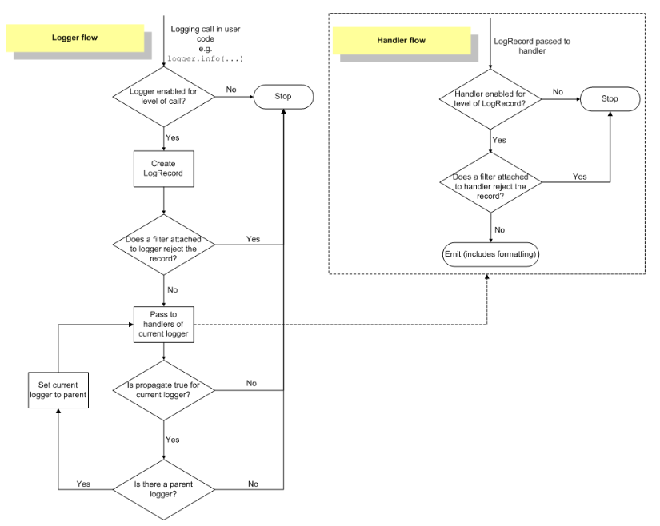

# Logging

> https://docs.python.org/3/library/logging.html#module-logging

- Python은 logging을 위한 `logging` 모듈을 제공한다.
  - `logging`은 log를 남김으로서 program이 동작할 때 발생하는 event들을 추적할 수 있게 해준다.
    - 개발자는 특정 event가 발생했다는 것을 보여주기위해 code에 log를 남긴다.
  - `print`를 사용해도 되는데 왜 굳이 `logging`을 사용해야 하는가?
    - `print`의 경우 중요도에 따라 로그를 분류할 수 없다.
    - 코드를 수정하지 않으면 어떤 log를 출력하고, 어떤 log를 출력하지 않을지 통제할 수가 없다.
    - `print` 되어야 하는 내용과 log로 남겨야 하는 내용이 뒤섞여 구분이 힘들어질 수도 있다.


- Log의 level과 상황별 사용

  - Log의 level
    - 기본값은 WARNING으로, 따로 설정해주지 않을 경우 WARNING 이상의 log들만 보이게 된다.

  | Level    | 용도                                                         |
  | -------- | ------------------------------------------------------------ |
  | DEBUG    | 일반적으로 문제가 발생했을 때 문제를 진단하기 위한 구체적인 정보를 작성한다. |
  | INFO     | Software가 예상대로 동작했음을 확인하기 위해서 사용한다.     |
  | WARNING  | 예상치 못한 일이 발생했거나, 가까운 미래에 문제가 발생할 수 있음(e.g. "disk space low")을 표현하기 위해 사용한다.<br />이 단계 까지는 software가 예상대로 동작하는 것이다. |
  | ERROR    | Software의 특정 function을 사용할 수 없다는 것을 나타내기 위해 사용한다. |
  | CRITICAL | Software 전체가 제대로 동작할 수 없을 정도의 심각한 error를 나타내기 위해 사용한다. |

  - Python의 `logging` module은 다양한 메서드를 지원하는데, 각 상황별 적절한 메서드는 아래와 같다.

  | 상황                                               | 적절한 메서드                                                |
  | -------------------------------------------------- | ------------------------------------------------------------ |
  | 일반적인 output을 보고자 할 때                     | `print()`                                                    |
  | Software의 정상적인 event 발생을 확인하고자 할 때  | `logging.info()`, `logging.debug()`(보다 구체적인 정보를 원하면 `logging.debug()`를 사용) |
  | 특정 runtime event에 관한 경고를 보여줘야 할 때    | `warnings.warm()`: 회피 가능한 issue거나, warning을 제거하기 위해 client app이 수정되어야 하는 경우<br />`logging.warning()`: client app이 warning을 제거하기 위해 할 수 있는게 없을 경우 |
  | 특정 runtime event에 관한 error를 보여줘야 할 때   | Exception을 raise한다.                                       |
  | Exception을 raise하지 않고 error를 suppress할 경우 | `logging.error()`, `logging.exception()`, `logging.critical()` |


- Log를 file에 작성하기

  - `basicConfig`를 사용하여, log를 file에 작성할 수 있다.
    - `encoding`의 경우 Python 3.10부터 추가되었다.
    - 따라서, 이전 버전을 사용하거나, 값을 주지 않을 경우 `open()`에서 기본값으로 사용하는 encoding이 설정되게 된다.

  ```python
  import logging
  
  logging.basicConfig(filename="example.log", encoding='utf-8', level=logging.DEBUG)
  logging.debug('This message should go to the log file')
  logging.info('So should this')
  logging.warning('And this, too')
  logging.error('And non-ASCII stuff, too, like Øresund and Malmö')
  ```

  - `basicConfig()`의 호출은 `debug()`, `info()`, 등의 호출보다 앞에 와야한다.
    - 그렇지 않을 경우 이 함수들은 `basicConfig()`를 기본 옵션들로 호출한다.
  - Log의 format을 설정하는 것도 가능하다.
    - `%()`를 사용하는 이전 방식이 아닌, `str.format()`도 사용 가능하다.

  ```python
  import logging
  logging.basicConfig(format='%(levelname)s:%(message)s', level=logging.DEBUG)
  logging.debug('This message should appear on the console')	# DEBUG:This message should appear on the console
  ```

  - Log format에서 사용할 수 있는 값들

    > 아래에 없는 것들은 https://docs.python.org/3.10/library/logging.html#logrecord-attributes 참조.

    - `asctime`: `LogRecord`가 생성된 시간을 사람이 읽기 편한 형식으로 변환 한 값.
    - `funcNmae`: Logging을 호출한 function의 이름.
    - `levelname`: Log의 level.
    - `message`: Log를 남길 message.
    - `module`: Logging을 호출한 module의 이름.
    - `process`: Process Id.


- 여러 module에서 logging하기

  - `main.py`

  ```python
  import logging
  import mylib
  
  def main():
      logging.basicConfig(filename='myapp.log', level=logging.INFO)
      logging.info('Started')
      mylib.do_something()
      logging.info('Finished')
  
  if __name__ == '__main__':
      main()
  ```

  - `mylib.py`

  ```python
  import logging
  
  def do_something():
      logging.info('Doing something')
  ```

  - 위에서 본 것과 같이 여러 module에서 사용한다고 하더라도 `basicConfig`의 내용이 모두 적용된다.


- Logging library는 module화된 방식을 채택한다.

  - 아래와 같은 다양한 component를 제공한다.
    - `loggers`: 개발자가 직접 사용할 수 있는 interface를 제공한다.
    - `handlers`: `loggers`에 의해 생성된 log를 적절한 목적지로 보낸다.
    - `filters`: 어떤 log가 출력될지를 필터링한다.
    - `formatters`: log의 최종적인 출력 형태를 결정한다.
  - Log event는 `LogRecord`의 instance의 형태로 `loggers`, `handlers`, `filters`, `formatters`를 거친다.

  


- Loggers

  - Logging은 `Logger` class의 instance의 method들을 호출하는 방식으로 수행된다.
    - 각 instance는 이름을 가지고 있으며, namespace에 `.`을 사용하여 계층적으로 저장된다.
    - 예를 들어 scan이라는 이름의 logger는 scan.text, scan.html 의 부모가 된다.
    - Logger 계층의 뿌리를 root logger라 한다.
    - Root logger의 이름은 root라고 출력된다.
  - Logger에 이름을 붙이기 위해 사용하는 convention은 아래와 같다.
    - 각 모듈에서 모듈 수준 logger를 사용하는 것이다.
    - logger 이름을 모듈 이름으로 설정함으로써 로거 이름을 통해 패키지/모듈 계층을 추적하는 것이 가능하다.

  ```python
  logger = logging.getLogger(__name__)
  ```

  - Logger는 아래와 같은 세 가지 역할을 한다.
    - Logging을 위한 메서드를 제공하는 interface를 제공한다.
    - 어떤 log가 처리해야 할 메시지인지를 판단한다.
    - `LogRecord` instance를 handlers에게 전달한다.
  - `getLogger()`는 logger instance에 대한 참조를 반환한다.
    - 만일 특정한 이름을 지정해주면 지정된 이름의 logger가 반환될 것이고, 아니라면 root logger가 반환된다.
    - `getLogger()`를 같은 이름으로 여러번 호출하더라도, 같은 logger instance에 대한 참조를 반환한다.
    - 계층 구조 상에서 하위에 있는 logger는 상위에 있는 logger의 자식 logger이다.

  - Logger를 설정하는 주요 method들은 아래와 같다.
    - `Logger.setLevel()`: 처리할 log의 최소 level을 설정한다.
    - `Logger.addHandler()`, `Logger.removeHandler()`: Handler object를 추가하고 제거한다.
    - `Logger.addFilter()`, `Logger.removeFilter()`: Filter object를 추가하고 제거한다.
  - Log message를 생성하는 method들은 아래와 같다.
    - `Logger.debug()`, `Logger.info()`, `Logger.warning()`, `Logger.error()`, `Logger.critical()`은 각각 method명에 해당하는 level의 log를 생성한다.
    - `Logger.exception()`은 `Logger.error()`와 유사하지만, `Logger.error()`와는 달리 stack trace를 dump한다는 차이가 있다.
    - `Logger.exception()`는 exception handler에서만 사용해야한다.
    - `Logger.log()`는 log level을 인자로 받으며, log level을 custom해야 할 때 사용한다.
  - Logger에는 effective level이라는 개념이 있다.
    - 만약 logger에 명시적으로 지정되지 않는다면, 해당 logger의 부모 logger의 level이 effective level로 사용된다.
    - 만약 부모 logger에도 명시적으로 지정된 level이 없다면, 명시적으로 지정된 level이 있는 조상을 찾을 때 까지 계층 구조를 따라 올라간다.
    - Root logger는 명시적으로 지정된 level(기본값은 WARNING)을 가지고 있으므로, 어떤 부모도 명시적으로 level을 지정해주지 않았을 경우 level은 root logger의 default level인 WARNING이 된다.
    - Effective level에 따라 어떤 log가 handler에 넘겨질지가 결정된다.
  - 자식 logger는 log를 자신의 조상 logger의 handler에게 전파한다.
    - 따라서 부모 logger와 자식 logger의 handler가 같다면, 자식 logger에 handler를 지정해줄 필요가 없다.
    - `Logger.propagte=False`를 통해 이를 막을 수도 있다.


- Handler

  - Log message를 handler에 설정된 목적지까지 보내는 역할을 한다.

    - Handler는 개발자가 직접 instance를 생성하는 식으로 사용하지 않고, logger에 설정해줄 handler를 custom하기 위해 사용된다.

  - Handler가 처리할 수 있는 목록들

    > https://docs.python.org/3.10/howto/logging.html#useful-handlers 에서 전체 목록을 확인 가능하다.
  
    - `StreamHandler`: Log를 stream으로 보낸다.
    - `FileHandler`: Log를 file로 보낸다.
    - `RotatingFileHandler`: Log를 file로 보내되 log file의 최대 크기를 설정하여 해당 크기가 넘어갈 경우 log file이 교체되도록 설정할 수 있다.
    - `TimeRotatingFileHandler`: Log를 file로 보내되, 특정 시간 간격으로 log file이 교체되도록 설정할 수 있다.
    - `WatchedFileHandler`: log file이 외부적으로 변경되었을 때 이를 감지하고, 새로운 파일을 열어 log를 기록한다.
  
  - Handler를 설정하는 method들
  
    - `setLevel()`: Logger object와 마찬가지로, 처리할 log의 최소 level을 설정한다. Logger에 설정해준 level과 다를 수 있으며, 따라서 logger에서는 처리된 log가 handler에서는 처리되지 않을 수 있다.
    - `setFormatter()`: Formatter object를 설정한다.
    - `addFilter()`, `removeFilter()`: Filter object를 설정하거나 설정에서 제거한다.
  
  - `WatchedFileHandler` 예시
    - 아래와 같이 실행했을 때, `./my_app.log`파일을 삭제하거나, 파일 이름을 변경하면, `WatchedFileHandler`는 새로운 `./my_app.log` 파일을 생성하여 다시 log를 작성한다.
  
  ```python
  import time
  import logging
  from logging.handlers import WatchedFileHandler
  
  logger = logging.getLogger('my_logger')
  logger.setLevel(logging.INFO)
  
  handler = WatchedFileHandler('./my_app.log')
  logger.addHandler(handler)
  
  while 1:
      logger.info('This is a log message')
      time.sleep(1)
  ```
  
  - `RotatingFileHandler`와 `WatchedFileHandler`의 차이
    - `RotatingFileHandler` 혹은 `TimeRotatingFileHandler`는 `WatchedFileHandler`와는 달리 작성 중인 log 파일에 변경 사항이 생긴다고 해서 새로운 파일을 생성하지는 않는다.
    - 대신, 각기 파일 크기와 시간에 따라서 기존 로그 파일을 백업하고 새로운 로그 파일을 생성하여 로그를 작성한다.
    - 따라서 두 handler는 사용 목적이 다르다.
    - `WatchedFileHandler`의 경우 logrotate와 같은 외부 툴을 통해 log file을 관리하고자 할 때 적합하고, `RotatingFileHandler`와 `TimeRotatingFileHandler` 는 외부 툴을 사용하지 않고도 로그 파일의 크기가 커지는 것을 방지하고자 할 때 적합하다.


- Formatter

  - Log message의 최종적인 순서, 구조, 내용을 정의한다.
  - Handler와는 달리, 개발자가 직접 instance를 생성하는 식으로 사용이 가능하다.
    - `fmt`에는 message format string을, `datefmt`에는 date format string을 , `style`에는 `fmt`의 style indicator를 넘긴다.
    - `fmt`를 넘기지 않을 경우 raw message가 그대로 출력된다.
    - `datefmt`를 넘기지 않을 경우 `%Y-%m-%d %H:%M:%S` 형태로 출력된다.
    - `style`을 넘기지 않을 경우 `"%"`가 기본값으로 설정된다.

  ```python
  logging.Formatter.__init__(fmt=None, datefmt=None, style="%")
  ```


- Logging 설정하기

  - Logging을 설정하는 방법은 아래 세 가지가 있다.
    - Loggers, handlers, formatters를 명시적으로 설정하는 방법.
    - `fileConfig()`를 사용하는 방법.
    - `dictConfig()`를 사용하는 방법.
  - 명시적으로 설정하는 방식의 예시

  ```python
  import logging
  
  # logger를 생성한다.
  logger = logging.getLogger('simple_example')
  logger.setLevel(logging.DEBUG)
  
  # console handler를 생성한다.
  ch = logging.StreamHandler()
  ch.setLevel(logging.DEBUG)
  
  # formatter를 생성한다.
  formatter = logging.Formatter('%(asctime)s - %(name)s - %(levelname)s - %(message)s')
  
  # formatter를 handler에 설정한다.
  ch.setFormatter(formatter)
  
  # handler를 logger에 설정한다.
  logger.addHandler(ch)
  
  # log를 남긴다.
  logger.debug('debug message')
  logger.info('info message')
  logger.warning('warn message')
  logger.error('error message')
  logger.critical('critical message')
  ```

  - `fileConfig()`를 사용하는 방법
    - Logging 설정을 위한 내용을 file에 저장한 후 해당 file을 읽어와 설정한다.
    - Logging 설정과 관련된 설정과 code를 분리할 수 있으며, 개발자가 아닌 사람도 쉽게 수정이 가능하다는 장점이 있다.
    - handler에 따라 class에 `handlers.TimedRotatingFileHandler`와 같이 `handlers`라는 모듈명을 적어줘야 하는 경우가 있다.
  
  ```python
  """
  logging.conf
  
  [loggers]
  keys=root,simpleExample
  
  [handlers]
  keys=consoleHandler
  
  [formatters]
  keys=simpleFormatter
  
  [logger_root]
  level=DEBUG
  handlers=consoleHandler
  
  [logger_simpleExample]
  level=DEBUG
  handlers=consoleHandler
  qualname=simpleExample
  propagate=0
  
  [handler_consoleHandler]
  class=StreamHandler
  level=DEBUG
  formatter=simpleFormatter
  args=(sys.stdout,)
  
  [formatter_simpleFormatter]
  format=%(asctime)s - %(name)s - %(levelname)s - %(message)s
  """
  
  import logging
  import logging.config
  
  # file 이름을 지정한다.
  logging.config.fileConfig('logging.conf')
  
  # create logger
  logger = logging.getLogger('simpleExample')
  
  # 'application' code
  logger.debug('debug message')
  logger.info('info message')
  logger.warning('warn message')
  logger.error('error message')
  logger.critical('critical message')
  ```
  
  - `dictConfig()`는 설정을 dictionary에 저장한 후 해당 dictionary를 읽어 logging 관련 설정을 하는 방식이다.
    - JSON, YAML 형태로 저장해 두었다가 이를 dictionary로 읽어와 설정하는 것도 가능하다.
    
  - `fileConfig()`와 `dictConfig()`의 자세한 사용법은 아래 링크 참조
  
    > https://docs.python.org/3.10/library/logging.config.html#logging-config-api
  


- 여러 process에서 한 파일에 logging하기

  - 기본적으로 Python의 logging 모듈은 thread-safe하다.
    - 따라서, 하나의 process에서 여러 thread가 한 file에 logging이 가능하다.
  - 그러나 여러 process에서 한 file에 logging하는 것은 지원하지 않는다.
    - 이는 Python에는 여러 process가 한 file에 직렬적으로 접근하는 표준화된 방식이 없기 때문이다.
  - 그러나 불가능한 것은 아니며, 아래와 같은 방식들을 사용할 수 있다.
    - 모든 process의 log를 `SocketHandler`에 보내고, socket을 읽고 log를 file에 작성하는 별도의 process를 하나 생성하는 방법.
    - `Queue`와 `QueueHandler`를 사용하여 모든 log를 하나의 process로 보내는 방법.
  - 아래 예시는 두 번째 방법을 사용한 것이다.

  ```python
  import logging
  import logging.handlers
  import multiprocessing
  
  # 아래는 순전히 예시를 위한 import로 실제 사용에는 필요 없을 수 있다.
  from random import choice, random
  import time
  
  
  def listener_configurer():
      root = logging.getLogger()
      h = logging.handlers.TimedRotatingFileHandler('./logs/mptest.log', 'a', 300, 10)
      f = logging.Formatter('%(asctime)s %(processName)-10s %(name)s %(levelname)-8s %(message)s')
      h.setFormatter(f)
      root.addHandler(h)
  
  # log가 오면 log를 작성하는 listener process
  # queue에 있는 LogRecords를 받아서 처리하는 역할을 한다.
  # 만일 None이 들어올 경우 실행이 종료된다.
  def listener_process(queue, configurer):
      configurer()
      while True:
          try:
              record = queue.get()
              # process에게 main application의 종료를 알리기위해 None을 보낸다.
              if record is None:
                  break
              logger = logging.getLogger(record.name)
              logger.handle(record)
          except Exception:
              import sys, traceback
              print('Whoops! Problem:', file=sys.stderr)
              traceback.print_exc(file=sys.stderr)
  
  
  LEVELS = [logging.DEBUG, logging.INFO, logging.WARNING,
            logging.ERROR, logging.CRITICAL]
  
  LOGGERS = ['a.b.c', 'd.e.f']
  
  MESSAGES = [
      'Random message #1',
      'Random message #2',
      'Random message #3',
  ]
  
  # worker 설정은 worker process의 실행이 시작될 때 완료된다.
  # Windows에서는 fork semantic을 사용할 수 없으므로, 
  # 각 process는 시작될 때 logging 설정 관련 code를 실행시킨다.
  def worker_configurer(queue):
      h = logging.handlers.QueueHandler(queue)  # Just the one handler needed
      root = logging.getLogger()
      root.addHandler(h)
      # send all messages, for demo; no other level or filter logic applied.
      root.setLevel(logging.DEBUG)
  
  # random log를 생성하기 위한 process
  def worker_process(queue, configurer):
      configurer(queue)
      name = multiprocessing.current_process().name
      print('Worker started: %s' % name)
      for i in range(10):
          time.sleep(random())
          logger = logging.getLogger(choice(LOGGERS))
          level = choice(LEVELS)
          message = choice(MESSAGES)
          logger.log(level, message)
      print('Worker finished: %s' % name)
  
  
  def main():
      # queue를 생성한다.
      queue = multiprocessing.Queue(-1)
      listener = multiprocessing.Process(target=listener_process,
                                         args=(queue, listener_configurer))
      listener.start()
      workers = []
      for i in range(10):
          worker = multiprocessing.Process(target=worker_process,
                                           args=(queue, worker_configurer))
          workers.append(worker)
          worker.start()
      for w in workers:
          w.join()
      # 실행이 종료되면 queue에 None을 보내 listener를 종료시킨다.
      queue.put_nowait(None)
      listener.join()
  
  if __name__ == '__main__':
      main()
  ```

  - 아래 예시는 main process에서 logging을 하되, 분리된 thread에서 하는 방식이다.

  ```python
  import logging
  import logging.config
  import logging.handlers
  from multiprocessing import Process, Queue
  import random
  import threading
  import time
  
  def logger_thread(q):
      while True:
          record = q.get()
          if record is None:
              break
          logger = logging.getLogger(record.name)
          logger.handle(record)
  
  
  def worker_process(q):
      qh = logging.handlers.QueueHandler(q)
      root = logging.getLogger()
      root.setLevel(logging.DEBUG)
      root.addHandler(qh)
      levels = [logging.DEBUG, logging.INFO, logging.WARNING, logging.ERROR,
                logging.CRITICAL]
      loggers = ['foo', 'foo.bar', 'foo.bar.baz',
                 'spam', 'spam.ham', 'spam.ham.eggs']
      for i in range(100):
          lvl = random.choice(levels)
          logger = logging.getLogger(random.choice(loggers))
          logger.log(lvl, 'Message no. %d', i)
  
  if __name__ == '__main__':
      q = Queue()
      d = {
          'version': 1,
          'formatters': {
              'detailed': {
                  'class': 'logging.Formatter',
                  'format': '%(asctime)s %(name)-15s %(levelname)-8s %(processName)-10s %(message)s'
              }
          },
          'handlers': {
              'console': {
                  'class': 'logging.StreamHandler',
                  'level': 'INFO',
              },
              'file': {
                  'class': 'logging.FileHandler',
                  'filename': 'mplog.log',
                  'mode': 'w',
                  'formatter': 'detailed',
              },
              'foofile': {
                  'class': 'logging.FileHandler',
                  'filename': 'mplog-foo.log',
                  'mode': 'w',
                  'formatter': 'detailed',
              },
              'errors': {
                  'class': 'logging.FileHandler',
                  'filename': 'mplog-errors.log',
                  'mode': 'w',
                  'level': 'ERROR',
                  'formatter': 'detailed',
              },
          },
          'loggers': {
              'foo': {
                  'handlers': ['foofile']
              }
          },
          'root': {
              'level': 'DEBUG',
              'handlers': ['console', 'file', 'errors']
          },
      }
      workers = []
      for i in range(5):
          wp = Process(target=worker_process, name='worker %d' % (i + 1), args=(q,))
          workers.append(wp)
          wp.start()
      logging.config.dictConfig(d)
      lp = threading.Thread(target=logger_thread, args=(q,))
      lp.start()
      
      for wp in workers:
          wp.join()
      # logging thread에게 실행이 종료되었다는 것을 알려준다.
      q.put(None)
      lp.join()
  ```


# Interface

> https://jellis18.github.io/post/2022-01-11-abc-vs-protocol/

- Python에서의 interface 구현
  - Python은 Java와 달리 `interface` keyword를 지원하지 않는다.
  - 그럼에도 interface의 구현이 불가능 한 것은 아닌데, Python에서 interface를 구현할 수 있는 방법은 크게 두 가지가 있다.
    - ABC 사용
    - Protocol(Structural subtyping) 사용


- ABC

  - Python에서 추상 클래스를 구현할 수 있도록 해주는 Python 내장 모듈이다.
  - 주로 두 가지 목적으로 사용한다.
    - Interface 생성.
    - 추상 클래스 생성
  - Interface 생성을 위해 사용
    - ABC class를 상속 받고, 모든 메서드에 `@abstractmethod` decorator를 추가하여 인터페이스를 생성할 수 있다.
    - 이제 People을 구현(implement)한 class에서 아래 메서드 들 중 하나라도 빼먹는다면, `TypeError`가 발생하게 된다.

  ```python
  from abc import ABC, abstractmethod
  
  class People(ABC):
      @abstractmethod
      def think(self):
          pass
  
      @abstractmethod
      def sleep(self):
          pass
  ```

  - 보다 일반적인 사용법은 추상 클래스 생성하기 위해 사용하는 것이다.
    - 모든 method가 abstract method인 interface와 달리, 추상 클래스는 하나 이상의 method가 abstract method인 클래스로, 자식 클래스마다 공통으로 들어가는 메서드와, 다르게 들어가야 하는 메서드를 분리하기 위해 사용한다.


- Protocol

  - Structural subtyping(static duck typing)을 Python의 type annotation(type hint)에 추가하기 위해 [PEP-544](https://peps.python.org/pep-0544/)에서 소개되었다.
  - 주로 두 가지 목적으로 사용된다.
    - Class 혹은 함수를 위한 interface 생성.
    - Generic type에 경계를 설정.
  - Interface 생성
    - ABC를 사용했을 때와는 달리 method에 추가적으로 decorator를 붙이지 않아도 되며, 관례상 `pass` 대신 `...`을 사용한다.

  ```python
  from typing import Protocol
  
  class People(Protocol):
      def think(self):
          ...
  
      def speak(self):
          ...
  ```


# Python Bytecode

> https://towardsdatascience.com/understanding-python-bytecode-e7edaae8734d

- 사전지식
  - Programming language의 source code는 interpreter 혹은 compiler를 통해 실행된다.
  - Compile 언어에서 compiler는 source code를 바로 binary 형태의 기계어(machine code)로 변환한다.
    - 기계어는 hardware나 OS에 따라 달라질 수 있다.
    - 일련의 편집을 거친 후에, 기계(컴퓨터, CPU)는 기계어를 실행하게 된다.
  - Interpreter 언어에서는 source code는 기계에서 바로 실행되지 않는다.
    - Interpreter라 불리는 또 다른 program이  source code를 직접 일고 실행한다.
    - Interpreter는 hardware나 OS에 따라 달라질 수 있으며, source code의 각 구문을 기계어로 변환한 뒤 실행한다.
  - Bytecode
    - Python은 일반적으로 interpreter 언어로 분류된다.
    - 그러나 사실은 compile과 interpreting을 모두 수행한다.
    - Source code(`.py` 파일)가 실행되면 Python은 먼저 source code를 bytecode로 컴파일한다.
    - Bytecode는 low-level의 platform 독립적인 code이다.
    - 그러나, 기계어는 아니며 기계에서 직접 실행할 수는 없다.
  - PMV(Python Virtual Machine)
    - PVM은 bytecode를 실행하는 interpreter로 Python system의 일부이다.
    - 즉, bytecode는 PVM이라는 virtual machine에서 실행할 일련의 명령어들의 모음이다.
    - Bytecode는 platform에 독립적이지만, PVM은 target machine(Python code를 실행시키려는 기계)에 특화되어 있다(종속적이다).
  - CPython
    - 가장 널리 사용되는 Python 구현체로 C로 작성되었다.
    - CPython은 Python source code를 컴파일하여 bytecode로 변환한다.
    - 변환된 bytecode는 CPython virtual machine에서 실행된다.


- Bytecode file 생성하기

  - Python에서 bytecode는 `.pyc` 파일에 저장된다.
    - Python3에서 bytecode file은 `__pycache__`라는 폴더에 저장되며, 이 폴더는 다른 file을 import할 때 자동으로 생성된다.
    - 그러나 만일 다른 file을 import하지 않는다면, 생성되지 않는데, 이 경우 수동으로 생성할 수 있다.
  - Source code file컴파일하기
    - 아래 명령어를 수행하면 `__pycache__` 폴더와 `.pyc` 파일이 생성된다.
    - 만일 compile할 source code 파일을 명시하지 않을 경우 경로 상의 모든 source code를 compile한다.

  ```bash
  $ python -m compileall [file_name1.py file_name2.py ...]
  ```

  - Source code 컴파일하기
    - `compile` 함수를 사용하여 일부만 컴파일 하는 것이 가능하다.
    - `source` parameter는 compile할 source code를 string, byte object 혹은 AST object로 입력한다.
    - `filename` parameter는 source code가 작성된 file의 이름을 입력하면 되며, 만일 file에 작성된 것이 아닐 경우(REPL 등) 빈 문자열을 입력한다.
    - `mode` parameter는 `"exec"`, `"eval"`, `"single"`중 하나를 입력하면 된다.
    - `"exec"`은 모든 형식의 Python source code를 input으로 받으며 이를 bytecode로 변환한다.
    - `"eval"`은 single expression을 input으로 받으며 이를 bytecode로 변환한 후 expression의 결과를 반환한다.
    - `"single"`은 single statement 혹은 `;`로 분리된 여러 개의 statement를 input으로 받으며, 만약 마지막 statement가 expression이라면 expression의 값의 `repr()` 결과를 stdout에 출력한다.

  ```python
  s='''
  a=5
  a+=1
  print(a)
  '''
  compile(s, "", "exec")
  compile("a+7", "", "eval")
  compile("a=a+1", "", "single")
  ```


- Code object

  - `compile`함수의 반환값은 `code` class의 instance이다.
    - `compile` 함수로 생성된 bytecode를 저장하기위해 사용한다.
    - `code`의 instance에는 bytecode뿐 아니라 CPython이 bytecode를 실행하기 위해 필요한 정보들이 포함되어 있다.

  ```python
  s='''
  a=5
  a+=1
  print(a)
  '''
  code_obj = compile(s, "", "exec")
  print(code_obj)			# <code object <module> at 0x7fbba6a6ea80, file "", line 2>
  print(type(code_obj))	# <class 'code'>
  ```

  - `code` object는 `exec()` 혹은 `eval()` 함수에 인자로 넣어 실행하거나 평가할 수 있다.

  ```python
  exec(compile("print(5)", "", "single"))  # 5
  ```

  - 함수가 정의될 때, `code` object가 생성되며, 함수의 `__code__` attribute를 통해 접근할 수 있다.

  ```python
  def funcion():
      pass
  print(function.__code__)	# <code object function at 0x7f834dc7c660, file "test.py", line 1>
  ```

  - `code` object에 저장된 bytecode를 가져오려면 `co_code` attribute를 사용하면 된다.
    - 반환값은 `b` prefix가 붙은 bytes literal이다.
    - 각 byte들은 0~255까지의 10진수 중 하나의 값을 가지며, 따라서 bytes literal은 0~255 사이의 integer들의 연속(sequence)이다.
    - 각 byte를 byte의 값과 일치하는 ASCII 문자로도 볼 수 있다.
    - 맨 앞의 `\x` escape의 의미는 다음 두 chacacter가 16진수로 해석되어야 함을 의미한다.

  ```python
  c = compile("print(5)", "", "single")
  
  print(c.co_code)		    # b'e\x00d\x00\x83\x01F\x00d\x01S\x00'
  # 첫 번째 byte의 값
  print(c.co_code[0])         # 101
  # 첫 번째 byte의 값을 ASCII 문자로 변환
  print(chr(c.co_code[0]))    # e
  ```

  - 위에서 본 일련의 bytes는 CPython에 의해 해석된다.
    - 그러나, 사람이 보기 편한 형식은 아니기에, 이 bytes들이 어떻게 실제 명령문과 mapping되는지를 이해해야한다.


- Bytecode 상세

  - Bytecode는 Python interpreter가 실행할 low-level program 혹은 일련의 명령문들이라고 생각하면 된다.
    - Python 3.6 이후로, Python은 각 instruction마다 2bytes를 사용한다.
    - 한 byte는 opcode라 불리는 instruction의 code에 사용하고, 다른 한 byte는 oparg라 불리는 opcode의 argument에 사용한다.
    - 각 opcode는 opname이라 불리는 사람이 읽기 쉬운이름을 가지고 있다.
    - Bytecode instruction은 일반적으로 `opcode oparg`의 형태를 가진다.
  - `dis`
    - 위에서 살펴본 bytecode에 opcode들은 들어있을 것이므로, 우리는 이것들을 적절한 opname과 mapping만 시켜주면 된다.
    - 이를 가능하게 해주는 것이 `dis`라는 모듈이다.
    - 이 모듈에는 `opname`이라 불리는 모든 opname들이 저장된 list가 있다.
    - 이 list의 i번째 element는 opcode가 i인 instruction의 이름이 된다.
  - 어떤 instruction들은 argument가 필요 없다.
    - 따라서 이들은 opcode 이후의 byte를 무시헌다.
    - 특정 숫자 이하의 값을 가지는 opcode들은 그들의 argument를 무시한다.
    - 이 특성 숫자는 `dis.HAVE_ARGUMENT`에 저장되어 있으며, 기본값은 90이다.
    - 즉 opcode의 값이 `dis.HAVE_ARGUMENT`보다 크거가 같다면, arugment가 있는 것이고, 아니라면 arugment를 무시한다.

  ```python
  import dis
  
  # 아래와 같은 bytecode가 있을 때
  bytecode = b'd\x00Z\x00d\x01S\x00'
  for byte in bytecode:
      print(byte, end=' ')	# 100 0 90 0 100 1 83 0
      
  
  # 첫 두 개의 byte들인 100 0에서 opcode인 100은 아래와 같이 LOAD_CONST를 의미하고, 
  print(dis.opname[100])	# LOAD_CONST
  # 100은 0보다 크므로 oparg인 0을 무시하지 않는다. 결국 bytecode 100 0은 LOAD_CONST 0을 의미한다.
  ```

  - `EXTENDED_ARG`
    - 어떤 instruction들은 1 byte에 맞지 않을 만큼 클 수도 있다.
    - 이러한 경우를 처리하기 위해 `144`라는 특별한 opcode가 존재한다.
    - opcode 144의 opname은 `EXTENDED_ARG`로, 이 값은 `dis.EXTENDED_ARG`에 저장되어 있다.
    - 이 opcode는 1 byte 보다 큰 argument를 가지는 어떤 opcode에든 prefix로 붙을 수 있다.
    - 예를 들어 131이라는 opcode가 있고(opname은 `CALL_FUNCTIOM`), oparg가 260이라고 가정해보자.
    - 그러나 1byte가 담을 수 있는 최대 값은 255이기때문에, 260은 1byte에 담을 수 없다.
    - 따라서 `EXTENDED_ARG`를 prefix로 붙여야 한다.

  ```bash
  EXTENDED_ARG 1
  CALL_FUNCTION 4
  ```

  - `EXTENDED_ARG`의 oparg
    - Interpreter가 `EXTENDED_ARG`를 실행할 때, `EXTENDED_ARG`의 oparg인 1을 8bits만큼 left-shift 시켜 임시 변수에 저장된다.
    - 즉, binary value인 `0b1`은 `0b100000000`이 되는데, 이 값은 10진수에서 1에 256을 곱한 값이다(`1 << 8`은 256이다).
    - 이 때, interpreter가 다음 instruction을 실행시키면 2 byte value가 or bit 연산자를 통해 해당 instruction의 oparg에 추가된다(위 예시의 경우 4).
    - 결국 최종적으로 `CALL_FUNCTION`의 oparg의 실제 값은 260이 된다.

  ```python
  # extended_arg는 2 bytes를 가지게 된다.
  extened_arg = 1 << 8			# 256
  
  # bitwise 연산자 or 사용
  extened_arg = extened_arg | 4	# 260
  
  # 결국 아래와 같은 instruction은
  EXTENDED_ARG 1
  CALL_FUNCTION 4
  
  # 아래와 같이 해석된다.
  EXTENDED_ARG 1
  CALL_FUNCTION 260 
  ```

  - 각 opcode 별로 최대 세 개의 `EXTENDED_ARG`가 붙을 수 있다.
    - 즉 oparg의 가능한 크기는 4byte까지이다.


- `code` 객체의 attribute들

  - 아래와 같이 `code` 객체를 생성한다.
    - 상기했듯 `compile()` 함수는 `code` 객체를 반환한다.

  ```python
  s = '''
  a = 5
  b = 'text'
  def f(x):
      return x
  f(5)
  '''
  c=compile(s, "", "exec")
  print(c.co_consts)			# (5, 'text', <code object f at 0x7fe7cca80c90, file "", line 4>, 'f', None)
  print(c.co_names)       	# ('a', 'b', 'f')
  ```

  - `co_consts`
    - Bytecode에서 사용되는 literal들을 담고 있는 tuple이다.
    - 함수의 body는 또 다른 code object에 저장된다(`<code object f at 0x7fe7cca80c90, file "", line 4>`).
    - 상기했듯 `exec` 모드로 실행된 `compile()` 함수는 최종적으로 None을 반환하는 bytecode를 생성하므로, None도 포함되어 있다.
    - 함수의 기본 반환값은 None이므로 함수의 `code.co_const`에는 항상 None이 포함되어 있다.
    - 심지어 반환값이 있을 때도 None이 포함되어 있는데, 이는 Python이 효율성을 위해서 함수의  `return` 문에 항상 도달하는지를 check하지 않기 때문이다.

  ```python
  def f(x):
      x += 2
      return x
  
  # 함수의 code object에는 항상 None이 포함된다.
  print(f.__code__.co_consts)   # (None, 2)
  ```

  - `co_names`
    - Bytecode에서 사용되는 이름들을 담고 있는 tuple이다.
    - 함수명, 변수명, 클래스명, object의 attribute명 등이 들어간다.
  - `co_varnames`
    - Bytecode에서 사용되는 local name들을 담고 있는 tuple이다.
    - 아래 예시를 보면 `z`는 포함되어 있지 않은데, `t`는 `f`의 local variable이 아니라 closure인 `g` 내부에서 접근하기 때문이다.
    - 사실 `x`도 local variable이 아니지만, 함수의 인자이기 때문에 항상 `co_varnames`에 들어가게 된다. 

  ```python
  def f(x):
      y = 3
      z = 5
      def g(p):
          return z*x + p
      return g
  
  print(f.__code__.co_varnames)	# ('x', 'y', 'g')
  ```

  - `co_cellvars`
    - Nonlocal variable 들을 저장하고 있는 tuple이다.
    - 어떤 함수의 내부 함수 안에서 접근하는 local variable 들이 담기게 된다.

  ```python
  def f(x):
      y = 3
      z = 5
      def g(p):
          return z*x + p
      return g
  
  print(f.__code__.co_cellvars)	# ('x', 'z')
  ```

  - `co_freevars`
    - Free variable 들을 저장하고 있는 tuple이다.
    - Free variable은 내부 함수에서 접근할 수 있는 외부 함수의 local variable을 말한다.

  ```python
  def f(x):
      y = 3
      z = 5
      def g(p):
          return z*x + p
      return g
  
  h = f(1)
  # f가 반환한 h의 code object를 확인한다.
  print(h.__code__.co_freevars)   # ('x', 'z')
  ```


- oparg

  - 예시 코드

  ```python
  s = '''
  a = 5
  b = 'text'
  def f(x):
      return x
  f(5)
  '''
  c=compile(s, "", "exec")
  print(c.co_consts)			# (5, 'text', <code object f at 0x7fe7cca80c90, file "", line 4>, 'f', None)
  ```

  - oparg의 의미는 oparg의 opcode에 달려 있다.

    - 다양한 종류의 opcde의 category가 있으며, oparg는 각기 다른 의미를 가진다.
    - `dis` module을 사용하여 각 category에 해당하는 opcode들을 확인할 수 있다.

  - `dis.hasconst`

    - `dis.hasconst`에는 100이라는 opcode만을 담고 있는 list가 저장되어 있다.
    - opcode 100의 opname은 `LOAD_CONST`이다.
    - opcode 100의 oparg는 `co_const` tuple의 index이다.
    - 즉, `LOAD_CONST 1`에서 oparg에 해당하는 `1`은 `co_const`의 1번 인덱스에 해당하는 값이다.
    - 위 예시 코드에서 `co_consts`의 1번 인덱스에 해당하는 값이 `"text"`였으므로, `LOAD_CONST 1`은 사실 `LOAD_CONST 'text'`인 것이다.

    ```python
    import dis
    print(dis.hasconst)		# [100]
    ```

  - `dis.hasname`

    - 여기 담겨 있는 opcode들의 oparg는 `co_names` tuple의 index이다.

  - `dis.haslocal`

    - 여기 담겨 있는 opcode들의 oparg는 `co_varnames` tuple의 index이다.

  - `dis.hasfree`

    - 여기 담겨 있는 opcode들의 oparg는 `co_cellvars`와 `co_freevars` tuple의 index이다.

  - `dis.hascompare`

    - 여기 담겨 있는 opcode들의 oparg는 `dis.cmp_op` tuple의 index이다.
    - `dis.cmp_op`에는 비교 연산자, 멤버 연산자(`in`)가 들어있다.

  - `dis.hasjrel`

    - 여기 담겨 있는 opcode들의 opargsms `offset + 2 + oparg`로 대체되어야 한다.
    - `offset`은 opcode를 표현하는 일련의 bytecode들의 index를 의미한다.


- `co_lnotab`

  - `code` object의 또 다른 attribute로, bytecode의 line number 정보를 저장하고 있다.
    - 각 bytecode offset을 source code의 line number와 매핑하기 위해 사용한다.
  - 예시
    - 아래 예시는 줄이 단 3개 뿐인 코드를 컴파일한 것이다.

  ```
  1        0 LOAD_CONST             0 
           2 STORE_NAME             0 
  
  2        4 LOAD_NAME              0 
           6 LOAD_CONST             1 
           8 INPLACE_ADD             
          10 STORE_NAME             0 
  
  3       12 LOAD_NAME              1 
          14 LOAD_NAME              0 
          16 CALL_FUNCTION          1 
          18 POP_TOP                 
          20 LOAD_CONST             2 
          22 RETURN_VALUE
  ```

  - 줄 번호와 bytecode의 offset을 아래와 같이 mapping한다.
    - bytecode offset은 항상 0부터 시작한다.
    - `code` object의 `co_firstlineno`에는 0번 offset에 해당하는 line number가 저장되어 있다.(위 예시의 경우 1)

  | bytecode offset | source code line number |
  | --------------- | ----------------------- |
  | 0               | 1                       |
  | 4               | 2                       |
  | 12              | 3                       |

  - Python은 offset과 line number를 그대로 저장하지는 않는다.
    - Python은 오직 한 row에서 다음 row로의 증가만 저장한다.
    - 즉 아래 표에서 `bytecode offset increment`와 `source code line number increment`만 저장한다.
    - Python은 이 증가수치를 가지고  `bytecode offset increment`, `  source code line number increment` 순서를 반복하여 수열을 만든다.
    - 완성 된 수열은 4 1 8 1이다.

  | bytecode offset | source code line number | bytecode offset increment | source code line number increment |
  | --------------- | ----------------------- | ------------------------- | --------------------------------- |
  | 0               | 1                       | -                         | -                                 |
  | 4               | 2                       | 4(4-0)                    | 1                                 |
  | 12              | 3                       | 8(12-4)                   | 1                                 |

  - 그 후 각 숫자를 byte로 변환하고 전체 bytes를 `co_lnotab`에 저장된다.

  ```python
  b'\x04\x01\x08\x01'
  ```

  


