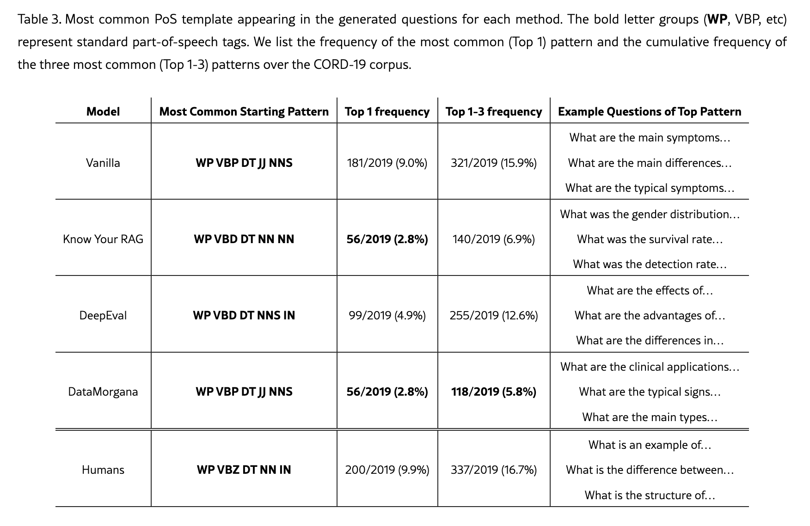

# Generating Diverse Q&A Benchmarks for RAG Evaluation with DataMorgana

> https://arxiv.org/html/2501.12789v1

- 문제
  - 특정 도메인에서의 RAG 평가는 해당 도메인의 고유한 요구사항을 반영하는 벤치마크를 필요로 한다.
    - 가장 이상적인 데이터는 query log틀 통해 얻은 실제 사용자들의 question과 도메인 전문가가 제공한 golden answer 쌍이다.
    - 그러나 실제 데이터는 얻기 힘들기 때문에 일반적으로 LLM을 사용하여 synthetic data를 생성하여 사용한다.
  - 기존 솔루션들은 문서가 주어지면 그에 대한 질문을 생성해 질의응답(Q&A) 쌍을 만드는 범용적인 방식을 취한다.
    - 그러나 생성된 질문들이 개별적으로는 양호할 수 있지만, 실제 최종 사용자가 RAG 시스템과 상호작용하는 다양한 방식을 충분히 포괄할 만큼 다양하지는 않은 것이 일반적이다.


- 최근의 방법론들

  - Q&A pair를 생성하는 일반적인 방식은 생성후 필터링 하는 방식(generate then filter)이다.
    - 문서들의 corpus가 있을 때, 문서들의 subset을 만들고, LLM을 사용하여 각 문서로 답할 수 있는 질문들을 생성한다.
    - 그 다음 LLM이 문서를 기반으로 각 질문에 대해 답변을 생성하게 한다.
    - 마지막으로 생성된 (질문, 답변, 문서) tuple을 여러 기준(golden question과의 의미적 유사도, 다양성 등)에 따라 필터링한다.
  - InPars
    - InPars는 이러한 패러다임을 따르되, 답변 생성 과정은 건너뛰고 질문 생성에 집중한다. 
    - Few-shot 예제를 통해 LLM이 주어진 문서에 대한 질문을 생성하도록 유도한 뒤 각 (질문, 문서) 쌍을 cross encoder를 통해 reranking해 점수가 낮은 질문들을 필터링한다.
  - Know Your RAG
    - 사용자가 시스템과 상호작용할 수 있는 다양한 방식을 포괄하기 위해 질문 유형의 분류체계(taxonomy)를 정의한다.
    - 질문 생성 과정은 세 단계로 이루어지는데, 먼저 문서를 여러 statement로 분해하고, 질문 유형에 따라 앞서 추출된 statement를 바탕으로 새로운 statement를 생성하며, 그중 하나의 statement를 질문 생성을 위한 기초 정보로 선택한다.
    - 새로운 statement는 앞서 정의한 질문 유형의 분류체계에 따라 생성된다.
    - 모든 단계는 모두 LLM을 호출하여 수행한다.
  
  ```
  # 새로운 statement 생성 예시
  원본 statement (1단계 추출):
  "서울 인구는 약 950만 명이다"
  
  taxonomy가 'reasoning'인 경우 (2단계):
  새 statement = "서울 인구가 인접 도시들의 합보다 많다"
  (원본 사실을 추론 가능한 형태로 변형/확장)
  
  taxonomy가 'summary'인 경우 (2단계):
  새 statement = "서울은 인구가 많고 GDP 비중이 높은 도시다"
  (여러 정보를 합쳐 압축한 형태로 변형)
  ```
  
  - RAGAs
    - RAG 시스템을 위한 유명한 평가 도구로, synthetic Q&A 벤치마크 생성 기능도 함께 지원한다. 
    - 먼저 코퍼스로부터 엔티티, 토픽, 그리고 이들 간의 관계를 식별해 지식 그래프(KG)를 생성한다. 
    - 이후 테스트 질문들은 이 지식 그래프를 기반으로 LLM 기반 접근법을 통해 생성된다.
    - Know Your RAG와 유사하게, RAGAs 역시 질문 유형(단일 홉 vs 다중 홉, 구체적 vs 추상적)뿐 아니라 사용자 페르소나(시니어, 주니어 등)를 함께 고려하여 생성되는 질문의 유형이 풍부해지고 다양성이 향상된다.
  - 이 밖에도 다양한 방법들이 제안되었다.
    - Promptagator, ARES는 동일한 파이프라인을 따르지만, 생성된 질문을 검색 쿼리로 특정 정보 검색(IR) 시스템에 입력했을 때 해당 질문과 연관된 문서가 결과 목록 상위에 나타나는 경우에만 해당 쌍을 유지한다.
    - Shakeri et al.은 파인튜닝된 인코더-디코더 모델을 사용해 입력 문서로부터 질문과 답변을 생성한 다음, 모델의 perplexity(혼란도) 점수를 기준으로 이를 필터링한다.
    - Yuan et al.은 LLM이 생성한 후보 질문들 중에서 고품질 질문을 선별하기 위한 프롬프트 기반 접근법을 제안했다.


- DataMorgana
  - DataMorgana는 주로 RAG 시스템, 그리고 Q&A 벤치마크를 필요로하는 그 외 시스템들의 학습 및 테스트를 위한 합성 벤치마크를 생성하기 위해 고안되었다.
    - 다른 도구들과 차별화되는 점은, 높은 다양성을 지닌 벤치마크를 손쉽게 생성할 수 있는 설정(configuration) 기능을 제공한다는 것이다.
    - DataMorgana는 사용자 카테고리와 질문 카테고리에 대한 세밀한 설정이 가능하며, 벤치마크 내에서 이들의 분포를 직접 제어하는 기능도 지원한다.
    - 가볍고 2단계 프로세스를 사용함으로써 효율적이고 빠른 반복 작업을 보장하는 동시에, 예상되는 실제 트래픽을 반영한 벤치마크를 생성한다.
    - Q&A 쌍이 생성되는 방식은 자연어 설명을 통해 설정하며, 이를 통해 비기술적인 사용자도 손쉽게 커스터마이징할 수 있다.
    - 다양한 생성 방식과 관련해서는, 최종 사용자와 질문 양측 모두에 대해 사전에 정의된 옵션에 제한받지 않고 다양한 범주(categorization)와 그 분포를 자유롭게 정의할 수 있도록 지원한다.
    - 이러한 범주들은 함께 결합되어 Q&A 쌍을 정의하는 조합적으로 매우 많은 수의 가능성을 만들어내며, 이를 통해 매우 다양한 벤치마크를 생성할 수 있다.
  - DataMorgana는 두 단계로 동작한다.
    - 첫 번째는 설정 단계로, DataMorgana 관리자(admin)가 자신이 원하는 요구사항을 명시하는 단계이다.
    - 두 번째는 생성 단계로, 입력된 설정 정보를 바탕으로 LLM의 도움을 받아 원하는 벤치마크를 실제로 생성하는 단계이다.


- 설정 단계

  - 설정(configuration) 단계에서는 질문과 최종 사용자(end-user) 양측 모두에 대해 세부적인 범주화(categorization)와 그에 따른 카테고리를 정의한다.
    - 이를 통해 RAG 애플리케이션에서 예상되는 트래픽에 대한 높은 수준(high-level)의 정보를 제공할 수 있다.
    - 질문과 사용자에 대한 범주화는 필요한 만큼 얼마든지 정의할 수 있다.
    - 단, 하나의 범주화 내에 속한 카테고리들은 상호 배타적(mutually exclusive)이어야 한다.
  - 이러한 설정은 원하는 대로 생성된 벤치마크를 커스터마이징하는 데 필요한 모든 정보를 담은 JSON 파일로 정의한다. 
    - 예를 들어, 사용자가 사실형(factoid) 질문과 비사실형(non-factoid) "경험(experience)" 질문을 생성하고자 한다면 아래와 같이 설정하면 된다.
    - `description`에는 자연어로 각 카테고리에 대한 설명을 설정한다.
    - `probability` 속성으로 각 카테고리의 분포 확률을 설정할 수 있다.

  ```json
  {
      "categories": [
          {
              "name": "factoid",
              "probability": 0.25,
              "description": "A question seeking a specific, concise piece of information or a short fact about a particular subject, such as a name, date, or number."
          },
          {
              "name": "non-factoid-experience",
              "probability": 0.75,
              "description": "A question to get advice or recommendations on a particular topic."
          }
      ]
  }
  ```

  - 최종 사용자(end-user)에 대한 범주화도 질문 범주화와 동일한 방식으로 정의한다. 
    - 아래 예시는 사용자의 전문성(expertise)을 정의하는 최종 사용자 범주화를 지정하는 방식이다.

  ```json
  {
      "categories": [
          {
              "name": "expert",
              "probability": 0.50,
              "description": "a specialized user with deep understanding of the corpus."
          },
          {
              "name": "novice",
              "probability": 0.50,
              "description": "a regular user with no understanding of specialized terms."
          }
      ]
  }
  ```


- 생성 단계

  - Benchmark는 Q&A 쌍을 한 번에 한 쌍씩 점진적으로 생성한다.
    - 각 쌍은 DataMorgana가 설정 파일을 기반으로 자동으로 생성한 프롬프트를 LLM에 전달하여 생성된다.
    - 설정 파일 내 구조화된 부분(e.g. 각 카테고리의 `name`, `probability`)은 내부적으로 DataMorgana가 구성하는 프롬프트를 생성하는 데 활용된다.
    - 이 때 `description` 값은 프롬프트에 그대로(as is) 삽입된다는 점에 주의해야 한다.
    - 이를 통해 DataMorgana 사용자는 상당한 자유도를 갖게 되며, 벤치마크를 생성하는 과정에서 필요에 따라 카테고리에 대한 설명을 자유롭게 반복적으로 수정(iterate) 할 수 있게 된다.
  - 하나의 Q&A 쌍은 아래 4단계를 거쳐 생성된다.
    - 먼저 사용자 카테고리 $u_i$와 질의 카테고리 $c_j$가 설정 파일에 명시된 분포 확률에 따라 각 범주별로 선택된다. 즉 ($u_1, c_1, ..., c_4$)와 같은 tuple이 생성된다. 이 튜플과 각 카테고리에 설정된 `description`이 함께 프롬프트 템플릿을 인스턴스화하는 데 사용된다. 이렇게 모든 카테고리 조합을 허용함으로써, 조합론적으로 매우 많은 수의 선택지가 가능해지며, 그 결과 매우 다양한 벤치마크가 만들어진다.
    - 문서 $d_i$가 RAG corpu에서 샘플링되어 프롬프트에 추가된다.
    - LLM이 instance화된 프롬프트를 전달 받아 문서 $d_i$에 대한 k개의 Q&A 후보 쌍을 생성한다.
    - 마지막으로 생성된 후보들이 프롬프트에 작성된 제약 조건을 충족하는지, 사용자 카테고리와 질의 카테고리에 속하는지, 문서에 충실한지(faithful)를 확인한다. 만약 조건을 모두 만족하는 쌍이 여러 개 있을 경우, 그중 하나가 샘플링된다.

  - 프롬프트 예시

  ```
  You are a user simulator that should generate [num_questions]
  candidate questions for starting a conversation.
  
  The [num_questions] questions must be about facts discussed in
  the documents you will now receive. When generating the questions,
  assume that the real users you must simulate, as well as the readers
  of the questions, do not have access to these documents. Therefore,
  never refer to the author of the documents or the documents
  themselves. Also, assume that whoever reads the questions will read
  each question independently. The [num_questions] questions must
  be diverse and different from each other. Return only the questions
  without any preamble. Write each pair in a new line, in the following
  JSON format: ’{"question": <question>, "answer": <answer>}.’
  
  ### The generated questions should be about facts from the
  following document:
  [document (d_i)]
  
  ### Each of the generated questions must reflect a user with
  the following characteristics:
      - They must be [description of user category 1 (u_1)]
      - They must be [description of user category 2 (u_2)]
      …
  ### Each of the generated questions must have the following
  characteristics:
      - It must be [description of question category 1 (c_1)]
      - It must be [description of question category 2 (c_2)]
      …
  ```


- 결과

  - 질적 다양성
    - Q&A 셋 생성을 위한 다른 방법론들과 비교했을 때 보다 다양한 유형의 질문들이 나오는 것을 확인할 수 있다.
    - 다양성의 지표로 생성된 질문의 품사 구조를 사용했다.
    - DataMorgana로 생성한 질문들에서는 가장 흔한 품사 구조(의문사 동사 관사 형용사 복수명사)로 생성된 질문들이 top 3안에 드는 비율이 5.8%밖에 되지 않을 정도로 다양한 형태로 생성되는 것을 확인할 수 있다.

  

  - 양적 다양성

    - N-Gram Diversity (NDG) Score: 1~4-gram에 대해 "고유 n-gram 수 / 전체 n-gram 수"를 합산하여 같은 단어 조합이 반복될수록 값이 낮아진다.

    - Self-Repetition Score (SRS): 4-gram을 기준으로, 다른 질문과 겹치는 4-gram을 하나라도 가진 질문의 비율을 계산하는데, 값이 높을수록 비슷한 표현이 여러 질문에서 재사용된다는 의미이다.
    - Compress Ratio (CR): 압축률 기반 다양성으로, 압축률이 높다는 것은 반복되는 패턴이 많다는 의미이다.
    - Homogenization Score (HS): 벤치마크 내 모든 질문 쌍을 비교해 평균 유사도를 계산한다.
    - 위 지표들로 비교한 결과 DataMorgana가 다른 방법들에 비해 더 다양한 질문들을 생성한 것을 확인할 수 있다.

  - 한계

    - 위에서 사용한 지표들은 전문가들이 사용할만한 어려운 전문 용어를 선호하는 편향이 있다.
    - 즉 전문 용어는 드물게 등장하기 때문에 고유 단어/구문 비율을 높여서 다양성 점수를 높게 받는 반면, 쉬운 용어를 쓰는 질문은 반복되는 단어가 많아서 오히려 다양성 점수가 낮게 나온다.
    - DataMorgana는 일부러 "환자(patient)"나 "비전문가(non-expert)" 같은 사용자 카테고리를 써서 쉬운 질문과 어려운 질문을 골고루 섞으려고 했는데, 이로 인해 현재의 측정 지표로는 오히려 손해(penalize)를 본다.
    - 새로운 다양성 지표 개발이 필요하다.


- 요약

  - DataMorgana의 핵심은 사용자 카테고리와 질문 카테고리를 조합하여 다양한 Q&A 쌍을 생성하는 것이다.
  - 예를 들어 아래와 같이 카테고리를 나눴다고 가정해보자.

  ```
  [사용자 카테고리] - 전문성
  - 초보자 (확률 50%)
  - 전문가 (확률 50%)
  
  [질문 카테고리 1] - 사실형/경험형
  - 사실형 질문 (확률 70%)
  - 경험형 질문 (확률 30%)
  
  [질문 카테고리 2] - 단일/복합
  - 단순 질문 (확률 60%)
  - 복합 질문 (확률 40%)
  ```

  - 질문을 하나 만들 때마다, 이 카테고리들에서 확률에 의해 하나씩 뽑아 tuple을 생성한 후 이를 자연어로 변환한다.

  ```
  조합 예시 1: 초보자 + 사실형 + 단순 질문
  → "아이폰13의 배터리 용량이 얼마예요?"
  
  조합 예시 2: 전문가 + 경험형 + 복합 질문  
  → "아이폰13과 14의 발열 관리 방식 차이가 실사용에서 체감되나요?
  ```


# RAGAS(Automated Evaluation of Retrieval Augmented Generation)

> https://arxiv.org/html/2309.15217v2

- 문제
  - RAG는 튜닝할 요소가 너무 많아 자동 평가가 필수적인데, 기존 평가 방식들은 각각 한계가 있다.
  - RAG 구현의 복잡성
    - RAG는 검색 모델, 코퍼스, LM, 프롬프트 구성 등 여러 요소가 전체 성능에 영향을 미친다.
    - 따라서 이를 일일이 사람이 평가하기보다 자동화된 평가가 반드시 필요하다.
  - 기존 평가 방식의 한계
    - RAG를 언어모델링 태스크 자체로 보고, 특정 레퍼런스 코퍼스에 대한 perplexity를 측정하는 방식이 흔히 쓰이는데, 이런 평가가 실제 다운스트림(질의 응답) 성능을 항상 잘 예측하지는 못한다.
    - 게다가 이 방식은 LM의 토큰 확률값에 접근해야 하는데, ChatGPT나 GPT-4 같은 closed model에서는 이 확률값에 접근할 수 없다.
    - 질의응답(QA) 데이터셋 기반 평가 역시 흔한 평가 방식이지만, 보통 짧은 추출형(extractive) 답변 데이터셋만을 대상으로 하기에 이는 실제 RAG 시스템이 사용되는 방식을 제대로 대표하지 못한다(실제로는 긴 생성형 답변이 많다).


- LLM을 이용한 Faithfulness 추정 방법론

  - Few-shot 프롬프팅 기반 예측

    - LLM에게 몇 개의 예시를 주고 사실성을 직접 판단하게 하는 방식

    - 최근 분석에 따르면, 표준적인 프롬프팅 전략으로는 환각을 잘 탐지하지 못하는 것으로 나타남

  - 외부 지식베이스 연결 방식

    - 생성된 응답을 외부 지식베이스의 사실들과 연결해 검증

    - 항상 적용 가능한 것은 아님(외부 지식베이스가 없거나 매칭이 어려운 경우 존재)

  - 토큰 확률 기반 방식

    - 모델이 환각된 답변에는 확신이 낮을 것이라는 가정에서 출발한다.

    - BARTScore: 입력이 주어졌을 때 생성된 텍스트의 조건부 확률을 보고 사실성을 추정

    - Kadavath et al.: LLM이 객관식 문제에서는 확률이 잘 보정(calibrated)되어 있다는 관찰에서 출발해, "이 답변이 참/거짓인가"를 객관식 문제로 변환해서 검증

    - Azaria and Mitchell: 토큰 확률 대신 LLM 은닉층(hidden layer)의 가중치를 가지고 분류기를 학습시켜 진술의 진위를 예측하는 방식으로, 성능은 좋지만, 은닉 상태에 접근해야 한다는 한계가 있다(API로만 LLM에 접근하는 시스템에는 적용 불가능).
    - 이 방식들은 모두 확률이 공개되지 않은 closed model에는 사용이 불가능하다는 한계가 있다.

  - 다중 샘플링 기반 방식 (토큰 확률 불필요)

    - ChatGPT, GPT-4처럼 토큰 확률에 접근할 수 없는 모델을 위한 대안.

    - SelfCheckGPT: 같은 질문에 대해 여러 번 답변을 생성시켜 비교하는 방식으로, 사실에 기반한 답변은 여러 번 생성해도 의미적으로 비슷하게 나오는 반면, 환각된 답변은 생성할 때마다 내용이 달라지는 경향이 있다는 것을 이용한다.


- 텍스트 생성 시스템의 자동 평가 방법론

  - 프롬프트 + 토큰 확률 기반 방식
    - GPTScore: 평가하고자 하는 측면(예: 유창성)을 명시하는 프롬프트를 주고, 자기회귀(autoregressive) LM이 생성한 토큰들의 평균 확률을 기준으로 점수를 매긴다.
    - 이 "프롬프트 활용" 아이디어는 이전에 Yuan et al.(2021)도 시도했지만, 그때는 더 작은 파인튜닝된 모델(BART)을 사용했고 프롬프트를 쓴다고 뚜렷한 효과는 없었음
    - 즉, 모델 크기/능력이 커지면서 프롬프트 기반 평가가 비로소 효과를 보이게 되었다는 함의가 있다.
  - 직접 점수 요청 방식
    - ChatGPT에게 0~100점 또는 5점 척도로 특정 측면을 직접 평가하도록 요청하는 방식
    - 놀랍게도 이 방식으로도 강력한 결과를 얻을 수 있으나 프롬프트 설계에 민감하다는 단점이 있다.
  - 후보 비교/선택 방식
    - 개별 답변에 점수를 매기는 대신, 여러 LLM의 답변 중 가장 나은 것을 선택하게 함 (주로 LLM 간 성능 비교 목적).
    - 답변을 제시하는 순서가 결과에 영향을 미칠 수 있어 주의가 필요하다.

  - 레퍼런스(정답) 기반 방식
    - 기존 문헌에서 가장 흔하게 쓰인 방식으로, 정답 답변(reference answer)이 있다는 전제하에 동작하므로, 정답 답변이 없을 경우 평가가 불가능하다.
    - BERTScore / MoverScore: 사전학습된 BERT의 문맥 임베딩을 이용해, 생성된 답변과 정답 답변 간의 유사도를 계산
    - BARTScore는 정답을 이용해 precision과 recall을 계산
    - Precision: 정답이 주어졌을 때 생성된 텍스트가 나올 조건부 확률
    - Recall: 생성된 텍스트가 주어졌을 때 정답이 나올 조건부 확률


- 평가 전략
  - 표준적인 RAG를 평가하는 전략이다.
    - 표준적인 RAG란 질문 q가 주어지면 시스템은 먼저 context c(q)를 검색하고, 그 검색된 context를 활용해 답변 as(q)를 생성하는 것을 말한다.
    - RAG 시스템을 구축할 때, 우리는 보통 사람이 직접 주석을 단 데이터셋이나 정답(reference answer)에 접근할 수 없다.
    - 따라서 완전히 자기완결적(self-contained)이며 정답이 필요 없는(reference-free) 지표들에 초점을 맞춰야한다.
    - 충실성, 답변 관련성, 컨텍스트 관련성 세 가지 측면으로 평가한다.
  - 충실성(Faithfulness)
    - 충실성은 답변이 주어진 context에 근거하는지를 평가한다.
    - 즉 답변 as(q)에서 제기되는 주장들이 context c(q)로부터 추론될 수 있다면, 그 답변이 context에 충실하다고 말할 수 있다.
    - 이는 환각(hallucination)을 방지하고, 검색된 context가 생성된 답변의 근거로서 작용할 수 있도록 보장한다.
    - 실제로 RAG 시스템은 생성된 텍스트가 근거 자료(grounded source)에 비추어 사실적으로 일치하는 것이 매우 중요한 분야들에서 주로 사용한다.
    - 최종 충실성 점수 $F$는 $F = {|V|\over |S|}$로 계산되며, 여기서 $|V|$는 LLM이 판단했을 때 지지된 진술문의 수, $|S|$는 전체 진술문의 수이다.
  - 답변 관련성(Answer Relevance)
    - 생성된 답변이 실제로 주어진 질문에 답하는지를 평가한다.
    - 답변 as(q)가 질문을 적절한 방식으로 직접적으로 다루고 있다면 그 답변이 관련성이 있다고 할 수 있다.
    - 답변 관련성 평가는 사실성(factuality)을 고려하지 않으며, 대신 답변이 불완전하거나 중복된 정보를 포함하는 경우에 불이익을 준다. 
    - 답변 관련성을 추정하기 위해, 주어진 답변 as(q)에 대해 LLM에게 as(q)에 기반한 n개의 잠재적 질문 qi를 생성하도록 프롬프트를 줍니다.
    - 그런 다음 OpenAI API에서 제공하는 text-embedding-ada-002 모델을 사용해 모든 질문을 임베딩한 뒤 각 qi에 대해, 해당 임베딩들 간의 코사인 값으로 원래 질문 q와의 유사도 sim(q, qi)를 계산한다. 
    - 질문 q에 대한 답변 관련성 점수 AR은 $AR = {1 \over n}Σ_{i=1}^n sim(q, q_i)$와 같이 계산한다.
    - 이 지표는 생성된 답변이 최초의 질문 또는 지시문과 얼마나 밀접하게 일치하는지를 평가한다.
  - 컨텍스트 관련성(Context Relevance)
    - 검색된 context가 초점이 명확하며 불필요한 정보를 최대한 적게 포함하는지를 평가한다.
    - 이는 긴 context 구절을 LLM에 입력하는 데 드는 비용을 고려할 때 중요하다.
    - 또한, context 구절이 너무 길면 LLM은 해당 context를 효과적으로 활용하지 못하는 경우가 많은데, 특히 context 구절의 중간 부분에 제공된 정보에 대해서는 더욱 그렇다(Lost in the middle).
    - context $c(q)$는 질문에 답하는 데 필요한 정보만을 담고 있는 정도에 따라 관련성이 있다고 평가한다.
    - 이 지표는 불필요한(redundant) 정보가 포함되는 것에 불이익을 준다.
    - 컨텍스트 관련성을 추정하기 위해, 질문 $q$와 그 context $c(q)$가 주어지면, LLM은 $c(q)$로부터 $q$에 답하는 데 핵심적인 문장들의 부분집합 $S_{ext}$를 추출한다.
    - 컨텍스트 관련성 점수 $CR$은 $CR = {number\ of\ extracted\ sentences \over total\ number\ of\ sentences\ in\ ⁢c⁢(q))}$와 같이 계산한다.


- 검색한 컨텍스트가 정확한지를 평가하는 기준은 없는 이유
  - 전통적인 정보검색(IR) 분야에는 이미 Precision, Recall, NDCG, MRR 같은 검색 정확도를 측정하는 지표들이 따로 잘 발달해 있다. 
  - 다만 이 지표들은 정답 문서가 무엇인지 미리 알고 있어야 계산할 수 있는 레퍼런스 기반 지표이다.
  - RAGAS는 처음부터 정답(ground truth)이 없는 상황을 전제로 설계된 논문이기 때문에, 검색 자체의 정확도(어떤 문서가 정답인지 알아야 계산 가능)는 애초에 다루기 어려운 영역이다.
    - 마찬가지 이유로 RAGAS는 답변이 정확한 사실인지 여부 역시 검증하지 않는다.
    - RAGAS가 answer correctness가 아닌 faithfulness를 평가하는 것도 이 때문이다.
    - 정답 데이터 기반 정확성 검증(answer correctness)은 ground truth가 있을 때 가능한데, RAGAS는 정답이 없는 상황을 가정하기 때문이다.
  - RAGAS의 모든 평가 지표는 context는 사실을 담고 있다는 전제를 기반으로 한다.


- 실험

  - 모델이 학습한 적 없는 2022년 이후에 발생한 사건들을 대상으로 생성한 WikiEval 데이터셋으로 실험.
    - ChatGPT로 질문·답변 생성 후, 각 항목마다 "좋은 버전"과 "일부러 나쁘게 만든 버전"을 쌍으로 구성
  - 모델이 선택한 쪽이 사람이 선택한 쪽과 얼마나 일치하는지를 정확도(accuracy)로 측정
    - 예를 들어 faithfulness(충실성)를 테스트한다면, 같은 질문에 대해 답변을 아래와 같이 두 개 준비한다.
    - 여기서 사람이 보기에 답변 A가 더 충실하다는 것은 너무 명백하다.
    - 이제 RAGAS, GPT Score, GPT Ranking 같은 평가 방법들에게 답변 A와 B 중 어느 쪽이 더 충실한지 점수를 매기거나 고르도록 한다.
    - 이런 테스트 쌍을 여러 개 만들어서, 각 평가 방법이 몇 개나 사람과 같은 선택을 했는지 비율로 계산한다.

  ```
  질문: "오펜하이머 영화는 누가 감독했고, 주연은 누구야?"
  Context: "오펜하이머는 크리스토퍼 놀란이 감독했다. 킬리언 머피가 주연을 맡았다."
  
  답변 A (충실함): "크리스토퍼 놀란이 감독했고, 킬리언 머피가 주연을 맡았다."
  답변 B (충실하지 않음/지어냄): "제임스 카메론이 감독했고, 톰 크루즈가 주연을 맡았다."
  ```

  - 실험 결과 충실도, 답변 관련성, 컨텍스트 관련성이 GPT Score, GPT Ranking에 비해 사람의 판단과 더 유사함을 보였다.


- 요약
  - 모델 내부에 접근할 수 없거나 ground truth가 없는 경우의 평가 방법을 제안한 논문이다.
  - 충실성, 답변 관련성, 컨텍스트 관련성이라는 세 지표를 제안했다.


# ARES(An Automated Evaluation Framework for Retrieval-Augmented Generation Systems)

> https://arxiv.org/html/2311.09476v2

- 문제
  - 모델 기반 평가는 생성 결과물의 품질을 테스트하는 비용 효율적인 전략이다.
    - 예를 들어 오픈소스 RAGAS 프레임워크는 언어모델에게 검색된 정보의 관련성과, 생성된 응답의 충실성 및 정확성을 평가하도록 프롬프트를 LLM에 전달한다.
  - 그러나 안타깝게도, 이러한 전략들은 현재 고정된 휴리스틱 방식의 수작업 프롬프트 세트에 평가를 의존하고 있어, 다양한 평가 맥락에 대한 적응력이 부족하며 품질에 대한 보장도 어렵다.


- ARES
  - RAG 시스템을 빠르고 정확하게 평가하기 위해 제안한 방식이다. 
    - RAG 파이프라인의 각 구성 요소마다 맞춤형 LLM 판정자(judge)를 생성하는 자동화된 RAG 평가 시스템이다.
    - RAGAS와 같은 기존 접근법에 비해 평가의 정밀도와 정확도를 크게 향상시킨다.
    - 기존 RAG 평가 시스템들과 달리 ARES는 예측 기반 추론(prediction-powered inference, PPI)을 활용해 점수에 대한 신뢰구간(confidence interval)을 제공한다. 
  - 문서 코퍼스와 RAG 시스템이 주어지면, ARES는 세 가지 평가 점수를 산출한다. 
    - 컨텍스트 관련성(context relevance): 검색된 정보가 테스트 질문과 관련이 있는가.
    - 답변 충실성(answer faithfulness): 언어모델이 생성한 응답이 검색된 context에 제대로 근거하고 있는가.
    - 답변 관련성(answer relevance): 응답이 질문과도 관련이 있는가.
  - ARES는 평가 과정에서 단 세 가지 입력만을 요구함으로써 데이터 효율성을 크게 향상시킨다. 
    - 기존의 많은 RAG 평가 프레임워크들은 점수를 산출하기 위해 정답이나 평가 레이블을 달아주는 상당한 양의 작업(human annotation)을 필요로 하지만, ARES는 아래 세 가지 입력만 있으면 된다.
    - 도메인 내(in-domain) 구절(passage) 집합.
    - 약 150개 이상의 주석이 달린 human preference validation set(사람이 직접 판단한 데이터 셋).
    - Synthetic data 생성 시 LLM에게 프롬프트를 전달할 때 사용하는 도메인 내 질문과 답변의 few-shot 예시(5개 이상
  - ARES는 세 단계로 진행된다.
    - 먼저 대상 코퍼스의 구절들로부터 synthetic queries(와 그 answer)을 생성한다. 
    - 그런 다음 이 query-passage-answer triple을 사용해 LLM 판정자(judge)를 학습시킨니다. 
    - 이어서 이 판정자들을 임의의 RAG 시스템에 적용해, 해당 시스템의 도메인 내 query-passage-answer triple 샘플에 점수를 매기고, human preference validation set을 사용해 예측 기반 추론(PPI)을 사용해 각 RAG 시스템의 품질에 대한 신뢰구간을 추정한다.


- LLM Generation of Synthetic Dataset
  - 생성형 LLM을 사용해 corpus passage들로부터 synthetic query와 answer를 생성한다.
    - 생성된 데이터는 query-passage-answer triple의 긍정과 부정 예시가 모두 포함되어 있다.
    - 즉 관련된 passage와 관련이 없는 passage, 옳은 answer와 옳지 않은 answer가 모두 포함되어 있다.
  - 생성 과정에서, LLM은 도메인 내 passage를 도메인 내 query 및 answer와 매핑한 few-shot 예시 입력 집합을 사용한다.
    - 모델은 주어진 도메인 내 passage로부터 synthetic question과 answer를 생성하며, 이를 통해 positive와 negative training 예시를 모두 만들어낼 수 있다.
  - LLM 판정자를 파인튜닝하기 위한 부정 예시(negative)를 생성하기 위해, 아래 두 가지 새로운 전략에 의존하며, 각 전략으로 동일한 수의 부정 예시를 생성한다.
    - 생성되는 부정 예시의 수는 컨텍스트 관련성과 답변 관련성을 평가하기 위해 생성된 긍정 예시의 수와 동일하다.
  - Weak Negative Generation
    - 컨텍스트 관련성에 대한 부정 예시의 경우, 주어진 합성 질문과 관련이 없는 도메인 내 구절을 무작위로 샘플링한다.
    - 답변 충실성과 답변 관련성에 대한 부정 예시의 경우, FLAN-T5 XXL로 생성된 다른 구절들의 합성 답변을 무작위로 샘플링한다.
  - Strong Negative Generation
    - 컨텍스트 관련성에 대한 부정 예시의 경우, 정답 passage(gold passage)와 동일한 문서 내의 다른 구절을 무작위로 샘플링한다.
    - 동일한 문서에 대해 여러 구절을 사용할 수 없는 데이터셋의 경우, BM25를 사용해 해당 구절과 유사한 상위 10개 구절을 검색한 뒤 그중에서 컨텍스트 관련성 강한 부정 예시를 샘플링한다.
    - 답변 충실성과 답변 관련성에 대한 부정 예시의 경우 few-shot 프롬프트를 사용해 FLAN-T5 XXL에게 모순되는 답변을 생성하도록 지시한다.


- RAG 판정자로 사용하기 위한 모델 파인 튜닝하기

  - 아래 세 가지 지표를 각각 별도의 판정자로 판단하도록 한다.
    - 컨텍스트 관련성(Context Relevance)
    - 답변 충실성(Answer Faithfulness)
    - 답변 관련성(Answer Relevance)

  - 각 지표마다, 이진 분류기(binary classifier) 헤드를 가진 별도의 LLM이 긍정 예시와 부정 예시를 분류하도록 파인튜닝된다.
    - 결합된 질문-문서-답변 각각에 대해, 하나의 LLM 판정자는 해당 판정자가 담당하는 지표를 기준으로 그 triple을 긍정 또는 부정으로 분류(이진 분류)해야 한다.
    - 이 판정자들을 파인튜닝하기 위해, human preference validation set을 사용해 매 에포크(epoch) 이후 모델의 개선 여부를 평가하며, 손실(loss)이 3번의 에포크 동안 개선되지 않으면 학습을 중단한다.


- Confidence interval을 통해 RAG 순위 매기기
  - ARES는 각 RAG 방식이 생성한 도메인 내 query-passage-answer triple을 샘플링하고, judge들이 각 triple에 라벨을 붙여 컨텍스트 관련성, 답변 충실성, 답변 관련성을 예측한다.
    - 각 도메인 내 triple에 대한 개별 예측 라벨을 평균 내어, 세 가지 지표 각각에 걸친 RAG 시스템의 성능을 계산한다.
    - 원칙적으로는, 이 평균 점수를 그대로 각 RAG 시스템의 품질 지표로 사용할 수도 있다. 
    - 그러나 이 점수들은 전적으로 라벨이 없는 데이터에 대해 학습한 LLM judge의 예측을 반영한 것이므로, 완전히 정확하지는 않을 수 있다.
  - 극단적인 대안으로는, 앞서 언급한 소규모의 human preference validation set만을 평가에 사용해, 각 RAG 시스템이 human annotation과 얼마나 일치하는지(또는 벗어나는지)를 평가하는 방법도 있다.
    - 즉 LLM의 판단이 사람의 판단과 얼마나 일치하는지를 평가하는 방법도 있다.
    - 그러나 human preference validation set만으로는 전체 데이터에 대한 평가를 할 수는 없으므로 신뢰 구간이 넓어진다(즉 불확실해 진다).
    - 그렇다고 더 많은 triple에 일일이 라벨을 다는 것도(사람이 채점을 하는 것도) 시간과 비용 양쪽 모두에서 부담이 클 수 있다.
  - 예측 기반 추론(prediction-powered inference, PPI)
    - 라벨이 없는 훨씬 더 큰 데이터 집합에 대한 예측값을 활용해, 소규모의 annotated 된 데이터 집합(즉, 검증 셋)에 대해 더 좁은(tighter) 신뢰구간을 제공한다.
    - PPI는 라벨이 달린 데이터 포인트들과, 라벨이 없는 데이터 포인트들에 대한 ARES 판정자의 예측값을 모두 활용해, RAG 시스템의 성능에 대한 신뢰구간을 구축할 수 있다.
  - 이를 위해, PPI는 human preference validation set에 대한 LLM 판정자들을 사용해 보정 함수(rectifier function)를 학습한다.
    -  이 함수는 더 큰 라벨 없는 데이터셋 내의 각 머신러닝 예측값을 이용해, 머신러닝 모델 성능에 대한 신뢰 집합(confidence set)을 구축하는 데 사용된다. 
    -  이렇게 구축된 신뢰 집합은, 평가 대상 RAG 시스템의 라벨이 달린 결과물만을 사용하는 경우와 비교했을 때, 해당 RAG 시스템의 성능(예: 컨텍스트 관련성, 답변 충실성, 또는 답변 관련성 정확도 각각)에 대해 더 좁은 신뢰구간을 만들어내는 데 사용할 수 있다.
    -  Human preference validation set을, 머신러닝 예측값을 가진 훨씬 더 큰 데이터 포인트 집합으로 보강함으로써, PPI는 기존의 고전적인 추론 방식들을 능가하는, 머신러닝 모델 성능에 대한 신뢰할 수 있는 신뢰구간을 만들어낼 수 있다.
    -  PPI의 보정 함수는 우리가 LLM 판정자의 오차를 추정하고, RAG 시스템의 성공률 및 실패율에 대한 신뢰 구간을 생성할 수 있게 해주며, 이를 통해 컨텍스트 관련성, 답변 충실성, 답변 관련성 성능을 추정한다. 
    -  또한, PPI는 선택한 확률 수준으로 신뢰구간을 추정할 수 있게 해준다.
    -  실험에서는 신뢰구간에 대해 표준적인 95% 알파(확률) 값을 사용한다.
  - RAG의 각 구성 요소에 대한 정확도 신뢰구간이 마련되면, 각 신뢰구간의 중간값(midpoint)을 찾아 이를 이용해 RAG 시스템들의 순위를 매긴다.
    -  이 순위를 통해, 서로 다른 RAG 시스템들뿐 아니라 동일한 RAG 시스템의 서로 다른 구성(configuration)들을 비교하여, 주어진 도메인에 대해 가장 우수한 성능을 보이는 접근법을 찾아낼 수 있다.


- 예시

  - Synthetic dataset 생성
    - LLM을 사용하여 아래와 같이 긍정 예시와 부정 예시(강한 부정, 약한 부정)를 생성한다.

  ```
  문서: "아스피린은 두통 완화에 사용되며, 하루 최대 4회 복용 가능하다."
  
  [긍정 예시]
  질문: "아스피린은 하루에 몇 번 먹을 수 있나요?"
  답변: "하루 최대 4회 복용 가능합니다."
  → 관련 있음(Yes), 충실함(Yes)
  
  [강한 부정 예시 - Context]
  같은 문서 묶음에서 가져온 다른 문장: "아스피린은 1899년 독일에서 개발되었다."
  → 이 질문과는 관련 없음(No)
  
  [약한 부정 예시 - Context]
  다른 문서 묶음에서 가져온 다른 문장: "당뇨병은 혈당 조절 장애로 인해 발생하는 만성질환이다."
  → 이 질문과는 관련 없음(No)
  
  [강한 부정 예시 - Faithfulness]
  일부러 모순되게 만든 답변: "아스피린은 하루 최대 10회 복용 가능합니다."
  → 구절과 모순됨, 충실하지 않음(No)
  
  [약한 부정 예시 - Faithfulness]
  다른 구절(당뇨병 문서)에서 생성된 답변을 그대로 가져옴: "당뇨병은 인슐린 주사로 관리할 수 있습니다."
  → 구절과 전혀 무관, 충실하지 않음(No) — 누가 봐도 명백히 틀림
  ```

  - Judge 파인 튜닝
    - 작은 분류 모델 세 개를 학습시킨다.

  ```
  judge1 (Context Relevance용): 수천 개의 "관련있다/없다" 예시를 보면서 학습
  judge2 (Faithfulness용): 수천 개의 "충실하다/모순된다" 예시를 보면서 학습
  judge3 (Answer Relevance용): 수천 개의 "질문에 맞다/안맞다" 예시를 보면서 학습
  ```

  - RAG가 생성한 답변이 포함된 (query, passage, answer) triple을 judge가 채점

  ```
  1,000개의 (질문, 검색된 구절, 답변) 묶음
          ↓
  세 개의 judge가 각각 1,000개를 채점
          ↓
  judge1 결과: 1,000개 중 850개가 "관련있음" → Context Relevance = 85%
  judge2 결과: 1,000개 중 920개가 "충실함" → Faithfulness = 92%
  judge3 결과: 1,000개 중 880개가 "관련있음" → Answer Relevance = 88%
  ```

  - 이제 위에서 judge들이 판단한 내용을 그대로 사용할지, 아니면 추가적인 보정을 할지를 정해야 한다.
    - Human preference validation set을 가지고 사람의 판단과 LLM의 판단이 얼마나 일치하는지를 통해 평가하는 방법도 있다.
    - 그러나 human preference validation set만으로는 전체 데이터에 대한 평가를 할 수는 없으므로 신뢰 구간이 넓어진다.
    - 따라서 PPI를 사용하여 보정한다.
  - PPI 적용
    - 사람이 직접 채점한 human preference validation set을 가지고 judge가 얼마나 자주, 어느 방향으로 틀리는지를 계산한다.
    - 예를 들어 human preference validation set 150개를 가지고 비교해보니 judge가 Faithfulness를 평균 5% 정도 과대평가하는 경향이 있다는 것을 발견했다면 아래와 같이 보정한다.

  ```
  150개 데이터에서:
  - LLM 평균 점수: 92%
  - 사람의 실제 평균 점수: 87%
  → 차이(오차) = +5% (AI가 5% 정도 과대평가하는 경향)
  
  보정 전: LLM이 매긴 1,000개 평균 = 92%
  보정 후: "LLM이 5% 정도 과대평가하는 경향"을 적용 → 진짜 값은 87% 근처일 것
  ```


- 요약
  - 비용이 많이 드는 LLM을 사용하는 RAGAS와 달리, 보다 작은 model 여러개를 파인튜닝하여 judge로 사용한다.
  - 점수만 나오는 RAGAS와 달리 PPI로 신뢰구간을 함께 제공한다.


# RAGalyst: Automated Human-Aligned Agentic Evaluation for Domain-Specific RAG

- 문제
  - 특화 도메인에서 RAG를 평가하기 어렵다.
    - 군사작전, 사이버보안, 교량공학처럼 보안과 안전이 중요한 특화 도메인에서는 전문 용어나 비정형 포맷 등 LLM과 임베딩 모델의 학습 데이터 분포를 벗어나는 내용이 많고, 도메인마다 최적의 청킹 전략이나 context 길이도 다르다. 
    - 이런 도메인 특화 RAG 시스템을 평가할 표준화된 벤치마크와 지표 자체가 부족하다.
  - 합성 QA 데이터셋 생성 파이프라인의 품질 문제
    - 특화 도메인은 사람이 직접 QA 데이터셋을 만들기 어렵기 때문에(기밀성, 비용, 형식 비일관성 등) LLM으로 합성 데이터를 자동 생성하는 접근이 늘고 있다.
    - 그러나 RAGAS 같은 기존 완전자동 파이프라인은 엄격한 품질 필터링이 없어 신뢰도가 떨어지는 QA가 만들어진다.
  - LLM-as-a-Judge 평가지표의 인간 정합성 검증 부족
    - BLEU/ROUGE 같은 전통적 어휘 중복 지표는 의미적 유사성을 포착하지 못해 표현만 다른 정답을 부당하게 낮게 평가하는 한계가 있다.
    - 이를 보완하려고 LLM을 평가자로 쓰는 연구가 늘었지만, 이런 LLM 기반 지표들이 실제로 인간 평가와 얼마나 일치하는지 엄밀하게 검증된 사례가 드물다.


- RAGalyst

  - 개요
    - 총 세 개의 모듈로 구성된다.

  

  - Domain-Specific Document Processing
    - QA 생성과 평가 단계의 기반이 되는 매우 중요한 단계이다.
    - LangChain을 활용하여 PDF, 마크다운, 일반 텍스트를 파싱한 다음, 토큰 기반 청킹 전략을 사용하여 문서를 청크(chunk)라고 하는 더 작은 단위로 나눈다.
    - 이러한 청크의 크기는 후속 성능에 매우 중요한 역할을 하는데, 청크가 너무 작으면 맥락이 부족해져 불완전한 검색으로 이어질 수 있고, 반대로 청크가 너무 크면 관련성이 희석되고 모델의 컨텍스트 한계를 초과할 수 있다.
    - 청크 크기는 문서 구조와 내용의 차이로 인해 도메인별 검색 성능에 큰 영향을 미친다.
    - 최적의 청크 크기는 도메인에 따라 20% 이상 차이가 날 수 있으며, 이는 RAG 평가에서 정밀도(precision)와 재현율(recall) 지표 모두에 영향을 준다.
  - Agentic QA Generation Pipeline
    - RAG 시스템을 평가하기 위한 핵심 요건은 고품질의 주석(annotation)이 달린 데이터셋을 확보하는 것으로, 이러한 데이터셋은 아래 세 가지를 포함해야 한다.
    - 도메인 관련 질문, 정답(ground-truth answer), 각 질문에 답하는 데 사용된 컨텍스트.
    - 그러나 보안에 민감한 도메인의 경우, 이러한 주석 데이터셋이 존재하지 않는 경우가 많아 이런 데이터셋을 수작업으로 주석 처리하는 것은 기밀 유지 제약, 일관되지 않은 형식, 그리고 높은 인적 라벨링 비용 때문에 현실적으로 어렵다.
    - 이를 해결하기 위해 에이전틱 QA 생성 파이프라인은 LLM을 역할 기반(role-driven)의 자율적인 방식으로 활용하여 사용자를 모사함으로써, 전처리된 문서 청크를 기반으로 컨텍스트에 근거한 신뢰할 수 있는 QA 쌍을 생성한다.
    - 생성된 각 답변은 출처가 되는 컨텍스트에 직접 근거하며, 정합성과 품질을 보장하기 위해 평가 모듈의 여러 LLM 기반 지표를 통해 품질을 검증한다.

  - RAG Evaluation Module
    - RAG 평가 모듈은 다양한 환경에서 자동화되고 확장 가능하며 일관된 점수 산정을 가능하게 하기 위해 LLM-as-a-judge를 사용한다. 
    - 또한 이 프레임워크는 검색(retrieval) 성능을 평가하기 위한 필수적인 휴리스틱 지표들도 제공한다.


- Agentic QA Generation Pipeline은 세 단계로 진행된다.
  - 컨텍스트 샘플링(Context Sampling)
    - 문서 청킹 단계에서 생성된 청크들을 무작위로 샘플링하여, 질문-답변-컨텍스트(QAC) triplet의 참조 context로 활용한다.
  - 프롬프팅 및 QA 생성(Prompting and QA Generation)
    - Agentic LLM이 사용자 역할을 맡아, 샘플링된 컨텍스트로 답변 가능한 질문을 생성한다.
    - 생성된 질문을 구체적이고 모호하지 않은지 검증한 후 또 다른 에이전트가 해당 분야 전문가(subject matter expert) 역할을 맡아 질문에 답변함으로써 정답(ground truth answer)을 생성한다.
  - 검증 및 필터링(Validation and Filtering)
    - 품질을 보장하기 위해 LLM 기반 평가 모듈이 Answerability, Faithfulness, Answer Relevance 지표를 사용하여 생성된 QA 쌍을 검증한다.
    - 샘플이 임계값을 충족하지 못하면 데이터셋의 무결성을 유지하기 위해 폐기한다.
    - 이 임계값들은 품질 엄격도를 조절하는 하이퍼파라미터로, 값이 높을수록 더 강력한 필터링이 적용되지만, 폐기되는 후보 QA의 수가 늘어나면서 생성 시간이 길어지게 된다.


- RAG Evaluation Module의 평가 지표

  - 검색 평가

    - 검색은 MRR(Mean Reciprocal Rank)과 Recall@K 두 가지 지표를 사용하여 정량 평가한다.
    - MRR은 여러 쿼리에 걸쳐 첫 번째 관련 문서의 역순위(reciprocal rank)들의 평균을 계산하며, 이를 통해 정답 컨텍스트가 검색 결과 목록에서 얼마나 일찍 등장하는지를 측정한다.
    - MRR은 관련 정보가 순위 목록의 상위에 배치될수록 높아지기에, RAG 시스템에서 re-ranking 전략을 평가하는 데 특히 적합하다.
    - $|Q|$는 전체 쿼리의 개수, $rank_i$는 i번째 쿼리에 대한 순위 목록에서 정답 컨텍스트가 위치한 순위이다.

    - $MRR={i \over |Q|}\sum_{i=1}^{∣Q∣} {1 \over rank_i}$
    - Recall@K는 Hit Rate@K라고도 불리며, 주어진 쿼리에 대해 정답 컨텍스트가 상위 k개의 검색 결과 안에 포함되는지를 여러 쿼리에 걸쳐 평균낸 재현율(recall)이다.
    - 각 쿼리에 대해 재현율은 이진(binary) 지표로 산정된다(정답 컨텍스트가 상위 k개 안에서 발견되면 1을, 그렇지 않으면 0을 반환).
    - 이 지표는 정답 컨텍스트가 검색된 상위 후보군에 포함될 확률을 계산하기 때문에 RAG 시스템에서 특히 중요하다.
    - $𝟏(⋅)$은 indicator function으로 괄호 안의 조건이 참이면 1을, 그렇지 않으면 0을 반환한다.
    - $k$는 컷오프 순위 기준값이다. 
    - $Recall@K={1 \over |Q|}\sum_{i=1}^{|Q|}1(rank_i \le k)$

  - LLM 기반 평가

    - RAGAS에서 사용하는 지표들에 새로운 LLM 기반 평가 방식을 추가해서 사용한다.
    - RAGAS의 표준 지표들은 환각(hallucination)을 탐지하고 답변의 관련성을 평가하는 데는 효과적이지만, 생성된 질문의 품질과 RAG가 생성한 답변의 정확성을 평가하는 데는 부족함이 있다.
    - 이러한 한계를 해결하기 위해, 언어적 변이, paraphrasing, 잠재 지식(latent knowledge)을 더 잘 반영하기 위해 언어 모델을 활용하는 맞춤형 LLM-as-a-judge 지표를 도입한다.
    - Answer Correctness(답변 정확성): 생성된 답변을 참조 정답(ground truth answer)과 비교하는 맞춤형 LLM-as-a-judge 지표로, LLM은 의미적 정합성을 연속적인 척도로 점수화하며, 수치 점수와 함께 근거(rationale)를 제공한다. 이를 통해 표면적인 표현이 다르더라도 유연한 평가가 가능하다.
    - Answerability(답변 가능성): 생성된 질문이 외부 지식에 의존하지 않고 검색된 컨텍스트만으로 완전히 답변 가능한지를 평가한다. 이는 합성 QA 데이터셋 생성 과정에서 품질을 강제하는 역할을 한다.

  - 전체 평가 지표는 아래와 같다.

  | Metric Name        | Use                                                          | Scale  | Used In                | Framework |
  | ------------------ | ------------------------------------------------------------ | ------ | ---------------------- | --------- |
  | Answer Correctness | 생성된 답변이 ground truth와 얼마나 일치하는지 평가          | 0-1.0  | RAG 평가               | RAGalyst  |
  | Answerability      | 질문이 주어진 context만으로 답변 가능한지 평가               | 0 or 1 | Dataset 생성           | RAGalyst  |
  | Faithfulness       | 답변이 context를 기반으로 생성됐는지 평가                    | 0-1.0  | RAG 평가, Dataset 생성 | RAGAS     |
  | Answer Relevance   | 답변이 질문과 관련된 것인지 평가                             | 0-1.0  | RAG 평가, Dataset 생성 | RAGAS     |
  | Recall@K           | ground truth에 해당하는 context가 top-k 안에 포함됐는지 평가 | 0 or 1 | 검색 평가              | Standard  |
  | MRR                | ground truth에 해당하는 context의 순위를 평가                | 0-1.0  | 검색 평가              | Standard  |

  - Metric validation
    - Answer Correctness와 Answerability 점수와 human annotation 간의 스피어만 상관계수(Spearman correlation)를 계산하여 두 지표의 성능을 평가한다.
    - 스피어만 상관계수(Spearman correlation)는 두 변수 사이의 관계가 얼마나 밀접한지를 측정하는 지표로, 각 값의 순위(rank)를 기준으로 상관관계를 계산한다. 
    - 즉, 값이 정확히 비례하지 않아도 "한쪽이 커질 때 다른 쪽도 같이 커지는(혹은 작아지는) 경향이 일관되게 있는가"를 측정한다.
    - 예를 들어 LLM이 어떤 답변 쌍에는 높은 점수를, 다른 답변 쌍에는 낮은 점수를 매겼을 때, 사람도 똑같은 순서로 점수를 매겼다면 스피어만 상관계수가 높게 나온다.
    - 이는 LLM이 정확히 같은 숫자를 맞히지는 못하더라도, 적어도 "어떤 답이 더 낫고 어떤 답이 더 나쁜지"에 대한 판단이 사람과 일치하는지를 검증하는 데 적합한 지표이다.
    - Answer Correctness와 Answerability를 평가하는 프롬프트를 자동으로 최적화하기 위해, 즉 LLM이 더 사람과 일치하는 판단을 하도록 프롬프트를 작성하기 위해 DSPy를 사용했다.


- 과정 예시
  - LLM이 수치를 매길 두 개의 지표(Answer Correctness와 Answerability)를 최적화히기 위해 DSPy를 사용하여 프롬프트를 최적화한다.
    - 이 때, 사람이 라벨링한 데이터셋을 사용하여 스피어만 상관계수가 높아지는 방향으로 프롬프트를 최적화한다.
    - LLM이 사람과 유사한 판단을 내리도록 프롬프트를 최적화한 후 이 프롬프트를 사용하여 Answer Correctness와 Answerability를 계산한다.
  - 합성 QA 데이터셋 생성한다.
    - 문서를 청킹한 후 무작위 샘플링하여 사용자 역할 에이전트가 질문을 생성한다.
    - 같은 청크와 질문을 보고 전문가 역할 에이전트가 답변(ground truth)을 생성한다.
  - 합성 QA 데이터셋 필터링
    - Answerability(이 질문이 컨텍스트만으로 답 가능한가), Faithfulness(답이 컨텍스트에 근거하는가), Answer Relevance(답이 질문과 관련 있는가)를 채점한다.
    - 임계값 미달이면 폐기. 통과하면 데이터셋에 추가한다.
  - RAG 검색 및 평가
    - 앞에서 만든 질문에 대한 답변을 RAG를 통해 생성한다.
    - Recall@10, MRR@10을 통해 검색을, Answer Correctness,Faithfulness,Answer Relevance를 통해 최종 답변을 평가한다.


- 핵심
  - 기존에 LLM을 채점관으로 쓰는 시도들(RAGAS 포함)은 많았지만, 그 채점이 실제로 사람 판단과 얼마나 일치하는지 검증된 사례가 드물다.
  - 따라서 사람의 평가와 유사성을 높인 지표를 추가하고, 해당 지표를 QA dataset 생성과 RAG 평가에 활용한다.
