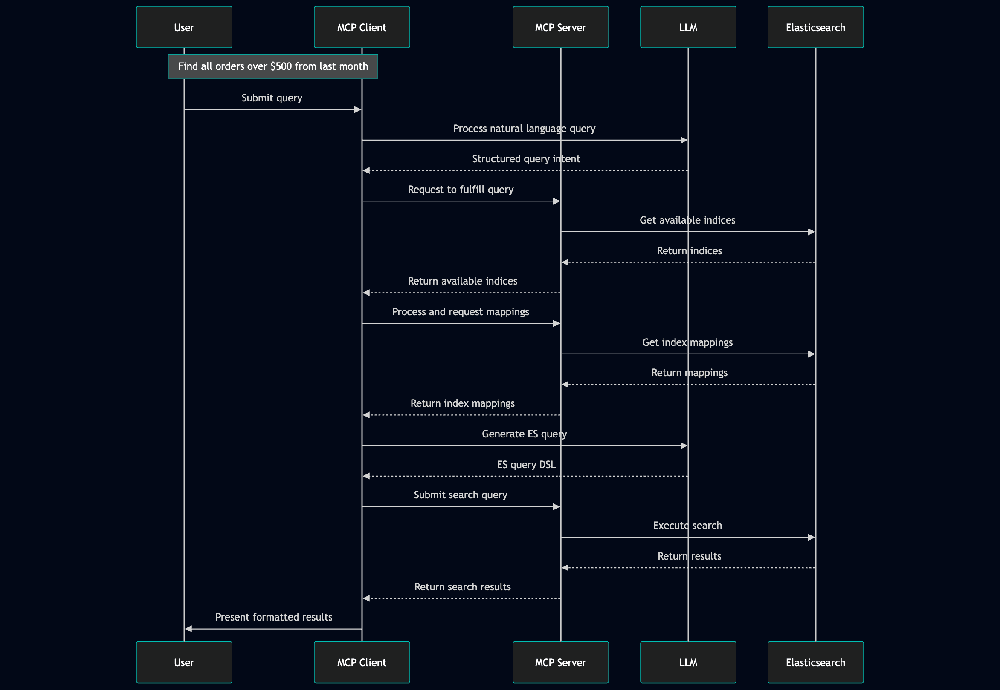

# MCP

> https://modelcontextprotocol.io/docs/getting-started/intro

- MCP(Model Context Protocol)

  - AI application을 외부 시스템과 연동하기 위한 open source 표준이다.
    - 이름 그대로 Model이 다른 소스로부터 Context를 얻기 위한 표준화된 Protocol이다.
    - MCP를 사용하면 Claude나 ChatGPT 같은 AI application이 DB나 local file 같은 data source, 검색 엔진 같은 tool들에 접근할 수 있게 된다.
    - AI application을 위한 USB-C port라고 생각하면 되는데, USB-C가 전자기기에 연결하기 위한 표준화된 방법을 제공하는 것 처럼 MCP는 AI application이 외부 시스템과 연결되기 위한 표준화된 방법을 제공한다.
    
  - MCP의 구조
    - MCP는 client - server 구조를 따른다.
    - 하나의 MCP host(AI application)가 하나 이상의 MCP server와 연결을 확립하는 방식이다.
    - MCP host는 각 MCP server에 대해 하나의 MCP client를 생성하며, 각 MCP client는 자신과 매핑된 MCP server와 전용 연결(dedicated connection)을 유지한다.
  - MCP 주요 개념
    - MCP host: 하나 이상의 MCP client를 관리하고 조정하는 AI application.
    - MCP client: MCP server와 연결을 유지하고, MCP host가 사용할 context를 MCP server로부터 받아오는 역할을 한다.
    - MCP server: MCP client에게 context를 제공하는 program
  
  


- MCP layer

  - 두 개의 layer로 구성된다.
    - Data layer: Client-server 통신을 위한 JSON-RPC 기반의 프로토콜을 정의한다.
    - Transport layer: Client와 server 사이의 데이터 교환을 위한 통신 메커니즘과 채널을 정의하고, 둘 사이의 인증을 관리한다.

  - Data layer는 아래와 같은 것들을 포함한다.
    - Lifecycle Management: Client와 server 간의 연결 초기화(initialization), capability(기능) 협상, 연결 종료를 처리한다.
    - Server features: AI가 활용할 수 있는 tool들, context data를 위한 resource들, 상호작용 템플릿 역할을 하는 prompt와 같은 핵심 기능들을 서버가 클라이언트에 제공할 수 있게 해준다.
    - Client features: Server가 client에게 요청하여, host LLM으로부터 샘플링을 수행하거나, 사용자로부터 입력을 이끌어내거나(elicit), client에 로그 메시지를 남길 수 있도록 해준다.
    - Utility features: 실시간 업데이트를 위한 notification, 장시간 실행되는 작업(long-running operation)의 진행 상황을 추적하는 기능 등 추가적인 기능을 지원한다.
  - Transport Layer는 아래와 같은 것들을 포함한다.
    - Stdio transport: 표준 입출력(standard input/output) 스트림을 사용하여 동일한 머신 내 로컬 프로세스 간 직접 통신을 수행하며, 네트워크 오버헤드 없이 최적의 성능을 제공한다.
    - Streamable HTTP transport: 클라이언트에서 서버로의 메시지 전달에는 HTTP POST를 사용하며, 스트리밍 기능을 위해 선택적으로 Server-Sent Events(SSE)를 사용할 수 있다. 이 transport는 원격 서버와의 통신을 가능하게 하며, bearer token, API key, custom header를 포함한 표준 HTTP 인증 방식을 지원한다. MCP는 인증 토큰 발급 시 OAuth 사용을 권장한다.


- MCP primitives

  - MCP에서 가장 중요한 개념으로, client와 server가 서로 어떤 것들을 제공할 수 있는지를 정의한다.
    - Primitives는 AI application과 공유하는 contextual information의 type과, 수행할 수 있는 action들의 범위를 정의한다.
    - 각 primitive 타입은 discovery(탐색, `*/list`), retrieval(조회, `*/get`), 그리고 경우에 따라 execution(실행, `tools/call`)을 위한 메서드를 가지고 있다. 
    - MCP client는 `*/list` method를 사용하여 사용 가능한 primitive들을 탐색한다. 
    - 예를 들어, client는 먼저 사용 가능한 tool 목록 전체를 조회한 뒤(`tools/list`), 이를 실행할 수 있다. 
    - 이러한 설계 덕분에 목록을 동적으로 구성할 수 있다.

  - MCP는 server가 노출할 수 있는 세 개의 핵심 primitives를 규정한다.
    - Tools: AI 애플리케이션이 액션을 수행하기 위해 호출할 수 있는 실행 가능한 함수(e.g. 파일 조작, API 호출, 데이터베이스 쿼리)
    - Resources: AI application에 contextual information을 제공하는 데이터 소스(e.g. 파일 내용, 데이터베이스 레코드, API 응답)
    - Prompts: 언어 모델과의 상호작용을 구조화하는 데 도움을 주는 재사용 가능한 템플릿 (e.g. 시스템 프롬프트, few-shot)
  - MCP는 client가 노출할 수 있는 primitives도 규정한다.
    - Sampling: Server가 client의 AI application으로부터 언어 모델의 completion(응답 생성)을 요청할 수 있게 해준다. 이는 server 개발자가 LLM에 접근하고 싶지만, 특정 모델에 종속되지 않고 자신의 MCP 서버에 별도의 LLM SDK를 포함시키고 싶지 않을 때 유용하다. 서버는 `sampling/createMessage` 메서드를 사용하여 클라이언트의 AI 애플리케이션에 언어 모델 completion을 요청할 수 있다.
    - Elicitation: Server가 사용자로부터 추가 정보를 요청할 수 있게 해준다. 이는 server 개발자가 사용자로부터 더 많은 정보를 얻고 싶거나, 특정 action에 대한 확인을 받고 싶을 때 유용하다. Server는 `elicitation/create` 메서드를 사용하여 사용자에게 추가 정보를 요청할 수 있다.
    - Logging(로깅): Server가 디버깅 및 모니터링 목적으로 client에 log message를 전송할 수 있게 해준다.


- 예시

  - MCP client-server 상호작용을 단계별로 살펴본다.
    - 특히 데이터 레이어 프로토콜에 초점을 맞춘다.
    - JSON-RPC 2.0 메시지를 사용하여 lifecycle시퀀스, tool 관련 작업, notification을 함께 살펴본다.
  - Initialization (Lifecycle Management)
    - MCP는 capability 협상 handshake를 통한 lifecycle management로 시작된다.
    - Client는 연결을 수립하고 지원되는 기능을 협상하기 위해 `initialize` 요청을 전송한다.

  ```json
  // request
  {
    "jsonrpc": "2.0",
    "id": 1,
    "method": "initialize",
    "params": {
      "protocolVersion": "2025-06-18",
      "capabilities": {
        "elicitation": {}
      },
      "clientInfo": {
        "name": "example-client",
        "version": "1.0.0"
      }
    }
  }
  
  
  // response
  {
    "jsonrpc": "2.0",
    "id": 1,
    "result": {
      "protocolVersion": "2025-06-18",
      "capabilities": {
        "tools": {
          "listChanged": true
        },
        "resources": {}
      },
      "serverInfo": {
        "name": "example-server",
        "version": "1.0.0"
      }
    }
  }
  ```

  - Initialization Exchange 이해하기
    - Initialization 과정은 MCP의 lifecycle 관리에서 핵심적인 부분이며, 아래와 같은 것들을 수행한다.
    - 프로토콜 버전 협상(Protocol Version Negotiation): `protocolVersion` 필드(예: "2025-06-18")는 클라이언트와 서버가 호환되는 프로토콜 버전을 사용하고 있음을 보장하며, 이를 통해 서로 다른 버전이 상호작용을 시도할 때 발생할 수 있는 통신 오류를 방지한다. 상호 호환되는 버전이 협상되지 않으면 연결은 종료되어야한다.
    - Capability 탐색(Capability Discovery): `capabilities` 객체는 각 당사자가 자신이 지원하는 기능이 무엇인지 선언할 수 있게 해주는데, 여기에는 처리 가능한 primitives(tools, resources, prompts)와 notification 같은 기능의 지원 여부가 포함된다. 이를 통해 지원되지 않는 작업을 피함으로써 효율적인 통신이 가능해진다.
    - 신원 교환(Identity Exchange): `clientInfo`와 `serverInfo` 객체는 디버깅 및 호환성 확인을 위한 식별 정보와 버전 정보를 제공한다.
  - Initialization이 성공적으로 완료되면 client는 notification을 전송한다.

  ```json
  {
    "jsonrpc": "2.0",
    "method": "notifications/initialized"
  }
  ```

  - AI Application에서 initialization이 수행되는 방식
    - AI application의 MCP 클라이언트 매니저(client manager)는 설정된 서버들에 연결을 수립하고, 이후 사용을 위해 각 서버의 capability를 저장해 둔다.
    - Application은 이 정보를 활용하여 어떤 서버가 특정 유형의 기능(tools, resources, prompts)을 제공할 수 있는지, 그리고 실시간 업데이트를 지원하는지를 판단한다.

  ```pseudocode
  async with stdio_client(server_config) as (read, write):
      async with ClientSession(read, write) as session:
          init_response = await session.initialize()
          if init_response.capabilities.tools:
              app.register_mcp_server(session, supports_tools=True)
          app.set_server_ready(session)
  ```

  - Tool discovery
    - 연결이 수립되었으므로, client는 `tools/list` 요청을 전송하여 사용 가능한 tool들을 탐색할 수 있다. 
    - 이 요청은 MCP의 tool 탐색 메커니즘에서 근본적인 역할을 하며, 클라이언트가 tool을 실제로 사용하기 전에 서버에서 어떤 tool들을 사용할 수 있는지 파악할 수 있게 해준다.

  ```json
  // request
  {
    "jsonrpc": "2.0",
    "id": 2,
    "method": "tools/list"
  }
  
  
  // response
  {
    "jsonrpc": "2.0",
    "id": 2,
    "result": {
      "tools": [
        {
          "name": "calculator_arithmetic",
          "title": "Calculator",
          "description": "Perform mathematical calculations including basic arithmetic, trigonometric functions, and algebraic operations",
          "inputSchema": {
            "type": "object",
            "properties": {
              "expression": {
                "type": "string",
                "description": "Mathematical expression to evaluate (e.g., '2 + 3 * 4', 'sin(30)', 'sqrt(16)')"
              }
            },
            "required": ["expression"]
          }
        },
        {
          "name": "weather_current",
          "title": "Weather Information",
          "description": "Get current weather information for any location worldwide",
          "inputSchema": {
            "type": "object",
            "properties": {
              "location": {
                "type": "string",
                "description": "City name, address, or coordinates (latitude,longitude)"
              },
              "units": {
                "type": "string",
                "enum": ["metric", "imperial", "kelvin"],
                "description": "Temperature units to use in response",
                "default": "metric"
              }
            },
            "required": ["location"]
          }
        }
      ]
    }
  }
  ```

  - AI application에서 tool discovery가 수행되는 방식
    - AI 애플리케이션은 연결된 모든 MCP 서버로부터 사용 가능한 tool들을 가져와서, LLM이 접근할 수 있는 하나의 통합된 tool registry로 결합한다.
    - 이를 통해 LLM은 자신이 수행할 수 있는 action이 무엇인지 이해하고, 대화 중에 적절한 tool call을 자동으로 생성할 수 있게 된다.

  ```pseudocode
  available_tools = []
  for session in app.mcp_server_sessions():
      tools_response = await session.list_tools()
      available_tools.extend(tools_response.tools)
  conversation.register_available_tools(available_tools)
  ```

  - Tool Execution (Primitives)
    - 이제 클라이언트는 `tools/call` 메서드를 사용하여 tool을 실행할 수 있다.
    - 사용 가능한 tool을 탐색한 뒤, 클라이언트는 적절한 인자(argument)와 함께 이를 호출할 수 있다.
    - `tools/call` 요청은 클라이언트와 서버 간의 타입 안전성(type safety)과 명확한 커뮤니케이션을 보장하는 구조화된 형식을 따른다.
    - 단순화된 이름이 아니라, 탐색(discovery) 응답에서 얻은 정확한 tool 이름(`weather_current`)을 사용하고 있다는 점에 주의해야한다.

  ```json
  // request
  {
    "jsonrpc": "2.0",
    "id": 3,
    "method": "tools/call",
    "params": {
      "name": "weather_current",
      "arguments": {
        "location": "San Francisco",
        "units": "imperial"
      }
    }
  }
  
  
  // response
  {
    "jsonrpc": "2.0",
    "id": 3,
    "result": {
      "content": [
        {
          "type": "text",
          "text": "Current weather in San Francisco: 68°F, partly cloudy with light winds from the west at 8 mph. Humidity: 65%"
        }
      ]
    }
  }
  ```

  - Tool execution request의 핵심 요소들
    - `name`: Discovery 응답에서 얻은 tool 이름(`weather_current`)과 정확히 일치해야 한다. 이를 통해 서버는 어떤 tool을 실행해야 하는지 정확히 식별할 수 있다.
    - `arguments`: tool의 `inputSchema`에 정의된 입력 파라미터(예시의 경우 `location`, `units`)를 포함한다.
    - JSON-RPC 구조: 요청-응답 상관관계(correlation)를 위한 고유 `id`와 함께 표준 JSON-RPC 2.0 형식을 사용한다.
  - Tool execution response의 핵심 요소들
    - `content`: tool의 응답은 content object들의 배열 형태로 반환되며, 이를 통해 텍스트, 이미지, 리소스 등 다양한 형식을 아우르는 다양한 응답이 가능하다.
    - `content.type`: 각 content object는 `type` 필드를 가진다. MCP는 다양한 사용 사례에 맞는 여러 content 타입을 지원한다.
    - Structured Output: 응답은 AI application이 LLM과의 상호작용에서 context로 활용할 수 있는, 실행 가능한(actionable) 정보를 제공한다.
  - AI application에서 tool execution이 수행되는 방식

  ```pseudocode
  async def handle_tool_call(conversation, tool_name, arguments):
      session = app.find_mcp_session_for_tool(tool_name)
      result = await session.call_tool(tool_name, arguments)
      conversation.add_tool_result(result.content)
  ```

  - Real-time Updates (Notifications)
    - MCP는 실시간 notification을 지원하여, server가 명시적인 요청 없이도 변경 사항을 client에게 알릴 수 있게 해준다.
    - Server에서 사용 가능한 tool이 변경될 때(e.g. 새로운 기능 추가, 기존 tool이 수정, 특정 tool 일시 정지)  server는 연결된 client에게 이를 미리 알릴 수 있다
    - Client가 notification을 수신하면, client는 일반적으로 업데이트된 tool 목록을 요청하는 방식으로 반응한다.
    - 이를 통해 client가 파악하고 있는 사용 가능한 tool 정보를 최신 상태로 유지하는 갱신 주기(refresh cycle)가 만들어진다.

  ```json
  // server가 client로 보내는 notification
  {
    "jsonrpc": "2.0",
    "method": "notifications/tools/list_changed"
  }
  
  
  // notification에 대한 client의 반응
  {
    "jsonrpc": "2.0",
    "id": 4,
    "method": "tools/list"
  }
  ```

  - MCP notifiaction의 핵심 특징
    - No Response Required: notification에는 `id` 필드가 없다는 점에 주목하면, 이는 응답이 기대하지도, 전송되지도 않는 JSON-RPC 2.0의 notification semantics를 따르는 것이라는 것을 알 수 있다.
    - Capability-Based: 이 notification은 initialization(1단계에서 보았듯이) 과정에서 tools capability에 `"listChanged": true`를 선언한 servr에서만 전송된다.
    - Event-Driven: server는 내부 상태 변화에 따라 notification을 언제 보낼지 스스로 결정하며, 이를 통해 MCP 연결이 동적이고 반응성 있게 동작한다.
  - AI application에서 notification을 수행하는 방식

  ```pseudocode
  async def handle_tools_changed_notification(session):
      tools_response = await session.list_tools()
      app.update_available_tools(session, tools_response.tools)
      if app.conversation.is_active():
          app.conversation.notify_llm_of_new_capabilities()
  ```


- MCP Server Elasticsearch사용해보기

  > https://github.com/elastic/mcp-server-elasticsearch

  - Elasticsearch는 자체적으로 개발한 MCP server를 제공한다.
    - Elasticsearch 8부터 사용이 가능하다.
    - 단, 위 github README에서도 확인할 수 있듯, 위 MCP server는 depreacted되었다.
    - Elasticsearch 9.2 이상부터는 [Elastic Agent Builder](https://www.elastic.co/docs/explore-analyze/ai-features/elastic-agent-builder)를 사용하는 것이 권장된다.
  - MCP Server Elasticsearch docker image 받기

  ```bash
  $ docker pull docker.elastic.co/mcp/elasticsearch
  ```

  - MCP Server Elasticsearch docker container 실행하기
    - Elasticsearch는 이미 실행중이라고 가정한다.
    - `command`로 http와 stdio 중 어떤 걸로 실행할지 설정해야한다.

  ```yaml
  services:
    es-mcp:
      image: docker.elastic.co/mcp/elasticsearch:latest
      container_name: es-mcp
      environment:
        - ES_URL=http://localhost:9200
      command: http
      ports:
        - 8080:8080
  ```

  - MCP Server로 요청 보내서 실행 가능한 action들 확인하기

  ```python
  import json
  
  import requests
  
  
  url = "http://loclahost:8080/mcp"
  
  payload = {
      "jsonrpc": "2.0",
      "method": "tools/list",
      "params": {},
      "id": 1
  }
  
  headers = {
      "Accept": "application/json, text/event-stream",
      "Content-Type": "application/json"
  }
  res = requests.post(url, json=payload, headers=headers)
  
  print(f"Status Code: {res.status_code}")
  for line in res.text.splitlines():
      if line.startswith("data:"):
          json_str = line[5:].strip()
          try:
              data = json.loads(json_str)
              print(json.dumps(data, indent=2, ensure_ascii=False))
          except json.JSONDecodeError as e:
              print(f"JSON 파싱 실패: {e}")
  ```

  - Python MCP SDK 설치

  ```bash
  $ pip install "mcp[cli]==2.0.0b1"
  ```

  - Python MCP SDK로 MCP server에 요청 보내기

  ```python
  import asyncio
  
  from mcp import Client
  
  
  async def main():
      async with Client("http://localhost:8080/mcp") as client:
          tools = await client.list_tools()
          for tool in tools.tools:
              print(tool)
              print("-" * 100)
  
  asyncio.run(main())
  ```

  - LM과 함께 사용하기
    - Model로는 llama3.2를 사용한다.

  ```python
  import asyncio
  import json
  
  from openai import OpenAI
  from mcp import Client
  
  
  MODEL_NAME = "llama3.2:latest"
  client = OpenAI(base_url="http://localhost:11434/v1", api_key="None")
  
  # openai spec에 맞게 형식을 변환한다.
  def convert_mcp_tool_to_openai(mcp_tool):
      return {
          "type": "function",
          "function": {
              "name": mcp_tool.name,
              "description": mcp_tool.description,
              "parameters": mcp_tool.input_schema
          }
      }
  
  async def main(user_prompt: str):
      async with Client("http://localhost:8080/mcp") as mcp_client:
          tools = await mcp_client.list_tools()
          # MCP server Elasticsearch에서 제공하는 tool들의 목록을 openai spec에 맞게 변환한다.
          openai_tools = [convert_mcp_tool_to_openai(tool) for tool in tools.tools]
  		
          # prompt를 작성한다.
          messages = [
              {"role": "system", "content": "You are an expert Elasticsearch data exploration assistant. Actively utilize the provided tools as required."},
              {"role": "user", "content": user_prompt}
          ]
  
          response = client.chat.completions.create(
              model=MODEL_NAME,
              messages=messages,
              tools=openai_tools,
              tool_choice="auto",
          )
          response_message = response.choices[0].message
          tool_calls = response_message.tool_calls
          if tool_calls:
              for tool_call in tool_calls:
                  tool_name = tool_call.function.name
                  tool_args = json.loads(tool_call.function.arguments)
                  # MCP server Elasticsearch를 호출하여 결과를 받아온다.
                  mcp_result = await mcp_client.call_tool(tool_name, arguments=tool_args)
                  # 받아온 결과를 messages에 추가한다.
                  messages.append({
                      "role": "tool",
                      "tool_call_id": tool_call.id,
                      "name": tool_name,
                      "content": str(mcp_result.content)
                  })
              final_response = client.chat.completions.create(
                  model=MODEL_NAME,
                  messages=messages
              )
              # 최종 응답을 확인한다.
              print(final_response.choices[0].message.content)
          else:
              print(response_message.content)
  
  asyncio.run(main("How many indices have index names starting with 'msmarco'?"))
  ```
  
  - MCP server를 통한 검색은 아래와 같은 과정을 거친다.
  
  > https://www.elastic.co/search-labs/kr/blog/model-context-protocol-elasticsearch
  
  


## FastMCP

- FastMCP

  - MCP server 및 client를 보다 간편하게 개발할 수 있게 해주는 framework이다.
    - MCP 개발 과정에서 작성하게 되는 보일러 플레이트들을 상당 부분 작성하지 않아도 되도록 해준다.

  ```bash
  $ pip install fastmcp
  ```

  - MCP server 개발하기
    - 가상의 DB에서 데이터를 조회하는 MCP server를 FastMCP를 사용하여 개발한다.
    - Decorator를 추가하여 간단하게 MCP server 개발이 가능하다.
    - 각 메서드의 docstring이 tools 조회시 description에 들어가게 된다.

  ```python
  # server.py
  from datetime import datetime, timezone
  
  from fastmcp import FastMCP
  
  
  mcp = FastMCP("simple-directory-server")
  
  
  _EMPLOYEE_DB = {
      "John": {"team": "platform", "role": "Backend engineer"},
      "Will": {"team": "data", "role": "ML engineer"},
      "Nick": {"team": "infra", "role": "SRE"},
  }
  
  
  @mcp.tool()
  def search_employee(name: str) -> str:
      """Searches internal employee information by name."""
      info = _EMPLOYEE_DB.get(name)
      if not info:
          return f"'{name}' not found"
      return f"{name} | {info['team']} | {info['role']}"
  
  
  @mcp.tool()
  def get_current_time() -> str:
      """Returns the current server time in ISO 8601 format."""
      return datetime.now(timezone.utc).isoformat()
  
  
  if __name__ == "__main__":
      mcp.run(transport="streamable-http")
  ```

  - 아래와 같이 실행한다.
    - 위 코드를 실행하면 기본값인 8000 포트로 MCP server가 실행된다.

  ```bash
  $ python server.py
  ```

  - MCP server에서 tool list 확인하기
    - Initialize를 통해 mcp-session-id를 받아온 후, 받아온 mcp-session-id를 요청 header에 담아서 보낸다.
    - 단, MCP server 실행시 `mcp.run(transport="streamable-http", stateless_http=True)`와 같이 stateless로 실행했다면 session id가 필요 없으므로 initialize 없이 바로 실행해도 된다.

  ```python
  import json
  
  import requests
  
  
  url = "http://localhost:8000/mcp"
  
  
  def initialize() -> str:
      headers = {
          "Accept": "application/json, text/event-stream",
          "Content-Type": "application/json"
      }
      
      payload = {
          "jsonrpc": "2.0",
          "id": 1,
          "method": "initialize",
          "params": {
              "protocolVersion": "2025-06-18",
              "capabilities": {},
              "clientInfo": {"name": "curl-cli", "version": "1.0"}
          }
      }
  
      res = requests.post(url, headers=headers, json=payload)
      return res.headers["mcp-session-id"]
  
  
  def list_tools(session_id: str):
      headers = {
          "Accept": "application/json, text/event-stream",
          "Content-Type": "application/json",
          "mcp-session-id": session_id
      }
      payload = {
          "jsonrpc": "2.0",
          "method": "tools/list",
          "params": {},
          "id": 1
      }
      res = requests.post(url, headers=headers, json=payload)
      for line in res.text.splitlines():
          if line.startswith("data:"):
              json_str = line[5:].strip()
              print(json.dumps(json.loads(json_str), indent=4, ensure_ascii=False))
  
  
  session_id = initialize()
  list_tools(session_id)
  ```

  - MCP client 개발하기
    - Client istance를 생성하고 server를 호출하는 방식은 `mcp` package와 크게 다르지 않다.
    - Initialize 과정은 자동으로 처리해주기에 명시적으로 수행할 필요는 없다.

  ```python
  import asyncio
  from fastmcp import Client
  
  
  client = Client("http://localhost:8000/mcp")
  
  
  async def main():
      async with client:
  
          tools = await client.list_tools()
          # tool 목록
          for t in tools:
              print(f"- {t.name}: {t.description}")
  
          # MCP server에서 name이 John인 직원 조회
          result = await client.call_tool("search_employee", {"name": "John"})
          print(result.content[0].text)
  
          # MCP server에서 현재 시각 조회
          result = await client.call_tool("get_current_time", {})
          print(result.content[0].text)
  
  
  asyncio.run(main())
  ```

  - Output
    - MCP server의 각 메서드에 작성한 docstring이 description의 값으로 추가된 것을 확인할 수 있다.

  ```json
  {
      "jsonrpc": "2.0",
      "id": 1,
      "result": {
          "tools": [
              {
                  "name": "search_employee",
                  "description": "Searches internal employee information by name.",
                  "inputSchema": {
                      "additionalProperties": false,
                      "properties": {
                          "name": {
                              "type": "string"
                          }
                      },
                      "required": [
                          "name"
                      ],
                      "type": "object"
                  },
                  "outputSchema": {
                      "properties": {
                          "result": {
                              "type": "string"
                          }
                      },
                      "required": [
                          "result"
                      ],
                      "type": "object",
                      "x-fastmcp-wrap-result": true
                  },
                  "_meta": {
                      "fastmcp": {
                          "tags": []
                      }
                  }
              },
              {
                  "name": "get_current_time",
                  "description": "Returns the current server time in ISO 8601 format.",
                  "inputSchema": {
                      "additionalProperties": false,
                      "properties": {},
                      "type": "object"
                  },
                  "outputSchema": {
                      "properties": {
                          "result": {
                              "type": "string"
                          }
                      },
                      "required": [
                          "result"
                      ],
                      "type": "object",
                      "x-fastmcp-wrap-result": true
                  },
                  "_meta": {
                      "fastmcp": {
                          "tags": []
                      }
                  }
              }
          ]
      }
  }
  ```


### FastAPI와 FastMCP 통합하기

- FastMCP는 FastAPI application과 통합

  - FastMCP는 두 가지 통합 방식을 제공한다.
    - FastAPI application으로부터 MCP server를 생성하는 방식(기존  FastAPI app을 미러링해서 별도의  MCP server 실행).
    - FastAPI application에 MCP server를 mount하는 방식(MCP server를 기존  FastAPI의 router 중 하나로 편입).
  - 권장하는 방식
    - FastMCP 문서에서는는 FastAPI application으로부터 MCP server를 생성하는 방식은 프로토타입 용으로는 괜찮다고 말한다.
    - 그러나 실무에서 LLM은 자동 변환된 OpenAPI 서버보다, 잘 설계되고 엄선된(curated) MCP 서버에서 훨씬 더 나은 성능을 내기에 API를 LLM 클라이언트에 그대로 미러링하는 용도로는 권장하지 않는다.
  - 통합 방식을 테스트하기 위해 간단한 FastAPI app을 생성한다.

  ```python
  from typing import Optional
  
  from fastapi import FastAPI, APIRouter, HTTPException
  from pydantic import BaseModel
  import uvicorn
  
  
  app = FastAPI()
  
  
  EMPLOYEE_DB = [
      {"id": 1, "name": "John", "team": "platform", "role": "Backend engineer"},
      {"id": 2, "name": "Will", "team": "data", "role": "ML engineer"},
      {"id": 3, "name": "Nick", "team": "infra", "role": "SRE"},
  ]
  
  
  class SearchRequest(BaseModel):
      id_: int
      name: Optional[str] = None
  
  
  class EmployeeResponse(BaseModel):
      id: int
      name: str
      team: str
      role: str
  
  
  router = APIRouter(prefix="/employees")
  
  @router.post("")
  def search_employee(request: SearchRequest) -> EmployeeResponse:
      """Searches internal employee information by name."""
      request = request.model_dump()
      id_ = request["id_"]
      name = request.get("name")
      for row in EMPLOYEE_DB:
          if id_ == row["id"]:
              if name is None:
                  return row
              else:
                  if name == row["name"]:
                      return row
              break
  
      raise HTTPException(status_code=404, detail="Employee not found")
  
  app.include_router(router)
  
  if __name__ == "__main__":
      uvicorn.run(app)
  ```


- FastAPI application으로부터 MCP server를 생성하는 방식.

  - 아래와 같이 간단하게 생성이 가능하다.
    - 위에서 생성한 app을 `FastMCP.from_fastapi()` 메서드의 인자로 전달해 실행한다.

  ```python
  from fastmcp import FastMCP
  
  from app import app
  
  
  mcp = FastMCP.from_fastapi(app=app)
  
  
  if __name__ == "__main__":
      mcp.run(transport="streamable-http", port=8001)
  ```

  - MCP client를 통해 정상 작동하는지 확인한다.

  ```python
  import asyncio
  from fastmcp import Client
  
  
  client = Client("http://localhost:8001/mcp")
  
  async def main():
      async with client:
  
          tools = await client.list_tools()
          # tool 목록
          for t in tools:
              print(f"{t.name}: {t.description}")
          print("="*100)
  
          result = await client.call_tool("search_employee_search_post", {"id_": 1, "name": "John"})
          print(result.content)
  
  asyncio.run(main())
  
  """
  Output:
  
  search_employee_search_post: Searches internal employee information by name.
  ====================================================================================================
  [TextContent(type='text', text='{"id":1,"name":"John","team":"platform","role":"Backend engineer"}', annotations=None, meta=None)]
  """
  ```

  - FastAPI에 정의된 것 외에 component를 추가하는 것도 가능하다.

  ```python
  from fastmcp import FastMCP
  
  from app import app, EMPLOYEE_DB, EmployeeResponse
  
  
  mcp = FastMCP.from_fastapi(app=app)
  
  @mcp.tool
  def get_employee_by_id(id_: int) -> EmployeeResponse | None:
      "Get a employee by ID"
      for row in EMPLOYEE_DB:
          if row["id"] == id_:
              return row
      return None
              
  
  if __name__ == "__main__":
      mcp.run(transport="streamable-http", port=8001)
  ```

  - MCP client에서 새로 추가된 component를 테스트한다.

  ```python
  import asyncio
  from fastmcp import Client
  
  
  client = Client("http://localhost:8001/mcp")
  
  
  async def main():
      async with client:
  
          tools = await client.list_tools()
          # tool 목록
          for t in tools:
              print(f"{t.name}: {t.description}")
          print("="*100)
  
          result = await client.call_tool("get_employee_by_id", {"id_": 1})
          print(result.content)
  
  
  asyncio.run(main())
  
  """
  Output:
  
  get_employee_by_id: Get a employee by ID
  search_employee_search_post: Searches internal employee information by name.
  ====================================================================================================
  [TextContent(type='text', text='{"id":1,"name":"John","team":"platform","role":"Backend engineer"}', annotations=None, meta=None)]
  """
  ```

  - Primitive 지정하기
    - 기본적으로 모든 FastAPI path function은 MCP primitive중 tool로 변환된다.
    - 즉 `@mcp.tool` 데코레이터를 추가한 것 처럼 동작한다.
    - Tool 이외에 다른 primitive를 지정하고 싶다면 `RouteMap`, `MCPType`을 사용하면 된다.
    - 아래와 같이 특정 HTTP method인 특정 url 경로가 어떤  MCP primitive로 변환될지를 설정할 수 있다.

  ```python
  from fastmcp import FastMCP
  from fastmcp.server.providers.openapi import RouteMap, MCPType
  
  from app import app, EMPLOYEE_DB, EmployeeResponse
  
  
  mcp = FastMCP.from_fastapi(
      app=app,
      route_maps=[
          # GET with path params → ResourceTemplates
          RouteMap(
              methods=["GET"], 
              pattern=r".*\{.*\}.*", 
              mcp_type=MCPType.RESOURCE_TEMPLATE
          ),
          # Other GETs → Resources
          RouteMap(
              methods=["GET"], 
              pattern=r".*", 
              mcp_type=MCPType.RESOURCE
          )
      ]
  )
  
  # Now:
  # - GET /employees → Resource
  # - GET /employees/{id} → ResourceTemplate
  # - POST/PUT/DELETE → Tools
  ```


- FastAPI application에 MCP server를 mount하는 방식.

  - FastMCP는 서버를 생성하는 것 외에도, 기존의 FastAPI application에 MCP 서버를 추가할 수 있는 기능을 지원한다.
    - MCP ASGI application을 기존 FastAPI application에 mount하는 방식이다.
  - 아래와 같이  MCP app을 생성하고

  ```python
  import random
  
  from fastmcp import FastMCP
  
  
  mcp = FastMCP()
  
  @mcp.tool
  def get_random_message_for_employee(name: str):
      "Get random message for employee"
      messages = ["Hello!", "Goodbye!"]
      return f"{random.choice(messages)} {name}."
  
  mcp_app = mcp.http_app(path='/mcp')
  ```

  - 위에서 작성한  FastAPI app에 mount한다.

  ```python
  from typing import Optional
  
  from fastapi import FastAPI, APIRouter, HTTPException
  from pydantic import BaseModel
  import uvicorn
  
  from mount import mcp_app
  
  # lifespan을 추가하고
  app = FastAPI(lifespan=mcp_app.lifespan)
  
  
  # ...
  
  # FastAPI application에 mount한다.
  app.mount("/messages", mcp_app)
  
  if __name__ == "__main__":
      uvicorn.run(app)
  ```

  - MCP client로 테스트한다.
    - 위에서 mount할 때 추가한 경로 뒤에  `/mcp`를 붙인다.

  ```python
  import asyncio
  from fastmcp import Client
  
  
  client = Client("http://localhost:8000/messages/mcp")
  
  
  async def main():
      async with client:
  
          tools = await client.list_tools()
          # tool 목록
          for t in tools:
              print(f"{t.name}: {t.description}")
          print("="*100)
  
          result = await client.call_tool("get_random_message_for_employee", {"name": "John"})
          print(result.content)
  
  asyncio.run(main())
  
  
  """
  Output:
  
  get_random_message_for_employee: Get random message for employee
  ====================================================================================================
  [TextContent(type='text', text='Hello! John.', annotations=None, meta=None)]
  """
  ```

