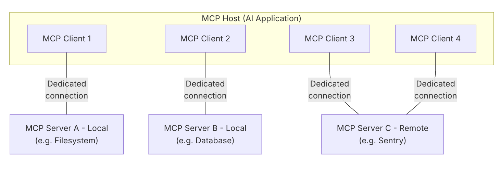

# MCP

> https://modelcontextprotocol.io/docs/getting-started/intro

- MCP(Model Context Protocol)

  - AI application을 외부 시스템과 연동하기 위한 open source 표준이다.
    - MCP를 사용하면 Claude나 ChatGPT 같은 AI application이 DB나 local file 같은 data source, 검색 엔진 같은 tool들에 접근할 수 있게 된다.
    - AI application을 위한 USB-C port라고 생각하면 되는데, USB-C가 전자기기에 연결하기 위한 표준화된 방법을 제공하는 것 처럼 MCP는 AI application이 외부 시스템과 연결되기 위한 표준화된 방법을 제공한다.
  - MCP의 구조
    - MCP는 client - server 구조를 따른다.
    - 하나의 MCP host(AI application)가 하나 이상의 MCP server와 연결을 확립하는 방식이다.
    - MCP host는 각 MCP server에 대해 하나의 MCP client를 생성하며, 각 MCP client는 자신과 매핑된 MCP server와 전용 연결(dedicated connection)을 유지한다.
  - MCP 주요 개념
    - MCP host: 하나 이상의 MCP client를 관리하고 조정하는 AI application.
    - MCP client: MCP server와 연결을 유지하고, MCP host가 사용할 context를 MCP server로부터 받아오는 역할을 한다.
    - MCP server: MCP client에게 context를 제공하는 program

  


- MCP layer

  - 두 개의 layer로 구성된다.
    - Data layer: Client-server 통신을 위한 JSON-RPC 기반의 프로토콜을 정의한다.
    - Transport layer: Cleint와 server 사이의 데이터 교환을 위한 통신 메커니즘과 채널을 정의하고, 둘 사이의 인증을 관리한다.

  - Data layer는 아래와 같은 것들을 포함한다.
    - Lifecycle Management: Client와 server 간의 연결 초기화(initialization), capability(기능) 협상, 연결 종료를 처리한다.
    - Server features: AI가 활용할 수 있는 tool들, context data를 위한 resource들, 상호작용 템플릿 역할을 하는 prompt와 같은 핵심 기능들을 서버가 클라이언트에 제공할 수 있게 해준다.
    - Client features: Server가 client에게 요청하여, host LLM으로부터 샘플링을 수행하거나, 사용자로부터 입력을 이끌어내거나(elicit), client에 로그 메시지를 남길 수 있도록 해준다.
    - Utility features: 실시간 업데이트를 위한 notification, 장시간 실행되는 작업(long-running operation)의 진행 상황을 추적하는 기능 등 추가적인 기능을 지원한다.
  - Transport Layer는 아래와 같은 것들을 포함한다.
    - Stdio transport: 표준 입출력(standard input/output) 스트림을 사용하여 동일한 머신 내 로컬 프로세스 간 직접 통신을 수행하며, 네트워크 오버헤드 없이 최적의 성능을 제공한다.
    - Streamable HTTP transport: 클라이언트에서 서버로의 메시지 전달에는 HTTP POST를 사용하며, 스트리밍 기능을 위해 선택적으로 Server-Sent Events(SSE)를 사용할 수 있다. 이 transport는 원격 서버와의 통신을 가능하게 하며, bearer token, API key, custom header를 포함한 표준 HTTP 인증 방식을 지원한다. MCP는 인증 토큰 발급 시 OAuth 사용을 권장한다.


- MCP primitives

  - MCP에서 가장 중요한 개념으로, client와 server가 서로 어떤 것들을 제공할 수 있는지를 정의한다.
    - Primitives는 AI application과 공유하는 contextual information의 type과, 수행할 수 있는 action들의 범위를 정의한다.
    - 각 primitive 타입은 discovery(탐색, `*/list`), retrieval(조회, `*/get`), 그리고 경우에 따라 execution(실행, `tools/call`)을 위한 메서드를 가지고 있다. 
    - MCP client는 `*/list` method를 사용하여 사용 가능한 primitive들을 탐색한다. 
    - 예를 들어, client는 먼저 사용 가능한 tool 목록 전체를 조회한 뒤(`tools/list`), 이를 실행할 수 있다. 
    - 이러한 설계 덕분에 목록을 동적으로 구성할 수 있다.

  - MCP는 server가 노출할 수 있는 세 개의 핵심 primitives를 규정한다.
    - Tools: AI 애플리케이션이 액션을 수행하기 위해 호출할 수 있는 실행 가능한 함수(e.g. 파일 조작, API 호출, 데이터베이스 쿼리)
    - Resources: AI application에 contextual information을 제공하는 데이터 소스(e.g. 파일 내용, 데이터베이스 레코드, API 응답)
    - Prompts: 언어 모델과의 상호작용을 구조화하는 데 도움을 주는 재사용 가능한 템플릿 (e.g. 시스템 프롬프트, few-shot)
  - MCP는 client가 노출할 수 있는 primitives도 규정한다.
    - Sampling: Server가 client의 AI application으로부터 언어 모델의 completion(응답 생성)을 요청할 수 있게 해준다. 이는 server 개발자가 LLM에 접근하고 싶지만, 특정 모델에 종속되지 않고 자신의 MCP 서버에 별도의 LLM SDK를 포함시키고 싶지 않을 때 유용하다. 서버는 `sampling/createMessage` 메서드를 사용하여 클라이언트의 AI 애플리케이션에 언어 모델 completion을 요청할 수 있다.
    - Elicitation: Server가 사용자로부터 추가 정보를 요청할 수 있게 해준다. 이는 server 개발자가 사용자로부터 더 많은 정보를 얻고 싶거나, 특정 action에 대한 확인을 받고 싶을 때 유용하다. Server는 `elicitation/create` 메서드를 사용하여 사용자에게 추가 정보를 요청할 수 있다.
    - Logging(로깅): Server가 디버깅 및 모니터링 목적으로 client에 log message를 전송할 수 있게 해준다.


- 예시

  - MCP client-server 상호작용을 단계별로 살펴본다.
    - 특히 데이터 레이어 프로토콜에 초점을 맞춘다.
    - JSON-RPC 2.0 메시지를 사용하여 lifecycle시퀀스, tool 관련 작업, notification을 함께 살펴본다.
  - Initialization (Lifecycle Management)
    - MCP는 capability 협상 handshake를 통한 lifecycle management로 시작된다.
    - Client는 연결을 수립하고 지원되는 기능을 협상하기 위해 `initialize` 요청을 전송한다.

  ```json
  // request
  {
    "jsonrpc": "2.0",
    "id": 1,
    "method": "initialize",
    "params": {
      "protocolVersion": "2025-06-18",
      "capabilities": {
        "elicitation": {}
      },
      "clientInfo": {
        "name": "example-client",
        "version": "1.0.0"
      }
    }
  }
  
  
  // response
  {
    "jsonrpc": "2.0",
    "id": 1,
    "result": {
      "protocolVersion": "2025-06-18",
      "capabilities": {
        "tools": {
          "listChanged": true
        },
        "resources": {}
      },
      "serverInfo": {
        "name": "example-server",
        "version": "1.0.0"
      }
    }
  }
  ```

  - Initialization Exchange 이해하기
    - Initialization 과정은 MCP의 lifecycle 관리에서 핵심적인 부분이며, 아래와 같은 것들을 수행한다.
    - 프로토콜 버전 협상(Protocol Version Negotiation): `protocolVersion` 필드(예: "2025-06-18")는 클라이언트와 서버가 호환되는 프로토콜 버전을 사용하고 있음을 보장하며, 이를 통해 서로 다른 버전이 상호작용을 시도할 때 발생할 수 있는 통신 오류를 방지한다. 상호 호환되는 버전이 협상되지 않으면 연결은 종료되어야한다.
    - Capability 탐색(Capability Discovery): `capabilities` 객체는 각 당사자가 자신이 지원하는 기능이 무엇인지 선언할 수 있게 해주는데, 여기에는 처리 가능한 primitives(tools, resources, prompts)와 notification 같은 기능의 지원 여부가 포함된다. 이를 통해 지원되지 않는 작업을 피함으로써 효율적인 통신이 가능해진다.
    - 신원 교환(Identity Exchange): `clientInfo`와 `serverInfo` 객체는 디버깅 및 호환성 확인을 위한 식별 정보와 버전 정보를 제공한다.
  - Initialization이 성공적으로 완료되면 client는 notification을 전송한다.

  ```json
  {
    "jsonrpc": "2.0",
    "method": "notifications/initialized"
  }
  ```

  - AI Application에서 initialization이 수행되는 방식
    - AI application의 MCP 클라이언트 매니저(client manager)는 설정된 서버들에 연결을 수립하고, 이후 사용을 위해 각 서버의 capability를 저장해 둔다.
    - Application은 이 정보를 활용하여 어떤 서버가 특정 유형의 기능(tools, resources, prompts)을 제공할 수 있는지, 그리고 실시간 업데이트를 지원하는지를 판단한다.

  ```pseudocode
  async with stdio_client(server_config) as (read, write):
      async with ClientSession(read, write) as session:
          init_response = await session.initialize()
          if init_response.capabilities.tools:
              app.register_mcp_server(session, supports_tools=True)
          app.set_server_ready(session)
  ```

  - Tool discovery
    - 연결이 수립되었으므로, client는 `tools/list` 요청을 전송하여 사용 가능한 tool들을 탐색할 수 있다. 
    - 이 요청은 MCP의 tool 탐색 메커니즘에서 근본적인 역할을 하며, 클라이언트가 tool을 실제로 사용하기 전에 서버에서 어떤 tool들을 사용할 수 있는지 파악할 수 있게 해준다.

  ```json
  // request
  {
    "jsonrpc": "2.0",
    "id": 2,
    "method": "tools/list"
  }
  
  
  // response
  {
    "jsonrpc": "2.0",
    "id": 2,
    "result": {
      "tools": [
        {
          "name": "calculator_arithmetic",
          "title": "Calculator",
          "description": "Perform mathematical calculations including basic arithmetic, trigonometric functions, and algebraic operations",
          "inputSchema": {
            "type": "object",
            "properties": {
              "expression": {
                "type": "string",
                "description": "Mathematical expression to evaluate (e.g., '2 + 3 * 4', 'sin(30)', 'sqrt(16)')"
              }
            },
            "required": ["expression"]
          }
        },
        {
          "name": "weather_current",
          "title": "Weather Information",
          "description": "Get current weather information for any location worldwide",
          "inputSchema": {
            "type": "object",
            "properties": {
              "location": {
                "type": "string",
                "description": "City name, address, or coordinates (latitude,longitude)"
              },
              "units": {
                "type": "string",
                "enum": ["metric", "imperial", "kelvin"],
                "description": "Temperature units to use in response",
                "default": "metric"
              }
            },
            "required": ["location"]
          }
        }
      ]
    }
  }
  ```

  - AI application에서 tool discovery가 수행되는 방식
    - AI 애플리케이션은 연결된 모든 MCP 서버로부터 사용 가능한 tool들을 가져와서, LLM이 접근할 수 있는 하나의 통합된 tool registry로 결합한다.
    - 이를 통해 LLM은 자신이 수행할 수 있는 action이 무엇인지 이해하고, 대화 중에 적절한 tool call을 자동으로 생성할 수 있게 된다.

  ```pseudocode
  available_tools = []
  for session in app.mcp_server_sessions():
      tools_response = await session.list_tools()
      available_tools.extend(tools_response.tools)
  conversation.register_available_tools(available_tools)
  ```

  - Tool Execution (Primitives)
    - 이제 클라이언트는 `tools/call` 메서드를 사용하여 tool을 실행할 수 있다.
    - 사용 가능한 tool을 탐색한 뒤, 클라이언트는 적절한 인자(argument)와 함께 이를 호출할 수 있다.
    - `tools/call` 요청은 클라이언트와 서버 간의 타입 안전성(type safety)과 명확한 커뮤니케이션을 보장하는 구조화된 형식을 따른다.
    - 단순화된 이름이 아니라, 탐색(discovery) 응답에서 얻은 정확한 tool 이름(`weather_current`)을 사용하고 있다는 점에 주의해야한다.

  ```json
  // request
  {
    "jsonrpc": "2.0",
    "id": 3,
    "method": "tools/call",
    "params": {
      "name": "weather_current",
      "arguments": {
        "location": "San Francisco",
        "units": "imperial"
      }
    }
  }
  
  
  // response
  {
    "jsonrpc": "2.0",
    "id": 3,
    "result": {
      "content": [
        {
          "type": "text",
          "text": "Current weather in San Francisco: 68°F, partly cloudy with light winds from the west at 8 mph. Humidity: 65%"
        }
      ]
    }
  }
  ```

  - Tool execution request의 핵심 요소들
    - `name`: Discovery 응답에서 얻은 tool 이름(`weather_current`)과 정확히 일치해야 한다. 이를 통해 서버는 어떤 tool을 실행해야 하는지 정확히 식별할 수 있다.
    - `arguments`: tool의 `inputSchema`에 정의된 입력 파라미터(예시의 경우 `location`, `units`)를 포함한다.
    - JSON-RPC 구조: 요청-응답 상관관계(correlation)를 위한 고유 `id`와 함께 표준 JSON-RPC 2.0 형식을 사용한다.
  - Tool execution response의 핵심 요소들
    - `content`: tool의 응답은 content object들의 배열 형태로 반환되며, 이를 통해 텍스트, 이미지, 리소스 등 다양한 형식을 아우르는 다양한 응답이 가능하다.
    - `content.type`: 각 content object는 `type` 필드를 가진다. MCP는 다양한 사용 사례에 맞는 여러 content 타입을 지원한다.
    - Structured Output: 응답은 AI application이 LLM과의 상호작용에서 context로 활용할 수 있는, 실행 가능한(actionable) 정보를 제공한다.
  - AI application에서 tool execution이 수행되는 방식

  ```pseudocode
  async def handle_tool_call(conversation, tool_name, arguments):
      session = app.find_mcp_session_for_tool(tool_name)
      result = await session.call_tool(tool_name, arguments)
      conversation.add_tool_result(result.content)
  ```

  - Real-time Updates (Notifications)
    - MCP는 실시간 notification을 지원하여, server가 명시적인 요청 없이도 변경 사항을 client에게 알릴 수 있게 해준다.
    - Server에서 사용 가능한 tool이 변경될 때(e.g. 새로운 기능 추가, 기존 tool이 수정, 특정 tool 일시 정지)  server는 연결된 client에게 이3를 미리 알릴 수 있다
    - Client가 notification을 수신하면, client는 일반적으로 업데이트된 tool 목록을 요청하는 방식으로 반응한다.
    - 이를 통해 client가 파악하고 있는 사용 가능한 tool 정보를 최신 상태로 유지하는 갱신 주기(refresh cycle)가 만들어진다.

  ```json
  // server가 client로 보내는 notification
  {
    "jsonrpc": "2.0",
    "method": "notifications/tools/list_changed"
  }
  
  
  // notification에 대한 client의 반응
  {
    "jsonrpc": "2.0",
    "id": 4,
    "method": "tools/list"
  }
  ```

  - MCP notifiaction의 핵심 특징
    - No Response Required: notification에는 `id` 필드가 없다는 점에 주목하면, 이는 응답이 기대하지도, 전송되지도 않는 JSON-RPC 2.0의 notification semantics를 따르는 것이라는 것을 알 수 있다.
    - Capability-Based: 이 notification은 initialization(1단계에서 보았듯이) 과정에서 tools capability에 `"listChanged": true`를 선언한 servr에서만 전송된다.
    - Event-Driven: server는 내부 상태 변화에 따라 notification을 언제 보낼지 스스로 결정하며, 이를 통해 MCP 연결이 동적이고 반응성 있게 동작한다.
  - AI application에서 notification을 수행하는 방식

  ```pseudocode
  async def handle_tools_changed_notification(session):
      tools_response = await session.list_tools()
      app.update_available_tools(session, tools_response.tools)
      if app.conversation.is_active():
          app.conversation.notify_llm_of_new_capabilities()
  ```

  