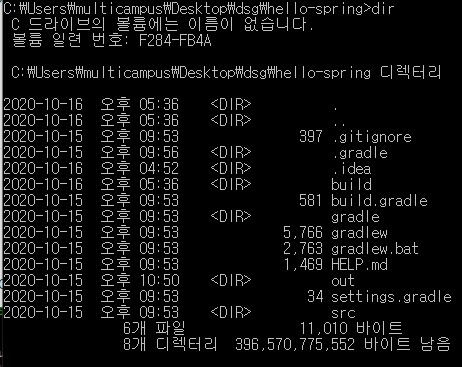
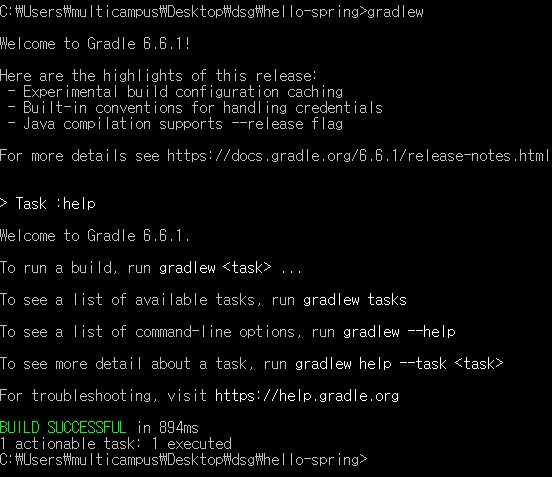
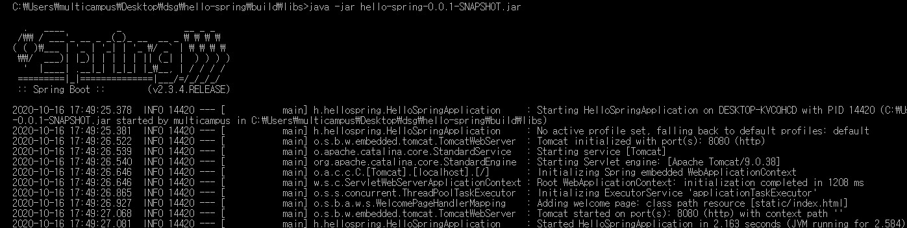
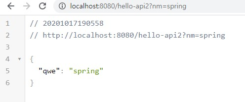
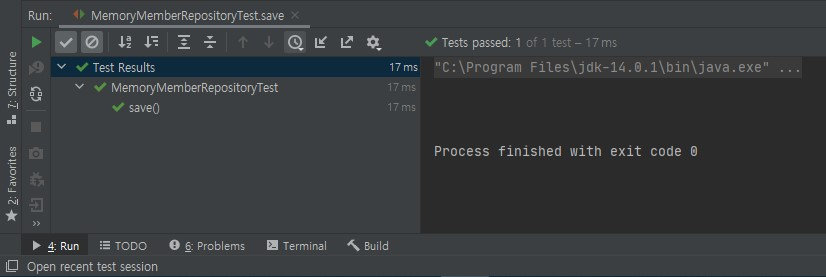
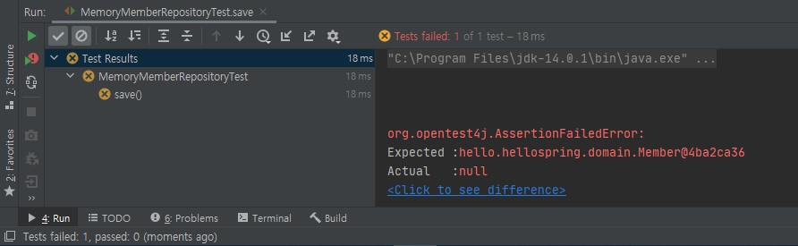

# 스프링 부트

- 스프링 프레임워크(이하 스프링)과 스프링 부트
  - 스프링 부트는 스프링을 더욱 사용하기 편리하게 개량한 것이라고 보면 된다.
  - 굳이 포함관계를 둔다면 스프링 부트가 스프링에 속한다고 볼 수 있다.
  - 스프링 부트의 개선점
    - Tomcat이 내장되어 있어 독립 실행이 가능하다.
    - 통합 스타터를 제공하여 메이븐/그레이들 구성을 간소화 해준다.
    - 의존성을 자동으로 관리해준다.
    - XML을 설정하지 않아도 된다.
    - jar file을 사용하여 손쉽게 배포가 가능하다.
    - 애플리케이션의 모니터링과 관리를 위한 스프링 액츄에이터를 제공한다.


# 스프링 부트 기초

## 프로젝트 생성하기

- 스프링 부트 공식 문서

  > https://docs.spring.io/spring-boot/docs/current/reference/html/ 

- 준비물: Java, IDE(IntelliJ 혹은 Eclipse) 설치

  - 단, gradle과 IntelliJ를 함께 쓸 경우 build, run이 직접 실행되는 것이 아니라 gradle을 통해서 되어 느리게 실행되는 경우가 있으므로 `Setting`에서 `Build, Execution, Deployment` 하부의 `Bulid Tools`에서 `Gradle`을 찾아 `Build and run using` 옵션과 `Run tests using` 옵션을 모두 `IntelliJ IDEA`로 변경해준다.
  
  - `IntelliJ` 팁
    - ctrl+shift+enter: 많은 코드를 자동완성 시켜준다.
    - sout까지 입력하면 `System.out.println`이 뜨는데 관련 옵션이 많이 있으므로 살펴보는 것도 좋다.
    - ctrl+d는 표시한 영역을 전부 복사 붙여넣기 하는 단축키다.
    - 복붙 한 뒤 복붙한 코드의 일부를 기존 코드와 바꾸려 할 경우 shift+f6으로 쉽게 변경 가능하다.
    - ctrl+alt+v는 리턴 값을 저장할 변수를 자동으로 생성해준다.
    - 메서드로 만들고자 하는 코드 블럭을 하이라이트 한 후 ctrl+alt+M을 누르면 해당 코드블럭을 메서드로 만들어준다.
    - 테스트 하려는 파일의 클레스 레벨에서 ctrl+shift+T를 누르면 테스트 파일을 생성할 수 있다.


- 스프링 부트 스타터 사이트로 이동해서 스프링 프로젝트 생성

  >https://start.spring.io/

  - 메이븐과 그레이들의 역할

    - 필요한 라이브러리 관리
    - 빌드시 라이프 사이클 관리

    - 과거에는 메이븐을 많이 썼으나 최근에는 그레이들을 많이 사용
    - 그레이들 추천

  - 스프링 부트의 버전 선택

    - SNAPSHOT, M1 등은 아직 개발 중인 버전

  - 프로젝트 메타 데이터 작성

    - 일반적으로 Group에는 기업 도메인명을 적는다.
    - Artifact는 빌드되어 나오는 결과물을 적는다.
    - Name, Descrition, Package name 등은 그대로 둬도 된다.

  - Dependencies에는 아래의 것들을 추가한다(나중에 추가해도 된다).

    -  `Spring Web `: Spring으로 웹 프로젝트를 생성하기 위해 설치
    - `Thymeleaf`: HTML을 만들어주는 템플릿 엔진, 다양한 종류가 있으나 `Thymeleaf`가 그나마 낫다.

  - 하단의 GENERATE 클릭

    - 압축파일이 다운 받아지는데 압축 해제 후 사용하면 된다.


- 생성 후 `build.gradle`파일을 보면 아래와 같이 되어있을 것이다(아래 코드의 경우 `Dependencies`를 아무것도 추가하지 않고 생성한 것이다).

  ```java
  plugins {
      //스프링 부트 버전
  	id 'org.springframework.boot' version '2.4.0'
      //의존관계 설정
  	id 'io.spring.dependency-management' version '1.0.10.RELEASE'
  	id 'java'
  }
  
  group = 'hello'
  version = '0.0.1-SNAPSHOT'
  //자바 버전
  sourceCompatibility = '11'
  
  repositories {
  	mavenCentral()
  }
  
  //의존성
  dependencies {
      //스프링 부트 실행에 반드시 필요한 spring-boot-starter
  	implementation 'org.springframework.boot:spring-boot-starter'
      //테스트 관련 라이브러리
  	testImplementation 'org.springframework.boot:spring-boot-starter-test'
  }
  
  test {
  	useJUnitPlatform()
  }
  ```

  

- 라이브러리
  - 스프링 프로젝트를 생성하면 `External Libraries` 폴더에서 설치된 라이브러리들을 볼 수 있는데 프로젝트 생성시 자동으로 추가되는 라이브러리만 수십가지 이다.
  - 메이븐, 그레이들은 이렇게 다양한 라이브러리들의 의존관계를 관리해준다.
    - 예를 들어 A라는 라이브러리가 B에 의존하고 B는 C라는 라이브러리에 의존한다면 A를 추가할 때 B,C를 자동으로 모두 추가해준다.
    - `IntelliJ` 창의 최우측 상단에 보면 Gradle(Maven을 설치했을 경우 Maven) 버튼을 클릭 할 수 있는 데(없을 시 좌측 최하단에 네모 표시를 클릭하면 생긴다.) 거기서 라이브러리들의 Dependnecies를 확인 가능하다.
    - 폴더 구조로 되어 있는 데 하단에 있는 라이브러리는 상단에 있는 라이브러리를 사용하는 데 필요한 라이브러리들이다.
    - `spring-boot-starter`: 스프링 부트 프로젝트 생성 시 자동으로 추가되며 스프링 부트, 스프링 코어, 로깅에 필요한 라이브러리 들이 담겨 있다.
    - 로깅의 경우 실무에서는 `system.out.println()`을 사용하지 않고 위 라이브러리에 있는 `logback`, `slf4j`을 사용한다.


## 프로젝트 실행하기

- 프로젝트 열기

  - `IntelliJ` 실행 후 `Open or Import Project` 클릭
  - `build.gradle` 클릭하여 실행

  

- 구조
  - 지금은 src 하부 폴더인 main과 test만 알고 있으면 된다.
    - `main`: 하부 폴더로 `java`, `resources`가 있고 `java`에 패키지와 소스 파일이 존재. `resources` 폴더 내부에는 XML, HTML, properties 파일 등 자바 이외의 웹 브라우저를 구성하는데 필요한 파일들이 존재한다.
    - `test`: 역시 하부 폴더로 `java`가 있으며 테스트와 관련된 파일이 존재.
  - 이외의 폴더는 전부 환경 관련 폴더들이다.
  - `build.gradle`: 버전과 라이브러리에 대한 정보가 작성된 파일
    - 자바 버전, 스프링 부트 버전, dependencies, 그룹명 등을 볼 수 있다.
  - `External Libraries`: 외부에서 가져온 라이브러리들이 저장된 폴더


- 실행하기	

  - 프로젝트 경로에 한글 폴더명이 있으면 실행되지 않는다.
  - `main/java/프로젝트명/프로젝트그룹명/프로젝트그룹명Application파일` 클릭
  - 코드 창 우클릭 후 `run` 클릭하여 실행
  - `Tomcat`
    - 아래 터미널 창을 확인해보면 맨 아래에서 두번째 줄에 아래와 같은 메세지를 확인할 수 있다.
    - `Tomcat started on port(s): 8080 (http) with context path ''`
    - `Tomcat`은 스프링에 내장된 웹 서버이다.
  - 과거에는 내장되어 있지 않아 `Tomcat` 서버를 별도로 실행해줘야 했다.
  
  ```java
  package hello.hellospring;
  
  import org.springframework.boot.SpringApplication;
  import org.springframework.boot.autoconfigure.SpringBootApplication;
  
  @SpringBootApplication
  public class HelloSpringApplication {
  
  	public static void main(String[] args) {
  		SpringApplication.run(HelloSpringApplication.class, args);
  	}
  
  }
  ```
  
  - 이후 `http://localhost:8080/`으로 접속 시 아래와 같이 뜨면 정상적으로 작동한 것이다.
  
  


## 스프링의 흐름

- 스프링은 코드를 변경 할 경우 반드시 서버를 껐다 켜야 한다.

  - `spring-boot-devtools` 라이브러리를 사용할 경우 html 파일만 컴파일 해주면 서버 재시작 없이도 변경 사항이 반영된다.

    > https://velog.io/@bread_dd/Spring-Boot-Devtools 참고


- Welcome page 만들기

  - 스프링 부트에서는 `src/main/resources/static`폴더 내부에 `index.html` 파일을 만들면 사이트에 처음 들어갔을 때 해당 페이지를 띄워 준다.

    - 파일명이 반드시 `index.html`이어야 한다.
  - 단, 컨트롤러에 기본 url(`http://localhost:8080/`)에 해당하는 주소가 없어야 한다.
  
- 만일 컨트롤러에 `@GetMapping("/")`와 같이 기본 경로에 대한 메서드가 존재하면 컨트롤러가 우선권을 지닌다.
  
- `src/main/resources/static/index.html`
  
    - 아래와 같이 작성 후 서버가 켜져 있었을 경우 서버를 재실행 하고 `localhost:8080`으로 접속해보면 hello!가 떠 있는 것을 확인할 수 있다.
    
    ```html
    <!DOCTYPE html>
    <html lang="en">
    <head>
        <meta charset="UTF-8">
        <title>Title</title>
    </head>
    <body>
        hello!
    </body>
    </html>
    ```


- `controller`
  - `main/java/프로젝트명/프로젝트그룹명`의 하부 파일로 `controller`라는 이름의 패키지를 생성

  - 위 패키지의 내부에 `이름Controller(e.g. HelloController)` 라는 이름의 자바 클래스 생성, 최초 생성 시 아래의 코드만 작성되어 있다.

    ```java
    package hello.hellospring.controller;
    
    public class HelloController {
    }
    ```

  - `HelloController` 상단에 `@Controller`를 입력하면 아래와 같이 추가된다.

    ```java
    package hello.hellospring.controller;
    
    import org.springframework.stereotype.Controller;
    
    @Controller
    public class HelloController {
    }
    ```

  - 이제 작성하고자 하는 내용을 추가한다.

    ```java
    package hello.hellospring.controller;
    
    import org.springframework.stereotype.Controller;
    import org.springframework.ui.Model;
    import org.springframework.web.bind.annotation.GetMapping;
    
    @Controller
    public class HelloController {
        
        // /hello-world로 요청이 들어올 경우 아래 메서드를 호출한다.
        @GetMapping("hello-world")
        public String hello(Model model){
            //아래 코드에는 나오지 않지만 실제 코드창에는 다음과 같이 자동으로 뜬다.
            //model.addAttribute(attributeName: "data", attributeValue: "ㅎㅇㅎㅇ");
            //키는 data, 값은 "ㅎㅇㅎㅇ"라는 뜻이다.
            model.addAttribute("data","ㅎㅇㅎㅇ");
            return "hello";
        }
    }
    ```

  - 그 후 `templates` 폴더 내부에 `hello.html` 파일 생성 후 아래와 같이 작성

    - html 파일의 이름은 `return` 값으로 입력한 문자열과 동일해야 한다.

    ```html
    <!DOCTYPE html>
    <!--이 프로젝트에서는 thymeleaf을 쓰므로 아래와 같이 입력하고-->
    <html xmlns:th="http://www.thymeleaf.org">
    <head>
        <meta charset="UTF-8">
        <title>Hello</title>
    </head>
    <body>
        <!--태그에 속성으로 th를 준 뒤 위에서 입력한 key값은 data를 출력하면-->
        <div th:text="'안녕하세요. '+${data}">안녕하세요. 손님</div>
    </body>
    </html>
    
    <!--
    out
    localhost:8080/hello-world 로 접속하면
    "안녕하세요. 손님" 이 출력되지 않고
    data에 해당하는 value인 ㅎㅇㅎㅇ가 들어가게 되어
    "안녕하세요. ㅎㅇㅎㅇ" 가 출력된다.
    ```
    
    - 어차피 출력되지 않을 "안녕하세요. 손님"을 `div`태그 안에 넣어둔 이유는 `thymeleaf`과 관련이 있다. `thymeleaf`에서는 서버가 작동하지 않고 있는 경우에 그냥 html 파일을 실행했을 때 태그 안에 있는 내용을 보여준다. 즉 서버가 실행되고 있을 경우에는 서버에서 받아온 내용을 출력하고, 서버가 실행되고 있지 않을 경우(그냥 `hello.html`파일을 클릭하여 실행했을 경우)에는 본래 태그 안에 있는 내용을 출력해준다. 굳이 이렇게 만든 이유는 서버가 실행되지 않을 때에도 html 파일의 스타일링을 가능하게 하기 위해서이다.


- 전체적인 흐름
  - 웹 브라우저에서 내장 톰켓 서버로 요청을 보낸다.
  - 톰켓 서버는 스프링 부트에 해당 요청을 처리하는 메서드가 있는 Controller로 해당 요청을 전달한다.
  - 모델에 {key:value}로 이루어진 데이터를 추가한 뒤 문자를 리턴값으로 반환한다.
  - 뷰 리졸버가 `resources/templates`내부에서 반환된 문자열과 파일명이 동일한 html파일을 찾아서 화면을 찾는다.
  - html파일을 렌더링한다(`Thymeleaf` 등의 템플릿 엔진이 이 역할을 수행).


## 빌드하기

- 빌드시에는 반드시 스프링 서버를 꺼야 한다.


- 빌드

  - cmd창에서 프로젝트 폴더로 위치를 이동 시킨 뒤 `dir`명령어를 입력하면 다음과 같이 나온다.

    

  - `gradlew`를 입력하면 `gradlew.bat` 이 실행되면서 빌드가 된다.

    

  - 완료 되면 프로젝트 폴더 내부에 기존에 없던 `build` 폴더가 생성된다. 

    - 빌드가 정상적을 되었다면 `build/libs` 내부에 `hello-spring-0.0.1-SNAPSHOT.jar`파일이 생성되었을 것이다.

    - build 폴더를 지우고 싶다면 아래 명령어를 입력하면 된다.

      ```bash
      gradle clean
      ```

    - 만일 `libs` 폴더가 존재하지 않는다면 아래 명령어를 입력하면 된다(build를 완전히 지우고 다시 빌드하는 것이다).

      ```bash
      gradlew clean build
      ```

  - `libs`폴더로 이동하여 아래 코드를 입력하면 서버가 실행된다.

    ```bash
    java -jar hello-spring-0.0.1-SNAPSHOT.jar
    ```

    

    

  ​	

  

  

# 스프링 웹 개발 기초

## 웹 개발의 종류

- 정적 컨텐츠: 서버에서 별도의 처리 없이 브라우저에 HTML 파일만 띄우는 것.
- MVC와 템플릿 엔진: 서버에서 특정한 요청에 따라 처리 후 브라우저에 HTML 파일을 띄우는 것.
  - Model
  - View
  - Controller
- API: 다른 서버, 혹은 클라이언트에 json 형식으로 데이터를 담아서 넘겨주는 것.


## 정적 컨텐츠

- 작성한 HTML 파일을 넘겨주는 것이 전부이기 때문에 HTML파일만 작성하면 된다.


- 예시

  - `src/main/resources/static/hihi.html` 파일에 아래와 같이 작성한다.

  ```html
  <!DOCTYPE html>
  <html lang="en">
  <head>
      <meta charset="UTF-8">
      <title>Title</title>
  </head>
  <body>
  hihi!!!
  </body>
  </html>
  ```

  - `http://localhost:8080/hihi.html`로 들어가면 위에서 `hihi.html`에 작성한 내용이 그대로 나오는 것을 확인할 수 있다.
  - 별도의 컨트롤러 조작 없이 html작성 후 경로에 작성한 파일명만 정확하게 작성하면 된다.

  

- 동작 방식
  - 브라우저에서 `localhost:8080/hihi.html` 페이지에 관한 요청을 톰캣 서버로 보낸다.
  - 톰캣 서버는 이를 스프링 부트로 넘긴다.
  - 스프링 부트는 요청과 관련된 컨트롤러가 있는지 찾아본다(즉 컨트롤러가 응답에 대한 우선권을 가진다).
  - 없을 경우 `resources/static` 내부에 요청과 관련된 정적 파일이 있는지 찾는다.
  - 있을 경우 이를 반환한다.


## MVC와 Template Engine

- 일반적인 웹 애플리케이션 계층 구조
  - 컨트롤러: MVC의 컨트롤러
  - 서비스: 핵심 비즈니스 로직 구현(ex. 동일인 중복가입 불가, 이메일 인증 필수 등)
  - 리포지토리: 데이터베이스에 접근, 도메인 객체를 DB에 저장하고 관리
  - 도메인: 비즈니스 도메인 객체(model과 유사한 개념)


- MVC 패턴
  - 개요: Model, View, Controller의 두문자를 딴 것으로 소프트웨어 디자인 패턴이다.
    - 디자인 패턴: 구현자들 간의 의사소통 효율성을 높이는 기법
    - `Model1`: MVC에서 View와 Controller가 함께 있는 형태로 규모가 작고 빨리 개발 해야 할 경우에 추천되는 방식이다.
    - `Model2`: MVC를 모두 구분하여 모듈화(부품화)시킨 형태로 규모가 크고 유지보수에 신경써야 할 경우 추천되는 방식이다.
    - 사람에 따라 `Model2`만을 MVC 패턴이라 부르기도 하고 `Model1`을 MVC 패턴의 변형이라 보기도 한다. 
  - 상세
    - Model: 애플리케이션의 정보, 데이터를 나타낸다.
    - View: 모델에 담긴 데이터를 시각화 한다.
    - Controller: 요청에 따라 Model과 View를 컨트롤 한다.


- 예시

  - `main/java/프로젝트명/프로젝트그룹명/controller/HelloController`

  ```java
  package hello.hellospring.controller;
  
  import org.springframework.stereotype.Controller;
  import org.springframework.ui.Model;
  import org.springframework.web.bind.annotation.GetMapping;
  import org.springframework.web.bind.annotation.RequestParam;
  
  @Controller
  public class HelloController {
      
      @GetMapping("hello-mvc")
      //@RequestParam("nm")은 nm이라는 parameter를 받겠다는 뜻이다.
      //String name1은 파라미터로 받은 값을 name1이라는 변수에 담겠다는 뜻이다.
      public String helloMvc(@RequestParam("nm") String name1, Model model){
          //name1이라는 변수를 value로, "name2"라는 키에 담겠다는 것이다.
          model.addAttribute("name2",name1);
          //hello2.html을 리턴하겠다는 뜻이다.
          return "hello2";
      }
  }
  ```

  - `src/main/resources/templates/hello2.html`

  ```html
  <!DOCTYPE html>
  <!--thymeleaf을 쓰기 위해 아래와 같이 작성해주고-->
  <html xmlns:th="http://www.thymeleaf.org">
  <head>
      <meta charset="UTF-8">
      <title>Hello</title>
  </head>
  <body>
  <!--응답으로 받은 데이터를 보여준다.-->
  <div th:text="'Hi! ' + ${name2}">Hi! empty</div>
  </body>
  </html>
  ```

  - 결과
    - 만일`http://localhost:8080/hello-mvc?nm=qwe`로 파라미터를 담아서 요청을 보낼 경우 정상적으로 `Hi! qwe`가 출력 될 것이다.
    - 그러나 `http://localhost:8080/hello-mvc`와 같이 파라미터를 담지 않고 요청을 보낼 경우 error 페이지가 나온다.
    - 이는 parameter를 반드시 받도록 설정되어 있기 때문으로, 만일 parameter를 받지 않고도 에러 페이지가 나오지 않게 하려면 다음과 같이 수정해야 한다.

  ```java
  package hello.hellospring.controller;
  
  import org.springframework.stereotype.Controller;
  import org.springframework.ui.Model;
  import org.springframework.web.bind.annotation.GetMapping;
  import org.springframework.web.bind.annotation.RequestParam;
  
  @Controller
  public class HelloController {
  
      @GetMapping("hello-mvc")
      //@RequestParam는 required라는 속성을 지니는데 true가 기본값으로 설정되어 있다.
      //따라서, 아래와 같이 required = false로 바꿔주면, `http://localhost:8080/hello-mvc`로 요청을 보냈을 때 "Hi! null"이 출력된다.
      public String helloMvc(@RequestParam(value="nm", required = false) String name1, Model model){
          model.addAttribute("name2",name1);
          return "hello2";
      }
  }
  ```

  

- 동작 방식
  - 웹 브라우저에서 톰캣 서버로 요청을 보낸다.
  - 톰캣 서버는 컨트롤러에서 요청을 전달한다.
  - 컨트롤러는 요청과 관련된 컨트롤러를 실행시고 실행 과정에서 넘겨야 할 데이터가 있으면 모델이 담아서 함께 넘긴다.
  - 컨트롤러는 실행 결과로 html 파일을 리턴한다.
  - `ViewResolver`는 템플릿 엔진을 찾아서 처리한 후, 컨트롤러에게 받은 html을 렌더링하여 변환된 html을 브라우저에 반환한다.


## API방식

- 템플릿 엔진을 사용하여 변환된 html을 브라우저에 반환한다는 점만 빼면 MVC와 동일하다. 


- 예시1

  - `main/java/프로젝트명/프로젝트그룹명/controller/HelloController`

  ```java
  package hello.hellospring.controller;
  
  import org.springframework.stereotype.Controller;
  import org.springframework.ui.Model;
  import org.springframework.web.bind.annotation.GetMapping;
  import org.springframework.web.bind.annotation.RequestParam;
  import org.springframework.web.bind.annotation.ResponseBody;
  
  @Controller
  public class HelloController {
      
      @GetMapping("hello-api")
      //응답의 body부분에 return 값을 넣어주겠다는 뜻
      @ResponseBody
      public String helloApi(@RequestParam("nm") String name){
          return "hello"+name;
      }
  }
  ```

  - 결과
    - `http://localhost:8080/hello-api?nm=spring`을 입력하면 "hello spring"만 있는 화면이 출력된다.
    - 앞에서 본 MVC의 예시 결과와 다른 점은 화면 우클릭 후 `페이지 소스 보기`를 클릭했을 때 아무런 HTML 코드도 뜨지 않는다는 것이다.

  

- 예시2: 객체를 넘기는 방법

  - `main/java/프로젝트명/프로젝트그룹명/controller/HelloController`

  ```java
  package hello.hellospring.controller;
  
  import org.springframework.stereotype.Controller;
  import org.springframework.ui.Model;
  import org.springframework.web.bind.annotation.GetMapping;
  import org.springframework.web.bind.annotation.RequestParam;
  import org.springframework.web.bind.annotation.ResponseBody;
  
  @Controller
  public class HelloController {
  
      @GetMapping("hello-api2")
      @ResponseBody
      public Hello helloApi2(@RequestParam("nm") String name){
          //h라는 Hello의 인스턴스를 생성
          Hello h = new Hello();
          h.setQwe(name);
          return h;
      }
              
      //Hello라는 클래스를 생성
      static class Hello{
          private String qwe;
  		
          //아래와 같이 get, set을 설정해주는데 이를 getter and setter 방식, 혹은 java bin 방식이라고 부른다.
          //get까지 입력하면 자동완성
          //위에서 qwe를 private으로 설정하여 외부에서 꺼낼 수 없으므로 아래와 같이 메소드를 통해 return 해준다.
          public String getQwe() {
              return qwe;
          }
  		
          //set까지 입력하면 자동완성
          public void setQwe(String asd) {
              //Hello 클래스 내부에 정의한 qwe를 인자로 넘어온 asd로 재할당하겠다.
              this.qwe = asd;
          }
      }
  }
  
  ```

  - 결과
    - `http://localhost:8080/hello-api2?nm=spring`을 입력하면 아래와 같이 json형식의 화면이 출력된다.

  

  - getter, setter 자동 완성 설정 방법
    - IntelliJ 기준으로 settings-plugin-lombok 검색 후 설치
    - get, set까지 입력하면 자동완성 문구가 뜬다.


- 동작 방식
  - 웹 브라우저가 톰캣에 요청을 보낸다.
  - 톰캣 서버는 컨트롤러에서 요청을 전달한다.
  - 컨트롤러는 요청과 관련된 컨트롤러를 실행시고 실행 과정에서 넘겨야 할 데이터가 있으면 모델이 담아서 함께 넘긴다.
  - `@ResponseBody`가 있을 경우 html를 반환하는 것이 아니라는 것을 인식.
  - `HttpMessageConverter`(상기한 MVC에서 `ViewResolver`에 해당)는 넘겨야 할 데이터가 객체인지 아닌지 판단.
  - 그 후 요청이 올 때  `HTTP Accept 해더` 와 서버의 컨트롤러의 반환 타입 정보를 조합해서 `HttpMessageConverter` 가 선택된다.
    - 예를 들어 `HTTP Accept 해더`에 json 형식이 아닌 xml로 받아야 겠다고 요청이 왔고 컨트롤러에서 반환 타입도 xml로 작성되어 있다면 xmlConverter가 동작한다.
  - 객체가 아닐 경우 해당 자료형에 맞는 Converter가 동작하여 그대로 반환 .
  -  객체일 경우` JsonConverter`(정확히는 `MappingJackson2HttpMessageConverter`)가 동작하여 json 방식으로 데이터를 변환하여 반환.
    - `MappingJackson2HttpMessageConverter`(일반적으로 `Jackson`이라 부른다)외에도 대표적으로 구글에서 사용하는 `GSONConverter`가 있다.
    - 스프링 부트에서도 컨버터를 `GSONConverter`로 변경하여 사용은 가능하다.
    - Converter에 대한 내용은 http converter를 검색하면 찾을 수 있다.


# 회원 관리 예제

## 회원 도메인과 리포지토리 만들기

- 예제
  - 기존의 controller 패키지가 있던 위치에 domain과 repository라는 2개의 패키지를 별도로 만들어야 한다.
  - `main/java/프로젝트명/프로젝트그룹명/domain/Member`에 멤버를 정의한다.

  ```java
  package hello.hellospring.domain;
  
  //Member class를 정의
  public class Member {
      
      //컬럼에 해당하는 id, name을 정의
      private Long id;
      private String name;
  
      //컬럼별 getter,setter 정의
      public Long getId() {
          return id;
      }
  
      public void setId(Long id) {
          this.id = id;
      }
  
      public String getName() {
          return name;
      }
  
      public void setName(String name) {
          this.name = name;
      }
  }
  ```

  - `main/java/프로젝트명/프로젝트그룹명/repository/MemberRepositroy`에 회원 정보를 저장할 저장소를 만든다(여기서 `MemberRepositroy`는 class가 아닌 interface 파일로 생성한다).

  ```java
  package hello.hellospring.repository;
  
  //Member를 import하고
  import hello.hellospring.domain.Member;
  
  //List도 import해서 사용해야 한다.
  import java.util.List;
  //Java8부터 추가된 기능으로 만일 findBy 등으로 특정 값을 찾으려 할 때 해당 값이 없을 경우 null이 반환되는데 이 때 error가 나지 않도록 해준다.
  import java.util.Optional;
  
  public interface MemberRepository {
      Member save(Member member);
      Optional<Member> findById(Long id);
      Optional<Member> findByName(String name);
      List<Member> findAll();
  }
  ```

  - `main/java/프로젝트명/프로젝트그룹명/repository/MemoryMemberRepositroy`에 구현체를 작성한다. 이 파일은 class 파일이다.

  ```java
  package hello.hellospring.repository;
  
  
  import hello.hellospring.domain.Member;
  
  import java.util.*;
  //아래 처럼 동일한 곳에서 import 할 것이 많을 경우 위와 같이 import 문이 자동으로 변경된다(5개 이상 import시 위와 같이 변경).
  //import java.util.HashMap;
  //import java.util.Map;
  //import java.util.List;
  //import java.util.Optional;
  //import java.util.ArrayList;
  
  //아래까지 작성 후 MemberRepository가 하이라이트 된 상태에서 우클릭하면 자동완성이 가능하다.
  public class MemoryMemberRepository implements MemberRepository{
  
  }
  ```

  ```java
  package hello.hellospring.repository;
  
  
  import hello.hellospring.domain.Member;
  import org.junit.jupiter.api.AfterEach;
  
  import java.util.*;
  
  public class MemoryMemberRepository implements MemberRepository{
      //회원 정보를 저장하기 위해 파이썬의 딕셔너리에 해당하는 map 객체를 하나 선언한다.
      private static Map<Long,Member> userList = new HashMap<>();
      //id값으로 넣을 n을 선언한다.
      private static long n = 0L;
  
      @Override
      public Member save(Member member) {
          //회원이 증가할 때 마다 id도 1씩 증가시킨다.
          member.setId(++n);
          //map에 key로 id를, value로 회원 이름을 넣는다.
          userList.put(member.getId(),member);
          return member;
      }
  
      @Override
      public Optional<Member> findById(Long id) {
          //아래와 같이 할 경우 id값이 null 일 때 에러가 발생할 수 있다.
          //return store.get(id);
          //따라서 아래와 같이 작성한다.
          return Optional.ofNullable(userList.get(id));
      }
  
      @Override
      public Optional<Member> findByName(String name) {
          //lambda식으로 일치하는 유저를 찾는다.
          return userList.values().stream()
                  .filter(member -> member.getName().equals(name))
                  .findAny();
      }
  
      @Override
      public List<Member> findAll() {
          //반환은 자료형을 List로 설정했으므로 아래와 같이 List로 변경해서 반환한다.
          return new ArrayList<>(userList.values());
      }
  
      //아래 메서드는 아래에서 테스트시 사용할 부분이므로 지금은 무시해도 된다.
      public void clearUserList(){
          //userList를 전부 비운다.
          userList.clear();
      }
  }
  ```

  

- 테스트 해보기

  - main 메서드를 통해서 실행하거나 웹 어플리케이션의 컨트롤러를 통해 해당 기능을 실행한다.
  - 위 방법은 준비하고 실행하는 데 오랜 시간이 필요하고 반복 실행이 어렵다.
  - Java는 `JUnit`이라는 프레임워크로 테스트를 실행하여 위와 같은 문제를 해결할 수 있다.

  - `java`폴더와 동일한 위치에 있는 `test` 폴더에서 진행하며 폴더 구조는 테스트할 코드와 동일하게 하는 것이 관례이고 테스트 파일의 파일명은 테스트 할 파일의 파일명+Test로 하는 것이 관례이다.
  - `main/test/프로젝트명/프로젝트그룹명/repository/MemoryMemberRepositoryTest`

  ```java
  //아래 코드를 class 레벨에서 돌리면 모든 테스트를 진행해 볼 수 있고, 클래스 내부의 각 테스트 메소드에서 돌리면 개별 메소드의 테스트가 가능하다.
  //단, 순차적으로 실행이 되는 것은 아니고 모든 메서드가 동시에 진행되므로 이로 인한 문제가 생길 수 있다(코드 맨 마지막 참조).
  package hello.hellospring.repository;
  
  import hello.hellospring.domain.Member;
  
  import org.assertj.core.api.Assertions;
  //아래와 같이 import 하면 아래에서 살펴볼 assertThat을 보다 편하게 사용할 수 있다.
  
  //Test를 import 하고
  import org.junit.jupiter.api.AfterEach;
  import org.junit.jupiter.api.Test;
  
  import java.util.List;
  import java.util.Optional;
  
  public class MemoryMemberRepositoryTest {
      //MemoryMemberRepository 인스턴스를 생성
      MemoryMemberRepository repository = new MemoryMemberRepository();
  
      //AfterEach는 각 메서드가 실행될 때 마다 아래 메서드를 실행시키겠다는 뜻이다.
      //별도의 libarary를 설치해야 사용 가능하다.
      //각 메서드가 한 번씩 실행될 때 마다 clearUserList 메서드를 실행시키겠다는 것이다(코드 맨 마지막 참조). 
      @AfterEach
      public void afterEachRun(){
          repository.clearUserList();
      }
  
      //@Test를 입력한다.
      @Test
      public void save(){
          Member member = new Member();
          member.setName("spring");
          
          //repository 객체에 멤버명을 저장
          repository.save(member);
          
          //저장 후 제대로 저장이 되었는지 검사
          //만일 제대로 저장이 되었다면 map에 id:name 묶음이 저장되었을 것이므로 id값으로도 찾을 수 있을 것이다.
          //Optional이 붙은 값을 가져 올 때는 아래와 같이 .get()을 붙여줘야 한다(그러나 권장하는 방법은 아니다. 아래 회원 서비스 개발 참조).
          Member result = repository.findById(member.getId()).get();
  
          //결과를 확인할 때는 아래와 같이 print 해봐도 되지만
  //        System.out.println("(result == member) = " + (result == member));
  
          //아래와 같이 assert를 확인하는 것이 더 좋다. import가 필요하다.
          //print와 같이 console창에 메세지가 뜨진 않지만 console창에 check표시가 나온다.
  //        Assertions.assertEquals(member,result);
          //틀렸을 경우의 예시 코드
  //        Assertions.assertEquals(member,null);
  
          //최근에 많이 쓰이는 방법은 아래 방법이다.
          Assertions.assertThat(member).isEqualTo(result);
          //만일 상기한대로 
          // import static org.assertj.core.api.Assertions.*;와 같이 import한 경우
          //assertThat(member).isEqualTo(result);와 같이 사용 가능하다.
      }
  
      @Test
      public void findByName(){
          Member member1 = new Member();
          member1.setName("spring1");
          repository.save(member1);
  
          Member member2 = new Member();
          member2.setName("spring2");
          repository.save(member2);
  
          //test
          Member result = repository.findByName("spring1").get();
  
          Assertions.assertThat(result).isEqualTo(member1);
      }
  
      @Test
      public void findAll(){
          Member member1 = new Member();
          member1.setName("spring1");
          repository.save(member1);
  
          Member member2 = new Member();
          member2.setName("spring2");
          repository.save(member2);
  
          List<Member> result = repository.findAll();
          Assertions.assertThat(result.size()).isEqualTo(2);
  
      }
  }
  
  //afterEachRun를 주석처리 한 상태에서 클래스 레벨에서 실행시키면 findByName, findAll중 나중에 실행되는 메소드에서 error가 발생한다.
  //에러의 원인은 두 메서드 모두 "spring1","spring2"라는 동일한 이름으로 유저명을 사용하여 값이 중복되었기 때문이다.
  //이러한 문제를 방지하기 위해서는 테스트 하나가 끝나고 나면 data를 clear 해줘야 한다.
  //이 때 MemoryMemberRepository파일에 정의했던 clearUserList 메서드를 사용한다.
  ```
  
  - `Assertions` 테스트 결과 화면
  
    - 성공
  
      
  
    - 실패
  
      
  
      
  
- TDD(테스트 주도 개발, Test Driven Development)
  - 위 방식처럼 개발을 한 후 개발 내용을 테스트 해보는 것이 아니라 테스트 코드를 먼저 작성한 후 개발 코드를 작성하여 개발 코드가 테스트 코드를 통과하는지를 확인하는 방식으로 개발하는 방법
  - 즉, 테스트를 먼저 짜고 테스트를 통과하기 위한 코드를 짜는 것이다.
  - 불확실성이 높은 프로젝트일 경우에 효과적인 개발 방식이다.


- 테스트 할 파일이 많을 경우 테스트 파일들이 모여 있는 상위 폴더를 우클릭 후 `Run 'Tests in~'`를 클릭하면 된다.


## 회원 서비스 개발

- 서비스는 전체적인 네이밍을 일반적으로 비즈니스에서 사용하는 용어로 사용하는 것이 관례다. 도메인, 리포지토리와는 달리 비즈니스 로직은 개발자 이외의 사람들과도 소통을 하면서 개발해야 하는 부분이 많기에 자신만 알아 볼 수 있는 용어 보다는 개발자가 아닌 사람도 알아 볼 수 있게 네이밍을 해야 한다.


- 예제

  - 기존에 패키지들을 만들었던 폴더에 service라는 패키지를 추가로 생성한다.
  - `main/java/프로젝트명/프로젝트그룹명/service/MemberService`

  ```java
  package hello.hellospring.sevice;
  
  import hello.hellospring.domain.Member;
  import hello.hellospring.repository.MemberRepository;
  import hello.hellospring.repository.MemoryMemberRepository;
  
  import java.util.List;
  import java.util.Optional;
  
  public class MemberServiece {
  	//아래와 같이 했을 때 이 파일에서 사용하는 repository와 test 파일에서 사용하는 repository가 달라지는 문제가 존재.
      //private final MemberRepository memberRepository = new MemoryMemberRepository();
      
      //따라서 아래와 같이 정의한다.
      //아래 코드에서 MemberServiece 메서드는 memberRepositoryPara를 인자로 받아 memberRepository에 넣어주는데 
      //이를 Dependency Injection(DI)이라 한다.
      private final MemberRepository memberRepository;
  
      public MemberServiece(MemberRepository memberRepositoryPara){
          this.memberRepository = memberRepositoryPara;
      }
      
      //회원 가입
      public Long join(Member member){
          //중복된 이름 검사
          //memberRepository.findByName(member.getName())까지만 입력하고 ctrl+alt+v를 입력하면 아래와 같이 자동완성이 된다.
          //Optional<Member> byName = memberRepository.findByName(member.getName());
          Optional<Member> result = memberRepository.findByName(member.getName());
  
          //만일 result가 null이 아니면, 즉 동일한 회원명이 있으면 IllegalStateException를 발생시킨다.
          //result.get()을 쓰지 않는 경우는 .get()을 쓰는 것을 권장하지 않기 때문이다(그러나 간편하기에 예제에서는 get을 사용).
          //때문에 보통 아래와 같이 .ifPresent()를 사용하며, 부득이 get을 사용해야 할 경우 orElseGet을 사용한다.
          //단, ifPresent를 사용하기 위해서는 findBy~를 정의할 때 반드시 Optional로 감싸줘야 한다.
          //그래야 찾는 값이 없을 때 null값을 반환해 ifPresent가 null값인지를 판단할 수 있기 때문이다.
          result.ifPresent(m -> {
              throw new IllegalStateException("이미 존재하는 회원입니다.");
          });
  
          //위 코드를 축약하면 아래와 같이 쓸 수 있다.
          /*
          memberRepository.findByName(member.getName())
                  .ifPresent(m -> {
                      throw new IllegalStateException("이미 존재하는 회원입니다.");
                  });
          */
  
          memberRepository.save(member);
          return member.getId();
      }
  
      //혹은 아래와 같이 중복 검사 부분을 메서드로 빼서 실행시킬 수도 있다(ctrl+alt+M)
      /*
      public Long join(Member member) {
          validateDuMember(member);
          memberRepository.save(member);
          return member.getId();
      }
  
      private void validateDuMember(Member member) {
          Optional<Member> result = memberRepository.findByName(member.getName());
          result.ifPresent(m -> {
              throw new IllegalStateException("이미 존재하는 회원입니다.");
          });
      }
      */
  
  
      //전체 회원 조회
      public List<Member> findMembers(){
          return memberRepository.findAll();
      }
  
      //특정 회원 조회
      public Optional<Member> findOne(Long MemberId){
          return memberRepository.findById(MemberId);
      }
  }
  ```


- 테스트

  - 보다 쉽게 테스트 생성하는 방법
    - 테스트 하려는 파일의 클레스 레벨에서 ctrl+shift+T를 누르면 테스트 파일을 생성할 수 있다.
    - `Testing library`는 `JUnit5`를 선택하고 테스트 할 메서드를 선택하면 된다.
  - 테스트 메서드는 한글을 사용하는 경우도 있다.
    - 빌드 될 때 테스트 코드는 포함되지 않으므로 한글로 해도 상관 없다.
  - 대부분의 테스트는 given/when/then으로 나눌 수 있다.
    - given: 주어진 상황에서
    - when: 코드를 실행했을 때
    - then: 기대한 결과가 나와야 한다.
  - `main/test/프로젝트명/프로젝트그룹명/service/MemberServieceTest`

  ```java
  package hello.hellospring.sevice;
  
  import hello.hellospring.domain.Member;
  import hello.hellospring.repository.MemoryMemberRepository;
  import org.junit.jupiter.api.AfterEach;
  import org.junit.jupiter.api.BeforeEach;
  import org.junit.jupiter.api.Test;
  
  import static org.assertj.core.api.Assertions.*;
  import static org.junit.jupiter.api.Assertions.assertThrows;
  
  class MemberServieceTest {
  	//아래와 같이 할 경우 테스트 할 파일에서 사용하는 repository와 test 파일에서 사용하는 repository가 달라지는 문제가 존재.
      //MemberServiece memberServiece = new MemberServiece();
      //MemoryMemberRepository memberRepository = new MemoryMemberRepository();
  	
      //따라서 아래와 같이 작성한다.
      MemberServiece memberServiece;
      MemoryMemberRepository memberRepository;
  
      //각 메서드가 실행되기 전에, MemberServiece를 실행시키면서 빈 memberRepository를 인자로 넘겨 repository를 초기화 해준다.
      @BeforeEach
      public void beforeEach(){
          memberRepository = new MemoryMemberRepository();
          memberServiece = new MemberServiece(memberRepository);
      }
  
      //data clear용 메서드
      @AfterEach
      public void afterEachRun(){
          memberRepository.clearUserList();
      }
  
      //정상 플로우
      @Test
      void 회원가입() {
          //given: hello라는 이름으로 회원가입 하는 상황에서
          Member member = new Member();
          member.setName("hello");
  
          //when: 회원가입이 실행될 때
          Long saveId = memberServiece.join(member);
  
          //then: 동일하지 않으면 정상적으로 가입이 완료되어야 한다.
          Member findMember = memberServiece.findOne(saveId).get();
          assertThat(member.getName()).isEqualTo(findMember.getName());
      }
  
      //에러 플로우
      @Test
      public void 중복_회원_예외(){
          //given
          Member member1 = new Member();
          member1.setName("spring");
  
          Member member2 = new Member();
          member2.setName("spring");
  
          //when
          //예외처리 방법
          //방법1. lambda식 이용
          memberServiece.join(member1);
          //member2가 회원가입 할 때, IllegalStateException이 발생한다면, error가 발생하지 않고 정상 실행된다.
          assertThrows(IllegalStateException.class, () -> memberServiece.join(member2));
          
          //메세지가 동일한지 확인하는 방식으로 검증
  //        IllegalStateException e = assertThrows(IllegalStateException.class, () -> memberServiece.join(member2));
  //        //만일 IllegalStateException error의 메세지가 "실패!!"와 다르다면 에러를 띄운다.
  ////      //MemberServiece에서 정의한 IllegalStateException error의 메세지는 "이미 존재하는 회원입니다." 이므로 error가 발생한다.
  //        assertThat(e.getMessage()).isEqualTo("실패!!");
  
  
  
          //아래와 같이 try, catch를 써도 되지만 구성이 까다롭다면 위 방식으로 하면 된다.
          //방법2. try, catch 사용
  //        memberServiece.join(member1);
  //        try {
  //            memberServiece.join(member2);
  //            fail("예외가 발생해야 합니다.");
  //        } catch (IllegalStateException e) {
  //            //만일 IllegalStateException error의 메세지가 "실패!!"와 다르다면 에러를 띄운다.
  //            //MemberServiece에서 정의한 IllegalStateException error의 메세지는 "이미 존재하는 회원입니다." 이므로 error가 발생한다.
  //            assertThat(e.getMessage()).isEqualTo("실패!!");
  //        }
  
      }
  
      @Test
      void findMembers() {
      }
  
      @Test
      void findOne() {
      }
  }
  ```

  

  

## *스프링 빈과 의존관계

- 회원 컨트롤러와 서비스가 리포지토리를 사용 할 수 있게 의존관계를 준비
  - 컨테이너에 등록된 객체(자바 클래스)를 스프링 빈(Bean)이라고 한다.
  - 빈 사이의 의존관계를 연결해 주는 역할은 스프링의 컨테이너가 담당한다.
  - 당연하게도 컨테이너에 등록이 되어 있어야 의존관계 설정이 가능하다.
  - 스프링 컨테이너에 스프링 빈을 등록할 때 기본으로 싱글 톤으로 등록한다(유일하게 하나만 등록해서 공유한다).
    - 예를 들어 배달 어플을 만든다고 할 때, 주문자와 회원 정보를 모두 Member라는 한 클래스를 사용한다고 하면
    - 주문자 정보 관리 때 Member의 객체를 빈으로 등록하고, 회원 정보 관리 때 다시 Member의 객체를 빈으로 등록하지 않는다.
    - 주문자 정보 관리 때 빈으로 등록했다면 회원정보 관리때는 해당 빈을 공유하여 사용한다. 


- 스프링 빈 등록 방법1. 컴포넌트 스캔을 통한 자동 의존관계 설정

  - 개발자가 Controller, Service, Repository에 각기 `@Controller`, `@Service`, `@Repository`라고 작성해 주는 방법.
    - component 관련 어노테이션이 붙어 있으면 스프링은 해당 어노테이션이 사용된 클래스의 인스턴스를 하나씩 생성하여 컨테이너에 등록한다.
    - 컨테이너는 등록된 인스턴스들의 의존관계를 설정해 주기에, component 관련 어노테이션을 써줘야 연결이 가능하다.
    -  `@Controller`, `@Service`, `@Repository` 세 가지 모두 내부 코드를 보면 `@Component`가 사용되었다.
    - 따라서 위 3가지를 써주면 컨테이너에 등록이 되고 컨테이너가 의존관계를 자동을 설정해준다.
  - 스프링이 component 관련 어노테이션이 있는지 탐색해서 컨테이너에 등록해준는 파일들은 실행 파일(`~Application`파일)이 속한 폴더(`/프로젝트명/프로젝트그룹명`)의 하위폴더들만이다. 따라서 이외의 폴더에 파일을 만들어 놓고 component 관련 어노테이션을 사용하더라도 등록은 되지 않는다.
  - `main/java/프로젝트명/프로젝트그룹명/controller/MemberController`

  ```java
  package hello.hellospring.controller;
  
  import hello.hellospring.sevice.MemberServiece;
  import org.springframework.beans.factory.annotation.Autowired;
  import org.springframework.stereotype.Controller;
  
  @Controller
  public class MemberController {
      //Controller에서 MemberService를 쓰기 위해서 아래와 같이 인스턴스를 생성해서 써도 되지만 권장하지않는다.
      //만일 MemberController 뿐 아니라 다양한 컨트롤러에서 MemberServiece를 써야 할 경우, 각 컨트롤러에서 MemberService 클래스의
      //각기 다른 인스턴스를 사용하는 셈이 되기 때문이다. 물론 그래야 하는 경우에는 아래와 같이 해야 겠지만 일반적으로 아래와 같이 새용하지 않는다.
      //private final MemberServiece memberServiece = new MemberService();
  
      //따라서 아래와 같이 spring container에 동록하여 사용한다.
      //먼저 선언해주고
      private final MemberService memberService;
  
      @Autowired
      //아래와 같은 생성자가 호출 될 때 @Autowired가 있으면 자동으로 빈이 등록되고 spring container에서 MemberServiece를 가져와 MemberController와 자동으로 연결해준다.
      //그러나 아래 코드만 작성해서는 연결할 수 없다. 열결 하고자 하는 클래스에도 별도의 코드를 작성해야 한다.
      //생성자가 1개 뿐일 경우에는 @Autowired를 생략 가능하다.
      public MemberController(MemberServiece memberService){
          this.memberService = memberServiece;
      }
  
  }
  ```

  - `main/java/프로젝트명/프로젝트그룹명/service/MemberService`

  ```java
  package hello.hellospring.sevice;
  
  import hello.hellospring.domain.Member;
  import hello.hellospring.repository.MemberRepository;
  import hello.hellospring.repository.MemoryMemberRepository;
  //import 해야 한다.
  import org.springframework.stereotype.Service;
  import org.springframework.beans.factory.annotation.Autowired;
  
  import java.util.List;
  import java.util.Optional;
  
  //아래와 같이 @Service를 입력해야 container가 찾을 수 있다.
  @Service
  public class MemberServiece {
  
      private final MemberRepository memberRepository;
  	
      //마찬가지로 생성자에 @Autowired를 붙여준다.
      @Autowired
      public MemberServiece(MemberRepository memberRepositoryPara){
          this.memberRepository = memberRepositoryPara;
      }
      //후략
  }
  ```

  - `main/java/프로젝트명/프로젝트그룹명/repository/MemberRepositroy`
    - 리포지토리 역시 컨트롤러, 서비스와 마찬가지로 아래와 같이 추가해준다.

  ```java
  package hello.hellospring.repository;
  
  
  import hello.hellospring.domain.Member;
  import org.junit.jupiter.api.AfterEach;
  //import 해주고
  import org.springframework.stereotype.Repository;
  
  import java.util.*;
  
  //추가 해준다.
  @Repository
  public class MemoryMemberRepository implements MemberRepository{
      private static Map<Long,Member> userList = new HashMap<>();
      private static long n = 0L;
  
      @Override
      public Member save(Member member) {
          member.setId(++n);
          userList.put(member.getId(),member);
          return member;
      }
  
      //후략
  }
  ```

  

- 스프링 빈 등록 방법2. 자바 코드로 직접 빈 등록하기

  - Controller는 방법1. 컴포넌트 스캔을 통해 위와 동일하게 등록한다.
  - `main/java/프로젝트명/프로젝트그룹명/SpringConfig`

  ```java
  package hello.hellospring.sevice;
  
  import hello.hellospring.sevice.MemberServiece;
  import hello.hellospring.repository.MemberRepository;
  import hello.hellospring.repository.MemoryMemberRepository;
  import org.springframework.context.annotation.Bean;
  import org.springframework.context.annotation.Configuration;
  
  @Configuration
  public class SpringConfig {
      
      //MemberServiece을 Spring Bean에 등록하겠다는 코드
      @Bean
      public MemberServiece memberServiece(){
          //bean에 등록된 memberRepository를 MemberServiece에 넣어준다.
          return new MemberServiece(memberRepository());
      }
      
      //MemberRepository를 Spring Bean에 등록하겠다는 코드
      @Bean
      public MemberRepository memberRepository(){
          return new MemoryMemberRepository();
      }
  }
  ```


- 스프링 빈 등록 방법3. XML로 설정하는 방법
  - 이러한 방법이 존재는 하지만 요즘에는 잘 사용하지 않는 방법이다.


- 실무에서는 주로 정형화된 컨트롤러, 서비스, 리포지토리 같은 코드는 컴포넌트 스캔을 사용하고 정형화 되지 않거나 상황에 따라 구현 클래스를 변경해야 할 경우에는 설정을 통해 스프링 빈으로 등록한다.


- 의존성 주입

  - 의존성 주입에는 필드 주입, setter 주입, 생성자 주입의 3가지 방법이 있다.

  - 의존관계가 실행중에 동적으로 변하는 경우는 거의 없으므로 생성자 주입을 권장한다.

  - 예시

    - 생성자 주입

    ```java
    package hello.hellospring.controller;
    
    import hello.hellospring.sevice.MemberServiece;
    import org.springframework.beans.factory.annotation.Autowired;
    import org.springframework.stereotype.Controller;
    
    @Controller
    public class MemberController {
    
        private final MemberService memberService;
    
        @Autowired
        //아래의 생성자를 통해서 memberService가 MemberController에 주입되는 생성자 주입 방식이다.
        public MemberController(MemberServiece memberService){
            this.memberService = memberServiece;
        }
    
    }
    ```

    - 필드 주입: 권장되지 않는 방식으로 ide 설정에 따라 경고 문구가 뜨기도 한다.

    ```java
    package hello.hellospring.controller;
    
    import hello.hellospring.sevice.MemberServiece;
    import org.springframework.beans.factory.annotation.Autowired;
    import org.springframework.stereotype.Controller;
    
    @Controller
    public class MemberController {
        
        @Autowired private MemberServiece memberServiece;
    }
    ```

    - setter 주입

    ```java
    package hello.hellospring.controller;
    
    import hello.hellospring.sevice.MemberServiece;
    import org.springframework.beans.factory.annotation.Autowired;
    import org.springframework.stereotype.Controller;
    
    //setter 주입
    @Controller
    public class MemberController {
    
        private MemberServiece memberServiece;
    
        @Autowired
        //아래 보이다 싶이 setMemberServiece가 public으로 설정되어야 하기에 어지간해서는 수정할 일이 없음에도 노출이 되어 수정이 가능해진다는 문	제가 있다.
        public void setMemberServiece(MemberServiece memberServiece){
            this.memberServiece = memberServiece;
        }
    }
    ```

  

  

  

## 웹 MVC 개발

- 홈 화면 만들기

  - 컨트롤러(`main/java/프로젝트명/프로젝트그룹명/controller/HomeController`)

  ```java
  package hello.hellospring.controller;
  
  import org.springframework.stereotype.Controller;
  import org.springframework.web.bind.annotation.GetMapping;
  
  @Controller
  public class HomeController {
      @GetMapping("/")
      public String home(){
          return "home";
      }
  }
  ```

  - html(`main/resources/templates/home.html`)

  ```html
  <!DOCTYPE html>
  <html lang="en">
  <head>
      <meta charset="UTF-8">
      <title>Title</title>
  </head>
  <body>
      <div class="container">
          <h1>Hello Spring</h1>
          <p>회원 기능</p>
          <p>
              <a href="/member/join">회원 가입</a>
              <a href="/members">회원 목록</a>
          </p>
      </div>
  </body>
  </html>
  ```


- 회원 가입

  - 컨트롤러(`main/java/프로젝트명/프로젝트그룹명/controller/MemberController`)

  ```java
  package hello.hellospring.controller;
  
  import hello.hellospring.domain.Member;
  import hello.hellospring.sevice.MemberServiece;
  import org.springframework.beans.factory.annotation.Autowired;
  import org.springframework.stereotype.Controller;
  import org.springframework.web.bind.annotation.GetMapping;
  import org.springframework.web.bind.annotation.PostMapping;
  
  @Controller
  public class MemberController {
  
      private final MemberServiece MemberService;
  
      @Autowired
      public MemberController(MemberServiece memberService){
          this.MemberService = memberService;
      }
  	
      //회원가입 화면으로 이동
      @GetMapping("/member/join")
      public String createForm(){
          return "members/createMemberForm";
      }
  	
      //회원가입 실행
      @PostMapping("/member/join")
      //이 메소드가 실행되면서 자동으로 form.setName()도 실행된다.
      public String create(MemberForm form){
          System.out.println(form.getName()); //가입할 때 입력한 name이 출력된다.
          Member member = new Member();
          member.setName(form.getName());
  
          MemberService.join(member);
  
          return "redirect:/";
      }
  }
  ```

  - html(`main/resources/templates/members/home.html`)

  ```html
  <!DOCTYPE HTML>
  <html xmlns:th="http://www.thymeleaf.org">
  <body>
  <div class="container">
      <!--action에 요청을 보낼 경로와 방식을 입력한다.-->
      <form action="/member/join" method="post">
          <div class="form-group">
              <label for="name">이름</label>
              <!--아래 name="name"과 MemberForm의 name이 매칭되는 것이다.-->
              <input type="text" id="name" name="name" placeholder="이름을 입력하세요">
          </div>
          <button type="submit">등록</button>
      </form>
  </div> <!-- /container -->
  </body>
  </html>
  ```

  - 회원 데이터 처리(`main/java/프로젝트명/프로젝트그룹명/controller/MemberForm`)

  ```java
  package hello.hellospring.controller;
  
  public class MemberForm {
      private String name;
  
      public String getName() {
          return name;
      }
      
  	//회원가입 창에서 등록 버튼을 누르면 MemberController의 create함수가 실행되는데 이 때 setName()도 자동으로 실행되면서 this.name에 form에 		담겨 넘어온 name이 담기게 된다.
      public void setName(String name) {
          this.name = name;
      }
  }
  ```

  

- 회원 조회

  - 컨트롤러(`main/java/프로젝트명/프로젝트그룹명/controller/MemberController`)

  ```java
  //전략
  
  @Controller
  public class MemberController {
  
      private final MemberServiece memberService;
  
      @Autowired
      public MemberController(MemberServiece memberService){
          this.memberService = memberService;
      }
  	
      //중략
      
      @GetMapping("/members")
      public String list(Model model){
          List<Member>members=memberService.findMembers();
          //members라는 key로, members라는 리스트를 value로 넘기겠다.
          model.addAttribute("members",members);
          return "members/memberList";
      }
  }
  ```

  - html(`main/resources/templates/members/memberList.html`)

  ```html
  <!DOCTYPE HTML>
  <html xmlns:th="http://www.thymeleaf.org">
  <body>
  <div class="container">
      <div>
          <table>
              <thead>
              <tr>
                  <th>#</th>
                  <th>이름</th>
              </tr>
              </thead>
              <tbody>
              <!--th:each는 for문과 유사하다. member에는 1회의 반복에 해당하는 데이터, members는 반복할 데이터다.-->
              <tr th:each="member : ${members}">
                  <!--아래와 같이 member.id, member.name을 사용하기 위해서는 getId, getName이 정의되어 있어야 한다.-->
                  <!--domain/Member에 둘 다 정의해줬기에 아래와 같이 사용이 가능한 것이다.-->
                  <td th:text="${member.id}"></td>
                  <td th:text="${member.name}"></td>
              </tr>
              </tbody>
          </table>
      </div>
  </div> <!-- /container -->
  </body>
  </html>
  ```


# 데이터 베이스

- H2 데이터 베이스 설치

  >https://www.h2database.com/html/main.html

  - 설치 후 `H2 Console`을 실행한다.
  - 실행 후  `JDBC URL`에 `jdbc:h2:~/test`를 입력하고 실행한다(최초 1회). 성공할 경우 `c/user/사용자명`에 `test.mv.db` 파일이 생성된다.
  - 이후 부터는 `JDBC URL`에 `jdbc:h2:tcp://localhost/~/test`를 입력한 후 연결한다. 

  

- 실행

  - 테이블 생성

  ```sql
  create table member
  (
   /*id를 bigint 타입으로 설정하고 null값으로 들어와도 db가 자동으로 값을 채워준다(generated by default).*/
   id bigint generated by default as identity,
   name varchar(255),
   primary key (id)
  );
  ```

  - 데이터 삽입

  ```sql
  insert into member(name) values('qwe')
  ```

  - 데이터 조회

  ```sql
  SELECT * FROM MEMBER
  
  /*
  ID | NAME
  1  | qwe
  */
  ```

  

## 순수 JDBC

- 약 20년 전에 사용하던 방식으로 이런 방법이 있다는 것을 알고만 있으면 된다.


- `build.gradle` 파일의 `dependncies`  부분에 아래와 같이 작성, 이후 화면 우측 상단에 gradle 아이콘이 뜨는 데 아이콘을 클릭하면 작성한 라이브러리가 설치된다.

  ```java
  //전략
  dependencies {
  	implementation 'org.springframework.boot:spring-boot-starter-thymeleaf'
  	implementation 'org.springframework.boot:spring-boot-starter-web'
          
      //아래 2줄을 추가
      //db와 연동을 위한 코드
  	implementation 'org.springframework.boot:spring-boot-starter-jdbc'
      //db가 제공하는 클라이언트를 사용하기 위한 코드
  	runtimeOnly 'com.h2database:h2'
      
  	testImplementation('org.springframework.boot:spring-boot-starter-test') {
  		exclude group: 'org.junit.vintage', module: 'junit-vintage-engine'
  	}
  }
  //후략
  ```


- `application.properties`파일에 아래 코드를 추가

  ```java
  //아래 jdbc:h2:tcp://localhost/~/test는 H2의 JDBC URL을 넣으면 된다.
  spring.datasource.url=jdbc:h2:tcp://localhost/~/test
  spring.datasource.driver-class-name=org.h2.Driver
  ```


- `main/java/프로젝트명/프로젝트그룹명/repository/JdbcMemberRepository`

  ```java
  package hello.hellospring.repository;
  import hello.hellospring.domain.Member;
  import org.springframework.jdbc.datasource.DataSourceUtils;
  import javax.sql.DataSource;
  import java.sql.*;
  import java.util.ArrayList;
  import java.util.List;
  import java.util.Optional;
  
  public class JdbcMemberRepository implements MemberRepository {
      //db에 붙이기 위해서는 DataSource가 필요하다.
      private final DataSource dataSource;
      //생성자를 통해 dataSource를 주입한다.
      public JdbcMemberRepository(DataSource dataSource) {
          this.dataSource = dataSource;
      }
  
      @Override
      public Member save(Member member) {
          String sql = "insert into member(name) values(?)";
  
          Connection conn = null;
          PreparedStatement pstmt = null;
          ResultSet rs = null;
  
          try {
              conn = getConnection();
              pstmt = conn.prepareStatement(sql,
                      Statement.RETURN_GENERATED_KEYS);
  
              pstmt.setString(1, member.getName());
  
              pstmt.executeUpdate();
              rs = pstmt.getGeneratedKeys();
              
              if (rs.next()) {
                  member.setId(rs.getLong(1));
              } else {
                  throw new SQLException("id 조회 실패");
              }
              return member;
          } catch (Exception e) {
              throw new IllegalStateException(e);
          } finally {
              close(conn, pstmt, rs);
          }
      }
  
      @Override
      public Optional<Member> findById(Long id) {
          String sql = "select * from member where id = ?";
          Connection conn = null;
          PreparedStatement pstmt = null;
          ResultSet rs = null;
          try {
              conn = getConnection();
              pstmt = conn.prepareStatement(sql);
              pstmt.setLong(1, id);
              rs = pstmt.executeQuery();
              if(rs.next()) {
                  Member member = new Member();
                  member.setId(rs.getLong("id"));
                  member.setName(rs.getString("name"));
                  return Optional.of(member);
              } else {
                  return Optional.empty();
              }
          } catch (Exception e) {
              throw new IllegalStateException(e);
          } finally {
              close(conn, pstmt, rs);
          }
      }
  
      @Override
      public List<Member> findAll() {
          String sql = "select * from member";
          Connection conn = null;
          PreparedStatement pstmt = null;
          ResultSet rs = null;
          try {
              conn = getConnection();
              pstmt = conn.prepareStatement(sql);
              rs = pstmt.executeQuery();
              List<Member> members = new ArrayList<>();
              while(rs.next()) {
                  Member member = new Member();
                  member.setId(rs.getLong("id"));
                  member.setName(rs.getString("name"));
                  members.add(member);
              }
              return members;
          } catch (Exception e) {
              throw new IllegalStateException(e);
          } finally {
              close(conn, pstmt, rs);
          }
      }
  
      @Override
      public Optional<Member> findByName(String name) {
          String sql = "select * from member where name = ?";
          Connection conn = null;
          PreparedStatement pstmt = null;
          ResultSet rs = null;
          try {
              conn = getConnection();
              pstmt = conn.prepareStatement(sql);
              pstmt.setString(1, name);
              rs = pstmt.executeQuery();
              if(rs.next()) {
                  Member member = new Member();
                  member.setId(rs.getLong("id"));
                  member.setName(rs.getString("name"));
                  return Optional.of(member);
              }
              return Optional.empty();
          } catch (Exception e) {
              throw new IllegalStateException(e);
          } finally {
              close(conn, pstmt, rs);
          }
      }
      private Connection getConnection() {
          return DataSourceUtils.getConnection(dataSource);
      }
      private void close(Connection conn, PreparedStatement pstmt, ResultSet rs)
      {
          try {
              if (rs != null) {
                  rs.close();
              }
          } catch (SQLException e) {
              e.printStackTrace();
          }
          try {
              if (pstmt != null) {
                  pstmt.close();
              }
          } catch (SQLException e) {
              e.printStackTrace();
          }
          try {
              if (conn != null) {
                  close(conn);
              }
          } catch (SQLException e) {
              e.printStackTrace();
          }
      }
      private void close(Connection conn) throws SQLException {
          DataSourceUtils.releaseConnection(conn, dataSource);
      }
  }
  ```

  

- `main/java/프로젝트명/프로젝트그룹명/SpringConfig`

  ```java
  package hello.hellospring;
  import hello.hellospring.repository.JdbcMemberRepository;
  import hello.hellospring.repository.MemberRepository;
  import hello.hellospring.repository.MemoryMemberRepository;
  import hello.hellospring.sevice.MemberServiece;
  import org.springframework.beans.factory.annotation.Autowired;
  import org.springframework.context.annotation.Bean;
  import org.springframework.context.annotation.Configuration;
  import javax.sql.DataSource;
  
  @Configuration
  public class SpringConfig {
  
      private final DataSource dataSource;
  
      @Autowired
      public SpringConfig(DataSource dataSource) {
          this.dataSource = dataSource;
      }
  
      @Bean
      public MemberServiece memberService() {
          return new MemberServiece(memberRepository());
      }
  	
      //기존에 메모리 버전의 MemberRepository가 아닌 Jdbc 버전의 MemberRepository가를 사용하겠다는 코드
      @Bean
      public MemberRepository memberRepository() {
          return new JdbcMemberRepository(dataSource);
      }
  }
  ```


- 이제 확인해보면 DB와 Spring이 연동된 것을 확인할 수 있다.

- 개방-폐쇄 원칙(OCP, Open-Closed Principle)
  - 확장에는 열려 있고 수정, 변경에는 닫혀 있다.
- 스프링의 DI(의존성 주입)를 사용하면 기존 코드를 전혀 손대지 않고 설정만으로 구현 클래스를 변경할 수 있다.


## 스프링 통합 테스트

- 통합 테스트
  - 이전에 했던 테스트들은 스프링 테스트라기 보다는 순수한 개별 자바 코드에 대한 테스트에 가까웠다.
  - 아래는 스프링을 통합적으로 테스트 하는 방법이다.


- `main/test/프로젝트명/프로젝트그룹명/service/MemberServieceIntegrationTest`

  - `@Transactional`
    - 아래 코드에서 `@Transactional`를 주석 처리 한 상태에서 회원 가입 코드만 테스트를 하면 1회는 에러 없이 동작하지만 2회는 에러가 발생한다.
    - 이는 이미 "hello"라는 회원이 db에 들어갔기 때문인데 `@Transactional`은 이와 같이 테스트가 끝나면 db를 테스트 이전 상태로 롤백시켜준다.

  ``` java
  package hello.hellospring.sevice;
  
  import hello.hellospring.domain.Member;
  import hello.hellospring.repository.MemberRepository;
  import org.junit.jupiter.api.Test;
  import org.springframework.beans.factory.annotation.Autowired;
  import org.springframework.boot.test.context.SpringBootTest;
  import org.springframework.transaction.annotation.Transactional;
  
  import static org.assertj.core.api.Assertions.*;
  import static org.junit.jupiter.api.Assertions.assertThrows;
  
  //스프링 컨테이너와 테스트를 함께 실행하도록 해준다.
  @SpringBootTest
  @Transactional
  class MemberServiceIntegrationTest {
  
      //test 할 때에는 필드 주입을 해도 무관하다.
      @Autowired MemberServiece memberServiece;
      @Autowired MemberRepository memberRepository;
  
      //@Transactional를 사용하기에 이제 아래 데이터를 초기화 하는 코드는 필요가 없다.
  //    @AfterEach
  //    public void afterEachRun(){
  //        memberRepository.clearUserList();
  //    }
  
      @Test
      void 회원가입() {
          Member member = new Member();
          member.setName("hello");
  
          Long saveId = memberServiece.join(member);
  
          Member findMember = memberServiece.findOne(saveId).get();
          assertThat(member.getName()).isEqualTo(findMember.getName());
      }
  
      @Test
      public void 중복_회원_예외(){
          Member member1 = new Member();
          member1.setName("spring");
  
          Member member2 = new Member();
          member2.setName("spring");
  
          memberServiece.join(member1);
          assertThrows(IllegalStateException.class, () -> memberServiece.join(member2));
  
      }
  
      @Test
      void findMembers() {
      }
  
      @Test
      void findOne() {
      }
  }
  ```

  

  

## Jdbc Template

- Jdbc Template
  - JDBC API의 반복 코드를 대부분 제거해준다. 
  - sql은 직접 작성해야 한다.
  - 유사한 라이브러리로는 MyBatis가 있다.


- `main/java/프로젝트명/프로젝트그룹명/repository/JdbcTemplateMemberRepository`

  ```java
  package hello.hellospring.repository;
  
  import hello.hellospring.domain.Member;
  import org.springframework.beans.factory.annotation.Autowired;
  import org.springframework.jdbc.core.JdbcTemplate;
  import org.springframework.jdbc.core.RowMapper;
  import org.springframework.jdbc.core.namedparam.MapSqlParameterSource;
  import org.springframework.jdbc.core.simple.SimpleJdbcInsert;
  
  import javax.sql.DataSource;
  import java.sql.ResultSet;
  import java.sql.SQLException;
  import java.util.HashMap;
  import java.util.List;
  import java.util.Map;
  import java.util.Optional;
  
  public class JdbcTemplateMemberRepository implements MemberRepository{
  
      private final JdbcTemplate jdbcTemplate;
  
      @Autowired
      public JdbcTemplateMemberRepository(DataSource dataSource){
          jdbcTemplate = new JdbcTemplate(dataSource);
      }
  
      @Override
      public Member save(Member member) {
          SimpleJdbcInsert jdbcInsert = new SimpleJdbcInsert(jdbcTemplate);
          jdbcInsert.withTableName("member").usingGeneratedKeyColumns("id");
          Map<String, Object> parameters = new HashMap<>();
          parameters.put("name", member.getName());
          Number key = jdbcInsert.executeAndReturnKey(new
                  MapSqlParameterSource(parameters));
          member.setId(key.longValue());
          return member;
      }
  
      @Override
      //순수 jdbc의 findById와 비교하면 굉장히 축약된 것이라는 것을 알 수 있다.
      public Optional<Member> findById(Long id) {
          List<Member> result = jdbcTemplate.query("selct * from member where id = ?", memberRowMapper(), id);
          return result.stream().findAny();
      }
  
      @Override
      public Optional<Member> findByName(String name) {
          List<Member> result = jdbcTemplate.query("select * from member where name = ?", memberRowMapper(), name);
          return result.stream().findAny();
      }
  
      @Override
      public List<Member> findAll() {
          return jdbcTemplate.query("select * from member", memberRowMapper());
      }
  
      private RowMapper<Member> memberRowMapper(){
          return (rs, rowNum) -> {
              Member member = new Member();
              member.setId(rs.getLong("id"));
              member.setName(rs.getString("name"));
              return member;
          };
      }
  }
  ```


- `main/java/프로젝트명/프로젝트그룹명/SpringConfig`

  ```java
  package hello.hellospring;
  import hello.hellospring.repository.JdbcMemberRepository;
  import hello.hellospring.repository.JdbcTemplateMemberRepository;
  import hello.hellospring.repository.MemberRepository;
  import hello.hellospring.repository.MemoryMemberRepository;
  import hello.hellospring.sevice.MemberServiece;
  import org.springframework.beans.factory.annotation.Autowired;
  import org.springframework.context.annotation.Bean;
  import org.springframework.context.annotation.Configuration;
  import javax.sql.DataSource;
  
  @Configuration
  public class SpringConfig {
  
      private final DataSource dataSource;
  
      @Autowired
      public SpringConfig(DataSource dataSource) {
          this.dataSource = dataSource;
      }
  
      @Bean
      public MemberServiece memberService() {
          return new MemberServiece(memberRepository());
      }
  
      @Bean
      public MemberRepository memberRepository() {
          return new JdbcTemplateMemberRepository(dataSource);
      }
  }
  ```

  

## JPA

- JPA(jakarta.persistence-api)
  - jdbc template도 굉장히 편리하긴 하지만 sql문을 직접 작성해야 한다는 문제가 있다.
  - JPA는 기본적인 sql을 직접 만들어서 실행해주므로 이러한 문제도 해결해준다.
  - spring의 ORM(Object Relational Mapping)이다.


- 세팅
  - `build.gradle` 파일의 `dependncies`  부분에 아래와 같이 작성

  ```java
  //전략
  dependencies {
  	implementation 'org.springframework.boot:spring-boot-starter-thymeleaf'
  	implementation 'org.springframework.boot:spring-boot-starter-web'
  	//jdbc는 쓰지 않아도 된다.
  	//implementation 'org.springframework.boot:spring-boot-starter-jdbc'
  	
  	//아래 코드를 입력한다.
  	implementation 'org.springframework.boot:spring-boot-starter-data-jpa'
      runtimeOnly 'com.h2database:h2'
  	testImplementation('org.springframework.boot:spring-boot-starter-test') {
  		exclude group: 'org.junit.vintage', module: 'junit-vintage-engine'
  	}
  }
  //후략
  ```

  - `application.properties`파일에 아래 코드를 추가

  ```java
  spring.datasource.url=jdbc:h2:tcp://localhost/~/test
  spring.datasource.driver-class-name=org.h2.Driver
  spring.jpa.show-sql=true
  //아래 코드에서 none가 아닌 create를 쓰면 관련된 테이블도 전부 만들어준다.
  spring.jpa.hibernate.ddl-auto=none
  ```

  - External Libraries에 JPA, hibernate가 추가되어 있어 있다면 정상적으로 설치한 것이다.


- 예시

  - `main/java/프로젝트명/프로젝트그룹명/domain/Member`
    - `@Entity`
    - `@GeneratedValue`
    - `@Id`
    - `@Column`

  ```java
  package hello.hellospring.domain;
  
  import javax.persistence.*;
  
  //아래와 같은 어노테이션을 붙여야 한다.
  //이제부터는 JPA가 관리하는 엔티티가 되는 것이다.
  @Entity
  public class Member {
  
      //굳이 입력하지 않아도 db가 알아서 생성해 주는 것을 @GeneratedValue(strategy = GenerationType.IDENTITY)로 표현한다.
      @Id @GeneratedValue(strategy = GenerationType.IDENTITY)
      private Long id;
  
      //id가 아닌 컬럼 들은 아래와 같이
      //@Column(name="컬럼명")으로 작성한다.
      @Column(name="name")
      private String name;
  
      public Long getId() {
          return id;
      }
  
      public void setId(Long id) {
          this.id = id;
      }
  
      public String getName() {
          return name;
      }
  
      public void setName(String name) {
          this.name = name;
      }
  }
  ```
  - `main/java/프로젝트명/프로젝트그룹명/repository/JpaMemberRepositroy`
    - `EntityManager`
    - `jpql`

  ```java
  package hello.hellospring.repository;
  
  import hello.hellospring.domain.Member;
  
  import javax.persistence.EntityManager;
  import java.util.List;
  import java.util.Optional;
  
  public class JpaMemberRepository implements MemberRepository{
  
      //JPA는 EntityManager로 모든 것을 동작시킨다.
      //build.gradle에 jpa 라이브러리를 받은 순간 스프링 부트가 EntityManager를 자동으로 생성해준다.
      //따라서 우리는 스프링 부트가 만들어준 EntityManager를 주입만 받으면 된다.
      private final EntityManager em;
  
      public JpaMemberRepository(EntityManager em){
          this.em=em;
      }
  
      @Override
      public Member save(Member member) {
          //아래와 같이 작성하면 jpa가 sql문을 짜준다.
          em.persist(member);
          return member;
      }
  
      @Override
      public Optional<Member> findById(Long id) {
          Member member = em.find(Member.class, id);
          return Optional.ofNullable(member);
      }
  
      @Override
      public Optional<Member> findByName(String name) {
          //"select m from Member m"는 jpql이라는 query language로, 객체를 대상으로 쿼리를 날리면 sql로 번역이 된다.
          //pk로 단일 값을 찾는 것이 아닐 경우에는 일반적으로 jpql를 사용한다.
          List<Member> result =  em.createQuery("select m from Member m where m.name=:name",Member.class)
                  .setParameter("name",name)
                  .getResultList();
          return result.stream().findAny();
      }
  
      @Override
      public List<Member> findAll() {
          return em.createQuery("select m from Member m", Member.class)
                  .getResultList();
      }
  }
  ```

  - `main/java/프로젝트명/프로젝트그룹명/service/MemberService`
    - `@Transactional`

  ```java
  package hello.hellospring.sevice;
  
  import hello.hellospring.domain.Member;
  import hello.hellospring.repository.MemberRepository;
  import hello.hellospring.repository.MemoryMemberRepository;
  import org.springframework.beans.factory.annotation.Autowired;
  import org.springframework.stereotype.Service;
  import org.springframework.transaction.annotation.Transactional;
  
  import java.util.List;
  import java.util.Optional;
  
  //JPA를 사용하기 위해서는 아래와 같이 @Transactional을 붙여 줘야 한다.
  @Transactional
  public class MemberServiece {
  
      private final MemberRepository memberRepository;
  
      public MemberServiece(MemberRepository memberRepositoryPara){
          this.memberRepository = memberRepositoryPara;
      }
      
      //회원 가입
      public Long join(Member member){
  
          Optional<Member> result = memberRepository.findByName(member.getName());
  
          result.ifPresent(m -> {
              throw new IllegalStateException("이미 존재하는 회원입니다.");
          });
  
          memberRepository.save(member);
          return member.getId();
      }
  
      public List<Member> findMembers(){
          return memberRepository.findAll();
      }
  
      public Optional<Member> findOne(Long MemberId){
          return memberRepository.findById(MemberId);
      }
  }
  ```

  - `main/java/프로젝트명/프로젝트그룹명/SpringConfig`

  ```java
  package hello.hellospring;
  import hello.hellospring.repository.*;
  import hello.hellospring.sevice.MemberServiece;
  import org.springframework.beans.factory.annotation.Autowired;
  import org.springframework.context.annotation.Bean;
  import org.springframework.context.annotation.Configuration;
  
  import javax.persistence.EntityManager;
  import javax.sql.DataSource;
  
  @Configuration
  public class SpringConfig {
  
      //EntityManager을 주입하고
      private EntityManager em;
  
      @Autowired
      public SpringConfig(EntityManager em){
          this.em = em;
      }
  
      @Bean
      public MemberServiece memberService() {
          return new MemberServiece(memberRepository());
      }
  
      //아래에서 사용한다.
      @Bean
      public MemberRepository memberRepository() {
          return new JpaMemberRepository(em);
      }
  }
  ```

  

- 이후 실행했을 때 jpa가 쓰인 부분이 동작하면 콘솔창에 `Hibernate: ` 형식으로 어떤 것들이 쓰였는지 나온다.


## 스프링 데이터 JPA

- 스프링 데이터 JPA

  - JPA를 편리하게 사용할 수 있도록 도와주는 기술(따라서 JPA를 먼저 공부하고 스프링 데이터 JPA를 공부하는 것을 추천).
  - 스프링 데이터 JPA를 사용할 경우 리포지토리에 클래스를 구현하지 않고 인터페이스 만으로 개발을 완료할 수 있다.
  - 또한 반복 개발해야 하는 기본 CRUD 기능도 모두 제공한다.

  - 실무에서는 JPA, 스프링 데이터 JPA를 기본으로 사용하고 복잡한 동적 쿼리는 `Querydls`이라는 라이브러리를 사용한다.


- 세팅은 JPA와 동일하다.


- 예시

  - `main/java/프로젝트명/프로젝트그룹명/repository/SpringDataJpaMemberRepository`라는 **인터페이스 파일 생성**

  ```java
  package hello.hellospring.repository;
  
  import hello.hellospring.domain.Member;
  import org.springframework.data.jpa.repository.JpaRepository;
  
  import java.util.Optional;
  
  //JpaRepository가 있으면 spring data jpa가 SpringDataJpaMemberRepository을 가지고 자동으로 bean을 만들어준다.
  public interface SpringDataJpaMemberRepository extends JpaRepository<Member, Long>, MemberRepository {
  
      //findById, findAll 등은 대부분의 웹 사이트에서 필요한 기능이므로 spring data jpa에 구현되어 있지만
      //아래와 같이 findByName 등은 사이트 마다 변수명, 필요한 것들이 다르기에 구현되어 있지 않다.
      @Override
      Optional<Member> findByName(String name);
  }
  
  ```

  - `main/java/프로젝트명/프로젝트그룹명/SpringConfig`

  ```java
  package hello.hellospring;
  import hello.hellospring.repository.*;
  import hello.hellospring.sevice.MemberServiece;
  import org.springframework.beans.factory.annotation.Autowired;
  import org.springframework.context.annotation.Bean;
  import org.springframework.context.annotation.Configuration;
  
  @Configuration
  public class SpringConfig {
  
      //주입을 받는다.
      private final MemberRepository memberRepository;
  
      @Autowired
      public SpringConfig(MemberRepository memberRepository){
          this.memberRepository = memberRepository;
      }
  
      @Bean
      public MemberServiece memberService() {
          return new MemberServiece(memberRepository);
      }
  }
  ```

  - 단 이 경우 기존에 `MemoryMemberRepository`파일에  `@Repository`가 있으면 Bean 충돌이 나는데 `@Repository`를 지우면 충돌이 해결 된다.


# AOP

- AOP(Aspect Oriented Programming, 관점 지향 프로그래밍)
  - 공통 관심 사항과 핵심 관심 사항을 분리


- AOP가 필요한 상황
  - 모든 메소드의 호출 시간을 측정하고자 할 때.
  - 만일 시간을 측정하는 로직을 메소드 안에 작성한다면 기존 로직과 꼬여 유지보수가 어려워질 것이다.
  - 만일 시간을 측정하는 로직을 변경할 때 모든 메소드에 쓰인 시간 측정 로직을 수정해야 한다면 많은 시간이 걸린다.


- 사용법1.  `@Component`를 사용

  - `main/java/프로젝트명/프로젝트그룹명/aop/TimeTraceAop`

  ```java
  package hello.hellospring.aop;
  import org.aspectj.lang.ProceedingJoinPoint;
  import org.aspectj.lang.annotation.Around;
  import org.aspectj.lang.annotation.Aspect;
  import org.springframework.stereotype.Component;
  
  @Component
  @Aspect
  public class TimeTraceAop {
  
      @Around("execution(* hello.hellospring..*(..))")
      public Object execute(ProceedingJoinPoint joinPoint) throws Throwable {
          long start = System.currentTimeMillis();
          System.out.println("START: " + joinPoint.toString());
          try {
              return joinPoint.proceed();
          } finally {
              long finish = System.currentTimeMillis();
              long timeMs = finish - start;
              System.out.println("END: " + joinPoint.toString()+ " " + timeMs +"ms");
          }
      }
  }
  ```

  

  

- 사용법2.Bean 등록(추천)

  - `main/java/프로젝트명/프로젝트그룹명/aop/TimeTraceAop`

  ```java
  package hello.hellospring.aop;
  
  import org.aspectj.lang.ProceedingJoinPoint;
  import org.aspectj.lang.annotation.Aspect;
  import org.aspectj.lang.annotation.Around;
  
  //AOP를 위한 어노테이션
  @Aspect
  public class TimeTraceAop {
  	
      @Around("execution(* hello.hellospring..*(..))")
      public Object execute(ProceedingJoinPoint joinPoint) throws Throwable {
          long start = System.currentTimeMillis();
          System.out.println("START: " + joinPoint.toString());
          try {
              Object result = joinPoint.proceed();
              return result;
          } finally {
              long finish = System.currentTimeMillis();
              long timeMs = finish-start;
              System.out.println("END: " + joinPoint.toString()+" "+timeMs+"ms");
          }
      }
  }
  ```

  - `main/java/프로젝트명/프로젝트그룹명/SpringConfig`
    - bean을 등록해준다.

  ```java
  package hello.hellospring;
  import hello.hellospring.aop.TimeTraceAop;
  import hello.hellospring.repository.*;
  import hello.hellospring.sevice.MemberServiece;
  import org.springframework.beans.factory.annotation.Autowired;
  import org.springframework.context.annotation.Bean;
  import org.springframework.context.annotation.Configuration;
  
  @Configuration
  public class SpringConfig {
  
      private final MemberRepository memberRepository;
  
      @Autowired
      public SpringConfig(MemberRepository memberRepository){
          this.memberRepository = memberRepository;
      }
  
      @Bean
      public MemberServiece memberService() {
          return new MemberServiece(memberRepository);
      }
  
      @Bean
      public TimeTraceAop timeTraceApo(){
          return new TimeTraceAop();
      }
  }
  ```

  

  

  

  


